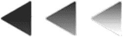
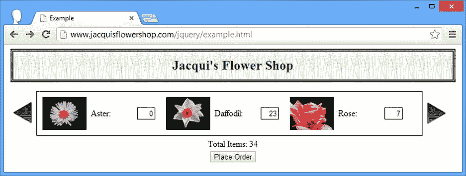

# 十一、重构示例：第一部分

在前面的章节中，我单独展示了每个功能区域:如何处理事件，如何操作 DOM(域对象模型)等等。当您组合这些特性时，jQuery 的真正威力和灵活性就会显现出来，在这一章中，我将通过重构花店示例文档来演示这种组合。

我在这一章中所做的所有修改都在`script`元素中。我没有改变示例文档的底层 HTML。与大多数 jQuery 特性一样，有许多不同的途径可以达到相同的结果。我在本章中采用的方法反映了我最喜欢的 jQuery 部分以及我倾向于考虑 DOM 的方式。你可能有不同的思维模式，喜欢不同的方法组合。这真的无关紧要，而且没有唯一正确的 jQuery 使用方法。

查看示例文档

我从一个简单的示例文档开始写这本书，一个基本的花店页面。在接下来的章节中，我使用 jQuery 从文档中选择元素，探索并重新排列它的 DOM，监听事件，并对元素应用效果。在我开始重构这个例子之前，让我们回顾一下我开始的地方。清单 11-1 显示了基本文档。

***清单 11-1*** 。基本示例文档

```js
<!DOCTYPE html>
<html>
<head>
    <title>Example</title>
    <script src="jquery-2.0.2.js" type="text/javascript"></script>
    <link rel="stylesheet" type="text/css" href="styles.css"/>
    <script type="text/javascript">
        $(document).ready(function() {
             // jQuery statements will go here
        });
    </script>
</head>
<body>
    <h1>Jacqui's Flower Shop</h1>
    <form method="post">
        <div id="oblock">
            <div class="dtable">
                <div id="row1" class="drow">
                    <div class="dcell">
                        <label for="aster">Aster:</label>
                        <input name="aster" value="0" required />
                    </div>
                    <div class="dcell">
                        <label for="daffodil">Daffodil:</label>
                        <input name="daffodil" value="0" required />
                    </div>
                    <div class="dcell">
                        <label for="rose">Rose:</label>
                        <input name="rose" value="0" required />
                    </div>
                </div>
                <div id="row2"class="drow">
                    <div class="dcell">
                        <label for="peony">Peony:</label>
                        <input name="peony" value="0" required />
                    </div>
                    <div class="dcell">
                        <label for="primula">Primula:</label>
                        <input name="primula" value="0" required />
                    </div>
                    <div class="dcell">
                        <label for="snowdrop">Snowdrop:</label>
                        <input name="snowdrop" value="0" required />
                    </div>
                </div>
            </div>
        </div>
        <div id="buttonDiv"><button type="submit">Place Order</button></div>
    </form>
</body>
</html>
```

我强调了`script`元素，因为这是你在本书中花费时间的地方。我为`ready`事件添加了无处不在的 jQuery 处理程序，但仅此而已。没有其他 JavaScript 语句。你可以在图 11-1 中看到未经修饰的文档是如何出现在浏览器中的。


图 11-1 。基本示例文档

添加额外的花卉产品

我做的第一个改变是给商店增加一些额外的花。我想这样做是为了演示如何在一个循环中创建元素。清单 11-2 显示了添加的`script`元素。

***清单 11-2*** 。向页面添加产品

```js
...
<script type="text/javascript">
    $(document).ready(function() {
        var fNames = ["Carnation", "Lily", "Orchid"];
        var fRow = $("<div id=row3 class=drow/>").appendTo("div.dtable");
        var fTemplate = $("<div class=dcell><label/><input/></div>");
        for (var i = 0; i < fNames.length; i++) {
            fTemplate.clone().appendTo(fRow).children()
                .filter("img").attr("src", fNames[i] + ".png").end()
                .filter("label").attr("for", fNames[i]).text(fNames[i]).end()
                .filter("input").attr({name: fNames[i], value: 0, required: "required"})
        }
    });
</script>
...
```

我已经定义了另外三种类型的花(`Carnation`、`Lily`和`Orchid`)，并创建了一个新的`div`元素，它被分配给了`drow`类，我将它附加到现有的`div`元素上，该元素在 CSS(级联样式表)表格布局模型中充当表格。

```js
...
var fNames = ["Carnation", "Lily", "Orchid"];
var fRow = $("<div id=row3 class=drow/>").appendTo("div.dtable");
...
```

然后我定义了一个元素的框架集；这些描述了我想要的每个产品的元素结构，但不包含任何区分一朵花和另一朵花的属性。

```js
...
var fTemplate = $("<div class=dcell><label/><input/></div>");
...
```

我使用骨骼元素作为一个简单的模板，为我想要添加的每朵花克隆它们，并使用花的名称来添加属性和值。

```js
...
for (var i = 0; i < fNames.length; i++) {
    fTemplate.clone().appendTo(fRow).children()
        .filter("img").attr("src", fNames[i] + ".png").end()
        .filter("label").attr("for", fNames[i]).text(fNames[i]).end()
        .filter("input").attr({name: fNames[i], value: 0, required: "required"})
}
...
```

我使用`filter`和`end`方法来缩小和扩大选择范围，使用`attr`方法来设置属性值。最后，我为每朵新的花填充了一组完整的元素，插入到行级的`div`元素中，然后再插入到表级的元素中。你可以在图 11-2 中看到效果。


图 11-2 。向页面添加新的花朵

本例中一个很好的 jQuery 特性是，您可以选择和导航没有附加到主文档的元素。当我克隆模板元素时，它们不是文档的一部分，但是我仍然可以使用`children`和`filter`方法来缩小选择范围。

添加旋转按钮

我将创建一个简单的旋转木马，让用户通过花集页面。首先，我需要分页的左右按钮。清单 11-3 显示了我如何将它们添加到文档中。

***清单 11-3*** 。添加转盘按钮

```js
...
<script type="text/javascript">
    $(document).ready(function() {

        var fNames = ["Carnation", "Lily", "Orchid"];
        var fRow = $("<div id=row3 class=drow/>").appendTo("div.dtable");
        var fTemplate = $("<div class=dcell><label/><input/></div>");
        for (var i = 0; i < fNames.length; i++) {
            fTemplate.clone().appendTo(fRow).children()
                .filter("img").attr("src", fNames[i] + ".png").end()
                .filter("label").attr("for", fNames[i]).text(fNames[i]).end()
                .filter("input").attr({name: fNames[i], value: 0, required: "required"})
        }

        $("<a id=left></a><a id=right></a>").prependTo("form")
            .css({
                "background-image": "url(leftarrows.png)",
                "float": "left",
                "margin-top": "15px",
                display: "block", width: 50, height: 50
            }).click(handleArrowPress).hover(handleArrowMouse)

        $("#right").css("background-image", "url(rightarrows.png)").appendTo("form");

        $("#oblock").css({float: "left", display: "inline", border: "thin black solid"});
        $("form").css({"margin-left": "auto", "margin-right": "auto", width: 885});

        function handleArrowMouse(e) {
        }

        function handleArrowPress(e) {
        }
    });
</script>
...
```

我定义了一对`a`元素，将它们添加到`form`元素的前面，并使用`css`方法为许多不同的属性应用值。

```js
...
$("<a id=left></a><a id=right></a>").prependTo("form")
    .css({
        "background-image": "url(leftarrows.png)",
        "float": "left",
        "margin-top": "15px",
        display: "block",width: 50, height: 50
}).click(handleArrowPress).hover(handleArrowMouse)
...
```

关键属性是`background-image`，我设置为`leftarrows.png`。你可以在图 11-3 中看到这个图像。



图 11-3 。leftarrows.png 形象

该图像在组合图像中包含三个不同的箭头。每个单独的箭头都是 50 像素宽，通过将`width`和`height`属性设置为`50`，我确保在任何时候都只有一个单独的箭头显示。我使用`click`和`hover`方法来定义`click`、`mouseenter`和`mouseexit`事件的处理函数。

```js
...
$("<a id=left></a><a id=right></a>").prependTo("form")
    .css({
        "background-image": "url(leftarrows.png)",
        "float": "left",
        "margin-top": "15px",
        display: "block", width: 50, height: 50
}).click(handleArrowPress).hover(handleArrowMouse)
...
```

`handleArrowPress`和`handleArrowMouse`函数是空的，但是我将在稍后填充它们。此时，我有两个`a`元素，它们都显示向左的箭头，并且在`form`元素中彼此相邻。我一起创建并格式化了`a`元素，因为大部分配置都是通用的，但是现在是时候移动并定制正确的按钮了，我的做法如下:

```js
...
$("#right").css("background-image", "url(rightarrows.png)").appendTo("form");
...
```

我使用`append`方法将元素移动到`form`元素的末尾，并使用`css`方法将`background-image`属性更改为使用`rightarrows.png`。你可以在图 11-4 中看到这个图像。


图 11-4 。rightarrows.png 形象

像这样使用组合图像是一种常见的技术，因为它避免了浏览器向服务器发出三个不同的请求来获取三个密切相关的图像的开销。当我很快填充`handleArrowMouse`函数时，您将看到如何使用这种图像。你可以在图 11-5 中看到页面的样子。


图 11-5 。示例文档的中间状态

处理提交按钮

从图 11-5 可以看出，我的例子处于中间状态。新的特性出现了，但是我还没有恰当地处理一些现有的元素。其中最重要的是提交表单的 Place Order 按钮。清单 11-4 显示了脚本中处理这个元素的附加内容(并添加了一个新特性)。

***清单 11-4*** 。处理提交按钮的

```js
...
<script type="text/javascript">
    $(document).ready(function() {

        var fNames = ["Carnation", "Lily", "Orchid"];
        var fRow = $("<div id=row3 class=drow/>").appendTo("div.dtable");
        var fTemplate = $("<div class=dcell><label/><input/></div>");
        for (var i = 0; i < fNames.length; i++) {
            fTemplate.clone().appendTo(fRow).children()
                .filter("img").attr("src", fNames[i] + ".png").end()
                .filter("label").attr("for", fNames[i]).text(fNames[i]).end()
                .filter("input").attr({name: fNames[i], value: 0, required: "required"})
        }

        $("<a id=left></a><a id=right></a>").prependTo("form")
            .css({
                "background-image": "url(leftarrows.png)",
                "float": "left",
                "margin-top": "15px",
                display: "block", width: 50, height: 50
            }).click(handleArrowPress).hover(handleArrowMouse)

        $("#right").css("background-image", "url(rightarrows.png)").appendTo("form");

        $("h1").css({"min-width": "0", width: "95%",});
        $("#row2, #row3").hide();
        $("#oblock").css({float: "left", display: "inline", border: "thin black solid"});
        $("form").css({"margin-left": "auto", "margin-right": "auto", width: 885});

        var total = $("#buttonDiv")
            .prepend("<div>Total Items: <span id=total>0</span></div>")
            .css({clear: "both", padding: "5px"});
        $("<div id=bbox />").appendTo("body").append(total).css("clear: left");

        function handleArrowMouse(e) {
        }

        function handleArrowPress(e) {

        }
    });
</script>
...
```

为了适应轮播按钮引起的布局变化，我将包含`button`元素的`div`(它有一个`buttonDiv`的`id`)移动到一个新的`div`元素中，这个元素又被追加到了`body`元素中。这会将按钮移动到返回页面底部的位置。我还添加了一个`div`和一个`span`元素。这些将用于显示用户选择的产品总数。

```js
...
var total = $("#buttonDiv")
    .prepend("<div>Total Items: <span id=total>0</span></div>")
    .css({clear: "both", padding: "5px"});
$("<div id=bbox />").appendTo("body").append(total).css("clear: left");
...
```

这一部分的下一个变化是隐藏两行产品。这样，当用户单击轮播按钮时，您就可以向用户展示它们。

```js
...
$("#row2, #row3").hide();
...
```

我还调整了`h1`元素的样式，以匹配修改后的布局样式。

```js
...
$("h1").css({"min-width": "0", width: "95%",});
...
```

你可以在图 11-6 中看到这些变化的效果。


图 11-6 。处理提交按钮和整理 CSS

实现轮播事件处理函数

下一步是实现处理转盘按钮事件的函数。我将处理由`handleArrowMouse`函数处理的`mouseenter`和`mouseexit`事件。清单 11-5 显示了这个函数的实现。

***清单 11-5*** 。处理箭头按钮鼠标事件

```js
...
function handleArrowMouse(e) {
   var propValue = e.type == "mouseenter" ? "-50px 0px" : "0px 0px";
   $(this).css("background-position", propValue);
}
...
```

处理组合图像的技巧是使用`background-position`属性来移动图像，这样只有我想要的部分可见。虽然在我的箭头组中有三个图像，但我将只使用其中的两个。正常情况下会显示最暗的图像，当鼠标悬停在元素上时会显示中间的图像。你可以用剩下的箭头来表示一个按钮被点击或者被禁用，但是我想保持简单。你可以在图 11-7 中看到图像代表的两种状态。


图 11-7 。箭头按钮的两种状态

`handleArrowPress`函数负责创建旋转木马效果，允许用户翻阅一排排鲜花。清单 11-6 显示了这个函数的实现。

***清单 11-6*** 。实现 handleArrowPress 功能

```js
...
function handleArrowPress(e) {
    var elemSequence = ["row1", "row2", "row3"];
    var visibleRow = $("div.drow:visible");
    var visibleRowIndex = jQuery.inArray(visibleRow.attr("id"), elemSequence);

    var targetRowIndex;
    if (e.target.id == "left") {
        targetRowIndex = visibleRowIndex - 1;
        if (targetRowIndex < 0) {targetRowIndex = elemSequence.length -1};
    } else {
        targetRowIndex = (visibleRowIndex + 1) % elemSequence.length;
    }

    visibleRow.fadeOut("fast", function() {
        $("#" + elemSequence[targetRowIndex]).fadeIn("fast")});
}
...
```

该函数中的前三条语句设置了您需要的基本数据。

```js
...
var elemSequence = ["row1", "row2", "row3"];
var visibleRow = $("div.drow:visible");
var visibleRowIndex = jQuery.inArray(visibleRow.attr("id"), elemSequence);
...
```

第一条语句为行元素定义了一组`id`属性值。第二条语句使用 jQuery 来获取可见行，然后我使用它来确定行`id`值数组中可见行的索引。(我使用了`inArray`效用方法，我在第三十四章中解释过。)所以，我知道哪一行是可见的，以及我在行序列中的位置。我的下一步是找出下一个将要显示的行的索引。

```js
...
var targetRowIndex;
if (e.target.id == "left") {
    targetRowIndex = visibleRowIndex - 1;
    if (targetRowIndex < 0) {targetRowIndex = elemSequence.length -1};
} else {
    targetRowIndex = (visibleRowIndex + 1) % elemSequence.length;
}
...
```

在几乎任何其他编程语言中，我都可以使用模操作符来计算出要显示的下一行的索引，但是模数学的 JavaScript 实现不能正确地支持负值。所以，如果用户点击左键，我手动检查数组边界；如果用户点击了右边的按钮，我就使用`%`操作符。一旦我确定了当前可见的元素和接下来要显示的元素，我就使用 jQuery effects 来制作从一个元素到另一个元素的动画。

```js
...
visibleRow.fadeOut("fast", function() {
    $("#" + elemSequence[targetRowIndex]).fadeIn("fast")});
...
```

我使用了`fadeOut`和`fadeIn`方法，因为它们很适合我的 CSS 表格样式布局。我在第一个效果中使用回调来触发第二个效果，并使用`fast`时间跨度来执行这两个效果。页面的静态布局没有变化，但是箭头按钮现在将用户从一行花带到下一行花，如图图 11-8 所示。


图 11-8 。提供产品行的传送带

合计产品选择

最后一个更改是连接项目 total，以便在各个输入字段中选择的鲜花总数显示在产品传送带下。清单 11-7 显示了对脚本的修改。

***清单 11-7*** 。为产品总计布线

```js
...
<script type="text/javascript">
    $(document).ready(function() {

        var fNames = ["Carnation", "Lily", "Orchid"];
        var fRow = $("<div id=row3 class=drow/>").appendTo("div.dtable");
        var fTemplate = $("<div class=dcell><label/><input/></div>");
        for (var i = 0; i < fNames.length; i++) {
            fTemplate.clone().appendTo(fRow).children()
                .filter("img").attr("src", fNames[i] + ".png").end()
                .filter("label").attr("for", fNames[i]).text(fNames[i]).end()
                .filter("input").attr({name: fNames[i], value: 0, required: "required"})
        }

        $("<a id=left></a><a id=right></a>").prependTo("form")
            .css({
                "background-image": "url(leftarrows.png)",
                "float": "left",
                "margin-top": "15px",
                display: "block", width: 50, height: 50
            }).click(handleArrowPress).hover(handleArrowMouse)

        $("#right").css("background-image", "url(rightarrows.png)").appendTo("form");

        $("h1").css({"min-width": "0", width: "95%",});
        $("#row2, #row3").hide();
        $("#oblock").css({float: "left", display: "inline", border: "thin black solid"});
        $("form").css({"margin-left": "auto", "margin-right": "auto", width: 885});

        var total = $("#buttonDiv")
            .prepend("<div>Total Items: <span id=total>0</span></div>")
            .css({clear: "both", padding: "5px"});
        $("<div id=bbox />").appendTo("body").append(total).css("clear: left");

        $("input").change(function(e) {
            var total = 0;
            $("input").each(function(index, elem) {
                total += Number($(elem).val());
            });
            $("#total").text(total);
        });

        function handleArrowMouse(e) {
           var propValue = e.type == "mouseenter" ? "-50px 0px" : "0px 0px";
           $(this).css("background-position", propValue);
        }

        function handleArrowPress(e) {
            var elemSequence = ["row1", "row2", "row3"];

            var visibleRow = $("div.drow:visible");
            var visibleRowIndex = jQuery.inArray(visibleRow.attr("id"), elemSequence);

            var targetRowIndex;

            if (e.target.id == "left") {
                targetRowIndex = visibleRowIndex - 1;
                if (targetRowIndex < 0) {targetRowIndex = elemSequence.length -1};
            } else {
                targetRowIndex = (visibleRowIndex + 1) % elemSequence.length;
            }
            visibleRow.fadeOut("fast", function() {
                $("#" + elemSequence[targetRowIndex]).fadeIn("fast")});
        }

    });
</script>
...
```

在这次添加中，我选择了文档中的`input`元素，并注册了一个处理函数，该函数从每个元素中获取值，对其求和，并将其设置为我之前添加的`span`元素的内容。你可以在图 11-9 中看到效果。



图 11-9 。显示产品选择总数

总计显示了所有`input`元素的总和，而不仅仅是当前可见的元素(尽管使用其他方法也很简单)。

禁用 JavaScript

我对示例文档做了一些彻底的修改，但都是用 jQuery 做的。这意味着我已经有效地创建了两层文档，一层用于支持 JavaScript 的浏览器，一层用于不支持 JavaScript 的浏览器，图 11-10 显示了当你禁用 JavaScript 并查看示例文档时会发生什么。


图 11-10 。禁用 JavaScript 并查看示例文档

我又回到了起点。通过一点规划和预先考虑，我可以为非 JavaScript 客户机提供一组功能，让它们仍然可以与您的页面或应用进行交互。这通常是一个好主意；有许多大公司集中管理 IT(信息技术),并禁用 JavaScript 作为安全预防措施。(嗯，算是吧。在为这样的组织工作多年后，我开始相信这些政策实际上并没有阻止员工使用 JavaScript 他们只是创造了寻找漏洞和变通办法的动机。)

摘要

在本章中，我向您展示了如何结合前几章的技术来重构示例文档。我以编程方式添加了新内容，创建了一个简单的产品转盘，并创建了一个显示所选项目的总数的汇总。在这个过程中，我调整了 DOM 和 CSS 以适应这些变化，所有这些都是为了让非 JavaScript 浏览器退回到仍然有用的文档。

在本书的下一部分，我将继续构建这个例子，引入更多的 jQuery 特性来充实功能。在大多数情况下，我会将这些应用到原始的示例文档中，以便依次关注每个特性，但是在第十六章中，我将再次重构示例以引入更多的特性。