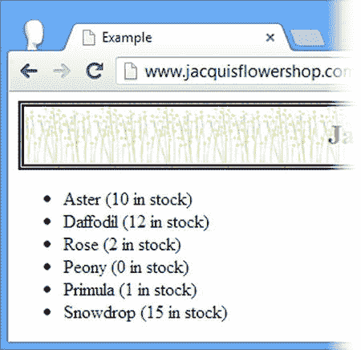

# 十二、使用数据模板

在本书的前一版本中，我使用了 *jQuery Templates* 插件介绍了数据模板。这个插件的历史相当奇怪。微软和 jQuery 团队宣布，微软开发的三个插件已经被接受为“官方”插件，这是任何其他插件都没有的地位。过了一会儿，jQuery 团队宣布这些插件已被废弃，官方状态已被移除，并计划用其他功能替换它们。模板插件的替换将作为 jQuery UI 的一部分创建(我将在本书的第四部分描述)。

那是不久前的事了，新的官方 jQuery 模板引擎还没有完成，它被命名为 *jsViews* 。有一个测试版本，但它有粗糙的边缘，仍然不稳定。我不是一个粉丝，但是你可以在`https://github.com/BorisMoore/jsviews`了解更多信息并获得该库的最新测试版。

与此同时，我在上一版本中使用的不推荐使用的 jQuery Templates 包并没有很好地老化。不久前，我在自己的项目中停止使用它，选择了一个叫做`Handlebars`的替代品，它可以从`http://handlebarsjs.com`获得。它没有附带任何 jQuery 集成——事实上，它根本不是一个 jQuery 插件——但是很容易通过 jQuery 语法编写少量代码来支持模板，我将向您展示这是如何实现的。

手柄——就像之前的 jQuery 模板插件一样——支持*小胡子模板*，它们被表示为包含特殊*小胡子指令*的 HTML。我解释了这些是什么，但是术语*小胡子*的使用来自于这样一个事实，即它们是用括号字符(`{`和`}`)来表示的，看起来有点像侧面的小胡子。表 12-1 提供了本章的总结。

[表 12-1](#_Tab1) 。章节总结

| 问题 | 解决办法 | 列表 |
| --- | --- | --- |
| 使用模板生成元素。 | 安装 Handlebars 库，创建一个 jQuery 插件，并使用`template`方法。 | 1–6 |
| 将从模板生成的元素分配给不同的父元素。 | 或者拆分源数据并应用模板两次，或者使用 slice filter 和 end 方法分割生成的元素。 | 7–10 |
| 如果定义了数据属性并且不为空，则更改模板的输出。 | 使用内置的`#if`或`#unless`模板助手。 | 11, 12 |
| 枚举数组的内容或对象的属性。 | 使用`#each`模板助手。 | 13, 14 |
| 引用模板中数据对象的另一部分。 | 使用`#with`模板助手，或者使用`../`路径。 | 15–17 |
| 创建自定义模板助手。 | 使用`Handlebars.registerHelper`方法注册助手的名称和返回模板内容的助手函数。 | 18–22 |
| 在模板帮助函数中接收可选参数。 | 使用`options.hash`属性。 | 23, 24 |
| 定义可以在自定义模板帮助器的块中使用的特殊属性。 | 使用`options.data`属性。 | 25, 26 |

了解模板解决的问题

数据模板解决了一个特定的问题:它们允许您以编程方式从 JavaScript 对象的属性和值生成元素。这是你可以用其他方式做的事情，事实上，我在第 11 章中做了类似的事情，我在示例文档中创建了一些元素来表示额外的花。[清单 12-1](#list1) 显示了该章的相关陈述。

***[清单 12-1](#_list1)*** 。以编程方式创建元素

```js
...
<script type="text/javascript">
    $(document).ready(function() {
        var fNames = ["Carnation", "Lily", "Orchid"];
        var fRow = $("<div id=row3 class=drow/>").appendTo("div.dtable");
        var fTemplate = $("<div class=dcell><label/><input/></div>");
        for (var i = 0; i < fNames.length; i++) {
            fTemplate.clone().appendTo(fRow).children()
                .filter("img").attr("src", fNames[i] + ".png").end()
                .filter("label").attr("for", fNames[i]).text(fNames[i]).end()
                .filter("input").attr({name: fNames[i], value: 0, required: "required"})
        }
    });
</script>
...
```

清单中的语句很难阅读，对于更复杂的元素，难度会急剧增加。正如我将解释的那样，数据模板很方便地将重点放回到 HTML 上，并最大限度地减少了从数据生成元素所需的代码量。

从更广的角度来看，将数据集成到文档中是一个需要解决的常见问题。在我的项目中，它通过两种情况出现。第一个原因是因为我正在使用一些预先存在的系统，这些系统包含驱动我的 web 应用的数据。我*可以*获得数据，并在服务器上将其集成到文档中——有一些很好的技术可以做到这一点——但这意味着我的服务器群要花很多时间做我可以让浏览器为我做的工作。如果您曾经构建和运行过一个大容量的 web 应用，您就会知道成本是巨大的，并且任何减少所需处理量的机会都会被认真考虑。

我需要将数据集成到文档中的第二个原因是，我的 web 应用通过 Ajax 获取数据来响应用户操作。我将在第 14 章和第 15 章中全面解释 jQuery 对 Ajax 的支持，但简单来说，你可以从服务器获取并显示数据，而无需在浏览器中重新加载整个页面。这是一种广泛使用的强大技术，数据模板与它配合得很好。

设置模板库

在使用模板之前，您必须下载模板库并在文档中链接到它。您可以从`http://handlebarsjs.com`下载这个库，我将 JavaScript 代码保存到一个名为`handlebars.js`的文件中，与 jQuery JavaScript 文件放在一起。

handlebars 库与 jQuery 没有任何集成，但是创建一个允许我使用 jQuery 语法生成模板的 jQuery 插件很简单。我创建了一个名为`handlebars-jquery.js`的文件，并用它来定义清单 12-2 中的代码。

***[清单 12-2](#_list2)*** 。改编 handlerbars.js 以使用 handler bars-jQuery . js 文件中的 jQuery 语法

```js
(function ($) {
    var compiled = {};
    $.fn.template = function (data) {
        var template = $.trim($(this).first().html());
        if (compiled[template] == undefined) {
            compiled[template] = Handlebars.compile(template);
        }
        return $(compiled[template](data));
    };
})(jQuery);
```

创建自定义 JQUERY 插件

正如清单 12-2 所示，为 jQuery 创建插件很简单，尤其是如果你只是在一个已有库的基础上创建一个包装器。我没有在本书中描述定制插件是如何工作的，因为这是很少有开发者需要做的事情，但是你可以在`http://learn.jquery.com/plugins`获得完整的细节。

这段代码定义了一个名为`template`的方法，可以在 jQuery 对象上调用该方法，使用 handlebars 将模板应用于数据对象。结果是一个 jQuery 对象，包含从模板生成的 HTML 元素。为了生成模板，我需要为示例文档中的`handlebars.js`和`handlebars-jquery.js`文件添加`script`元素，如[清单 12-3](#list3) 所示。

***[清单 12-3](#_list3)*** 。将库添加到示例文档中

```js
<!DOCTYPE html>
<html>
<head>
    <title>Example</title>
    <script src="jquery-2.0.2.js" type="text/javascript"></script>
    <script src="handlebars.js" type="text/javascript"></script>
    <script src="handlebars-jquery.js" type="text/javascript"></script>
    <link rel="stylesheet" type="text/css" href="styles.css"/>
    <script type="text/javascript">
        $(document).ready(function () {

            // ...
*example code will go here*...

        });
    </script>
</head>
<body>
    <h1>Jacqui's Flower Shop</h1>
    <form method="post">
        <div id="oblock">
            <div class="dtable">
                <div id="row1" class="drow"></div>
                <div id="row2"class="drow"></div>
            </div>
        </div>
        <div id="buttonDiv"><button type="submit">Place Order</button></div>
    </form>
</body>
</html>
```

我将使用这个清单作为本章的示例文档。除了添加模板库和我的简单插件，您会注意到我已经删除了描述单朵花的元素——我这样做是为了探索使用模板添加它们的不同技术。你可以在[图 12-1](#Fig1) 中看到这个初始的 HTML 文档是如何出现在浏览器中的。


[图 12-1](#_Fig1) 。起始示例文档

第一数据模板示例

开始学习数据模板的最好方法是直接进入。清单 12-4 展示了基本的模板特性。我在这个清单中包含了完整的 HTML 文档，因为模板是用一个`script`元素表示的，但是我将只展示后续清单中需要的更改。

***[清单 12-4](#_list4)*** 。第一数据模板示例

```js
<!DOCTYPE html>
<html>
<head>
    <title>Example</title>
    <script src="jquery-2.0.2.js" type="text/javascript"></script>
    <script src="handlebars.js" type="text/javascript"></script>
    <script src="handlebars-jquery.js" type="text/javascript"></script>
    <link rel="stylesheet" type="text/css" href="styles.css"/>
    <script id="flowerTmpl" type="text/x-handlebars-template">
        {{#each flowers}}
            <div class="dcell">
            
            <label for="{{product}}">{{name}}:</label>
            <input name="{{product}}" data-price="{{price}}" data-stock="{{stock}}"
                value="0" required />
        </div>
        {{/each}}
    </script>
    <script type="text/javascript">
        $(document).ready(function () {
            var data = {
                flowers: [
                { name: "Aster", product: "aster", stock: "10", price: 2.99 },
                { name: "Daffodil", product: "daffodil", stock: "12", price: 1.99 },
                { name: "Rose", product: "rose", stock: "2", price: 4.99 },
                { name: "Peony", product: "peony", stock: "0", price: 1.50 },
                { name: "Primula", product: "primula", stock: "1", price: 3.12 },
                { name: "Snowdrop", product: "snowdrop", stock: "15", price: 0.99 }]
            };
            var template = $("#flowerTmpl").template(data).appendTo("#row1");
        });
    </script>
</head>
<body>
    <h1>Jacqui's Flower Shop</h1>
    <form method="post">
        <div id="oblock">
            <div class="dtable">
                <div id="row1" class="drow"></div>
                <div id="row2"class="drow"></div>
            </div>
        </div>
        <div id="buttonDiv"><button type="submit">Place Order</button></div>
    </form>
</body>
</html>
```

在接下来的小节中，我将分解这个例子并解释每一部分。

 **提示**当数据是文档的一部分时，称为*内联数据*。另一种方法是*远程数据*，这种方法可以从独立于文档的服务器上获取数据。我将在本章后面演示远程数据，但它涉及到了 Ajax 的 jQuery 支持，这是第 14 章和第 15 章的主题。

定义数据

该示例的起点是数据，在本例中是一个具有单个属性的对象，该属性被设置为一个对象数组。每个对象描述一个花卉产品，清单 12-5 显示了示例 HTML 文档中的相关语句。

***[清单 12-5](#_list5)*** 。定义花卉数据

```js
...
var data = {
    flowers: [
        { name: "Aster", product: "aster", stock: "10", price: 2.99 },
        { name: "Daffodil", product: "daffodil", stock: "12", price: 1.99 },
        { name: "Rose", product: "rose", stock: "2", price: 4.99 },
        { name: "Peony", product: "peony", stock: "0", price: 1.50 },
        { name: "Primula", product: "primula", stock: "1", price: 3.12 },
        { name: "Snowdrop", product: "snowdrop", stock: "15", price: 0.99 }]
};
...
```

手柄模板作用于对象和属性，这就是为什么我必须在 flower 对象数组周围有一个对象包装器。对于这个示例，数组包含六个对象，每个对象都有一组描述花店产品的属性:显示名称、产品名称、库存水平和价格。

定义模板

正如您所想象的，数据模板库的核心是*数据模板*。这是一组包含占位符的 HTML 元素，这些占位符对应于数据对象的各个方面。[清单 12-6](#list6) 显示了这个例子的模板。

***[清单 12-6](#_list6)*** 。定义数据模板

```js
...
<script id="flowerTmpl" type="text/x-handlebars-template">
    {{#flowers}}
    <div class="dcell">
        
        <label for="{{product}}">{{name}}:</label>
        <input name="{{product}}" data-price="{{price}}" data-stock="{{stock}}"
            value="0" required />
    </div>
    {{/flowers}}
</script>
...
```

关于模板要注意的第一点是，它包含在具有`text/x-handlebars-template`的`type`属性的`script`元素中。这是为了阻止浏览器解释模板的内容。第二点需要注意的是，我已经使用`id`属性为我的脚本元素指定了一个名称:在这个例子中，模板名为`flowerTmpl`。这个名称很重要，因为我将需要它来将模板应用于数据。

模板的内容将应用于数据数组中的对象，以便为每个对象生成一组 HTML 元素。您可以看到模板的结构与我在前几章中用于花卉产品的元素集相对应。

当然，关键的区别是我在清单中强调的部分。这些是*双小胡子指令*(之所以这么叫是因为用来表示它们的括号字符看起来像小胡子——因此有了术语*小胡子模板*)。在这个例子中有两种类型的指令(我将在本章后面介绍更多的类型)。

第一种指令是一个*部分*，它定义了一个模板区域，该区域将为数据对象中具有相同名称的每个属性值生成。Section 指令以一个`#`字符开始(`{{#flowers}}`，在本例中)，以一个`/`字符结束(`{{/flowers}}`)。我使用的 section 指令将为分配给`flowers`属性的每个对象生成它所包含的模板部分。

另一种类型的指令是一个*变量*，它将被数据对象中相应的属性值替换。例如，当模板库遇到`{{product}}`变量时，它用正在处理的对象的`product`属性的值替换它，这意味着模板的一部分是这样的:

```js
...

...
```

转化成了这样:

```js
...

...
```

应用模板

我使用清单 12-2 中的 jQuery 插件中定义的`template`方法将模板应用于数据。下面是示例 HTML 文档中对`template`方法的调用:

```js
...
var template = $("#flowerTmpl").template(data).appendTo("#row1");
...
```

我使用 jQuery `$`函数选择包含模板的`script`元素，然后调用结果`jQuery`对象上的`template`方法，传入我想要处理的数据。

`template`方法返回一个标准的`jQuery`对象，其中包含从模板中产生的元素。在这种情况下，我得到了一组`div`元素，每个元素包含一个`img`、`label`和`input`元素，它们是为我的数据数组中的一个对象定制的。我使用`appendTo`方法将整个集合作为子元素插入到`row1`元素中。你可以在[图 12-2](#Fig2) 中看到结果。


[图 12-2](#_Fig2) 。使用数据模板

调整结果

我没有得到我想要的结果——所有的花都在一行，而不是像前几章那样分成两行。但是，因为我正在处理一个 jQuery 对象，所以我可以使用第 2 部分中描述的技术来分割元素。[清单 12-7](#list7) 展示了如何通过对`template`方法返回的`jQuery`对象进行操作来做到这一点。

***[清单 12-7](#_list7)*** 。处理来自模板的结果

```js
...
<script type="text/javascript">
    $(document).ready(function () {
        var data = {
            flowers: [
                { name: "Aster", product: "aster", stock: "10", price: 2.99 },
                { name: "Daffodil", product: "daffodil", stock: "12", price: 1.99 },
                { name: "Rose", product: "rose", stock: "2", price: 4.99 },
                { name: "Peony", product: "peony", stock: "0", price: 1.50 },
                { name: "Primula", product: "primula", stock: "1", price: 3.12 },
                { name: "Snowdrop", product: "snowdrop", stock: "15", price: 0.99 }]
        };

        $("#flowerTmpl").template(data)
            .slice(0, 3).appendTo("#row1").end().end().slice(3).appendTo("#row2")
    });
</script>
...
```

在这个例子中，我使用`slice`和`end`方法来缩小和扩大选择，使用`appendTo`方法将从模板生成的元素子集添加到不同的行。

请注意，我必须连续调用两次`end`方法来消除由`slide`和`appendTo`方法引起的收缩。你可以在[图 12-3](#Fig3) 中看到效果——我更接近了，但是我仍然没有得到我想要的结果。


[图 12-3](#_Fig3) 。试图调整从数据生成的 HTML 的布局

问题是 Handlebars 在我的模板内容被拆分成多行的地方向它生成的 HTML 添加了文本节点——由于我对`slice`方法的使用适用于模板生成的所有元素(包括文本节点),所以我在错误的地方拆分了内容。

有几种方法可以解决这个问题。第一种方法是调整模板，使所有的内容都在一行上——但是我不喜欢这种方法，我更喜欢让模板尽可能的易读。

另一种方法是调整传递给`slice`方法的索引，以考虑文本节点——但我也不喜欢这样，因为不是所有的文本编辑器都以创建文本节点的方式表示新行，这意味着用不同的编辑器编辑 HTML 文件会改变 JavaScript 代码的行为，这远非理想。

我的首选方法是在将模板添加到 DOM 之前，使用 jQuery 从模板生成的 HTML 中删除文本节点。不幸的是，jQuery 没有包含一个有用的方法来完成这个任务，所以最好的方法是使用带有`*`选择器的`filter`方法，它匹配所有的 HTML 标签类型，但是不包括文本节点。您可以在清单 12-8 的[中看到我的 jQuery 中添加了 filter 方法。](#list8)

***[清单 12-8](#_list8)*** 。使用 filter 方法删除文本节点

```js
...
$("#flowerTmpl").template(data).filter("*")
    .slice(0, 3).appendTo("#row1").end().end().slice(3).appendTo("#row2")
...
```

你可以在[图 12-4](#Fig4) 中看到结果:花被正确地分成两行。


[图 12-4](#_Fig4) 。使用 filter 方法删除文本节点

我仍然不满意我处理模板生成的 HTML 的方式。我通常喜欢使用`end`方法来创建单语句操作，但是我发现`end().end()`序列令人讨厌。相反，我通常会将这些步骤分解成单独的操作，如[清单 12-9](#list9) 所示，它产生的结果与[清单 12-8](#list8) 相同，但是更容易阅读。

***[清单 12-9](#_list9)*** 。使用多条语句拆分元素

```js
...
var templateHtml = $("#flowerTmpl").template(data).filter("*");
templateHtml.slice(0, 3).appendTo("#row1");
templateHtml.slice(3).appendTo("#row2");
...
```

调整输入

另一种方法是调整传递给`template`方法的数据。清单 12-10 展示了如何做到这一点。

***[清单 12-10](#_list10)*** 。使用数据调整模板的输出

```js
...
<script type="text/javascript">
    $(document).ready(function () {
        var data = {
            flowers: [
            { name: "Aster", product: "aster", stock: "10", price: 2.99 },
            { name: "Daffodil", product: "daffodil", stock: "12", price: 1.99 },
            { name: "Rose", product: "rose", stock: "2", price: 4.99 },
            { name: "Peony", product: "peony", stock: "0", price: 1.50 },
            { name: "Primula", product: "primula", stock: "1", price: 3.12 },
            { name: "Snowdrop", product: "snowdrop", stock: "15", price: 0.99 }]
        };

        var tElem = $("#flowerTmpl");
        tElem.template({ flowers: data.flowers.slice(0, 3) }).appendTo("#row1");
        tElem.template({ flowers: data.flowers.slice(3) }).appendTo("#row2");
    });
</script>
...
```

在这个脚本中，我通过两次使用模板来解决将花分配给行的问题——每行一次。我使用了`split`方法，这样我每次都可以向模板提供一系列数据对象。手法不同，但结果是一样的，如图[图 12-4](#Fig4) 。请注意，我必须注意保留我传递给`template`方法的对象的形状，以便它匹配我的节声明——我必须确保该对象有一个名为`flowers`的属性，该属性被设置为我要处理的数据对象的数组。

使用模板逻辑

区分各种 JavaScript 模板引擎的一种方法是查看模板的输出如何根据不同的数据值而变化。

一个极端是*无逻辑模板* ，它不包含任何逻辑，改变模板的输出意味着在使用模板引擎之前仔细准备数据。另一个极端是*全逻辑模板* ，这就像有一个简单的编程语言专用于定义和执行模板，内置对条件语句、循环、数组处理和管理数据集合的支持。

对于模板中应该包含多少逻辑，人们意见不一，整个话题都是有争议的。我喜欢处于中间的某个位置——我喜欢能够在我的模板中使用逻辑，但是我希望保持简单，并且不需要在我的 HTML 文档中添加另一种语言。我为这一章选择 Handlebars 库的原因之一是，它允许你在一个模板中使用尽可能少或尽可能多的逻辑——而且，正如你将在这一章的后面看到的，它使定义定制逻辑来解决特定问题变得容易。手柄库包含一些内置的*助手* ，在[表 12-2](#Tab2) 中描述，它们是简单的逻辑操作符，可以用来根据数据值改变模板的输出。

[表 12-2](#_Tab2) 。内置车把助手

| 助手 | 描述 |
| --- | --- |
| `#if` | 一个`if` / `then` / `else`条件，如果指定的属性存在并且不是`null`，则计算结果为`true`。 |
| `#unless` | `#if`辅助者的逆；如果指定的属性*不存在*或者是`null`，则计算结果为`true`。 |
| `#each` | 迭代对象数组或对象的属性。 |
| `#with` | 为模板的一部分设置上下文。 |

创建条件内容

为了演示如何在 Handlebars 模板中使用逻辑，我将根据数据对象的`flowers`数组中每个对象的`stock`属性的值来设置模板中`input`元素的`value`属性。我的目标是当相应的股票属性大于零时，将`value`设置为`1`。通过应用清单 12-11 中的`#if`助手，你可以看到我是如何做到这一点的。

***[清单 12-11](#_list11)*** 。使用模板逻辑改变模板的输出

```js
...
<script id="flowerTmpl" type="text/x-handlebars-template">
    {{#flowers}}
    <div class="dcell">
        
        <label for="{{product}}">{{name}}:</label>
        <input name="{{product}}" data-price="{{price}}" data-stock="{{stock}}"
            value="{{#if stock}}1{{else}}0{{/if}}"required />
    </div>
    {{/flowers}}
</script>
<script type="text/javascript">
    $(document).ready(function () {
        var data = {
            flowers: [
            { name: "Aster", product: "aster", stock: "10", price: 2.99 },
            { name: "Daffodil", product: "daffodil", stock: "12", price: 1.99 },
            { name: "Rose", product: "rose", stock: "2", price: 4.99 },
            { name: "Peony", product: "peony", stock: "0", price: 1.50 },
            { name: "Primula", product: "primula", stock: "1", price: 3.12 },
            { name: "Snowdrop", product: "snowdrop", stock: "15", price: 0.99 }]
        };
        for (var i = 0; i < data.flowers.length; i++) {
            if (data.flowers[i].stock == 0) {
                data.flowers[i].stock = null;
            }
        }
        var tElem = $("#flowerTmpl");
        tElem.template({ flowers: data.flowers.slice(0, 3) }).appendTo("#row1");
        tElem.template({ flowers: data.flowers.slice(3) }).appendTo("#row2");
    });
</script>
...
```

助手的每一部分都用双胡子表示:第一部分由`#if`组成，后面是我想要检查的属性，在本例中是`stock`。如果由`#flowers`段指令处理的当前对象定义了一个`stock`属性*并且*该属性不是`null`，那么这将被评估为`true`。如果是这种情况，模板引擎将把条件的第一部分之后的值插入到 HTML 中，在本例中是`1`。

可选的`else`部分的工作方式就像在 JavaScript 中一样，它允许我提供一个替代值，如果当前对象没有`stock`属性*或*(如果有`stock`属性并且是`null`)，那么这个替代值将被使用。在这种情况下，模板引擎会将`0`插入到模板生成的 HTML 中。最后一段是`/if`，表示条件块的结束。

`#if`助手背后的逻辑是基本的，根据属性是否存在和是否被定义返回`true`,迫使我在将数据传递给`template`方法之前处理数据。我使用一个 JavaScript `for`循环来枚举 flower 对象，并设置任何值为`0`到`null`的`stock`属性。结果是，从模板生成的所有`input`元素的值都是`1`，除了`Peony`的元素，如图 12-5 所示。


[图 12-5](#_Fig5) 。使用模板中的逻辑来改变生成的 HTML

 **提示**我不喜欢处理数据来适应模板引擎的限制，在本章的后面，我将向您展示如何创建不需要数据处理的定制逻辑。

`#unless`辅助对象的工作方式与`#if`辅助对象相同，但是如果它所应用的属性不存在或者为空，那么它将被评估为`true`。在[清单 12-12](#list12) 中，您可以看到我是如何在没有可选的`else`指令的情况下，将`#if`和`#unless`助手一起应用于设置模板中`input`元素的`value`属性的。

***[清单 12-12](#_list12)*** 。在模板中应用#if 和#unless 助手

```js
...
<script id="flowerTmpl" type="text/x-handlebars-template">
    {{#flowers}}
    <div class="dcell">
        
        <label for="{{product}}">{{name}}:</label>
        <input name="{{product}}" data-price="{{price}}" data-stock="{{stock}}"
            value="{{#if stock}}1{{/if}}{{#unless stock}}0{{/unless}}"required />
    </div>
    {{/flowers}}
</script>
...
```

`#if`和`#unless`助手彼此完全独立，但是以这种方式使用它们展示了如何在不使用`else`指令的情况下测试属性的存在或不存在。该清单产生的结果与清单 12-11 中的[相同，如图 12-5](#list11) 中的[所示。](#Fig5)

枚举数组和属性

我在[清单 12-12](#list12) 中使用的 section 指令是 Handlebars 库支持更广泛使用的 mustache 模板的一部分，而`#each`助手是一个更复杂的替代工具，它提供了一些可以在模板中使用的特殊属性。这些属性在[表 12-3](#Tab3) 中描述。

[表 12-3](#_Tab3) 。#each Helper 提供的特殊属性

| 名字 | 描述 |
| --- | --- |
| `this` | 返回正在处理的对象。 |
| `@index` | 当在数组上使用`#each`辅助对象时，返回当前对象的索引。 |
| `@key` | 当用于对象时，返回当前属性的名称。 |

在[清单 12-13](#list13) 中，您可以看到我是如何在现有数据上使用`#each`助手以及`@index`属性的。

***[清单 12-13](#_list13)*** 。使用#each 助手和@index 属性

```js
...
<script id="flowerTmpl" type="text/x-handlebars-template">
    {{#each flowers}}
    <div class="dcell">
        <label>Position: {{@index}}</label>
        
        <label for="{{product}}">{{name}}:</label>
        <input name="{{product}}" data-price="{{price}}" data-stock="{{stock}}"
            value="{{#if stock}}1{{/if}}{{#unless stock}}0{{/unless}}" required />
    </div>
    {{/each}}
</script>
...
```

我把要枚举的对象的源指定为`#each`助手的参数，在这种情况下是传递给`template`方法的数据对象的`flowers`属性的值。你可以在[图 12-6](#Fig6) 中看到结果(索引为每一行重新开始，因为我将数据分成两部分并调用模板方法两次，如[清单 12-11](#list11) 所示)。


[图 12-6](#_Fig6) 。使用#each 助手和@index 属性

当将对象传递给`template`方法而不是数组时，`this`和`@key`属性很有用。Handlebars 库将枚举对象的属性——`@key`属性用于获取当前属性名,`this`属性用于获取当前值。您可以在清单 12-14 中看到这两个属性一起使用。

***[清单 12-14](#_list14)*** 。用#each 助手枚举对象的属性

```js
<!DOCTYPE html>
<html>
<head>
    <title>Example</title>
    <script src="jquery-2.0.2.js" type="text/javascript"></script>
    <script src="handlebars.js" type="text/javascript"></script>
    <script src="handlebars-jquery.js" type="text/javascript"></script>
    <link rel="stylesheet" type="text/css" href="styles.css"/>
    <script id="flowerListTmpl" type="text/x-handlebars-template">
        <ul>
            {{#each stockData}}
                <li>{{@key}} ({{this}} in stock)</li>
            {{/each}}
        </ul>
    </script>
    <script type="text/javascript">
        $(document).ready(function () {

            var data = {
                stockData: {
                    Aster: 10, Daffodil: 12, Rose: 2,
                    Peony: 0, Primula: 1, Snowdrop: 15
                }
            };
            $("#flowerListTmpl").template(data).appendTo("form");
        });
    </script>
</head>
<body>
    <h1>Jacqui's Flower Shop</h1>
    <form method="post">
    </form>
</body>
</html>
```

我用一个更简单的结构替换了这个例子中的数据——`data.stockData`属性返回一个对象，该对象的属性名描述鲜花，其值描述库存数量。对于模板，我在`stockData`属性上使用了`#each`助手(记住，我必须将一个对象传递给`template`方法，并将助手和指令应用到它的属性上)。本例中的模板创建了一个列表。我用`this`属性获取每个属性的值，用`@key`属性获取属性的名称，你可以在[图 12-7](#Fig7) 中看到结果。



[图 12-7](#_Fig7) 。将@键和 this 属性与#each 帮助器一起使用

更改数据上下文

*数据上下文* 是助手和变量应用到的数据对象的一部分。当模板处理开始时，上下文是整个数据对象，但它会被 helpers 和 section 指令更改，以使编写模板更容易，如我在上一个示例中使用的模板所示:

```js
...
{{#each stockData}}
    <li>{{@key}} ({{this}} in stock)</li>
{{/each}}
...
```

`#each`助手依次将上下文转移到数据对象的每个属性——这意味着在`#each`助手块中定义的变量和助手都将相对于当前对象进行计算。你可以在[清单 12-15](#list15) 中更清楚地看到这一点，在那里我更改了数据和模板以使上下文的效果更清晰。

***[清单 12-15](#_list15)*** 。强调模板中上下文的作用

```js
...
<script id="flowerListTmpl" type="text/x-handlebars-template">
    <ul>
        <h3>{{title}}</h3>
        {{#each stockData}}
            <li>{{description.Name}} ({{description.Stock}} in stock)</li>
        {{/each}}
    </ul>
</script>
<script type="text/javascript">
    $(document).ready(function () {

        var data = {
            title: "Stock List",
            stockData: {
                aster: {
                    description: { Name: "Aster", Stock: 10 }
                },
                daffodil: {
                    description: { Name: "Daffodil", Stock: 12 }
                },
                rose: {
                    description: { Name: "Rose", Stock: 2 }
                }
            }
        };
        $("#flowerListTmpl").template(data).appendTo("form");
    });
</script>
...
```

我已经为数据对象添加了一个`title`属性，并为单朵花添加了结构。模板的第一个指令依赖于默认的数据上下文，即整个数据对象:

```js
...
<h3>{{title}}</h3>
...
```

您可以理解我所说的与上下文相关的被评估的指令的意思——我只需要指定属性名，而不需要任何限定来从数据对象中获取属性的值。模板中的下一条指令改变了上下文:

```js
...
{{#each stockData}}
...
```

`#each`帮助器枚举`stockData`属性返回的对象的属性，并依次将上下文更改为每个属性值。您可以在模板的下一行看到效果:

```js
...
<li>{{description.Name}} ({{description.Stock}} in stock)</li>
...
```

我访问相对于当前上下文的`Name`和`Stock`属性——这意味着使用一个路径来浏览`description`对象，遵循数据对象的结构。结果如图 12-8 中的[所示。](#Fig8)


[图 12-8](#_Fig8) 。访问与上下文相关的属性

使用#with 助手

在前面的例子中，我必须指定`description.Name`和`description.Stock`来访问模板的属性值。`#with`助手可以通过改变它包含的所有指令的数据上下文来消除复制公共属性名的需要，如[清单 12-16](#list16) 所示。

***[清单 12-16](#_list16)*** 。使用#with Helper 更改数据上下文

```js
...
<script id="flowerListTmpl" type="text/x-handlebars-template">
    <ul>
        <h3>{{title}}</h3>
        {{#each stockData}}
            {{#with description}}
                <li>{{Name}} ({{Stock}} in stock)</li>
            {{/with}}
        {{/each}}
    </ul>
</script>
...
```

在`#with`块的范围内，上下文被缩小到`description`属性。当结合由`#each`助手所做的数据上下文的改变时，我能够访问每个花对象的`Name`和`Stock`属性，而不必限定名称。

访问父数据上下文

数据上下文的变化并不总是有用的，有时您需要访问数据对象的另一部分来获得一个公共属性值。您可以通过在变量前加前缀`../`来导航到父上下文，如[清单 12-17](#list17) 所示。

***[清单 12-17](#_list17)*** 。访问父数据上下文

```js
...
<script id="flowerListTmpl" type="text/x-handlebars-template">
    <ul>
        <h3>{{title}}</h3>
        {{#each stockData}}
            {{#with description}}
                <li>{{Name}}{{../../prefix}}{{Stock}}{{../../suffix}}</li>
            {{/with}}
        {{/each}}
    </ul>
</script>
<script type="text/javascript">
    $(document).ready(function () {

        var data = {
            title: "Stock List",
            prefix: " (",
            suffix: " in stock)",
            stockData: {
                aster: {
                    description: { Name: "Aster", Stock: 10 }
                },
                daffodil: {
                    description: { Name: "Daffodil", Stock: 12 }
                },
                rose: {
                    description: { Name: "Rose", Stock: 2 }
                }
            }
        };
        $("#flowerListTmpl").template(data).appendTo("form");
    });
</script>
...
```

我已经在数据对象的顶层定义了`prefix`和`suffix`属性。要从模板中访问这些，我需要向上导航两个上下文级别，如下所示:

```js
...
{{../../prefix}}
...
```

这个指令出现在`#with`助手的范围内，所以应用一次`../`将会把上下文改变到模板中的下一级，也就是`#each`助手。`#each`助手已经将上下文设置为`stockData`属性的内容，所以我需要再升一级才能到达`prefix`属性，这意味着我必须引用`../../prefix`来获得我想要的值。

 **提示**`../`序列在*模板*而不是数据对象中向上导航一级。

创建自定义模板助手

一些助手中的逻辑非常简单，这意味着经常需要处理数据以适应助手的工作方式。你可以在清单 12-18 的[中看到一个例子，它重复了我在本章前面用来演示`#if`助手的例子。](#list18)

***[清单 12-18](#_list18)*** 。准备数据供模板助手使用

```js
<!DOCTYPE html>
<html>
<head>
    <title>Example</title>
    <script src="jquery-2.0.2.js" type="text/javascript"></script>
    <script src="handlebars.js" type="text/javascript"></script>
    <script src="handlebars-jquery.js" type="text/javascript"></script>
    <link rel="stylesheet" type="text/css" href="styles.css"/>

    <script id="flowerTmpl" type="text/x-handlebars-template">
        {{#flowers}}
        <div class="dcell">
            
            <label for="{{product}}">{{name}}:</label>
            <input name="{{product}}" data-price="{{price}}" data-stock="{{stock}}"
                value="{{#if stock}}1{{else}}0{{/if}}"required />
        </div>
        {{/flowers}}
    </script>
    <script type="text/javascript">
        $(document).ready(function () {
            var data = {
                flowers: [
                { name: "Aster", product: "aster", stock: "10", price: 2.99 },
                { name: "Daffodil", product: "daffodil", stock: "12", price: 1.99 },
                { name: "Rose", product: "rose", stock: "2", price: 4.99 },
                { name: "Peony", product: "peony", stock: "0", price: 1.50 },
                { name: "Primula", product: "primula", stock: "1", price: 3.12 },
                { name: "Snowdrop", product: "snowdrop", stock: "15", price: 0.99 }]
            };
            for (var i = 0; i < data.flowers.length; i++) {
                if (data.flowers[i].stock == 0) {
                    data.flowers[i].stock = null;
                }
            }
            var tElem = $("#flowerTmpl");
            tElem.template({ flowers: data.flowers.slice(0, 3) }).appendTo("#row1");
            tElem.template({ flowers: data.flowers.slice(3) }).appendTo("#row2");
        });
    </script>
</head>
<body>
    <h1>Jacqui's Flower Shop</h1>
    <form method="post">
        <div id="oblock">
            <div class="dtable">
                <div id="row1" class="drow"></div>
                <div id="row2"class="drow"></div>
            </div>
        </div>
        <div id="buttonDiv"><button type="submit">Place Order</button></div>
    </form>
</body>
</html>
```

我不喜欢在将数据传递给模板引擎之前处理它，因为这意味着我有逻辑在两个地方显示我的数据:模板和`for`循环。

这就是模板的使用变得有争议的地方，因为有两种方法可以确保从模板生成内容的逻辑只在一个地方:从模板中移除逻辑并全部用 JavaScript 定义，或者移除`for`循环并向模板添加额外的逻辑。有许多论据支持这两种方法，但本质上这是由偏好和您正在处理的数据的性质驱动的个人选择。我更喜欢在模板中添加逻辑，这是`Handlebars`库使之变得简单和容易的事情。

创建条件模板助手

在[清单 12-19](#list19) 中，您可以看到我对`handlebars-jquery.js`文件所做的添加，为我的模板创建一个定制的助手。

 **提示**你可以在任何脚本元素或 JavaScript 文件中定义自定义逻辑。我喜欢把我添加到 Handlebar.js 的东西放在一个地方——但这只是个人偏好。

***[清单 12-19](#_list19)*** 。在 handlebars-jquery.js 文件中为车把定义自定义条件逻辑

```js
(function ($) {

    Handlebars.registerHelper('gt', function (a, b, options) {
        return (a > b) ? options.fn(this) : options.inverse(this);
    });

    var compiled = {};
    $.fn.template = function (data) {
        var template = $.trim($(this).first().html());
        if (compiled[template] == undefined) {
            compiled[template] = Handlebars.compile(template);
        }
        return $(compiled[template](data));
    };
})(jQuery);
```

Handlebars 库定义了一个名为`Handlebars`的全局对象，该对象又定义了一个名为`registerHelper`的方法。`registerHelper` 有两个参数——您想给助手取的名字和一个*助手函数*,当在模板中遇到助手时将调用这个函数。我已经调用了我的自定义助手`gt`(大于的*的缩写)，但是演示助手函数如何工作的最简单的方法是演示我的自定义助手，然后解释它的行为如何与其定义相关联。在清单 12-20 中，你可以看到我是如何将我的`gt`助手应用到示例 HTML 文档中的。*

***[清单 12-20](#_list20)*** 。应用自定义模板助手

```js
...
<script id="flowerTmpl" type="text/x-handlebars-template">
    {{#flowers}}
    <div class="dcell">
        
        <label for="{{product}}">{{name}}:</label>
        <input name="{{product}}" data-price="{{price}}" data-stock="{{stock}}"
            value="{{#gt stock 0}}1{{else}}0{{/gt}}" required />
    </div>
    {{/flowers}}
</script>
<script type="text/javascript">
    $(document).ready(function () {
        var data = {
            flowers: [
            { name: "Aster", product: "aster", stock: "10", price: 2.99 },
            { name: "Daffodil", product: "daffodil", stock: "12", price: 1.99 },
            { name: "Rose", product: "rose", stock: "2", price: 4.99 },
            { name: "Peony", product: "peony", stock: "0", price: 1.50 },
            { name: "Primula", product: "primula", stock: "1", price: 3.12 },
            { name: "Snowdrop", product: "snowdrop", stock: "15", price: 0.99 }]
        };
        var tElem = $("#flowerTmpl");
        tElem.template({ flowers: data.flowers.slice(0, 3) }).appendTo("#row1");
        tElem.template({ flowers: data.flowers.slice(3) }).appendTo("#row2");
    });
</script>
...
```

 **提示**你可能需要在浏览器中重新加载网页才能看到正确的效果。JavaScript 文件有时会被大量缓存，这可能会阻止更改生效。

我的 `#gt`助手检查`stock`属性的值是否大于零。如果是，则将`1`插入模板，否则插入`0`。

在从模板生成内容之前，我必须调用`Handlebars.registerHelper`方法，以便 Handlebars 库知道`#gt`助手。当遇到 helper 指令时，Handlebars 将把指令中所有跟在`#gt`后面的值作为参数传递给我的函数，替换掉当前数据上下文中任何可以解析为变量的值。

在清单中，我将对`#gt`助手的引用放在一个 section 指令中，这意味着 Handlebars 将枚举`data.flowers`数组，而`stock`属性将被当前 flower 的值所替换——这意味着，例如，对于 Aster，传递给我的助手函数的参数将是`10`、Aster `stock`属性的值和`1`，它们不能被解析为数据值，因此不做任何更改。

 **提示**你可以根据需要给你的帮助函数提供或多或少的参数。两个正是我需要进行基本比较的数字。

这些是我在助手函数中收到的`a`和`b`值。我还收到一个由车把提供的`options`物体:

```js
...
Handlebars.registerHelper('gt', function (a, b, options) {
    return (a > b) ? options.fn(this) : options.inverse(this);
});
...
```

`options`对象提供了对编写助手有用的特性，如[表 12-4](#Tab4) 所述。

[表 12-4](#_Tab4) 。由 Options 对象定义的属性和方法

| 名字 | 描述 |
| --- | --- |
| `fn(data)` | 调用以获取为条件帮助器的`true`结果定义的内容，或者没有`else`指令的帮助器的唯一内容。 |
| `inverse(data)` | 被调用以获取已经在助手的`else`子句中定义的内容。 |
| `Hash` | 用于将可选参数接收到 helper 函数中。 |
| `Data` | 用于提供具有特殊属性的模板。 |

在我的`#gt`助手中，如果`a`大于`b`(在本例中，这意味着当前 flower 的股票属性的值大于零)，我调用`options.fn`方法来获取应该插入到 HTML 中的内容。我传递了`this`变量，这个变量被设置为当前的数据上下文。如果`a`不大于`b`，那么我改为调用`options.inverse`方法。对于这个例子，`options.fn`方法将返回`1`，而`options.inverse`方法将返回`0`。

返回更复杂的内容

插入 HTML 的内容是助手函数的结果，这意味着我可以通过插入更大的 HTML 片段来增加助手函数的复杂性，从而简化模板。在[清单 12-21](#list21) 中，您可以看到我是如何在`handlebars-jquery.js`文件中定义一个名为 `#gtValAttr`的助手的。

***[清单 12-21](#_list21)*** 。在 handlebars-jquery.js 文件中定义更复杂的助手

```js
(function ($) {

    Handlebars.registerHelper('gt', function (a, b, options) {
        return (a > b) ? options.fn(this) : options.inverse(this);
    });

    Handlebars.registerHelper("gtValAttr", function () {
        return "value='" + (this.stock > 0 ? "1" : "0") + "'";
    });

    var compiled = {};
    $.fn.template = function (data) {
        var template = $.trim($(this).first().html());
        if (compiled[template] == undefined) {
            compiled[template] = Handlebars.compile(template);
        }
        return $(compiled[template](data));
    };
})(jQuery);
```

新的助手根本不接受任何参数——它通过`this`属性获得所需的值(正如我提到的，该属性被设置为当前数据上下文)。helper 函数的结果是一个对`value`属性的完整定义，它是为使用它的模板定制的。在清单 12-22 的[中，你可以看到我是如何在模板中应用`#gtValAttr`助手的。](#list22)

***[清单 12-22](#_list22)*** 。在模板中应用#gtValAttr 助手

```js
...
<script id="flowerTmpl" type="text/x-handlebars-template">
    {{#flowers}}
    <div class="dcell">
        
        <label for="{{product}}">{{name}}:</label>
        <input name="{{product}}" data-price="{{price}}" data-stock="{{stock}}"
            {{#gtValAttr}}{{/gtValAttr}}required />
    </div>
    {{/flowers}}
</script>
...
```

 **注意**我已经向您展示了这个助手来演示 Handlebars 库提供的灵活性，但是我并没有在实际项目中使用这种助手。它太依赖于数据和模板的结构，对其中任何一个的改变都会破坏代码。我更喜欢创建像`#gt`这样的小而集中的助手，它们可以在任何模板中使用，并且生成尽可能少的内容，最好是通过参数提供。

在帮助函数中接收可选参数

您可以在模板中定义传递给 helper 函数的参数。这些可选参数的用途完全取决于助手的创建者，但最常见的用途是将属性值传递给生成完整 HTML 元素的助手。在清单 12-23 中，你可以看到我已经定义了一个助手，它从一个花数据对象中创建完整的`input`元素。同样，这也不是我喜欢在自己的项目中使用模板的方式，但是读者可能更喜欢助手中的复杂性，而不是模板中的复杂性。

***[清单 12-23](#_list23)*** 。在 handlebars-jquery.js 文件中定义一个接受可选参数的助手

```js
(function ($) {

    Handlebars.registerHelper('gt', function (a, b, options) {
        return (a > b) ? options.fn(this) : options.inverse(this);
    });

    Handlebars.registerHelper("gtValAttr", function () {
        return "value='" + (this.stock > 0 ? "1" : "0") + "'";
    });

    Handlebars.registerHelper("inputElem", function (product, stock, options) {
        options.hash.name = product;
        options.hash.value = stock > 0 ? "1" : "0";
        options.hash.required = "required";
        return $("<input>", options.hash)[0].outerHTML;
    });

    var compiled = {};
    $.fn.template = function (data) {
        var template = $.trim($(this).first().html());
        if (compiled[template] == undefined) {
            compiled[template] = Handlebars.compile(template);
        }
        return $(compiled[template](data));
    };
})(jQuery);
```

`#inputElem`助手为一朵花生成了一个完整的`input`元素——但是再一次，通过查看它在模板中的应用将更容易理解它是如何工作的，如[清单 12-24](#list24) 所示。

***[清单 12-24](#_list24)*** 。在模板中应用#inputElem 助手

```js
...
<script id="flowerTmpl" type="text/x-handlebars-template">
    {{#flowers}}
    <div class="dcell">
        
        <label for="{{product}}">{{name}}:</label>
        {{#inputElem product stock data-stock=stock data-price=price}}{{/inputElem}}
    </div>
    {{/flowers}}
</script>
...
```

正如你在[清单 12-23](#list23) 中看到的，`#inputElem`助手函数有两个参数，当我在模板中应用助手时，我用它们来传递`product`和`stock`属性的值。附加参数的形式是`key=value`，它们通过`options.hash`属性传递给帮助函数，首先根据当前数据上下文进行解析。对于我的例子，这意味着`options.hash`属性为`Aster`花返回一个类似这样的对象:

```js
{"data-stock": 10, "data-price": 2.99}
```

在第 2 部分中，我解释了 jQuery `$`函数的一个版本，它从 HTML 字符串和属性的 map 对象中生成一个`jQuery`对象，而`option.hash`对象正是我创建想要的`input`元素所需的格式。但是它不包含我需要的所有属性，所以我使用下面的语句来完成这个集合:

```js
...
options.hash.name = product;
options.hash.value = stock > 0 ? "1" : "0";
options.hash.required = "required";
...
```

我可以使用 jQuery `$`函数创建我的`input`元素，应用属性，并返回模板所需的 HTML 字符串，如下所示:

```js
...
return $("<input>", options.hash)[0].outerHTML;
...
```

为了获取 HTML 字符串，我使用一个数组索引器获取索引`0`处的`HTMLElement`对象，并使用`outerHTML`属性获取如下字符串:

```js
<input data-stock="10" data-price="2.99" name="aster" value="1" required="required">
```

Handlebars 和 jQuery 配合得很好，使得从助手中生成完整的 HTML 元素变得很容易——`#inputElem`助手演示了这一点。

 **提示**使用 jQuery 获取元素的 HTML 没有便捷的方法，这就是我使用底层`HTMLElement`对象的`outerHTML`属性的原因。最接近的方法是`html`，但是它返回一个元素的 HTML 内容，而不是元素本身的 HTML，这意味着在使用`html`方法之前，我必须将我的`input`元素附加到另一个元素上，就像这样:`$("<div />").append($("<input>", options.hash)).html();`我发现使用 HTML 元素更简单，更容易阅读。

提供自定义模板属性

我在本章前面解释过,`#each`助手定义了在它定义的块中可用的特殊属性。这也是您可以在自定义帮助器中完成的事情，这是简化模板结构的好方法。作为示范，我已经创建了`#stockValue`助手，如[清单 12-25](#list25) 所示。

***[清单 12-25](#_list25)*** 。在 handlebars-jquery.js 文件中创建#stockValue 助手

```js
(function ($) {

    Handlebars.registerHelper('gt', function (a, b, options) {
        return (a > b) ? options.fn(this) : options.inverse(this);
    });

    Handlebars.registerHelper("gtValAttr", function () {
        return "value='" + (this.stock > 0 ? "1" : "0") + "'";
    });

    Handlebars.registerHelper("inputElem", function (product, stock, options) {
        options.hash.name = product;
        options.hash.value = stock > 0 ? "1" : "0";
        options.hash.required = "required";
        return $("<input>", options.hash)[0].outerHTML;
    });

    Handlebars.registerHelper("stockValue", function (options) {
        options.data.attributeValue = this.stock > 0 ? "1" : "0";
        return options.fn(this);
    });

    var compiled = {};
    $.fn.template = function (data) {
        var template = $.trim($(this).first().html());
        if (compiled[template] == undefined) {
            compiled[template] = Handlebars.compile(template);
        }
        return $(compiled[template](data));
    };
})(jQuery);
```

这是一个简单的助手，它所做的就是在`options.data`对象上创建一个名为`attributeValue`的属性，并为它分配我想要的值，作为`input`元素的`value`属性。我可以使用名为`@attributeValue` 的特殊属性在模板中的`#stockValue`助手包含的模板块中访问这个值，如[清单 12-26](#list26) 所示。

***[清单 12-26](#_list26)*** 。访问模板中的特殊属性

```js
...
<script id="flowerTmpl" type="text/x-handlebars-template">
    {{#flowers}}
    <div class="dcell">
        
        <label for="{{product}}">{{name}}:</label>
        {{#stockValue}}
            <input name="{{product}}" data-price="{{price}}" data-stock="{{stock}}"
                value="{{@attributeValue}}" required />
        {{/stockValue}}
    </div>
    {{/flowers}}
</script>
...
```

摘要

在这一章中，我介绍了 Handlebars 模板库，它提供了一组很好的特性，可以将 JavaScript 数据转换成 HTML 元素,而不会陷入大量讨厌的代码中。我喜欢使用这个库的原因是，它提供了灵活性，可以决定在模板中定义多少逻辑，通过处理数据处理多少逻辑，以及在处理程序中隐藏多少逻辑。在下一章中，我将向您展示 jQuery 如何支持 HTML 表单，以及如何应用一个广泛使用的插件来验证用户输入的数据。