# 十三、使用表单

在这一章中，我将展示 jQuery 对 HTML 表单的支持。在部分内容中，我将重述与表单相关的事件以及可以用来管理它们的 jQuery 方法，但是本章的大部分内容都是关于一个插件，它提供了一种很好的机制，可以在表单提交给服务器之前验证用户输入到表单中的值。如果您编写过任何一种基于表单的 web 应用，您就会意识到用户会将各种数据输入到表单中，因此验证是一个重要的过程。

本章一开始，我介绍了您将在本书的这一部分使用的`Node.js`服务器脚本。对于这一章，脚本除了向您显示输入到表单中的数据值之外没有做太多的事情，但是在后面的章节中，我将开始更多地依赖于`Node.js`。[表 13-1](#Tab1) 对本章进行了总结。

[表 13-1](#_Tab1) 。章节总结

| 问题 | 解决办法 | 列表 |
| --- | --- | --- |
| 设置`Node.js`服务器。 | 使用本章中列出的脚本(包括在本书附带的源代码中)。 | 1, 2 |
| 对焦点被一个`form`元素获得或失去做出响应。 | 使用`focus`和`blur`方法。 | three |
| 响应用户输入到`form`元素中的值的变化。 | 使用`change`方法。 | four |
| 响应(并中断)提交表单的用户。 | 使用`submit`方法。 | 5, 6 |
| 验证表单中的值。 | 使用验证插件。 | seven |
| 配置验证插件。 | 将地图对象传递给`validate`方法。 | eight |
| 使用类定义和应用验证规则。 | 使用`addClassRules`和`addClass`方法。 | 9–12 |
| 将验证规则直接应用于元素。 | 使用`rules`方法。 | 13, 14 |
| 使用元素名称应用验证规则。 | 向`options`对象添加一个`rules`属性。 | Fifteen |
| 使用元素属性应用验证规则。 | 定义对应于单个验证检查的属性。 | Sixteen |
| 为通过元素名称和属性应用的规则定义自定义消息。 | 向 options 对象添加一个`message`属性，设置为定义定制消息的 map 对象。 | 17, 18 |
| 为直接应用于元素的规则定义自定义消息。 | 包括一个 map 对象，它将消息定义为`rules`方法的一个参数。 | Nineteen |
| 创建自定义验证检查。 | 使用`addMethod`方法。 | 20, 21 |
| 格式化验证消息。 | 使用`options`对象的`highlight`、`unhighlight`、`errorElement`和`errorClass`属性。 | 22–26 |
| 使用验证摘要。 | 使用`errorContainer`和`errorLabelContainer`属性。 | Twenty-seven |
| 使用模板编写错误信息。 | 使用`$.validator.format`方法。 | Twenty-eight |

准备 Node.js 服务器

在本章中，我将使用`Node.js`从浏览器接收和处理表单数据。我不想纠缠于`Node.js`如何工作的细节，但我选择它作为本书的一个原因是因为`Node.js`是围绕 JavaScript 构建的，这意味着你可以使用与客户端编程相同的技能进行服务器端编程。

 **提示**如果你想重现本章中的例子，关于如何获取`Node.js`的详细信息，参见[第 1 章](01.html)。您可以从`Apress.com`下载`formserver.js`服务器端脚本以及本章的所有示例。

清单 13-1 显示了你将在本章中使用的服务器端脚本，我已经将它保存在一个名为`formserver.js`的文件中。我把它呈现为一个黑盒，只解释输入和输出。

***[清单 13-1](#_list1)*** 。formserver.js Node.js 脚本

```js
var http = require("http");
var querystring = require("querystring");

var port = 80;

http.createServer(function (req, res) {
    console.log("[200 OK] " + req.method + " to " + req.url);

    if (req.method == "POST") {
        var dataObj = new Object();
        var cType = req.headers["content-type"];
        var fullBody = "";

        if (cType && cType.indexOf("application/x-www-form-urlencoded") > -1) {
            req.on("data", function(chunk) { fullBody += chunk.toString();});
            req.on("end", function() {
                res.writeHead(200, "OK", {"Content-Type": "text/html"});
                res.write("<html><head><title>Post data</title></head><body>");
                res.write("<style>th, td {text-align:left; padding:5px; color:black}\n");
                res.write("th {background-color:grey; color:white; min-width:10em}\n");
                res.write("td {background-color:lightgrey}\n");
                res.write("caption {font-weight:bold}</style>");
                res.write("<table border='1'><caption>Form Data</caption>");
                res.write("<tr><th>Name</th><th>Value</th>");
                var dBody = querystring.parse(fullBody);
                for (var prop in dBody) {
                    res.write("<tr><td>" + prop + "</td><td>"
                        + dBody[prop] + "</td></tr>");
                }
                res.write("</table></body></html>");
                res.end();
            });
        }
    }

}).listen(port);
console.log("Ready on port " + port);
```

要运行这个脚本，我在命令行输入以下内容:

```js
node.exe formserver.js
```

如果您使用的是另一个操作系统，该命令会有所不同。详见`Node.js`文件。为了演示`Node.js`功能，我将使用[清单 13-2](#list2) 中显示的示例文档，我将它保存为`example.html`。

***[清单 13-2](#_list2)*** 。本章的示例文档

```js
<!DOCTYPE html>
<html>
<head>
    <title>Example</title>
    <script src="jquery-2.0.2.js" type="text/javascript"></script>
    <script src="handlebars.js" type="text/javascript"></script>
    <script src="handlebars-jquery.js" type="text/javascript"></script>
    <link rel="stylesheet" type="text/css" href="styles.css"/>
    <script id="flowerTmpl" type="text/x-handlebars-template">
        {{#each flowers}}
        <div class="dcell">
            
            <label for="{{product}}">{{name}}: </label>
            <input name="{{product}}" value="0" required />
        </div>
        {{/each}}
    </script>
    <script type="text/javascript">
        $(document).ready(function () {

            var data = { flowers: [
               { name: "Aster", product: "aster", stock: "10", price: "2.99" },
               { name: "Daffodil", product: "daffodil", stock: "12", price: "1.99" },
               { name: "Rose", product: "rose", stock: "2", price: "4.99" },
               { name: "Peony", product: "peony", stock: "0", price: "1.50" },
               { name: "Primula", product: "primula", stock: "1", price: "3.12" },
               { name: "Snowdrop", product: "snowdrop", stock: "15", price: "0.99" }]
            };

            var templResult = $("#flowerTmpl").template(data).filter("*");
            templResult.slice(0, 3).appendTo("#row1");
            templResult.slice(3).appendTo("#row2");
        });
    </script>
</head>
<body>
    <h1>Jacqui's Flower Shop</h1>
    <form method="post"action="[http://node.jacquisflowershop.com/order](http://node.jacquisflowershop.com/order)">
        <div id="oblock">
            <div class="dtable">
                <div id="row1" class="drow">
                </div>
                <div id="row2"class="drow">
                </div>
            </div>
        </div>
        <div id="buttonDiv"><button type="submit">Place Order</button></div>
    </form>
</body>
</html>
```

使用数据模板生成单个产品元素(如[第 12 章](12.html)所述)。我已经为`form`元素的`action`属性指定了一个值，这意味着它将发送到以下 URL:

```js
http://node.jacquisflowershop.com/order
```

我使用两个不同的服务器。第一个服务器(`www.jacquisflowershop.com`)是在整本书中提供 HTML 内容的服务器。它交付静态内容，如 HTML 文档、脚本文件和图像。对我来说，这是微软的 IIS，但你可以使用任何吸引你的服务器。(我使用 IIS 是因为我的很多书都是关于微软 web 技术的，而且我已经安装了一台服务器，随时可以使用。)

第二台服务器(`node.jacquisflowershop.com`)运行`Node.js`(使用前面显示的`formserver.js`脚本)，当您提交示例文档中的`form`时，数据将被发送到这里。在这一章中，我不太关心服务器如何处理它接收到的数据:我将关注表单本身。在[图 13-1](#Fig1) 中，你可以看到我已经在文档的`input`元素中输入了一些值。

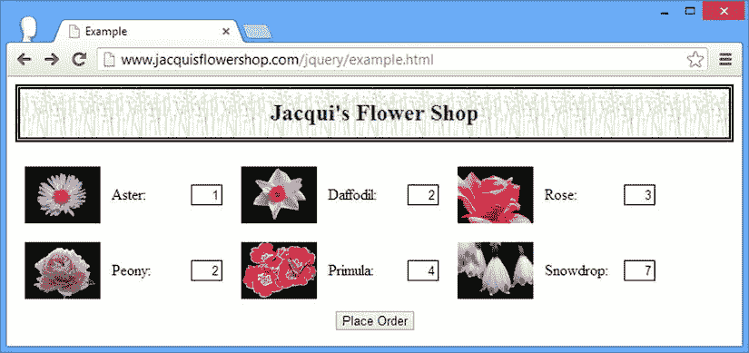

[图 13-1](#_Fig1) 。将数据输入输入元素

当我点击`Place Order`按钮时，表单被提交到`Node.js`服务器，一个简单的响应被发送回浏览器，如图[图 13-2](#Fig2) 所示。

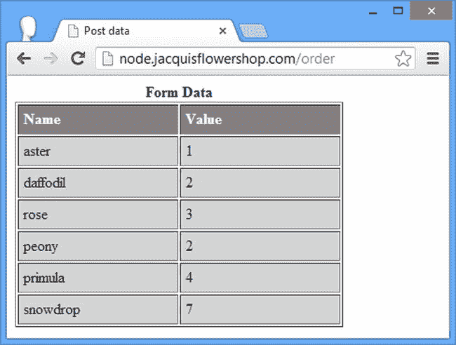

[图 13-2](#_Fig2) 。来自 node . js 服务器的响应

我知道这不是一个有趣的回答，但是我现在只是需要一个地方来发送数据，我不想脱离服务器端开发的轨道。

概述表单事件方法

jQuery 包括一组处理表单相关事件的方法。现在有必要概括一下这些，因为你是专门来看表格的。表 13-2 描述了相应的方法和事件。

[表 13-2](#_Tab2) 。jQuery 表单事件方法

| 方法 | 事件 | 描述 |
| --- | --- | --- |
| `blur(function)` | `Blur` | 当`form`元素失去焦点时触发。 |
| `change(function)` | `Change` | 当`form`元素的值改变时触发。 |
| `focus(function)` | `Focus` | 当焦点被给予一个`form`元素时触发。 |
| `select(function)` | `Select` | 当用户选择`form`元素中的文本时触发。 |
| `submit(function)` | `Submit` | 当用户想要提交表单时触发。 |

 **提示**不要忘记 jQuery 定义了一组匹配表单元素的扩展选择器。详见第五章。

处理表单焦点

`blur`和`focus`方法允许您响应焦点的变化。这些功能的一个常见用途是通过强调哪个元素具有焦点(以及哪个元素将从键盘接收输入)来帮助用户。[清单 13-3](#list3) 提供了一个示范。

***[清单 13-3](#_list3)*** 。管理表单元素焦点

```js
...
<script type="text/javascript">
    $(document).ready(function () {

        var data = { flowers: [
            { name: "Aster", product: "aster", stock: "10", price: "2.99" },
            { name: "Daffodil", product: "daffodil", stock: "12", price: "1.99" },
            { name: "Rose", product: "rose", stock: "2", price: "4.99" },
            { name: "Peony", product: "peony", stock: "0", price: "1.50" },
            { name: "Primula", product: "primula", stock: "1", price: "3.12" },
            { name: "Snowdrop", product: "snowdrop", stock: "15", price: "0.99" }]
        };

        var templResult = $("#flowerTmpl").template(data).filter("*");
        templResult.slice(0, 3).appendTo("#row1");
        templResult.slice(3).appendTo("#row2");

        function handleFormFocus(e) {
            var borderVal = e.type == "focus" ? "medium solid green" : "";
            $(this).css("border", borderVal);
        }
        $("input").focus(handleFormFocus).blur(handleFormFocus);
    });
</script>
...
```

在这个例子中，我选择了所有的`input`元素，并将`handleFormFocus`函数注册为`focus`和`blur`事件的处理程序。该函数在元素获得焦点时应用绿色边框，并在失去焦点时移除它。你可以在[图 13-3](#Fig3) 中看到效果。

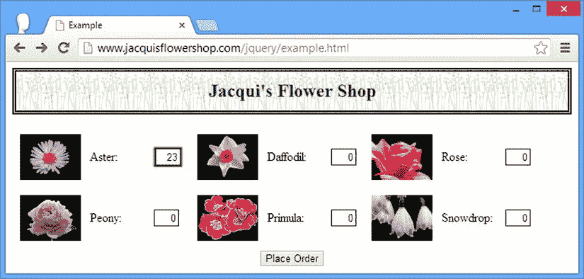

[图 13-3](#_Fig3) 。强调重点元素

注意，我使用了`input`选择器。换句话说，我通过标签选择了元素。jQuery 提供了扩展选择器`:input`(我在[第 5 章](05.html)中描述了扩展选择器)，但是扩展选择器匹配更广泛的元素，并且将匹配能够提交表单的按钮元素，这意味着如果我使用了使用扩展选择器，边界将被应用到`button`以及实际的`input`元素。您可以在图 13-4 中看到按钮聚焦时的差异。您使用哪个选择器是个人偏好的问题，但是了解其中的区别是很有用的。

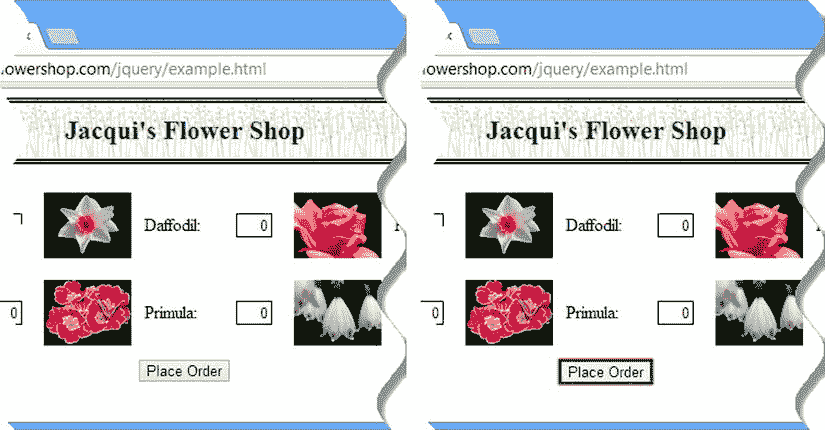

[图 13-4](#_Fig4) 。输入和的区别:输入选择器

处理数值变化

当用户改变一个`form`元素中的值时，触发`change`事件。如果您基于表单中的值提供累积信息，这是一个有用的事件。[清单 13-4](#list4) 展示了如何使用该事件来跟踪花店文档中所选商品的总数。这也是我在本书第二部分末尾重构示例时采用的方法。

***[清单 13-4](#_list4)*** 。响应变更事件

```js
...
<script type="text/javascript">
    $(document).ready(function () {

        var data = { flowers: [
            { name: "Aster", product: "aster", stock: "10", price: "2.99" },
            { name: "Daffodil", product: "daffodil", stock: "12", price: "1.99" },
            { name: "Rose", product: "rose", stock: "2", price: "4.99" },
            { name: "Peony", product: "peony", stock: "0", price: "1.50" },
            { name: "Primula", product: "primula", stock: "1", price: "3.12" },
            { name: "Snowdrop", product: "snowdrop", stock: "15", price: "0.99" }]
        };

        var templResult = $("#flowerTmpl").template(data).filter("*");
        templResult.slice(0, 3).appendTo("#row1");
        templResult.slice(3).appendTo("#row2");

        function handleFormFocus(e) {
            var borderVal = e.type == "focus" ? "medium solid green" : "";
            $(this).css("border", borderVal);
        }
        $("input").focus(handleFormFocus).blur(handleFormFocus);

        var total = $("#buttonDiv")
            .prepend("<div>Total Items: <span id=total>0</span></div>")
            .css({clear: "both", padding: "5px"});
        $("<div id=bbox />").appendTo("body").append(total).css("clear: left");

        $("input").change(function (e) {
            var total = 0;
            $("input").each(function (index, elem) {
                total += Number($(elem).val());
            });
            $("#total").text(total);
        });
    });
</script>
...
```

在这个例子中，我通过合计所有`input`元素中的值并在我之前添加到文档中的`span`元素中显示结果来响应 change 事件。

 **提示**注意，我使用了`val`方法从`input`元素中获取值。

处理表单提交

您可以使用表单执行的许多更高级的活动都源于您可以阻止浏览器的默认表单机制工作的方式。清单 13-5 提供了一个简单的演示。

***[清单 13-5](#_list5)*** 。拦截表单提交

```js
...
<script type="text/javascript">
    $(document).ready(function () {

        var data = { flowers: [
            { name: "Aster", product: "aster", stock: "10", price: "2.99" },
            { name: "Daffodil", product: "daffodil", stock: "12", price: "1.99" },
            { name: "Rose", product: "rose", stock: "2", price: "4.99" },
            { name: "Peony", product: "peony", stock: "0", price: "1.50" },
            { name: "Primula", product: "primula", stock: "1", price: "3.12" },
            { name: "Snowdrop", product: "snowdrop", stock: "15", price: "0.99" }]
        };

        var templResult = $("#flowerTmpl").template(data).filter("*");
        templResult.slice(0, 3).appendTo("#row1");
        templResult.slice(3).appendTo("#row2");

        $("form").submit(function (e) {
            if ($("input").val() == 0) {
                e.preventDefault();
            }
        });
    });
</script>
...
```

我为`submit`事件注册了一个处理函数。当用户单击“下订单”按钮时，将触发此事件。如果第一个`input`元素的值是`0`，我调用`preventDefault`方法来中断表单的默认动作，即向服务器提交数据。对于任何其他值，提交表单。

 **提示**作为替代，你可以从事件处理函数返回`false`来达到同样的效果。

以编程方式提交表单有两种不同的方式。您可以使用不带任何参数的 jQuery `submit`方法，也可以使用由 HTML5 规范为`form`元素定义的`submit`方法。清单 13-6 显示了使用中的两种方法。

***[清单 13-6](#_list6)*** 。显式提交表单

```js
...
<script type="text/javascript">
    $(document).ready(function () {

        var data = { flowers: [
            { name: "Aster", product: "aster", stock: "10", price: "2.99" },
            { name: "Daffodil", product: "daffodil", stock: "12", price: "1.99" },
            { name: "Rose", product: "rose", stock: "2", price: "4.99" },
            { name: "Peony", product: "peony", stock: "0", price: "1.50" },
            { name: "Primula", product: "primula", stock: "1", price: "3.12" },
            { name: "Snowdrop", product: "snowdrop", stock: "15", price: "0.99" }]
        };

        var templResult = $("#flowerTmpl").template(data).filter("*");
        templResult.slice(0, 3).appendTo("#row1");
        templResult.slice(3).appendTo("#row2");

        $("form").submit(function (e) {
            if ($("input").val() == 0) {
                e.preventDefault();
            }
        });

        $("<button>jQuery Method</button>").appendTo("#buttonDiv").click(function (e) {
            $("form").submit();
            e.preventDefault();
        });

        $("<button>DOM API</button>").appendTo("#buttonDiv").click(function (e) {
            document.getElementsByTagName("form")[0].submit();
            e.preventDefault();
        });
    });
</script>
...
```

我在文档中添加了两个元素`button`T2。使用 jQuery `submit`方法的那个触发提交事件，在上一个例子中我为它设置了一个处理函数。这意味着如果第一个 input 元素的值为零，就不会提交表单。

使用 DOM API 并调用由`form`元素定义的`submit`方法的`button`元素有效地绕过了事件处理程序，因为`submit`事件没有被触发，这意味着无论`first`输入元素的值是多少，表单都会被提交。

 **提示**当然，我的建议是坚持使用 jQuery 方法，但是如果你使用 DOM 方法，至少你会理解你得到的结果。

验证表单值

中断和阻止浏览器向服务器提交数据的主要原因是，您希望*验证*用户输入到表单中的值。在某种程度上，每个 web 程序员都意识到用户会在一个`input`元素中输入任何东西，假设你的用户会提供有用且有意义的数据是不明智的。您可能需要处理无数不同的值，但是以我的经验来看，用户在表单中给你一些意想不到的东西只有几个原因。

第一个原因是用户不了解你在追求什么数据。例如，您可能要求输入信用卡上的姓名，但是用户可能输入了她的卡号。

第二个原因是用户不想给你你所要求的信息，只是想尽快通过表单。她会参加任何能让她进入下一阶段的活动。如果您有很多新用户的电子邮件地址是`a@a.com`，那么您知道这就是问题所在。

第三个原因是你在询问用户没有的信息，比如问一个英国居民他住在哪个州。(我们这里没有州。我在看着你，NPR。不给你捐款。)

最后一个原因是用户犯了一个真正的错误，通常是打字错误。例如，我是一个快速但不准确的打字员，我经常把我的姓打成`Freman`而不是`Freeman`，漏掉了一个`e`。

对于拼写错误你无能为力，但是你处理其他三个原因的方式可以决定创建一个流畅无缝的应用还是会惹恼用户。

我不想长篇大论地谈论网页表单的设计，但是我想说解决这个问题的最好方法是关注用户想要达到的目标。当事情出错时，试着从用户的角度来看待问题(以及所需的解决方案)。您的用户不知道您是如何构建系统的，他们也不关心您的业务流程；他们只想完成一些事情。如果你把注意力放在用户试图完成的任务上，并且当她没有给你想要的数据时不要不必要的惩罚她，每个人都会很开心。

jQuery 为您提供了创建自己的系统来验证数据值所需的所有工具，但是我推荐一种不同的方法。最流行的 jQuery 插件之一叫做 Validation，正如您从名称中猜到的，它处理表单验证。

 **注意**我在本章讨论的是*客户端验证*。这是对*服务器端验证*的补充，而不是替代，在服务器端验证中，当服务器接收到数据时，您会对其进行检查。客户端验证是为了*用户*的利益:让他不必重复向服务器提交数据来发现和纠正数据错误。服务器端验证有利于*应用*并确保坏数据不会导致问题。您必须两者都使用:绕过客户端验证是微不足道的，并且它不能为您的应用提供可靠的保护。

你可以从`http://jqueryvalidation.org` 下载验证插件，或者使用我在本书的源代码下载中包含的版本(可在 Apress.com 的[获得)。](http://Apress.com)[清单 13-7](#list7) 展示了这个插件的使用。(我写这篇文章的时候，当前版本是 1.1.1。)

***[清单 13-7](#_list7)*** 。使用表单验证插件

```js
<!DOCTYPE html>
<html>
<head>
    <title>Example</title>
    <script src="jquery-2.0.2.js" type="text/javascript"></script>
    <script src="handlebars.js" type="text/javascript"></script>
    <script src="handlebars-jquery.js" type="text/javascript"></script>
    <script src="jquery.validate.js" type="text/javascript"></script>
    <link rel="stylesheet" type="text/css" href="styles.css"/>
    <style type="text/css">
        .errorMsg {color: red}
        .invalidElem {border: medium solid red}
    </style>
    <script id="flowerTmpl" type="text/x-handlebars-template">
        {{#each flowers}}
        <div class="dcell">
            
            <label for="{{product}}">{{name}}: </label>
            <input name="{{product}}" value="0" required />
        </div>
        {{/each}}
    </script>
    <script type="text/javascript">
        $(document).ready(function () {

            var data = { flowers: [
                { name: "Aster", product: "aster", stock: "10", price: "2.99" },
                { name: "Daffodil", product: "daffodil", stock: "12", price: "1.99" },
                { name: "Rose", product: "rose", stock: "2", price: "4.99" },
                { name: "Peony", product: "peony", stock: "0", price: "1.50" },
                { name: "Primula", product: "primula", stock: "1", price: "3.12" },
                { name: "Snowdrop", product: "snowdrop", stock: "15", price: "0.99" }]
            };

            var templResult = $("#flowerTmpl").template(data).filter("*");
            templResult.slice(0, 3).appendTo("#row1");
            templResult.slice(3).appendTo("#row2");

            $("form").validate({
                highlight: function (element, errorClass) {
                    $(element).add($(element).parent()).addClass("invalidElem");
                },
                unhighlight: function (element, errorClass) {
                    $(element).add($(element).parent()).removeClass("invalidElem");
                },
                errorElement: "div",
                errorClass: "errorMsg"
            });

            $.validator.addClassRules({
                flowerValidation: {
                    min: 0
                }
            })

            $("input").addClass("flowerValidation").change(function (e) {
                $("form").validate().element($(e.target));
            });
        });
    </script>
</head>
<body>
    <h1>Jacqui's Flower Shop</h1>
    <form method="post" action="http://node.jacquisflowershop.com/order">
        <div id="oblock">
            <div class="dtable">
                <div id="row1" class="drow">
                </div>
                <div id="row2"class="drow">
                </div>
            </div>
        </div>
        <div id="buttonDiv"><button type="submit">Place Order</button></div>
    </form>
</body>
</html>
```

插件以 zip 文件的形式分发，您需要对其进行解压缩。从`dist`文件夹中复制`jquery.validate.js`文件，使其与`example.html`文件在同一个目录下。

 **提示**验证插件有很多不同的配置选项。在这一章中，我把重点放在了那些最常用的和最广泛的情况上。如果它们不适合您，我建议您探索一些其他选项，插件下载中的文档中描述了这些选项。

 **注意** HTML5 包括对一些表单验证的支持。这是一个好的开始，但它非常基础，浏览器解释规范的方式仍然存在显著的差异。在 HTML5 特性的范围、丰富性和一致性得到改善之前，我建议继续使用 jQuery 进行表单验证。

导入 JavaScript 文件

我要做的第一件事是用一个`script`元素将模板插件 JavaScript 文件引入文档，如下所示:

```js
...
<script src="jquery-2.0.2.js" type="text/javascript"></script>
<script src="handlebars.js" type="text/javascript"></script>
<script src="handlebars-jquery.js" type="text/javascript"></script>
<script src="jquery.validate.js" type="text/javascript"></script>
...
```

 **提示**我使用过该文件的调试版本，但有一个最小化版本可用，一些 CDN 服务托管该文件，因为它非常受欢迎。

配置验证

下一步是配置`form`元素的验证，我通过对应该执行验证的`form`元素调用`validate`方法来完成。`validate`方法的参数是一个包含配置设置的 map 对象，如[清单 13-8](#list8) 所示。

***[清单 13-8](#_list8)*** 。配置验证

```js
...
$("form").validate({
    highlight: function(element, errorClass) {
        $(element).add($(element).parent()).addClass("invalidElem");
    },
    unhighlight: function(element, errorClass) {
        $(element).add($(element).parent()).removeClass("invalidElem");
    },
    errorElement: "div",
    errorClass: "errorMsg"
});
...
```

我为四个选项指定了值(`highlight`、`unhighlight`、`errorElement`和`errorClass`)；我将在本章的后面回到这些并解释它们的含义。

定义验证规则

验证插件的灵活性很大程度上来自于测试有效输入的规则可以快速而容易地定义。将规则与元素关联起来有多种方式，我倾向于使用的一种方式是通过类来实现的。我定义了一组规则，并将它们与一个类相关联，当表单被验证时，这些规则被应用于包含在指定类成员中的任何元素。我在示例中创建了一个规则，如清单 13-9 中的[所示。](#list9)

***[清单 13-9](#_list9)*** 。定义验证规则

```js
...
$.validator.addClassRules({
    flowerValidation: {
        min: 0
    }
})
...
```

在本例中，我创建了一个规则，它将应用于属于`flowerValidation`类的元素。规则是该值应该等于或大于零。我已经用`min`表达了规则中的条件。这只是验证插件提供的许多方便的预定义检查中的一个，我将在本章后面描述所有这些检查。

应用验证规则

通过将元素添加到上一步指定的类中，验证规则与表单中的元素相关联。这提供了为表单中不同种类的元素定制验证的能力。对于这个例子，所有的元素都被同等对待，所以我使用 jQuery 来选择所有的`input`元素并将它们添加到`flowerValidation`类中，如[清单 13-10](#list10) 所示。

***[清单 13-10](#_list10)*** 。将输入元素添加到与验证关联的类中

```js
...
$("input").addClass("flowerValidation").change(function(e) {
    $("form").validate().element($(e.target));
});
...
```

我还为`change`事件设置了一个处理函数，以显式验证值已更改的元素。这确保了用户在纠正错误时能够立即得到反馈。你可以在[图 13-5](#Fig5) 中看到验证插件的效果。为了创建这个图，我在其中一个输入字段中输入了`-1`,并单击了 Place Order 按钮。

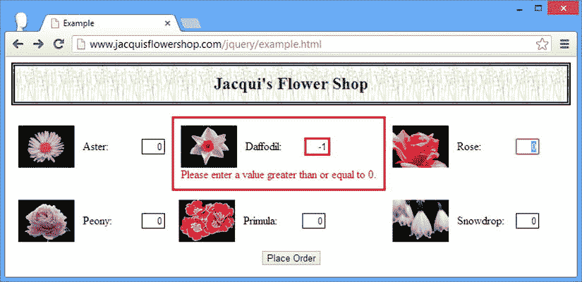

[图 13-5](#_Fig5) 。使用验证插件

 **提示**显示给用户的消息文本由验证插件生成。我将在本章的后面向您展示如何定制这些消息。

验证插件显示一条错误消息，在问题解决之前，用户无法提交表单。错误消息为用户提供了如何解决问题的指导。(默认的消息，比如图中显示的，有点普通，但是在本章的后面我会告诉你如何改变文本。)

使用验证检查

验证插件支持多种检查，您可以使用这些检查来验证表单值。您在前面的示例中看到了`min`检查。这确保了该值大于或等于指定的数值。[表 13-3](#Tab3) 描述了您可以执行的一组检查。

[表 13-3](#_Tab3) 。验证插件检查

| 检查 | 描述 |
| --- | --- |
| `creditcard: true` | 该值必须包含信用卡号。 |
| `date: true` | 该值必须是有效的 JavaScript 日期。 |
| `digits: true` | 该值必须仅包含数字。 |
| `email: true` | 该值必须是有效的电子邮件地址。 |
| `max: maxVal` | 该值必须至少与`maxVal`一样大。 |
| `maxlength: length` | 该值不得超过`length`个字符。 |
| `min: minVal` | 该值必须至少与`minVal`一样大。 |
| `minlength: length;` | 该值必须至少包含`length`个字符。 |
| `number: true` | 该值必须是十进制数。 |
| `range: [minVal, maxVal]` | 该值必须在`minVal`和`maxVal`之间。 |
| `rangelength: [minLen, maxLen]` | 该值必须至少包含`minLen`个字符，不超过`maxLen`个字符。 |
| `required: true;` | 需要一个值。 |
| `url: true` | 该值必须是 URL。 |

您可以在单个规则中将多个规则关联在一起。这允许您以一种紧凑且富于表现力的方式执行复杂的验证。

 **提示**验证插件发行版 zip 文件中包含一个名为`additional-methods.js`的文件。该文件定义了一些额外的检查，包括美国和英国的电话号码、IPv4 和 IPv6 地址，以及一些额外的日期、电子邮件和 URL 格式。

您可以通过几种方式将这些检查应用于您的元素。我将在接下来的章节中描述每一个。

 **注意**验证插件还支持*远程验证*，用户输入到字段中的数据通过远程服务器进行检查。当您需要检查不能分发给客户机的数据时，这是很有用的，因为这样既不安全也不实际(例如检查用户名是否还没有被使用)。在第 14 章和第 15 章中介绍了远程验证所依赖的特性之后，我将在第 16 章的[中演示远程验证。](16.html)

通过类应用验证规则

正如我前面解释的，我最常用的验证技术是通过类应用检查，这是我在例子中采用的方法。然而，我不局限于单个检查，我可以一起应用多个检查来验证用户提供的价值的不同方面，如清单 13-11 所示。

***[清单 13-11](#_list11)*** 。将多项检查合并到一个规则中

```js
...
<script type="text/javascript">
    $(document).ready(function () {

        var data = { flowers: [
            { name: "Aster", product: "aster", stock: "10", price: "2.99" },
            { name: "Daffodil", product: "daffodil", stock: "12", price: "1.99" },
            { name: "Rose", product: "rose", stock: "2", price: "4.99" },
            { name: "Peony", product: "peony", stock: "0", price: "1.50" },
            { name: "Primula", product: "primula", stock: "1", price: "3.12" },
            { name: "Snowdrop", product: "snowdrop", stock: "15", price: "0.99" }]
        };

        var templResult = $("#flowerTmpl").template(data).filter("*");
        templResult.slice(0, 3).appendTo("#row1");
        templResult.slice(3).appendTo("#row2");

        $("form").validate({
            highlight: function (element, errorClass) {
                $(element).add($(element).parent()).addClass("invalidElem");
            },
            unhighlight: function (element, errorClass) {
                $(element).add($(element).parent()).removeClass("invalidElem");
            },
            errorElement: "div",
            errorClass: "errorMsg"
        });

        $.validator.addClassRules({
            flowerValidation: {
                required: true,
                digits: true,
                min: 0,
                max: 100
            }
        });

        $("input").addClass("flowerValidation").change(function (e) {
            $("form").validate().element($(e.target));
        });
    });
</script>
...
```

在这个例子中，我组合了`required`、`digits`、`min`和`max`检查，以确保用户提供的值只包含数字，并且在 0 到 100 的范围内。

注意，我使用`addClassRules`方法将规则与类关联起来。此方法的参数是一组或多组检查以及它们要应用到的类名。如图所示，在 jQuery `$`主函数的`validator`属性上调用`addClassRules`方法。

每一个被验证的`form`元素都被单独评估，这意味着对于不同的问题，用户可以看到不同的错误信息，如图 13-6 中的[所示。](#Fig6)

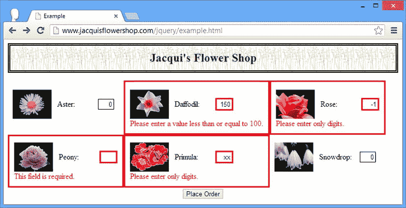

[图 13-6](#_Fig6) 。对表单元素应用多重验证检查

我输入了几个无法通过检查的值。请务必注意，检查是按照规则中定义的顺序执行的。如果您查看`Rose`产品的错误消息，您会发现它没有通过`digits`检查。如果您重新安排检查的顺序，您可能会得到不同的错误。[清单 13-12](#list12) 显示了以不同顺序排列的验证检查。

***[清单 13-12](#_list12)*** 。更改应用检查的顺序

```js
...
$.validator.addClassRules({
    flowerValidation: {
        required: true,
        min: 0,
        max: 100,
        digits: true
    }
})
...
```

在本例中，我将数字检查移到了规则的末尾。如果我现在将`-1`输入到一个表单字段中，将会失败的是`min`检查，如图[图 13-7](#Fig7) 所示。

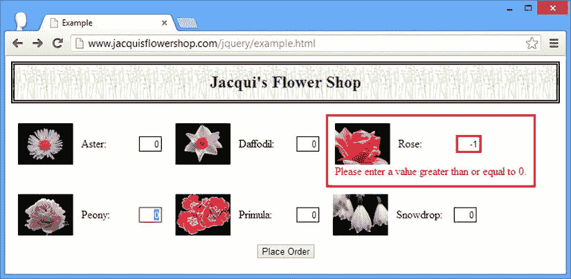

[图 13-7](#_Fig7) 。更改验证期间应用检查的顺序

将验证规则直接应用于元素

下一个技术允许你对单个元素应用规则，如清单 13-13 所示。

***[清单 13-13](#_list13)*** 。将验证规则应用于选择中的元素

```js
...
<script type="text/javascript">
    $(document).ready(function () {

        var data = { flowers: [
            { name: "Aster", product: "aster", stock: "10", price: "2.99" },
            { name: "Daffodil", product: "daffodil", stock: "12", price: "1.99" },
            { name: "Rose", product: "rose", stock: "2", price: "4.99" },
            { name: "Peony", product: "peony", stock: "0", price: "1.50" },
            { name: "Primula", product: "primula", stock: "1", price: "3.12" },
            { name: "Snowdrop", product: "snowdrop", stock: "15", price: "0.99" }]
        };

        var templResult = $("#flowerTmpl").template(data).filter("*");
        templResult.slice(0, 3).appendTo("#row1");
        templResult.slice(3).appendTo("#row2");

        $("form").validate({
            highlight: function (element, errorClass) {
                $(element).add($(element).parent()).addClass("invalidElem");
            },
            unhighlight: function (element, errorClass) {
                $(element).add($(element).parent()).removeClass("invalidElem");
            },
            errorElement: "div",
            errorClass: "errorMsg"
        });

        $.validator.addClassRules({
            flowerValidation: {
                required: true,
                min: 0,
                max: 100,
                digits: true,
            }
        })

        $("#row1 input").each(function (index, elem) {
            $(elem).rules("add", {
                min: 10,
                max: 20
            })
        });

        $("input").addClass("flowerValidation").change(function (e) {
            $("form").validate().element($(e.target));
        });
    });
</script>
...
```

我在一个`jQuery`对象上调用`rules`方法，传入字符串`add`和一个带有您想要执行的检查及其参数的地图对象。`rules`方法只对选择中的第一个元素起作用，所以我必须使用`each`方法来更广泛地应用规则。在本例中，我选择了所有作为`row1`元素的后代的`input`元素，并应用了`min`和`max`检查来确保用户输入了一个介于 10 和 20 之间的值。

 **提示**当你调用`rules`方法时，你可以通过用`remove`替换`add`来删除元素中的规则。

使用`rules`方法应用于元素的规则在使用类应用规则之前被评估。对于我的例子，这意味着最上面一行的`input`元素将使用`10`的`min`值和`20`的`max`值进行检查，而其他输入元素将分别使用`0`和`100`的值。你可以在[图 13-8](#Fig8) 中看到这样做的效果。

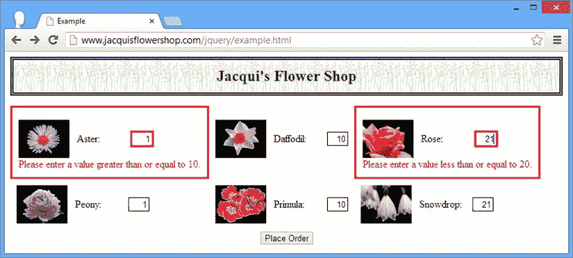

[图 13-8](#_Fig8) 。将规则直接应用于元素

因为我在单独处理每个元素的验证，所以我可以进一步定制检查，如清单 13-14 所示。

***[清单 13-14](#_list14)*** 。裁剪元素的检查

```js
...
<script type="text/javascript">
    $(document).ready(function () {

        var data = { flowers: [
            { name: "Aster", product: "aster", stock: "10", price: "2.99" },
            { name: "Daffodil", product: "daffodil", stock: "12", price: "1.99" },
            { name: "Rose", product: "rose", stock: "2", price: "4.99" },
            { name: "Peony", product: "peony", stock: "0", price: "1.50" },
            { name: "Primula", product: "primula", stock: "1", price: "3.12" },
            { name: "Snowdrop", product: "snowdrop", stock: "15", price: "0.99" }]
        };

        var templResult = $("#flowerTmpl").template(data).filter("*");
        templResult.slice(0, 3).appendTo("#row1");
        templResult.slice(3).appendTo("#row2");

        $("form").validate({
            highlight: function (element, errorClass) {
                $(element).add($(element).parent()).addClass("invalidElem");
            },
            unhighlight: function (element, errorClass) {
                $(element).add($(element).parent()).removeClass("invalidElem");
            },
            errorElement: "div",
            errorClass: "errorMsg"
        });

        $("input").each(function (index, elem) {
            var rules = {
                required: true,
                min: 0,
                max: data.flowers[index].stock,
                digits: true
            }
            if (Number(data.flowers[index].price) > 3.00) {
                rules.max--;
            }
            $(elem).rules("add", rules);
        });

        $("input").addClass("flowerValidation").change(function (e) {
            $("form").validate().element($(e.target));
        });
    });
</script>
...
```

在这个例子中，我使用添加到文档中的数据对象来定制`max`检查的值，以便使用模板生成元素。根据`stock`属性设置`max`支票的值，如果价格大于 3 美元，则向下调整。当您拥有这样的数据时，您就能够执行更有用的验证。你可以在图 13-9 的[中看到这种变化的效果。](#Fig9)

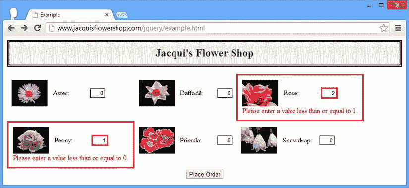

[图 13-9](#_Fig9) 。根据数据为验证检查设置不同的值

通过元素名称属性应用验证规则

验证规则也可以基于`name`属性的值应用于元素。HTML 规范中没有要求`name`属性值是惟一的，单个值通常用于对一组`form`元素进行分类。在我的花店示例文档中，每个名称都是不同的，并且对应于特定的产品。无论哪种方式，您都可以创建对应于一个`name`属性值的规则，以及应用于所有被赋予该值的元素的规则。[清单 13-15](#list15) 给出了一个演示。

***[清单 13-15](#_list15)*** 。根据元素名称分配验证规则

```js
...
<script type="text/javascript">
    $(document).ready(function () {

        var data = { flowers: [
            { name: "Aster", product: "aster", stock: "10", price: "2.99" },
            { name: "Daffodil", product: "daffodil", stock: "12", price: "1.99" },
            { name: "Rose", product: "rose", stock: "2", price: "4.99" },
            { name: "Peony", product: "peony", stock: "0", price: "1.50" },
            { name: "Primula", product: "primula", stock: "1", price: "3.12" },
            { name: "Snowdrop", product: "snowdrop", stock: "15", price: "0.99" }]
        };

        var templResult = $("#flowerTmpl").template(data).filter("*");
        templResult.slice(0, 3).appendTo("#row1");
        templResult.slice(3).appendTo("#row2");

        var rulesList = new Object();
        for (var i = 0; i < data.flowers.length; i++) {
            rulesList[data.flowers[i].product] = {
                min: 0,
                max: Number(data.flowers[i].stock),
            }
        }

        $("form").validate({
            highlight: function (element, errorClass) {
                $(element).add($(element).parent()).addClass("invalidElem");
            },
            unhighlight: function (element, errorClass) {
                $(element).add($(element).parent()).removeClass("invalidElem");
            },
            errorElement: "div",
            errorClass: "errorMsg",
            rules: rulesList
        });

        $("input").change(function (e) {
            $("form").validate().element($(e.target));
        });

    });
</script>
...
```

当我设置`form`验证时，我使用传递给`validate`方法的配置对象的`rules`属性添加了依赖于元素名称的规则。请注意，我只使用了数据对象来创建规则集，并且数据对象中的`product`属性用于在`input`元素上生成`name`属性。还要注意，我必须使用`Number`来转换字符串数据值，以便正确处理它。

 **提示**我倾向于不在自己的项目中使用这种方法，因为我更愿意直接处理文档中的元素，但是如果您有一个数据对象，并且希望在表单元素被添加到文档之前设置验证，这种技术会很方便。

使用元素属性应用验证规则

对元素应用验证检查的最后一种方法是使用属性。验证插件检查`form`元素以查看它们是否定义了与内置检查名称相对应的属性，因此定义了`required`属性的元素被认为需要所需的检查。[清单 13-16](#list16) 提供了一个演示。

***[清单 13-16](#_list16)*** 。使用元素属性执行验证

```js
...
<script id="flowerTmpl" type="text/x-handlebars-template">
    {{#each flowers}}
    <div class="dcell">
        
        <label for="{{product}}">{{name}}: </label>
        <input name="{{product}}" value="0" required min="0" max="{{stock}}"/>
    </div>
    {{/each}}
</script>
<script type="text/javascript">
    $(document).ready(function () {

        var data = { flowers: [
            { name: "Aster", product: "aster", stock: "10", price: "2.99" },
            { name: "Daffodil", product: "daffodil", stock: "12", price: "1.99" },
            { name: "Rose", product: "rose", stock: "2", price: "4.99" },
            { name: "Peony", product: "peony", stock: "0", price: "1.50" },
            { name: "Primula", product: "primula", stock: "1", price: "3.12" },
            { name: "Snowdrop", product: "snowdrop", stock: "15", price: "0.99" }]
        };

        var templResult = $("#flowerTmpl").template(data).filter("*");
        templResult.slice(0, 3).appendTo("#row1");
        templResult.slice(3).appendTo("#row2");

        $("form").validate({
            highlight: function (element, errorClass) {
                $(element).add($(element).parent()).addClass("invalidElem");
            },
            unhighlight: function (element, errorClass) {
                $(element).add($(element).parent()).removeClass("invalidElem");
            },
            errorElement: "div",
            errorClass: "errorMsg"
        });

        $("input").change(function (e) {
            $("form").validate().element($(e.target));
        });
    });
</script>
...
```

当它与数据模板结合使用时，我喜欢这种技术，但我发现当应用于静态定义的元素时，它会使文档变得混乱，因为相同的属性被一次又一次地应用于元素。

指定验证消息

验证插件为所有的内置检查定义了一个默认的错误消息，但是这些都是通用的，并不总是对用户有用。举个简单的例子，如果我设置一个值为`10`的`max`检查，并且用户在字段中输入`20`，那么错误消息将如下所示:

```js
Please enter a value less than or equal to 12
```

这条消息描述了您在`form`元素上应用的约束，但是它没有向用户提供任何关于为什么有限制的指导。幸运的是，您可以更改这些消息以提供一些额外的上下文，并根据您的需要定制消息。用于更改消息的方法取决于最初创建验证规则的方式。当您使用类应用规则时，不可能更改消息，但是在下面的部分中，我将描述如何为其他技术定义定制消息。

为属性和名称验证指定消息

当依靠`name`属性或检查属性将规则与元素相关联时，您可以通过向传递给`validate`方法的`options`对象添加一个`messages`属性来更改显示给用户的消息。[清单 13-17](#list17) 提供了一个演示。

***[清单 13-17](#_list17)*** 。使用 options 对象的 messages 属性

```js
...
<script type="text/javascript">
    $(document).ready(function () {

        var data = { flowers: [
            { name: "Aster", product: "aster", stock: "10", price: "2.99" },
            { name: "Daffodil", product: "daffodil", stock: "12", price: "1.99" },
            { name: "Rose", product: "rose", stock: "2", price: "4.99" },
            { name: "Peony", product: "peony", stock: "0", price: "1.50" },
            { name: "Primula", product: "primula", stock: "1", price: "3.12" },
            { name: "Snowdrop", product: "snowdrop", stock: "15", price: "0.99" }]
        };

        var templResult = $("#flowerTmpl").template(data).filter("*");
        templResult.slice(0, 3).appendTo("#row1");
        templResult.slice(3).appendTo("#row2");

        $("form").validate({
            highlight: function (element, errorClass) {
                $(element).add($(element).parent()).addClass("invalidElem");
            },
            unhighlight: function (element, errorClass) {
                $(element).add($(element).parent()).removeClass("invalidElem");
            },
            errorElement: "div",
            errorClass: "errorMsg",
            messages: {
                rose: { max: "We don't have that many roses in stock!" },
                primula: { max: "We don't have that many primulas in stock!" }
            }
        });

        $("input").change(function (e) {
            $("form").validate().element($(e.target));
        });
    });
</script>
...
```

本例的验证是通过应用于模板中的`input`元素的`min`和`max`属性来应用的，您可以看到 JavaScript 代码中设置了`messages`属性值的对象的结构。

在 messages 对象中，我使用我感兴趣的元素的名称定义了一个属性，并将该属性的值设置为支票和您想要使用的新消息之间的映射。在这个例子中，我已经修改了名称为`rose`和`primula`的元素上的`max`检查的消息。你可以在图 13-10 中看到这个效果，它说明了这些自定义信息是如何显示的。

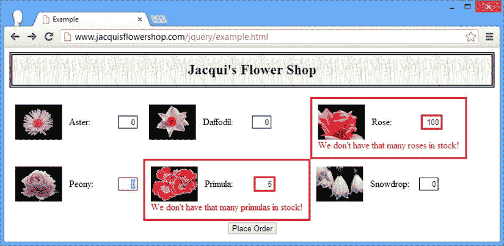

[图 13-10](#_Fig10) 。通过选项对象更改消息

设置这些验证消息的语法可能是重复的，所以我倾向于用我想要的编程消息创建一个对象，如[清单 13-18](#list18) 所示。

***[清单 13-18](#_list18)*** 。以编程方式定义自定义消息

```js
...
<script type="text/javascript">
    $(document).ready(function () {

        var data = { flowers: [
            { name: "Aster", product: "aster", stock: "10", price: "2.99" },
            { name: "Daffodil", product: "daffodil", stock: "12", price: "1.99" },
            { name: "Rose", product: "rose", stock: "2", price: "4.99" },
            { name: "Peony", product: "peony", stock: "0", price: "1.50" },
            { name: "Primula", product: "primula", stock: "1", price: "3.12" },
            { name: "Snowdrop", product: "snowdrop", stock: "15", price: "0.99" }]
        };

        var templResult = $("#flowerTmpl").template(data).filter("*");
        templResult.slice(0, 3).appendTo("#row1");
        templResult.slice(3).appendTo("#row2");

        var customMessages = new Object();
        for (var i = 0; i < data.flowers.length; i++) {
            customMessages[data.flowers[i].product] = {
                max: "We only have " + data.flowers[i].stock + " in stock"
            }
        }

        $("form").validate({
            highlight: function (element, errorClass) {
                $(element).add($(element).parent()).addClass("invalidElem");
            },
            unhighlight: function (element, errorClass) {
                $(element).add($(element).parent()).removeClass("invalidElem");
            },
            errorElement: "div",
            errorClass: "errorMsg",
            messages: customMessages
        });

        $("input").change(function (e) {
            $("form").validate().element($(e.target));
        });
    });
</script>
...
```

在这个例子中，我结合了数据对象的`stock`属性来给用户一个更有意义的消息，如图 13-11 中的[所示。](#Fig11)

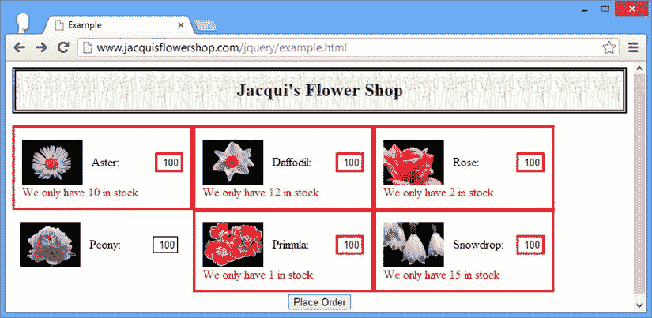

[图 13-11](#_Fig11) 。以编程方式生成自定义验证消息

为每个元素的验证指定消息

当对单个元素应用规则时，您可以传入一个`messages`对象，该对象定义了您希望用于检查的消息。清单 13-19 展示了这是如何做到的。

***[清单 13-19](#_list19)*** 。为基于每个元素应用的规则指定消息

```js
...
<script type="text/javascript">
    $(document).ready(function () {

        var data = { flowers: [
            { name: "Aster", product: "aster", stock: "10", price: "2.99" },
            { name: "Daffodil", product: "daffodil", stock: "12", price: "1.99" },
            { name: "Rose", product: "rose", stock: "2", price: "4.99" },
            { name: "Peony", product: "peony", stock: "0", price: "1.50" },
            { name: "Primula", product: "primula", stock: "1", price: "3.12" },
            { name: "Snowdrop", product: "snowdrop", stock: "15", price: "0.99" }]
        };

        var templResult = $("#flowerTmpl").template(data).filter("*");
        templResult.slice(0, 3).appendTo("#row1");
        templResult.slice(3).appendTo("#row2");

        $("form").validate({
            highlight: function (element, errorClass) {
                $(element).add($(element).parent()).addClass("invalidElem");
            },
            unhighlight: function (element, errorClass) {
                $(element).add($(element).parent()).removeClass("invalidElem");
            },
            errorElement: "div",
            errorClass: "errorMsg",
        });

        $("input").change(function (e) {
            $("form").validate().element($(e.target));
        }).each(function (index, elem) {
            $(elem).rules("add", {
                messages: {
                    max: "We only have " + data.flowers[index].stock + " in stock"
                }
            })
        });
    });
</script>
...
```

我再次使用了来自相应 flowers 数据对象的`stock`属性来定义消息。为了简单起见，我假设`input`元素的排序方式与数据项的排序方式相同。你可以在[图 13-12](#Fig12) 中看到这些信息的效果。

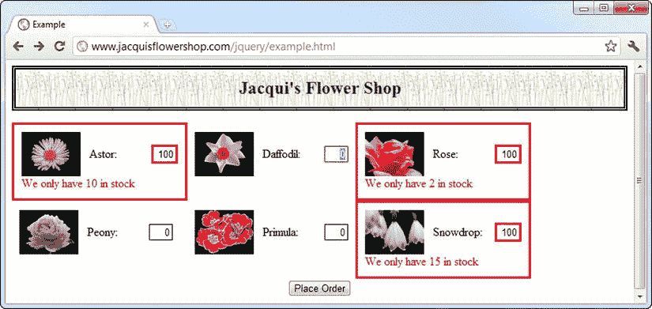

[图 13-12](#_Fig12) 。指定从数据对象派生的消息

 **提示**我只使用 JavaScript 指定了消息。最小和最大规则仍然通过模板应用于输入元素，如[清单 13-17](#list17) 所示。

创建自定义

如果内置的验证检查不符合您的需要，您可以创建自定义的验证检查。这是一个简单的过程，意味着您可以将验证与 web 应用的结构和性质紧密联系起来。清单 13-20 提供了一个演示。

***[清单 13-20](#_list20)*** 。创建自定义验证检查

```js
...
<script id="flowerTmpl" type="text/x-handlebars-template">
    {{#each flowers}}
    <div class="dcell">
        
        <label for="{{product}}">{{name}}: </label>
        <input name="{{product}}" value="0" required />
    </div>
    {{/each}}
</script>
<script type="text/javascript">
    $(document).ready(function () {

        var data = {
            flowers: [
                { name: "Aster", product: "aster", stock: "10", price: "2.99" },
                { name: "Daffodil", product: "daffodil", stock: "12", price: "1.99" },
                { name: "Rose", product: "rose", stock: "2", price: "4.99" },
                { name: "Peony", product: "peony", stock: "0", price: "1.50" },
                { name: "Primula", product: "primula", stock: "1", price: "3.12" },
                { name: "Snowdrop", product: "snowdrop", stock: "15", price: "0.99" }]
        };

        var templResult = $("#flowerTmpl").template(data).filter("*");
        templResult.slice(0, 3).appendTo("#row1");
        templResult.slice(3).appendTo("#row2");

        $("form").validate({
            highlight: function (element, errorClass) {
                $(element).add($(element).parent()).addClass("invalidElem");
            },
            unhighlight: function (element, errorClass) {
                $(element).add($(element).parent()).removeClass("invalidElem");
            },
            errorElement: "div",
            errorClass: "errorMsg"
        });

        $.validator.addMethod("stock", function (value, elem, args) {
            return Number(value) < Number(args);
        }, "We don't have that many in stock");

        $("input").each(function (index, elem) {
            $(elem).rules("add", {
                stock: data.flowers[index].stock
            })
        }).change(function (e) {
            $("form").validate().element($(e.target));
        });
    });
</script>
...
```

我已经从模板的 input 元素中删除了 min 和 max 属性，并在 JavaScript 代码中引入了一个定制的验证检查。(您可以自由地混合和匹配定制的和内置的验证，但是这个清单中的例子复制了`max`验证器的功能。)

使用`addMethod`方法创建定制检查，该方法在`$`函数的`validator`属性上调用。此方法的参数是要分配给检查的名称、用于执行验证的函数以及显示验证失败的消息。在这个例子中，我定义了一个名为`stock`的检查，我将在接下来的章节中解释它。

定义验证功能

自定义验证函数的参数是用户输入的值、表示表单元素的`HTMLElement`对象，以及在对元素进行验证时指定的任何参数，如下所示:

```js
...
$(elem).rules("add", {
    min: 0,
    stock:data.flowers[index].stock
})
...
```

当我应用规则时，我指定了来自 flower 数据对象的一个`stock`属性的值作为检查的参数，该属性对应于 input 元素。这将按原样传递给自定义验证函数:

```js
...
function(value, elem,args) {
    return Number(value) <= Number(args);
}
...
```

值和参数以字符串的形式呈现，这意味着我必须使用`Number`类型来确保 JavaScript 正确地比较数值。验证函数的结果表明值是否有效——对于可接受的值，返回`true`,对于不可接受的值，返回`false`。对于我的函数，如果一个值小于或等于参数，那么它就是有效的。

定义验证消息

您可以指定以两种方式显示的消息。第一种是作为字符串，这是我在前面的例子中使用的。指定消息的另一种方式是使用函数，允许您创建具有更多上下文的消息。清单 13-21 提供了一个演示。

***[清单 13-21](#_list21)*** 。使用函数为自定义检查创建消息

```js
...
<script type="text/javascript">
    $(document).ready(function () {

        var data = {
            flowers: [
                { name: "Aster", product: "aster", stock: "10", price: "2.99" },
                { name: "Daffodil", product: "daffodil", stock: "12", price: "1.99" },
                { name: "Rose", product: "rose", stock: "2", price: "4.99" },
                { name: "Peony", product: "peony", stock: "0", price: "1.50" },
                { name: "Primula", product: "primula", stock: "1", price: "3.12" },
                { name: "Snowdrop", product: "snowdrop", stock: "15", price: "0.99" }]
        };

        var templResult = $("#flowerTmpl").template(data).filter("*");
        templResult.slice(0, 3).appendTo("#row1");
        templResult.slice(3).appendTo("#row2");

        $("form").validate({
            highlight: function (element, errorClass) {
                $(element).add($(element).parent()).addClass("invalidElem");
            },
            unhighlight: function (element, errorClass) {
                $(element).add($(element).parent()).removeClass("invalidElem");
            },
            errorElement: "div",
            errorClass: "errorMsg"
        });

        $.validator.addMethod("stock", function (value, elem, args) {
            return Number(value) < Number(args);
        }, function(args) {
            return "We only have " + args + " in stock"
        });

        $("input").each(function (index, elem) {
            $(elem).rules("add", {
                stock: data.flowers[index].stock
            })
        }).change(function (e) {
            $("form").validate().element($(e.target));
        });
    });
</script>
...
```

传递给函数的参数是您在应用规则时提供的参数，在本例中是来自 data flower 对象的`stock`属性值。你可以在[图 13-13](#Fig13) 中看到效果。

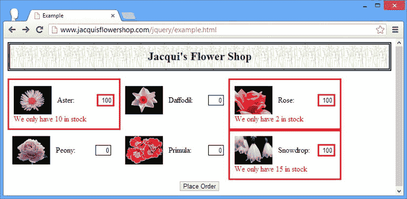

[图 13-13](#_Fig13) 。使用函数定义自定义检查的错误消息

格式化验证错误显示

在我看来，验证插件最好的特性之一是有多种方式可以配置如何向用户显示验证错误消息。在本章到目前为止的例子中，我依赖于清单 13-22 中突出显示的配置选项。

***[清单 13-22](#_list22)*** 。用于格式化验证错误的配置选项

```js
...
<script type="text/javascript">
    $(document).ready(function () {

        var data = {
            flowers: [
                { name: "Aster", product: "aster", stock: "10", price: "2.99" },
                { name: "Daffodil", product: "daffodil", stock: "12", price: "1.99" },
                { name: "Rose", product: "rose", stock: "2", price: "4.99" },
                { name: "Peony", product: "peony", stock: "0", price: "1.50" },
                { name: "Primula", product: "primula", stock: "1", price: "3.12" },
                { name: "Snowdrop", product: "snowdrop", stock: "15", price: "0.99" }]
        };

        var templResult = $("#flowerTmpl").template(data).filter("*");
        templResult.slice(0, 3).appendTo("#row1");
        templResult.slice(3).appendTo("#row2");

        $("form").validate({
            highlight: function (element, errorClass) {
                $(element).add($(element).parent()).addClass("invalidElem");
            },
            unhighlight: function (element, errorClass) {
                $(element).add($(element).parent()).removeClass("invalidElem");
            },
            errorElement: "div",
            errorClass: "errorMsg"
        });

        $.validator.addMethod("stock", function (value, elem, args) {
            return Number(value) < Number(args);
        }, function(args) {
            return "We only have " + args + " in stock"
        });

        $("input").each(function (index, elem) {
            $(elem).rules("add", {
                stock: data.flowers[index].stock
            })
        }).change(function (e) {
            $("form").validate().element($(e.target));
        });
    });
</script>
...
```

我依赖于四种不同的配置选项，但是它们紧密地耦合在一起。我将在下面的章节中解释每一个的重要性。

设置无效元素的类别

`errorClass`选项指定了一个与无效值相关联的类。当错误消息元素添加到文档中时，该类应用于这些错误消息元素。在我的例子中，我指定了一个名为`errorMsg`的类，它在`style`元素中有一个对应的 CSS 样式，如[清单 13-23](#list23) 所示。样式将文本颜色设置为红色，以强调验证错误。

***[清单 13-23](#_list23)*** 。示例文档的样式元素

```js
...
<style type="text/css">
    .errorMsg {color: red}
    .invalidElem {border: medium solid red}
</style>
...
```

设置错误信息元素

错误消息作为包含无效值的`form`元素的下一个兄弟元素插入到文档中。默认情况下，错误消息文本包含在一个`label`元素中。这在示例中并不适合我，因为外部样式表已经包含了一个选择器，它匹配 CSS 表格布局中单元格级`div`元素内的所有`label`元素，并且应用了一个阻止文本正确显示的样式。为了解决这个问题，我使用了`errorElement`选项来指定使用一个`div`元素，如清单 13-24 所示。

***[清单 13-24](#_list24)*** 。指定将用于错误信息的元素

```js
...
$("form").validate({
    highlight: function(element, errorClass) {
        $(element).add($(element).parent()).addClass("invalidElem");
    },
    unhighlight: function(element, errorClass) {
        $(element).add($(element).parent()).removeClass("invalidElem");
    },
    errorElement: "div",
    errorClass: "errorMsg",

});
...
```

设置无效元素的高亮显示

`highlight`和`unhighlight`选项指定用于突出显示包含无效值的元素的功能。函数的参数是代表无效元素的`HTMLElement`对象和使用`errorClass`选项指定的类。

正如您在[清单 13-25](#list25) 中看到的，我忽略了第二个属性，但是使用`HTMLElement`对象创建一个 jQuery 选择，导航到父元素，并将其添加到`invalidElem`类中。

***[清单 13-25](#_list25)*** 。控制元素高亮显示

```js
...
$("form").validate({
    highlight: function(element, errorClass) {
        $(element).add($(element).parent()).addClass("invalidElem");
    },
    unhighlight: function(element, errorClass) {
        $(element).add($(element).parent()).removeClass("invalidElem");
    },
    errorElement: "div",
    errorClass: "errorMsg",

});
...
```

当用户纠正问题并且元素包含有效值时，调用由`unhighlight`选项指定的函数。我利用这个机会删除我在另一个函数中添加的类。`invalidElem`类对应于文档中包含的`style`元素中的一个选择器，如清单 13-26 中的[所示。](#list26)

***[清单 13-26](#_list26)*** 。用于突出显示元素的样式

```js
...
<style type="text/css">
    .errorMsg {color: red}
    .invalidElem {border: medium solid red}
</style>
...
```

您可以按照自己喜欢的任何方式选择和操作这些函数中的元素。我已经对父元素应用了边框，但是如果我愿意，我也可以直接对元素本身或整个文档的另一部分进行操作。

使用验证摘要

验证插件可以向用户显示所有验证错误的单一列表，而不是在每个元素旁边添加单独的消息。如果文档的结构或布局不容易伸缩以容纳额外的元素，这将非常有用。清单 13-27 展示了如何创建一个验证摘要。

***[清单 13-27](#_list27)*** 。使用验证摘要

```js
...
<script type="text/javascript">
    $(document).ready(function () {

        var data = {
            flowers: [
                { name: "Aster", product: "aster", stock: "10", price: "2.99" },
                { name: "Daffodil", product: "daffodil", stock: "12", price: "1.99" },
                { name: "Rose", product: "rose", stock: "2", price: "4.99" },
                { name: "Peony", product: "peony", stock: "0", price: "1.50" },
                { name: "Primula", product: "primula", stock: "1", price: "3.12" },
                { name: "Snowdrop", product: "snowdrop", stock: "15", price: "0.99" }]
        };

        var plurals = {
            aster: "Asters", daffodil: "Daffodils", rose: "Roses",
            peony: "Peonies", primula: "Primulas", snowdrop: "Snowdrops"
        };

        var templResult = $("#flowerTmpl").template(data).filter("*");
        templResult.slice(0, 3).appendTo("#row1");
        templResult.slice(3).appendTo("#row2");

        $("<div id='errorSummary'>Please correct the following errors:</div>")
            .addClass("errorMsg invalidElem")
            .append("<ul id='errorsList'></ul>").hide().insertAfter("h1");

        $("form").validate({
            highlight: function (element, errorClass) {
                $(element).addClass("invalidElem");
            },
            unhighlight: function (element, errorClass) {
                $(element).removeClass("invalidElem");
            },
            errorContainer: "#errorSummary",
            errorLabelContainer: "#errorsList",
            wrapper: "li",
            errorElement: "div"
        });

        $.validator.addMethod("stock", function (value, elem, args) {
            return Number(value) <= Number(args.data.stock);
        }, function (args) {
            return "You requested " + $(args.element).val() + " "
                + plurals[args.data.product] + " but we only have "
                + args.data.stock + " in stock";
        });

        $("input").each(function (index, elem) {
            $(elem).rules("add", {
                stock: {
                    index: index,
                    data: data.flowers[index],
                    element: elem
                }
            })
        }).change(function (e) {
            $("form").validate().element($(e.target));
        });

    });
</script>
...
```

对于这个例子，我将反向工作，在解释我如何到达那里之前向您展示结果。[图 13-14](#Fig14) 显示了正在显示的验证摘要。

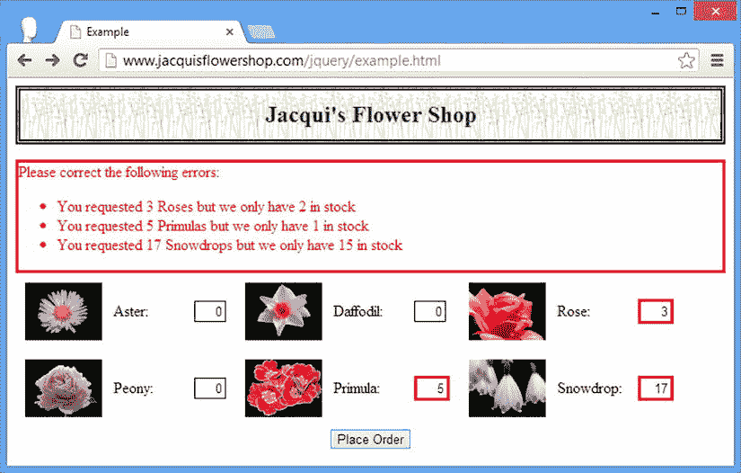

[图 13-14](#_Fig14) 。使用验证摘要

准备验证消息

使用验证摘要时要解决的第一个问题是，将错误消息放在`form`元素旁边所隐含的上下文会丢失；我必须对错误消息做一些额外的工作，以便它们有意义。首先，我定义了一个包含花名复数的对象:

```js
...
var plurals = {
    aster: "Asters", daffodil: "Daffodils", rose: "Roses",
    peony: "Peonies", primula: "Primulas", snowdrop: "Snowdrops"
}
...
```

我使用自定义检查的函数特性，使用这些值生成特定的错误消息，如下所示:

```js
...
$.validator.addMethod("stock", function (value, elem, args) {
    return Number(value) <= Number(args.data.stock);
}, function (args) {
    return "You requested " + $(args.element).val() + " "
        + plurals[args.data.product] + " but we only have "
        + args.data.stock + " in stock";
});
...
```

这两个阶段之间的联系是我在对`form`元素应用自定义检查时指定的参数对象。内置检查具有简单的参数，但是您可以创建复杂的对象并传递任何适合您的数据，如下所示:

```js
...
$("input").each(function (index, elem) {
    $(elem).rules("add", {
        stock: {
            index: index,
            data: data.flowers[index],
            element: elem
        }
    })
}).change(function (e) {
    $("form").validate().element($(e.target));
});
...
```

在本例中，我已经传递了索引、数据数组和元素本身，所有这些我都用来拼凑消息以显示给用户。(在本章的后面，我将向您展示一个简化字符串组合的有用特性。)

创建验证摘要

我负责创建包含验证摘要的元素，并将其添加到文档中。为此，我添加了一个包含一个`ul`元素的`div`元素。我的目标是创建一个显示每个错误的无编号列表:

```js
...
$("<div id='errorSummary'>Please correct the following errors:</div>")
    .addClass("errorMsg invalidElem").append("<ul id='errorsList'></ul>").hide().insertAfter("h1");
...
```

`div`元素中的文本显示在错误列表的上方。注意，在将这些元素添加到 DOM 之后，我使用了`hide`方法。我不仅负责创建元素，还负责确保在没有错误时它们是不可见的。`hide`方法确保了用户最初看不到验证摘要——一旦验证过程开始，验证插件将负责查看。

现在我已经准备好了所有的部分，我可以配置验证摘要，如下所示:

```js
...
$("form").validate({
    highlight: function (element, errorClass) {
        $(element).addClass("invalidElem");
    },
    unhighlight: function (element, errorClass) {
        $(element).removeClass("invalidElem");
    },
    errorContainer: "#errorSummary",
    errorLabelContainer: "#errorsList",
    wrapper: "li",
    errorElement: "div"
});
...
```

我已经修改了`hightlight`和`unhighlight`函数的实现，只设计了`input`元素的样式。`errorContainer`选项指定了一个选择器，当有验证错误要显示时，该选择器将变得可见。在我的例子中，这是 ID 为`errorSummary`的元素(即`div`元素)。`errorLabelContainer`选项指定单个错误消息将被插入的元素。对于我的例子，这是`ul`元素，因为我希望我的消息显示为列表。

`wrapper`选项指定验证消息将被插入的元素。这仅在您需要列表显示时有用。最后，`errorElement`指定了包含错误文本的元素。默认情况下，这是`label`元素，但是为了使格式化更容易，我已经切换到了`div`元素。这些选项的结果就是我在[图 13-14](#Fig14) 中展示给你的验证总结。

当用户解决一个问题时，验证插件从摘要中删除消息，当根本没有问题时，验证摘要完全隐藏，用户可以提交表单。[图 13-15](#Fig15) 显示了解决了上图中三个错误中的两个后的验证总结。

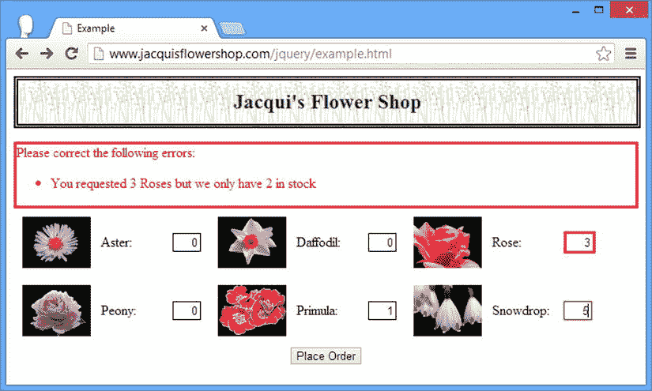

[图 13-15](#_Fig15) 。显示较少错误消息的验证摘要

内联消息和验证摘要之间的选择是个人的选择，通常由文档的结构决定。好消息是验证插件非常灵活，定义和应用完全符合您需求的验证通常不需要太多工作。

整理错误消息组合

我将在本章中做最后一个改动，只是为了演示验证插件的一个有用特性，它与验证数据没有直接关系。在前面的示例中，当我想要创建上下文错误消息时，我通过连接字符串和变量来实现，如下所示:

```js
...
$.validator.addMethod("stock", function (value, elem, args) {
    return Number(value) <= Number(args.data.stock);
}, function (args) {
    return "You requested " + $(args.element).val() + " "
        + plurals[args.data.product] + " but we only have "
        + args.data.stock + " in stock";
});
...
```

这个可以，但是很难看，很难读。验证插件方法提供了一个格式化程序，其工作方式类似于 C#等语言中的字符串合成，你可以在清单 13-28 中看到我是如何使用这个特性的。

***[清单 13-28](#_list28)*** 。使用 jQuery 验证器字符串格式化特性

```js
...
$.validator.addMethod("stock", function (value, elem, args) {
    return Number(value) <= Number(args.data.stock);
}, function(args) {
    return $.validator.format("You requested {0} {1} but we only have {2} in stock",
        $(args.element).val(), plurals[args.data.product], args.data.stock )
});
...
```

字符串组合由`$.validator.format`方法执行，该方法采用一个模板字符串和一些值参数。对模板字符串进行解析，寻找整数周围的大括号字符，比如`{0}`，这些字符将被相应的 value 参数替换。第一个值参数由`{0}`引用，第二个由`{1}`引用，依此类推。`$.validator.format`方法返回一个函数，直到显示错误消息时才进行计算，这确保了在组成字符串时使用了正确的值。

如果您不习惯，这可能是一种奇怪的创建字符串的方式，但是如果您习惯了像 C#这样经常依赖这种方式来组成字符串的语言，这将是一个非常缺少的特性。

摘要

在本章中，我向您展示了 jQuery 为表单提供的支持。我首先概述了与表单相关的事件方法，并解释了在 HTML 表单的生命周期中最重要的事件方法所扮演的角色。本章的大部分时间都在讨论验证插件，它为验证用户输入表单的值提供了灵活且可扩展的支持，并提供了在数据提交到服务器之前解决任何问题的方法。在第 14 章中，我开始描述 jQuery 为 Ajax 请求提供的支持。