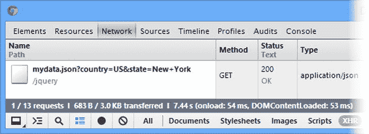

# 十四、使用 Ajax：第一部分

*Ajax* 代表异步 JavaScript 和 XML，但如今通常是一个独立的词。Ajax 允许您异步向服务器发出请求，简而言之，这意味着您的请求发生在后台，不会阻止用户与 HTML 文档中的内容进行交互。Ajax 最常见的用途是从一个`form`元素提交数据。这样做的好处是浏览器不需要加载新的文档来显示服务器的响应，你可以使用标准的 jQuery 函数无缝地显示文档中的数据。

我在本章中使用的 Ajax 支持是内置在核心 jQuery 库中的，尽管我在本章末尾简要描述了一个有用的插件。jQuery 没有重新发明 Ajax，而是让现有的浏览器 Ajax API(应用编程接口)更容易使用。在这一章中，我描述了*简写*和*便利* Ajax 方法。这些更简单的方法使得使用 Ajax 变得相对快速和容易。在第十五章中，我描述了这些方法所基于的底层 jQuery Ajax API。然而，正如您将看到的，低级 API 并不是*那么低级，使用它的主要原因是当简写和方便的方法不完全符合您的需要时。表 14-1 提供了本章的总结。*

表 14-1 。章节总结

| 问题 | 解决办法 | 列表 |
| --- | --- | --- |
| 执行异步 HTTP `GET`请求 | 使用`get`方法 | 1–3 |
| 处理从 Ajax `GET`请求中获得的数据 | 将函数传递给`get`方法 | four |
| 执行 Ajax 请求以响应用户操作 | 在事件处理程序中调用`get`方法 | five |
| 从服务器请求 JSON 数据 | 使用`get`方法并在参数函数中接收一个对象 | 6, 7 |
| 将数据作为`GET`请求的一部分发送到服务器 | 将 JavaScript 对象作为参数传递给`get`方法 | eight |
| 执行异步 HTTP `POST`请求 | 使用`post`方法 | 9, 10 |
| 在`POST`请求中发送非表单数据 | 将任何 JavaScript 对象作为参数传递给`post`方法 | Eleven |
| 覆盖服务器在响应 Ajax 请求时指定的数据类型 | 将预期类型作为参数传递给`get`或`post`方法 | 12–13 |
| 避免最常见的 Ajax 陷阱 | 不要认为 Ajax 请求是同步的 | Fourteen |
| 使用方便的方法对特定的数据类型进行`GET`请求 | 使用`load`、`getScript`或`getJSON`方法 | 15–22 |
| 轻松为`form`元素启用 Ajax | 使用 Ajax 表单插件 | Twenty-three |

使用 Ajax 速记方法

尽管 Ajax 通常与提交表单数据相关联，但它的应用范围要广得多。我将通过执行一些简单的任务来开始介绍 Ajax，从根本不使用表单就可以从服务器获取数据的方法开始。

jQuery 定义了一组 *Ajax 速记方法*，它们是核心 Ajax 函数的方便包装器，允许您轻松执行常见的 Ajax 任务。在接下来的小节中，我将向您介绍使用 HTTP `GET`请求从服务器检索数据的简化方法。表 14-2 总结了这些方法。

表 14-2 。jQuery Ajax 速记方法

| 名字 | 描述 |
| --- | --- |
| `$.get()` | 使用 HTTP GET 方法执行 Ajax 请求 |
| `$.post()` | 使用 HTTP POST 方法执行 Ajax 请求 |

(简要)理解异步任务

对于不熟悉 Ajax 的人来说，这里有一个异步请求的简单解释。这很重要，因为这些任务对 Ajax 来说是如此重要，以至于首字母缩写代表*异步*。大多数时候，你习惯于写同步代码。您定义了一个执行某些任务的语句块，然后等待浏览器执行它们。当执行完最后一条语句时，就知道任务已经执行了。在执行过程中，浏览器不允许用户以任何方式与内容进行交互。

当你执行一个异步任务时，你是在告诉浏览器你想在后台做一些事情。短语“在后台”有点笼统，但本质上你是在说，“在不阻止用户与文档交互的情况下做这件事，完成后告诉我。”在 Ajax 的情况下，您告诉浏览器与服务器通信，并在请求完成时通知您。这个通知是通过*回调函数*处理的。您给 jQuery 一个或多个函数，当任务完成时将调用这些函数。将有一个函数来处理一个成功的请求，也可能有其他函数来处理其他结果，比如错误。

异步请求的优点是，它们允许您创建一个丰富的 HTML 文档，可以使用来自服务器的响应无缝更新该文档，而不会中断用户的交互，也不会让用户在浏览器加载新文档时等待。

缺点是你必须仔细考虑你的代码。您无法预测异步请求何时完成，也无法对结果做出假设。此外，回调函数的使用往往会创建更复杂的代码，这可能会惩罚那些对请求的结果或及时性做出假设的粗心的程序员。

执行 Ajax GET 请求

首先，我将使用 Ajax 执行一个 HTTP `GET`请求来加载一个 HTML 片段，然后我将它添加到浏览器显示的 HTML 文档中。清单 14-1 显示了我将使用的示例文档。

***清单 14-1*** 。该示例文档

```js
<!DOCTYPE html>
<html>
<head>
    <title>Example</title>
    <script src="jquery-2.0.2.js" type="text/javascript"></script>
    <script src="handlebars.js" type="text/javascript"></script>
    <script src="handlebars-jquery.js" type="text/javascript"></script>
    <script src="jquery.validate.js" type="text/javascript"></script>
    <link rel="stylesheet" type="text/css" href="styles.css"/>
    <script type="text/javascript">
        $(document).ready(function() {
            // ...
*code will go here*...
        });
    </script>
</head>
<body>
    <h1>Jacqui's Flower Shop</h1>
    <form method="post" action="http://node.jacquisflowershop.com/order">
        <div id="oblock">
            <div class="dtable">
                <div id="row1" class="drow">
                </div>
                <div id="row2"class="drow">
                </div>
            </div>
        </div>
        <div id="buttonDiv"><button type="submit">Place Order</button></div>
    </form>
</body>
</html>
```

这类似于我在前面章节中使用的例子，但是没有描述产品的元素，也没有生成产品的数据项或模板。相反，我创建了一个名为`flowers.html`的单独文件，放在示例文档的旁边(名为`example.html`，可以在 Apress 网站[ `www.apress.com` ]的源代码/下载区找到)。清单 14-2 显示了`flowers.html`的内容。

***清单 14-2*** 。flowers.html 文件的内容

```js
<div>
    <label for="aster">Aster:</label>
    <input name="aster" value="0" required />
</div>
<div>
    <label for="daffodil">Daffodil:</label>
    <input name="daffodil" value="0" required />
</div>
<div>
    <label for="rose">Rose:</label>
    <input name="rose" value="0" required />
</div>
<div>
    <label for="peony">Peony:</label>
    <input name="peony" value="0" required />
</div>
<div>
    <label for="primula">Primula:</label>
    <input name="primula" value="0" required />
</div>
<div>
    <label for="snowdrop">Snowdrop:</label>
    <input name="snowdrop" value="0" required />
</div>
```

这些是我在前面章节中使用的相同元素，除了它们没有被分配给行，并且我已经从`div`元素中移除了`class`属性。我做了这些更改，以便在您加载元素后，我可以向您展示如何使用它们。注意，这不是一个完整的 HTML 文档，只是一个片段——例如，没有`html`、`head`或`body`元素。目前，`flowers.html`文档与主示例完全分离，你可以在图 14-1 中看到这一点。


图 14-1 。最初的示例文档

我将使用 jQuery 对 Ajax 的支持，把 HTML 片段放到主 HTML 文档中。这似乎是一件奇怪的事情，但是我正在模拟一种常见的情况，即不同的内容由不同的系统生成，需要拼接在一起以创建一个复杂的文档或 web 应用。为了简单起见，我在这个例子中只使用了一台服务器，但是很容易想象关于产品的信息来自其他地方。事实上，在后面的例子中，我引入`Node.js`是为了向您展示如何处理多个服务器。这都是以后的事。现在，让我们看看基本的 jQuery Ajax 支持，并用它来处理`flowers.html`文件。清单 14-3 展示了我是如何做到这一点的。

***清单 14-3*** 。通过 HTML 片段使用 jQuery Ajax 支持

```js
...
<script type="text/javascript">
    $(document).ready(function () {
        $.get("flowers.html", function (data) {
            var elems = $(data).filter("div").addClass("dcell");
            elems.slice(0, 3).appendTo("#row1");
            elems.slice(3).appendTo("#row2");
        });
    });
</script>
...
```

我使用了 jQuery `get`方法，并提供了两个参数。第一个参数是我想要加载的 URL。在本例中，我指定了`flowers.html`，它将被解释为一个相对于加载主文档的 URL 的 URL。

第二个参数是一个函数，如果请求成功，它将被调用。正如我在侧栏中提到的，Ajax 依靠回调函数来提供通知，因为请求是异步执行的。jQuery 将来自服务器响应的数据作为参数传递给函数。

当包含这个脚本的文档被加载到浏览器中时，`script`元素被执行，我的 jQuery 代码从服务器加载`flowers.html`。一旦加载了`flowers.html`文档，它包含的 HTML 片段就会被解析成 HTML 元素，然后添加到文档中。图 14-2 显示了结果。


图 14-2 。使用 Ajax 的效果

好吧，我承认我最终得到了与元素或数据内联时相同的结果，但是我采取的方法值得探索，在接下来的部分中，我将深入探讨细节。

 **提示**虽然我使用了`get`方法来加载 HTML，但是它可以用来从服务器获取任何类型的数据。

处理响应数据

传递给 success 函数的参数是服务器为响应我的请求而发回的数据。在这个例子中，我获取了`flowers.html`文件的内容，这是一个 HTML 片段。为了使它成为我可以在 jQuery 中使用的东西，我将数据传递给 jQuery `$`函数，以便它被解析成一个层次结构的`HTMLElement`对象，如清单 14-4 中的所示。

***清单 14-4*** 。处理从服务器获得的数据

```js
...
<script type="text/javascript">
    $(document).ready(function() {
        $.get("flowers.html", function(data) {
            var elems = $(data).filter("div").addClass("dcell");
            elems.slice(0, 3).appendTo("#row1");
            elems.slice(3).appendTo("#row2");
        });
    });
</script>
...
```

正如我之前提到的，我从`div`元素中省略了`class`属性。你可以看到我使用 jQuery `addClass`方法将它们添加回去。一旦数据被传递给`$`函数，我就可以像使用其他对象一样使用返回的`jQuery`对象。我使用`slice`和`appendTo`方法将元素添加到文档中，正如我在前面章节中所做的那样。

 **提示**注意，我使用了`filter`方法来只选择从数据中生成的`div`元素。在解析数据时，jQuery 假设我在结构的`flowers.html`文件中的`div`元素之间添加的回车符是文本内容，并为它们创建文本元素。为了避免这种情况，您可以确保在您请求的文档中没有回车，或者使用`filter`方法来删除它。这类似于我在第十三章中遇到的数据模板问题。

使效果更容易看到

创建 Ajax 请求的语句被执行以响应`ready`事件(我在第五章中描述过)，这使得很难想象使用 Ajax 与使用内联数据有什么不同，因为`flowers.html`文件的内容是自动加载和显示的。为了使区别更加明显，我在文档中添加了一个`button`，并处理它生成的`click`事件，这样 Ajax 请求只有在被点击时才会被执行。您可以在清单 14-5 中看到这些变化。

***清单 14-5*** 。发出 Ajax 请求以响应按钮按下的

```js
...
<script type="text/javascript">
    $(document).ready(function () {
        $("<button>Ajax</button>").appendTo("#buttonDiv").click(function (e) {
            $.get("flowers.html",
                function (data) {
                    var elems = $(data).filter("div").addClass("dcell");
                    elems.slice(0, 3).appendTo("#row1");
                    elems.slice(3).appendTo("#row2");
                });
            e.preventDefault();
        });
    });
</script>
...
```

现在`flowers.html`文档直到按钮被点击才被加载，并且每次点击它，额外的元素被添加到文档中，如图图 14-3 所示。


图 14-3 。使用 Ajax 响应按钮按压

 **提示**注意，我已经在传递给我的事件处理函数的`Event`对象上调用了`preventDefault`方法。由于`button`元素包含在`form`元素中，默认的动作是将表单提交给服务器。

获取其他类型的数据

您不仅限于对 HTML 使用`get`方法——您可以从服务器获得任何类型的数据。特别感兴趣的是 JavaScript Object Notation (JSON)数据，因为 jQuery 处理来自服务器的响应的方式很有帮助。当 Ajax 开始被广泛采用时，XML 被视为首选的数据格式，以至于 Ajax 中的 *X* 代表 XML。我不打算深入研究 XML 的细节，但是 XML 往往很冗长，难以阅读，并且生成和处理起来相对耗费时间和资源。

近年来，XML 已经在很大程度上被 JSON 所取代，JSON 是一种更简单的数据格式，并且易于在 JavaScript 代码中使用(顾名思义)。对于这个例子，我已经创建了一个名为`mydata.json`的文件，并将它保存在 web 服务器上的`example.html`文件旁边。清单 14-6 显示了`mydata.json`?? 的内容。

***清单 14-6*** 。mydata.json 文件的内容

```js
[{"name":"Aster","product":"aster","stock":"10","price":"2.99"},
 {"name":"Daffodil","product":"daffodil","stock":"12","price":"1.99"},
 {"name":"Rose","product":"rose","stock":"2","price":"4.99"},
 {"name":"Peony","product":"peony","stock":"0","price":"1.50"},
 {"name":"Primula","product":"primula","stock":"1","price":"3.12"},
 {"name":"Snowdrop","product":"snowdrop","stock":"15","price":"0.99"}]
```

该文件包含花卉产品的数据，如您所见，JSON 数据几乎与您在 JavaScript 代码中表示数据的方式相同。为了使用 Ajax 加载和处理这些数据，我可以再次使用`get`方法，如清单 14-7 中的所示。

***清单 14-7*** 。使用 get 方法获取 JSON 数据

```js
...
<script id="flowerTmpl" type="text/x-handlebars-template">
    {{#flowers}}
    <div class="dcell">
        
        <label for="{{product}}">{{name}}</label>
        <input name="{{product}}" data-price="{{price}}" data-stock="{{stock}}"
            value="0" required />
    </div>
    {{/flowers}}
</script> `<script type="text/javascript">`
    `$(document).ready(function () {`
        `$("<button>Ajax</button>").appendTo("#buttonDiv").click(function (e) {`
            `$.get("mydata.json", function (data) {`
                **var tmplData = $("#flowerTmpl").template({flowers: data}).filter("*");**
                **tmplData.slice(0, 3).appendTo("#row1");**
                **tmplData.slice(3).appendTo("#row2");**
            `});`
            `e.preventDefault();`
        `});`
    `});`
`</script>`
`...`
```

 `在这个例子中，我请求 JSON 数据文件来响应`button`点击。从服务器检索的数据被传递给一个函数，就像 HTML 片段一样。我已经使用车把模板插件(在第十二章中描述)来处理数据并从中生成 HTML 元素，然后使用`slice`和`appendTo`方法将元素插入到文档中。请注意，我不需要做任何事情来将 JSON 字符串转换成 JavaScript 对象:jQuery 自动为我完成了这项工作。

 **提示**一些网络服务器(包括我在本书中使用的微软 IIS 的一些版本)如果不能识别文件扩展名或数据格式，就不会向浏览器返回内容。为了让这个例子与 IIS 一起工作，我必须在文件扩展名(`.json`)和 JSON 数据的 MIME 类型(`application/json`)之间添加一个新的映射。在我这样做之前，当请求`mydata.json`时，IIS 会返回 404—未找到错误。

提供数据以获取请求

将数据作为`GET`请求的一部分发送到服务器是可能的，这种请求是由`get`方法(以及我在本章后面描述的`load`、`getScript`和`getJSON`方法)发出的。要将数据作为 GET 请求的一部分发送，需要将一个数据对象传递给`get`方法，如清单 14-8 所示。

***清单 14-8*** 。作为 GET 请求的一部分发送数据

```js
...
<script type="text/javascript">
    $(document).ready(function () {

        var requestData = {
            country: "US",
            state: "New York"
        };

        $("<button>Ajax</button>").appendTo("#buttonDiv").click(function (e) {
            $.get("mydata.json",requestData, function (data) {
                var tmplData = $("#flowerTmpl").template({flowers: data}).filter("*");
                tmplData.slice(0, 3).appendTo("#row1");
                tmplData.slice(3).appendTo("#row2");
            });
            e.preventDefault();
        });
    });
</script>
...
```

您提供的数据将作为查询字符串追加到指定的 URL。对于本例，这意味着您请求以下内容:

```js
http://www.jacquisflowershop.com/jquery/flowers.html?country=US&state=New+York
```

服务器可以使用您提供的数据来定制返回的内容。例如，不同的州可能有不同的花卉区。您将无法在浏览器中看到用于发出 Ajax 请求的 URL，但是您可以使用开发人员的工具(通常称为 *F12 工具*，因为它们是通过 F12 键访问的)来查看正在发出什么请求。对于 Google Chrome，按 F12，在出现的窗口中点击`Network`标签，点击 *XHR* 过滤器(XHR 指的是`XmlHttpRequest`对象，是 jQuery 用来发出 Ajax 请求的文档对象模型(DOM)对象)。图 14-4 说明了 Chrome 如何在例子中显示 Ajax 请求的细节。



图 14-4 。使用 Google Chrome F12 工具检查 Ajax 请求

获取和发布:选择正确的

您可能想使用`GET`请求发送表单数据。小心点。根据经验，`GET`请求应该用于只读信息检索，而`POST`请求应该用于任何改变应用状态的操作。

在符合标准的术语中，`GET`请求是针对*安全的*交互(除了信息检索之外没有副作用)，而`POST`请求是针对*不安全的*交互(做出决定或改变某事)。这些惯例是由万维网联盟(W3C)在`www.w3.org/Provider/Style/URI`制定的。

因此，您可以使用`GET`请求向服务器发送表单数据，但不能用于改变状态的操作。2005 年，当 Google web Accelerator 向公众发布时，许多 Web 开发人员经历了惨痛的教训。这个应用预取了每个页面链接的所有内容，这在 HTTP 中是合法的，因为`GET`请求应该是安全的。不幸的是，许多 web 开发人员忽略了 HTTP 约定，在他们的应用中放置了指向“删除项目”或“添加到购物车”的简单链接。混乱随之而来。

一家公司认为其内容管理系统是多次恶意攻击的目标，因为其所有内容都不断被删除。该公司后来发现，一个搜索引擎爬虫偶然发现了一个管理页面的 URL，并抓取了所有删除链接。

执行 Ajax POST 请求

现在，您已经看到了如何从服务器获取数据，我可以将注意力转向如何发送数据了，也就是说，如何将表单数据发送到服务器。再次，还有一个速记方法:`post`，让发布一个表单变得简单。但是在我演示使用`post`方法之前，我需要扩展`formserver.js`文件的代码，以便`Node.js`能够接收和处理我在示例中使用的 POST 请求。

准备 Node.js 以接收表单数据

我需要一个服务器脚本，它将使用 HTTP `POST`方法接收从浏览器发送的数据，对已经发送的数据执行一些简单的操作，并生成响应。清单 14-9 显示了我第一次在第十三章中使用的`formserver.js`文件的更新版本。

***清单 14-9*** 。修改后的 formserver.js 文件

```js
var http = require("http");
var querystring = require("querystring");
var url = require("url");

var port = 80;

http.createServer(function (req, res) {
    console.log("[200 OK] " + req.method + " to " + req.url);

    if (req.method == "OPTIONS") {
        res.writeHead(200, "OK", {
            "Access-Control-Allow-Headers": "Content-Type",
            "Access-Control-Allow-Methods": "*",
            "Access-Control-Allow-Origin": "http://www.jacquisflowershop.com"
        });
        res.end();

    } else if (req.method == "POST") {
        var dataObj = new Object();
        var contentType = req.headers["content-type"];
        var fullBody = "";

        if (contentType) {
            if (contentType.indexOf("application/x-www-form-urlencoded") > -1) {
                req.on("data", function (chunk) { fullBody += chunk.toString(); });
                req.on("end", function () {
                    var dBody = querystring.parse(fullBody);
                    writeResponse(req, res, dBody,
                        url.parse(req.url, true).query["callback"])
                });
            } else {
                req.on("data", function (chunk) { fullBody += chunk.toString(); });
                req.on("end", function () {
                    dataObj = JSON.parse(fullBody);
                    var dprops = new Object();
                    for (var i = 0; i < dataObj.length; i++) {
                        dprops[dataObj[i].name] = dataObj[i].value;
                    }
                    writeResponse(req, res, dprops);
                });
            }
        }
    } else if (req.method == "GET") {
        var data = url.parse(req.url, true).query;
        writeResponse(req, res, data, data["callback"])
    }

    function writeResponse(req, res, data, jsonp) {
        var total = 0;
        for (item in data) {
            if (item != "_" && data[item] > 0) {
                total += Number(data[item]);
            } else {
                delete data[item];
            }
        }
        data.total = total;
        jsonData = JSON.stringify(data);
        if (jsonp) {
            jsonData = jsonp + "(" + jsonData + ")";
        }

        res.writeHead(200, "OK", {
            "Content-Type": "application/json",
            "Access-Control-Allow-Origin": "*"
        });
        res.write(jsonData);
        res.end();
    }

}).listen(port);
console.log("Ready on port " + port);
```

 **提示**获得这个脚本最简单的方法是下载本书附带的源代码，这个源代码可以在 Apress 网站`www.apress.com`上免费获得。我在第一章的中包含了获取`Node.js`的细节。

和以前一样，我通过在命令提示符下输入以下命令来运行脚本:

```js
node.exe formserver.js
```

修改后的`Node.js`脚本处理浏览器发送的数据并创建 JSON 响应。我本来可以从这个脚本返回 HTML，但是 JSON 更紧凑，而且通常更容易使用。我返回的 JSON 对象是一个简单的对象，它包含用户选择的产品的总数，以及每个产品的指定值。例如，如果我选择了一朵紫苑、两朵水仙花和三朵玫瑰，那么由`Node.js`脚本返回的 JSON 响应将如下所示:

```js
{"aster":"1","daffodil":"2","rose":"2","total":5}
```

我之前展示的 JSON 字符串表示一个对象数组，但是这个服务器脚本只返回一个对象，其属性对应于所选的花。`total`属性包含单个选择的总和。我知道这不是服务器可以执行的最有价值的活动，但是我想把重点放在使用 Ajax 而不是服务器端开发上。

理解跨来源的 Ajax 请求

如果您查看新的`formserver.js`脚本，您会看到当我向浏览器写响应时，我设置了一个 HTTP 头，如下所示:

```js
Access-Control-Allow-Origin: http://www.jacquisflowershop.com
```

默认情况下，浏览器限制脚本在与包含它们的文档相同的*源*内发出 Ajax 请求。来源是 URL 的协议、主机名和端口组成部分的组合。如果两个 URL 具有相同的协议、主机名和端口，那么它们在同一个源中。如果这三种成分中的任何一种不同，那么它们的来源就不同。

 **提示**该策略旨在降低*跨站点脚本* (CSS)攻击的风险，在这种攻击中，浏览器(或用户)被诱骗执行恶意脚本。CSS 攻击超出了本书的范围，但是在`http://en.wikipedia.org/wiki/Cross-site_scripting`有一篇有用的维基百科文章提供了关于这个主题的很好的介绍。

表 14-3 显示了与主示例文档的 URL`www.jacquisflowershop.com/jquery/example.html`相比，URL 的变化如何影响原点。

表 14-3 。比较 URL

| 统一资源定位器 | 原产地比较 |
| --- | --- |
| `http://www.jacquisflowershop.com/apps/mydoc.html` | 相同的起源 |
| `https://www.jacquisflowershop.com/apps/mydoc.html` | 出身不同；协议不同 |
| `http://www.jacquisflowershop.com:81/apps/mydoc.html` | 出身不同；端口不同 |
| `http://node.jacquisflowershop.com/order` | 出身不同；主机不同 |

在我的配置中，我有两台服务器。`www.jacquisflowershop.com`处理静态内容，`node.jacquisflowershop.com`运行`Node.js`。从表中可以看出，第一台服务器上的文档与第二台服务器上的文档有不同的来源。当你想从一个原点向另一个原点发出请求时，它被称为*跨原点请求*。

这个政策的问题在于它是一个全面的禁令；没有跨来源请求。这导致使用一些丑陋的伎俩来欺骗浏览器发出违反策略的请求。幸运的是，现在有了一种合法的跨来源请求方式，在*跨来源资源共享* (CORS) 规范中定义了这种方式。我只想简单地描述一下 CORS。有关完整的细节，请参见`www.w3.org/TR/cors`处的完整 CORS 标准。

 **提示**CORS 规范相当新。当前一代的浏览器支持它，但是旧的浏览器会简单地忽略跨来源请求。一种更成熟的方法是使用 JSONP，我在“使用 JSONP”一节中对此进行了描述

CORS 的工作方式是，浏览器联系第二个服务器(在本例中是`Node.js`服务器),并在请求中包含一个`Origin`头。这个头的值是导致发出请求的文档的来源。

如果服务器识别出来源并希望允许浏览器进行跨来源请求，那么它会添加`Access-Control-Allow-Origin`头，设置值以匹配来自请求的`Origin`头。如果响应不包含这个头，那么浏览器会丢弃该响应。

 **提示**支持 CORS 意味着浏览器在联系服务器并获得响应报头后，必须应用跨来源安全策略，这意味着即使响应因所需报头丢失或指定了不同的域而被丢弃，仍会发出请求。这与不实现 CORS 的浏览器不同，浏览器只是阻止请求，从不联系服务器。

在`formserver.js`脚本中，我将`Access-Control-Allow-Origin`头设置为我的可信来源`http://www.jacquisflowershop.com`，但是您可以很容易地在请求中使用`Origin`头的值来遵循更复杂的决策过程。您还可以将`Access-Control-Allow-Origin`报头设置为星号(`*`，这意味着来自*任何*来源的跨来源请求都将被允许。这对于测试来说是没问题的，但是在生产应用中使用这种设置之前，您应该仔细考虑安全问题。

使用 post 方法提交表单数据

所以，现在我已经准备好了服务器并理解了 CORS，我可以使用`post`方法向服务器发送表单数据，如清单 14-10 所示。

***清单 14-10*** 。用 post 方法发送数据

```js
<!DOCTYPE html>
<html>
<head>
    <title>Example</title>
    <script src="jquery-2.0.2.js" type="text/javascript"></script>
    <script src="handlebars.js" type="text/javascript"></script>
    <script src="handlebars-jquery.js" type="text/javascript"></script>
    <script src="jquery.validate.js" type="text/javascript"></script>
    <link rel="stylesheet" type="text/css" href="styles.css"/>
    <script id="flowerTmpl" type="text/x-handlebars-template">
        {{#flowers}}
        <div class="dcell">
            
            <label for="{{product}}">{{name}}</label>
            <input name="{{product}}" data-price="{{price}}" data-stock="{{stock}}"
                value="0" required />
        </div>
        {{/flowers}}
    </script>
    <script id="totalTmpl" type="text/x-handlebars-template">
        <div id="totalDiv" style="clear: both; padding: 5px">
            <div style="text-align: center">Total Items:
                <span id=total>{{total}}</span></div>
        </div>
    </script>
    <script type="text/javascript">
        $(document).ready(function () {

            $.get("flowers.html", function (data) {
                var elems = $(data).filter("div").addClass("dcell");
                elems.slice(0, 3).appendTo("#row1");
                elems.slice(3).appendTo("#row2");
            });

            $("button").click(function (e) {
                var formData = $("form").serialize();
                $.post("[`node.jacquisflowershop.com/order`](http://node.jacquisflowershop.com/order)",
                    formData, processServerResponse);
                e.preventDefault();
            });

            function processServerResponse(data) {
                var inputElems = $("div.dcell").hide();
                for (var prop in data) {
                    var filtered = inputElems.has("input[name=" + prop + "]")
                        .appendTo("#row1").show();
                }
                $("#buttonDiv").remove();
                $("#totalTmpl").template(data).appendTo("body");
            }
        });
    </script>
</head>
<body>
    <h1>Jacqui's Flower Shop</h1>
    <form method="post" action="http://node.jacquisflowershop.com/order">
        <div id="oblock">
            <div class="dtable">
                <div id="row1" class="drow">
                </div>
                <div id="row2"class="drow">
                </div>
            </div>
        </div>
        <div id="buttonDiv"><button type="submit">Place Order</button></div>
    </form>
</body>
</html>
```

这个例子看起来比实际更复杂。我首先使用`getJSON`方法获得包含花卉产品细节的`mydata.json`文件，然后使用数据模板生成元素并将它们添加到文档中。这给了我你开始了解和喜爱的起点，如图图 14-5 所示。您可以看到我已经在`input`元素中输入了一些值:12 朵紫苑、20 朵水仙花、4 朵报春花和 4 朵雪花莲。


图 14-5 。向服务器发送数据的起点

我使用`click`方法来注册一个函数，当点击`button`元素时将调用这个函数，如下所示:

```js
...
$("button").click(function (e) {
    var formData = $("form").serialize();
    $.post("http://node.jacquisflowershop.com/order", formData, processServerResponse);
    e.preventDefault();
});
...
```

我做的第一件事是在`form`元素上调用`serialize`方法。这是一个有用的方法，它遍历所有的`form`元素，并创建一个 URL 编码的字符串，可以发送给服务器。

 **提示**注意，我在`Event`对象上调用了`preventDefault`方法，该对象被传递给我的`click`事件的处理函数。我需要这样做来阻止浏览器以常规方式发送表单——也就是说，通过发送数据并将响应作为单独的 HTML 文档加载。

对于我输入到`input`元素中的值，`serialize`方法生成一个字符串，如下所示:

```js
aster=12&daffodil=20&rose=0&peony=0&primula=4&snowdrop=0
```

我使用`serialize`方法，因为`post`方法以 URL 编码的格式发送数据(尽管这可以通过使用`ajaxSetup`全局事件处理程序方法来改变，我在第十五章的中描述过)。一旦我从输入元素获得了`data`，我就调用`post`方法来发起 Ajax 请求。

`post`方法的参数是我要将数据发送到的 URL(它不需要与由`form`元素的`action`属性指定的 URL 相同)、我要发送的数据以及请求成功时要调用的函数。在本例中，我从服务器获取响应，并将其传递给`processServerResponse`函数，其定义如下:

```js
...
function processServerResponse(data) {
    var inputElems = $("div.dcell").hide();
    for (var prop in data) {
        var filtered = inputElems.has("input[name=" + prop + "]")
            .appendTo("#row1").show();
    }
    $("#buttonDiv").remove();
    $("#totalTmpl").template(data).appendTo("body");
}
...
```

我隐藏了 CSS 布局中的所有单元格级别的`div`元素(它们是`dcell`类的成员),然后显示那些与来自服务器的 JSON 对象中的属性相对应的元素。我还使用一个新的数据模板来生成所选项目总数的显示。这些都是您可以在客户端执行的活动，但是这里的要点是您是通过 Ajax `POST`请求获得数据的。你可以在图 14-6 中看到结果。


图 14-6 。处理从 Ajax POST 请求返回的数据的效果

您可以看到向服务器提交表单数据是多么容易(当然，处理响应是多么容易，特别是如果是 JSON 的话)。

 **提示**如果您没有得到图中所示的响应，那么可能的原因是您的`CORS`头没有在`Node.js`脚本中设置到正确的域。作为一个快速测试，将它设置为`*`，看看会发生什么。

使用 post 方法发送其他数据

虽然`post`方法通常用于提交表单数据，但它实际上可以向服务器发送任何数据。我只是创建一个包含您的数据的对象，调用`serialize`方法来正确格式化数据，然后将它传递给`post`方法。

如果您在不使用表单的情况下从用户那里收集数据，或者如果您想要对包含在`POST`请求中的`form`元素进行选择，这可能是一种有用的技术。清单 14-11 展示了如何以这种方式使用`post`方法。

***清单 14-11*** 。使用 post 方法向服务器发送非表单数据

```js
...
<script type="text/javascript">
    $(document).ready(function () {

        $("button").click(function (e) {
            var requestData = {
                apples: 2,
                oranges: 10
            };

            $.post("http://node.jacquisflowershop.com/order", requestData,
                function (responseData) {
                    console.log(JSON.stringify(responseData));
                })
            e.preventDefault();
        })
    });
</script>
...
```

在这个脚本中，我创建了一个对象并显式定义了属性。我将这个对象传递给`post`方法，并使用`console.log`方法写出来自服务器的响应。(`formserver.js`脚本并不真正关心它从浏览器获得什么样的数据；它会尝试将这些值相加并生成一个总数。)该脚本会产生以下控制台输出:

```js
{"apples":"2","oranges":"10","total":12}
```

 **提示**来自服务器的 JSON 响应被 jQuery 自动转换成 JavaScript 对象。我使用了`JSON.stringify`方法(大多数浏览器都支持)将它转换回字符串，这样我就可以在控制台上显示它。

指定预期的数据类型

当您使用`get`和`post`方法时，jQuery 必须计算出服务器在响应您的请求时发送回哪种数据。它可以是从 HTML 到 JavaScript 文件的任何东西。为此，jQuery 依赖于服务器在响应中提供的信息，尤其是`Content-Type`头。在大多数情况下，这很好，但有时 jQuery 需要一点帮助。这通常是因为服务器为响应中的数据指定了错误的 MIME 类型。

您可以覆盖服务器提供的信息，并通过向`get`或`post`方法传递一个额外的参数来告诉 jQuery 您需要什么数据。该参数可以是下列值之一:

*   `xml`
*   `json`
*   `jsonp`
*   `script`
*   `html`
*   `text`

清单 14-12 展示了如何为`get`方法指定期望的数据类型。

***清单 14-12*** 。指定预期的数据类型

```js
...
<script type="text/javascript">
    $(document).ready(function () {
        $.get("mydata.json", function (responseData) {
            console.log(JSON.stringify(responseData));
        },"json");
    });
</script>
...
```

您将数据类型指定为速记方法的最后一个参数。在这个例子中，我已经告诉 jQuery 我正在等待 JSON 数据。服务器说内容类型是什么并不重要:jQuery 会将响应视为 JSON。此示例产生以下控制台输出:

```js
[{"name":"Aster","product":"aster","stock":"10","price":"2.99"},
 {"name":"Daffodil","product":"daffodil","stock":"12","price":"1.99"},
 {"name":"Rose","product":"rose","stock":"2","price":"4.99"},
 {"name":"Peony","product":"peony","stock":"0","price":"1.50"},
 {"name":"Primula","product":"primula","stock":"1","price":"3.12"},
 {"name":"Snowdrop","product":"snowdrop","stock":"15","price":"0.99"}]
```

这与我放入`mydata.json`文件的内容相同，当然，这也是您所期望的。指定数据类型的问题是您必须是正确的。如果数据实际上是不同的类型，那么你可能会有一些问题，如清单 14-13 所示。

***清单 14-13*** 。指定了错误的数据类型

```js
...
<script type="text/javascript">
    $(document).ready(function () {

        $.get("flowers.html", function (responseData) {
            console.log(JSON.stringify(responseData));
        },"json");
    });
</script>
...
```

在这个例子中，我请求了一个包含 HTML 的文件，但是告诉 jQuery 应该将其视为 JSON。这里的问题是，在处理 JSON 时，jQuery 会自动从数据中创建一个 JavaScript 对象，这是它用 HTML 做不到的。

 **提示**我会在第十五章中向你展示如何检测 Ajax 错误。

避免最常见的 Ajax 陷阱

在继续之前，我想向您展示 web 程序员使用 Ajax 最常见的问题，就是将异步请求视为同步请求。清单 14-14 给出了一个问题的例子。

***清单 14-14*** 。一个常见的 Ajax 错误

```js
...
<script type="text/javascript">
    $(document).ready(function () {

        var elems;

        $.get("flowers.html", function (data) {
            elems = $(data).filter("div").addClass("dcell");
        });

        elems.slice(0, 3).appendTo("#row1");
        elems.slice(3).appendTo("#row2");
    });
</script>
...
```

在这个例子中，我定义了一个名为`elems`的变量，Ajax 回调函数使用它来分配服务器请求的结果。我使用`slice`和`appendTo`方法将从服务器获得的元素添加到文档中。如果运行此示例，您将看到没有元素添加到文档中，并且根据您的浏览器，您将看到控制台上显示一条错误消息。以下是谷歌浏览器显示的信息:

```js
Uncaught TypeError: Cannot call method 'slice' of undefined
```

这里的问题是,`script`元素中的语句没有按照编写的顺序执行。示例中的代码假设将出现以下序列:

1.  定义`elems`变量。
2.  从服务器获取数据，并将其赋给`elems`变量。
3.  将`elems`变量中的元素切片并添加到文档中。

实际情况是这样的。

1.  定义`elems`变量。
2.  启动对服务器的异步请求。
3.  将`elems`变量中的元素切片并添加到文档中。

在未来的某个时刻，这种情况会发生。

1.  从服务器接收请求。
2.  处理数据并将其分配给`elems`变量。

简而言之，我得到错误消息，因为我在一个不包含任何元素的变量上调用了`slice`方法。这个错误最糟糕的地方在于，有时代码实际上是有效的。这是因为 Ajax 响应可以完成得如此之快，以至于在我开始处理数据之前，变量就已经包含了数据(当浏览器缓存了数据，或者在启动 Ajax 请求和尝试操作数据之间执行一些复杂的操作时，通常会出现这种情况)。现在，您知道从代码中是否看到这种行为，应该寻找什么了。

使用特定类型的便利方法

jQuery 提供了三种方便的方法，使得处理特定类型的数据变得更加容易。表 14-4 总结了这些方法，这些方法将在随后的章节中演示。

表 14-4 。jQuery Ajax 特定类型的便利方法

| 名字 | 描述 |
| --- | --- |
| `load()` | 加载 HTML 元素并将它们插入到调用该方法的`jQuery`对象的元素中 |
| `$.getScript()` | 获取并执行 JavaScript 代码 |
| `$.getJSON()` | 获取 JSON 数据 |

获取 HTML 片段

`load`方法将*仅*获取 HTML 数据，这允许您请求 HTML 片段，处理响应以创建一组元素，并在一个步骤中将这些元素插入到文档中。清单 14-15 展示了如何使用`load`方法。

***清单 14-15*** 。使用加载简写方法

```js
...
<script type="text/javascript">
    $(document).ready(function () {
        $("#row1").load("flowers.html");
    });
</script>
...
```

对文档中想要插入新元素的元素调用`load`方法，并将 URL 作为方法参数传递。如果请求成功，服务器的响应包含有效的 HTML，那么元素将被插入到指定的位置，如图 14-7 所示。


图 14-7 。使用 load 方法向文档添加元素

来自`flower.html`文件的元素已经全部添加到文档中，但是因为它们缺少`class`属性，所以没有正确地添加到主文档使用的 CSS 表格布局中。由于这个原因，当所有的元素都被插入到一个单独的位置，并且在添加之前不需要修改它们的时候，`load`方法是最有用的。

操作由 load 方法添加的元素

`load`方法返回一个`jQuery`对象，该对象包含加载的 HTML 内容将要插入的元素。关键短语是*将是*，因为`load`方法使用异步请求从服务器获取 HTML。这意味着如果您想要操作由`load`方法添加到 DOM 中的元素，您必须小心，因为普通的 jQuery 技术不起作用。清单 14-16 显示了我在项目使用`load`方法时看到的最常见的问题。

***清单 14-16*** 。load 方法最常见的问题代码

```js
...
<script type="text/javascript">
    $(document).ready(function () {
        $("#row1").load("flowers.html").children().addClass("dcell");
    });
</script>
...
```

代码的目的很明显:将`flowers.html`文件的内容加载到`row1`元素中，选择新添加的元素，并将它们添加到`dcell`类中(这将使它们作为我的 CSS 表格布局的一部分进行水平布局)。

但是如果你运行这个例子，你会发现与图 14-7 中的结果没有变化。这是因为`load`方法关闭并异步请求`flowers.html`文件，让 jQuery 自由地继续执行方法调用。因此，在 Ajax 请求完成并将新元素添加到文档之前，选择并修改了`row1`元素的子元素。

为了解决这个问题，`load`方法有一个可选参数，允许指定回调函数。在 Ajax 元素被添加到文档之前，回调函数不会被调用，这确保了我可以正确地对我的操作进行排序，如清单 14-17 所示。

***清单 14-17*** 。使用 load 方法的回调参数

```js
...
<script type="text/javascript">
    $(document).ready(function () {
        var targetElems = $("#row1");
        targetElems.load("flowers.html", function () {
            targetElems.children().addClass("dcell");
        });
    });
</script>
...
```

效果是直到`flowers.html`文件的内容被添加到文档中后，才执行对`children`和`addClass`方法的调用，产生如图 14-8 中所示的效果。


图 14-8 。使用回调函数来操作加载方法添加的元素

获取和执行脚本

`getScript`方法加载一个 JavaScript 文件并执行其中包含的语句。为了演示这个方法，我创建了一个名为`myscript.js`的文件，并把它和`example.html`一起保存在我的 web 服务器上。清单 14-18 显示了这个文件的内容。

***清单 14-18*** 。myscript.js 文件的内容

```js
var flowers = [
    ["Aster", "Daffodil", "Rose"],
    ["Peony", "Primula", "Snowdrop"],
    ["Carnation", "Lily", "Orchid"]
]

$("<div id=row3 class=drow/>").appendTo("div.dtable");

var fTemplate = $("<div class=dcell><label/><input/></div>");

for (var row = 0; row < flowers.length; row++) {
    var fNames = flowers[row];

    for (var i = 0; i < fNames.length; i++) {
        fTemplate.clone().appendTo("#row" + (row + 1)).children()
            .filter("img").attr("src", fNames[i] + ".png").end()
            .filter("label").attr("for", fNames[i]).text(fNames[i]).end()
            .filter("input").attr({name: fNames[i], value: 0})
    }
}
```

这些语句生成三行描述花的元素。我已经使用循环生成了这些元素，所以我不必参与定义模板(虽然，一般来说，我更愿意使用数据模板，如第十二章中所述)。清单 14-19 展示了使用`getScript`方法获取并执行`myscript.js`文件的内容。

***清单 14-19*** 。使用 getScript 方法

```js
...
<script type="text/javascript">
    $(document).ready(function () {
        $.getScript("myscript.js");
    });
</script>
...
```

当 DOM 准备好时，调用`getScript`方法。执行`myscript.js`文件产生三行 flowers 元素，如图图 14-9 所示。


图 14-9 。使用 getScript 方法加载并执行一个 JavaScript 文件

在处理这样的脚本时，要意识到的最重要的事情是，在您发起 Ajax 请求和正在执行的`script`语句之间，文档的状态可能会发生变化。清单 14-20 包含了一个来自主文档的脚本，它使用了`getScript`方法，但是也在 Ajax 请求完成之前修改了 DOM。

***清单 14-20*** 。用 getScript 方法请求和执行脚本

```js
...
<script type="text/javascript">
    $(document).ready(function () {
        $.getScript("myscript.js");
        $("#row2").remove();
    });
</script>
...
```

 **提示**`getScript`方法可以用于任何脚本文件，但我发现它特别适用于加载和执行对 web 应用功能不重要的脚本，如跟踪器或地理定位脚本。用户并不关心我是否能够准确地定位他的位置来统计我的站点，但是他关心的是什么时候加载和执行脚本会让他等待。通过使用`getScript`方法，我可以得到我需要的信息，而不会让它变得令人讨厌。需要说明的是，我并不是建议你做任何对用户隐藏的事情，只是建议你推迟加载和执行合法的功能，因为用户不太可能把这些功能看得比他的时间更重要。

在这个例子中，我用`getScript`方法启动 Ajax 请求，然后调用`remove`方法从文档中删除`row2`元素。这个元素被`myscript.js`文件用来插入一些新元素。

这些本应添加到`row2`元素的元素被悄悄地丢弃了，因为`row2` ID 的选择器与文档中的任何内容都不匹配。你可以在图 14-10 中看到结果。根据具体情况，您可以将这看作是一种健壮的设计，它在面对文档更改时尽了最大努力，或者是一种悄悄地处理元素的烦恼。不管怎样，不要对外部 JavaScript 文件中的文档状态做太多假设是有好处的。


图 14-10 。Ajax 请求期间文档更改的效果

获取 JSON 数据

`getJSON`方法从服务器获取 JSON 数据并解析它以创建 JavaScript 对象。这可能是三种便利方法中最没用的，因为它并不比基本的`get`方法对数据做更多的事情。清单 14-21 展示了`getJSON`方法的使用。

***清单 14-21*** 。使用 getJSON 方法

```js
...
<script type="text/javascript">
    $(document).ready(function () {
        $.getJSON("mydata.json", function (data) {
            var tmplElems = $("#flowerTmpl").template({ flowers: data }).filter("*");
            tmplElems.slice(0, 3).appendTo("#row1");
            tmplElems.slice(3).appendTo("#row2");
        });
    });
</script>
...
```

从服务器检索到的 JSON 数据被传递给一个回调函数，就像我在本章前面展示的`get`方法一样。我使用了一个数据模板(在第十二章的中描述)来处理数据并从中生成 HTML 元素，然后使用`slice`和`appendTo`方法将元素插入到文档中。

 **提示**注意，您被传递了一个 JavaScript 对象作为函数的参数。您不需要做任何事情来将 JSON 格式转换成对象，因为 jQuery 会帮您完成这项工作。

使用 JSONP

JSONP 是 CORS 的替代方案，它解决了 Ajax 请求的同源限制。它依赖于这样一个事实，即浏览器将允许您从任何服务器加载 JavaScript 代码，这就是当您指定一个`src`属性时`script`元素的工作方式。首先，在文档中定义一个处理数据的函数，如下所示:

```js
...
function processJSONP(data) {
    //...
*do something with the data*...
}
...
```

然后向服务器发出请求，其中查询字符串包含表单数据和一个`callback`属性，该属性设置为您刚刚定义的函数的名称，如下所示:

```js
http://node.jacquisflowershop.com/order? callback=processJSONP&aster=1
    &daffodil=2&rose=2&peony=0&primula=0&snowdrop=0
```

服务器需要理解 JSONP 是如何工作的，它像往常一样生成 JSON 数据，然后创建一个 JavaScript 语句，调用您创建的函数，并将数据作为参数传入，如下所示:

```js
processJSONP({"aster":"1","daffodil":"2","rose":"2","total":5})
```

服务器还将响应的内容类型设置为`text/javascript`，告知浏览器收到了一些 JavaScript 语句，应该执行这些语句。这相当于调用您之前定义的方法，传入服务器发送的数据。通过这种方式，您可以巧妙地避开相同域的问题，而不用使用 CORS。

 **警告**跨产地请求受到限制是有原因的。不要随便用 JSONP。它会产生一些严重的安全问题。

jQuery 对 JSONP 有方便的支持。您所要做的就是使用`getJSON`方法，并在查询字符串中指定一个包含`callback=?`的 URL。jQuery 创建一个具有随机名称的函数，并在与服务器通信时使用它，这意味着您根本不需要修改代码。清单 14-22 演示了如何发出一个 JSONP 请求。

***清单 14-22*** 。使用 getJSON 方法发出 JSONP 请求

```js
...
<script type="text/javascript">
    $(document).ready(function () {
        $.getJSON("mydata.json", function (data) {
            var tmplElems = $("#flowerTmpl").template({ flowers: data }).filter("*");
            tmplElems.slice(0, 3).appendTo("#row1");
            tmplElems.slice(3).appendTo("#row2");

        });

        $("button").click(function (e) {
            var formData = $("form").serialize();
            $.getJSON("[`node.jacquisflowershop.com/order?callback=?`](http://node.jacquisflowershop.com/order?callback)",
                   formData, processServerResponse)
            e.preventDefault();
        })

        function processServerResponse(data) {
            var inputElems = $("div.dcell").hide();
            for (var prop in data) {
                var filtered = inputElems.has("input[name=' + prop + ']")
                    .appendTo("#row1").show();
            }
            $("#buttonDiv, #totalDiv").remove();
            $("#totalTmpl").template(data).appendTo("body");
        }
    });
</script>
...
```

使用 Ajax 表单插件

到目前为止，我一直使用 Ajax 的内置 jQuery 支持。正如我前面提到的，jQuery 的优势之一是易于扩展，可以添加新的功能以及由此带来的插件世界。为了结束这一章，我将简要描述一个有用的与表单相关的插件。

如果您只对使用 Ajax 向服务器发送表单数据感兴趣，那么您可能会喜欢使用 *jQuery Form* 插件，您可以从`www.malsup.com/jquery/form`获得该插件，我将它保存到一个名为`jquery.form.js`的文件中。jQuery 表单插件使得在表单上使用 Ajax 变得非常简单，如清单 14-23 所示。

***清单 14-23*** 。使用 Ajax 表单插件

```js
<!DOCTYPE html>
<html>
<head>
    <title>Example</title>
    <script src="jquery-2.0.2.js" type="text/javascript"></script>
    <script src="handlebars.js" type="text/javascript"></script>
    <script src="handlebars-jquery.js" type="text/javascript"></script>
    <script src="jquery.validate.js" type="text/javascript"></script>
    <script src="jquery.form.js" type="text/javascript"></script>
    <link rel="stylesheet" type="text/css" href="styles.css"/>
    <script id="flowerTmpl" type="text/x-handlebars-template">
        {{#flowers}}
        <div class="dcell">
            
            <label for="{{product}}">{{name}}</label>
            <input name="{{product}}" data-price="{{price}}" data-stock="{{stock}}"
                value="0" required />
        </div>
        {{/flowers}}
    </script>
    <script id="totalTmpl" type="text/x-handlebars-template">
        <div id="totalDiv" style="clear: both; padding: 5px">
            <div style="text-align: center">Total Items:
                <span id=total>{{total}}</span></div>
        </div>
    </script>
    <script type="text/javascript">
        $(document).ready(function () {

            $.getScript("myscript.js");

            $("form").ajaxForm(function (data) {
                var inputElems = $("div.dcell").hide();
                for (var prop in data) {
                    var filtered = inputElems.has("input[name=' + prop + ']")
                        .appendTo("#row1").show();
                }
                $("#buttonDiv, #totalDiv").remove();
                $("#totalTmpl").template(data).appendTo("body");
            });
        });
    </script>
</head>
<body>
    <h1>Jacqui's Flower Shop</h1>
    <form method="post" action="http://node.jacquisflowershop.com/order">
        <div id="oblock">
            <div class="dtable">
                <div id="row1" class="drow">
                </div>
                <div id="row2"class="drow">
                </div>
            </div>
        </div>
        <div id="buttonDiv"><button type="submit">Place Order</button></div>
    </form>
</body>
</html>
```

在这个例子中，我已经将`jquery.form.js`脚本文件添加到了文档中(这个文件包含在插件的下载中),并且在`script`元素中，调用了`form`元素上的`ajaxForm`方法。`ajaxForm`方法的参数是一个回调函数，这为我提供了对服务器响应的访问。对于基本的 Ajax 表单来说，这是一种简洁而简单的方法，事实上发送表单的 URL 来自于`form`元素本身。

这个插件做得更多，它甚至包括一些对基本表单验证的支持，但是如果你想要开始控制你的 Ajax 请求，那么我建议使用我在第十五章中描述的低级 Ajax 特性。但是对于快速和简单的情况，这个插件是方便和设计良好的。

摘要

在本章中，我向您介绍了 jQuery 为 Ajax 提供的简写和方便的方法。我已经向您展示了如何使用`get`和`post`方法进行异步 HTTP `GET`和`POST`请求，如何处理 JSON 数据，以及如何使用处理特定数据类型的便利方法。一路上，我向您展示了最常见的 Ajax 缺陷，解释了跨源请求，展示了如何处理这些请求，并简要介绍了一个 jQuery 插件，该插件使得在表单中使用 Ajax 变得更加容易。在下一章中，我将向您展示底层 API，尽管您会看到它并不是真正的底层，而且实际上使用起来很愉快。`