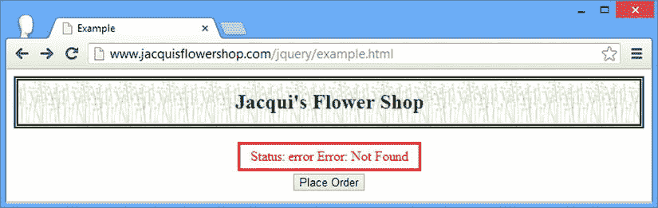
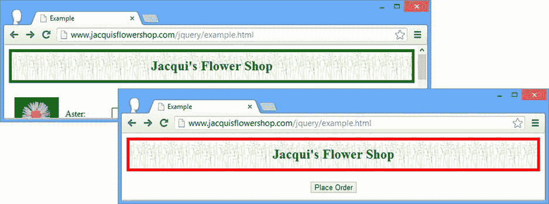
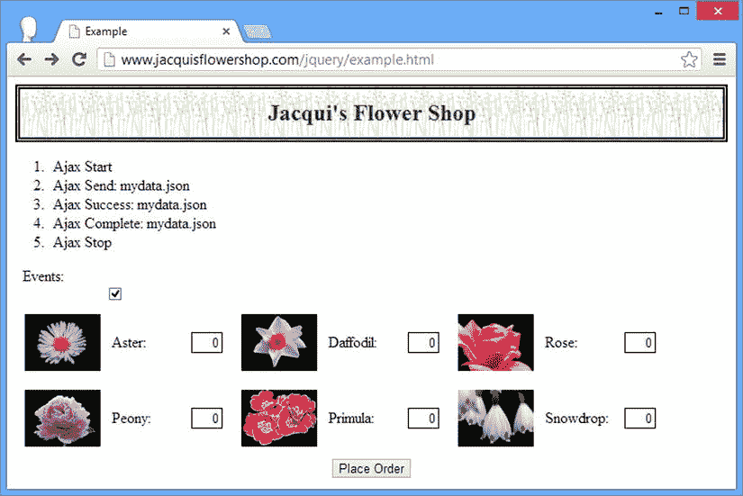
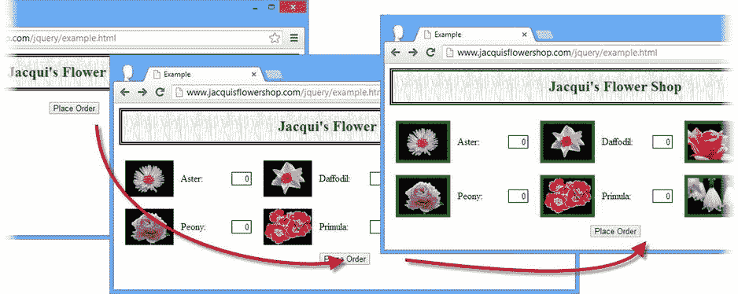
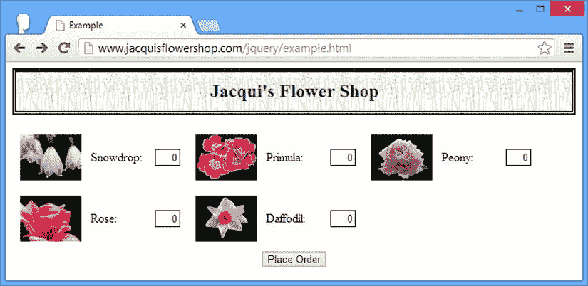

# 十五、使用 Ajax：第二部分

在本章中，我将向您展示如何使用低级的 jQuery Ajax API(应用编程接口)。术语*低级*意味着在请求的内部寻找，但事实并非如此。我在这一章中描述的方法没有在[第 14 章](14.html)中描述的那些方法方便，但是当简写和方便的方法所使用的配置不能很好地完成工作时，你可以多花一点力气来配置请求的细节。[表 15-1](#Tab1) 对本章进行了总结。

[表 15-1](#_Tab1) 。章节总结

| 问题 | 解决办法 | 列表 |
| --- | --- | --- |
| 用底层 API 进行 Ajax 调用 | 使用`ajax`方法 | one |
| 以类似于本机`XMLHttpRequest`对象的方式获取请求的细节 | 使用`jqXHR`方法 | Two |
| 指定 Ajax 请求的 URL | 使用`url`设置 | three |
| 为请求指定 HTTP 方法 | 使用`type`设置 | four |
| 响应成功的请求 | 使用`success`设置 | five |
| 响应不成功的请求 | 使用`error`设置 | six |
| 响应已完成的请求，无论成功与否 | 使用`complete`设置 | 7, 8 |
| 在发送请求之前配置请求 | 使用`beforeSend`设置 | nine |
| 指定多个函数来处理成功、不成功或已完成的请求 | 为`success`、`error`或`complete`设置指定一组函数 | Ten |
| 在`success`、`error`和`complete`设置的函数中，指定将分配给`this`变量的元素 | 使用`context`设置 | Eleven |
| 响应所有 Ajax 请求的事件 | 使用全局事件方法 | Twelve |
| 指定请求是否会导致触发全局事件 | 使用`global`设置 | Thirteen |
| 设置请求的超时时间 | 使用`timeout`设置 | Fourteen |
| 向请求添加标题 | 使用`headers`设置 | Fourteen |
| 指定为服务器设置的内容类型 | 使用`contentType`割台 | Fifteen |
| 指定请求是同步执行还是异步执行 | 使用`async`设置 | Sixteen |
| 忽略未更改的数据 | 使用`ifModified`设置 | Seventeen |
| 响应服务器发送的 HTTP 状态代码 | 使用`statusCode`设置 | Eighteen |
| 清理响应数据 | 使用`dataFilter`设置 | Nineteen |
| 控制数据的转换方式 | 使用`converters`设置 | Twenty |
| 为所有 Ajax 请求定义一个通用配置 | 使用`ajaxSetup`方法 | Twenty-one |
| 动态更改单个请求的配置 | 使用`ajaxPrefilter`方法 | Twenty-two |

自上一版以来，JQUERY 发生了变化

从 jQuery 1.9/2.0 开始，为 Ajax 全局事件设置处理程序的方法只能在`document`对象上调用(在早期的 jQuery 版本中，这些方法可以在任何元素上使用)。有关这些方法的详细信息，请参见“使用全局 Ajax 事件”一节。

用低级 API 发出简单的 Ajax 请求

使用低级 API 发出请求并不比使用我在第 14 章的[中展示的速记和便利方法](14.html)复杂多少。不同之处在于，您可以配置请求的许多不同方面，并在执行请求时获得关于请求的更多信息。处于底层 API 核心的方法是`ajax`，清单 15-1 中的[简单演示了它的用法。](#list1)

***[清单 15-1](#_list1)*** 。使用 ajax 方法

```js
<!DOCTYPE html>
<html>
<head>
    <title>Example</title>
    <script src="jquery-2.0.2.js" type="text/javascript"></script>
    <script src="handlebars.js" type="text/javascript"></script>
    <script src="handlebars-jquery.js" type="text/javascript"></script>
    <script src="jquery.validate.js" type="text/javascript"></script>
    <link rel="stylesheet" type="text/css" href="styles.css"/>
    <script id="flowerTmpl" type="text/x-handlebars-template">
        {{#flowers}}
        <div class="dcell">
            
            <label for="{{product}}">{{name}}:</label>
            <input name="{{product}}" data-price="{{price}}" data-stock="{{stocklevel}}"
                value="0" required />
        </div>
        {{/flowers}}
    </script>
    <script type="text/javascript">
        $(document).ready(function () {
            $.ajax("mydata.json", {
                success: function (data) {
                    var tmplElems = $("#flowerTmpl")
                        .template({flowers: data}).filter("*");
                    tmplElems.slice(0, 3).appendTo("#row1");
                    tmplElems.slice(3).appendTo("#row2");
                }
            });
        });
    </script>
</head>
<body>
    <h1>Jacqui's Flower Shop</h1>
    <form method="post" action="http://node.jacquisflowershop.com/order">
        <div id="oblock">
            <div class="dtable">
                <div id="row1" class="drow">
                </div>
                <div id="row2"class="drow">
                </div>
            </div>
        </div>
        <div id="buttonDiv"><button type="submit">Place Order</button></div>
    </form>
</body>
</html>
```

通过传递想要请求的 URL 和 map 对象来使用`ajax`方法，map 对象的属性定义了一组键/值对，每个键/值对为请求配置一个设置。

 **注**本章依赖于[第 14 章](14.html)中使用的相同`Node.js`脚本。

在这个例子中，我的 map 对象有一个属性——`success`——指定请求成功时调用的函数。我从服务器请求`mydata.json`文件，并使用它和一个数据模板来创建元素并将其插入到文档中，就像我在上一章中用速记方法所做的一样。默认情况下，`ajax`方法会发出一个 HTTP `get`请求，这意味着该示例相当于使用了`get`或`getJSON`方法，我在[第 14 章](14.html)中向您展示过。(我将在“发出 POST 请求”一节中向您展示如何创建`POST`请求。)

有许多设置是可用的，我将在本章的剩余部分解释它们，以及 jQuery 提供的使 Ajax 更容易使用的方法。

了解 jqXHR 对象

由`ajax`方法返回的结果是一个`jqXHR`对象，您可以用它来获得 Ajax 请求的细节并与之交互。`jqXHR`对象是`XMLHttpRequest`对象的超集，后者被定义为万维网联盟(W3C) 标准的一部分，该标准支持浏览器对 Ajax 的支持，适用于 jQuery *延迟对象*特性，我在[第 35 章](35.html)中对此进行了描述。

对于大多数 Ajax 请求，您可以简单地忽略`jqXHR`对象，这正是我建议您做的。当您需要更多关于服务器响应的信息时,`jqXHR`对象非常有用。[表 15-2](#Tab2) 描述了`jqXHR`对象的成员。

[表 15-2](#_Tab2) 。jqXHR 成员

| 成员 | 描述 |
| --- | --- |
| `readyState` | 返回请求在其生命周期中从未发送(值`0`)到完成(值`4`)的进度 |
| `status` | 返回服务器发回的 HTTP 状态代码 |
| `statusText` | 返回状态代码的文本描述 |
| `responseXML` | 如果是 XML 文档，则返回响应 |
| `responseText` | 以字符串形式返回响应 |
| `setRequestHeader(name, value)` | 在请求上设置标头 |
| `getAllResponseHeaders()` | 将响应中的所有标头作为单个字符串返回 |
| `getResponseHeader(name)` | 返回指定响应头的值 |
| `abort()` | 终止请求 |

 **提示**`jqXHR`对象可以用来配置 Ajax 请求，但是使用`ajax`方法的配置选项更容易做到这一点，我将在“...

使用 jQuery 时，您会在几个地方遇到`jqXHR`对象。正如我所说，第一个是来自`ajax`方法的结果，如[清单 15-2](#list2) 所示。

***[清单 15-2](#_list2)*** 。使用 jqXHR 对象

```js
...
<script type="text/javascript">
    $(document).ready(function () {
        var jqxhr =$.ajax("mydata.json", {
            success: function (data) {
                var tmplElems = $("#flowerTmpl").template({flowers: data}).filter("*");
                tmplElems.slice(0, 3).appendTo("#row1");
                tmplElems.slice(3).appendTo("#row2");
            }
        });

        var timerID = setInterval(function () {
            console.log("Status: " + jqxhr.status + " " + jqxhr.statusText);
            if (jqxhr.readyState == 4) {
                console.log("Request completed: " + jqxhr.responseText);
                clearInterval(timerID);
            }
        }, 100);

    });
</script>
...
```

在这个清单中，我将来自`ajax`方法的结果赋给一个名为`jqxhr`的变量，并使用`setInterval`方法每隔 100 毫秒将关于请求的信息写入控制台。使用`ajax`方法的结果不会改变异步执行请求的事实，所以在使用`jqXHR`对象时需要小心。我使用`readyState`属性来检查请求的状态(`4`的值表示请求已经完成),并将响应从服务器写入控制台。该脚本生成以下控制台输出(尽管根据您的浏览器配置，您可能会看到稍微不同的内容):

```js
Status: 200 OK
Request completed: [{"name":"Aster","product":"aster","stocklevel":"10","price":"2.99"}, {"name":"Daffodil","product":"daffodil","stocklevel":"12","price":"1.99"}, {"name":"Rose","product":"rose","stocklevel":"2","price":"4.99"}, {"name":"Peony","product":"peony","stocklevel":"0","price":"1.50"}, {"name":"Primula","product":"primula","stocklevel":"1","price":"3.12"}, {"name":"Snowdrop","product":"snowdrop","stocklevel":"15","price":"0.99"}]
```

 **提示**我很少使用`jqXHR`对象，当它是`ajax`方法的结果时也从不使用。如果我想使用`jqXHR`对象(通常是为了从服务器获得关于响应的额外信息)，那么我通常通过事件处理程序设置来实现，我在“处理 Ajax 回调”一节中对此进行了描述他们给我一个关于请求状态的上下文，而不是让我轮询请求状态。

设置请求 URL

作为将请求的 URL 作为参数传递给`ajax`方法的替代方法，您可以在地图对象中定义一个`url`属性，如[清单 15-3](#list3) 所示。

*[清单 15-3](#_list3) 。使用 url 属性*

```js
...
<script type="text/javascript">
    $(document).ready(function () {
        $.ajax({
            url: "mydata.json",
            success: function (data) {
                var tmplElems = $("#flowerTmpl").template({flowers: data}).filter("*");
                tmplElems.slice(0, 3).appendTo("#row1");
                tmplElems.slice(3).appendTo("#row2");
            }
        });
    });
</script>
...
```

发出发布请求

使用`type`设置为请求设置 HTTP 方法。默认情况下是发出`GET`请求，就像前面的例子一样。[清单 15-4](#list4) 显示了使用`ajax`方法创建一个`POST`请求并提交表单数据给服务器。

***[清单 15-4](#_list4)*** 。用 ajax 方法创建 POST 请求

```js
...
<script id="totalTmpl" type="text/x-handlebars-template">
    <div id="totalDiv" style="clear: both; padding: 5px">
        <div style="text-align: center">Total Items:
            <span id=total>{{total}}</span></div>
    </div>
</script>
<script type="text/javascript">
    $(document).ready(function () {
        $.ajax({
            url: "mydata.json",
            success: function (data) {
                var tmplElems = $("#flowerTmpl").template({flowers: data}).filter("*");
                tmplElems.slice(0, 3).appendTo("#row1");
                tmplElems.slice(3).appendTo("#row2");
            }
        });

        $("button").click(function (e) {
            $.ajax({
                url: $("form").attr("action"),
                data: $("form").serialize(),
                type: "post",
                success: processServerResponse
            })
            e.preventDefault();
        })

        function processServerResponse(data) {
            var inputElems = $("div.dcell").hide();
            for (var prop in data) {
                var filtered = inputElems.has("input[name=' + prop + ']")
                    .appendTo("#row1").show();
            }
            $("#buttonDiv").remove();
            $("#totalTmpl").template(data).appendTo("body");
        }
    });
</script>
...
```

除了`type`我还用过几个设置。为了指定`POST`请求的目标，我使用了`url`属性，该属性来自文档中`form`元素的目标。我使用`data`属性指定要发送的数据，我使用`serialize`方法设置该属性(在第 34 章的[中描述)。](34.html)

超越获取和发布

您可以使用`type`属性来指定任何 HTTP 方法，但是您可能很难使用除了`GET`或`POST`之外的任何方法，因为许多防火墙和应用服务器被配置为丢弃其他类型的请求。如果您想使用其他 HTTP 方法，那么您可以发出一个`POST`请求，但是要添加`X-HTTP-Method-Override` 头，将其设置为您想使用的方法，如下所示:

`X-HTTP-Method-Override: PUT`

这个约定被 web 应用框架广泛支持，并且是创建 RESTful web 应用的一种常见方式，你可以在`http://en.wikipedia.org/wiki/Representational_state_transfer`了解更多。有关如何在 jQuery Ajax 请求上设置头的详细信息，请参见“设置超时和头”一节。

处理 Ajax 回调

有几个属性允许您为 Ajax 请求生命周期中的关键点指定回调函数。当我在[清单 15-4](#list4) 中使用`success`属性时，你已经看到了其中一个回调。[表 15-3](#Tab3) 描述了用于设置每个回调的属性。

[表 15-3](#_Tab3) 。Ajax 事件属性

| 环境 | 描述 |
| --- | --- |
| `beforeSend` | 指定一个在 Ajax 请求启动前将被调用的函数 |
| `complete` | 指定 Ajax 请求成功或失败时将调用的函数 |
| `error` | 指定 Ajax 请求失败时将调用的函数 |
| `success` | 指定 Ajax 请求成功时将调用的函数 |

 **提示**[表 15-3](#Tab3) 中描述的设置与*本地*回调相关，这意味着它们处理单个 Ajax 请求。您还可以使用一系列的*全局事件*，我在“使用全局 Ajax 事件”一节中对此进行了描述

处理成功的请求

当我演示使用`success`属性 时，我省略了函数中的几个参数:描述请求结果的状态消息和一个`jqXHR`对象。[清单 15-5](#list5) 展示了接受这些参数的函数的使用。

***[清单 15-5](#_list5)*** 。接收成功函数的所有参数

```js
...
<script type="text/javascript">
    $(document).ready(function () {
        $.ajax({
            url: "mydata.json",
            success: function (data, status, jqxhr) {

                console.log("Status: " + status);
                console.log("jqXHR Status: " + jqxhr.status + " " + jqxhr.statusText);
                console.log(jqxhr.getAllResponseHeaders());

                var tmplElems = $("#flowerTmpl").template({flowers: data}).filter("*");
                tmplElems.slice(0, 3).appendTo("#row1");
                tmplElems.slice(3).appendTo("#row2");
            }
        });
    });
</script>
...
```

`status`参数是描述请求结果的字符串。由`success`属性指定的回调函数只在结果成功时执行，因此这个参数通常具有值`success`。当您使用`ifModified`设置时会出现异常，我在“忽略未修改的数据”一节中对此进行了描述其他 Ajax 事件的回调函数遵循相同的模式，这个参数在其他一些事件中更有用。

最后一个参数是一个`jqXHR`对象。在处理`jqXHR`对象之前，您不必轮询请求的状态，因为您知道只有当请求成功完成时，该函数才会被执行。在[清单 15-5](#list5) 中，我使用了`jqXHR`对象来获取状态信息和服务器包含在响应中的消息头，并将它们写入控制台。此示例产生以下结果(尽管根据您使用的 web 服务器，您会看到一组不同的标题):

```js
Status: success
jqXHR Status: 200 OK
Date: Thu, 20 Jun 2013 12:06:30 GMT
Last-Modified: Wed, 19 Jun 2013 16:29:49 GMT
Server: Microsoft-IIS/7.5
X-Powered-By: ASP.NET
ETag: "b680cf37a6dce1:0"
Content-Type: application/json
Cache-Control: no-cache
Accept-Ranges: bytes
Content-Length: 405
```

处理错误

`error`属性 指定当请求失败时要调用的回调函数。清单 15-6 提供了一个演示。

***[清单 15-6](#_list6)*** 。使用错误属性

```js
...
<style type="text/css">
    .error {color: red; border: medium solid red; padding: 4px;
            margin: auto; width: 200px; text-align: center}
</style>
<script type="text/javascript">
    $(document).ready(function () {
        $.ajax({
            url: "NoSuchFile.json",
            success: function (data, status, jqxhr) {
                var tmplElems = $("#flowerTmpl").template({flowers: data}).filter("*");
                tmplElems.slice(0, 3).appendTo("#row1");
                tmplElems.slice(3).appendTo("#row2");
            },
            error: function (jqxhr, status, errorMsg) {
                $("<div>").addClass("error")
                    .text("Status: " + status + " Error: " + errorMsg)
                    .insertAfter("h1");
            }
        });
    });
</script>
...
```

在[清单 15-6](#list6) 中，我请求了一个名为`NoSuchFile.json` 的文件，这个文件在 web 服务器上并不存在。这确保了请求会失败，我用`error`属性指定的回调函数会被调用。

传递给`error`回调函数的参数是一个`jqXHR`对象、一条状态消息和来自服务器响应的错误消息。在清单中，我使用`error`回调向文档添加一个`div`元素，显示`status`和`errorMsg`参数的值，如图 15-1 中的[所示。](#Fig1)



[图 15-1](#_Fig1) 。显示错误信息

`status`参数可以是[表 15-4](#Tab4) 中显示的值之一。

[表 15-4](#_Tab4) 。错误状态值

| 环境 | 描述 |
| --- | --- |
| `abort` | 表示请求被中止(使用`jqXHR`对象) |
| `error` | 表示一般错误，通常由服务器报告 |
| `parsererror` | 指示无法解析服务器返回的数据 |
| `timeout` | 表示请求在服务器响应前超时 |

`errorMsg`参数的值根据`status`而变化。当`status`为`error`时，那么`errorMsg`将被设置为服务器响应的文本部分。因此，在这个例子中，来自服务器的响应是`404 Not Found`，因此`errorMsg`被设置为`Not Found`。

当`status`为`timeout`时，`errorMsg`的值也将为`timeout`。您可以使用`timeout`设置来指定请求超时之前的时间段，我在“设置超时和头”一节中对此进行了描述

当`status`是`parsererror`时，那么`errorMsg`将包含问题的细节。当数据格式不正确或服务器为数据返回错误的 MIME 类型时，会出现此错误。(您可以使用`dataType`设置覆盖数据类型。)最后，当请求是`abort`时，状态和`errorMsg`值都将是`abort`。

 **提示**虽然我已经在文档中显示了`status`和`errorMsg`值，但这通常对用户没有帮助，因为这些消息需要对 web 应用内部发生的事情有所了解，并且它们不包含如何解决问题的说明。

处理已完成的请求

属性 指定了一个函数，当 Ajax 请求完成时将调用这个函数，不管它是成功还是失败。清单 15-7 提供了一个演示。

***[清单 15-7](#_list7)*** 。使用完整属性

```js
...
<script type="text/javascript">
    $(document).ready(function () {
        $.ajax({
            url: "mydata.json",
            success: function (data, status, jqxhr) {
                var tmplElems = $("#flowerTmpl").template({flowers: data}).filter("*");
                tmplElems.slice(0, 3).appendTo("#row1");
                tmplElems.slice(3).appendTo("#row2");
            },
            error: function (jqxhr, status, errorMsg) {
                $("<div>").addClass("error")
                    .text("Status: " + status + " Error: " + errorMsg)
                    .insertAfter("h1");
            },
            complete: function (jqxhr, status) {
                console.log("Completed: " + status);
            }
        });
    });
</script>
...
```

由`complete`属性指定的回调函数在由`success`和`error`属性指定的函数之后被调用*。jQuery 将`jqXHR`对象和一个状态字符串传递给回调函数。状态字符串将被设置为[表 15-5](#Tab5) 中显示的值之一。*

[表 15-5](#_Tab5) 。Ajax 事件设置

| 环境 | 描述 |
| --- | --- |
| `abort` | 表示请求被中止(使用`jqXHR`对象) |
| `error` | 表示一般错误，通常由服务器报告 |
| `notmodified` | 表示所请求的内容自上次请求以来没有被修改过(有关更多详细信息，请参见“忽略未修改的数据”一节) |
| `parsererror` | 指示无法解析服务器返回的数据 |
| `success` | 指示请求成功完成 |
| `timeout` | 表示请求在服务器响应前超时 |

您可能想使用`complete`设置来指定一个可以处理请求所有结果的函数，但是这样做意味着您不能从 jQuery 处理数据和错误的方式中获益。更好的方法是使用`success`和`error`设置，并仔细组织公共函数的参数，如[清单 15-8](#list8) 所示。

***[清单 15-8](#_list8)*** 。使用单个函数处理所有请求结果

```js
...
<script type="text/javascript">
    $(document).ready(function () {
        $.ajax({
            url: "mydata.json",
            success: function (data, status, jqxhr) {
                handleResponse(status, data, null, jqxhr);
            },
            error: function (jqxhr, status, errorMsg) {
                handleResponse(status, null, errorMsg, jqxhr);
            }
        });

        function handleResponse(status, data, errorMsg, jqxhr) {
            if (status == "success") {
                var tmplElems = $("#flowerTmpl").template({ flowers: data }).filter("*");
                tmplElems.slice(0, 3).appendTo("#row1");
                tmplElems.slice(3).appendTo("#row2");
            } else {
                $("<div>").addClass("error")
                    .text("Status: " + status + " Error: " + errorMsg)
                    .insertAfter("h1");
            }
        }
    });
</script>
...
```

在发送请求之前配置请求

`beforeSend`属性 允许您指定一个在请求开始之前将被调用的函数。这使您有机会进行最后的配置，补充或覆盖传递给`ajax`方法的设置，如果您对多个请求使用相同的基本设置对象，这将非常有用。清单 15-9 展示了`beforeSend`属性的使用。

***[清单 15-9](#_list9)*** 。使用 beforeSend 属性

```js
...
<script type="text/javascript">
    $(document).ready(function () {
        $.ajax({
            url: "NoSuchFile.json",
            success: function (data, status, jqxhr) {
                handleResponse(status, data, null, jqxhr);
            },
            error: function (jqxhr, status, errorMsg) {
                handleResponse(status, null, errorMsg, jqxhr);
            },
            beforeSend: function (jqxhr, settings) {
                settings.url = "mydata.json";
            }
        });

        function handleResponse(status, data, errorMsg, jqxhr) {
            if (status == "success") {
                var tmplElems = $("#flowerTmpl").template({ flowers: data }).filter("*");
                tmplElems.slice(0, 3).appendTo("#row1");
                tmplElems.slice(3).appendTo("#row2");
            } else {
                $("<div>").addClass("error")
                    .text("Status: " + status + " Error: " + errorMsg)
                    .insertAfter("h1");
            }
        }

    });
</script>
...
```

传递给回调函数的参数是传递给`ajax`方法的`jqXHR`对象和设置对象。在[清单 15-9](#list9) 中，我使用了`url`设置来指定 Ajax 请求的 URL，覆盖了`url`属性的值。

指定多个事件处理函数

我只展示了一个回调函数来响应 Ajax 请求，但是您可以将`success`、`error`、`complete`和`beforeStart`属性设置为一个函数数组，当相应的事件被触发时，它们中的每一个都将被执行。[清单 15-10](#list10) 提供了一个演示。

***[清单 15-10](#_list10)*** 。指定多个事件处理功能

```js
...
<script type="text/javascript">
    $(document).ready(function () {
        $.ajax({
            url: "mydata.json",
            success: [processData, reportStatus],
        });

        function processData(data, status, jqxhr) {
            var tmplElems = $("#flowerTmpl").template({ flowers: data }).filter("*");
            tmplElems.slice(0, 3).appendTo("#row1");
            tmplElems.slice(3).appendTo("#row2");
        }

        function reportStatus(data, status, jqxhr) {
            console.log("Status: " + status + " Result code: " + jqxhr.status);
        }
    });
</script>
...
```

在清单 15-10 的[中，我将`success`属性设置为一个包含两个函数名的数组，其中一个函数名使用数据将元素添加到文档中，另一个函数名将信息打印到控制台。](#list10)

设置事件的上下文

`context`属性 允许您指定一个元素，该元素将在事件功能启用时分配给`this`变量。这对于定位文档中的元素很有用，而不必在处理函数中选择它们。[清单 15-11](#list11) 给出了一个演示。

***[清单 15-11](#_list11)*** 。使用上下文属性

```js
...
<script type="text/javascript">
    $(document).ready(function () {
        $.ajax({
            url: "mydata.json",
            context: $("h1"),
            success: function (data, status, jqxhr) {
                var tmplElems = $("#flowerTmpl").template({ flowers: data }).filter("*");
                tmplElems.slice(0, 3).appendTo("#row1");
                tmplElems.slice(3).appendTo("#row2");
            },
            complete: function (jqxhr, status) {
                var color = status == "success" ? "green" : "red";
                this.css("border", "thick solid " + color);
            }
        });
    });
</script>
...
```

在[清单 15-11](#list11) 中，我将`context`属性设置为包含文档中`h1`元素的 jQuery 对象。在`complete`回调函数中，我使用 jQuery 对象上的`css`方法(我通过`this`引用它)来设置所选元素(或元素，因为文档中只有一个)的边框，根据请求的状态改变颜色。您可以在图 15-2 中看到成功和失败请求的结果。



[图 15-2](#_Fig2) 。使用上下文属性来指示 Ajax 请求的结果

 **提示**你可以使用`context`属性分配任何对象，因此你有责任确保你用它做适当的事情。例如，如果您将上下文设置为一个`HTMLElement`对象，那么您必须确保在对其调用任何 jQuery 方法之前将该对象传递给`$`函数。

使用全局 Ajax 事件

除了我在前一章描述的每个请求的回调函数之外，jQuery 还定义了一组*全局事件*，您可以使用它们来监控应用发出的所有 Ajax 查询。[表 15-6](#Tab6) 显示了全球事件可用的方法。

[表 15-6](#_Tab6) 。jQuery Ajax 事件方法

| 方法 | 描述 |
| --- | --- |
| `ajaxComplete(function)` | 注册 Ajax 请求完成时要调用的函数(不管它是否成功) |
| `ajaxError(function)` | 注册一个在 Ajax 请求遇到错误时调用的函数 |
| `ajaxSend(function)` | 注册一个在 Ajax 请求开始前调用的函数 |
| `ajaxStart(function)` | 注册一个 Ajax 请求启动时要调用的函数 |
| `ajaxStop(function)` | 注册一个在所有 Ajax 请求完成时调用的函数 |
| `ajaxSuccess(function)` | 注册 Ajax 请求成功时要调用的函数 |

 **提示**在 jQuery 1.9 之前，您可以对任何元素调用表中的方法，但是在 jQuery 1.9/2.0 中，您只能对`document`元素调用表中的方法，如本节中的示例所示。

这些方法用于注册处理函数，并且必须应用于`document`元素(正如我稍后演示的)。`ajaxStart`和`ajaxStop`方法不向处理函数传递任何参数，但是其他方法提供以下参数:

*   描述事件的`Event`对象
*   描述请求的`jqXHR`对象
*   包含请求配置的设置对象

`ajaxError`方法向处理函数传递一个额外的参数，它是对已经发生的错误的描述。

关于这些方法，有两件重要的事情需要记住。第一个是函数将被来自所有 Ajax 请求的事件触发，这意味着你必须小心确保你没有做出只对特定请求成立的假设。

第二件要记住的事情是，在开始发出 Ajax 请求之前，你需要调用这些方法*，以确保处理函数被正确触发。如果在*调用`ajax`方法之后调用全局方法*，那么 Ajax 请求可能会在 jQuery 正确注册处理函数之前完成。清单 15-12 展示了如何使用全局 Ajax 事件方法。*

***[清单 15-12](#_list12)*** 。使用全局 Ajax 事件方法

```js
...
<script type="text/javascript">
    $(document).ready(function () {

        $("<div").append("<label>Events:<label>")
        .append("<input type='checkbox' id='globalevents' name='globalevents' checked>")
            .insertAfter("h1");
        $("<ol id='info' class='ajaxinfo'>").insertAfter("h1").append("<li>Ready</li>");

        function displayMessage(msg) {
            $("#info").append($("<li>").text(msg));
        }

        $(document)
            .ajaxStart(function () {
                displayMessage("Ajax Start")
            })
            .ajaxSend(function (event, jqxhr, settings) {
                displayMessage("Ajax Send: " + settings.url)
            })
            .ajaxSuccess(function (event, jqxhr, settings) {
                displayMessage("Ajax Success: " + settings.url)
            })
            .ajaxError(function (event, jqxhr, settings, errorMsg) {
                displayMessage("Ajax Error: " + settings.url)
            })
            .ajaxComplete(function (event, jqxhr, settings) {
                displayMessage("Ajax Complete: " + settings.url)
            })
            .ajaxStop(function () {
                displayMessage("Ajax Stop")
            });

        $("button").click(function (e) {
            $("#row1, #row2, #info").empty();
            $.ajax({
                url: "mydata.json",
                global: $("#globalevents:checked").length > 0,
                success: function (data, status, jqxhr) {
                    var tmplElems = $("#flowerTmpl")
                        .template({ flowers: data }).filter("*");
                    tmplElems.slice(0, 3).appendTo("#row1");
                    tmplElems.slice(3).appendTo("#row2");
                }
            });
            e.preventDefault();
        });
    });
</script>
...
```

在[清单 15-12](#list12) 中，我已经为所有的全局 Ajax 事件注册了函数。这些函数调用`displayMessage`函数 来显示哪个事件被触发了。因为 Ajax 请求可以快速完成，所以我使用一个`ol`元素来显示到达的消息，建立一个事件列表。

我为`button`元素的`click`事件添加了一个处理函数，当按钮被点击时，该函数启动 Ajax 请求。你可以在[图 15-3](#Fig3) 中看到结果，它显示了点击按钮后 Ajax 请求生成的消息。



[图 15-3](#_Fig3) 。显示全局 Ajax 事件

控制全球事件

您会注意到我在文档中添加了一个复选框。在对`ajax`函数的调用中，我使用复选框来设置`global`的值，如[清单 15-13](#list13) 所示。

***[清单 15-13](#_list13)*** 。使用全局属性

```js
...
$.ajax({
    url: "mydata.json",
    global: $("#globalevents:checked").length > 0,
    success: function (data, status, jqxhr) {
        var tmplElems = $("#flowerTmpl").template({ flowers: data }).filter("*");
        tmplElems.slice(0, 3).appendTo("#row1");
        tmplElems.slice(3).appendTo("#row2");
    }
})
...
```

当`global`设置为`false`时，Ajax 请求不会生成全局 Ajax 事件。您可以使用示例亲自尝试一下。取消选中该框并单击按钮，您将看到 Ajax 请求已经执行，但没有显示任何状态信息。

为 Ajax 请求配置基本设置

有一组设置允许您执行 Ajax 请求的基本配置。这些是现有设置中最没意思的，它们在很大程度上是不言而喻的。表 15-7 描述了这些设置，我将在接下来的章节中演示其中的一小部分。

[表 15-7](#_Tab7) 。基本请求配置设置

| 环境 | 描述 |
| --- | --- |
| `accepts` | 设置`Accept`请求头的值，它指定浏览器将接受的 MIME 类型。默认情况下，这由`dataType`设置决定。 |
| `cache` | 如果设置为`false`，服务器将不会缓存请求的内容。默认情况下，`script`和`jsonp`数据类型不会被缓存，但其他数据类型会被缓存。 |
| `contentType` | 为请求设置`Content-Type`头。 |
| `dataType` | 指定服务器预期的数据类型。使用此设置时，jQuery 将忽略服务器提供的关于响应类型的信息。参见第 14 章了解其工作原理。 |
| `headers` | 指定要添加到请求中的附加标头和值；请参见下面的演示讨论。 |
| `jsonp` | 指定发出 JSONP 请求时代替回调使用的字符串。这需要与服务器协调。有关 JSONP 的详细信息，请参见[第 14 章](14.html)。 |
| `jsonpCallback` | 指定回调函数的名称，替换 jQuery 默认使用的随机生成的名称。JSONP 的详细内容见[第 14 章](14.html)。 |
| `password` | 指定用于响应身份验证质询的密码。 |
| `scriptCharset` | 当请求 JavaScript 内容时，告诉 jQuery 脚本是用指定的字符集编码的。 |
| `timeout` | 指定请求的超时时间(以毫秒为单位)。如果请求超时，则由`error`设置指定的功能将被调用，状态为`timeout`。 |
| `username` | 指定用于响应身份验证质询的用户名。 |

设置超时和标题

用户通常不会意识到 Ajax 请求的发生，所以设置一个超时期限是一个很好的方法，可以避免让用户无所事事地等待一个他们甚至不知道正在发生的进程。清单 15-14 展示了如何为一个请求设置超时。

***[清单 15-14](#_list14)*** 。设置超时

```js
...
<script type="text/javascript">
    $(document).ready(function() {

        $.ajax("mydata.json", {
            timeout: 5000,
            headers: { "X-HTTP-Method-Override": "PUT" },
            success: function(data, status, jqxhr) {
                var template = $("#flowerTmpl");
                template.tmpl(data.slice(0, 3)).appendTo("#row1");
                template.tmpl(data.slice(3)).appendTo("#row2");
            },
            error: function(jqxhr, status, errorMsg) {
                console.log("Error: " + status);
            }
       });
    });
</script>
...
```

在[清单 15-14](#list14) 中，我使用了`timeout`设置来指定请求的最大持续时间为五秒。如果请求在这段时间内没有完成，那么将执行由`error`设置指定的功能，其`status`值为`error`。

 **注意**请求一传到浏览器，计时器就开始计时，大多数浏览器对并发请求的数量都有限制。这意味着您冒着在请求开始之前就超时的风险。为了避免这种情况，您必须了解浏览器的局限性以及正在进行的任何其他 Ajax 请求的数量和预期持续时间。

在[清单 15-14](#list14) 中，我还使用了`headers`设置来给请求添加一个标题，如下所示:

```js
...
headers: { "X-HTTP-Method-Override": "PUT" },
...
```

使用 map 对象指定附加头。示例中的头是我在上一节“发出 POST 请求”中提到的头。这个头文件对于创建 RESTful web 应用非常有用，只要服务器能够正确理解它。

向服务器发送 JSON 数据

当您需要向服务器发送数据时，可以使用 JSON 格式:这是一种紧凑且富于表现力的数据格式，很容易从 JavaScript 对象中生成。发送 JSON 的过程很简单:只需使用`contentType`属性来设置请求中的`Content-Type`头，它告诉服务器正在发送的数据类型，如清单 15-15 中的[所示。](#list15)

***[清单 15-15](#_list15)*** 。将 JSON 发送到服务器

```js
...
<script type="text/javascript">
    $(document).ready(function () {

        $.ajax("mydata.json", {
            success: function (data, status, jqxhr) {
                var tmplElems = $("#flowerTmpl").template({ flowers: data }).filter("*");
                tmplElems.slice(0, 3).appendTo("#row1");
                tmplElems.slice(3).appendTo("#row2");
            }
        });

        $("button").click(function (e) {
            $.ajax({
                url: $("form").attr("action"),
                contentType: "application/json",
                data: JSON.stringify($("form").serializeArray()),
                type: "post",
                success: processServerResponse
            })
            e.preventDefault();
        })

        function processServerResponse(data) {
            var inputElems = $("div.dcell").hide();
            for (var prop in data) {
                var filtered = inputElems.has("input[name=" + prop + "]")
                    .appendTo("#row1").show();
            }
            $("#buttonDiv, #totalDiv").remove();
            $("#totalTmpl").template(data).appendTo("body");
        }
    });
</script>
...
```

我已经使用了`contentType`设置来指定一个值`application/json`，这是 JSON 的 MIME 类型。我可以向服务器发送任何对象，但是我想演示如何将表单数据表示为 JSON，如下所示:

```js
...
data: JSON.stringify($("form").serializeArray()),
...
```

我选择`form`元素，调用`serializeArray`方法；这将创建一个对象数组，每个对象都有一个 name 属性和一个 value 属性，表示表单中的一个输入元素。然后我使用`JSON.stringify`方法将它转换成如下所示的字符串:

```js
[{"name":"aster","value":"1"}, {"name":"daffodil","value":"1"},
 {"name":"rose","value":"1"}, {"name":"peony","value":"1"},
 {"name":"primula","value":"1"},{"name":"snowdrop","value":"1"}]
```

所以我有一个 JSON 字符串，它描述了一个我可以发送给服务器的对象数组。我在本章中使用的脚本能够解析和处理这个对象。

使用高级配置设置

在接下来的小节中，我将描述可以应用于 Ajax 请求的最有趣、最有用的高级设置。我发现我并不经常使用它们，但是在需要的时候它们是非常宝贵的，它们提供了对 jQuery 如何处理 Ajax 的细粒度控制。

同步发出请求

`async`属性指定请求是否将被异步执行。将该属性设置为`true`(如果未定义该属性，则使用默认值)意味着它将异步执行；值为`false`意味着请求将被同步执行。

当请求被同步执行时，`ajax`方法的行为就像一个普通的函数，浏览器将等待请求完成，然后继续执行脚本中的其他语句。清单 15-16 给出了一个例子。

***[清单 15-16](#_list16)*** 。发出同步请求

```js
...
<script type="text/javascript">
    $(document).ready(function() {
        var elems;

        $.ajax("flowers.html", {
            async: false,
            success: function(data, status, jqxhr) {
                elems = $(data).filter("div").addClass("dcell");
            }
        });

        elems.slice(0, 3).appendTo("#row1");
        elems.slice(3).appendTo("#row2");
    });
</script>
...
```

这是我在[第 14 章](14.html)中展示的请求，展示了使用 Ajax 时最常见的陷阱，并更新为使用低级 API。这种情况下的不同之处在于，`async`设置为`false`，因此浏览器不会执行调用`slice`和`appendTo`方法的语句，直到请求完成并且结果被分配给`elems`变量(假设请求成功完成)。使用 Ajax 方法进行同步调用是一件奇怪的事情，我建议您考虑一下为什么您的 web 应用需要这样做。

我经常在查看麻烦的 Ajax 代码时使用这种技术作为快速测试——不能正确处理异步请求是如此常见的问题，以至于我开始用快速同步测试进行调试。如果代码有效，我知道要开始寻找关于数据何时从服务器到达的错误假设。

 **提示**不要使用同步调用，因为你会发现进行异步调用很费力；我知道使用回调和确保不要对请求的结果做出假设可能会令人厌倦，但是花时间了解这种 web 编程方法确实是值得的。

忽略未修改的数据

只有当响应在您上次查询后发生了变化时，您才可以使用`ifModified`属性 来接收数据；这由响应中的`Last-Modified`报头决定。如果您需要重复请求相同的数据来响应用户操作，那么您通常会处理服务器响应并修改文档，以便向用户呈现已经存在的数据。这个设置的默认值是`false`，它告诉 jQuery 忽略这个头，总是返回数据。清单 15-17 展示了如何使用这个属性。

***[清单 15-17](#_list17)*** 。使用 ifModified 属性

```js
...
<script type="text/javascript">
    $(document).ready(function () {

        $("button").click(function (e) {
            $.ajax("mydata.json", {
                ifModified: true,
                success: function (data, status) {
                    if (status == "success") {
                        $("#row1, #row2").children().remove();
                        var tmplElems = $("#flowerTmpl")
                            .template({ flowers: data }).filter("*");
                        tmplElems.slice(0, 3).appendTo("#row1");
                        tmplElems.slice(3).appendTo("#row2");
                    } else if (status == "notmodified") {
                        $("img").css("border", "thick solid green");
                    }
                }
            });
            e.preventDefault();
        })
    });
</script>
...
```

在[清单 15-17](#list17) 中，`ifModified`设置的值是`true`。总是调用`success`函数，但是如果自从我最后一次请求以来内容没有被修改，那么`data`参数将是`undefined`，而`status`参数将是`notmodified`。

在这个例子中，我根据`status`参数执行不同的操作。如果参数是`success`，那么我使用`data`参数向文档中添加元素。如果参数是`notmodified`，那么我使用`css`方法为文档中已经存在的`img`元素添加一个边框。

我调用了`ajax`方法来响应来自`button`元素的`click`事件。这允许我重复提出同样的请求来演示`ifModified`设置的效果，你可以在[图 15-4](#Fig4) 中看到。



[图 15-4](#_Fig4) 。使用 ifModified 设置

 **注意**这可能是一个有用的设置，但应该小心使用。如果您的请求是用户操作的结果(比如，按下按钮)，那么用户按下按钮可能是因为之前的请求没有按预期的方式执行。假设您请求数据，但是`success`方法包含一个错误，不能正确地用内容更新文档；用户按下按钮试图让文档正确显示。通过不明智地使用`ifModified`设置，您可能会忽略用户操作，迫使用户采取更严肃的步骤来解决问题。

处理响应状态代码

属性 允许您响应 HTTP 响应中返回的不同状态代码。您可以使用这个特性作为`success`和`error`属性的替代或补充。清单 15-18 显示了如何单独使用`statusCode`设置。

***[清单 15-18](#_list18)*** 。使用 statusCode 属性

```js
...
<style type="text/css">
    .error {color: red; border: medium solid red; padding: 4px;
            margin: auto; width: 200px; text-align: center}
</style>
<script type="text/javascript">
    $(document).ready(function() {

        $.ajax({
            url: "mydata.json",
            statusCode: {
                200: handleSuccessfulRequest,
                404: handleFailedRequest,
                302: handleRedirect
            }
        });

        function handleSuccessfulRequest(data, status, jqxhr) {
            $("#row1, #row2").children().remove();
            var template = $("#flowerTmpl");
            template.tmpl(data.slice(0, 3)).appendTo("#row1");
            template.tmpl(data.slice(3)).appendTo("#row2");
        }

        function handleRedirect() {
            // this function will neber be called
        }

        function handleFailedRequest(jqxhr, status, errorMsg) {
            $("<div class=error>Code: " + jqxhr.status + " Message: "
                + errorMsg + "</div>").insertAfter("h1");
        }
    });
</script>
...
```

属性被分配了一个对象，该对象在 HTTP 状态代码和返回到服务器时要执行的函数之间进行映射。在[清单 15-18](#list18) 中，我定义了三个函数，并将它们与状态码`200`、`404`和`302`相关联。

传递给函数的参数取决于状态代码反映的是成功的请求还是错误。如果代码表示成功(比如`200`，那么参数与`success`回调函数的参数相同。对于失败状态代码，比如`404`代码，它表示无法找到请求的文件，参数与`error`回调函数相同。

注意，我还为`302`代码添加了一个地图。当服务器希望将您重定向到另一个 URL 时，这将被发送回浏览器。jQuery 会自动跟踪重定向，直到接收到一些内容或遇到错误。这意味着我的`302`代码的函数永远不会被调用。

 **提示**只有在使用了`ifModified`设置的情况下，才会生成`304`代码，表示内容自上次请求后未被修改。否则，jQuery 会发送一个`200`代码。有关`ifModified`设置的信息，参见上一节“忽略未修改的数据”。

当我调试浏览器和服务器之间的交互时，我发现这个特性很有用，通常是为了找出 jQuery 为什么没有按照我想要的方式运行。当我这样做时，我使用`statusCode`设置来补充`success`和`error`设置，并将信息打印到控制台。

 **提示**`success`或`error`回调函数在`statusCode`设置指定的函数之前执行。

清除响应数据

`dataFilter`属性 指定了一个函数，这个函数将被调用来处理服务器返回的数据。当服务器发送给您的数据不是您所需要的数据时，这是一个非常有用的功能，因为数据的格式并不完美，或者因为它包含了您不想处理的数据。[清单 15-19](#list19) 展示了`dataFilter`属性的使用。

***[清单 15-19](#_list19)*** 。使用 dataFilter 属性

```js
...
<script type="text/javascript">
    $(document).ready(function () {

        $.ajax({
            url: "mydata.json",
            success: function (data, status, jqxhr) {
                $("#row1, #row2").children().remove();
                var tmplElems = $("#flowerTmpl").template({ flowers: data }).filter("*");
                tmplElems.slice(0, 3).appendTo("#row1");
                tmplElems.slice(3).appendTo("#row2");
            },
            dataType: "json",
            dataFilter: function (data, dataType) {
                if (dataType == "json") {
                    var filteredData = $.parseJSON(data);
                    filteredData.shift();
                    return JSON.stringify(filteredData.reverse());
                } else {
                    return data;
                }
            }
        });
    });
</script>
...
```

向该函数传递从服务器接收的数据和`dataType`设置的值。如果没有使用`dataType`设置，那么第二个函数参数将是`undefined`。`dataFilter`函数的目的是返回过滤后的数据，在[清单 15-19](#list19) 中，我关注的是`json`数据类型，如下所示:

```js
...
var filteredData = $.parseJSON(data);
filteredData.shift();
return JSON.stringify(filteredData.reverse());
...
```

我使用 jQuery `parseJSON`数据将 JSON 数据转换成 JavaScript 数组(这是我在第 34 章的[中描述的 jQuery 实用方法之一)。然后，我使用`shift`方法移除数组中的第一项，并使用`reverse`方法颠倒剩余项的顺序。](34.html)

`dataFilter`回调函数必须返回一个字符串，所以我调用了`JSON.stringify`方法，尽管我知道在调用`success`函数之前，jQuery 会将数据转换回 JavaScript 对象。除此之外，你可以看到我能够从数组中移除一个元素并反转剩余的元素——虽然这不是最有用的转换，但它确实展示了过滤效果，你可以在[图 15-5](#Fig5) 中看到。



[图 15-5](#_Fig5) 。使用 dataFilter 设置删除项目并反转数据顺序

管理数据转换

我把我最喜欢的一处房产留到了最后。您会注意到，jQuery 在接收某些数据类型时会进行一些方便的转换。例如，当 jQuery 接收到一些 JSON 数据时，它会用一个 JavaScript 对象呈现`success`函数，而不是原始的 JSON 字符串。

您可以使用`converters`属性来控制这些转换。此设置的值是一个对象，它在数据类型和用于处理它们的函数之间进行映射。[清单 15-20](#list20) 展示了如何使用该属性将 HTML 数据自动解析成 jQuery 对象。

***[清单 15-20](#_list20)*** 。使用转换器设置

```js
...
<script type="text/javascript">
    $(document).ready(function() {

        $.ajax({
            url: "flowers.html",
            success: function(data, status, jqxhr) {
                var elems = data.filter("div").addClass("dcell");
                elems.slice(0, 3).appendTo("#row1");
                elems.slice(3).appendTo("#row2");
            },
            converters: {
                "text html": function(data) {
                    return $(data);
                }
            }
        });
    });
</script>
...
```

我为`text html`类型注册了一个函数。注意，您在 MIME 类型的组件之间使用了一个空格(与`text/html`相反)。向该函数传递从服务器接收的数据，并返回转换后的数据。在本例中，我将从`flowers.html`文件获得的 HTML 片段传递给 jQuery `$`函数，并返回结果。这意味着我可以在作为数据参数传递给`success`函数的对象上调用所有常用的 jQuery 方法。

 **提示**数据类型并不总是与服务器返回的 MIME 类型匹配。例如，`application/json`通常在`converters`方法中表示为`"text json"`。

很容易被这些转换器冲昏头脑。我尽量避免在这些功能上做过多的工作。例如，我有时很想获取 JSON 数据，应用数据模板，并将结果 HTML 元素传回。虽然这是一个很好的技巧，但是如果其他人试图扩展您的代码，或者您需要放松繁重的处理以在以后获得原始数据，它会使您出错。

设置和过滤 Ajax 请求

在本章的最后，我将描述 jQuery 提供的一些额外的方法来简化请求的配置。

定义默认设置

`ajaxSetup`方法 指定了将用于每个 Ajax 请求的设置，使您不必为每个请求定义您感兴趣的所有设置。清单 15-21 展示了这种方法的使用。

***[清单 15-21](#_list21)*** 。使用 ajaxSetup 方法

```js
...
<script type="text/javascript">
    $(document).ready(function() {

        $.ajaxSetup({
            timeout: 15000,
            global: false,
            error: function(jqxhr, status, errorMsg) {
                $("<div class=error/>")
                    .text("Status: " + status + " Error: " + errorMsg)
                    .insertAfter("h1");
            },
            converters: {
                "text html": function(data) {
                    return $(data);
                }
            }
        });

        $.ajax({
            url: "flowers.html",
            success: function(data, status, jqxhr) {
                var elems = data.filter("div").addClass("dcell");
                elems.slice(0, 3).appendTo("#row1");
                elems.slice(3).appendTo("#row2");
            },
        });
    });
</script>
...
```

对 jQuery `$`函数调用`ajaxSetup`方法，就像对`ajax`方法一样。`ajaxSetup`的参数是一个对象，它包含了所有 Ajax 请求的默认设置。在[清单 15-21](#list21) 中，我定义了`timeout`、`global`、`error`和`converters`设置的默认值。一旦我调用了`ajaxSetup`方法，我只需要为那些我没有提供默认值或者我想改变其值的设置定义值。当发出大量具有相似配置的 Ajax 请求时，这可以减少代码重复。

 **提示**`ajaxSetup`方法指定的设置也会影响我在[第 14 章](14.html)中展示的方便快捷的方法提出的请求。这是一种将低级 API 附带的详细控制与便利方法的简单性结合起来的好方法。

过滤请求

如果您想为单个请求动态定制设置，可以使用`ajaxPrefilter`方法 ，如清单 15-22 中的[所示。](#list22)

***[清单 15-22](#_list22)*** 。使用 ajaxPrefilter 方法

```js
...
<script type="text/javascript">
    $(document).ready(function () {

        $.ajaxSetup({
            timeout: 15000,
            global: false,
            error: function (jqxhr, status, errorMsg) {
                $("<div class=error/>")
                    .text("Status: " + status + " Error: " + errorMsg)
                    .insertAfter("h1");
            },
            converters: {
                "text html": function (data) {
                    return $(data);
                }
            }
        });

        $.ajaxPrefilter("json html", function (settings, originalSettings, jqxhr) {
            if (originalSettings.dataType == "html") {
                settings.timeout = 2000;
            } else {
                jqxhr.abort();
            }
        });

        $.ajax({
            url: "flowers.html",
            success: function (data, status, jqxhr) {
                var elems = data.filter("div").addClass("dcell");
                elems.slice(0, 3).appendTo("#row1");
                elems.slice(3).appendTo("#row2");
            },
        });
    });
</script>
...
```

`ajaxPrefilter`方法的参数是一组数据类型和一个回调函数，当发出对这些数据类型的请求时，将执行该函数。如果省略数据类型，只指定函数，那么所有请求都会调用该函数。

传递给回调函数的参数是请求的设置(包括使用`ajaxSetup`方法设置的任何默认值)；传递给 Ajax 方法(不包括任何默认值)和请求的`jqXHR`对象的原始设置。对作为第一个参数传递的对象进行更改，如示例所示。

在[清单 15-22](#list22) 中，我过滤了 JSON 和 HTML 请求，因此如果在传递给 Ajax 方法的设置中指定了`dataType`设置，我将超时设置为两秒。对于没有这个设置的请求，我调用了`jqXHR`对象上的`abort`方法来阻止请求被发送。

摘要

在这一章中，我向你展示了低级的 jQuery Ajax 接口，我希望你同意，它并不比我在第 14 章第 1 节中展示的方便快捷的方法难多少。只需做一点额外的工作，您就可以控制 Ajax 请求处理方式的许多方面，这为您提供了无数种方式来根据您的需要和偏好调整处理过程。在[第 16 章](16.html)中，我重构了这个例子，加入了我在这本书的这一部分描述的特性和技术。