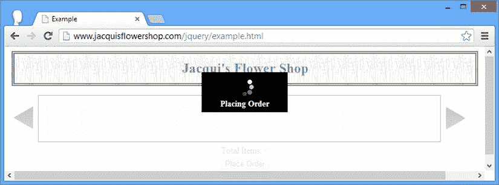

# 十六、重构例子：第二部分

我在本书的这一部分介绍了一些丰富的特性，正如我在之前的第十一章中所做的那样，我想把它们放在一起，以给出 jQuery 的一个更广阔的视角。

 **提示**我不打算在这一章中试图保留一个可行的非 JavaScript 结构，因为我添加到示例中的所有特性都严重依赖于 JavaScript。

查看重构的示例

在第十一章中，我使用核心 jQuery 特性来重构示例，以包括 DOM(域对象模型)操作、效果和事件。清单 16-1 显示了我最终得到的文档，它将是本章的起点，因为我整合了本书这一部分的特性。

***清单 16-1*** 。本章的起点

```js
<!DOCTYPE html>
<html>
<head>
    <title>Example</title>
    <script src="jquery-2.0.2.js" type="text/javascript"></script>
    <link rel="stylesheet" type="text/css" href="styles.css"/>
    <style type="text/css">
        a.arrowButton {
            background-image: url(leftarrows.png); float: left;
            margin-top: 15px; display: block; width: 50px; height: 50px;
        }
        #right {background-image: url(rightarrows.png)}
        h1 { min-width: 0px; width: 95%; }
        #oblock { float: left; display: inline; border: thin black solid; }
        form { margin-left: auto; margin-right: auto; width: 885px; }
        #bbox {clear: left}
    </style>
    <script type="text/javascript">
        $(document).ready(function() {

            var fNames = ["Carnation", "Lily", "Orchid"];
            var fRow = $("<div id=row3 class=drow/>").appendTo("div.dtable");
            var fTemplate = $("<div class=dcell><label/><input/></div>");
            for (var i = 0; i < fNames.length; i++) {
                fTemplate.clone().appendTo(fRow).children()
                    .filter("img").attr("src", fNames[i] + ".png").end()
                    .filter("label").attr("for", fNames[i]).text(fNames[i]).end()
                    .filter("input").attr({name: fNames[i],
                                          value: 0, required: "required"})
            }

            $("<a id=left></a><a id=right></a>").prependTo("form")
                .addClass("arrowButton").click(handleArrowPress).hover(handleArrowMouse);
            $("#right").appendTo("form");

            $("#row2, #row3").hide();

            var total = $("#buttonDiv")
                .prepend("<div>Total Items: <span id=total>0</span></div>")
                .css({clear: "both", padding: "5px"});
            $("<div id=bbox />").appendTo("body").append(total);

            $("input").change(function(e) {
                var total = 0;
                $("input").each(function(index, elem) {
                    total += Number($(elem).val());
                });
                $("#total").text(total);
            });

            function handleArrowMouse(e) {
               var propValue = e.type == "mouseenter" ? "-50px 0px" : "0px 0px";
               $(this).css("background-position", propValue);
            }

            function handleArrowPress(e) {
                var elemSequence = ["row1", "row2", "row3"];

                var visibleRow = $("div.drow:visible");
                var visibleRowIndex = jQuery.inArray(visibleRow.attr("id"),elemSequence);

                var targetRowIndex;

                if (e.target.id == "left") {
                    targetRowIndex = visibleRowIndex - 1;
                    if (targetRowIndex < 0) {targetRowIndex = elemSequence.length -1};
                } else {
                    targetRowIndex = (visibleRowIndex + 1) % elemSequence.length;
                }
                visibleRow.fadeOut("fast", function() {
                    $("#" + elemSequence[targetRowIndex]).fadeIn("fast")});
            }
        });
    </script>
</head>
<body>
    <h1>Jacqui's Flower Shop</h1>
    <form method="post" action="http://node.jacquisflowershop.com/order">
        <div id="oblock">
            <div class="dtable">
                <div id="row1" class="drow">
                    <div class="dcell">
                        <label for="aster">Aster:</label>
                        <input name="aster" value="0" />
                    </div>
                    <div class="dcell">
                        <label for="daffodil">Daffodil:</label>
                        <input name="daffodil" value="0"/>
                    </div>
                    <div class="dcell">
                        <label for="rose">Rose:</label>
                        <input name="rose" value="0" />
                    </div>
                </div>
                <div id="row2"class="drow">
                    <div class="dcell">
                        <label for="peony">Peony:</label>
                        <input name="peony" value="0" />
                    </div>
                    <div class="dcell">
                        <label for="primula">Primula:</label>
                        <input name="primula" value="0" />
                    </div>
                    <div class="dcell">
                        <label for="snowdrop">Snowdrop:</label>
                        <input name="snowdrop" value="0" />
                    </div>
                </div>
            </div>
        </div>
        <div id="buttonDiv"><button type="submit">Place Order</button></div>
    </form>
</body>
</html>
```

 **提示**我在脚本中的很多地方动态地插入了元素。我不会让它们保持静态，而是让它们保持原样，这样我就可以专注于添加新功能。

这不是完全相同的文档:我通过添加一个`style`元素，而不是在单个选择上使用`css`方法，整理了级联样式表(CSS ) 的附加内容。你可以在图 16-1 中看到这个 HTML 文档是如何出现在浏览器中的，当然，第十一章分解了到目前为止我对文档所做的一系列修改。


图 16-1 。本章中示例文档的起点

更新 Node.js 脚本

我需要为本章升级`formserver.js`服务器端脚本。清单 16-2 中的所示的变化是为了丰富提交表单时返回的数据，并支持新的验证特性。与本书中的所有示例一样，您可以从 Apress 网站(`www.apress.com`)的源代码/下载区下载修改后的`formserver.js`文件。

***清单 16-2*** 。修改后的 Node.js 脚本

```js
var http = require("http");
var querystring = require("querystring");
var url = require("url");

var port = 80;

http.createServer(function (req, res) {
    console.log("[200 OK] " + req.method + " to " + req.url);

    if (req.method == "OPTIONS") {
        res.writeHead(200, "OK", {
            "Access-Control-Allow-Headers": "Content-Type",
            "Access-Control-Allow-Methods": "*",
            "Access-Control-Allow-Origin": "http://www.jacquisflowershop.com"
        });
        res.end();

    } else if (req.method == "POST") {
        var dataObj = new Object();
        var contentType = req.headers["content-type"];
        var fullBody = "";

        if (contentType) {
            if (contentType.indexOf("application/x-www-form-urlencoded") > -1) {
                req.on("data", function (chunk) { fullBody += chunk.toString(); });
                req.on("end", function () {
                    var dBody = querystring.parse(fullBody);
                    writeResponse(req, res, dBody,
                        url.parse(req.url, true).query["callback"])
                });
            } else {
                req.on("data", function (chunk) { fullBody += chunk.toString(); });
                req.on("end", function () {
                    dataObj = JSON.parse(fullBody);
                    var dprops = new Object();
                    for (var i = 0; i < dataObj.length; i++) {
                        dprops[dataObj[i].name] = dataObj[i].value;
                    }
                    writeResponse(req, res, dprops);
                });
            }
        }
    } else if (req.method == "GET") {
        var data = url.parse(req.url, true).query;
        writeResponse(req, res, data, data["callback"])
    }

    var flowerData = {
        aster: { price: 2.99, stock: 10, plural: "Asters" },
        daffodil: { price: 1.99, stock: 10, plural: "Daffodils" },
        rose: { price: 4.99, stock: 2, plural: "Roses" },
        peony: { price: 1.50, stock: 3, plural: "Peonies" },
        primula: { price: 3.12, stock: 20, plural: "Primulas" },
        snowdrop: { price: 0.99, stock: 5, plural: "Snowdrops" },
        carnation: { price: 0.50, stock: 1, plural: "Carnations" },
        lily: { price: 1.20, stock: 2, plural: "Lillies" },
        orchid: { price: 10.99, stock: 5, plural: "Orchids" }
    }  

    function writeResponse(req, res, data, jsonp) {
        var jsonData;
        if (req.url == "/stockcheck") {
            for (flower in data) {
                if (flowerData[flower].stock >= data[flower]) {
                    jsonData = true;
                } else {
                    jsonData = "We only have " + flowerData[flower].stock + " "
                        + flowerData[flower].plural + " in stock";
                }  
                break;
            }  
            jsonData = JSON.stringify(jsonData);
        } else {
            var totalCount = 0;
            var totalPrice = 0;
            for (item in data) {
                if (item != "_"&&data[item] > 0) {
                    var itemNum = Number(data[item])
                    totalCount += itemNum;
                    totalPrice += (itemNum * flowerData[item].price);
                } else {
                    delete data[item];
                }  
            }  
            data.totalItems = totalCount;
            data.totalPrice = totalPrice.toFixed(2);

            jsonData = JSON.stringify(data);
            if (jsonp) {
                jsonData = jsonp + "(" + jsonData + ")";
            }  
        }  
        res.writeHead(200, "OK", {
            "Content-Type": jsonp ? "text/javascript" : "application/json",
            "Access-Control-Allow-Origin": "*"
        });  
        res.write(jsonData);
        res.end();
    }  

}).listen(port);
console.log("Ready on port " + port);
```

对浏览器的响应现在包括使用`form`元素选择并提交给服务器的商品的总价格，返回如下所示的 JSON 结果:

```js
{"aster":"1","daffodil":"2","rose":"4","totalItems":7,"totalPrice":"26.93"}
```

我通过在命令提示符下输入以下命令来运行该脚本:

```js
node.exe formserver.js
```

准备 Ajax

首先，我将添加一些基本元素和样式，用于显示 Ajax 请求错误，并设置适用于所有 Ajax 请求的基本配置。清单 16-3 显示了对文档的修改。

***清单 16-3*** 。设置对 Ajax 请求和错误处理的支持

```js
...
<style type="text/css">
    a.arrowButton {
        background-image: url(leftarrows.png); float: left;
        margin-top: 15px; display: block; width: 50px; height: 50px;
    }
    #right {background-image: url(rightarrows.png)}
    h1 { min-width: 0px; width: 95%; }
    #oblock { float: left; display: inline; border: thin black solid; }
    form { margin-left: auto; margin-right: auto; width: 885px; }
    #bbox {clear: left}
    #error {color: red; border: medium solid red; padding: 4px; margin: auto;
        width: 300px; text-align: center; margin-bottom: 5px}
</style>
<script type="text/javascript">
    $(document).ready(function () {

        $.ajaxSetup({
            timeout: 5000,
            converters: {"text html": function (data) { return $(data); }}
        });  

        $(document).ajaxError(function (e, jqxhr, settings, errorMsg) {
            $("#error").remove();
            var msg = "An error occurred. Please try again"
            if (errorMsg == "timeout") {
                msg = "The request timed out. Please try again"
            } else if (jqxhr.status == 404) {
                msg = "The file could not be found";
            }  
            $("<div id=error/>").text(msg).insertAfter("h1");
        }).ajaxSuccess(function () {
            $("#error").remove();
        });  

        var fNames = ["Carnation", "Lily", "Orchid"];
        var fRow = $("<div id=row3 class=drow/>").appendTo("div.dtable");
        var fTemplate = $("<div class=dcell><label/><input/></div>");
        for (var i = 0; i < fNames.length; i++) {
            fTemplate.clone().appendTo(fRow).children()
                .filter("img").attr("src", fNames[i] + ".png").end()
                .filter("label").attr("for", fNames[i]).text(fNames[i]).end()
                .filter("input").attr({
                    name: fNames[i], value: 0, required: "required"
                })
        };

        $("<a id=left></a><a id=right></a>").prependTo("form")
            .addClass("arrowButton").click(handleArrowPress).hover(handleArrowMouse);
        $("#right").appendTo("form");

        $("#row2, #row3").hide();

        var total = $("#buttonDiv")
            .prepend("<div>Total Items: <span id=total>0</span></div>")
            .css({ clear: "both", padding: "5px" });
        $("<div id=bbox />").appendTo("body").append(total).css("clear: left");

        $("input").change(function (e) {
            var total = 0;
            $("input").each(function (index, elem) {
                total += Number($(elem).val());
            });
            $("#total").text(total);
        });

        function handleArrowMouse(e) {
            var propValue = e.type == "mouseenter" ? "-50px 0px" : "0px 0px";
            $(this).css("background-position", propValue);
        }

        function handleArrowPress(e) {
            var elemSequence = ["row1", "row2", "row3"];
            var visibleRow = $("div.drow:visible");
            var visibleRowIndex =
                jQuery.inArray(visibleRow.attr("id"), elemSequence);

            var targetRowIndex;
            if (e.target.id == "left") {
                targetRowIndex = visibleRowIndex - 1;
                if (targetRowIndex < 0) { targetRowIndex = elemSequence.length - 1 };
            } else {
                targetRowIndex = (visibleRowIndex + 1) % elemSequence.length;
            }

            visibleRow.fadeOut("fast", function () {
                $("#" + elemSequence[targetRowIndex]).fadeIn("fast")
            });
        }
    });
</script>
...
```

我使用了全局 Ajax 事件来设置一个简单的错误显示。当出现错误时，会创建新元素来描述问题。我展示的简单错误消息来自我从 jQuery 获得的信息，但是在实际的 web 应用中，这些消息应该更具描述性，并提供解决方法的建议。你可以在图 16-2 的中看到一个显示给用户的错误示例。


图 16-2 。显示 Ajax 的错误消息

该错误会一直显示，直到发出一个成功的请求或出现另一个错误，此时元素将从文档中删除。除了全局事件，我还使用了`ajaxSetup`方法来定义`timeout`设置的值，并为 HTML 片段提供一个转换器，以便 jQuery 自动处理它们。

获取产品信息

下一个变化是删除现有的产品元素和向列表中添加三朵额外花朵的循环，用一对 Ajax 调用和一个数据模板替换它们。然而，首先，我创建了一个名为`additionalflowers.json`的文件，并将它放在与其他示例文件相同的目录中。清单 16-4 显示了`additionalflowers.json`文件的内容。

***清单 16-4*** 。Additionalflowers.json 文件的内容

```js
[{"name":"Carnation","product":"carnation"},
 {"name":"Lily","product":"lily"},
 {"name":"Orchid","product":"orchid"}]
```

这个文件包含我想展示的附加产品的 JSON 描述。我将获得 HTML 片段形式的主要产品集，然后通过处理 JSON 数据添加到该集中。清单 16-5 显示了这些变化。

***清单 16-5*** 。通过 HTML 设置产品并通过 Ajax 获得 JSON

```js
<!DOCTYPE html>
<html>
<head>
    <title>Example</title>
    <script src="jquery-2.0.2.js" type="text/javascript"></script>
    <script src="handlebars.js" type="text/javascript"></script>
    <script src="handlebars-jquery.js" type="text/javascript"></script>
    <link rel="stylesheet" type="text/css" href="styles.css"/>
    <style type="text/css">
        a.arrowButton {
            background-image: url(leftarrows.png); float: left;
            margin-top: 15px; display: block; width: 50px; height: 50px;
        }
        #right {background-image: url(rightarrows.png)}
        h1 { min-width: 0px; width: 95%; }
        #oblock { float: left; display: inline; border: thin black solid; }
        form { margin-left: auto; margin-right: auto; width: 885px; }
        #bbox {clear: left}
        #error {color: red; border: medium solid red; padding: 4px; margin: auto;
            width: 300px; text-align: center; margin-bottom: 5px}
    </style>
    <script id="flowerTmpl" type="text/x-handlebars-template">
        {{#flowers}}
        <div class="dcell">
            
            <label for="{{product}}">{{name}}:</label>
            <input name="{{product}}" value="0" />
        </div>
        {{/flowers}}
    </script>
    <script type="text/javascript">
        $(document).ready(function () {

            $.ajaxSetup({
                timeout: 5000,
                converters: {"text html": function(data) { return $(data); }}
            });

            $(document).ajaxError(function (e, jqxhr, settings, errorMsg) {
                $("#error").remove();
                var msg = "An error occurred. Please try again"
                if (errorMsg == "timeout") {
                    msg = "The request timed out. Please try again"
                } else if (jqxhr.status == 404) {
                    msg = "The file could not be found";
                }
                $("<div id=error/>").text(msg).insertAfter("h1");
            }).ajaxSuccess(function () {
                $("#error").remove();
            });

            $("<a id=left></a><a id=right></a>").prependTo("form")
                .addClass("arrowButton").click(handleArrowPress).hover(handleArrowMouse);
            $("#right").appendTo("form");

            $("#row2, #row3").hide();

            $.get("flowers.html", function (data) {
                var elems = data.filter("div").addClass("dcell");
                elems.slice(0, 3).appendTo("#row1");
                elems.slice(3).appendTo("#row2");
            })  

            $.getJSON("additionalflowers.json", function (data) {
                $("#flowerTmpl").template({ flowers: data }).appendTo("#row3");
            })  

            var total = $("#buttonDiv")
                .prepend("<div>Total Items: <span id=total>0</span></div>")
                .css({ clear: "both", padding: "5px" });
            $("<div id=bbox />").appendTo("body").append(total).css("clear: left");

            $("input").change(function (e) {
                var total = 0;
                $("input").each(function (index, elem) {
                    total += Number($(elem).val());
                });
                $("#total").text(total);
            });

            function handleArrowMouse(e) {
                var propValue = e.type == "mouseenter" ? "-50px 0px" : "0px 0px";
                $(this).css("background-position", propValue);
            }

            function handleArrowPress(e) {
                var elemSequence = ["row1", "row2", "row3"];
                var visibleRow = $("div.drow:visible");
                var visibleRowIndex =
                    jQuery.inArray(visibleRow.attr("id"), elemSequence);

                var targetRowIndex;
                if (e.target.id == "left") {
                    targetRowIndex = visibleRowIndex - 1;
                    if (targetRowIndex < 0) { targetRowIndex = elemSequence.length - 1 };
                } else {
                    targetRowIndex = (visibleRowIndex + 1) % elemSequence.length;
                }

                visibleRow.fadeOut("fast", function () {
                    $("#" + elemSequence[targetRowIndex]).fadeIn("fast")
                });
            }
        });
    </script>
</head>
<body>
    <h1>Jacqui's Flower Shop</h1>
    <form method="post" action="[`node.jacquisflowershop.com/order`](http://node.jacquisflowershop.com/order)">
        <div id="oblock">
            <div class="dtable">
                <div id="row1" class="drow"></div>
                <div id="row2" class="drow"></div>
                <div id="row3" class="drow"></div>
            </div>
        </div>
        <div id="buttonDiv"><button type="submit">Place Order</button></div>
    </form>
</body>
</html>
```

我使用了 Ajax 速记方法来获取创建行所需的 HTML 片段和 JSON 数据。从脚本中可能看不出来，但是速记方法的一个好处是它们只是对低级 API 调用的包装——这意味着您通过`ajaxSetup`方法应用的设置就像您直接使用`ajax`方法一样工作。除了对`get`和`getJSON`方法的调用之外，我还添加了一个数据模板，这样我就可以轻松地处理 JSON。文档的外观没有变化，但是内容的来源发生了变化。

添加表单验证

下一步是向`input`元素添加验证。清单 16-6 显示了需要添加的内容。

***清单 16-6*** 。添加表单验证

```js
<!DOCTYPE html>
<html>
<head>
    <title>Example</title>
    <script src="jquery-2.0.2.js" type="text/javascript"></script>
    <script src="handlebars.js" type="text/javascript"></script>
    <script src="handlebars-jquery.js" type="text/javascript"></script>
    <script src="jquery.validate.js" type="text/javascript"></script>
    <link rel="stylesheet" type="text/css" href="styles.css"/>
    <style type="text/css">
        a.arrowButton {
            background-image: url(leftarrows.png); float: left;
            margin-top: 15px; display: block; width: 50px; height: 50px;
        }
        #right {background-image: url(rightarrows.png)}
        h1 { min-width: 0px; width: 95%; }
        #oblock { float: left; display: inline; border: thin black solid; }
        form { margin-left: auto; margin-right: auto; width: 885px; }
        #bbox {clear: left}
        #error {color: red; border: medium solid red; padding: 4px; margin: auto;
            width: 300px; text-align: center; margin-bottom: 5px}
        .invalidElem {border: medium solid red}
        #errorSummary {border: thick solid red; color: red; width: 350px; margin: auto;
            padding: 4px; margin-bottom: 5px}
    </style>
    <script id="flowerTmpl" type="text/x-handlebars-template">
        {{#flowers}}
        <div class="dcell">
            
            <label for="{{product}}">{{name}}:</label>
            <input name="{{product}}" value="0" />
        </div>
        {{/flowers}}
    </script>
    <script type="text/javascript">
        $(document).ready(function () {

            $.ajaxSetup({
                timeout: 5000,
                converters: {"text html": function(data) { return $(data); }}
            });

            $(document).ajaxError(function (e, jqxhr, settings, errorMsg) {
                $("#error").remove();
                var msg = "An error occurred. Please try again"
                if (errorMsg == "timeout") {
                    msg = "The request timed out. Please try again"
                } else if (jqxhr.status == 404) {
                    msg = "The file could not be found";
                }
                $("<div id=error/>").text(msg).insertAfter("h1");
            }).ajaxSuccess(function () {
                $("#error").remove();
            });

            $("<a id=left></a><a id=right></a>").prependTo("form")
                .addClass("arrowButton").click(handleArrowPress).hover(handleArrowMouse);
            $("#right").appendTo("form");

            $("#row2, #row3").hide();

            var flowerReq =$.get("flowers.html", function (data) {
                var elems = data.filter("div").addClass("dcell");
                elems.slice(0, 3).appendTo("#row1");
                elems.slice(3).appendTo("#row2");
            });

            var jsonReq =$.getJSON("additionalflowers.json", function (data) {
                $("#flowerTmpl").template({ flowers: data }).appendTo("#row3");
            });

            $("<div id=errorSummary>").text("Please correct the following errors:")
                .append("<ul id='errorsList'></ul>").hide().insertAfter("h1");

            $("form").validate({
                highlight: function(element, errorClass) {
                    $(element).addClass("invalidElem");
                },  
                unhighlight: function(element, errorClass) {
                    $(element).removeClass("invalidElem");
                },  
                errorContainer: "#errorSummary",
                errorLabelContainer: "#errorsList",
                wrapper: "li",
                errorElement: "div"
            });  

            var plurals = {
                aster: "Asters", daffodil: "Daffodils", rose: "Roses",
                peony: "Peonies", primula: "Primulas", snowdrop: "Snowdrops",
                carnation: "Carnations", lily: "Lillies", orchid: "Orchids"
            };  

            $.when(flowerReq, jsonReq).then(function() {
                $("input").each(function(index, elem) {
                    $(elem).rules("add", {
                        required: true,
                        min: 0,
                        digits: true,
                        messages: {
                            required: "Please enter a number of " + plurals[elem.name],
                            digits: "Please enter a number of" + plurals[elem.name],
                            min: "Please enter a positivenumber of "
                                + plurals[elem.name]
                        }  
                    })  
                }).change(function(e) {
                    if ($("form").validate().element($(e.target))) {
                        var total = 0;
                        $("input").each(function(index, elem) {
                            total += Number($(elem).val());
                        });  
                        $("#total").text(total);
                    }  
                });  
            });  

            var total = $("#buttonDiv")
                .prepend("<div>Total Items: <span id=total>0</span></div>")
                .css({ clear: "both", padding: "5px" });
            $("<div id=bbox />").appendTo("body").append(total).css("clear: left");

            $("input").change(function (e) {
                var total = 0;
                $("input").each(function (index, elem) {
                    total += Number($(elem).val());
                });
                $("#total").text(total);
            });

            function handleArrowMouse(e) {
                var propValue = e.type == "mouseenter" ? "-50px 0px" : "0px 0px";
                $(this).css("background-position", propValue);
            }

            function handleArrowPress(e) {
                var elemSequence = ["row1", "row2", "row3"];
                var visibleRow = $("div.drow:visible");
                var visibleRowIndex =
                    jQuery.inArray(visibleRow.attr("id"), elemSequence);

                var targetRowIndex;
                if (e.target.id == "left") {
                    targetRowIndex = visibleRowIndex - 1;
                    if (targetRowIndex < 0) { targetRowIndex = elemSequence.length - 1 };
                } else {
                    targetRowIndex = (visibleRowIndex + 1) % elemSequence.length;
                }

                visibleRow.fadeOut("fast", function () {
                    $("#" + elemSequence[targetRowIndex]).fadeIn("fast")
                });
            }
        });
    </script>
</head>
<body>
    <h1>Jacqui's Flower Shop</h1>
    <form method="post" action="http://node.jacquisflowershop.com/order">
        <div id="oblock">
            <div class="dtable">
                <div id="row1" class="drow"></div>
                <div id="row2" class="drow"></div>
                <div id="row3" class="drow"></div>
            </div>
        </div>
        <div id="buttonDiv"><button type="submit">Place Order</button></div>
    </form>
</body>
</html>
```

在这个清单中，我导入了验证插件，并定义了一些用于样式化验证错误的 CSS。我调用`form`元素上的`validate`方法来设置表单验证，指定一个验证摘要，就像我在第十三章中所做的一样。

我使用 Ajax 为花卉产品生成元素的事实给了我一个需要解决的问题。当然，这些是异步调用，所以我不能假设 Ajax 调用后的语句中文档中是否存在`input`元素。这是我在第十四章中描述的常见陷阱，如果浏览器在两个 Ajax 请求完成之前执行我对`input`元素的选择，我将不会匹配任何元素(因为它们还没有被创建和添加到文档中)，我的验证设置将会失败。

为了解决这个问题，我使用了`when`和`then`方法，它们是我在第三十五章中描述的 jQuery *延迟对象*特性的一部分。以下是相关声明:

```js
...
$.when(flowerReq, jsonReq).then(function() {
    $("input").each(function(index, elem) {
        $(elem).rules("add", {
            required: true,
            min: 0,
            digits: true,
            messages: {
                required: "Please enter a number of " + plurals[elem.name],
                digits: "Please enter a number of" + plurals[elem.name],
                min: "Please enter a positive number of "
                    + plurals[elem.name]
            }
        })
    }).change(function(e) {
        if ($("form").validate().element($(e.target))) {
            var total = 0;
            $("input").each(function(index, elem) {
                total += Number($(elem).val());
            });
            $("#total").text(total);
        }
    });
})
...
```

我不想超越自己，但是所有 Ajax 方法返回的`jqXHR`对象可以作为参数传递给`when`方法，如果两个请求都成功，传递给`then`方法的函数将被执行。

我在传递给`then`方法的函数中设置了表单验证，选择了`input`元素并为每个元素添加了我需要的验证规则。我已经指定了值是必需的，它们必须是数字，并且最小可接受值是零。我为每个验证检查定义了自定义消息，这些消息引用了多个花名的数组来帮助它们对用户有意义。

因为我选择了`input`元素，所以我借此机会为`change`事件提供了一个处理函数，当输入到字段中的值发生变化时就会触发这个函数。注意，我调用了`element`方法，如下所示:

```js
...
if ($("form").validate().element($(e.target))) {
...
```

这将触发对已更改元素的验证，该方法的结果是一个布尔值，表明输入值的有效性。通过使用一个`if`块，我避免了将无效值添加到我所选择的项目的运行总数中。

添加远程验证

我在清单 16-6 中执行的验证和我在第十三章中描述的验证都是*本地验证*的例子，也就是说规则和执行规则所需的数据都是 HTML 文档的一部分。

验证插件还支持*远程验证*，用户输入的值被发送到服务器，规则在那里被应用。当您不想将验证规则发送到浏览器时，这很有用，因为这需要太多的数据(例如，您可以通过检查用户名是否已被使用来验证新帐户的用户名，这需要将所有帐户名发送到客户端进行本地验证)。

 **注意**使用远程验证时需要注意，因为它会给服务器带来很大的负载。在这个例子中，每当用户改变一个`input`元素的值时，我就执行一次远程验证，这在实际应用中可能会产生很多请求。更明智的方法通常是在提交表单之前进行远程验证。

我没有在第十三章中解释远程验证，因为它依赖于 JSON 和 Ajax，我不想太早进入这些话题。清单 16-7 展示了我如何设置远程验证，我用它来确保用户订购的商品不会超过库存。

***清单 16-7*** 。执行远程验证

```js
...
$.when(flowerReq, jsonReq).then(function() {
    $("input").each(function(index, elem) {
        $(elem).rules("add", {
            required: true,
            min: 0,
            digits: true,
            remote: {
                url: "[`node.jacquisflowershop.com/stockcheck`](http://node.jacquisflowershop.com/stockcheck)",
                type: "post",
                global: false
            },  
            messages: {
                required: "Please enter a number of " + plurals[elem.name],
                digits: "Please enter a number of" + plurals[elem.name],
                min: "Please enter a positive number of "
                    + plurals[elem.name]
            }
        })
    }).change(function(e) {
        if ($("form").validate().element($(e.target))) {
            var total = 0;
            $("input").each(function(index, elem) {
                total += Number($(elem).val());
            });
            $("#total").text(total);
        }
    });
});
...
```

设置远程验证很容易:我通过将`remote`属性设置为 map 对象来指定验证检查，该对象配置验证插件将向用户发出的 Ajax 请求。在这个例子中，我使用了`url`设置来指定将被调用来执行远程验证的 URL，使用了`type`设置来指定我想要一个`POST`请求，使用了`global`设置来禁用全局事件。

我禁用了全局事件，因为我不希望在发出远程验证 Ajax 请求时出现的错误被视为用户可以处理的一般错误。相反，我希望它们悄悄地失败，因为当表单被提交时，服务器将执行进一步的验证(正如我在第十三章中解释的那样，`formserver.js`脚本不执行任何验证，但是真正的 web 应用执行验证是很重要的)。

验证插件使用标准的 jQuery Ajax 设置向指定的远程验证 URL 发出请求，发送`input`元素的`name`和用户输入的值。如果我在 Aster `input`元素中输入`22`，然后离开以触发`change`事件，验证插件将向服务器发出 HTTP POST 请求，其中包含以下信息:

```js
aster=22
```

服务器发送的响应很简单。如果响应是单词`true`，则该值有效。任何其他响应都被视为将向用户显示的错误消息。我的`formserver.js`脚本将发回如下错误消息:

```js
We only have 10 Asters in stock
```

该消息被视为本地验证消息，如图图 16-3 所示。


图 16-3 。显示远程验证消息

使用 Ajax 提交表单数据

在表单中提交值非常简单，清单 16-8 中的展示了我在第十五章中使用的技术。

***清单 16-8*** 。使用 Ajax 提交表单

```js
<!DOCTYPE html>
<html>
<head>
    <title>Example</title>
    <script src="jquery-2.0.2.js" type="text/javascript"></script>
    <script src="handlebars.js" type="text/javascript"></script>
    <script src="handlebars-jquery.js" type="text/javascript"></script>
    <script src="jquery.validate.js" type="text/javascript"></script>
    <link rel="stylesheet" type="text/css" href="styles.css"/>
    <style type="text/css">
        a.arrowButton {
            background-image: url(leftarrows.png); float: left;

            margin-top: 15px; display: block; width: 50px; height: 50px;
        }
        #right {background-image: url(rightarrows.png)}
        h1 { min-width: 0px; width: 95%; }
        #oblock { float: left; display: inline; border: thin black solid; }
        form { margin-left: auto; margin-right: auto; width: 885px; }
        #bbox {clear: left}
        #error {color: red; border: medium solid red; padding: 4px; margin: auto;
            width: 300px; text-align: center; margin-bottom: 5px}
        .invalidElem {border: medium solid red}
        #errorSummary {border: thick solid red; color: red; width: 350px; margin: auto;
            padding: 4px; margin-bottom: 5px}
        #popup {
            text-align: center; position: absolute; top: 100px;
            left: 0px; width: 100%; height: 1px; overflow: visible; visibility: visible;
            display: block }
        #popupContent { color: white; background-color: black; font-size: 14px;
            font-weight: bold; margin-left: -75px; position: absolute; top: -55px;
            left: 50%; width: 150px; height: 60px; padding-top: 10px; z-index: 2; }
    </style>
    <script id="flowerTmpl" type="text/x-handlebars-template">
        {{#flowers}}
        <div class="dcell">
            
            <label for="{{product}}">{{name}}:</label>
            <input name="{{product}}" value="0" />
        </div>
        {{/flowers}}
    </script>
    <script type="text/javascript">
        $(document).ready(function () {

            $("<div id='popup'><div id='popupContent'><div>Placing Order</div></div></div>")
            .appendTo("body");

            $.ajaxSetup({
                timeout: 5000,
                converters: {"text html": function (data) { return $(data); }}
            });

            $(document).ajaxError(function (e, jqxhr, settings, errorMsg) {
                $("#error").remove();
                var msg = "An error occurred. Please try again"
                if (errorMsg == "timeout") {
                    msg = "The request timed out. Please try again"
                } else if (jqxhr.status == 404) {
                    msg = "The file could not be found";
                }
                $("<div id=error/>").text(msg).insertAfter("h1");
            }).ajaxSuccess(function () {
                $("#error").remove();
            });

            $("<a id=left></a><a id=right></a>").prependTo("form")
                .addClass("arrowButton").click(handleArrowPress).hover(handleArrowMouse);
            $("#right").appendTo("form");

            $("#row2, #row3,#popup").hide();

            var flowerReq = $.get("flowers.html", function (data) {
                var elems = data.filter("div").addClass("dcell");
                elems.slice(0, 3).appendTo("#row1");
                elems.slice(3).appendTo("#row2");
            });

            var jsonReq = $.getJSON("additionalflowers.json", function (data) {
                $("#flowerTmpl").template({ flowers: data }).appendTo("#row3");
            });

            $("<div id=errorSummary>").text("Please correct the following errors:")
                .append("<ul id='errorsList'></ul>").hide().insertAfter("h1");

            $("form").validate({
                highlight: function(element, errorClass) {
                    $(element).addClass("invalidElem");
                },
                unhighlight: function(element, errorClass) {
                    $(element).removeClass("invalidElem");
                },
                errorContainer: "#errorSummary",
                errorLabelContainer: "#errorsList",
                wrapper: "li",
                errorElement: "div"
            });

            var plurals = {
                aster: "Asters", daffodil: "Daffodils", rose: "Roses",
                peony: "Peonies", primula: "Primulas", snowdrop: "Snowdrops",
                carnation: "Carnations", lily: "Lillies", orchid: "Orchids"
            };

            $.when(flowerReq, jsonReq).then(function() {
                $("input").each(function(index, elem) {
                    $(elem).rules("add", {
                        required: true,
                        min: 0,
                        digits: true,
                        remote: {
                            url: "http://node.jacquisflowershop.com/stockcheck",
                            type: "post",
                            global: false
                        },
                        messages: {
                            required: "Please enter a number of " + plurals[elem.name],
                            digits: "Please enter a number of" + plurals[elem.name],
                            min: "Please enter a positive number of "
                                + plurals[elem.name]
                        }
                    })
                }).change(function(e) {
                    if ($("form").validate().element($(e.target))) {
                        var total = 0;
                        $("input").each(function(index, elem) {
                            total += Number($(elem).val());
                        });
                        $("#total").text(total);
                    }
                });
            });

            $("button").click(function (e) {
                e.preventDefault();
                var formData = $("form").serialize();
                $("body *").not("#popup, #popup *").css("opacity", 0.5);
                $("input").attr("disabled", "disabled");
                $("#popup").show();
                $.ajax({
                    url: "[`node.jacquisflowershop.com/order`](http://node.jacquisflowershop.com/order)",
                    type: "post",
                    data: formData,
                    complete: function () {
                        setTimeout(function () {
                            $("body *").not("#popup, #popup *").css("opacity", 1);
                            $("input").removeAttr("disabled");
                            $("#popup").hide();
                        }, 1500);
                    }  
                })  
            });  

            var total = $("#buttonDiv")
                .prepend("<div>Total Items: <span id=total>0</span></div>")
                .css({ clear: "both", padding: "5px" });
            $("<div id=bbox />").appendTo("body").append(total).css("clear: left");

            $("input").change(function (e) {
                var total = 0;
                $("input").each(function (index, elem) {
                    total += Number($(elem).val());
                });
                $("#total").text(total);
            });

            function handleArrowMouse(e) {
                var propValue = e.type == "mouseenter" ? "-50px 0px" : "0px 0px";
                $(this).css("background-position", propValue);
            }

            function handleArrowPress(e) {
                var elemSequence = ["row1", "row2", "row3"];
                var visibleRow = $("div.drow:visible");
                var visibleRowIndex =
                    jQuery.inArray(visibleRow.attr("id"), elemSequence);

                var targetRowIndex;
                if (e.target.id == "left") {
                    targetRowIndex = visibleRowIndex - 1;
                    if (targetRowIndex < 0) { targetRowIndex = elemSequence.length - 1 };
                } else {
                    targetRowIndex = (visibleRowIndex + 1) % elemSequence.length;
                }

                visibleRow.fadeOut("fast", function () {
                    $("#" + elemSequence[targetRowIndex]).fadeIn("fast")
                });
            }
        });
    </script>
</head>
<body>
    <h1>Jacqui's Flower Shop</h1>
    <form method="post" action="http://node.jacquisflowershop.com/order">
        <div id="oblock">
            <div class="dtable">
                <div id="row1" class="drow"></div>
                <div id="row2" class="drow"></div>
                <div id="row3" class="drow"></div>
            </div>
        </div>
        <div id="buttonDiv"><button type="submit">Place Order</button></div>
    </form>
</body>
</html>
```

我不仅仅是发出一个 Ajax POST 请求，因为我想提供一些额外的上下文来说明在实际项目中如何处理这些请求。首先，我添加了一个元素，它位于文档中所有其他元素的上方，并告诉用户订单已经发出。下面是创建这些元素的语句:

```js
...
$("<div id='popup'><div id='popupContent'><div>Placing Order</div></div></div>").appendTo("body");
...
```

我还为这些新元素在`style`元素中添加了一些 CSS。

```js
...
#popup {
    text-align: center; position: absolute; top: 100px;
    left: 0px; width: 100%; height: 1px; overflow: visible; visibility: visible;
    display: block }
#popupContent { color: white; background-color: black; font-size: 14px;
    font-weight: bold; margin-left: -75px; position: absolute; top: -55px;
    left: 50%; width: 150px; height: 60px; padding-top: 10px; z-index: 2; }
...
```

很难创建一个看起来像弹出窗口并在屏幕上正确定位的元素，并且您可以看到使它工作所需的 CSS 量是相当大的。相比之下，HTML 元素本身很简单，从 jQuery 语句生成的 HTML 如下所示:

```js
...
<div id="popup" style="display: none;">
    <div id="popupContent">
        
        <div>Placing Order</div>
    </div>
</div>
...
```

我指定的`img`元素(`progress.gif`)是一个动画 GIF 图像。有许多网站可以根据您的需求生成进度图像，我使用了其中的一个。如果您不想创建自己的代码，那么可以使用本示例中的代码，它包含在本书的源代码/下载区域中(可以从 Apress 网站[`www.apress.com`]??]免费获得)。你可以看到进度元素是如何出现在图 16-4 中的(为了清晰起见，我已经删除了其他元素)。


图 16-4 。向用户显示进度

我最初隐藏了这些元素，因为在用户真正下订单之前，向用户显示进度是没有意义的。

```js
...
$("#row2, #row3,#popup").hide();
...
```

这些元素就位并隐藏后，我转向表单提交。我为`button`元素的`click`事件注册了一个处理函数，如下所示:

```js
...
$("button").click(function (e) {
    e.preventDefault();
    var formData = $("form").serialize();
    $("body *").not("#popup, #popup *").css("opacity", 0.5);
    $("input").attr("disabled", "disabled");
    $("#popup").show();
    $.ajax({
        url: "http://node.jacquisflowershop.com/order",
        type: "post",
        data: formData,
        complete: function () {
            setTimeout(function () {
                $("body *").not("#popup, #popup *").css("opacity", 1);
                $("input").removeAttr("disabled");
                $("#popup").hide();
            }, 1500);
        }
    })
});
...
```

在启动 Ajax 请求之前，我展示了弹出元素，并使所有其他元素部分透明。我通过添加`disabled`属性禁用了`input`元素，因为我不希望在我向用户发送数据时，用户能够更改任何`input`元素的值。

```js
...
$("body *").not("#popup, #popup *").css("opacity", 0.5);
$("input").attr("disabled", "disabled");
$("#popup').show();
...
```

禁用`input`元素的问题是它们的值不会包含在发送到服务器的数据中。按照 HTML 规范的定义，`serialize`方法将只包括来自被认为是*成功控件*的`input`元素的值；这排除了那些被禁用或者没有`name`属性的元素。我可以自己遍历`input`元素并获取值，但是在禁用元素之前收集要发送的数据更简单，如下所示:

```js
...
var formData = $("form").serialize();
...
```

我使用了`complete`设置，通过使所有元素不透明，从`input`元素中移除`disabled`属性，并隐藏弹出元素，将界面恢复到正常状态。在恢复接口之前，我在请求完成之后人为地引入了 1.5 秒的延迟，如下所示:

```js
...
complete: function() {
    setTimeout(function() {
        $("body *").not("#popup, #popup *").css("opacity", 1);
        $("input").removeAttr("disabled");
        $("#popup").hide();
    }, 1500);
}
...
```

我不会在真实的 web 应用中这样做，但是出于演示的目的，当开发机器和服务器在同一个本地网络上时，这对于强调转换是有用的。你可以在图 16-5 的中看到 Ajax 请求期间浏览器是如何出现的。



图 16-5 。表单提交期间的浏览器请求

处理服务器响应

剩下的就是对我从服务器上获得的数据做一些有用的事情。对于这一章，我将使用一个简单的表格。在本书的下一部分中，您将学习如何使用 jQuery UI 创建丰富的用户界面，我不想手工完成我可以用 UI 小部件更优雅地完成的工作。图 16-6 显示了最终的结果。


图 16-6 。显示订单摘要

清单 16-9 显示了支持这一增强的 HTML 文档的变化。在接下来的部分中，我将一步一步地分解我所做的更改。

***清单 16-9*** 。处理来自服务器的响应

```js
<!DOCTYPE html>
<html>
<head>
    <title>Example</title>
    <script src="jquery-2.0.2.js" type="text/javascript"></script>
    <script src="handlebars.js" type="text/javascript"></script>
    <script src="handlebars-jquery.js" type="text/javascript"></script>
    <script src="jquery.validate.js" type="text/javascript"></script>
    <link rel="stylesheet" type="text/css" href="styles.css"/>
    <style type="text/css">
        a.arrowButton {
            background-image: url(leftarrows.png); float: left;
            margin-top: 15px; display: block; width: 50px; height: 50px;
        }
        #right {background-image: url(rightarrows.png)}
        h1 { min-width: 0px; width: 95%; }
        #oblock { float: left; display: inline; border: thin black solid; }
        #orderForm { margin-left: auto; margin-right: auto; width: 885px; }
        #bbox {clear: left}
        #error {color: red; border: medium solid red; padding: 4px; margin: auto;
            width: 300px; text-align: center; margin-bottom: 5px}
        .invalidElem {border: medium solid red}
        #errorSummary {border: thick solid red; color: red; width: 350px; margin: auto;
            padding: 4px; margin-bottom: 5px}
        #popup {
            text-align: center; position: absolute; top: 100px;
            left: 0px; width: 100%; height: 1px; overflow: visible; visibility: visible;
            display: block }
        #popupContent { color: white; background-color: black; font-size: 14px;
            font-weight: bold; margin-left: -75px; position: absolute; top: -55px;
            left: 50%; width: 150px; height: 60px; padding-top: 10px; z-index: 2; }
        #summary {text-align: center}
        table {border-collapse: collapse; border: medium solid black; font-size: 18px;
            margin: auto; margin-bottom: 5px;}
        th {text-align: left}
        th, td {padding: 2px}
        tr > td:nth-child(1) {text-align: left}
        tr > td:nth-child(2) {text-align: right}
    </style>
    <script id="flowerTmpl" type="text/x-handlebars-template">
        {{#flowers}}
        <div class="dcell">
            
            <label for="{{product}}">{{name}}:</label>
            <input name="{{product}}" value="0" />
        </div>
        {{/flowers}}
    </script>
    <script id="productRowTmpl" type="text/x-handlebars-template">
        {{#rows}}
            <tr><td>{{name}}</td><td>{{quantity}}</td></tr>
        {{/rows}}
    </script>
    <script type="text/javascript">
        $(document).ready(function () {

            $("<div id='popup'><div id='popupContent'><div>Placing Order</div></div></div>")
            .appendTo("body");

            $.ajaxSetup({
                timeout: 5000,
                converters: {"text html": function (data) { return $(data); }}
            });

            $(document).ajaxError(function (e, jqxhr, settings, errorMsg) {
                $("#error").remove();
                var msg = "An error occurred. Please try again"
                if (errorMsg == "timeout") {
                    msg = "The request timed out. Please try again"
                } else if (jqxhr.status == 404) {
                    msg = "The file could not be found";
                }
                $("<div id=error/>").text(msg).insertAfter("h1");
            }).ajaxSuccess(function () {
                $("#error").remove();
            });

            $("<a id=left></a><a id=right></a>").prependTo("#orderForm")
                .addClass("arrowButton").click(handleArrowPress).hover(handleArrowMouse);
            $("#right").appendTo("#orderForm");

            $("#row2, #row3, #popup, #summaryForm").hide();

            var flowerReq = $.get("flowers.html", function (data) {
                var elems = data.filter("div").addClass("dcell");
                elems.slice(0, 3).appendTo("#row1");
                elems.slice(3).appendTo("#row2");
            });

            var jsonReq = $.getJSON("additionalflowers.json", function (data) {
                $("#flowerTmpl").template({ flowers: data }).appendTo("#row3");
            });

            $("<div id=errorSummary>").text("Please correct the following errors:")
                .append("<ul id='errorsList'></ul>").hide().insertAfter("h1");

            $("#orderForm").validate({
                highlight: function(element, errorClass) {
                    $(element).addClass("invalidElem");
                },
                unhighlight: function(element, errorClass) {
                    $(element).removeClass("invalidElem");
                },
                errorContainer: "#errorSummary",
                errorLabelContainer: "#errorsList",
                wrapper: "li",
                errorElement: "div"
            });

            var plurals = {
                aster: "Asters", daffodil: "Daffodils", rose: "Roses",
                peony: "Peonies", primula: "Primulas", snowdrop: "Snowdrops",
                carnation: "Carnations", lily: "Lillies", orchid: "Orchids"
            };

            $.when(flowerReq, jsonReq).then(function() {
                $("input").each(function(index, elem) {
                    $(elem).rules("add", {
                        required: true,
                        min: 0,
                        digits: true,
                        remote: {
                            url: "http://node.jacquisflowershop.com/stockcheck",
                            type: "post",
                            global: false
                        },
                        messages: {
                            required: "Please enter a number of " + plurals[elem.name],
                            digits: "Please enter a number of" + plurals[elem.name],
                            min: "Please enter a positive number of "
                                + plurals[elem.name]
                        }
                    })
                }).change(function(e) {
                    if ($("#orderForm").validate().element($(e.target))) {
                        var total = 0;
                        $("input").each(function(index, elem) {
                            total += Number($(elem).val());
                        });
                        $("#total").text(total);
                    }
                });
            });

            $("#orderForm button").click(function (e) {
                e.preventDefault();
                var formData = $("#orderForm").serialize();
                $("body *").not("#popup, #popup *").css("opacity", 0.5);
                $("input").attr("disabled", "disabled");
                $("#popup").show();
                $.ajax({
                    url: "http://node.jacquisflowershop.com/order",
                    type: "post",
                    data: formData,
                    dataType: "json",
                    dataFilter: function (data, dataType) {
                        data = $.parseJSON(data);
                        var cleanData = {
                            totalItems: data.totalItems,
                            totalPrice: data.totalPrice
                        };  
                        delete data.totalPrice; delete data.totalItems;
                        cleanData.products = [];
                        for (prop in data) {
                            cleanData.products.push({
                                name: plurals[prop],
                                quantity: data[prop]
                            })  
                        }  
                        return cleanData;
                    },  
                    converters: { "text json": function (data) { return data; } },
                    success: function (data) {
                        processServerResponse(data);
                    },  
                    complete: function () {
                        $("body *").not("#popup, #popup *").css("opacity", 1);
                        $("input").removeAttr("disabled");
                        $("#popup").hide();
                    }  
                })
            });

            function processServerResponse(data) {
                if (data.products.length > 0) {
                    $("body > *:not(h1)").hide();
                    $("#summaryForm").show();
                    $("#productRowTmpl")
                        .template({ rows: data.products }).appendTo("tbody");
                    $("#totalitems").text(data.totalItems);
                    $("#totalprice").text("$" + data.totalPrice);
                } else {
                    var elem = $("input").get(0);
                    var err = new Object();
                    err[elem.name] = "No products selected";
                    $("#orderForm").validate().showErrors(err);
                    $(elem).removeClass("invalidElem");
                }  
            }  

            var total = $("#buttonDiv")
                .prepend("<div>Total Items: <span id=total>0</span></div>")
                .css({ clear: "both", padding: "5px" });
            $("<div id=bbox />").appendTo("body").append(total).css("clear: left");

            $("input").change(function (e) {
                var total = 0;
                $("input").each(function (index, elem) {
                    total += Number($(elem).val());
                });
                $("#total").text(total);
            });

            function handleArrowMouse(e) {
                var propValue = e.type == "mouseenter" ? "-50px 0px" : "0px 0px";
                $(this).css("background-position", propValue);
            }

            function handleArrowPress(e) {
                var elemSequence = ["row1", "row2", "row3"];
                var visibleRow = $("div.drow:visible");
                var visibleRowIndex =
                    jQuery.inArray(visibleRow.attr("id"), elemSequence);

                var targetRowIndex;
                if (e.target.id == "left") {
                    targetRowIndex = visibleRowIndex - 1;
                    if (targetRowIndex < 0) { targetRowIndex = elemSequence.length - 1 };
                } else {
                    targetRowIndex = (visibleRowIndex + 1) % elemSequence.length;
                }

                visibleRow.fadeOut("fast", function () {
                    $("#" + elemSequence[targetRowIndex]).fadeIn("fast")
                });
            }
        });
    </script>
</head>
<body>
    <h1>Jacqui's Flower Shop</h1>
    <form id="orderForm" method="post" action="[`node.jacquisflowershop.com/order`](http://node.jacquisflowershop.com/order)">
        <div id="oblock">
            <div class="dtable">
                <div id="row1" class="drow"></div>
                <div id="row2" class="drow"></div>
                <div id="row3" class="drow"></div>
            </div>
        </div>
        <div id="buttonDiv"><button type="submit">Place Order</button></div>
    </form>
    <form id="summaryForm" method="post" action="">
        <div id="summary">
            <h3>Order Summary</h3>
            <table border="1">
                <thead>
                    <tr><th>Product</th><th>Quantity</th>
                </thead>
                <tbody>
                </tbody>
                <tfoot>
                    <tr><th>Number of Items:</th><td id="totalitems"></td></tr>
                    <tr><th>Total Price:</th><td id="totalprice"></td></tr>
                </tfoot>
            </table>
            <div id="buttonDiv2"><button type="submit">Complete Order</button></div>
        </div>
    </form>
</body>
</html>
```

添加新表单

我做的第一件事是向文档的静态 HTML 部分添加一个新表单，如下所示:

```js
...
<form id="summaryForm" method="post" action="">
    <div id="summary">
        <h3>Order Summary</h3>
        <table border="1">
            <thead>
                <tr><th>Product</th><th>Quantity</th>
            </thead>
            <tbody>
            </tbody>
            <tfoot>
                <tr><th>Number of Items:</th><td id="totalitems"></td></tr>
                <tr><th>Total Price:</th><td id="totalprice"></td></tr>
            </tfoot>
        </table>
        <div id="buttonDiv2"><button type="submit">Complete Order</button></div>
    </div>
</form>
...
```

这是新功能的核心。当用户向服务器提交他的产品选择时，这个`form`中的`table`将用于显示我从 Ajax 请求中返回的数据。

 **提示**在前面的例子中，我一直使用`$("form")`选择器，但是由于现在它们在文档中是两种形式，所以我将这些引用切换到使用`form`元素的`id`属性值。

我不想立即显示新表单，所以我将它添加到我在脚本中隐藏的元素列表中，如下所示:

```js
...
$("#row2, #row3, #popup,#summaryForm").hide();
...
```

正如您现在所料，哪里有新元素，哪里就有新的 CSS 样式，如下所示:

```js
...
#summary {text-align: center}
table {border-collapse: collapse; border: medium solid black; font-size: 18px;
    margin: auto; margin-bottom: 5px;}
th {text-align: left}
th, td {padding: 2px}
tr > td:nth-child(1) {text-align: left}
tr > td:nth-child(2) {text-align: right}
...
```

这些样式确保表格显示在浏览器窗口的中间，并且表格列中的文本与正确的边缘对齐。

完成 Ajax 请求

下一步是完成对`ajax`请求的调用。

```js
...  
$("#orderForm button").click(function (e) {
    e.preventDefault();
    var formData = $("#orderForm").serialize();
    $("body *").not("#popup, #popup *").css("opacity", 0.5);
    $("input").attr("disabled", "disabled");
    $("#popup").show();
    $.ajax({
        url: "http://node.jacquisflowershop.com/order",
        type: "post",
        data: formData,
        dataType: "json",
        dataFilter: function (data, dataType) {
            data = $.parseJSON(data);
            var cleanData = {
                totalItems: data.totalItems,
                totalPrice: data.totalPrice
            };  
            delete data.totalPrice; delete data.totalItems;
            cleanData.products = [];
            for (prop in data) {
                cleanData.products.push({
                    name: plurals[prop],
                    quantity: data[prop]
                })  
            }  
            return cleanData;
        },  
        converters: { "text json": function (data) { return data; } },
        success: function (data) {
            processServerResponse(data);
        },  
        complete: function () {
            $("body *").not("#popup, #popup *").css("opacity", 1);
            $("input").removeAttr("disabled");
            $("#popup").hide();
        }  
    })  
});  
...  
```

我删除了`complete`函数中的显式延迟，并在请求中添加了`dataFilter`、`converters`和`success`设置。我使用`dataFilters`设置来提供一个函数，将来自服务器的 JSON 数据转换成更有用的东西。服务器发送给我一个 JSON 字符串，如下所示:

```js
{"aster":"4","daffodil":"1","snowdrop":"2","totalItems":7,"totalPrice":"15.93"}
```

我解析 JSON 数据并对其进行重组，得到如下结果:

```js
{"totalItems":7,"totalPrice":"15.93",
    "products":[{"name":"Asters","quantity":"4"}, {"name":"Daffodils","quantity":"1"},
        {"name":"Snowdrops","quantity":"2"}]
}  
```

这种格式给了我两个好处。首先，它更适合用于数据模板，因为我可以将`products`属性传递给`template`方法。第二，我可以检查用户是否选择了任何带有`products.length`的元素。这是两个很小的优点，但是我想尽可能地集成前面章节的特性。请注意，我还用复数名称(`ochids`)替换了产品的名称(例如`orchid`)。

已经将 JSON 数据解析成 JavaScript 对象(使用`parseJSON`方法，我在第三十四章中描述过)，我想禁用内置的转换器，它会尝试做同样的事情。为此，我为 JSON 定义了一个定制的转换器，它只传递数据，不做任何修改。

```js
...
converters: {"text json": function(data) { return data;}}
...
```

处理数据

对于`ajax`方法`success`回调，我指定了`processServerResponse`函数，我定义如下:

```js
...
function processServerResponse(data) {
    if (data.products.length > 0) {
        $("body > *:not(h1)").hide();
        $("#summaryForm").show();
        $("#productRowTmpl").template({ rows: data.products }).appendTo("tbody");
        $("#totalitems").text(data.totalItems);
        $("#totalprice").text("$" + data.totalPrice);
    } else {
        var elem = $("input").get(0);
        var err = new Object();
        err[elem.name] = "No products selected";
        $("#orderForm").validate().showErrors(err);
        $(elem).removeClass("invalidElem");
    }
}
...
```

如果来自服务器的数据包含产品信息，那么我隐藏文档中我不想要的所有元素(包括原来的`form`元素和我在脚本中添加的元素)并显示新的`form`。我使用下面的数据模板填充`table`:

```js
...
<script id="productRowTmpl" type="text/x-handlebars-template">
    {{#rows}}
        <tr><td>{{name}}</td><td>{{quantity}}</td></tr>
    {{/rows}}
</script>
...
```

该模板为每个选定的产品生成一个表格行。最后，我使用`text`方法设置显示总价和商品数量的单元格的内容。

```js
...
$("#totalitems").text(data.totalItems);
$("#totalprice").text("$" + data.totalPrice);
...
```

然而，如果来自服务器的数据不包含任何产品信息(这表明用户将所有的`input`元素值都置为零)，那么我会做一些不同的事情。首先，我选择第一个`input`元素，如下所示:

```js
...
var elem = $("input").get(0);
...
```

然后，我创建一个包含属性的对象，该属性的名称是`input`元素的名称值，其值是给用户的消息。然后，我对`form`元素调用`validate`方法，对结果调用`showErrors`方法，如下所示:

```js
...
var err = new Object();
err[elem.name] = "No products selected";
$("#orderForm").validate().showErrors(err);
...
```

这允许我手动将一个错误注入到验证系统中，并利用我之前设置的结构和格式。我必须提供一个元素的名称，这样验证插件就可以突出错误发生的地方，这并不理想，正如你在图 16-7 中看到的。


图 16-7 。显示选择错误

我正在显示一条一般的消息，但是高亮显示只应用于一个`input`元素，这会让用户感到困惑。为了解决这个问题，我删除了验证插件用于高亮显示的类，如下所示:

```js
...
$(elem).removeClass("invalidElem");
...
```

这产生了图 16-8 中所示的效果。


图 16-8 。从与错误相关联的元素中移除突出显示

摘要

在这一章中，我重构了这个例子，把这本书这一部分涉及的主题和特性结合在一起。我广泛使用了 Ajax(使用速记和低级方法)，应用了一对数据模板，并使用验证插件在本地和远程检查值(并手动显示错误)。在本书的下一部分，我将转向 jQuery UI，下一次我重构示例文档时，它将有一个非常不同的外观。