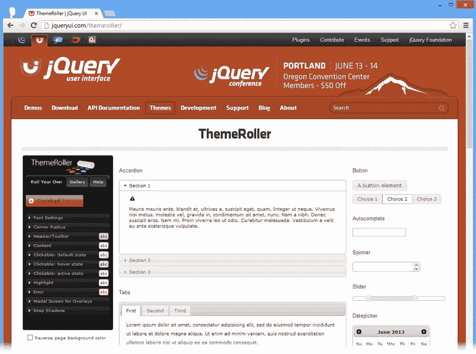
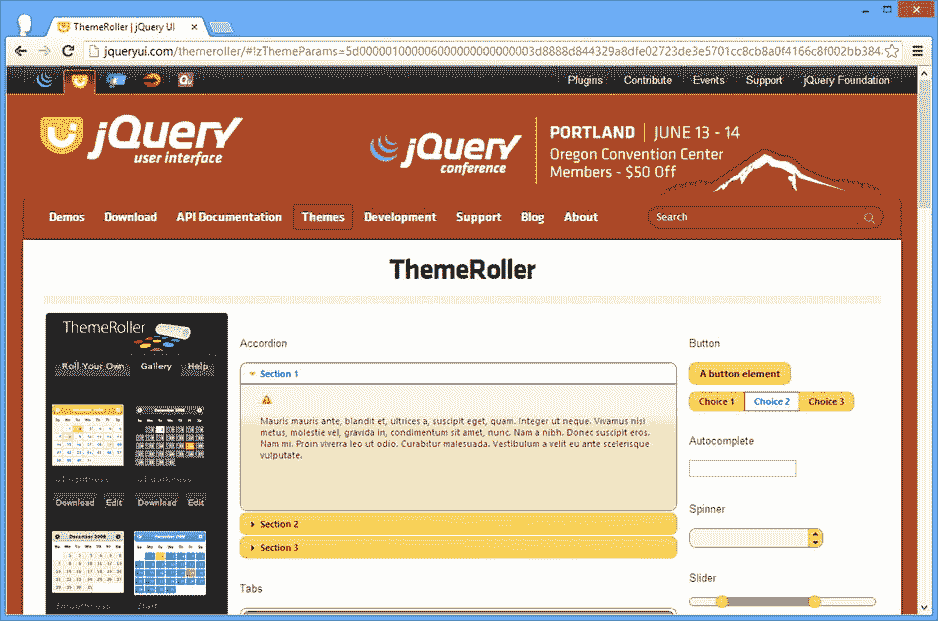
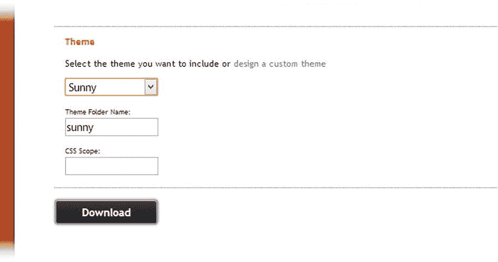
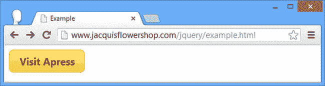
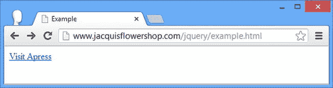

# 十七、设置 jQuery UI

下载和安装 jQuery UI 比其他 JavaScript 库更复杂。这并不麻烦，但需要一些解释，我在这一章中提供了。您只需要为这本书的开发做好准备，但是我也包括了如何安装适合生产部署的最小化文件以及如何通过内容分发网络(CDN)使用 jQuery UI 的细节。

 **注意**正如我在第一章中所解释的，jQuery UI API 随着 1.10 版本的发布而发生了变化，我将在接下来的章节中重点介绍这些变化。

获取 jQuery UI

jQuery UI 中有四个主要的功能区域，您可以创建一个自定义下载来包含和配置每一个区域。在本书的这一部分，我向您展示了 jQuery UI 的所有特性，但是对于真正的 web 应用，您可以省略不需要的部分，并创建一个较小的库供浏览器下载。

 **提示** jQuery UI 并不是唯一基于 jQuery 的 UI 工具包，尽管它是目前最流行的。另一个选择是 jQuery Tools，它是开源的，可以从`http://flowplayer.org/tools`下载，没有任何许可或限制。还有一些商业上的替代品，比如 jQWidgets ( `www.jqwidgets.com`)和 Wijmo ( `http://wijmo.com`)。当然，还有 jQuery Mobile，我在本书的第五部分对此进行了描述。

决定主题

在构建自定义 jQuery UI 库之前，您需要选择一个主题。jQuery UI 是无限可配置的，您可以更改您使用的每个特性的外观。事实上，有这么多的选择，它可以有些不知所措。jQuery UI web 站点包括一个用于创建定制主题的工具，但是还有一个预定义主题库，您可以选择这些主题来简化工作。

首先，转到`http://jqueryui.com`并点击`Themes`按钮。这将加载*主题滚轮*页面，该页面由一个 jQuery UI 小部件的显示和一个左侧面板组成，该面板允许您配置主题设置，如图图 17-1 所示。



图 17-1 。jQuery UI 网站主题页面

如果您需要遵循某种视觉样式来使 jQuery UI 适应站点或应用的其余部分，请使用 Roll Your Own 选项卡(默认情况下选中)。您可以更改 jQuery UI 使用的主题的各个方面。

预定义的主题在图库选项卡上可用。当我写这篇文章时，画廊里有 24 个主题可供选择，它们从低调和微妙到明亮和花哨。当你点击每个图库主题时，页面其余部分的窗口小部件会更新，向你展示你的应用的外观，如图 17-2 所示。



图 17-2 。展示阳光主题的画廊

jQuery UI 的默认主题叫做 *UI 亮度*，但是它没有足够的对比度来很好地显示在图书页面上，所以我将使用*阳光*主题，它显示得稍微好一点。目前你不需要对主题做任何事情，除了记住你想用哪一个。这些主题打印出来时看起来不太好，但它们在屏幕上有更好的外观，我建议你浏览列表，直到找到你喜欢的。

 **提示**你不必选择我将使用的相同主题，但如果你选择不同的主题，你显然会得到与我不同的结果。

创建 jQuery UI 自定义下载

既然已经有了主题，就可以创建 jQuery UI 下载了。点击页面顶部的`Download`按钮，进入构建您的下载页面。

第一步是选择想要下载的 jQuery UI 版本。当我写这篇文章时，最新的版本是`1.10.3`,这也是我将在本书中使用的版本。

除了指定 jQuery UI 版本之外，该页面还有一个 jQuery UI 组件列表，分为四个功能组: *UI 核心*、*交互*、*小部件*和*效果*。

通过只选择项目所需的功能，您可以创建一组较小的文件供浏览器下载。我认为这是一个不错的想法，但我倾向于不使用它，因为我更喜欢通过使用 CDN 来减少交付 jQuery UI 所需的带宽，我在“通过内容分发网络使用 jQuery UI”一节中向您展示了如何做到这一点

对于这一章，您将需要所有的组件，所以确保所有四个选项都被选中。

 **提示**列表中的一些组件依赖于其他组件，但是在构建自定义的 jQuery UI 库时，你不必担心这一点。当您启用一个组件时，它所依赖的任何其他组件也会被加载。

下一步是选择你想要的主题。这个选择器在页面的底部，就在下载按钮的上方，如图图 17-3 所示。



图 17-3 。选择主题

一旦您选择了所有的组件、您想要的主题和稳定版本，单击`Download`按钮下载定制的 jQuery UI 库。

安装用于开发的 jQuery UI

jQuery UI 下载是一个 zip 文件，包含开发和生产所需的所有文件。对于本书，您将使用包含未统一源代码的开发文件。如果您遇到问题，这使得查看 jQuery UI 的内部变得很容易。您需要将以下内容复制到包含示例文件的文件夹中:

*   `js\jquery-ui-1.10.3.custom.js`文件
*   `themes\sunny\jquery-ui-1.10.3.custom.css`文件
*   `themes\sunny\images`文件夹

您会注意到在`ui`和`themes`文件夹中有针对单个组件和特性的 JavaScript 和层叠样式表(CSS)文件。您不需要使用它们，但是如果您只需要使用有限的 jQuery UI 特性，它们会很有帮助。

 **提示**JavaScript 和 CSS 文件的名称包括下载的版本号。对我来说，这是 1.10.3 版本。jQuery UI 正在积极开发中，您可能已经下载了更高版本。如果是这样，您需要在 HTML 示例中更改对 jQuery UI 文件的引用。

向 HTML 文档添加 jQuery UI

剩下的就是将 jQuery UI 添加到一个示例 HTML 文档中，这是通过引用我在上一节中列出的 JavaScript 和 CSS 文件的`script`和`link`元素来完成的，如清单 17-1 所示。

***清单 17-1*** 。向 HTML 文档添加 jQuery UI

```js
<!DOCTYPE html>
<html>
<head>
    <title>Example</title>
    <script src="jquery-2.0.2.js" type="text/javascript"></script>
    <script src="jquery-ui-1.8.16.custom.js" type="text/javascript"></script>
    <link rel="stylesheet" type="text/css" href="styles.css"/>
    <link rel="stylesheet" type="text/css" href="jquery-ui-1.8.16.custom.css"/>
    <script type="text/javascript">
        $(document).ready(function() {
            $("a").button();
        });
    </script>
</head>
<body>
    <a href="http://apress.com">VisitApress</a>
</body>
</html>
```

 **提示**你不需要直接查阅`images`目录。只要图像目录和 CSS 文件在同一个地方，jQuery UI 就能够找到它需要的资源。

 **提示** jQuery UI 依赖于 jQuery。为了使用 jQuery UI，您必须将 jQuery 添加到文档中。

清单中显示的文档包括一个简单的测试，允许您检查 jQuery UI 是否已经正确添加。如果你在浏览器中查看这个，你应该会看到一个类似于图 17-4 中的按钮。不用担心对清单中的`script`元素中的`button`方法的调用。我会在第十八章的中解释这是做什么的以及它是如何工作的。



图 17-4 。检查 jQuery UI 是否已经正确添加到文档中

如果你没有正确指定这两个文件的路径，那么你会看到一个简单的`a`元素，如图 17-5 中的所示。



图 17-5 。识别问题将 jQuery UI 导入到文档中

为生产安装 jQuery UI

当您完成 web 应用的开发并准备好部署它时，您可以使用 jQuery UI 下载中包含的精简文件。这个文件更小，但是为了调试的目的更难阅读。要使用生产文件，您必须将以下内容复制到 web 服务器目录中:

*   `js\jquery-ui-1.10.3.custom.min.js`文件
*   `themes\sunny\jquery-ui-1.10.3.custom.css`文件
*   `themes\sunny\images`文件夹

`images`目录和 CSS 文件与开发版相同；只有 JavaScript 文件发生了变化。

通过内容分发网络使用 jQuery UI

我在第五章的中提到了使用 CDN 进行 jQuery。如果这是一种吸引你的方法，你会很高兴地得知你可以用 jQuery UI 做同样的事情。Google 和微软都将 jQuery UI 文件放在他们的 cdn 上。对于这个例子，我将使用 Microsoft 服务，因为它托管标准主题以及 jQuery UI JavaScript。

要使用 CDN，你只需要你想要的文件的 URL。对于微软服务，请转到`www.asp.net/ajaxlibrary/cdn.ashx`开始使用。如果您向下滚动页面，您将看到一个 jQuery UI 发布的部分，按版本细分。单击您正在使用的版本的链接。您将看到 jQuery UI 库文件的常规和最小化版本的 URL。对于我写这篇文章时的最新版本，最小化文件的 URL 如下:

```js
http://ajax.aspnetcdn.com/ajax/jquery.ui/1.10.3/jquery-ui.min.js
```

页面的其余部分显示了每个预定义的 jQuery UI 主题，主题 CSS 的 URL 显示在下面。阳光主题的网址如下:

```js
http://ajax.aspnetcdn.com/ajax/jquery.ui/1.10.3/themes/sunny/jquery-ui.css
```

要在 CDN 上使用这些文件，只需将 URL 放在引用本地 jQuery UI 文件的`script`和`link`元素中，如清单 17-2 所示。

***清单 17-2*** 。通过 CDN 使用 jQuery UI

```js
<!DOCTYPE html>
<html>
<head>
    <title>Example</title>
    <script src="jquery-2.0.2.js" type="text/javascript"></script>
    <script src="[`ajax.aspnetcdn.com/ajax/jquery.ui/1.10.3/jquery-ui.min.js`](http://ajax.aspnetcdn.com/ajax/jquery.ui/1.10.3/jquery-ui.min.js)"
        type="text/javascript"></script>
    <link
    href="[`ajax.aspnetcdn.com/ajax/jquery.ui/1.10.3/themes/sunny/jquery-ui.css`](http://ajax.aspnetcdn.com/ajax/jquery.ui/1.10.3/themes/sunny/jquery-ui.css)"
        rel="stylesheet" />
    <link rel="stylesheet" type="text/css" href="styles.css"/>
    <script type="text/javascript">
        $(document).ready(function () {
            $("a").button();
        });
    </script>
</head>
<body>
    <a href="http://apress.com">VisitApress</a>
</body>
</html>
```

同样，你可以通过加载文档并查看浏览器是否显示一个类似于图 17-4 中的按钮来判断你是否有正确的 URL。

摘要

在本章中，我向您展示了创建和准备 jQuery UI 下载所需的步骤。在包含的特性和 jQuery UI 赋予 web 应用的默认外观方面有很大的灵活性。我特别喜欢 ThemeRoller 应用。这是一种创建完全定制的主题以适应现有视觉方案的优雅方式，非常适合将 jQuery UI 添加到公司品牌的站点。在下一章中，您将开始研究不同的 jQuery UI 特性，从最流行的功能领域开始:小部件。