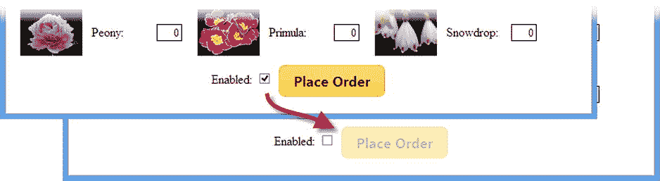
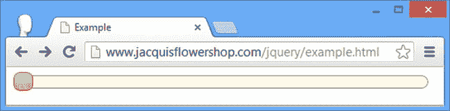

# 十八、使用按钮、进度条和滑块小部件

现在您已经配置、下载并安装了 jQuery UI，您可以开始查看它包含的小部件了。这些是 jQuery UI 的主要功能块，尽管还有其他特性(比如效果，我在第三十五章中描述过)，jQuery UI 还是以小部件而闻名。

在这一章中，我描述了三个最简单的部件:按钮、进度条和滑块。所有 jQuery UI 小部件都有共同的特征:设置、方法和事件。掌握一个小部件为使用所有这些部件提供了坚实的基础，所以我在本章开始时花了一些时间来提供整体背景。

很难将所有的小部件都绑定到花店示例中，因此您会发现本书这一部分中的许多示例都是小型的、自包含的 HTML 文档，它们演示了一个小部件。当我重构它以包含 jQuery UI 时，我回到了第二十六章中的花店示例。表 18-1 对本章进行了总结。

表 18-1 。章节总结

| 问题 | 解决办法 | 列表 |
| --- | --- | --- |
| 创建 jQuery UI 按钮 | 选择一个元素并使用`button`方法 | one |
| 配置按钮元素 | 将地图对象传递给`button`方法或使用`option`方法 | 2, 3 |
| 在 jQuery UI 按钮中使用图标 | 使用`icons`设置 | four |
| 在 jQuery UI 按钮中使用自定义图像 | 将按钮的内容设置为一个`img`元素 | five |
| 删除 jQuery UI 按钮小部件 | 使用`destroy`方法 | six |
| 启用或禁用 jQuery UI 按钮 | 使用`enable`或`disable`方法 | seven |
| 刷新 jQuery UI 按钮的状态，以反映对基础元素的编程更改 | 使用`refresh`方法 | eight |
| 响应正在创建的 jQuery UI 按钮 | 为`create`事件指定一个函数 | nine |
| 从不同种类的元素创建统一的按钮 | 从`input`、`button`或`a`元素创建 jQuery UI 按钮 | Ten |
| 创建切换按钮 | 从复选框创建 jQuery UI | Eleven |
| 创建按钮集 | 使用`buttonset`方法 | 12, 13 |
| 创建 jQuery UI 进度条 | 使用`progressbar`方法 | 14, 15 |
| 获取或设置向用户显示的进度 | 使用`value`方法 | Sixteen |
| 响应进度条中的更改 | 指定`create`、`change`或`complete`事件的功能 | Seventeen |
| 创建 jQuery UI 滑块 | 使用`slider`方法 | Eighteen |
| 更改 jQuery UI 滑块的方向 | 使用`orientation`设置 | 19, 20 |
| 当用户单击滑块时，动画显示手柄的移动 | 使用`animate`设置 | Twenty-one |
| 创建一个 jQuery UI 滑块，允许用户指定值的范围 | 使用`range`和`values`设置 | Twenty-two |
| 以编程方式控制 jQuery UI 滑块 | 使用`value`或`values`方法 | Twenty-three |
| 响应滑块手柄位置的变化 | 处理`start`、`stop`、`change`或`slide`事件 | Twenty-four |

自上一版以来，JQUERY UI 发生了变化

从 jQuery UI 1.10 开始，progress 小部件可以用来显示不确定的任务。有关详细信息和示例，请参见“使用 jQuery UI 进度条”一节。

使用 jQuery UI 按钮

我看到的第一个小部件很好地介绍了 jQuery UI 的世界。button 小部件很简单，但是对 HTML 文档有一种转换效果。按钮小部件将 jQuery UI 主题应用于`button`和`a`元素。这意味着元素的大小、形状、字体和颜色被转换以匹配我在第十七章中创建自定义 jQuery UI 下载时选择的主题。应用 jQuery UI 小部件很简单，如清单 18-1 所示。

***清单 18-1*** 。一个简单的 HTML 文档

```js
<!DOCTYPE html>
<html>
<head>
    <title>Example</title>
    <script src="jquery-2.0.2.js"></script>
    <script src="handlebars.js"></script>
    <script src="handlebars-jquery.js"></script>
    <script src="jquery-ui-1.10.3.custom.js"></script>
    <link href="jquery-ui-1.10.3.custom.css" rel="stylesheet" />
    <link rel="stylesheet" type="text/css" href="styles.css"/>

    <script id="flowerTmpl" type="text/x-handlebars-template">
        {{#flowers}}
        <div class="dcell">
            
            <label for="{{product}}">{{name}}:</label>
            <input name="{{product}}" data-price="{{price}}" data-stock="{{stocklevel}}"
                value="0" required />
        </div>
        {{/flowers}}
    </script>

    <script type="text/javascript">
        $(document).ready(function () {
            $.ajax("mydata.json", {
                success: function (data) {
                    var tmplData = $("#flowerTmpl")
                        .template({ flowers: data }).filter("*");
                    tmplData.slice(0, 3).appendTo("#row1");
                    tmplData.slice(3).appendTo("#row2");
                }
            });

            $("button").button();
        });
    </script>
</head>
<body>
    <h1>Jacqui's Flower Shop</h1>
    <form method="post" action="http://node.jacquisflowershop.com/order">
        <div id="oblock">
            <div class="dtable">
                <div id="row1" class="drow">
                </div>
                <div id="row2"class="drow">
                </div>
            </div>
        </div>
        <div id="buttonDiv"><button type="submit">Place Order</button></div>
    </form>
</body>
</html>
```

为了应用 button 小部件，我使用 jQuery 选择我想要转换的元素，并调用`button`方法；jQuery UI 负责剩下的工作。你可以在图 18-1 中看到效果。


图 18-1 。应用按钮小部件

 **提示**注意，我将`button`方法应用于 jQuery 选择对象。jQuery 和 jQuery UI 之间的集成非常紧密，这意味着使用 jQuery UI 通常是我在本书前面向您展示的核心 jQuery 技术的自然扩展。

像所有 jQuery UI 小部件一样，图中显示的按钮是应用于现有 HTML 元素的一系列 CSS 样式。`button`方法像这样转换一个元素

```js
<button type="submit">Place Order</button>
```

对此

```js
<button type="submit" class="ui-button ui-widget ui-state-default ui-corner-all
    ui-button-text-only" role="button" aria-disabled="false">
        <span class="ui-button-text">Place Order</span>
</button>
```

这是一个很好的方法，因为它围绕标准的 HTML 元素工作，这意味着在创建 HTML 内容时，您不必为 jQuery UI 做任何特殊的准备。

配置按钮

jQuery UI 按钮小部件可以通过设置属性进行配置，允许控制创建按钮的方式。表 18-2 描述了这些属性。

表 18-2 。按钮小工具的设置属性

| 财产 | 描述 |
| --- | --- |
| `disabled` | 获取或设置按钮的禁用状态。`true`值表示按钮被禁用。jQuery UI 不考虑底层 HTML 元素的状态。 |
| `text` | 获取或设置按钮是否显示文本。如果`icons`属性为`false`，则忽略该设置。 |
| `icons` | 获取或设置按钮是否显示图标。 |
| `label` | 获取或设置按钮显示的文本。 |

这些设置有两种应用方式。第一个是在调用`button`方法时使用 map 对象，如清单 18-2 中所强调的。

***清单 18-2*** 。使用地图对象配置按钮微件

```js
...
<script type="text/javascript">
    $(document).ready(function () {
        $.ajax("mydata.json", {
            success: function (data) {
                var tmplData = $("#flowerTmpl")
                    .template({ flowers: data }).filter("*");
                tmplData.slice(0, 3).appendTo("#row1");
                tmplData.slice(3).appendTo("#row2");
            }
        });

        $("button").button({
            label: "Place Your Order",
            disabled: true
        });

        $("button").button("option", "disabled", false);
    });
</script>
...
```

我已经用`label`属性设置了按钮显示的文本，并使用`disabled`属性禁用了按钮。使用地图对象是定义小部件初始配置的方法，并遵循你最近在第十五章中看到的配置 Ajax 请求的风格。

清单 18-2 还展示了在创建小部件后改变设置属性值的技术，如下所示:

```js
...
$("button").button("option", "disabled", false);
...
```

我再次调用`button`方法，但是这次有三个参数。第一个参数是字符串`option`，它告诉 jQuery UI 我想更改一个设置。第二个参数是我想要更改的设置，第三个参数是设置的新值。这条语句将`disabled`设置为`false`，启用按钮并更改我在创建小部件时用地图对象设置的值。

您可以将这些技术结合起来，这样就可以用第一个参数`option`和第二个参数 map 对象来调用`button`方法。这允许你一次改变多个设置，如清单 18-3 所示。

***清单 18-3*** 。对地图对象使用选项参数

```js
...
<script type="text/javascript">
    $(document).ready(function () {
        $.ajax("mydata.json", {
            success: function (data) {
                var tmplData = $("#flowerTmpl")
                    .template({ flowers: data }).filter("*");
                tmplData.slice(0, 3).appendTo("#row1");
                tmplData.slice(3).appendTo("#row2");
            }
        });

        $("button").button();

        $("button").button("option", {
            label: "Place Your Order",
            disabled: false
        });

        console.log("Disabled: " + $("button").button("option", "disabled"));
    });
</script>
...
```

你也可以使用同样的技术让*读取*一个设置的值。在这种情况下，您调用只有两个参数的`button`方法。第一个是字符串`option`，第二个是要读取其值的设置的名称，如清单中的以下语句所示:

```js
...
console.log("Disabled: " + $("button").button("option", "disabled"));
...
```

以这种方式使用时，`button`方法返回当前设置值。示例语句读取`disabled`设置的值，并将其写入控制台，产生以下输出:

```js
Disabled: false
```

在按钮中使用 jQuery UI 图标

jQuery UI 主题包括一组可以用于任何目的的图标，包括在按钮中显示它们。清单 18-4 显示了图标在 jQuery UI 按钮中的使用。

***清单 18-4*** 。在按钮中显示图标

```js
...
<script type="text/javascript">
    $(document).ready(function () {
        $.ajax("mydata.json", {
            success: function (data) {
                var tmplData = $("#flowerTmpl")
                    .template({ flowers: data }).filter("*");
                tmplData.slice(0, 3).appendTo("#row1");
                tmplData.slice(3).appendTo("#row2");
            }
        });

        $("button").button({
            icons: {
                primary: "ui-icon-star",
                secondary: "ui-icon-circle-arrow-e"
            }
        });
    });
</script>
...
```

属性指定将显示哪些图标。按钮部件有两个图标位置。`primary`图标显示在文本的左侧，而`secondary`图标显示在文本的右侧，两者都由地图对象指定。您可以省略任一属性，只在其中一个位置显示图标。图标本身很小，正如你在图 18-2 中看到的。


图 18-2 。在按钮中显示图标

图标是使用 jQuery UI CSS 文件中定义的类来指定的。有 173 种不同的图标可用，太多了，无法在此列出。找出你想要的图标名称的最简单的方法是进入`http://jqueryui.com`，选择主题页面并向下滚动页面。你会看到所有的图标都列在一个网格中，在每个图标上移动鼠标按钮会显示图标的类名，如图 18-3 所示。


图 18-3 。jQuery UI 图标网格

 **提示**在网页上弹出的名字有一个前导句点，必须省略才能与图标设置一起使用。所以，举例来说，如果鼠标悬停在网格中的第一个图标上，就会弹出`.ui-icon-caret-1-n`。要将此图标与按钮一起使用，请将 primary 或 secondary 属性设置为`ui-icon-caret-1-n`。

使用自定义图像

我觉得 jQuery UI 图标没什么用，因为它们通常太小，不符合我的需求。幸运的是，有两种替代技术可以在 jQuery UI 按钮中显示自定义图像。

第一种方法是在打算应用 jQuery UI 按钮小部件的`button`元素中插入一个`img`元素。jQuery UI 按钮小部件尊重底层`button`元素的内容，并且——只要您使用透明背景的图像——您就不必担心使图像与主题相匹配。清单 18-5 给出了一个简单的演示。

***清单 18-5*** 。使用带有 jQuery UI 按钮的自定义图像

```js
...
<script type="text/javascript">
    $(document).ready(function () {
        $.ajax("mydata.json", {
            success: function (data) {
                var tmplData = $("#flowerTmpl")
                    .template({ flowers: data }).filter("*");
                tmplData.slice(0, 3).appendTo("#row1");
                tmplData.slice(3).appendTo("#row2");
            }
        });

        $("button")
            .text("")
            .append("")
            .button();
    });
</script>
...
```

因为我既不想要文本*也不想要 jQuery UI 图标*，所以我使用 jQuery `text`方法将内容设置为空字符串。然后我使用`append`方法将一个`img`元素插入到`button`元素中，最后调用`button`方法来应用 jQuery UI。你可以在图 18-4 中看到结果。


图 18-4 。在按钮中显示自定图像

使用按钮方法

jQuery UI 小部件还定义了在小部件创建后用来控制它的方法。这些方法有点奇怪，因为您调用相同的 JavaScript 方法，但是传入不同的参数值来改变 jQuery UI 行为。然而，这些仍然被 jQuery UI 团队称为方法，我也这样称呼它们。表 18-3 显示了你可以在按钮部件上使用的不同的 jQuery UI 方法以及每种方法的效果。

表 18-3 。按钮方法

| 方法 | 描述 |
| --- | --- |
| `button("destroy")` | 将 HTML 元素返回到其原始状态 |
| `button("disable")` | 禁用了按钮 |
| `button("enable")` | 启用按钮 |
| `button("option")` | 设置一个或多个选项；请参见“配置按钮”一节 |
| `button("refresh")` | 刷新按钮；请参见“刷新 jQuery UI 按钮的状态”一节 |

移除小组件

`destroy`方法从 HTML `button`元素中移除 jQuery UI 按钮小部件，将其恢复到原始状态，如清单 18-6 所示。

***清单 18-6*** 。使用销毁方法

```js
...
<script type="text/javascript">
    $(document).ready(function () {
        $.ajax("mydata.json", {
            success: function (data) {
                var tmplData = $("#flowerTmpl")
                    .template({ flowers: data }).filter("*");
                tmplData.slice(0, 3).appendTo("#row1");
                tmplData.slice(3).appendTo("#row2");
            }
        });

        $("button").button().click(function (e) {
            $("button").button("destroy");
            e.preventDefault();
        });
    });
</script>
...
```

在清单 18-6 的中，我使用标准的 jQuery `click`方法为`button`元素注册了一个处理函数。这是我在第九章中演示的处理事件的技术，不需要调整来支持 jQuery UI。清单中的`click`处理函数意味着点击按钮从按钮元素中移除 jQuery UI 小部件，如图 18-5 所示。


图 18-5 。销毁 jQuery UI 按钮小部件

启用和禁用按钮

`enable`和`disable`方法改变 jQuery UI 按钮的状态，如清单 18-7 所示。

***清单 18-7*** 。启用和禁用按钮

```js
...
<script type="text/javascript">
    $(document).ready(function () {
        $.ajax("mydata.json", {
            success: function (data) {
                var tmplData = $("#flowerTmpl")
                    .template({ flowers: data }).filter("*");
                tmplData.slice(0, 3).appendTo("#row1");
                tmplData.slice(3).appendTo("#row2");
            }
        });

        $("<span>Enabled:<span><input type=checkbox checked />").prependTo("#buttonDiv");
        $(":checkbox").change(function (e) {
            $("button").button(
                $(":checked").length == 1 ? "enable" : "disable"
            )
        });

        $("button").button();
    });
</script>
...
```

我在文档中插入了一个复选框，并使用`change`方法注册了一个函数，当复选框被选中或未选中时，将调用这个函数。我调用`enable`和`disable`方法来改变按钮的状态以匹配复选框。你可以在图 18-6 中看到效果。



图 18-6 。启用和禁用 jQuery UI 按钮

刷新 jQuery UI 按钮的状态

`refresh`方法更新 jQuery UI 按钮小部件的状态，以反映底层 HTML 元素的变化。这在你修改代码中其他地方的元素时会很有用，如清单 18-8 所示。

***清单 18-8*** 。刷新 jQuery UI 按钮

```js
...
<script type="text/javascript">
    $(document).ready(function () {
        $.ajax("mydata.json", {
            success: function (data) {
                var tmplData = $("#flowerTmpl")
                    .template({ flowers: data }).filter("*");
                tmplData.slice(0, 3).appendTo("#row1");
                tmplData.slice(3).appendTo("#row2");
            }
        });

        $("<span>Enabled:<span><input type=checkbox checked />").prependTo("#buttonDiv");
        $(":checkbox").change(function (e) {
            var buttons = $("button");
            if ($(":checked").length == 1) {
                buttons.removeAttr("disabled");
            } else {
                buttons.attr("disabled", "disabled");
            }
            buttons.button("refresh");
        });

        $("button").button();
    });
</script>
...
```

在这个例子中，我使用复选框来触发从支撑按钮小部件的 HTML `button`元素中添加和删除`disabled`属性。jQuery UI 不会自动检测到这种变化，所以我调用了`refresh`方法来使一切恢复同步。

 **提示**您可能想知道为什么我不直接使用 jQuery UI `enable`和`disable`方法，但是清单 18-8 中的场景出奇地常见，因为 jQuery UI 经常在开发过程的后期应用于 HTML 内容，经常用于改进现有的 web 应用。在这种情况下，HTML 元素将由 jQuery UI 用户之前的代码生成和操作，并且不知道将使用按钮小部件，因此能够更新小部件的状态以反映底层 HTML 元素的状态是一个重要的特性。

使用按钮事件

除了底层 HTML 元素的事件之外，jQuery UI 小部件还定义了事件。`button`小部件定义了一个名为`create`的事件，当您创建一个 jQuery UI 按钮小部件时会触发该事件。jQuery UI 事件的处理程序是通过将一个 JavaScript map 对象传递给小部件的 jQuery UI 方法来定义的，在本例中是`button`，如清单 18-9 所示。

***清单 18-9*** 。使用 jQuery UI 按钮创建事件

```js
...
<script type="text/javascript">
    $(document).ready(function () {
        $.ajax("mydata.json", {
            success: function (data) {
                var tmplData = $("#flowerTmpl")
                    .template({ flowers: data }).filter("*");
                tmplData.slice(0, 3).appendTo("#row1");
                tmplData.slice(3).appendTo("#row2");
            }
        });

        $("button").button({
            create: function (e) {
                $(e.target).click(function (e) {
                    alert("Button was pressed");
                    e.preventDefault();
                })
            }
        });
    });
</script>
...
```

在清单 18-9 中，我使用`create`事件来设置一个函数来响应`button`上的`click`事件。我觉得`create`事件没什么用处，通常我发现任何可以响应这个事件的事情都可以用一种更符合更广泛的 jQuery 方法的方式来完成。

创建不同类型的按钮

jQuery UI 按钮小部件对它所应用的元素种类很敏感。当您对`button`元素、或者`a`元素、或者类型被设置为`submit`、`reset`或`button`的`input`元素调用`button`方法时，会创建一个常规按钮的基本行为。清单 18-10 显示了所有这些被转换成 jQuery UI 按钮的元素。

***清单 18-10*** 。创建标准按钮

```js
<!DOCTYPE html>
<html>
<head>
    <title>Example</title>
    <script src="jquery-1.7.js" type="text/javascript"></script>
    <script src="jquery-ui-1.8.16.custom.js" type="text/javascript"></script>
    <link rel="stylesheet" type="text/css" href="jquery-ui-1.8.16.custom.css"/>
    <script type="text/javascript">
        $(document).ready(function() {
            $(".jqButton").click(function(e) {
               e.preventDefault();
               $(this).button();
            });
        });
    </script>
</head>
<body>
    <form>
        <input class="jqButton" type="submit" id="inputSubmit" value="Submit">
        <input class="jqButton" type="reset" id="inputReset" value="Reset">
        <input class="jqButton" type="button" id="inputButton" value="Input Button">
        <button class="jqButton">Button Element</button>
        <a class="jqButton" href="[`apress.com`](http://apress.com)">A Element</a>
    </form>
</body>
</html>
```

我已经定义了我所描述的每一种 HTML 元素。我使用了`click`方法，以便每个元素在被单击时都被转换成一个 jQuery UI 按钮小部件。你可以在图 18-7 中看到这种转变。


图 18-7 。创建标准 jQuery UI 按钮

创建切换按钮

如果在类型设置为`checkbox`的`input`元素上调用`button`方法，就会得到一个切换按钮小部件。当您单击切换按钮时，它会根据底层 HTML 元素的选中和未选中状态打开或关闭。清单 18-11 提供了一个演示。

***清单 18-11*** 。将 jQuery UI 应用于复选框

```js
<!DOCTYPE html>
<html>
<head>
    <title>Example</title>
    <script src="jquery-2.0.2.js"></script>
    <script src="jquery-ui-1.10.3.custom.js"></script>
    <link href="jquery-ui-1.10.3.custom.css" rel="stylesheet" />
    <script type="text/javascript">
        $(document).ready(function () {
            $(".jqButton").button();
        });
    </script>
</head>
<body>
    <form>
        <input class="jqButton" type="checkbox" id="toggle">
        <label for="toggle">Toggle Me</label>
    </form>
</body>
</html>
```

要从复选框创建 jQuery UI 按钮，必须有一个`input`元素和一个匹配的`label`元素，如清单所示。jQuery UI 创建了一个按钮，它与基本按钮具有相同的外观，但是在单击时会切换其状态。你可以在图 18-8 中看到效果。


图 18-8 。从复选框创建切换按钮

请记住，jQuery UI 不会改变底层的 HTML 元素，所以当复选框包含在表单中时，浏览器仍然会以同样的方式处理它。使用`checked`属性反映状态的变化，就像没有 jQuery UI 一样。

创建按钮集

您可以使用`buttonset`方法从单选按钮元素创建 jQuery UI 按钮，如清单 18-12 中的所示。

***清单 18-12*** 。创建按钮集

```js
<!DOCTYPE html>
<html>
<head>
    <title>Example</title>
    <script src="jquery-2.0.2.js"></script>
    <script src="jquery-ui-1.10.3.custom.js"></script>
    <link href="jquery-ui-1.10.3.custom.css" rel="stylesheet" />
    <script type="text/javascript">
        $(document).ready(function () {
            $("#radioDiv").buttonset();
        });
    </script>
</head>
<body>
    <form>
        <div id="radioDiv">
            <input type="radio" name="flower" id="rose" checked />
            <label for="rose">Rose</label>
            <input type="radio" name="flower" id="lily"/><label for="lily">Lily</label>
            <input type="radio" name="flower" id="iris"/><label for="iris">Iris</label>
        </div>
    </form>
</body>
</html>
```

注意，我选择了包含单选按钮的`div`元素，以便调用`buttonset`方法:您不需要在单个`input`元素上调用`button`方法。你可以在图 18-9 的中看到`buttonset`方法的效果。


图 18-9 。创建按钮集

最多只能选择按钮集中的一个按钮，这允许您以与其他 jQuery UI 按钮在视觉上一致的方式为用户提供一组固定的选项。请注意，jQuery UI 通过将不同的样式应用到按钮相遇的边缘，强调了一组按钮之间的关系。这在图 18-10 中显示得更清楚。


图 18-10 。按钮集的 jQuery UI 样式

从常规按钮创建按钮集

您可以在任何可以与常规的`button`方法一起使用的元素上使用`buttonset`方法。这具有应用一组单选按钮的*样式*但是*而不是*行为的效果，以便每个按钮单独工作。清单 18-13 展示了`buttonset`方法的这种用法。

***清单 18-13*** 。从常规按钮创建按钮集

```js
<!DOCTYPE html>
<html>
<head>
    <title>Example</title>
    <script src="jquery-2.0.2.js"></script>
    <script src="jquery-ui-1.10.3.custom.js"></script>
    <link href="jquery-ui-1.10.3.custom.css" rel="stylesheet" />
    <script type="text/javascript">
        $(document).ready(function () {
            $("#radioDiv").buttonset();
        });
    </script>
</head>
<body>
    <form>
        <div id="radioDiv">
            <input type="submit" value="Submit"/>
            <input type="reset" value="Reset"/>
            <input type="button" value="Press Me"/>
            <a href="[`apress.com`](http://apress.com)">Visit Apress</a>
        </div>
    </form>
</body>
</html>
```

在`div`容器中任何合适的元素都将被转换成一个按钮，相邻的边缘将被设计成单选按钮的样式，如图 18-11 中的所示。


图 18-11 。从常规按钮创建按钮集

 **提示**使用这种技巧时要小心。这可能会让用户感到困惑，尤其是当您在同一文档或 web 应用的其他地方使用单选按钮时。

使用 jQuery UI 进度条

现在我已经使用按钮探索了 jQuery UI 小部件的基本结构，接下来我将看看 jQuery UI 支持的其他小部件，从进度条开始。

进度条允许您向用户显示完成任务的进度。进度条被设计用来显示*确定性任务*，在这里你可以给用户一个精确的指示，以百分比表示你完成任务的进度，以及*不确定性任务*，在这里进度的百分比目前是未知的。

 **提示**jQuery UI 在 1.10 版本中增加了显示不确定任务的支持。有关此功能的详细信息，请参见“创建不确定的进度条”一节。

显示有用的进度信息

web 应用中应该如何使用窗口小部件没有规则，但是用户对进度条等控件的期望是由 Windows 和 Mac OS 等操作系统设定的标准决定的。为了帮助用户理解你的进度条，有一些规则要遵循。

首先，只增加进度。当任务的步骤比最初预期的多时，不要试图降低进度。进度条显示任务已完成的百分比，而不是剩余时间的估计值。如果一项任务有不同的可能路径，那么显示最悲观的进度。与其让用户困惑，不如在进程中取得巨大的进步。

第二，不要在进度条上循环不止一次。如果您有足够的信息向用户显示相当准确的完成信息，那么您应该使用不确定的进度指示器。当进度接近 100%时，用户希望任务完成。如果进度条随后重置，并开始再次建立，你只是混淆了用户，使进度条的使用毫无意义。

创建进度条

你通过选择一个`div`元素并调用`progressbar`方法来创建一个进度条，如清单 18-14 所示。

***清单 18-14*** 。创建进度条

```js
<!DOCTYPE html>
<html>
<head>
    <title>Example</title>
    <script src="jquery-2.0.2.js"></script>
    <script src="jquery-ui-1.10.3.custom.js"></script>
    <link href="jquery-ui-1.10.3.custom.css" rel="stylesheet" />
    <script type="text/javascript">
        $(document).ready(function () {
            $("#progressDiv").progressbar({
                value: 21
            });
        });
    </script>
</head>
<body>
    <div id="progressDiv"></div>
</body>
</html>
```

该文档包含一个`div`元素，其`id`为`progressDiv`。要创建一个进度条，我必须使用一个空的`div`元素——如果`div`元素有任何内容，它将影响进度条的布局。我使用 jQuery 选择`progressDiv`元素并调用 jQuery UI `progressbar`方法，传入一个 map 对象来提供初始配置。进度条支持三种设置，我已经在表 18-4 中描述过。

表 18-4 。进度条小工具的设置

| 环境 | 描述 |
| --- | --- |
| `disabled` | 如果`true`，进度条将被禁用。默认值为`false`。 |
| `value` | 设置向用户显示的完成百分比。默认值为零。将属性设置为`false`以显示不确定的进度条，如“创建不确定的进度条”一节所述 |
| `max` | 设置进度条将显示的最大值。默认为`100`。 |

在这个例子中，我指定了一个初始值 21(由于我没有改变`max`设置的值，这个值相当于 21%)，你可以在图 18-12 中看到这个效果。


图 18-12 。创建进度条

创建不确定的进度条

从 jQuery UI 1.10 开始，jQuery UI 进度条小部件支持显示不确定任务的进度，这是通过将`value`配置属性设置为`false`而不是指定一个数值来配置的，如清单 18-15 所示。

***清单 18-15*** 。创建不确定的进度条

```js
<!DOCTYPE html>
<html>
<head>
    <title>Example</title>
    <script src="jquery-2.0.2.js"></script>
    <script src="jquery-ui-1.10.3.custom.js"></script>
    <link href="jquery-ui-1.10.3.custom.css" rel="stylesheet" />
    <script type="text/javascript">
        $(document).ready(function () {
            $("#progressDiv").progressbar({
                value: false
            });
        });
    </script>
</head>
<body>
    <div id="progressDiv"></div>
</body>
</html>
```

jQuery UI 显示一个不确定的进度，一个简单的动画应用于整个工具条。你需要运行这个例子来看看动画的效果，但是图 18-13 显示的是一帧。


图 18-13 。创建不确定的进度条

使用进度条方法

进度条小部件定义了许多方法，这些方法与按钮的样式相同。换句话说，您调用 JavaScript `progressbar`方法，第一个参数指定您想要的 jQuery UI 小部件方法。表 18-5 描述了可用的方法。

表 18-5 。进度条方法

| 方法 | 描述 |
| --- | --- |
| `progressbar("destroy")` | 将`div`元素返回到其原始状态 |
| `progressbar("disable")` | 禁用了进度条 |
| `progressbar("enable")` | 启用进度条 |
| `progressbar("option")` | 设置一个或多个选项；有关配置 jQuery UI 小部件的详细信息，请参见“配置按钮”一节 |
| `progressbar("value", value)` | 获取和设置进度栏显示的值，并在不确定进度栏和确定进度栏之间切换 |

这些方法中的大部分都以与按钮部件相同的方式工作，所以我不打算再次演示它们。例外是`value`方法，它允许您获取和设置进度条显示的值，并在确定和不确定状态之间切换。清单 18-16 展示了价值方法的使用。

***清单 18-16*** 。使用进度条值方法

```js
<!DOCTYPE html>
<html>
<head>
    <title>Example</title>
    <script src="jquery-2.0.2.js"></script>
    <script src="jquery-ui-1.10.3.custom.js"></script>
    <link href="jquery-ui-1.10.3.custom.css" rel="stylesheet" />
     <script type="text/javascript">
         $(document).ready(function () {

             $("#progressDiv").progressbar({
                 value: 21
             });

             $("button").click(function (e) {
                 var divElem = $("#progressDiv");
                 if (this.id == "mode") {
                     divElem.progressbar("value", false);
                 } else {
                     var currentProgress = divElem.progressbar("value");
                     if (!currentProgress) {
                         divElem.progressbar("value", 21);
                     } else {
                         divElem.progressbar("value",
                             this.id == "decr" ? currentProgress - 10 :
                                                     currentProgress + 10)
                     }
                 }
             });
         });
    </script>
</head>
<body>
    <div id="progressDiv"></div>
    <button id="decr">Decrease</button>
    <button id="incr">Increase</button>
    <button id="mode">Indeterminate</button>
</body>
</html>
```

我在这个例子中添加了`button`元素。我用它们来增加或减少进度条显示的值，并在确定和不确定模式之间切换。每按一次`Decrease`或`Increase`按钮，数值变化 10%，如图 18-14 中所示。


图 18-14 。使用数值方法更改显示的进度

`Indeterminate`按钮调用`value`方法将进度条切换到中间模式。点击其他按钮将设置一个数字`value`，这将使进度条回到确定的模式，如图 18-15 中的所示。


图 18-15 。更改进度条的模式

使用进度条事件

jQuery UI 进度条小部件定义了三个事件，如表 18-6 中所述。

表 18-6 。进度条事件

| 事件 | 描述 |
| --- | --- |
| `create` | 创建进度条时触发 |
| `change` | 当进度栏的值改变时触发 |
| `complete` | 当进度条的值设置为 100 时触发 |

清单 18-17 显示了正在使用的事件。

***清单 18-17*** 。使用进度条事件

```js
<!DOCTYPE html>
<html>
<head>
    <title>Example</title>
    <script src="jquery-2.0.2.js"></script>
    <script src="jquery-ui-1.10.3.custom.js"></script>
    <link href="jquery-ui-1.10.3.custom.css" rel="stylesheet" />
     <script type="text/javascript">
         $(document).ready(function () {

             $("button").button();

             $("#progressDiv").progressbar({
                 value: 21,
                 create: function (e) {
                     $("#progVal").text($("#progressDiv").progressbar("value"));
                 },
                 complete: function (e) {
                     $("#incr").button("disable")
                 },
                 change: function (e) {
                     var currentValue = $("#progressDiv").progressbar("value");
                     if (!currentValue) {
                         $("#progWrapper").hide();
                     } else {
                         if ($(this).progressbar("value") < 100) {
                             $("#incr").button("enable")
                         }
                         $("#progVal").text(currentValue);
                         $("#progWrapper").show();
                     }
                 }
             });

             $("button").click(function (e) {
                 var divElem = $("#progressDiv");
                 if (this.id == "mode") {
                     divElem.progressbar("value", false);
                 } else {
                     var currentProgress = divElem.progressbar("value");
                     if (!currentProgress) {
                         divElem.progressbar("value", 21);
                     } else {
                         divElem.progressbar("value",
                             this.id == "decr" ? currentProgress - 10 :
                                                     currentProgress + 10)
                     }
                 }
             });
         });
    </script>
</head>
<body>
    <div id="progressDiv"></div>
    <button id="decr">Decrease</button>
    <button id="incr">Increase</button>
    <button id="mode">Indeterminate</button>
    <span id="progWrapper">Progress: <span id="progVal"></span>%</span>
</body>
</html>
```

在清单 18-17 中，当进度条处于确定模式时，我使用`span`元素来显示数字进度值。我使用`create`事件来显示初始值，该值是使用`value`配置属性设置的。

 **提示**注意，我已经为进度条的设置和事件使用了相同的地图对象。这不是必需的，但是它允许我在一次方法调用中创建和配置一个小部件。

我使用`complete`事件在进度到达`100%`时禁用`Increase`按钮，并使用`change`事件确保按钮对其他值启用，显示当前值并在确定和不确定模式之间切换。你可以在图 18-16 中看到效果。


图 18-16 。响应进度条事件

 **提示**在使用事件时，有一些事情需要记住。首先，每当`value`被设置为 100 或更大时，就会触发`complete`事件。例如，这意味着如果您重复将该值设置为 100，该事件可能会触发多次。其次，`change`和`complete`事件都是为 100 或更大的值触发的，所以当您完成进度更新时，您必须能够处理这两个事件。

使用 jQuery UI 滑块

顾名思义，滑块小部件在 HTML 文档中的一个元素外创建一个滑块，并允许用户选择一个值，而不必在`input`元素中输入文本。使用`slider`方法将 slider 小部件应用于 HTML 元素，如清单 18-18 所示。

***清单 18-18*** 。创建滑块

```js
<!DOCTYPE html>
<html>
<head>
    <title>Example</title>
    <script src="jquery-2.0.2.js"></script>
    <script src="jquery-ui-1.10.3.custom.js"></script>
    <link href="jquery-ui-1.10.3.custom.css" rel="stylesheet" />
    <style>
        #slider { margin: 10px; }
    </style>
     <script type="text/javascript">
         $(document).ready(function () {
             $("#slider").slider();
         });
    </script>
</head>
<body>
    <div id="slider"></div>
</body>
</html>
```

滑块的主题与其他 jQuery UI 小部件一致，并允许用户使用鼠标或箭头键来上下移动滑块手柄。你可以在图 18-17 中看到基本滑块的样子。(注意，在这个例子中，我为支撑滑块的元素定义了一个 CSS 样式——如果没有这个样式，滑块将紧靠其父元素的边缘显示。)



图 18-17 。一个基本的 jQuery UI 滑块

配置滑块

对于所有的 jQuery UI 小部件，slider 小部件定义了许多设置，您可以使用这些设置来配置滑块的外观和行为。表 18-7 描述了这些设置，我将在接下来的章节中向你展示如何使用这些设置来配置小工具。

表 18-7 。滑块小工具的设置

| 环境 | 描述 |
| --- | --- |
| `animate` | 当`true`时，当用户点击手柄外的位置时，动画显示滑块。默认为`false`。 |
| `disabled` | 设置为`true`时禁用滑块。默认为`false`。 |
| `max` | 定义滑块的最大值。默认为`100`。 |
| `min` | 定义滑块的最小值。默认为`0`。 |
| `orientation` | 定义滑块的方向；详见清单 18-19 。 |
| `range` | 与`values`设置一起使用，创建多手柄滑块。 |
| `step` | 定义滑块在`min`和`max`值之间移动的间隔。 |
| `value` | 定义滑块表示的值。 |
| `values` | 与 range 设置一起使用，创建多手柄滑块。 |

 **提示**`min`和`max`的值是*独占的*，也就是说如果你设置了`0`的`min`值和`100`的`max`值，用户可以在`1`和`99`之间选择值。

更改滑块方向

默认情况下，滑块是水平的，但是你也可以使用`orientation`设置来创建垂直滑块，如清单 18-19 中的所示。

***清单 18-19*** 。使用方向设置

```js
<!DOCTYPE html>
<html>
<head>
    <title>Example</title>
    <script src="jquery-2.0.2.js"></script>
    <script src="jquery-ui-1.10.3.custom.js"></script>
    <link href="jquery-ui-1.10.3.custom.css" rel="stylesheet" />
    <style>
        #hslider, #vslider { margin: 10px}
    </style>
     <script type="text/javascript">
         $(document).ready(function () {
             $("#hslider").slider({
                 value: 35
             });

             $("#vslider").slider({
                 orientation: "vertical",
                 value: 35
             });
         });
    </script>
</head>
<body>
    <div id="hslider"></div>
    <div id="vslider"></div>
</body>
</html>
```

我创建了两个滑块，其中一个的`orientation`设置为`vertical`。我还改变了`style`元素，这样我就可以给滑块元素加一个边距，让它们分开。您通过设计底层元素的样式来控制滑块(以及任何 jQuery UI 小部件)的大小和位置(这就是为什么`div`元素工作得最好；它们可以很容易地用 CSS 来操作)。您可以在图 18-18 中看到滑块。注意，我使用了`value`设置来设置手柄的初始位置。


图 18-18 。创建垂直和水平滑块

尽管我将选项和方法分开，但我可以用不同的方式编写清单 18-19 来更好地利用底层的 jQuery 功能，如清单 18-20 中的所示。

***清单 18-20*** 。更好地利用 jQuery

```js
<!DOCTYPE html>
<html>
<head>
    <title>Example</title>
    <script src="jquery-2.0.2.js"></script>
    <script src="jquery-ui-1.10.3.custom.js"></script>
    <link href="jquery-ui-1.10.3.custom.css" rel="stylesheet" />
    <style>
        #hslider, #vslider { margin: 10px}
    </style>
     <script type="text/javascript">
         $(document).ready(function () {
             $("#hslider, #vslider").slider({
                 value: 35,
                 orientation: "vertical"
             }).filter("#hslider").slider("option", "orientation", "horizontal");
         });
    </script>
</head>
<body>
    <div id="hslider"></div>
    <div id="vslider"></div>
</body>
</html>
```

这是一个小问题，但是我不希望您忘记 jQuery UI 是建立在 jQuery 之上的，并且与 jQuery 紧密集成，您可以使用在本书前面看到的所有选择和操作。

 **提示**注意，我将初始方向设置为`vertical`，然后将其更改为`horizontal`。滑块有一个错误，在滑块创建后将方向改为`vertical`会导致手柄错位。

制作滑块动画

`animate`设置使得当用户在他希望手柄移动到的点点击滑块时，手柄能够平滑移动(与通过拖动滑块来设置值相反)。您可以通过将`animate`设置为`true`来启用默认动画，通过使用`fast`或`slow`来设置动画的速度，或者指定动画应该持续的毫秒数。清单 18-21 显示了`animate`设置的使用。

***清单 18-21*** 。使用动画设置

```js
<!DOCTYPE html>
<html>
<head>
    <title>Example</title>
    <script src="jquery-1.7.js" type="text/javascript"></script>
    <script src="jquery-ui-1.8.16.custom.js" type="text/javascript"></script>
    <link rel="stylesheet" type="text/css" href="jquery-ui-1.8.16.custom.css"/>
    <style type="text/css">
        #slider {margin: 10px}
    </style>
    <script type="text/javascript">
        $(document).ready(function() {
            $("#slider").slider({
                animate: "fast"
            });
        });
    </script>
</head>
<body>
    <div id="slider"></div>
</body>
</html>
```

我已经将`animate`设置为`fast`。很难在截图中显示动画，但是图 18-19 显示了`animate`设置的作用。


图 18-19 。制作手柄运动的动画

这个截图显示了我点击鼠标按钮之前的滑块。如果我没有启用动画，那么句柄将会捕捉到我单击的位置，立即为滑块设置新的值。但是由于我已经启用了动画，滑块会以一种不那么不和谐的方式优雅地移动到它的新位置。然而，像任何效果或动画一样，我不想过度渲染效果，这就是为什么我选择了`fast`选项。

 **提示**这是一个例子，您需要使用它来查看完整的结果。如果你不想输入代码和 HTML，你可以在 Apress 网站的源代码/下载区找到本章的代码样本。它可以从`apress.com`免费获得，包含了本书中的所有例子。

创建范围滑块

范围滑块有两个手柄，让用户指定一个范围的值，而不是单个值。例如，您可能希望让用户表达她愿意为产品支付的价格范围，以便您可以过滤掉其他任何内容。清单 18-22 演示了如何创建一个范围滑块。

***清单 18-22*** 。创建范围滑块

```js
<!DOCTYPE html>
<html>
<head>
    <title>Example</title>
    <script src="jquery-2.0.2.js"></script>
    <script src="jquery-ui-1.10.3.custom.js"></script>
    <link href="jquery-ui-1.10.3.custom.css" rel="stylesheet" />
    <style>
        #slider {margin: 20px}
    </style>
     <script type="text/javascript">
         $(document).ready(function () {
             $("#slider").slider({
                 values: [35, 65],
                 range: true,
                 create: displaySliderValues,
                 slide: displaySliderValues
             });

             function displaySliderValues() {
                 $("#lower").text($("#slider").slider("values", 0));
                 $("#upper").text($("#slider").slider("values", 1));
             }
         });
    </script>
</head>
<body>
    <div id="slider"></div>
    <div>Lower Value: <span id="lower">
    </span> Upper Value: <span id="upper"></span></div>
</body>
</html>
```

要创建一个范围滑块，必须将`range`设置为`true`，并将值`setting`设置为一个数组，该数组包含范围的初始下限和上限。(使用常规滑块时，使用`value`设置，使用范围滑块时，使用`values`设置。)在这个例子中，我将界限设置为 35 和 65。你可以在图 18-20 中看到效果。


图 18-20 。创建范围滑块

我为`create`和`slide`事件添加了一个处理函数。我将在“使用滑块事件”一节中讨论滑块支持的事件，但是我想演示如何获得范围滑块中手柄的位置。您可以通过`values`方法，指定您感兴趣的滑块的索引，如下所示:

```js
...
$("#slider").slider("values", 0);
...
```

索引是从零开始的，因此该语句获取代表范围下限的句柄值。我使用事件来设置两个`span`元素的内容。

使用滑块方法

滑块定义了所有 jQuery UI 小部件定义的相同的一组基本方法，还定义了几个允许您设置单个值或要显示的值范围的方法。表 18-8 描述了这些方法。

表 18-8 。滑块方法

| 方法 | 描述 |
| --- | --- |
| `slider("destroy")` | 将基础元素返回到其原始状态 |
| `slider("disable")` | 禁用滑块 |
| `slider("enable")` | 启用滑块 |
| `slider("option")` | 设置一个或多个选项；有关配置 jQuery UI 小部件的详细信息，请参见“配置按钮”一节 |
| `slider("value", value)` | 获取或设置常规滑块的值 |
| `slider("values", [values])` | 获取或设置范围滑块的值 |

清单 18-23 展示了如何使用`value`和`values`方法以编程方式控制滑块。

***清单 18-23*** 。以编程方式控制滑块

```js
<!DOCTYPE html>
<html>
<head>
    <title>Example</title>
    <script src="jquery-2.0.2.js"></script>
    <script src="jquery-ui-1.10.3.custom.js"></script>
    <link href="jquery-ui-1.10.3.custom.css" rel="stylesheet" />
    <style>
        #slider, #rangeslider, *.inputDiv { margin: 10px}
        label {width: 80px; display: inline-block; margin: 4px}
    </style>
     <script type="text/javascript">
         $(document).ready(function () {

             $("#slider").slider({
                 value: 50,
                 create: function () {
                     $("#slideVal").val($("#slider").slider("value"));
                 }
             });

             $("#rangeslider").slider({
                 values: [35, 65],
                 range: true,
                 create: function () {
                     $("#rangeMin").val($("#rangeslider").slider("values", 0));
                     $("#rangeMax").val($("#rangeslider").slider("values", 1));
                 }
             })

             $("input").change(function (e) {
                 switch (this.id) {
                     case "rangeMin":
                     case "rangeMax":
                         var index = (this.id == "rangeMax") ? 1 : 0;
                         $("#rangeslider").slider("values", index, $(this).val())
                         break;
                     case "slideVal":
                         $("#slider").slider("value", $(this).val())
                         break;
                 }
             })
         });
    </script>
</head>
<body>
    <div id="rangeslider"></div>
    <div class="inputDiv">
        <label for="rangeMin">Range Min: </label><input id="rangeMin" />
        <label for="rangeMax">Range Max: </label><input id="rangeMax" />
    </div>
    <div id="slider"></div>
    <div class="inputDiv">
        <label for="slideVal">Slide Val: </label><input id="slideVal" />
    </div>
</body>
</html>
```

该文档包含两个滑块和三个`input`元素，允许在不移动手柄本身的情况下指定手柄的值。你可以在图 18-21 的中看到元件的布局。


图 18-21 。以编程方式控制滑块

我使用 jQuery 来选择`input`元素，并调用`change`方法来为`change`事件设置一个处理程序，这意味着每当`input`元素之一的值发生变化时，就会调用该函数。

在处理函数中，我使用触发事件的元素的`id`属性来判断我需要操作哪个滑块，并调用`value`或`values`方法来设置句柄位置。`input`元素和滑块之间的关系是单向的，这意味着移动手柄不会更新`input`元素。在下一节中，我将向您展示如何创建双向关系。

使用滑块事件

表 18-9 显示了滑块支持的事件。这些事件最好的特性是同时支持`change`和`stop`，这允许您区分用户移动句柄所创建的新值和您以编程方式设置的值。

表 18-9 。滑块事件

| 事件 | 描述 |
| --- | --- |
| `create` | 创建滑块时触发 |
| `start` | 当用户开始滑动手柄时触发 |
| `slide` | 手柄滑动时，每次鼠标移动都会触发 |
| `change` | 当用户停止滑动手柄或以编程方式更改值时触发 |
| `stop` | 当用户停止滑动手柄时触发 |

清单 18-24 展示了使用滑块事件在滑块和`input`元素之间创建双向关系，类似于上一节中的例子，尽管为了保持例子简单，我已经删除了其中一个滑块。这种双向关系允许我将编程支持和用户交互结合起来管理滑块。

***清单 18-24*** 。使用滑块事件在滑块和输入之间创建双向关系

```js
<!DOCTYPE html>
<html>
<head>
    <title>Example</title>
    <script src="jquery-2.0.2.js"></script>
    <script src="jquery-ui-1.10.3.custom.js"></script>
    <link href="jquery-ui-1.10.3.custom.css" rel="stylesheet" />
    <style>
        #rangeslider, *.inputDiv { margin: 10px}
        label {width: 80px; display: inline-block; margin: 4px}
    </style>
     <script type="text/javascript">
         $(document).ready(function () {
             $("#rangeslider").slider({
                 values: [35, 65],
                 range: true,
                 create: setInputsFromSlider,
                 slide: setInputsFromSlider,
                 stop: setInputsFromSlider
             });

             function setInputsFromSlider() {
                 $("#rangeMin").val($("#rangeslider").slider("values", 0));
                 $("#rangeMax").val($("#rangeslider").slider("values", 1));
             }

             $("input").change(function (e) {
                 var index = (this.id == "rangeMax") ? 1 : 0;
                 $("#rangeslider").slider("values", index, $(this).val())
             });
         });
    </script>
</head>
<body>
    <div id="rangeslider"></div>
    <div class="inputDiv">
        <label for="rangeMin">Range Min: </label><input id="rangeMin" />
        <label for="rangeMax">Range Max: </label><input id="rangeMax" />
    </div>
</body>
</html>
```

在这个例子中，我处理了`create`、`slide`和`stop`事件。现在，当向输入元素中输入新值时，滑块手柄会移动，当滑块移动时，输入元素中的值也会更新。你可以在图 18-22 中看到文档的样子，但这是一个需要交互才能看到完整效果的例子。


图 18-22 。响应滑块事件

摘要

在本章中，我向您介绍了前三个 jQuery UI 小部件:按钮、进度条和滑块。每个小部件都遵循相同的基本结构:有一个方法可以创建和配置小部件，并让您提供响应其事件的函数。有些方法和事件是每个小部件共有的，但也有一些独特的附加功能，它们揭示了一些小部件提供的特殊功能。现在我已经有了基本的方法，我将在接下来的章节中向您展示一些更加灵活和复杂的小部件。在第十九章中，我向你展示了自动完成和折叠部件。