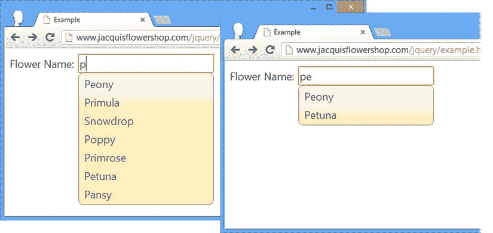

# 十九、使用自动完成和折叠部件

在本章中，我将描述 jQuery UI 自动完成和 accordion 小部件。它们比我在第 18 章中展示的小部件更复杂，但是它们遵循相同的设置、方法和事件模式。这些是高度可配置的、灵活的、聪明的用户界面控件，如果使用得当，它们可以显著增强文档和 web 应用的外观和可用性。[表 19-1](#Tab1) 对本章进行了总结。

[表 19-1](#_Tab1) 。章节总结

| 问题 | 解决办法 | 列表 |
| --- | --- | --- |
| 向`input`元素添加 jQuery UI 自动完成特性 | 使用`autocomplete`方法 | 1, 2 |
| 从远程服务器获取自动完成建议 | 将`source`设置为 URL | 3–5 |
| 动态生成自动完成建议 | 为`source`设置指定一个功能 | six |
| 从异步任务返回自动完成结果 | 调用`response`函数 | seven |
| 控制自动完成弹出窗口的位置 | 使用`position`属性 | eight |
| 以编程方式控制自动完成功能 | 使用`search`和`close`方法 | nine |
| 接收所选自动完成项目的通知 | 使用`focus`、`select`和`change`事件 | Ten |
| 修改向用户显示的自动完成结果 | 处理`response`事件 | Eleven |
| 覆盖默认的自动完成操作 | 覆盖`select`事件的默认动作 | Twelve |
| 创建 jQuery UI 折叠小部件 | 使用`accordion`方法 | Thirteen |
| 设置折叠面板及其内容面板的高度 | 使用`heightStyle`设置 | 14–16 |
| 更改用户激活内容元素时必须执行的操作 | 使用`event`设置 | Seventeen |
| 在 jQuery UI accordion 中设置活动内容元素 | 使用`active`和`collapsible`设置 | 18, 19 |
| 更改手风琴使用的图标 | 使用`icons`设置 | Twenty |
| 当折叠面板中的活动元素更改时接收通知 | 处理`activate`或`beforeactivate`事件 | Twenty-one |

自上一版以来，JQUERY UI 发生了变化

在 jQuery UI 1.10 版本中，accordion 小部件的 API 发生了很多变化:配置选项、方法和事件都发生了变化。我在本章的相关章节中列出了这些变化。

我在本章中也描述了 autocomplete 小部件，它有一个有用的新特性:您可以控制为用户提供完成选项的弹出窗口的位置(参见“定位弹出窗口”一节)。

使用 jQuery UI 自动完成

当用户在`input`元素中输入值时，autocomplete 小部件向用户提供建议。如果使用得当，这个小部件可以为用户节省时间，加快数据输入并减少错误。在接下来的小节中，我将向您展示如何创建、配置和使用 jQuery UI autocomplete 小部件。

创建自动完成元素

您可以在一个`input`元素上使用`autocomplete`方法来创建一个自动完成小部件。[清单 19-1](#list1) 演示了如何设置基本的自动完成功能。

***[清单 19-1](#_list1)*** 。创建自动完成输入元素

```js
<!DOCTYPE html>
<html>
<head>
    <title>Example</title>
    <script src="jquery-2.0.2.js" type="text/javascript"></script>
    <script src="jquery-ui-1.10.3.custom.js" type="text/javascript"></script>
    <link rel="stylesheet" type="text/css" href="jquery-ui-1.10.3.custom.css"/>
    <script type="text/javascript">
        $(document).ready(function() {

            var flowers = ["Aster", "Daffodil", "Rose", "Peony", "Primula", "Snowdrop",
                           "Poppy", "Primrose", "Petuna", "Pansy"];

            $("#acInput").autocomplete({
                source: flowers
            })
        });
    </script>
</head>
<body>
    <form>
        <div class="ui-widget">
            <label for="acInput">Flower Name: </label><input id="acInput"/>
        </div>
    </form>
</body>
</html>
```

就像你见过的其他 jQuery UI 方法一样，`autocomplete`方法被应用于 HTML 元素，并且配置了一个定义了`source`属性的 map 对象。此属性指定自动完成条目的来源。

您可以为自动完成值使用一系列不同的数据源，我将在本章的后面演示。在清单 19-1 中，我使用了一个简单的值数组。[图 19-1](#Fig1) 展示了自动完成功能呈现给用户的方式。



[图 19-1](#_Fig1) 。一个基本的 jQuery UI 自动完成元素

 **注意**自动完成特性不强制任何类型的验证，用户可以在`input`元素中输入任何值，而不仅仅是那些由`source`设置定义的值。

[图 19-1](#Fig1) 中有两张截图。第一个显示了当我输入字母 *P* 时会发生什么。如您所见，第一个屏幕截图显示了包含字母 *P* 的数据项列表。这个列表包括以 *P* 开头的花名，但也包括雪花莲(因为它包含字母 *p* )。在第二个截图中，我输入了 *Pe* ，jQuery UI 只显示包含该字母组合的条目。用户可以继续键入条目或从自动完成列表中选择一个条目。

 **提示**在文档中，我把`input`元素和它的`label`放在一个属于`ui-widget`类的`div`元素里面。这将设置`label`和`input`元素的 CSS 字体属性，以匹配自动完成弹出窗口使用的字体属性。我会在第 35 章中解释更多关于如何使用 jQuery UI CSS 类的内容。

使用对象数组作为数据源

另一种方法是使用对象数组，而不是字符串。这允许我将弹出菜单中显示的标签与插入到`input`元素中的值分开，如[清单 19-2](#list2) 所示。

***[清单 19-2](#_list2)*** 。使用对象数组进行自动完成

```js
<!DOCTYPE html>
<html>
<head>
    <title>Example</title>
    <script src="jquery-2.0.2.js" type="text/javascript"></script>
    <script src="jquery-ui-1.10.3.custom.js" type="text/javascript"></script>
    <link rel="stylesheet" type="text/css" href="jquery-ui-1.10.3.custom.css"/>
    <script type="text/javascript">
        $(document).ready(function() {

            var flowers = [{label: "Aster (Purple)", value: "Aster"},
                {label: "Daffodil (White)", value: "Daffodil"},
                {label: "Rose (Pink)", value: "Rose"},
                {label: "Peony (Pink)", value: "Peony"}]

            $("#acInput").autocomplete({
                source: flowers
            })

        });
    </script>
</head>
<body>
    <form>
        <div class="ui-widget">
            <label for="acInput">Flower Name: </label><input id="acInput"/>
        </div>
    </form>
</body>
</html>
```

当使用对象数组时，autocomplete 特性会寻找名为`label`和`value`的属性。`label`属性用于创建弹出列表，如果选择了项目，则`value`条目将被插入到`input`元素中。在[清单 19-2](#list2) 中，我给标签添加了一些颜色信息，这些信息在标签被选中时不包含在值中，如图[图 19-2](#Fig2) 所示。


[图 19-2](#_Fig2) 。使用对象数组将标签与值分开

配置自动完成

自动完成功能支持许多设置，让您控制其功能的不同方面，如[表 19-2](#Tab2) 所述。在接下来的小节中，我将向您展示如何使用这些设置来配置小部件。

[表 19-2](#_Tab2) 。自动完成设置

| 环境 | 描述 |
| --- | --- |
| `appendTo` | 指定弹出菜单应追加到的元素。默认为`body`元素。 |
| `autoFocus` | 如果设置为`true`，列表中的第一个项目将获得焦点，这意味着用户可以通过按回车键来选择该项目。默认为`false`。 |
| `delay` | 指定击键后的延迟时间(以毫秒为单位),在此之后自动完成数据被更新。默认为`300`。 |
| `disabled` | 设置为`true`时，禁用自动完成功能。这个设置不影响底层的`input`元素。默认是`false`。 |
| `minLength` | 指定在显示自动完成菜单之前，用户必须键入的最少字符数。默认为`1`。 |
| `position` | 设置弹出菜单相对于输入元素的位置。 |
| `source` | 指定要添加到自动完成菜单中的项目的源。该设置没有默认值，必须在调用`autocomplete`方法时指定。 |

使用远程数据源

最有趣的自动完成设置是`source`,因为您可以使用它来处理各种不同类型的数据，以填充弹出菜单。我在清单 19-2 中使用了一个 JavaScript 数组，这对于简单的静态数据列表来说很好。对于更复杂的情况，您可以从服务器获取匹配项的列表。你所要做的就是指定将生成数据的 URL，如[清单 19-3](#list3) 所示。

***[清单 19-3](#_list3)*** 。使用远程数据源

```js
<!DOCTYPE html>
<html>
<head>
    <title>Example</title>
    <script src="jquery-2.0.2.js" type="text/javascript"></script>
    <script src="jquery-ui-1.10.3.custom.js" type="text/javascript"></script>
    <link rel="stylesheet" type="text/css" href="jquery-ui-1.10.3.custom.css"/>
    <script type="text/javascript">
        $(document).ready(function() {

            $("#acInput").autocomplete({
                source: "[http://node.jacquisflowershop.com/auto](http://node.jacquisflowershop.com/auto)"
            })
        });
    </script>
</head>
<body>
    <form>
        <div class="ui-widget">
            <label for="acInput">Flower Name: </label><input id="acInput"/>
        </div>
    </form>
</body>
</html>
```

当 jQuery UI 需要弹出自动完成菜单的项目列表时，它将向指定的 URL 发出 HTTP GET 请求。使用键`term`将用户到目前为止键入的字符包含在请求查询字符串中。例如，如果用户输入了字母 *s* ，那么 jQuery UI 将请求下面的 URL:

```js
http://node.jacquisflowershop.com/auto?term=s
```

如果用户随后键入字母 *n* ，jQuery UI 将请求以下内容:

```js
http://node.jacquisflowershop.com/auto?term=sn
```

当有很多数据项并且您不想将它们都发送给客户端时，这种技术非常有用。当项目列表动态变化，并且您希望确保用户受益于最新的可用数据时，它也很有用。

服务器负责从查询字符串中获取`term`值，并返回一个 JSON 字符串，表示要显示给用户的项目数组。[清单 19-4](#list4) 展示了我是如何为`Node.js`脚本更新`formserver.js`脚本来做到这一点的。(有关获取和安装`Node.js`的详细信息，请参见[第 1 章](01.html)。)

***[清单 19-4](#_list4)*** 。支持远程自动完成的 Node.js 脚本

```js
var http = require("http");
var querystring = require("querystring");
var url = require("url");

var port = 80;

http.createServer(function (req, res) {
    console.log("[200 OK] " + req.method + " to " + req.url);

    var flowers = ["Aster", "Daffodil", "Rose", "Peony", "Primula", "Snowdrop",
                    "Poppy", "Primrose", "Petuna", "Pansy"];

    var matches = [];
    var term = url.parse(req.url, true).query["term"];

    if (term) {
        var pattern = new RegExp("^" + term, "i");
        for (var i = 0; i < flowers.length; i++) {
            if (pattern.test(flowers[i])) {
                matches.push(flowers[i]);
            }
        }
    } else {
        matches = flowers;
    }

    res.writeHead(200, "OK", {
        "Content-Type": "application/json",
        "Access-Control-Allow-Origin": "*"
    });
    res.write(JSON.stringify(matches));
    res.end();

}).listen(port);
console.log("Ready on port " + port);
```

这个`Node.js`脚本使用与清单 19-2 中的[相同的一组花名，并返回那些与浏览器发送的词语相匹配的花名。我稍微改变了搜索，只返回那些以单词开头的名字。例如，如果 jQuery UI 发送如下请求:](#list2)

```js
http://node.jacquisflowershop.com/auto?term=p
```

然后`Node.js`服务器将返回下面的 JSON:

```js
["Peony","Primula","Poppy","Primrose","Petuna","Pansy"]
```

因为我是在花名开头匹配，所以列表中省略了雪花莲，如图[图 19-3](#Fig3) 所示。


[图 19-3](#_Fig3) 。从远程服务器获取自动完成条目

这是一种很好的技术，但是它会对服务器产生很多请求。在我的例子中这不是问题，因为我正在执行一个简单的搜索，我的服务器和浏览器在同一个网络上。但是对于复杂的搜索，在可能遭受延迟的广域网上，服务器上的负载可能成为一个问题。

管理自动完成请求速率的最佳方式是使用`minLength`和`delay`设置。`minLength`设置指定了在 jQuery UI 向服务器发出自动完成请求之前，用户必须输入的字符数。您可以使用此设置，以便仅在输入几个字符后向服务器请求数据，此时您已经有足够的信息来缩小搜索范围。

`delay`设置指定了按键后自动完成信息被请求的时间。您可以使用此设置来防止在用户快速键入时发出请求。因此，如果用户键入 *s* 和 *n* ，您可以避免点击服务器获取`s`列表，然后立即再次获取`sn`列表。通过组合这些设置，您可以减少请求的数量，并在需要时为用户提供指导。清单 19-5 显示了这些设置的用法。

***[清单 19-5](#_list5)*** 。使用 delay 和 minLength 设置减少服务器请求

```js
<!DOCTYPE html>
<html>
<head>
    <title>Example</title>
    <script src="jquery-2.0.2.js" type="text/javascript"></script>
    <script src="jquery-ui-1.10.3.custom.js" type="text/javascript"></script>
    <link rel="stylesheet" type="text/css" href="jquery-ui-1.10.3.custom.css"/>
    <script type="text/javascript">
        $(document).ready(function() {

            $("#acInput").autocomplete({
                source: "http://node.jacquisflowershop.com/auto",
                minLength: 3,
                delay: 1000
            })
        });
    </script>
</head>
<body>
    <form>
        <div class="ui-widget">
            <label for="acInput">Flower Name: </label><input id="acInput"/>
        </div>
    </form>
</body>
</html>
```

在[清单 19-5](#list5) 中，直到用户输入了三个字符*并且*在一秒钟内没有输入任何额外的字符，才会向服务器发出初始请求。

使用函数作为数据源

您可以使用函数为自动完成条目创建真正定制的源。您将该函数分配给`source`设置，每次 autocomplete 特性需要向用户显示项目时都会调用它。清单 19-6 展示了。

***[清单 19-6](#_list6)*** 。使用函数生成自动完成项目

```js
<!DOCTYPE html>
<html>
<head>
    <title>Example</title>
    <script src="jquery-2.0.2.js" type="text/javascript"></script>
    <script src="jquery-ui-1.10.3.custom.js" type="text/javascript"></script>
    <link rel="stylesheet" type="text/css" href="jquery-ui-1.10.3.custom.css"/>
    <script type="text/javascript">
        $(document).ready(function() {

            var flowers = ["Aster", "Daffodil", "Rose", "Peony", "Primula", "Snowdrop",
                            "Poppy", "Primrose", "Petuna", "Pansy"];

            $("#acInput").autocomplete({
                source: function(request, response) {
                    var term = request.term;
                    var pattern = new RegExp("^" + term, "i");

                    var results = $.map(flowers, function(elem) {
                        if (pattern.test(elem)) {
                            return elem;
                        }
                    })
                    response(results);
                }
            })
        });
    </script>
</head>
<body>
    <form>
        <div class="ui-widget">
            <label for="acInput">Flower Name: </label><input id="acInput"/>
        </div>
    </form>
</body>
</html>
```

两个参数被传递给该函数。第一个参数是一个只有一个名为`term`的属性的对象。该属性的值是用户输入到`input`元素中的字符串。第二个参数是一个函数，当您生成了想要显示给用户的自动完成项目列表时，您将调用这个函数。这个函数的参数是一个字符串或对象的数组。

在[清单 19-6](#list6) 中，我复制了来自[清单 19-5](#list5) 的服务器端功能，并且我生成了一个数组，包含那些以指定术语开始的条目。

 **提示**我使用 jQuery `map`工具方法处理了数组的内容，我在[第 34 章](34.html)中对此进行了描述。

然后，我通过将数组作为参数传递给`response`函数，将结果传递回 jQuery UI，如下所示:

```js
...
response(results);
...
```

这似乎是一种奇怪的处理结果的方式，但这意味着您可以在异步任务完成后调用该函数。在[清单 19-7](#list7) 中，您可以看到我是如何使用一个函数发出 Ajax 请求来获取花的细节，对返回的内容进行本地搜索，然后调用`response`函数将最终结果提供给 jQuery UI。

***[清单 19-7](#_list7)*** 。使用执行异步任务的自定义数据源函数

```js
<!DOCTYPE html>
<html>
<head>
    <title>Example</title>
    <script src="jquery-2.0.2.js" type="text/javascript"></script>
    <script src="jquery-ui-1.10.3.custom.js" type="text/javascript"></script>
    <link rel="stylesheet" type="text/css" href="jquery-ui-1.10.3.custom.css"/>
    <style type="text/css">
        button {margin-bottom: 5px}
    </style>
    <script type="text/javascript">
        $(document).ready(function () {
            $("#acInput").autocomplete({
                source: function (request, response) {
                    $.getJSON("[http://node.jacquisflowershop.com/auto](http://node.jacquisflowershop.com/auto)",
                        function(flowers) {
                            var term = request.term;
                            var pattern = new RegExp("^" + term, "i");

                            var results = $.map(flowers, function (elem) {
                                if (pattern.test(elem)) {
                                    return elem;
                                }
                            })
                            response(results);
                        });
                }
            })
        });
    </script>
</head>
<body>
    <form>
        <div class="ui-widget">
            <label for="acInput">Flower Name: </label><input id="acInput"/>
        </div>

    </form>
</body>
</html>
```

在这个例子中，我使用`getJSON`方法从`Node.js`服务器获取完整的 flower 值集合。我在本地搜索匹配项，当我有一组建议要呈现给 jQuery UI 时，调用`response`函数。

定位弹出窗口

默认情况下，允许用户选择一个值的弹出窗口将出现在`input`元素下面，但是您可以通过设置`position`属性来改变这一点——尽管这样做的语法有点笨拙。[清单 19-8](#list8) 显示了一个改变位置的例子。

***[清单 19-8](#_list8)*** 。更改弹出窗口的位置

```js
<!DOCTYPE html>
<html>
<head>
    <title>Example</title>
    <script src="jquery-2.0.2.js" type="text/javascript"></script>
    <script src="jquery-ui-1.10.3.custom.js" type="text/javascript"></script>
    <link rel="stylesheet" type="text/css" href="jquery-ui-1.10.3.custom.css"/>
    <style>
        #target { margin-top: 40px; display:inline-block }
    </style>
    <script type="text/javascript">
        $(document).ready(function () {

            var flowers = [{ label: "Aster (Purple)", value: "Aster" },
                { label: "Daffodil (White)", value: "Daffodil" },
                { label: "Rose (Pink)", value: "Rose" },
                { label: "Peony (Pink)", value: "Peony" }]

            $("#acInput").autocomplete({
                source: flowers,
                position: {
                    my: "left top",
                    at: "right bottom+20",
                    of: "#target",
                    collision: "fit"
                }
            })

        });
    </script>
</head>
<body>
    <form>
        <div class="ui-widget">
            <label for="acInput">Flower Name: </label><input id="acInput"/>
        </div>
    </form>
    <span id="target">Target</span>
</body>
</html>
```

`position`属性是用一个对象配置的，该对象为放置弹出窗口的策略的不同方面指定了属性，我已经在[表 19-3](#Tab3) 的列表中描述了我使用的四个属性。

[表 19-3](#_Tab3) 。自动完成位置属性

| 名字 | 描述 |
| --- | --- |
| `my` | 指定将用于确定位置的弹出窗口部分(有关可用值范围的详细信息，请参见下文) |
| `at` | 指定弹出窗口相对于目标元素的位置(有关可用值范围的详细信息，请参见下文) |
| `of` | 指定弹出窗口将相对于其定位的目标元素；如果省略，这就是`input`元素，但是可以指定为`HTMLElement`、选择器或`jQuery`对象 |
| `collision` | 指定当弹出窗口溢出窗口时应如何调整弹出窗口的位置([表 19-4](#Tab4) 显示了该属性的值) |

[表 19-4](#_Tab4) 。自动完成位置属性

| 名字 | 描述 |
| --- | --- |
| `flip` | jQuery UI 检查更多弹出窗口是否可以显示在由`of`属性指定的元素的另一侧；将选择显示最多弹出窗口的一侧 |
| `fit` | jQuery UI 将弹出窗口从窗口边缘移开 |
| `flipfit` | 结合了`flip`和`fit`值的行为 |
| `none` | 告诉 jQuery UI 不要调整弹出窗口的位置 |

 **提示**自动完成弹出窗口是使用 jQuery UI *position* 工具特性放置的，它比我在本章中使用的配置选项更多。更多详情见`http://api.jqueryui.com/position`。

使用指定水平和垂直位置的值设置`my`和`at`属性，用空格分隔。水平值为`left`、`right`和`center`，垂直值为`top`、`bottom`和`center`。您还可以指定相对于某个位置的偏移量，可以是百分比，也可以是像素数。在清单中，您可以看到我已经如下设置了`my`、`at`和`of`属性:

```js
...
my: "left top",
at: "right bottom+20",
of: "#target",
...
```

这种组合意味着:将 autocomplete 弹出窗口的左上角放置在 id 为`target`的元素的右下角下方 20 个像素的位置。你通常不会使用`of`属性来指定一个元素，因为它破坏了弹出菜单和`input`元素之间的视觉关联，但是我想证明在弹出菜单的放置上有很大的灵活性，你可以在[图 19-4](#Fig4) 中看到这些配置属性的效果。


[图 19-4](#_Fig4) 。配置自动完成弹出窗口的位置

`collision`属性指定如果弹出窗口不适合可用空间会发生什么。[表 19-4](#Tab4) 描述了该属性支持的值。

我为`collision`属性选择了`fit`值，这意味着 jQuery UI 将移动弹出窗口以适应浏览器窗口，如图[图 19-5](#Fig5) 所示。


[图 19-5](#_Fig5) 。移动自动完成弹出窗口以适应浏览器窗口的边缘

使用自动完成方法

jQuery UI 自动完成特性支持许多方法，您可以使用这些方法来操作自动完成过程。表 19-5 描述了这些方法。

[表 19-5](#_Tab5) 。自动完成方法

| 方法 | 描述 |
| --- | --- |
| `autocomplete("close")` | 关闭自动完成菜单 |
| `autocomplete("destroy")` | 从 input 元素中删除自动完成功能 |
| `autocomplete("disable")` | 禁用自动完成 |
| `autocomplete("enable")` | 启用自动完成 |
| `autocomplete("option")` | 设置一个或多个选项 |
| `autocomplete("search", value)` | 使用指定值显式触发 autocomplete 如果没有提供值参数，则使用`input`元素的内容 |

autocomplete 小部件特有的两种方法是`search`和`close`，您可以使用它们显式地开始和结束自动完成过程，如[清单 19-9](#list9) 所示。

***[清单 19-9](#_list9)*** 。使用搜索和关闭方法

```js
<!DOCTYPE html>
<html>
<head>
    <title>Example</title>
    <script src="jquery-2.0.2.js" type="text/javascript"></script>
    <script src="jquery-ui-1.10.3.custom.js" type="text/javascript"></script>
    <link rel="stylesheet" type="text/css" href="jquery-ui-1.10.3.custom.css"/>
    <style type="text/css">
        button {margin-bottom: 5px}
    </style>
    <script type="text/javascript">
        $(document).ready(function() {

            var flowers = ["Aster", "Daffodil", "Rose", "Peony", "Primula", "Snowdrop",
                            "Poppy", "Primrose", "Petuna", "Pansy"];

            $("#acInput").autocomplete({
                source: flowers
            });

            $("button").click(function(e) {
                e.preventDefault();
                switch (this.id) {
                    case "close":
                        $("#acInput").autocomplete("close");
                        break;
                    case "input":
                        $("#acInput").autocomplete("search");
                        break;
                    default:
                        $("#acInput").autocomplete("search", this.id);
                        break;
                }
            });
        });
    </script>
</head>
<body>
    <form>
        <button id="s">S</button>
        <button id="p">P</button>
        <button id="input">Input Content</button>
        <button id="close">Close</button>
        <div class="ui-widget">
            <label for="acInput">Flower Name: </label><input id="acInput"/>
        </div>
    </form>
</body>
</html>
```

我添加了`button`元素，并使用 jQuery `click`方法来设置不同的自动完成方法调用。当标有 *S* 或 *P* 的按钮被按下时，我调用`search`方法，将选择的字母作为搜索值传入。这将触发使用所选字母的自动完成功能，而不考虑输入元素的内容，如图[图 19-6](#Fig6) 所示。


[图 19-6](#_Fig6) 。使用带有搜索词的搜索方法

如图所示，弹出菜单显示包含按钮字母的条目，即使`input`元素包含单词`hello`。

`Input Content`按钮使用`input`元素中包含的任何字符触发自动完成功能，如图[图 19-7](#Fig7) 所示。


[图 19-7](#_Fig7) 。使用输入元素的内容进行搜索

最后一个按钮`Close`调用`close`方法来关闭弹出菜单。

使用自动完成事件

自动完成功能定义了许多事件，如[表 19-6](#Tab6) 所述。

[表 19-6](#_Tab6) 。自动完成事件

| 事件 | 描述 |
| --- | --- |
| `change` | 当值改变后焦点离开`input`元素时触发 |
| `close` | 当弹出菜单关闭时触发 |
| `create` | 创建自动完成功能时触发 |
| `focus` | 当弹出菜单中的项目获得焦点时触发 |
| `open` | 显示弹出菜单时触发 |
| `response` | 在搜索完成后、向用户显示结果前触发 |
| `search` | 在生成或请求自动完成项目列表之前触发 |
| `select` | 从菜单中选择项目时触发 |

获取所选项目的详细信息

jQuery UI 通过第二个参数(通常称为`ui`)提供关于事件的附加信息。对于`change`、`focus`和`select`事件，jQuery UI 为`ui`对象提供了一个`item`属性，该属性返回一个描述从弹出菜单中选择或聚焦的项目的对象。清单 19-10 展示了如何使用这个特性来获取物品的信息。

***[清单 19-10](#_list10)*** 。在事件处理程序中使用 ui 对象

```js
<!DOCTYPE html>
<html>
<head>
    <title>Example</title>
    <script src="jquery-2.0.2.js" type="text/javascript"></script>
    <script src="jquery-ui-1.10.3.custom.js" type="text/javascript"></script>
    <link rel="stylesheet" type="text/css" href="jquery-ui-1.10.3.custom.css"/>
    <script type="text/javascript">
        $(document).ready(function() {

            var flowers = ["Aster", "Daffodil", "Rose", "Peony", "Primula", "Snowdrop",
                            "Poppy", "Primrose", "Petuna", "Pansy"];

            $("#acInput").autocomplete({
                source: flowers,
                focus: displayItem,
                select: displayItem,
                change: displayItem
            })

            function displayItem(event, ui) {
                $("#itemLabel").text(ui.item.label)
            }
        });
    </script>
</head>
<body>
    <form>
        <div class="ui-widget">
            <label for="acInput">Flower Name: </label><input id="acInput"/>
            Item Label: <span id="itemLabel"></span>
        </div>
    </form>
</body>
</html>
```

我添加了一个`span`元素，用来显示所选对象的`label`属性。jQuery UI 创建具有`label`和`value`属性的对象，即使您为`source`设置使用简单的字符串数组，因此您总是需要从`ui.item`对象中读取这些属性中的一个。在这个例子中，我使用相同的函数来显示来自`focus`、`select`和`change`事件的项目。你可以在图 19-8 中看到效果。


[图 19-8](#_Fig8) 。获取所选项目的详细信息

修改搜索结果

在结果显示给用户之前，`response`事件提供了修改结果的机会。在清单 19-11 的[中，您可以看到我是如何处理`response`事件来防止`Peony`值被显示出来的。](#list11)

***[清单 19-11](#_list11)*** 。处理响应事件

```js
<!DOCTYPE html>
<html>
<head>
    <title>Example</title>
    <script src="jquery-2.0.2.js" type="text/javascript"></script>
    <script src="jquery-ui-1.10.3.custom.js" type="text/javascript"></script>
    <link rel="stylesheet" type="text/css" href="jquery-ui-1.10.3.custom.css"/>
    <script type="text/javascript">
        $(document).ready(function () {

            var flowers = ["Aster", "Daffodil", "Rose", "Peony", "Primula", "Snowdrop",
                            "Poppy", "Primrose", "Petuna", "Pansy"];

            $("#acInput").autocomplete({
                source: flowers,
                response: filterResults
            });

            function filterResults(event, ui) {
                for (var i = 0; i < ui.content.length; i++) {
                    if (ui.content[i].label == "Peony") {
                        ui.content.splice(i, 1);
                    }
                }
            }
        });
    </script>
</head>
<body>
    <form>
        <div class="ui-widget">
            <label for="acInput">Flower Name: </label><input id="acInput"/>
        </div>
    </form>
</body>
</html>
```

我定义了一个名为`filterResults`的函数来处理`response`事件。在这个函数中，我列举了将呈现给用户的结果，这些结果作为一个数组通过`ui.content`属性访问。`response`事件的处理函数必须直接修改数组，所以我使用`splice`方法从`ui.content`数组中移除`Peony`条目。

覆盖默认选择动作

`select`事件有一个默认动作，就是用从弹出菜单中选择的项目的`value`属性的内容替换`input`元素的内容。这正是大多数情况下所需要的，但是这个事件可以用来补充默认操作或阻止它，并做一些完全不同的事情。[清单 19-12](#list12) 包含了一个通过设置相关字段的值来补充默认值的例子。

***[清单 19-12](#_list12)*** 。覆盖选择事件的默认操作

```js
<!DOCTYPE html>
<html>
<head>
    <title>Example</title>
    <script src="jquery-2.0.2.js" type="text/javascript"></script>
    <script src="jquery-ui-1.10.3.custom.js" type="text/javascript"></script>
    <link rel="stylesheet" type="text/css" href="jquery-ui-1.10.3.custom.css"/>
    <script type="text/javascript">
        $(document).ready(function() {

            var flowers = ["Aster", "Daffodil", "Rose"];

            var skus = { Aster: 100, Daffodil: 101, Rose: 102};

            $("#acInput").autocomplete({
                source: flowers,
                select: function(event, ui) {
                    $("#sku").val(skus[ui.item.value]);
                }
            })
        });
    </script>
</head>
<body>
    <form>
        <div class="ui-widget">
            <label for="acInput">Flower Name: </label><input id="acInput"/>
            <label for="sku">Stock Keeping Unit: </label><input id="sku"/>
        </div>
    </form>
</body>
</html>
```

 **提示**我在第九章的[中描述了事件的默认动作。](09.html)

当触发`select`事件时，我的处理函数使用`ui`参数获取所选项的值，并设置相关字段的值——在本例中是库存单位，它是从`skus`对象中获得的。这样，我可以根据初始选择为其他字段提供默认值，从而帮助用户。这在很多情况下都很有用，尤其是在选择送货地址等项目时。你可以在[图 19-9](#Fig9) 中看到结果，尽管这是一个你应该加载浏览器以获得完整效果的例子。本文档和本书中所有其他示例的 HTML 可以在 Apress 网站的源代码/下载区域免费获得(`www.apress.com`)。


[图 19-9](#_Fig9) 。使用 select 事件填充另一个字段

使用 jQuery UI 手风琴

accordion 小部件接受一组内容元素并将其呈现出来，这样用户最多只能看到一个内容元素。当用户选择另一个时，可见内容被隐藏，产生一种让人想起同名乐器中风箱的效果。

当你不想一次显示所有内容而让用户不知所措时，手风琴非常适合呈现可以分成离散部分的内容。理想情况下，各个内容部分共享一些可以使用简单标题表达的总体主题。

制作手风琴

jQuery UI accordion 小部件是使用`accordion`方法应用的，如[清单 19-13](#list13) 所示。

***[清单 19-13](#_list13)*** 。制作手风琴

```js
<!DOCTYPE html>
<html>
<head>
    <title>Example</title>
    <script src="jquery-2.0.2.js" type="text/javascript"></script>
    <script src="handlebars.js"></script>
    <script src="handlebars-jquery.js"></script>
    <script src="jquery-ui-1.10.3.custom.js" type="text/javascript"></script>
    <link rel="stylesheet" type="text/css" href="jquery-ui-1.10.3.custom.css"/>
    <link rel="stylesheet" type="text/css" href="styles.css"/>
    <style type="text/css">
        #accordion {margin: 5px}
        .dcell img {height: 60px}
    </style>
    <script id="flowerTmpl" type="text/x-jquery-tmpl">
        {{#flowers}}
        <div class="dcell">
            
            <label for="{{product}}">{{name}}:</label>
            <input name="{{product}}" value="0" />
        </div>
        {{/flowers}}
    </script>
    <script type="text/javascript">
        $(document).ready(function () {
            var data = {
                flowers: [{ "name": "Aster", "product": "aster" },
                { "name": "Daffodil", "product": "daffodil" },
                { "name": "Rose", "product": "rose" },
                { "name": "Peony", "product": "peony" },
                { "name": "Primula", "product": "primula" },
                { "name": "Snowdrop", "product": "snowdrop" },
                { "name": "Carnation", "product": "carnation" },
                { "name": "Lily", "product": "lily" },
                { "name": "Orchid", "product": "orchid" }]
            };

            var elems = $("#flowerTmpl").template(data).filter("*");
            elems.slice(0, 3).appendTo("#row1");
            elems.slice(3, 6).appendTo("#row2");
            elems.slice(6).appendTo("#row3");

            $("#accordion").accordion();

            $("button").button();
        });
    </script>
</head>
<body>
    <h1>Jacqui's Flower Shop</h1>
    <form method="post" action="http://node.jacquisflowershop.com/order">
        <div id="accordion">
            <h2><a href="#">Row 1</a></h2>
            <div id="row1"></div>
            <h2><a href="#">Row 2</a></h2>
            <div id="row2"></div>
            <h2><a href="#">Row 3</a></h2>
            <div id="row3"></div>
        </div>
        <div id="buttonDiv"><button type="submit">Place Order</button></div>
    </form>
</body>
</html>
```

这个例子中最重要的部分是元素`div`的内容，它的`id`是`accordion`。

```js
...
<div id="accordion">
    <h2><a href="#">Row 1</a></h2>
    <div id="row1"></div>

    <h2><a href="#">Row 2</a></h2>
    <div id="row2"></div>

    <h2><a href="#">Row 3</a></h2>
    <div id="row3"></div>
</div>
...
```

我已经改变了格式，使结构更加明显。顶层的`div`元素是用`accordion`方法定位的元素。jQuery UI 在`div`的内容中寻找头元素(从`h1`到`h6`元素)，并分解内容，使得每个头都与它后面的元素相关联。在本例中，我使用了`h2`元素作为标题，每个标题后面都有一个`div`元素。我使用数据模板用花店提供的产品细节填充这些`div`元素。

注意，我在每个`h2`元素中添加了一个`a`元素。这是指定每个内容部分标题的方法。你可以在[图 19-10](#Fig10) 中看到 jQuery UI 是如何转换顶层`div`元素及其内容的。


[图 19-10](#_Fig10) 。jQuery UI 折叠

 **提示**将`href`属性设置为`#`是定义仅用于 JavaScript 的`a`元素时的常用技术。我使用这种方法是因为它使示例更简单，但是我通常推荐使用 jQuery 动态插入`a`元素，这样它们就不会干扰非 JavaScript 用户。

当创建 accordion 时，第一个内容部分被显示，而其他部分被隐藏。`a`元素的内容被用作每个部分的标签，点击一个标签关闭当前部分并打开所选部分(在过渡期间有一个很好的动画效果，我无法使用截图显示)。你可以在图 19-11 中看到点击标题的效果。


[图 19-11](#_Fig11) 。手风琴过渡

配置折叠面板

accordion 支持许多配置 设置，可用于微调其行为。[表 19-7](#Tab7) 描述了这些设置，我将在接下来的章节中向你展示如何使用这些设置来配置小工具。

[表 19-7](#_Tab7) 。手风琴设置

| 环境 | 描述 |
| --- | --- |
| `active` | 获取或设置要显示的内容元素。默认情况下，最初显示第一个内容元素。 |
| `animate` | 指定从一个内容元素过渡到另一个内容元素时将使用的动画。有关 jQuery UI 动画的详细信息，请参见第 35 章。 |
| `collapsible` | 当`true`时，可以折叠所有的内容部分。默认为`false`。 |
| `disabled` | 当`true`时，手风琴被禁用。默认为`false`。 |
| `event` | 指定 header 元素中触发转换到另一个 content 元素的事件。默认为`click`。 |
| `header` | 指定哪些元素将用作标题。 |
| `heightStyle` | 控制手风琴及其面板的高度。 |
| `icons` | 指定折叠面板中使用的图标。 |

 **提示**在 jQuery UI 1.10 中，`animate`设置取代了`animated`设置；`heightStyle`选项替代`autoHeight`、`clearStyle`和`fillSpace`设置；并且当使用`icons`属性时，使用新的属性名称来指定用于所选内容面板(`activeHeader`)的图标。

设置手风琴的高度

属性控制手风琴及其面板的高度。有三个支持的值，我在[表 19-8](#Tab8) 中描述过。

[表 19-8](#_Tab8) 。heightStyle 的值

| 名字 | 描述 |
| --- | --- |
| `auto` | 所有面板将被设置为最高面板的高度 |
| `fill` | 扩展折叠面板以填充父元素的高度 |
| `content` | 每个面板都与其内容一样高 |

您可以根据内容元素的高度或父元素的高度来设置折叠面板的高度。最常见的技术是依赖于默认的`auto`值，它将所有的内容元素设置为相同的高度(最高的内容元素的高度),并根据该高度调整折叠的大小。

这是我在前面的例子中使用的方法，尽管在使用包含图像的内容元素时需要小心，特别是当使用 jQuery 将`img`元素插入到文档中时。问题是，在加载所有图像之前，可以调用`accordion`方法，这导致 jQuery UI 从浏览器获得关于内容元素高度的误导信息。在我的示例文档中，内容`div`元素的高度在图像加载前是 55 像素，加载后是 79 像素。当 accordion 显示出意外的滚动条来显示内容时，你就可以判断你是否碰到了这个问题，如图[图 19-12](#Fig12) 所示。


[图 19-12](#_Fig12) 。不正确的高度信息导致的问题

当加载图像时，jQuery UI 不会检测到内容元素高度的变化，最终会错误地显示内容。为了解决这个问题，您需要提供关于内容元素在加载所有外部资源后的高度的信息。有很多方法可以做到这一点，在本例中，我选择为`style`元素中的`img`元素设置 CSS `height`属性，如下所示:

```js
...
<style type="text/css">
    #accordion {margin: 5px}
    .dcell img {height: 60px}
</style>
...
```

撇开图像问题不谈，当您希望每个内容元素的高度一致时，`auto`值是有用的，但是当内容元素的大小之间存在很大差异时，它会导致一些不吸引人的视觉效果。[清单 19-14](#list14) 显示了一个`script`元素，它以不同的方式插入产品信息元素。

***[清单 19-14](#_list14)*** 。高度差很大的手风琴

```js
...
<script type="text/javascript">
    $(document).ready(function () {

        var data = {
            flowers: [{ "name": "Aster", "product": "aster" },
            { "name": "Daffodil", "product": "daffodil" },
            { "name": "Rose", "product": "rose" },
            { "name": "Peony", "product": "peony" },
            { "name": "Primula", "product": "primula" },
            { "name": "Snowdrop", "product": "snowdrop" },
            { "name": "Carnation", "product": "carnation" },
            { "name": "Lily", "product": "lily" },
            { "name": "Orchid", "product": "orchid" }]
        };

        var elems = $("#flowerTmpl").template(data).filter("*");
        elems.slice(0, 3).appendTo("#row1");
        elems.slice(3, 6).appendTo("#row2");
        elems.slice(6).appendTo("#row3");

        $("<h2><a href=#>All</a></h2><div id=row0></div>").prependTo("#accordion")
            .filter("div").append($("#row1, #row2, #row3").clone());

        $("#accordion").accordion();

        $("button").button();
    });
</script>
...
```

为了创建一个超高的内容元素，我使用 jQuery 克隆了现有的 content `div`元素，并将它们插入到一个新的内容元素中，创建了一个显示所有产品的面板。这个新面板的高度是其他面板的三倍，这导致当显示较小的内容元素时，accordion 会显示大量的空白空间，如图 19-13 所示。


[图 19-13](#_Fig13) 。高度差较大时自动设置的效果

如果一大片空白空间不适合您的应用，那么您可以简单地将`heightStyle`属性更改为`content`，如[清单 19-15](#list15) 所示。

***[清单 19-15](#_list15)*** 。更改高度样式设置

```js
...
$("#accordion").accordion({
    heightStyle: "content"
});
...
```

作为内容元素之间过渡的一部分，手风琴现在将改变其高度，如图[图 19-14](#Fig14) 所示。


[图 19-14](#_Fig14) 。手风琴自己调整大小，以适应不同的内容高度

这是一种更简洁的显示内容的方法，但是这意味着页面的布局会随着 accordion 自身的调整而改变。如果控制键不断在屏幕上移动，这可能会让用户感到厌烦。

使用父对象确定手风琴的高度

一种完全不同的方法是设置 accordion 的大小，以便它简单地填充其父元素。当我处理动态生成的内容时，我发现这非常有用，因为我不能很好地控制大小，也不想调整布局。你可以通过`fill`设置来调整手风琴的大小，如清单 19-16 中的[所示。](#list16)

***[清单 19-16](#_list16)*** 。调整折叠面板的大小以填充父元素

```js
...
<script type="text/javascript">
    $(document).ready(function () {

        var data = {
            flowers: [{ "name": "Aster", "product": "aster" },
            { "name": "Daffodil", "product": "daffodil" },
            { "name": "Rose", "product": "rose" },
            { "name": "Peony", "product": "peony" },
            { "name": "Primula", "product": "primula" },
            { "name": "Snowdrop", "product": "snowdrop" },
            { "name": "Carnation", "product": "carnation" },
            { "name": "Lily", "product": "lily" },
            { "name": "Orchid", "product": "orchid" }]
        };

        var elems = $("#flowerTmpl").template(data).filter("*");
        elems.slice(0, 3).appendTo("#row1");
        elems.slice(3, 6).appendTo("#row2");
        elems.slice(6).appendTo("#row3");

        $("<h2><a href=#>All</a></h2><div id=row0></div>").prependTo("#accordion")
            .filter("div").append($("#row1, #row2, #row3").clone());

        $("#accordion").wrap("<div style='height:300px'></div>");

        $("#accordion").accordion({
            heightStyle: "fill"
        });

        $("button").button();
    });
</script>
...
```

在这个例子中，我将`accordion`元素包装在一个新的父`div`元素中，该元素具有 300 像素的固定大小。当我调用手风琴方法时，我将`heightStyle`设置为`fill`。如果父元素比内容元素小，那么 accordion 会添加一个滚动条。如果父元素大于内容元素，则添加填充。在[图 19-15](#Fig15) 中可以看到滚动条的应用。这是因为显示所有花朵的内容元素比父元素的 300 像素高。


[图 19-15](#_Fig15) 。使用手风琴填充父对象的高度

更改事件类型

默认情况下，用户通过单击来打开和关闭内容元素。您可以通过`event`设置来改变这种行为，如清单 19-17 中的[所示。](#list17)

***[清单 19-17](#_list17)*** 。使用事件设置

```js
...
<script type="text/javascript">
    $(document).ready(function () {

        var data = {
            flowers: [{ "name": "Aster", "product": "aster" },
            { "name": "Daffodil", "product": "daffodil" },
            { "name": "Rose", "product": "rose" },
            { "name": "Peony", "product": "peony" },
            { "name": "Primula", "product": "primula" },
            { "name": "Snowdrop", "product": "snowdrop" },
            { "name": "Carnation", "product": "carnation" },
            { "name": "Lily", "product": "lily" },
            { "name": "Orchid", "product": "orchid" }]
        };

        var elems = $("#flowerTmpl").template(data).filter("*");
        elems.slice(0, 3).appendTo("#row1");
        elems.slice(3, 6).appendTo("#row2");
        elems.slice(6).appendTo("#row3");

        $("#accordion").accordion({
            event: "mouseover"
        });

        $("button").button();
    });
</script>
...
```

在[清单 19-17](#list17) 中，我使用了`event`设置来指定内容元素应该被打开以响应`mouseover`事件(我在[第 9 章](09.html)中描述过)。这一变化的效果是，一旦鼠标指针进入内容元素的标签，jQuery UI 就会打开该元素并显示其内容。我不能在截图中显示这种效果，但是我建议您加载这个示例，看看它是如何工作的。这是一个简洁的特性，但是我建议您小心使用它。用户通常很快就能理解点击图标打开一部分内容的想法，但是对鼠标事件的响应会带来令人不安和惊讶的用户体验。

选择活动标题

accordion 的默认行为最初是向用户显示第一个内容元素。您可以使用`active`属性来改变这种行为。您将`active`设置为想要显示的内容元素的索引，如[清单 19-18](#list18) 所示。

***[清单 19-18](#_list18)*** 。使用活动属性

```js
...
<script type="text/javascript">
    $(document).ready(function () {

        var data = {
            flowers: [{ "name": "Aster", "product": "aster" },
            { "name": "Daffodil", "product": "daffodil" },
            { "name": "Rose", "product": "rose" },
            { "name": "Peony", "product": "peony" },
            { "name": "Primula", "product": "primula" },
            { "name": "Snowdrop", "product": "snowdrop" },
            { "name": "Carnation", "product": "carnation" },
            { "name": "Lily", "product": "lily" },
            { "name": "Orchid", "product": "orchid" }]
        };

        var elems = $("#flowerTmpl").template(data).filter("*");
        elems.slice(0, 3).appendTo("#row1");
        elems.slice(3, 6).appendTo("#row2");
        elems.slice(6).appendTo("#row3");

        $("#accordion").accordion({
            active: 1
        });

        $("button").button();
    });
</script>
...
```

效果是 accordion 最初在索引 1 处打开行(索引是从零开始的，所以这是第二个内容元素)，如图 19-16 所示。


[图 19-16](#_Fig16) 。选择要显示的初始内容元素

通过将`active`设置为`false`，您也可以不激活任何内容。如果这样做，您还必须将可折叠设置设为`true`。这将禁用一个内容元素必须始终可见的默认策略。[清单 19-19](#list19) 显示了这些设置的应用。

***[清单 19-19](#_list19)*** 。禁用最初活动的内容元素

```js
...
$("#accordion").accordion({
    active: false,
    collapsible: true
});
...
```

你可以在[图 19-17](#Fig17) 中看到这些设置的效果。


[图 19-17](#_Fig17) 。没有初始活动内容元素的手风琴

accordion 的工作方式和以前一样，只是没有最初活动的内容元素，并且所有的内容元素都可以关闭。当屏幕空间有限并且用户对 accordion 中的内容不感兴趣时，这是一种有用的技术。

更改折叠图标

您可以使用`icons`设置来更改折叠内容标题中使用的图标。[清单 19-20](#list20) 提供了一个例子。

***[清单 19-20](#_list20)*** 。更改手风琴使用的图标

```js
...
$("#accordion").accordion({
    collapsible: true,
    icons: {
        header: "ui-icon-zoomin",
        activeHeader: "ui-icon-zoomout"
    }
});
...
```

 **提示**在 jQuery UI 1.10 中，`activeHeader`属性取代了`headerSelected`属性。

您将`icons`设置为一个具有`header`和`activeHeader`属性的对象。第一个属性指定内容元素关闭时使用的图标，第二个属性指定内容元素打开时使用的图标。我倾向于将这个特性与`collapsible`设置结合使用，因为当使用图标暗示用户可以执行某个动作时，它会给人一种更自然的感觉。你可以在[图 19-18](#Fig18) 中看到这些图标是如何出现的。


[图 19-18](#_Fig18) 。为折叠部分标题使用自定义图标

使用手风琴的方法

jQuery UI accordion 定义了许多方法，如[表 19-9](#Tab9) 中所述。

[表 19-9](#_Tab9) 。手风琴方法

| 方法 | 描述 |
| --- | --- |
| `accordion("destroy")` | 从`input`元素中删除折叠功能 |
| `accordion("disable")` | 禁用手风琴 |
| `accordion("enable")` | 启用手风琴 |
| `accordion("option")` | 设置一个或多个选项 |
| `accordion("refresh")` | 刷新小工具面板的大小。 |

 **提示**jQuery UI 1.10 中移除了`activate`方法。请使用我在上一节中描述的`active`选项。`resize`方法已被`refresh`方法取代。

`refresh`方法更新折叠面板的大小，以反映内容元素的变化。大小变化的影响取决于我在前面部分描述的`heightStyle`选项的值。其他方法是 jQuery UI 为所有元素提供的方法。

 **提示**从 jQuery UI 1.10 开始，调用`refresh`方法也将更新面板集以反映内容元素的变化，允许添加或删除元素。

使用手风琴事件

jQuery UI accordion 小部件支持[表 19-10](#Tab10) 中所示的三个事件。

[表 19-10](#_Tab10) 。手风琴比赛

| 事件 | 描述 |
| --- | --- |
| `activate` | 当内容面板被激活时触发 |
| `beforeActivate` | 在内容面板被激活之前触发 |
| `create` | 创建手风琴时触发 |

 **提示**在 jQuery UI 1.10 中，accordion 小部件定义的事件发生了变化。`changestart`事件被替换为`beforeActivate`,`change`事件被替换为`activate`。传递给这些事件的处理函数的额外的`ui`对象使用与旧事件不同的属性名，如[表 19-11](#Tab11) 所述。

[表 19-11](#_Tab11) 。change 和 changestart 事件的 ui 对象的属性

| 名字 | 描述 |
| --- | --- |
| `newHeader` | 新活动内容元素的标题元素 |
| `oldHeader` | 先前活动内容元素的标题元素 |
| `newPanel` | 新活动的内容元素 |
| `oldPanel` | 先前活动的内容元素 |

您可以使用`beforeActivate`和`active`事件来监控内容元素之间的转换，如[清单 19-21](#list21) 所示。

***[清单 19-21](#_list21)*** 。使用变更事件

```js
...
<script type="text/javascript">
    $(document).ready(function () {

        var data = {
            flowers: [{ "name": "Aster", "product": "aster" },
            { "name": "Daffodil", "product": "daffodil" },
            { "name": "Rose", "product": "rose" },
            { "name": "Peony", "product": "peony" },
            { "name": "Primula", "product": "primula" },
            { "name": "Snowdrop", "product": "snowdrop" },
            { "name": "Carnation", "product": "carnation" },
            { "name": "Lily", "product": "lily" },
            { "name": "Orchid", "product": "orchid" }]
        };

        var elems = $("#flowerTmpl").template(data).filter("*");
        elems.slice(0, 3).appendTo("#row1");
        elems.slice(3, 6).appendTo("#row2");
        elems.slice(6).appendTo("#row3");

        $("#accordion").accordion({
            active: false,
            collapsible: true,
            activate: handleAccordionChange
        })

        function handleAccordionChange(event, ui) {
            if (ui.oldHeader.length) {
                console.log("Old header: " + ui.oldHeader[0].innerText);
            }
            if (ui.newHeader.length) {
                console.log("New header: " + ui.newHeader[0].innerText);
            }
        }

        $("button").button();
    });
</script>
...
```

我使用`activate`事件来响应被更改的内容元素。jQuery UI 通过处理函数的附加参数将活动元素的信息传递给事件处理函数，就像 autocomplete 小部件一样。这个附加参数通常被命名为`ui`，定义了[表 19-11](#Tab11) 中所示的属性。

这些属性是数组，这就是为什么我在第一个索引处获取`HTMLElement`对象并将`innerText`属性的值写入控制台之前测试了`length`属性。

摘要

在本章中，我向您展示了 jQuery UI 自动完成和 accordion 小部件。这些都遵循了我在第 18 章中使用的基本模式，但是提供了更丰富的功能和更广泛的配置选项来定制小部件，以便它们可以很好地适应您的 web 应用模型。在[第 20 章](20.html)中，我向你展示了标签小工具。