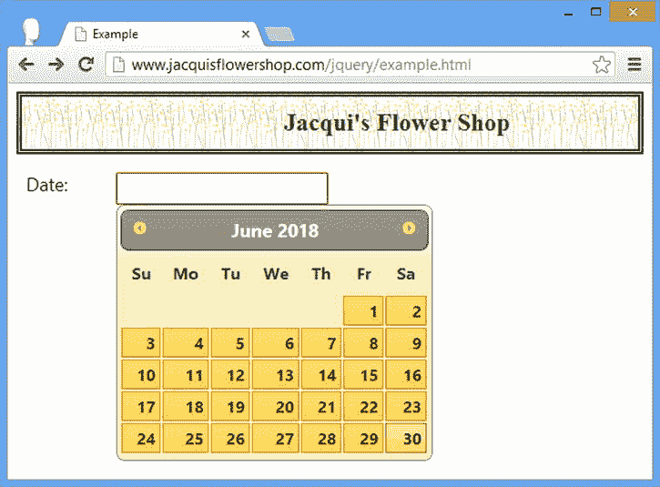
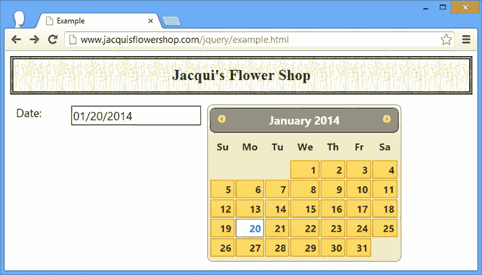
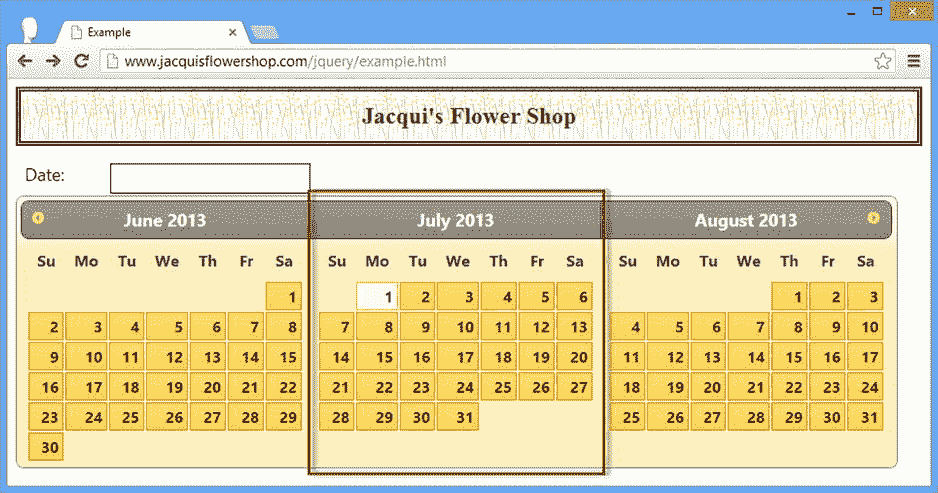

# 二十一、使用 Datepicker 小部件

本章重点介绍 jQuery UI datepicker 小部件，它提供了一种方便的机制来帮助用户选择日期。众所周知，从用户那里获取日期信息是有问题的，因为可以用多种格式来表示日期。datepicker 小部件可以让用户更容易地选择日期，以一种更一致、更不容易出错的方式，并使用常规文本`input`元素。表 21-1 对本章进行了总结。

表 21-1 。章节总结

| 问题 | 解决办法 | 列表 |
| --- | --- | --- |
| 创建弹出 jQuery UI 日期选择器 | 在`input`元素上使用`datepicker`方法 | one |
| 创建内嵌日期选择器 | 在`span`或`div`元素上使用`datepicker`方法 | Two |
| 指定日期选择器显示的日期 | 使用`defaultDate`设置 | three |
| 指定当用户选择日期时将被更新的附加元素 | 使用`altField`设置 | four |
| 更改导致弹出日期选择器出现的操作 | 使用`showOn`设置 | five |
| 指定在 datepicker 触发器按钮中显示的文本 | 使用`buttonText`设置 | six |
| 显示图像代替触发按钮 | 使用`buttonImage`和`buttonImageOnly`设置 | seven |
| 限制日期选择 | 使用`constrainInput`、`minDate`和`maxDate`设置 | 8, 9 |
| 在日期选择器中显示几个月 | 使用`numberOfMonths`设置 | 10–12 |
| 启用下拉菜单来帮助导航到月份和年份 | 使用`changeMonth`和`changeYear`设置 | Thirteen |
| 在日期选择器中显示周信息 | 使用`showWeek`和`weekHeader`设置 | Fourteen |
| 用前几个月和后几个月的日期填充日期网格 | 使用`showOtherMonths`和`selectOtherMonths`设置 | Fifteen |
| 在日期选择器的底部显示一个按钮栏 | 使用`showButtonBar`和`gotoCurrent`设置 | Sixteen |
| 向用户显示格式提示 | 使用`appendText`设置(或 HTML5 占位符功能) | 17, 18 |
| 以编程方式获取或设置日期 | 使用`getDate`和`setDate`方法 | Nineteen |
| 以编程方式显示或隐藏弹出日期选择器 | 使用`show`和`hide`方法 | Twenty |
| 响应用户导航到新的月份或年份 | 使用`onChangeMonthYear`事件 | Twenty-one |
| 响应弹出的日期选择器关闭 | 使用`onClose`事件 | Twenty-two |
| 本地化日期选择器 | 使用 jQuery UI i8n 支持 | Twenty-three |

创建日期选择器

您可以通过两种方式使用日期选择器。最常见的是使用`datapicker`方法将小部件附加到`input`元素。`input`没有立即的视觉变化，但是当元素获得焦点时(因为用户或者从其他元素切换或者单击`input`字段)，datepicker 弹出来帮助用户选择日期。清单 21-1 演示了这个*弹出窗口* datepicker 。

***清单 21-1*** 。创建弹出日期选择器

```js
<!DOCTYPE html>
<html>
<head>
    <title>Example</title>
    <script src="jquery-2.0.2.js" type="text/javascript"></script>
    <script src="jquery-ui-1.10.3.custom.js" type="text/javascript"></script>
    <link rel="stylesheet" type="text/css" href="styles.css"/>
    <link rel="stylesheet" type="text/css" href="jquery-ui-1.10.3.custom.css"/>
    <style type="text/css">
        input {width: 200px; text-align: left}
    </style>
    <script type="text/javascript">
        $(document).ready(function() {
            $("#datep").datepicker();
        });
    </script>
</head>
<body>
    <h1>Jacqui's Flower Shop</h1>
    <form method="post" action="http://node.jacquisflowershop.com/order">
      <div class="ui-widget">
        <label for="datep">Date: </label><input id="datep"/>
      </div>
    </form>
</body>
</html>
```

在图 21-1 中，你可以看到聚焦于`input`元素是如何显示日期选择器的。


图 21-1 。当 input 元素获得焦点时，将弹出 datepicker

当显示 datepicker 弹出窗口时，用户可以选择手动输入日期或使用 datepicker 窗口选择日期。当`input`元素失去焦点或者当用户点击 Enter 或 Escape 键时，datepicker 弹出窗口消失。

创建内嵌日期选择器

使用日期选择器的另一种方法是在*内联*中使用它。为此，您使用 jQuery 选择一个`div`或`span`元素，然后调用`datepicker`方法。只要基础元素可见，内联 datepicker 就可见。清单 21-2 展示了如何创建一个内嵌的日期选择器 。

***清单 21-2*** 。创建内嵌日期选择器

```js
<!DOCTYPE html>
<html>
<head>
    <title>Example</title>
    <script src="jquery-2.0.2.js" type="text/javascript"></script>
    <script src="jquery-ui-1.10.3.custom.js" type="text/javascript"></script>
    <link rel="stylesheet" type="text/css" href="styles.css"/>
    <link rel="stylesheet" type="text/css" href="jquery-ui-1.10.3.custom.css"/>
    <style type="text/css">
        input {width: 200px; text-align: left; margin-right: 10px}
        #wrapper > * {float: left}
    </style>
    <script type="text/javascript">
        $(document).ready(function () {
            $("#inline").datepicker();
        });
    </script>   
</head>
<body>
    <h1>Jacqui's Flower Shop</h1>
    <form method="post" action="http://node.jacquisflowershop.com/order">
        <div id="wrapper" class="ui-widget">
            <label for="datep">Date: </label>
            <input id="datep"/>
            <span id="inline"></span>
        </div>
    </form>
</body>
</html>
```

在这个例子中，我添加了一个`span`元素，并将其用作`datepicker`方法的目标。你可以在图 21-2 中看到效果。


图 21-2 。内嵌日期选择器

当您不想使用弹出窗口时，内嵌日期选择器会很有用。在某些应用中，日期非常重要，因此始终显示 datepicker 是有意义的，但在大多数情况下，在需要时隐藏弹出窗口是更明智的做法。隐藏和显示内联日期选择器的问题是，文档的布局必须灵活以适应日期选择器，这可能会导致显示问题。几乎在所有情况下，我发现弹出式日期选择器更有用。

配置日期选择器

如果你以前做过与日期有关的工作，你会明白处理它们是复杂的。这种复杂性反映在 datepicker 小部件支持的大量设置中。在接下来的部分中，我描述了可用于配置 datepicker 的相关设置组。

执行基本配置

表 21-2 描述了执行 datepicker 小工具基本配置的设置。在接下来的小节中，我将向您展示如何使用这些设置。

表 21-2 。基本日期选择器设置

| 环境 | 描述 |
| --- | --- |
| `altField` | 指定将随数据选择更新的附加字段。 |
| `buttonImageOnly` | 指定由`buttonImage`指定的图像应该包含在`img`元素中，而不是包含在`button`中。默认为`false`。 |
| `buttonImage` | 指定用于弹出触发器按钮的图像的 URL。默认情况下不使用。 |
| `buttonText` | 指定弹出触发器按钮的文本。默认为省略号(`...`)。 |
| `defaultDate` | 设置显示日期选择器时突出显示的日期。 |
| `disabled` | 指定最初是否禁用 datepicker 小工具。默认为`false`。 |
| `showOn` | 指定显示弹出日期选择器的触发器。默认为`focus`。 |

指定默认日期

最基本的设置也是最有用的设置之一。`defaultDate`设置指定显示日期选择器时将显示的日期。如果您没有为`defaultDate`设置提供值，那么将使用当前日期。(当然，这是用户系统定义的日期。时区、日期线和错误配置都可能给用户呈现与您预期不同的日期。)

 **提示**该设置仅在`input`元素没有`value`属性时使用。如果有，要么是因为您在文档中包含了`value`属性，要么是因为用户之前已经做出了选择，那么 datepicker 将忽略该设置。

如果你不想要今天的日期，那么你可以从几种不同的格式中选择来表达你想要开始的日期。表 21-3 显示了您可以使用的格式和值的范围。

表 21-3 。默认日期设置的格式和值

| 值/格式 | 描述 |
| --- | --- |
| `null` | 使用当前系统日期。 |
| `Date`对象 | 使用由`Date`对象表示的值。 |
| `+days`，`-days` | 使用从今天起指定天数的日期。例如，`+3`表示显示三天后的日期，`-2`表示显示两天前的日期。 |
| `+1d +7w -1m +1y` | 使用相对于今天的日期，表示为未来(`d`)、周(`w`)、月(`m`)和年(`y`)(`+`)或过去(`-`)。正值和负值可以混合在一个日期中，因此 2011 年 11 月 12 日使用的值`-1d +1m`选择日期 2011 年 12 月 11 日。 |

清单 21-3 展示了如何使用`defaultDate`设置来指定未来五年的日期。

***清单 21-3*** 。使用默认日期设置

```js
...
<script type="text/javascript">
    $(document).ready(function() {
        $("#datep").datepicker({
            defaultDate: "+5y"
        });
    });
</script>
...
```

我在 2013 年 6 月写这一章，你可以在图 21-3 中看到`defaultDate`设置的`+5y`值聚焦于 2018 年 6 月的日期选择器。



图 21-3 。使用 defaultDate 设置显示未来日期

如示例所示，您可以省略任何不想更改的间隔，这样就可以使用`+5y`而不是`+0d +0w +0m +5y`。您可以混合搭配不同时间间隔的负值和正值，以确定您想要的日期。

指定替代元素

`altField`设置指定了一个`input`元素，当您选择日期时，该元素将被更新。这是链接`input`元素和内嵌日期选择器的最简单的方法。清单 21-4 显示了使用`altField`设置来显示内嵌日期选择器的选择。

***清单 21-4*** 。将 altField 设置与内联 Datepicker 一起使用

```js
...
<script type="text/javascript">
    $(document).ready(function() {
        $("#inline").datepicker({
            altField: "#datep"
        });
    });
</script>
...
```

在清单 21-4 中，我使用了一个选择器字符串来标识我想要使用的元素，但是`altField`设置也将接受一个 jQuery 对象或一个文档对象模型(DOM) `HTMLElement`对象。这个例子的效果是，`input`元素在我每次使用 datepicker 进行选择时显示日期，如图 21-4 中的所示。



图 21-4 。指定日期选取器将更新的输入元素

管理弹出触发器

`showOn`设置控制向用户显示弹出日期选择器的原因。该设置有三个允许值。

*   `focus`:当`input`元素获得焦点时弹出。这是默认设置。
*   `button`:点击按钮时弹出。
*   `both`:点击按钮或输入获得焦点时弹出。

当您使用`button`或`both`值时，datepicker 小部件会创建一个`button`元素，并将其添加到文档中的`input`元素之后。清单 21-5 显示了`showOn`设置的使用。

***清单 21-5*** 。使用 showOn 设置

```js
...
<script type="text/javascript">
    $(document).ready(function() {
        $("#datep").datepicker({
            showOn: "both"
        });
    });
</script>
...
```

你可以在图 21-5 中看到小部件创建的`button`元素。因为我在这个例子中使用了`both`值，所以当用户点击`button`或者聚焦于`input`元素时，弹出窗口就会显示出来。


图 21-5 。为响应 showOn 设置而添加的按钮

 **提示**date picker 小部件添加的按钮不是 jQuery UI 按钮小部件。如果你想保持按钮的一致性，那么你需要选择`button`元素并调用 jQuery UI `button`方法，如第十八章中的所述。

您可以使用`buttonImage`或`buttonText`设置来格式化`button`元素。如果您将`buttonImage`设置为 URL，datepicker 小部件将使用`button`中的图像。或者，您可以使用`buttonText`设置来设置一个短语来替换默认内容(即`...`)。清单 21-6 显示了`buttonText`设置的使用。

***清单 21-6*** 。使用按钮文本设置

```js
...
<script type="text/javascript">
    $(document).ready(function() {
        $("#datep").datepicker({
            showOn: "both",
            buttonText: "Select"
        });
    });
</script>
...
```

如果同时使用`buttonImage`和`buttonTextOnly`设置，可以完全去掉按钮文本。这会导致 datepicker 向文档添加一个`img`元素，而不是一个按钮。清单 21-7 提供了一个演示。

***清单 21-7*** 。使用图像而不是按钮

```js
<!DOCTYPE html>
<html>
<head>
    <title>Example</title>
    <script src="jquery-2.0.2.js" type="text/javascript"></script>
    <script src="jquery-ui-1.10.3.custom.js" type="text/javascript"></script>
    <link rel="stylesheet" type="text/css" href="styles.css"/>
    <link rel="stylesheet" type="text/css" href="jquery-ui-1.10.3.custom.css"/>
    <style type="text/css">
        input {width: 200px; text-align: left}
        #dpcontainer * {vertical-align: middle}
        #dpcontainer img {width: 35px;}
    </style>
    <script type="text/javascript">
        $(document).ready(function() {
            $("#datep").datepicker({
                showOn: "both",
                buttonImage: "right.png",
                buttonImageOnly: true
            });
        });
    </script>
</head>
<body>
    <h1>Jacqui's Flower Shop</h1>
    <form method="post" action="http://node.jacquisflowershop.com/order">
      <divid="dpcontainer"class="ui-widget">
        <label for="datep">Date: </label><input id="datep"/>
      </div>
    </form>
</body>
</html>
```

我指定了一个名为`right.png`的图像，并将`buttonImageOnly` 设置为`true`。我还在文档中添加了一些 CSS 样式来控制图像相对于`label`和`input`元素的外观。datepicker 小部件在如何创建`img`元素方面不是特别聪明，所以我需要进行补偿，使图像的样式与文档的其余部分保持一致。你可以在图 21-6 中看到有图像而没有按钮的效果。


图 21-6 。在弹出日期选择器中使用图像而不是按钮

管理日期选择

您通常希望对用户可以使用 datepicker 小部件选择的日期范围应用约束。表 21-4 描述了允许您应用选择约束来引导用户到您可以处理的日期的设置。

表 21-4 。用于管理日期选择的日期选择器设置

| 环境 | 描述 |
| --- | --- |
| `changeMonth` | 当`true`时，日期选择器显示一个下拉菜单，允许直接导航到一个月。默认为`false`。 |
| `changeYear` | 当`true`时，日期选择器显示一个下拉菜单，允许直接导航到一个年份。默认为`false`。 |
| `constrainInput` | 当`true`时，将`input`元素中的字符限制为有效日期中包含的字符。默认是`true`。 |
| `hideIfNoPrevNext` | 当`true`时，如果相对于显示的时间段，过去或未来没有可选择的日期，则隐藏上一个和下一个按钮，而不是禁用。默认为`false`。 |
| `maxDate` | 指定用户可以选择的最晚日期。默认情况下，允许用户选择任何日期。 |
| `minDate` | 指定用户可以选择的最早日期。默认情况下，允许用户选择任何日期。 |
| `numberOfMonths` | 指定日期选择器显示的月数。默认为`1`。 |
| `showCurrentAtPos` | 指定当前或默认月份在多月日期选择器中的显示位置。默认为`0`。 |
| `stepMonths` | 指定单击“上一个”和“下一个”按钮时显示跳跃的月数。默认为`1`。 |
| `yearRange` | 指定可在通过`changeYear`设置启用的下拉列表中选择的年份范围。默认显示当前年份的十年前和十年后。 |

限制输入字符和日期范围

当设置为`true`时，`constrainInput`设置将可以输入到`input`元素中的字符限制为有效日期中包含的字符。字符集取决于您正在使用的*本地化配置*，我将在“本地化日期选择”一节中对此进行更多讨论如果您没有本地化 datepicker 小部件，那么您可以预期`input`元素会受到限制，这样用户只能输入数字和`/`字符。

这个设置并不意味着用户只能输入有效的日期，因为可以输入像`99/99/99`这样的值，但是它可以帮助减少错误。当`showOn`设置被设置为`button`时，该设置的重要性增加，因为当`input`元素获得焦点时，弹出窗口不会自动出现。用户通常会在出现日期选择器时进行选择，但并不总是意识到按钮会显示选择器。您给用户的每一次直接输入日期的机会都会增加您处理格式错误的值的机会。清单 21-8 显示了`constrainInput`设置的使用。

清单 21-8 。将基本约束应用于日期选择

```js
<!DOCTYPE html>
<html>
<head>
    <title>Example</title>
    <script src="jquery-2.0.2.js" type="text/javascript"></script>
    <script src="jquery-ui-1.10.3.custom.js" type="text/javascript"></script>
    <link rel="stylesheet" type="text/css" href="styles.css"/>
    <link rel="stylesheet" type="text/css" href="jquery-ui-1.10.3.custom.css"/>
    <style type="text/css">
        input {width: 200px; text-align: left; margin-right: 10px}
        #wrapper > * {float: left}
    </style>
    <script type="text/javascript">
        $(document).ready(function() {
            $("#datep").datepicker({
                constrainInput: true,
                minDate: "-3",
                maxDate: "+5"
            });
        });
    </script>
</head>
<body>
    <h1>Jacqui's Flower Shop</h1>
    <form method="post" action="http://node.jacquisflowershop.com/order">
      <div id="wrapper" class="ui-widget">
        <label for="datep">Date: </label><input id="datep"/><span id="inline"></span>
      </div>
    </form>
</body>
</html>
```

默认情况下，`constrainInput`设置是`true`，所以我也为`minDate`和`maxDate`设置添加了值，只是为了让这个例子更有趣一点。这些设置允许我指定用户可以选择的最早和最晚日期。与我在“指定默认日期”一节中展示的`defaultDate`设置一样，我可以将`minDate`和`maxDate`设置的日期指定为`null`(无日期)、一个`Date`对象、一个`number`日期或一个相对日期字符串。在清单 21-8 中，我使用了数字选项来指定相对于今天的天数。在图 21-7 中，您可以看到 datepicker 小部件禁用了任何用户不能选择的日期。


图 21-7 。限制用户可以选择的日期

 **提示**注意，上一页和下一页按钮在不需要时会自动禁用。这些按钮位于日期选择器的左上角和右上角，允许用户移动到上个月和下个月。在图 21-7 中，用户可以选择的所有日期都在当月或上月，因此下一步按钮被禁用。在这种情况下，您可以通过将`hideIfNoPrevNext`设置为`true`来隐藏而不是禁用按钮。

`minDate`不需要在过去，`maxDate`不需要在未来，并且您不必为两个设置都提供值。如果您需要用户选择一个有某种提前期的日期，您可以为`minDate`设置指定一个未来的日期，以防止选择您需要准备的日期，如清单 21-9 所示。

***清单 21-9*** 。提供一个日期限制来创建一个延迟窗口

```js
...
<script type="text/javascript">
    $(document).ready(function() {
        $("#datep").datepicker({
            minDate: "+7"
        });
    });
</script>
...
```

在本例中，我已经指定用户不能选择从今天起一周内发生的任何日期。没有`maxDate`值，这意味着可以选择从现在起一周之后的任何未来日期。你可以在图 21-8 中看到结果。请注意，此图中启用了“下一步”按钮(允许用户导航到下个月)，但禁用了“上一步”按钮(因为不允许用户选择过去的日期)。


图 21-8 。创建开放式日期选择范围

 **提示**`minDate`和`maxDate`设置与`defaultDate`设置协同工作，这意味着您可以指定相对于不是今天的日期的日期范围。

创建多月显示

datepicker 允许您通过`numberOfMonths`设置指定向用户显示多少个月。您可以指定月数或双元素数组，该数组指定月网格的大小。清单 21-10 显示了基于数组的方法，我发现这种方法最适合内联日期选择器，因为网格通常太大而不能用作弹出窗口(稍后我会解释原因)。

***清单 21-10*** 。使用月数设置

```js
...
<script type="text/javascript">
    $(document).ready(function() {
        $("#inline").datepicker({
            numberOfMonths: [1, 3]
        });
    });
</script>
...
```

在这个例子中，我指定了一个高一个月宽三个月的网格。你可以在图 21-9 中看到效果。


图 21-9 。显示月份的网格

 **提示**二元数组`[1, 3]`相当于数值`3`。当您为`­numberOfMonths`设置提供一个数字时，datepicker 会在一行中显示指定的月数。

我很少在弹出日期选择器中使用这个特性的原因是，大的网格需要假设用户浏览器窗口和显示的大小。datepicker 弹出窗口不是操作系统对话框。它是一个精心格式化的 HTML 元素，作为 HTML 文档的一部分显示。这意味着当一个大的日期选择器显示在一个小屏幕上或一个小浏览器窗口中时，大部分细节被移出了屏幕的边缘。清单 21-11 显示了一个应用于弹出日期选择器的月份网格。

***清单 21-11*** 。使用弹出日期选择器设置月数

```js
...
<script type="text/javascript">
    $(document).ready(function() {
        $("#datep").datepicker({
            numberOfMonths: [1, 3]
        });
    });
</script>
...
```

你可以在图 21-10 中看到结果。不仅许多可用日期对用户隐藏，而且 next 按钮(允许用户推进显示的月份)也不在屏幕上。


图 21-10 。显示大的弹出日期选择器

您可以使用`showCurrentAtPos`设置在多月日期选择器中更改所选日期的位置。从图 21-9 和图 21-10 中可以看到，默认是先显示当前月份，然后是未来的两个月。`showCurrentAtPos`设置采用一个从零开始的索引值，该值指定当前月份应该显示的位置。如果您需要允许用户选择今天的任意一天，这是一个非常方便的特性。清单 21-12 显示了该设置的使用。

***清单 21-12*** 。使用 showCurrentAtPos 设置

```js
...
<script type="text/javascript">
    $(document).ready(function() {
        $("#inline").datepicker({
            numberOfMonths: 3,
            showCurrentAtPos: 1
        });
    });
</script>
...
```

我已经指定当前日期应该显示在日期选择器显示的三个月的中间。你可以在图 21-11 中看到结果。



图 21-11 。在多月日期选择器中指定当前月份的位置

提供对月份和年份的直接访问

您可以用下拉菜单替换 datepicker 标题中的月份和年份，这些下拉菜单提供了对月份和年份的直接访问。当有很大的日期范围可供选择时，这对于用户来说是一个有用的快捷方式。控制这些功能的设置是`changeMonth`和`changeYear`。这些设置的`true`值启用相应的菜单，菜单可以彼此独立启用。清单 21-13 展示了这些设置的使用。

***清单 21-13*** 。通过下拉菜单直接访问月份和年份

```js
...
<script type="text/javascript">
    $(document).ready(function() {
        $("#datep").datepicker({
            changeMonth: true,
            changeYear: true,
            yearRange: "-1:+2"

        });
    });
</script>
...
```

在这个清单中，我启用了两个下拉菜单。我还使用了`yearRange`设置来限制用户可以浏览的年份范围。我指定了一个值`-1:+2`，这意味着用户可以选择从现在开始的一年到未来的两年。因为我在 2013 年写这一章，所以呈现给用户的年份范围是 2012 年到 2015 年。你可以在图 21-12 中看到菜单是如何显示的(以及年份范围是如何出现的)。


图 21-12 。为用户提供对月份和年份的直接访问

 **提示**您也可以为`yearRange`设置提供一个实际年份范围。我可以在图 21-12 中用`2012:2015`的值得到同样的结果。

管理日期选择器的外观

您可以使用许多设置来定制 datepicker 向用户显示时的外观。对于一般的日期选择目的，您在前面的示例中看到的默认外观通常是合适的，但是调整外观以适应 web 应用的需求的能力非常有用。表 21-5 描述了外观相关的设置。

表 21-5 。用于控制外观的日期选择器设置

| 环境 | 描述 |
| --- | --- |
| `appendText` | 指定将在文档中插入到`input`元素之后的格式提示。 |
| `closeText` | 指定按钮栏中用于关闭弹出日期选取器的按钮的文本。默认为`Done`。 |
| `currentText` | 指定用于按钮栏中返回到当前日期的按钮的文本。默认为`Today`。 |
| `duration` | 指定执行由`showAnim`设置指定的动画的速度或持续时间。默认为`normal`。我在第三十五章中描述了 jQuery UI 动画效果。 |
| `gotoCurrent` | 当`true`时，按钮栏中的`Today`按钮将返回到所选择的日期，而不是今天的日期。默认是`false`。 |
| `selectOtherMonths` | 当`true`时，可以选择作为`showOtherMonths`设置结果显示的日期。默认是`false`。 |
| `showAnim` | 指定用于显示和隐藏弹出日期选择器的动画。我在第三十五章中描述了 jQuery UI 动画效果。默认为`show`。 |
| `showButtonPanel` | 当`true`时，日期选择器显示一个按钮栏，允许用户跳转到当前日期，并(当与弹出窗口一起使用时)关闭日期选择器。默认为`false`。 |
| `showOptions` | 指定由`showAnim`设置定义的动画选项。我在第三十五章中描述了 jQuery UI 动画效果。 |
| `showOtherMonths` | 当`true`时，日期选取器用上个月和后续月份的日期填充日期网格中的空白。默认为`false`。 |
| `showWeek` | 当`true`时，日期选择器显示一个显示周信息的列。默认为`true`。 |
| `weekHeader` | 设置通过`showWeek`设置启用的周列标题。默认为`Wk`。 |

显示周

对于某些应用来说，知道日期属于一年中的哪一周是非常重要的。例如，在预算管理应用中经常会出现这种情况。jQuery UI datepicker 可以显示周信息，通过`showWeek`和`weekHeader`设置进行配置，如清单 21-14 所示。

***清单 21-14*** 。在日期选择器中显示周信息

```js
...
<script type="text/javascript">
    $(document).ready(function() {
        $("#datep").datepicker({
            showWeek: true,
            weekHeader: "Week"
        });
    });
</script>
...
```

当`showWeek`设置为`true`时，日期选择器显示一列显示周数。您可以使用`weekHeader`设置来更改默认的`Wk`周栏的标题。在这个例子中，我启用了 week 列，并将标题改为`Week`。你可以在图 21-13 中看到结果。


图 21-13 。在日期选择器中显示周信息

允许月份间出血

默认情况下，datepicker 仅显示当月的日期。这意味着在日期范围之前和之后的日期网格中有空白条目。您可以通过使用`showOtherMonth`设置的值`true`来显示上个月和下个月的日期，如清单 21-15 所示。

***清单 21-15*** 。让几个月一个月地过去

```js
...
<script type="text/javascript">
    $(document).ready(function() {
        $("#datep").datepicker({
            showOtherMonths: true
        });
    });
</script>
...
```

你可以在图 21-14 中看到结果。除非`selectOtherMonths`设置为`true`，否则不能选择其他月份的日期。


图 21-14 。显示前几个月和后几个月的日期

使用按钮栏

当`true`时，`showButtonBar`设置启用日期选择器窗口底部的按钮栏。使用弹出日期选择器时，按钮栏包含`Today`和`Done`按钮。`Today`按钮跳回当前日期，而`Done`按钮关闭弹出窗口。在图 21-15 中可以看到按钮。当是内嵌日期选择器的一部分时，只显示`Today`按钮。


图 21-15 。显示按钮栏

 **提示**您可以使用`currentText`和`closeText`设置更改用于`Today`和`Done`按钮的文本。

当`true`时，`gotoCurrent`设置会将日期选择器返回到当前选择的日期，而不是今天的日期。当您使用`defaultDate`设置配置了日期选择器时，这很有用。如果日期选择的目的与历史或未来事件相关，则返回当前日期并不总是有意义的。清单 21-16 包含了一个例子。

***清单 21-16*** 。使用 gotoCurrent 设置

```js
...
<script type="text/javascript">
    $(document).ready(function() {
        $("#datep").datepicker({
            showButtonPanel: true,
            gotoCurrent: true,
            defaultDate: "+1m +1y"
        }).val("12/25/2012");
    });
</script>
...
```

请注意，`gotoCurrent`设置使按钮转到选定的日期。在清单 21-16 中，日期将取自`input`元素的`value`属性，但是如果用户选择了另一个日期，然后再次打开日期选择器，按钮将返回到用户选择的日期，而不是您指定的日期。

向用户提供格式提示

您可以使用`appendText`设置来为用户提供关于您期望的日期格式的提示。清单 21-17 展示了。

***清单 21-17*** 。使用 appendText 设置提供格式提示

```js
...
<script type="text/javascript">
    $(document).ready(function() {
        $("#datep").datepicker({
            appendText: "(mm/dd/yyyy)"
        });
    });
</script>
...
```

日期选择器将您指定的文本插入到文档中，如图图 21-16 所示。


图 21-16 。使用 appendText 设置向用户提供格式提示

当您依靠按钮来显示弹出的日期选择器时，此设置最有用。当用户不用日期选择器就可以自由输入文本时，那么您给她关于格式的提示可以显著减少您必须处理的错误(这对您来说是好的，对用户来说也不那么令人沮丧)。最近，我开始为`input`元素使用 HTML5 `placeholder`属性，作为对日期选择器`appendTo`设置的一个更简洁的替代。清单 21-18 展示了。

***清单 21-18*** 。使用 HTML5 占位符属性提供格式提示

```js
...
<script type="text/javascript">
    $(document).ready(function() {
        $("#datep").attr("placeholder", "mm/dd/yyyy").datepicker();
    });
</script>
...
```

显然，这要求用户拥有支持 HTML5 的浏览器，但效果更优雅。用户看到的提示是灰色的文本，当他开始输入时就会消失。我更喜欢这样，因为它将格式提示与`input`元素更紧密地联系在一起，并且它不需要文档布局中的空间。你可以在图 21-17 中看到占位符是如何在谷歌浏览器中显示的。


图 21-17 。使用 HTML5 占位符作为格式提示

使用日期选择器方法

datepicker 小部件支持表 21-6 中所示的方法。

表 21-6 。手风琴方法

| 方法 | 描述 |
| --- | --- |
| `datepicker("destroy")` | 从基础元素中移除 datepicker |
| `datepicker("disable")` | 禁用日期选择器 |
| `datepicker("enable")` | 启用日期选择器 |
| `datepicker("option")` | 为 datepicker 设置一个或多个选项 |
| `datepicker("isDisabled")` | 如果日期选择器被禁用，则返回`true` |
| `datepicker("hide")` | 隐藏弹出式日期选择器 |
| `datepicker("show")` | 显示弹出的日期选择器 |
| `datepicker("refresh")` | 刷新 datepicker 以反映基础元素中的更改 |
| `datepicker("getDate")` | 从 datepicker 获取选定的日期 |
| `datepicker("setDate", date)` | 为日期选择器设置选定的日期 |

以编程方式获取和设置日期

当我使用多个内联日期选择器来允许用户选择日期范围时，我发现`getDate`和`setDate`方法最有用。在这种情况下，我不想在`input`元素中显示选择的日期。我只想显示第一次和第二次约会之间的天数。清单 21-19 演示了。

***清单 21-19*** 。使用两个日期选择器选择日期范围

```js
<!DOCTYPE html>
<html>
<head>
    <title>Example</title>
    <script src="jquery-2.0.2.js" type="text/javascript"></script>
    <script src="jquery-ui-1.10.3.custom.js" type="text/javascript"></script>
    <link rel="stylesheet" type="text/css" href="styles.css"/>
    <link rel="stylesheet" type="text/css" href="jquery-ui-1.10.3.custom.css"/>
    <style type="text/css">
        input {width: 200px; text-align: left; margin-right: 10px}
        #wrapper > * {float: left}
        #result {margin: auto; padding: 10px; width: 200px; clear: left}
    </style>
    <script type="text/javascript">
        $(document).ready(function() {

            $("#result").hide();

            $("#dateStart, #dateEnd").datepicker({
                minDate: "-7d",
                maxDate: "+7d",
                onSelect: function(date, datepicker) {
                    if (datepicker.id == "dateStart") {
                        $("#dateEnd").datepicker("setDate", date)
                            .datepicker("enable").datepicker("option", "minDate", date)
                    }

                    if (!$("#dateEnd").datepicker("isDisabled")) {
                        var startDate = $("#dateStart").datepicker("getDate");
                        var endDate = $("#dateEnd").datepicker("getDate");
                        var diff = endDate.getDate() - startDate.getDate();
                        $("#dayCount").text(diff).parent().show();
                    }
                }

            }).filter("#dateEnd").datepicker("disable");
        });
    </script>
</head>
<body>
    <h1>Jacqui's Flower Shop</h1>
    <form method="post" action="http://node.jacquisflowershop.com/order">
      <div id="wrapper" class="ui-widget">
        <label for="dateStart">Start: </label><span id="dateStart"></span>
        <label for="dateEnd">End: </label><span id="dateEnd"></span>
      </div>
      <div id="result" class="ui-widget">
        Number of Days: <span id="dayCount"></span>
      </div>
    </form>
</body>
</html>
```

在清单 21-19 的中有两个日期选择器，第二个在文档第一次加载时被禁用。我使用`onSelect`事件(当选择日期时触发)来响应用户选择日期。当用户在第一个日期选择器中做出选择时，我使用`setDate`方法准备第二个日期选择器，使用`getDate`方法从两个日期选择器中获取日期，以便计算出第一个和第二个选择的日期之间的天数(为了使这个例子简单，我做了一个比较，假设两个日期在同一个月)。您可以在图 21-18 的中看到该文档是如何在浏览器中显示的。


图 21-18 。使用 getDate 和 setDate 方法

以编程方式显示和隐藏弹出日期选择器

您可以使用`show`和`hide`方法以编程方式控制弹出日期选择器在屏幕上的出现。如果您希望将 datepicker 与除了 datepicker 小部件创建的`input`元素或`button`的焦点之外的其他东西相关联，这将非常有用。我不太喜欢让日期选择器在文档中创建一个按钮，所以我偶尔会发现自己使用这些方法从自己添加的按钮中控制日期选择器，如清单 21-20 所示。

***清单 21-20*** 。使用显示和隐藏方法

```js
<!DOCTYPE html>
<html>
<head>
    <title>Example</title>
    <script src="jquery-2.0.2.js" type="text/javascript"></script>
    <script src="jquery-ui-1.10.3.custom.js" type="text/javascript"></script>
    <link rel="stylesheet" type="text/css" href="styles.css"/>
    <link rel="stylesheet" type="text/css" href="jquery-ui-1.10.3.custom.css"/>
    <style type="text/css">
        input {width: 200px; text-align: left; margin-right: 10px}
        #wrapper > * {float: left}
        label {padding: 4px; text-align: right; width: auto}
    </style>
    <script type="text/javascript">
        $(document).ready(function() {

            $("#datep").datepicker();

            $("button").click(function(e) {
                e.preventDefault();
                $("#datep").datepicker("show");
                setTimeout(function() {
                    $("#datep").datepicker("hide");
                }, 5000)
            })

        });
    </script>
</head>
<body>
    <h1>Jacqui's Flower Shop</h1>
    <form method="post" action="http://node.jacquisflowershop.com/order">
      <div id="wrapper" class="ui-widget">
        <label for="datep">Date: </label><input id="datep"/><span id="inline"></span>
        <button>Datepicker</button>
      </div>
    </form>
</body>
</html>
```

当按钮被点击时，我调用 datepicker `show`方法。我不经常使用`hide`方法，因为我希望用户在做出选择后能够关闭弹出窗口，但是为了完整起见，我使用了`setTimeout`函数，这样在按钮被按下 5 秒后弹出窗口就会被关闭。

使用 Datepicker 事件

像所有 jQuery UI 小部件一样，datepicker 支持一组事件，允许您接收重要更改的通知。表 21-7 描述了这些事件。

表 21-7 。日期选择器事件

| 事件 | 描述 |
| --- | --- |
| `create` | 创建 datepicker 时触发 |
| `onChangeMonthYear` | 当用户移动到不同的月份或年份时触发 |
| `onClose` | 关闭弹出日期选择器时触发 |
| `onSelect` | 当用户选择日期时触发 |

我不打算再次演示`onSelect`方法，因为我已经在几个例子中使用过它，包括“以编程方式获取和设置日期”一节中的例子传递给该事件处理函数的参数是所选日期和触发该事件的 datepicker 的字符串表示形式。

响应月份或年份的变化

`onChangeMonthYear`事件允许您在用户选择新的月份或年份时做出响应，无论是通过`changeMonth`和`changeYear`设置启用的下拉菜单，还是通过上一个和下一个按钮。清单 21-21 展示了如何使用这个事件来保持两个日期选择器的一致性。

***清单 21-21*** 。使用 onChangeMonthYear 事件

```js
<!DOCTYPE html>
<html>
<head>
    <title>Example</title>
    <script src="jquery-2.0.2.js" type="text/javascript"></script>
    <script src="jquery-ui-1.10.3.custom.js" type="text/javascript"></script>
    <link rel="stylesheet" type="text/css" href="styles.css"/>
    <link rel="stylesheet" type="text/css" href="jquery-ui-1.10.3.custom.css"/>
    <style type="text/css">
        input {width: 200px; text-align: left; margin-right: 10px}
        #wrapper > * {float: left}
    </style>
    <script type="text/javascript">
        $(document).ready(function() {

            $("#dateStart, #dateEnd").datepicker({
                onSelect: function(date, datepicker) {
                    if (datepicker.id == "dateStart") {
                        $("#dateEnd").datepicker("setDate", date)
                    }
                },
                onChangeMonthYear: function(year, month, datepicker) {
                    if (datepicker.id == "dateStart") {
                        var newDate = new Date();
                        newDate.setMonth(month -1);
                        newDate.setYear(year);
                        $("#dateEnd").datepicker("setDate", newDate);
                    }
                }
            })
        });
    </script>
</head>
<body>
    <h1>Jacqui's Flower Shop</h1>
    <form method="post" action="http://node.jacquisflowershop.com/order">
      <div id="wrapper" class="ui-widget">
        <label for="dateStart">Start: </label><span id="dateStart"></span>
        <label for="dateEnd">End: </label><span id="dateEnd"></span>
      </div>
    </form>
</body>
</html>
```

该事件函数的三个参数是显示的年份、显示的月份和触发事件的日期选择器。对于弹出日期选择器，`this`变量被设置为`input`元素。当用户在第一个日期选择器上导航到新的月份或年份时，我在第二个日期选择器上设置日期以保持它们同步。

注意，datepicker 小部件将一月表示为一月，而 JavaScript 对象`Date`使用 0。这就是为什么我要做这样一个丑陋的调整

```js
...
newDate.setMonth(month -1);
...
```

当我创建我想要在第二个日期选择器中显示的日期时。

响应弹出关闭

您可以使用`onClose`方法来响应弹出的日期选择器被关闭。即使用户没有选择日期，也会触发此事件。处理函数的参数是日期的字符串表示形式(如果用户没有进行选择就关闭了 datepicker，则为空字符串)和触发事件的 datepicker。清单 21-22 显示了对此事件的简单响应。

***清单 21-22*** 。使用 onClose 事件

```js
<!DOCTYPE html>
<html>
<head>
    <title>Example</title>
    <script src="jquery-2.0.2.js" type="text/javascript"></script>
    <script src="jquery-ui-1.10.3.custom.js" type="text/javascript"></script>
    <link rel="stylesheet" type="text/css" href="styles.css"/>
    <link rel="stylesheet" type="text/css" href="jquery-ui-1.10.3.custom.css"/>
    <style type="text/css">
        input {width: 200px; text-align: left; margin-right: 10px}
        #wrapper > * {float: left}
    </style>
    <script type="text/javascript">
        $(document).ready(function() {
            $("#datep").datepicker({
                onClose: function(date, datepicker) {
                    if (date != "") {
                        alert("Selected: " + date);
                    }
                }
            });
        });
    </script>
</head>
<body>
    <h1>Jacqui's Flower Shop</h1>
    <form method="post" action="http://node.jacquisflowershop.com/order">
      <div id="wrapper" class="ui-widget">
        <label for="datep">Date: </label><input id="datep"/>
      </div>
    </form>
</body>
</html>
```

在清单 21-22 中，我向用户显示了一个警告框，提示用户做出选择。我必须承认，我从来没有发现自己在一个真实的项目中使用这个事件；我认为最有用的是`onSelect`事件。

本地化日期选择

jQuery UI datepicker 全面支持世界各地使用的不同日期格式。要使用它们，您需要将一个额外的 JavaScript 文件导入到您的文档中，并告诉 datepicker 您想要使用哪个区域设置。清单 21-23 提供了一个例子。

***清单 21-23*** 。使用本地化的日期选择器

```js
<!DOCTYPE html>
<html>
<head>
    <title>Example</title>
    <script src="jquery-2.0.2.js" type="text/javascript"></script>
    <script src="jquery-ui-1.10.3.custom.js" type="text/javascript"></script>
    <script src="jquery-ui-i18n.js" type="text/javascript"></script>
    <link rel="stylesheet" type="text/css" href="styles.css"/>
    <link rel="stylesheet" type="text/css" href="jquery-ui-1.10.3.custom.css"/>
    <style type="text/css">
        input {width: 200px; text-align: left; margin-right: 10px}
        #wrapper > * {float: left}
    </style>
    <script type="text/javascript">
        $(document).ready(function() {
            $("#inline").datepicker($.datepicker.regional["es"]);
        });
    </script>
</head>
<body>
    <h1>Jacqui's Flower Shop</h1>
    <form method="post" action="http://node.jacquisflowershop.com/order">
      <div id="wrapper" class="ui-widget">
        <label for="datep">Date: </label><input id="datep"/><span id="inline"></span>
      </div>
    </form>
</body>
</html>
```

`jquery-ui-i18n.js`文件可以在你在第十七章中创建的自定义 jQuery UI 下载的`development-bundle/ui/i18n`文件夹中找到。将该文件复制到主 jQuery 和 jQuery UI 脚本文件旁边，并将以下内容添加到文档中:

```js
...
<script src="jquery-ui-i18n.js" type="text/javascript"></script>
...
```

您可以在创建日期选取器时指定要使用的区域设置，如下所示:

```js
...
$("#inline").datepicker($.datepicker.regional["es"]);
...
```

这是一种混乱的语法，但是它允许您指定您想要的本地化格式。在本例中，我指定了`es`，这意味着我将使用西班牙日期格式。你可以在图 21-19 中看到结果。


图 21-19 。本地化日期显示

我对本地化的建议是，要么做好，要么干脆不做。这意味着远远超越日期格式，向用户呈现一个完全遵循语言、地址、性别、货币、时间和所有其他当地惯例的界面。如果您只本地化 web 应用的一部分或者不一致地遵循约定，用户会觉得不和谐。为了正确地本地化一个应用，你应该雇佣一个专门从事这项工作的个人或公司。出错的途径太多了，如果没有专业人士的支持，你注定会失败。

如果你发现自己试图使用谷歌翻译来本地化一个应用(这并不罕见)，那么我建议你只使用美国英语和美国本地化惯例来交付应用。这将您的客户群限制在那些熟悉拼写、日期、货币等美国变体的人，但至少您将避免在尝试临时本地化时几乎总是出现的火车失事。

摘要

在本章中，我向您展示了 jQuery UI datepicker 小部件的工作原理，您可以使用它来帮助用户选择日期。datepicker 是一个灵活的小部件，允许您定制日期选择的方式以及 datepicker 的外观。我自己使用日期选择器的经验是，当我向用户请求日期信息时，它们对于减少我必须处理的格式问题的数量是非常宝贵的。在第二十二章中，我向你展示了 jQuery UI 对话框和微调控件。