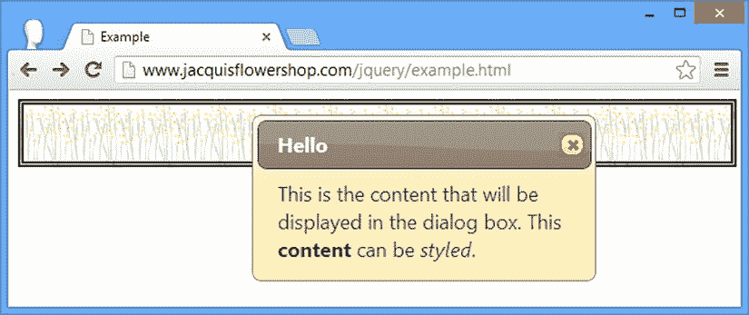
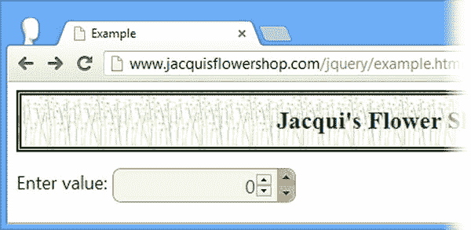

# 二十二、使用对话框和微调器小部件

在这一章中，我将描述 jQuery UI 对话框和 spinner 小部件。表 22-1 提供了本章的总结。

[表 22-1](#_Tab1) 。章节总结

| 问题 | 解决办法 | 列表 |
| --- | --- | --- |
| 创建 jQuery UI 对话框 | 选择一个具有`title`属性的`div`元素，并调用`dialog`方法 | one |
| 防止对话框一创建就显示 | 将`autoOpen`设置为`false` | Two |
| 防止用户调整对话框的大小 | 将`resizable`设置为`false` | three |
| 聚焦于对话框中的一个元素 | 设置`autofocus`属性 | four |
| 更改对话框的初始位置 | 使用`position`设置 | five |
| 向对话框中添加一个或多个按钮 | 使用`buttons`设置 | six |
| 在对话框按钮上显示图标 | 使用`icons`设置 | seven |
| 允许用户移动对话框 | 使用`draggable`设置 | eight |
| 创建模型对话框 | 将`modal`设置为`true` | 9, 10 |
| 以编程方式打开和关闭对话框 | 使用`open`、`close`和`isOpen`方法 | Eleven |
| 阻止对话框关闭 | 在`beforeClose`事件的处理函数中返回`false` | Twelve |
| 响应用户移动或改变对话框的大小 | 响应`dragStart`、`dragStop`、`drag`、`resizeStart`、`resizeStop`和`resize`事件 | Thirteen |
| 创建一个 jQuery UI 微调器 | 选择一个`input`元素并调用`spinner`方法 | 14–16 |
| 配置基本微调器行为 | 使用`min`、`max`、`step`和`page`设置 | Seventeen |
| 更改用于微调按钮的图标 | 使用`icons`属性 | Eighteen |
| 控制按住微调按钮时的变化率 | 使用`incremental`设置 | Nineteen |
| 更改微调器编号的格式 | 使用`culture`和`numberFormat`设置 | Twenty |
| 以编程方式更改微调器值 | 调用`pageDown`、`pageUp`、`stepDown`和`stepUp`方法 | Twenty-one |
| 响应微调器值的变化 | 处理微调器事件 | Twenty-two |

自上一版以来，JQUERY UI 发生了变化

当我写这本书的第一版时，spinner 小部件还不存在。在 jQuery UI 版本中，对话窗口小部件*和 API(应用编程接口)已经更新。有一些新的对话框特性:一个`appendTo`设置，指定对话框元素在 DOM(文档对象模型)中的位置；支持在对话框元素上设置焦点；`position`选项已更改为使用我在第 19 章的[中描述的格式；并且支持在对话框按钮中显示图标。一些功能也被删除了:T2 和 T3 设置。](19.html)*

使用 jQuery UI 对话框小部件

jQuery UI dialog 小部件创建一个带有标题和内容区域的浮动窗口，类似于您可能在本地应用中看到的那种对话框。对话框有助于将用户的注意力集中在重要的事件或消息上。与任何可能模糊文档内容的元素一样，对话框必须谨慎使用，只有当在文档布局中显示内容不可行时才使用。

创建对话框

对话框小部件是通过选择一个`div`元素，然后在生成的`jQuery`对象上调用`dialog`方法来创建的。对话框小部件需要特定的 HTML 元素结构才能操作，尽管这种结构比选项卡小部件需要的要简单。清单 22-1 显示了一个包含所需元素的文档，它创建了一个对话框。

***[清单 22-1](#_list1)*** 。使用 jQuery UI 创建对话框

```js
<!DOCTYPE html>
<html>
<head>
    <title>Example</title>
    <script src="jquery-2.0.2.js" type="text/javascript"></script>
    <script src="jquery-ui-1.10.3.custom.js" type="text/javascript"></script>
    <link rel="stylesheet" type="text/css" href="styles.css"/>
    <link rel="stylesheet" type="text/css" href="jquery-ui-1.10.3.custom.css"/>
    <script type="text/javascript">
        $(document).ready(function() {
            $("#dialog").dialog();
        });
    </script>
</head>
<body>
    <h1>Jacqui's Flower Shop</h1>
    <div id="dialog" title="Dialog Box">
        This is the content that will be displayed in the dialog box. This <b>content</b>
        can be <em>styled</em>.
    </div>
</body>
</html>
```

对话框小部件需要一个具有`title`属性的`div`元素。该属性的值用作对话框的标题栏。`div`元素的内容被用作对话框的内容，如[清单 22-1](#list1) 所示，该内容可以包含其他元素。当您在没有设置的情况下调用`dialog`方法时，正如我在清单中所做的，对话框会立即出现。[图 22-1](#Fig1) 显示了浏览器如何显示对话框。


[图 22-1](#_Fig1) 。简单的对话框

对话框小部件是通过巧妙使用 HTML 元素而不是通过操作系统创建的。这意味着 jQuery UI 对话框的行为方式与本地对话框不同。例如，它不会显示在操作系统的打开窗口列表中，并且可以调整浏览器窗口的大小，以便隐藏部分(或全部)jQuery UI 对话框。

也就是说，jQuery UI 团队在尽可能完善对话框功能方面做得很好。通过单击标题并拖动，用户可以在浏览器窗口中重新定位对话框。该对话框可以调整大小，并可以通过单击右上角的关闭按钮来关闭。而且，由于 jQuery UI 对话框小部件是由 HTML 构建的，它使用我在第 17 章的[中选择的 jQuery UI 主题进行样式化，并且可以显示复杂和样式化的 HTML 内容](17.html)。

在详细介绍小部件支持的设置、方法和事件之前，我想演示一下对话框的常见用法。当您调用不带参数的`dialog`方法时，正如我在第一个例子中所做的，对话框会立即出现，但这通常并不方便。更常见的情况是，您希望在文档加载时创建对话框(以便用户看不到元素结构)，然后在以后响应事件时显示对话框。清单 22-2 展示了如何做到这一点。

***[清单 22-2](#_list2)*** 。推迟 jQuery UI 对话框的出现

```js
<!DOCTYPE html>
<html>
<head>
    <title>Example</title>
    <script src="jquery-2.0.2.js" type="text/javascript"></script>
    <script src="jquery-ui-1.10.3.custom.js" type="text/javascript"></script>
    <link rel="stylesheet" type="text/css" href="styles.css"/>
    <link rel="stylesheet" type="text/css" href="jquery-ui-1.10.3.custom.css"/>
    <script type="text/javascript">
        $(document).ready(function() {

            $("#dialog").dialog({
                autoOpen: false
            });

            $("button").button().click(function(e) {
                $("#dialog").dialog("open")
            })
        });
    </script>
</head>
<body>
    <h1>Jacqui's Flower Shop</h1>
    <div id="dialog" title="Dialog Box">
      This is the content that will be displayed in the dialog box. This <b>content</b>
      can be <em>styled</em>.
    </div>
    <button>Show Dialog</button>
</body>
</html>
```

您使用`autoOpen`设置来防止对话框立即出现。当该设置为`false`时，HTML 元素结构对用户隐藏，但不显示对话框。当你准备好显示对话框时，你可以调用`open`方法。你可以在图 22-2 中看到这是如何工作的。


[图 22-2](#_Fig2) 。推迟对话框的出现

配置对话框

对话框小部件支持一系列设置，允许您自定义向用户显示对话框的方式。我在上一节向您展示了`autoOpen`设置，但是还有其他设置，如[表 22-2](#Tab2) 中所述。

[表 22-2](#_Tab2) 。对话框设置

| 环境 | 描述 |
| --- | --- |
| `appendTo` | 指定对话框应该追加到的元素。 |
| `autoOpen` | 当`true`时，对话框在用`dialog`方法创建后立即显示。默认是`true`。 |
| `buttons` | 指定要添加到对话框中的一组按钮，以及单击这些按钮时将调用的功能。默认情况下不使用按钮。 |
| `closeOnEscape` | 当`true`时，按退出键关闭对话框。默认为`true`。 |
| `draggable` | 当`true`时，用户可以点击对话框标题并拖动以在浏览器中移动对话框。默认为`true`。 |
| `height` | 以像素为单位指定对话框的初始高度。默认值是`auto`，它允许对话框自行调整大小。 |
| `hide` | 指定用于隐藏对话框的动画效果。有关 jQuery UI 效果的详细信息，请参见第 35 章。 |
| `maxHeight` | 指定对话框的最大高度(以像素为单位)。默认为`false`，表示没有大小限制。 |
| `maxWidth` | 指定对话框的最大宽度(以像素为单位)。默认为`false`，表示没有大小限制。 |
| `minHeight` | 指定对话框的最小高度(以像素为单位)。默认值为`false`，这意味着没有最小大小限制。 |
| `minWidth` | 指定对话框的最小宽度(以像素为单位)。默认值为`false`，这意味着没有最小大小限制。 |
| `modal` | 当`true`时，对话框是模态的，用户不能与文档交互，直到对话框关闭。默认为`false`。 |
| `position` | 指定对话框的初始位置。 |
| `resizable` | 当`true`时，对话框显示一个拖动手柄，允许用户调整对话框的大小。默认为`true`。 |
| `show` | 指定用于显示对话框的动画效果。有关 jQuery UI 效果的详细信息，请参见第 35 章。 |
| `title` | 指定对话框的标题。 |
| `width` | 以像素为单位指定对话框的初始宽度。默认值是`auto`，它允许对话框自行调整大小。 |

 **提示** jQuery UI 1.10 增加了`appendTo`选项，允许指定对话框将要追加到的元素。另一个新特性是对话框也将自动聚焦于内容元素。(我将在本章的后半部分演示这些特性)。其他变化包括指定`position`设置值的方式的变化，以及删除`stack`和`zIndex`配置选项。

配置基本对话框外观

`title`设置允许你从没有`title`属性的`div`元素创建一个对话框。如果您无法控制要在对话框中使用的元素的生成，这将非常有用。[清单 22-3](#list3) 显示了`title`设置的应用。

***[清单 22-3](#_list3)*** 。使用标题设置

```js
<!DOCTYPE html>
<html>
<head>
    <title>Example</title>
    <script src="jquery-2.0.2.js" type="text/javascript"></script>
    <script src="jquery-ui-1.10.3.custom.js" type="text/javascript"></script>
    <link rel="stylesheet" type="text/css" href="styles.css"/>
    <link rel="stylesheet" type="text/css" href="jquery-ui-1.10.3.custom.css"/>
    <script type="text/javascript">
        $(document).ready(function() {
            $("#dialog").dialog({
                title: "Hello",
                resizable: false
            });
        });
    </script>
</head>
<body>
    <h1>Jacqui's Flower Shop</h1>
    <div id="dialog">
      This is the content that will be displayed in the dialog box. This <b>content</b>
      can be <em>styled</em>.
    </div>
</body>
</html>
```

在这个例子中，我也应用了`resizable`设置。此设置防止用户调整对话框的大小。我通常将`resizable`设置为`true`，因为我喜欢让用户有机会调整对话框的大小以适应内容。你可以在[图 22-3](#Fig3) 的例子中看到浏览器是如何显示对话框的。



[图 22-3](#_Fig3) 。带有自定义标题的对话框，没有调整大小的拖动手柄

对话框将自动聚焦于它找到的第一个具有`autofocus`属性的内容元素，这在使用对话框小部件请求用户输入时很有用，如[清单 22-4](#list4) 所示。

***[清单 22-4](#_list4)*** 。在内容元素上使用自动聚焦属性

```js
<!DOCTYPE html>
<html>
<head>
    <title>Example</title>
    <script src="jquery-2.0.2.js" type="text/javascript"></script>
    <script src="jquery-ui-1.10.3.custom.js" type="text/javascript"></script>
    <link rel="stylesheet" type="text/css" href="styles.css"/>
    <link rel="stylesheet" type="text/css" href="jquery-ui-1.10.3.custom.css"/>
    <script type="text/javascript">
        $(document).ready(function () {
            $("#dialog").dialog({
                title: "Hello",
                resizable: false
            });
        });
    </script>
</head>
<body>
    <h1>Jacqui's Flower Shop</h1>
    <div id="dialog">
      This is the content that will be displayed in the dialog box. This <b>content</b>
      can be <em>styled</em>.
        <p>Name: <input id="name"/> City: <input id="city" autofocus="autofocus" /></p>
    </div>
</body>
</html>
```

我已经为对话框的内容添加了`input`元素，其中第二个元素具有`autofocus`属性。你可以在[图 22-4](#Fig4) 中看到对话框组件是如何关注这个元素的。


[图 22-4](#_Fig4) 。自动聚焦属性的效果

设置对话框的位置

`position`设置允许您指定对话框在浏览器窗口中的显示位置。这个位置用我在[第 19 章](19.html)中描述的自动完成弹出窗口的相同属性和值来表示，我在[表 22-3](#Tab3) 中又重复了一遍。

[表 22-3](#_Tab3) 。位置属性

| 名字 | 描述 |
| --- | --- |
| `my` | 指定将用于确定位置的对话框部分 |
| `at` | 指定对话框将相对于其定位的目标元素部分 |
| `of` | 指定对话框将相对于其定位的目标元素；如果省略，这就是`body`元素 |
| `collision` | 指定当对话框溢出窗口时，应如何调整对话框的位置 |

使用指定水平和垂直位置的值设置`my`和`at`属性，用空格分隔。水平值为`left`、`right`和`center`，垂直值为`top`、`bottom`和`center`。你可以在清单 22-5 中看到我如何设置这些属性。(你可以在[第 19 章](19.html)中了解其他职位属性。)

***[清单 22-5](#_list5)*** 。定位对话框

```js
<!DOCTYPE html>
<html>
<head>
    <title>Example</title>
    <script src="jquery-2.0.2.js" type="text/javascript"></script>
    <script src="jquery-ui-1.10.3.custom.js" type="text/javascript"></script>
    <link rel="stylesheet" type="text/css" href="styles.css"/>
    <link rel="stylesheet" type="text/css" href="jquery-ui-1.10.3.custom.css"/>
    <script type="text/javascript">
        $(document).ready(function () {
            $("#dialog").dialog({
                title: "Positioned Dialog",
                position: {
                    my: "left top",
                    at: "left top"
                }
            });
        });
    </script>
</head>
<body>
    <h1>Jacqui's Flower Shop</h1>
    <div id="dialog">
      This is the content that will be displayed in the dialog box. This <b>content</b>
      can be <em>styled</em>.
    </div>
</body>
</html>
```

我已经定位了对话框，使其左上边缘与其父元素(默认情况下是`body`元素)的左上边缘在一起。你可以在图 22-5 中看到对话框的位置。


[图 22-5](#_Fig5) 。指定对话框的位置

向对话框添加按钮

您可以使用`buttons`设置向 jQuery UI 对话框添加按钮。这个设置的值是一个对象数组，每个对象都有`text`和`click`属性。`text`属性的值被用作按钮的标签，并且您提供了一个函数作为`click`属性的值，该函数将在按钮被单击时被调用。清单 22-6 显示了这个设置的用法。

***[清单 22-6](#_list6)*** 。向对话框添加按钮

```js
...
<script type="text/javascript">
    $(document).ready(function() {
        $("#dialog").dialog({
            title: "Dialog",
            buttons: [{text: "OK", click: function() {/* do something */}},
                      {text: "Cancel", click: function() {$(this).dialog("close")}}]

        });
    });
</script>
...
```

在这个脚本中，我添加了两个按钮。“确定”按钮的功能不做任何事情，但是对于“取消”按钮，我关闭了对话框。注意，我在 jQuery 选择器的`Cancel`函数中使用了`this`变量。这被设置为用于创建对话框的`div`元素。你可以在[图 22-6](#Fig6) 中看到按钮是如何显示的。这个例子使用了`close`方法，它关闭了对话框。我将在本章的后面描述对话方法。


[图 22-6](#_Fig6) 。向 jQuery UI 对话框添加按钮

从 jQuery UI 版本 1.10 开始，您可以通过向定义每个按钮的对象添加一个`icons`属性来为对话框中的按钮指定图标，如[清单 22-7](#list7) 所示。

***[清单 22-7](#_list7)*** 。向对话框小部件中的按钮添加图标

```js
...
<script type="text/javascript">
    $(document).ready(function () {
        $("#dialog").dialog({
            title: "Dialog",
            buttons: [{
                text: "OK",
                click: function () {/* do something */ },
                icons: {
                    primary: "ui-icon-star",
                    secondary: "ui-icon-circle-arrow-e"
                }
            },{ text: "Cancel", click: function () { $(this).dialog("close") }}]
        });
    });
</script>
...
```

将`icons`属性设置为一个对象，该对象定义了名为`primary`和`secondary`的属性，这两个属性定义了按钮文本左侧和右侧的图标。这些属性用于以与按钮部件相同的方式指定图标，如第 18 章中的[所述。你可以在图 22-7](18.html) 的[中看到列表增加的效果。](#Fig7)


[图 22-7](#_Fig7) 。在对话框按钮中使用图标

 **提示**通过在定义按钮的对象(不是`icons`对象)上定义一个名为`showText`的属性，并将其设置为`false`，可以禁用对话框按钮中的文本。

拖动对话框

`draggable`设置决定了用户是否可以在浏览器窗口中拖动对话框。该设置默认为`true`，我建议您保持该设置不变。它允许用户看到底层内容。如果您正在显示一个对话框来表达某种错误或问题，这可能特别重要。如果`draggable`设置为`false`，那么用户将无法重新定位对话框。

当你在同一个窗口中使用多个对话框时，`draggable`设置也很重要。我不建议这样做，但是如果你一定要显示对话框，你需要确保用户可以排列它们，以便它们都可以被阅读。在小屏幕上，它们倾向于堆叠在一起，如[清单 22-8](#list8) 所示。

***[清单 22-8](#_list8)*** 。使用可拖动设置

```js
<!DOCTYPE html>
<html>
<head>
    <title>Example</title>
    <script src="jquery-2.0.2.js" type="text/javascript"></script>
    <script src="jquery-ui-1.10.3.custom.js" type="text/javascript"></script>
    <link rel="stylesheet" type="text/css" href="styles.css"/>
    <link rel="stylesheet" type="text/css" href="jquery-ui-1.10.3.custom.css"/>
    <script type="text/javascript">
        $(document).ready(function () {
            $(".dialog").dialog({
                draggable: true
            });
        });
    </script>
</head>
<body>
    <h1>Jacqui's Flower Shop</h1>
    <div id="d1" class="dialog" title="First Dialog">
      This is the first dialog
    </div>
    <div id="d2" class="dialog" title="Second Dialog">
      This is the second dialog
    </div>
    <div id="d3" class="dialog" title="Third Dialog">
      This is the third dialog
    </div>
</body>
</html>
```

我在这个文档中创建了三个对话框，默认的位置是堆叠在一起的。将`draggable`设置为`true`可以移动对话框，如图[图 22-8](#Fig8) 所示。


[图 22-8](#_Fig8) 。拖动对话框

创建模式对话框

一个模态对话框 阻止用户与文档中的元素交互，直到对话框被关闭。`modal`设置的值`true`创建一个模态对话框，如[清单 22-9](#list9) 所示。

***[清单 22-9](#_list9)*** 。创建一个模态对话框

```js
<!DOCTYPE html>
<html>
<head>
    <title>Example</title>
    <script src="jquery-2.0.2.js" type="text/javascript"></script>
    <script src="jquery-ui-1.10.3.custom.js" type="text/javascript"></script>
    <link rel="stylesheet" type="text/css" href="styles.css"/>
    <link rel="stylesheet" type="text/css" href="jquery-ui-1.10.3.custom.css"/>
    <script type="text/javascript">
        $(document).ready(function() {
            $("#dialog").dialog({
                buttons: [{text: "OK", click: function() {$(this).dialog("close")}}],
                modal: true,
                autoOpen: false
            })

            $("#show").button().click(function() {
                $("#dialog").dialog("open");
            })
        });
    </script>
</head>
<body>
    <h1>Jacqui's Flower Shop</h1>
    <div id="dialog" title="Modal Dialog">
      This is a modal dialog. Press OK to continue.
    </div>
    <button id="show">Show Dialog</button>
</body>
</html>
```

在[清单 22-9](#list9) 中，我创建了一个用户最初看不到的模态对话框。该对话框显示为对点击按钮的响应，你可以在[图 22-9](#Fig9) 中看到效果。这个例子依赖于显示和关闭对话框的`open`和`close`方法。我将在本章后面解释对话框小部件支持的所有方法。


[图 22-9](#_Fig9) 。显示模式对话框

当显示一个模态对话框时，jQuery UI 在对话框的后面和文档的前面放置一个暗色层。在对话框关闭之前，文档不会返回到原始状态。在这个例子中，我为用户提供了一个`OK`按钮来完成这个任务。

 **提示**当选择你已经添加到文档中的按钮来显示对话框时，注意不要使用`$("button")`如果你也在对话框中添加按钮的话。这个选择器匹配你已经添加的按钮*和*那些由`dialog`方法创建的按钮，这意味着对话框按钮将以与文档中的按钮相同的点击处理程序结束，而不是由`buttons`设置指定的处理程序。

在模式对话框中显示窗体

模态对话框的好处是它能集中用户的注意力。您可以通过在模态对话框中显示表单来利用这一点，如清单 22-10 所示。

***[清单 22-10](#_list10)*** 。在模型对话框中显示表单

```js
<!DOCTYPE html>
<html>
<head>
    <title>Example</title>
    <script src="jquery-2.0.2.js" type="text/javascript"></script>
    <script src="jquery-ui-1.10.3.custom.js" type="text/javascript"></script>
    <script src="handlebars.js"></script>
    <script src="handlebars-jquery.js"></script>
    <link rel="stylesheet" type="text/css" href="jquery-ui-1.10.3.custom.css"/>
    <link rel="stylesheet" type="text/css" href="styles.css"/>
    <style type="text/css">
        #dialog input {width: 150px; margin: 5px; text-align: left}
        #dialog label {width: 100px}
        table {border-collapse: collapse; border: thin solid black; margin: 10px}
        #placeholder {text-align: center}
        #show {margin: 10px}
        td, th {padding: 5px; width: 100px}
    </style>
    <script id="rowTmpl" type="text/x-handlebars-template">
        <tr><td>{{product}}</td><td>{{color}}</td><td>{{count}}</td></tr>
    </script>
    <script type="text/javascript">
        $(document).ready(function () {
            $("#dialog").dialog({
                buttons: [{ text: "OK", click: addDataToTable }],
                modal: true,
                autoOpen: false,
                width: 340
            })

            $("#show").button().click(function () {
                $("#dialog").dialog("open");
            })

            function addDataToTable() {
                var data = {
                    product: $("#product").val(),
                    color: $("#color").val(),
                    count: $("#count").val()
                }
                $("#placeholder").hide();
                $("#rowTmpl").template(data).filter("*").appendTo("#prods tbody");
                $("#dialog").dialog("close");
            }
        });
    </script>
</head>
<body>
    <h1>Jacqui"s Flower Shop</h1>
    <div id="dialog" title="Enter Details" class="ui-widget">
        <div><label for="product">Product: </label><input id="product" /></div>
        <div><label for="color">Color: </label><input id="color" /></div>
        <div><label for="count">Quantity: </label><input id="count" /></div>
    </div>
    <table id="prods" class="ui-widget" border="1">
        <tr><th>Product</th><th>Color</th><th>Quantity</th></tr>
        <tr id="placeholder"><td colspan=3>No Products Selected</td></tr>
    </table>
    <button id="show">Add Product</button>
</body>
</html>
```

在[清单 22-10](#list10) 中，我在`div`元素中定义了一组`input`元素，用来创建模态对话框。当用户单击文档中的按钮时，会显示对话框并从用户那里收集数据。当用户单击 OK 按钮时(我使用`buttons`设置定义了这个按钮)，我从`input`元素中收集值，并使用一个数据模板为 HTML 表格生成一个新行。你可以在图 22-10 中看到顺序。


[图 22-10](#_Fig10) 。使用模态对话框捕捉用户的输入

我试图保持这个例子的简单，但是你可以很容易地应用我在第 13 章向你展示的验证技术来降低数据错误的风险，并且你可以使用我在第 14 章和第 15 章向远程服务器提交用户输入的数据。

 **注意**在模态对话框中显示一个表单只对简单表单有用。如果您发现自己试图将标签页或折叠页与模态对话框结合在一起，那么您就有混淆和惹恼用户的风险。如果一个表单代表了大量的填写工作，那么它就应该被恰当地集成到文档本身中。

使用对话方法

jQuery UI 对话框小部件支持[表 22-4](#Tab4) 中描述的方法。

[表 22-4](#_Tab4) 。对话方式

| 方法 | 描述 |
| --- | --- |
| `dialog("destroy")` | 从基础元素中移除对话框小部件 |
| `dialog("option")` | 更改一个或多个设置 |
| `dialog("close")` | 关闭对话框 |
| `dialog("isOpen")` | 如果对话框可见，返回`true` |
| `dialog("moveToTop")` | 将对话框移动到堆栈顶部 |
| `dialog("open")` | 向用户显示对话框 |

如您所料，这些方法中的大多数都允许您以编程方式管理对话框。当然，我发现自己最常用的方法是`open`和`close` 。清单 22-11 展示了这些方法。

***[清单 22-11](#_list11)*** 。使用对话框方法

```js
<!DOCTYPE html>
<html>
<head>
    <title>Example</title>
    <script src="jquery-2.0.2.js" type="text/javascript"></script>
    <script src="jquery-ui-1.10.3.custom.js" type="text/javascript"></script>
    <link rel="stylesheet" type="text/css" href="styles.css"/>
    <link rel="stylesheet" type="text/css" href="jquery-ui-1.10.3.custom.css"/>
    <script type="text/javascript">
        $(document).ready(function () {
            $("#d1, #d2").dialog({
                autoOpen: false,
            });

            $("#t1, #t2").button().click(function (e) {
                var target = this.id == "t1" ? "#d1" : "#d2";
                if ($(target).dialog("isOpen")) {
                    $(target).dialog("close")
                } else {
                    $(target).dialog("open")
                }
            })
        });
    </script>
</head>
<body>
    <h1>Jacqui's Flower Shop</h1>
    <div id="d1" class="dialog" title="First Dialog" class="ui-widget">
        This is the first dialog
    </div>
    <div id="d2" class="dialog" title="Second Dialog" class="ui-widget">
        This is the second dialog
    </div>
    <div>
        <button id="t1">Toggle Dialog 1</button>
    </div>
    <button id="t2">Toggle Dialog 2</button>
</body>
</html>
```

这个文档包括两个`button`元素，用于切换两个对话框的可见性。使用`isOpen`方法评估每个对话框的可见性。[图 22-11](#Fig11) 显示了浏览器中显示的文档，两个对话框都可见。


[图 22-11](#_Fig11) 。使用窗口小部件方法切换对话框的可见性

使用对话框事件

jQuery UI 对话框小部件支持[表 22-5](#Tab5) 中描述的事件。我将在接下来的章节中描述一些更有用的事件。

[表 22-5](#_Tab5) 。对话事件

| 事件 | 描述 |
| --- | --- |
| `create` | 当对话框小部件应用于底层 HTML 元素时触发 |
| `beforeClose` | 当对话框即将关闭时触发；从处理函数返回`false`会强制对话框保持打开 |
| `open` | 当对话框打开时触发 |
| `focus` | 当对话框获得焦点时触发 |
| `dragStart` | 当用户开始拖动对话框时触发 |
| `drag` | 拖动对话框时，每次鼠标移动都会触发 |
| `dragStop` | 当用户完成拖动对话框时触发 |
| `resizeStart` | 当用户开始调整对话框大小时触发 |
| `resize` | 调整对话框大小时，每次鼠标移动都会触发 |
| `resizeStop` | 当用户完成调整对话框大小时触发 |
| `close` | 当对话框关闭时触发 |

保持对话打开

事件允许您接收用户请求关闭对话框的通知。这可能是因为用户按了退出键(如果`closeOnEscape`设置是`true`)，点击了对话框右上角的关闭图标，或者点击了您通过`buttons`设置添加的按钮。

大多数情况下，你应该尊重用户的意愿，允许对话框关闭，但也有少数情况下，你需要用户先使用对话框执行一些动作，或者，如清单 22-12 所示，你需要对话框显示一段时间，然后才允许用户继续。

***[清单 22-12](#_list12)*** 。阻止对话框关闭

```js
<!DOCTYPE html>
<html>
<head>
    <title>Example</title>
    <script src="jquery-2.0.2.js" type="text/javascript"></script>
    <script src="jquery-ui-1.10.3.custom.js" type="text/javascript"></script>
    <link rel="stylesheet" type="text/css" href="styles.css"/>
    <link rel="stylesheet" type="text/css" href="jquery-ui-1.10.3.custom.css"/>
    <style type="text/css">
        input {width: 150px}
    </style>
    <script type="text/javascript">
        $(document).ready(function() {

            var canClose = false;
            var delay = 15;

            $("#dialog").dialog({
                modal: true,
                autoOpen: false,
                beforeClose: function() {
                    return canClose;
                },
                open: function() {
                    var count = delay;
                    var intID = setInterval(function() {
                        count--;
                        $("#time").text(count);
                        if (count == 0) {
                            clearInterval(intID)
                            canClose = true;
                            $("#dialog").dialog("close")
                        }
                    }, 1000)
                }
            })

            $("button").click(function(e) {
                $("#dialog").dialog("open")
            })

        });
    </script>
</head>
<body>
    <h1>Jacqui's Flower Shop</h1>

    <div class="ui-widget">
        <label for="user">Username: </label><input id="user"/>
        <label for="pass">Password: </label><input id="pass"/>
        <button id="send">Login</button>
    </div>
    <div id="dialog" title="Wrong Password">
        The password you entered was incorrect. Please try again in
        <span id="time">15</span> seconds.
    </div>
</body>
</html>
```

在[清单 22-12](#list12) 中，我定义了一对`input`元素来收集用户的用户名和密码。然而，用户输入什么并不重要，因为我通过显示一个错误的密码模式对话框来响应被点击的`Login`按钮。

我通过启动一个从 15 秒倒计时的重复函数来响应`open`事件。在此期间，我使用`beforeClose`事件来阻止用户关闭对话框。在 15 秒结束时，我调用`close`方法并关闭对话框。通过组合`open`和`beforeClose`事件，我可以确保用户不会立即尝试其他用户名或密码组合(至少不会在不重新加载 HTML 文档的情况下尝试)。

响应大小和位置的变化

对话框小部件提供了一组全面的事件，用于在调整对话框大小或拖动对话框时对其进行跟踪。这些是通常不需要的事件，但是在那些能够跟踪变更变得很重要的罕见情况下，这些事件是很方便的。[清单 22-13](#list13) 演示了使用`dragStart`和`dragStop`事件在对话框被拖动时禁用文档中的`input`和`button`元素。

***[清单 22-13](#_list13)*** 。响应被拖动的对话框

```js
<!DOCTYPE html>
<html>
<head>
    <title>Example</title>
    <script src="jquery-2.0.2.js" type="text/javascript"></script>
    <script src="jquery-ui-1.10.3.custom.js" type="text/javascript"></script>
    <link rel="stylesheet" type="text/css" href="styles.css"/>
    <link rel="stylesheet" type="text/css" href="jquery-ui-1.10.3.custom.css"/>
    <style type="text/css">
        input {width: 150px; text-align: left}
    </style>
    <script type="text/javascript">
        $(document).ready(function() {

            $("#dialog").dialog({
                autoOpen: true,
                dragStart: function() {
                    $("input, #send").attr("disabled", "disabled")
                },
                dragStop: function() {
                    $("input, #send").removeAttr("disabled")
                }
            })

            $("button").click(function(e) {
                $("#dialog").dialog("open")
            })
        });
    </script>
</head>
<body>
    <h1>Jacqui's Flower Shop</h1>

    <div class="ui-widget">
        <label for="user">Username: </label><input id="user"/>
        <label for="pass">Password: </label><input id="pass"/>
        <button id="send">Login</button>
    </div>
    <div id="dialog" title="Wrong Password">
        The password you entered was incorrect. Please try again in
        <span id="time">15</span> seconds.
    </div>
</body>
</html>
```

使用 jQuery UI 微调器小部件

spinner 小部件是在 1.9 版本中添加到 jQuery UI 中的，它增强了一个带有向上和向下按钮的`input`元素，这样用户就可以通过一系列值来*旋转*。使用`spinner`方法应用微调控件，如[清单 22-14](#list14) 所示。

***[清单 22-14](#_list14)*** 。创建基本微调器小部件

```js
<!DOCTYPE html>
<html>
<head>
    <title>Example</title>
    <script src="jquery-2.0.2.js" type="text/javascript"></script>
    <script src="jquery-ui-1.10.3.custom.js" type="text/javascript"></script>
    <link rel="stylesheet" type="text/css" href="jquery-ui-1.10.3.custom.css"/>
    <link rel="stylesheet" type="text/css" href="styles.css"/>
    <style type="text/css">
        input {width: 150px;}
    </style>
    <script type="text/javascript">
        $(document).ready(function () {
            $("#entry").spinner();
        });
    </script>
</head>
<body>
    <h1>Jacqui's Flower Shop</h1>
    <div class="ui-widget">
        Enter value: <input id="entry" value="0" />
    </div>
</body>
</html>
```

在[图 22-12](#Fig12) 中可以看到`input`元素的变换方式，以及点击 jQuery UI 添加到元素中的按钮的效果。


[图 22-12](#_Fig12) 。创建和使用微调器

使用带有 HTML5 输入元素类型的微调器小部件

HTML5 支持`input`元素的 type 属性的一些新值，其中一个与使用 spinner 小部件有相似的效果:类型`number`。你可以在[清单 22-15](#list15) 中看到我是如何使用这种类型的。

***[清单 22-15](#_list15)*** 。使用 HTML5 数字输入元素

```js
<!DOCTYPE html>
<html>
<head>
    <title>Example</title>
    <link rel="stylesheet" type="text/css" href="jquery-ui-1.10.3.custom.css"/>
    <link rel="stylesheet" type="text/css" href="styles.css"/>
    <style type="text/css">
        input {width: 150px;}
    </style>
</head>
<body>
    <h1>Jacqui's Flower Shop</h1>
    <div class="ui-widget">
        Enter value: <input id="entry" value="0" type="number" />
    </div>
</body>
</html>
```

我从这个例子中取出了所有的 JavaScript 库和代码，以强调内置浏览器对新类型的`input`元素的支持。图 22-13 向你展示了谷歌浏览器如何显示这个列表。


[图 22-13](#_Fig13) 。使用 Google Chrome 中的数字类型输入元素

这种方法比 jQuery UI 微调器有一些优势，因为更改值的控件的实现不是 HTML5 标准的一部分，这允许浏览器为用户提供特定于设备的导航。jQuery UI 微调器总是使用向上和向下按钮，这在像智能手机这样的小型触摸屏设备上很难使用。

新的`number`类型的最大问题是大多数浏览器忽略了它，即使是那些实现了其他 HTML5 特性的浏览器。而且很难将原生 HTML5 spinner 与 jQuery UI 混合使用，因为 spinner 小部件在调用 spinner 方法时不会检查`input`元素的类型。[清单 22-16](#list16) 显示了一个示例 HTML 文档，该文档将微调控件应用于类型为`number`的`input`元素。

***[清单 22-16](#_list16)*** 。混合 jQuery UI 小部件和 HTML5 输入元素类型

```js
<!DOCTYPE html>
<html>
<head>
    <title>Example</title>
    <script src="jquery-2.0.2.js" type="text/javascript"></script>
    <script src="jquery-ui-1.10.3.custom.js" type="text/javascript"></script>
    <link rel="stylesheet" type="text/css" href="jquery-ui-1.10.3.custom.css"/>
    <link rel="stylesheet" type="text/css" href="styles.css"/>
    <style type="text/css">
        input {width: 150px;}
    </style>
    <script type="text/javascript">
        $(document).ready(function () {
            $("#entry").spinner();
        });
    </script>
</head>
<body>
    <h1>Jacqui's Flower Shop</h1>
    <div class="ui-widget">
        Enter value: <input id="entry" value="0" type="number" />
    </div>
</body>
</html>
```

我已经恢复了 JavaScript 库和代码，你可以在[图 22-14](#Fig14) 中看到效果——两组按钮来改变`input`元素中的值。新的`input`元素类型的浏览器实现和 jQuery UI 对它们的处理还不够成熟可靠，我建议避免使用它们，尤其是在组合中。



[图 22-14](#_Fig14) 。组合 HTML5 数字输入元素和 jQuery UI 微调器

配置微调器小部件

微调器小部件支持一系列设置，允许您自定义其操作方式，如[表 22-6](#Tab6) 中所述，并在接下来的章节中演示。

[表 22-6](#_Tab6) 。微调器设置

| 环境 | 描述 |
| --- | --- |
| `culture` | 指定用于分析和格式化数据值的区域设置。 |
| `disabled` | 设置为`true.`时禁用微调器 |
| `icons` | 指定用于微调按钮的图标(默认图标是上下箭头)。 |
| `incremental` | 指定当按住其中一个按钮时，值如何递增。当设置为`true`时，按住按钮的时间越长，变化率将增加。当设置为`false`时，变化率将保持不变。您还可以指定一个函数来自定义速率变化。 |
| `max` | 指定允许的最大值。 |
| `min` | 指定允许的最小值。 |
| `numberFormat` | 指定微调器显示的数字格式。 |
| `page` | 指定页面的大小，这是当使用`pageUp`和`pageDown`方法时值的变化量(将在本章后面描述)。 |
| `step` | 指定单击向上和向下按钮时值的变化量。 |

配置基本微调器行为

微调小部件的基本行为由四个设置控制:`min`、`max`、`step`和`page`。在[清单 22-17](#list17) 中，你可以看到我是如何使用这些属性来约束微调器将支持的值以及它们是如何递增和递减的。

***[清单 22-17](#_list17)*** 。配置基本微调器行为

```js
<!DOCTYPE html>
<html>
<head>
    <title>Example</title>
    <script src="jquery-2.0.2.js" type="text/javascript"></script>
    <script src="jquery-ui-1.10.3.custom.js" type="text/javascript"></script>
    <link rel="stylesheet" type="text/css" href="jquery-ui-1.10.3.custom.css"/>
    <link rel="stylesheet" type="text/css" href="styles.css"/>
    <style type="text/css">
        input {width: 150px;}
    </style>
    <script type="text/javascript">
        $(document).ready(function () {
            $("#entry").spinner({
                min: 2,
                max: 100,
                step: 2,
                page: 5
            });
        });
    </script>
</head>
<body>
    <h1>Jacqui's Flower Shop</h1>
    <div class="ui-widget">
        Enter value: <input id="entry" value="0" />
    </div>
</body>
</html>
```

`min`和`max`属性不强制验证`input`元素——它们只控制向上和向下按钮使用的值的范围。一旦达到了由`max`属性定义的限制(例如，按下向上按钮不会再增加值)，用户仍然可以直接编辑`input`元素的内容并插入一个更大的值(或非数值)。

 **提示**参见[第 13 章](13.html)了解如何对输入元素进行验证的细节

`step`和`page`属性控制微调器小部件如何增加和减少数值。`step`属性指定当用户按下小部件添加的一个按钮时，值的变化量；`page`属性指定了当`pageUp`和`pageDown`方法被调用时值的变化量(我将在本章后面描述这些方法)。

在清单中，我指定了最小值 2 和最大值 100。我使用`step`属性告诉 jQuery UI 向上和向下按钮应该将值改变 2，使用`page`属性告诉 jQuery UI 通过将值增加或减少 5 来响应`pageUp`和`pageDown`方法。你可以在[图 22-15](#Fig15) 中看到效果。


[图 22-15](#_Fig15) 。控制微调器小部件的基本行为

 **提示**注意`min`值不会影响`input`元素显示的初始值。我已经将`input`元素上的`value`属性设置为零，这个值小于我在设置微调器时使用的`min`值。

如果用户输入一个超出允许范围的值，然后单击向上或向下按钮，微调器小部件会将`input`元素的内容重置为允许的最小值。你可以在[图 22-16](#Fig16) 中看到效果。


[图 22-16](#_Fig16) 。微调器重置输入元素值

更改微调按钮图标

使用`icons`属性设置上下按钮显示的图标。默认图标是上下箭头，但是它们可以被设置为任何 jQuery UI 图标(我在第 18 章的[中描述过)，如](18.html)[清单 22-18](#list18) 所示。

***[清单 22-18](#_list18)*** 。改变微调按钮图标

```js
<!DOCTYPE html>
<html>
<head>
    <title>Example</title>
    <script src="jquery-2.0.2.js" type="text/javascript"></script>
    <script src="jquery-ui-1.10.3.custom.js" type="text/javascript"></script>
    <link rel="stylesheet" type="text/css" href="jquery-ui-1.10.3.custom.css"/>
    <link rel="stylesheet" type="text/css" href="styles.css"/>
    <style type="text/css">
        input {width: 150px;}
    </style>
    <script type="text/javascript">
        $(document).ready(function () {
            $("#entry").spinner({
                min: 2,
                max: 100,
                step: 2,
                page: 5,
                icons: {
                    up: "ui-icon-circle-plus",
                    down: "ui-icon-circle-minus",
                }
            });
        });
    </script>
</head>
<body>
    <h1>Jacqui's Flower Shop</h1>
    <div class="ui-widget">
        Enter value: <input id="entry" value="0" />
    </div>
</body>
</html>
```

用具有`up`和`down`属性的对象来设置`icons`属性，这两个属性定义了将用于相应按钮的图标。我指定了加号和减号图标，你可以在[图 22-17](#Fig17) 中看到结果。


[图 22-17](#_Fig17) 。更改微调器小部件使用的图标

控制变化率

`incremental`属性用于设置当用户按住`up`或`down`按钮时值的变化率。将此属性设置为`true`将逐渐增加按钮被按住的时间越长，值改变的速率越大；值`false`保持变化率不变。第三个选择是指定一个定制变化率的函数，如清单 22-19 所示。

***[清单 22-19](#_list19)*** 。为增量设置属性指定功能

```js
<!DOCTYPE html>
<html>
<head>
    <title>Example</title>
    <script src="jquery-2.0.2.js" type="text/javascript"></script>
    <script src="jquery-ui-1.10.3.custom.js" type="text/javascript"></script>
    <link rel="stylesheet" type="text/css" href="jquery-ui-1.10.3.custom.css"/>
    <link rel="stylesheet" type="text/css" href="styles.css"/>
    <style type="text/css">
        input {width: 150px;}
    </style>
    <script type="text/javascript">
        $(document).ready(function () {
            $("#entry").spinner({
                incremental: function (spins) {
                    return Math.pow(spins, 2);
                }
            });
        });
    </script>
</head>
<body>
    <h1>Jacqui's Flower Shop</h1>
    <div class="ui-widget">
        Enter value: <input id="entry" value="0" />
    </div>
</body>
</html>
```

传递给该函数的参数是按钮被按住的持续时间相当于旋转的次数。该函数返回应该显示的值，我的示例返回旋转计数的平方。

设置数字格式

微调器显示的数字格式由`numberFormat`和`culture`属性控制，并且依赖于一个名为 *Globalize* 的外部库。

您可以从`https://github.com/jquery/globalize`获得全球化文件。点击`Releases`链接，选择你想要的版本(在我写这篇文章的时候，最新的版本是`0.1.1`，下载一个`zip`或者`tar.gz`的档案。从归档文件中提取文件，并将以下文件复制到包含`example.html`和 JavaScript 库文件的文件夹中。

*   `lib/globalize.js`
*   `lib/cultures/globalize.cultures.js`

第一个文件包含用于处理本地化的 JavaScript 代码，第二个文件包含 Globalize 库附带的一组完整的语言环境。

 **提示**`lib/cultures`文件夹中还有其他较小的文件，用于处理单个区域设置，如果您只处理有限的区域设置，可以使用这些文件。

微调小部件的`numberFormat`属性指定数字的格式，而`culture`属性指定将使用其格式约定的区域设置。在清单 22-20 中，您可以看到两个属性都在使用。

***[清单 22-20](#_list20)*** 。使用数字格式和区域性属性

```js
<!DOCTYPE html>
<html>
<head>
    <title>Example</title>
    <script src="jquery-2.0.2.js" type="text/javascript"></script>
    <script src="jquery-ui-1.10.3.custom.js" type="text/javascript"></script>
    <link rel="stylesheet" type="text/css" href="jquery-ui-1.10.3.custom.css"/>
    <script src="globalize.js"></script>
    <script charset="utf-8" src="globalize.cultures.js"></script>
    <link rel="stylesheet" type="text/css" href="styles.css"/>
    <style type="text/css">
        input {width: 150px;}
    </style>
    <script type="text/javascript">
        $(document).ready(function () {
            $("#entry").spinner({
                culture: "fr-FR",
                numberFormat: "C"
            });
        });
    </script>
</head>
<body>
    <h1>Jacqui's Flower Shop</h1>
    <div class="ui-widget">
        Enter value: <input id="entry" value="5.00"/>
    </div>
</body>
</html>
```

必须在导入`globalize.cultures.js`文件之前导入`globalize.js`文件，以便可以向主库注册语言环境信息。在配置微调器时，我将`culture`设置为`fr-FR`(这是讲法语的法国的地区指示符)，将`numberFormat`设置为`C`，这指定了一种货币。你可以在[图 22-18](#Fig18) 中看到结果。


[图 22-18](#_Fig18) 。设置微调器小部件的区域性和格式

 **提示**如果省略文化设置，区域设置默认为美国的设置。

法国使用欧元作为其货币，将符号置于数字之后，并用逗号分隔数字的整数部分和小数部分。

注意，我为本地信息设置了`script`元素的 charset 属性，如下所示:

```js
...
<scriptcharset="utf-8"src="globalize.cultures.js"></script>
...
```

您可以使用`meta`元素为 HTML 文档设置字符集，但是如果您还没有这样做——我在示例文档中没有这样做——那么您应该为包含地区信息的`script`元素显式设置字符集。如果没有这个，大多数浏览器在显示其他地区的货币符号时会有问题，如图[图 22-19](#Fig19) 所示，它应该显示欧元符号，但却被解释为无意义。


[图 22-19](#_Fig19) 。从区域脚本元素中省略字符集属性的效果

使用微调器方法

jQuery UI 微调器小部件支持[表 22-7](#Tab7) 中描述的方法。

[表 22-7](#_Tab7) 。旋转方法

| 方法 | 描述 |
| --- | --- |
| `spinner("destroy")` | 从基础元素中移除对话框小部件 |
| `spinner("disable")` | 已禁用微调器小部件 |
| `spinner("enable")` | 启用微调器小部件 |
| `spinner("option")` | 获取或设置设置 |
| `spinner("pageDown", count)` | 将微调器值减少指定的页数 |
| `spinner("pageUp", count)` | 将微调器值增加指定的页数 |
| `spinner("stepDown", count)` | 按照指定的步数递减微调器值 |
| `spinner("stepUp", count)` | 按照指定的步数增加微调器值 |
| `spinner("value")` | 获取或设置微调器的当前值 |

在清单 22-21 中，你可以看到我是如何将特定于 spinner 的方法应用到这个例子中的。

***[清单 22-21](#_list21)*** 。使用旋转器方法

```js
<!DOCTYPE html>
<html>
<head>
    <title>Example</title>
    <script src="jquery-2.0.2.js" type="text/javascript"></script>
    <script src="jquery-ui-1.10.3.custom.js" type="text/javascript"></script>
    <link rel="stylesheet" type="text/css" href="jquery-ui-1.10.3.custom.css"/>
    <script src="globalize.js"></script>
    <script  src="globalize.cultures.js"></script>
    <link rel="stylesheet" type="text/css" href="styles.css"/>
    <style type="text/css">
        input {width: 150px;}
        button { margin-top: 10px; }
    </style>
    <script type="text/javascript">
        $(document).ready(function () {

            $("#entry").spinner({
                culture: "en-US",
                numberFormat: "C",
                step: 2,
                page: 10
            });

            $("button").button().click(function () {
                $("#entry").spinner(this.id);
                console.log("Value: " + $("#entry").spinner("value"));
            });

        });
    </script>
</head>
<body>
    <h1>Jacqui's Flower Shop</h1>
    <div class="ui-widget">
        Enter value: <input id="entry" value="5.00"/>
    </div>
    <div>
        <button id="pageDown">Page Down</button>
        <button id="stepDown">Step Down</button>
        <button id="stepUp">Step Up</button>
        <button id="pageUp">Page Up</button>
    </div>
</body>
</html>
```

我添加了`button`元素，用来调用微调控件上的方法，根据`step`和`page`值递增和递减值。你可以在[图 22-20](#Fig20) 中看到结果。


[图 22-20](#_Fig20) 。以编程方式控制微调器的值

如果查看浏览器控制台，您会看到如下输出:

```js
Value: 8
Value: 10
Value: 12
```

微调器`value`方法返回无格式值，不受`culture`和`numberFormat`设置的影响。如果您使用 jQuery 选择底层的`input`元素并使用`val`方法，您将获得格式化的值。

使用微调器事件

jQuery UI 微调器小部件支持[表 22-8](#Tab8) 中描述的事件。

[表 22-8](#_Tab8) 。对话事件

| 事件 | 描述 |
| --- | --- |
| `create` | 创建小部件时触发 |
| `change` | 当微调器的值改变并且底层的`input`元素失去焦点时触发 |
| `spin` | 当值递增或递减时触发 |
| `start` | 在值递增或递减之前触发 |
| `stop` | 值递增或递减后触发 |

在[清单 22-22](#list22) 中，你可以看到我是如何更新前面的例子来写出微调器的值以响应`stop`事件的。

***[清单 22-22](#_list22)*** 。使用停止事件

```js
...
<script type="text/javascript">
    $(document).ready(function () {
        $("#entry").spinner({
            culture: "en-US",
            numberFormat: "C",
            step: 2,
            page: 10,
            stop: function () {
                console.log("Value: " + $("#entry").spinner("value"));
            }
        });

        $("button").button().click(function () {
            $("#entry").spinner(this.id);
            //console.log("Value: " + $("#entry").spinner("value"));
        });

    });
</script>
...
```

 **提示**您可以通过取消`spin`或`start`事件来停止数值的改变。jQuery 对事件的支持详见第 9 章。

摘要

在本章中，我向您展示了 jQuery UI 对话框和 spinner 小部件。按照与其他小部件章节相同的格式，我将重点放在对话框和微调器小部件支持的设置、方法和事件上。在第 23 章中，我向你展示了菜单和工具提示部件。