# 二十三、使用菜单和工具提示小部件

在本章中，我将描述 jQuery UI 菜单和工具提示小部件。表 23-1 提供了本章的总结。

[表 23-1](#_Tab1) 。章节总结

| 问题 | 解决办法 | 列表 |
| --- | --- | --- |
| 创建菜单小部件 | 选择一个元素结构，调用 menu 方法；该结构通常使用`ul`、`li`和`a`元素创建 | one |
| 添加分隔符和禁用的菜单项 | 添加仅包含破折号或空格的元素，并应用`ui-state-disabled`类 | Two |
| 执行基本导航 | 向菜单元素结构中的`a`元素添加`href`属性 | three |
| 使用自定义元素结构 | 使用`menus`设置 | 4, 5 |
| 向子菜单添加自定义图标 | 使用`icons`设置 | six |
| 向菜单项添加图标 | 添加分配给`ui-icon`类并指定 jQuery UI 图标的`span`元素。 | seven |
| 设置子菜单的位置 | 使用`position`设置 | eight |
| 当菜单项处于活动状态并被选中时接收通知 | 处理`blur`、`focus`和`select`事件 | nine |
| 创建工具提示小部件 | 选择一个具有`title`属性的元素并调用`tooltip`菜单 | 10, 11 |
| 设置工具提示的内容 | 使用`content`和`items`设置 | 12–15 |
| 向工具提示添加自定义样式 | 使用`tooltipClass`设置和`ui-tooltip-content`等级 | 16, 17 |
| 移动工具提示以跟随鼠标 | 使用`track`设置 | Eighteen |
| 设置工具提示的位置 | 使用`position`设置 | Nineteen |
| 以编程方式控制工具提示 | 调用`open`和`close`方法 | Twenty |
| 工具提示显示和隐藏时接收通知 | 处理`open`和`close`事件 | Twenty-one |

自上一版以来，JQUERY UI 发生了变化

当我写这本书的第一版时，菜单和工具提示小部件还不存在，作为正在进行的扩展 jQuery UI 小部件范围的努力的一部分，已经添加了这些小部件。

使用 jQuery UI 菜单小部件

菜单小部件——顾名思义——提供一个菜单，允许用户在选项树中导航。这个小部件在向用户呈现具有深层结构的内容时非常有用，比如在线商店的产品类别。

创建菜单

菜单小部件依赖于被表达为 HTML 元素结构的菜单结构，这些元素是用`menu`方法选择和转换的，如[清单 23-1](#list1) 所示。

***[清单 23-1](#_list1)*** 。创建菜单小工具

```js
<!DOCTYPE html>
<html>
<head>
    <title>Example</title>
    <script src="jquery-2.0.2.js" type="text/javascript"></script>
    <script src="jquery-ui-1.10.3.custom.js" type="text/javascript"></script>
    <link rel="stylesheet" type="text/css" href="jquery-ui-1.10.3.custom.css"/>
    <link rel="stylesheet" type="text/css" href="styles.css"/>
    <style>
        .ui-menu { width: 200px; }
    </style>
    <script type="text/javascript">
        $(document).ready(function () {
            $("#menu").menu();
        });
    </script>

</head>
<body>
    <h1>Jacqui's Flower Shop</h1>

    <ul id="menu">
        <li><a>Bouquets</a></li>
        <li><a>Heirloom Blooms</a></li>
        <li><a>Summer Color</a>
            <ul>
                <li><a>Aster</a></li>
                <li><a>Rose</a></li>
                <li><a>Orchid</a></li>
            </ul>
        </li>
        <li><a>Wedding Classics</a></li>
        <li><a>Exotica</a></li>
    </ul>
</body>
</html>
```

菜单的结构是使用一个`ul`元素定义的，其中单个菜单项是包含一个`a`元素的`li`元素，菜单项的标签取自`a`元素的文本。嵌套子菜单可以通过在`li`元素中定义一个`ul`元素来创建，你可以在[图 23-1](#Fig1) 中看到将`menu`方法应用于列表结构的效果。

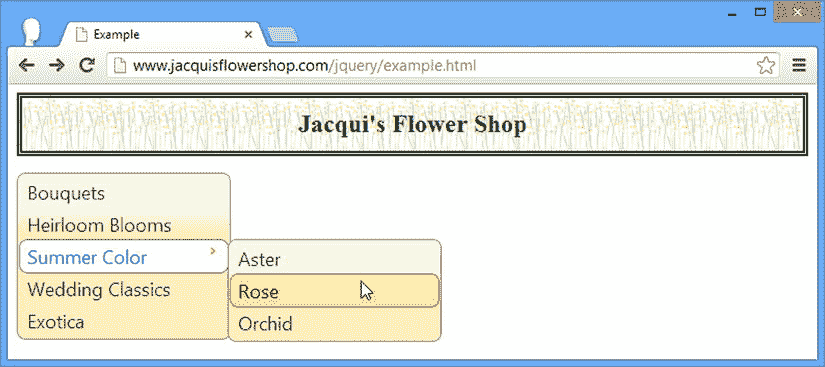

[图 23-1](#_Fig1) 。创建简单的菜单小部件

在图中，您可以看到我是如何打开一个子菜单并将鼠标放在一个已显示的项目上的。这个例子演示了菜单小部件的两个关键特征。首先，菜单总是可见的——它不是一个弹出菜单，而是一个网页中的永久功能，类似于亚马逊展示其顶级产品类别的方式。

第二，菜单小部件保留了它所应用到的元素的结构——菜单项不按名称或任何其他特征排序。你可以在[图 23-1](#Fig1) 中看到，排序被保留了下来，包括子菜单的位置。

 **提示**注意，我已经使用 CSS 将顶层`ul`元素的宽度设置为 200 像素。默认情况下，菜单小部件将填充所有可用的水平空间。

格式化菜单项

除了嵌套子菜单之外，元素结构还可以用于格式化菜单项，创建禁用的项目和相关项目组之间的分隔符。清单 23-2 显示了这两种格式。

***[清单 23-2](#_list2)*** 。通过元素结构格式化菜单

```js
...
<body>
    <h1>Jacqui's Flower Shop</h1>
    <ul id="menu">
        <li><a>Bouquets</a></li>
        <li><a>Heirloom Blooms</a></li>
        <li>-</li>
        <li><a>Summer Color</a>
            <ul>
                <li><a>Aster</a></li>
                <li><a>Rose</a></li>
                <li><a>Orchid</a></li>
            </ul>
        </li>
        <li><a>Wedding Classics</a></li>
        <li>-</li>
        <li class="ui-state-disabled"><a>Exotica</a></li>
    </ul>
</body>
...
```

任何内容全是空格或破折号的元素都被解释为菜单分隔符——我在清单中添加了两个这样的元素。给`ui-state-disabled`类分配一个元素告诉菜单小部件相应的菜单项应该被禁用。你可以在图 23-2 中看到这些添加的结果。

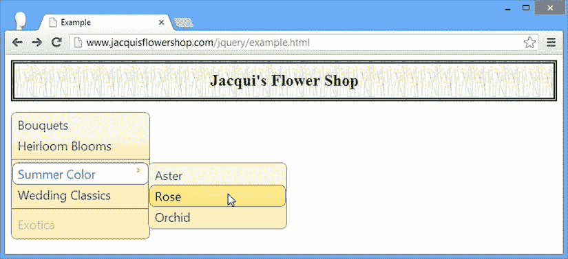

[图 23-2](#_Fig2) 。添加分隔符和禁用菜单项

执行基本导航

菜单小部件的一个常见用途是在组成 web 应用的网页之间提供导航，执行这项任务的最简单方法是在支撑菜单小部件的 HTML 元素结构中的`a`元素上定义`href`属性。当用户选择一个对应于带有`href`属性的`a`元素的菜单项时，浏览器将导航到指定的 URL。在清单 23-3 中，你可以看到我是如何将一个`href`属性添加到一个菜单项元素中的。

***[清单 23-3](#_list3)*** 。向菜单元素添加 href 属性

```js
...
<body>
    <h1>Jacqui's Flower Shop</h1>

    <ul id="menu">
        <li><a>Bouquets</a></li>
        <li><a>Heirloom Blooms</a></li>
        <li>-</li>
        <li><a>Summer Color</a>
            <ul>
                <li><a href="[http://apress.com](http://apress.com">Aster</a></li)">Aster</a></li>
                <li><a>Rose</a></li>
                <li><a>Orchid</a></li>
            </ul>
        </li>
        <li><a>Wedding Classics</a></li>
        <li>-</li>
        <li class="ui-state-disabled"><a>Exotica</a></li>
    </ul>
</body>
...
```

我给其中一个菜单项添加了一个`href`属性，这意味着选择`Summer Color` ➤ `Aster`菜单项将导致浏览器导航到`Apress.com`。

 **提示**并不是所有的菜单都用来在网页间导航。当用户通过处理`select`事件选择一个菜单项时，你可以执行任意的动作，我将在本章后面的*使用菜单事件*一节中对此进行描述。

配置菜单

菜单小部件支持一系列设置，允许您自定义菜单呈现给用户的方式，如[表 23-2](#Tab2) 所述。

[表 23-2](#_Tab2) 。菜单设置

| 环境 | 描述 |
| --- | --- |
| `disabled` | 设置为`true`时，禁用整个菜单 |
| `icons` | 指定要在子菜单上使用的图标 |
| `menus` | 指定用于菜单结构的元素 |
| `position` | 指定子菜单相对于主小工具的位置 |
| `role` | 为可访问性设置自定义 ARIA 角色 |

使用不同的元素结构

虽然使用`ul`、`li`和`a`元素来定义菜单是标准技术，但是菜单小部件可以处理任何有明确定义的父子关系的元素结构。在[清单 23-4](#list4) 中，你可以看到我是如何使用`div`元素重新定义示例菜单的。

***[清单 23-4](#_list4)*** 。为菜单结构使用不同的元素类型

```js
<!DOCTYPE html>
<html>
<head>
    <title>Example</title>
    <script src="jquery-2.0.2.js" type="text/javascript"></script>
    <script src="jquery-ui-1.10.3.custom.js" type="text/javascript"></script>
    <link rel="stylesheet" type="text/css" href="jquery-ui-1.10.3.custom.css"/>
    <link rel="stylesheet" type="text/css" href="styles.css"/>
    <style>
        .ui-menu { width: 200px; }
    </style>
    <script type="text/javascript">
        $(document).ready(function () {
            $("#menu").menu();
        });
    </script>
</head>
<body>
    <h1>Jacqui's Flower Shop</h1>
    <div id="menu">
        <div><a>Bouquets</a></div>
        <div><a>Heirloom Blooms</a></div>
        <div>-</div>
        <div><a>Summer Color</a>
            <div>
                <div><a>Aster</a></div>
                <div><a>Rose</a></div>
                <div><a>Orchid</a></div>
            </div>
        </div>
        <div><a>Wedding Classics</a></div>
        <div>-</div>
        <div><a>Exotica</a></div>
    </div>
</body>
</html>
```

当您想用现有的 HTML 元素制作一个菜单时，这是非常有用的，这些元素通常是从模板中生成的，或者是通过 Ajax 从远程服务器获得的。问题是菜单小工具不知道我的哪个`div`元素代表子菜单，所以我的所有`div`元素都被当作顶级菜单项，如图[图 23-3](#Fig3) 所示。

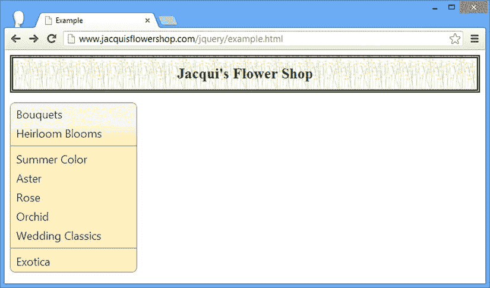

[图 23-3](#_Fig3) 。将所有元素视为菜单项的菜单小部件

我可以通过`menus`属性给菜单小部件关于元素的信息，这个属性被设置为一个选择器，它匹配我想要的子菜单的元素，如[清单 23-5](#list5) 所示。

***[清单 23-5](#_list5)*** 。使用菜单配置属性

```js
<!DOCTYPE html>
<html>
<head>
    <title>Example</title>
    <script src="jquery-2.0.2.js" type="text/javascript"></script>
    <script src="jquery-ui-1.10.3.custom.js" type="text/javascript"></script>
    <link rel="stylesheet" type="text/css" href="jquery-ui-1.10.3.custom.css"/>
    <link rel="stylesheet" type="text/css" href="styles.css"/>
    <style>
        .ui-menu { width: 200px; }
    </style>
    <script type="text/javascript">
        $(document).ready(function () {
            $("#menu").menu({
                menus: "div.subMenu"
            });
        });
    </script>
</head>
<body>
    <h1>Jacqui's Flower Shop</h1>

    <div id="menu">
        <div><a>Bouquets</a></div>
        <div><a>Heirloom Blooms</a></div>
        <div>-</div>
        <div><a>Summer Color</a>
            <div class="subMenu">
                <div><a>Aster</a></div>
                <div><a>Rose</a></div>
                <div><a>Orchid</a></div>
            </div>
        </div>
        <div><a>Wedding Classics</a></div>
        <div>-</div>
        <div><a>Exotica</a></div>
    </div>
</body>
</html>
```

我已经将我想要作为子菜单的`div`元素分配给了`subMenu`类，并在创建菜单小部件时为`menus`属性指定了一个`div.subMenu`选择器。

 **提示**你不必使用一个类，如果你使用了，它也不必被称为`subMenu`。任何匹配您的元素的选择器都可以工作。

在菜单中使用图标

`icons`设置指定了菜单部件用于子菜单的图标，并被设置为我在[第 18 章](18.html)中描述的一个图标的名称。[清单 23-6](#list6) 显示了`icons`设置的使用。

***[清单 23-6](#_list6)*** 。设置子菜单中使用的图标

```js
...
<script type="text/javascript">
    $(document).ready(function () {
        $("#menu").menu({
            menus: "div.subMenu",
            icons: { submenu: "ui-icon-circle-plus" }
        });
    });
</script>
...
```

使用定义了`submenu`属性的对象来设置`icons`属性，该属性又被设置为您想要使用的图标的名称。在清单中，我指定了一个图标，它在一个圆圈中显示一个加号，你可以在[图 23-4](#Fig4) 中看到效果。

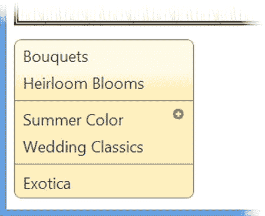

[图 23-4](#_Fig4) 。更改用于子菜单的图标

您可以通过向菜单结构添加`span`元素并使用`class`属性来指定图标名称，来为单个菜单项指定图标，如[清单 23-7](#list7) 所示。

***[清单 23-7](#_list7)*** 。向菜单项添加图标

```js
<!DOCTYPE html>
<html>
<head>
    <title>Example</title>
    <script src="jquery-2.0.2.js" type="text/javascript"></script>
    <script src="jquery-ui-1.10.3.custom.js" type="text/javascript"></script>
    <link rel="stylesheet" type="text/css" href="jquery-ui-1.10.3.custom.css"/>
    <link rel="stylesheet" type="text/css" href="styles.css"/>
    <style>
        .ui-menu { width: 200px; }
    </style>
    <script type="text/javascript">
        $(document).ready(function () {
            $("#menu").menu({
                icons: { submenu: "ui-icon-circle-plus" }
            });
        });
    </script>
</head>
<body>
    <h1>Jacqui's Flower Shop</h1>

    <ul id="menu">
        <li><a>Bouquets</a></li>
        <li><a>Heirloom Blooms</a></li>
        <li>-</li>
        <li><a>Summer Color</a>
            <ul>
                <li><a>Aster</a></li>
                <li><a>Rose</a></li>
                <li><a>Orchid</a></li>
            </ul>
        </li>
        <li>
            <a><span class="ui-icon ui-icon-circle-check"></span>Wedding Classics</a>
        </li>
        <li>-</li>
        <li class="ui-state-disabled"><a>Exotica</a></li>
    </ul>
</body>
</html>
```

`span`元素必须出现在`a`元素中，并被分配给`ui-icon`类*和*代表要显示的图标的类，在本例中为`ui-icon-circle-check`。你可以在[图 23-5](#Fig5) 中看到这种变化的效果。

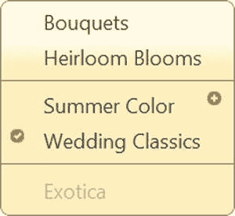

[图 23-5](#_Fig5) 。向菜单项添加图标

定位弹出子菜单

`position`设置决定了弹出菜单出现在哪里，并且使用了我在[第 19 章](19.html)中描述的相同的位置格式。我的建议是允许菜单小部件自动定位子菜单，尤其是因为子菜单的弹出窗口是透明的，当弹出窗口位于父小部件上时，您可以看到底层的菜单结构。在[清单 23-8](#list8) 中，你可以看到用于显示子菜单的`position`设置，这样它们就位于菜单部件的中心。

***[清单 23-8](#_list8)*** 。定位子菜单的弹出窗口

```js
...
<script type="text/javascript">
    $(document).ready(function () {
        $("#menu").menu({
            icons: { submenu: "ui-icon-circle-plus" },
            position: {
                my: "left center",
                at: "center center"
            }
        });
    });
</script>
...
```

在[图 23-6](#Fig6) 中可以看到效果，通过弹出菜单可以看到底层菜单项。

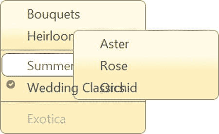

[图 23-6](#_Fig6) 。将子菜单弹出窗口放置在菜单小工具上

使用菜单方法

jQuery UI 菜单小部件支持[表 23-3](#Tab3) 中描述的方法。我不认为这些方法有用，因为它们主要提供了在菜单小部件中驱动导航的方法，这种事情最好留给用户去做。这些方法很容易造成不和谐的用户体验，我建议不要使用它们。

[表 23-3](#_Tab3) 。菜单方式

| 方法 | 描述 |
| --- | --- |
| `menu("blur")` | 将焦点从菜单上移开–触发`blur`事件(将在本章后面描述) |
| `menu("collapse")` | 关闭当前活动的子菜单 |
| `menu("collapseAll")` | 关闭所有打开的子菜单 |
| `menu("destroy")` | 从基础元素中移除菜单小工具 |
| `menu("disable")` | 禁用菜单 |
| `menu("enable")` | 启用菜单 |
| `menu("expand")` | 打开与当前选定菜单项关联的子菜单 |
| `menu("focus")` | 聚焦于菜单项 |
| `menu("isFirstItem")` | 如果当前选择的项目是菜单中的第一项，则返回`true` |
| `menu("isLastItem")` | 如果当前选择的项目是菜单中的最后一项，则返回`true` |
| `menu("next")` | 将焦点移到下一个菜单项 |
| `menu("option")` | 更改一个或多个设置 |
| `menu("previous")` | 将焦点移到上一个菜单项 |
| `menu("refresh")` | 更新菜单以反映基础 HTML 元素中的更改 |
| `menu("select")` | 选择活动菜单项，关闭所有打开的子菜单，并触发 select 事件(将在本章后面介绍) |

很难演示这些方法，因为菜单小部件的行为与当前选择的菜单项紧密相关。例如，试图用按钮控制一个菜单是行不通的，因为点击按钮会把焦点从菜单上移开。我的建议是避免使用这些方法，而依靠标准的用户交互来处理我在下一节中描述的事件。

 **注意**菜单部件还定义了可以滚动的导航菜单的方法，但是在撰写本文时，这个特性还不可靠，所以我从表中省略了这些方法。

使用菜单事件

jQuery UI 菜单小部件支持[表 23-4](#Tab4) 中描述的事件。

[表 23-4](#_Tab4) 。菜单事件

| 事件 | 描述 |
| --- | --- |
| `blur` | 当菜单失去焦点时触发(该事件可以通过调用`blur`方法显式触发) |
| `create` | 创建小部件时触发 |
| `focus` | 当菜单获得焦点和菜单项被激活时触发(该事件可以通过调用`focus`方法显式触发) |
| `select` | 当用户选择菜单项或调用 select 方法时触发 |

在清单 23-9 的[中，您可以看到我是如何使用`blur`和`focus`事件来跟踪用户激活了哪些菜单项，以及使用`select`事件来响应用户对菜单项的点击。](#list9)

***[清单 23-9](#_list9)*** 。从菜单小部件处理模糊、聚焦和选择事件

```js
<!DOCTYPE html>
<html>
<head>
    <title>Example</title>
    <script src="jquery-2.0.2.js" type="text/javascript"></script>
    <script src="jquery-ui-1.10.3.custom.js" type="text/javascript"></script>
    <link rel="stylesheet" type="text/css" href="jquery-ui-1.10.3.custom.css"/>
    <link rel="stylesheet" type="text/css" href="styles.css"/>
    <style>
        .ui-menu { width: 200px; }
    </style>
    <script type="text/javascript">
        $(document).ready(function () {
            $("#menu").menu({
                focus: function (e, ui) {
                    console.log("Focus: " + ui.item.find("a").first().text());
                },
                blur: function () {
                    console.log("Blur");
                },
                select: function (e, ui) {
                    console.log("Select: " + ui.item.find("a").first().text());
                    e.preventDefault();
                }
            });
        });
    </script>
</head>
<body>
    <h1>Jacqui's Flower Shop</h1>

    <ul id="menu">
        <li><a>Bouquets</a></li>
        <li><a>Heirloom Blooms</a></li>
        <li>-</li>
        <li><a>Summer Color</a>
            <ul>
                <li><a href="http://apress.com">Aster</a></li>
                <li><a>Rose</a></li>
                <li><a>Orchid</a></li>
            </ul>
        </li>
        <li><a>Wedding Classics</a></li>
        <li>-</li>
        <li class="ui-state-disabled"><a>Exotica</a></li>
    </ul>
</body>
</html>
```

这三个事件的处理函数都被传递了一个 jQuery 事件对象(我在第 9 章中描述过)和一个额外的`ui`对象，该对象的`item`属性返回一个`jQuery`对象。`jQuery`对象意味着包含事件对应的 HTML 元素，但是在我写这篇文章的时候，这个属性的值没有为`blur`事件正确设置。

考虑到这一点，我通过编写与事件相关的元素所包含的第一个`a`元素的文本内容来处理`focus`和`select`事件，并简单地注意到`blur`事件已经被触发。如果您运行此示例并在菜单中导航，您将看到类似如下的输出:

```js
Focus: Bouquets
Blur
Focus: Heirloom Blooms
Blur
Focus: Summer Color
Select: Summer Color
Blur
Focus: Aster
Blur
Focus: Aster
Select: Aster
Blur
Focus: Aster
Blur
```

我突出显示了写入控制台的一条语句，因为它演示了包含子菜单的项目本身可以被选择——在这种情况下，我能够单击`Summer Color`菜单项，即使它包含子菜单。当`select`方法的处理程序没有考虑到这一点时，这会导致意外的行为。

 **提示**注意，我在处理`select`事件时调用了`preventDefault`方法，以阻止浏览器导航到由`a`元素的`href`属性指定的 URL。

使用 jQuery UI 工具提示小部件

工具提示小部件提供小的弹出窗口，可用于向用户提供有用的上下文信息。工具提示可以是好的或坏的力量。当小心使用时，工具提示可以帮助用户导航一个复杂的过程，但更多时候它们被误用，成为一种干扰或烦恼。

最常见的陷阱是告诉用户一些她已经知道的东西，这样做错过了提供更有用的东西的机会——这在需要复杂数据的 web 表单中最常见。我最近看到的一个例子是在网上报税。税收自然是复杂的，开发人员认为提供工具提示给用户关于每个字段所需数据的信息会很有帮助。这是一种高尚的姿态，但是每个工具提示只是简单地重述了已经从表单标签中明显可见的信息。例如，标签为`Birth Date`的表单的工具提示告诉我“输入你的出生日期”没有提供的是我必须使用的格式——*月/日/年*、*日/月/年*、*年/月/日、*等等。你可以在网上看到这个问题的例子，每一个都代表着失去了一个为用户提供有用见解的机会。一个相关的问题是工具提示阻止用户完成任务。每当我在税单的关键字段格式上又猜错一次时，就会出现一个模糊了`input`元素的工具提示，减缓了我完成这个过程的速度。

我的建议是少用工具提示，仔细考虑它们能给用户带来什么价值。如果你只是简单地重复用户已经拥有的信息，那么重新考虑你的目标。

创建工具提示

jQuery UI tooltip 小部件可以通过`tooltip`方法应用于任何 HTML 元素，并且默认显示`title`属性的内容，如[清单 23-10](#list10) 所示。

 **提示**主流浏览器无论如何都会使用`title`属性来显示工具提示，不需要使用 jQuery UI。tooltip 小部件的优势在于，它允许您将工具提示的样式与应用的其他部分保持一致，控制工具提示的使用方式，以及使用更广泛的内容。

***[清单 23-10](#_list10)*** 。创建工具提示小工具

```js
<!DOCTYPE html>
<html>
<head>
    <title>Example</title>
    <script src="jquery-2.0.2.js" type="text/javascript"></script>
    <script src="jquery-ui-1.10.3.custom.js" type="text/javascript"></script>
    <link rel="stylesheet" type="text/css" href="jquery-ui-1.10.3.custom.css"/>
    <link rel="stylesheet" type="text/css" href="styles.css"/>
    <style>
        [title] { font-weight: bold; font-style:italic }
    </style>
    <scripttype="text/javascript">
        $(document).ready(function () {
            $("[title]").tooltip();
        });
    </script>
</head>
<body class="ui-widget">
    <h1>Jacqui's Flower Shop</h1>

    <h3>Color and Beauty to Your Door</h3>
    <p>We are pleased to announce that we are starting a home delivery service for
    your flower needs. We will deliver within a
    <span title="We are at 200 Main St">20 mile radius</span>
    of the store for free and $1/mile thereafter.</p>
</body>
</html>
```

在这个例子中，我定义了一个具有`title`属性的`span`元素。我选择任何具有`title`属性的元素并调用`tooltip`方法，为了强调哪些元素有工具提示，我定义了一个使用相同选择器的 CSS 样式。结果是 jQuery UI 创建了一个工具提示小部件，当鼠标悬停在`span`元素上时就会显示出来，如图 23-7 中的[所示。](#Fig7)

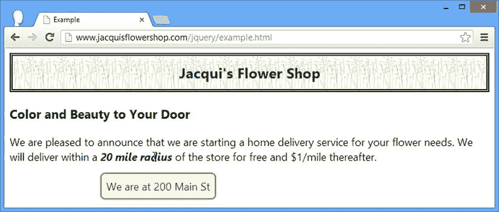

图 23-7 。jQuery UI tooltip

使用带有输入元素的工具提示

当与它们相关的元素获得焦点时，工具提示也会显示出来——这在处理`input`元素时很有用，因为当用户在表单中切换时，工具提示会为每个元素出现。对一个`input`元素应用工具提示和对其他元素一样，如[清单 23-11](#list11) 所示。

***[清单 23-11](#_list11)*** 。将工具提示应用于输入元素

```js
<!DOCTYPE html>
<html>
<head>
    <title>Example</title>
    <script src="jquery-2.0.2.js" type="text/javascript"></script>
    <script src="jquery-ui-1.10.3.custom.js" type="text/javascript"></script>
    <link rel="stylesheet" type="text/css" href="jquery-ui-1.10.3.custom.css"/>
    <link rel="stylesheet" type="text/css" href="styles.css"/>
    <style>
        input { width: 150px; }
    </style>
    <script type="text/javascript">
        $(document).ready(function () {
            $("input").tooltip();
        });
    </script>
</head>
<body class="ui-widget">
    <h1>Jacqui's Flower Shop</h1>
    <div><label>Name:</label><input title="Use lastname, firstname" /></div>
    <div><label>City:</label><input title="Don't include your state" /></div>
</body>
</html>
```

在这个清单中有两个带有`title`属性的`input`元素，你可以在[图 23-8](#Fig8) 中看到跳转元素的效果。

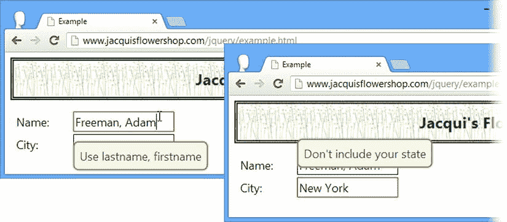

[图 23-8](#_Fig8) 。对输入元素使用工具提示

配置工具提示

工具提示窗口小部件支持一系列设置，允许您自定义窗口小部件呈现给用户的方式，如[表 23-5](#Tab5) 所述，并在接下来的章节中演示。

[表 23-5](#_Tab5) 。工具提示设置

| 环境 | 描述 |
| --- | --- |
| `content` | 设置工具提示的内容，可以表示为 HTML 字符串或函数 |
| `disabled` | 设置为`true`时禁用工具提示 |
| `hide` | 指定隐藏工具提示时如何显示动画——关于 jQuery UI 动画支持的详细信息，参见第 34 章 |
| `items` | 指定可以缩小为其创建工具提示的元素集的选择器 |
| `position` | 指定工具提示相对于其对应元素的位置 |
| `show` | 指定工具提示显示时的动画方式——关于 jQuery UI 动画支持的详细信息，参见第 34 章 |
| `tooltipClass` | 指定工具提示元素将添加到的附加类，允许对不同类型的工具提示(例如，错误)进行样式设置 |
| `track` | 当设置为`true`时，工具提示的位置会随着鼠标在底层 HTML 元素上的移动而改变 |

设置工具提示内容

使用 jQuery UI 工具提示的一个很大的优点是，您可以使用它们来显示丰富的内容，这些内容可以指定为 HTML 的一个片段，也可以通过 JavaScript 函数来指定。你可以在清单 23-12 的[中看到第一个，这里我使用`content`属性来指定一个包含格式的 HTML 片段。](#list12)

***[清单 23-12](#_list12)*** 。使用内容设置显示格式化的内容

```js
<!DOCTYPE html>
<html>
<head>
    <title>Example</title>
    <script src="jquery-2.0.2.js" type="text/javascript"></script>
    <script src="jquery-ui-1.10.3.custom.js" type="text/javascript"></script>
    <link rel="stylesheet" type="text/css" href="jquery-ui-1.10.3.custom.css"/>
    <link rel="stylesheet" type="text/css" href="styles.css"/>
    <style>
        span.toolTip { font-weight: bold; font-style:italic }
    </style>
    <script id="tipContent" type="text/html">
        We are at <b>200</b> Main Street
    </script>
    <script type="text/javascript">
        $(document).ready(function () {
            $("span.toolTip").tooltip({
                content: $("#tipContent").html(),
                items: "span.toolTip"
            });
        });
    </script>
</head>
<body class="ui-widget">
    <h1>Jacqui's Flower Shop</h1>

    <h3>Color and Beauty to Your Door</h3>
    <p>We are pleased to announce that we are starting a home delivery service for
    your flower needs. We will deliver within a
    <span class="toolTip">20 mile radius</span>
    of the store for free and $1/mile thereafter.</p>
</body>
</html>
```

我定义了一个新的`script`元素，但是将`type`属性设置为`text/html`——这样可以防止浏览器将`script`元素的内容视为 JavaScript 或 HTML 内容的一部分。这与用于数据模板的技术是一样的(如[第 12 章](12.html)所述)，但是我的目标只是在文档的主要部分隐藏一个 HTML 片段，直到我需要它的时候。

我使用`content`设置将 HTML 片段传递给工具提示小部件。注意，我必须使用 jQuery 选择包含片段的`script`元素，然后调用`html`方法来获取其内容——工具提示小部件没有很好地集成到 jQuery 中，只会将 HTML 作为一个字符串。

我还不得不使用`items`设置——这是因为我不再使用`title`属性，默认情况下工具提示小部件会查找这个属性。如果没有这个改变，对`tooltip`方法的调用将忽略我的`span`元素。我已经将`span`元素添加到一个名为`toolTip`的类中，并将它作为我为`items`设置提供的选择器的基础。

脚本元素中包含的 HTML 片段被用作工具提示的内容，效果如图 23-9 中的[所示，包括我通过`b`元素添加的适度样式。](#Fig9)


[图 23-9](#_Fig9) 。设置工具提示中内容的样式

 **提示**我在这个例子中展示了格式化的文本，但是您可以使用 jQuery UI 工具提示来显示任何 HTML 内容，包括图像。

用函数生成工具提示内容

我也可以使用函数来指定内容。对于本地生成的工具提示内容，我可以直接从函数中返回一个 HTML 片段，如清单 23-13 所示。

***[清单 23-13](#_list13)*** 。从函数生成工具提示内容

```js
<!DOCTYPE html>
<html>
<head>
    <title>Example</title>
    <script src="jquery-2.0.2.js" type="text/javascript"></script>
    <script src="jquery-ui-1.10.3.custom.js" type="text/javascript"></script>
    <link rel="stylesheet" type="text/css" href="jquery-ui-1.10.3.custom.css"/>
    <link rel="stylesheet" type="text/css" href="styles.css"/>
    <style>
        span.toolTip { font-weight: bold; font-style:italic }
    </style>
    <script type="text/javascript">
        $(document).ready(function () {
            $("span.toolTip").tooltip({
                content: function () {
                    if (this.id == "address") {
                        return "We are at <b>200</b> Main Street";
                    } else {
                        return "Fee capped at <i>$20</i> during June!"
                    }
                },
                items: "span.toolTip"
            });
        });
    </script>
</head>
<body class="ui-widget">
    <h1>Jacqui's Flower Shop</h1>

    <h3>Color and Beauty to Your Door</h3>
    <p>We are pleased to announce that we are starting a home delivery service for
    your flower needs. We will deliver within a
    <span id="address" class="toolTip">20 mile radius</span> of the store for free and
    <span id="maxPrice" class="toolTip">$1/mile thereafter.</span></p>
</body>
</html>
```

在这个例子中，我定义了两个有工具提示的`span`元素，并使用我提供给`content`设置的函数为每个工具提示赋予独特的内容。当函数被调用时，`this`变量的值被设置为触发工具提示内容需求的元素。我使用`id`属性获取`id`属性的值，并根据元素返回不同的 HTML 片段。你可以在图 23-10 中看到结果。

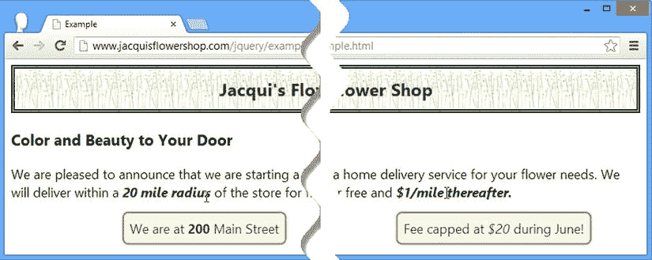

[图 23-10](#_Fig10) 。使用函数生成工具提示内容

获取远程工具提示内容

还可以使用 Ajax 异步获取工具提示内容，并通过回调向 jQuery UI 提供想要显示的片段。为了演示这是如何工作的，我创建了一个名为`tooltips.json`的新 JSON 文件，并将它放在与示例中的其他文件相同的目录中。您可以在[清单 23-14](#list14) 中看到`tooltips.json`文件的内容。

***[清单 23-14](#_list14)*** 。tooltips.json 文件的内容

```js
{"address": "We are at <b>200</b> Main Street",
 "maxPrice": "Fee capped at <i>$20</i> during June!"}
```

在实际的应用中，服务器通常会为给定的元素发回特定的消息，但是为了简单起见，我的 JSON 文件包含了我的示例所需的所有工具提示内容。在清单 23-15 中，您可以看到我如何获得这些数据并使用它们来提供工具提示内容。

***[清单 23-15](#_list15)*** 。获取远程工具提示内容

```js
...
<script type="text/javascript">
    $(document).ready(function () {

        var tooltipData;

        $("span.toolTip").tooltip({
            content: function (callback) {
                if (tooltipData != null) {
                    console.log("Requested serviced locally: " + this.id);
                    return tooltipData[this.id];
                } else {
                    var elemID = this.id;
                    $.getJSON("tooltips.json", function (data) {
                        tooltipData = data;
                        console.log("Requested serviced remotely: " + elemID);
                        callback(tooltipData[elemID]);
                    });
                }
            },
            items: "span.toolTip"
        });
    });
</script>
...
```

假设 JSON 文件包含我需要的所有值，我可以向服务器发出一个请求，然后存储我为后续工具提示检索的数据——这就是示例中的大部分代码所涉及的内容。这个例子中的关键点是，我传递给`getJSON`方法的回调(我在[第 14 章](14.html)中描述过)直到之后的*用于`content`设置的函数完成后才会执行，这意味着我不能简单地返回工具提示的 HTML 片段作为结果。*

相反，我的`content`函数被传递了一个参数，这是一个当我准备好 HTML 片段时要调用的函数。

```js
 ...
content: function (callback) {
...
```

当我的 Ajax 请求完成时，我用我想要显示的数据调用这个函数:

```js
...
callback(tooltipData[elemID]);
...
```

产生的工具提示与前面的例子没有什么区别，但是显示的内容是通过 Ajax 请求获得的。

 **提示**为了完整起见，我已经包含了这个特性，但是你应该小心使用它。工具提示在向用户提供即时反馈时效果最好，如果 Ajax 请求需要一段时间才能完成，这种情况可能不会发生。

给工具提示添加额外的 CSS 类

通过`tooltipClass`设置，您可以指定一个或多个 CSS 类，这些 CSS 类将应用于工具提示以进行自定义样式设置。清单 23-16 提供了一个例子。

***[清单 23-16](#_list16)*** 。使用 tooltipClass 设置

```js
<!DOCTYPE html>
<html>
<head>
    <title>Example</title>
    <script src="jquery-2.0.2.js" type="text/javascript"></script>
    <script src="jquery-ui-1.10.3.custom.js" type="text/javascript"></script>
    <link rel="stylesheet" type="text/css" href="jquery-ui-1.10.3.custom.css"/>
    <link rel="stylesheet" type="text/css" href="styles.css"/>
    <style>
        span.toolTip { font-weight: bold; font-style:italic }
        *.customTip { border-color: red; }
    </style>
    <script type="text/javascript">
        $(document).ready(function () {
            $("span.toolTip").tooltip({
                content: function () {
                    if (this.id == "address") {
                        return "We are at <b>200</b> Main Street";
                    } else {
                        return "Fee capped at <i>$20</i> during June!"
                    }
                },
                items: "span.toolTip",
                tooltipClass: "customTip"
            });
        });
    </script>
</head>
<body class="ui-widget">
    <h1>Jacqui's Flower Shop</h1>
    <h3>Color and Beauty to Your Door</h3>
    <p>We are pleased to announce that we are starting a home delivery service for
    your flower needs. We will deliver within a
    <span id="address" class="toolTip">20 mile radius</span> of the store for free and
    <span id="maxPrice" class="toolTip">$1/mile thereafter.</span></p>
</body>
</html>
```

我为名为`customTip`的类定义了 CSS 样式，并使用`tooltipClass`设置将该类应用于工具提示。我的样式设置了边框的颜色，结果如图[图 23-11](#Fig11) 所示。

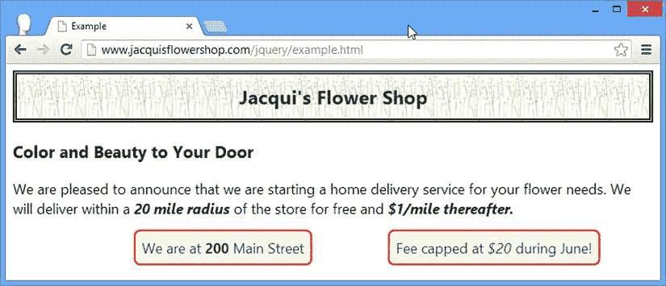

[图 23-11](#_Fig11) 。将自定义类应用于工具提示

jQuery UI 为工具提示生成的 HTML 包括另一个对样式有用的类。以下是为示例中的一个小部件生成的 HTML 示例:

```js
...
<div id="ui-tooltip-3" role="tooltip" class="ui-tooltip ui-widget ui-corner-all
ui-widget-contentcustomTip" style="top: 210.15625px; left: 161px; display: block;">
    <div class="ui-tooltip-content">We are at <b>200</b> Main Street</div>
</div>
...
```

有一个外部的`div`元素，由`tooltipClass`设置指定的类应用于该元素，但是工具提示显示的内容包含在一个内部的`div`元素中，该元素属于`ui-tooltip-content`类。对于高级样式，您可以使用这两个类分别针对小部件及其内容，如[清单 23-17](#list17) 所示。

 **提示**应用于工具提示的其他类，比如`ui-widget`和`ui-corner-all`，都是 jQuery UI CSS 框架的一部分，我在[第 35 章](35.html)中描述过。

***[清单 23-17](#_list17)*** 。分别设计小部件及其内容的样式

```js
...
<style>
    span.toolTip { font-weight: bold; font-style:italic }
    *.customTip { border-color: red; }
    *.ui-tooltip-content { border: thick solid black; margin: 10px; padding: 10px;
                            background-color: white; }
</style>
...
```

你可以在[图 23-12](#Fig12) 中看到这种变化的效果。

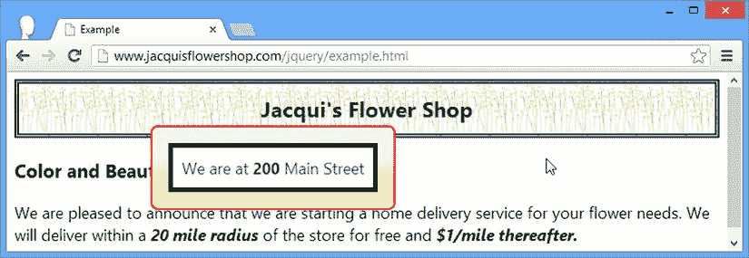

[图 23-12](#_Fig12) 。独立于工具提示本身更改工具提示内容的样式

 **提示**如果你想改变工具提示的背景颜色，你需要在用`tooltipClass`设置指定的类中将`background-image`属性设置为`none`。jQuery UI 小部件背景是使用主题中的图像而不是颜色生成的。

跟踪鼠标

当`track`设置为`true`时，工具提示将跟随鼠标在工具提示对应的 HTML 元素上的移动。当你想根据鼠标的位置改变工具提示的内容，反映底层 HTML 元素的不同区域时，这很有用，如[清单 23-18](#list18) 所示。

***[清单 23-18](#_list18)*** 。用工具提示跟踪鼠标的位置

```js
<!DOCTYPE html>
<html>
<head>
    <title>Example</title>
    <script src="jquery-2.0.2.js" type="text/javascript"></script>
    <script src="jquery-ui-1.10.3.custom.js" type="text/javascript"></script>
    <link rel="stylesheet" type="text/css" href="jquery-ui-1.10.3.custom.css"/>
    <link rel="stylesheet" type="text/css" href="styles.css"/>
    <style>
        span.toolTip { font-weight: bold; font-style:italic }
    </style>
    <script type="text/javascript">
        $(document).ready(function () {
            $("span.toolTip").tooltip({
                content: "Move the mouse",
                items: "span.toolTip",
                track: true
            }).mousemove(function(e) {
                $(this).tooltip("option", "content",
                    "X: " + e.pageX + " Y: " + e.pageY);
            });
        });
    </script>
</head>
<body class="ui-widget">
    <h1>Jacqui's Flower Shop</h1>
    <h3>Color and Beauty to Your Door</h3>
    <p>We are pleased to announce that we are starting a home delivery service for
    your flower needs. We will deliver within a
    <span id="address" class="toolTip">20 mile radius</span> of the store for free and
    <span id="maxPrice" class="toolTip">$1/mile thereafter.</span></p>
</body>
</html>
```

我使用`track`设置启用跟踪鼠标，并为`mousemove`事件设置一个处理函数(如第 9 章中的[所述)，该函数使用`option`方法更新工具提示显示的内容。这是一个你需要亲身经历才能看到正在执行的更新的例子，但是图 23-13](09.html) 显示了新行为的快照。

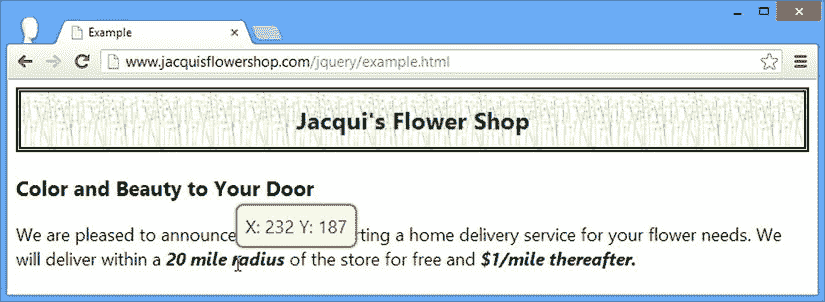

[图 23-13](#_Fig13) 。用工具提示跟踪鼠标的位置

定位工具提示

`position`设置指定了工具提示如何相对于它所对应的元素定位，使用了我在第 19 章中描述的相同格式。你可以在清单 23-19 中看到一个例子。

***[清单 23-19](#_list19)*** 。定位工具提示

```js
<!DOCTYPE html>
<html>
<head>
    <title>Example</title>
    <script src="jquery-2.0.2.js" type="text/javascript"></script>
    <script src="jquery-ui-1.10.3.custom.js" type="text/javascript"></script>
    <link rel="stylesheet" type="text/css" href="jquery-ui-1.10.3.custom.css"/>
    <link rel="stylesheet" type="text/css" href="styles.css"/>
    <style>
        span.toolTip { font-weight: bold; font-style:italic }
    </style>
    <script type="text/javascript">
        $(document).ready(function () {
            $("span.toolTip").tooltip({
                content: function () {
                    if (this.id == "address") {
                        return "We are at <b>200</b> Main Street";
                    } else {
                        return "Fee capped at <i>$20</i> during June!"
                    }
                },
                items: "span.toolTip",
                position: {
                    my: "center bottom",
                    at: "center top"
                }
            });
        });
    </script>
</head>
<body class="ui-widget">
    <h1>Jacqui's Flower Shop</h1>
    <h3>Color and Beauty to Your Door</h3>
    <p>We are pleased to announce that we are starting a home delivery service for
    your flower needs. We will deliver within a
    <span id="address" class="toolTip">20 mile radius</span> of the store for free and
    <span id="maxPrice" class="toolTip">$1/mile thereafter.</span></p>
</body>
</html>
```

我已经使用了`position`设置来指定工具提示应该直接定位在它相关的元素之上，如图 23-14 所示。

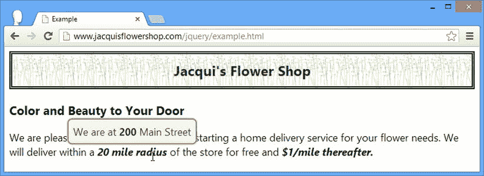

[图 23-14](#_Fig14) 。定位工具提示

使用工具提示方法

jQuery UI 工具提示小部件支持[表 23-6](#Tab6) 中描述的方法。

[表 23-6](#_Tab6) 。工具提示方法

| 方法 | 描述 |
| --- | --- |
| `tooltip("close")` | 关闭工具提示(如果它是打开的) |
| `tooltip("destroy")` | 从基础 HTML 元素中移除工具提示小部件 |
| `tooltip("disable")` | 禁用工具提示，防止其显示 |
| `tooltip("enable")` | 启用工具提示，允许显示它 |
| `tooltip("open")` | 如果工具提示已关闭，则将其打开 |
| `tooltip("option")` | 设置一个配置 选项 |

值得注意的方法是`open`和`close`，它们允许对工具提示进行编程控制。在[清单 23-20](#list20) 中，你可以看到我是如何使用这些方法来显示和隐藏 HTML 文档中包含的所有工具提示的。

***[清单 23-20](#_list20)*** 。使用打开和关闭方法

```js
<!DOCTYPE html>
<html>
<head>
    <title>Example</title>
    <script src="jquery-2.0.2.js" type="text/javascript"></script>
    <script src="jquery-ui-1.10.3.custom.js" type="text/javascript"></script>
    <link rel="stylesheet" type="text/css" href="jquery-ui-1.10.3.custom.css"/>
    <link rel="stylesheet" type="text/css" href="styles.css"/>
    <style>
        span.toolTip { font-weight: bold; font-style:italic }
    </style>
    <script type="text/javascript">
        $(document).ready(function () {
            $("span.toolTip").tooltip({
                content: function () {
                    if (this.id == "address") {
                        return "We are at <b>200</b> Main Street";
                    } else {
                        return "Fee capped at <i>$20</i> during June!"
                    }
                },
                items: "span.toolTip",
                position: {
                    my: "center bottom",
                    at: "center top"
                }
            });
            $("button").button().click(function (e) {
                $("span.toolTip").tooltip(this.id);
            });
        });
    </script>
</head>
<body class="ui-widget">
    <h1>Jacqui's Flower Shop</h1>
    <h3>Color and Beauty to Your Door</h3>
    <p>We are pleased to announce that we are starting a home delivery service for
    your flower needs. We will deliver within a
    <span id="address" class="toolTip">20 mile radius</span> of the store for free and
    <span id="maxPrice" class="toolTip">$1/mile thereafter.</span></p>
    <div>
        <button id="open">Open</button>
        <button id="close">Close</button>
    </div>
</body>
</html>
```

你可以在[图 23-15](#Fig15) 中看到效果。

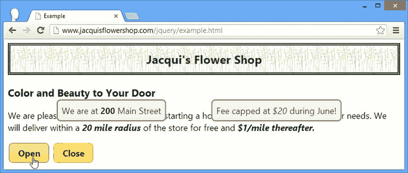

[图 23-15](#_Fig15) 。以编程方式显示和隐藏工具提示

使用工具提示事件

jQuery UI 工具提示小部件支持[表 23-7](#Tab7) 中描述的事件。

[表 23-7](#_Tab7) 。工具提示事件

| 事件 | 描述 |
| --- | --- |
| `close` | 工具提示关闭时触发 |
| `create` | 应用小部件时触发 |
| `open` | 当工具提示显示时触发 |

我已经演示了清单 23-21 中的`open`和`close`事件。处理函数被传递了一个 jQuery 事件对象(如第 9 章所述)和一个额外的`ui`对象，该对象的`tooltip`属性返回一个包含工具提示元素的`jQuery`对象。

***[清单 23-21](#_list21)*** 。处理打开和关闭事件

```js
<!DOCTYPE html>
<html>
<head>
    <title>Example</title>
    <script src="jquery-2.0.2.js" type="text/javascript"></script>
    <script src="jquery-ui-1.10.3.custom.js" type="text/javascript"></script>
    <link rel="stylesheet" type="text/css" href="jquery-ui-1.10.3.custom.css"/>
    <link rel="stylesheet" type="text/css" href="styles.css"/>
    <style>
        span.toolTip { font-weight: bold; font-style:italic }
        span.active { border: medium solid red; padding: 10px; background-color: white }
    </style>
    <script type="text/javascript">
        $(document).ready(function () {
            $("span.toolTip").tooltip({
                content: function () {
                    if (this.id == "address") {
                        return "We are at <b>200</b> Main Street";
                    } else {
                        return "Fee capped at <i>$20</i> during June!"
                    }
                },
                items: "span.toolTip",
                open: function (e, ui) {
                    $(this).toggleClass("active");
                },
                close: function (e, ui) {
                    $(this).toggleClass("active");
                }
            });
        });
    </script>
</head>
<body class="ui-widget">
    <h1>Jacqui's Flower Shop</h1>
    <h3>Color and Beauty to Your Door</h3>
    <p>We are pleased to announce that we are starting a home delivery service for
    your flower needs. We will deliver within a
    <span id="address" class="toolTip">20 mile radius</span> of the store for free and
    <span id="maxPrice" class="toolTip">$1/mile thereafter.</span></p>
</body>
</html>
```

在这个例子中，我通过在与工具提示相关的元素上切换一个名为`active`的 CSS 类来处理`open`和`close`事件(可通过`this`变量获得)。效果是当工具提示显示时，该元素被高亮显示，如图[图 23-16](#Fig16) 所示。

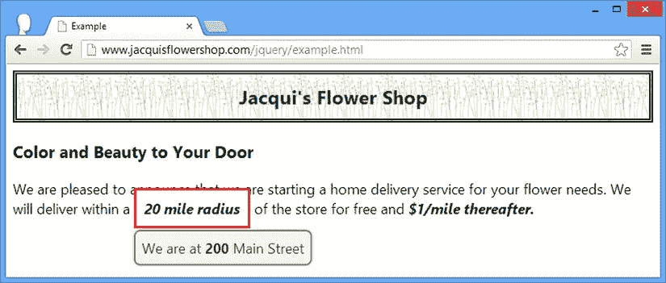

[图 23-16](#_Fig16) 。处理打开和关闭事件

摘要

在本章中，我已经向您展示了 jQuery UI 菜单和工具提示小部件是如何工作的。按照与其他小部件章节相同的格式，我将重点放在这些小部件支持的设置、方法和事件上。在第 24 章中，我描述了第一个 jQuery UI 交互。