# 二十四、使用拖放交互

除了我在第十八章–第二十三章中展示的小部件，jQuery UI 还包括一组*交互*。这些是较低级别的构建块，允许您向 web 应用界面添加功能。在这一章中，我描述了*可拖动的*和*可放下的*交互，你可以用它们在 HTML 文档中添加拖放操作。

交互遵循与小部件相同的基本结构。它们有设置、方法和事件。我将遵循相同的模式来描述交互，但是我将稍微跳跃一下，以适应一些交互的独特性质。

使用截屏很难显示应用交互的效果。顾名思义，它们依赖于相互作用。我试图告诉你正在发生的事情的本质，但是要真正理解交互，你应该在浏览器中进行实验。本章中的所有例子(以及其他章节)都包含在 Apress 网站(`www.apress.com`)的免费源代码/下载区中。表 24-1 对本章进行了总结。

表 24-1 。章节总结

| 问题 | 解决办法 | 列表 |
| --- | --- | --- |
| 应用可拖动交互 | 使用`draggable`方法 | one |
| 约束元素可以拖动的方向 | 使用`axis`设置 | Two |
| 限制可以拖动元素的区域 | 使用`containment`设置 | three |
| 限制拖动到网格中的单元格 | 使用`grid`设置 | four |
| 延迟拖动一段时间或多个像素 | 使用`delay`和`distance`设置 | five |
| 响应被拖动的元素 | 使用`start`、`drag`和`stop`事件 | six |
| 应用可拖放的交互 | 使用`droppable`方法 | seven |
| 拖动元素时高亮显示可拖放的元素 | 使用`activate`和`deactivate`事件 | eight |
| 当可拖动元素与可放下元素重叠时响应 | 使用`over`和`out`事件 | nine |
| 指定可拖放元素将接受哪些可拖动元素 | 使用`accept`设置 | Ten |
| 当拖动开始或重叠时，自动将 CSS 类应用于可拖放的元素 | 使用`activeClass`和`hoverClass`设置 | Eleven |
| 改变触发`over`事件的重叠量 | 使用`tolerance`设置 | Twelve |
| 创建兼容的可拖放元素组 | 使用`scope`设置 | Thirteen |
| 在拖动期间和之后，将可拖动元素留在原位 | 使用`helper`设置 | 14, 15 |
| 操纵 helper 元素以响应可拖放事件 | 使用`ui.helper`属性 | Sixteen |
| 强制可拖动元素与其他元素的边缘对齐 | 使用`snap`、`snapMode`和`snapTolerance`设置 | Seventeen |

创建可拖动的交互

应用了`draggable`交互的元素可以在浏览器窗口中移动(拖动)。该元素正常情况下出现在初始文档布局中，但是如果用户在可拖动元素上按住指针并移动鼠标，该元素的位置会发生变化。清单 24-1 提供了一个可拖动交互的演示。

***清单 24-1*** 。使用可拖动交互

```js
<!DOCTYPE html>
<html>
<head>
    <title>Example</title>
    <script src="jquery-2.0.2.js" type="text/javascript"></script>
    <script src="jquery-ui-1.10.3.custom.js" type="text/javascript"></script>
    <link rel="stylesheet" type="text/css" href="styles.css"/>
    <link rel="stylesheet" type="text/css" href="jquery-ui-1.10.3.custom.css"/>
    <style type="text/css">
        #draggable {font-size: x-large; border: thin solid black;
            width: 5em; text-align: center}
    </style>
    <script type="text/javascript">
        $(document).ready(function() {
            $("#draggable").draggable();
        });
    </script>
</head>
<body>
    <h1>Jacqui's Flower Shop</h1>
    <div id="draggable">
        Drag me
    </div>
</body>
</html>
```

在清单 24-1 中，我选择了一个`div`元素并调用了`draggable`方法来创建一个可拖动的元素。如图 24-1 所示，元素从它的常规位置开始，但是可以被拖动到浏览器窗口的任何地方。注意，文档中的另一个元素`h1`不受`draggable`方法的影响。

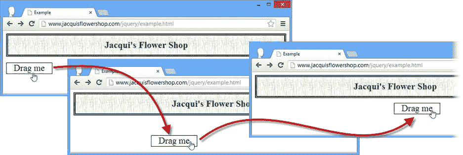

图 24-1 。在浏览器窗口中拖动元素

 **提示**能够拖动元素本身就很有用，但是当与可拖放的交互结合起来时，它会变得更加强大，我将在本章的后面描述这一点。

可拖动的交互是使用一些巧妙的 HTML 和 CSS 实现的。这意味着它几乎可以在任何浏览器中工作，但也意味着可拖动的元素不能与用户操作系统实现的本地拖放进行交互。

 **提示** HTML5 包括对拖放的支持，通常使用本地操作系统机制来实现。我在我的书*HTML5*中提供了 html 5 拖放的细节和例子，这本书也是由 Apress 出版的。如果您使用的是 jQuery UI 拖放机制，我建议禁用 HTML5 等价物以避免混淆。为此，将文档中的`body`元素的`draggable`属性设置为`false`。

配置可拖动交互

有很多方法可以配置可拖动交互。表 24-2 总结了可用的最重要的设置，我将在接下来的章节中演示。

表 24-2 。可拖动设置

| 环境 | 描述 |
| --- | --- |
| `axis` | 将拖动限制在特定方向。默认为`false`，表示没有限制，但是您也可以指定`x`(x 轴)和`y`(y 轴)。 |
| `containment` | 将可拖动元素限制在屏幕的某个区域。支持的值范围详见表 24-3 。默认为`false`，表示没有限制。 |
| `delay` | 指定用户在元素移动之前必须拖动元素的持续时间。默认为`0`，表示没有延迟。 |
| `distance` | 指定用户在元素移动之前必须从其初始位置拖动的距离。默认为`1`像素。 |
| `grid` | 强制可拖动元素与网格对齐。缺省值是`false`，意味着不使用网格。 |

 **提示**在本章后面的*调整拖动&放下*部分，我描述了一些改变可拖动和可放下元素之间关系的附加设置。

约束拖曳轴

有几种方法可以约束元素的拖动方式。第一种是使用`axis`设置，它允许您将拖动限制在 x 轴或 y 轴。清单 24-2 提供了一个例子。

***清单 24-2*** 。使用轴设置来约束拖动

```js
<!DOCTYPE html>
<html>
<head>
    <title>Example</title>
    <script src="jquery-2.0.2.js" type="text/javascript"></script>
    <script src="jquery-ui-1.10.3.custom.js" type="text/javascript"></script>
    <link rel="stylesheet" type="text/css" href="styles.css"/>
    <link rel="stylesheet" type="text/css" href="jquery-ui-1.10.3.custom.css"/>
    <style type="text/css">
        div.dragElement {font-size: large; border: thin solid black;
            width: 5em; text-align: center; background-color: lightgray; margin: 4px }
    </style>
    <script type="text/javascript">
        $(document).ready(function() {

            $(".dragElement").draggable({
                axis: "x"
            }).filter("#dragV").draggable("option", "axis", "y");

        });
    </script>
</head>
<body>
    <h1>Jacqui's Flower Shop</h1>
    <div id="dragV" class="dragElement">
        Drag Vertically
    </div>
    <div id="dragH" class="dragElement">
        Drag Horizontally
    </div>
</body>
</html>
```

在清单 24-2 中，我定义了两个`div`元素，用 jQuery 选择它们，并调用`draggable`方法。我使用 settings 对象最初为两个`div`元素定义一个值`x`，然后使用 jQuery `filter`方法选择`dragV`元素，这样我就可以更改`y`设置，而不必让 jQuery 再次搜索整个文档。结果是一个`div`元素可以垂直拖动，另一个可以水平拖动。你可以在图 24-2 中看到效果。

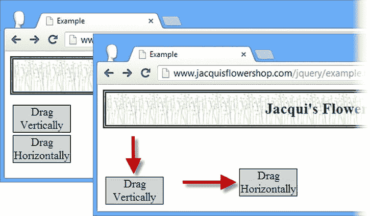

图 24-2 。约束元素可以拖动的方向

约束拖动区域

您可以限制可以拖动元素的屏幕区域。你可以通过`containment`设置来实现。如表 24-3 所述，该设置可以使用多种格式进行设置。

表 24-3 。安全壳设置值

| 价值 | 描述 |
| --- | --- |
| 选择器 | 当指定选择器字符串时，可拖动的元素被约束为第一个匹配元素所占据的区域 |
| `HTMLElement` | 可拖动元素被约束到由指定元素占据的区域 |
| `string` | 您可以指定值`parent`、`document`和`window`来限制拖动 |
| 数字数组 | 您可以使用格式为`[x1, y1, x2, y2]`的数字数组来限制拖动到一个区域 |

清单 24-3 显示了`containment`设置的使用。

***清单 24-3*** 。使用密封设置

```js
<!DOCTYPE html>
<html>
<head>
    <title>Example</title>
    <script src="jquery-2.0.2.js" type="text/javascript"></script>
    <script src="jquery-ui-1.10.3.custom.js" type="text/javascript"></script>
    <link rel="stylesheet" type="text/css" href="styles.css"/>
    <link rel="stylesheet" type="text/css" href="jquery-ui-1.10.3.custom.css"/>
    <style type="text/css">
        div.dragElement {font-size: large; border: thin solid black; padding: 4px;
            width: 5em; text-align: center; background-color: lightgray; margin: 4px }
        #container { border: medium double black; width: 400px; height: 150px}
    </style>
    <script type="text/javascript">
        $(document).ready(function() {
            $(".dragElement").draggable({
                containment: "parent"
            }).filter("#dragH").draggable("option", "axis", "x");

        });
    </script>
</head>
<body>
    <h1>Jacqui's Flower Shop</h1>
    <div id="container">
        <div id="dragH" class="dragElement">
            Drag Horizontally
        </div>
        <div class="dragElement">
            Drag within Parent
        </div>
    </div>
</body>
</html>
```

在清单 24-3 中，我约束了两个`div`元素，使它们只能在它们的父元素中拖动，父元素是一个固定大小的`div`元素。对于其中一个可拖动的`div`元素，我还应用了`axis`设置，这意味着它只能在父元素中水平拖动。你可以在图 24-3 中看到结果。

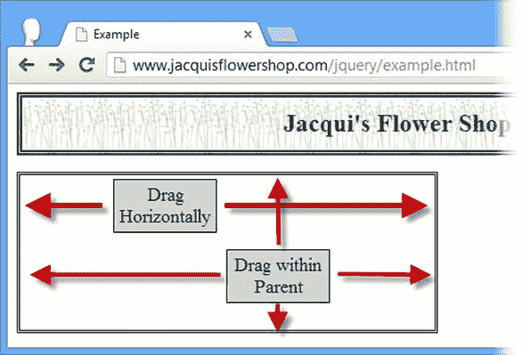

图 24-3 。限制拖动到父元素

约束拖动到网格

网格设置可用于使可拖动元素在拖动时与网格对齐。此设置的值是一个双元素数组，以像素为单位指定网格的宽度和高度。清单 24-4 显示了正在使用的网格设置。

***清单 24-4*** 。使用网格设置

```js
<!DOCTYPE html>
<html>
<head>
    <title>Example</title>
    <script src="jquery-2.0.2.js" type="text/javascript"></script>
    <script src="jquery-ui-1.10.3.custom.js" type="text/javascript"></script>
    <link rel="stylesheet" type="text/css" href="styles.css"/>
    <link rel="stylesheet" type="text/css" href="jquery-ui-1.10.3.custom.css"/>
    <style type="text/css">
        #draggable {font-size: large; border: thin solid black; padding: 4px;
            width: 100px; text-align: center; background-color: lightgray; margin: 4px; }
    </style>
    <script type="text/javascript">
        $(document).ready(function() {
            $("#draggable").draggable({
                grid: [100, 50]
            })
        });
    </script>
</head>
<body>
    <h1>Jacqui's Flower Shop</h1>
    <div id="draggable">
        Drag Me
    </div>
</body>
</html>
```

在清单 24-4 中，我指定了一个网格，其中的单元格宽 100 像素，高 50 像素。当你拖动元素时，它会从一个(不可见的)单元格快速移动到下一个，如图图 24-4 所示。

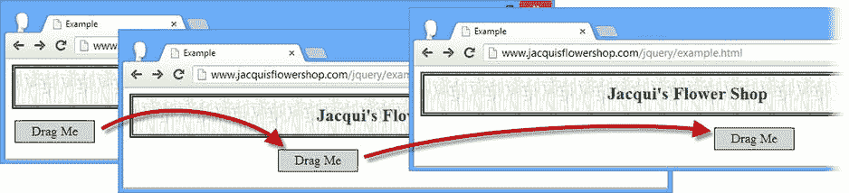

图 24-4 。拖动带有网格的元素

捕捉效果很难在屏幕截图中表现出来，这是一个特别受益于交互的例子。

 **提示**只需将自由运动轴的值指定为 1，就可以在一个方向上捕捉到网格。例如，设置值`[100, 1]`强制可拖动元素沿 x 轴对齐 100 个像素单元，但允许沿 y 轴自由移动。

延迟拖动

有两种设置允许您延迟拖动动作。您可以使用`delay`设置来指定一个时间间隔，这样用户在元素开始移动之前必须拖动元素几毫秒。您也可以使用`distance`设置，它强制用户在元素开始跟随鼠标之前进行一定数量的像素的拖动动作。清单 24-5 显示了正在使用的两种设置。

***清单 24-5*** 。使用延迟和距离设置

```js
<!DOCTYPE html>
<html>
<head>
    <title>Example</title>
    <script src="jquery-2.0.2.js" type="text/javascript"></script>
    <script src="jquery-ui-1.10.3.custom.js" type="text/javascript"></script>
    <link rel="stylesheet" type="text/css" href="styles.css"/>
    <link rel="stylesheet" type="text/css" href="jquery-ui-1.10.3.custom.css"/>
    <style type="text/css">
        #time, #distance {font-size: large; border: thin solid black; padding: 4px;
            width: 100px; text-align: center; background-color: lightgray; margin: 4px; }
    </style>
    <script type="text/javascript">
        $(document).ready(function() {
            $("#time").draggable({
                delay: 1000
            })

            $("#distance").draggable({
                distance: 150
            })
        });
    </script>
</head>
<body>
    <h1>Jacqui's Flower Shop</h1>
    <div id="time">Time Delay</div>
    <div id="distance">Distance</div>
</body>
</html>
```

在清单 24-5 中我有两个可拖动的`div`元素，其中一个我用`delay`设置配置，另一个用`distance`设置配置。当使用`delay`时，在元素开始移动之前，用户必须继续拖动指定的毫秒数。在本例中，这是 1000 毫秒。用户不必在这段时间内一直移动鼠标，但必须在整个时间内按住鼠标按钮，并且必须移动鼠标才能开始拖动过程。当时间跨度过去后，可拖动的元素将捕捉到鼠标指针的位置，受我前面展示的网格、区域和轴的约束。

`distance`设置有类似的效果，但是用户必须将鼠标指针从元素的起点向任意方向移动至少指定数量的像素。当鼠标移动到那个距离时，可拖动的元素将会吸附到当前的鼠标位置。


使用可拖动方法

可拖动的交互只定义了您看到的由小部件实现的一组核心方法。没有可拖动的特定方法。表 24-4 描述了那些可用的。

表 24-4 。可拖动方法

| 方法 | 描述 |
| --- | --- |
| `draggable("destroy")` | 从元素中移除交互 |
| `draggable("disable")` | 禁用了可拖动交互 |
| `draggable("enable")` | 启用可拖动交互 |
| `draggable("option")` | 更改一个或多个设置 |

使用可拖动事件

可拖动交互支持一组简单的事件，当元素被拖动时，这些事件会通知您。表 24-5 描述了这些事件。

表 24-5 。可拖动事件

| 事件 | 描述 |
| --- | --- |
| `create` | 当可拖动交互应用于元素时触发 |
| `start` | 拖动开始时触发 |
| `drag` | 拖动过程中鼠标移动时触发 |
| `stop` | 拖动停止时触发 |

您可以像处理小部件事件一样响应交互事件。清单 24-6 演示了如何处理`start` 和`stop`事件。

***清单 24-6*** 。使用可拖动的开始和停止事件

```js
<!DOCTYPE html>
<html>
<head>
    <title>Example</title>
    <script src="jquery-2.0.2.js" type="text/javascript"></script>
    <script src="jquery-ui-1.10.3.custom.js" type="text/javascript"></script>
    <link rel="stylesheet" type="text/css" href="styles.css"/>
    <link rel="stylesheet" type="text/css" href="jquery-ui-1.10.3.custom.css"/>
    <style type="text/css">
        #draggable {font-size: large; border: thin solid black; padding: 4px;
            width: 100px; text-align: center; background-color: lightgray; margin: 4px; }
    </style>
    <script type="text/javascript">
        $(document).ready(function() {
            $("#draggable").draggable({
                start: function() {
                    $("#draggable").text("Dragging...")
                },
                stop: function() {
                    $("#draggable").text("Drag Me")
                }
            })
        });
    </script>
</head>
<body>
    <h1>Jacqui's Flower Shop</h1>
    <div id="draggable">
        Drag Me
    </div>
</body>
</html>
```

在清单 24-6 中，我使用`start`和`stop`事件来改变元素被拖动时的内容。这是使用 HTML 和 CSS 实现可拖动交互(以及所有其他 jQuery UI 交互)的好处:即使可拖动元素在屏幕上移动，也可以使用 jQuery 来修改它。你可以在图 24-5 中看到这个例子产生的效果。

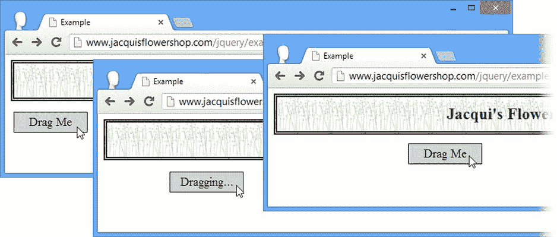

图 24-5 。使用可拖动事件在元素被拖动时修改元素

使用可拖放的交互

当你把可拖动的交互和可放下的交互结合起来时，它的真正效用就出现了。您使用`droppable`方法创建可删除的元素，但是要获得真正的功能，您需要为交互定义的事件提供处理函数。表 24-6 描述了可用的事件。

表 24-6 。可丢弃事件

| 事件 | 描述 |
| --- | --- |
| `create` | 应用可拖放交互时触发 |
| `activate` | 当用户开始拖动可拖动元素时触发 |
| `deactivate` | 当用户停止拖动可拖动元素时触发 |
| `over` | 当用户将可拖动元素拖动到可放下元素上时触发(但尚未释放鼠标按钮) |
| `out` | 当用户将可拖动元素拖出可拖放元素时触发 |
| `drop` | 当用户将可拖动的元素放到可放下的元素上时触发 |

你可以用`drop`事件创建一个基本的可删除元素，如清单 24-7 所示。

***清单 24-7*** 。创建一个基本的可拖放交互

```js
<!DOCTYPE html>
<html>
<head>
    <title>Example</title>
    <script src="jquery-2.0.2.js" type="text/javascript"></script>
    <script src="jquery-ui-1.10.3.custom.js" type="text/javascript"></script>
    <link rel="stylesheet" type="text/css" href="styles.css"/>
    <link rel="stylesheet" type="text/css" href="jquery-ui-1.10.3.custom.css"/>
    <style type="text/css">
        #draggable, #droppable {font-size: large; border: thin solid black; padding: 4px;
            width: 100px; text-align: center; background-color: lightgray; margin: 4px;}
        #droppable {padding: 20px; position: absolute; left: 5px; bottom: 5px}
    </style>
    <script type="text/javascript">
        $(document).ready(function() {
            $("#draggable").draggable();

            $("#droppable").droppable({
                drop: function() {
                    $("#draggable").text("Dropped")
                }
            });
        });
    </script>
</head>
<body>
    <h1>Jacqui's Flower Shop</h1>
    <div id="droppable">
        Drop Here
    </div>
    <div id="draggable">
        Drag Me
    </div>
</body>
</html>
```

我添加了一个文本内容为`Drop Here`的`div`元素。我使用 jQuery 选择这个元素并调用 droppable 方法，传入一个为`drop`事件定义处理程序的 settings 对象。为了响应这个方法，我使用`text`方法更改了可拖动元素的文本。清单 24-7 创建了最乏味的拖放交互，但是它也提供了一个有用的基础来解释可拖动和可放下交互可以一起使用的方式。你可以在图 24-6 中看到这个例子的不同阶段。

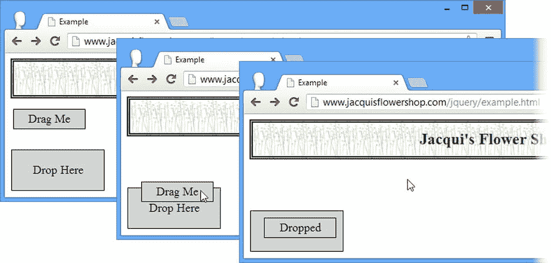

图 24-6 。使用简单的拖放操作

这是非常基本的东西。我将可拖动的元素拖到可放下的元素上，然后放开。可拖动元素保持在我离开它的地方，并且它的文本内容被改变以响应`drop`事件。在接下来的小节中，我将向您展示如何使用其他可拖放事件来改善体验。

突出显示拖放目标

当用户开始拖动动作时，您可以使用`activate` 和`deactivate`事件来突出显示拖放目标。这通常是一个好主意，因为它给用户一个清晰的信号，告诉用户哪些元素是拖放模型的一部分。清单 24-8 提供了一个例子。

***清单 24-8*** 。响应激活和去激活事件

```js
...
<script type="text/javascript">
    $(document).ready(function() {
        $("#draggable").draggable();

        $("#droppable").droppable({
            drop: function() {
                $("#draggable").text("Dropped");
            },
            activate: function() {
                $("#droppable").css({
                    border: "medium double green",
                    backgroundColor: "lightGreen"
                });
            },
            deactivate: function() {
                $("#droppable").css("border", "").css("background-color", "");
            }
        });
    });
</script>
...
```

当用户开始拖动元素时，我的可拖放元素触发激活事件，我的处理函数使用`css`方法为 CSS `border`和`background-color`属性应用新值。这使得放置目标变亮，向用户表明可放置的元素与被拖动的元素有关系。我使用`deactivate`事件移除 CSS 属性值，并在用户释放鼠标按钮时将可放置的元素返回到其原始状态。(无论用户是否将可拖动的元素放到了可放下的元素上，只要拖动停止，就会触发此事件。)你可以在图 24-7 中看到效果。

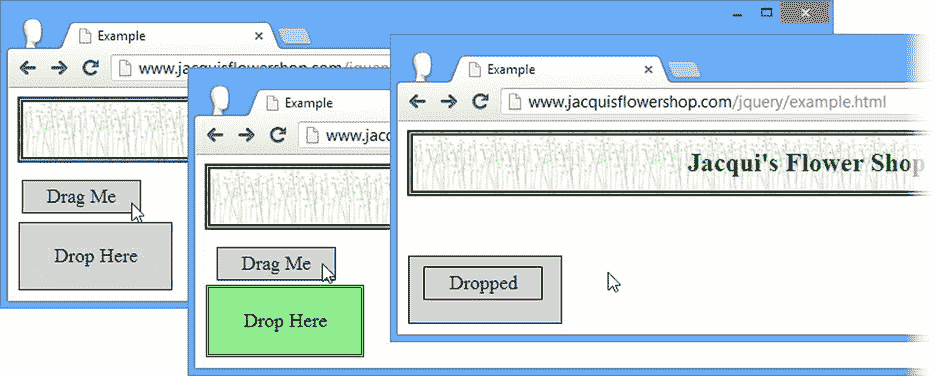

图 24-7 。使用激活和停用事件

处理重叠元素

您可以通过处理`over` 和`out`事件来改进您的拖放技术。当可拖动元素的 50%位于可放下元素的任何部分时，触发`over`事件。当元素不再重叠时，触发`out`事件。清单 24-9 显示了如何对这些事件做出响应。

***清单 24-9*** 。使用超出和超出事件

```js
...
<script type="text/javascript">
    $(document).ready(function() {
        $("#draggable").draggable();

        $("#droppable").droppable({
            drop: function() {
                $("#draggable").text("Dropped");
            },
            over: function() {
                $("#droppable").css({
                    border: "medium double green",
                    backgroundColor: "lightGreen"
                });
            },
            out: function() {
                $("#droppable").css("border", "").css("background-color", "");
            }
        });
    });
</script>
...
```

我使用了与前一个例子相同的事件处理函数，但是我将它们与`over`和`out`事件相关联。当可拖放元素至少有 50%与可拖动元素重叠时，可拖放元素将显示边框和背景色，如图图 24-8 所示。

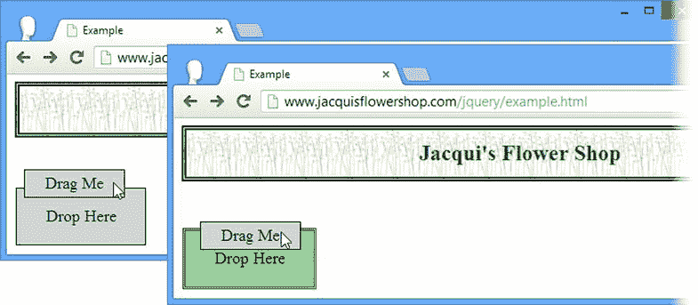

图 24-8 。响应过度和过度事件

 **提示**50%的限制被称为*容差*，您可以用不同的容差配置可删除的元素，正如我在“更改重叠容差”一节中演示的那样

配置可拖放的交互

我在这一部分打破了通常的模式，因为这些事件对可丢弃的交互是如此重要。当然，这种交互有许多设置可以用来改变它的行为方式，这些在表 24-7 中有描述。

表 24-7 。可删除的设置

| 环境 | 描述 |
| --- | --- |
| `disabled` | 当`true`时，交互最初被禁用。默认为`false`。 |
| `accept` | 缩小可拖放元素将响应的可拖动元素。默认为`*`，匹配所有元素。 |
| `activeClass` | 指定将在响应`activate`事件时应用并在响应`deactivate`事件时移除的类。 |
| `hoverClass` | 指定将在响应`over`事件时应用并在响应`out`事件时移除的类。 |
| `tolerance` | 指定在触发`on`事件之前必须发生的重叠量。 |

 **提示**在“调整拖放”一节中，我描述了一些改变可拖放元素之间关系的附加设置。

限制可接受的可拖动元素

您可以通过应用`accept`设置来限制您希望通过可拖放交互接收的元素集。通过提供一个选择器作为值来使用`accept`设置。当一个可拖动的元素与选择器匹配时，这样做的效果是只触发可放下的事件。清单 24-10 提供了一个例子。

***清单 24-10*** 。限制可接受的元素

```js
<!DOCTYPE html>
<html>
<head>
    <title>Example</title>
    <script src="jquery-2.0.2.js" type="text/javascript"></script>
    <script src="jquery-ui-1.10.3.custom.js" type="text/javascript"></script>
    <link rel="stylesheet" type="text/css" href="styles.css"/>
    <link rel="stylesheet" type="text/css" href="jquery-ui-1.10.3.custom.css"/>
    <style type="text/css">
        .draggable, #droppable {font-size: large; border: thin solid black; padding: 4px;
            width: 100px; text-align: center; background-color: lightgray; margin: 4px;}
        #droppable {padding: 20px; position: absolute; left: 5px; bottom: 5px}
    </style>
    <script type="text/javascript">
        $(document).ready(function() {
            $(".draggable").draggable();

            $("#droppable").droppable({
                drop: function(event, ui) {
                    ui.draggable.text("Dropped");
                },
                activate: function() {
                    $("#droppable").css({
                        border: "medium double green",
                        backgroundColor: "lightGreen"
                    });
                },
                deactivate : function() {
                    $("#droppable").css("border", "").css("background-color", "");
                },
                accept: "#drag1"
            });
        });
    </script>
</head>
<body>
    <h1>Jacqui's Flower Shop</h1>
    <div id="droppable">
        Drop Here
    </div>
    <div id="drag1" class="draggable">
        Drag 1
    </div>
    <div id="drag2" class="draggable">
        Drag 2
    </div>
</body>
</html>
```

本例中有两个可拖动的元素，id 分别为`drag1`和`drag2`。在创建可拖放元素时，我使用了`accept`设置来指定只接受`drag1`元素。当`drag1`元素被拖动时，你会看到与上一个例子相同的效果。`activate`、`deactivate`、`over`、`out`和`drop`事件都在适当的时刻触发。然而，当您拖动`drag2`元素时，它无法匹配我为 accept 设置指定的选择器，并且这些事件不会触发。我仍然可以拖动元素，但是我不能再把它放到可拖放的元素上。你可以在图 24-9 中看到效果。

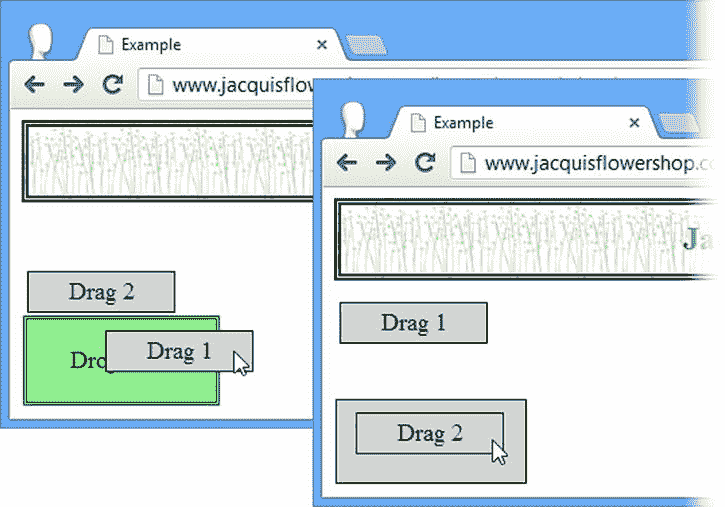

图 24-9 。使用接受设置

注意，我改变了选择拖放元素的方式，这样我就可以调用`text`方法。当文档中只有一个可拖动元素时，我只使用了`id`属性，如下所示:

```js
...
$("#draggable").text("Dropped");
...
```

在这个例子中，有多个可拖动的元素，所以通过`id`选择不会起作用，因为我将总是改变同一个元素上的文本，而不管哪个元素被拖放。相反，我使用了`ui`对象，jQuery UI 将它作为事件处理函数的附加参数。`ui`对象的 draggable 属性返回一个 jQuery 对象，该对象包含用户正在拖动或已经放下的元素，允许我如下定位该元素:

```js
...
ui.draggable.text("Dropped");
...
```

使用类突出显示可删除的

您可以使用`activeClass` 和`hoverClass`设置 来更改可拖放元素的外观，而无需使用`activate`、`deactivate`、`over`和`out`事件。清单 24-11 提供了一个演示。

***清单 24-11*** 。使用 activeClass 和 hoverClass 设置

```js
<!DOCTYPE html>
<html>
<head>
    <title>Example</title>
    <script src="jquery-2.0.2.js" type="text/javascript"></script>
    <script src="jquery-ui-1.10.3.custom.js" type="text/javascript"></script>
    <link rel="stylesheet" type="text/css" href="styles.css"/>
    <link rel="stylesheet" type="text/css" href="jquery-ui-1.10.3.custom.css"/>
    <style type="text/css">
        .draggable, #droppable {font-size: large; border: thin solid black; padding: 4px;
            width: 100px; text-align: center; background-color: lightgray; margin: 4px;}
        #droppable {padding: 20px; position: absolute; left: 5px; bottom: 5px}
        #droppable.active {border: thick solid green}
        #droppable.hover {background-color: lightgreen}
    </style>
    <script type="text/javascript">
        $(document).ready(function() {
            $(".draggable").draggable();

            $("#droppable").droppable({
                drop: function(event, ui) {
                    ui.draggable.text("Dropped");
                },
                activeClass: "active",
                hoverClass: "hover"
            });
        });
    </script>
</head>
<body>
    <h1>Jacqui's Flower Shop</h1>
    <div id="droppable">
        Drop Here
    </div>
    <div class="draggable">
        Drag Me
    </div>
</body>
</html>
```

我定义了两个新的 CSS 样式，我在清单中突出显示了这两个样式。我创建了特定于 draggable 元素的`id`(例如`#draggable.active`)的类，这样它们比我一直使用的其他样式(例如`#droppable`)更加特定，并且它们具有优先权。参见第三章了解 CSS 样式应用于元素的详细规则。

定义了这些样式后，我将它们命名为`activeClass`和`hoverClass`设置的值。可删除交互负责在可删除元素中添加和删除这些类，以响应事件。你可以在图 24-10 中看到结果。

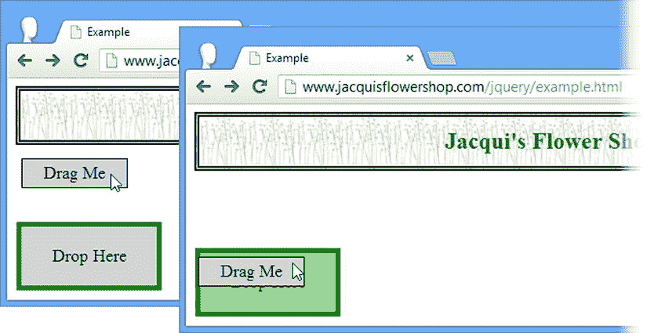

图 24-10 。使用 activeClass 和 hoverClass 设置

更改重叠公差

默认情况下，只有当至少 50%的可拖动元素与可放下元素重叠时，才会触发`over`事件。您可以使用`tolerance`设置 进行更改，该设置接受表 24-8 中显示的值。

表 24-8 。公差值

| 价值 | 描述 |
| --- | --- |
| `fit` | 被拖动的元素必须与可放下的元素完全重叠。 |
| `intersect` | 被拖动元素的至少 50%必须与可拖放元素重叠。这是默认设置。 |
| `pointer` | 无论用户从哪里抓取了可拖动元素，鼠标指针都必须在可拖动元素上。 |
| `touch` | 被拖动的元素必须与可放下的元素重叠任意多的距离。 |

我最常用的两个值是`fit`和`touch`，因为它们代表了用户最容易理解的方法。当我保存被放下的项目的位置时，我使用`fit`，当我让被放下的项目恢复到原来的位置时，我使用`touch`(我将在本章后面演示)。清单 24-12 显示了`fit`和`touch`设置的使用。

***清单 24-12*** 。更改可拖动元素的公差

```js
<!DOCTYPE html>
<html>
<head>
    <title>Example</title>
    <script src="jquery-2.0.2.js" type="text/javascript"></script>
    <script src="jquery-ui-1.10.3.custom.js" type="text/javascript"></script>
    <link rel="stylesheet" type="text/css" href="styles.css"/>
    <link rel="stylesheet" type="text/css" href="jquery-ui-1.10.3.custom.css"/>
    <style type="text/css">
        .draggable, .droppable {font-size: large; border: thin solid black; padding: 4px;
            width: 100px; text-align: center; background-color: lightgray;}
        .droppable {margin-bottom: 10px; margin-right: 5px; height: 50px; width: 120px}
        #dropContainer {position: absolute; right: 5px;}
        div span {position: relative; top: 25%}
        .droppable.active {border: thick solid green}
        .droppable.hover {background-color: lightgreen}
    </style>
    <script type="text/javascript">
        $(document).ready(function() {

            $(".draggable").draggable();

            $("div.droppable").droppable({
                drop: function(event, ui) {
                    ui.draggable.text("Dropped");
                },
                activeClass: "active",
                hoverClass: "hover",
                tolerance: "fit"
            });

            $("#touchDrop").droppable("option", "tolerance", "touch");
        });
    </script>
</head>
<body>
    <h1>Jacqui's Flower Shop</h1>
    <div id="dropContainer">
        <div id="fitDrop" class="droppable">
            <span>Fit</span>
        </div>
        <div id="touchDrop" class="droppable">
            <span>Touch</span>
        </div>
    </div>
    <div class="draggable">
        <span>Drag Me</span>
    </div>
</body>
</html>
```

在清单 24-12 中，我创建了两个可删除的元素，其中一个用公差设置的`fit`值配置，另一个用`touch`值配置。有一个单一的可拖动元素，图 24-11 显示了不同值产生的效果。我在`over`事件触发的那一刻拍摄了每一张截图。请注意，当`tolerance`设置用于确定重叠时，包含了我应用于可拖放元素的边界。

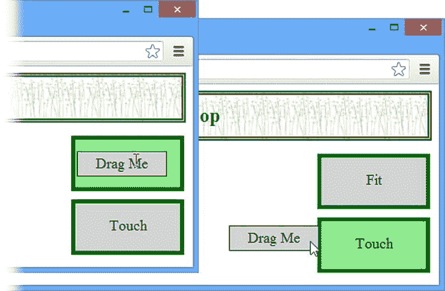

图 24-11 。将“适合”和“接触”值用于公差设置

使用可丢弃的方法

可拖放的交互只定义了您看到的由小部件实现的核心方法集。没有特定于交互的方法。表 24-9 描述了那些可用的。

表 24-9 。可丢弃的方法

| 方法 | 描述 |
| --- | --- |
| `droppable("destroy")` | 从元素中移除交互 |
| `droppable("disable")` | 禁用了可拖放的交互 |
| `droppable("enable")` | 启用可拖放的交互 |
| `droppable("option")` | 更改一个或多个设置 |

调整拖放

您可以使用一些附加设置来微调 jQuery UI 拖放的工作方式。在本节中，我将描述这些设置并演示它们的用法。

使用元素范围

在本章的前面，我展示了如何使用 drop able`accept`设置来过滤激活拖放区的元素。使用选择器对于简单的项目来说很好，但是如果您有许多可拖动的元素需要管理，选择器可能会变得过于复杂和容易出错。

另一种方法是将`scope`设置应用到可拖动和可放下的元素上。可拖动元素将激活具有相同范围值的可拖放元素。清单 24-13 显示了正在使用的`scope`设置。

 **提示**`scope`设置可以与`accept`设置在可删除元素中结合使用。只有当可拖动元素共享同一个`scope`并匹配由`accept`设置定义的选择器时，可拖动元素才会被激活。

***清单 24-13*** 。使用范围设置

```js
<!DOCTYPE html>
<html>
<head>
    <title>Example</title>
    <script src="jquery-2.0.2.js" type="text/javascript"></script>
    <script src="jquery-ui-1.10.3.custom.js" type="text/javascript"></script>
    <link rel="stylesheet" type="text/css" href="styles.css"/>
    <link rel="stylesheet" type="text/css" href="jquery-ui-1.10.3.custom.css"/>
    <style type="text/css">
        .draggable, .droppable {font-size: large; border: medium solid black;
            padding: 4px; width: 100px; text-align: center;
            background-color: lightgray; margin-bottom: 10px;}
        .droppable {margin-right: 5px; height: 50px; width: 120px}
        #dropContainer {position: absolute; right: 5px;}
        div span {position: relative; top: 25%}
        .droppable.active {border: medium solid green}
        .droppable.hover {background-color: lightgreen}
    </style>
    <script type="text/javascript">
        $(document).ready(function() {

            $("#apple").draggable({
                scope: "fruit"
            });
            $("#orchid").draggable({
                scope: "flower"
            });

            $("#flowerDrop").droppable({
                activeClass: "active",
                hoverClass: "hover",
                scope: "flower"
            });

            $("#fruitDrop").droppable({
                activeClass: "active",
                hoverClass: "hover",
                scope: "fruit"
            });
        });
    </script>
</head>
<body>
    <h1>Jacqui's Flower Shop</h1>
    <div id="dropContainer">
        <div id="flowerDrop" class="droppable">
            <span>Flowers</span>
        </div>
        <div id="fruitDrop" class="droppable">
            <span>Fruit</span>
        </div>
    </div>
    <div id="orchid" class="draggable">
        <span>Orchid</span>
    </div>
    <div id="apple" class="draggable">
        <span>Apple</span>
    </div>
</body>
</html>
```

在清单 24-13 中，我创建了两个可拖动的元素和两个可放下的元素。当创建这些元素时，我将它们分配给两个`scope`值之一:`fruit`和`flower`。结果是每个可拖动元素都将被激活，并且只被具有相同范围的可拖放元素接受，如图图 24-12 所示。

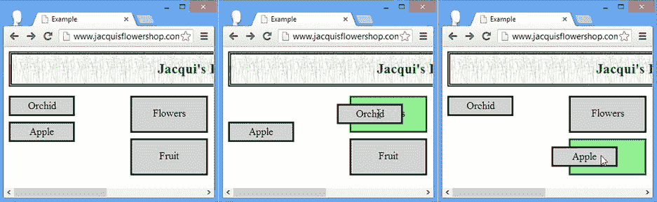

图 24-12 。按范围对可拖动和可放下的元素进行分组

 **注意**注意，我在对`draggable`和`droppable`方法的初始调用中为每个元素定义了`scope`，而不是使用`option`方法。在我写这篇文章的时候，jQuery UI 中有一个 bug，在交互创建之后分配作用域不起作用。

使用辅助元素

`helper`设置 允许您指定一个将被拖动的元素来代替可拖动的元素，保留原来的可拖动元素。这是一个与前面的例子完全不同的效果，在前面的例子中，可拖动元素已经从它的原始位置移开。清单 24-14 展示了一个使用辅助元素的例子。

***清单 24-14*** 。使用大的可拖动元素

```js
<!DOCTYPE html>
<html>
<head>
    <title>Example</title>
    <script src="jquery-2.0.2.js" type="text/javascript"></script>
    <script src="jquery-ui-1.10.3.custom.js" type="text/javascript"></script>
    <link rel="stylesheet" type="text/css" href="styles.css"/>
    <link rel="stylesheet" type="text/css" href="jquery-ui-1.10.3.custom.css"/>
    <style type="text/css">
        .draggable, .droppable {font-size: large; border: medium solid black;
            padding: 4px; width: 150px; text-align: center;
            background-color: lightgray; margin-bottom: 10px;}
        .droppable {margin-right: 5px; height: 50px; width: 120px}
        #dropContainer {position: absolute; right: 5px;}
        div span {position: relative; top: 25%}
        .droppable.active {border: medium solid green}
        .droppable.hover {background-color: lightgreen}
    </style>
    <script type="text/javascript">
        $(document).ready(function() {

            $("div.draggable").draggable({
                helper: "clone"
            });

            $("#basket").droppable({
                activeClass: "active",
                hoverClass: "hover"
            });
        });
    </script>
</head>
<body>
    <h1>Jacqui's Flower Shop</h1>
    <div id="dropContainer">
        <div id="basket" class="droppable">
            <span>Basket</span>
        </div>
    </div>
    <div class="draggable">
        <label for="lily">Lily</label>
    </div>
</body>
</html>
```

值克隆告诉 jQuery UI 复制可拖动元素及其所有内容，并将结果用作辅助元素。你可以在图 24-13 中看到效果。当用户放下辅助元素时，它会被移除，将可拖动和可放下的元素留在原来的位置。

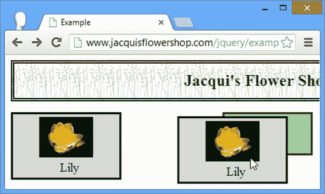

图 24-13 。大的可拖动元素

如图所示，原来的可拖动元素保留在原来的位置，只有辅助元素随着用户的鼠标在屏幕上移动。像本例中这样的大型可拖动元素使得用户很难看到文档中的底层元素，包括可拖放元素的位置。您可以通过提供一个函数作为助手 设置的值来解决这个问题，如清单 24-15 所示。

***清单 24-15*** 。使用助手设置

```js
...
<script type="text/javascript">
    $(document).ready(function() {

        $("div.draggable").draggable({
            helper: function() {
                return $("")
            }
        });

        $("#basket").droppable({
            activeClass: "active",
            hoverClass: "hover"
        });
    });
</script>
...
```

当用户开始拖动元素时，jQuery UI 调用`helper`函数，并使用它返回的元素作为可拖动的项目。在本例中，我使用 jQuery 创建一个`img`元素。你可以在图 24-14 中看到效果。

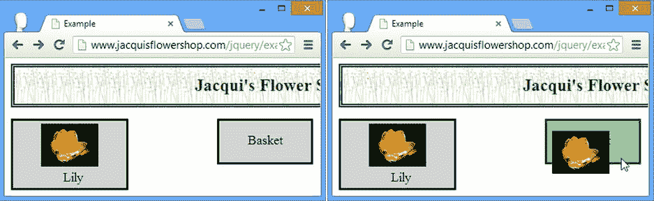

图 24-14 。使用助手

较小的图像充当可拖动元素的更紧凑的替身，使得在拖动时更容易看到文档的其余部分。

操作辅助元素

jQuery UI 传递给 droppable events 的`ui`对象包含一个`helper`属性，您可以使用该属性在拖动 helper 元素时对其进行操作。清单 24-16 展示了这个属性的使用，与`over`和`out`事件相关联。

***清单 24-16*** 。使用 ui.helper 属性

```js
...
<script type="text/javascript">
    $(document).ready(function() {

        $("div.draggable").draggable({
            helper: function() {
                return $("")
            }
        });

        $("#basket").droppable({
            over: function(event, ui) {
                ui.helper.css("border", "thick solid green")
            },
            out: function(event, ui) {
                ui.helper.css("border", "")
            }
        });
    });
</script>
...
```

我使用`over`和`out`事件以及`ui.helper`属性在辅助元素与可拖放元素重叠时显示一个边框。你可以在图 24-15 中看到结果。

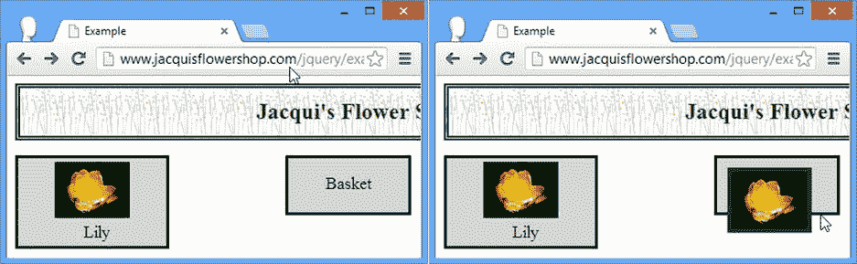

图 24-15 。操作辅助元素

对齐元素的边缘

您可以使用`snap`设置 使可拖动元素捕捉到它经过的元素的边缘。此设置的值是一个选择器。draggable 将与它附近与选择器匹配的任何元素的边缘对齐。清单 24-17 显示了`snap`设置的使用。

***清单 24-17*** 。使用捕捉设置

```js
<!DOCTYPE html>
<html>
<head>
    <title>Example</title>
    <script src="jquery-2.0.2.js" type="text/javascript"></script>
    <script src="jquery-ui-1.10.3.custom.js" type="text/javascript"></script>
    <link rel="stylesheet" type="text/css" href="styles.css"/>
    <link rel="stylesheet" type="text/css" href="jquery-ui-1.10.3.custom.css"/>
    <style type="text/css">
        #snapper, .draggable, .droppable {font-size: large; border: medium solid black;
            padding: 4px; width: 150px; text-align: center;
            background-color: lightgray; margin-bottom: 10px;}
        .droppable {margin-right: 5px; height: 50px; width: 120px}
        #dropContainer {position: absolute; right: 5px;}
        div span {position: relative; top: 25%}
        .droppable.active {border: medium solid green}
        .droppable.hover {background-color: lightgreen}
        #snapper {position: absolute; left: 35%; border: medium solid black;
            width: 180px; height: 50px}
    </style>
    <script type="text/javascript">
        $(document).ready(function() {

            $("div.draggable").draggable({
                snap: "#snapper, .droppable",
                snapMode: "both",
                snapTolerance: 50
            });

            $("#basket").droppable({
                activeClass: "active",
                hoverClass: "hover"
            });
        });
    </script>
</head>
<body>
    <h1>Jacqui's Flower Shop</h1>
    <div id="dropContainer">
        <div id="basket" class="droppable">
            <span>Basket</span>
        </div>
    </div>
    <div id="snapper"><span>Snap Here</span></div>
    <div class="draggable">
        <span>Drag Me</span>
    </div>
</body>
</html>
```

当可拖动元素靠近其中一个匹配元素时，它会跳跃(捕捉)以便两个最近的边接触。您可以选择任何要捕捉的元素，而不仅仅是可删除的元素。在清单 24-17 中，我添加了一个`div`元素并为`snap`设置定义了一个值，该值用于选择它和文档中可拖放的元素。使用屏幕截图来展示截图的效果几乎是不可能的，所以我鼓励您在浏览器中尝试这个例子。

有几个支持设置可用于调整捕捉行为。`snapMode`第一个是。通过此设置，您可以指定可拖动对象将吸附到哪些边缘。可接受的值有`inner`(对齐基础元素的内边缘)、`outer`(对齐外边缘)和`both`(对齐所有边缘，这是默认值)。

您使用`snapTolerance`设置来指定可拖动元素在捕捉到位置之前必须远离目标多远。默认为`20`，表示 20 像素。在清单 24-17 的中，我指定了一个`50`的值，这使得捕捉发生在更远的地方。为此设置获取正确的值非常重要。如果`snapTolerance`值太小，用户不会注意到对齐效果，如果值太大，可拖动元素开始意外地跳过屏幕，以对齐远处的元素

摘要

在本章中，我向您介绍了 jQuery UI 交互中最重要和最有用的两种:draggable 和 droppable。我向您展示了如何单独应用和配置这些交互，如何响应它们的事件，以及如何调整它们协同工作的方式，以获得对您向 web 应用用户提供的拖放体验的细粒度控制。在第二十五章中，我将向您展示其他 jQuery UI 交互。