# 二十五、使用其他交互

在这一章中，我将描述剩下的三个 jQuery UI 交互:*可排序的*、*可选择的*和*可调整大小的*。这些交互比`draggable`和`droppable`用得更少(也更没用)，我在第二十四章中描述过。本章中的交互可能是有用的，但是它们使用的模型很难向用户突出显示。正因为如此，它们作为其他更传统的方法的补充表现得最好。表 25-1 提供了本章的总结。

表 25-1 。章节总结

| 问题 | 解决办法 | 列表 |
| --- | --- | --- |
| 应用可排序交互 | 选择容器元素，并调用`sortable`方法 | one |
| 获取用户通过可排序交互创建的订单 | 调用`toArray`或`serialize`方法 | 2, 3 |
| 允许将元素从一个可排序项目拖动到另一个项目 | 使用`connectWith`设置 | four |
| 将可拖动元素与可排序项目连接 | 使用可拖动元素上的`connectToSortable`设置 | five |
| 指定哪些元素是可排序的 | 使用`items`设置 | six |
| 拖动可排序项目时创建的空白区域 | 使用`placeholder`设置 | seven |
| 忽略顺序的变化 | 使用`cancel`方法 | eight |
| 刷新可排序项目中的元素集 | 使用`refresh`方法 | nine |
| 获取有关正在进行的排序操作的信息 | 使用提供给事件处理函数的`ui`对象 | Ten |
| 应用可选交互 | 选择容器元素，并调用`selectable`方法 | 11, 12 |
| 防止元素被选中 | 使用`cancel`方法 | Thirteen |
| 应用可调整大小的交互 | 使用`resizable`方法 | Fourteen |
| 调整多个元素的大小 | 使用`alsoResize`设置 | 15, 16 |
| 限制可调整大小的元素的大小 | 使用`maxHeight`、`maxWidth`、`minHeight`和`minWidth`设置 | Seventeen |
| 为可调整大小的元素选择可拖动的边和角 | 使用`handles`设置 | Eighteen |

使用可排序交互

`sortable`交互允许用户通过拖动改变一组元素的顺序。通过选择包含想要排序的单个项目的元素，然后调用`sortable`方法，应用可排序交互，如清单 25-1 所示。

***清单 25-1*** 。使用可排序交互

```js
<!DOCTYPE html>
<html>
<head>
    <title>Example</title>
    <script src="jquery-2.0.2.js" type="text/javascript"></script>
    <script src="jquery-ui-1.10.3.custom.js" type="text/javascript"></script>
    <link rel="stylesheet" type="text/css" href="styles.css"/>
    <link rel="stylesheet" type="text/css" href="jquery-ui-1.10.3.custom.css"/>
    <style type="text/css">
        div.sortable { width: 100px; background-color: lightgrey; font-size: large;
            float: left; margin: 4px; text-align: center; border: medium solid black;
            padding: 4px;}
    </style>
    <script type="text/javascript">
        $(document).ready(function() {
            $("#sortContainer").sortable();
        });
    </script>
</head>
<body>
    <h1>Jacqui's Flower Shop</h1>
    <div id="sortContainer">
        <div id="item1" class="sortable">Item 1</div>
        <div id="item2" class="sortable">Item 2</div>
        <div id="item3" class="sortable">Item 3</div>
    </div>
</body>
</html>
```

在清单 25-1 中，我创建了许多`div`元素，并将它们分配给`sortable`类。这个类对交互没有影响:我只是用它来设计元素的样式。为了创建交互，我选择父元素`div`(其`id`是`sortContainer`)并调用`sortable`方法。结果是，我可以简单地通过将三个`div`元素拖动到一个新位置来改变它们的顺序。你可以在图 25-1 中看到效果(尽管，像本章中的所有例子一样，你将通过在浏览器中运行这个例子来更好地理解发生了什么)。

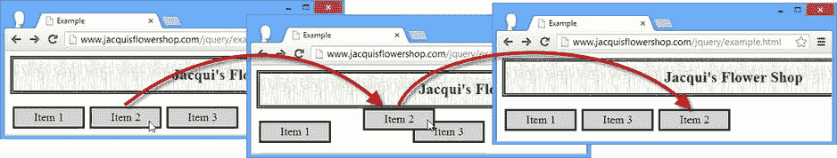

图 25-1 。通过拖移来排序项目

为了演示`sortable`交互，我将标签为`Item 2`的元素拖到浏览器窗口的右侧。一旦我将元素拖过标签为`Item 3`的元素，jQuery UI 就会重新排列这些项目，使它们处于新的顺序。我只将一个元素拖动到一个位置，但是您可以一次将它们移动到几个位置。

获取可排序订单

在某些时候，您需要知道用户通过移动元素创建的顺序。要获得这些信息，您可以调用`toArray`方法，该方法返回排序元素的`id`属性值的 JavaScript 数组。清单 25-2 显示了在将当前订单写入控制台的例子中添加了一个按钮。

***清单 25-2*** 。获取排序后的元素顺序

```js
...
<script type="text/javascript">
    $(document).ready(function() {
        $("#sortContainer").sortable();

        $("<div id=buttonDiv><button>Get Order</button></div>").appendTo("body");
        $("button").button().click(function() {
            var order = $("#sortContainer").sortable("toArray");
            for (var i = 0; i < order.length; i++) {
                console.log("Position: " + i + " ID: " + order[i]);
            }
        });
    });
</script>
...
```

你可以在图 25-2 中看到效果。当按钮被按下时，我调用`toArray`方法并将结果数组的内容枚举到控制台。

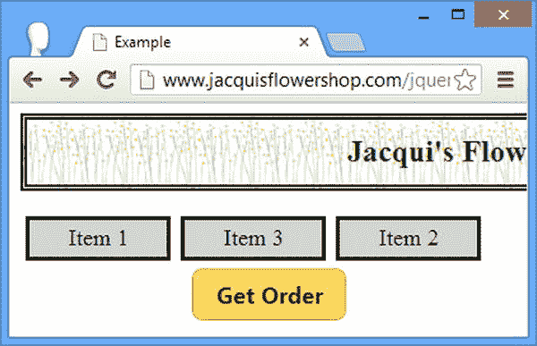

图 25-2 。添加一个按钮来写出排序顺序

对于图中的订单，按下按钮会产生以下输出:

```js
Position: 0 ID: item2
Position: 1 ID: item3
Position: 2 ID: item1
```

您还可以使用`serialize`方法来生成一个字符串，该字符串很容易与表单一起使用。清单 25-3 提供了一个例子。

***清单 25-3*** 。使用 serialize 方法

```js
<!DOCTYPE html>
<html>
<head>
    <title>Example</title>
    <script src="jquery-2.0.2.js" type="text/javascript"></script>
    <script src="jquery-ui-1.10.3.custom.js" type="text/javascript"></script>
    <link rel="stylesheet" type="text/css" href="styles.css"/>
    <link rel="stylesheet" type="text/css" href="jquery-ui-1.10.3.custom.css"/>
    <style type="text/css">
        div.sortable { width: 100px; background-color: lightgrey; font-size: large;
            float: left; margin: 4px; text-align: center; border: medium solid black;
            padding: 4px;}
            #buttonDiv {clear: both}
    </style>
    <script type="text/javascript">
        $(document).ready(function() {
            $("#sortContainer").sortable();

            $("<div id=buttonDiv><button>Get Order</button></div>").appendTo("body");
            $("button").button().click(function() {
                var formstring = $("#sortContainer").sortable("serialize");
                console.log(formstring);
            })
        });
    </script>
</head>
<body>
    <h1>Jacqui's Flower Shop</h1>
    <div id="sortContainer">
        <div id="item_1" class="sortable">Item 1</div>
        <div id="item_2" class="sortable">Item 2</div>
        <div id="item_3" class="sortable">Item 3</div>
    </div>
</body>
</html>
```

注意，我必须更改可排序元素的`id`值。`serialize`方法在生成其字符串时寻找`<key>_<index>`的模式。图 25-2 中所示命令的输出如下:

```js
item[]=2&item[]=3&item[]=1
```

配置 可排序的交互

可排序交互依赖于我在第二十四章中描述的可拖动交互。这意味着我为该交互描述的选项(比如`axis`和`tolerance`)可以以同样的效果应用于配置可排序的交互。那些设置我就不再描述了。相反，表 25-2 显示了可分类交互特有且最有用的设置。我将在接下来的章节中描述这些设置。

表 25-2 。可排序设置

| 环境 | 描述 |
| --- | --- |
| `connectWith` | 指定要连接的另一个可排序元素，以便可以在它们之间拖动项目。默认为`false`，表示没有连接。 |
| `dropOnEmpty` | 当`false`时，物品不能放在不包含物品的已连接的可排序交互上。默认为`true`。 |
| `items` | 指定可通过选择器排序的项目。缺省值是`> *`，它选择调用了`sortable`方法的元素的任何后代。 |
| `placeholder` | 指定一个类，该类将被分配给在可排序项目被拖动到新位置时为保留空间而创建的元素。 |

连接可排序的交互

我最喜欢的可排序特性是连接两个可排序交互的能力，允许在它们之间拖动项目。您可以使用`connectWith`设置来实现这一点，指定一个选择器来匹配您想要连接的元素。您可以通过在两个可排序元素上使用`connectWith`设置来创建一个双向连接，如清单 25-4 中的所示。

***清单 25-4*** 。连接可排序的交互

```js
<!DOCTYPE html>
<html>
<head>
    <title>Example</title>
    <script src="jquery-2.0.2.js" type="text/javascript"></script>
    <script src="jquery-ui-1.10.3.custom.js" type="text/javascript"></script>
    <link rel="stylesheet" type="text/css" href="styles.css"/>
    <link rel="stylesheet" type="text/css" href="jquery-ui-1.10.3.custom.css"/>
    <style type="text/css">
        div.sortable { width: 100px; background-color: lightgrey; font-size: large;
            margin: 4px; text-align: center; border: medium solid black; padding: 4px;}
        #fruitContainer {position: absolute; right:50px}
        #flowerContainer {position: absolute; left:50px}
        div.flower {background-color: lightgreen}
    </style>
    <script type="text/javascript">
        $(document).ready(function() {
            $("#fruitContainer").sortable({
                connectWith: "#flowerContainer"
            });
            $("#flowerContainer").sortable({
                connectWith: "#fruitContainer"
            });
        });
    </script>
</head>
<body>
    <h1>Jacqui's Flower Shop</h1>
    <div id="fruitContainer" class="sortContainer">
        <div id="fruit_1" class="sortable fruit">Apple</div>
        <div id="fruit_2" class="sortable fruit">Orange</div>
        <div id="fruit_3" class="sortable fruit">Banana</div>
        <div id="fruit_4" class="sortable fruit">Pear</div>
    </div>
    <div id="flowerContainer" class="sortContainer">
        <div id="flower_1" class="sortable flower">Aster</div>
        <div id="flower_2" class="sortable flower">Peony</div>
        <div id="flower_3" class="sortable flower">Lily</div>
        <div id="flower_4" class="sortable flower">Orchid</div>
    </div>
</body>
</html>
```

在清单 25-4 中，我创建了两组项目，并在它们的容器元素上调用了`sortable`方法。我使用了`connectwith`设置来关联每个可排序的条目，并且图 25-3 显示了结果。

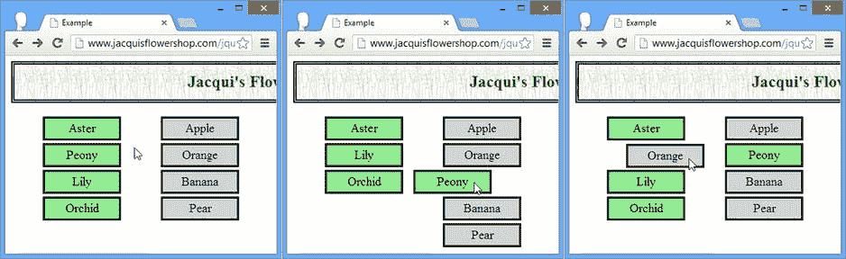

图 25-3 。在连接的可排序交互之间拖动元素

将可拖动元素与可排序元素连接起来

你也可以将一个可拖动的元素和一个可排序的元素连接起来。通过在可拖动元素上应用`connectToSortable`设置，指定一个与您想要连接的可拖动元素相匹配的选择器，可以做到这一点。清单 25-5 展示了这是如何做到的。

***清单 25-5*** 。连接可拖动元素和可排序元素

```js
<!DOCTYPE html>
<html>
<head>
    <title>Example</title>
    <script src="jquery-2.0.2.js" type="text/javascript"></script>
    <script src="jquery-ui-1.10.3.custom.js" type="text/javascript"></script>
    <link rel="stylesheet" type="text/css" href="styles.css"/>
    <link rel="stylesheet" type="text/css" href="jquery-ui-1.10.3.custom.css"/>
    <style type="text/css">
        div.sortable { width: 100px; background-color: lightgrey; font-size: large;
            margin: 4px; text-align: center; border: medium solid black; padding: 4px;}
        #fruitContainer {position: absolute; right:50px}
        #flowerContainer {position: absolute; left:50px}
        div.flower {background-color: lightgreen}
    </style>
    <script type="text/javascript">
        $(document).ready(function() {
            $("#fruit_1").draggable({
                connectToSortable: "#flowerContainer",
                helper: "clone"
            });
            $("#flowerContainer").sortable();
        });
    </script>
</head>
<body>
    <h1>Jacqui's Flower Shop</h1>
    <div id="fruitContainer" class="sortContainer">
        <div id="fruit_1" class="sortable fruit">Apple</div>
    </div>
    <div id="flowerContainer" class="sortContainer">
        <div id="flower_1" class="sortable flower">Aster</div>
        <div id="flower_2" class="sortable flower">Peony</div>
        <div id="flower_3" class="sortable flower">Lily</div>
        <div id="flower_4" class="sortable flower">Orchid</div>
    </div>
</body>
</html>
```

在清单 25-5 中，我将水果项目的数量减少到一个，并使其可拖动，连接到可排序的鲜花列表。结果是可拖动的项目可以被添加到可排序列表中，如图图 25-4 所示。当可拖动项目的`helper`设置为`clone`时，此设置效果最佳。它对其他值也有效，但是会报告一个错误。

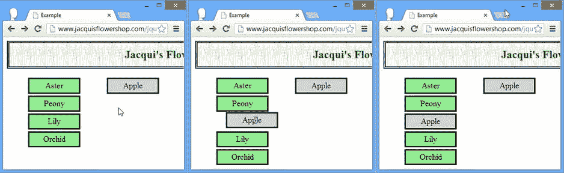

图 25-4 。连接可排序项目和可拖动项目

选择可排序的项目

您可以选择容器中的哪些物品是可分类的。通过`items`设置可以做到这一点，它的值是一个选择器，匹配您想要启用排序的元素。无法重新排列与选择器不匹配的元素。清单 25-6 演示了。

***清单 25-6*** 。选择可排序的特定元素

```js
<!DOCTYPE html>
<html>
<head>
    <title>Example</title>
    <script src="jquery-2.0.2.js" type="text/javascript"></script>
    <script src="jquery-ui-1.10.3.custom.js" type="text/javascript"></script>
    <link rel="stylesheet" type="text/css" href="styles.css"/>
    <link rel="stylesheet" type="text/css" href="jquery-ui-1.10.3.custom.css"/>
    <style type="text/css">
        div.sortable { width: 100px; background-color: lightgrey; font-size: large;
            margin: 4px; text-align: center; border: medium solid black; padding: 4px;}
        #fruitContainer {position: absolute; right:50px}
        #flowerContainer {position: absolute; left:50px}
    </style>
    <script type="text/javascript">
        $(document).ready(function() {
            $("div.flower:even").css("background-color", "lightgreen")
            $("#flowerContainer").sortable({
                items: ".flower:even"
            });
        });
    </script>
</head>
<body>
    <h1>Jacqui's Flower Shop</h1>
    <div id="flowerContainer" class="sortContainer">
        <div id="flower_1" class="sortable flower">Aster</div>
        <div id="flower_2" class="sortable flower">Peony</div>
        <div id="flower_3" class="sortable flower">Lily</div>
        <div id="flower_4" class="sortable flower">Orchid</div>
    </div>
</body>
</html>
```

在清单 25-6 中，我使用了`items`设置来指定容器中只有偶数编号的元素是可排序的。在图 25-5 中，可以对`Aster`和`Lily`元素进行排序，但是`Peony`和`Orchid`元素不会对被拖动作出反应并保持在原位。

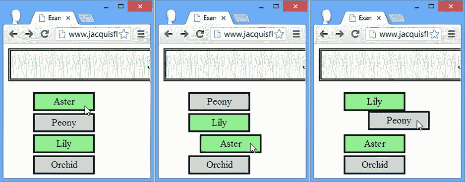

图 25-5 。选择可以排序的项目

在使用`items`设置时，有一个奇怪的地方你应该注意，我已经在图的最后一帧中展示了。与选择器不匹配的元素不能被拖动到新位置，除非它已被另一个元素移走。所以在图中，我将`Aster`元素拖到一个新的位置，这迫使`Peony`元素移动。一旦被移动，`Peony`元素将响应被拖动和排序，就好像它匹配`items`选择器一样。

设计空白的空间

当您将项目拖到新位置时，它留下的空间保持空白。你可以通过`placeholder`设置将一个 CSS 类应用到这个空间。这是强调空白空间是拖放目标的一种有用方式。清单 25-7 显示了`placeholder`设置的使用。

***清单 25-7*** 。使用占位符设置

```js
<!DOCTYPE html>
<html>
<head>
    <title>Example</title>
    <script src="jquery-2.0.2.js" type="text/javascript"></script>
    <script src="jquery-ui-1.10.3.custom.js" type="text/javascript"></script>
    <link rel="stylesheet" type="text/css" href="styles.css"/>
    <link rel="stylesheet" type="text/css" href="jquery-ui-1.10.3.custom.css"/>
    <style type="text/css">
        div.sortable {width: 100px; background-color: lightgrey; font-size: large;
            margin: 4px; text-align: center; border: medium solid black; padding: 4px;}
        #flowerContainer {position: absolute; left:25%}
        .emptySpace {border: medium dotted red; height: 25px; margin: 4px}
    </style>
    <script type="text/javascript">
        $(document).ready(function() {
            $("#flowerContainer").sortable({
                placeholder: "emptySpace"
            });
        });
    </script>
</head>
<body>
    <h1>Jacqui's Flower Shop</h1>
    <div id="flowerContainer" class="sortContainer">
        <div id="flower_1" class="sortable ">Aster</div>
        <div id="flower_2" class="sortable ">Peony</div>
        <div id="flower_3" class="sortable">Lily</div>
        <div id="flower_4" class="sortable">Orchid</div>
    </div>
</body>
</html>
```

在清单 25-7 的中，我定义了一个名为`emptySpace`的 CSS 类，它定义了`height`和`margin`属性的大小，并定义了一个红色圆点`border`。我使用`placeholder`设置来指定这个类，如图 25-6 所示，当我拖动一个元素来排序它时，它留下的空间被分配给`emptySpace`类。

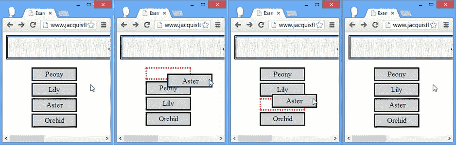

图 25-6 。使用占位符设置

使用可排序的方法

可排序交互定义了所有标准的 jQuery UI 方法，以及一些特定于使用可排序元素的方法。表 25-3 描述了这些方法。

表 25-3 。可排序的方法

| 方法 | 描述 |
| --- | --- |
| `sortable("destroy")` | 从元素中移除交互 |
| `sortable("disable")` | 禁用了可排序交互 |
| `sortable("enable")` | 启用可排序交互 |
| `sortable("option")` | 更改一个或多个设置 |
| `sortable("toArray")` | 返回一个数组，其中包含一组已排序的`id`属性值(参见“获取可排序顺序”一节中的示例) |
| `sortable("refresh")` | 刷新了可排序的交互 |
| `sortable("cancel")` | 取消排序操作 |

取消排序

你可以使用`cancel`方法来防止元素被排序。这是应该谨慎进行的事情，因为它实际上忽略了用户已经采取的行动。如果你取消了一个排序，你应该确保用户知道为什么会这样。清单 25-8 提供了一个结合使用`cancel`方法和`update`事件的例子。当用户拖动一个元素创建一个新的排序顺序后释放鼠标按钮时，触发`update`事件。我在“使用可排序事件”一节中描述了可排序事件

***清单 25-8*** 。使用取消方法

```js
<!DOCTYPE html>
<html>
<head>
    <title>Example</title>
    <script src="jquery-2.0.2.js" type="text/javascript"></script>
    <script src="jquery-ui-1.10.3.custom.js" type="text/javascript"></script>
    <link rel="stylesheet" type="text/css" href="styles.css"/>
    <link rel="stylesheet" type="text/css" href="jquery-ui-1.10.3.custom.css"/>
    <style type="text/css">
        div.sortable {width: 100px; background-color: lightgrey; font-size: large;
            margin: 4px; text-align: center; border: medium solid black; padding: 4px;}
    </style>
    <script type="text/javascript">
        $(document).ready(function() {
            $("#error").dialog({autoOpen: false, modal: true})

            $("#flowerContainer").sortable({
                update: function() {
                    var sortedItems = $("#flowerContainer").sortable("toArray");
                    if (sortedItems[0] != "item_1") {
                        $("#error").dialog("open")
                        $("#flowerContainer").sortable("cancel")
                    }
                }
            });
        });
    </script>
</head>
<body>
    <div id="error">The King must be first</div>
    <h1>Jacqui's Flower Shop</h1>
    <div id="flowerContainer" class="sortContainer">
        <div id="item_1" class="sortable ">King</div>
        <div id="item_2" class="sortable ">Queen</div>
        <div id="item_3" class="sortable ">Jack</div>
        <div id="item_4" class="sortable">10</div>
    </div>
</body>
</html>
```

在清单 25-8 中，如果用户创建的新排序意味着`King`元素不在列表的第一个位置，我就调用`cancel`方法。我使用第二十二章中描述的对话框部件来提醒用户这个问题。允许影响其他可排序元素的更改继续进行。

刷新可排序元素

`refresh`方法使 sortable 交互刷新 sortable 容器中元素的缓存。清单 25-9 展示了如何使用这个特性来添加新的可排序元素。

***清单 25-9*** 。添加新的可排序元素

```js
<!DOCTYPE html>
<html>
<head>
    <title>Example</title>
    <script src="jquery-2.0.2.js" type="text/javascript"></script>
    <script src="jquery-ui-1.10.3.custom.js" type="text/javascript"></script>
    <link rel="stylesheet" type="text/css" href="styles.css"/>
    <link rel="stylesheet" type="text/css" href="jquery-ui-1.10.3.custom.css"/>
    <style type="text/css">
        div.sortable {width: 100px; background-color: lightgrey; font-size: large;
            margin: 4px; text-align: center; border: medium solid black; padding: 4px;}
    </style>
    <script type="text/javascript">
        $(document).ready(function() {
            $("#flowerContainer").sortable();

            var itemCount = 2;

            $("button").click(function() {
                $("<div id=flower_" + (itemCount++) + " class=sortable>Item " +
                  itemCount + "</div>").appendTo("#flowerContainer");
                $("#flowerContainer").sortable("refresh");
            })
        });
    </script>
</head>
<body>
    <h1>Jacqui's Flower Shop</h1>
    <button>Add Sortable Item</button>
    <div id="flowerContainer" class="sortContainer">
        <div id="flower_1" class="sortable">Aster</div>
        <div id="flower_2" class="sortable">Peony</div>
    </div>
</body>
</html>
```

在清单 25-9 中，我在文档中添加了一个`button`，向可排序的容器中添加新的条目，并调用`refresh`方法来确保这些条目可以正确排序。

使用可排序事件

可排序交互支持可拖动交互定义的所有事件，我在第二十四章中描述过。表 25-4 描述了可排序交互特有的事件。

表 25-4 。可排序事件

| 事件 | 描述 |
| --- | --- |
| `change` | 当用户对元素进行排序时位置发生变化时触发 |
| `receive` | 当一个项目从一个连接的项目被拖动到这个可排序的项目时触发 |
| `remove` | 当一个项目从这个可排序项目拖到一个连接的项目时触发 |
| `sort` | 排序过程中每次鼠标移动时触发 |
| `update` | 当用户停止拖动某项并且该项的顺序已经改变时触发 |

当触发这些事件时，jQuery UI 通过一个`ui`对象参数提供附加信息，该参数的属性如表 25-5 所示。

表 25-5 。可排序的 ui 对象属性

| 财产 | 描述 |
| --- | --- |
| `helper` | 返回辅助元素 |
| `position` | 以具有`top`和`left`属性的对象的形式返回辅助对象的当前位置 |
| `item` | 返回包含当前拖动项的 jQuery 对象 |
| `placeholder` | 返回包含占位符元素的 jQuery 对象 |
| `sender` | 返回一个 jQuery 对象，该对象包含元素所源自的连接的可排序表(当没有连接的可排序表时，该属性为 null) |

清单 25-10 展示了`ui`对象与`sort`和`change`事件的使用。

***清单 25-10*** 。使用更改和排序事件

```js
<!DOCTYPE html>
<html>
<head>
    <title>Example</title>
    <script src="jquery-2.0.2.js" type="text/javascript"></script>
    <script src="jquery-ui-1.10.3.custom.js" type="text/javascript"></script>
    <link rel="stylesheet" type="text/css" href="styles.css"/>
    <link rel="stylesheet" type="text/css" href="jquery-ui-1.10.3.custom.css"/>
    <style type="text/css">
        div.sortable {width: 100px; background-color: lightgrey; font-size: large;
            margin: 4px; text-align: center; border: medium solid black; padding: 4px;}
        #flowerContainer {position: absolute; left:10px}
        #info {position: absolute; right: 10px; border: medium solid black; padding: 4px}
    </style>
    <script type="text/javascript">
        $(document).ready(function() {
            $("#flowerContainer").sortable({
                sort: function(event, ui) {
                    $("#itemId").text(ui.item.attr("id"))
                },
                change: function(event, ui) {
                    $("#pos").text($("#flowerContainer *").index(ui.placeholder))
                }
            });
        });
    </script>
</head>
<body>
    <h1>Jacqui's Flower Shop</h1>
    <div id="flowerContainer" class="sortContainer">
        <div id="flower_1" class="sortable ">Aster</div>
        <div id="flower_2" class="sortable ">Peony</div>
        <div id="flower_3" class="sortable">Lily</div>
        <div id="flower_4" class="sortable">Orchid</div>
    </div>
    <div id="info" class="ui-widget">
        <div>Item ID: <span id="itemId">None</span></div>
        <div>Pos: <span id="pos">None</span></div>
    </div>
</body>
</html>
```

我使用事件来显示关于排序操作的信息。对于`sort`事件，我读取了`ui.item`属性并获得了被拖动元素的`id`属性。对于 change 事件，我使用了`ui.placeholder`属性，并使用了`index`方法来确定它在可排序元素中的位置。

使用可选交互

可选择的交互允许用户通过拖动鼠标或点击单个元素来选择一个或多个元素。您通过`selectable`方法应用交互，如清单 25-11 所示。

***清单 25-11*** 。应用可选交互

```js
<!DOCTYPE html>
<html>
<head>
    <title>Example</title>
    <script src="jquery-2.0.2.js" type="text/javascript"></script>
    <script src="jquery-ui-1.10.3.custom.js" type="text/javascript"></script>
    <link rel="stylesheet" type="text/css" href="styles.css"/>
    <link rel="stylesheet" type="text/css" href="jquery-ui-1.10.3.custom.css"/>
    <style type="text/css">
        div.flower {width: 200px; background-color: lightgrey; font-size: large;
            margin: 4px; text-align: center; border: medium solid black; padding: 4px;}
        #flowerContainer {position: absolute; left:10px}
        div.ui-selected {border: medium solid green; background-color: lightgreen}
        div.ui-selecting {border: medium solid green}
    </style>
    <script type="text/javascript">
        $(document).ready(function() {
            $("#flowerContainer").selectable();
        });
    </script>
</head>
<body>
    <h1>Jacqui's Flower Shop</h1>
    <div id="flowerContainer">
        <div id="flower_1" class="flower">Aster</div>
        <div id="flower_2" class="flower">Peony</div>
        <div id="flower_3" class="flower">Lily</div>
        <div id="flower_4" class="flower">Orchid</div>
    </div>
</body>
</html>
```

您将可选交互应用于包含您希望用户能够选择的元素的元素。在这种情况下，我使用了本章前面用于可排序交互的相同的`div`元素。我选择容器并调用`selectable`方法，如下所示:

```js
...
$("#flowerContainer").selectable();
...
```

尽管我现在已经将可选交互应用到了我的容器中，但是我还需要为特定的类定义一对 CSS 样式来给用户提供视觉反馈。以下是我与这些类关联的样式:

```js
...
div.ui-selected {border: medium solid green; background-color: lightgreen}
div.ui-selecting {border: medium solid green}
...
```

可选交互将这些类应用到我的元素，以反映它们的选择状态。当用户拖动鼠标选择特定区域中的元素时，应用`ui.selecting`类，当元素被选中时，应用`ui-selected`类(因为用户点击了该元素，或者因为它位于鼠标拖动覆盖的区域中)。我使用了简单的样式，只使用绿色的边框和背景。在图 25-7 中可以看到拖动鼠标选择元素的效果。

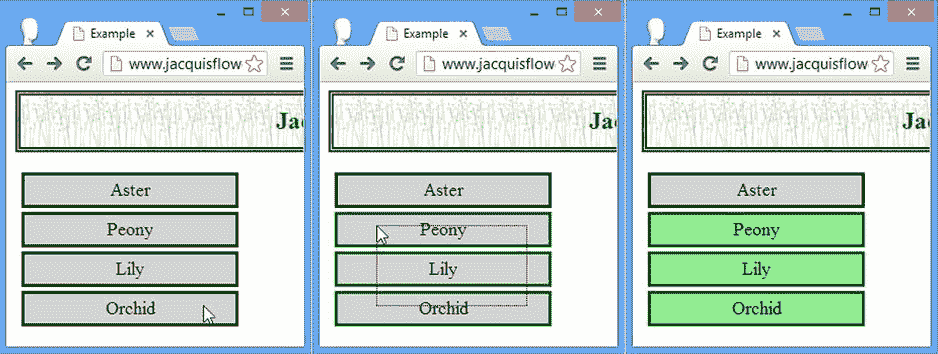

图 25-7 。用鼠标选择元素

用户必须开始在容器元素内拖动鼠标来开始选择过程。您可以在图的中间框架中看到被选中区域的轮廓(称为*选框*)——此时，jQuery UI 已经应用了`ui-selecting`类。当释放鼠标时，选取框重叠的元素被选中，并应用`ui-selected`类，如图的最后一帧所示。

用户也可以通过点击来选择元素。可以选择多个元素，按住 Control/Meta 键可以进行不连续的选择。如果您发现单击会导致单个选定元素切换，您需要添加清单 25-12 中所示的内容。

***清单 25-12*** 。为可选择的交互启用多个元素选择

```js
...
<script type="text/javascript">
    $(document).ready(function() {
        $("#flowerContainer")
            .bind("mousedown", function(e) {e.metaKey = true;})
            .selectable();
    });
</script>
...
```

当用户按下鼠标按钮时，应用`ui-selecting`类。当释放鼠标按钮时，应用`ui-selected`类。

配置可选交互

您可以使用表 25-6 中描述的设置来配置可选交互。

表 25-6 。可选设置

| 环境 | 描述 |
| --- | --- |
| `disabled` | 当`true`时，交互最初被禁用。默认为`false`。 |
| `autoRefresh` | 当`true`时，交互在每个选择操作开始时刷新每个可选元素的大小和位置。默认为`true`。 |
| `cancel` | 阻止匹配元素被选中的选择器字符串。 |
| `delay` | 参见第二十四章中可拖动交互的`delay`设置。 |
| `distance` | 参见第二十四章中关于可拖动交互的`distance`设置。 |
| `filter` | 用于匹配容器中可选元素的选择器。默认为`*`，匹配所有元素。 |

这些设置中的大多数是不言而喻的，或者与其他交互相同。不过，特别有趣的是`cancel`设置，您可以用它来使元素不被用户选择。清单 25-13 演示了。

***清单 25-13*** 。使用取消设置

```js
...
<script type="text/javascript">
    $(document).ready(function() {
        $("#flowerContainer")
            .bind("mousedown", function(e) {e.metaKey = true;})
            .selectable({
                cancel: "#flower_3"
            });
    });
</script>
...
```

在这个脚本中，我使用了一个选择器来防止 ID 为`flower_3`的元素被选中。当用户通过点击元素来选择元素时，这种方法很有效，但是不能阻止通过拖动来选择。因此，小心使用`cancel`设置。

使用可选的交互方法

可选交互仅定义一个唯一的方法，如表 25-7 所述。其他方法是所有小部件和交互通用的方法。

表 25-7 。可选方法

| 方法 | 描述 |
| --- | --- |
| `selectable("destroy")` | 从元素中移除交互 |
| `selectable("disable")` | 禁用可选交互 |
| `selectable("enable")` | 启用可选交互 |
| `selectable("option")` | 更改一个或多个设置 |
| `selectable("refresh")` | 刷新可选交互；这是使用`false`作为`autoRefresh`设置值的手动替代方法 |

使用可选的交互事件

可选交互定义了表 25-8 中显示的事件。

表 25-8 。可选方法

| 事件 | 描述 |
| --- | --- |
| `create` | 当交互应用于元素时触发。 |
| `selected` | 当一个项目被选中时触发。如果选择了多个项目，将为每个项目触发一次该事件。 |
| `selecting` | 当用户开始选择过程(通过按下鼠标按钮或拖动鼠标)时触发。 |
| `unselected` | 当取消选择项目时触发。如果未选择多个项目，则每个项目都会触发一次该事件。 |
| `unselecting` | 当用户通过按下鼠标按钮开始取消选择过程时触发。 |

jQuery UI 通过一个`ui`对象为大多数事件提供了附加信息。对于`selected`和`selecting`事件，`ui`对象有一个名为`selected`的属性，该属性包含与已经(或即将)被选中的元素相对应的`HTMLElement`。对于`unselected`和`unselecting`事件，`ui`对象有一个执行相同目的的`unselected`属性。

使用可调整大小的交互

可调整大小的交互将拖动手柄添加到允许用户调整大小的元素。有些浏览器对文本区域自动执行此操作，但是可调整大小的交互让我们可以将此功能应用于文档中的任何元素。清单 25-14 展示了使用`resizable`方法执行的可调整大小的交互的应用。

***清单 25-14*** 。应用可调整大小的交互

```js
<!DOCTYPE html>
<html>
<head>
    <title>Example</title>
    <script src="jquery-2.0.2.js" type="text/javascript"></script>
    <script src="jquery-ui-1.10.3.custom.js" type="text/javascript"></script>
    <link rel="stylesheet" type="text/css" href="styles.css"/>
    <link rel="stylesheet" type="text/css" href="jquery-ui-1.10.3.custom.css"/>
    <style type="text/css">
        #aster, #lily {text-align: center; width: 150px; border: thin solid black;
            padding: 5px; float: left; margin: 20px}
        #aster img, #lily img {display: block; margin: auto}
    </style>
    <script type="text/javascript">
        $(document).ready(function() {
            $("#aster").resizable({
                alsoResize: "#aster img"
            });
        });
    </script>
</head>
<body>
    <h1>Jacqui's Flower Shop</h1>
    <div id="aster" class="ui-widget">
        
        Aster
    </div>
    <div id="lily" class="ui-widget">
        
        Lilly
    </div>
</body>
</html>
```

在清单 25-14 中，我创建了两个`div`元素，它们的内容是一个`img`和一些文本。我在`script` 中选择其中一个并应用`resizable`方法(使用`alsoResize`设置，我将在本章稍后描述)。jQuery UI 为选中的元素添加了一个拖动手柄，允许我在垂直和水平方向调整它的大小，如图 25-8 所示。在图中，我增加了元素的高度，减少了宽度。

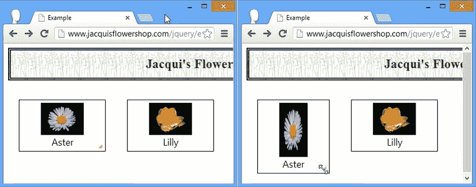

图 25-8 。使用拖动手柄更改可调整大小的元素的尺寸

配置可调整大小的交互

您可以使用表 25-9 中描述的设置来配置可调整大小的交互。可调整大小的交互依赖于我在第二十四章中描述的可拖动交互。这意味着，除了表中描述的设置，您还可以使用可拖动设置来配置可调整大小的交互，包括`delay`、`distance`、`grid`和`containment`。

表 25-9 。可调整大小的设置

| 环境 | 描述 |
| --- | --- |
| `alsoResize` | 用于匹配应与可调整大小的元素同时调整大小的元素的选择器。缺省值是`false`，意味着不调整其他元素的大小。 |
| `aspectRatio` | 当`true`时，元素的纵横比在调整大小时保持不变。默认为`false`。 |
| `autoHide` | 当`true`时，只有当鼠标悬停在可调整大小的元素上时，拖动手柄才可见。默认为`false`。 |
| `ghost` | 当`true`时，会绘制一个半透明的帮助元素，向用户显示该元素的新大小。默认为`true`。 |
| `handles` | 指定拖动手柄在可调整大小的元素上的放置位置。有关支持值的列表，请参阅本章后面的内容。 |
| `maxHeight` | 指定元素可以调整到的最大高度。默认为`null`，表示无限制。 |
| `maxWidth` | 指定元素可以调整到的最大宽度。默认为`null`，表示无限制。 |
| `minHeight` | 指定元素可以调整到的最小高度。默认值为 10 像素。 |
| `minWidth` | 指定元素可以调整到的最小宽度。默认值为 10 像素。 |

调整相关元素的大小

在我看来，`alsoResize`是配置可调整大小的交互最有用的设置。它允许您指定额外的元素，这些元素将随您应用了`resizable`方法的元素一起调整大小。我使用这个主要是为了确保内容元素的大小与其父元素同步，正如我在本章前面所演示的，当时我选择了用`div`调整大小的`img`元素。首先，它有助于理解当你有内容元素而不使用`alsoResize`设置时会发生什么。清单 25-15 设置场景。

***清单 25-15*** 。在没有 alsoResize 设置的情况下使用内容调整元素的大小

```js
...
<script type="text/javascript">
    $(document).ready(function() {
        $("#aster").resizable();
    });
</script>
...
```

如果没有`alsoResize`设置，只有`div`元素会改变大小。内容元素将保持原样。你可以在图 25-9 中看到发生了什么。

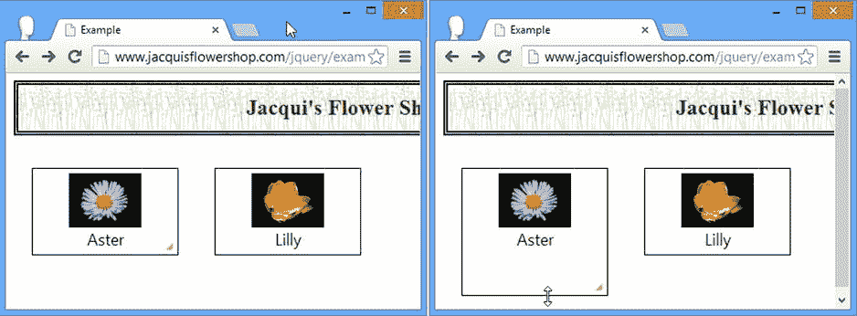

图 25-9 。调整元素的大小，但不调整其内容

有时候这很有用，但是我发现自己几乎每次使用可调整大小的交互时都在使用`alsoResize`设置。对我来说，`alsoResize`设置的好处是匹配的元素不局限于你要调整大小的元素的内容。您可以指定任何元素，如清单 25-16 所示。

***清单 25-16*** 。使用 alsoResize 设置调整附加元素的大小

```js
...
<script type="text/javascript">
    $(document).ready(function() {
        $("#aster").resizable({
            alsoResize: "#aster img, #lily, #lily img"
        });
    });
</script>
...
```

在这个脚本中，我扩大了选择范围，以包括文档中的其他`div`和`img`元素。这意味着当我调整可调整大小的`div`元素时，jQuery UI 会同时调整四个元素的大小。你可以在图 25-10 中看到效果。

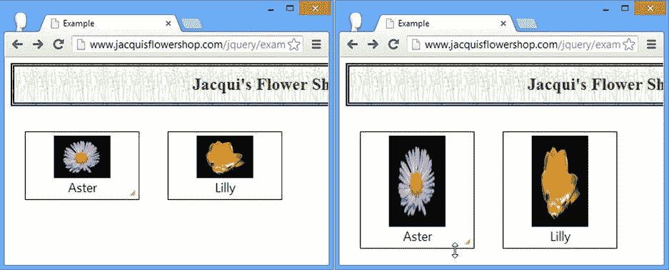

图 25-10 。调整多个元素的大小

约束可调整大小的元素大小

您可以通过应用`maxHeight`、`maxWidth`、`minHeight`和`minWidth`设置来限制可调整大小的元素的大小。所有四个设置的值都是像素数或`null`，这意味着没有限制。清单 25-17 显示了如何使用这些设置。

 **提示**`minWidth`和`minHeight`设置的默认值为 10 像素。如果该值更小，jQuery UI 将无法显示拖动手柄，这意味着用户将无法再次增加尺寸。小心使用较小的值。

***清单 25-17*** 。限制可调整大小的元素的大小

```js
...
<script type="text/javascript">
    $(document).ready(function() {
        $("#aster").resizable({
            alsoResize: "#aster img",
            maxWidth: 200,
            maxHeight: 150
        });
    });
</script>
...
```

 **提示**你也可以使用由可拖动交互定义的包容设置，我在第二十四章中描述过。这允许您将可调整大小的元素的最大大小限制为另一个元素的大小。

定位拖动控制柄

您可以通过`handles`设置来指定哪些棱角可以被拖动。该设置的值可以是`all`(意味着所有的边和角都是可拖动的)或罗盘点的组合(`n`、`e`、`s`、`w`、`ne`、`se`、`nw`、`sw`)，以指定各个角和边。

您可以指定多个值，用逗号分隔。该设置的默认值是`e, s, se`，这意味着右下角(`se`)和右边(`e`)和下边(`s`)将是可拖动的。jQuery UI 仅在右下角绘制一个对角拖动手柄，并且只有当您将`se`指定为`handles`值的一部分时。对于所有其他的边和角，当鼠标悬停在边或角上时，光标将改变以指示可以拖动。清单 25-18 显示了`handles`设置的使用。

***清单 25-18*** 。使用手柄设置

```js
...
<script type="text/javascript">
    $(document).ready(function() {
        $("#aster").resizable({
            alsoResize: "#aster img"
        });

        $("#lily").resizable({
            alsoResize: "#lilyimg",
            handles: "n, s, e, w"

        });
    });
</script>
...
```

在这个脚本中，我调整了两个`div`元素的大小，并对其中一个应用了一组自定义的拖动手柄。你可以在图 25-11 中看到 jQuery UI 是如何处理可见的拖动手柄和光标变化的。

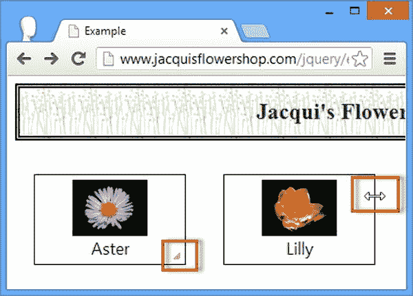

图 25-11 。使用手柄设置

摘要

在本章中，我解释并演示了三种 jQuery UI 交互:可排序、可选择和可调整大小。与我在第二十四章中描述的可拖动和可放下交互相比，这些不太常用，但如果小心应用，它们仍然很有用。与所有的交互一样，主要的挑战是让用户意识到，当 web 应用中没有标准化的视觉提示时，他或她可以拖动、选择、排序或调整元素的大小。因此，交互应该作为与应用或文档交互的其他机制的补充。这允许高级用户发现交互的优点，而其他用户依赖更明显和常规的技术。