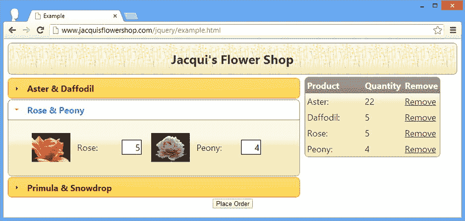
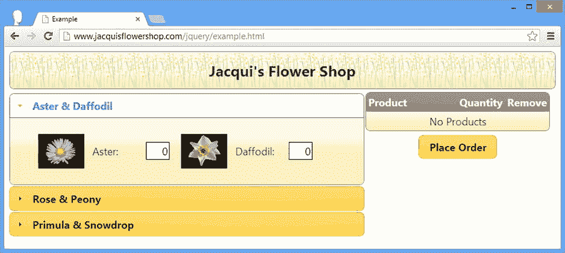

# 二十六、重构示例：第三部分

在本书的这一部分，我向您介绍了 jQuery UI 小部件和交互。这些允许您创建丰富的 web 应用，这些应用具有一致的主题，并且可以根据您的需要不断地配置和调整。在这一章中，我将把其中的一些特性添加到示例中，以演示它们是如何结合在一起的。

查看重构的示例

当您最后一次重构示例时，您正处于重新创建一些使用核心 jQuery 库的 jQuery UI 功能的边缘。你可以在[图 26-1](#Fig1) 中看到我到了哪里。


[图 26-1](#_Fig1) 。之前重构的示例文档

本书前一部分中添加的内容包括数据模板、表单验证和 Ajax，但是我还添加了一个简单的产品轮播，在一行中显示可用的产品。在这一章中，我将使用其中的一些特性，但是我的重点将是应用 jQuery UI 。清单 26-1 显示了本章的起点。

***[清单 26-1](#_list1)*** 。本章的起始文档

```js
<!DOCTYPE html>
<html>
<head>
    <title>Example</title>
    <script src="jquery-2.0.2.js" type="text/javascript"></script>
    <script src="jquery-ui-1.10.3.custom.js" type="text/javascript"></script>
    <script src="handlebars.js"></script>
    <script src="handlebars-jquery.js"></script>
    <link rel="stylesheet" type="text/css" href="jquery-ui-1.10.3.custom.css"/>
    <link rel="stylesheet" type="text/css" href="styles.css"/>
    <script id="flowerTmpl" type="text/x-handlebars-template">
        {{#flowers}}
        <div class="dcell">
            
            <label for="{{product}}">{{name}}:</label>
            <input name="{{product}}" value="0" />
        </div>
        {{/flowers}}
    </script>
    <script type="text/javascript">
        $(document).ready(function () {
            $.getJSON("mydata.json", function (data) {
                $("#flowerTmpl").template({ flowers: data })
                    .filter("*").appendTo("#products");
            });
        });
    </script>
</head>
<body>
    <h1>Jacqui's Flower Shop</h1>
    <form method="post" action="http://node.jacquisflowershop.com/order">
        <div id="products"></div>
        <div id="buttonDiv"><button type="submit">Place Order</button></div>
    </form>
</body>
</html>
```

我使用`getJSON`方法从 JSON 文件中获取产品的细节，并使用数据模板生成元素。我将产品元素添加到一个单独的`div`元素中，该元素的`id`为`products`。你可以在[图 26-2](#Fig2) 中看到结果。


[图 26-2](#_Fig2) 。本章的起始文档

展示产品

我将使用一个手风琴向用户展示产品。我只需要处理六个产品，但是我将把它们分成两个一组，并使用 jQuery 来创建 accordion 所需的元素结构。清单 26-2 显示了对文档的修改。

***[清单 26-2](#_list2)*** 。分类和构建花卉元素

```js
<!DOCTYPE html>
<html>
<head>
    <title>Example</title>
    <script src="jquery-2.0.2.js" type="text/javascript"></script>
    <script src="jquery-ui-1.10.3.custom.js" type="text/javascript"></script>
    <script src="handlebars.js"></script>
    <script src="handlebars-jquery.js"></script>
    <link rel="stylesheet" type="text/css" href="jquery-ui-1.10.3.custom.css"/>
    <link rel="stylesheet" type="text/css" href="styles.css"/>
    <style type="text/css">
        .dcell img {height: 60px}
    </style>
    <script id="flowerTmpl" type="text/x-handlebars-template">
        {{#flowers}}
            <div class="dcell">
                
                <label for="{{product}}">{{name}}:</label>
                <input name="{{product}}" value="0" />
            </div>
        {{/flowers}}
    </script>
    <script type="text/javascript">
        $(document).ready(function () {
            $.getJSON("mydata.json", function (data) {
                var flowers = $("#flowerTmpl").template({ flowers: data }).filter("*");

                var rowCount = 1;
                for (var i = 0; i < flowers.length; i += 2) {

                    $("<a>").text(data[i].name + "&" + data[i + 1].name)
                        .appendTo("<h2>").parent().appendTo("#products");

                    $("<div>").attr("id", "row" + (rowCount++))
                        .appendTo("#products")
                        .append(flowers.slice(i, i + 2))
                }
                $("#products").accordion();
            });
        });
    </script>
</head>
<body>
    <h1>Jacqui's Flower Shop</h1>
    <form method="post" action="http://node.jacquisflowershop.com/order">
        <div id="products"></div>
        <div id="buttonDiv"><button type="submit">Place Order</button></div>
    </form>
</body>
</html>
```

我已经重写了传递给`getJSON`方法的函数来创建 accordion，包括构造元素结构和调用`accordion`方法。新的实现使用 JSON 数据对象来提取部分标题的花的名称，但仍然使用数据模板来生成 HTML 元素，这些元素被分割并放入包装器`div`元素中以适应 accordion 小部件。你可以在[图 26-3](#Fig3) 中看到添加对`accordion`方法的调用前后文档是如何出现的。


[图 26-3](#_Fig3) 。创建元素结构并调用 accordion 方法

添加购物篮

下一步是添加一个简单的购物篮，向用户显示她所做的选择。清单 26-3 显示了对示例文档的补充。

***[清单 26-3](#_list3)*** 。添加购物篮

```js
<!DOCTYPE html>
<html>
<head>
    <title>Example</title>
    <script src="jquery-2.0.2.js" type="text/javascript"></script>
    <script src="jquery-ui-1.10.3.custom.js" type="text/javascript"></script>

    <script src="handlebars.js"></script>
    <script src="handlebars-jquery.js"></script>
    <link rel="stylesheet" type="text/css" href="jquery-ui-1.10.3.custom.css"/>
    <link rel="stylesheet" type="text/css" href="styles.css"/>
    <style type="text/css">
        .dcell img {height: 60px}
        #basketTable {border: thin solid black; border-collapse: collapse}
        th, td {padding: 4px; width: 50px}
        td:first-child, th:first-child {width: 150px}
        #placeholder {text-align: center}
        #productWrapper {float: left; width: 65%}
        #basket {width: 30%; text-align: left; float: left; margin-left: 10px}
        #buttonDiv {clear: both}
    </style>
    <script id="flowerTmpl" type="text/x-handlebars-template">
        {{#flowers}}
            <div class="dcell">
                
                <label for="{{product}}">{{name}}:</label>
                <input name="{{product}}" value="0" />
            </div>
        {{/flowers}}
    </script>
    <script id="rowTmpl" type="text/x-handlebars-template">
        <tr id="{{name}}"><td>{{product}}</td><td>{{val}}</td>
            <td><a href="#">Remove</a></td>
        </tr>
    </script>
    <script type="text/javascript">
        $(document).ready(function () {

            $.getJSON("mydata.json", function (data) {

                var flowers = $("#flowerTmpl").template({ flowers: data }).filter("*");

                var rowCount = 1;
                for (var i = 0; i < flowers.length; i += 2) {
                    $("<a>").text(data[i].name + " & " + data[i + 1].name)
                        .appendTo("<h2>").parent().appendTo("#products");
                    $("<div>").attr("id", "row" + (rowCount++))
                        .appendTo("#products")
                        .append(flowers.slice(i, i + 2));
                }
                $("#products").accordion();

                $("input").change(function (event) {
                    $("#placeholder").hide();
                    var fname = $(this).attr("name");
                    var row = $("tr[id=" + fname + "]");

                    if (row.length == 0) {
                        $("#rowTmpl").template({
                            name: fname,
                            val: $(this).val(),
                            product: $(this).siblings("label").text()
                        }).appendTo("#basketTable").find("a").click(function () {
                            removeTableRow($(this).closest("tr"));
                            var iElem = $("#products").find("input[name=" + fname + "]");
                            $("#products").accordion("option", "active",
                                iElem.closest("div[id^=row]").index("div[id^=row]"));
                            iElem.val(0).select();
                        });
                    } else if ($(this).val() != "0") {
                        row.children().eq(1).text($(this).val());
                    } else {
                        removeTableRow(row);
                    }
                });
            });

            function removeTableRow(row) {
                row.remove();
                if ($("#basketTable tbody").children(":visible").length == 1) {
                    $("#placeholder").show();
                }
            }
        });
    </script>
</head>
<body>
    <h1>Jacqui's Flower Shop</h1>
    <form method="post" action="http://node.jacquisflowershop.com/order">
        <div id="productWrapper">
            <div id="products"></div>
        </div>
        <div id="basket" class="ui-widget">
            <table border=1 id="basketTable">
                <tr><th>Product</th><th>Quantity</th><th>Remove</th></tr>
                <tr id="placeholder"><td colspan=3>No Products</td></tr>
            </table>
        </div>
        <div id="buttonDiv"><button type="submit">Place Order</button></div>
    </form>
</body>
</html>
```

折叠手风琴

我想把篮子放在手风琴旁边展示。为此，我将为`accordion`方法选择的元素包装在另一个`div`元素中，如下所示:

```js
...
<div id="productWrapper">
    <div id="products"></div>
</div>
...
```

如果 accordion 小部件没有被设置为占据父元素宽度的 100 %,它就会变得混乱，所以我添加了 wrapper 元素，然后使用 CSS `width`属性来固定它的大小，如下所示:

```js
...
#productWrapper {float: left;width: 65%}
...
```

accordion 小部件愉快地占据了包装器`div`元素的 100 %,而后者只占据了其父元素的 65%。

添加表格

我决定使用一个`table`元素来显示购物篮，我已经将它添加到了文档的静态元素中，如下所示:

```js
...
<div id="basket" class="ui-widget">
    <table border=1 id="basketTable">
        <tr><th>Product</th><th>Quantity</th><th>Remove</th></tr>
        <tr id="placeholder"><td colspan=3>No Products</td></tr>
    </table>
</div>
...
```

就像手风琴一样，我将`table`元素放在一个包装器中，包装器的宽度是用 CSS 设置的:

```js
...
#basket {width: 30%; text-align: left; float: left; margin-left: 10px}
...
```

`table`元素包含一个标题行和一个跨越整个表格的占位符。你可以在[图 26-4](#Fig4) 中看到创建的效果。


[图 26-4](#_Fig4) 。将表格添加到文档中

处理输入值更改

为了将表格链接到手风琴，我监听在`getJSON`函数中创建的`input`元素上的`change`事件，如下所示:

```js
...
$("input").change(function (event) {
    $("#placeholder").hide();
    var fname = $(this).attr("name");
    var row = $("tr[id=" + fname + "]");

    if (row.length == 0) {
        $("#rowTmpl").template({
            name: fname,
            val: $(this).val(),
            product: $(this).siblings("label").text()
        }).appendTo("#basketTable").find("a").click(function () {
            removeTableRow($(this).closest("tr"));
            var iElem = $("#products").find("input[name=" + fname + "]");
            $("#products").accordion("option", "active",
                iElem.closest("div[id^=row]").index("div[id^=row]"));
            iElem.val(0).select();
        });
    } else if ($(this).val() != "0") {
        row.children().eq(1).text($(this).val());
    } else {
        removeTableRow(row);
    }
});
...
```

这个函数中发生了很多事情。当用户更改一个值时，我会检查表中是否已经有相应产品的一行。如果没有，那么我使用下面的模板创建一个新行:

```js
...
<script id="rowTmpl" type="text/x-handlebars-template">
    <tr id="{{name}}"><td>{{product}}</td><td>{{val}}</td>
        <td><a href=#>Remove</a></td>
    </tr>
</script>
...
```

为了获取这个模板的值，我使用核心 jQuery 方法从触发事件的`input`元素中获取信息。我还想要产品的显示名称，这是通过导航 DOM 找到附近的`label`元素并读取其内容获得的，如下所示:

```js
...
$(this).siblings("label").text()
...
```

我将新行追加到表中。占位符行已经隐藏，回到函数的开头:

```js
...
$("#placeholder").hide();
...
```

您可以在[图 26-5](#Fig5) 中看到新增的行是如何出现的。用户在一个`input`元素中输入一个值，当焦点改变时，一个新的行出现在 basket 表中。


[图 26-5](#_Fig5) 。向购物篮表添加行

删除行

您可以看到，我已经将一个`a`元素添加到表格行中，作为数据模板的一部分。当我从数据模板创建行时，我为这个元素注册了一个处理程序，如下所示:

```js
...
}).appendTo("#basketTable").find("a").click(function () {
    removeTableRow($(this).closest("tr"));
    var iElem = $("#products").find("input[name=" + fname + "]");
    $("#products").accordion("option", "active",
        iElem.closest("div[id^=row]").index("div[id^=row]"));
    iElem.val(0).select();
});
...
```

我做的第一件事是调用`removeTableRow`函数，将最近的祖先`tr`元素传递给`a`元素。`removeTableRow`函数使用`remove`方法从文档中删除指定的元素。如果没有与产品相关的行，它还会恢复表中的占位符行，如下所示:

```js
...
function removeTableRow(row) {
    row.remove();
    if ($("#basketTable tbody").children(":visible").length == 1) {
        $("#placeholder").show();
    }
}
...
```

一旦删除了行，我就找到与产品中的行相关联的`input`元素。然后，我在 DOM 中导航，找到作为`input`元素的父元素的 accordion panel 元素，获取其对等元素中的`index`，并将其设置为 accordion 小部件的`active`选项。这具有打开包含用户刚刚从购物篮中删除的产品的折叠部分的效果。最后，我将`input`元素的值设置为零，并调用`select`方法，这样它就被聚焦，并且该值被选中。你可以在[图 26-6](#Fig6) 中看到效果(虽然这是你真的需要在浏览器中看到才能欣赏的东西)。


[图 26-6](#_Fig6) 。当表格行被删除时，聚焦于 accordion 中的输入元素

 **提示**当用户在表格中有一行的`input`元素中输入零值时，我也会删除行。我使用`removeTableRow`函数来完成这个操作，以便在需要时显示占位符。

更新现有行

如果产品已经有一行，那么用户实际上是在改变她想要订购的数量。我没有删除和替换该行，而是在`table`中找到它并更新单元格的内容:

```js
...
row.children().eq(1).text($(this).val())
...
```

`row`变量是一个 jQuery 对象，包含表中产品的`tr`元素。我通过位置(使用`index`方法)访问`td`元素，然后使用`text`方法设置其内容。

应用主题样式

篮子的功能性还好，但是外观很糟糕。幸运的是，jQuery UI 提供了一个 CSS 样式的框架，您可以将它应用于元素，使它们具有与主题应用于小部件相同的视觉外观。清单 26-4 显示了对文档中 HTML 元素的一些简单添加。

***[清单 26-4](#_list4)*** 。将 jQuery UI CSS 框架样式应用于表格元素

```js
...
<body>
    <h1>Jacqui's Flower Shop</h1>
    <form method="post" action="http://node.jacquisflowershop.com/order">
        <div id="productWrapper">
            <div id="products"></div>
        </div>
        <div id="basket"class="ui-widget ui-widget-content">
            <table border=0id="basketTable">
                <trclass="ui-widget-header">
                    <th>Product</th><th>Quantity</th><th>Remove</th></tr>
                <tr id="placeholder"><td colspan=3>No Products</td></tr>
            </table>
        </div>
        <div id="buttonDiv"><button type="submit">Place Order</button></div>
    </form>
</body>
...
```

你可能已经注意到我在前面章节的一些例子中使用了`ui-widget`类。这是基本的 jQuery UI 样式，它应用于元素集的外部容器，这些元素集需要与 jQuery UI 小部件一致的外观。`ui-widget-content`类用于包含内容的元素，而`ui-widget-header`正如其名称所示，用于标题元素。

 **提示**我在[第三十五章](35.html)中描述了 jQuery UI CSS 框架类。

除了应用这些类，我还禁用了`table`元素的边框，如下所示:

```js
...
#basketTable {border: none; border-collapse: collapse}
...
```

你可以在[图 26-7](#Fig7) 中看到效果。


[图 26-7](#_Fig7) 。将 jQuery UI CSS 框架类应用到表中

更广泛地应用 CSS 框架

您可以更进一步，更广泛地应用框架风格。清单 26-5 显示了对文档的一些有用的补充。

***[清单 26-5](#_list5)*** 。更广泛地应用框架风格

```js
...
<body>
    <div id="logoWrapper" class="ui-widget ui-widget-content ui-corner-all">
        <h1 id="logo">Jacqui's Flower Shop</h1>
    </div>
    <form method="post" action="http://node.jacquisflowershop.com/order">
        <div id="productWrapper">
            <div id="products"></div>
        </div>
        <div id="basket" class="ui-widget ui-widget-content">
            <table border=0 id="basketTable">
                <tr class="ui-widget-header">
                    <th>Product</th><th>Quantity</th><th>Remove</th></tr>
                <tr id="placeholder"><td colspan=3>No Products</td></tr>
            </table>
        </div>
        <div id="buttonDiv"><button type="submit">Place Order</button></div>
    </form>
</body>
...
```

我已经将`h1`元素放在了一个`div`中，并应用了几个框架样式，包括`ui-corner-all`，这创建了你在[图 26-8](#Fig8) 中可以看到的圆角。我还在这个文档中应用了一些新的样式来创建我想要的效果，覆盖了从第三章[开始使用的`styles.css`文件中的样式:](03.html)

```js
...
<style type="text/css">
    .dcell img {height: 60px}
    #basketTable {border: none; border-collapse: collapse}
    th, td {padding: 4px; width: 50px}
    td:first-child, th:first-child {width: 150px}
    #placeholder {text-align: center}
    #productWrapper {float: left; width: 65%}
    #basket {width: 33%; text-align: left; float: left; margin-left: 10px;
        position: absolute; right: 10px}
    #buttonDiv {clear: both}
    #logo {font-size: 1.5em; background-size: contain; margin: 1px;
        border: none; color: inherit}
    #logoWrapper {margin-bottom: 5px}
</style>
...
```


[图 26-8](#_Fig8) 。将 CSS 框架样式应用到文档标题

将圆角应用于桌子

将`ui-corner-all`类应用到`table`元素会导致一些问题，如图[图 26-9](#Fig9) 所示。你会注意到`table`元素没有圆角。这是由 jQuery UI CSS 框架类和大多数浏览器中处理表格的方式之间的交互引起的。


[图 26-9](#_Fig9) 。桌子上圆角的效果

为了解决这个问题，您需要更改`table`元素，稍微不同地应用 jQuery UI CSS 框架类，并定义一个新的定制样式。首先，您需要修改`table`，如[清单 26-6](#list6) 所示。

***[清单 26-6](#_list6)*** 。修改表格元素以支持圆角

```js
...
<form method="post" action="http://node.jacquisflowershop.com/order">
    <div id="productWrapper">
        <div id="products"></div>
    </div>
    <div id="basket" class="ui-widget ui-widget-contentui-corner-all">
        <table border=0 id="basketTable">
            <thead id="theader" class="ui-widget-header">
                <tr>
                    <thclass="ui-corner-tl">Product</th>                    <th>Quantity</th>
                    <thclass="ui-corner-tr">Remove</th></tr>
            </thead>
            <tr id="placeholder"><td colspan=3>No Products</td></tr>
        </table>
    </div>
    <div id="buttonDiv"><button type="submit">Place Order</button></div>
</form>
...
```

我在`table`中添加了一个`thead`元素，将标题和正文行分开。给`thead`元素分配一个`id`并应用`ui-widget-header`类是很重要的。因为 header 是`ui-widget-header`类的一部分，所以可以将其从`tr`元素中移除。

接下来，将`ui-corner-tl`和`ui-corner-tr`类应用于标题行的外部单元格。这些类为它们被分配到的元素的左上角和右上角创建圆角。(我在[第 35 章](35.html)中描述了所有的 jQuery UI CSS 框架类。)

接下来，您需要使用赋予`thead`元素的`id`来禁用`style`元素中的 CSS `border`属性，并对`table`元素执行相同的操作，如下所示:

```js
...
<style type="text/css">
    .dcell img {height: 60px}
    #basketTable {border: none; border-collapse: collapse}
    th, td {padding: 4px; width: 50px}
    td:first-child, th:first-child {width: 150px}
    #placeholder {text-align: center}
    #productWrapper {float: left; width: 65%}
    #basket {width: 33%; text-align: left; float: left; margin-left: 10px;
        position: absolute; right: 10px}
    #buttonDiv {clear: both}
    #logo {font-size: 1.5em; background-size: contain; margin: 1px;
        border: none; color: inherit}
    #logoWrapper {margin-bottom: 5px}
    #theader {border: none}
</style>
...
```

最后，您需要对`removeTableRow`函数做一点小小的调整。既然您已经分离了标题行并将其放入了一个`thead`元素中，那么在`tbody`中就少了一行。这是零钱:

```js
...
function removeTableRow(row) {
    row.remove();
    if ($("#basketTable tbody").children(":visible").length == 0) {
        $("#placeholder").show();
    }
}
...
```

 **提示**`tbody`元素是浏览器在解析表格元素时自动创建的。HTML 的一个奇怪之处是，您不必指定这个元素(尽管如果愿意，您可以指定)。

有了这些改变，你就有了一个与文档中其他元素相匹配的圆角表格，如图 26-10 所示。



[图 26-10](#_Fig10) 。圆角桌子

创建 jQuery UI 按钮

下一步是重新定位按钮，并将其转换为 jQuery UI 小部件。清单 26-7 显示了对文档的修改。

***[清单 26-7](#_list7)*** 。按钮的重新定位和变形

```js
<!DOCTYPE html>
<html>
<head>
    <title>Example</title>
    <script src="jquery-2.0.2.js" type="text/javascript"></script>
    <script src="jquery-ui-1.10.3.custom.js" type="text/javascript"></script>
    <script src="handlebars.js"></script>
    <script src="handlebars-jquery.js"></script>
    <link rel="stylesheet" type="text/css" href="jquery-ui-1.10.3.custom.css"/>
    <link rel="stylesheet" type="text/css" href="styles.css"/>
    <style type="text/css">
        .dcell img {height: 60px}
        #basketTable {border: none; border-collapse: collapse}
        th, td {padding: 4px; width: 50px}
        td:first-child, th:first-child {width: 150px}
        #placeholder {text-align: center}
        #productWrapper {float: left; width: 65%}
        #basket {text-align: left;}
        #buttonDiv {clear: both; margin: 5px}
        #logo {font-size: 1.5em; background-size: contain; margin: 1px;
            border: none; color: inherit}
        #logoWrapper {margin-bottom: 5px}
        #theader {border: none}
    </style>
    <script id="flowerTmpl" type="text/x-handlebars-template">
        {{#flowers}}
            <div class="dcell">
                
                <label for="{{product}}">{{name}}:</label>
                <input name="{{product}}" value="0" />
            </div>
        {{/flowers}}
    </script>
    <script id="rowTmpl" type="text/x-handlebars-template">
        <tr id="{{name}}"><td>{{product}}</td><td>{{val}}</td>
            <td><a href="#">Remove</a></td>
        </tr>
    </script>
    <script type="text/javascript">
        $(document).ready(function () {

            $.getJSON("mydata.json", function (data) {

                var flowers = $("#flowerTmpl").template({ flowers: data }).filter("*");

                var rowCount = 1;
                for (var i = 0; i < flowers.length; i += 2) {
                    $("<a>").text(data[i].name + " & " + data[i + 1].name)
                        .appendTo("<h2>").parent().appendTo("#products");
                    $("<div>").attr("id", "row" + (rowCount++))
                        .appendTo("#products")
                        .append(flowers.slice(i, i + 2));
                }
                $("#products").accordion();

                $("input").change(function (event) {
                    $("#placeholder").hide();
                    var fname = $(this).attr("name");
                    var row = $("tr[id=" + fname + "]");

                    if (row.length == 0) {
                        $("#rowTmpl").template({
                            name: fname,
                            val: $(this).val(),
                            product: $(this).siblings("label").text()
                        }).appendTo("#basketTable").find("a").click(function () {
                            removeTableRow($(this).closest("tr"));
                            var iElem = $("#products").find("input[name=" + fname + "]");
                            $("#products").accordion("option", "active",
                                iElem.closest("div[id^=row]").index("div[id^=row]"));
                            iElem.val(0).select();
                        });
                    } else if ($(this).val() != "0") {
                        row.children().eq(1).text($(this).val());
                    } else {
                        removeTableRow(row);
                    }
                });
            });

            $("#buttonDiv, #basket").wrapAll("<div>").parent().css({
                float: "left",
                marginLeft: "2px"
            });

            $("button").button();

            function removeTableRow(row) {
                row.remove();
                if ($("#basketTable tbody").children(":visible").length == 0) {
                    $("#placeholder").show();
                }
            }
        });
    </script>
</head>
<body>
    <div id="logoWrapper" class="ui-widget ui-widget-content ui-corner-all">
        <h1 id="logo">Jacqui's Flower Shop</h1>
    </div>
    <form method="post" action="http://node.jacquisflowershop.com/order">
        <div id="productWrapper">
            <div id="products"></div>
        </div>
        <div id="basket" class="ui-widget ui-widget-content ui-corner-all">
            <table border=0 id="basketTable">
                <thead id="theader" class="ui-widget-header">
                    <tr>
                        <th class="ui-corner-tl">Product</th>
                        <th>Quantity</th>
                        <th class="ui-corner-tr">Remove</th></tr>
                </thead>
                <tr id="placeholder"><td colspan=3>No Products</td></tr>
            </table>
        </div>
        <div id="buttonDiv"><button type="submit">Place Order</button></div>
    </form>
</body>
</html>
```

我将`buttonDiv`和`basket`元素包装在一个新的`div`元素中，并调整了一些 CSS 样式来调整这些元素的位置。并且，如图 26-11 所示，我调用`button`方法来创建一个 jQuery UI 按钮。


[图 26-11](#_Fig11) 。重新定位和变换按钮元素

添加完成对话框

当用户单击 Place Order 按钮时，我想从他们那里收集一些额外的信息。在第 20 章中，我向你展示了如何使用标签显示多部分表单，所以为了更多样化，这次我将使用一个对话框小部件。[清单 26-8](#list8) 显示了对话框文档的变化。

***[清单 26-8](#_list8)*** 。添加对话框

```js
<!DOCTYPE html>
<html>
<head>
    <title>Example</title>
    <script src="jquery-2.0.2.js" type="text/javascript"></script>
    <script src="jquery-ui-1.10.3.custom.js" type="text/javascript"></script>
    <script src="handlebars.js"></script>
    <script src="handlebars-jquery.js"></script>
    <link rel="stylesheet" type="text/css" href="jquery-ui-1.10.3.custom.css"/>
    <link rel="stylesheet" type="text/css" href="styles.css"/>

    <style type="text/css">
        .dcell img {height: 60px}
        #basketTable {border: none; border-collapse: collapse}
        th, td {padding: 4px; width: 50px}
        td:first-child, th:first-child {width: 150px}
        #placeholder {text-align: center}
        #productWrapper {float: left; width: 65%}
        #basket {text-align: left;}
        #buttonDiv {clear: both; margin: 5px}
        #logo {font-size: 1.5em; background-size: contain; margin: 1px;
            border: none; color: inherit}
        #logoWrapper {margin-bottom: 5px}
        #theader {border: none}
        #completeDialog input {width: 150px; margin-left: 5px; text-align: left}
        #completeDialog label {width: 60px; text-align: right}
    </style>
    <script id="flowerTmpl" type="text/x-handlebars-template">
        {{#flowers}}
            <div class="dcell">
                
                <label for="{{product}}">{{name}}:</label>
                <input name="{{product}}" value="0" />
            </div>
        {{/flowers}}
    </script>
    <script id="rowTmpl" type="text/x-handlebars-template">
        <tr id="{{name}}"><td>{{product}}</td><td>{{val}}</td>
            <td><a href="#">Remove</a></td>
        </tr>
    </script>
    <script type="text/javascript">
        $(document).ready(function () {

            $.getJSON("mydata.json", function (data) {

                var flowers = $("#flowerTmpl").template({ flowers: data }).filter("*");

                var rowCount = 1;
                for (var i = 0; i < flowers.length; i += 2) {
                    $("<a>").text(data[i].name + " & " + data[i + 1].name)
                        .appendTo("<h2>").parent().appendTo("#products");
                    $("<div>").attr("id", "row" + (rowCount++))
                        .appendTo("#products")
                        .append(flowers.slice(i, i + 2));
                }
                $("#products").accordion();

                $("#products input").change(function (event) {
                    $("#placeholder").hide();
                    var fname = $(this).attr("name");
                    var row = $("tr[id=" + fname + "]");

                    if (row.length == 0) {
                        $("#rowTmpl").template({
                            name: fname,
                            val: $(this).val(),
                            product: $(this).siblings("label").text()
                        }).appendTo("#basketTable").find("a").click(function () {
                            removeTableRow($(this).closest("tr"));
                            var iElem = $("#products").find("input[name=" + fname + "]");
                            $("#products").accordion("option", "active",
                                iElem.closest("div[id^=row]").index("div[id^=row]"));
                            iElem.val(0).select();
                        });
                    } else if ($(this).val() != "0") {
                        row.children().eq(1).text($(this).val());
                    } else {
                        removeTableRow(row);
                    }
                });
            });

            $("#buttonDiv, #basket").wrapAll("<div>").parent().css({
                float: "left",
                marginLeft: "2px"
            });

            $("button").button();

            $("#completeDialog").dialog({
                modal: true,
                buttons: [{ text: "OK", click: sendOrder },
                          {
                              text: "Cancel", click: function () {
                                  $("#completeDialog").dialog("close");
                              }
                          }]
            });

            function sendOrder() {

            }

            function removeTableRow(row) {
                row.remove();
                if ($("#basketTable tbody").children(":visible").length == 0) {
                    $("#placeholder").show();
                }
            }
        });
    </script>
</head>
<body>
    <div id="logoWrapper" class="ui-widget ui-widget-content ui-corner-all">
        <h1 id="logo">Jacqui's Flower Shop</h1>
    </div>
    <form method="post" action="http://node.jacquisflowershop.com/order">
        <div id="productWrapper">
            <div id="products"></div>
        </div>
        <div id="basket" class="ui-widget ui-widget-content ui-corner-all">
            <table border=0 id="basketTable">
                <thead id="theader" class="ui-widget-header">
                    <tr>
                        <th class="ui-corner-tl">Product</th>
                        <th>Quantity</th>
                        <th class="ui-corner-tr">Remove</th></tr>
                </thead>
                <tr id="placeholder"><td colspan=3>No Products</td></tr>
            </table>
        </div>
        <div id="buttonDiv"><button type="submit">Place Order</button></div>
    </form>
    <div id="completeDialog" title="Complete Purchase">
        <div><label for="name">Name: </label><input name="first" /></div>
        <div><label for="email">Email: </label><input name="email" /></div>
        <div><label for="city">City: </label><input name="city" /></div>
    </div>
</body>
</html>
```

我添加了一个`div`元素，它的内容将在`body`元素中显示给用户，同时添加了一些 CSS 样式来覆盖使用`link`元素导入到文档中的`styles.css`文件中的样式。下面是对创建对话框小部件的`dialog`方法的调用:

```js
...
$("#completeDialog").dialog({
    modal: true,
    buttons: [{ text: "OK", click: sendOrder },
                {
                    text: "Cancel", click: function () {
                        $("#completeDialog").dialog("close");
                    }
                }]
});
...
```

我创建了一个有两个按钮的模态对话框。单击取消按钮将关闭对话框。点击确定按钮将调用`sendOrder`功能。这个函数目前不做任何事情。

正如你在第 22 章中所记得的，对话框部件默认是打开的，这意味着它一创建就显示给用户。你可以在[图 26-12](#Fig12) 中看到它是如何出现的。


[图 26-12](#_Fig12) 。用于完成购买的对话框

 **提示**注意，当我在`input`元素上设置`change`事件时，我缩小了选择范围。我将选择限制为排除对话框中的那些输入元素。如果我没有这样做，在完成购买对话框中输入一个值就会在购物篮中添加一个新的项目。

点击处理下单按钮

我不想让用户看到对话框，直到他们点击下订单按钮。我使用`autoOpen`设置来隐藏对话框，直到需要的时候，并使用`click`方法来处理按钮点击，如[清单 26-9](#list9) 所示。

***[清单 26-9](#_list9)*** 。隐藏对话框和处理按钮单击

```js
...
<script type="text/javascript">
    $(document).ready(function () {

        $.getJSON("mydata.json", function (data) {

            var flowers = $("#flowerTmpl").template({ flowers: data }).filter("*");

            var rowCount = 1;
            for (var i = 0; i < flowers.length; i += 2) {
                $("<a>").text(data[i].name + " & " + data[i + 1].name)
                    .appendTo("<h2>").parent().appendTo("#products");
                $("<div>").attr("id", "row" + (rowCount++))
                    .appendTo("#products")
                    .append(flowers.slice(i, i + 2));
            }
            $("#products").accordion();

            $("#products input").change(function (event) {
                $("#placeholder").hide();
                var fname = $(this).attr("name");
                var row = $("tr[id=" + fname + "]");

                if (row.length == 0) {
                    $("#rowTmpl").template({
                        name: fname,
                        val: $(this).val(),
                        product: $(this).siblings("label").text()
                    }).appendTo("#basketTable").find("a").click(function () {
                        removeTableRow($(this).closest("tr"));
                        var iElem = $("#products").find("input[name=" + fname + "]");
                        $("#products").accordion("option", "active",
                            iElem.closest("div[id^=row]").index("div[id^=row]"));
                        iElem.val(0).select();
                    });
                } else if ($(this).val() != "0") {
                    row.children().eq(1).text($(this).val());
                } else {
                    removeTableRow(row);
                }
            });
        });

        $("#buttonDiv, #basket").wrapAll("<div>").parent().css({
            float: "left",
            marginLeft: "2px"
        });

        $("button").button().click(function (e) {
            e.preventDefault();
            if ($("#placeholder:visible").length) {

                $("<div>Please select some products</div>").dialog({
                    modal: true,
                    buttons: [{
                        text: "OK",
                        click: function () { $(this).dialog("close") }
                    }]
                })
            } else {
                $("#completeDialog").dialog("open");
            }
        });

        $("#completeDialog").dialog({
            modal: true,
            autoOpen: false,
            buttons: [{ text: "OK", click: sendOrder },
                        {
                            text: "Cancel", click: function () {
                                $("#completeDialog").dialog("close");
                            }
                        }]
        });

        function sendOrder() {

        }

        function removeTableRow(row) {
            row.remove();
            if ($("#basketTable tbody").children(":visible").length == 0) {
                $("#placeholder").show();
            }
        }
    });
</script>
...
```

当用户点击按钮时，我会检查`placeholder`元素是否可见。我使用 jQuery 来实现这一点，使用一个选择器来生成一个`jQuery`对象，该对象仅在占位符可见时包含元素。

我使用占位符的可见性作为用户选择一些产品的代理。如果购物篮中有任何选择，占位符是隐藏的，因此一个可见的占位符告诉我没有选择。

 **提示**这是一个很好的例子，展示了如何在文档中对功能进行分层，但这确实意味着我对产品选择的简单测试依赖于购物篮的实现，如果我修改了购物篮的工作方式，就需要进行修改。

如果用户没有选择任何产品就点击按钮，我会动态地创建并显示一个对话框小部件。你可以在图 26-13 中看到这是如何出现的。如果已经进行了选择，那么将显示完成对话框，以获取我希望从用户那里获得的最终信息。


[图 26-13](#_Fig13) 。如果没有产品选择，则显示一个对话框

完成订单

剩下的工作就是实现`sendOrder`函数。我已经向您展示了通过 Ajax 向服务器发送数据的不同方式，所以为了简化这一章，我将简单地从各种输入元素中收集值，并创建一个可以发送到服务器进行处理的 JSON 对象。清单 26-10 显示了对文档的补充。

***[清单 26-10](#_list10)*** 。完成订单流程

```js
...
function sendOrder() {
    var data = new Object();
    $("input").each(function(index, elem) {
        var jqElem = $(elem);
        data[jqElem.attr("name")] = jqElem.val();
    })
    console.log(JSON.stringify(data));
    $("#completeDialog").dialog("close");
    $("#products input").val("0");
    $("#products").accordion("option", "active", 0)
    $("#basketTable tbody").children(":visible").remove();
    $("#placeholder").show();
}
...
```

在这个函数中，我从每个`input`元素中获取值，并将它们作为属性添加到一个对象中，然后我将其转换为 JSON 并写入控制台。

更有用的是，我然后重置文档，关闭对话框，重置`input`元素的值，切换到手风琴的第一个面板，并重置篮子。[图 26-14](#Fig14) 显示了一些产品选择的文件。我将使用这些来生成 JSON 字符串。


[图 26-14](#_Fig14) 。使用示例文档选择产品

当我点击“下订单”按钮时，会出现一个对话框，要求提供更多信息，如图[图 26-15](#Fig15) 所示。


[图 26-15](#_Fig15) 。提供附加信息完成订单

最后，单击 OK 按钮生成 JSON 并重置文档。这个例子的 JSON 如下:

```js
{"aster":"12","daffodil":"7","rose":"5","peony":"2","primula":"0","snowdrop":"0",
 "first":"Adam Freeman","email":"adam@my.com","city":"London"}
```

如图 26-16 所示，你又回到了起点，准备再次经历这个过程。



[图 26-16](#_Fig16) 。重置文档

摘要

在这一章中，我重构了示例文档，加入了 jQuery UI 的特性。我添加了一些小部件，比如 accordion、dialog 和 button，并初步介绍了如何应用 jQuery UI CSS 框架类来管理其他元素的外观。我在第 35 章中给出了关于这些 CSS 类的更多细节。在第 5 部分中，我将转向 jQuery Mobile，您可以使用它来创建面向移动设备的 web 应用。