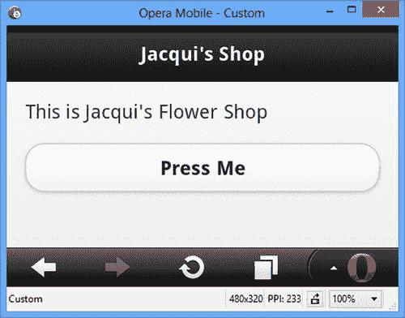
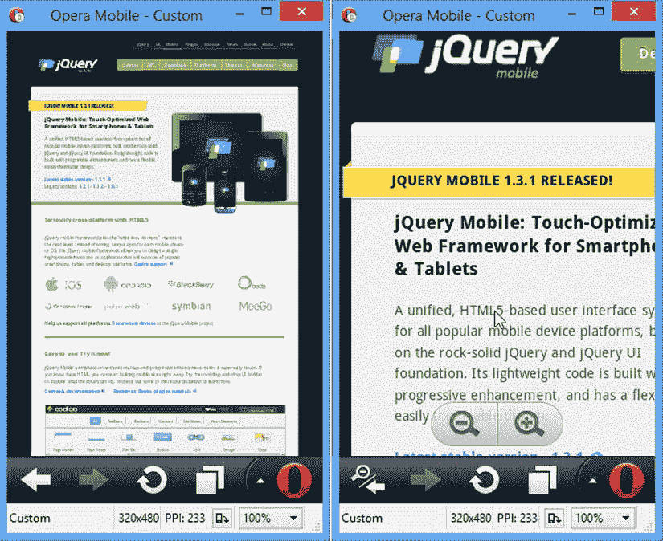
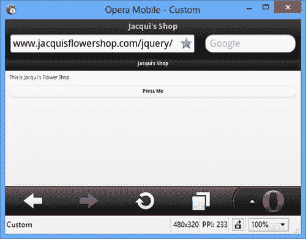
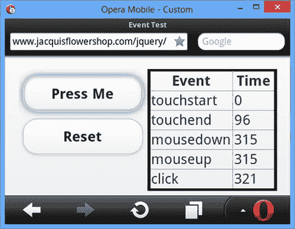
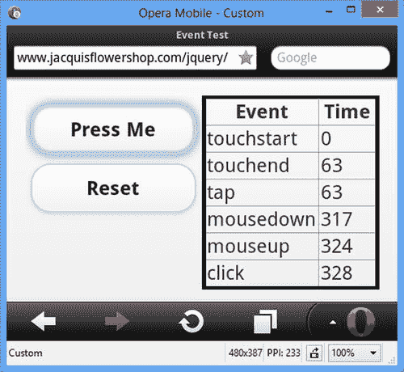
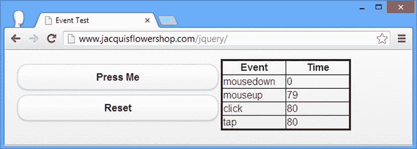
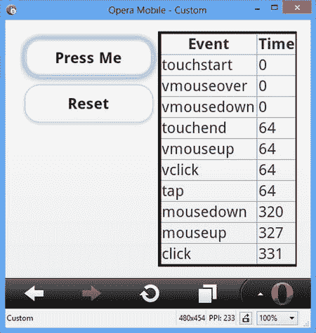
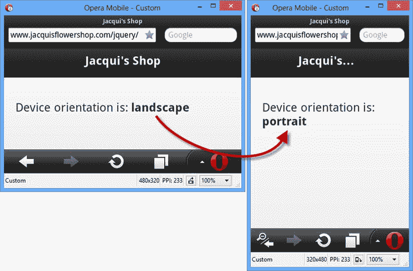

# 二十七、jQuery Mobile 入门

在这一章中，我将向您展示如何获得 jQuery Mobile 并将其添加到 HTML 文档中。我还解释了 jQuery Mobile 采用不同的方法来创建小部件，以及您必须如何适应这种方法。支持触摸的设备为 web 应用开发人员带来了一些独特的挑战，我将解释 jQuery Mobile 提供的一些核心特性，以帮助简化开发过程，并为移动 web 应用的开发和测试提供一些通用指南。表 27-1 提供了本章的总结。

[表 27-1](#_Tab1) 。章节总结

| 问题 | 解决办法 | 列表 |
| --- | --- | --- |
| 将 jQuery Mobile 添加到 HTML 文档。 | 添加一个`script`元素来导入 jQuery 和 jQuery Mobile 库，添加一个`link`元素来导入 CSS。 | one |
| 创建一个 jQuery Mobile 页面。 | 使用值为`page`的`data-role`属性。 | Two |
| 禁用浏览器虚拟页面。 | 配置视口。 | three |
| 将定制 JavaScript 代码的执行推迟到 jQuery Mobile 增强文档之后。 | 使用`pageinit`事件。 | four |
| 简化触摸事件处理。 | 使用 jQuery Mobile 手势和虚拟鼠标事件。 | 5–7 |
| 响应设备方向的变化。 | 处理`orientationchange`事件或使用 CSS 媒体查询。 | 8, 9 |

 **注意**正如我在[第 1 章](01.html)中所解释的，jQuery Mobile API 随着 1.3 版本的发布而发生了变化，我将在接下来的章节中重点介绍这些变化。

设置 jQuery Mobile

首先，我将向您展示如何获取和安装 jQuery Mobile。jQuery Mobile 是在 jQuery 和 jQuery UI 的基础上构建的，因此您将看到一些与这些库一致的常见模式。

获取 jQuery Mobile

你首先需要的是 jQuery Mobile，从`http://jquerymobile.com`开始就有了。在我写这篇文章时，jQuery Mobile 的当前版本是 1.3.1，您可以从下载页面获得一个 zip 文件。对于版本 1.3.1，这被称为`jquery.mobile-1.3.1.zip` 。

 **提示**就像 jQuery 和 jQuery UI 一样，jQuery Mobile 可以通过内容分发网络(CDN)加载。我在第五章中描述了 cdn，它们对于部署在互联网上的 web 应用来说是一个很好的想法(但是很少用于内部网应用)。jQuery Mobile 下载页面包含了通过 CDN 使用 jQuery Mobile 所需的详细链接。

创建主题

jQuery Mobile 支持一个主题框架，它类似于 jQuery UI 使用的主题框架的简化版本。jQuery Mobile 包中包含一个默认主题，但是如果您想要创建一个自定义主题，您可以在`http://jquerymobile.com/themeroller`创建。使用 ThemeRoller 应用会生成一个 zip 文件，其中包含要包含在 web 文档中的 CSS 文件。我在第 28 章中描述了如何使用主题框架，但是我将在本书的这一部分使用默认主题，而不是创建一个自定义主题——部分原因是 jQuery Mobile ThemeRoller 没有一个方便的主题库。

获取 jQuery

还需要 jQuery。jQuery Mobile 1 . 3 . 1 版只适用于 jQuery 1 . 7 . 0 到 1.9.1 版。jQuery Mobile 往往落后于 jQuery 版本，在我写这篇文章时，对 jQuery 2.0 的支持还不可用。但是，您可以毫无问题地使用最新的 1.x 版本，因此我将使用 jQuery 1.10.1 作为本书这一部分的示例。

 **提示**即使 jQuery Mobile 是基于 jQuery UI 构建的，你也不需要安装 jQuery UI 库。您需要的一切都包含在 jQuery Mobile 下载中。

正在安装 jQuery Mobile

您需要将 jQuery Mobile 下载中的三个项目复制到您提供 web 内容的目录中:

*   `jquery.mobile-1.3.1.js`文件(jQuery Mobile JavaScript 库)
*   `jquery.mobile-1.3.1.css`文件(jQuery Mobile 使用的 CSS 样式)
*   `images`目录(jQuery Mobile 图标)

当然，您还需要 jQuery 库，一旦一切就绪，您就可以创建一个使用 jQuery Mobile 的 HTML 文档。和前面的章节一样，我将我的文件命名为`example.html`，并将它保存在与前面列表中的项目相同的目录中。清单 27-1 显示了这个文件的内容。

***[清单 27-1](#_list1)*** 。example.html 的内容

```js
<!DOCTYPE html>
<html>
<head>
    <title>Example</title>
    <meta name="viewport" content="width=device-width, initial-scale=1">
    <script type="text/javascript" src="jquery-1.10.1.js"></script>
    <script type="text/javascript" src="jquery.mobile-1.3.1.js"></script>
    <link rel="stylesheet" href="jquery.mobile-1.3.1.css" type="text/css" />
</head>
<body>
    <div data-role="page">
        <div data-role="header">
                <h1>Jacqui's Shop</h1>
        </div>
        <div data-role="content">
            This is Jacqui's Flower Shop
            <p><button>Press Me</button></p>
        </div>
   </div>
</body>
</html>
```

我突出显示的元素是 jQuery Mobile 所必需的。两个`script`元素导入 jQuery 和 jQuery Mobile JavaScript 库，`link`元素导入 jQuery Mobile 依赖的 CSS。因为我的 HTML 文件与 JavaScript 和 CSS 文件在同一个目录中，所以我可以简单地通过名称来引用这些文件。

 **提示**暂时忽略文档的其余部分。我将简单解释一下`meta`元素的作用以及`body`元素的内容。

了解 jQuery Mobile 方法

虽然 jQuery Mobile 是基于 jQuery UI 的，但是您需要了解一些重要的区别。在您开始深入研究 jQuery Mobile 的功能之前，我需要解释一下这些差异，以便为后面几章中的信息提供一个背景。

分层支持

jQuery Mobile 为不同的移动浏览器提供了不同级别的支持。有三种级别的支持，每一种都有一个长长的支持设备和浏览器列表。在高端， *A 级*支持提供了最丰富的体验，并实现了我在本书这一部分描述的所有功能。

B 级支持提供了除 Ajax 导航之外的一切，我在[第 28 章](28.html)中描述了 Ajax 导航。这仍然是一个很好的功能水平，但是应用中页面之间的移动不会像 A 级设备那样流畅。

*C 级*品类基本。只有旧设备才属于这一类，jQuery Mobile 无法为这些设备提供太多的功能。

令人高兴的是，大多数现代移动设备都属于 A 级支持。您可以在`http://jquerymobile.com/gbs`看到支持设备的详细列表。

了解自动增强功能

使用 jQuery Mobile 时最显著的区别是，小部件不必显式创建。当使用 jQuery UI 时，您使用 jQuery 来选择一个或多个元素，然后应用诸如`button`或`tabs`之类的方法在文档中创建特定的 jQuery UI 小部件。如果你看一下[清单 27-1](#list1) ，你会注意到我没有在文档中添加一个`script`元素来创建任何小部件。仅有的`script`元素用于导入 jQuery 和 jQuery Mobile 库。然而，如图 27-1 所示，我得到了格式化的内容。(该图显示了我在本书的这一部分广泛使用的 Opera 移动仿真器，我将在本章的后面适当地介绍它。)



[图 27-1](#_Fig1) 。该示例文档

 **注意**对于本书这一部分中的大多数图形，我将使用横向分辨率的 Opera 移动浏览器模拟器，这让我可以在每页中装入更多的示例。

当您将 jQuery Mobile 库放入带有`script`元素的网页时，页面会自动增强。首先，jQuery Mobile 寻找具有`data-role`属性的元素。这些属性的值告诉 jQuery Mobile 应该对元素进行哪些增强。清单 27-2 突出显示了示例文档中的`data-role`属性。

 **提示**名称以*数据-* 开头的属性称为*数据属性*。一段时间以来，数据属性一直是定义自定义属性的非正式约定，并且已经包含在 HTML5 的官方标准中。

***[清单 27-2](#_list2)*** 。示例文档中的数据角色属性

```js
<!DOCTYPE html>
<html>
<head>
    <title>Example</title>
    <meta name="viewport" content="width=device-width, initial-scale=1">
    <script type="text/javascript" src="jquery-1.10.1.js"></script>
    <script type="text/javascript" src="jquery.mobile-1.3.1.js"></script>
    <link rel="stylesheet" href="jquery.mobile-1.3.1.css" type="text/css" />
</head>
<body>
    <divdata-role="page">
        <divdata-role="header">
                <h1>Jacqui's Shop</h1>
        </div>
        <divdata-role="content">
            This is Jacqui's Flower Shop
            <p><button>Press Me</button></p>
        </div>
   </div>
</body>
</html>
```

jQuery Mobile 的一个不寻常的特性是一个 HTML 文档可以包含多个页面(我在第 28 章中演示了这个特性)。页面是 jQuery Mobile 应用的构建块。在这个例子中只有一个页面，它由元素`div`表示，元素`data-role`的值是`page`。因为页面嵌套在 HTML 文档中，所以您还需要向 jQuery Mobile 提供关于页面中包含的元素的用途的附加信息。还有另外两个`data-role`属性，告诉 jQuery Mobile 哪个元素包含页面的标题信息，哪个元素包含内容。表 27-2 总结了本例中的三个`data-role`值及其意义。您可以很容易地将`div`元素及其`data-role`值与[图 27-1](#Fig1) 中所示的页面结构相关联。

[表 27-2](#_Tab2) 。示例文档中的数据角色属性值

| 价值 | 描述 |
| --- | --- |
| `page` | 告诉 jQuery Mobile 将元素的内容视为页面。 |
| `header` | 告诉 jQuery Mobile 该元素表示页面标题。 |
| `content` | 告诉 jQuery Mobile 元素包含页面的内容。 |

 **提示** jQuery Mobile 会自动为页面的内容部分插入包装器。这意味着不属于另一部分的任何元素都被视为内容，从而允许您显式跳过为该部分定义元素。

您不必采取任何显式的操作来让 jQuery Mobile 找到具有`data-role`属性的元素并生成页面。这一切都是在加载 HTML 文档时自动发生的。有些元素，比如`button`，是自动样式化的(尽管，正如我在后面的章节中演示的，您可以使用其他数据属性配置大多数小部件)。

 **提示** jQuery Mobile 不遗余力地减少创建移动 web 应用所需的定制 JavaScript 的数量。事实上，根本不需要任何定制的 JavaScript 就可以创建简单的应用。然而，这并不意味着您可以为禁用了 JavaScript 的浏览器构建 jQuery Mobile 应用。jQuery Mobile 是一个 JavaScript 库，需要 JavaScript 支持来执行页面的自动增强。

了解视口

虽然不是 jQuery Mobile 的一部分，但添加到 HTML 文档中的一个重要元素是清单 27-3 中突出显示的元素。

***[清单 27-3](#_list3)*** 。配置视口的元元素

```js
...
<head>
    <title>Example</title>
    <meta name="viewport" content="width=device-width, initial-scale=1">
    <script type="text/javascript" src="jquery-1.10.1.js"></script>
    <script type="text/javascript" src="jquery.mobile-1.3.1.js"></script>
    <link rel="stylesheet" href="jquery.mobile-1.3.1.css" type="text/css" />
</head>
...
```

我突出显示了名称属性为`viewport`的`meta`元素。许多移动浏览器使用*虚拟页面*来显示网页内容，以提高与桌面浏览器设计的网站的兼容性。这通常是一个明智的想法，因为它为用户提供了页面结构的整体感觉，即使细节太小而无法阅读。[图 27-2](#Fig2) 显示了 jQuery Mobile 主页的初始显示和缩放，以便文本可读。



[图 27-2](#_Fig2) 。移动浏览器虚拟页面

第一个框架以纵向显示了 jQuery Mobile web 站点(这突出了效果)。文本太小，无法阅读，但移动浏览器支持放大页面区域，如第二帧所示。诚然，虚拟页面是一种妥协，但考虑到为移动设备定制的网站相对较少，这是可以理解的。

问题是虚拟页面的应用没有太多的区别，这给 jQuery Mobile 应用带来了问题。[图 27-3](#Fig3) 显示了当使用虚拟页面时，示例文档是如何显示的。



[图 27-3](#_Fig3) 。在宽虚拟页面中显示的示例文档

如图所示，jQuery Mobile 元素显示得非常小，以至于无法使用。示例文档中的`meta`元素告诉浏览器页面的宽度应该是屏幕的宽度。这导致浏览器以合理的大小显示您的 jQuery Mobile 元素。

了解 jQuery Mobile 事件

关于与 jQuery Mobile 相关的事件，有两条重要的信息。在接下来的小节中，我将对它们进行描述。

了解页面事件

jQuery Mobile 定义了一系列描述页面生命周期的事件。其中最重要的是`pageinit`事件。jQuery Mobile 通过注册其函数来处理 jQuery `ready`事件，自动增强页面，您在本书的前面部分已经依赖了该事件。如果您想在文档中包含定制的 JavaScript，您必须注意在 jQuery Mobile 处理完文档之前不要执行您的代码。这意味着您必须等待`pageinit`事件，然后在 jQuery Mobile 完成文档初始化时触发该事件。没有像`ready`事件那样方便的方法，所以你必须使用`bind`方法将你的函数与事件关联起来，如[清单 27-4](#list4) 所示。

***[清单 27-4](#_list4)*** 。使用 pageinit 事件

```js
<!DOCTYPE html>
<html>
<head>
    <title>Example</title>
    <meta name="viewport" content="width=device-width, initial-scale=1">
    <script type="text/javascript" src="jquery-1.10.1.js"></script>
    <script type="text/javascript">
        $(document).bind("pageinit", function () {
            $("button").click(function () {
                console.log("Button pressed")
            })
        });
    </script>
    <script type="text/javascript" src="jquery.mobile-1.3.1.js"></script>
    <link rel="stylesheet" href="jquery.mobile-1.3.1.css" type="text/css" />
</head>
<body>
    <div data-role="page">
        <div data-role="header">
                <h1>Jacqui's Shop</h1>
        </div>
        <div data-role="content">
            This is Jacqui's Flower Shop
            <p><button>Press Me</button></p>
        </div>
   </div>
</body>
</html>
```

`bind`方法的参数是您感兴趣的事件的名称以及当事件被触发时应该执行的函数。只有当您选择并应用了`bind`方法的元素的事件被触发时，您的函数才会被执行。

在这个例子中，我使用了`bind`方法来注册一个函数，这个函数将在`pageinit`事件被触发时执行。在这个函数中，我放置了希望在文档加载和处理后执行的语句。在本例中，我使用 jQuery 选择了文档中的`button`元素，并使用`click`方法注册了另一个在单击按钮时将执行的函数，正如我在本书中一直做的那样。

 **提示**请注意，在将 jQuery Mobile JavaScript 库导入到文档之前，我已经插入了新的`script`元素*。这对于`pageinit`事件来说并不重要，但是对于用于更改一些 jQuery Mobile 设置的`mobileinit`事件来说是必需的(我将在第 28 章中演示如何做到这一点)。我发现在导入 jQuery Mobile 库之前总是放置定制代码是一个好主意，即使我只是响应`pageinit`事件。*

理解触摸事件

浏览器中的触摸事件有一个规范，但它是非常低级的，因为在触摸交互模型中有很多变化。例如，一些设备支持多点触摸，并且触摸手势的解释方式多种多样。[表 27-3](#Tab3) 描述了这些低级触摸事件。

[表 27-3](#_Tab3) 。标准触摸事件

| 事件 | 描述 |
| --- | --- |
| `touchstart` | 当用户触摸屏幕时触发。对于多点触摸设备，每次手指触摸屏幕时都会触发此事件。 |
| `touchend` | 当用户将手指从屏幕上移开时触发。 |
| `touchmove` | 当用户在触摸屏幕时握住或移动手指时触发。 |
| `touchcancel` | 当触摸序列中断时触发。这是特定于设备的含义，但一个常见的例子是当用户将手指滑离屏幕边缘时。 |

解释这些事件并找出其意义的责任落在了开发人员身上。这是一项充满错误的痛苦任务，我建议你尽可能避免。这是 jQuery Mobile 可以帮助解决的问题，我将简单解释一下。

 **提示**如果你确实想了解触摸事件的细节，那么你可以在`www.w3.org/TR/touch-events`找到规范。这包括事件的完整描述和可用于获得每个触摸交互细节的属性。

大多数网站在设计时都没有考虑到触摸事件。为了支持尽可能广泛的网站脚本，移动浏览器从触摸事件合成鼠标事件。这意味着浏览器触发触摸事件，然后生成相应的(假的)鼠标事件，这些事件代表相同的动作，但就好像它们是用传统鼠标执行的一样。清单 27-5 包含了一个有用的脚本，演示了这是如何实现的。

***[清单 27-5](#_list5)*** 。监控触摸和合成鼠标事件

```js
<!DOCTYPE html>
<html>
<head>
    <title>Event Test</title>
    <meta name="viewport" content="width=device-width, initial-scale=1">
    <link rel="stylesheet" href="jquery.mobile-1.3.1.css" type="text/css" />
    <script type="text/javascript" src="jquery-1.10.1.js"></script>
    <style type="text/css">
        table {border-collapse: collapse; border: medium solid black; padding: 4px}
        #placeholder {text-align: center}
        #countContainer * {display: inline; width:50px}
        th {width: 100px}
    </style>
    <script type="text/javascript">
        $(document).bind("pageinit", function() {
            var eventList = [
                "mousedown", "mouseup", "click", "mousecancel",
                "touchstart", "touchend", "touchmove", "touchcancel"]

            for (var i = 0; i < eventList.length; i++) {
                $("#pressme").bind(eventList[i], handleEvent)
            }

            $("#reset").bind("tap", function() {
                $("tbody").children().remove();
                $("#placeholder").show();
                startTime = 0;
            })
        });

        startTime = 0;
        function handleEvent(ev) {
            var timeDiff = startTime == 0 ? 0 : (ev.timeStamp - startTime);
            if (startTime == 0) {
                startTime = ev.timeStamp
            }
            $("#placeholder").hide();
            $("<tr><td>" + ev.type + "</td><td>" + timeDiff + "</td></tr>")
                .appendTo("tbody");
        }
    </script>
    <script type="text/javascript" src="jquery.mobile-1.3.1.js"></script>
</head>
<body>
    <div data-role="page">
        <div data-role="content">
            <div id="tcontainer" class="ui-grid-a">
                <div class="ui-block-a">
                    <button id="pressme">Press Me</button>
                    <button id="reset">Reset</button>
                </div>
                <div class="ui-block-b">
                    <table border=1>
                        <thead>
                            <tr><th>Event</th><th>Time</th></tr>
                            <tr id="placeholder"><td colspan=2>No Events</td><tr>
                        </thead>
                        <tbody></tbody>
                    </table>
                </div>
            </div>
        </div>
   </div>
</body>
</html>
```

本例中有两个按钮和一个表格。“按我”按钮是有线连接的，因此当单击按钮时，选择的鼠标和触摸事件会显示在表格中。对于每个事件，显示事件类型和自上次事件以来的毫秒数。重置按钮清除表格并重置计时器。你可以在[图 27-4](#Fig4) 中看到效果。



[图 27-4](#_Fig4) 。观察触摸和鼠标事件的顺序

[表 27-4](#Tab4) 显示了在 Opera 移动浏览器中点击按钮时出现的事件序列和计时。

[表 27-4](#_Tab4) 。来自 Opera Mobile 的事件序列

| 事件 | 相对时间 |
| --- | --- |
| `touchstart` | `0` |
| `touchend` | `96` |
| `mousedown` | `315` |
| `mouseup` | `315` |
| `click` | `321` |

你可以看到`touchstart`和`touchend`事件首先被触发，响应我触摸然后放开屏幕的瞬间。浏览器然后生成`mousedown`和`mouseup`事件，然后生成一个`click`事件。注意，在触发`touchend`和`mousedown`事件之间有相当大的延迟，大约 300 毫秒。这种延迟足以使依赖合成事件成为问题，因为您的 web 应用将落后于用户的触摸交互。不是所有的浏览器都有这个问题，但这是一个很常见的问题，我建议您在您打算使用的浏览器上测量延迟。

使用 jQuery Mobile 手势方法

jQuery Mobile 做了两件事来简化事件处理。第一个是一组手势事件，这些事件是响应特定的低级触摸事件序列而触发的，这意味着您不必自己分析触摸序列来理解用户正在做出的手势。这些事件在[表 27-5](#Tab5) 中描述。

[表 27-5](#_Tab5) 。标准触摸事件

| 事件 | 描述 |
| --- | --- |
| `tap` | 当用户触摸屏幕，然后快速连续移开手指时触发。 |
| `taphold` | 当用户触摸屏幕，保持手指不动大约一秒钟，然后松开时触发。 |
| `swipe` | 当用户在一秒钟内执行至少 30 个像素的水平拖动，并且垂直变化小于 20 个像素时触发。 |
| `swipeleft` | 当用户向左滑动时触发。 |
| `swiperight` | 当用户向右滑动时触发。 |

这些事件使得处理基本手势变得简单。清单 27-6 将这些事件添加到计时示例中。

***[清单 27-6](#_list6)*** 。将 jQuery Mobile 手势事件添加到计时示例中

```js
...
<script type="text/javascript">
    $(document).bind("pageinit", function() {
        var eventList = [
            "mousedown", "mouseup", "click", "mousecancel",
            "touchstart", "touchend", "touchmove", "touchcancel",
            "tap", "taphold", "swipe", "swipeleft", "swiperight"]

        for (var i = 0; i < eventList.length; i++) {
            $("#pressme").bind(eventList[i], handleEvent)
        }

        $("#reset").bind("tap", function() {
            $("tbody").children().remove();
            $("#placeholder").show();
            startTime = 0;
        })
    });

    startTime = 0;
    function handleEvent(ev) {
        var timeDiff = startTime == 0 ? 0 : (ev.timeStamp - startTime);
        if (startTime == 0) {
            startTime = ev.timeStamp
        }
        $("#placeholder").hide();
        $("<tr><td>" + ev.type + "</td><td>" + timeDiff + "</td></tr>")
            .appendTo("tbody");
    }
</script>
...
```

图 27-5 显示了当我点击浏览器中的按钮时会发生什么。



[图 27-5](#_Fig5) 。将 jQuery Mobile 手势事件添加到计时示例中

表 27-6 以易读的表格显示了事件顺序。因为我正在点击一个按钮，所以唯一出现的手势事件是`tap`。需要注意的重要一点是，点击事件被快速触发，通常在我从屏幕上松开的几毫秒内。

[表 27-6](#_Tab6) 。来自 Opera Mobile 的事件序列

| 事件 | 相对时间 |
| --- | --- |
| `touchstart` | `0` |
| `touchend` | `63` |
| **轻点** | **63** |
| `mousedown` | `317` |
| `mouseup` | `321` |
| `click` | `328` |

手势事件的好处在于，jQuery Mobile 即使在不支持触摸事件的浏览器中，或者在没有触摸界面的设备上运行的浏览器中，也会触发手势事件。图 27-6 显示了运行在谷歌 Chrome 桌面浏览器中的例子。



[图 27-6](#_Fig6) 。桌面浏览器中的事件序列

表 27-7 更清楚地显示了事件的顺序及其相对时序。

[表 27-7](#_Tab7) 。来自谷歌浏览器的事件序列

| 事件 | 相对时间 |
| --- | --- |
| `mousedown` | `0` |
| `mouseup` | `79` |
| `click` | `80` |
| **轻点** | **80** |

如你所料，这个序列中没有`touchstart`和`touchend`事件，事件的顺序也不同(因为鼠标事件是真实的，而不是合成的)。即便如此，`tap`事件仍然会在`click`事件之后立即触发。

 **提示**我在移动 web 应用中使用`tap`事件而不是`click`，因为它避免了来自合成事件的计时问题，并且因为它也是在非触摸平台上生成的。

使用 jQuery Mobile 虚拟鼠标事件

浏览器不需要合成鼠标事件，这意味着在触摸和非触摸设备上工作的 web 应用应该监听鼠标事件和触摸事件。对于合成事件的移动浏览器，每次交互都有触摸和鼠标事件。为了帮助简化这个过程，jQuery Mobile 定义了一组虚拟鼠标事件。当您注册这些事件时，jQuery Mobile 会负责删除重复的事件，并确保触发适当的事件，而不管您是否支持触摸。[表 27-8](#Tab8) 描述了虚拟事件。

[表 27-8](#_Tab8) 。标准触摸事件

| 事件 | 描述 |
| --- | --- |
| `vmouseover` | 响应`mouseover`事件时触发(因为用户的手指并不总是接触屏幕，所以没有等效的触摸事件)。 |
| `vmousedown` | 响应`touchstart`或`mousedown`事件而触发。 |
| `vmousemove` | 响应`touchmove`或`mousemove`事件而触发。 |
| `vmouseup` | 响应`touchend`或`mouseup`事件而触发。 |
| `vclick` | 响应`click`事件而触发。 |
| `vmousecancel` | 响应`touchcancel`或`mousecancel`事件而触发。 |

这些事件的生成方式创造了一个类似鼠标的序列，即使在触摸设备上也是如此。为了解释我的意思，我在计时示例中添加了一些虚拟事件，如清单 27-7 所示。

***[清单 27-7](#_list7)*** 。将 jQuery Mobile 虚拟事件添加到计时示例中

```js
...
<script type="text/javascript">
    $(document).bind("pageinit", function() {
        var eventList = [
            "mousedown", "mouseup", "click", "mousecancel",
            "touchstart", "touchend", "touchmove", "touchcancel",
            "tap", "taphold", "swipe", "swipeleft", "swiperight",
            "vmouseover", "vmousedown", "vmouseup", "vclick", "vmousecancel"]

        for (var i = 0; i < eventList.length; i++) {
            $("#pressme").bind(eventList[i], handleEvent)
        }

        $("#reset").bind("tap", function() {
            $("tbody").children().remove();
            $("#placeholder").show();
            startTime = 0;
        })
    });

    startTime = 0;
    function handleEvent(ev) {
        var timeDiff = startTime == 0 ? 0 : (ev.timeStamp - startTime);
        if (startTime == 0) {
            startTime = ev.timeStamp
        }
        $("#placeholder").hide();
        $("<tr><td>" + ev.type + "</td><td>" + timeDiff + "</td></tr>")
            .appendTo("tbody");
    }
</script>
...
```

当我触摸屏幕时，jQuery Mobile 生成了`vmouseover`和`vmousedown`事件。这些在纯触控环境下没有任何意义。如果您正在编写一个跨平台的应用，那么您可能希望在用户将桌面鼠标移动到某个元素上时执行一些操作。通过触发合成的`vmouseover`事件来响应真实的`touchstart`事件，您可以无缝地对触摸设备执行相同的操作。你可以在[图 27-7](#Fig7) 中看到结果。



[图 27-7](#_Fig7) 。将虚拟事件添加到计时示例中

[表 27-9](#Tab9) 以更易于阅读的形式显示了事件和时序。尽管`vclick`事件在合成`click`事件之前很久就被触发了，但情况并不总是如此，我不推荐使用`vclick`来代替`click`来解决事件延迟问题。

[表 27-9](#_Tab9) 。来自谷歌浏览器的事件序列

| 事件 | 相对时间 |
| --- | --- |
| `touchstart` | `0` |
| **vmouseover** | **0** |
| **vmouedown** | **0** |
| `touchend` | `64` |
| `vmouseup` | `64` |
| **v 点击** | **64** |
| `tap` | `64` |
| `mousedown` | `320` |
| `mouseup` | `327` |
| `click` | `331` |

 **警告**不要对现实和虚拟事件交错的方式做出假设，这一点很重要。这是因为非触摸设备上的事件序列会有所不同。虚拟事件相对于彼此的顺序是相同的；中间的真实事件可能会改变。

响应器件方向变化

大多数移动浏览器支持一个名为`orientationchange`的事件，每当设备旋转 90 度时就会触发该事件。为了让生活更简单，jQuery Mobile 会在浏览器不支持的时候合成`orientationevent` 。这是通过监听窗口大小的变化并查看新的高度和宽度值的比率来完成的。清单 27-8 展示了如何对这个事件做出响应。

***[清单 27-8](#_list8)*** 。响应方向的变化

```js
<!DOCTYPE html>
<html>
<head>
    <title>Example</title>
    <meta name="viewport" content="width=device-width, initial-scale=1">
    <link rel="stylesheet" href="jquery.mobile-1.3.1.css" type="text/css" />
    <script type="text/javascript" src="jquery-1.10.1.js"></script>
    <script type="text/javascript">
        $(document).bind("pageinit", function() {
            $(window).bind("orientationchange", function(e) {
                $("#status").text(e.orientation)
            })
            $("#status").text(jQuery.event.special.orientationchange.orientation())
        });
    </script>
    <script type="text/javascript" src="jquery.mobile-1.3.1.js"></script>
</head>
<body>
    <div data-role="page">
        <div data-role="header">
                <h1>Jacqui's Shop</h1>
        </div>
        <div data-role="content">
            <p>Device orientation is: <b><span id=status></span></b></p>
        </div>
   </div>
</body>
</html>
```

为了绑定到`orientationchange`事件，您必须选择`window`对象。在这个例子中，我修改了一个表示新方向的`span`元素的文本。这个信息可以通过传递给处理函数的`Event`对象的`orientation`属性获得。

jQuery Mobile 还提供了一种确定当前方向的方法，如下所示:

```js
...
jQuery.event.special.orientationchange.orientation()
...
```

我在示例中使用这个方法来设置`span`元素的内容，因为在处理页面时不会触发`orientationchange`事件，只有在设备随后被重定向时才会触发。

如果你没有一个真实的移动设备来测试这个例子，那么你可以使用我在本章后面描述的模拟器。它们中的大多数都有模拟旋转的能力，由特定的击键或按钮触发。对于我正在使用的 Opera 移动模拟器 ，按 Ctrl+Alt+R 触发效果，如图[图 27-8](#Fig8) 所示。



[图 27-8](#_Fig8) 。响应方向的变化

jQuery Mobile 产生的合成事件意味着，当您调整不支持方向更改的浏览器(如桌面浏览器)的窗口大小时，可以获得相同的效果。在这种情况下，方向由窗口的宽度和高度决定。

使用媒体查询来管理方向

`orientationchange`事件允许您使用 JavaScript 响应方向的变化。另一种方法是使用 CSS，对每个方向的元素应用不同的样式，这可以使用 CSS *媒体查询*来实现。清单 27-9 展示了如何做到这一点。

***[清单 27-9](#_list9)*** 。使用 CSS 媒体查询响应方向

```js
<!DOCTYPE html>
<html>
<head>
    <title>Example</title>
    <meta name="viewport" content="width=device-width, initial-scale=1">
    <link rel="stylesheet" href="jquery.mobile-1.3.1.css" type="text/css" />
    <script type="text/javascript" src="jquery-1.10.1.js"></script>
    <script type="text/javascript" src="jquery.mobile-1.3.1.js"></script>
    <style type="text/css">
        @media screen and (orientation:portrait) {
            #pstatus {display: none}
            #lstatus {display: inline}
        }

        @media screen and (orientation:landscape) {
            #pstatus {display: inline}
            #lstatus {display: none}
        }
    </style>
</head>
<body>
    <div data-role="page">
        <div data-role="header">
                <h1>Jacqui's Shop</h1>
        </div>
        <div data-role="content">
            <p>Device orientation is:
                <span id=pstatus><b>Portrait</b></span>
                <span id=lstatus><b>Landscape</b></span>
            </p>
        </div>
   </div>
</body>
</html>
```

CSS 媒体查询允许您定义在特定情况下应用的样式集，在这种情况下，方向是横向或纵向。我使用 CSS `display`属性来显示或隐藏元素，这允许我创建与前一示例中使用 JavaScript 相同的效果。在这种情况下，不需要任何形式的合成。针对方向的媒体查询同样适用于桌面浏览器和移动浏览器。

使用移动设备

为移动设备开发应用与常规的桌面开发有一些明显的不同。在接下来的部分中，我将提供一些指导和信息来帮助您开始，并强调您将面临的一些关键问题。

识别移动设备

如果你为桌面和移动用户提供一个应用，你可能想要定制你所展示的界面。一种常见的方法是为桌面浏览器提供 jQuery UI 接口，为移动设备提供 jQuery Mobile 接口。

困难在于识别哪些浏览器运行在移动设备上。有多种技术可以做到这一点，所有这些都在服务器端执行，将浏览器重定向到适当的 HTML 文档。我不打算深入讨论这些细节，因为它们超出了本书的范围。如果您是这个问题的新手，那么我建议您看看`http://wurfl.sourceforge.net`，它包含了一个有用的服务器端组件，可以识别大多数移动设备。您还应该考虑`https://github.com/kaimallea/isMobile`，它提供了一个客户端解决方案。

我建议不要根据用户的浏览器自动强迫用户使用移动版本的应用。一些用户更喜欢使用桌面版本的应用，甚至在移动设备上，特别是因为移动版本通常具有受限的功能。我的建议是，当用户到达你的站点时，如果你检测到一个移动设备，就给用户一个简单的选择，并且即使已经做出了最初的决定，也要使在你的应用版本之间切换变得容易。

避免移动开发的两大罪

在为移动设备构建 web 应用时，有两个陷阱需要避免:*糟糕的假设*和*不切实际的模拟*。我解释了这两者，并提供了一些背景来帮助您避免犯一些常见的错误。

避免不良假设

移动设备市场非常活跃，相对不成熟，缺乏标准化。在为桌面构建 web 应用时，通常会做出一些假设(尽管通常不会明说)。人们普遍期望最低屏幕分辨率、JavaScript 支持、某些插件的可用性，以及用户能够使用鼠标点击和键盘输入文本。

这并不是说这些都是合理的假设。例如，如果您假设 JavaScript 可用，那么您就排除了那些没有(或不能)在浏览器中启用 JavaScript 的潜在客户。您可能会认为这是一个很好的权衡，大多数用户如果愿意都可以启用 JavaScript，而您将放弃不符合您所要求的规范的用户。

移动设备市场的情况更加复杂，因为这个市场非常分散。桌面空间可能看起来多种多样，但是 Mac、Windows PC 和 Linux box 都有很多共同点。对于移动设备来说就不一样了，关于屏幕大小、网络连接和输入法的假设将会消除一些大的市场份额。

世界不是一部 iPhone

我看到的最糟糕的假设之一是目标市场是 iPhone。iPhone 取得了巨大的成功，但它并不是移动设备市场的全部，甚至不同型号的 iPhone 之间也存在差异。常见的目标屏幕分辨率是 320×480 像素，这来自于较旧的 iPhone 型号。很多设备都有这种分辨率，但越来越多的设备没有。在你的移动应用中使用固定的屏幕分辨率只会淘汰那些屏幕太小的用户，并让那些支付了额外费用来获得更高分辨率设备的用户感到烦恼。

这个世界根本不是一部电话

另一个常见的假设是，目标市场是手机，忽略了平板电脑市场的成功。不仅平板电脑通常具有更高的屏幕分辨率，而且人们持有和使用它们的方式也不同。要明白我的意思，去任何一家咖啡店看看顾客。我的观察(完全不科学，但始终如一)是，更大尺寸的平板电脑让它们拿起来有点别扭，所以它们通常靠在别的东西上。这意味着它们有些不稳定，在屏幕上拖动手指会使平板电脑轻微抖动(使准确性成为问题)，并模糊了屏幕的许多部分(因为用户的手和手臂在平板电脑本身上方)。

我的观点是，移动设备的本质在很大程度上决定了它们的使用方式，以及什么样的交互是明智和可取的。弄清楚这一点的最好方法是观察人们与一系列设备的交互。如果你有时间和金钱，可用性实验室是一个很好的资源。但是，即使你很匆忙，预算有限，在星巴克度过一个下午也能提供一些有价值的见解。

这个世界不支持触摸

并非所有的移动设备都有触摸屏。有些依靠微型鼠标结合键盘，有些有多种输入方法。我的测试机器之一是一台可以转换成平板电脑的小型笔记本电脑。它有一个触摸屏以及一个完整的键盘和鼠标。用户希望能够使用他们可用的最佳输入方法，对可用输入进行假设只会让用户感到沮丧(这也是我除了测试之外很少使用笔记本电脑/平板电脑组合设备的原因)。

移动带宽不是免费的，也不是无限的

网络连接的价格经历了几个周期，由网络用户执行的各种活动决定。目前，网络提供商正在努力筹集资金和建设足够的网络容量来满足需求，特别是在人口密集的城市地区。最终，容量成本将会下降，可用带宽将会增加，但目前，网络提供商对数据访问收取额外费用，并对用户每月可以下载的数据量设置较低的上限。

假设用户愿意将他们的大量数据贡献给你的 web 应用是很危险的。一般来说，客户并不像你希望的那样关心你的应用。听起来可能很伤人，但几乎总是真的。你的应用充满了你的世界，这是应该的，但对用户来说，它只是众多应用中的一个。

在第 28 章中，我将向您展示 jQuery Mobile 如何在用户需要之前预取 web 应用的内容。这是一个很棒的功能，但应该谨慎使用，因为它假设用户愿意在他们可能永远不需要的内容上花费带宽。自动和频繁的数据更新也是如此。请谨慎使用，并且只有当用户明确表示您的应用应该是他的网络配额的大量用户时才使用。

同样，不要对移动设备可用的数据速率做出假设。考虑一下您对图像和视频等大型资源的使用。一些用户将有能力快速下载这些内容，但许多人不会，以我的经验，低带宽的选择总是受欢迎的。

您还应该准备好应对网络不可用的情况。以前坐火车上下班，一进隧道网络就会掉线。一个编写良好的 web 应用会预料到连接问题，向用户报告这些问题，并在网络重新可用时优雅地恢复。可悲的是，大多数应用都写得不好。

 **提示**我曾经为一家全球集装箱运输公司工作过，他们面临的约束促使他们开发了一些我见过的最健壮、适应性最强的应用。他们在世界上几乎每一个港口都有运输代理人，这些地方非常偏远，代理人的办公室只是码头尽头的一间小屋。他们可以将现代电脑运送到这些地方(这不成问题，因为他们是一家运输公司)，但联网通常仅限于慢速拨号连接，在停电期间每天工作几个小时，这意味着连接建立之间可能需要几天时间。即使没有网络链接，每个应用都必须允许本地运输办公室继续工作，并且只要可以建立连接，就将本地数据与全球网络同步。这需要大量的思考和测试，但结果是 It 基础设施帮助他们主宰了全球集装箱运输。我在设计移动应用时经常会想到这些限制——现代设备通常可以期望更好的操作条件，但最好的应用总是希望最好的，假设最坏的，并代表用户处理问题。

避免不切实际的模拟和测试

移动设备的多样性意味着你必须进行彻底的测试。在开发的早期阶段使用实际的移动设备可能会令人沮丧。网络请求通过单元网络路由，这要求开发机器是公开可用的。一些移动设备有开发者模式，但是它们有自己的缺点。

简而言之，您需要一个模拟的环境来开始您的开发，这种环境能够让您快速方便地构建和测试，而不必将您的开发环境暴露给外界。幸运的是，有仿真器提供您需要的设施。我将在本章后面描述一些可用的选项，但它们分为两类。

第一类模拟器是将实际的移动浏览器移植到另一个平台上。浏览器的一切都尽可能的接近真实。第二类依赖于这样一个事实，即大多数浏览器为移动和桌面机器使用一个通用的渲染引擎。因此，举例来说，如果你想大致了解 iPhone 浏览器将如何处理文档，你可以使用苹果 Safari 浏览器，因为它有共同的根。模拟器只不过是一个可视化包装器和桌面渲染引擎周围的屏幕大小限制。

这两种方法都很有用，值得探索。我经常在移动产品开发的早期阶段使用它们。但是一旦我有了基本的功能，我就开始在真实设备上进行测试，随着项目接近完成，我切换到只使用真实设备，并完全停止使用模拟器。

这是因为模拟器有两个主要缺点。首先，他们的模拟并不是 100%准确。即使是最好的模拟器也不总是像使用相同浏览器的真实设备那样呈现内容。第二个——在我看来也是最重要的——失败在于触摸输入是模拟的。

鼠标用于使支持触摸的浏览器在非触摸桌面 PC 上工作，鼠标只是不能产生与手指相同的效果。桌面仿真中缺少三个触摸因素:*触感*、*阻碍*和*不准确*。

触感的缺乏

缺乏触感意味着你不知道使用网络应用会有什么样的感觉*。在玻璃显示屏上轻敲和滑动是一项奇怪的活动。当应用正确响应时，效果是优雅和令人愉快的。当应用滞后于输入或误解了触摸交互时，结果是令人沮丧的。鼠标不能给你反馈，告诉你如何处理触摸。*

 *没有阻碍

我已经提到了阻碍的问题。当你使用触摸设备时，即使是很小的设备，你的手指和手也会遮住部分屏幕。在为触摸设备设计 web 应用时，您需要考虑到这一点。你需要小心地放置控件，以便用户在触摸屏幕时仍然可以看到正在发生的事情，并且你需要记住，大约 10%的人是左撇子，因此屏幕的不同部分对这些用户来说是模糊的。只有亲手触摸按钮和链接，您才能真正理解您的 web 应用是多么容易使用。

 **提示**如果你去咖啡店做一些用户观察，留意那些遵循独特模式的用户。他们触摸屏幕，然后将手完全移开一秒钟，然后收回手，做出另一个触摸手势。这通常表示应用已经定位了它的窗口小部件，使得从一个动作产生的视觉反馈在用户的手中。用户必须把她的手移开才能看到发生了什么，然后再移回来做另一个手势，这是一个令人疲惫和沮丧的经历。

缺乏不准确性

有了鼠标，用户可以异常准确地击中屏幕上的目标。每像素精度可以通过现代鼠标和一点点练习来实现。人的手指却不是这样，你所能期望的最大精度是“大致在目标的区域内”。这意味着你必须选择简单的小工具，并创建考虑到不准确性的布局。您无法感受到在模拟器中点击小部件是多么容易。鼠标不是一个足够好的代理。你需要在一系列不同的屏幕尺寸和分辨率上进行测试，以了解你的用户将会面对什么。这些信息提供了关于页面上小部件的大小和密度的重要线索。

一个不准确的个人故事

我个人的挫折感可以追溯到我过去乘火车上下班的时候。我住在英国，在那里，火车准时到达被视为一个无法实现的目标。在夏天，当火车晚点时，我真的不介意。我可以在阳光下逗留。我从来不想在冬天逗留，几分钟后我想查看火车会晚点多长时间，这可以通过在线应用实现。

想象一下这个场景。太阳还没出来，风很刺骨，地面冰冷。我被裹得暖暖的，但是我从车里带出来的热量正在迅速消退。我想加载应用，导航到本地电台的信息，并了解我将等待多长时间(如果要等一段时间，回到我的车上并考虑开车去办公室)。

我一脱下手套，手指就开始发冷。几分钟后，我不能正常弯曲手指，我的手开始颤抖，这很不幸，因为我需要点击的小部件很小。它们只是用小字体显示的普通网络链接。我*从来没有*设法轻松导航到我想要的信息。我会点击错误的链接，被迫等待加载错误的信息，然后导航回来再试一次。与此同时，随着我的手越来越冷，我准确点击小工具的能力越来越差。我变得*讨厌*假定像素精度的移动网络应用，特别是那个应用。

使用移动浏览器模拟器

尽管移动浏览器模拟器有其局限性，但它仍然有着重要的作用。在本书的前一版本中，我描述了一系列不同的模拟器以及每种模拟器的优缺点。从那以后，我的开发风格改变了，我只用两个工具:Opera 移动模拟器和 BrowserStack。

使用桌面浏览器测试移动应用

桌面浏览器显然与移动版本不同，但有共同的基础，在部署到真实设备之前，可以用于快速和肮脏的测试。当我已经有了应用的主要构件，并且正在充实功能区域时，我经常使用这些浏览器。使用桌面浏览器的主要好处是它们拥有优秀的开发工具，包括 JavaScript 调试器，并且在大多数情况下，桌面浏览器是移动项目早期阶段或当您试图跟踪代码或标记中的问题时的优秀开发工具。

使用 Opera 手机模拟器

我在项目的初始阶段使用 Opera Mobile 模拟器，这是我唯一做的测试。这个浏览器允许我模拟不同屏幕尺寸的设备，包括平板电脑和横向设备。

正在被仿真的 Opera 移动浏览器被广泛使用，仿真器在精确布局内容方面做得很合理(如果不是完美的话)。一些 jQuery Mobile 特性，比如导航转换(我在第 28 章的[中描述过)不被支持。这是我在本章前面用来获取图形屏幕截图的模拟器。](28.html)

这种测试的主要好处是速度快，允许我喜欢的快速编写和测试的开发风格。一个很好的特性是，您可以使用 Opera 桌面版内置的调试器来调试移动模拟器。设置这个的过程有点笨拙，但是它是一个有用的特性。Opera 移动模拟器在`http://www.opera.com/developer/mobile-emulator`免费提供。

使用浏览器堆栈

BrowserStack 是一项商业服务，提供在通用操作系统上运行多种浏览器的虚拟机。我已经开始使用这项服务，因为它比维护我自己的测试环境更简单。这并不是一个完美的解决方案——例如，移动浏览器是模拟器，而不是实际的硬件，但这项服务快速、易于使用，而且相当全面。您可以在`http://browserstack.com` `获得一个试用账户，也有提供类似功能的竞争服务。`

 ` **注意**除了作为普通用户，我与 BrowserStack 没有任何关系——我像其他人一样为我的账户付费，我没有得到任何特殊待遇或折扣。

摘要

在这一章中，我解释了如何获得 jQuery Mobile 并将其添加到 HTML 文档中，并阐述了 jQuery Mobile 自动增强 HTML 文档并从这些文档中分离页面的基本方法。我描述了 jQuery Mobile 提供的定制事件，它使创建触摸应用变得更加容易，我还列出了一些关于如何进行移动开发和测试的基本指南。`*