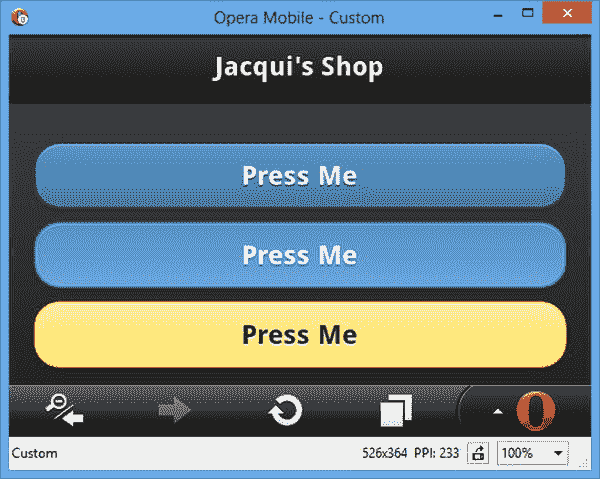

# 二十八、页面、主题和布局

在这一章中，我描述了 jQuery Mobile 应用的一个关键构件:*页面*。我在[第 27 章](27.html)中提到了页面，但现在我将深入细节并展示如何定义、配置和在页面间导航。我还将向您展示两个有用的 jQuery Mobile 特性，用于样式化和结构化页面中的内容:主题和网格布局。[表 28-1](#Tab1) 对本章进行了总结。

[表 28-1](#_Tab1) 。章节总结

| 问题 | 解决办法 | 列表 |
| --- | --- | --- |
| 定义一个 jQuery Mobile 页面。 | 将`data-role`属性应用于值为`page`的元素。 | one |
| 向页面添加页眉或页脚。 | 使用值`header`或`footer`将`data-role`属性应用于元素。 | Two |
| 在文档中定义多个页面。 | 创建几个`data-role`为`page`的元素。 | three |
| 在页面间导航。 | 创建一个`a`元素，其`href`元素是页面元素的`id`。 | four |
| 为`a`元素指定过渡效果。 | 应用`data-transition`属性。 | five |
| 设置全局过渡效果。 | 给`defaultPageTransition`设置赋值。 | six |
| 链接到另一个文档中的页面。 | 将文档的 URL 指定为一个`a`元素的`href`值。 | 7, 8 |
| 禁用单个链接的 Ajax。 | 将`data-ajax`属性设置为`false`。 | nine |
| 全局禁用 Ajax。 | 将`ajaxEnable`事件设置为`false`。 | Ten |
| 预取一页。 | 使用`data-prefetch`属性。 | 11, 12 |
| 更改当前页面。 | 使用`changePage`方法。 | Thirteen |
| 控制过渡效果的方向。 | 使用`changePage`方法的`reverse`设置。 | Fourteen |
| 指定显示加载对话框的延迟时间。 | 使用`loadMsgDelay`设置。 | Fifteen |
| 禁用加载对话框。 | 使用`showLoadMsg`设置。 | Sixteen |
| 确定当前页面。 | 使用`activePage`属性。 | Seventeen |
| 在后台加载页面。 | 使用`loadPage`方法。 | Eighteen |
| 响应页面加载。 | 使用页面加载事件。 | Nineteen |
| 响应页面转换。 | 使用页面转换事件。 | Twenty |
| 将样本应用于页面或元素。 | 使用`data-theme`属性，并将值设置为应该使用的样本。 | 21, 22 |
| 在网格中布置元素。 | 使用 jQuery Mobile 布局 CSS 类。 | Twenty-three |

了解 jQuery Mobile 页面

在第 27 章中，我向您展示了如何使用具有特定角色的元素在 HTML 文档中定义 jQuery Mobile 页面。概括一下，[清单 28-1](#list1) 显示了一个简单的页面。

*[清单 28-1](#_list1) 。HTML 文档中的简单 jQuery Mobile 页面*

```js
<!DOCTYPE html>
<html>
<head>
    <title>Example</title>
    <meta name="viewport" content="width=device-width, initial-scale=1">
    <link rel="stylesheet" href="jquery.mobile-1.3.1.css" type="text/css" />
    <script type="text/javascript" src="jquery-1.10.1.js"></script>
    <script type="text/javascript" src="jquery.mobile-1.3.1.js"></script>
</head>
<body>
    <div data-role="page">
       <div data-role="content">
           This is Jacqui's Flower Shop
       </div>
   </div>
</body>
</html>
```

这是一个最小的页面，由两个关键元素组成，每个元素都有一个`data-role` 属性。角色为`page`的元素表示包含 jQuery Mobile 页面的 HTML 内容区域。正如我在第 27 章中提到的，jQuery Mobile 的一个关键特性是显示给用户的页面与包含它们的 HTML 元素没有直接关系。

另一个重要的元素有`content` 的作用。这表示 jQuery Mobile 页面中包含页面内容的部分。一个页面可以包含不同的部分，其中的内容只有一个，我将很快演示。您可以在[图 28-1](#Fig1) 中看到清单中的 HTML 是如何在浏览器中显示的。


[图 28-1](#_Fig1) 。在浏览器中显示最小的 jQuery Mobile 页面

向页面添加页眉和页脚和

除了内容部分，jQuery Mobile 页面还可以包含页眉和页脚，由元素表示，这些元素的`data-role`属性分别设置为`header`和`footer`。清单 28-2 展示了添加到示例页面中的这两个部分。

***[清单 28-2](#_list2)*** 。向示例页面添加页眉和页脚

```js
<!DOCTYPE html>
<html>
<head>
    <title>Example</title>
    <meta name="viewport" content="width=device-width, initial-scale=1">
    <link rel="stylesheet" href="jquery.mobile-1.3.1.css" type="text/css" />
    <script type="text/javascript" src="jquery-1.10.1.js"></script>
    <script type="text/javascript" src="jquery.mobile-1.3.1.js"></script>
</head>
<body>
    <div data-role="page">
        <div data-role="header">
           <h1>Jacqui's Shop</h1>
        </div>
        <div data-role="content">
           This is Jacqui's Flower Shop
        </div>
        <div data-role="footer">
           <h1>Home Page</h1>
        </div>
   </div>
</body>
</html>
```

你可以在[图 28-2](#Fig2) 中看到这些添加的效果。

 **注意**页眉页脚在小屏幕上可以占据很大空间，如图所示。


[图 28-2](#_Fig2) 。向页面添加页眉和页脚

 **提示**注意，页脚显示在内容部分的末尾，而不是页面的底部。您可以通过将`data-position`属性设置为`fixed`来固定页眉和页脚的位置——这样可以保持页眉和/或页脚的位置，同时允许其余内容自由滚动。使用该选项时要彻底测试:不是所有的浏览器都支持固定页眉和页脚所需的 CSS 特性。

向文档添加页面

您可以在一个文档中定义多个 jQuery Mobile 页面。这对于简单的 web 应用非常有用，因为您可以将需要的所有内容打包到一个 HTML 文件中，这可以减少必须向服务器发出的请求数量和必须传输的数据总量(因为有些元素——如`head`部分中的元素——对于多个页面只指定一次)。清单 28-3 显示了一个多页文档。

***[清单 28-3](#_list3)*** 。在 HTML 文档中定义多个 jQuery Mobile 页面

```js
<!DOCTYPE html>
<html>
<head>
    <title>Example</title>
    <meta name="viewport" content="width=device-width, initial-scale=1">
    <link rel="stylesheet" href="jquery.mobile-1.3.1.css" type="text/css" />
    <script type="text/javascript" src="jquery-1.10.1.js"></script>
    <script type="text/javascript" src="jquery.mobile-1.3.1.js"></script>
</head>
<body>
    <divid="page1"data-role="page">
        <div data-role="header">
           <h1>Jacqui's Shop</h1>
        </div>
        <div data-role="content">
           This is Jacqui's Flower Shop
        </div>
    </div>
    <div id="page2" data-role="page">
        <div data-role="header">
           <h1>Jacqui's Shop</h1>
        </div>
        <div data-role="content">
           This is page 2
        </div>
   </div>
</body>
</html>
```

本示例定义了文档中的两个页面。我使用了`id`属性给每个页面分配一个唯一的标识符，这些值构成了页面间导航的基础。加载 HTML 文档时，只显示第一页。为了让用户在页面间导航，我添加了一个`a`元素，它的`href`是目标页面的`id`，如[清单 28-4](#list4) 所示。

***[清单 28-4](#_list4)*** 。在页面间导航

```js
<!DOCTYPE html>
<html>
<head>
    <title>Example</title>
    <meta name="viewport" content="width=device-width, initial-scale=1">
    <link rel="stylesheet" href="jquery.mobile-1.3.1.css" type="text/css" />
    <script type="text/javascript" src="jquery-1.10.1.js"></script>
    <script type="text/javascript" src="jquery.mobile-1.3.1.js"></script>
</head>
<body>
    <div id="page1" data-role="page">
        <div data-role="header">
           <h1>Jacqui's Shop</h1>
        </div>
        <div data-role="content">
           This is Jacqui's Flower Shop
           <p><a href="#page2">Go to page 2</a></p>
        </div>
    </div>
    <div id="page2" data-role="page">
        <div data-role="header">
           <h1>Jacqui's Shop</h1>
        </div>
        <div data-role="content">
           This is page 2
           <p><a href="#page1">Go to page 1</a></p>
        </div>
   </div>
</body>
</html>
```

在这个例子中，我在页面之间添加了链接。当一个链接被点击时，jQuery Mobile 会显示文档中相应的页面，如图 28-3 所示。


[图 28-3](#_Fig3) 。在文档的页面间导航

配置页面过渡

当用户在页面之间导航时，jQuery Mobile 使用动画效果在一个页面和下一个页面之间切换。默认的效果叫做`slide` ，即将出页滑向左边，而新页从右边滑入。jQuery Mobile 定义了许多不同的效果，如下所示:

*   `slide`
*   `pop`
*   `slideup`
*   `slidedown`
*   `slidefade`
*   `fade`
*   `flip`
*   `turn`
*   `flow`
*   `none`(意为无效果，也表示为`null`)

并非所有移动设备都正确支持所有转换，您可能会遇到闪烁和断断续续的情况。jQuery Mobile 的每个新版本都增加了可以支持所有转换的设备数量，但是您应该始终进行彻底的测试，以确保您在目标设备上看不到任何问题。如果有疑问，试试`fade` 或`slide`过渡，我发现它们在最少的设备上有问题。

 **提示**移动浏览器模拟器不能很好地处理过渡，通常会忽略它们。然而，它们在真实的移动设备上运行良好。如果你想在桌面上看到过渡，那么使用谷歌 Chrome 或苹果 Safari，这两种浏览器都能很好地处理效果。

通过使用`a`元素上的`data-transition` 属性，将值设置为您想要的效果，您可以更改单个页面过渡的动画方式。[清单 28-5](#list5) 提供了一个例子。

*[清单 28-5](#_list5) 。使用数据转换* *属性*

```js
<!DOCTYPE html>
<html>
<head>
    <title>Example</title>
    <meta name="viewport" content="width=device-width, initial-scale=1">
    <link rel="stylesheet" href="jquery.mobile-1.3.1.css" type="text/css" />
    <script type="text/javascript" src="jquery-1.10.1.js"></script>
    <script type="text/javascript" src="jquery.mobile-1.3.1.js"></script>
</head>
<body>
    <div id="page1" data-role="page">
        <div data-role="header">
           <h1>Jacqui's Shop</h1>
        </div>
        <div data-role="content">
           This is Jacqui's Flower Shop
           <p><a href="#page2" data-transition="turn">Go to page 2</a></p>
        </div>
    </div>
    <div id="page2" data-role="page">
        <div data-role="header">
           <h1>Jacqui's Shop</h1>
        </div>
        <div data-role="content">
           This is page 2
           <p><a href="#page1">Go to page 1</a></p>
        </div>
   </div>
</body>
</html>
```

 **注意**我不能轻易用数字给你展示不同的动画效果。这个例子需要在浏览器中进行实验。你可以通过下载本书附带的源代码来避免输入 HTML，这些源代码可以从`Apress.com`免费获得。

当用户点击突出显示的链接时，`turn`转换用于显示目标页面。`turn`效果仅应用于该单个链接。页面中的其他链接或同一文档中的其他页面将继续使用默认链接。如果要禁用动画效果，请将`data-transition`属性设置为`none`。

 **提示**你可以通过将`data-direction`属性应用到值为`reverse`的`a`元素来改变效果播放的方向。在“改变当前页面”一节中，我给出了一个反转过渡方向的例子，并解释了它为什么有用。

如果你想改变用于所有导航的动画效果，那么你需要设置一个全局选项。jQuery Mobile 定义了`defaultPageTransition` 设置，可以在`mobileinit`事件被触发时进行设置。[清单 28-6](#list6) 展示了这是如何做到的。

***[清单 28-6](#_list6)*** 。更改默认页面过渡

```js
<!DOCTYPE html>
<html>
<head>
    <title>Example</title>
    <meta name="viewport" content="width=device-width, initial-scale=1">
    <link rel="stylesheet" href="jquery.mobile-1.3.1.css" type="text/css" />
    <script type="text/javascript" src="jquery-1.10.1.js"></script>
    <script type="text/javascript">
        $(document).bind("mobileinit", function() {
            $.mobile.defaultPageTransition = "fade";
        })
    </script>
    <script type="text/javascript" src="jquery.mobile-1.3.1.js"></script>
</head>
<body>
    <div id="page1" data-role="page">
        <div data-role="header">
           <h1>Jacqui's Shop</h1>
        </div>
        <div data-role="content">
           This is Jacqui's Flower Shop
           <p><a href="#page2">Go to page 2</a></p>
        </div>
    </div>
    <div id="page2" data-role="page">
        <div data-role="header">
           <h1>Jacqui's Shop</h1>
        </div>
        <div data-role="content">
           This is page 2
           <p><a href="#page1">Go to page 1</a></p>
        </div>
   </div>
</body>
</html>
```

没有方便的方法为`mobileinit`事件注册一个处理函数，所以你必须选择`document`对象并使用`bind`方法。该方法的参数是您要处理的事件的名称以及事件被触发时要使用的处理函数。

 **注意**jQuery Mobile 脚本库一加载就触发`mobileinit`事件，这意味着在`script`元素中引用 jQuery Mobile 脚本库之前，您必须注册处理函数来更改全局 jQuery Mobile 设置。您可以在清单中看到我是如何做到的。如果在加载 jQuery Mobile 代码的`script`元素之前没有定义对`bind`方法的调用，那么这个函数将永远不会被执行。

要更改全局设置的值，您需要为`$.mobile`对象的属性分配一个新值。因为我想改变`defaultPageTransition`的设置，我给`$.mobile.defaultPageTransition`属性赋值，如下所示:

```js
...
$.mobile.defaultPageTransition = "fade";
...
```

该语句将默认效果设置为`fade`。我仍然可以用`data-transition`属性覆盖这个设置。

链接到外部页面

您不必在一个文档中包含所有页面。您可以像使用常规 HTML 一样添加链接。为了演示这一点，我创建了一个名为`document2.html` 的新文件，其内容如[清单 28-7](#list7) 所示。

***[清单 28-7](#_list7)*** 。document2.html 文件的内容

```js
<!DOCTYPE html>
<html>
<head>
    <title>Document 2</title>
    <meta name="viewport" content="width=device-width, initial-scale=1">
    <link rel="stylesheet" href="jquery.mobile-1.3.1.css" type="text/css" />
    <script type="text/javascript" src="jquery-1.10.1.js"></script>
    <script type="text/javascript" src="jquery.mobile-1.3.1.js"></script>
</head>
<body>
    <div id="page1" data-role="page">
        <div data-role="header">
           <h1>Jacqui's Shop</h1>
        </div>
        <div data-role="content">
           This is page 1 in document2.html
           <p><a href="#page2">Go to page 2 in this document</a></p>
           <p><a href="example.html">Return to example.html</a></p>
        </div>
    </div>
    <div id="page2" data-role="page">
        <div data-role="header">
           <h1>Jacqui's Shop</h1>
        </div>
        <div data-role="content">
           This is page 2 in document2.html
           <p><a href="#page1">Go to page 1</a></p>
        </div>
   </div>
</body>
</html>
```

该文档包含一对 jQuery Mobile 页面，遵循与其他示例相同的结构。链接到其他文档中的页面很简单。您只需定义一个`a`元素，其`href`属性包含目标文档的 URL，如[清单 28-8](#list8) 所示。

***[清单 28-8](#_list8)*** 。导航到另一个 HTML 文档中的页面

```js
<!DOCTYPE html>
<html>
<head>
    <title>Example</title>
    <meta name="viewport" content="width=device-width, initial-scale=1">
    <link rel="stylesheet" href="jquery.mobile-1.3.1.css" type="text/css" />
    <script type="text/javascript" src="jquery-1.10.1.js"></script>
    <script type="text/javascript" src="jquery.mobile-1.3.1.js"></script>
</head>
<body>
    <div id="page1" data-role="page">
        <div data-role="header">
           <h1>Jacqui's Shop</h1>
        </div>
        <div data-role="content">
           This is Jacqui's Flower Shop
           <p><a href="#page2">Go to page 2</a></p>
           <p><a href="document2.html">Go to document2.html</a></p>
        </div>
    </div>
    <div id="page2" data-role="page">
        <div data-role="header">
           <h1>Jacqui's Shop</h1>
        </div>
        <div data-role="content">
           This is page 2
           <p><a href="#page1">Go to page 1</a></p>
        </div>
   </div>
</body>
</html>
```

jQuery Mobile 使用 Ajax 加载指定的文档，并自动显示第一页，如果指定了过渡效果，还会使用过渡效果。你可以在[图 28-4](#Fig4) 中看到结果。


[图 28-4](#_Fig4) 。导航到另一个文档中的页面

 **提示** jQuery Mobile 自动将其样式和增强应用于通过 Ajax 加载的远程文档。这意味着您不必将 jQuery 和 jQuery Mobile 的`script`和`link`元素包含在文件中，例如我在示例中使用的`document2.html`文件。也就是说，我建议您包含这些引用，因为这可能会阻止 jQuery Mobile 在发出此类请求时使用 Ajax，如果这样做了，那么内容的自动处理就不会执行。

处理 Ajax/页面 ID 问题

当链接到其他文档的页面时，并不是一帆风顺的。Ajax 内容的管理方式和 jQuery Mobile 页面的定义方式之间存在冲突。两者都依赖于元素的`id`属性的值。[图 28-5](#Fig5) 显示了这个问题。


[图 28-5](#_Fig5) 。多页面 Ajax 问题

在这个图中，我点击了*应该*显示`document2.html`中的`page2`元素的链接，但我得到的实际上是`example.html`中的`page2`元素，这是一个令人困惑和意想不到的结果。

你可以用两种方法来解决这个问题。首先是每个 HTML 文档只定义一个 jQuery Mobile 页面——这是 jQuery Mobile 团队的建议。

第二种方法是在加载多页文档时禁用 Ajax。这解决了这个问题，但是这意味着 jQuery Mobile 在显示新页面时无法应用过渡效果。您可以通过将`data-ajax`属性设置为`false`来禁用单个`a`元素的 Ajax，如[清单 28-9](#list9) 所示。

***[清单 28-9](#_list9)*** 。禁用单个链接的 Ajax

```js
<!DOCTYPE html>
<html>
<head>
    <title>Example</title>
    <meta name="viewport" content="width=device-width, initial-scale=1">
    <link rel="stylesheet" href="jquery.mobile-1.3.1.css" type="text/css" />
    <script type="text/javascript" src="jquery-1.10.1.js"></script>
    <script type="text/javascript" src="jquery.mobile-1.3.1.js"></script>
</head>
<body>
    <div id="page1" data-role="page">
        <div data-role="header">
           <h1>Jacqui's Shop</h1>
        </div>
        <div data-role="content">
           This is Jacqui's Flower Shop
           <p><a href="#page2">Go to page 2</a></p>
           <p><a href="document2.html"data-ajax="false">Go to document2.html</a></p>
        </div>
    </div>
    <div id="page2" data-role="page">
        <div data-role="header">
           <h1>Jacqui's Shop</h1>
        </div>
        <div data-role="content">
           This is page 2
           <p><a href="#page1">Go to page 1</a></p>
        </div>
   </div>
</body>
</html>
```

在这个例子中，我为导航到`document2.html` 的链接禁用了 Ajax。如图[图 28-6](#Fig6) 所示，这产生了预期的导航序列。


[图 28-6](#_Fig6) 。禁用 Ajax 以避免元素 id 冲突

默认情况下，您可以使用`ajaxEnabled`全局设置关闭 Ajax，这在[清单 28-10](#list10) 中有演示。当该设置为`false`时，除非将`data-ajax`属性应用于值为`true`的元素，否则 Ajax 不会用于导航。

***[清单 28-10](#_list10)*** 。使用全局设置禁用 Ajax

```js
<!DOCTYPE html>
<html>
<head>
    <title>Example</title>
    <meta name="viewport" content="width=device-width, initial-scale=1">
    <link rel="stylesheet" href="jquery.mobile-1.3.1.css" type="text/css" />
    <script type="text/javascript" src="jquery-1.10.1.js"></script>
    <script type="text/javascript">
        $(document).bind("mobileinit", function() {
            $.mobile.ajaxEnable = false
        })
    </script>
    <script type="text/javascript" src="jquery.mobile-1.3.1.js"></script>
</head>
<body>
    <div id="page1" data-role="page">
        <div data-role="header">
           <h1>Jacqui's Shop</h1>
        </div>
        <div data-role="content">
           This is Jacqui's Flower Shop
           <p><a href="#page2">Go to page 2</a></p>
           <p><a href="document2.html">Go to document2.html</a></p>
        </div>
    </div>
    <div id="page2" data-role="page">
        <div data-role="header">
           <h1>Jacqui's Shop</h1>
        </div>
        <div data-role="content">
           This is page 2
           <p><a href="#page1">Go to page 1</a></p>
        </div>
   </div>
</body>
</html>
```

预取页面

您可以让 jQuery Mobile 预取文档，这样当用户单击一个链接时，它们包含的页面就可以立即使用。这样做的好处是您创建了一个响应速度更快的应用，但是您是通过下载用户可能不需要的内容来做到这一点的。为了演示这个特性，我创建了一个名为`singlepage.html` 的文档，其内容如[清单 28-11](#list11) 所示。

***[清单 28-11](#_list11)*** 。singlepage.html 档案

```js
<!DOCTYPE html>
<html>
<head>
    <title>Single Page</title>
    <meta name="viewport" content="width=device-width, initial-scale=1">
    <link rel="stylesheet" href="jquery.mobile-1.3.1.css" type="text/css" />
    <script type="text/javascript" src="jquery-1.10.1.js"></script>
    <script type="text/javascript" src="jquery.mobile-1.3.1.js"></script>
</head>
<body>
    <div id="page1" data-role="page">
        <div data-role="header">
           <h1>Jacqui's Shop</h1>
        </div>
        <div data-role="content">
           This is the only page in this document
           <p><a href="example.html">Return to example.html</a></p>
        </div>
    </div>
</body>
</html>
```

决定是否预取内容

预取内容是一个困难的决定。从应用的角度来看，预取是一个好主意，因为当用户在页面之间导航时，预取会产生即时响应。当移动连接速度慢、覆盖不稳定时，这一点尤为重要。用户不喜欢等待，如果内容不可用，持续掉线的连接将使您的应用不可用。

另一方面，你冒着下载内容的风险，因为你预料到用户可能不会进行导航操作。当移动数据计划对下载数据收取惩罚性费用并且每月带宽限制较低时，这可能是不受欢迎的。通过预取内容，您假设用户认为您的应用足够重要，可以用带宽(和成本)来换取性能，但事实可能并非如此。令人难过的事实是，尽管你可能在过去的一年里一直生活和呼吸着你的项目，但它对你的用户来说可能只不过是一种温和的便利。

我的建议是*而不是*预取页面。对于那些*认为你的应用足够重要的用户，你可以给他们一个选项来启用预取。*

您可以通过将`data-prefetch`属性应用到`a`元素并将其设置为`true`来启用预取。清单 28-12 显示了应用于`example.html`文档的`data-prefetch`属性。

***[清单 28-12](#_list12)*** 。预取内容

```js
<!DOCTYPE html>
<html>
<head>
    <title>Example</title>
    <meta name="viewport" content="width=device-width, initial-scale=1">
    <link rel="stylesheet" href="jquery.mobile-1.3.1.css" type="text/css" />
    <script type="text/javascript" src="jquery-1.10.1.js"></script>
    <script type="text/javascript" src="jquery.mobile-1.3.1.js"></script>
</head>
<body>
    <div id="page1" data-role="page">
        <div data-role="header">
           <h1>Jacqui's Shop</h1>
        </div>
        <div data-role="content">
           This is Jacqui's Flower Shop
           <p><a href="#page2">Go to page 2</a></p>
           <p>
               <a href="singlepage.html" data-prefetch="true">Go to singlepage.html</a>
           </p>
        </div>
    </div>
    <div id="page2" data-role="page">
        <div data-role="header">
           <h1>Jacqui's Shop</h1>
        </div>
        <div data-role="content">
           This is page 2
           <p><a href="#page1">Go to page 1</a></p>
        </div>
   </div>
</body>
</html>
```

在这个例子中，我让 jQuery Mobile 预取我的 URL 的目标。当我点击链接时，jQuery Mobile 能够导航到预取的内容，避免任何延迟。

 **提示**当你在一个快速、可靠的网络上进行开发时，很难确定预取等功能是否有效。我喜欢通过使用调试 HTTP 代理来检查这些特性，它向我显示了从浏览器发送的请求。如果你是 Windows 用户，那么我推荐 Fiddler，这是一个优秀的工具，可以无限配置和定制。提琴手可以从`www.fiddler2.com`下载。

使用脚本控制 jQuery Mobile 页面

你不需要总是依赖用户点击链接来管理页面导航。幸运的是，jQuery Mobile 为您提供了允许您使用 JavaScript 控制导航的方法和设置。在接下来的小节中，我将向您展示如何利用这些方法来获得对 jQuery Mobile web 应用中导航的细粒度控制。

更改当前页面

`changePage`方法 允许您更改 jQuery Mobile 显示的页面。[清单 28-13](#list13) 展示了这个方法的基本用法，当点击一个按钮时，它改变显示的页面。

***[清单 28-13](#_list13)*** 。更改 jQuery Mobile 显示的页面

```js
<!DOCTYPE html>
<html>
<head>
    <title>Example</title>
    <meta name="viewport" content="width=device-width, initial-scale=1">
    <link rel="stylesheet" href="jquery.mobile-1.3.1.css" type="text/css" />
    <script type="text/javascript" src="jquery-1.10.1.js"></script>
    <script type="text/javascript">
        $(document).bind("pageinit", function() {
           $("button").bind("tap", function(e) {
                var target = this.id == "local" ? "#page2" : "document2.html";
                $.mobile.changePage(target)
           })
        });
    </script>
    <script type="text/javascript" src="jquery.mobile-1.3.1.js"></script>
</head>
<body>
    <div id="page1" data-role="page">
        <div data-role="header">
           <h1>Jacqui's Shop</h1>
        </div>
        <div data-role="content">
            <fieldset class="ui-grid-a">
                <div class="ui-block-a"><button id="local">Local</button></div>
                <div class="ui-block-b"><button id="remote">Remote</button></div>
            </fieldset>
        </div>
    </div>
    <div id="page2" data-role="page">
        <div data-role="header">
           <h1>Jacqui's Shop</h1>
        </div>
        <div data-role="content">
           This is page 2
           <p><a href="#page1">Go to page 1</a></p>
        </div>
   </div>
</body>
</html>
```

在这个例子中，我添加了两个按钮，当单击时会调用`changePage`方法。我使用`bind`方法监听的事件是`tap`，这是 jQuery Mobile 定义的一小组有用的自定义事件之一。当用户点击屏幕(或在非触摸设备上点击鼠标)时，触发此事件。我在第 27 章的[中描述了这个事件，以及其余的 jQuery Mobile 事件。](27.html)

按钮是标准的 HTML 元素，jQuery Mobile 会自动将其转换成按钮小部件。我在第 30 章中描述了配置 jQuery Mobile 按钮的选项。最后，你会注意到我已经给类`ui-grid-a`、`ui-block-a`和`ui-block-b`分配了一些元素。这些是 jQuery Mobile 对创建页面布局的支持的一部分，我将在本章稍后描述。这个例子的结果非常简单，如图 28-7 所示。当用户单击其中一个按钮时，调用`changePage`方法，传递本地页面的`id`值或另一个文档的 URL 供 jQuery Mobile 显示。内容被加载，并显示过渡效果，就像我使用常规链接时一样。


[图 28-7](#_Fig7) 。使用 changePage 方法

这是`changePage`方法的基本用法，但是还有一些配置选项。为了配置页面转换，您将一个 settings 对象作为第二个参数传递给`changePage`方法，为一个或多个设置指定值。[表 28-2](#Tab2) 描述了可用的设置。这些设置中的大部分最好保留默认值，但是在接下来的部分中，我将展示两个更频繁修改的设置。

[表 28-2](#_Tab2) 。changePage 方法的设置

| 环境 | 描述 |
| --- | --- |
| `allowSamePageTransition` | 当设置为`false`(默认值)时，jQuery Mobile 将忽略目标页面为当前页面的`changePage`请求。值`true`允许这样的请求，尽管这会导致一些过渡动画的问题。 |
| `changeHash` | 当`true`时，URL 栏中的哈希片段将被更新到新的位置(这样页面标识符就包含在 URL 中了)。默认为`true`。 |
| `data` | 指定用于加载文档的 Ajax 请求中包含的数据。 |
| `dataUrl` | 指定更新浏览器 URL 栏时使用的 URL。缺省值是 no value，这意味着该值取自内部页面的`id`或远程文档的 URL。 |
| `loadMsgDelay` | 指定向用户显示加载图像的毫秒数。默认为`50`。 |
| `pageContainer` | 指定应包含新页面的元素。 |
| `reloadPage` | 当`true`时，jQuery Mobile 将重新加载远程文档的内容，即使数据已经被缓存。默认为`false`。 |
| `reverse` | 当`true`时，过渡效果将向后播放。默认为`false`。 |
| `role` | 设置新内容的`data-role`值——你可以在第 29 章的[中看到这个设置的使用。](29.html) |
| `showLoadMsg` | 当加载远程文件时，`true`值将显示加载图像。默认为`true`。 |
| `transition` | 指定显示新页面时要使用的过渡效果。 |
| `type` | 指定用于请求文档的 HTTP 方法。允许的值是`get`和`post`。默认是`get`。 |

 **提示**这些选项也被`loadPage`方法所使用，我将在本章稍后描述。

控制过渡效果的方向

`reverse`设定是我最常用的一个。jQuery Mobile 总是以相同的方式播放过渡效果，当您向用户呈现一个动作，有效地将他们送回之前的页面，或者您正在响应 jQuery Mobile `swiperight`事件时，这并不总是有意义的。清单 28-14 展示了如何解决这个问题。

***[清单 28-14](#_list14)*** 。过渡效果方向与导航意图不匹配

```js
<!DOCTYPE html>
<html>
<head>
    <title>Example</title>
    <meta name="viewport" content="width=device-width, initial-scale=1">
    <link rel="stylesheet" href="jquery.mobile-1.3.1.css" type="text/css" />
    <script type="text/javascript" src="jquery-1.10.1.js"></script>
    <script type="text/javascript">
        $(document).bind("pageinit", function() {
           $.mobile.defaultPageTransition = "slide";
           $("button").bind("tap", function(e) {
                var target = this.id == "forward" ? "#page2" : "#page1";
                $.mobile.changePage(target, {
                    reverse: (target == "#page1")
                });
           })
        });
    </script>
    <script type="text/javascript" src="jquery.mobile-1.3.1.js"></script>
</head>
<body>
    <div id="page1" data-role="page">
        <div data-role="header">
           <h1>Jacqui's Shop</h1>
        </div>
        <div data-role="content">
            This is page 1
            <button id="forward">Go to Page 2</button>
        </div>
    </div>
    <div id="page2" data-role="page">
        <div data-role="header">
           <h1>Jacqui's Shop</h1>
        </div>
        <div data-role="content">
            This is page 2
            <button id="back">Back to Page 1</button>
        </div>
   </div>
</body>
</html>
```

该文档有两个页面，每个页面都包含一个导航到另一个页面的按钮。第二页上的按钮标记为返回第一页。当点击第二页上的按钮时，我通过使用一个`true`的`reverse`值来改变过渡效果的方向。我无法在静态页面上显示这种效果，但这种效果感觉要自然得多。有一些潜意识的期望形成了，基于导航提示，动画应该播放，你是返回到上一页，而不是前进到新的一页。如果你在浏览器中查看这个例子，你就会明白我的意思。

控制负载动画

当 jQuery Mobile 通过 Ajax 加载远程文档超过 50 毫秒时，它会显示一个动画图像。当使用移动浏览器模拟器和高速网络时，jQuery Mobile 能够快速加载文档，以至于永远不会显示对话框。但是如果你使用一个实际的移动数据网络，或者像我所做的那样，在请求中引入一个延迟，那么这个对话框会在屏幕上停留足够长的时间来被看到，如图 28-8 所示。


[图 28-8](#_Fig8) 。“jQuery Mobile 加载”对话框

您可以通过为`loadMsgDelay`设置提供一个值来改变对话框显示的时间间隔，如[清单 28-15](#list15) 所示。

***[清单 28-15](#_list15)*** 。更改加载对话框的延迟

```js
<!DOCTYPE html>
<html>
<head>
    <title>Example</title>
    <meta name="viewport" content="width=device-width, initial-scale=1">
    <link rel="stylesheet" href="jquery.mobile-1.3.1.css" type="text/css" />
    <script type="text/javascript" src="jquery-1.10.1.js"></script>
    <script type="text/javascript">

        $(document).bind("mobileinit", function() {
            $.mobile.loadingMessage = "Loading Data..."
        })

        $(document).bind("pageinit", function() {
           $("button").bind("tap", function(e) {
                $.mobile.changePage("document2.html",{
                    loadMsgDelay: 1000
                });
           })
        });
    </script>
    <script type="text/javascript" src="jquery.mobile-1.3.1.js"></script>
</head>
<body>
    <div id="page1" data-role="page">
        <div data-role="header">
           <h1>Jacqui's Shop</h1>
        </div>
        <div data-role="content">
            <button id="forward">Go</button>
        </div>
    </div>
</body>
</html>
```

在这个例子中，我已经指定 jQuery Mobile 在向用户显示加载对话框之前应该等待一秒钟。

 **提示**您可以通过为全局`loadingMessage`属性设置一个新值来更改加载对话框中的文本，如示例所示。与所有 jQuery Mobile 全局属性一样，这应该在触发`mobileinit`事件时执行的函数中设置。

当您调用`changePage`方法时，您可以通过为`showLoadMsg`设置指定`false`来禁用此对话框。我不建议这么做，因为给用户提供反馈总是一件好事，但是[清单 28-16](#list16) 显示了使用中的设置。

***[清单 28-16](#_list16)*** 。禁用加载对话框

```js
<!DOCTYPE html>
<html>
<head>
    <title>Example</title>
    <meta name="viewport" content="width=device-width, initial-scale=1">
    <link rel="stylesheet" href="jquery.mobile-1.3.1.css" type="text/css" />
    <script type="text/javascript" src="jquery-1.10.1.js"></script>
    <script type="text/javascript">
        $(document).bind("pageinit", function() {
           $("button").bind("tap", function(e) {
                $.mobile.changePage("document2.html", {
                    showLoadMsg: false
                });
           })
        });
    </script>
    <script type="text/javascript" src="jquery.mobile-1.3.1.js"></script>
</head>
<body>
    <div id="page1" data-role="page">
        <div data-role="header">
           <h1>Jacqui's Shop</h1>
        </div>
        <div data-role="content">
            <button id="forward">Go</button>
        </div>
    </div>
</body>
</html>
```

确定当前页面

您可以使用`$.mobile.activePage`属性来确定 jQuery Mobile 正在显示的当前页面。[清单 28-17](#list17) 展示了`activePage`属性的使用。

*[清单 28-17](#_list17) 。使用 activatePage 属性*

```js
<!DOCTYPE html>
<html>
<head>
    <title>Example</title>
    <meta name="viewport" content="width=device-width, initial-scale=1">
    <link rel="stylesheet" href="jquery.mobile-1.3.1.css" type="text/css" />
    <script type="text/javascript" src="jquery-1.10.1.js"></script>
    <script type="text/javascript">

        var eventHandlerCreated = false;

        $(document).bind("pageinit", function () {
            if (!eventHandlerCreated) {
                $("button").bind("tap", function (e) {
                    var nextPages = {
                        page1: "#page2",
                        page2: "#page3",
                        page3: "#page1"
                    }
                    var currentPageId = $.mobile.activePage.attr("id");
                    $.mobile.changePage(nextPages[currentPageId]);
                })
                eventHandlerCreated = true;
            }
        });
    </script>
    <script type="text/javascript" src="jquery.mobile-1.3.1.js"></script>
</head>
<body>
    <div id="page1" data-role="page">
        <div data-role="header">
           <h1>Jacqui's Shop</h1>
        </div>
        <div data-role="content">
            This is page 1
            <button id="forward">Go</button>
        </div>
    </div>
    <div id="page2" data-role="page">
        <div data-role="header">
           <h1>Jacqui's Shop</h1>
        </div>
        <div data-role="content">
            This is page 2
            <button id="Button1">Go</button>
        </div>
    </div>
    <div id="page3" data-role="page">
        <div data-role="header">
           <h1>Jacqui's Shop</h1>
        </div>
        <div data-role="content">
            This is page 3
            <button id="Button2">Go</button>
        </div>
    </div>
</body>
</html>
```

本例中有三个页面，每个页面都有一个按钮。当按钮被点击时，我读取`activePage`属性来获取当前页面。`activePage`属性返回一个包含当前页面的 jQuery 对象，所以我使用 jQuery `attr`方法来获取`id`属性的值。

我的脚本包括一个简单的映射，它告诉我文档中每个页面的下一页应该是什么，我使用从`activePage`属性获得的`id`值作为`changePage`方法的参数，确保我按照映射定义的顺序浏览页面。

 **提示**注意，我使用了一个名为`eventHandlerCreated`的变量来确保我只为`tap`事件创建一个处理函数。`changePage`方法触发`pageinit`事件，这会导致设置多个处理函数——这是 jQuery Mobile 应用中的一个常见问题，如果单击一个按钮会导致多个页面转换，这也是可能的原因。防止这个问题的最可靠的方法是使用一个像例子中这样的变量。

在后台加载页面

您可以使用`loadPage`方法 加载远程文档，而不向用户显示它们。这相当于我在本章前面演示的预取。`loadPage`方法有两个参数。第一个是要加载的文档的 URL，第二个是可选的设置对象。`loadPage`方法支持设置为`changePage`方法，我在[表 28-2](#Tab2) 中描述过。清单 28-18 显示了正在使用的`loadPage`方法。

***[清单 28-18](#_list18)*** 。使用 loadPage 方法

```js
<!DOCTYPE html>
<html>
<head>
    <title>Example</title>
    <meta name="viewport" content="width=device-width, initial-scale=1">
    <link rel="stylesheet" href="jquery.mobile-1.3.1.css" type="text/css" />
    <script type="text/javascript" src="jquery-1.10.1.js"></script>
    <script type="text/javascript">

        var loadedPages = false;

        $(document).bind("pageinit", function () {
            if (!loadedPages) {
                $.mobile.loadPage("document2.html", {}).done(function () {
                    $("#gobutton").button("enable").bind("tap", function () {
                        $.mobile.changePage("document2.html");
                        loadedPages = true;
                    })
                })
            }
        });
    </script>
    <script type="text/javascript" src="jquery.mobile-1.3.1.js"></script>
</head>
<body>
    <div id="page1" data-role="page">
        <div data-role="header">
           <h1>Jacqui's Shop</h1>
        </div>
        <div data-role="content">
            <button id="gobutton" disabled="disabled">Go</button>
        </div>
    </div>
</body>
</html>
```

 **提示**注意，我传递了一个空的设置对象(`{}`)作为`loadPage`方法的第二个参数。jQuery 1 . 3 . 1 版中有一个缺陷，即使没有更改设置，也需要设置对象。

在这个例子中，我使用了`loadPage`方法来预加载`document2.html`文件。`loadPage`方法返回一个延迟对象，当页面加载后，您可以用它来接收通知。我在第 35 章的[中解释了延迟对象，但是现在只要知道你可以在由`loadPage`方法返回的对象上调用`done`方法，指定一个当由`loadPage`启动的 Ajax 请求完成时将被执行的函数就足够了。](35.html)

在这个例子中，我使用 jQuery UI 按钮小部件上的`enable`方法来启用页面中的按钮，并为`tap`事件注册一个句柄。当按钮被单击时，我调用`changePage`方法导航到预取的文档。(我在第 30 章中描述了 jQuery Mobile 对按钮的支持。)

注意，我定义了一个名为`loadedPages`的变量。这解决了我在使用`changePage`方法(内部调用`loadPage`)时遇到的相同问题:每当 jQuery Mobile 初始化页面时，就会触发`pageinit`事件。这意味着当例子中的文档被加载时，事件被触发，当`loadPage`通过 Ajax 加载`document2.html`时，事件再次被触发。我使用`loadedPages`变量来确保我只尝试预加载一次内容。除非我启用了`reload`设置，否则调用`loadPage`两次(如果没有`loadedPages`变量就会发生这种情况)不会是世界末日。这将导致文档的缓存副本被忽略，并传输`document.html`两次。我将在下一节解释 jQuery Mobile 页面事件集。

使用页面事件

jQuery Mobile 定义了一组事件，您可以使用这些事件来接收关于页面变化的通知。这些事件在[表 28-3](#Tab3) 中有描述，我将在接下来的章节中展示一些更有用的事件。

[表 28-3](#_Tab3) 。jQuery Mobile 页面事件

| 事件 | 描述 |
| --- | --- |
| `pagebeforecreate` | 初始化页面时触发。 |
| `pagecreate` | 当页面已经创建但大多数自动增强尚未执行时触发。 |
| `pageinit` | 页面初始化后触发。 |
| `pageremove` | 在移除页面之前触发。 |
| `pagebeforeload` | 在通过 Ajax 请求页面之前触发。 |
| `pageload` | 通过 Ajax 成功加载页面时触发。 |
| `pageloadfailed` | 当页面无法通过 Ajax 加载时触发。 |
| `pagebeforechange` | 在执行页面转换之前触发。 |
| `pagechange` | 在执行页面转换后触发。 |
| `pagechangefailed` | 当页面更改失败时触发(这通常是因为无法加载请求的文档)。 |
| `pagebeforeshow` | 在向用户显示页面之前触发。 |
| `pagebeforehide` | 在页面从显示中移除之前触发。 |
| `pageshow` | 向用户显示页面后触发。 |
| `pagehide` | 页面对用户隐藏后触发。 |

处理页面初始化事件

事件是最有用的 jQuery Mobile 页面事件，如第 27 章中的[所述。当您想要使用脚本配置页面时，您需要响应的就是这个事件。我不打算再次演示这个事件，因为到目前为止您已经在每个示例中看到了它，但是我要强调的是，在使用 jQuery Mobile 时，使用标准的 jQuery `$(document).ready()`方法是不可靠的。](27.html)

处理页面加载事件

`pagebeforeload`、`pageload`和`pageloadfailed`事件对于监控远程页面的 Ajax 请求非常有用，这些请求可以由 jQuery Mobile 自动生成，也可以通过`changePage`和`loadPage`方法以编程方式生成。在演示`loadPage`方法时，我使用了一个延迟对象来响应页面加载，但是您可以使用`pageload`方法(当然，还有出错时的`pageloadfailed`方法)获得相同的结果。[清单 28-19](#list19) 显示了更新后使用`pageload`事件的`loadPage`示例。

***[清单 28-19](#_list19)*** 。使用 pageload 事件

```js
<!DOCTYPE html>
<html>
<head>
    <title>Example</title>
    <meta name="viewport" content="width=device-width, initial-scale=1">
    <link rel="stylesheet" href="jquery.mobile-1.3.1.css" type="text/css" />
    <script type="text/javascript" src="jquery-1.10.1.js"></script>
    <script type="text/javascript">

        $(document).bind("pageload", function(event, data) {
            if (data.url == "document2.html") {
                $("#gobutton").button("enable").bind("tap", function() {
                    $.mobile.changePage("document2.html");
                })
            }
        })

        var loadedPages = false;
        $(document).bind("pageinit", function() {
            if (!loadedPages) {
                loadedPages = true;
                $.mobile.loadPage("document2.html", {});
            }
        });

    </script>
    <script type="text/javascript" src="jquery.mobile-1.3.1.js"></script>
</head>
<body>
    <div id="page1" data-role="page">
        <div data-role="header">
           <h1>Jacqui's Shop</h1>
        </div>
        <div data-role="content">
            <button id="gobutton" disabled>Go</button>
        </div>
    </div>
</body>
</html>
```

在这个例子中，我指定了一个函数，当`pageload`事件被触发时将执行这个函数。jQuery Mobile 通过将数据对象作为第二个参数传递给函数来提供关于请求的信息。我使用`url`属性来检查已经加载的文档是否是我所期望的。数据对象为`pageload`事件定义的属性集在[表 28-4](#Tab4) 中描述。从表中可以看到，大部分属性都对应于 jQuery Ajax 支持，我在[第 14](14.html) 和 [15](15.html) 章中描述过。

[表 28-4](#_Tab4) 。页面加载数据对象事件属性

| 财产 | 描述 |
| --- | --- |
| `url` | 返回传递给`loadPage`方法的 URL(这是 jQuery Mobile 在请求页面时使用的方法，也是`changePage`方法使用的方法)。 |
| `absUrl` | 请求的绝对 URL。 |
| `options` | Ajax 请求选项。关于配置 Ajax 的详细信息，请参见[第十四章](14.html)和[第十五章](15.html)。 |
| `xhr` | 用于请求的 jQuery Ajax 请求对象。参见[第 14 章](14.html)和[第 15 章](15.html)了解该物体的详细信息。 |
| `textStatus` | 请求状态的字符串描述。详见[第 14 章](14.html)和[第 15 章](15.html)。 |

响应页面转换

您可以使用页面转换事件在用户从一个页面导航到另一个页面时得到通知(或者当您使用`changePage`方法以编程方式这样做时)。这些事件(`pagebeforehide`、`pagehide`、`pagebeforeshow`和`pageshow`)在每次页面转换时都会被触发，即使该页面之前已经向用户显示过。清单 28-20 显示了其中一个事件的使用。

***[清单 28-20](#_list20)*** 。响应被隐藏的页面

```js
<!DOCTYPE html>
<html>
<head>
    <title>Example</title>
    <meta name="viewport" content="width=device-width, initial-scale=1">
    <link rel="stylesheet" href="jquery.mobile-1.3.1.css" type="text/css" />
    <script type="text/javascript" src="jquery-1.10.1.js"></script>
    <script type="text/javascript">

        var registeredHandlers = false;
        $(document).bind("pageinit", function() {
            if (!registeredHandlers) {
                registeredHandlers = true;
                $("#page1").bind("pagehide", function(event, data) {
                    $.mobile.changePage($("#page1"));
                })
            }
        });

    </script>
    <script type="text/javascript" src="jquery.mobile-1.3.1.js"></script>
</head>
<body>
    <div id="page1" data-role="page">
        <div data-role="header">
           <h1>Jacqui's Shop</h1>
        </div>
        <div data-role="content">
            <a href="document2.html">Go to document2.html</a>
        </div>
    </div>
</body>
</html>
```

在这个例子中，我通过选择我想要的元素并调用`bind`方法，为`page1`元素上的`pagehide`事件注册了一个处理函数。这意味着只有当选定的页面被隐藏时，我才会收到事件。这是一个相当愚蠢的例子，因为每当`pagehide`事件被触发时，它只是使用`changePage`方法返回到`page1`，但是它确实演示了事件的用法。请注意，我仍然使用变量来确保只注册一次处理函数。如果我没有这样做，那么当`document2.html`页面被加载时，两个函数将在同一个元素上为同一个事件注册。

应用 jQuery Mobile 主题

jQuery Mobile 提供了对主题的支持，更像是 jQuery UI 提供的主题支持的简化版本。您在第 27 章中下载并安装的 jQuery Mobile 文件中包含一个默认主题，您可以使用 jQuery Mobile ThemeRoller 应用创建自定义主题，该应用是您用于 jQuery UI 的同名应用的变体。

 **注意**正如我在[第 27 章](27.html)中提到的，我不会在这本书的这一部分创建和使用自定义主题。jQuery Mobile ThemeRoller 应用没有预先构建的主题集合，并且很难用文字描述创建主题的过程。在这一章中我将使用默认主题，但是你可以在`http://jquerymobile.com/themeroller`看到 jQuery Mobile ThemeRoller。

jQuery Mobile 主题由一个或多个*样本*组成，这些样本是一组应用于不同种类元素的样式。样本由一个字母识别，以 *A* 开始。默认主题有五个样本，命名为`A`到`E`。

要在 ThemeRoller 中查看默认主题，请导航至`http://jquerymobile.com/themeroller`；点击`Import`链接；并点击`Import Default Theme`链接，将`jquery.mobile-1.3.1.css`文件的内容导入对话框(这是你在[第 27 章](27.html)下载安装的 CSS 文件)。单击`Import`按钮，ThemeRoller 将处理 CSS 并显示默认色板，如图[图 28-9](#Fig9) 所示。


[图 28-9](#_Fig9) 。默认主题中的样本

通过使用`data-theme`属性将主题应用到 jQuery Mobile 页面，将值设置为所需样本的名称。[清单 28-21](#list21) 提供了一个例子。

***[清单 28-21](#_list21)*** 。在主题中使用样本

```js
<!DOCTYPE html>
<html>
<head>
    <title>Example</title>
    <meta name="viewport" content="width=device-width, initial-scale=1">
    <link rel="stylesheet" href="jquery.mobile-1.3.1.css" type="text/css" />
    <script type="text/javascript" src="jquery-1.10.1.js"></script>
    <script type="text/javascript" src="jquery.mobile-1.3.1.js"></script>
</head>
<body>
    <div id="page1" data-role="page" data-theme="a">
        <div data-role="header">
           <h1>Jacqui's Shop</h1>
        </div>
        <div data-role="content">
            This is Theme A
            <a href="#page2" data-role="button">Switch Theme</a>
        </div>
    </div>
    <div id="page2" data-role="page" data-theme="b">
        <div data-role="header">
           <h1>Jacqui's Shop</h1>
        </div>
        <div data-role="content">
            This is Theme B
            <a href="#page1" data-role="button">Switch Theme</a>
        </div>
    </div>
</body>
</html>
```

我已经将`data-theme`属性应用到了`page`元素，其效果是将指定的样本应用到页面中的所有子元素。在这个例子中有两个页面，这样我就可以展示相同的内容是如何通过一对对比主题显示的——并指出在 jQuery Mobile 中，一旦页面通过了自动增强过程，就没有可靠的方法来更改主题。`data-theme`属性被转换成一组 CSS 类，这些类在页面初始化过程中应用于元素，因此改变属性值不会改变类。你可以在[图 28-10](#Fig10) 中看到两页的例子。


[图 28-10](#_Fig10) 。同一应用中使用不同色板的两个页面

 **提示**还有一个叫`active`的色板，用来高亮显示选中的按钮。这是由 jQuery Mobile 自动应用的，但是您也可以直接使用它。如果你这样做了，确保你没有通过创建冲突的活动元素来混淆用户。

将样本应用到单个元素

上一个示例展示了如何设计整个页面的样式，但是您也可以在每个元素的基础上应用色板，混合和匹配以获得特定的效果。清单 28-22 提供了一个演示。

***[清单 28-22](#_list22)*** 。将色板应用到单个元素

```js
<!DOCTYPE html>
<html>
<head>
    <title>Example</title>
    <meta name="viewport" content="width=device-width, initial-scale=1">
    <link rel="stylesheet" href="jquery.mobile-1.3.1.css" type="text/css" />
    <script type="text/javascript" src="jquery-1.10.1.js"></script>
    <script type="text/javascript" src="jquery.mobile-1.3.1.js"></script>
</head>
<body>
    <div id="page1" data-role="page"data-theme="a">
        <div data-role="header">
           <h1>Jacqui's Shop</h1>
        </div>
        <div data-role="content">
            <a href="document2.html" data-role="button"data-theme="b">Press Me</a>
            <a href="document2.html" data-role="button"data-theme="c">Press Me</a>
            <a href="document2.html" data-role="button"data-theme="e">Press Me</a>
        </div>
    </div>
</body>
</html>
```

在这个例子中，我将`data-theme`应用于页面和三个`button`元素，每个元素指定一个不同的样本。你可以在[图 28-11](#Fig11) 中看到效果。



[图 28-11](#_Fig11) 。将不同的色板应用于同一页面中的元素

jQuery Mobile 对主题的支持简单易用。如果您能够动态地更改元素使用的样本，那就太好了，但是即使忽略了这一点，您也可以使用样本来定制移动应用的外观。

创建网格布局

jQuery Mobile 定义了一些有用的 CSS 类，您可以使用它们以网格的形式展示移动页面的内容。这是您自己可以做的事情，但是将它们内置到库中是有用的，并且减少了所需的定制开发量，尤其是对于简单的移动应用。jQuery Mobile 定义了四个网格类，每个类包含不同数量的列，如表 28-5 所示。

[表 28-5](#_Tab5) 。jQuery Mobile 布局网格

| CSS 类 | 列 |
| --- | --- |
| `ui-grid-a` | `2` |
| `ui-grid-b` | `3` |
| `ui-grid-c` | `4` |
| `ui-grid-d` | `5` |

将一个网格类应用于容器元素，然后将类应用于其中的每个内容项，从每列的`ui-block-a`、`ui-block-b`开始，依此类推。[清单 28-23](#list23) 展示了使用这些类来创建一个简单的网格。

***[清单 28-23](#_list23)*** 。使用 jQuery Mobile 布局类创建网格

```js
<!DOCTYPE html>
<html>
<head>
    <title>Example</title>
    <meta name="viewport" content="width=device-width, initial-scale=1">
    <link rel="stylesheet" href="jquery.mobile-1.3.1.css" type="text/css" />
    <script type="text/javascript" src="jquery-1.10.1.js"></script>
    <script type="text/javascript" src="jquery.mobile-1.3.1.js"></script>
</head>
<body>
    <div id="page1" data-role="page" data-theme="b">
        <div data-role="header">
           <h1>Jacqui's Shop</h1>
        </div>
        <div data-role="content">
            <divclass="ui-grid-b">
                <divclass="ui-block-a"><button>Press Me</button></div>
                <divclass="ui-block-b"><button>Press Me</button></div>
                <divclass="ui-block-c"><button>Press Me</button></div>
            </div>
            <divclass="ui-grid-a">
                <divclass="ui-block-a"><button>Press Me</button></div>
                <divclass="ui-block-b"><button>Press Me</button></div>
            </div>
            <div><button>Press Me</button></div>
        </div>
    </div>
</body>
</html>
```

在这个例子中，我创建了两个网格:一个有三列，另一个有两列。每一列包含一个`button`元素，我在网格外添加了一个按钮来强调默认行为，这是为了让元素跨越屏幕。你可以在[图 28-12](#Fig12) 中看到结果。


[图 28-12](#_Fig12) 。在网格中布局元素

摘要

在这一章中，我描述了页面，它是 jQuery Mobile 的关键构件之一。我还描述了 jQuery Mobile 对主题和网格布局的支持。这些特性为最重要的 jQuery Mobile 特性提供了基础:小部件。在第 29 章中，我从描述对话框和弹出窗口部件开始。