# 二十九、对话框和弹出窗口小部件

在这一章中，我将介绍前两个 jQuery Mobile 小部件:对话框和弹出窗口。jQuery Mobile 小部件的行为与 jQuery UI 中的小部件略有不同，但是——您将会了解到——有一个共同的方法来支持这两个库。[表 29-1](#Tab1) 对本章进行了总结。

[表 29-1](#_Tab1) 。章节总结

| 问题 | 解决办法 | 列表 |
| --- | --- | --- |
| 创建一个对话框小部件。 | 将值为 dialog 的`data-role`属性添加到包含对话框内容的`div`元素中，或将值为`dialog`的`data-rel`属性添加到将打开对话框的导航链接中。 | 1, 2 |
| 以编程方式创建对话框。 | 使用`changePage`方法。 | three |
| 向对话框添加按钮。 | 将`a`元素添加到对话框元素中。 | 4, 5 |
| 配置对话框。 | 使用配置数据属性或调用 dialog 方法并使用配置选项。 | 6, 7 |
| 关闭对话框。 | 调用`close`方法。 | eight |
| 创建一个弹出窗口小部件。 | 将值为`popup`的`data-role`属性添加到将显示小部件的 jQuery Mobile 页面中的`div`元素中。 | nine |
| 配置弹出窗口。 | 将数据属性应用于打开弹出窗口的`a`元素，或者包含弹出窗口的`div`元素，或者调用`popup`方法。 | 10–12 |
| 以编程方式控制弹出窗口。 | 使用`open`、`close,`和`reposition`方法。 | Thirteen |
| 响应弹出窗口中的更改。 | 处理弹出事件。 | Fourteen |

使用 jQuery Mobile 对话窗口小部件

顾名思义，对话框小部件为用户提供了一个对话框。因为这是我描述的第一个 jQuery Mobile 小部件，所以我将向您展示创建和管理小部件的不同方法，为本章的剩余部分和后面的章节做准备。

创建对话框小部件

当 jQuery Mobile 遇到一个元素的`data-role`属性被设置为`dialog`时，它会自动创建对话框小部件，如[清单 29-1](#list1) 所示。

***[清单 29-1](#_list1)*** 。使用数据角色属性以声明方式创建对话框小部件

```js
<!DOCTYPE html>
<html>
<head>
    <title>Example</title>
    <meta name="viewport" content="width=device-width, initial-scale=1">
    <link rel="stylesheet" href="jquery.mobile-1.3.1.css" type="text/css" />
    <script type="text/javascript" src="jquery-1.10.1.js"></script>
    <script type="text/javascript" src="jquery.mobile-1.3.1.js"></script>
</head>
<body>
    <div id="page1" data-role="page">
        <div data-role="header">
           <h1>Jacqui's Shop</h1>
        </div>
        <div data-role="content">
            <a href="#dialog1">Show the dialog</a>
        </div>
    </div>
    <div id="dialog1" data-role="dialog">
        <div data-role="header">
           <h1>You clicked the link!</h1>
        </div>
        <div data-role="content">
            This is the content area of the dialog
        </div>
    </div>
</body>
</html>
```

这个例子包含一个带有`a`元素的页面，当点击这个页面时，它将导航到名为`dialog1`的元素。`dialog1`元素的`data-role`属性被设置为`dialog`，这使得 jQuery Mobile 将元素及其内容显示为对话框，如图 29-1 中的[所示。](#Fig1)

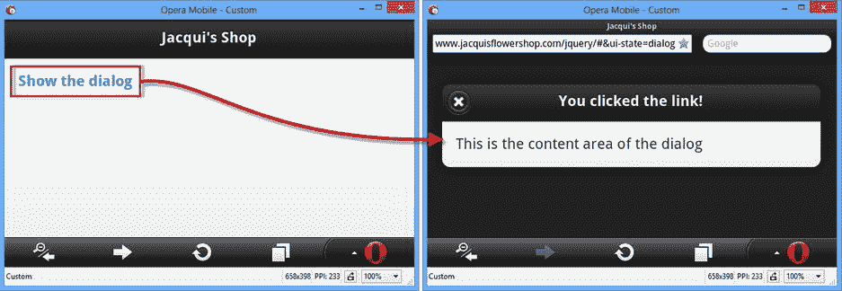

[图 29-1](#_Fig1) 。将页面显示为对话框

也可以通过将`data-rel`属性应用于导航`a`元素来创建对话框。在[清单 29-2](#list2) 中，您可以看到我如何将`data-rel`属性设置为`dialog`，以便从一个`data-role`属性设置为`page`的元素创建一个对话框小部件的实例。

***[清单 29-2](#_list2)*** 。使用 data-rel 属性从页面创建对话框小部件

```js
<!DOCTYPE html>
<html>
<head>
    <title>Example</title>
    <meta name="viewport" content="width=device-width, initial-scale=1">
    <link rel="stylesheet" href="jquery.mobile-1.3.1.css" type="text/css" />
    <script type="text/javascript" src="jquery-1.10.1.js"></script>
    <script type="text/javascript" src="jquery.mobile-1.3.1.js"></script>
</head>
<body>
    <div id="page1" data-role="page">
        <div data-role="header">
           <h1>Jacqui's Shop</h1>
        </div>
        <div data-role="content">
            <a href="#page2" data-rel="dialog">Show the dialog</a>
        </div>
    </div>
    <div id="page2" data-role="page">
        <div data-role="header">
           <h1>You clicked the link!</h1>
        </div>
        <div data-role="content">
            This is the content area of the dialog
        </div>
    </div>
</body>
</html>
```

在这个例子中，有两个常规的 jQuery Mobile 页面。第一页中的链接就像我在[第 28 章](28.html)中用于导航的链接一样，除了我已经应用了`data-rel`属性并将值设置为`dialog`。

以编程方式创建对话框小部件

声明性方法是有用的，但是它要求您确定内容在 HTML 中静态显示的方式。有时你会想要决定动态地将一个页面显示为一个对话框，这可以通过`changePage`方法和它支持的`role`设置来完成。清单 29-3 展示了使用`changePage`方法来创建一个对话框。

***[清单 29-3](#_list3)*** 。使用 changePage 方法以编程方式创建对话框

```js
<!DOCTYPE html>
<html>
<head>
    <title>Example</title>
    <meta name="viewport" content="width=device-width, initial-scale=1">
    <link rel="stylesheet" href="jquery.mobile-1.3.1.css" type="text/css" />
    <script type="text/javascript" src="jquery-1.10.1.js"></script>
    <script>
        $(document).bind("pageinit", function (event, data) {
            $("#dialogLink").click(function (e) {
                $.mobile.changePage(this.href, {
                    role: "dialog"
                });
            });
        });
    </script>
    <script type="text/javascript" src="jquery.mobile-1.3.1.js"></script>
</head>
<body>
    <div id="page1" data-role="page">
        <div data-role="header">
           <h1>Jacqui's Shop</h1>
        </div>
        <div data-role="content">
            <p><a id="dialogLink" href="#page2">Show the dialog</a></p>
            <p><a href="#page2">Show the page</a></p>
        </div>
    </div>
    <div id="page2" data-role="page">
        <div data-role="header">
           <h1>You clicked the link!</h1>
        </div>
        <div data-role="content">
            This is page 2
            <a href="#" data-role="button" data-rel="back">Close</a>
        </div>
    </div>
</body>
</html>
```

这种技术意味着你可以用不同的方式使用相同的内容。在清单中，我定义了两个链接，其中一个链接允许使用标准导航来加载在同一个 HTML 文档中定义的页面。我已经为来自另一个`a`元素的`click`事件定义了一个处理函数，我通过调用设置为`dialog`的`role`方法来处理它。这意味着页面的处理方式将取决于点击了哪个链接，如图 29-2 所示。

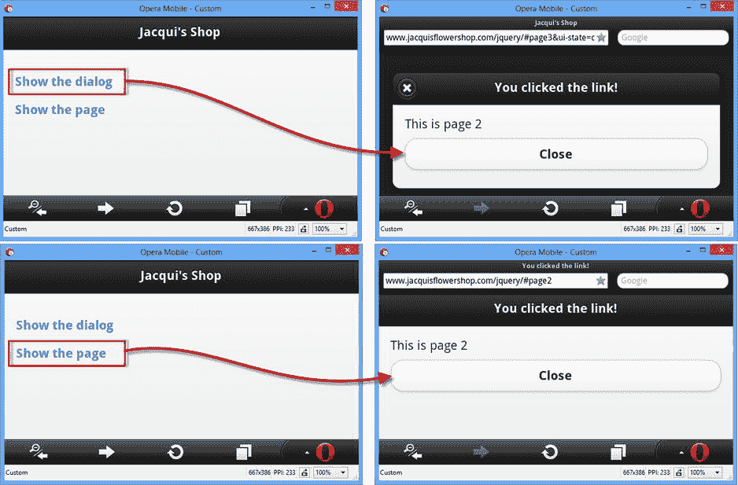

[图 29-2](#_Fig2) 。以编程方式创建对话框

 **注意**使用这种技术时需要小心，因为 jQuery Mobile 会缓存与内容相关联的角色——这意味着一旦您将页面显示为对话框，它将始终显示为`dialog`，即使您使用`page`的`role`设置再次调用`changePage`(或者直到 HTML 文档被重新加载)。

向对话框添加按钮

通过向对话框的内容添加一个`button`元素，将`data-role`属性设置为 button，将`data-rel`属性设置为`back`，可以向对话框添加一个关闭按钮。我在[第 30 章](30.html)中完整描述了 jQuery Mobile 按钮部件，但是你可以在[清单 29-4](#list4) 中看到它是如何应用于对话框部件的。

***[清单 29-4](#_list4)*** 。向对话框添加关闭按钮

```js
<!DOCTYPE html>
<html>
<head>
    <title>Example</title>
    <meta name="viewport" content="width=device-width, initial-scale=1">
    <link rel="stylesheet" href="jquery.mobile-1.3.1.css" type="text/css" />
    <script type="text/javascript" src="jquery-1.10.1.js"></script>
    <script type="text/javascript" src="jquery.mobile-1.3.1.js"></script>
</head>
<body>
    <div id="page1" data-role="page">
        <div data-role="header">
           <h1>Jacqui's Shop</h1>
        </div>
        <div data-role="content">
            <a href="#page2" data-rel="dialog">Show the dialog</a>
        </div>
    </div>
    <div id="page2" data-role="page">
        <div data-role="header">
           <h1>You clicked the link!</h1>
        </div>
        <div data-role="content">
            This is the content area of the dialog
            <a href="#" data-role="button" data-rel="back">Close</a>
        </div>
    </div>
</body>
</html>
```

我不必为链接指定目标。我只是将`href`属性设置为`#`,并让 jQuery Mobile 来决定该做什么。这很有用，因为你可能想在不同的页面上显示一个对话框，但你不知道是哪个页面导致了这个对话框的显示，也不知道浏览器应该返回到哪里。[图 29-3](#Fig3) 显示了在对话框中添加这个元素的效果。

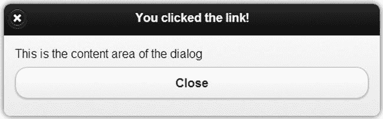

[图 29-3](#_Fig3) 。在对话框中添加关闭按钮

您可以在对话框中添加更多的按钮，这些按钮包含更多的`a`元素，这些元素的`href`属性指向您想要显示的页面。这就是我在[清单 29-5](#list5) 中所做的，我在同一个 HTML 文档中添加了一个到另一个 jQuery Mobile 页面的链接。

 **提示**如果你不想通过导航到一个新页面来响应一个按钮，那么你可以从`a`元素中处理`click`事件，并使用`close`方法来关闭对话框——参见本章后面的“使用对话框方法”一节中的例子。

***[清单 29-5](#_list5)*** 。向对话框添加导航按钮

```js
<!DOCTYPE html>
<html>
<head>
    <title>Example</title>
    <meta name="viewport" content="width=device-width, initial-scale=1">
    <link rel="stylesheet" href="jquery.mobile-1.3.1.css" type="text/css" />
    <script type="text/javascript" src="jquery-1.10.1.js"></script>
    <script type="text/javascript" src="jquery.mobile-1.3.1.js"></script>
</head>
<body>
    <div id="page1" data-role="page">
        <div data-role="header">
           <h1>Jacqui's Shop</h1>
        </div>
        <div data-role="content">
            <a href="#page2" data-rel="dialog">Show the dialog</a>
        </div>
    </div>
    <div id="page2" data-role="page" data-overlay-theme="d">
        <div data-role="header">
           <h1>You clicked the link!</h1>
        </div>
        <div data-role="content">
            This is the content area of the dialog
            <a href="#page3" data-role="button">OK</a>
            <a href="#" data-role="button" data-rel="back">Close</a>
        </div>
    </div>
    <div id="page3" data-role="page">
        <div data-role="header">
           <h1>Jacqui's Shop</h1>
        </div>
        <div data-role="content">
            This is page 3\. You came here via the dialog.
        </div>
    </div>
</body>
</html>
```

在这个例子中，我添加了一个将用户带到`page3`的`a`元素，我也将它添加到了文档中。[图 29-4](#Fig4) 显示了从对话框到新页面的导航。

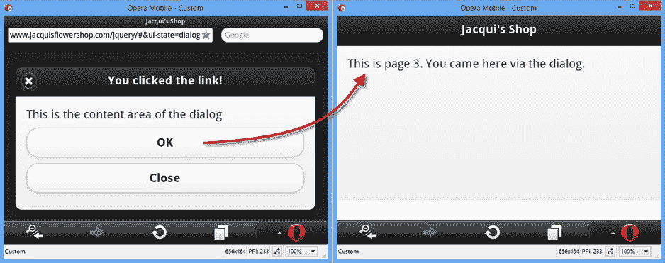

[图 29-4](#_Fig4) 。在对话框中添加导航链接/按钮

配置对话框小部件

对话框小部件定义了一组配置选项，既可以使用`data`属性以声明方式设置，也可以使用 JavaScript 方法调用来设置。我已经在[表 29-2](#Tab2) 中列出了两组选项，下面我将描述如何使用声明式和编程式配置。

[表 29-2](#_Tab2) 。设置为对话框小工具

| 数据属性 | 环境 | 描述 |
| --- | --- | --- |
| `data-close-btn` | `closeBtn` | 获取或设置对话框标题中“关闭”按钮的位置。支持的值有`left`、`right`和`none`。 |
| `data-close-btn-text` | `closeBtnText` | 获取或设置对话框标题中“关闭”按钮的文本。该文本不会显示给用户，但可由辅助功能软件检测到。 |
| `data-corners` | `corners` | 获取或设置对话框是否应以圆角显示。默认值为`true`。 |
| `data-overlay-theme` | `overlayTheme` | 获取或设置在其上绘制对话框的主题。该设置区分大小写，必须用小写表示。 |

在大多数情况下，使用数据属性配置小部件并让自动增强应用您的设置会更简单、更容易。这是标准的 jQuery Mobile 配置方法，您可以看到我是如何将它用于[清单 29-6](#list6) 中的`data-overlay-theme`属性的。

***[清单 29-6](#_list6)*** 。用数据属性配置对话框小部件

```js
<!DOCTYPE html>
<html>
<head>
    <title>Example</title>
    <meta name="viewport" content="width=device-width, initial-scale=1">
    <link rel="stylesheet" href="jquery.mobile-1.3.1.css" type="text/css" />
    <script type="text/javascript" src="jquery-1.10.1.js"></script>
    <script type="text/javascript" src="jquery.mobile-1.3.1.js"></script>
</head>
<body>
    <div id="page1" data-role="page">
        <div data-role="header">
           <h1>Jacqui's Shop</h1>
        </div>
        <div data-role="content">
            <a href="#dialog1">Show the dialog</a>
        </div>
    </div>
    <div id="dialog1" data-role="dialog" data-overlay-theme="d">
        <div data-role="header">
           <h1>You clicked the link!</h1>
        </div>
        <div data-role="content">
            This is the content area of the dialog
        </div>
    </div>
</body>
</html>
```

我已经指定将`D`样本用作对话框显示的覆盖图。您可以在[图 29-5](#Fig5) 中看到效果:对话框显示在浅色背景上，而不是与默认`A`样本相关的黑色背景上。(我在[第 28 章](28.html)中描述了主题和样本的 jQuery Mobile 方法。)

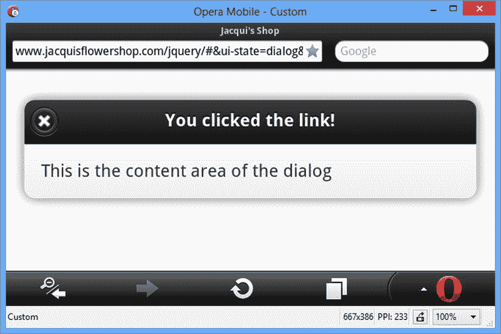

[图 29-5](#_Fig5) 。用数据属性配置对话框小部件

通过调用 jQuery Mobile `dialog`方法，传入一个对象，该对象的属性对应于[表 29-2](#Tab2) 中您想要更改的设置，您可以在创建对话框小部件后对其进行配置。在[清单 29-7](#list7) 中，你可以看到我是如何使用`dialog`方法来配置对话框的。

***[清单 29-7](#_list7)*** 。以编程方式配置对话框小部件

```js
<!DOCTYPE html>
<html>
<head>
    <title>Example</title>
    <meta name="viewport" content="width=device-width, initial-scale=1">
    <link rel="stylesheet" href="jquery.mobile-1.3.1.css" type="text/css" />
    <script type="text/javascript" src="jquery-1.10.1.js"></script>
    <script>
        $(document).bind("pageinit", function () {
            $("#dialog1").dialog({
                corners: false,
                overlayTheme: "e"
            });
        });
    </script>
    <script type="text/javascript" src="jquery.mobile-1.3.1.js"></script>
</head>
<body>
    <div id="page1" data-role="page">
        <div data-role="header">
           <h1>Jacqui's Shop</h1>
        </div>
        <div data-role="content">
            <a href="#dialog1">Show the dialog</a>
        </div>
    </div>
    <div id="dialog1" data-role="dialog" data-overlay-theme="d">
        <div data-role="header">
           <h1>You clicked the link!</h1>
        </div>
        <div data-role="content">
            This is the content area of the dialog
        </div>
    </div>
</body>
</html>
```

您可以配置小部件来响应`pageinit`事件，在清单中您可以看到我是如何选择小部件下面的元素并对其调用`dialog`方法的。我传递给`dialog`方法的对象具有与[表 29-2](#Tab2) 中的设置相对应的属性，你可以看到我已经为`corners`和`overlayTheme`设置定义了新的值。传递给`dialog`方法的选项覆盖了`data`属性值，您可以在[图 29-6](#Fig6) 中看到效果。

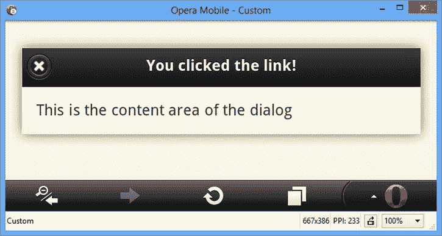

[图 29-6](#_Fig6) 。以编程方式配置对话框小部件

 **注意**jQuery Mobile API 文档建议可以使用 jQuery UI 风格的`option`方法调用来配置对话框小部件，像这样:`$("#dialog1"), dialog("option," "corners," false)`。但是，如果您使用这种方法，您将会看到一条错误消息，告诉您在小部件初始化之前不能调用方法。这个方法调用只有在小部件已经显示时才起作用，但是此时执行配置任务已经太晚了。相反，使用清单中所示的技术:将一个配置对象传递给`dialog`方法以响应`pageinit`事件。

使用对话框方法

对话框小部件只定义了一个方法，它以编程方式关闭对话框。我已经在[表 29-3](#Tab3) 中描述了该方法，以便您在将来执行快速搜索时可以更容易地找到它。

[表 29-3](#_Tab3) 。对话方法

| 方法 | 描述 |
| --- | --- |
| `dialog("close")` | 关闭对话框。 |

在[清单 29-8](#list8) 中，我创建了一个显示固定时间的对话框。除了`close`方法之外，我还使用了`data-close-btn`属性来移除菜单栏中的关闭按钮。

***[清单 29-8](#_list8)*** 。使用对话框关闭方法

```js
<!DOCTYPE html>
<html>
<head>
    <title>Example</title>
    <meta name="viewport" content="width=device-width, initial-scale=1">
    <link rel="stylesheet" href="jquery.mobile-1.3.1.css" type="text/css" />
    <script type="text/javascript" src="jquery-1.10.1.js"></script>
    <script>
        $(document).bind("pageinit", function () {
            $("#page1 a").click(function (e) {
                var duration = 15;
                $("#remaining").text(duration);
                var interval = setInterval(function () {
                    $("#remaining").text(--duration);
                    if (duration == 0) {
                        clearInterval(interval);
                        $("#dialog1").dialog("close");
                    }
                }, 1000);
            });
        });
    </script>
    <script type="text/javascript" src="jquery.mobile-1.3.1.js"></script>
</head>
<body>
    <div id="page1" data-role="page">
        <div data-role="header">
           <h1>Jacqui's Shop</h1>
        </div>
        <div data-role="content">
            <a href="#dialog1">Show the dialog</a>
        </div>
    </div>
    <div id="dialog1" data-role="dialog" data-close-btn="none" data-overlay-theme="d">
        <div data-role="header">
           <h1>Important</h1>
        </div>
        <div data-role="content">
            This in an important message that will be displayed
            for <span id="remaining"></span> seconds.
        </div>
    </div>
</body>
</html>
```

本例中的`script`元素为打开对话框的链接被触发时触发的`click`事件设置一个处理程序。以编程方式打开对话框的唯一方法是使用`changePage`方法，所以我让默认事件动作负责打开对话框，并启动一个倒计时 15 秒的计时器。我每秒更新一次对话框显示的`span`元素的内容，并在计时器到期时调用对话框的`close`方法。结果是如图 29-7 所示的对话框。

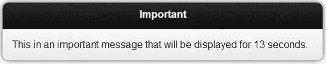

[图 29-7](#_Fig7) 。一个自动关闭对话框的小工具

有几点需要注意。首先，我不需要显式刷新对话框的内容来反映`span`元素的变化——对话框会自动更新自己。第二点是，虽然我创建了一个没有关闭按钮的对话框，但是用户仍然可以通过使用浏览器的后退按钮来关闭我的对话框。

使用对话框事件

jQuery Mobile dialog 小部件定义了一个事件，我已经在[表 29-4](#Tab4) 中描述过了。我从不使用这个事件，而是倾向于处理我在[第 28 章](28.html)中描述的页面级事件。

[表 29-4](#_Tab4) 。对话事件

| 事件 | 描述 |
| --- | --- |
| `create` | 创建对话框小部件时会触发此事件。 |

使用 jQuery Mobile 弹出窗口小部件

jQuery Mobile 弹出窗口小部件在弹出窗口中显示内容。弹出窗口是对话框的轻量级替代，但提供了更多的编程控制。

创建弹出窗口小部件

弹出窗口是通过将`data-role`属性应用到元素并将值设置为`popup`来创建的。弹出窗口不是自动显示的，而是当用户点击一个针对弹出窗口元素的`a`元素时打开的，该元素的`data-rel`属性也被设置为 popup。弹出窗口和打开它的链接必须在同一个 jQuery Mobile 页面中，如清单 29-9 所示。

***[清单 29-9](#_list9)*** 。创建 jQuery Mobile 弹出窗口小部件

```js
<!DOCTYPE html>
<html>
<head>
    <title>Example</title>
    <meta name="viewport" content="width=device-width, initial-scale=1">
    <link rel="stylesheet" href="jquery.mobile-1.3.1.css" type="text/css" />
    <script type="text/javascript" src="jquery-1.10.1.js"></script>
    <script type="text/javascript" src="jquery.mobile-1.3.1.js"></script>
</head>
<body>
    <div id="page1" data-role="page">
        <div data-role="header">
           <h1>Jacqui's Shop</h1>
        </div>
        <div data-role="content">
            <a href="#popup" data-rel="popup">Show the popup</a>
        </div>
        <div id="popup" data-role="popup">
            <p>This is the popup content</p>
        </div>
    </div>
</body>
</html>
```

点击链接会弹出一个弹出窗口，如图[图 29-8](#Fig8) 所示。在弹出窗口之外单击会将其关闭。

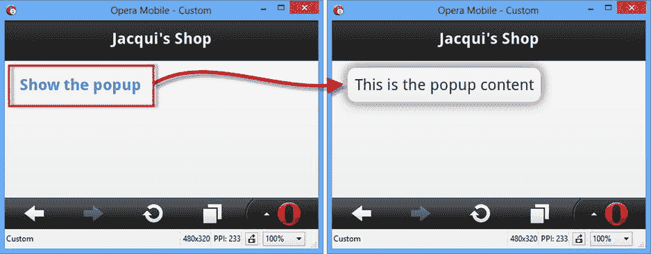

[图 29-8](#_Fig8) 。创建 jQuery Mobile 弹出窗口

配置弹出窗口小部件

如图所示，弹出窗口位于打开它的链接上，这很少是您想要的效果。您可以通过两种方式配置弹出窗口——或者配置打开弹出窗口的`a`元素，或者配置弹出窗口本身。

配置打开弹出窗口的链接

配置`a`元素的的优点是你可以多次使用同一个弹出窗口，但是应用不同的配置。缺点是只有两个配置选项——但是，幸运的是，它们是您可能想要调整的选项。我已经在[表 29-5](#Tab5) 中列出了可以应用于`a`元素的数据属性。

[表 29-5](#_Tab5) 。打开弹出窗口的元素的数据属性

| 数据属性 | 描述 |
| --- | --- |
| `data-position-to` | 指定弹出窗口相对于打开它的`a`元素的位置。选项在[表 29-6](#Tab6) 中描述。 |
| `data-transition` | 指定用于显示弹出窗口的转换–参见第 28 章中的 jQuery Mobile 转换列表。 |

`data-position-to`属性指定弹出窗口相对于`a`元素的位置，可以设置为[表 29-6](#Tab6) 中所示的值。

[表 29-6](#_Tab6) 。数据位置属性的值

| 价值 | 描述 |
| --- | --- |
| `origin` | 将弹出窗口置于`a`元素的中心。 |
| `window` | 将弹出窗口居中。 |
| 选择器 | 将弹出窗口置于与选择器匹配的第一个元素的中心。如果该元素不可见，则弹出窗口在窗口中居中。 |

在[清单 29-10](#list10) 中，你可以看到我是如何使用`data-position-to`属性通过选择器来改变弹出窗口的位置的。

***[清单 29-10](#_list10)*** 。通过打开弹出窗口的链接配置弹出窗口

```js
<!DOCTYPE html>
<html>
<head>
    <title>Example</title>
    <meta name="viewport" content="width=device-width, initial-scale=1">
    <link rel="stylesheet" href="jquery.mobile-1.3.1.css" type="text/css" />
    <script type="text/javascript" src="jquery-1.10.1.js"></script>
    <script type="text/javascript" src="jquery.mobile-1.3.1.js"></script>
    <style>
        #anchor { position: absolute; right: 10px; }
    </style>
</head>
<body>
    <div id="page1" data-role="page">
        <div data-role="header">
           <h1>Jacqui's Shop</h1>
        </div>
        <div data-role="content">
            <a href="#popup" data-rel="popup"
                data-position-to="#anchor">Show the popup</a>
            <span id="anchor">Anchor</span>
        </div>
        <div id="popup" data-role="popup">
            <p>This is the popup content</p>
        </div>
    </div>
</body>
</html>
```

我使用了选择器选项，为打开弹出窗口的`a`元素上的`data-position-to`属性的值指定了`#anchor`。这个选择器匹配一个`div`元素的`id`，我已经用 CSS 将其放置在窗口的右边缘。在[图 29-9](#Fig9) 中可以看到效果。

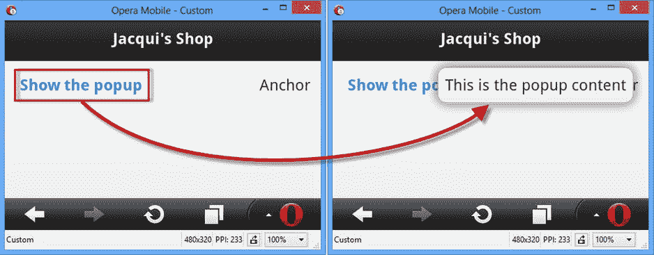

[图 29-9](#_Fig9) 。通过 a 元素配置弹出窗口的位置

直接配置弹出窗口

当您直接配置小部件时，有更多配置选项可用。和对话框部件一样，你可以用`data`属性或者通过`popup`方法来配置弹出窗口，我已经在[表 29-7](#Tab7) 中列出了这两种方法。大多数配置选项是不言而喻的，或者类似于`dialog`小部件所使用的选项。

[表 29-7](#_Tab7) 。对话框小部件的设置

| 数据属性 | 环境 | 描述 |
| --- | --- | --- |
| `data-corners` | `corners` | 指定弹出窗口是否用圆角绘制。默认为`true`。 |
| `data-dismissable` | `dismissable` | 如果设置为`false`，当用户点击小工具外部时，弹出窗口不会消失。默认为`true`。 |
| `data-history` | `history` | 指定在弹出窗口打开之前是否创建历史项目。默认为`true`，表示点击浏览器后退按钮时浏览器关闭。 |
| `data-overlay-theme` | `overlayTheme` | 指定用于覆盖的主题。默认为`null`，呈现透明背景。 |
| `data-position-to` | `positionTo` | 使用[表 29-6](#Tab6) 中的值指定弹出窗口的位置。 |
| `data-shadow` | `shadow` | 指定弹出窗口是否用阴影绘制。默认为`true`。 |
| `data-tolerance` | `tolerance` | 指定弹出窗口和窗口边缘之间的最小距离。默认值为`30, 15, 30, 15`。 |
| `data-transition` | `transition` | 指定弹出窗口打开和关闭时使用的过渡。 |

使用历史设置

导致弹出窗口部件最混乱的设置是`data-history`，它决定了在弹出窗口打开之前是否在浏览器历史中创建一个新条目。这个设置的效果意味着弹出窗口被浏览器的后退按钮关闭——但是这个特性并不总是有意义的，特别是当弹出窗口被打开和关闭以响应一个触摸事件时，如清单 29-11 所示。

***[清单 29-11](#_list11)*** 。弹出历史条目和鼠标触发器的效果

```js
<!DOCTYPE html>
<html>
<head>
    <title>Example</title>
    <meta name="viewport" content="width=device-width, initial-scale=1">
    <link rel="stylesheet" href="jquery.mobile-1.3.1.css" type="text/css" />
    <script type="text/javascript" src="jquery-1.10.1.js"></script>
    <script type="text/javascript" src="jquery.mobile-1.3.1.js"></script>
    <script>
        var mouseHandlerSet = false;
        $(document).bind("pageinit", function () {
            if (!mouseHandlerSet) {
                $("#page1 a").mouseenter(function (e) {
                    $("#popup").popup("open", {
                        x: e.pageX, y: e.pageY
                    });
                });
                $("#popup").mouseleave(function (e) {
                    $(this).popup("close");
                });
                mouseHandlerSet = true;
            }
        });
    </script>
</head>
<body>
    <div id="page1" data-role="page">
        <div data-role="header">
           <h1>Jacqui's Shop</h1>
        </div>
        <div data-role="content">
            <p><a href="#popup" data-rel="popup">Popup</a></p>
        </div>
        <div id="popup" data-role="popup" data-history="false">
            <p>This is the popup content</p>
        </div>
    </div>
</body>
</html>
```

这个例子使用了弹出菜单`open` 和`close`方法，我将在本章后面描述，这样当用户将鼠标或指针移到`a`元素上时弹出菜单就会显示，当用户将鼠标移出弹出菜单时弹出菜单就会隐藏(我使用了一个传递给`open`方法的配置选项来确保弹出菜单在鼠标指针下打开)。

在这种情况下，用户可能不希望后退按钮简单地关闭弹出窗口，因为首先没有执行显式导航来打开它——这是考虑`data-history` 属性以创建一致体验的好机会。

 **提示**我正在仔细限定这个配置设置的使用，因为理解这个机制只是围绕弹出窗口使用的混乱的一部分。另一个问题是决定采用哪种方法——这只能在应用的其余部分中决定。这种情况下的用户期望很难预测，只有用户测试才能告诉你哪种方法能为你的 web 应用创造自然的体验。不要试图逃避测试，简单地将它作为一个可配置的选项——大多数用户将不一致的行为归因于糟糕的实现，并且不会努力去看看是否可以改变。

使用弹出窗口呈现丰富的内容

弹出窗口可以用来呈现丰富的内容，弹出窗口的一个常见用途是向用户呈现一组图像缩略图，这些缩略图可以在弹出窗口中打开全尺寸图像，这就是我在[清单 29-12](#list12) 中所做的。(我在本书附带的`apress.com`的免费下载中包含了这个例子中的图片。)

***[清单 29-12](#_list12)*** 。使用弹出菜单显示丰富的内容

```js
<!DOCTYPE html>
<html>
<head>
    <title>Example</title>
    <meta name="viewport" content="width=device-width, initial-scale=1">
    <link rel="stylesheet" href="jquery.mobile-1.3.1.css" type="text/css" />
    <script type="text/javascript" src="jquery-1.10.1.js"></script>
    <script type="text/javascript" src="jquery.mobile-1.3.1.js"></script>
    <style>
        .smallImage { height: 40%; width: 40%; padding: 5px}
    </style>
    <script>
        $(document).bind("pageinit", function () {

            var data = ["beach.png", "clouds.png", "fishing.png", "storms.png"];
            for (var i = 0; i < data.length; i++) {
                $("").addClass("smallImage").attr("src",
                    data[i]).appendTo("#contentHolder");
            }

            $("#popup").popup({
                corners: false,
                overlayTheme: "a"
            });

            $("#contentHolder img").bind("tap", function (e) {
                var maxHeight = $(window).height() - 10 + "px";
                $("#LgImage").attr("src", e.target.src).css("max-height", maxHeight);
                $("#popup").popup("open");
            });
        });
    </script>
</head>
<body>
    <div id="page1" data-role="page" data-theme="d">
        <div id="contentHolder" data-role="content"></div>
        <div id="popup" data-role="popup" data-history="true">
            
        </div>
    </div>
</body>
</html>
```

我使用一个`for`循环来生成一组四个缩略图`img`元素，我将它们添加到 jQuery Mobile 页面，并使用标准 CSS 来确保它们的大小都相同。我为`tap`事件创建一个处理程序(我在[第 27 章](27.html)中描述过)，它将选定的图像设置为弹出窗口的内容，并调用`open`方法将其显示给用户(我在本章后面的*使用弹出窗口方法*一节中描述了 open 方法，但现在只要知道调用它将显示弹出窗口就足够了)。你可以在[图 29-10](#Fig10) 中看到效果:用户点击其中一个缩略图，一个更大的版本显示在弹出窗口中。

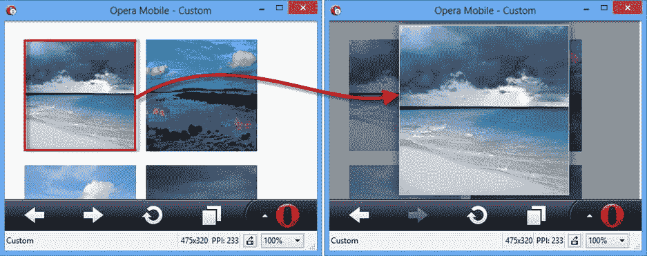

[图 29-10](#_Fig10) 。使用弹出窗口显示图像

我混合使用了数据属性和设置来配置弹出窗口，只是为了展示两者的使用情况。弹出窗口下面的`div`元素具有`data-history`属性，如下所示:

```js
...
<div id="popup" data-role="popup"data-history="true">
    
</div>
...
```

这是`data-history`属性的缺省值，但是我喜欢具体说明这个设置，因为它会引起很多混乱。我使用了`script`元素中的`popup`方法来设置其他选项，如下所示:

```js
...
$("#popup").popup({
    corners: false,
    overlayTheme: "a"
});
...
```

使用圆角会裁剪掉大图的一部分，所以我使用`corners`设置来指定圆角。我想在弹出窗口显示时将用户的注意力集中在大图像上，所以我使用了`overlayTheme`设置来为弹出窗口提供深色背景。

当使用弹出窗口显示可能比弹出窗口本身更大的内容时，需要做一些额外的工作，因为默认情况下，内容会滚动。为了避免这种情况，我获取了窗口的高度，并将其作为设置弹出窗口中图像高度的基础，如下所示:

```js
...
var maxHeight = $(window).height() - 10 + "px";
$("#LgImage").attr("src", e.target.src).css("max-height", maxHeight);
...
```

我让图像比窗口小 10 个像素，这给了我一个小边框来强调用户看到了一个弹出窗口。理论上，我应该将我的边框与`tolerance`设置对齐，但是在我写这个的时候这是不可靠的，所以我只是使用一个显式值来获得我想要的效果。我把序列中的第一个缩略图`beach.png`图像做得比其他的大，在[图 29-11](#Fig11) 中，你可以想象如果我不设置 CSS `max-height`属性的设置会发生什么:图像的顶部和底部不显示，也没有视觉提示指示用户可以滚动查看图像的其余部分。

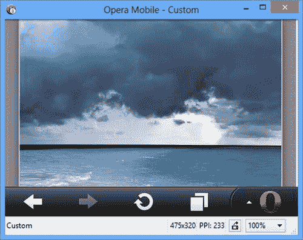

[图 29-11](#_Fig11) 。显示比弹出窗口大的内容的效果

使用弹出方法

弹出窗口小部件定义了[表 29-8](#Tab8) 中所示的方法。

[表 29-8](#_Tab8) 。弹出方法

| 方法 | 描述 |
| --- | --- |
| `popup("open")` | 打开弹出窗口。 |
| `popup("close")` | 关闭弹出窗口。 |
| `popup("reposition")` | 更改弹出窗口的位置。 |

我在前面的例子中演示了`open`方法的基本用法，但是您可以提供一个可选的参数来配置弹出窗口的打开方式，提供与用于`a`元素的`data`属性等效的功能。可选参数是一个对象，其属性名如[表 29-9](#Tab9) 所示。

[表 29-9](#_Tab9) 。open 方法的可选参数的属性

| 名字 | 描述 |
| --- | --- |
| `x` | 指定弹出窗口应该显示的 X 坐标。 |
| `y` | 指定应显示弹出窗口的 Y 坐标。 |
| `transition` | 指定用于动画弹出窗口的过渡–参见第 28 章了解 jQuery Mobile 过渡的详细信息。 |
| `positionTo` | 使用[表 29-6](#Tab6) 中描述的值指定弹出窗口的位置。 |

`reposition`方法 也接受一个配置对象参数，您可以使用`x`、`y,`和`positionTo`属性来指定弹出窗口的新位置。`close`方法不接受任何参数，只是取消弹出窗口。在清单 29-13 中，你可以看到所有三种正在使用的方法。

***[清单 29-13](#_list13)*** 。使用弹出方法

```js
<!DOCTYPE html>
<html>
<head>
    <title>Example</title>
    <meta name="viewport" content="width=device-width, initial-scale=1">
    <link rel="stylesheet" href="jquery.mobile-1.3.1.css" type="text/css" />
    <script type="text/javascript" src="jquery-1.10.1.js"></script>
    <script type="text/javascript" src="jquery.mobile-1.3.1.js"></script>
    <script>
        $(document).bind("pageinit", function () {
            $("button").bind("vmousedown", function (e) {
                var pop = $("#popup");
                switch (e.target.innerText) {
                    case "Open":
                        pop.popup("open", {
                            x: 10, y: 10, transition: "fade"
                        });
                        break;
                    case "Close":
                        pop.popup("close");
                        break;
                    default:
                        pop.popup("reposition", {
                            positionTo: e.target.innerText == "Window"
                                ? "window" : "#page1 button"
                        });
                        break;
                }
            });
        });
    </script>
</head>
<body>
    <div id="page1" data-role="page" data-theme="d">
        <div data-role="content">
            <button>Open</button>
        </div>
        <div id="popup" data-role="popup" data-history="true"
                data-dismissible="false">
            <button>Selector</button>
            <button>Window</button>
            <button>Close</button>
        </div>
    </div>
</body>
</html>
```

清单中的 jQuery Mobile 页面包含一个按钮，我通过调用弹出菜单上的`open`方法来处理该按钮的`vmousedown`事件。我传入可选的配置对象来指定弹出窗口应该显示在带有`fade`过渡的特定位置(x 轴和 y 轴上距离左上角 10 个像素)。

`popup`包含附加按钮。`Close`按钮调用`close`方法隐藏弹出窗口，其他按钮调用`reposition`方法指定弹出窗口应该移动到的不同位置。你可以在图 29-12 中看到结果。

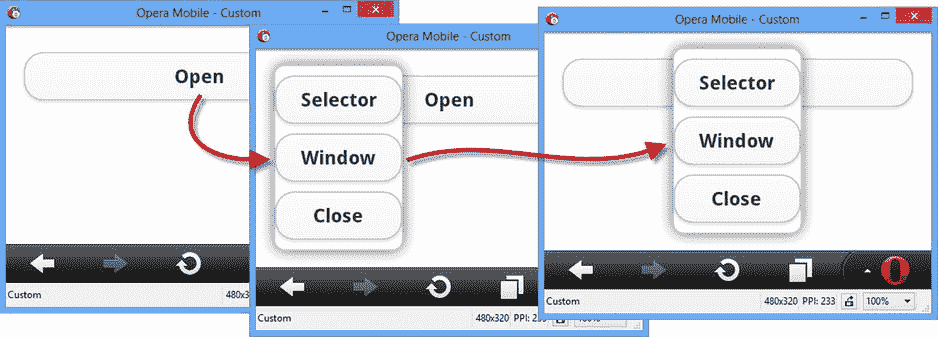

[图 29-12](#_Fig12) 。使用弹出方法

 **提示**注意，在这个例子中，我已经将`data-dismissible`属性设置为`false`。如果没有这个设置，大多数触摸浏览器产生的合成鼠标事件(如第 27 章所述)将被解释为弹出窗口之外的点击，导致弹出窗口在打开后立即关闭。将`data-dismissible`属性设置为`false`可以确保这种情况不会发生，并且弹出窗口只能被调用`close`方法的按钮关闭。

使用弹出事件

jQuery Mobile popup 小部件定义了[表 29-10](#Tab10) 中显示的事件。

[表 29-10](#_Tab10) 。弹出事件

| 事件 | 描述 |
| --- | --- |
| `create` | 创建弹出窗口小部件时触发。 |
| `beforeposition` | 在弹出窗口重新定位之前触发。 |
| `afteropen` | 弹出窗口显示后触发。 |
| `afterclose` | 隐藏弹出窗口后触发。 |

我很少发现这些事件有用，我对弹出窗口小部件的使用通常仅限于方法和配置选项。一个例外是当我想在有限的时间内显示一个弹出窗口时，在这种情况下，`afteropen`事件会很有用，如[清单 29-14](#list14) 所示。

***[清单 29-14](#_list14)*** 。处理弹出事件

```js
<!DOCTYPE html>
<html>
<head>
    <title>Example</title>
    <meta name="viewport" content="width=device-width, initial-scale=1">
    <link rel="stylesheet" href="jquery.mobile-1.3.1.css" type="text/css" />
    <script type="text/javascript" src="jquery-1.10.1.js"></script>
    <script>
        $(document).bind("pageinit", function () {
            $("#popup").popup({
                afteropen: function (e) {
                    setTimeout(function () {
                        $("#popup").popup("close");
                    }, 5000);
                }
            });
        });
    </script>
    <script type="text/javascript" src="jquery.mobile-1.3.1.js"></script>
</head>
<body>
    <div id="page1" data-role="page">
        <div data-role="header">
           <h1>Jacqui's Shop</h1>
        </div>
        <div data-role="content">
            <a href="#popup" data-rel="popup">Show the popup</a>
        </div>
        <div id="popup" data-role="popup" data-position-to="window">
            <p>This is the popup content</p>
        </div>
    </div>
</body>
</html>
```

 **警告**我只在无法与客户协商替代方案时使用这种技巧。我的感觉是，弹出窗口应该完全由用户控制，让它们以与用户交互没有直接联系的方式出现和消失会引起混乱。

在这个例子中，我处理`afteropen`方法调用`setTimeout`函数来注册一个将在五秒钟后执行的回调。回调函数调用`close`方法来关闭弹出窗口。

摘要

在本章中，我介绍了前两个 jQuery Mobile 小部件:对话框和弹出窗口。jQuery Mobile 小部件遵循与 jQuery UI 小部件相同的基本结构和原理，但是针对移动设备进行了明显的优化。在第 30 章中，我描述了按钮和可折叠块部件。