# 三十、按钮和可折叠块

在这一章中，我描述了另外两个 jQuery Mobile 部件:*按钮*和*可折叠块*。jQuery Mobile button widget 的工作方式与您在本书前面看到的 jQuery UI 按钮类似，只是您可以创建和使用简单的按钮，而无需使用任何定制的 JavaScript 代码，而是依靠`data`属性。

可折叠块类似于手风琴的单个面板；事实上，您可以单独使用可折叠积木，或者将几个积木组合在一起，形成一个简单的手风琴。表 30-1 对本章进行了总结。我还向您展示了在同一主题上提供变体的小部件——*导航条*，它对按钮进行分组以提供一致的导航支持，以及*可折叠集*，它可用于创建折叠式小部件。

表 30-1 。章节总结

| 问题 | 解决办法 | 列表 |
| --- | --- | --- |
| 自动创建一个按钮部件。 | 添加一个类型为`submit`、`reset`或`button`的`button`元素或`input`元素。 | one |
| 从其他元素创建按钮部件。 | 应用值为`button`的`data-role`属性。 | Two |
| 创建一组按钮。 | 使用值为`controlgroup`的`data-role`属性。使用`data-type`属性改变方向。 | 3, 4 |
| 在按钮上添加和定位图标。 | 使用`data-icon`和`data-iconpos`属性。 | five |
| 创建更小的按钮。 | 使用`data-mini`和`data-inline`属性。 | six |
| 更新按钮以反映基础元素中的更改。 | 使用`refresh`方法。 | seven |
| 响应按钮事件。 | 处理来自基础元素的事件。 | eight |
| 提供一致的导航按钮。 | 使用导航条小部件。 | nine |
| 将图标放置在导航栏中。 | 使用`data-iconpos`属性 | Ten |
| 创建可折叠块。 | 应用值为`collapsible`的`data-role`属性。确保有一个 header 元素作为第一个子元素。 | 11, 12 |
| 当块折叠或展开时接收通知。 | 处理`collapse`和`expand`事件。 | Thirteen |
| 创建一个手风琴。 | 使用值为`collapsible-set`的`data-role`属性。 | Fourteen |

使用 jQuery Mobile 按钮

我已经在前面的例子中使用了一些按钮部件，但是现在是时候返回来解释它们是如何工作的了。

创建按钮小部件

作为自动页面增强过程的一部分，jQuery Mobile 从`button`元素或从类型属性设置为`submit`、`reset`、`button`或`image`的`input`元素创建按钮小部件。您不必对这些元素类型采取任何特殊的操作，因为 jQuery Mobile 会为您完成所有的工作。清单 30-1 显示了一个包含一些自动增强元素的页面。

***清单 30-1*** 。依靠按钮部件的自动创建

```js
<!DOCTYPE html>
<html>
<head>
    <title>Example</title>
    <meta name="viewport" content="width=device-width, initial-scale=1">
    <link rel="stylesheet" href="jquery.mobile-1.3.1.css" type="text/css" />
    <script type="text/javascript" src="jquery-1.10.1.js"></script>
    <script type="text/javascript" src="jquery.mobile-1.3.1.js"></script>
</head>
<body>
    <div id="page1" data-role="page" data-theme="b">
        <div data-role="header">
           <h1>Jacqui's Shop</h1>
        </div>
        <div data-role="content">
            <button>Button</button>
            <input type="submit" value="Input (Submit)" />
            <input type="reset" value="Input (Reset)" />
            <input type="button" value="Input (Button)" />
        </div>
    </div>
</body>
</html>
```

你可以在图 30-1 中看到如何为每种类型的元素创建一个按钮小部件。

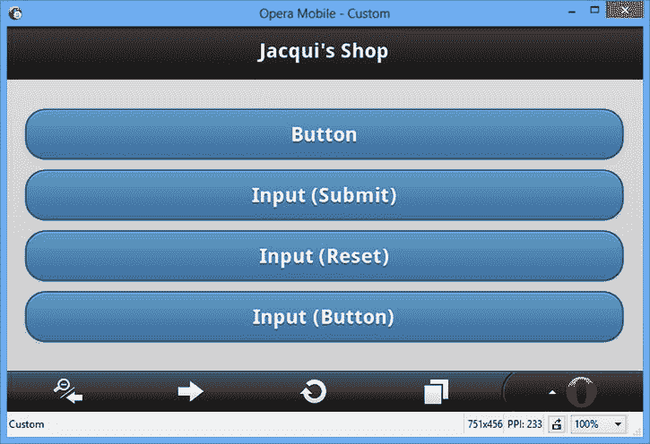

图 30-1 。jQuery Mobile 自动创建的按钮部件

从其他元素创建按钮

jQuery Mobile 还可以从其他元素创建按钮小部件。在前面的章节中，您看到了我通过应用值为`button`的`data-role`属性，从`a`元素创建一个按钮小部件。您也可以对其他类型的元素这样做，比如`div`。清单 30-2 包含了一个例子。

***清单 30-2*** 。从其他元素创建按钮

```js
<!DOCTYPE html>
<html>
<head>
    <title>Example</title>
    <meta name="viewport" content="width=device-width, initial-scale=1">
    <link rel="stylesheet" href="jquery.mobile-1.3.1.css" type="text/css" />
    <script type="text/javascript" src="jquery-1.10.1.js"></script>
    <script type="text/javascript" src="jquery.mobile-1.3.1.js"></script>
</head>
<body>
    <div id="page1" data-role="page" data-theme="b">
        <div data-role="header">
           <h1>Jacqui's Shop</h1>
        </div>
        <div data-role="content">
            <a href="document2.html" data-role="button">A Element</a>
            <div data-role="button">DIV Element</div>
        </div>
    </div>
</body>
</html>
```

你可以在图 30-2 中看到 jQuery Mobile 如何处理这个例子中的元素。

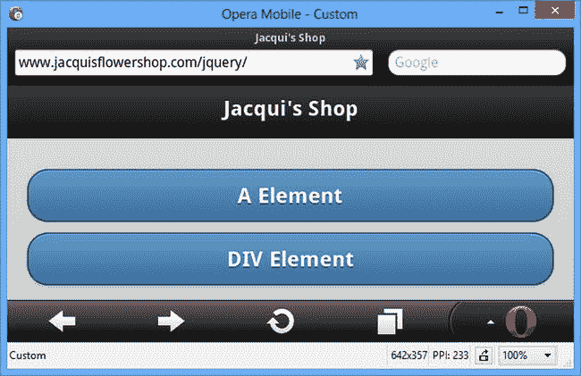

图 30-2 。使用其他元素创建按钮部件

创建分组按钮

您可以通过创建一个*控件组*来创建一组没有间距的按钮。您可以通过将值为`controlgroup`的`data-role`属性应用于两个或更多按钮小部件的父元素来实现这一点。清单 30-3 提供了一个演示。

***清单 30-3*** 。创建一组分组按钮

```js
<!DOCTYPE html>
<html>
<head>
    <title>Example</title>
    <meta name="viewport" content="width=device-width, initial-scale=1">
    <link rel="stylesheet" href="jquery.mobile-1.3.1.css" type="text/css" />
    <script type="text/javascript" src="jquery-1.10.1.js"></script>
    <script type="text/javascript" src="jquery.mobile-1.3.1.js"></script>
</head>
<body>
    <div id="page1" data-role="page" data-theme="b">
        <div data-role="header">
           <h1>Jacqui's Shop</h1>
        </div>
        <div data-role="content">
            <div data-role="controlgroup">
                <button>Back</button>
                <button>Home</button>
                <button>Next</button>
            </div>
        </div>
    </div>
</body>
</html>
```

在这个例子中，有三个按钮，它们都是一个`div`元素的子元素，这个元素的`data-role`是控制组。你可以在图 30-3 中看到效果。注意只有顶部和底部的按钮有圆角。

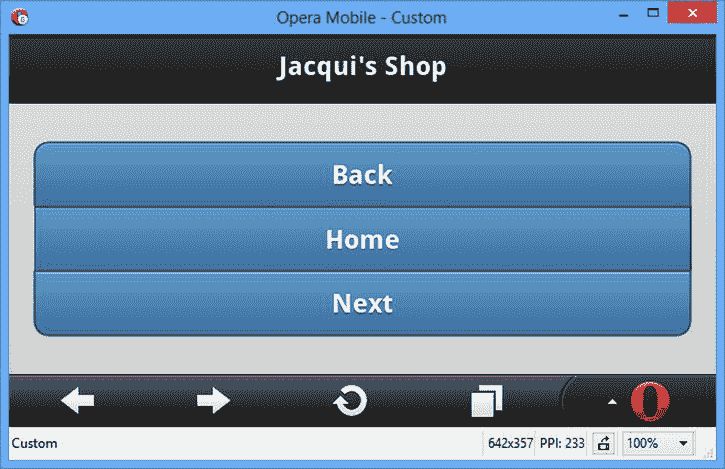

图 30-3 。显示在组中的一组按钮

您可以通过将`data-type`属性设置为`horizontal`来改变按钮组的方向，如清单 30-4 所示。

***清单 30-4*** 。创建水平按钮组

```js
<!DOCTYPE html>
<html>
<head>
    <title>Example</title>
    <meta name="viewport" content="width=device-width, initial-scale=1">
    <link rel="stylesheet" href="jquery.mobile-1.3.1.css" type="text/css" />
    <script type="text/javascript" src="jquery-1.10.1.js"></script>
    <script type="text/javascript" src="jquery.mobile-1.3.1.js"></script>
</head>
<body>
    <div id="page1" data-role="page" data-theme="b">
        <div data-role="header">
           <h1>Jacqui's Shop</h1>
        </div>
        <div data-role="content">
            <div data-role="controlgroup" data-type="horizontal">
                <button>Back</button>
                <button>Home</button>
                <button>Next</button>
            </div>
        </div>
    </div>
</body>
</html>
```

你可以在图 30-4 中看到浏览器是如何显示水平按钮组的。请再次注意圆角是如何仅应用于外部元素的。

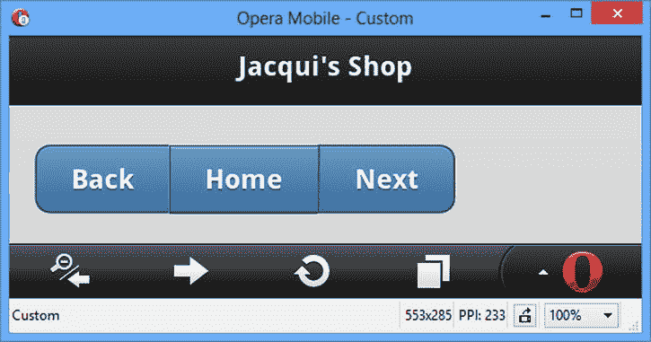

图 30-4 。创建水平按钮组

配置 jQuery Mobile 按钮

jQuery Mobile 定义了许多数据属性和配置设置，您可以使用它们来配置按钮和从不同的元素类型创建按钮。这些属性在表 30-2 中有所描述，我将在接下来的章节中演示这些按钮特有的属性。

表 30-2 。数据属性和按钮配置设置

| 数据属性 | 环境 | 描述 |
| --- | --- | --- |
| `data-corners` | `corners` | 当`true`时，按钮用圆角绘制。值`false`意味着将使用方形拐角。默认是`true`。 |
| `data-icon` | `icon` | 指定要在按钮中使用的图标。 |
| `data-iconpos` | `iconpos` | 如果使用了图标，则指定图标的位置。 |
| `data-iconshadow` | `iconshadow` | 设置为`true`时，对图标应用阴影。 |
| `data-inline` | `inline` | 创建一个按其内容调整大小的按钮(而不是填满屏幕)。 |
| `data-mini` | `mini` | 当设置为`true`时，显示一个紧凑按钮。 |
| `data-shadow` | `shadow` | 当`true`时，按钮用阴影绘制。值`false`意味着不使用阴影。默认是`true`。 |

向按钮添加图标

jQuery Mobile 包括一组可以在按钮中使用的图标。这些都包含在你在第二十七章中安装的`images`目录下的一个镜像文件中。表 30-3 显示了图标名称列表和每个图标的简要描述。

表 30-3 。jQuery Mobile 中包含的图标

| 图标名称 | 描述 |
| --- | --- |
| `arrow-l``arrow-r``arrow-u` | 面向左、右、上、下的箭头。 |
| `bars` | 一组三条水平线。 |
| `edit` | 铅笔，用于表示用户可以编辑内容。 |
| `check` `delete` | 一张支票和一个十字。 |
| `plus` `minus` | 加号和减号。 |
| `gear` | 一个齿轮。 |
| `refresh``forward``back``home` | 用于刷新、前进到下一页、返回到上一页、返回到主页或搜索的浏览器样式图标。 |
| `grid` | 一个由小方块组成的网格。 |
| `star` | 一颗星星。 |
| `alert` | 小心警告。 |
| `info` | 程式化的字母 I。 |

使用`data-icon`属性将图标应用于按钮，其中的值指定了要使用的图标的名称。使用`data-iconpos`属性来指定图标在按钮中的位置。默认为`left`，但也可以指定`top`、`right`和`bottom`。如果将`data-iconpos`设置为`notext`，则仅显示图标。清单 30-5 提供了一个使用这两种属性的例子。

***清单 30-5*** 。向按钮添加图标

```js
<!DOCTYPE html>
<html>
<head>
    <title>Example</title>
    <meta name="viewport" content="width=device-width, initial-scale=1">
    <link rel="stylesheet" href="jquery.mobile-1.3.1.css" type="text/css" />
    <script type="text/javascript" src="jquery-1.10.1.js"></script>
    <script type="text/javascript" src="jquery.mobile-1.3.1.js"></script>
</head>
<body>
    <div id="page1" data-role="page" data-theme="b">
        <div data-role="header">
           <h1>Jacqui's Shop</h1>
        </div>
        <div data-role="content">
            <div class="ui-grid-b">
                <div class="ui-block-a">
                    <button data-icon="home">Home</button>
                </div>
                <div class="ui-block-b">
                    <button data-icon="home" data-iconpos="top">Home</button>
                </div>
                <div class="ui-block-c">
                    <button data-icon="home" data-iconpos="notext"></button>
                </div>
            </div>
        </div>
    </div>
</body>
</html>
```

在这个例子中，我创建了三个按钮，它们都显示了`home`图标。第一个按钮使用默认的图标位置，第二个按钮使用`top`位置，最后一个按钮使用`notext`值，这将创建一个只有图标的按钮。你可以在图 30-5 中看到这些按钮是如何出现的。

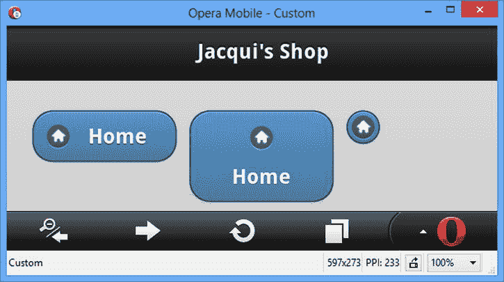

图 30-5 。创建图标按钮

你可以看到每个按钮都有独特的风格。最引人注目的是最后一个按钮，它不显示任何文本。这看起来很吸引人，但是我对这种按钮的体验是，它们很难用手指点击，并且不是所有的用户都能立即识别出它们是在应用中导航的一种方式。

创建内嵌和迷你按钮

默认情况下，jQuery Mobile 按钮跨越整个屏幕宽度。你可以在图 30-1 中看到默认按钮宽度的例子。在后面的例子中，我使用了布局网格来创建更小的按钮，但是我可以使用*内嵌按钮*来实现类似的效果，这些按钮的大小刚好能够容纳它们的内容，并且是通过将`data-inline`属性设置为`true`来创建的。

我还可以通过将`data-mini`属性设置为`true`来创建迷你按钮。迷你按钮有标准的宽度，但是占据更少的垂直空间。最后，你可以结合这两种数据属性来创建内嵌的迷你按钮，它们的宽度刚好能容纳它们的内容*和*比普通按钮占据更少的垂直空间。清单 30-6 显示了所有三种类型的按钮。

***清单 30-6*** 。使用内嵌和迷你按钮

```js
<!DOCTYPE html>
<html>
<head>
    <title>Example</title>
    <meta name="viewport" content="width=device-width, initial-scale=1">
    <link rel="stylesheet" href="jquery.mobile-1.3.1.css" type="text/css" />
    <script type="text/javascript" src="jquery-1.10.1.js"></script>
    <script type="text/javascript" src="jquery.mobile-1.3.1.js"></script>
</head>
<body>
    <div id="page1" data-role="page" data-theme="b">
        <div data-role="header">
           <h1>Jacqui's Shop</h1>
        </div>
        <div data-role="content">
            <button data-icon="home" data-inline="true">Home</button>
            <button data-icon="home" data-mini="true">Home</button>
            <button data-icon="home" data-inline="true" data-mini="true">Home</button>
        </div>
    </div>
</body>
</html>
```

你可以在图 30-6 中看到效果。

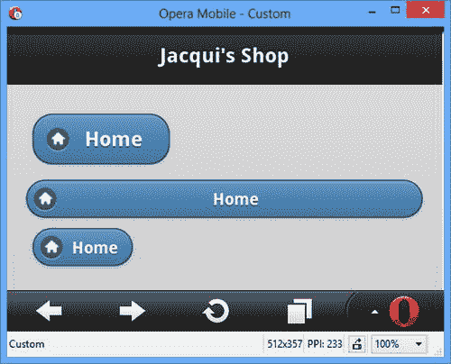

图 30-6 。使用内嵌和迷你按钮

使用按钮方法

按钮部件定义了三种方法，我已经在表 30-4 中描述过了。

表 30-4 。按钮方法

| 方法 | 描述 |
| --- | --- |
| `button("disable")` | 禁用按钮，使其不能被点击。 |
| `button("enable")` | 启用按钮，以便可以单击它。 |
| `button("refresh")` | 刷新小部件以反映基础 HTML 元素中的更改。 |

`enable`和`disable`方法不言而喻。当底层`button`或`input`元素的内容改变时，需要`refresh`方法，如清单 30-7 中的所示。

***清单 30-7*** 。更新按钮部件的内容

```js
<!DOCTYPE html>
<html>
<head>
    <title>Example</title>
    <meta name="viewport" content="width=device-width, initial-scale=1">
    <link rel="stylesheet" href="jquery.mobile-1.3.1.css" type="text/css" />
    <script type="text/javascript" src="jquery-1.10.1.js"></script>
    <script>
        $(document).bind("pageinit", function () {
            var counter = 0;  
            setInterval(function () {
                var msg = "Counter " + counter++;  
                $("#buttonElem").text(msg).button("refresh");  
                $("#inputElem").val(msg).button("refresh");  
                $("#divElem span.ui-btn-text").text(msg);  
            }, 1000);  
        });  
    </script>
    <script type="text/javascript" src="jquery.mobile-1.3.1.js"></script>
</head>
<body>
    <div id="page1" data-role="page" data-theme="b">
        <div data-role="header">
           <h1>Jacqui's Shop</h1>
        </div>
        <div data-role="content">
            <button id="buttonElem">Button</button>
            <input id="inputElem" type="button" value="Input" />
            <div id="divElem" data-role="button">Div</div>
        </div>
    </div>
</body>
</html>
```

本例中有三个按钮小部件，分别由一个`button`元素、一个`input`元素和一个`div`元素创建。`script`元素通过调用`setInterval`函数每秒更新支撑按钮部件的元素内容来处理`pageinit`事件(我在第二十九章中描述过)。

我必须为`button`和`input`元素调用`refresh`方法；否则，我对元素所做的更改将不会反映在按钮小部件中:

```js
...
$("#buttonElem").text(msg).button("refresh");  
$("#inputElem").val(msg).button("refresh");  
...
```

当您从其他元素(如`div`元素)创建按钮小部件时，需要一种不同的方法。在这种情况下，jQuery Mobile 添加内容元素，这样它就可以应用 CSS 样式来调整小部件的形状，更改元素的内容会影响小部件的形状。相反，您需要查看 jQuery Mobile 在元素内部生成的 HTML，并定位文本内容。我的示例中的`div`元素由`span`元素填充，我可以通过定位属于`ui-btn-text`类的元素来更改文本内容，如下所示:

```js
...
$("#divElem span.ui-btn-text").text(msg);  
...
```

 **提示**我通过使用浏览器 F12 工具来浏览 jQuery Mobile 在增强过程中生成的内容，从而找到了这个元素。

使用按钮事件

按钮小部件定义了标准的`create`事件，该事件在小部件被创建时被触发，但是支撑小部件的小部件仍然会触发它们自己的事件，这将由我在第二十九章中描述的 jQuery Mobile 事件来补充。这意味着您可以为`tap`事件创建处理程序，例如，当按钮被点击时接收通知，如清单 30-8 所示。

 **提示**不要忘记事件可以对某些元素有一个默认动作——例如，这意味着从`input`元素创建的按钮部件将提交它们所属的表单。jQuery 事件处理详见第二十八章。

***清单 30-8*** 。处理按钮事件

```js
<!DOCTYPE html>
<html>
<head>
    <title>Example</title>
    <meta name="viewport" content="width=device-width, initial-scale=1">
    <link rel="stylesheet" href="jquery.mobile-1.3.1.css" type="text/css" />
    <script type="text/javascript" src="jquery-1.10.1.js"></script>
    <script>
        $(document).bind("pageinit", function () {
            $("button").tap(function (e) {
                $(this).text("Tapped!").button("refresh");  
            });  
        });  
    </script>
    <script type="text/javascript" src="jquery.mobile-1.3.1.js"></script>
</head>
<body>
    <div id="page1" data-role="page" data-theme="b">
        <div data-role="header">
           <h1>Jacqui's Shop</h1>
        </div>
        <div data-role="content">
            <button>Button</button>
        </div>
    </div>
</body>
</html>
```

在这个清单中，我使用`tap`方法为按钮上的`tap`事件注册一个处理函数。当单击`button`时，我通过更改按钮文本并调用`refresh`方法来更新小部件内容来处理事件。

使用 jQuery Mobile 导航栏

导航栏是在页眉或页脚中提供导航支持的一组按钮，允许用户浏览一组内容页面。导航条非常简单，但是当你有一组相关的页面要显示，并且你需要给用户一个清晰的信号，告诉他们当前显示的是哪个页面的时候，导航条是一个非常有用的工具。导航条是使用特定的元素结构创建的，你可以在清单 30-9 中看到。

***清单 30-9*** 。创建一个导航条

```js
<!DOCTYPE html>
<html>
<head>
    <title>Example</title>
    <meta name="viewport" content="width=device-width, initial-scale=1">
    <link rel="stylesheet" href="jquery.mobile-1.3.1.css" type="text/css" />
    <script type="text/javascript" src="jquery-1.10.1.js"></script>
    <script type="text/javascript" src="jquery.mobile-1.3.1.js"></script>
</head>
<body>
    <div id="page1" data-role="page">
        <div data-role="header">
            <h1>Jacqui's Shop</h1>
            <div data-role="navbar">
                <ul>
                    <li><a href="#page1"
                        class="ui-btn-active ui-state-persist">Page 1</a></li>
                    <li><a href="#page2">Page 2</a></li>
                    <li><a href="#page3">Page 3</a></li>
                </ul>
            </div>
        </div>
        <div data-role="content">This is page 1</div>
    </div>

    <div id="page2" data-role="page">
        <div data-role="header">
            <h1>Jacqui's Shop</h1>
            <div data-role="navbar">
                <ul>
                    <li><a href="#page1">Page 1</a></li>
                    <li><a href="#page2"
                        class="ui-btn-active ui-state-persist">Page 2</a></li>
                    <li><a href="#page3">Page 3</a></li>
                </ul>
            </div>
        </div>
        <div data-role="content">This is page 2</div>
   </div>

    <div id="page3" data-role="page">
        <div data-role="header">
           <h1>Jacqui's Shop</h1>
            <div data-role="navbar">
                <ul>
                    <li><a href="#page1">Page 1</a></li>
                    <li><a href="#page2">Page 2</a></li>
                    <li><a href="#page3"
                        class="ui-btn-active ui-state-persist">Page 3</a></li>
                </ul>
            </div>
        </div>
        <div data-role="content">This is page 3</div>
   </div>
</body>
</html>
```

导航条由一个`div`元素定义，该元素的`data-role`属性被设置为`navbar`。导航栏中的各个按钮被定义为包含在`li`元素中的`a`元素，而`ul`元素又包含在`a`元素中。在清单中，我使用了 Navbar 最常见的形式，它在多个 jQuery Mobile 页面中重复出现，为用户提供一致的引用，如图 30-7 所示。

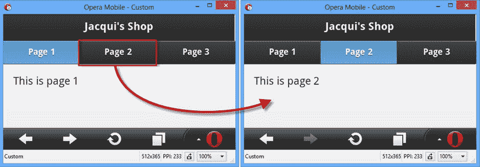

图 30-7 。导航栏小部件

NavBar 小部件在导航按钮之间平均分配可用的屏幕空间，单击其中一个按钮会显示由底层`a`元素的`href`属性标识的页面。

有两个 CSS 类必须应用于`a`元素，以向用户指示页面正在显示。`ui-btn-active`类将按钮标记为活动状态，而`ui-state-persist`类确保在用户导航回之前显示的页面时显示活动状态。

配置 jQuery Mobile 导航栏

导航条只支持一个数据属性/配置选项，我已经在表 30-5 中描述过了。

表 30-5 。导航栏的数据属性和配置设置

| 数据属性 | 环境 | 描述 |
| --- | --- | --- |
| `data-iconpos` | `iconpos` | 指定图标在导航栏按钮中的位置。支持的位置有`left`、`right`、`top`(默认)和`bottom`。你也可以使用`notext`值来显示一个没有任何文本的图标。 |

我在本章前面列出了 jQuery Mobile 图标。使用`data-icon`属性将单个图标应用于`a`元素，您可以看到我是如何在清单 30-10 中定位带有`data-iconpos`属性的图标的。

***清单 30-10*** 。在导航条中定位图标

```js
<!DOCTYPE html>
<html>
<head>
    <title>Example</title>
    <meta name="viewport" content="width=device-width, initial-scale=1">
    <link rel="stylesheet" href="jquery.mobile-1.3.1.css" type="text/css" />
    <script type="text/javascript" src="jquery-1.10.1.js"></script>
    <script type="text/javascript" src="jquery.mobile-1.3.1.js"></script>
</head>
<body>
    <div id="page1" data-role="page">
        <div data-role="header">
            <h1>Jacqui's Shop</h1>
            <div data-role="navbar" data-iconpos="left">
                <ul>
                    <li><a href="#page1" data-icon="alert"
                        class="ui-btn-active ui-state-persist">Page 1</a></li>
                    <li><a href="#page2" data-icon="info">Page 2</a></li>
                    <li><a href="#page3" data-icon="gear">Page 3</a></li>
                </ul>
            </div>
        </div>
        <div data-role="content">This is page 1</div>
    </div>
</body>
</html>
```

你可以在图 30-8 中看到图标的效果。

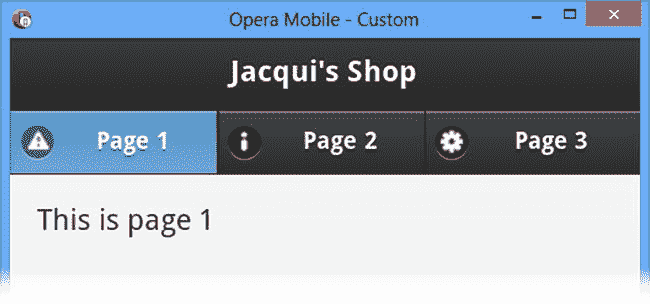

图 30-8 。在导航栏中添加和定位图标

使用导航栏方法&事件

NavBar 小部件没有定义任何方法，仅支持`create`事件，该事件在小部件被实例化时触发。

 **提示**处理来自`a`元素的事件以响应用户导航。

使用可折叠的内容块

jQuery Mobile 支持创建*可折叠的内容块*，这些内容块是带有标题的内容部分，可以被关闭，这样只有标题是可用的。这类似于 jQuery UI 手风琴的单个面板，我在第十九章中描述过。

创建可折叠块

为了给 jQuery Mobile 提供它需要的元素，可折叠块有一个特定的结构。清单 30-11 包含了一个例子。

***清单 30-11*** 。创建单个可折叠块

```js
<!DOCTYPE html>
<html>
<head>
    <title>Example</title>
    <meta name="viewport" content="width=device-width, initial-scale=1">
    <link rel="stylesheet" href="jquery.mobile-1.3.1.css" type="text/css" />
    <script type="text/javascript" src="jquery-1.10.1.js"></script>
    <script type="text/javascript" src="jquery.mobile-1.3.1.js"></script>
</head>
<body>
    <div id="page1" data-role="page" data-theme="b">
        <div data-role="header">
           <h1>Jacqui's Shop</h1>
        </div>
        <div data-role="content">
            <div data-role="collapsible">
                <h1>New Delivery Service</h1>
                <p>We are pleased to announce that we are starting a home delivery
                service for your flower needs. We will deliver within a 20 mile radius
                of the store for free and $1/mile thereafter.</p>
            </div>
        </div>
    </div>
</body>
</html>
```

您要做的第一件事是创建一个`div`元素，并应用值为`collapsible`的`data-role`属性。这告诉 jQuery Mobile 您想要一个可折叠的块，它应该寻找一个 header 元素作为`div`的第一个子元素。您可以使用任何标题元素，`h1`到`h6`。我使用了一个`h1`元素，但是 jQuery Mobile 对这种小部件的所有标题一视同仁。`div`的其余子元素用作可折叠元素的内容，产生如图 30-9 所示的效果。

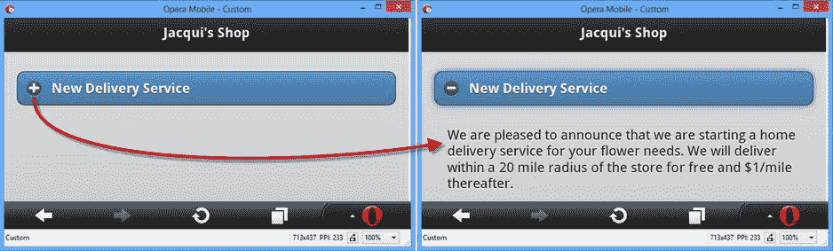

图 30-9 。展开可折叠块

第一次显示时，该块是折叠的，这意味着内容是隐藏的，只能看到标题。作为对用户的提示，在标题区域的左边缘绘制了一个加号图标(其样式与非内联按钮相同)。单击标题会显示内容并将图标替换为减号，表示该块可以再次折叠。

配置 jQuery Mobile 可折叠内容块

jQuery Mobile 定义了表 30-6 中所示的数据属性和配置设置。

表 30-6 。可折叠块的数据属性和配置设置

| 数据属性 | 环境 | 描述 |
| --- | --- | --- |
| `data-collapsed` | `collapsed` | 当`true`为默认值时，块显示为折叠状态(即，用户只能看到标题)。值`false`意味着块被展开显示。 |
| `data-collapsed-icon` | `collapsedIcon` | 指定块折叠时显示的图标。 |
| `data-content-theme` | `contentTheme` | 指定可折叠块内容区域的主题。 |
| `data-corners` | `corners` | 当`true`时，可折叠块用圆角绘制。值`false`产生方形角。 |
| `data-expanded-icon` | `expandedIcon` | 指定块展开时显示的图标。 |
| `data-iconpos` | `iconPos` | 指定图标在标题中的位置，使用与导航条和按钮部件相同的值。 |
| `data-inset` | `inset` | 当设置为`false`时，标题将填充窗口，没有任何填充。默认为`true`。 |
| `data-mini` | `mini` | 设置为`true`时，标题以紧凑形式绘制。 |

在清单 30-12 中，你可以看到我是如何将一些数据属性应用到这个例子中的。

***清单 30-12*** 。配置可折叠块小部件

```js
<!DOCTYPE html>
<html>
<head>
    <title>Example</title>
    <meta name="viewport" content="width=device-width, initial-scale=1">
    <link rel="stylesheet" href="jquery.mobile-1.3.1.css" type="text/css" />
    <script type="text/javascript" src="jquery-1.10.1.js"></script>
    <script type="text/javascript" src="jquery.mobile-1.3.1.js"></script>
</head>
<body>
    <div id="page1" data-role="page" data-theme="b">
        <div data-role="header">
           <h1>Jacqui's Shop</h1>
        </div>
        <div data-role="content">
            <div data-role="collapsible" data-content-theme="e" data-collapsed="false"
                    data-inset="false" data-iconpos="top">
                <h1>New Delivery Service</h1>
                <p>We are pleased to announce that we are starting a home delivery
                service for your flower needs. We will deliver within a 20 mile radius
                of the store for free and $1/mile thereafter.</p>
            </div>
        </div>
    </div>
</body>
</html>
```

我已经更改了`data-content-theme`、`data-inset`、`data-iconpos`和`data-collapsed`属性的值。你可以在图 30-10 中看到效果。

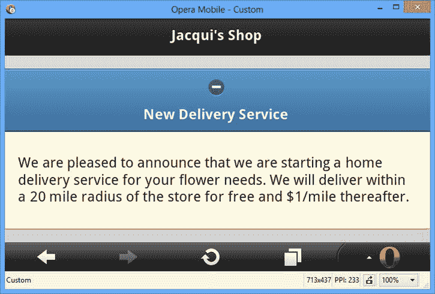

图 30-10 。配置可折叠块小部件

使用可折叠块方法

可折叠块小部件没有定义任何方法。

使用可折叠块事件

可折叠块微件定义了表 30-7 中所示的事件。

表 30-7 。可折叠块事件

| 事件 | 描述 |
| --- | --- |
| `create` | 创建小部件时会触发此事件。 |
| `collapse` | 当可折叠块折叠时触发。 |
| `expand` | 当可折叠块展开时触发。 |

在清单 30-13 中，您可以看到我是如何处理`collapse`和`expand`事件来报告可折叠块的状态的。如果这看起来像是一个人为的例子，那是因为这些事件很少有用。

***清单 30-13*** 。使用折叠和展开事件

```js
<!DOCTYPE html>
<html>
<head>
    <title>Example</title>
    <meta name="viewport" content="width=device-width, initial-scale=1">
    <link rel="stylesheet" href="jquery.mobile-1.3.1.css" type="text/css" />
    <script type="text/javascript" src="jquery-1.10.1.js"></script>
    <script type="text/javascript">
        $(document).bind("pageinit", function() {
            $('#colBlock').bind("collapse expand", function(event) {
                $('#status').text(event.type == "expand" ? "Expanded" : "Collapsed");
            })  
        });  
    </script>
    <script type="text/javascript" src="jquery.mobile-1.3.1.js"></script>
</head>
<body>
    <div id="page1" data-role="page" data-theme="b">
        <div data-role="header">
           <h1>Jacqui's Shop</h1>
        </div>
        <div data-role="content">
            The block is <b><span id="status">Expanded</span></b>

            <div id="colBlock" data-role="collapsible" data-content-theme="e"
                    data-collapsed=false>
                <h1>New Delivery Service</h1>
                <p>We are pleased to announce that we are starting a home
                delivery service for your flower needs. We will deliver within a
                20 mile radius of the store for free and $1/mile thereafter.</p>
            </div>
        </div>
    </div>
</body>
</html>
```

在这个例子中，我使用了`bind`方法来监听`expand`和`collapse`事件。我在对`bind`方法的一次调用中通过列出我感兴趣的事件来做到这一点，用空格分隔。当其中一个事件被触发时，我更新一个`span`元素的内容来反映可折叠块的状态。在图 30-11 中可以看到状态的变化。

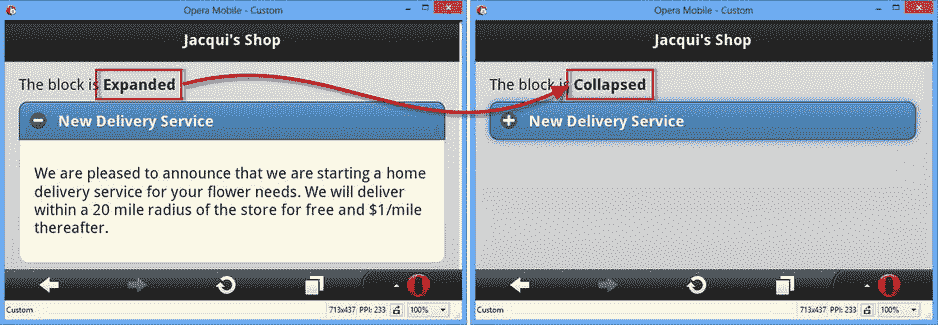

图 30-11 。响应展开和折叠事件

使用 jQuery Mobile 可折叠集(折叠)

可折叠的 set widget 组合多个可折叠的块来创建一个手风琴。可折叠集合是通过使用将两个或更多可折叠块包装在单个父元素中的`div`元素，并将`data-role`属性应用于值为`collapsible-set`的`div`元素来定义的。你可以在清单 30-14 中看到这是如何做到的。

***清单 30-14*** 。创建 jQuery Mobile 手风琴

```js
<!DOCTYPE html>
<html>
<head>
    <title>Example</title>
    <meta name="viewport" content="width=device-width, initial-scale=1">
    <link rel="stylesheet" href="jquery.mobile-1.3.1.css" type="text/css" />
    <script type="text/javascript" src="jquery-1.10.1.js"></script>
    <script type="text/javascript" src="jquery.mobile-1.3.1.js"></script>
</head>
<body>
    <div id="page1" data-role="page" data-theme="b">
        <div data-role="header">
           <h1>Jacqui's Shop</h1>
        </div>
        <div data-role="content">
            <div data-role="collapsible-set" data-content-theme="e">
                <div data-role="collapsible">
                    <h1>New Delivery Service</h1>
                    <p>We are pleased to announce that we are starting a home
                    delivery service for your flower needs. We will deliver within a
                    20 mile radius of the store for free and $1/mile thereafter.</p>
                </div>
                <div data-role="collapsible" data-collapsed=false>
                    <h1>Summer Specials</h1>
                    <p>We have a wide range of special summer offers.
                        Ask instore for details</p>
                </div>
                <div data-role="collapsible">
                    <h1>Bulk Orders</h1>
                    <p>We offer discounts for large orders. Ask us for prices</p>
                </div>
            </div>
        </div>
    </div>
</body>
</html>
```

在这个例子中，我用`data-role`属性的`collapsible-set`值定义了一个`div`元素，它包含三个可折叠块。

 **提示**注意，我将`data-content-theme`属性应用于外部容器。这与在每个单独的可折叠块上使用属性具有相同的效果。

默认情况下，所有可折叠的块最初都是折叠的，所以我将`data-collapsed`属性应用于其中一个值为`false`的块，以便它在页面第一次显示时展开。当用户点击标题时，当前展开的元素被折叠。你可以在图 30-12 中看到效果。

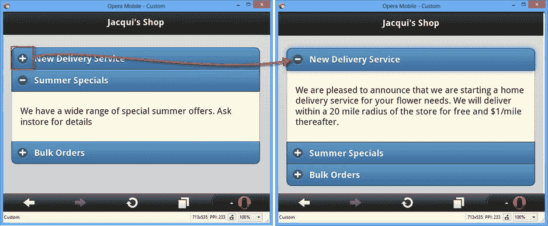

图 30-12 。在 jQuery Mobile 手风琴中展开块

配置可折叠集合

可折叠集支持与可折叠块小部件相同的一组数据属性和设置。

使用可折叠设置方法

可折叠设置小部件支持一种方法，如表 30-8 所述。

表 30-8 。可折叠集合方法

| 方法 | 描述 |
| --- | --- |
| `collapsibleset("refresh")` | 刷新小部件以反映基础 HTML 元素中的更改。 |

使用可折叠设置事件

可折叠的 set 小部件只定义了`create`事件，该事件在小部件应用于 HTML 元素时被触发。

摘要

在这一章中，我描述了更多的 jQuery Mobile 小部件:按钮、可折叠块和小部件，它们提供了相同主题的变体——导航条和可折叠集合。在第三十一章中，我向您展示了 jQuery Mobile 表单小部件。