# 三十一、使用 jQuery Mobile 表单

当在移动设备上呈现表单时，存在特别的困难。开始时屏幕空间很小，您需要为用户提供易于触摸操作的表单元素，而不需要创建需要无休止滚动才能完成的页面。在这一章中，我将向您展示 jQuery Mobile 如何增强表单元素，使它们与其他小部件保持一致，并且可以很容易地在触摸屏上使用。

jQuery Mobile 在页面加载时会自动完成大量工作。表单元素在没有您干预的情况下得到增强，并且在提交表单时自动使用 Ajax，以便 jQuery Mobile 可以平稳地转换到服务器返回的结果。

我建议在为移动设备创建表单时仔细考虑。就其本质而言，表单旨在收集用户的输入，但这在移动设备上可能是一个乏味的过程，尤其是在输入时。此外，当用户不主动滚动页面时，一些移动设备不会显示滚动条。这意味着用户并不总是意识到有表单元素就在即时显示之外。要为用户创造最佳体验，您需要遵循一些基本准则:

*   需要尽可能少的打字。在可能的情况下，使用允许用户进行简单触摸选择的替代部件，比如复选框或单选按钮。这可能会缩小用户可以输入的范围，但可能会增加愿意完成表单的用户数量。
*   *使用页面间导航来显示表单的各个部分*。这给用户一个清晰的进度指示，不需要他们推测性地滚动来查看是否遗漏了什么。
*   *删除任何不需要的表单元素*。移动表单应该尽可能精简，这意味着从移动用户那里接受的数据要比从桌面用户那里接受的少。

表 31-1 对本章进行了总结。

表 31-1 。章节总结

| 问题 | 解决办法 | 列表 |
| --- | --- | --- |
| 为表单元素创建小部件。 | 不需要特定的操作——jQuery Mobile 会自动应用小部件。 | one |
| 添加一个按钮来清除 input 元素的内容，或者更改 input 元素的小部件的显示方式。 | 使用`data-clear-btn`和`data-mini`属性。 | Two |
| 启用或禁用输入元素。 | 使用`enable`和`disable`方法。 | three |
| 创建一个滑块小部件。 | 定义一个类型属性为`range`的`input`元素。 | four |
| 创建一个范围滑块小部件。 | 在一个`div`元素中定义一对`input`元素，该元素的`data-role`属性被设置为`rangeslider`。 | five |
| 配置滑块的外观。 | 使用`data-highlight`、`data-mini`和`data-track-theme`属性。 | 6, 7 |
| 更新范围滑块以反映底层`input`元素的变化。 | 使用`refresh`方法。 | eight |
| 使用滑块小工具时接收通知。 | 处理`start`、`stop`和`normalize`事件。 | 9, 10 |
| 为一个`select`元素创建一个小部件。 | 不需要特定的操作。 | Eleven |
| 配置为`select`元素显示的按钮。 | 使用数据角、`data-icon`、`data-iconpos`和`data-mini`属性。 | Twelve |
| 配置允许用户为`select`元素选择值的弹出窗口。 | 使用`data-native-menu`、`data-overlay-theme`和`data-divider-theme`属性。 | Thirteen |
| 向`select`菜单添加占位符。 | 将`select`元素包含的`option`元素之一的`data-placeholder`属性设置为`true`。 | Fourteen |
| 以编程方式控制 selectmenu 小工具。 | 使用`open`、`close`、`disable`、`enable`和`refresh`方法。 | Fifteen |
| 创建翻转开关小部件。 | 定义一个包含两个`option`元素并且将`data-role`属性设置为`slider`的`select`元素。 | Sixteen |
| 创建复选框和单选按钮小部件。 | 不需要特定的操作。 | 17–20 |

创建表单元素小部件

jQuery Mobile 使用自动增强功能在加载 HTML 页面时为表单元素创建小部件，就像我在前面章节中描述的小部件一样。清单 31-1 展示了一个 jQuery Mobile 页面，其中包含一个`form`元素和一些与表单相关的子元素。

***清单 31-1*** 。jQuery Mobile 页面中的简单表单

```js
<!DOCTYPE html>
<html>
<head>
    <title>Example</title>
    <meta name="viewport" content="width=device-width, initial-scale=1">
    <link rel="stylesheet" href="jquery.mobile-1.3.1.css" type="text/css" />
    <script type="text/javascript" src="jquery-1.10.1.js"></script>
    <script type="text/javascript" src="jquery.mobile-1.3.1.js"></script>
    <style type="text/css">
        #buttonContainer {text-align: center}
        div[data-role=fieldcontain] { padding: 0 10px; }
    </style>
</head>
<body>
    <div id="page1" data-role="page" data-theme="b">
        <div data-role="header">
           <h1>Jacqui's Shop</h1>
        </div>
        <form method="get">
            <div data-role="fieldcontain">
                <label for="name">Name: </label>
                <input id="name">
            </div>
            <div data-role="fieldcontain">
                <label for="address">Address: </label>
                <textarea id="address"></textarea>
            </div>
            <div id="buttonContainer">
                <input type="submit" data-inline="true" value="Submit"/>
            </div>
        </form>
    </div>
</body>
</html>
```

这是一个简单的表单，但是它为 jQuery Mobile 如何处理整个表单奠定了基础。有两个表单元素:一个文本`input` 和一个`textarea` ，每个元素都与一个`label`元素成对出现。您可以在图 31-1 中看到结果，这是我使用 BrowserStack 服务创建的，因为 Opera Mobile 模拟器没有正确实现 jQuery Mobile 依赖于表单元素的一个特性，我将在下一节解释这个特性。

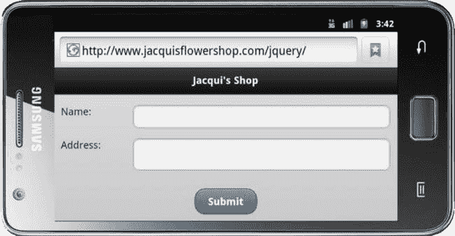

图 31-1 。jQuery Mobile 显示的简单表单

 **提示**注意，我已经使用 CSS 为包含表单元素的`div`元素设置了`padding`属性。如果没有这个设置，jQuery Mobile 将会沿着窗口的左右边缘绘制标签和表单元素。

当表单元素中包含类型为`submit`的`input`元素时，jQuery Mobile 将自动提交表单。默认情况下，表单将使用 Ajax 提交，但是可以通过将值为`false`的`data-ajax`属性应用到`form`元素来禁用这种行为。

在最后一个例子中，每个表单元素及其`label`都被包装在一个`div`元素中。我将`div`元素的`data-role`设置为`fieldcontain`，这告诉 jQuery Mobile 我希望`label`和表单元素显示在一行中，你可以在图 31-1 中看到效果。

jQuery Mobile 应用于对齐标签和表单元素的样式仅在屏幕宽度至少为 450 像素时使用。在该宽度值之下，`label`和`input` / `textarea`元素显示在不同的行上，如图 31-2 中的所示。Opera Mobile Emulator 总是报告其屏幕宽度小于 450 像素，这就是为什么我不得不使用不同的浏览器来生成这些示例的图形。(这只是模拟器的问题——真正的 Opera 移动浏览器正确实现了该功能。)

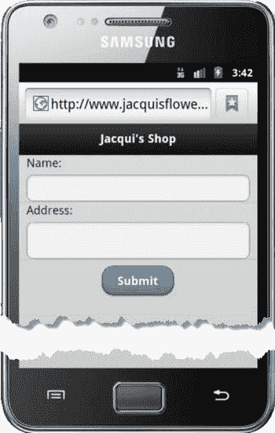

图 31-2 。纵向显示表单

使用 Textinput 小工具

jQuery Mobile 对它支持的每个表单元素使用不同的小部件，我描述的第一个小部件是用于`textarea`元素和`input`元素的*文本输入*小部件。这是上一个示例中使用的小部件。

配置 文本输入小部件

textinput 小部件定义了表 31-2 中描述的属性和设置特性。通过`textinput`方法应用设置。

表 31-2 。TextInput 小工具的属性 和配置设置

| 数据属性 | 环境 | 描述 |
| --- | --- | --- |
| `data-clear-btn` | `clearBtn` | 当设置为`true`时，微件显示有一个清除内容的按钮。默认为`false`。 |
| `data-clearn-btn-text` | `clearBtnText` | 为辅助功能软件设置清除按钮的文本。 |
| `data-mini` | `mini` | 当设置为`true`时，创建小版本的微件。默认为`false`。 |
| `data-prevent-focus-zoom` | `preventFocusZoom` | 当设置为`true`时，当小工具具有焦点时，浏览器被阻止缩放。 |

在清单 31-2 中，您可以看到我是如何应用`data-clear-btn`和`data-mini`属性来配置`input`元素上的 textinput 小部件的。

***清单 31-2*** 。配置 Textinput 部件

```js
...
<form method="get">
    <div data-role="fieldcontain">
        <label for="name">Name: </label>
        <input id="name" data-clear-btn="true" data-mini="true">
    </div>
    <div data-role="fieldcontain">
        <label for="address">Address: </label>
        <textarea id="address"></textarea>
    </div>
    <div id="buttonContainer">
        <input type="submit" data-inline="true" value="Submit"/>
    </div>
</form>
...
```

你可以在图 31-3 中看到结果。直到用户开始在`input`元素中输入文本，清除按钮才会显示，点击该按钮会删除任何已经输入的内容。如果您使用 clear 按钮特性，那么一定要对所有的`input`元素保持一致。

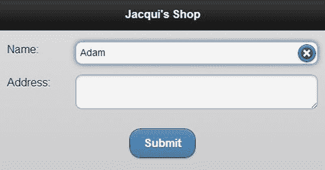

图 31-3 。配置 textinput 部件

使用 Textinput 小部件方法

textinput 小部件定义了表 31-3 中所示的两种方法。

表 31-3 。文本输入方法

| 方法 | 描述 |
| --- | --- |
| `textinput("disable")` | 禁用小部件，防止用户输入或编辑内容。 |
| `textinput("enable")` | 启用小部件，允许输入或编辑内容。 |

在清单 31-3 中，我使用了两种方法来改变一个`input`元素的状态。

***清单 31-3*** 。使用 Textwidget 方法

```js
<!DOCTYPE html>
<html>
<head>
    <title>Example</title>
    <meta name="viewport" content="width=device-width, initial-scale=1">
    <link rel="stylesheet" href="jquery.mobile-1.3.1.css" type="text/css" />
    <script type="text/javascript" src="jquery-1.10.1.js"></script>
    <script>
        $(document).bind("pageinit", function () {
            $("button").tap(function (e) {
                $("#name").textinput(e.target.id);
                e.preventDefault();
            });  
        });  
    </script>
    <script type="text/javascript" src="jquery.mobile-1.3.1.js"></script>
    <style type="text/css">
        #buttonContainer {text-align: center}
        div[data-role=fieldcontain] { padding: 0 10px; }
    </style>
</head>
<body>
    <div id="page1" data-role="page" data-theme="b">
        <div data-role="header">
           <h1>Jacqui's Shop</h1>
        </div>
        <form method="get">
            <div data-role="fieldcontain">
                <label for="name">Name: </label>
                <input id="name" data-clear-btn="true" data-mini="true">
            </div>
            <div id="buttonContainer">
                <button id="enable">Enable</button>
                <button id="disable">Disable</button>
            </div>
        </form>
    </div>
</body>
</html>
```

我添加了按钮来改变`input`元素的状态，你可以看到一个被禁用的元素是如何出现在图 31-4 中的。

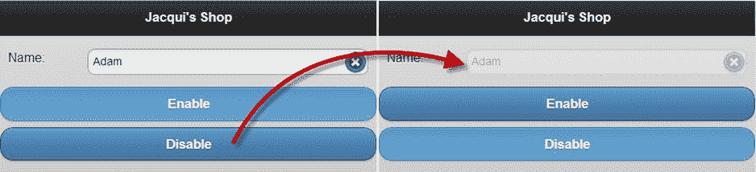

图 31-4 。禁用 textinput widget

使用 Textinput 小部件事件

`textinput`小部件只定义了`create`事件，当小部件应用于一个元素时会触发该事件。

使用滑块和范围滑块部件

滑块小部件应用于`input`元素，其`type`属性设置为`range`。`input`元素的值用于设置标尺上滑块的初始位置，该位置由`min`和`max`属性的值定义。清单 31-4 显示了一个`range input`元素的简单例子。

***清单 31-4*** 。使用滑块小部件

```js
<!DOCTYPE html>
<html>
<head>
    <title>Example</title>
    <meta name="viewport" content="width=device-width, initial-scale=1">
    <link rel="stylesheet" href="jquery.mobile-1.3.1.css" type="text/css" />
    <script type="text/javascript" src="jquery-1.10.1.js"></script>
    <script type="text/javascript" src="jquery.mobile-1.3.1.js"></script>
    <style type="text/css">
        div[data-role=fieldcontain] { padding: 0 10px; }
    </style>
</head>
<body>
    <div id="page1" data-role="page" data-theme="b">
        <div data-role="header">
           <h1>Jacqui's Shop</h1>
        </div>
        <form method="get">
            <div data-role="fieldcontain">
                <label for="quantity">Quantity: </label>
                <input id="quantity" type="range" value="10" min="1" max="20">
            </div>
        </form>
    </div>
</body>
</html>
```

 **提示**`type`属性的`range`值是在 HTML5 中添加的，作为对`input`元素的更广泛增强的一部分。欲知详情，请参阅我的书《HTML5 权威指南》，这本书也是由 Apress 出版的。

我定义了一个类型属性设置为`range`的`input`元素，指定初始值为 10，取值范围为 1 到 20。在图 31-5 的中，你可以看到 jQuery Mobile 是如何用 slider 小部件增强这个元素的。

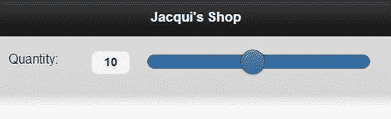

图 31-5 。使用滑块小部件

您还可以通过将两个`input`元素配对来创建一个*范围滑块* ，允许用户在单个小部件中选择一个上限值和下限值。在清单 31-5 中，你可以看到我是如何创建一个范围滑块的。

***清单 31-5*** 。使用范围滑块小部件

```js
<!DOCTYPE html>
<html>
<head>
    <title>Example</title>
    <meta name="viewport" content="width=device-width, initial-scale=1">
    <link rel="stylesheet" href="jquery.mobile-1.3.1.css" type="text/css" />
    <script type="text/javascript" src="jquery-1.10.1.js"></script>
    <script type="text/javascript" src="jquery.mobile-1.3.1.js"></script>
    <style type="text/css">
        div[data-role=fieldcontain] { padding: 0 10px; }
    </style>
</head>
<body>
    <div id="page1" data-role="page" data-theme="b">
        <div data-role="header">
           <h1>Jacqui's Shop</h1>
        </div>
        <form method="get">
            <div data-role="fieldcontain">
                <div data-role="rangeslider">
                    <label for="quantityLow">Quantity: </label>
                    <input id="quantityLow" type="range" value="10" min="1" max="20">
                    <input id="quantityHigh" type="range" value="15" min="1" max="20">
                </div>
            </div>
        </form>
    </div>
</body>
</html>
```

`input`元素包含在一个`div`元素中，该元素的`data-role`属性被设置为`rangeslider`。`input`元素的`min`和`max`值必须相同，并且`value`属性值用于设置用于选择范围的手柄的初始位置，如图图 31-6 所示。

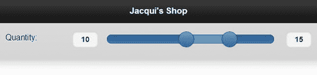

图 31-6 。使用范围滑块小部件

 **提示**范围滑块部件不会改变表单数据发送到服务器的方式。将为两个`input`元素发送单独的值。

配置 滑块和范围滑块小部件

滑块和范围滑块部件支持相同的数据属性和配置设置，如表 31-4 所述。

表 31-4 。滑块和范围滑块部件的属性和配置设置

| 数据属性 | 环境 | 描述 |
| --- | --- | --- |
| `data-highlight` | `highlight` | 当设置为`true`时，代表所选值的滑块轨道部分高亮显示。默认值为`false`。 |
| `data-mini` | `mini` | 当设置为`true`时，微件以更紧凑的形式绘制。默认为`false`。 |
| `data-track-theme` | `trackTheme` | 指定滑块轨道部分的主题。 |

 **提示**设置选项时，使用`slider`方法配置滑块控件，使用`rangeslider`方法配置范围滑块控件。

您已经在前面的小部件中看到了`data-mini`属性的效果，所以我在这里不再重复描述。我通常将`data-highlight`属性设置为`true`,因为我认为这使得滑块的目的——尤其是范围滑块——更加明显。在清单 31-6 中，您可以看到我是如何在范围滑块的`div`元素上设置属性的。

***清单 31-6*** 。在范围滑块小部件上使用数据高亮属性

```js
...
<form method="get">
    <div data-role="fieldcontain">
        <div data-role="rangeslider" data-highlight="false">
            <label for="quantityLow">Quantity: </label>
            <input id="quantityLow" type="range" value="10" min="1" max="20">
            <input id="quantityHigh" type="range" value="15" min="1" max="20">
        </div>
    </div>
</form>
...
```

在图 31-7 中，您可以看到高亮显示启用和未启用的范围滑块。

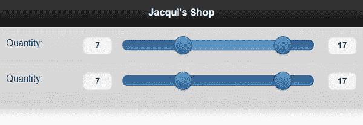

图 31-7 。数据突出显示属性的效果

您可以通过将`data-track-theme`属性与全局可用的`data-theme`属性相结合来进一步强调滑块。`data-theme`属性影响滑块手柄，而`data-track-theme`影响滑块轨迹。在清单 31-7 中，我将前一个例子中的两个属性都应用到了范围滑块上。

***清单 31-7*** 。为滑块手柄和轨道使用主题

```js
...
<form method="get">
    <div data-role="fieldcontain">
        <div data-role="rangeslider" data-highlight="true"
            data-theme="b" data-track-theme="a">
            <label for="quantityLow">Quantity: </label>
            <input id="quantityLow" type="range" value="10" min="1" max="20">
            <input id="quantityHigh" type="range" value="15" min="1" max="20">
        </div>
    </div>
</form>
...
```

你可以在图 31-8 中看到主题的效果。

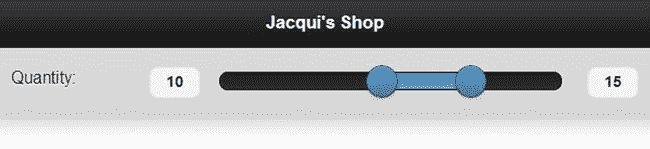

图 31-8 。将主题应用到范围滑块及其轨道

使用滑块和范围滑块方法

滑块和范围滑块部件定义了表 31-5 中所示的方法。

表 31-5 。滑块和范围滑块方法

| 滑块方法 | 范围滑块方法 | 描述 |
| --- | --- | --- |
| `slider("disable")` | `rangeslider("disable")` | 禁用小部件，防止用户更改滑块值。 |
| `slider("enable")` | `rangeslider("enable")` | 启用小部件，允许用户更改滑块值。 |
| `slider("refresh")` | `rangeslider("refresh")` | 更新小部件以反映底层 HTML 元素的变化。 |

`refresh`方法允许您更改底层`input`元素的属性值，并让这些更改反映在小部件中，如清单 31-8 所示。

***清单 31-8*** 。使用刷新方法

```js
<!DOCTYPE html>
<html>
<head>
    <title>Example</title>
    <meta name="viewport" content="width=device-width, initial-scale=1">
    <link rel="stylesheet" href="jquery.mobile-1.3.1.css" type="text/css" />
    <script type="text/javascript" src="jquery-1.10.1.js"></script>
    <script>
        $(document).bind("pageinit", function () {
            $("button").tap(function (e) {
                var currentMax = Number($("#quantityLow").attr("max"));
                $("#quantityLow, #quantityHigh").attr("max", currentMax - 1);
                $("#slider").rangeslider("refresh");
                e.preventDefault();
            });  
        });  
    </script>
    <script type="text/javascript" src="jquery.mobile-1.3.1.js"></script>
    <style type="text/css">
        div[data-role=fieldcontain] { padding: 0 10px; }
    </style>
</head>
<body>
    <div id="page1" data-role="page" data-theme="b">
        <div data-role="header">
           <h1>Jacqui's Shop</h1>
        </div>
        <form method="get">
            <div data-role="fieldcontain">
                <div id="slider" data-role="rangeslider" data-highlight="true"
                        data-theme="b" data-track-theme="a">
                    <label for="quantityLow">Quantity: </label>
                    <input id="quantityLow" type="range" value="10" min="1" max="20">
                    <input id="quantityHigh" type="range" value="15" min="1" max="20">
                </div>
                <div id="buttonContainer">
                    <button>Change Range</button>
                </div>
            </div>
        </form>
    </div>
</body>
</html>
```

在这个例子中，我使用一个按钮来减少支撑滑块的`input`元素的`max`属性的值，并调用`refresh`方法，以便更新小部件来反映变化。

使用滑块事件

滑块和范围滑块小部件定义不同的事件集。在表 31-6 中，我已经描述了滑块控件可用的事件。

表 31-6 。滑块事件

| 事件 | 描述 |
| --- | --- |
| `create` | 创建 slider 小工具时触发。 |
| `start` | 在开始与滑块进行任何交互时触发，包括轻按小部件(以设定特定值)或拖动手柄时。 |
| `stop` | 在与滑块的任何交互结束时触发。 |

在清单 31-9 的中，我使用了`start`和`stop`事件来更新`span`元素的内容。

***清单 31-9*** 。使用滑块小部件事件

```js
<!DOCTYPE html>
<html>
<head>
    <title>Example</title>
    <meta name="viewport" content="width=device-width, initial-scale=1">
    <link rel="stylesheet" href="jquery.mobile-1.3.1.css" type="text/css" />
    <script type="text/javascript" src="jquery-1.10.1.js"></script>
    <script>
        $(document).bind("pageinit", function () {
            $("#quantity").slider({
                start: function () {
                    $("#message").text("Sliding");
                },  
                stop: function () {
                    $("#message").text(quantity.value);
                }  
            });  
        });  
    </script>
    <script type="text/javascript" src="jquery.mobile-1.3.1.js"></script>
    <style type="text/css">
        div[data-role=fieldcontain] { padding: 0 10px; }
    </style>
</head>
<body>
    <div id="page1" data-role="page" data-theme="b">
        <div data-role="header">
           <h1>Jacqui's Shop</h1>
        </div>
        <form method="get">
            <div data-role="fieldcontain">
                <label for="quantity">Quantity: </label>
                <input id="quantity" type="range" value="10" min="1" max="20">
            </div>
            Value: <span id="message">Ready</span>
        </form>
    </div>
</body>
</html>
```

当我接收到`start`事件时，我改变了`span`元素的内容，以指示滑块值正在改变。当我接收到`stop`事件时，我更新了`span`元素来显示已经被选中的值——注意，我是直接从`input`元素获取值的，而不是通过 slider 小部件。

使用范围滑块事件

在表 31-7 中，我已经描述了由范围滑块小部件定义的事件。

表 31-7 。范围滑块事件

| 事件 | 描述 |
| --- | --- |
| `create` | 创建范围滑块小工具时触发。 |
| `normalize` | 当小部件必须规范化`input`元素中的值时触发，这发生在用户拖动一个句柄经过另一个句柄时。 |

在我写这篇文章时，当使用`rangeslider`方法时，范围滑块小部件的事件处理工作不一致。相反，必须使用`bind`方法创建事件处理程序，您可以在清单 31-10 中看到它的使用。

***清单 31-10*** 。使用范围滑块小部件事件

```js
<!DOCTYPE html>
<html>
<head>
    <title>Example</title>
    <meta name="viewport" content="width=device-width, initial-scale=1">
    <link rel="stylesheet" href="jquery.mobile-1.3.1.css" type="text/css" />
    <script type="text/javascript" src="jquery-1.10.1.js"></script>
    <script>
        $(document).bind("pageinit", function () {
            $("#slider").bind("rangeslidernormalize", function () {
                alert("Normalized!");
            });  
        });  
    </script>
    <script type="text/javascript" src="jquery.mobile-1.3.1.js"></script>
    <style type="text/css">
        div[data-role=fieldcontain] { padding: 0 10px; }
    </style>
</head>
<body>
    <div id="page1" data-role="page" data-theme="b">
        <div data-role="header">
           <h1>Jacqui's Shop</h1>
        </div>
        <form method="get">
            <div id="slider" data-role="rangeslider" data-highlight="true"
                    data-theme="b" data-track-theme="a">
                <label for="quantityLow">Quantity: </label>
                <input id="quantityLow" type="range" value="10" min="1" max="20">
                <input id="quantityHigh" type="range" value="15" min="1" max="20">
            </div>
        </form>
    </div>
</body>
</html>
```

我必须使用名称`rangeslidernormalize`来接收事件，这是必须使用`bind`方法的产物。在这个例子中，当我得到`normalize`事件时，我调用了`alert`函数——尤其是因为我还没有发现这个事件在真实世界中有用的情况。

使用选择菜单小部件

jQuery Mobile 为您提供了两种处理`select`元素的方法。第一种是使用 selectmenu 小部件，它为用户提供了一个带有下拉按钮的 select 元素的风格化版本。selectmenu 小部件是应用于选择元素 的默认小部件，如清单 31-11 中的所示。

***清单 31-11*** 。包含选择元素的页面

```js
<!DOCTYPE html>
<html>
<head>
    <title>Example</title>
    <meta name="viewport" content="width=device-width, initial-scale=1">
    <link rel="stylesheet" href="jquery.mobile-1.3.1.css" type="text/css" />
    <script type="text/javascript" src="jquery-1.10.1.js"></script>
    <script type="text/javascript" src="jquery.mobile-1.3.1.js"></script>
    <style type="text/css">
        #buttonContainer {text-align: center}
    </style>
</head>
<body>
    <div id="page1" data-role="page" data-theme="b">
        <div data-role="header">
           <h1>Jacqui's Shop</h1>
        </div>
        <form method="get">
            <div data-role="fieldcontain">
                <label for="name">Name: </label>
                <input id="name" placeholder="Your Name">
            </div>
            <div data-role="fieldcontain">
                <label for="speed"><span>Speed: </span></label>
                <select id="speed" name="speed">
                    <option value="vfast">Very Fast</option>
                    <option value="fast">Fast</option>
                    <option value="normal" selected>Normal</option>
                    <option value="slow">Slow</option>
                </select>
            </div>
            <div id="buttonContainer">
                <input type="submit" data-inline="true" value="Submit"/>
            </div>
        </form>
    </div>
</body>
</html>
```

你可以在图 31-9 中看到 jQuery Mobile 是如何增强`select`元素的。Opera Mobile Emulator 不能正确显示 selectmenu 小部件，所以我使用 BrowserStack 获得了截图。

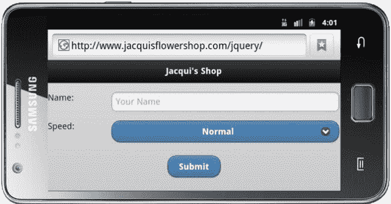

图 31-9 。jQuery Mobile 增强的 select 元素

配置 选择菜单小工具

selectmenu 小部件定义数据属性和配置设置，如表 31-8 所示。通过`selectmenu`方法应用配置选项。selectmenu 小部件的配置可以分为两个部分:配置大多数时间显示的按钮，以及配置允许用户进行选择的弹出窗口。我将在接下来的小节中描述这两个配置领域。

表 31-8 。Selectmenu 小工具的属性和配置设置

| 数据属性 | 环境 | 描述 |
| --- | --- | --- |
| `data-corners` | `corners` | 指定显示选项列表的按钮是否用圆角绘制。默认值为`true`。 |
| `data-divider-theme` | `dividerTheme` | 指定当`nativeMenu`选项为`false`时用于`optgroup`元素的主题。 |
| `data-icon` | `icon` | 指定将在小工具按钮上显示的图标。 |
| `data-iconpos` | `iconPos` | 指定图标在小工具按钮上的位置。 |
| `data-inline` | `inline` | 指定小工具将以紧凑样式绘制。 |
| `data-mini` | `mini` | 指定小工具将以较小的样式绘制。 |
| `data-native-menu` | `nativeMenu` | 指定是否将使用本机 selectmenu。默认为`true`。 |
| `data-overlay-theme` | `overlayTheme` | 指定当`nativeMenu`选项设置为`false`时用于`select`菜单弹出的主题。 |

配置选择菜单按钮

selectmenu 小部件用一个按钮替换了标准的 select 元素，该按钮与 jQuery Mobile 主题的其余部分相匹配。您可以使用`data-corners`、`data-icon`、`data-iconpos`、`data-inline`和`data-mini`属性或其对应的配置属性来配置按钮的显示方式。我已经在前面的章节中描述了所有这些配置选项，所以我不打算深入讨论它们，但是在清单 31-12 中你可以看到我是如何应用一些属性来改变按钮的显示方式的。

***清单 31-12*** 。配置选择菜单按钮

```js
...
<div data-role="fieldcontain">
    <label for="speed"><span>Speed: </span></label>
    <select id="speed" name="speed"
        data-iconpos="left" data-icon="gear" data-mini="true">
        <option value="vfast">Very Fast</option>
        <option value="fast">Fast</option>
        <option value="normal" selected>Normal</option>
        <option value="slow">Slow</option>
    </select>
</div>
...
```

我已经改变了显示的图标，把它移到了按钮的左边，属性为`data-icon`和`data-iconpos`，属性为`data-mini`指定了一个较小的按钮大小。你可以在图 31-10 中看到这些变化的效果。

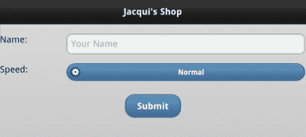

图 31-10 。配置选择菜单小部件按钮

配置弹出的选择菜单

默认情况下，当用户单击按钮进行选择时，selectmenu 小部件将显示本机浏览器菜单。这是一个明智的想法，因为它让用户能够访问浏览器提供的任何优化，以利用设备的功能。在图 31-11 中，你可以看到 iOS、Android 和 Opera 浏览器的本地菜单，当用户点击 selectmenu 小部件按钮时，这些菜单默认显示。

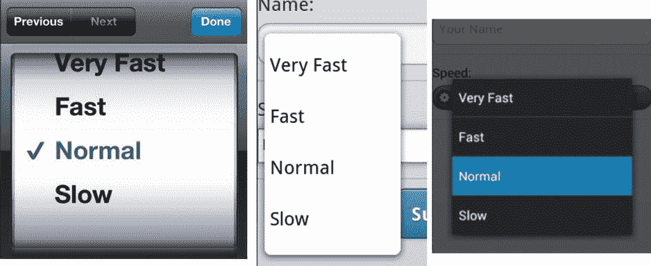

图 31-11 。本地选择菜单

通过将`data-native-menu`属性设置为`false`，可以禁用原生菜单，并让 selectmenu 小部件显示一个与 jQuery Mobile 主题的其余部分相匹配的菜单。这使得用户无法从本机增强中获益，但却具有提供一致性的优势。在的清单 31-13 中，你可以看到我是如何使用`data-native-menu`来禁用本地菜单和`data-overlay-theme`属性来设置弹出窗口的主题的。

***清单 31-13*** 。配置选择菜单弹出菜单

```js
...
<div data-role="fieldcontain">
    <label for="speed"><span>Speed: </span></label>
    <select id="speed" name="speed" data-native-menu="false" data-overlay-theme="e">
        <option value="vfast">Very Fast</option>
        <option value="fast">Fast</option>
        <option value="normal" selected>Normal</option>
        <option value="slow">Slow</option>
    </select>
</div>
...
```

你可以在图 31-12 中看到这些变化的效果。

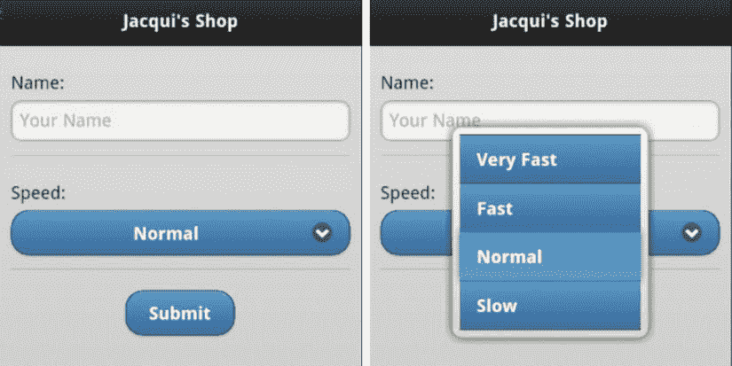

图 31-12 。禁用本地选择菜单

指定占位符

通过将`data-placeholder`属性的值设置为`true`，可以将`option`元素用作`select`元素的占位符。当`select`元素最初显示但不在用户选择的选项列表中时，会显示占位符。清单 31-14 展示了`data-placeholder`属性的使用。

***清单 31-14*** 。使用数据占位符属性

```js
...
<div data-role="fieldcontain">
    <label for="speed"><span>Speed: </span></label>
    <select id="speed" name="speed" data-native-menu="false" data-overlay-theme="e">
        <option value="placeholder" data-placeholder="true">Select a Speed</option>
        <option value="vfast">Very Fast</option>
        <option value="fast">Fast</option>
        <option value="normal">Normal</option>
        <option value="slow">Slow</option>
    </select>
</div>
...
```

你可以在图 31-13 中看到效果。我通常喜欢在`select`菜单中使用占位符，但这是一种特别有用的技术，可以在纵向布局中隐藏`label`元素时为用户提供上下文。

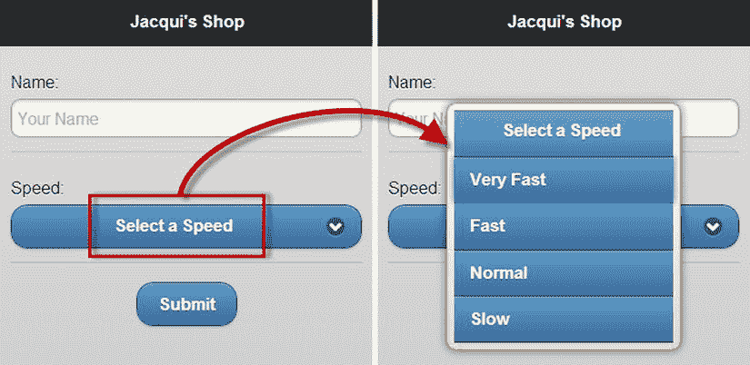

图 31-13 。指定占位符元素

使用 Selectmenu 方法

selectmenu 小部件定义了表 31-9 中所示的方法。

表 31-9 。selectmenu 小工具的方法

| 方法 | 描述 |
| --- | --- |
| `selectmenu("open")` | 打开 selectmenu 小部件以显示弹出窗口。 |
| `selectmenu("close")` | 关闭弹出窗口。 |
| `selectmenu("disable")` | 禁用小部件，以便无法选择值。 |
| `selectmenu("enable")` | 启用小部件，以便可以选择值。 |
| `selectmenu("refresh")` | 刷新小部件以合并底层`select`元素中的更改。 |

清单 31-15 显示了如何使用按钮来控制选择菜单。

***清单 31-15*** 。以编程方式控制 Selectmenu

```js
<!DOCTYPE html>
<html>
<head>
    <title>Example</title>
    <meta name="viewport" content="width=device-width, initial-scale=1">
    <link rel="stylesheet" href="jquery.mobile-1.3.1.css" type="text/css" />
    <script type="text/javascript" src="jquery-1.10.1.js"></script>
    <script type="text/javascript">
        $(document).bind("pageinit", function () {
            $("button").bind("tap", function (e) {
                e.preventDefault();
                if (this.id == "open") {
                    $("#speed").selectmenu("open");
                    setTimeout(function () {
                        $("#speed").selectmenu("close")
                    }, 3000);
                } else {
                    $("#speed").selectmenu(this.id)
                }  
            });  
        })  
    </script>
    <script type="text/javascript" src="jquery.mobile-1.3.1.js"></script>
    <style type="text/css">
        [data-role=fieldcontain], .ui-grid-b { margin: 10px; }
    </style>
</head>
<body>
    <div id="page1" data-role="page" data-theme="b">
        <div data-role="header">
           <h1>Jacqui's Shop</h1>
        </div>
        <form method="get">
            <div class="ui-grid-b">
                <div class="ui-block-a">
                    <button id="open">Open</button>
                </div>
                <div class="ui-block-b">
                    <button id="enable">Enable</button>
                </div>
                <div class="ui-block-c">
                    <button id="disable">Disable</button>
                </div>
            </div>
            <div data-role="fieldcontain">
                <label for="speed"><span>Speed: </span></label>
                <select id="speed" name="speed"
                        data-native-menu="false" data-overlay-theme="e">
                    <option value="placeholder"
                        data-placeholder="true">Select a Speed</option>
                    <option value="vfast">Very Fast</option>
                    <option value="fast">Fast</option>
                    <option value="normal">Normal</option>
                    <option value="slow">Slow</option>
                </select>
            </div>
        </form>
    </div>
</body>
</html>
```

我定义了三个按钮来调用`open`、`enable`和`disable`方法。当我调用`open`方法时，我也使用`setTimeout`函数在三秒后调用`close`方法。

使用选择菜单事件

selectmenu 小部件只定义了`create`事件，当小部件应用于底层元素时会触发该事件。

使用翻转开关

如果一个`select`元素只包含两个`option`元素，您可以选择创建一个*翻转开关*来代替常规的 selectmenu 小部件。您可以通过将`data-role`属性应用到值为`slider`的`select`元素来创建一个翻转开关，如清单 31-16 所示。

***清单 31-16*** 。创建翻转开关

```js
<!DOCTYPE html>
<html>
<head>
    <title>Example</title>
    <meta name="viewport" content="width=device-width, initial-scale=1">
    <link rel="stylesheet" href="jquery.mobile-1.3.1.css" type="text/css" />
    <script type="text/javascript" src="jquery-1.10.1.js"></script>
    <script type="text/javascript" src="jquery.mobile-1.3.1.js"></script>
    <style type="text/css">
        #buttonContainer {text-align: center}
        [data-role=fieldcontain] { margin: 10px; text-align: center }
    </style>
</head>
<body>
    <div id="page1" data-role="page" data-theme="b">
        <div data-role="header">
           <h1>Jacqui's Shop</h1>
        </div>
        <form method="get">
            <div data-role="fieldcontain">
                <label for="speed"><span>Speed: </span></label>
                <select id="speed" name="speed" data-role="slider">
                    <option value="fast">Fast</option>
                    <option value="slow">Slow</option>
                </select>
            </div> **<div data-role="fieldcontain">**
                **<label for="size"><span>Size: </span></label>**
                **<select id="size" name="size" data-role="slider">**
                    **<option value="large">Large</option>**
                    **<option value="small" selected>Small</option>**
                **</select>**
            **</div>**
            `<div id="buttonContainer">`
                `<input type="submit" data-inline="true" value="Submit"/>`
            `</div>`
        `</form>`
    `</div>`
`</body>`
`</html>`
```

 `本例中有两个翻转开关。你可以在图 31-14 中看到它们是如何在浏览器中显示的。用户可以通过点击或点击暴露的值，或者通过将滑块拖动到位来更改设置。

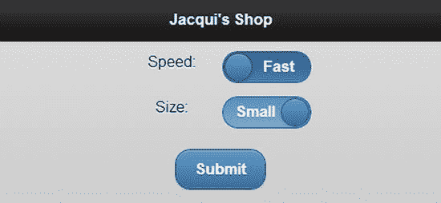

图 31-14 。使用翻转开关

使用复选框单选小部件

checkboxradio 小部件自动应用于`type`属性被设置为`checkbox`或`radio`的`input`元素。

创建复选框

创建复选框最简单的方法是定义一个类型为`checkbox`的`input`元素，后跟一个`label`元素，如清单 31-17 所示。

***清单 31-17*** 。创建简单的复选框

```js
<!DOCTYPE html>
<html>
<head>
    <title>Example</title>
    <meta name="viewport" content="width=device-width, initial-scale=1">
    <link rel="stylesheet" href="jquery.mobile-1.3.1.css" type="text/css" />
    <script type="text/javascript" src="jquery-1.10.1.js"></script>
    <script type="text/javascript" src="jquery.mobile-1.3.1.js"></script>
    <style type="text/css">
        #buttonContainer {text-align: center}
        form { margin: 10px; }
    </style>
</head>
<body>
    <div id="page1" data-role="page" data-theme="b">
        <div data-role="header">
           <h1>Jacqui's Shop</h1>
        </div>
        <form method="get">
            <div data-role="fieldcontain">
                <label for="name">Name: </label>
                <input id="name" placeholder="Your Name">
            </div>

            <input type="checkbox" name="check" id="check"/>
            <label for="check">I agree</label>

            <div id="buttonContainer">
                <input type="submit" data-inline="true" value="Submit"/>
            </div>
        </form>
    </div>
</body>
</html>
```

你可以在图 31-15 的中看到这个复选框。我在图中显示了复选框的选中和未选中状态。

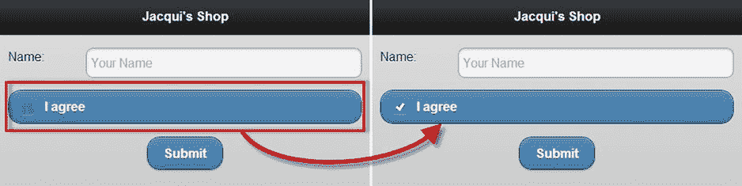

图 31-15 。jQuery Mobile 复选框

将标签应用到复选框中

默认情况下，复选框跨越其父元素的整个宽度，这意味着在这种情况下，复选框是屏幕的整个宽度。如果你想让复选框适合布局，使它匹配它上面的 textinput 小部件，你需要使用一个特殊的元素结构，如清单 31-18 所示。

***清单 31-18*** 。更改复选框的布局

```js
<!DOCTYPE html>
<html>
<head>
    <title>Example</title>
    <meta name="viewport" content="width=device-width, initial-scale=1">
    <link rel="stylesheet" href="jquery.mobile-1.3.1.css" type="text/css" />
    <script type="text/javascript" src="jquery-1.10.1.js"></script>
    <script type="text/javascript" src="jquery.mobile-1.3.1.js"></script>
    <style type="text/css">
        #buttonContainer {text-align: center}
        form { margin: 10px; }
    </style>
</head>
<body>
    <div id="page1" data-role="page" data-theme="b">
        <div data-role="header">
           <h1>Jacqui's Shop</h1>
        </div>
        <form method="get">
            <div data-role="fieldcontain">
                <label for="name">Name: </label>
                <input id="name" placeholder="Your Name">
            </div>

            <div data-role="fieldcontain">
                <fieldset data-role="controlgroup">
                    <legend>Terms&Conditions:</legend>
                    <input type="checkbox" name="check" id="check"/>
                    <label for="check">I agree</label>
                </fieldset>
            </div>

            <div id="buttonContainer">
                <input type="submit" data-inline="true" value="Submit"/>
            </div>
        </form>
    </div>
</body>
</html>
```

现在应该对外层元素很熟悉了——一个属性设置为`fieldcontain`的`div`元素。jQuery Mobile 面临的问题是，已经有一个`label`元素与`input`元素相关联，因此您必须采用一个替代路径来为 jQuery Mobile 提供它需要的信息。您可以通过添加一个`fieldset`元素(其`data-role`被设置为`controlgroup`)并在`input`之前添加一个`legend`元素(包含您想要显示的文本)来实现这一点。你可以在图 31-16 中看到效果。

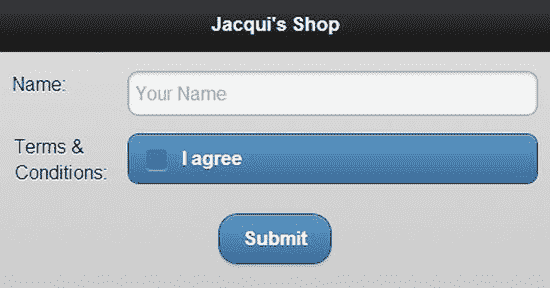

图 31-16 。更改复选框的布局

分组 复选框

您可以使用一个带有`controlgroup`的`data-role`的`fieldset`元素将多个复选框组合在一起。清单 31-19 包含了一个演示。

***清单 31-19*** 。将复选框分组在一起

```js
<!DOCTYPE html>
<html>
<head>
    <title>Example</title>
    <meta name="viewport" content="width=device-width, initial-scale=1">
    <link rel="stylesheet" href="jquery.mobile-1.3.1.css" type="text/css" />
    <script type="text/javascript" src="jquery-1.10.1.js"></script>
    <script type="text/javascript" src="jquery.mobile-1.3.1.js"></script>
    <style type="text/css">
        #buttonContainer {text-align: center}
        form { margin: 10px; }
    </style>
</head>
<body>
    <div id="page1" data-role="page" data-theme="b">
        <div data-role="header">
           <h1>Jacqui's Shop</h1>
        </div>
        <form method="get">
            <div data-role="fieldcontain">
                <label for="name">Name: </label>
                <input id="name" placeholder="Your Name">
            </div>

            <div data-role="fieldcontain">
                <fieldset data-role="controlgroup">
                    <legend>Choose Your Flowers:</legend>
                    <input type="checkbox" name="roses" id="roses"/>
                    <label for="roses">Roses</label>
                    <input type="checkbox" name="orchids" id="orchids"/>
                    <label for="orchids">Orchids</label>
                    <input type="checkbox" name="asters" id="asters"/>
                    <label for="asters">Asters</label>
                </fieldset>
            </div>

            <div data-role="fieldcontain">
                <fieldset data-role="controlgroup" data-type="horizontal">
                    <legend>Font:</legend>
                    <input type="checkbox" name="bold" id="bold"/>
                    <label for="bold"><b>b</b></label>
                    <input type="checkbox" name="italic" id="italic"/>
                    <label for="italic"><em>i</em></label>
                    <input type="checkbox" name="underline" id="underline"/>
                    <label for="underline"><u>u</u></label>
                </fieldset>
            </div>

            <div id="buttonContainer">
                <input type="submit" data-inline="true" value="Submit"/>
            </div>
        </form>
    </div>
</body>
</html>
```

本例中有两组复选框。第一组是垂直布局，这是默认方向。jQuery Mobile 改变了小部件的样式，使得各个`input`元素之间没有空格，只有块的外部拐角是圆形的。对于第二组，我将`data-type`属性设置为`horizontal`，这将改变布局的方向并使 jQuery Mobile 隐藏复选框，从而创建一组可以开关的按钮。你可以在图 31-17 中看到结果。

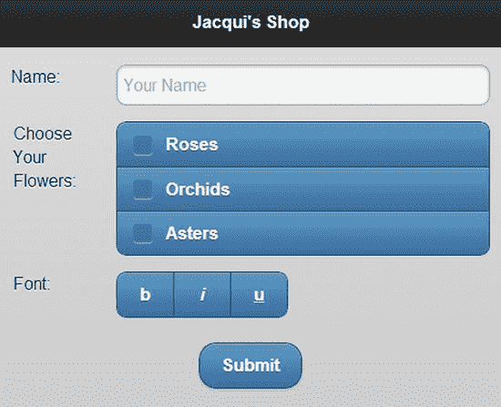

图 31-17 。分组复选框

创建和格式化单选按钮

创建单选按钮并对其进行格式化的方式与格式化复选框的方式非常相似。清单 31-20 包含了一个例子。

***清单 31-20*** 。创建一组单选按钮

```js
<!DOCTYPE html>
<html>
<head>
    <title>Example</title>
    <meta name="viewport" content="width=device-width, initial-scale=1">
    <link rel="stylesheet" href="jquery.mobile-1.3.1.css" type="text/css" />
    <script type="text/javascript" src="jquery-1.10.1.js"></script>
    <script type="text/javascript" src="jquery.mobile-1.3.1.js"></script>
    <style type="text/css">
        #buttonContainer {text-align: center}
        form { margin: 10px; }
    </style>
</head>
<body>
    <div id="page1" data-role="page" data-theme="b">
        <div data-role="header">
           <h1>Jacqui's Shop</h1>
        </div>
        <form method="get">
            <div data-role="fieldcontain">
                <label for="name">Name: </label>
                <input id="name" placeholder="Your Name">
            </div>

            <div data-role="fieldcontain">
                <fieldset data-role="controlgroup">
                    <legend>Choose Your Flowers:</legend>
                    <input type="radio" name="flowers" id="roses"/>
                    <label for="roses">Roses</label>
                    <input type="radio" name="flowers" id="orchids"/>
                    <label for="orchids">Orchids</label>
                    <input type="radio" name="flowers" id="asters"/>
                    <label for="asters">Asters</label>
                </fieldset>
            </div>

            <div data-role="fieldcontain">
                <fieldset data-role="controlgroup" data-type="horizontal">
                    <legend>Choose Your Flowers:</legend>
                    <input type="radio" name="flowers" id="roses"/>
                    <label for="roses">Roses</label>
                    <input type="radio" name="flowers" id="orchids"/>
                    <label for="orchids">Orchids</label>
                    <input type="radio" name="flowers" id="asters"/>
                    <label for="asters">Asters</label>
                </fieldset>
            </div>

            <div id="buttonContainer">
                <input type="submit" data-inline="true" value="Submit"/>
            </div>
        </form>
    </div>
</body>
</html>
```

我再次创建了水平和垂直组，你可以在图 31-18 中看到它们是如何在浏览器中显示的。

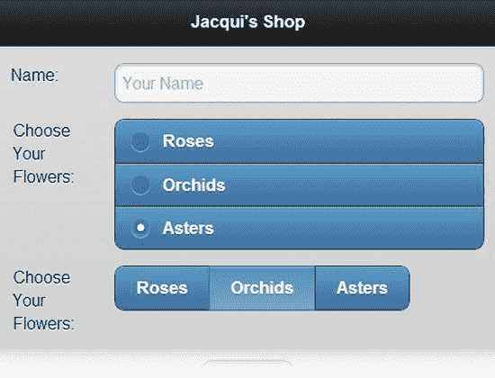

图 31-18 。创建单选按钮组

配置 复选框单选小部件

checkboxradio 小部件只支持一个配置选项，我已经在表 31-10 中描述过了。

表 31-10 。checkboxradio 小部件的属性和配置设置

| 数据属性 | 环境 | 描述 |
| --- | --- | --- |
| `data-mini` | `mini` | 当设置为`true`时，微件以紧凑形式创建。 |

使用复选框单选方法

checkboxradio 小部件定义了表 31-11 中所示的方法。

表 31-11 。checkboxradio 小部件的方法

| 方法 | 描述 |
| --- | --- |
| `checkboxradio("disable")` | 禁用小部件，以便无法选择值。 |
| `checkboxradio("enable")` | 启用小部件，以便可以选择值。 |
| `checkboxradio("refresh")` | 刷新小部件以合并基础元素中的更改。 |

使用复选框单选事件

checkboxradio 小部件只定义了`create`事件，该事件在小部件应用于底层元素时被触发。

摘要

在这一章中，我展示了 jQuery Mobile 如何增强表单元素,使它们与更广泛的触控样式保持一致。您不需要采取任何特殊的操作来提交表单，这是使用 Ajax 自动完成的，因此 jQuery Mobile 可以平稳地管理到服务器返回的页面的转换。您可以依靠 jQuery Mobile 来自动增强表单元素，但是有一些很好的理由来应用一些额外的元素和`data-role`属性，尤其是在处理`select`元素的时候。在第三十二章中，我继续描述 jQuery Mobile 小部件，转向 listview 和 panel 小部件。`