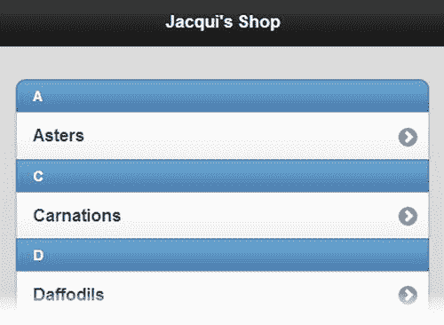

# 三十二、使用列表和面板

在这一章中，我描述了 jQuery Mobile 列表和面板小部件。列表是构建移动 web 应用的一个重要工具，它们通常为 web 应用的不同功能区域提供简单而明显的导航。列表的美妙之处在于它们很紧凑，即使单个列表项大到可以通过触摸来选择。它们也非常容易被用户理解。只需在列表项的右边缘放置一个箭头图标(jQuery Mobile 默认这样做),就可以让大多数用户明白选择该项将导致某种选择或导航的发生。

面板是一个通用的小部件，它将内容带入窗口左侧或右侧的上下文中。面板可用于显示任何内容，但最常用于整个应用中持久的设置或导航功能。表 32-1 对本章进行了总结。

[表 32-1](#_Tab1) 。章节总结

| 问题 | 解决办法 | 列表 |
| --- | --- | --- |
| 创建一个列表。 | 定义一个包含一个或多个`li`元素并且将`data-role`属性设置为`listview`的`ul`或`ol`元素。`li`元素的内容应该是链接。 | one |
| 创建插入列表。 | 将`data-inset`属性设置为`true`。 | Two |
| 创建一个列表，其项目由两个不同的部分组成。 | 向每个`li`元素添加第二个链接。 | three |
| 允许用户过滤列表内容。 | 将`data-filter`属性设置为`true`。 | 4, 5 |
| 在列表中添加分隔线。 | 在单个`li`元素上将`data-role`属性设置为`list-divider`。 | six |
| 向列表项添加计数气泡。 | 使用`ui-li-count`类。 | seven |
| 使用不同的文本强调。 | 使用`h1` - `h6`和`p`元素。 | eight |
| 向列表项添加旁白。 | 使用`ui-li-aside`类。 | nine |
| 创建一个面板。 | 将面板相关页面中包含的`div`元素的`data-role`属性设置为`panel`。 | Ten |
| 设置面板的位置和显示样式。 | 使用`data-display`和`data-position`属性。 | Eleven |
| 指定如何解散面板。 | 使用`data-swipe-close`和`data-dismissable`属性。 | Twelve |

使用 ListView 部件

jQuery Mobile 通过 listview 小部件为处理列表提供了灵活的支持。清单 32-1 显示了一个链接到同一文档中的 jQuery Mobile 页面的基本列表。每个页面描述一种不同的花，列表为用户提供了导航到这些页面的机制。

***[清单 32-1](#_list1)*** 。基本列表

```js
<!DOCTYPE html>
<html>
<head>
    <title>Example</title>
    <meta name="viewport" content="width=device-width, initial-scale=1">
    <link rel="stylesheet" href="jquery.mobile-1.3.1.css" type="text/css" />
    <script type="text/javascript" src="jquery-1.10.1.js"></script>
    <script type="text/javascript" src="jquery.mobile-1.3.1.js"></script>
    <style type="text/css">
        .lcontainer {float: left; text-align: center; padding-top: 10px}
        .productData {float: right; padding: 10px; width: 60%}
    </style>
</head>
<body>
    <div id="page1" data-role="page" data-theme="b">
        <div data-role="header">
           <h1>Jacqui's Shop</h1>
        </div>

        <ul data-role="listview">
            <li><a href="#roses">Roses</a></li>
            <li><a href="#orchids">Orchids</a></li>
            <li><a href="#asters">Asters</a></li>
        </ul>
    </div>

  <div id="roses" data-role="page" data-theme="b">
        <div data-role="header">
           <h1>Roses</h1>
        </div>
        <div>
            <div class="lcontainer">
                
                <div><a href="#" data-rel="back" data-role="button"
                       data-inline=true data-direction="reverse">Back</a>
                </div>
            </div>
            <div class="productData">
                A rose is a woody perennial within the family Rosaceae.
                They form a group of erect shrubs, and climbing or trailing plants.
                <div><b>Price: $4.99</b></div>
            </div>
        </div>
    </div>

   <div id="orchids" data-role="page" data-theme="b">
        <div data-role="header">
           <h1>Orchids</h1>
        </div>
        <div>
            <div class="lcontainer">
                
                <div><a href="#" data-rel="back" data-role="button"
                       data-inline=true data-direction="reverse">Back</a>
                </div>
            </div>
            <div class="productData">
                The orchid family is a diverse and widespread family in the order
                Asparagales. It is one of the largest families of flowering plants.
                <div><b>Price: $10.99</b></div>
            </div>
        </div>
    </div>

   <div id="asters" data-role="page" data-theme="b">
        <div data-role="header">
           <h1>Asters</h1>
        </div>
        <div>
            <div class="lcontainer">
                
                <div><a href="#" data-rel="back" data-role="button"
                       data-inline=true data-direction="reverse">Back</a>
                </div>
            </div>
            <div class="productData">
                The name Aster comes from the Ancient Greek word meaning "star",
                referring to the shape of the flower head.
                <div><b>Price: $2.99</b></div>
            </div>
        </div>
    </div>
</body>
</html>
```

本文档的大部分内容都用于描述花卉。实际的列表只有几个元素，如下所示:

```js
...
<ul data-role="listview">
    <li><a href="#roses">Roses</a></li>
    <li><a href="#orchids">Orchids</a></li>
    <li><a href="#asters">Asters</a></li>
</ul>
...
```

 **提示**我在这个例子中使用了`ul`元素，但是 jQuery Mobile 以同样的方式处理编号列表(用`ol`元素创建)。

这是一个标准的 HTML 无编号列表，使用`ul`元素表示，其中包含三个`li`元素。为了应用 listview 小部件，我将`ul`元素上的`data-role`属性设置为`listview`。

列表小部件的基本用途是提供导航，为此，每个`li`元素的内容是一个`a`元素，它链接到文档中的其他页面。单击或轻触单个列表项会将用户带到相应的页面。您可以在[图 32-1](#Fig1) 中看到 listview 小部件和其中一个内容页面。我在每个内容页面上添加了一个基于链接的按钮，使用标准转换(但方向相反)将用户带回列表。


[图 32-1](#_Fig1) 。一个简单的 jQuery Mobile listview 窗口小部件

配置列表视图小部件

listview 小部件支持许多数据属性和配置设置，可用于更改列表的外观和行为。这些在[表 32-2](#Tab2) 中描述，并在以下章节中演示。

[表 32-2](#_Tab2) 。Listview 小部件的属性和配置设置

| 数据属性 | 环境 | 描述 |
| --- | --- | --- |
| `data-count-theme` | `countTheme` | 指定计数气泡的主题。 |
| `data-divider-theme` | `dividerTheme` | 指定分隔线的主题。 |
| `data-filter` | `filter` | 当设置为`true`时，listview 显示一个过滤器。 |
| 不适用的 | `filterCallback` | 指定由筛选器调用的函数。 |
| `data-filter-placeholder` | `filterPlaceholder` | 指定用于过滤的占位符。 |
| `data-filter-theme` | `filterTheme` | 指定筛选器搜索栏的主题。 |
| `data-header-theme` | `headerTheme` | 指定嵌套标题的主题。 |
| `data-icon` | `icon` | 指定标题上使用的图标。 |
| `data-inset` | `inset` | 当设置为`true`时，listview 以适合嵌套列表的样式绘制。 |
| `data-split-icon` | `splitIcon` | 指定拆分列表的图标。 |
| `data-split-theme` | `splitTheme` | 指定拆分列表的主题。 |

创建插入列表

列表的默认布局是填充容器元素的宽度并具有方形的角，这与其他 jQuery Mobile 小部件的风格不匹配。为了使样式一致，您可以创建一个嵌入列表，该列表具有圆角，可用于不接触屏幕边缘的元素。您可以通过将值为`true`的`data-inset`属性应用到`ul`或`ol`元素来创建一个插入列表，如[清单 32-2](#list2) 所示。

***[清单 32-2](#_list2)*** 。创建插入列表

```js
...
<div id="page1" data-role="page" data-theme="b">
    <div data-role="header">
       <h1>Jacqui's Shop</h1>
    </div>

    <div id="container" style="padding: 20px">
        <ul data-role="listview"data-inset=true>
            <li><a href="#roses">Roses</a></li>
            <li><a href="#orchids">Orchids</a></li>
            <li><a href="#asters">Asters</a></li>
        </ul>
    </div>
</div>
...
```

在这个例子中，我将`ul`元素放在了`div`元素中。我使用 CSS `padding`设置从父元素的边缘插入列表，并使用`data-inset`属性改变列表的样式。你可以在[图 32-2](#Fig2) 中看到结果。


[图 32-2](#_Fig2) 。创建插入列表

创建拆分列表

当列表中的每个项目可以执行两个操作时，拆分列表非常有用。列表项被分成两个部分，点击或轻敲列表项的每个部分会导致不同的操作。清单 32-3 显示了一个分割列表，允许用户获得关于一朵花的信息，或者简单地将它添加到他们的购物篮中。

***[清单 32-3](#_list3)*** 。使用拆分列表

```js
<!DOCTYPE html>
<html>
<head>
    <title>Example</title>
    <meta name="viewport" content="width=device-width, initial-scale=1">
    <link rel="stylesheet" href="jquery.mobile-1.3.1.css" type="text/css" />
    <script type="text/javascript" src="jquery-1.10.1.js"></script>
    <script type="text/javascript" src="jquery.mobile-1.3.1.js"></script>
    <style type="text/css">
        .lcontainer {float: left; text-align: center; padding-top: 10px}
        .productData {float: right; padding: 10px; width: 60%}
        .cWrapper {text-align: center; margin: 20px}
    </style>
</head>
<body>
    <div id="page1" data-role="page" data-theme="b">
        <div data-role="header">
           <h1>Jacqui's Shop</h1>
        </div>

        <div id="container" style="padding: 20px">
            <ul data-role="listview" data-inset=true>
                <li><a href="#basket" class="buy" id="rose">Roses</a>
                    <a href="#roses">Roses</a></li>
                <li><a href="#basket" class="buy" id="orchid">Orchids</a>
                    <a href="#orchids">Orchids</a>  </li>
                <li><a href="#basket" class="buy" id="aster">Asters</a>
                    <a href="#asters">Asters</a>  </li>
            </ul>
        </div>
    </div>

    <div id="basket" data-role="page" data-theme="b">
        <div data-role="header">
           <h1>Jacqui's Shop</h1>
        </div>
        <div class="cWrapper">
            Basket will go here
        </div>
        <div class="cWrapper">
            <a href="#" data-rel="back" data-role="button" data-inline=true
               data-direction="reverse">Back</a>
        </div>
    </div>

    <div id="roses" data-role="page" data-theme="b">
        <div data-role="header">
           <h1>Roses</h1>
        </div>
        <div>
            <div class="lcontainer">
                
                <div><a href="#" data-rel="back" data-role="button"
                       data-inline=true data-direction="reverse">Back</a>
                </div>
            </div>
            <div class="productData">
                A rose is a woody perennial within the family Rosaceae.
                They form a group of erect shrubs, and climbing or trailing plants.
                <div><b>Price: $4.99</b></div>
            </div>
        </div>
    </div>

   <div id="orchids" data-role="page" data-theme="b">
        <div data-role="header">
           <h1>Orchids</h1>
        </div>
        <div>
            <div class="lcontainer">
                
                <div><a href="#" data-rel="back" data-role="button"
                       data-inline=true data-direction="reverse">Back</a>
                </div>
            </div>
            <div class="productData">
                The orchid family is a diverse and widespread family in the order
                Asparagales. It is one of the largest families of flowering plants.
                <div><b>Price: $10.99</b></div>
            </div>
        </div>
    </div>

   <div id="asters" data-role="page" data-theme="b">
        <div data-role="header">
           <h1>Asters</h1>
        </div>
        <div>
            <div class="lcontainer">
                
                <div><a href="#" data-rel="back" data-role="button"
                       data-inline=true data-direction="reverse">Back</a>
                </div>
            </div>
            <div class="productData">
                The name Aster comes from the Ancient Greek word meaning "star",
                referring to the shape of the flower head.
                <div><b>Price: $2.99</b></div>
            </div>
        </div>
    </div>
</body>
</html>
```

要创建一个分割列表，向`li`元素添加第二个`a`元素。jQuery Mobile 将每个列表项一分为二，并在各部分之间插入一个垂直分隔线。单击或轻击项目的左边部分导航到第一个`a`元素的目标，单击或轻击右边部分导航到第二个`a`元素。你可以在[图 32-3](#Fig3) 中看到列表项是如何呈现的。


[图 32-3](#_Fig3) 。创建拆分列表

在这个例子中，我将列表项的所有左边部分设置为指向我添加到名为`basket`的文档中的新页面。我将在第 33 章的[中回到这个例子，并扩展它来放置一个简单的购物篮](33.html)。对于这个例子，`basket`页面只是一个占位符。

 **提示** jQuery Mobile 默认使用箭头图标作为拆分按钮。您可以通过将`data-split-icon`属性应用到`ul`或`ol`元素来改变这一点，指定您想要的图标的名称。第 30 章包含了可用图标的列表。

过滤列表

listview 小部件提供了一种过滤列表内容的机制，这是通过将值为`true`的`data-filter`属性应用到`ul`或`ol`元素来实现的，如[清单 32-4](#list4) 所示。

***[清单 32-4](#_list4)*** 。使用列表过滤

```js
<!DOCTYPE html>
<html>
<head>
    <title>Example</title>
    <meta name="viewport" content="width=device-width, initial-scale=1">
    <link rel="stylesheet" href="jquery.mobile-1.3.1.css" type="text/css" />
    <script type="text/javascript" src="jquery-1.10.1.js"></script>
    <script type="text/javascript" src="jquery.mobile-1.3.1.js"></script>
    <style type="text/css">
        .lcontainer {float: left; text-align: center; padding-top: 10px}
        .productData {float: right; padding: 10px; width: 60%}
    </style>
</head>
<body>
    <div id="page1" data-role="page" data-theme="b">
        <div data-role="header">
           <h1>Jacqui's Shop</h1>
        </div>

        <div data-role="content">
            <ul data-role="listview" data-inset=truedata-filter=true>
                <li><a href="#roses">Roses</a></li>
                <li><a href="#orchids">Orchids</a></li>
                <li><a href="#asters">Asters</a></li>
            </ul>
        </div>
    </div>

  <div id="roses" data-role="page" data-theme="b">
        <div data-role="header">
           <h1>Roses</h1>
        </div>
        <div>
            <div class="lcontainer">
                
                <div><a href="#" data-rel="back" data-role="button"
                       data-inline=true data-direction="reverse">Back</a>
                </div>
            </div>
            <div class="productData">
                A rose is a woody perennial within the family Rosaceae.
                They form a group of erect shrubs, and climbing or trailing plants.
                <div><b>Price: $4.99</b></div>
            </div>
        </div>
    </div>

   <div id="orchids" data-role="page" data-theme="b">
        <div data-role="header">
           <h1>Orchids</h1>
        </div>
        <div>
            <div class="lcontainer">
                
                <div><a href="#" data-rel="back" data-role="button"
                       data-inline=true data-direction="reverse">Back</a>
                </div>
            </div>
            <div class="productData">
                The orchid family is a diverse and widespread family in the order
                Asparagales. It is one of the largest families of flowering plants.
                <div><b>Price: $10.99</b></div>
            </div>
        </div>
    </div>

   <div id="asters" data-role="page" data-theme="b">
        <div data-role="header">
           <h1>Asters</h1>
        </div>
        <div>
            <div class="lcontainer">
                
                <div><a href="#" data-rel="back" data-role="button"
                       data-inline=true data-direction="reverse">Back</a>
                </div>
            </div>
            <div class="productData">
                The name Aster comes from the Ancient Greek word meaning "star",
                referring to the shape of the flower head.
                <div><b>Price: $2.99</b></div>
            </div>
        </div>
    </div>
</body>
</html>
```

在[图 32-4](#Fig4) 中可以看到，jQuery Mobile 在列表上方添加了一个搜索栏。当用户在搜索栏中输入字符时，jQuery Mobile 会从列表中删除不包含该字符序列的所有项目。(默认情况下，只有在筛选器中输入了至少两个字符后，才会执行筛选。)


[图 32-4](#_Fig4) 。启用列表过滤

 **注意**过滤列表的能力是一个很棒的功能，但在小触摸屏上并不总是有用。为了支持字符输入，当用户激活诸如搜索栏的文本输入元素时，大多数移动设备显示弹出触摸键盘。在小型设备上，键盘会占据屏幕很大一部分，以至于用户不容易看到过滤器的结果。这并不意味着您不应该支持列表过滤，但是如果您针对的是小屏幕设备，提供其他导航机制是很重要的。

使用自定义过滤功能

默认筛选器匹配任何包含用户输入的字符集的列表项。这些匹配列表项文本中的任何位置，并且不区分大小写。您可以通过使用 jQuery UI 风格的方法提供一个定制的过滤函数，如清单 32-5 所示。

***[清单 32-5](#_list5)*** 。使用自定义列表过滤功能

```js
...
<head>
    <title>Example</title>
    <meta name="viewport" content="width=device-width, initial-scale=1">
    <link rel="stylesheet" href="jquery.mobile-1.3.1.css" type="text/css" />
    <script type="text/javascript" src="jquery-1.10.1.js"></script>
    <script type="text/javascript">
        $(document).bind("pageinit", function () {
            $("ul").listview("option", "filterCallback", function (listItem, filter) {
                var pattern = new RegExp("^" + filter, "i");
                return !pattern.test(listItem)
            })
        })
    </script>
    <script type="text/javascript" src="jquery.mobile-1.3.1.js"></script>
    <style type="text/css">
        .lcontainer {float: left; text-align: center; padding-top: 10px}
        .productData {float: right; padding: 10px; width: 60%}
    </style>
</head>
...
```

您可以通过调用`option`方法来设置自定义函数，并将该函数用作`filterCallback`设置的值。该函数的参数是列表项中的文本和用户输入的筛选器。列表中的每一项都会调用一次该函数，如果返回`true`，调用该函数的项将被隐藏。在本例中，我使用正则表达式将匹配限制在以过滤器文本开头的列表项。你可以在图 32-5 的[中看到结果，在过滤框中键入字母`R`只匹配`Roses`项。](#Fig5)


[图 32-5](#_Fig5) 。使用自定义过滤器

添加分隔符

listview 小部件可以在列表项之间添加分隔线。这些分隔符由元素指定，这些元素的`data-role`属性被设置为`list-divider,`，它们可以通过应用于定义列表的`ul`或`ol`元素的`data-divider-theme`属性来设置样式。

列表分隔线有助于为长列表或复杂列表提供结构，而不会改变用户在列表中导航的方式。在清单 32-6 中，你可以看到我是如何添加一些分隔线元素并将`data-divider-theme`属性应用到例子中的。

***[清单 32-6](#_list6)*** 。使用列表分隔符

```js
...
<div id="page1" data-role="page" data-theme="b">
    <div data-role="header">
       <h1>Jacqui's Shop</h1>
    </div>

    <div data-role="content">
        <ul data-role="listview" data-inset=truedata-theme="c"
            data-divider-theme="b">

            <li data-role="list-divider">A</li>
            <li><a href="#asters">Asters</a></li>
            <li data-role="list-divider">C</li>
            <li><a href="document2.html">Carnations</a></li>
            <li data-role="list-divider">D</li>
            <li><a href="document2.html">Daffodils</a></li>
            <li data-role="list-divider">L</li>
            <li><a href="document2.html">Lilies</a></li>
            <li data-role="list-divider">O</li>
            <li><a href="#orchids">Orchids</a></li>
            <li data-role="list-divider">P</li>
            <li><a href="document2.html">Peonies</a></li>
            <li><a href="document2.html">Primulas</a></li>
            <li data-role="list-divider">R</li>
            <li><a href="#roses">Roses</a></li>
            <li data-role="list-divider">S</li>
            <li><a href="document2.html">Snowdrops</a></li>
        </ul>
    </div>
</div>
...
```

你可以在[图 32-6](#Fig6) 中看到分隔器产生的效果。



[图 32-6](#_Fig6) 。向列表中添加分隔符

 **提示**如果你想让一个元素有不同的外观，你可以将`data-theme`属性直接应用于单个列表项。

使用基于约定的配置

一些配置选项是通过约定而不是配置来处理的。当你看分割列表时，你已经看到了这样的例子。如果将第二个`a`元素添加到一个`li`元素的内容中，jQuery Mobile 会自动创建一个拆分列表项。您不必应用数据属性来创建这种效果——它就这样发生了。在这一节中，我将向您展示三种可以用来格式化列表项的不同约定:计数气泡、文本强调和旁白。

添加计数气泡

您可以向列表项添加一个小的数字指示器。这些被称为*计数气泡*，当列表项代表某种类别，并且您想要提供关于有多少可用的信息时，它们会很有用。例如，如果您的列表项代表电子邮件文件夹，您可以使用计数气泡来指示每个文件夹中有多少封邮件。您还可以使用计数气泡来显示电子商务应用中的库存商品数量。

虽然这种效果通常用于表示数值，但是您可以显示任何您喜欢的信息。价值的意义需要是不言自明的，因为你没有空间向用户提供解释——只有价值。

通过向一个`li`元素的内容添加一个额外的子元素来创建一个计数气泡。这个子元素必须包含值并被分配给`ui-li-count`类。你可以看到在[清单 32-7](#list7) 中定义的计数气泡的例子，包括一个使用非数值的例子。

***[清单 32-7](#_list7)*** 。将计数气泡添加到列表项目

```js
...
<div id="page1" data-role="page" data-theme="b">
    <div data-role="header">
       <h1>Jacqui's Shop</h1>
    </div>

    <div data-role="content">
      <ul data-role="listview" data-inset=true data-filter=true>
          <li><a href="#roses">Roses<div class="ui-li-count">23</div></a></li>
          <li><div class="ui-li-count">7</div><a href="#orchids">Orchids</a></li>
          <li><a href="#asters">Asters</a><div class="ui-li-count">Pink</div></li>
      </ul>
    </div>
</div>
...
```

注意，您可以将子元素放在`li`元素中的任何位置。它不一定是最后一个元素(尽管这是一个常见的约定)。你可以在[图 32-7](#Fig7) 中看到计数气泡是如何显示的。


[图 32-7](#_Fig7) 。使用反气泡

添加文本强调

当您使用包装在标题元素(`h1`到`h6`元素)而不是`p`元素(表示段落)中的内容时，listview 小部件将应用不同的强调级别。这允许你创建一个包含标题和一些支持细节文本的列表项，如[清单 32-8](#list8) 所示。

***[清单 32-8](#_list8)*** 。添加文本强调

```js
...
<div id="page1" data-role="page" data-theme="b">
    <div data-role="header">
       <h1>Jacqui's Shop</h1>
    </div>

    <div data-role="content">
      <ul data-role="listview" data-inset=true data-filter=true>
          <li>
            <a href="#roses"><h1>Roses</h1>
                <p>A rose is a woody perennial within the family Rosaceae.</p>
                <div class="ui-li-count">$4.99</div></a>
          </li>
          <li><div class="ui-li-count">7</div><a href="#orchids">Orchids</a></li>
          <li><a href="#asters">Asters</a><div class="ui-li-count">Pink</div></li>
      </ul>
    </div>
</div>
...
```

在这个例子中，我使用了`h1`元素来表示产品的名称，使用了`p`元素来表示详细信息。我包括了一个计数气泡，表明项目的价格。(价格非常适合用来计算泡沫，因为货币符号为数值提供了直接的含义。)你可以在[图 32-8](#Fig8) 中看到效果。


[图 32-8](#_Fig8) 。在列表项中使用文本强调

添加旁白

撇开*不谈*是使用计数气泡的替代方法。要创建旁白，您需要向包含您想要显示的信息的`li`元素添加一个子元素，并将其分配给`ui-li-aside`类。你可以在[清单 32-9](#list9) 中看到旁白的使用。

***[清单 32-9](#_list9)*** 。在列表项中创建旁白

```js
...
<div id="page1" data-role="page" data-theme="b">
    <div data-role="header">
       <h1>Jacqui's Shop</h1>
    </div>

    <div data-role="content">
      <ul data-role="listview" data-inset=true data-filter=true>
          <li>
            <a href="#roses">
                <h1>Roses</h1>
                <p>A rose is a woody perennial within the family Rosaceae.</p>
                <p class="ui-li-aside">(Pink) <strong>$4.99</strong></p>
            </a></li>
          <li><div class="ui-li-count">7</div><a href="#orchids">Orchids</a></li>
          <li><a href="#asters">Asters</a><div class="ui-li-count">Pink</div></li>
      </ul>
    </div>
</div>
...
```

在[图 32-9](#Fig9) 中，您可以看到玫瑰项目的旁白显示样式。


[图 32-9](#_Fig9) 。使用旁白

使用 Listview 方法

listview 小部件定义了[表 32-3](#Tab3) 中所示的两种方法。

[表 32-3](#_Tab3) 。Listview 方法

| 方法 | 描述 |
| --- | --- |
| `listview("refresh")` | 更新 listview 小部件以反映基础元素的变化。 |

使用 Listview 事件

`listview`小部件只定义了`create`事件，当小部件应用于一个元素时会触发该事件。

使用面板小部件

面板小部件出现在当前页面的左侧或右侧——您可以使用面板来显示任何内容，但最常见的用途是提供访问导航选项和应用设置。通过将`div`元素的`data-role`属性设置为`panel`来创建面板，如清单 32-10 中的[所示。](#list10)

***[清单 32-10](#_list10)*** 。创建面板小部件

```js
<!DOCTYPE html>
<html>
<head>
    <title>Example</title>
    <meta name="viewport" content="width=device-width, initial-scale=1">
    <link rel="stylesheet" href="jquery.mobile-1.3.1.css" type="text/css" />
    <script type="text/javascript" src="jquery-1.10.1.js"></script>
    <script type="text/javascript" src="jquery.mobile-1.3.1.js"></script>
    <style>
        .buttonContainer { text-align: center; }
    </style>
</head>
<body>

    <div id="page1" data-role="page" data-theme="b">
        <div data-role="header">
           <h1>Jacqui's Shop</h1>
        </div>

        <div data-role="content" class="buttonContainer">
            <a data-role="button" data-inline="true" href="#panel">Open Panel</a>
        </div>

        <div id="panel" data-role="panel" data-theme="a">
            <div data-role="panel-content">
                <h3>Simple Panel</h3>
                <p>This is the the panel</p>
                <button data-rel="close" data-inline="true">Close</button>
            </div>
        </div>
    </div>
</body>
</html>
```

面板小部件的元素是在显示面板的页面中定义的。在本例中，我定义了一个包含一些简单 HTML 元素的面板，这些元素被包装在一个`div`元素中，我将该元素的`data-role`属性设置为`panel-content`，这确保了内容在面板中的正确定位。

本例中的主页包含一个`a`元素，其`href`元素指定了面板元素的`id`。单击链接——或者按钮，因为我已经将`a`元素上的`data-role`属性设置为 button——打开面板。在[图 32-10](#Fig10) 中可以看到效果。


[图 32-10](#_Fig10) 。使用弹出窗口部件

这是一个你需要亲身体验才能正确理解的例子，但是点击打开面板按钮会将主页滑动到右边来显示面板。我可以通过点击面板中的`Close`按钮(我通过将`data-rel`属性设置为`close`来配置)或者点击主页上仍然可见的部分来关闭面板。

配置面板小部件

面板微件定义了[表 32-4](#Tab4) 中所示的数据属性和配置设置。

[表 32-4](#_Tab4) 。面板部件的属性和配置设置

| 数据属性 | 环境 | 描述 |
| --- | --- | --- |
| `data-animate` | `animate` | 指定面板在打开或关闭时是否会显示动画。默认为`true`。 |
| `data-dismissable` | `dismissable` | 指定是否可以通过点击打开面板的页面来关闭面板。默认为`true`。 |
| `data-display` | `display` | 指定面板和页面之间的关系。这些值是`reveal`、`push,`和`overlay`，如下所述 |
| `data-position` | `position` | 指定面板的显示位置。值为`left`和`right`。默认是`left`。 |
| `data-position-fixed` | `positionFixed` | 指定即使用户向下滚动页面，面板的内容是否仍然可见。默认为`false`。 |
| `data-swipe-close` | `swipeClose` | 指定面板是否可以通过滑动来关闭。默认为`true`。 |

定位和显示面板

`data-display`和`data-position`属性决定了面板的显示位置(窗口的`left`或`right`侧)以及它相对于打开它的页面的显示方式。`data-display`属性有三个值，我已经在[表 32-5](#Tab5) 中描述过了。

[表 32-5](#_Tab5) 。数据显示属性的值

| 价值 | 描述 |
| --- | --- |
| `reveal` | 默认值:面板将页面推开。 |
| `push` | 调整页面大小以与面板共享空间。 |
| `overlay` | 面板在页面上滑动。 |

在清单 32-11 中，你可以看到这两种设置的效果，演示了所有显示和位置选项的排列。

***[清单 32-11](#_list11)*** 。定位面板

```js
<!DOCTYPE html>
<html>
<head>
    <title>Example</title>
    <meta name="viewport" content="width=device-width, initial-scale=1">
    <link rel="stylesheet" href="jquery.mobile-1.3.1.css" type="text/css" />
    <script type="text/javascript" src="jquery-1.10.1.js"></script>
    <script type="text/javascript" src="jquery.mobile-1.3.1.js"></script>
    <script>
        $(document).bind("pageinit", function () {
            $("#pageContent button").tap(function (e) {
                $("#" + this.id + "Panel").panel({
                    display: $("input[type=radio]:checked").attr("id")
                }).panel("open");
            });
        });
    </script>
</head>
<body>
    <div id="page1" data-role="page" data-theme="b">
        <div data-role="header">
           <h1>Jacqui's Shop</h1>
        </div>

        <div id="pageContent" data-role="content">
            <div class="ui-grid-a">
                <div class="ui-block-a"><button id="left">Left</button></div>
                <div class="ui-block-b"><button id="right">Right</button></div>
            </div>

            <div data-role="fieldcontain">
                <fieldset data-role="controlgroup" data-type="horizontal">
                    <input type="radio" name="display" id="reveal" checked="checked"/>
                    <label for="reveal">Reveal</label>
                    <input type="radio" name="display" id="push"/>
                    <label for="push">Push</label>
                    <input type="radio" name="display" id="overlay"/>
                    <label for="overlay">Overlay</label>
                </fieldset>
            </div>
        </div>

        <div id="leftPanel" data-role="panel" data-theme="a" data-position="left">
            <div data-role="panel-content">
                <h3>Left Panel</h3>
                <p>This is the the left panel</p>
                <button data-rel="close" data-inline="true">Close</button>
            </div>
        </div>

        <div id="rightPanel" data-role="panel" data-theme="a" data-position="right">
            <div data-role="panel-content">
                <h3>Right Panel</h3>
                <p>This is the the right panel</p>
                <button data-rel="close" data-inline="true">Close</button>
            </div>
        </div>
    </div>
</body>
</html>
```

我使用一对按钮来打开左右面板(使用`open`方法，我将在本章后面介绍)和一组单选按钮(如第 30 章中的[所述)来选择显示模式。你可以在图 32-11](30.html) 中看到一些排列。


[图 32-11](#_Fig11) 。更改显示和位置选项

panel 小部件不能在窗口的左侧和右侧显示相同的元素:准备内容的过程会以某种方式调整它。正是因为这个原因，我在这个例子中使用了两个独立的面板。

解散陪审团

`data-swipe-close`和`data-dismissable`属性允许你控制用户关闭面板的方式，通过滑动手势或点击打开面板的页面。将这些属性设置为`false`会创建一个面板，该面板只能在用户与面板内容交互时关闭(或者通过编程使用`open`或`toggle`方法，我将在本章稍后描述)。

我对从用户手中夺走控件的控制权持谨慎态度，如果你决定使用这些属性，那么你应该确保在你的 web 应用中保持一致——让面板以不同的方式消失只会导致挫败感。在[清单 32-12](#list12) 中，我创建了一个面板，它会显示一段固定的时间，然后自行消失——这不是我在实际应用中推荐的，但对演示小部件功能很有用。用户不能通过点击打开面板的页面或滑动来关闭面板，但该按钮仍可用于关闭面板。

***[清单 32-12](#_list12)*** 。创建不能通过点击页面或滑动来消除的面板

```js
<!DOCTYPE html>
<html>
<head>
    <title>Example</title>
    <meta name="viewport" content="width=device-width, initial-scale=1">
    <link rel="stylesheet" href="jquery.mobile-1.3.1.css" type="text/css" />
    <script type="text/javascript" src="jquery-1.10.1.js"></script>
    <script>
        $(document).bind("pageinit", function () {
            $("a").tap(function (e) {
                var timeRemaining = 15;
                var intervalId = setInterval(function () {
                    $("#remaining").text(timeRemaining--);
                    if (timeRemaining == 0) {
                        $("#panel").panel("close");
                        clearInterval(intervalId);
                    }
                }, 1000);
                $("#panel").panel("open");
            });
        });
    </script>
    <script type="text/javascript" src="jquery.mobile-1.3.1.js"></script>
</head>
<body>
    <div id="page1" data-role="page" data-theme="b">
        <div data-role="header">
           <h1>Jacqui's Shop</h1>
        </div>

        <div data-role="content" class="buttonContainer">
            <a data-role="button" data-inline="true">Open Panel</a>
        </div>

        <div id="panel" data-role="panel" data-theme="a"
                data-dismissable="false" data-swipe-close="false">
            <div data-role="panel-content">
                <h3>Simple Panel</h3>
                <p>This panel will close in
                    <span id="remaining">15</span> seconds.</p>
                <button data-rel="close" data-inline="true">Close</button>
            </div>
        </div>
    </div>
</body>
</html>
```

我使用`open`和`close`方法来控制面板的可见性——我将在下一节适当描述这些方法——并使用 JavaScript `setInterval`函数来管理倒计时，在面板打开 15 秒后关闭面板。用户可以通过使用面板中显示的`button`元素提前关闭面板——如果您想阻止用户关闭面板，那么您必须确保面板不包含此类元素。当底层元素发生变化时，面板小部件会反映这些变化，如图[图 32-12](#Fig12) 所示。


[图 32-12](#_Fig12) 。自动关闭面板

使用面板方法

面板微件定义了[表 32-6](#Tab6) 中所示的方法。在前面的例子中演示了`open`和`close`方法。

[表 32-6](#_Tab6) 。面板方法

| 方法 | 描述 |
| --- | --- |
| `panel("open")` | 显示面板。 |
| `panel("close")` | 隐藏面板。 |
| `panel("toggle")` | 切换面板的可见性:显示隐藏的面板，隐藏可见的面板。 |

使用面板事件

面板微件定义了[表 32-7](#Tab7) 中所示的事件。我并不认为这些事件在我自己的项目中有用，因为我更喜欢处理导致面板显示或隐藏的元素中的事件。

[表 32-7](#_Tab7) 。小组活动

| 事件 | 描述 |
| --- | --- |
| `create` | 创建小部件时触发。 |
| `beforeopen` | 在面板显示之前触发。 |
| `beforeclose` | 面板隐藏前触发。 |
| `open` | 面板显示后触发。 |
| `close` | 面板隐藏后触发。 |

摘要

在这一章中，我描述了 jQuery Mobile list 小部件，它是移动 web 应用的基本导航工具。我向您展示了可以创建的不同类型的列表，可以呈现给用户的不同样式的列表，以及可以用来管理单个列表项内容的配置和约定。