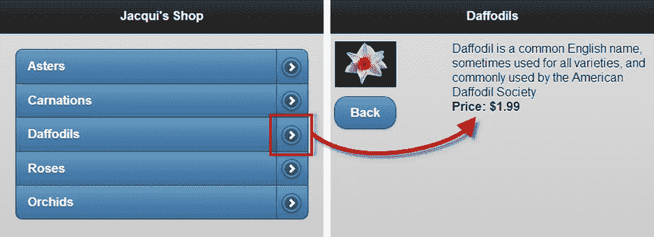
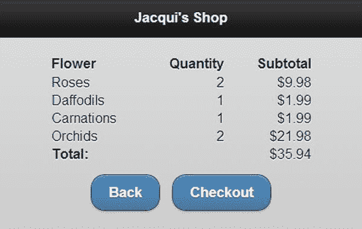
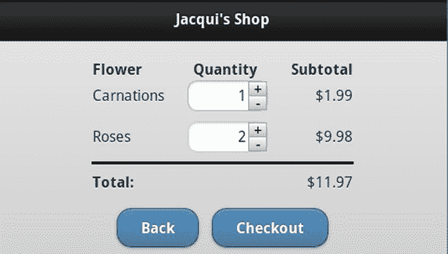
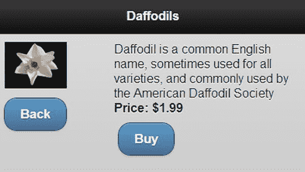
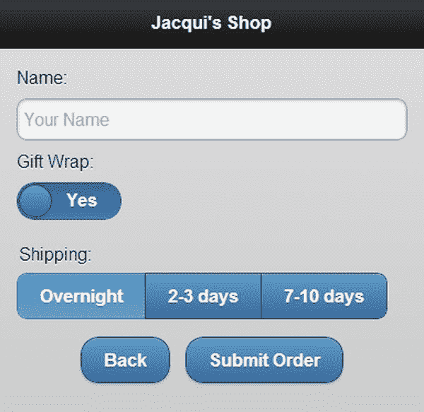

# 三十三、重构示例：第四部分

在本书这一部分的前几章，我向您介绍了 jQuery Mobile。在本章中，我将构建一个使用 jQuery Mobile 功能的更完整的例子。就其本质而言，jQuery Mobile 比 jQuery UI 简单得多，可用的设计选择也少得多。移动设备开发面临的独特问题进一步限制了 jQuery Mobile 的开发工作。

从基础开始

在第三十二章中，我展示了一个使用分割列表的例子。这个例子是本章的起点，我将用它来构建一些额外的功能。清单 33-1 显示了本章的初始示例文档。

***清单 33-1*** 。本章的起点

```js
<!DOCTYPE html>
<html>
<head>
    <title>Example</title>
    <meta name="viewport" content="width=device-width, initial-scale=1">
    <link rel="stylesheet" href="jquery.mobile-1.3.1.css" type="text/css" />
    <script type="text/javascript" src="jquery-1.10.1.js"></script>
    <script type="text/javascript" src="jquery.mobile-1.3.1.js"></script>
    <style type="text/css">
        .lcontainer {float: left; text-align: center; padding-top: 10px}
        .productData {float: right; padding: 10px; width: 60%}
        .cWrapper {text-align: center; margin: 20px}
    </style>
</head>
<body>
    <div id="page1" data-role="page" data-theme="b">
        <div data-role="header">
           <h1>Jacqui's Shop</h1>
        </div>
        <div id="container" style="padding: 20px">
            <ul data-role="listview" data-inset=true>
                <li><a href="#basket" class="buy" id="rose">Roses</a>
                    <a href="#roses">Roses</a></li>
                <li><a href="#basket" class="buy" id="orchid">Orchids</a>
                    <a href="#orchids">Orchids</a>  </li>
                <li><a href="#basket" class="buy" id="aster">Asters</a>
                    <a href="#asters">Asters</a>  </li>
            </ul>
        </div>
    </div>
    <div id="basket" data-role="page" data-theme="b">
        <div data-role="header">
           <h1>Jacqui's Shop</h1>
        </div>
        <div class="cWrapper">
            Basket will go here
        </div>
        <div class="cWrapper">
            <a href="#" data-rel="back" data-role="button" data-inline=true
               data-direction="reverse">Back</a>
        </div>
    </div>
    <div id="roses" data-role="page" data-theme="b">
        <div data-role="header">
           <h1>Roses</h1>
        </div>
        <div>
            <div class="lcontainer">
                
                <div><a href="#" data-rel="back" data-role="button"
                       data-inline=true data-direction="reverse">Back</a>
                </div>
            </div>
            <div class="productData">
                A rose is a woody perennial within the family Rosaceae.
                They form a group of erect shrubs, and climbing or trailing plants.
                <div><b>Price: $4.99</b></div>
            </div>
        </div>
    </div>

   <div id="orchids" data-role="page" data-theme="b">
        <div data-role="header">
           <h1>Orchids</h1>
        </div>
        <div>
            <div class="lcontainer">
                
                <div><a href="#" data-rel="back" data-role="button"
                       data-inline=true data-direction="reverse">Back</a>
                </div>
            </div>
            <div class="productData">
                The orchid family is a diverse and widespread family in the order
                Asparagales. It is one of the largest families of flowering plants.
                <div><b>Price: $10.99</b></div>
            </div>
        </div>
    </div>
   <div id="asters" data-role="page" data-theme="b">
        <div data-role="header">
           <h1>Asters</h1>
        </div>
        <div>
            <div class="lcontainer">
                
                <div><a href="#" data-rel="back" data-role="button"
                       data-inline=true data-direction="reverse">Back</a>
                </div>
            </div>
            <div class="productData">
                The name Aster comes from the Ancient Greek word meaning "star",
                referring to the shape of the flower head.
                <div><b>Price: $2.99</b></div>
            </div>
        </div>
    </div>
</body>
</html>
```

以编程方式插入产品

我要做的第一件事是用一些动态创建的页面替换描述每朵花的静态页面。这一改变使我有了一个更紧凑的文档，并且可以方便地添加更多的花朵供用户选择，而无需复制 HTML 元素。我将使用数据模板生成页面，我在第十二章中描述过。数据模板与核心 jQuery 库一起工作，因此也非常适合 jQuery Mobile 应用。我创建了一个名为`data.json` 的文件，其中包含了我需要的花的数据。清单 33-2 显示了`data.json`的内容。

***清单 33-2*** 。data.json 文件的内容

```js
[{  "name": "aster",
    "label": "Asters",
    "price": "$2.99",
    "text": "The name Aster comes from the Ancient Greek word meaning star..."
},{ "name": "carnation",
    "label": "Carnations",
    "price": "$1.99",
    "text": "Carnations require well-drained, neutral to slightly alkaline soil..."
},{ "name": "daffodil",
    "label": "Daffodils",
    "price": "$1.99",
    "text": "Daffodil is a common English name, sometimes used for all varieties..."
},{ "name": "rose",
    "label": "Roses",
    "price": "$4.99",
    "text":  "A rose is a woody perennial within the family Rosaceae. They form a..."
},{ "name": "orchid",
    "label": "Orchids",
    "price": "$10.99",
    "text": "The orchid family is a diverse and widespread family in the order..."
}]
```

数据描述了五种花。对于它们中的每一个，我都定义了产品名称、显示给用户的标签、单价和文本描述。

 **注意**我没有在清单中展示全文描述，但是它包含在`data.json`文件中，该文件是本书源代码下载的一部分(可以从`Apress.com`获得)。

现在我有了数据，我可以将它集成到文档中。清单 33-3 展示了使用数据模板从静态页面到程序生成页面的变化。

***清单 33-3*** 。动态添加页面

```js
<!DOCTYPE html>
<html>
<head>
    <title>Example</title>
    <meta name="viewport" content="width=device-width, initial-scale=1">
    <link rel="stylesheet" href="jquery.mobile-1.3.1.css" type="text/css" />
    <script type="text/javascript" src="jquery-1.10.1.js"></script>
    <script src="handlebars.js"></script>
    <script src="handlebars-jquery.js"></script>
    <style type="text/css">
        .lcontainer {float: left; text-align: center; padding-top: 10px}
        .productData {float: right; padding: 10px; width: 60%}
        .cWrapper {text-align: center}
    </style>
    <script id="flowerTmpl" type="text/x-handlebars-template">
        {{#products}}
       <div id="{{name}}" data-role="page" data-theme="b">
            <div data-role="header">
               <h1>{{label}}</h1>
            </div>
            <div>
                <div class="lcontainer">
                    
                    <div><a href="#" data-rel="back" data-role="button"
                           data-inline=true data-direction="reverse">Back</a>
                    </div>
                </div>
                <div class="productData">
                    {{text}}
                    <div><b>Price: {{price}}</b></div>
                </div>
            </div>
        </div>
        {{/products}}
    </script>

    <script id="liTmpl" type="text/x-handlebars-template">
        {{#products}}
        <li>
            <a href="#basket" class="buy" id="A1">{{label}}</a>
            <a href="#{{name}}">{{label}}</a>
        </li>
        {{/products}}
    </script>

    <script type="text/javascript">
        var initComplete = false;
        $(document).bind("pageinit", function () {
            if (!initComplete) {
                $.getJSON("data.json", function (data) {
                    $("#flowerTmpl").template({ products: data })
                        .filter("*").appendTo("body");
                    $("ul").append($("#liTmpl").template({ products: data })
                        .filter("*")).listview("refresh")
                });
                initComplete = true;
            }
        })
    </script>
    <script type="text/javascript" src="jquery.mobile-1.3.1.js"></script>
</head>
<body>
    <div id="page1" data-role="page" data-theme="b">
        <div data-role="header">
           <h1>Jacqui's Shop</h1>
        </div>
        <div id="container" style="padding: 20px">
            <ul data-role="listview" data-inset=true></ul>
        </div>
    </div>
    <div id="basket" data-role="page" data-theme="b">
        <div data-role="header">
           <h1>Jacqui's Shop</h1>
        </div>
        <div class="cWrapper">
            Basket will go here
        </div>
        <div class="cWrapper">
            <a href="#" data-rel="back" data-role="button" data-inline=true
               data-direction="reverse">Back</a>
        </div>
    </div>
</body>
</html>
```

我移除了每朵花的页面，并使用数据模板从数据中生成我需要的内容，这些数据是我使用`getJSON`方法获得的(在第十四章中描述)。这一变化的关键是简单的定制 JavaScript 代码，如下所示:

```js
..
<script type="text/javascript">
    var initComplete = false;
    $(document).bind("pageinit", function () {
        if (!initComplete) {
            $.getJSON("data.json", function (data) {
                $("#flowerTmpl").template({ products: data })
                    .filter("*").appendTo("body");
                $("ul").append($("#liTmpl").template({ products: data })
                    .filter("*")).listview("refresh")
            });
            initComplete = true;
        }
    })
</script>
...
```

当我获得数据时，我使用模板从数据中生成元素，并将动态生成的页面添加到文档中的`body`元素。我还使用一个模板来生成主鲜花列表的项目。我告诉 jQuery Mobile 我已经修改了列表的内容，这是通过调用`listview`小部件上的`refresh`方法来完成的，如下所示:

```js
...
$("ul").append($("#liTmpl").template({ products: data })
    .filter("*")).listview("refresh");
...
```

数据模板很简单，使用了我在第十二章中描述的标准技术。您可以在图 33-1 中看到结果——一个列表，其项目以编程方式生成，并链接到已经以编程方式添加到文档中的页面。



图 33-1 。以编程方式生成的列表项和页面

重用页面

我喜欢数据模板方法，因为它展示了 jQuery 如何支持如此广泛的功能，允许您将模板等功能与 jQuery Mobile 等接口工具包结合在一起。

也就是说，您可以采用一种更优雅的方法来处理每朵花的页面。您可以生成一组元素并修改它们来显示用户选择的花，而不是为您想要显示的每朵花生成一组元素。清单 33-4 展示了使这成为可能的对文档的修改。

***清单 33-4*** 。为多个产品重复使用一个页面

```js
<!DOCTYPE html>
<html>
<head>
    <title>Example</title>
    <meta name="viewport" content="width=device-width, initial-scale=1">
    <link rel="stylesheet" href="jquery.mobile-1.3.1.css" type="text/css" />
    <script type="text/javascript" src="jquery-1.10.1.js"></script>
    <script src="handlebars.js"></script>
    <script src="handlebars-jquery.js"></script>
    <script id="liTmpl" type="text/x-handlebars-template">
        {{#products}}
        <li>
            <a href="#basket" class="buy" id="{{name}}">{{label}}</a>
            <a class="productLink" data-flower="{{name}}" href="#">{{label}}</a>
        </li>
        {{/products}}
    </script>
    <script type="text/javascript">
        var initComplete = false;

        $(document).bind("pageinit", function () {

            if (!initComplete) {

                $.getJSON("data.json", function (data) {
                    $("ul").append($("#liTmpl").template({ products: data })
                        .filter("*")).listview("refresh");

                    $("a.productLink").bind("tap", function () {
                        var targetFlower = $(this).attr("data-flower");
                        for (var i = 0; i < data.length; i++) {
                            if (data[i].name == targetFlower) {
                                var page = $("#productPage");
                                page.find("#header").text(data[i].label);
                                page.find("#image").attr("src", data[i].name + ".png");
                                page.find("#description").text(data[i].text);
                                page.find("#price").text(data[i].price);

                                $.mobile.changePage("#productPage");
                                break;
                            }
                        }
                    })
                });
                initComplete = true;
            }
        })
    </script>
    <script type="text/javascript" src="jquery.mobile-1.3.1.js"></script>
    <style type="text/css">
        .lcontainer {float: left; text-align: center; padding-top: 10px}
        .productData {float: right; padding: 10px; width: 60%}
        .cWrapper {text-align: center}
    </style>
</head>
<body>
    <div id="page1" data-role="page" data-theme="b">
        <div data-role="header">
           <h1>Jacqui's Shop</h1>
        </div>
        <div id="container" style="padding: 20px">
            <ul data-role="listview" data-inset=true>

            </ul>
        </div>
    </div>
    <div id="productPage" data-role="page" data-theme="b">
         <div data-role="header">
            <h1 id="header"></h1>
         </div>
         <div>
             <div class="lcontainer">
                 
                 <div><a href="#" data-rel="back" data-role="button"
                        data-inline=true data-direction="reverse">Back</a>
                 </div>
             </div>
             <div class="productData">
                 <span id="description"></span>
                 <div><b>Price: <span id="price"></span></b></div>
             </div>
         </div>
     </div>
    <div id="basket" data-role="page" data-theme="b">
        <div data-role="header">
           <h1>Jacqui's Shop</h1>
        </div>
        <div class="cWrapper">
            Basket will go here
        </div>
        <div class="cWrapper">
            <a href="#" data-rel="back" data-role="button" data-inline=true
               data-direction="reverse">Back</a>
        </div>
    </div>
</body>
</html>
```

 **提示**这是一种特别适合 jQuery Mobile 的方法，因为多个页面包含在一个 HTML 文档中。通常，由于移动设备固有的局限性，您希望尽可能保持 HTML 文档的简单性。

我从文档中删除了一个数据模板，并添加了一个新页面(它的`id`是`productPage`),我用它来表示每一朵花。我修改了用于生成列表项的模板，以便在`href`属性中没有目标页面，并添加我自己的数据属性，以便我知道任何给定链接与哪朵花相关。当从 JSON 中检索到数据后，修改后的脚本从我刚刚使用模板创建的列表元素中选择所有针对每个产品的链接，并绑定到`tap`事件。当点击一个列表项时，我找到合适的数据项并使用其属性来配置`productPage`页面，设置向用户显示的文本和图像，如下所示:

```js
...
<script type="text/javascript">

    var initComplete = false;

    $(document).bind("pageinit", function () {
        if (!initComplete) {
            $.getJSON("data.json", function (data) {
                $("ul").append($("#liTmpl").template({ products: data })
                    .filter("*")).listview("refresh");

                $("a.productLink").bind("tap", function () {
                    var targetFlower = $(this).attr("data-flower");
                    for (var i = 0; i < data.length; i++) {
                        if (data[i].name == targetFlower) {
                            var page = $("#productPage");
                            page.find("#header").text(data[i].label);
                            page.find("#image").attr("src", data[i].name + ".png");
                            page.find("#description").text(data[i].text);
                            page.find("#price").text(data[i].price);

                            $.mobile.changePage("#productPage");
                            break;
                        }
                    }
                })
            });
            initComplete = true;
        }
    })
</script>
...
```

在我配置页面之后，我使用`changePage`方法来触发导航。这个例子的外观没有变化，但是移动浏览器需要管理的元素更少了，这是一个很好的例子，说明了如何操作 jQuery Mobile 文档的页面结构。

创建购物车

我在这个例子中使用了一个分割列表，列表项的左侧指向`basket`页面。在这一节中，我将定义页面的元素并添加一些 JavaScript，这样就有了一个简单的篮子。清单 33-5 显示了对文档的修改。

***清单 33-5*** 。实施购物篮

```js
<!DOCTYPE html>
<html>
<head>
    <title>Example</title>
    <meta name="viewport" content="width=device-width, initial-scale=1">
    <link rel="stylesheet" href="jquery.mobile-1.3.1.css" type="text/css" />
    <script type="text/javascript" src="jquery-1.10.1.js"></script>
    <script src="handlebars.js"></script>
    <script src="handlebars-jquery.js"></script>
    <script id="liTmpl" type="text/x-handlebars-template">
        {{#products}}
        <li>
            <a href="#" class="buy" id="{{name}}">{{label}}</a>
            <a class="productLink" data-flower="{{name}}" href="#">{{label}}</a>
        </li>
        {{/products}}
    </script>
    <script id="trTmpl" type="text/x-handlebars-template">
        <tr data-price="{{price}}" id="{{name}}"><td>{{label}}</td><td id="count">1</td>
            <td id="subtotal">0</td></tr>
    </script>
    <script type="text/javascript">
        $(document).ready(function () {
            $.getJSON("data.json", function (data) {
                $("ul").append($("#liTmpl").template({ products: data }))
                    .filter("*").listview("refresh");

                $("a.productLink").bind("tap", function () {
                    var targetFlower = $(this).attr("data-flower");
                    for (var i = 0; i < data.length; i++) {
                        if (data[i].name == targetFlower) {
                            var page = $("#productPage");
                            page.find("#header").text(data[i].label);
                            page.find("#image").attr("src", data[i].name + ".png");
                            page.find("#description").text(data[i].text);
                            page.find("#price").text(data[i].price);
                            $.mobile.changePage("#productPage");
                            break;
                        }
                    }
                });

                $("a.buy").bind("tap", function () {
                    var targetFlower = this.id;
                    var row = $("#basketTable tbody #" + targetFlower);
                    if (row.length > 0) {
                        var countCell = row.find("#count");
                        countCell.text(Number(countCell.text()) + 1);
                    } else {
                        for (var i = 0; i < data.length; i++) {
                            if (data[i].name == targetFlower) {
                                $("#trTmpl").template(data[i])
                                    .appendTo("#basketTable tbody")
                                break;
                            }
                        }
                    }
                    calculateTotals();
                    $.mobile.changePage("#basket")
                });
            })
        })

        function calculateTotals() {
            var total = 0;
            $("#basketTable tbody").children().each(function (index, elem) {
                var count = Number($(elem).find("#count").text())
                var price = Number($(elem).attr("data-price").slice(1))
                var subtotal = count * price;
                $(elem).find("#subtotal").text("$" + subtotal.toFixed(2));
                total += subtotal;
            })
            $("#total").text("$" + total.toFixed(2))
        }
    </script>
    <script type="text/javascript" src="jquery.mobile-1.3.1.js"></script>
    <style type="text/css">
        .lcontainer {float: left; text-align: center; padding-top: 10px}
        .productData {float: right; padding: 10px; width: 60%}
        .cWrapper {text-align: center}
        table {display: inline-block; margin: auto; margin-top: 20px; text-align: left;
            border-collapse: collapse}
        td {min-width: 100px}
        th, td {text-align: right}
        th:nth-child(1), td:nth-child(1) {text-align: left}
    </style>
</head>
<body>
    <div id="page1" data-role="page" data-theme="b">
        <div data-role="header">
           <h1>Jacqui's Shop</h1>
        </div>
        <div id="container" style="padding: 20px">
            <ul data-role="listview" data-inset=true></ul>
        </div>
    </div>
    <div id="productPage" data-role="page" data-theme="b">
         <div data-role="header">
            <h1 id="header"></h1>
         </div>
         <div>
             <div class="lcontainer">
                 
                 <div><a href="#" data-rel="back" data-role="button"
                        data-inline=true data-direction="reverse">Back</a>
                 </div>
             </div>
             <div class="productData">
                 <span id="description"></span>
                 <div><b>Price: <span id="price"></span></b></div>
             </div>
         </div>
     </div>
    <div id="basket" data-role="page" data-theme="b">
        <div data-role="header">
           <h1>Jacqui's Shop</h1>
        </div>
        <div class="cWrapper">
            <table id="basketTable" border=0>
                <thead>
                    <tr><th>Flower</th><th>Quantity</th><th>Subtotal</th></tr>
                </thead>
                <tbody></tbody>
                <tfoot>
                    <tr><th colspan=2>Total:</th><td id="total"></td></tr>
                </tfoot>
            </table>
        </div>
        <div class="cWrapper">
            <a href="#" data-rel="back" data-role="button" data-inline=true
               data-direction="reverse">Back</a>
            <button data-inline="true">Checkout</button>
        </div>
    </div>
</body>
</html>
```

我向`basket`页面添加了一个`table`，它为每个选中的产品显示一行。每行显示产品名称、数量和小计。表格中有一个页脚显示了总的总数。我绑定到了`tap`事件，这样当用户点击左侧的拆分按钮时，要么向表中添加一个新行，要么如果表中已经有该产品的一行，数量就会增加。新行是使用另一个数据模板生成的，其他一切都是通过读取文档中元素的内容来处理的。

我使用 DOM 本身来确定和维护客户购物篮的整个状态。我本来可以创建一个 JavaScript 对象来对订单进行建模，并从该对象中驱动表的内容，但是在一本关于 jQuery 的书中，我喜欢利用一切机会来处理文档本身。结果是一个简单的篮子，如图图 33-2 所示。



图 33-2 。购物篮页面

添加数量变化

篮子是功能性的，但是如果用户想要两朵玫瑰，例如，她必须点击`Rose`列表项目，点击`Back`按钮，然后再次点击`Rose`项目。这个过程非常荒谬，所以为了更容易地改变产品的数量，我在表中添加了一些`input`元素。您可以在清单 33-6 中看到这些变化。

***清单 33-6*** 。将范围滑块添加到购物篮表格

```js
<!DOCTYPE html>
<html>
<head>
    <title>Example</title>
    <meta name="viewport" content="width=device-width, initial-scale=1">
    <link rel="stylesheet" href="jquery.mobile-1.3.1.css" type="text/css" />
    <script type="text/javascript" src="jquery-1.10.1.js"></script>
    <script src="handlebars.js"></script>
    <script src="handlebars-jquery.js"></script>
    <script id="liTmpl" type="text/x-handlebars-template">
        {{#products}}
        <li>
            <a href="#" class="buy" id="{{name}}">{{label}}</a>
            <a class="productLink" data-flower="{{name}}" href="#">{{label}}</a>
        </li>
        {{/products}}
    </script>
    <script id="trTmpl" type="text/x-handlebars-template">
        <tr data-theme="b" data-price="{{price}}" id="{{name}}"><td>{{label}}</td>
            <td id="count"><input type=number value=1 min=0 max=10></td>
            <td id="subtotal">0</td>
        </tr>
    </script>
    <script type="text/javascript">

        var initComplete = false;

        $(document).bind("pageinit", function () {
            if (!initComplete) {
                $.getJSON("data.json", function (data) {

                    $("ul").append($("#liTmpl")
                        .template({ products: data })).listview("refresh");

                    $("a.productLink").bind("tap", function () {
                        var targetFlower = $(this).attr("data-flower");
                        for (var i = 0; i < data.length; i++) {
                            if (data[i].name == targetFlower) {
                                var page = $("#productPage");
                                page.find("#header").text(data[i].label);
                                page.find("#image").attr("src", data[i].name + ".png");
                                page.find("#description").text(data[i].text);
                                page.find("#price").text(data[i].price);

                                $.mobile.changePage("#productPage");
                                break;
                            }
                        }
                    })

                    $("a.buy").bind("tap", function () {
                        var targetFlower = this.id;
                        var row = $("#basketTable tbody #" + targetFlower);
                        if (row.length > 0) {
                            var countCell = row.find("#count input");
                            countCell.val(Number(countCell.val()) + 1);
                        } else {
                            for (var i = 0; i < data.length; i++) {
                                if (data[i].name == targetFlower) {
                                    $("#trTmpl").template(data[i])
                                        .appendTo("#basketTable tbody")
                                        .find("input").textinput()

                                    break;
                                }
                            }
                        }
                        calculateTotals();
                        $.mobile.changePage("#basket")
                    })

                    $(document).on("change click", "input", function (event) {
                        calculateTotals();
                    })
                });
                initComplete = true;
            }
        })

        function calculateTotals() {
            var total = 0;
            $("#basketTable tbody").children().each(function (index, elem) {
                var count = Number($(elem).find("#count input").val())
                var price = Number($(elem).attr("data-price").slice(1))
                var subtotal = count * price;
                $(elem).find("#subtotal").text("$" + subtotal.toFixed(2));
                total += subtotal;
            })
            $("#total").text("$" + total.toFixed(2))
        }
    </script>
    <script type="text/javascript" src="jquery.mobile-1.3.1.js"></script>
    <style type="text/css">
        .lcontainer {float: left; text-align: center; padding-top: 10px}
        .productData {float: right; padding: 10px; width: 60%}
        .cWrapper {text-align: center}
        table {display: inline-block; margin: auto; margin-top: 20px; text-align: left;
            border-collapse: collapse}
        td {min-width: 100px; padding-bottom: 10px}
        td:nth-child(2) {min-width: 75px; width: 75px}
        th, td {text-align: right}
        th:nth-child(1), td:nth-child(1) {text-align: left}
        input[type=number] {background-color: white}
        tfoot tr {border-top: medium solid black}
        tfoot tr td {padding-top: 10px}
    </style>
</head>
<body>
    <div id="page1" data-role="page" data-theme="b">
        <div data-role="header">
           <h1>Jacqui's Shop</h1>
        </div>
        <div id="container" style="padding: 20px">
            <ul data-role="listview" data-inset=true></ul>
        </div>
    </div>
    <div id="productPage" data-role="page" data-theme="b">
         <div data-role="header">
            <h1 id="header"></h1>
         </div>
         <div>
             <div class="lcontainer">
                 
                 <div><a href="#" data-rel="back" data-role="button"
                        data-inline=true data-direction="reverse">Back</a>
                 </div>
             </div>
             <div class="productData">
                 <span id="description"></span>
                 <div><b>Price: <span id="price"></span></b></div>
             </div>
         </div>
     </div>
    <div id="basket" data-role="page" data-theme="b">
        <div data-role="header">
           <h1>Jacqui's Shop</h1>
        </div>
        <div class="cWrapper">
            <table id="basketTable" border=0>
                <thead>
                    <tr><th>Flower</th><th>Quantity</th><th>Subtotal</th></tr>
                </thead>
                <tbody></tbody>
                <tfoot>
                    <tr><th colspan=2>Total:</th><td id="total"></td></tr>
                </tfoot>
            </table>
        </div>
        <div class="cWrapper">
            <a href="#" data-rel="back" data-role="button" data-inline=true
               data-direction="reverse">Back</a>
            <button data-inline="true">Checkout</button>
        </div>
    </div>
</body>
</html>
```

我在模板的 quantity 单元格中插入了一个`input`元素，用于为表格生成行。这个`input`元素的`type`是`number`，这导致一些浏览器在文本输入区域旁边插入小的上下按钮。这些按钮太小，不适合触摸，但浏览器也会过滤字符，丢弃任何不适合数字的内容。虽然对于本章来说这是可以接受的，但是对于实际项目来说这不是一个完美的方法，因为它支持浮点数，这意味着用户可以输入产品的分数。

在 jQuery Mobile 增强了页面之后，当我向文档添加`input`元素时，我调用了`textinput`方法:

```js
...
$("#trTmpl").template(data[i]).appendTo("#basketTable tbody").find("input").textinput()
...
```

如果我不添加这个方法调用，浏览器会显示本机的`input`元素。调用`textinput`方法会导致 jQuery Mobile 增强元素，尽管它没有正确分配样本。所以我为`input`元素定义了一个样式来设置一致的背景颜色:

```js
...
input[type=number] {background-color: white}
...
```

我需要更频繁地计算小计和总计，因为用户可以在购物篮页面中更改产品的数量。因为我在应用的整个生命周期中向文档添加了`input`元素，所以我使用 jQuery `on`方法来处理事件。`on`方法在第九章中有描述。下面是事件处理程序代码:

```js
...
$(document).on("change click", "input", function (event) {
    calculateTotals();
})
...
```

我使用`on`方法将我的处理函数与`change`和`click`事件关联起来。为数字`input`元素添加向上和向下按钮的浏览器在这些按钮被按下时会触发 click 事件，所以除了更令人期待的`change`事件之外，我还需要处理这个事件。当任一事件被触发时，我的处理函数调用`calculateTotals`函数。你可以在图 33-3 中看到篮子的样子。



图 33-3 。向购物篮页面添加输入元素

向信息页面添加按钮

产品信息描述了用户选择的花，但是它没有为用户提供任何将它添加到购物篮的方法。为了完善基本的购物篮功能，我在产品页面上添加了一个按钮，将商品添加到购物篮中。清单 33-7 显示了产品页面的变化。

***清单 33-7*** 。向产品页面添加按钮

```js
...
<div id="productPage" data-role="page" data-theme="b">
     <div data-role="header">
        <h1 id="header"></h1>
     </div>
     <div>
         <div class="lcontainer">
             
             <div><a href="#" data-rel="back" data-role="button"
                    data-inline=true data-direction="reverse">Back</a>
             </div>
         </div>
         <div class="productData">
             <span id="description"></span>
             <div>
                <b>Price: <span id="price"></span></b>
                <a href="#" id="buybutton" data-flower="" data-role="button"
                   data-inline=true>Buy</a>
             </div>
         </div>
     </div>
 </div>
...
```

我定义了一个`a`元素，jQuery Mobile 将把它转换成一个按钮小部件。我添加了一个数据属性(`data-flower`)，这样当用户点击按钮时，我可以跟踪显示的是哪朵花。为了支持这个按钮，我对脚本做了一些修改。这些变化显示在清单 33-8 中。

***清单 33-8*** 。在脚本中添加对购买按钮的支持

```js
...
<script type="text/javascript">

    var initComplete = false;

    $(document).bind("pageinit", function () {
        if (!initComplete) {
            $.getJSON("data.json", function (data) {

                $("ul").append($("#liTmpl")
                    .template({ products: data })).listview("refresh");

                $("a.productLink").bind("tap", function () {
                    var targetFlower = $(this).attr("data-flower");
                    for (var i = 0; i < data.length; i++) {
                        if (data[i].name == targetFlower) {
                            var page = $("#productPage");
                            page.find("#header").text(data[i].label);
                            page.find("#image").attr("src", data[i].name + ".png");
                            page.find("#description").text(data[i].text);
                            page.find("#price").text(data[i].price);
                            page.find("#buybutton").attr("data-flower", data[i].name);
                            $.mobile.changePage("#productPage");
                            break;
                        }
                    }
                })

                $("#buybutton").bind("tap", function () {
                    addProduct($(this).attr("data-flower"));
                })

                $("a.buy").bind("tap", function () {
                    addProduct(this.id);
                })

                function addProduct(targetFlower) {
                    var row = $("#basketTable tbody #" + targetFlower);
                    if (row.length > 0) {
                        var countCell = row.find("#count input");
                        countCell.val(Number(countCell.val()) + 1);
                    } else {
                        for (var i = 0; i < data.length; i++) {
                            if (data[i].name == targetFlower) {
                                $("#trTmpl").template(data[i])
                                    .appendTo("#basketTable tbody")
                                    .find("input").textinput()

                                break;
                            }
                        }
                    }
                    calculateTotals();
                    $.mobile.changePage("#basket")
                }

                $(document).on("change click", "input", function (event) {
                    calculateTotals();
                })
            });
            initComplete = true;
        }
    })

    function calculateTotals() {
        var total = 0;
        $("#basketTable tbody").children().each(function (index, elem) {
            var count = Number($(elem).find("#count input").val())
            var price = Number($(elem).attr("data-price").slice(1))
            var subtotal = count * price;
            $(elem).find("#subtotal").text("$" + subtotal.toFixed(2));
            total += subtotal;
        })
        $("#total").text("$" + total.toFixed(2))
    }
</script>
...
```

这些变化非常简单。当用户从主列表中选择一个产品时，我在`a`元素上设置了`data-flower`属性的值。我注册了一个函数来处理按钮的`tap`事件，并使用值`data-flower`来调用`addProduct`函数，该函数包含我从另一个处理函数中提取的代码。通过这些更改，用户可以从主列表(通过点击拆分列表项目的左侧)或从信息页面(通过点击`Buy`按钮)向购物篮添加产品。图 33-4 显示了页面上添加的`Buy`按钮。



图 33-4 。向产品信息页面添加按钮

实现结账流程

为了完善这个例子，我将演示如何从各种 jQuery Mobile 页面收集数据，收集的数据可以用于发出 Ajax 请求。我不会发出请求本身，也不会实现服务器。jQuery Mobile 使用了对 Ajax 的核心 jQuery 支持，我在第十四章和第十五章描述了这一点。清单 33-9 显示了当点击`Checkout`按钮时显示给用户的页面，以及收集数据的处理函数。

***清单 33-9*** 。实施结账流程

```js
<!DOCTYPE html>
<html>
<head>
    <title>Example</title>
    <meta name="viewport" content="width=device-width, initial-scale=1">
    <link rel="stylesheet" href="jquery.mobile-1.3.1.css" type="text/css" />
    <script type="text/javascript" src="jquery-1.10.1.js"></script>
    <script src="handlebars.js"></script>
    <script src="handlebars-jquery.js"></script>
    <script id="liTmpl" type="text/x-handlebars-template">
        {{#products}}
        <li>
            <a href="#" class="buy" id="{{name}}">{{label}}</a>
            <a class="productLink" data-flower="{{name}}" href="#">{{label}}</a>
        </li>
        {{/products}}
    </script>
    <script id="trTmpl" type="text/x-handlebars-template">
        <tr data-theme="b" data-price="{{price}}" id="{{name}}"><td>{{label}}</td>
            <td id="count"><input type=number value=1 min=0 max=10></td>
            <td id="subtotal">0</td>
        </tr>
    </script>
    <script type="text/javascript">
        var initComplete = false;
        $(document).bind("pageinit", function () {
            if (!initComplete) {
                $.getJSON("data.json", function (data) {
                    $("ul").append($("#liTmpl")
                        .template({ products: data })).listview("refresh");

                    $("a.productLink").bind("tap", function () {
                        var targetFlower = $(this).attr("data-flower");
                        for (var i = 0; i < data.length; i++) {
                            if (data[i].name == targetFlower) {
                                var page = $("#productPage");
                                page.find("#header").text(data[i].label);
                                page.find("#image").attr("src", data[i].name + ".png");
                                page.find("#description").text(data[i].text);
                                page.find("#price").text(data[i].price);
                                page.find("#buybutton")
                                    .attr("data-flower", data[i].name);
                                $.mobile.changePage("#productPage");
                                break;
                            }
                        }
                    })

                    $("#buybutton").bind("tap", function () {
                        addProduct($(this).attr("data-flower"));
                    })

                    $("a.buy").bind("tap", function () {
                        addProduct(this.id);
                    })

                    function addProduct(targetFlower) {
                        var row = $("#basketTable tbody #" + targetFlower);
                        if (row.length > 0) {
                            var countCell = row.find("#count input");
                            countCell.val(Number(countCell.val()) + 1);
                        } else {
                            for (var i = 0; i < data.length; i++) {
                                if (data[i].name == targetFlower) {
                                    $("#trTmpl").template(data[i])
                                        .appendTo("#basketTable tbody")
                                        .find("input").textinput();
                                    break;
                                }
                            }
                        }
                        calculateTotals();
                        $.mobile.changePage("#basket")
                    }

                    $(document).on("change click", "input", function (event) {
                        calculateTotals();
                    })

                    $("#submit").bind("tap", function () {
                        var dataObject = new Object();
                        $("#basketTable tbody").children().each(function (index, elem) {
                            dataObject[elem.id] = $(elem).find("#count input").val();
                        })
                        dataObject["name"] = $("#name").val();
                        dataObject["wrap"] = $("option:selected").val();
                        dataObject["shipping"] = $("input:checked").attr("id")

                        console.log("DATA: " + JSON.stringify(dataObject))
                    })
                });
                initComplete = true;
            }
        })

        function calculateTotals() {
            var total = 0;
            $("#basketTable tbody").children().each(function (index, elem) {
                var count = Number($(elem).find("#count input").val())
                var price = Number($(elem).attr("data-price").slice(1))
                var subtotal = count * price;
                $(elem).find("#subtotal").text("$" + subtotal.toFixed(2));
                total += subtotal;
            })
            $("#total").text("$" + total.toFixed(2))
        }

    </script>
    <script type="text/javascript" src="jquery.mobile-1.3.1.js"></script>
    <style type="text/css">
        .lcontainer {float: left; text-align: center; padding: 10px}
        .productData {float: right; padding: 10px; width: 60%}
        .cWrapper {text-align: center}
        table {display: inline-block; margin: auto; margin-top: 20px; text-align: left;
            border-collapse: collapse}
        td {min-width: 100px; padding-bottom: 10px}
        td:nth-child(2) {min-width: 75px; width: 75px}
        th, td {text-align: right}
        th:nth-child(1), td:nth-child(1) {text-align: left}
        input[type=number] {background-color: white}
        tfoot tr {border-top: medium solid black}
        tfoot tr td {padding-top: 10px}
    </style>
</head>
<body>
    <div id="page1" data-role="page" data-theme="b">
        <div data-role="header">
           <h1>Jacqui's Shop</h1>
        </div>
        <div id="container" style="padding: 20px">
            <ul data-role="listview" data-inset=true></ul>
        </div>
    </div>
    <div id="productPage" data-role="page" data-theme="b">
         <div data-role="header">
            <h1 id="header"></h1>
         </div>
         <div>
             <div class="lcontainer">
                 
                 <div><a href="#" data-rel="back" data-role="button"
                        data-inline=true data-direction="reverse">Back</a>
                 </div>
             </div>
             <div class="productData">
                 <span id="description"></span>
                 <div>
                    <b>Price: <span id="price"></span></b>
                    <a href="#" id="buybutton" data-flower="" data-role="button"
                       data-inline=true>Buy</a>
                 </div>
             </div>
         </div>
     </div>
    <div id="basket" data-role="page" data-theme="b">
        <div data-role="header">
           <h1>Jacqui's Shop</h1>
        </div>
        <div class="cWrapper">
            <table id="basketTable" border=0>
                <thead>
                    <tr><th>Flower</th><th>Quantity</th><th>Subtotal</th></tr>
                </thead>
                <tbody></tbody>
                <tfoot>
                    <tr><th colspan=2>Total:</th><td id="total"></td></tr>
                </tfoot>
            </table>
        </div>
        <div class="cWrapper">
            <a href="#" data-rel="back" data-role="button" data-inline=true
               data-direction="reverse">Back</a>
            <a href="#checkout" data-role="button" data-inline="true">Checkout</a>
        </div>
    </div>
   <div id="checkout" data-role="page" data-theme="b">
        <div data-role="header">
           <h1>Jacqui's Shop</h1>
        </div>
        <div data-role="content">
            <label for="name">Name: </label>
            <input id="name" placeholder="Your Name">

            <label for="wrap"><span>Gift Wrap: </span></label>
            <select id="wrap" name="wrap" data-role="slider">
                <option value="yes" selected>Yes</option>
                <option value="no">No</option>
            </select>

            <fieldset data-role="controlgroup" data-type="horizontal">
                <legend>Shipping:</legend>
                <input type="radio" name="ship" id="overnight" checked />
                <label for="overnight">Overnight</label>
                <input type="radio" name="ship" id="23day"/>
                <label for="23day">2-3 days</label>
                <input type="radio" name="ship" id="710day"/>
                <label for="710day">7-10 days</label>
            </fieldset>

            <div class="cWrapper">
                <a href="#" data-rel="back" data-role="button" data-inline="true"
                   data-direction="reverse">Back</a>
                <a href="#" id="submit" data-role="button"
                   data-inline="true">Submit Order</a>
            </div>
        </div>
    </div>
</body>
</html>
```

这个新页面叫做`checkout`。我保持这个表单简单，提示用户输入姓名，并提供礼物包装和运送方式的选择。你可以在图 33-5 中看到该页面是如何出现的。我以纵向显示页面，因为它允许我显示所有的元素，而不必滚动。



图 33-5 。结账页面

当用户点击`Submit Order`按钮时，我从 HTML 文档的不同页面收集数据，并将结果作为 JSON 字符串写入控制台。以下是这种字符串的一个示例:

```js
{"carnation":"3","rose":"1","orchid":"1",
    "name":"Adam Freeman","wrap":"yes","shipping":"23day"}
```

摘要

在这一章中，我采用了 jQuery Mobile 的一些核心特性，并将它们组合起来，创建了一个花店示例的简单移动实现。就其本质而言，jQuery Mobile 比 jQuery UI 简单得多。主要的挑战是设计一种方法，在一个小屏幕的范围内给用户提供他所需要的信息。