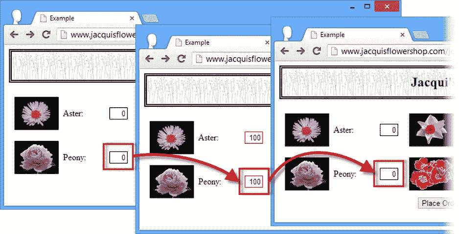

# 三十四、使用 jQuery 工具方法

jQuery 包括许多实用方法,它们对 jQuery 对象执行高级操作，或者补充 JavaScript 语言以提供编程语言中通常存在的特性。您可能永远都不需要这些方法，但是 jQuery 在内部使用它们，公开使用它们意味着当您遇到 jQuery 团队已经解决的奇怪问题时，您可以节省时间和精力。

其中一些方法应用于 jQuery 对象，一些方法针对主 jQuery 函数调用，我已经用`$`符号进行了说明(在第五章中进行了描述)。表 34-1 对本章进行了总结。

表 34-1 。章节总结

| 问题 | 解决办法 | 列表 |
| --- | --- | --- |
| 将操作排队以供以后执行。 | 使用通用队列。 | 1, 2 |
| 过滤数组的内容。 | 使用`grep`方法。 | 3, 4 |
| 确定数组是否包含特定的对象或值。 | 使用`inArray`方法。 | five |
| 投影数组的内容。 | 使用`map`方法。 | 6, 7 |
| 连接两个数组。 | 使用`merge`方法。 | eight |
| 从一个`jQuery`对象中删除重复项，并按照它们在文档中出现的顺序对它们进行排序。 | 使用`unique`方法。 | nine |
| 确定对象的类型。 | 使用`isXXX`或`type`方法。 | 10, 11 |
| 准备提交表单的内容。 | 使用`serialize`或`serializeArray`方法。 | Twelve |
| 将数据解析成更有用的形式。 | 使用`parseJSON`或`parseXML`方法。 | Thirteen |
| 从字符串中删除前导和尾随空格。 | 使用`trim`方法。 | Fourteen |
| 确定一个元素是否包含另一个元素。 | 使用`contains`方法。 | Fifteen |

重新访问队列:使用通用队列

在第十章中，我向您展示了如何使用 jQuery 效果队列来管理应用于一组元素的一连串效果。事实上，效果队列只是一个队列，这个特性是一个通用的队列，可以有更广泛的用途。表 34-2 重述了队列相关的方法，为通用目的进行了调整。

表 34-2 。队列方法

| 方法 | 描述 |
| --- | --- |
| `clearQueue(<name>)` | 移除指定队列中尚未运行的任何函数。 |
| `queue(<name>)` | 返回要对`jQuery`对象中的元素执行的函数的指定队列。 |
| `queue(<name>, function)` | 将函数添加到队列的末尾。 |
| `dequeue(<name>)` | 为`jQuery`对象中的元素删除并执行队列中的第一项。 |
| `delay(<time>, <name>)` | 在指定队列中的效果之间插入延迟。 |

当在没有指定队列名的情况下使用这些方法时，jQuery 默认为`fx`，这是用于视觉效果的队列。我可以使用任何其他队列名来创建函数队列。

当将 jQuery 队列应用于一般用途时，我使用`clearQueue`方法而不是`stop`方法–`stop`对不适于更广泛使用的 jQuery 效果有特殊支持。清单 34-1 提供了一个使用通用队列的例子。

***清单 34-1*** 。使用队列

```js
<!DOCTYPE html>
<html>
<head>
    <title>Example</title>
    <script src="jquery-2.0.2.js" type="text/javascript"></script>
    <link rel="stylesheet" type="text/css" href="styles.css"/>
    <script type="text/javascript">
        $(document).ready(function() {

            var elems = $("input");

            elems.queue("gen", function(next) {
                $(this).val(100).css("border", "thin red solid");
                next();
            });

            elems.delay(1000, "gen");

            elems.queue("gen", function(next) {
                $(this).val(0).css("border", "");
                $(this).dequeue("gen");
            });

           $("<button>Process Queue</button>").appendTo("#buttonDiv")
                .click(function(e) {
                    elems.dequeue("gen");
                    e.preventDefault();
                });

        });
    </script>
</head>
<body>
    <h1>Jacqui's Flower Shop</h1>
    <form method="post">
        <div id="oblock">
            <div class="dtable">
                <div id="row1" class="drow">
                    <div class="dcell">
                        <label for="aster">Aster:</label>
                        <input name="aster" value="0" required />
                    </div>
                    <div class="dcell">
                        <label for="daffodil">Daffodil:</label>
                        <input name="daffodil" value="0" required />
                    </div>
                    <div class="dcell">
                        <label for="rose">Rose:</label>
                        <input name="rose" value="0" required />
                    </div>
                </div>
                <div id="row2"class="drow">
                    <div class="dcell">
                        <label for="peony">Peony:</label>
                        <input name="peony" value="0" required />
                    </div>
                    <div class="dcell">
                        <label for="primula">Primula:</label>
                        <input name="primula" value="0" required />
                    </div>
                    <div class="dcell">
                        <label for="snowdrop">Snowdrop:</label>
                        <input name="snowdrop" value="0" required />
                    </div>
                </div>
            </div>
        </div>
        <div id="buttonDiv"><button type="submit">Place Order</button></div>
    </form>
</body>
</html>
```

 **提示**我在这个例子中引用的`styles.css`文件是我在本书第二部分中使用的文件。

在这个例子中，我将三个函数添加到一个名为`gen` 的队列中，该队列对文档中的`input`元素进行操作。首先，我使用`val`方法将所有的`input`值设置为`100`，使用`css`方法添加一个边框。第二，我使用 delay 方法向队列添加一秒钟的延迟。最后，我使用`val`和`css`方法将`input`元素重置为它们的初始状态。

我还在文档中添加了一个`button`，它调用了`dequeue`方法——与效果队列不同，我自己负责启动队列处理。你可以在图 34-1 中看到效果。



图 34-1 。使用通用队列

我放在队列中的函数的工作方式与事件队列中的相同，和以前一样，我负责调用`dequeue`方法或调用作为参数传递的函数。我倾向于使用函数参数——只是因为我在调用`dequeue`方法时经常忘记指定队列名，这意味着我的队列陷入停顿。

手动处理队列项目

当然，您不必从另一个函数中触发一个队列函数——您可以依靠外部触发器来`dequeue`每个项目，比如用户按下我添加到文档中的按钮。清单 34-2 展示了如何做到这一点。

***清单 34-2*** 。显式出队函数

```js
...
<script type="text/javascript">
    $(document).ready(function() {

        $("input").queue("gen", function() {
            $(this).val(100).css("border", "thin red solid");
        }).queue("gen", function() {
            $(this).val(0).css("border", "");
        }).queue("gen", function() {
            $(this).css("border", "thin blue solid");
            $("#dequeue").attr("disabled", "disabled");
        });

       $("<button id=dequeue>Dequeue Item</button>").appendTo("#buttonDiv")
            .click(function(e) {
                $("input").dequeue("gen");
                e.preventDefault();
            });
    });
</script>
...
```

在这个脚本中，我将`queue`调用链接在一起，并添加了一个函数，该函数设置所选元素的边框并禁用`button`元素，必须单击该元素才能处理队列中的每个项目——没有自动链接。

数组的实用方法

jQuery 提供了许多使用数组的有用方法——这些方法在表 34-3 中有描述。在大多数情况下，使用`HTMLElement`数组有更好的方法——只需使用标准的 jQuery 方法来处理和过滤元素。对于其他类型的数组，这些方法可能会有所帮助。

表 34-3 。使用数组的实用方法

| 方法 | 描述 |
| --- | --- |
| `$.grep(<array>, function)` `$.grep(<array>, function, <invert>)` | 基于函数过滤数组的内容。 |
| `$.inArray(<value>, <array>)` | 确定数组中是否包含特定的项。 |
| `$.map(<array>, function)` `$.map(<array>, <map>)` | 使用函数投影数组或映射对象。 |
| `$.merge(<array>, <array>)` | 将第二个数组的内容追加到第一个数组中。 |
| `$.unique(HTMLElement[])` | 将一组`HTMLElement`对象按文档顺序排序，并删除任何重复的对象。 |

使用 Grep 方法

`grep`方法允许我们找到一个数组中所有与过滤函数匹配的元素。清单 34-3 展示了这种方法。

***清单 34-3*** 。使用 Grep 方法

```js
...
<script type="text/javascript">
    $(document).ready(function() {
        var flowerArray = ["aster", "daffodil", "rose", "peony", "primula", "snowdrop"];

        var filteredArray = $.grep(flowerArray, function(elem, index) {
            return elem.indexOf("p") > -1;
        });

        for (var i = 0; i < filteredArray.length; i++) {
            console.log("Filtered element: " + filteredArray[i]);
        }  
    });
</script>
...
```

我们的过滤函数传递了两个参数——第一个是数组中的元素，第二个是该元素的数组索引。对于数组中的每一项都调用我们的函数，如果当前项包含在筛选结果中，则返回`true`。

在这个例子中，我对字符串数组使用了`grep`方法，过滤掉了那些不包含字母`p`的字符串。我将过滤后的数组的内容写入控制台，产生以下结果:

```js
Filtered element: peony
Filtered element: primula
Filtered element: snowdrop
```

您可以向`grep`方法提供一个额外的参数——如果这个参数是`true`,那么过滤过程将被反转，结果将包含该函数过滤掉的那些元素。清单 34-4 显示了这一论点的效果。

***清单 34-4*** 。使用 Grep 方法反转选择

```js
...
<script type="text/javascript">
    $(document).ready(function() {

        var flowerArray = ["aster", "daffodil", "rose", "peony", "primula", "snowdrop"];

        var filteredArray = $.grep(flowerArray, function(elem, index) {
            return elem.indexOf("p") > -1;
        },true);

        for (var i = 0; i < filteredArray.length; i++) {
            console.log("Filtered element: " + filteredArray[i]);
        }  

    });
</script>
...
```

这种变化会产生以下结果:

```js
Filtered element: aster
Filtered element: daffodil
Filtered element: rose
```

使用阵列法

`inArray`方法确定一个数组是否包含一个指定的值——如果该项在数组中，该方法返回该项的索引，否则返回`-1`。清单 34-5 展示了`inArray`方法。

***清单 34-5*** 。使用 inArray 方法

```js
...
<script type="text/javascript">
    $(document).ready(function() {
        var flowerArray = ["aster", "daffodil", "rose", "peony", "primula", "snowdrop"];
        console.log("Array contains rose: " +$.inArray("rose", flowerArray));
        console.log("Array contains lily: " +$.inArray("lily", flowerArray));
    });
</script>
...
```

这个脚本检查花的数组是否包含`rose`和`lily`。结果如下:

```js
Array contains rose: 2
Array contains lily: -1
```

使用贴图法

`map`方法使用一个函数将数组或地图对象的内容投影到一个新的数组中，使用一个函数来确定每个项目在结果中的表示方式。清单 34-6 展示了`map`方法在一个数组中的使用。

***清单 34-6*** 。使用映射方法投影数组

```js
...
<script type="text/javascript">
    $(document).ready(function() {
        var flowerArray = ["aster", "daffodil", "rose", "peony", "primula", "snowdrop"];

        var result = $.map(flowerArray, function(elem, index) {
            return index + ": " + elem;
        });

        for (var i = 0; i < result.length; i++) {
            console.log(result[i]);
        }  
     });
</script>
...
```

我们的映射函数针对数组中的每一项执行，并将该项及其在数组中的索引作为参数传递给它。函数的结果包含在由`map`方法返回的数组中。在这个脚本中，我通过连接值和索引来转换数组中的每一项，产生以下结果:

```js
0: aster
1: daffodil
2: rose
3: peony
4: primula
5: snowdrop
```

您可以使用 map 方法有选择地投影一个数组——如果您没有从函数中为正在处理的项返回值，结果中将没有相应的项。清单 34-7 显示了如何有选择地从一个数组中投影。

***清单 34-7*** 。选择性映射数组

```js
...
<script type="text/javascript">
    $(document).ready(function() {
        var flowerArray = ["aster", "daffodil", "rose", "peony", "primula", "snowdrop"];

        var result = $.map(flowerArray, function(elem, index) {
            if (elem != "rose") {
                return index + ": " + elem;
            }  
        });

        for (var i = 0; i < result.length; i++) {
            console.log(result[i]);
        }
    });
</script>
...
```

为除`rose`之外的所有数组值生成结果，这产生以下结果:

```js
0: aster
1: daffodil
3: peony
4: primula
5: snowdrop
```

使用合并方法

`merge`方法连接两个数组，如清单 34-8 所示。

***清单 34-8*** 。使用合并方法

```js
...
<script type="text/javascript">
    $(document).ready(function() {

        var flowerArray = ["aster", "daffodil", "rose", "peony", "primula", "snowdrop"];
        var additionalFlowers = ["carnation", "lily", "orchid"];

        $.merge(flowerArray, additionalFlowers);

        for (var i = 0; i < flowerArray.length; i++) {
            console.log(flowerArray[i]);
        }  
     });
</script>
...
```

第二个数组中的项被追加到第一个数组中，由第一个参数指定的数组被合并过程修改。示例中的脚本产生以下结果:

```js
aster
daffodil
rose
peony
primula
snowdrop
carnation
lily
orchid
```

使用独特的方法

`unique`方法将一组`HTMLElement`对象按照它们在文档中出现的顺序进行排序，并删除任何重复的元素。清单 34-9 展示了如何使用这个方法。

***清单 34-9*** 。使用独特的方法

```js
...
<script type="text/javascript">
    $(document).ready(function() {

        var selection = $("img[src*=rose], img[src*=primula]").get();
        $.merge(selection, $("img[src*=aster]"));
        $.merge(selection, $("img"));

        $.unique(selection);

        for (var i =0; i < selection.length; i++) {
            console.log("Elem: " + selection[i].src);
        }  

    });
</script>
...
```

排序过程就地完成，这意味着作为参数传递给`unique`方法的数组被修改。在这个例子中，我创建了一个包含重复且不按文档顺序排列的`HTMLElement`对象的数组，然后应用了`unique`方法。

类型的实用方法

jQuery 提供了一组用于确定 JavaScript 对象性质的方法——这些方法在表 34-4 中有描述。

表 34-4 。使用类型的实用方法

| 方法 | 描述 |
| --- | --- |
| `$.isArray(Object)` | 如果对象是数组，则返回`true`。 |
| `$.isEmptyObject(Object)` | 如果对象没有定义任何方法或属性，则返回`true`。 |
| `$.isFunction(Object)` | 如果对象是函数，则返回`true`。 |
| `$.isNumeric(Object)` | 如果对象是数字，则返回`true`。 |
| `$.isWindow(Object)` | 如果对象是一个`Window`，则返回`true`。 |
| `$.isXMLDoc(Object)` | 如果对象是 XML 文档，则返回`true`。 |
| `$.type(Object)` | 返回对象的内置 JavaScript 类型。 |

这些方法大多数都很简单——将一个对象传递给该方法，如果该对象是该方法检测到的类型，则该方法返回`true`,否则返回`false`。作为一个简单的演示，清单 34-10 包含了一个使用`isFunction`方法 的例子。

***清单 34-10*** 。使用 isFunction 方法

```js
...
<script type="text/javascript">
    $(document).ready(function() {

        function myFunc() {
            console.log("Hello!");
        }  

        console.log("IsFunction: " +$.isFunction(myFunc));
        console.log("IsFunction: " +$.isFunction("hello"));
    });
</script>
...
```

在这个例子中，我使用了`isFunction`方法来测试两个对象。结果如下:

```js
IsFunction: true
IsFunction: false
```

使用类型方法

`type`方法略有不同，因为它返回对象的基本 JavaScript 类型。结果将是以下字符串之一:

*   `boolean`
*   `number`
*   `string`
*   `function`
*   `array`
*   `date`
*   `regexp`
*   `object`

清单 34-11 展示了`type`方法的使用。

***清单 34-11*** 。使用类型方法

```js
...
<script type="text/javascript">
    $(document).ready(function() {

        function myFunc() {
            console.log("Hello!");
        }  

        var jq = $("img");
        var elem = document.getElementById("row1");

        console.log("Type: " +$.type(myFunc));
        console.log("Type: " +$.type(jq));
        console.log("Type: " +$.type(elem));
    });
</script>
...
```

在这个脚本中，我对一个函数、`jQuery`对象和`HTMLElement`对象使用了 type 方法。结果如下:

```js
Type: function
Type: object
Type: object
```

数据的实用方法

jQuery 定义了许多对处理各种数据有用的实用方法——这些方法在表 34-5 中有描述。

表 34-5 。处理数据的实用方法

| 方法 | 描述 |
| --- | --- |
| `serialize()` | 将一组表单元素编码成适合提交给服务器的字符串。 |
| `serializeArray()` | 将一组表单元素编码到一个数组中，准备编码到 JSON 中。 |
| `$.parseJSON(<json>)` | 从 JSON 数据创建一个 JavaScript 对象。 |
| `$.parseXML(<xml>)` | 从 XML 字符串创建一个`XMLDocument`对象。 |
| `$.trim(String)` | 移除字符串开头和结尾的所有空白。 |

序列化表单数据

`serialize`和`serializeArray`方法是一种从一组表单元素中提取细节的便捷方式，对于常规或 Ajax 表单提交非常有用。清单 34-12 展示了这两种方法的使用。

***清单 34-12*** 。序列化表单数据

```js
...
<script type="text/javascript">
    $(document).ready(function() {

       $("<button>Serialize</button>").appendTo("#buttonDiv").click(function(e) {

            var formArray = $("form").serializeArray();
            console.log("JSON: " + JSON.stringify(formArray))

            var formString = $("form").serialize();
            console.log("String: " + formString)

            e.preventDefault();
        });

    });
</script>
...
```

在本例中，我使用这两种方法序列化文档中的表单元素，并将结果写入控制台。`serializeArray`方法返回一个 JavaScript 数组，其中包含文档中每个表单元素的一个对象。这些对象有两个属性:`name`属性包含元素的`name`属性的值，而`value`属性包含元素的值。以下是示例文档的输出:

`[{"name":"aster","value":"1"},{"name":"daffodil","value":"0"}, {"name":"rose","value":"0"},{"name":"peony","value":"0"}, {"name":"primula","value":"2"},{"name":"snowdrop","value":"0"}]`

相比之下，serialize 方法创建一个编码字符串，如下所示:

```js
aster=1&daffodil=0&rose=0&peony=0&primula=2&snowdrop=0
```

解析数据

在处理 Ajax 请求的结果时，`parseJSON` 和`parseXML`方法特别有用。对于大多数 web 应用来说，JSON 已经成为首选的数据格式，原因我在第十四章中概述。XML 仍然在使用，但是我发现自己只在将新的应用与遗留的后端系统集成时使用这种 XML 数据。清单 34-13 显示了正在使用的`parseJSON`方法。

***清单 34-13*** 。解析 JSON 数据

```js
...
<script type="text/javascript">
    $(document).ready(function() {

       $("<button>Serialize</button>").appendTo("#buttonDiv").click(function(e) {

            var jsonData = '{"name": "Adam Freeman", "city": "London", "country": "UK"}'

            var dataObject = $.parseJSON(jsonData)

            for (var prop in dataObject) {
                console.log("Property: " + prop + " Value: " + dataObject[prop])
            }  

            e.preventDefault();
        });

    });
</script>
...
```

在这个例子中，我定义了一个简单的 JSON 字符串，并使用`parseJSON`方法将其转换成一个 JavaScript 对象。然后，我向控制台枚举对象中的属性及其值，生成以下输出:

```js
Property: name Value: Adam Freeman
Property: city Value: London
Property: country Value: UK
```

修剪琴弦

`trim`方法 删除字符串开头和结尾的所有空白——包括空格、制表符和换行符。这是大多数编程语言支持的特性，作为其字符数据核心处理的一部分，但是由于某种原因，JavaScript 缺少这一特性。清单 34-14 显示了正在使用的`trim`方法。

***清单 34-14*** 。使用修剪方法

```js
...
<script type="text/javascript">
    $(document).ready(function() {

       $("<button>Serialize</button>").appendTo("#buttonDiv").click(function(e) {

            var sourceString = "\n  This string contains whitespace    ";
            console.log(">" + sourceString + "<")

            var resultString = $.trim(sourceString);
            console.log(">" + resultString + "<")

            e.preventDefault();
        });

    });
</script>
...
```

在这个例子中，我使用了`trim`方法，将原始的和修整过的字符串写入控制台，产生了以下结果:

```js
>  This string contains whitespace    <
>This string contains whitespace<
```

其他实用方法

有许多 jQuery 方法并不完全属于另一个类别，但仍然是有用的——这些方法在表 34-6 中有描述。

表 34-6 。其他实用方法

| 方法 | 描述 |
| --- | --- |
| `$.contains(HTMLElement, HTMLElement)` | 如果第一个元素包含第二个元素，则返回`true`。 |
| `$.now()` | 返回当前时间，简写为`new Date().getTime()`。 |

检查元素包含

方法检查一个元素是否包含另一个元素。两个参数都表示为`HTMLElement`对象，如果第一个参数表示的元素包含第二个参数表示的元素，则该方法返回 true。清单 34-15 展示了`contains`方法。

***清单 34-15*** 。使用 Contains 方法

```js
...
<script type="text/javascript">
    $(document).ready(function() {
        $("img").hover(function(e) {
            var elem = document.getElementById("row1");
            if ($.contains(elem, this)) {
                $(e.target).css("border", e.type == "mouseenter" ?
                                            "thick solid red" : "");
            }  
        });
    });
</script>
...
```

在这个脚本中，我使用 DOM API 获得一个`HTMLElement`对象，并检查它是否包含传递给事件处理程序方法的元素——如果包含，我为触发事件的元素设置一个边框。

 **提示**这个方法只对`HTMLElement`对象有效——如果你想对`jQuery`对象执行同样的检查，那么考虑使用`find`方法，我在第六章中描述过。

摘要

在这一章中，我描述了 jQuery 工具方法——一组有用的函数，可用于对 jQuery 对象执行高级操作，或者补充 JavaScript 语言特性以提供程序员通常需要的支持。当您需要这些方法时，您很高兴它们存在，但是对于大多数 web 应用项目来说，您可以放心地忘记它们。