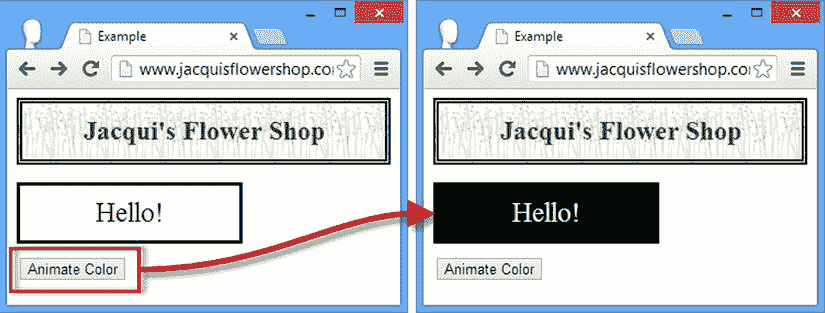
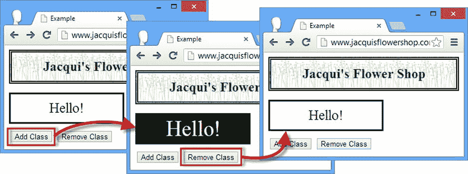
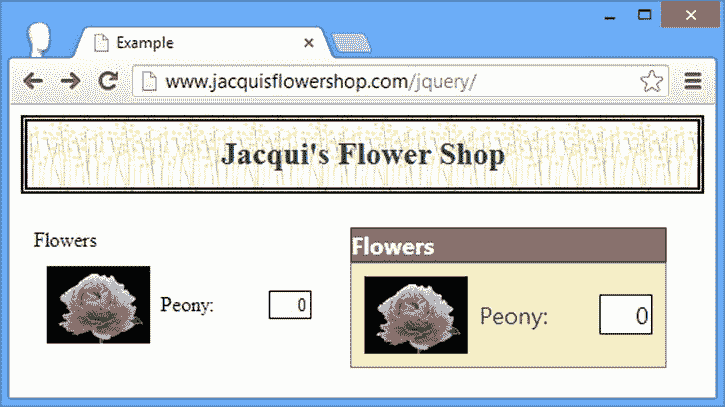
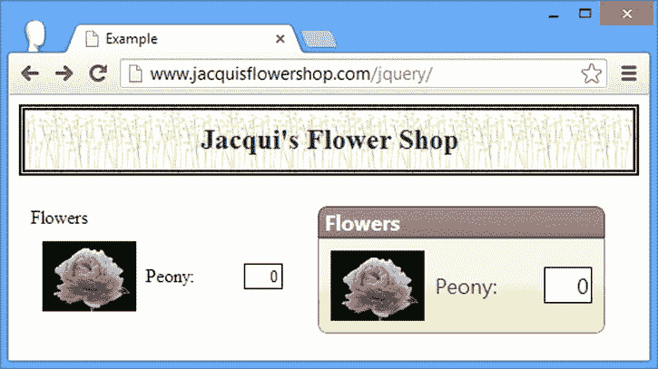
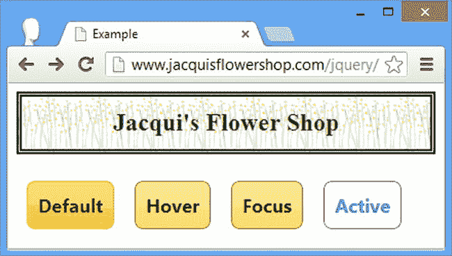
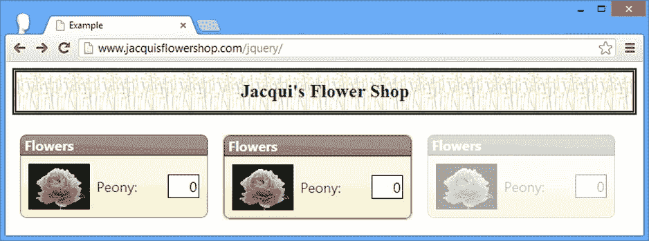
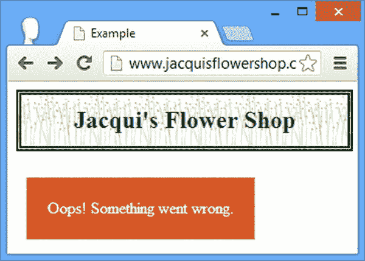

# 三十五、jQuery UI 效果和 CSS 框架

在这一章中，我描述了 jQuery UI 提供的两个实用特性。第一个是对现有 jQuery 方法的一组增强，可以动态显示颜色、元素可见性的变化以及 CSS 类的应用。另一个特性是一组 CSS 类，它们将 jQuery UI 主题应用到我们的 HTML 文档的其余部分，以便在整个 web 应用中创建一致的外观。表 35-1 对本章进行了总结。

[表 35-1](#_Tab1) 。章节总结

| 问题 | 解决办法 | 列表 |
| --- | --- | --- |
| 动画颜色变化。 | 使用增强的`animate`方法。 | one |
| 动画类的应用。 | 使用增强的`addClass`、`removeClass`和`toggleClass`方法以及`switchClass`方法。 | 2, 3 |
| 动画显示可见性转换。 | 使用增强的`show`、`hide`和`toggle`方法。 | four |
| 在不改变元素可见性的情况下应用效果。 | 使用`effect`方法。 | five |
| 将元素样式化为小部件。 | 使用小部件容器类。 | six |
| 对元素应用圆角。 | 使用角类。 | seven |
| 将可点击小部件的样式应用于元素。 | 使用交互状态类。 | eight |
| 向用户提供关于元素状态的提示。 | 使用提示类。 | 9, 10 |

使用 jQuery UI 效果

jQuery UI 扩展了一些核心的 jQuery 方法来为一个元素制作不同过渡的动画——从颜色变化的动画到 CSS 类的应用。如果小心使用的话，这些对于 web 应用来说是很有价值的补充，为了补充这些特性，jQuery UI 还定义了一些额外的动画效果。

动画颜色

jQuery UI 扩展了 jQuery `animate`方法，我在[第 10 章](10.html)中描述过，增加了对动画颜色的支持。您可以将定义元素颜色的多个 CSS 属性之一制作成动画。[表 35-2](#Tab2) 描述了`animate`方法支持的 CSS 属性。

[表 35-2](#_Tab2) 。jQuery UI Animate 方法支持的 CSS 属性

| 财产 | 描述 |
| --- | --- |
| `backgroundColor` | 设置元素的背景色。 |
| `borderTopColor``borderBottomColor``borderLeftColor`T3】 | 设置元素边框各边的颜色。 |
| `color` | 设置元素的文本颜色。 |
| `outlineColor` | 设置轮廓的颜色，用于强调元素。 |

若要制作颜色动画，请将 map 对象作为参数传递给 animate 方法，详细说明要制作动画的属性和目标值。清单 35-1 包含了一个例子。

***[清单 35-1](#_list1)*** 。动画颜色

```js
<!DOCTYPE html>
<html>
<head>
    <title>Example</title>
    <script src="jquery-2.0.2.js" type="text/javascript"></script>
    <script src="jquery-ui-1.10.3.custom.js" type="text/javascript"></script>
    <link rel="stylesheet" type="text/css" href="styles.css"/>
    <link rel="stylesheet" type="text/css" href="jquery-ui-1.10.3.custom.css"/>
    <style type="text/css">
        #animTarget {
            background-color: white;
            color: black;
            border: medium solid black;
            width: 200px; height: 50px;
            text-align: center;
            font-size: 25px;
            line-height: 50px;
            display: block;
            margin-bottom: 10px;
        }
    </style>
    <script type="text/javascript">
        $(document).ready(function() {
            $("button").click(function() {
                $("#animTarget").animate({
                    backgroundColor: "black",
                    color: "white"
                })
            })
        });
    </script>
</head>
<body>
    <h1>Jacqui's Flower Shop</h1>

    <div id=animTarget>
        Hello!
    </div>

    <button>Animate Color</button>
</body>
</html>
```

我设计了这个文档中的`div`元素的样式，使它的初始背景颜色为`white`，颜色为`black`。当单击文档中的按钮时，我调用 animate 方法，指定将这些属性分别更改为`black`和`white`。从一种颜色到另一种颜色的过渡是逐渐完成的，两种属性同时激活。在[图 35-1](#Fig1) 中可以看到效果。



[图 35-1](#_Fig1) 。动画颜色

 **提示**注意，我在`style`元素中使用了标准的 CSS 属性名，例如–`background-color`。但是当在 map 对象中指定相同的属性时，我改用了 camel case—`backgroundColor`。这允许我将 CSS 属性指定为 JavaScript 对象属性，而不必用引号将该术语括起来。

在这个例子中，我使用 CSS 颜色简写值`black`和`white`指定了我想要的颜色。有许多颜色的简写值，但是`animate`方法也将接受十六进制颜色(例如`#FFFFFF`)和 RGB 函数颜色，例如`rgb(255, 255, 255)`。

 **提示**除了对颜色属性的支持，你还可以使用`animate`方法，就像我在[第 10 章](10.html)中描述的那样。

动画类

jQuery UI 提供了一种使用类来制作 CSS 属性集动画的便捷方式。您只需在一个类中定义属性和值，并告诉 jQuery UI 将该类添加到一个或多个元素中，而不是指定每个属性。jQuery UI 将动画显示从一种状态到另一种状态的转换。清单 35-2 提供了一个演示。

***[清单 35-2](#_list2)*** 。使用类制作动画

```js
<!DOCTYPE html>
<html>
<head>
    <title>Example</title>
    <script src="jquery-2.0.2.js" type="text/javascript"></script>
    <script src="jquery-ui-1.10.3.custom.js" type="text/javascript"></script>
    <link rel="stylesheet" type="text/css" href="styles.css"/>
    <link rel="stylesheet" type="text/css" href="jquery-ui-1.10.3.custom.css"/>
    <style type="text/css">
        .elemClass {
            background-color: white;
            color: black;
            border: medium solid black;
            width: 200px; height: 50px;
            text-align: center;
            font-size: 25px;
            line-height: 50px;
            display: block;
            margin-bottom: 10px;
        }
        .myClass {
            font-size: 40px; background-color: black; color: white;
        }
    </style>
    <script type="text/javascript">
        $(document).ready(function() {

            $("button").click(function() {
                if (this.id == "add") {
                    $("#animTarget").addClass("myClass", "fast")
                } else {
                    $("#animTarget").removeClass("myClass", "fast")
                }
            })
        });
    </script>
</head>
<body>
    <h1>Jacqui's Flower Shop</h1>

    <div id=animTargetclass="elemClass">
        Hello!
    </div>

    <button id="add">Add Class</button>
    <button id="remove">Remove Class</button>
</body>
</html>
```

同样，jQuery UI 扩展了现有的 jQuery 方法来添加功能。在这种情况下，增强的是`addClass`和`removeClass`方法。我在[第 8 章](08.html)中描述了这些方法的标准版本。jQuery UI 版本做了完全相同的事情:方法的第二个参数是 duration，jQuery UI 动画显示了从一个类到另一个类的转换。

在这个例子中，我定义了一个名为`myClass`的类，文档中有按钮使用`fast`的持续时间简写来添加和删除这个类。你可以在[图 35-2](#Fig2) 中看到效果。



[图 35-2](#_Fig2) 。使用类制作元素动画

 **提示**应用标准的 CSS 样式级联规则，这意味着只有当一个类对于一个或多个目标元素是最特定的时，该类中的属性才会被应用。在前一个例子中，我通过`id`设置了元素的初始状态，但是在这个例子中，我使用了一个类，这样我的修改就生效了。CSS 样式层叠的细节见[第三章](03.html)。

jQuery UI 还增强了`toggleClass`方法——这与我在[第 8 章](08.html)中描述的标准`toggleClass`方法的工作方式相同，但是采用了一个持续时间参数并使过渡动画化，就像上面的`addClass`和`removeClass`示例一样。

切换类别

除了增强一些标准方法之外，jQuery UI 还定义了`switchClass`方法，该方法删除一个类并添加另一个类，以动画形式显示从一种状态到另一种状态的转换。清单 35-3 包含了一个演示。

***[清单 35-3](#_list3)*** 。使用 switchClass 方法

```js
<!DOCTYPE html>
<html>
<head>
    <title>Example</title>
    <script src="jquery-2.0.2.js" type="text/javascript"></script>
    <script src="jquery-ui-1.10.3.custom.js" type="text/javascript"></script>
    <link rel="stylesheet" type="text/css" href="styles.css"/>
    <link rel="stylesheet" type="text/css" href="jquery-ui-1.10.3.custom.css"/>
    <style type="text/css">
        .elemClass {
            border: medium solid black;
            width: 200px; height: 50px;
            text-align: center;
            line-height: 50px;
            display: block;
            margin-bottom: 10px;
        }
        .classOne {
            font-size: 25px; background-color: white; color: black;
        }
        .classTwo {
            font-size: 40px; background-color: black; color: white;
        }
    </style>
    <script type="text/javascript">
        $(document).ready(function() {

            $("button").click(function() {
                $("#animTarget").switchClass("classOne", "classTwo", "fast")
            })
        });
    </script>
</head>
<body>
    <h1>Jacqui's Flower Shop</h1>

    <div id=animTarget class="elemClass classOne">
        Hello!
    </div>
    <button>Switch Class</button>
</body>
</html>
```

`switchClass`方法的参数是应该删除的类、应该添加的类和动画的持续时间。在这个例子中，我的两个类定义了相同的属性，但是这并不是必须的。

使用 jQuery UI 动画

jQuery UI 包括许多可以应用于元素的动画效果，就像第 10 章中的核心 jQuery 效果一样。我的建议是谨慎使用这些效果。精心制作的动画可以真正提升用户体验——但通常情况下，它们会成为用户烦恼和沮丧的来源。有许多不同的动画效果，包括`blind`、`bounce`、`clip`、`drop`、`explode`、`fade`、`fold`、`highlight`、`puff`、`pulsate`、`scale`、`shake`、`size`和`slide`。

 **注意**在这一章中，我将向你展示如何应用这些效果，但我不打算深入每个单独效果的细节。在`http://docs.jquery.com/UI/Effects`有一个很好的效果总结和可以应用到其中一些效果的设置。

使用效果来显示和隐藏元素

jQuery UI 增强了 jQuery UI 的`show`、`hide,`和`toggle`方法来应用动画效果。我在第 10 章中描述了这些方法的最初版本。要使用这些方法的增强 jQuery UI 版本，请提供附加参数，指定您想要使用的效果以及应用该效果的持续时间。清单 35-4 显示了这些增强方法的使用。

***[清单 35-4](#_list4)*** 。使用增强的显示、隐藏和切换方法

```js
<!DOCTYPE html>
<html>
<head>
    <title>Example</title>
    <script src="jquery-2.0.2.js" type="text/javascript"></script>
    <script src="jquery-ui-1.10.3.custom.js" type="text/javascript"></script>
    <link rel="stylesheet" type="text/css" href="styles.css"/>
    <link rel="stylesheet" type="text/css" href="jquery-ui-1.10.3.custom.css"/>
    <style type="text/css">
        .elemClass {
            font-size: 25px; background-color: white; color: black;
            border: medium solid black; width: 200px; height: 50px;
            text-align: center; line-height: 50px; display: block; margin-bottom: 10px;
        }
    </style>
    <script type="text/javascript">
        $(document).ready(function() {

            $("button").click(function() {
                switch (this.id) {
                    case "show":
                        $("#animTarget").show("fold", "fast");
                        break;
                    case "hide":
                        $("#animTarget").hide("fold", "fast");
                        break;
                    case "toggle":
                        $("#animTarget").toggle("fold", "fast");
                        break;
                }
            })
        });
    </script>
</head>
<body>
    <h1>Jacqui's Flower Shop</h1>

    <button id="hide">Hide</button>
    <button id="show">Show</button>
    <button id="toggle">Toggle</button>

    <div id=animTarget class="elemClass">
        Hello!
    </div>
</body>
</html>
```

在这个例子中有三个按钮，点击它们会导致调用`show`、`hide,`或`toggle`方法。对于所有三个按钮，我已经指定了应该应用`fold`动画，使用`fast`持续时间。除了转换是动态的之外，这些方法的工作方式与核心 jQuery 类似。

应用独立效果

jQuery UI 定义了`effect`方法，它允许我们将动画应用到元素上，而不必显示或隐藏它。当使用正确的动画时，这是吸引用户注意文档中某个元素的有效方法。清单 35-5 包含了一个例子。

***[清单 35-5](#_list5)*** 。使用效果方法

```js
<!DOCTYPE html>
<html>
<head>
    <title>Example</title>
    <script src="jquery-2.0.2.js" type="text/javascript"></script>
    <script src="jquery-ui-1.10.3.custom.js" type="text/javascript"></script>
    <link rel="stylesheet" type="text/css" href="styles.css"/>
    <link rel="stylesheet" type="text/css" href="jquery-ui-1.10.3.custom.css"/>
    <style type="text/css">
        .elemClass {
            font-size: 25px; background-color: white; color: black;
            border: medium solid black; width: 200px; height: 50px;
            text-align: center; line-height: 50px; display: block; margin-bottom: 10px;
        }
    </style>
    <script type="text/javascript">
        $(document).ready(function() {

            $("button").click(function() {
                $("#animTarget").effect("pulsate", "fast")
            })
        });
    </script>
</head>
<body>
    <h1>Jacqui's Flower Shop</h1>

    <div id=animTarget class="elemClass">
        Hello!
    </div>
    <button>Effect</button>
</body>
</html>
```

当这个例子中的按钮被点击时，效果被就地应用，而不会对可见性有任何永久的改变。在这种情况下，我使用了`pulsate`效应，它导致元素脉冲打开和关闭。

使用 jQuery UI CSS 框架

jQuery UI 通过将一组类应用于应用一些复杂 CSS 样式的元素来管理小部件的外观。其中一些类向程序员公开，这样不属于小部件的元素就可以以一致的方式进行样式化——我在本书第四部分的例子中使用了其中一些类。

使用小部件容器类

CSS 框架中三个最基本的类应用了小部件上使用的核心样式。这些类别在[表 35-3](#Tab3) 中描述。

[表 35-3](#_Tab3) 。jQuery UI 小部件容器类

| 班级 | 描述 |
| --- | --- |
| `ui-widget` | 应用于所有容器元素。 |
| `ui-widget-header` | 应用于标题容器元素。 |
| `ui-widget-content` | 应用于内容容器元素。 |

这些类被应用于*容器*元素——也就是那些包含所有头和内容元素的元素(或者，在`ui-widget`的情况下，最外层的元素)。清单 35-6 展示了如何应用这些类。

***[清单 35-6](#_list6)*** 。使用 jQuery UI 小部件容器类

```js
<!DOCTYPE html>
<html>
<head>
    <title>Example</title>
    <script src="jquery-2.0.2.js" type="text/javascript"></script>
    <script src="jquery-ui-1.10.3.custom.js" type="text/javascript"></script>
    <link rel="stylesheet" type="text/css" href="styles.css"/>
    <link rel="stylesheet" type="text/css" href="jquery-ui-1.10.3.custom.css"/>
    <style type="text/css">
        body > div {float: left; margin: 10px}
    </style>
</head>
<body>
    <h1>Jacqui's Flower Shop</h1>

    <div>
        <div>
            Flowers
        </div>
        <div>
            <div class="dcell">
                <label for="peony">Peony:</label>
                <input name="peony" value="0" />
            </div>
        </div>
    </div>

    <div class="ui-widget">
        <div class="ui-widget-header">
            Flowers
        </div>
        <div class="ui-widget-content">
            <div class="dcell">
                <label for="peony">Peony:</label>
                <input name="peony" value="0" />
            </div>
        </div>
    </div>
</body>
</html>
```

在这个例子中有两组元素，其中一组我已经应用了容器类。你可以在[图 35-3](#Fig3) 中看到效果。



[图 35-3](#_Fig3) 。应用 jQuery UI 小部件容器类

应用圆角

下一组 CSS 框架类让我们将圆角应用于类似小部件的元素。表 35-4 描述了这一类别中的等级。

[表 35-4](#_Tab4) 。jQuery UI 小部件圆角类

| 班级 | 描述 |
| --- | --- |
| `ui-corner-all` | 将元素的所有角变圆。 |
| `ui-corner-bl` | 圆角左下角。 |
| `ui-corner-bottom` | 使左下角和右下角变圆。 |
| `ui-corner-br` | 倒圆角。 |
| `ui-corner-left` | 使左上角和左下角变圆。 |
| `ui-corner-right` | 倒圆角右上角和右下角。 |
| `ui-corner-tl` | 圆角左上角。 |
| `ui-corner-top` | 将左上角和右上角倒圆角。 |
| `ui-corner-tr` | 圆角右上角。 |

这些类只有在元素有背景或边距时才有效，这意味着它们可以应用于`ui-widget-header`和`ui-widget-content`类，如[清单 35-7](#list7) 所示。

***[清单 35-7](#_list7)*** 。使用圆角类别

```js
<!DOCTYPE html>
<html>
<head>
    <title>Example</title>
    <script src="jquery-2.0.2.js" type="text/javascript"></script>
    <script src="jquery-ui-1.10.3.custom.js" type="text/javascript"></script>
    <link rel="stylesheet" type="text/css" href="styles.css"/>
    <link rel="stylesheet" type="text/css" href="jquery-ui-1.10.3.custom.css"/>
    <style type="text/css">
        body > div {float: left; margin: 10px}
    </style>
</head>
<body>
    <h1>Jacqui's Flower Shop</h1>

    <div>
        <div>
            Flowers
        </div>
        <div>
            <div class="dcell">
                <label for="peony">Peony:</label>
                <input name="peony" value="0" />
            </div>
        </div>
    </div>

    <div class="ui-widget">
        <div class="ui-widget-headerui-corner-top"style="padding-left: 5px">
            Flowers
        </div>
        <div class="ui-widget-contentui-corner-bottom">
            <div class="dcell">
                <label for="peony">Peony:</label>
                <input name="peony" value="0" />
            </div>
        </div>
    </div>
</body>
</html>
```

为了创造一个整体效果，我把 header 元素的顶角和 content 元素的底角弄圆了。你可以在[图 35-4](#Fig4) 中看到结果。请注意，我在 header 元素中添加了一些填充——圆角应用于元素的内容框中，这可能需要一些额外的空间来避免剪切内容。



[图 35-4](#_Fig4) 。对元素应用圆角

使用交互状态类

您还可以应用 CSS 框架类来显示不同的交互状态，这允许创建以与 jQuery UI 小部件相同的方式响应用户交互的元素。表 35-5 描述了可用的等级。

[表 35-5](#_Tab5) 。jQuery UI 交互类

| 班级 | 描述 |
| --- | --- |
| `ui-state-default` | 应用可点击小工具的默认样式。 |
| `ui-state-hover` | 应用鼠标悬停在可点击小工具上时使用的样式。 |
| `ui-state-focus` | 应用可点击小工具获得焦点时使用的样式。 |
| `ui-state-active` | 应用可点击小工具活动时使用的样式。 |

清单 35-8 应用了这四个类。请注意，在每种情况下，我都将填充应用于内部的`span`元素。交互状态类定义填充值，在容器元素和内容之间创建间距的最简单方法是将内部元素作为目标。

***[清单 35-8](#_list8)*** 。应用交互状态类

```js
<!DOCTYPE html>
<html>
<head>
    <title>Example</title>
    <script src="jquery-2.0.2.js" type="text/javascript"></script>
    <script src="jquery-ui-1.10.3.custom.js" type="text/javascript"></script>
    <link rel="stylesheet" type="text/css" href="styles.css"/>
    <link rel="stylesheet" type="text/css" href="jquery-ui-1.10.3.custom.css"/>
    <style type="text/css">
        body > div {float: left; margin: 10px}
        span {padding: 10px; display: block}
    </style>
</head>
<body>
    <h1>Jacqui's Flower Shop</h1>

    <div class="ui-widgetui-state-defaultui-corner-all">
        <span>Default</span>
    </div>
    <div class="ui-widgetui-state-hoverui-corner-all">
        <span>Hover</span>
    </div>
    <div class="ui-widgetui-state-focusui-corner-all">
        <span>Focus</span>
    </div>
    <div class="ui-widgetui-state-activeui-corner-all">
        <span>Active</span>
    </div>
</body>
</html>
```

你可以在[图 35-5](#Fig5) 中看到每个职业的效果。其中一些状态在我正在使用的 jQuery UI 主题中是相似的，但是如果需要的话，你可以使用 ThemeRoller(在[第 17 章](17.html)中描述)来创建一个增加了状态强调的主题。



[图 35-5](#_Fig5) 。交互状态类的效果

使用提示类

一些 CSS 框架类允许我们向用户提供关于文档中元素状态的提示。这些类别在[表 35-6](#Tab6) 中描述。

[表 35-6](#_Tab6) 。jQuery UI 交互提示类

| 班级 | 描述 |
| --- | --- |
| `ui-state-highlight` | 突出显示一个元素以吸引用户的注意。 |
| `ui-state-error` | 强调包含错误信息的元素。 |
| `ui-state-disabled` | 将禁用的样式应用于元素(但实际上并不禁用元素本身)。 |

清单 35-9 显示了高亮和禁用提示的使用。

***[清单 35-9](#_list9)*** 。使用 jQuery UI 高亮显示类

```js
<!DOCTYPE html>
<html>
<head>
    <title>Example</title>
    <script src="jquery-2.0.2.js" type="text/javascript"></script>
    <script src="jquery-ui-1.10.3.custom.js" type="text/javascript"></script>
    <link rel="stylesheet" type="text/css" href="styles.css"/>
    <link rel="stylesheet" type="text/css" href="jquery-ui-1.10.3.custom.css"/>
    <style type="text/css">
        body > div {float: left; margin: 10px}
        span {padding: 10px; display: block}
    </style>
</head>
<body>
    <h1>Jacqui's Flower Shop</h1>

    <div class="ui-widget">
        <div class="ui-widget-header ui-corner-top" style="padding-left: 5px">
            Flowers
        </div>
        <div class="ui-widget-content ui-corner-bottom">
            <div class="dcell">
                <label for="peony">Peony:</label>
                <input name="peony" value="0" />
            </div>
        </div>
    </div>

    <div class="ui-widgetui-state-highlight ui-corner-all">
        <div class="ui-widget-header ui-corner-top" style="padding-left: 5px">
            Flowers
        </div>
        <div class="ui-widget-content ui-corner-bottom">
            <div class="dcell">
                <label for="peony">Peony:</label>
                <input name="peony" value="0" />
            </div>
        </div>
    </div>

    <div class="ui-widgetui-state-disabled">
        <div class="ui-widget-header ui-corner-top" style="padding-left: 5px">
            Flowers
        </div>
        <div class="ui-widget-content ui-corner-bottom">
            <div class="dcell">
                <label for="peony">Peony:</label>
                <input name="peony" value="0" />
            </div>
        </div>
    </div>
</body>
</html>
```

你可以在[图 35-6](#Fig6) 中看到这些类的效果。注意，在使用`ui-state-highlight`类时，我也应用了`ui-corner-all`样式。这个类应用了一个边框，默认情况下显示为方形的角。如果子元素有圆角，那么您也需要将突出显示的元素圆角化。



[图 35-6](#_Fig6) 。应用突出显示提示类

清单 35-10 显示了错误状态的使用。

***[清单 35-10](#_list10)*** 。使用错误提示

```js
<!DOCTYPE html>
<html>
<head>
    <title>Example</title>
    <script src="jquery-2.0.2.js" type="text/javascript"></script>
    <script src="jquery-ui-1.10.3.custom.js" type="text/javascript"></script>
    <link rel="stylesheet" type="text/css" href="styles.css"/>
    <link rel="stylesheet" type="text/css" href="jquery-ui-1.10.3.custom.css"/>
    <style type="text/css">
        body > div {float: left; margin: 10px; padding: 20px}
    </style>
</head>
<body>
    <h1>Jacqui's Flower Shop</h1>

    <div class="ui-state-error">
        Oops! Something went wrong.
    </div>
</body>
</html>
```

你可以在[图 35-7](#Fig7) 中看到效果。



[图 35-7](#_Fig7) 。使用错误提示类

摘要

在这一章中，我描述了 jQuery UI 为颜色、可见性的动画转换提供的增强。和 CSS 类。这些都是有用的特性，但是必须小心使用，避免给用户带来干扰和恼人的效果。我还描述了 jQuery UI CSs 框架的主要类，它允许我们以与 jQuery UI 小部件一致的方式设计元素，允许我们将 jQuery UI 主题的外观扩展到 HTML 文档的其余部分。