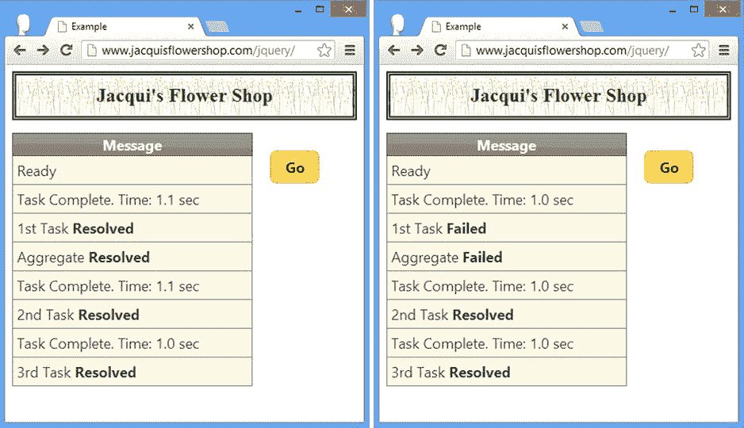

# 三十六、使用延迟对象

在本书中，你已经看到了依赖于*回调*的例子——你提供一个函数，当事情发生时执行这个函数。一个很好的例子就是处理事件的方式，使用像`click`这样的方法，将一个函数作为参数传入。在用户触发事件之前，函数中的代码语句不会被执行——直到那时，我们的函数才处于休眠状态。

*延迟对象*是 jQuery 术语，指的是对回调使用方式的一系列增强。当使用延迟对象时，回调可以用于任何情况，而不仅仅是事件；它们提供了许多选项，并控制何时以及如何执行回调函数。

在本章中，我将从一个相当简单的例子开始，然后在此基础上展示管理延迟对象和后台任务的特性和一些有用的模式。

我说*合理*简单，因为使用延迟对象将我们带入了*异步*或*并行*编程的世界。有效的并行编程是一项很难掌握的技能，JavaScript 使它变得更加困难，因为它缺少其他语言(如 Java 和 C#)中存在的一些高级特性。大多数项目不需要使用延迟对象，如果您是并行编程的新手，我建议您跳过这一章，直到您正在从事一个需要延迟对象的项目。表 36-1 提供了本章的总结。

表 36-1 。章节总结

| 问题 | 解决办法 | 列表 |
| --- | --- | --- |
| 使用延迟对象的基本功能。 | 使用 done 方法注册一个`callback`函数。调用`resolve`方法来触发回调。 | one |
| 对后台任务使用延迟对象。 | 使用`setTimeout`函数创建一个后台任务，并在任务完成时调用`resolve`方法。 | 2-4 |
| 表示任务失败。 | 使用`reject`方法触发使用`fail`方法注册的处理程序。 | 5, 6 |
| 在单个方法调用中注册两个延迟对象结果的处理程序。 | 使用`then`方法。 | seven |
| 指定一个将被执行的函数，不管被延迟的对象是`resolved`还是`rejected`。 | 使用`always`方法。 | eight |
| 对相同的结果使用多个回调。 | 多次调用注册方法或以逗号分隔的参数形式传递函数。 | nine |
| 创建一个延迟对象，其结果由其他延迟对象的结果决定。 | 使用`when`方法。 | Ten |
| 发出任务进度信号。 | 调用`notify`方法，这将触发已经使用`progress`方法注册的回调处理程序。 | 11, 12 |
| 获取有关延迟对象状态的信息。 | 使用`state`方法。 | Thirteen |
| 使用 Ajax 承诺。 | 像对待延迟对象一样对待来自 jQuery Ajax 方法的响应。 | Fourteen |

第一延迟对象示例

我将从展示延迟对象如何工作开始，然后展示如何使用它们。清单 36-1 是一个包含延迟对象的简单例子。

***清单 36-1*** 。一个简单的延迟对象示例

```js
<!DOCTYPE html>
<html>
<head>
    <title>Example</title>
    <script src="jquery-2.0.2.js" type="text/javascript"></script>
    <script src="jquery-ui-1.10.3.custom.js" type="text/javascript"></script>
    <link rel="stylesheet" type="text/css" href="styles.css"/>
    <link rel="stylesheet" type="text/css" href="jquery-ui-1.10.3.custom.css"/>
    <style type="text/css">
        td {text-align: left; padding: 5px}
        table {width: 200px; border-collapse: collapse; width: 50%; float: left}
        #buttonDiv {width: 15%; text-align: center; margin: 20px; float: left}
    </style>
    <script type="text/javascript">
        $(document).ready(function() {
            var def = $.Deferred();

            def.done(function() {
                displayMessage("Callback Executed");
            })

            $("button").button().click(function() {
                def.resolve();
            })

            displayMessage("Ready")
        })

        function displayMessage(msg) {
            $("tbody").append("<tr><td>" + msg + "</td></tr>")
        }
    </script>
</head>
<body>
    <h1>Jacqui's Flower Shop</h1>

    <table class="ui-widget" border=1>
        <thead class="ui-widget-header">
            <tr><th>Message</th></tr>
        </thead>
        <tbody class="ui-widget-content">
        </tbody>
    </table>

    <div id="buttonDiv">
        <button>Go</button>
    </div>
</body>
</html>
```

这是一个延迟对象如何工作的简单演示。我将一步一步地介绍它，为本章的其余部分设置背景。首先，我通过调用`$.Deferred`方法创建了一个延迟对象，如下所示:

```js
...
var def = $.Deferred();
...
```

`Deferred`方法返回一个延迟对象——我已经将这个对象赋给了名为`def`的变量。延迟对象都是关于回调的，所以我的下一步是使用`done`方法向延迟对象注册一个函数，就像这样:

```js
...
def.done(function() {
    displayMessage("Callback Executed");
})
...
```

当它被执行时，回调函数将调用`displayMessage`函数，该函数向文档中的`table`元素添加一行。

最后一步是进行设置，这样我就可以触发回调函数，这是通过调用`resolve`方法来完成的。像这样触发回调被称为*解析延迟对象*。我希望能够控制延迟对象何时被解析，所以我在文档中添加了一个按钮，并使用`click`方法来处理一个事件。具有讽刺意味的是，我使用一种回调机制来帮助描述另一种机制——出于本章的目的，我希望您忽略事件系统，并关注这样一个事实，即延迟的对象在按钮被按下之前不会被解析。下面是调用`resolve`并触发用`done`方法注册的回调函数的函数:

```js
...
$("button").button().click(function() {
    def.resolve();
})
...
```

在 resolve 方法被调用之前，被延迟的对象保持*未被解析*，并且我们的回调函数不会被执行。按下按钮解析被延迟的对象，执行回调，并在表格中显示消息，如图图 36-1 所示。


图 36-1 。解析延迟的对象

这里需要理解的重要一点是，延迟对象没有做任何特殊的事情。我们使用`done`方法注册了一个回调函数，在调用`resolve`方法之前它们不会被执行。在这个例子中，延迟的对象直到按钮被点击后才被解析，这时回调函数被执行，一条新消息被添加到`table`元素中。

理解延迟对象为什么有用

当您希望在某个任务结束时执行函数，而不必直接监视该任务时，延迟对象非常有用——尤其是当该任务正在后台执行时。清单 36-2 包含了一个演示，我将开始修改它以增加特性。

***清单 36-2*** 。对长期任务使用回调

```js
...
<script type="text/javascript">
    $(document).ready(function() {
        var def = $.Deferred();

        def.done(function() {
            displayMessage("Callback Executed");
        })

        function performLongTask() {

            var start = $.now();

            var total = 0;
            for (var i = 0; i < 500000000 ; i++) {
                total += i;
            }
            var elapsedTime = (($.now() - start)/1000).toFixed(1)
            displayMessage("Task Complete. Time: " + elapsedTime + " sec")
            def.resolve();
        }

        $("button").button().click(function() {
            displayMessage("Calling performLongTask()")
            performLongTask()
            displayMessage("performLongTask() Returned")
        })

        displayMessage("Ready")
    })

    function displayMessage(msg) {
        $("tbody").append("<tr><td>" + msg + "</td></tr>")
    }
</script>
...
```

本例中的过程是由`performLongTask`函数定义的，它将一系列数字加在一起——我想要一些简单的东西，只需几秒钟就能完成，这符合要求。

 **提示**在我的系统上，`performLongTask`函数中的`for`循环大约需要 0.5 秒才能完成，但是您可能需要调整循环的上限，以便在您的系统上获得类似的结果。对于这些例子来说，4-5 秒是一个很好的持续时间，足够演示延迟对象的特性，但又不至于长到让您有时间在等待任务完成的同时煮咖啡。

现在点击按钮调用`performLongTask`功能。该函数在其工作完成时调用延迟对象的`resolve`方法，从而导致回调函数被调用。`performLongTask`函数在调用`resolve`之前将自己的消息添加到`table`元素中，因此我们可以通过脚本看到进程的顺序。你可以在图 36-2 中看到结果。


图 36-2 。使用延迟对象观察任务完成情况

这是一个*同步*任务的例子。你按下按钮，然后等待每个被调用的函数完成。当`performLongTask`功能工作时，`Go`按钮保持按下状态的方式是同步工作的最佳标志。决定性的证据来自于图 36-2 中显示的消息序列——来自点击事件处理程序的消息出现在来自`performLongTask`和回调函数的消息之前和之后。

延迟对象的主要好处来自于处理*异步*任务——在后台执行的任务。你不希望用户界面像上一个例子那样被锁住；因此，取而代之的是，您在后台启动任务，密切关注它们，并更新文档以向用户提供有关工作进度和结果的信息。

启动后台任务最简单的方法是使用`setTimeout`函数，这意味着使用另一种回调机制。这可能看起来有点奇怪，但是 JavaScript 缺少管理异步任务的语言工具，而其他语言都是用这种工具设计的，所以我们只能用那些可用的功能来凑合。清单 36-3 显示了修改后的例子，使得`performLongTask`函数中耗时的部分在后台完成。

***清单 36-3*** 。异步执行工作

```js
...
<script type="text/javascript">
    $(document).ready(function() {
        var def = $.Deferred();

        def.done(function() {
            displayMessage("Callback Executed");
        })

        function performLongTask() {
            setTimeout(function() {
                var start = $.now();

                var total = 0;
                for (var i = 0; i < 500000000 ; i++) {
                    total += i;
                }
                var elapsedTime = (($.now() - start)/1000).toFixed(1)
                displayMessage("Task Complete. Time: " + elapsedTime + " sec")
                def.resolve();
            }, 10);
        }

        $("button").button().click(function() {
            displayMessage("Calling performLongTask()")
            performLongTask()
            displayMessage("performLongTask() Returned")
        })

        displayMessage("Ready")
    })

    function displayMessage(msg) {
        $("tbody").append("<tr><td>" + msg + "</td></tr>")
    }
</script>
...
```

我使用`setTimeout`函数在 10 毫秒的延迟后执行`performLongTask`函数中的`for`循环。你可以在图 36-3 中看到它的效果——注意来自点击处理函数的消息出现在来自`performLongTask`和回调函数的消息之前。如果您自己运行这个示例，您会注意到按钮会立即弹回正常状态，而不是等待工作完成。


图 36-3 。在后台执行任务

回调在处理后台任务时尤为重要，因为你不知道它们何时完成。你可以建立自己的信号系统——例如，更新一个变量——但是你需要为每一个执行的后台任务做这件事，这很快就会变得令人厌倦并且容易出错。延迟对象提供了一种标准化的机制来指示任务已经完成，正如我将在后面的例子中演示的，它们在如何完成任务方面提供了很大的灵活性。

整理示例

在我开始深入研究延迟对象的特性之前，我将更新这个例子以使用我在实际项目中使用的模式。这纯粹是个人喜好，但是我喜欢将工作负载从异步包装器中分离出来，并将延迟对象的产生集成到函数中。清单 36-4 显示了这些变化。

***清单 36-4*** 。整理示例

```js
<!DOCTYPE html>
<html>
<head>
    <title>Example</title>
    <script src="jquery-2.0.2.js" type="text/javascript"></script>
    <script src="jquery-ui-1.10.3.custom.js" type="text/javascript"></script>
    <link rel="stylesheet" type="text/css" href="styles.css"/>
    <link rel="stylesheet" type="text/css" href="jquery-ui-1.10.3.custom.css"/>
    <style type="text/css">
        td {text-align: left; padding: 5px}
        table {width: 200px; border-collapse: collapse; float: left; width: 300px}
        #buttonDiv {text-align: center; margin: 20px; float: left}
    </style>
    <script type="text/javascript">
        $(document).ready(function() {

            function performLongTaskSync() {
                var start = $.now();

                var total = 0;
                for (var i = 0; i < 500000000 ; i++) {
                    total += i;
                }
                var elapsedTime = (($.now() - start)/1000).toFixed(1)
                displayMessage("Task Complete. Time: " + elapsedTime + " sec")
                return total;
            }

            function performLongTask() {
                return $.Deferred(function(def) {
                    setTimeout(function() {
                        performLongTaskSync();
                        def.resolve();
                    }, 10)
                })
            }

            $("button").button().click(function() {
                if ($(":checked").length > 0) {
                    displayMessage("Calling performLongTask()")
                    var observer = performLongTask();
                    observer.done(function() {
                        displayMessage("Callback Executed");
                    });
                    displayMessage("performLongTask() Returned")
                } else {
                    displayMessage("Calling performLongTaskSync()")
                    performLongTaskSync();
                    displayMessage("performLongTaskSync() Returned")
                }
            })

            $(":checkbox").button();
            displayMessage("Ready")
        })

        function displayMessage(msg) {
            $("tbody").append("<tr><td>" + msg + "</td></tr>")
        }
    </script>
</head>
<body>
    <h1>Jacqui's Flower Shop</h1>

    <table class="ui-widget" border=1>
        <thead class="ui-widget-header">
            <tr><th>Message</th></tr>
        </thead>
        <tbody class="ui-widget-content">
        </tbody>
    </table>

    <div id="buttonDiv">
        <button>Go</button>
        <input type="checkbox" id="async" checked>
        <label for="async">Async</label>
    </div>
</body>
</html>
```

在这个例子中，我将工作负载分解成一个名为`performLongTasksync` 的函数，它只负责执行计算。它不知道后台任务或回调函数。我喜欢将工作负载分开，因为这使得在开发的早期阶段测试代码更加容易。下面是同步功能:

```js
...
function performLongTaskSync() {
    var start = $.now();

    var total = 0;
    for (var i = 0; i < 500000000 ; i++) {
        total += i;
    }
    var elapsedTime = (($.now() - start)/1000).toFixed(1)
    displayMessage("Task Complete. Time: " + elapsedTime + " sec")
    return total;
}
...
```

我已经分离出异步执行任务的代码——这是在`performLongTask`函数中，它是围绕`performLongTasksync`函数的异步包装器，当工作完成时，它使用一个延迟对象来触发回调。下面是修改后的`performLongTask`函数:

```js
...
function performLongTask() {
    return $.Deferred(function(def) {
        setTimeout(function() {
            performLongTaskSync();
            def.resolve();
        }, 10)
    })
}
...
```

如果我将一个函数传递给`Deferred`方法，它会在对象创建后立即执行，并且函数会被传递一个新的延迟对象作为参数。使用这个特性，我可以创建一个简单的包装器函数，它异步执行工作，并在工作完成时触发回调。

 **提示**如果你很细心，你会注意到有可能在任务完成并且调用了`resolve`方法之后，调用`done`方法来注册回调函数。这可能发生在短任务中，但是回调函数仍然会被调用，即使在`resolve`之后`done`被调用。

我喜欢创建这样的包装器的另一个原因是，一旦被延迟的对象被解析或拒绝，它们就不能被重置(我马上解释拒绝)。通过在包装器函数中创建延迟对象，我确保我总是使用新鲜的、未解析的延迟对象。

我对这个例子做的另一个改变是添加了一个切换按钮，它允许任务同步或异步执行。我将在以后的例子中去掉这个特性，因为这是关于异步任务的一章，但是这是一个很好的方法来确保你对这种差异感到满意。你可以在图 36-4 中看到两种模式的输出。


图 36-4 。同步和异步执行相同的任务

使用其他回调

现在我已经有了一个基本的异步例子，我可以转向延迟对象提供的一些有用的特性。首先，我可以从我们的任务中发出不同结果的信号。表 36-2 描述了可用于注册回调的方法以及在触发它们的延迟对象上调用的方法。我已经解释了`done`和`resolve`方法，我将在接下来的章节中介绍其他方法。

表 36-2 。注册回调的方法

| 回拨注册方法 | 由...触发 |
| --- | --- |
| `done` | `resolve` |
| `fail` | `reject` |
| `always` | `resolve`或`reject` |

拒绝延期对象

并非所有任务都成功完成。当它们这样做时，我通过调用`resolve`方法*解析*延迟的对象。但是当出现问题时，我们*使用`reject`方法拒绝*延迟的对象。使用`fail`方法为失败的任务注册回调函数。与`resolve`方法触发用`done`注册的回调相同，`reject`方法触发用`fail`方法注册的回调。清单 36-5 显示了一个任务，它将解析或者拒绝它的延迟对象。

***清单 36-5*** 。拒绝延期对象

```js
<!DOCTYPE html>
<html>
<head>
    <title>Example</title>
    <script src="jquery-2.0.2.js" type="text/javascript"></script>
    <script src="jquery-ui-1.10.3.custom.js" type="text/javascript"></script>
    <link rel="stylesheet" type="text/css" href="styles.css"/>
    <link rel="stylesheet" type="text/css" href="jquery-ui-1.10.3.custom.css"/>
    <style type="text/css">
        td {text-align: left; padding: 5px}
        table {width: 200px; border-collapse: collapse; float: left; width: 300px}
        #buttonDiv {text-align: center; margin: 20px; float: left}
    </style>
    <script type="text/javascript">
        $(document).ready(function() {

            function performLongTaskSync() {
                var start = $.now();

                var total = 0;
                for (var i = 0; i < 5000000  ; i++) {
                    total += (i + Number((Math.random() + 1).toFixed(0)));
                }
                var elapsedTime = (($.now() - start)/1000).toFixed(1)
                displayMessage("Task Complete. Time: " + elapsedTime + " sec")
                return total;
            }

            function performLongTask() {
                return $.Deferred(function(def) {
                    setTimeout(function() {
                        var total = performLongTaskSync();
                        if (total % 2 == 0) {
                            def.resolve(total);
                        } else {
                            def.reject(total);
                        }
                    }, 10)})
            }

            $("button").button().click(function() {
                displayMessage("Calling performLongTask()")
                var observer = performLongTask();
                displayMessage("performLongTask() Returned")
                observer.done(function(total) {
                    displayMessage("Done Callback Executed: " + total);
                });
                observer.fail(function(total) {
                    displayMessage("Fail Callback Executed: " + total);
                });
            })

            displayMessage("Ready")
        })

        function displayMessage(msg) {
            $("tbody").append("<tr><td>" + msg + "</td></tr>")
        }
    </script>
</head>
<body>
    <h1>Jacqui's Flower Shop</h1>

    <table class="ui-widget" border=1>
        <thead class="ui-widget-header">
            <tr><th>Message</th></tr>
        </thead>
        <tbody class="ui-widget-content">
        </tbody>
    </table>

    <div id="buttonDiv">
        <button>Go</button>
    </div>
</body>
</html>
```

在这个例子中，我调整了任务，这样在`for`循环的每次迭代中，一个小的随机数被添加到总数中。异步包装函数`performLongTask`检查同步函数返回的总数，如果总数是偶数，则解析延迟对象。如果总数是奇数，那么`performLongTask`函数拒绝延迟的对象，如下所示:

```js
...
if (total % 2 == 0) {
    def.resolve(total);
} else {
    def.reject(total);
}
...
```

在调用了`performLongTask`函数之后，我的`click`事件处理程序使用`done`和`fail`方法为两个结果注册了回调函数，如下所示:

```js
...
var observer = performLongTask();
displayMessage("performLongTask() Returned")
observer.done(function(total) {
    displayMessage("Done Callback Executed: " + total);
});
observer.fail(function(total) {
    displayMessage("Fail Callback Executed: " + total);
});
...
```

注意，当我调用`resolve`和`reject`方法时，我会将参数传递给它们。您不必将参数传递给这些方法，但是如果您这样做了，您提供的对象将作为参数传递给回调函数，这允许您提供关于发生了什么的附加上下文或细节。在这个例子中，任务的状态由计算总数决定，我已经将这个总数作为参数传递给了`done`和`reject`方法。你可以在图 36-5 中看到一个被解决和拒绝的延期对象的结果。


图 36-5 。一项可能成功也可能失败的任务

链接延迟对象方法调用

延迟对象方法是可链接的，这意味着每个方法返回一个延迟对象，其他方法可以在其上调用。这是我在这本书里一直在用 jQuery 对象做的事情。清单 36-6 展示了如何将对`done`和`fail`方法的调用链接在一起。

***清单 36-6*** 。链接延迟对象方法调用

```js
...
$("button").button().click(function() {
    performLongTask().done(function(total) {
        displayMessage("Done Callback Executed: " + total);
    }).fail(function(total) {
        displayMessage("Fail Callback Executed: " + total);
    });
})
...
```

涵盖两种结果

如果每个结果都有回调，那么可以使用`then`方法一次性注册它们。第一个参数是解析延迟对象时使用的回调，第二个参数是拒绝延迟对象时使用的回调。清单 36-7 显示了正在使用的`then`方法。

***清单 36-7*** 。使用 Then 方法

```js
...
$("button").button().click(function() {
    displayMessage("Calling performLongTask()")
    var observer = performLongTask();
    displayMessage("performLongTask() Returned")

    observer.then(
        function(total) {
            displayMessage("Done Callback Executed");
        },
        function(total) {
            displayMessage("Fail Callback Executed");
        }
    );
})
...
```

我倾向于使用方法链接，因为我发现它产生的代码中每个函数准备处理的结果更明显。

使用结果无关的回调

有些时候，不管任务的结果如何，您都希望执行一个回调函数。一种常见的模式是使用`always`方法注册一个函数，该函数删除或隐藏指示正在执行某个后台任务的元素，并使用`done`和`fail`方法向用户显示接下来的步骤。清单 36-8 显示了使用`always`方法注册一个函数，该函数的行为与任务结果无关。

***清单 36-8*** 。使用 Always 方法注册与结果无关的函数

```js
<!DOCTYPE html>
<html>
<head>
    <title>Example</title>
    <script src="jquery-2.0.2.js" type="text/javascript"></script>
    <script src="jquery-ui-1.10.3.custom.js" type="text/javascript"></script>
    <link rel="stylesheet" type="text/css" href="styles.css"/>
    <link rel="stylesheet" type="text/css" href="jquery-ui-1.10.3.custom.css"/>
    <style type="text/css">
        td {text-align: left; padding: 5px}
        table {width: 200px; border-collapse: collapse; float: left; width: 300px}
        #buttonDiv {text-align: center; margin: 20px; float: left}
    </style>
    <script type="text/javascript">
        $(document).ready(function() {

            function performLongTaskSync() {
                var start = $.now();

                var total = 0;
                for (var i = 0; i < 5000000  ; i++) {
                    total += (i + Number((Math.random() + 1).toFixed(0)));
                }
                var elapsedTime = (($.now() - start)/1000).toFixed(1)
                displayMessage("Task Complete. Time: " + elapsedTime + " sec")
                return total;
            }

            function performLongTask() {
                return $.Deferred(function(def) {
                    setTimeout(function() {
                        var total = performLongTaskSync();
                        if (total % 2 == 0) {
                            def.resolve(total);
                        } else {
                            def.reject(total);
                        }
                    }, 10)})
            }

            $("button").button().click(function() {
                displayMessage("Calling performLongTask()")
                var observer = performLongTask();
                displayMessage("performLongTask() Returned")

                $("#dialog").dialog("open");

                observer.always(function() {
                    $("#dialog").dialog("close");
                });

                observer.done(function(total) {
                    displayMessage("Done Callback Executed: " + total);
                });
                observer.fail(function(total) {
                    displayMessage("Fail Callback Executed: " + total);
                });

            })

            $("#dialog").dialog({
                autoOpen: false,
                modal: true

            })

            displayMessage("Ready")
        })

        function displayMessage(msg) {
            $("tbody").append("<tr><td>" + msg + "</td></tr>")
        }
    </script>
</head>
<body>
    <h1>Jacqui's Flower Shop</h1>

    <table class="ui-widget" border=1>
        <thead class="ui-widget-header">
            <tr><th>Message</th></tr>
        </thead>
        <tbody class="ui-widget-content">
        </tbody>
    </table>

    <div id="buttonDiv">
        <button>Go</button>
    </div>

    <div id="dialog">
        Performing Task...
    </div>
</body>
</html>
```

在本例中，我添加了一个 jQuery UI 模式对话框，当任务运行时会显示该对话框。我使用`always`方法来注册一个函数，该函数在任务完成时关闭对话框——这意味着我不必在处理已解析或已拒绝的延迟对象的函数中复制任务完成后进行整理的代码。

 **提示**回调函数按照向延迟对象注册的顺序被调用。在这个例子中，我在调用`done`或`fail`方法之前调用了 always 方法，这意味着与结果无关的函数总是在处理已解决或已拒绝结果的函数之前被调用。

使用多个回调

使用延迟对象的好处之一是，我们可以将代码分割成处理特定活动的小函数。为了允许进一步分解我们的代码，延迟对象提供了为同一结果注册多个回调的支持。清单 36-9 提供了一个演示。

***清单 36-9*** 。向延迟对象注册多个回调函数

```js
...
<script type="text/javascript">
    $(document).ready(function() {

        function performLongTaskSync() {
            var start = $.now();

            var total = 0;
            for (var i = 0; i < 5000000  ; i++) {
                total += (i + Number((Math.random() + 1).toFixed(0)));
            }
            var elapsedTime = (($.now() - start)/1000).toFixed(1)
            displayMessage("Task Complete. Time: " + elapsedTime + " sec")
            return total;
        }

        function performLongTask() {
            return $.Deferred(function(def) {
                setTimeout(function() {
                    var total = performLongTaskSync();
                    if (total % 2 == 0) {
                        def.resolve({
                            total: total
                        });
                    } else {
                        def.reject(total);
                    }
                }, 10)})
        }

        $("button").button().click(function() {
            displayMessage("Calling performLongTask()")
            var observer = performLongTask();
            displayMessage("performLongTask() Returned")

            $("#dialog").dialog("open");

            observer.done(function(data) {
                data.touched = 1;
                displayMessage("1st Done Callback Executed");
            });

            observer.done(function(data) {
                data.touched++;
                displayMessage("2nd Done Callback Executed");
            }, function(data) {
                data.touched++;
                displayMessage("3rd Done Callback Executed");
            });

            observer.done(function(data) {
                displayMessage("4th Done Callback Executed: " + data.touched);
            });

            observer.fail(function(total) {
                displayMessage("Fail Callback Executed: " + total);
            });

            observer.always(function() {
                displayMessage("Always Callback Executed");
                $("#dialog").dialog("close");
            });

        })

        $("#dialog").dialog({
            autoOpen: false,
            modal: true
        })

        displayMessage("Ready")
    })

    function displayMessage(msg) {
        $("tbody").append("<tr><td>" + msg + "</td></tr>")
    }
</script>
...
```

在这个例子中，我使用`done`方法注册了四个回调函数。如代码所示，我们可以通过向注册方法传递多个函数(用逗号分隔)来单独或成组注册函数。延迟对象确保回调函数按照注册的顺序执行。

请注意，我已经更改了本例中传递给`resolve`方法的参数，使计算结果成为 JavaScript 对象中的一个属性。我这样做是为了演示回调函数能够修改通过延迟对象传递的数据。这对于在处理程序函数之间提供简单的通信(声明已经采取了某些特定的动作)非常有用。你可以在图 36-6 中看到拥有多个处理器的效果。


图 36-6 。对同一结果使用多个回调

 **提示**通过传递函数数组作为参数，你可以使用 then 方法为每个结果指定多个回调。

使用多个延迟对象的结果

我们可以使用`when`方法来创建延迟对象，其结果是从其他几个延迟对象中派生出来的。当我们依赖于几个后台任务的结果时，或者当我们不想开始一个任务，直到我们确信一组其他任务已经实现了特定的结果时，这种技术是有用的。清单 36-10 提供了一个演示。

***清单 36-10*** 。使用 When 方法

```js
...
$("button").button().click(function() {

    var ob1 = performLongTask()
        .done(function() {
            displayMessage("1st Task <b>Resolved</b>")
        })
        .fail(function() {
            displayMessage("1st Task <b>Failed</b>")
        })

    var ob2 = performLongTask()
        .done(function() {
            displayMessage("2nd Task <b>Resolved</b")
        })
        .fail(function() {
            displayMessage("2nd Task <b>Failed</b>")
        })

    var ob3 = performLongTask()
        .done(function() {
            displayMessage("3rd Task <b>Resolved</b>")
        })
        .fail(function() {
            displayMessage("3rd Task <b>Failed</b>")
        })

    $.when(ob1, ob2, ob3)
        .done(function() {
            displayMessage("Aggregate <b>Resolved</b>")
        })
        .fail(function() {
            displayMessage("Aggregate <b>Failed</b>")
        })
})
...
```

在这个例子中，我有三个延迟对象，每个对象都是通过调用`performLongTask`函数创建的，并且我已经使用`done`和`fail`方法给它们附加了回调函数。

我已经将所有三个延迟对象传递给了`when`方法，该方法返回另一个延迟对象(称为*聚合延迟对象*)。我已经用普通的`done`和`fail`方法给集合附加了回调函数。聚合的结果由其他三个延迟对象的结果决定。如果*所有的*三个常规延迟对象都被解析，那么聚集也被解析，并且`done`函数将被调用。然而，如果常规延迟对象中的任何一个被拒绝，那么聚集也被拒绝，并且 ?? 函数将被调用。您可以在图 36-7 中看到聚合的两种结果。



图 36-7 。使用 when 方法

 **注意**如果仔细观察图中的消息序列，您会发现一个时序异常。一旦任何底层对象被拒绝，聚集延迟对象就会被拒绝——这意味着用 fail 方法注册的回调函数可以在仍有任务运行时被触发。在处理被拒绝的聚合对象时，您不能假定它所依赖的所有任务都已完成。

提供进度信息

在后台执行长期任务时，向用户提供进度信息通常是个好主意。延迟对象可以用来将进度信息从任务传递给回调函数，就像我们传递结果信息一样。我们使用`notify`方法生成进度信息，并使用`progress`方法注册我们的回调函数。清单 36-11 包含了一个例子。

***清单 36-11*** 。通过延迟对象生成和使用进度信息

```js
...
<script type="text/javascript">
    $(document).ready(function() {

        function performLongTaskSync() {
            var total = 0;
            for (var i = 0; i < 5000000  ; i++) {
                total += (i + Number((Math.random() + 1).toFixed(0)));
            }
            return total;
        }

        function performLongTask() {
            return $.Deferred(function(def) {
                setTimeout(function() {
                    var progressValue = 0;
                    for (var i = 0; i < 4; i++) {
                        performLongTaskSync();
                        progressValue += 25;
                        def.notify(progressValue)
                    }
                    def.resolve();
                }, 10)}
            )
        }

        $("button").button().click(function() {

            performLongTask().progress(function(val) {
                displayMessage("Progress: " + val + "%")
            }).done(function() {
                displayMessage("Task Resolved");
            })
        })

        $("#dialog").dialog({
            autoOpen: false,
            modal: true
        })

        displayMessage("Ready")
    })

    function displayMessage(msg) {
        $("tbody").append("<tr><td>" + msg + "</td></tr>")
    }
</script>
...
```

在本例中，任务是执行四次计算。在每次计算之后，我对延迟的对象调用`notify`方法，并传入我的进度百分比(尽管您可以传递任何对您的 web 应用有意义的对象或值——为了简单起见，我使用百分比)。在`click`处理函数中，我使用了`progress`方法来注册一个函数，该函数将被调用以响应进度更新——我使用该函数向文档中的`table`添加一条消息。

这个例子演示了提供进度信息的基本能力，但是它并没有按照我们希望的方式工作。问题是浏览器直到所有四次迭代完成后才获得用新行更新 DOM 的更改——这是 JavaScript 任务管理方式的一个方面，意味着我们在任务结束时一次性获得所有的进度更新。为了解决这个问题，我们需要在任务的每个阶段之间添加一些小的延迟，以便给浏览器提供执行更新所需的时间。清单 36-12 展示了我们如何使用`setTimeout`函数来引入这些延迟并创建一个延迟对象链。我通常会使用一个`for`循环来设置延迟和被延迟的对象，但是为了让这个例子更容易阅读，我已经明确定义了所有的步骤。

***清单 36-12*** 。分解任务以允许 DOM 更改

```js
...
<script type="text/javascript">
    $(document).ready(function() {

        function performLongTaskSync() {
            var total = 0;
            for (var i = 0; i < 5000000  ; i++) {
                total += (i + Number((Math.random() + 1).toFixed(0)));
            }
            return total;
        }

        function performLongTask() {

            function doSingleIteration() {
                return $.Deferred(function(innerDef) {
                        setTimeout(function() {
                        performLongTaskSync();
                        innerDef.resolve();
                    }, 10)
                })
            }

            var def = $.Deferred();

            setTimeout(function() {

                doSingleIteration().done(function() {
                    def.notify(25);
                    doSingleIteration().done(function() {
                        def.notify(50);
                        doSingleIteration().done(function() {
                            def.notify(75);
                            doSingleIteration().done(function() {
                                def.notify(100);
                                def.resolve();
                            })
                        })
                    })
                })
            }, 10);

            return def;
        }

        $("button").button().click(function() {

            performLongTask().progress(function(val) {
                displayMessage("Progress: " + val + "%")
            }).done(function() {
                displayMessage("Task Resolved");
            })
        })

        $("#dialog").dialog({
            autoOpen: false,
            modal: true
        })

        displayMessage("Ready")
    })

    function displayMessage(msg) {
        $("tbody").append("<tr><td>" + msg + "</td></tr>")
    }
</script>
...
```

通过这一更改，可以正确显示进度更新。可以看到图 36-8 所示的更新。


图 36-8 。使用延迟对象提供进度信息

获取有关延迟对象的信息

延迟对象定义了`state`方法，我们可以用它来建立对象的状态，也就是正在执行的任务。该方法可返回的值在表 36-3 中描述。

表 36-3 。状态对象的值

| 价值 | 描述 |
| --- | --- |
| `pending` | 没有对延迟对象调用过`resolve`或`reject`方法。 |
| `resolved` | 被延迟的对象已经被解析(使用`resolve`方法)。 |
| `rejected` | 被延迟的对象已被拒绝(使用`rejected`方法)。 |

 **小心**使用这种方法时要小心。特别是，如果您发现自己在轮询一个延迟对象的状态，您应该停下来想一想——您的 web 应用可能有一些设计问题。轮询状态，尤其是在`while`或`for`循环中，可能意味着您已经有效地使您的任务同步，同时招致与异步任务相关的开销和复杂性。

我发现`state`方法唯一有用的时候是当我使用 always 方法注册了一个回调，并且我对任务的结果感兴趣的时候。一般来说，我在单独的回调函数中使用`done`和`fail`方法，但是有时候我的代码对于两种结果来说很大程度上是相同的，但并不完全相同。清单 36-13 包含了一个使用`state`方法的演示。

***清单 36-13*** 。使用状态方法

```js
<!DOCTYPE html>
<html>
<head>
    <title>Example</title>
    <script src="jquery-2.0.2.js" type="text/javascript"></script>
    <script src="jquery-ui-1.10.3.custom.js" type="text/javascript"></script>
    <link rel="stylesheet" type="text/css" href="styles.css"/>
    <link rel="stylesheet" type="text/css" href="jquery-ui-1.10.3.custom.css"/>
    <style type="text/css">
        td {text-align: left; padding: 5px}
        table {width: 200px; border-collapse: collapse; float: left; width: 300px}
        #buttonDiv {text-align: center; margin: 20px; float: left}
    </style>
    <script type="text/javascript">
        $(document).ready(function() {

            function performLongTaskSync() {
                var start = $.now();

                var total = 0;
                for (var i = 0; i < 5000000  ; i++) {
                    total += (i + Number((Math.random() + 1).toFixed(0)));
                }
                var elapsedTime = (($.now() - start)/1000).toFixed(1)
                displayMessage("Task Complete. Time: " + elapsedTime + " sec")
                return total;
            }

            function performLongTask() {
                return $.Deferred(function(def) {
                    setTimeout(function() {
                        var total = performLongTaskSync();
                        if (total % 2 == 0) {
                            def.resolve(total);
                        } else {
                            def.reject(total);
                        }
                    }, 10)})
            }

            $("button").button().click(function() {
                displayMessage("Calling performLongTask()")
                var observer = performLongTask();
                displayMessage("performLongTask() Returned")

                $("#dialog").dialog("open");

                observer.always(function() {
                    if (observer.state() == "resolved") {
                        $("#dialog").dialog("close");
                    } else {
                        $("#dialog").text("Error!")
                    }
                });

                observer.done(function(total) {
                    displayMessage("Done Callback Executed: " + total);
                });
                observer.fail(function(total) {
                    displayMessage("Fail Callback Executed: " + total);
                });

            })

            $("#dialog").dialog({
                autoOpen: false,
                modal: true

            })

            displayMessage("Ready")
        })

        function displayMessage(msg) {
            $("tbody").append("<tr><td>" + msg + "</td></tr>")
        }
    </script>
</head>
<body>
    <h1>Jacqui's Flower Shop</h1>

    <table class="ui-widget" border=1>
        <thead class="ui-widget-header">
            <tr><th>Message</th></tr>
        </thead>
        <tbody class="ui-widget-content">
        </tbody>
    </table>

    <div id="buttonDiv">
        <button>Go</button>
    </div>

    <div id="dialog">
        Performing Task...
    </div>
</body>
</html>
```

使用 Ajax 延迟对象

也许延迟对象功能最有用的方面是它被合并到 Ajax 的 jQuery 支持中的方式(我在第十四章和第十五章中描述了这一点)。我们从`ajax`和`getJSON`等方法中获取的`jxXHR`对象实现了`Promise`接口，该接口为我们提供了一个由常规延迟对象定义的方法子集。一个`Promise`定义了`done`、`fail`、`then,`和`always`方法，并且可以与`when`方法一起使用。清单 36-14 显示了我们如何混合和匹配 Ajax 承诺和延迟对象。

***清单 36-14*** 。使用 Ajax 承诺和延迟对象

```js
<!DOCTYPE html>
<html>
<head>
    <title>Example</title>
    <script src="jquery-2.0.2.js" type="text/javascript"></script>
    <script src="jquery-ui-1.10.3.custom.js" type="text/javascript"></script>
    <link rel="stylesheet" type="text/css" href="styles.css"/>
    <link rel="stylesheet" type="text/css" href="jquery-ui-1.10.3.custom.css"/>
    <style type="text/css">
        td {text-align: left; padding: 5px}
        table {width: 200px; border-collapse: collapse; float: left; width: 300px}
        #buttonDiv {text-align: center; margin: 20px; float: left}
    </style>
    <script type="text/javascript">
        $(document).ready(function() {

            function performLongTaskSync() {
                var start = $.now();

                var total = 0;
                for (var i = 0; i < 5000000  ; i++) {
                    total += (i + Number((Math.random() + 1).toFixed(0)));
                }
                var elapsedTime = (($.now() - start)/1000).toFixed(1)
                displayMessage("Task Complete. Time: " + elapsedTime + " sec")
                return total;
            }

            function performLongTask() {
                return $.Deferred(function(def) {
                    setTimeout(function() {
                        performLongTaskSync();
                        def.resolve();
                    }, 10)})
            }

            $("button").button().click(function() {
                displayMessage("Calling performLongTask()")
                var observer = performLongTask().done(function() {
                    displayMessage("Task complete")
                });
                displayMessage("performLongTask() Returned")

                displayMessage("Calling getJSON()")
                var ajaxPromise = $.getJSON("mydata.json").done(function() {
                    displayMessage("Ajax Request Completed")
                });
                displayMessage("getJSON() Returned")

                $.when(observer, ajaxPromise).done(function() {
                    displayMessage("All Done");
                })
            })
            displayMessage("Ready")
        })

        function displayMessage(msg) {
            $("tbody").append("<tr><td>" + msg + "</td></tr>")
        }
    </script>
</head>
<body>
    <h1>Jacqui's Flower Shop</h1>

    <table class="ui-widget" border=1>
        <thead class="ui-widget-header">
            <tr><th>Message</th></tr>
        </thead>
        <tbody class="ui-widget-content">
        </tbody>
    </table>

    <div id="buttonDiv">
        <button>Go</button>
    </div>
</body>
</html>
```

 **提示**您可以通过调用延迟对象上的 promise 方法来创建自己的 Promise 对象。如果您正在编写一个 JavaScript 库，并且您只希望允许其他程序员附加回调，而不希望解析或拒绝您的延迟对象，这将非常有用。

在这个例子中，我使用了`getJSON`方法，并像对待延迟对象一样处理结果。我使用`done`方法附加了一个回调函数，并将它用作`when`方法的参数。你可以在图 36-9 的中看到这个例子的输出。


图 36-9 。使用 Ajax 承诺

摘要

在这一章中，我已经演示了 jQuery 延迟对象特性，它让我们能够显示任务的进度和结果，通常是在后台执行的任务。在 jQuery 对 Ajax 的支持中使用了延迟对象，这让我们能够以一致的方式处理 Ajax 请求和自定义后台任务。延迟对象是一个高级特性，大多数 web 应用不需要它们——但是对于那些执行重要后台任务的项目，它们可以帮助用户保持响应体验。