# 一、为什么选择 jQuery Mobile？

jQuery Mobile 是一个简单易用的新 UI 框架，用于构建跨平台的移动 Web 应用。在几分钟内，您就可以创建移动应用(apps ),这些应用已经过优化，可以在目前可用的几乎所有手机、平板电脑、台式机和电子阅读器设备上运行。没错，通过单一的 jQuery Mobile 代码库，我们可以为几乎所有的消费者创造统一的体验。对于任何需要一个简单框架来创建丰富的移动 Web 体验的 Web 设计人员或开发人员来说，jQuery Mobile 是一个理想的框架。这种体验也超越了网络。jQuery Mobile 应用也可以用混合技术编译，在您喜欢的本地应用商店中发布。在开始我们的旅程时，让我们回顾一下使 jQuery Mobile 与众不同的重要特性。

### 普遍接入

所有带有浏览器的设备都可以访问 jQuery Mobile 应用。这是 jQuery Mobile 的分发模式的有利优势(参见 Figure 1–1)。几乎每个移动设备都带有浏览器。如果你的应用可以被广泛使用，这将是一个主要的竞争优势。下面是 jQuery Mobile 1.0 支持的设备的完整列表，包括大多数手机、平板电脑、桌面浏览器，甚至电子阅读器。

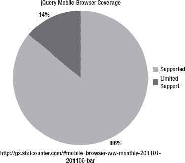

**图 1–1。**jQuery 1.0 手机浏览器覆盖

**支持的设备:**

*   手机/平板电脑
    *   安卓 1.6 以上
    *   黑莓 5+
    *   iOS 3+
    *   Windows Phone 7
    *   WebOS 1.4 以上版本
    *   塞班(诺基亚 S60)
    *   火狐手机歌剧移动 11+
    *   Opera Mini 5+
*   桌面浏览器
    *   铬合金 11+
    *   火狐 3.6 以上版本
    *   Internet Explorer 7+
    *   旅行队
*   电子书阅读器
    *   点燃
    *   角落

**注:**关于所有支持平台的最新列表，请参考 jQuery Mobile 的支持平台页面(参见[`jquerymobile.com/gbs/`](http://jquerymobile.com/gbs/))。

相比之下，本地应用开发有一个非常严格的分布模型(参见 Figure 1–2)。本机应用仅在其本机操作系统上可用。例如，iPhone 应用只能通过 iOS 设备访问。如果你的目标是接触尽可能多的消费者，这种分销模式是有限的。幸运的是，jQuery Mobile 应用没有受到这种分布障碍的限制。

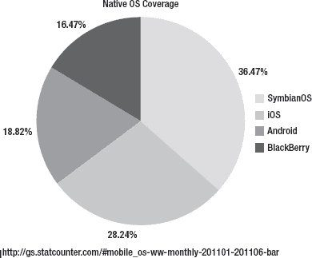

**图 1–2。** *原生 OS 覆盖范围*

除了通用访问之外，jQuery Mobile 应用还可以利用我们在 Web 上已经习惯的即时部署功能。对于 jQuery Mobile 应用，在本地应用分发模型中要求的认证审查方面不存在任何障碍。移动 Web 应用可以即时更新并部署到您的生产用户。例如，我最近正在开发一个需要更新的本地企业应用，而重新认证流程花了一周时间才批准了这一更改。平心而论，本地应用商店可以选择提交紧急更新，但关键是你将依赖第三方来推送更新到他们的商店。移动网络的即时部署模式在这方面非常有利。

### 跨所有移动平台的统一 UI

jQuery Mobile 按照 HTML5 和 CSS3 标准设计，提供了统一的用户界面。移动用户希望他们的用户体验跨平台保持一致(参见图 1–3、图 1–4、图 1–5)。相反，比较 iPhone 和 Android 上的原生 Twitter 应用。体验不统一。jQuery Mobile 应用弥补了这种不一致性，提供了一种熟悉的、可预期的用户体验，而与平台无关。此外，无论最终用户平台如何，统一的用户界面都将提供一致的文档、屏幕截图和培训。例如，如果您的销售人员需要关于正在部署的新移动应用的培训，用户文档将包含适用于所有平台的一致屏幕截图。如果团队中一半人使用 iPhones，另一半人使用 Android 设备，那么所有用户的培训体验和文档都是一样的。

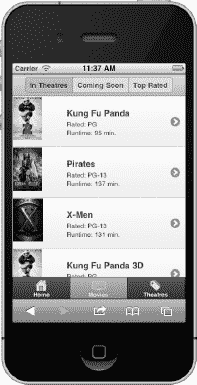

**图 1-3。** *iPhone*

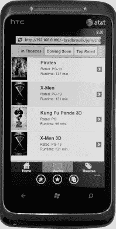

**图 1–4。** *Windows Phone*

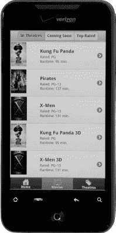

**图 1-5。** *Android*

jQuery Mobile 还有助于消除对特定于设备的 UI 定制的需求。无需定制，单个 jQuery Mobile 代码库将在所有支持的平台上一致地呈现。与支持每个操作系统的本地代码库的组织相比，这是一个非常经济高效的解决方案。从支持和维护成本的角度来看，支持单一代码库更具成本效益(参见图 1–6)。

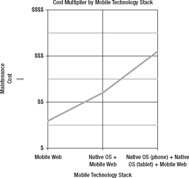

**图 1–6。** *通过移动技术叠加成本乘数*

### 简化的标记驱动开发

jQuery Mobile 页面采用 HTML5 标记样式(参见清单 1–1)。).除了 HTML5 中引入的新的自定义数据属性之外，对于 Web 设计人员和开发人员来说，一切都应该非常熟悉。如果您已经熟悉 HTML5，那么迁移到 jQuery Mobile 应该是一个相对无缝的过渡。关于 JavaScript 和 CSS，默认情况下，jQuery Mobile 完成了所有繁重的工作。但是，在某些情况下，您可能需要依靠 JavaScript 来创建更动态或增强的页面体验。除了设计页面所需的简单标记外，它还允许用户界面的快速原型化。很快，我们可以创建一个功能页面、过渡和小部件的静态工作流，以帮助我们的客户用最少的努力看到真实的原型。

**清单 1–1。** *在此插入清单标题。*

`<!DOCTYPE html>
<html>
<head>
  <meta charset="utf-8">
  <title>Title</title>
  <meta name="viewport" content="width=device-width, initial-scale=1">
  <link rel="stylesheet" href="jquery.mobile-1.0.min.css" />
  
  
</head>
<body>

    

        <h1>Page Header</h1>
    

    

        
Hello jQuery Mobile!

    

    

        <h4>Page Footer</h4>
    

</body>
</html>`

### 渐进增强

jQuery Mobile 将为设备呈现最优雅的用户体验。例如，看看图 1–7 中的 jQuery Mobile switch 控件。这是 A 级浏览器上的开关控件。 1

__________

A 级浏览器支持媒体查询，并将呈现 jQuery Mobile CSS3 风格的最佳体验。

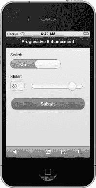

**图 1–7。** *A 级体验*

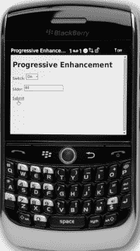

**图 1–8。** *C 级经验*

jQuery Mobile 呈现应用了完整 CSS3 样式的控件。或者，Figure 1–8 是在更老的 C 级浏览器上呈现的相同开关控件。2C 级浏览器不渲染完整的 CSS3 样式。

**重要提示:**尽管 C 级体验不是最具视觉吸引力的，但它证明了优雅降级的有用性。随着用户升级到更新的设备，C 级浏览器市场最终将会缩小。在这种交叉发生之前，C 级浏览器在运行 jQuery Mobile 应用时仍将获得功能性用户体验。

本机应用并不总是优雅地降级。在大多数情况下，如果您的设备不支持本机应用功能，您甚至不允许下载该应用。例如，iOS 5 中的一个新功能是 iCloud persistence。这项新功能简化了多个设备之间的数据同步。为了兼容性，如果我们创建一个包含这一新功能的新 iOS 应用，我们将需要为我们的应用设置“最低允许的 SDK”为 5.0。现在，我们的应用将只对运行 iOS 5.0 或更高版本的用户可见。jQuery Mobile 应用在这方面更加灵活。

__________

C 级浏览器不支持媒体查询，也不会从 jQuery Mobile 获得样式增强。

### 响应式设计

jQuery Mobile UI 将在不同的显示尺寸之间做出相应的呈现。例如，相同的用户界面将适当地显示在手机上(参见图 1–9)或更大的设备上，如平板电脑、台式机或电视(参见图 1–10)。

**图 1–9。** *手机显示*

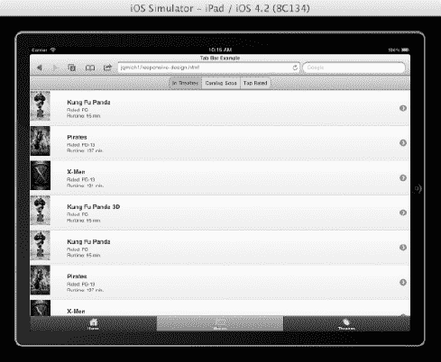

**图 1–10。** *平板电脑/台式机/电视显示器*

#### 一次构建，随处运行的神话

有没有可能构建一个对所有消费者(手机、台式机、平板电脑)通用的单一应用？是的，这是可能的。网络提供全球分销。jQuery Mobile 提供跨浏览器支持。有了 CSS 媒体查询，我们可以开始定制我们的用户界面，以最适合的形式因素。例如，在小型设备上，我们可以提供带有简短内容的小图像，而在大型设备上，我们可以提供带有详细内容的大图像。如今，大多数拥有移动设备的组织通常同时支持桌面网站和移动网站。你必须支持一个应用的多个发行版，这是浪费时间。组织拥抱移动存在的速度，加上他们避免浪费的需要，将推动“构建一次，随处运行”的神话成为现实。

##### 响应式

在某些情况下，jQuery Mobile 会为您创建响应式设计。下图显示了 jQuery Mobile 的响应式设计在纵向和横向模式下应用于表单域定位的效果。例如，在纵向视图中(参见图 1–11)，标签位于表单字段上方。或者，在横向重新定位设备时(参见图 1–12)，表单域和标签并排出现。这种响应式设计基于可用于筛选房地产的设备提供了最有用的体验。jQuery Mobile 为您提供了许多这些好的 UX 原则，而无需您付出任何努力！

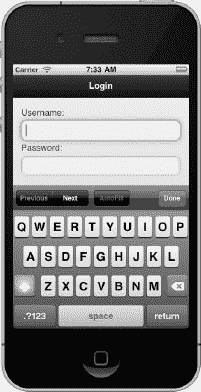

**图 1–11。** *响应式设计(人像)*

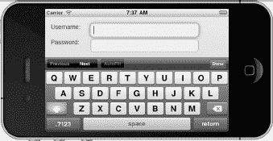

**图 1–12。** *响应式设计(景观)*

### 主题风格

jQuery Mobile 支持主题化设计，允许设计者快速地重新设计他们的 UI。默认情况下，jQuery Mobile 提供了五种主题设计，可以灵活地交换所有组件的主题，包括页面、页眉、内容和页脚组件。创建自定义主题最有用的工具是滚轮 3 。

重新设计一个用户界面需要最少的努力。例如，我可以快速获得一个默认主题的 jQuery Mobile 应用(参见 Figure 1–13)，然后在几秒钟内用另一个内置主题重新设计它。在我修改主题的情况下(见图 1–14，我从列表中选择了一个替换主题。唯一需要的标记是添加一个数据主题属性。我们将在《??》第七章中更详细地讨论主题。

`<!-- Set the lists background to black -->
<ul data-role="listview" data-inset="true" **data-theme="a"**>`

__________

3 见`[`jqueryui.com/themeroller/`](http://jqueryui.com/themeroller/)`。ThemeRoller 是一个基于 web 的工具，可以自动生成新的基于 CSS 的主题。

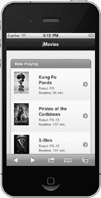

**图 1–13。** *默认主题*

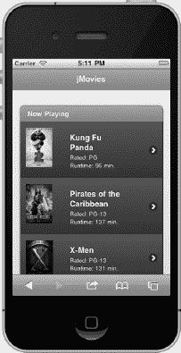

**图 1–14。** *交替主题*

### 可及

默认情况下，jQuery Mobile 应用符合 508 标准，这一特性对任何人都很有价值。 4

特别是，政府或国家机构要求他们的应用 100%可访问。此外，移动屏幕阅读器的使用正在上升。根据 WebAIM 5 的调查，66.7%的屏幕阅读器用户在他们的移动设备上使用屏幕阅读器。

__________

4 508 合规性是一项联邦法律，要求残疾用户能够访问应用。移动网络上最常用的辅助技术是屏幕阅读器。

5 见`[`webaim.org/projects/screenreadersurvey3/#mobileusage`](http://webaim.org/projects/screenreadersurvey3/#mobileusage)`。

**提示:**有兴趣测试你的移动网站是否符合 508 标准吗？使用 WAVE 评估您的移动网站。 6

除了用 WAVE 测试你的移动应用的可访问性，用实际的辅助技术测试你的移动网络应用也是有价值的。例如，如果你有一个 iOS 设备，激活苹果的辅助工具，VoiceOver 7 并亲自体验该行为。

**注意:**如果您有兴趣查看现有的 jQuery Mobile 应用，可以使用在线 jQuery Mobile 图库获取想法和灵感(参见`[`www.jqmgallery.com/`](http://www.jqmgallery.com/)`)。

### 总结

在本章中，我们回顾了使 jQuery Mobile 独一无二的重要特性:

*   jQuery Mobile 应用可以在所有带浏览器的设备上通用，并且已经过优化，可以在目前几乎所有的手机、平板电脑、台式机和电子阅读器设备上运行。
*   jQuery Mobile 应用可以利用我们在 Web 上已经习惯的即时部署功能。
*   无需定制，单个 jQuery Mobile 代码库将在所有支持的平台上一致地呈现。与为每个操作系统或客户端构建应用的替代方案相比，这是一个非常经济高效的解决方案。
*   jQuery Mobile 是一个简化的标记驱动框架，Web 设计人员和开发人员应该对此非常熟悉。您可能会感到非常惊讶和兴奋，因为您可以用 100%的标记构建 jQuery Mobile 应用！
*   jQuery Mobile 利用渐进式增强技术为所有 A 级设备提供非常丰富的体验，并为旧的 C 级浏览器提供可用的体验。
*   jQuery Mobile UI 将在各种大小的设备上响应性地呈现，包括手机、平板电脑、台式机或电视。
*   jQuery Mobile 支持主题化设计，允许设计者在全球范围内快速地重新设计他们的 UI。
*   所有 jQuery Mobile 应用都符合 508 标准。

__________

6 见`[`wave.webaim.org/`](http://wave.webaim.org/)`。

7 见`[`www.apple.com/accessibility/iphone/vision.html`](http://www.apple.com/accessibility/iphone/vision.html)`。