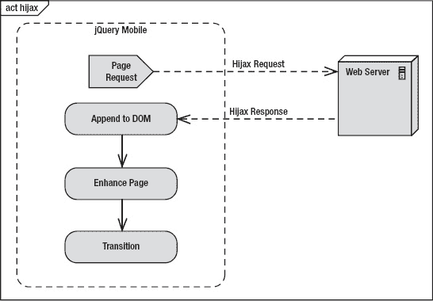

# 二、jQuery Mobile 入门

在第 1 章中，我们回顾了 jQuery Mobile 的独特之处。现在，我们将回顾 jQuery Mobile 的基础知识，以便我们可以快速启动并运行它。我们将从 jQuery Mobile 页面模板的概述开始。实际上有两种页面模板可供选择，我们将讨论每种模板的优势。接下来，我们将深入了解 jQuery Mobile 如何将我们的语义标记增强为优化的移动体验。此外，我们将探索 jQuery Mobile 导航模型是如何工作的。尽管 jQuery Mobile 管理着整个导航体验，但是理解导航模型是如何工作的也很重要。最后，我们将向您展示如何让页面过渡真正“流行”急着出发吗？让我们从一个 jQuery Mobile 页面的例子开始。

### jQuery Mobile 页面模板

一个 jQuery Mobile 页面模板显示在[清单 2–1](#list_2_1)中。在我们继续下一步之前，让我们开始吧。复制 HTML 模板(ch2/template.html)，将其粘贴到桌面上，并从您喜欢的浏览器中启动它。您现在正在运行一个 jQuery Mobile 应用，无论您使用什么浏览器，它看起来都应该与[图 2–1](#fig_2_1)一样！该模板是语义 HTML5，包含 jQuery Mobile 特定的属性和资产文件(CSS、js)。在[清单 2–1](#list_2_1)中突出显示并解释了每个特定的 jQuery Mobile 资产和属性。

**清单 2–1。** *jQuery 手机页面模板(`ch2/template.html)`*

`<!DOCTYPE html>
<html>
<head>
    <meta charset="utf-8">
    <title>Title</title>
    **<meta name="viewport" content="width=device-width, initial-scale=1">**     1
    **<link rel="stylesheet" type="text/css" href="jquery.mobile.css" />**       2
    ****                 3
    **<!---->**                    4
    ****          5
</head>
<body>

*
       *                                                6
    
                                                 7
        <h1>Page Header</h1>
    

    
                                                8
         
Hello jQuery Mobile!

    

    
                                                 9
        <h4>Page Footer</h4>
    

</body>
</html>`

1.  这是 jQuery Mobile 的推荐视口配置。`device-width`值表示我们希望内容缩放设备的整个宽度。`initial-scale`设置设定用于查看网页的初始比例或缩放系数。值 1 显示未缩放的文档。作为 jQuery Mobile 开发人员，您可以根据自己的应用需求定制视口设置。例如，如果你想禁用缩放，你可以添加`user-scalable=no`。但是，禁用缩放是一种您希望尽量避免的做法，因为它会破坏可访问性。
2.  jQuery Mobile 的 CSS 将为所有 A 级和 B 级浏览器应用风格增强。您可以根据需要自定义或添加自己的 CSS。
3.  jQuery 库是 jQuery Mobile 的核心依赖项，如果您的应用需要更动态的行为，强烈建议您在移动页面中利用 jQuery 的核心 API。
4.  如果您需要覆盖 jQuery Mobile 的默认配置，可以在这里应用您的定制。有关定制 jQuery Mobile 默认配置的详细信息，请参考[第 8 章](08.html#ch8)，配置 jQuery Mobile。
5.  jQuery Mobile JavaScript 库必须在 jQuery 和任何自定义脚本之后声明。jQuery Mobile 库是增强整个移动体验的核心。
6.  `data-role=“page”`为 jQuery Mobile 页面定义页面容器。只有在构建多页面设计时才需要这个元素(参见[清单 2–3](#list_2_3))。
7.  `data-role="header"`是如图[图 2–1](#fig_2_1)所示的标题或标题栏。该属性是可选的。
8.  `data-role=“content”`是内容体的包装容器。该属性是可选的。
9.  `data-role=“footer”`包含如图[图 2–1](#fig_2_1)所示的页脚条。该属性是可选的。

**重要提示:**CSS 和 JavaScript 文件的顺序必须按照[清单 2–1](#list_2_1)中列出的顺序出现。在 jQuery Mobile 引用依赖项之前，需要对依赖项进行排序以正确初始化。此外，建议从内容交付网络(CDN)下载这些文件。特别是，您可以从 jQuery Mobile CDN 下载它们。[1](#CHP-2-FN-1)cdn 中的文件经过高度优化，将为您的用户提供更灵敏的体验。它们被压缩、缓存、缩小，并且可以并行加载！

**图 2–1。** *你好 jQuery 手机*

__________

1 见【http://jquerymobile.com/download/】的。

**提示:**要将页脚定位在屏幕的最底部，向页脚元素添加`data-position=“fixed”`。默认页脚位于内容之后，而不是设备的底部。例如，如果你的内容只占设备高度的一半，页脚就会出现在屏幕的中间。

`

#### jQuery Mobile 页面增强功能

jQuery Mobile 如何增强标记以优化移动体验？有关目测，请参考[图 2–2](#fig_2_2)。

1.  首先，jQuery Mobile 将加载语义 HTML 标记(参见[清单 2–1](#list_2_1))。
2.  接下来，jQuery Mobile 将迭代每个页面组件，由它们的数据角色属性定义。随着 jQuery Mobile 迭代每个页面组件，它将增强标记，并为每个组件应用移动优化的 CSS3 增强。jQuery Mobile 最终将标记增强为一个页面，可以在所有移动平台上通用地呈现。
3.  最后，在页面增强完成后，jQuery Mobile 将显示优化后的页面。请参见[清单 2–2](#list_2_2)查看由移动浏览器呈现的增强源代码。

**图 2–2。** *jQuery Mobile 页面增强示意图*

**清单 2–2。**T3】jQuery Mobile 增强版 DOM

`<!DOCTYPE html>
<html class="ui-mobile>
 <head>
   **<base href="http://www.server.com/app-name/path/">**                         1
   <meta charset="utf-8">
   <title>Page Header</title>
   <meta content="width=device-width, initial-scale=1" name="viewport">
   <link rel="stylesheet" type="text/css" href="jquery.mobile-min.css" />
    
    
 </head>

 <body class="ui-mobile-viewport">                                            2
   

     

       <h1 class="ui-title" tabindex="0" role="heading" aria-level="1">
           Page Header
       </h1>
     

     

         
Hello jQuery Mobile!

     

     

       <h4 class="ui-title" tabindex="0" role="heading" aria-level="1">
           Page Footer
       </h4>
     

    

    

      
      <h1>loading</h1>
    

 </body>
</html>`

1.  base 标签的`@href`指定了页面上所有链接的默认地址或默认目标。例如，jQuery Mobile 将在加载特定于页面的资产(图片、CSS、js 等)时利用`@href`。).
2.  body 标签包含了`header, content,`和`footer`组件的增强样式。默认情况下，所有组件都使用了默认主题及其特定于移动设备的 CSS 增强功能。另外，由于增加了 WAI-ARIA 角色和级别，所有组件现在都支持可访问性。您可以免费获得所有这些增强功能！

到目前为止，您应该对设计一个基本的 jQuery Mobile 页面感到满意了。已经向您介绍了核心页面组件(`page, header, content, footer`)，并且已经看到了增强的 jQuery Mobile 页面的 DOM 结果。接下来我们将探索 jQuery Mobile 的多页面模板。

### 多页模板

jQuery Mobile 支持在单个 HTML 文档中嵌入多个页面的能力，如[清单 2–3](#list_2_3)所示。这种策略可用于预先预取多个页面，并在加载子页时实现更快的响应时间。正如您在下面的示例中看到的，多页文档与我们之前看到的单页模板完全相同，只是在第一页之后附加了第二页。下面突出显示并讨论了多页的具体细节。

**清单 2–3。***`ch2/multi-page.html`*多页模板

`<head>
  <meta charset="utf-8">
  <title>Multi Page Example</title>
  <meta name="viewport" content="width=device-width, initial-scale=1">
  <link rel="stylesheet" type="text/css" href="jquery.mobile-min.css" />
  
  
  
</head>

<body>

<!-- First Page -->

                1
    

        <h1>Welcome Home</h1>
    

    

        <a **href="#contact"** data-role="button">Contact Us</a>      2
    

<!-- Second Page -->

    

        <h1>Contact Us</h1>
    

    

        Contact information...
    

    

</body>`

1.  多页文档中的每一页都必须包含唯一的`id`。一个页面可以有一个`page`或`dialog`的`data-role`。当最初显示多页文档时，仅增强并显示第一页。例如，当请求`multi-page.html`文档时，将显示带有`id=“home”`的页面，因为它是多页文档中列出的第一页。如果您想要请求带有`id=“contact”`的页面，您可以请求带有您想要显示的内部页面散列的多页文档(`multi-page.html#contact`)。当加载多页文档时，只会增强和显示初始页面。后续页面在被请求并缓存在 DOM 中时会得到增强。这种行为非常适合快速响应。要设置每个内部页面的标题，添加`data-title`属性。
2.  当链接到内部页面时，您必须通过页面`id`引用它。例如，链接到联系人页面的 href 必须设置为`href=“#contact”`。
3.  如果您想将脚本的范围限定在特定的页面上，它们必须放在页面容器中。这条规则也适用于通过 Ajax 加载的页面，我们将在下一节进一步讨论。例如，`multi-page.html#home`将无法访问任何在`multi-page.html#contact`上内部声明的 JavaScript。只能访问活动页面的脚本。然而，所有的脚本，包括 jQuery、jQuery Mobile 和您自己在父文档的 head 标签中声明的定制脚本，对于所有内部和 Ajax 加载的页面都是可用的。

#### 设置内部页面的页面标题

需要注意的是，内部页面的标题将按照以下优先顺序设置:

1.  如果存在一个`data-ti2–tle`值，它将被用作内部页面的标题。例如，`“multi-page.html#home”`的标题将被设置为`“Home”`。
2.  如果不存在`data-title`值，页眉将被用作内页的标题。例如，如果`"multi-page.html#home"`没有`data-title`属性，那么标题将被设置为`"Welcome Home"`，即它的`header`标签的值。
3.  最后，如果内部页面上既没有`data-title`也没有标题，那么 head 标签中的 title 元素将被用作内部页面的标题。例如，如果`"multi-page.html#home`没有`data-title`属性和标题，那么标题将被设置为`"Multi Page Example"`，即父文档标题标签的值。

**重要提示:**当链接到一个包含多个页面的页面时，必须将`rel="external"`添加到其链接中。

`<!-- Must include rel="external" when linking to multi-page documents -->
<a href="multi-page.html" rel="external">Home</a>

<!-- May optionally use the target attribute -->
<a href="multi-page.html" target="_blank">Home</a>`

这将执行整页刷新。这是必需的，因为 jQuery Mobile 不能将多页面文档加载到活动页面的 DOM 中。这将导致与 jQuery Mobile 如何利用 URL 哈希(#)的名称空间冲突。jQuery Mobile 利用哈希值来识别多页面文档中的内部页面。

此外，因为 jQuery Mobile 利用散列来识别 DOM 中的唯一页面，所以不可能利用锚标记书签特性(`index.html#my-bookmark`)。jQuery Mobile 将`my-bookmark`视为页面标识符，而不是书签。Ajax 驱动的导航将在下一节详细讨论。

#### 单页文档与多页文档

您需要确定页面访问趋势，以确定从带宽和响应时间的角度来看哪种策略最有意义。多页文档在初始加载时会消耗更多的带宽，但它们只需要一个服务器请求，因此它们的子页面加载的响应时间非常快。单页文档每次请求消耗的带宽较少，但是每页需要一个服务器请求，这导致响应时间非常慢。

如果你有几个经常按顺序访问的页面，它们是在同一文档中预先加载的理想选择。最初的带宽命中率稍高，但我们在访问下一页时实现了即时响应。但是，如果用户访问两个页面的概率很低，那么您应该选择将文件分开，并在初始加载时达到较低的带宽。

有工具可以帮助您收集页面访问趋势和其他指标，以帮助优化您的页面访问策略。比如 Google Analytics[2](#CHP-2-FN-2)或者 Omniture [3](#CHP-2-FN-3) 都是移动 Web 应用常见的分析解决方案。

__________

2 见【http://www.google.com/analytics/】的。

3 见【http://www.omniture.com/】的。

**提示:**在大多数情况下，建议利用单页面模型，在后台将流行页面动态追加到 DOM 中。我们可以通过向任何想要动态加载的链接添加`data-prefetch`属性来实现这种行为:

``

这种混合方法允许我们*选择性地*选择我们想要加载和缓存的链接。同样，这种模式只推荐用于访问非常频繁的页面，因为这种行为会触发一个额外的 HTTP 请求来动态加载页面。

### Ajax 驱动的导航

在上面的多页面示例中(参见[清单 2–3](#list_2_3))，我们看到了 jQuery Mobile 如何从一个内部页面导航到另一个页面。当多页面文档初始化时，两个内部页面都已经添加到 DOM 中，因此从一个内部页面到另一个内部页面的页面转换速度非常快。当从一页导航到另一页时，我们可以配置要应用的过渡类型。默认情况下，框架会对所有过渡应用一个`"slide"`效果。我们将在本章的后面讨论过渡和可供选择的过渡类型。

`<!-- Navigate to an internal page -->

    <a **href="#contact"** data-role="button">Contact Us</a>

`

当一个单页面过渡到另一个单页面时，导航模型是不同的。例如，我们可以将多页面中的联系页面提取到它自己的文件中(`contact.html`)。现在我们的主页(`hijax.html`)可以像普通 HTTP 链接引用一样访问联系人页面:

**清单 2–4。***【Ajax 导航(`ch2/hijax.html` )*

`

    <a **href="contact.html"** data-role="button">Contact Us</a>

`

当点击上面的“联系我们”链接时，jQuery Mobile 将按如下方式处理该请求:

1.  jQuery Mobile will parse the `href` and load the page via an Ajax request (Hijax). For a visual, refer to [Figure 2–3](#fig_2_3). If the page is loaded successfully, it will be added to the DOM of the current page. 

    **图 2–3。** *jQuery Mobile Hijax 请求*

    页面成功添加到 DOM 后，jQuery Mobile 将根据需要增强页面，更新`base`元素的`@href`，并设置`data-url`属性(如果没有显式设置的话)。

2.  然后，框架将转换到新页面，并应用默认的“`slide`”转换。*框架能够实现无缝的 CSS 转换，因为“from”和“to”页面同时存在于 DOM 中。*过渡完成后，当前可见或活动的页面将被赋予“ui-page-active”CSS 类。
3.  The resulting URL is also bookmarkable. For example, if you want to deep link to the contact page you may access it from its full path: `[http://<host:port>/ch2/contact.html](http://<host:port>/ch2/contact.html).`

    **注意:**作为一个额外的好处，基于 Ajax 的导航也将在支持 HTML5 的 pushState 的浏览器中产生干净的 URL。桌面 Safari、Chrome、Firefox 和 Opera 的最新版本都支持该功能。Android (2.2+)和 iOS5 也支持 pushState。在不支持此功能的浏览器中，将使用基于散列的 URL(`[http://<host:port>/hijax.html#contact.html](http://<host:port>/hijax.html#contact.html)`)来保留共享和标记 URL 的能力。

4.  如果任何页面在 jQuery Mobile 中加载失败，将会显示一个“加载页面错误”的小错误消息覆盖图并淡出(参见[图 2–4](#fig_2_4))。

**图 2–4。** *错误加载屏幕*

#### $.mobile.changePage()

*   changePage 函数处理从一个页面转换到另一个页面的所有细节。您可以切换到除同一页面之外的任何页面。可用过渡类型的完整列表如[表 2–1](#tab_2_1)所示。

#### 用法

*   $.mobile.changePage(“选项”)

#### 论据

*   `**toPage**`(字符串或 jQuery 集合)。要转换到的页面。
    *   `toPage`(字符串)。文件 URL ( `"contact.html"`)或内部元素的 ID(`#contact`)。
    *   `toPage` (jQuery 集合)。包含页面元素作为第一个参数的 jQuery 集合。
*   `**options**`(对象)。配置 changePage 请求的一组键/值对。所有设置都是可选的。
    *   **`transition`** (字符串，默认:**$ . mobile . default transition**)。申请变更页面的过渡。默认过渡是`"slide"`。
    *   **`reverse`** (布尔，默认:`false`)。以指示过渡应该向前还是向后。默认转换是向前。
    *   **`changeHash`** (布尔，默认:`true`)。当页面更改完成时，将哈希更新为页面的 URL。
    *   **`role`** (字符串，默认:`"page"`)。显示页面时要使用的数据角色值。对于对话框，使用`"dialog"`。
    *   **`pageContainer`** (jQuery 集合，默认:`$.mobile.pageContainer`)。指定页面加载后应包含的元素。
    *   **`type`** (字符串，默认:`"get"`)。指定发出页面请求时使用的方法(“`get`或“`post`”)。
    *   **`data`** (字符串或对象，默认:**未定义**)。发送到 Ajax 页面请求的数据。
    *   **`reloadPage`** (布尔，默认:`false`)。强制重新加载页面，即使它已经在页面容器的 DOM 中。
    *   **`showLoadMsg`** (布尔，默认:`true`)。请求页面时显示加载消息。
    *   **`fromHashChange`** (布尔，默认:`false`)。指示 changePage 是否来自 hashchange 事件。

**例#1:**

`//Transition to the "contact.html" page.
$.mobile.changePage( "contact.html" );

<!-- Markup equivalent -->
<a href="contact.html">Contact Us</a>`

**例 2:**

`// Go to an internal "#contact" page with a reverse "pop" transition.
$.mobile.changePage( '#contact', { transition: "pop", reverse: true } );

<!-- Markup equivalent -->
<a href="contact.html" data-transition="pop" data-direction="reverse">
  Contact
</a>`

**例 3:**

`/* Dynamically create a new page and open it */

// Create page markup
var newPage = $("

  <h1>Hi</h1>

Hello Again!

");

// Add page to page container
newPage.appendTo( $.mobile.pageContainer );

// Enhance and open new page
$.mobile.changePage( newPage );`

**重要提示:** Ajax 导航不会用于加载外部链接的情况:

`<!-- Ajax navigation will be ignored when loading a page with a
rel="external" or target attribute -->
<a href="multi-page.html" **rel="external"**>Home</a>

<!-- Ajax navigation will be ignored -->
<a href="multi-page.html" **target="_blank"**>Home</a>`

在这些情况下，将进行正常的 HTTP 请求处理。此外，不会应用 CSS 过渡。如前所述，该框架能够通过将“from”和“to”页面动态加载到同一个 DOM 中，然后应用平滑的 CSS 过渡来实现平滑过渡。如果没有 Ajax 导航，转换将不会平滑，并且在转换过程中不会显示默认的加载消息(`$.mobile.loadingMessage`)。

#### 配置 Ajax 导航

Ajax 导航是全局启用的，但是如果 DOM 大小是一个问题，或者如果您需要支持不支持哈希历史更新的特定设备，您可以禁用这个特性(参见下面的注释)。默认情况下，jQuery Mobile 将为我们管理 DOM 大小或缓存，只将活动页面转换中涉及的“from”和“to”页面合并到 DOM 中。要禁用 Ajax 导航，请在绑定到 mobileinit 事件时设置$.mobile.ajaxEnabled = false。有关配置 jQuery Mobile 或管理 DOM 缓存的更多信息，请参考第 8 章。

**注意:** Ajax 导航已经在已知与哈希历史更新冲突的平台上被禁用。例如，jQuery Mobile 已经为黑莓 5、Opera Mini (5.0-6.0)、诺基亚 Symbian^3 和 Windows Phone 6.5 禁用了 Ajax 导航`($.mobile.ajaxEnabled = false)`。当使用常规 HTTP 和整页刷新浏览时，这些设备更有用。

### 过渡

jQuery Mobile 在页面之间转换时有六种基于 CSS 的转换效果可供选择。默认情况下，框架会对所有过渡应用一个`"slide"`效果。我们可以通过将`data-transition`属性添加到任何链接、按钮或表单来设置替代转换:

`<a href="dialog.html" **data-transition="slideup"**>Show Dialog</a>`

过渡效果的完整列表在[表 2–1](#tab_2_1)中描述:

T2】

从页面到页面的转换过程按以下步骤进行:

1.  用户点击按钮导航至下一页(参见[图 2–5](#fig_2_5))。
2.  框架将使用 Hijax 请求加载下一个页面，并将其添加到当前页面的 DOM 中。当两页基本并排时，平滑过渡就要开始了(见[图 2–6](#fig_2_6))。
3.  框架转换到下一页(见[图 2–7](#fig_2_7))。此示例使用默认的“幻灯片”过渡。
4.  显示下一页，过渡完成(参见[图 2–8](#fig_2_8))。

**图 2–5。** *第一步:点击按钮导航到另一个页面*

**图 2–6。** *第二步:框架并排加载下一页*

**图 2–7。** *第三步:框架转换到下一页*

**图 2–8。** *第四步:过渡完成*

**提示:**你可以通过在链接中添加`data-direction="reverse"`来设置“向后”过渡。向前的`"slide"`转换将向左滑动，相反，反向的`"slide"`转换将向右滑动。例如，当转换回历史时，默认情况下会应用反向转换。但是，如果您的标题上有一个“主页”链接，您将需要应用 **`data-direction="reverse"`** 属性，否则将出现默认的“转发”效果:

`<a href="home.html" data-icon="home" data-iconpos="notext"
   **data-direction="reverse"** class="ui-btn-right jqm-home">
   Home
</a>`

### 对话框

对话框类似于页面，除了它们的边框是内嵌的，给它们一个模态对话框的外观。jQuery Mobile 在设计对话框样式方面非常灵活。我们可以创建确认对话框(见[图 2–9](#fig_2_9))、警告对话框(见[图 2–10](#fig_2_10))，甚至行动单样式的对话框(见[图 2–11](#fig_2_11)、[图 2–12](#fig_2_12))。

**图 2–9。** *确认对话框(`ch2/dialog.html` )*

**图 2–10。** *警报对话框(`ch2/alert.html` )*

我们可以在链接或页面组件上将页面转换成对话框。在一个链接上，添加如[清单 2–5](#list_2_5)所示的`data-rel="dialog"`属性。添加该属性将自动加载目标页面，并将其增强为模式对话框。

**清单 2–5。** *链路级转换*

`<!-- Open a page as a dialog -->
<a href="#terms" **data-rel="dialog"** data-transition="slidedown">Terms</a>

<!-- The page remains unchanged. -->

 

  <h1>Terms and Conditions</h1>
 

 

  Do you agree to these terms?

  <a href="#" data-role="button" data-inline="true"
     data-rel="back" data-theme="a">Disagree</a>
  <a href="#" data-role="button" data-inline="true">Agree</a>
 

`

我们还可以在页面容器中配置对话框。将`data-role="dialog"`属性添加到页面容器中，当组件加载时，它将被增强为一个模态对话框(参见[清单 2–6](#list_2_6))。

**清单 2–6。***`ch2/dialog.html`*页面级转换

`<!-- Link without data-rel="dialog" attribute -->
<a href="#terms" data-transition="slidedown">Terms and Conditions</a>

<!-- Configure this page to appear as a dialog -->

 

  <h1>Terms and Conditions</h1>
 

 

  Do you agree to these terms?

  <a href="#" data-role="button" data-inline="true"
     data-rel="back" data-theme="a">Disagree</a>
  <a href="#" data-role="button" data-inline="true">Agree</a>
 

`

**注意:**任何带有`data-rel="dialog"`的链接或者任何带有`data-role="dialog"`的页面都不会出现在历史中，也不能被书签标记。例如，如果您导航到一个对话框，关闭该对话框，然后点击浏览器的前进按钮，您将不会前进到该对话框，因为它将不存在于历史中。

#### 链接对比页面配置

有两个打开对话框的选项，我们应该选择哪一个？我更喜欢页面配置(`data-role="dialog"`)，因为它允许我们在页面容器中配置一次对话框，导航到对话框的按钮不需要任何修改。例如，如果我们有三个按钮链接到我们的对话框，基于页面的配置只需要一个修改。而基于链接的配置需要三次更改，每个按钮一次。

jQuery Mobile dialog API 还公开了一个`close`方法，您可以在以编程方式处理对话框时利用它。例如，如果我们想以编程方式处理图 2–9 中“同意”按钮的处理，我们可以处理点击事件，处理任何必要的业务逻辑，并在完成时关闭对话框:

`function processAgreement(){
  // Save the agreement...

  // Close the dialog
  **$('.ui-dialog').dialog('close');**
}`

#### 行动表

除了传统的对话框，我们还可以将对话框设计成行动表(参见[图 2–11](#fig_2_11)和[图 2–12](#fig_2_12))。只需移除标题，添加小的样式更新(见[清单 2–7](#list_2_7))，你的对话框就会显示为一个动作表。行动表通常用于征求用户的回应。为了获得最佳用户体验，建议对动作表使用`slidedown`过渡。方便的是，当对话框关闭时，它们会自动应用反向转换。例如，当您关闭此动作表时，将应用反向`slideup`转换。

**图 2-11。** *动作表#1 ( `ch2/action-sheet1.html` )*

**图 2–12。** *动作表#2 ( `ch2/action-sheet2.html` )*

**清单 2–7。** *动作单(`ch2/action-sheet1.html` )*

`<!-- Logout link -->
<a href="#logout" **data-transition="slidedown"**>Logout</a>

**<!-- Create an action sheet by simply removing the header! -->**

  

    Are you sure?

    <a href="#home" data-role="button" data-theme="b">Yes, I'm Sure!</a>
    <a href="#" data-role="button" data-theme="c" data-rel="back">No Way!</a>
  

 

`

这也是我们第一次接触到数据主题属性。我们可以简单地用这个属性为所有 jQuery Mobile 组件添加对比和样式。在我们的对话框例子中，我们可以设置背景和按钮的主题。当设计对话框按钮时，通常会对比取消和动作按钮的风格。jQuery Mobile 中的主题在第 7 章中有更深入的讨论。

#### 对话框 UX 指南

设计 UI 组件时，一致性是最重要的设计目标。关于特定对话指南，苹果手机界面指南 [4](#CHP-2-FN-4) 中的一些提示包括:

提示:对话框的最大宽度默认设置为 500 像素。这将在较小的移动显示器上全屏显示，并在桌面和平板电脑屏幕上显示 500 像素宽。如果您需要覆盖默认宽度，请在您的主题中使用以下 CSS:

`ui-dialog .ui-header, .ui-dialog .ui-content, .ui-dialog .ui-footer {
max-width: 100%; }`

##### 警报:

*   优先选择显示影响应用使用的重要信息的警告(参见[图 2–10](#fig_2_10))。警报是*而不是用户发起的*。
*   警告按钮要么是浅色的，要么是深色的。对于单按钮警报，按钮总是浅色的。对于双按钮对话框，左按钮总是暗的，右按钮总是亮的(参见[图 2–9](#fig_2_9))。
*   在一个双按钮对话框中，建议一个人们可能会选择的有利动作，取消该动作的按钮应该在左边，并且是深色的(参见[Figure 2–9](#fig_2_9))。
*   在两个按钮的对话框中，建议一个有潜在风险的操作(删除)，取消操作的按钮应该在右边并且是浅色的。通常执行危险动作的按钮是红色的。

##### 行动表:

*   优选行动表来收集对*用户发起的*任务的确认(参见[图 2–11](#fig_2_11))。行动表也可用于为用户提供当前任务的选择范围(参见[图 2–12](#fig_2_12))。
*   动作表总是包含至少两个按钮，允许用户选择如何完成他们的任务。
*   包括允许用户放弃任务的取消按钮。“取消”按钮位于操作表的底部，以鼓励用户在做出选择之前通读所有选项。“取消”按钮的颜色应该与背景的颜色相对应。

__________

4 见[http://developer . apple . com/library/IOs/documentation/user experience/conceptual/mobile hig/mobile hig . pdf](http://developer.apple.com/library/ios/documentation/userexperience/conceptual/mobilehig/MobileHIG.pdf)。

### 有媒体查询的响应式布局

要使用 jQuery Mobile 创建响应式设计，建议利用 CSS3 媒体查询的强大功能。 [5](#CHP-2-FN-5)

`@media (orientation: portrait) {
  /* Apply portrait orientation enhancements here... */
}

@media (orientation: landscape) {
  /* apply landscape orientation enhancements here... */
}`

在某些情况下，jQuery Mobile 会为您创建响应式设计。下图显示了 jQuery Mobile 的响应式设计在纵向和横向模式下对表单字段定位的表现。例如，在纵向视图中(参见[图 2–13](#fig_2_13))，标签位于表单字段上方。或者，在横向重新定位设备时(参见[图 2–14](#fig_2_14))，表单域和标签并排出现。这种响应式设计基于设备可用的屏幕空间提供了最有用的体验。jQuery Mobile 为您提供了许多这些好的 UX 原则！

__________

5 见[http://www . w3 . org/tr/CSS 3-mediaquiries/](http://www.w3.org/TR/css3-mediaqueries/)。

**图 2–13。** *(肖像)*

**图 2–14。** *(风景)有求必应*

**警告:**如果你在 iOS 中启动[图 2–14](#fig_2_14)(`ch2/responsive.html`)并切换到横向，你可能已经注意到了移动 Safari 中的 iOS 缩放问题。 [6](#CHP-2-FN-6) "当 meta viewport 标签设置为`content="width=device-width, initial-scale=1"`或任何允许用户缩放的值时，将设备更改为横向会导致页面缩放大于 1.0。因此，页面的一部分被从右边裁剪掉，用户必须双击(有时不止一次)才能让页面正确缩放到视图中。”

在 Mobile Safari 解决此问题之前，您有几个选项可以解决此问题:

*   您可以禁用缩放。尽管如此，禁用缩放是一种您希望尽量避免的做法，因为它会破坏可访问性。`<meta name="viewport" content="width=device-width,
            **minimum-scale=1.0, maximum-scale=1.0"**`
*   当用户缩放时，您可以动态调整 meta 标签。 [7](#CHP-2-FN-7)

__________

6 见【http://filamentgroup.com/examples/iosScaleBug/】的。

7 见[http://adaptio . com/journal/4470/](http://adactio.com/journal/4470/)。

在上面的例子中(参见[图 2–13](#fig_2_13))，jQuery Mobile 能够通过利用最小-最大宽度媒体特性来应用响应式设计。例如，当浏览器支持大于 450 像素的宽度时，表单元素浮动在其标签旁边。支持文本输入行为的 CSS 如下所示:

`label.ui-input-text {
    **display: block;**
}

@media all and **(min-width: 450px)**{
  label.ui-input-text { **display: inline-block;** }
}`

**重要提示:**Windows Phone 7(Internet Explorer 8 及以下版本)不支持媒体查询。如果你想在不支持媒体查询的浏览器上支持响应式设计，建议利用 respond . js .T3】8T5】respond . js 为不支持媒体查询的浏览器提供媒体查询支持。

还有一组有限的特定于 Webkit 的媒体扩展，您可能会觉得有用。例如，要为配有高清 retina 显示屏的新款 iOS 设备应用 CSS 增强功能，您可以使用`webkit-min-device-pixel-ratio`媒体功能:

`//Webkit-specific media query for the iOS high-resolution Retina display @media screen
and **(-webkit-min-device-pixel-ratio: 2)**{
  // Apply retina display enhancements
}`

作为对 iOS 用户的额外奖励，jQuery Mobile 包含了一整套针对 retina 优化的图标，可以自动应用于任何具有非常高分辨率显示屏的 iOS 设备。

**注意:**如果你选择在单独的文件中分离特定于媒体的样式，你可以用 HTML <链接>媒体属性来引用它们。这种做法促进了关注点的良好分离，但是从性能的角度来看，这是因为每个单独的文件都需要一个额外的 HTTP 请求:

`<link href="default.css" />
<link media="all and (min-width:450px)" href="widescreen.css" />`

__________

8 见【https://github.com/scottjehl/Respond】T2。

### 总结

在这一章中，我们回顾了 jQuery Mobile 的基础知识，并了解了如何快速启动和运行 jQuery Mobile 应用。我们回顾了两种 jQuery Mobile 页面模板，并讨论了它们在性能和导航流程方面的优势。我们还看了一下 jQuery Mobile 如何将我们的语义标记增强为优化的移动体验。此外，我们回顾了所有可用的页面转换，并讨论了每种转换的常见使用模式。最后，我们看到了许多不同的对话框样式来创建一个有效的界面，用于通知用户或从用户那里收集反馈。在[第 3 章](03.html#ch3)中，我们将进一步了解 jQuery Mobile 的导航，以及如何最好地利用页眉和页脚控件来管理我们的移动应用数据。