# 三、使用标题、工具栏和标签栏导航

所有移动应用都需要工具栏来帮助导航或管理屏幕上的数据。在本章中，我们将回顾提供这些特性的 jQuery Mobile 组件。主要组件是页眉和页脚。标题通常用于显示页面标题，并且可以选择包含控件来帮助导航或管理屏幕上的对象。页脚的设计类似于页眉，但它们的职责通常由工具栏或选项卡栏来管理。此外，我们将发现分段控件的功能。分段控件是一种特殊的控件，我们可以将其放置在页眉或页脚中，以帮助显示数据的可选视图。我们将探索每一个组件，并演示如何用文本、标准图标甚至自定义图标来设计它们的样式。

### 标题栏

标题栏显示当前屏幕的标题。此外，您可以添加用于导航的按钮，或者添加管理页面中各项的控件。虽然页眉是可选的，但它通常用于为活动页面提供标题。让我们从查看标题结构开始，看看如何向标题添加额外的控件来帮助管理页面上的项目。

#### 页眉基础

关于标题有几点很重要。它们包括:

*   标题是用`data-role="header"`属性定义的。
*   标题是一个可选组件。
*   除非您明确启用后退按钮，否则它不会显示在标题中。下一节将详细讨论后退按钮。
*   您可以使用`data-theme`属性调整页眉的主题。如果没有为标题设置主题，它将从页面组件继承主题。默认主题是黑色(`data-theme="a"`)。
*   默认情况下，所有标题级别(H1-H6)的样式相同，以保持视觉一致性。
*   您可以通过添加`data-position="fixed"`属性来固定标题。

**提示:**您也可以使用表头作为分段控件，如图图 3–5 所示。分段控件允许用户显示相关数据的不同视图。

#### 表头结构

页眉的基本用途是简单地显示活动页面的标题。最简单形式的标题如下所示。

`
**
  <h1>Header Title</h1>

`

#### 表头定位

有三种样式可用于定位页眉。它们包括:

*   默认:一个默认的标题将显示在屏幕的顶部，当你滚动时会滑出屏幕。`

      <h1>Default Header</h1>
    
`
*   固定:一个固定的标题将始终保持定位，并在屏幕的顶部边缘可见。然而，在滚动事件期间，标题将会消失，直到滚动完成。我们可以创建一个添加了`data-position="fixed"`属性的固定头。`

      <h1>Fixed Header</h1>
    
`

**注意:**为了实现真正的固定工具栏，浏览器需要支持位置:固定或溢出:自动。幸运的是，WebKit (iOS5)的新版本开始支持这种行为。在 jQuery Mobile 中，我们可以通过将`touchOverflowEnabled`配置选项设置为 true 来启用这种行为(参见第八章的中的“可配置的 jQuery Mobile 选项”了解更多细节)。

*   响应式:当我们创建一个全屏页面时，内容会边对边地出现，页眉和页脚会根据触摸响应相应地出现和消失。全屏模式对于照片或视频显示非常有用。要创建全屏页面，将`data-fullscreen="true"`添加到页面容器中，并在页眉和页脚元素中包含`data-position="fixed"`属性(参见清单 3–1)。例如，在图 3–1 中，我们有一个显示照片的全屏页面。如果用户点击屏幕，页眉和页脚将相应地出现和消失(参见图 3–2)。在本例中，我们有一个照片查看器，其页眉显示图像面板的计数器，页脚显示一个工具栏来帮助导航、发送电子邮件或删除图像。

**清单 3–1。** *【全屏(`ch3/position-fullscreen.html` )*

`

  

    <h3>Header</h3>
  

  

    <!-- Fullscreen content -->
  

  

    <h3>Footer</h3>
  
` 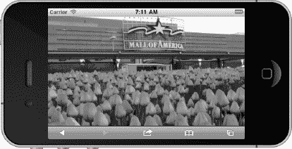

**图 3–1。** *全屏*

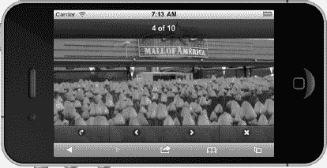

**图 3–2。** *全屏显示，页眉页脚响应灵敏*

**注意:**在 iOS 和 Android 中查看 jQuery Mobile 页面时，浏览器的地址栏会被隐藏。这是一个方便的功能，允许用户查看更多可用的屏幕空间，并平滑过渡。但是，如果您需要查看地址栏，向下拖动页面，地址栏将变得可见。

#### 标题按钮

有些情况下，您需要在标题中添加控件来帮助管理屏幕内容。例如,“保存”和“取消”按钮是编辑数据时可用的常见控件。有三种样式的按钮可以添加到标题中。它们包括:

*   只有文本的按钮。
*   只有图标的按钮(参见图 3–4)。一个纯图标按钮需要添加两个属性:`data-icon`和`data-iconpos="notext"`。关于`data-icon`值的完整列表，请参考表 4-1 。
*   一个带有文本和图标的按钮(参见图 3–3)。这个按钮还需要`data-icon`属性。这里显示了每个示例:`<!-- A button with only text -->
    <a href="#">Done</a>

    <!-- A button with only an icon -->
    

    <!-- A button with text and an icon -->
    <a href="#" **data-icon="check"**>Done</a>`

#### 带文字和图标的按钮

在图 3–3 中，我们有一个带有“取消”和“完成”按钮的标题来帮助管理电影评论的条目。如清单 3–2 所示，按钮被设计成普通链接。我们还为每个按钮附加了一个带有`data-icon`属性的图标。要创建纯文本按钮，只需删除`data-icon`属性。在标题中，按钮是根据它们的语义顺序来定位的。例如，第一个按钮左对齐，第二个按钮右对齐。如果你的标题只包含一个按钮，你可以通过添加`class="ui-btn-right"`到按钮的标记来右对齐按钮。

**清单 3–2。** *【页眉按钮】(`ch3/header-buttons.html` )*

`

  <a href="#" data-icon="delete">Cancel</a>
  <h1>Add Review</h1>
  <a href="#" data-icon="check">Done</a>

` 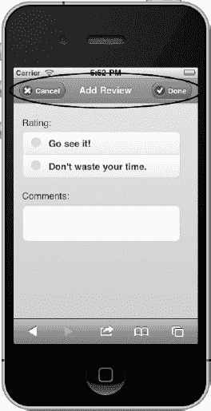

**图 3–3。** *带按钮的表头*

#### 只有图标的按钮

jQuery Mobile 包括几个标准图标(见表 4-1 )，你可以用它们来创建纯图标按钮。例如，`"info"`图标通常与`"flip"`转换一起使用，以显示配置选项或更多信息。使用标准图标消耗很少的空间，并且它们的含义在所有设备上相对一致。例如，如果我们想在现有列表中添加一个条目，我们可以选择显示一个`"plus"`图标，允许用户在列表中添加条目(见图 3–4)。在这个例子中，我们有一个电影评论列表，用户可以点击“`add`”图标来创建他们的评论。要创建一个只有图标的按钮，需要两个属性，如清单 3–3 所示。

**清单 3–3。** *【标题与图标(`ch3/header-icons.html` )*

`

  <h1>Reviews</h1>
  

` 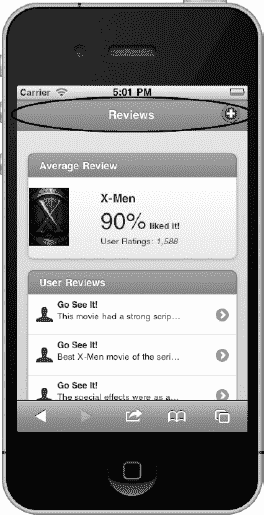

**图 3–4。** *带图标的表头*

#### 带有分段控件的标题栏

分段控件是一组内嵌控件，每个控件显示不同的视图。例如，图 3–5 中的分段控件按特定类别显示电影。这种分段控制允许用户根据他们选择的类别快速观看电影:在影院，即将上映，或顶级。

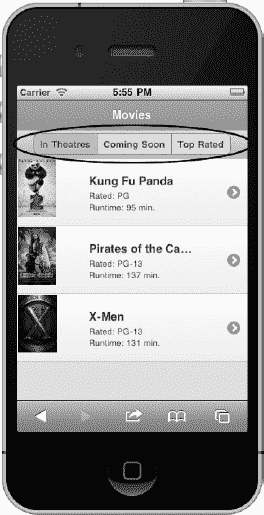

**图 3–5。** *分段控制*

建议将分段控件放置在主标题内，如清单 3–4 所示。如果您选择将标题定位为固定控件，这种定位允许分段控件与主标题无缝集成。通过增加一些小的样式更新，我们现在有了一个分段的控件，允许用户在不同的视图中快速查看数据！

**清单 3–4。** *【分段控制】`ch3/header-segmented-control.html`*

`

  <h1>Movies</h1>
  
` `    

      <a href="#" data-role="button" class="ui-control-active">
         In Theatres
      </a>
      <a href="#" data-role="button" class="ui-control-inactive">
        Coming Soon
      </a>
      <a href="#" data-role="button" class="ui-control-inactive">
        Top Rated
      </a>
    

  

`

#### 固定截断的页眉或页脚...

jQuery Mobile 将截断带有长标题的页眉和页脚(参见图 3–6)。当文本太长时，jQuery Mobile 会截断文本并在末尾添加省略号。如果您遇到这种情况，并且想要显示完整的文本(参见图 3–7，您可以调整 CSS 选择器来解决这个问题，如清单 3–5 所示。

**清单 3–5。** *截断修罗(`ch3/truncation-fixed.html` )*

`.ui-header .ui-title, .ui-footer .ui-title {
  **margin-right: 0 !important; margin-left: 0 !important;**
}` 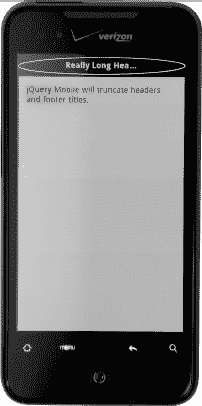

**图 3–6。** *截断发行*

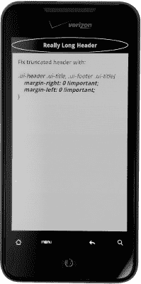

**图 3–7。** *截断修复*

### 后退按钮

后退按钮(见图 3–8)会在 UX 设计师中引起激烈的争论。我们应该添加自己的后退按钮，还是应该利用一些设备和所有浏览器上可用的硬件/软件后退按钮？幸运的是，jQuery Mobile 为您提供了全局自动启用或禁用它们的选择。您还可以选择逐页添加或删除它们。

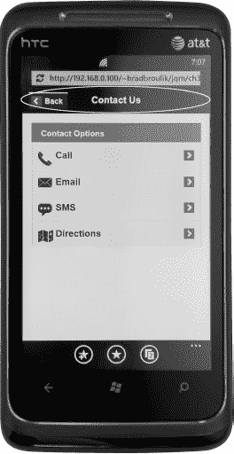

**图 3–8。** *后退按钮必须明确启用。*

默认情况下，jQuery Mobile 中的后退按钮是禁用的。如果您需要 back 按钮出现在页眉中，您有几个选项来添加它们:

*   您可以通过在页面容器上添加`data-auto-back-btn="true"`来将后退按钮添加到特定页面。
*   绑定`mobileinit`选项时，通过将`addBackBtn`选项设置为`true`可以全局启用后退按钮。设置此选项后，如果历史堆栈中存在页面，后退按钮将自动出现。在幕后，一个后退按钮简单地执行`window.history.back()`。如下所示，您也可以覆盖默认的后退按钮文本和主题。例如，用上一页的标题标记后退按钮是很常见的。`data-back-btn-text`属性可以用于这个约定。有关设置全局配置选项的更多详细信息，请参考第八章，配置 jQuery Mobile。

`<!-- Show the back button and override the default back button text -->

// Globally enable the back button, set the default back button text,
// and set back button theme
$(document).bind('mobileinit',function(){
    **$.mobile.page.prototype.options.addBackBtn = true;**
    **$.mobile.page.prototype.options.backBtnText = "Previous";**
    **$.mobile.page.prototype.options.backBtnTheme = "b";**
});`

此外，如果您全局启用了后退按钮，您可以通过在页面标题上添加`data-add-back-btn="false"`属性来选择禁用特定页面上的后退按钮。这将从特定页面的页眉中删除“后退”按钮。

`<!-- Disable the back button on a specific page if we globally enabled it -->

`

**提示:**虽然后退按钮在所有的移动浏览器中都可用，但是在 jQuery Mobile 中有一些特殊情况下，您可能需要后退按钮或替代导航:

建议所有页面都包含一个返回主屏幕的链接，无论是通过链接的徽标还是主页按钮。目标是永远不要让用户陷入导航流程的死胡同。当用户访问深层链接或书签页面时，可能会出现一种常见的情况。如果你唯一的导航机制是后退按钮，并且历史堆栈是空的，那么自动后退按钮将不会出现，让用户陷入死胡同。因此，在标题栏的右侧包含一个主页图标链接是一个非常好的做法。

在设计 PhoneGap 集成时，如果您的目标操作系统不支持基于硬件的导航，如 iOS 或 WebOS，您需要考虑使用后退按钮。

#### 回溯链接

如果你想创建一个行为类似后退按钮的按钮，你可以添加`data-rel="back"`到任何锚元素:

`<a href="home.html" **data-rel="back"** data-role="button">Go Back</a>`

使用`data-rel="back"`，链接将模仿后退按钮，后退一个历史条目(`window.history.back()`)，并忽略链接的默认 href。对于 C 级浏览器或不支持 JavaScript 的浏览器，`data-rel`将被忽略，而`href`属性将作为后备。

### 页脚栏

页脚组件与页眉组件几乎相同，只有很小的不同。主要的区别是页脚在按钮的放置上更加灵活。例如，当处理标题时，第一个按钮左对齐，第二个按钮右对齐。页脚将其按钮从左到右按顺序内联放置。这种灵活性允许我们将页脚设计成工具栏或标签栏。我们将看到两者的例子，但首先让我们从基础开始。

#### 页脚基础知识

页脚有几点很重要。它们包括:

*   页脚用`data-role="footer"`属性定义。
*   页脚将其按钮从左到右按顺序内联放置。这允许灵活地创建工具栏和选项卡栏。
*   页脚是一个可选组件。
*   您可以使用`data-theme`属性调整页脚的主题。如果没有为页脚设置主题，它将从页面组件继承主题。默认主题是黑色(`data-theme="a"`)。
*   您可以通过添加`data-position="fixed"`属性来固定页脚。
*   默认情况下，所有页脚(H1-H6)的样式相同，以保持视觉一致性。

#### 页脚结构

最简单的页脚如下面的代码所示。`data-role="footer"`是唯一必需的属性。在页脚中，您可以包含任何语义 HTML。页脚通常用于包含工具栏和选项卡控件。工具栏提供了一组用户可以在当前上下文中执行的操作。选项卡栏让用户能够在应用的不同视图之间切换。

`

  <!-- Add footer text or buttons here -->

`

**提示:**要将页脚定位在屏幕的最底部，向页脚元素添加`data-position="fixed"`。默认页脚位于内容之后，而不是屏幕的底部边缘(参见图 3–9)。例如，如果你的内容只占了屏幕高度的一半，页脚就会出现在屏幕的中间。我们可以通过向页脚元素添加`data-position="fixed"`来将页脚定位在屏幕的底部。

`
` 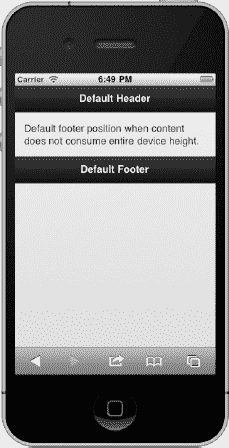

**图 3–9。** *默认页脚位置*

#### 页脚定位

页眉的三种定位样式也适用于页脚。它们包括:

*   Default:默认页脚位于内容部分之后。例如，如果您的内容超出了视窗的高度，页脚将不会显示，直到您滚动到内容的末尾。`

      <!-- Default footer -->
    
`
*   固定:一个固定的页脚，将始终保持定位，并在屏幕的底部边缘可见。然而，在滚动事件期间，页脚将会消失，直到滚动完成。我们可以创建一个添加了`data-position="fixed"`属性的固定页脚。`

      <h3>Fixed Footer</h3>
    
`
*   响应式:当我们创建一个全屏页面时，内容会边对边显示，页眉和页脚会根据触摸响应相应地出现和消失。全屏模式对于照片或视频显示非常有用。要创建全屏页面，请将`data-fullscreen="true"`添加到页面容器中，并在页眉和页脚元素中包含`data-position="fixed"`属性。有关示例，请参考图 3–1。

#### 页脚按钮

有三种样式的按钮可以添加到页脚。它们包括:

*   只有文本的按钮。这种风格的按钮在工具栏中工作良好，因为工具栏的外观没有选项卡栏大。页脚中的普通链接将显示为纯文本按钮:`<a href="#">Sync</a>`
*   A button with only an icon. This style of button also works well within a toolbar. An icon-only button requires the addition of two attributes, `data-icon` and `data-iconpos="notext"`:

    `<a href="#"`data-icon = " plus " data-iconpos = " notext ">

*   关于`data-icon`值的完整列表，请参考表 4-1 。
*   带有文本和图标的按钮。这种风格的按钮在标签栏中工作良好:
    <a href = " # " data-icon = " Home ">Home</a>

**提示:** jQuery Mobile 是一个优秀的框架，用于构建能够在移动、平板和桌面浏览器上响应显示的应用。虽然页眉和页脚组件在移动设备上提供了一种“原生”的感觉，但在桌面上看时，它们的翻译效果很差。如果您的 jQuery Mobile 应用针对不同的浏览器大小，您可能希望省略页眉和页脚组件。或者，您可能会发现直接在内容部分中添加自定义页眉或页脚标记更为有益。

### 工具栏

工具栏有助于管理当前屏幕的内容。例如，邮件应用经常使用工具栏来帮助管理你的电子邮件。在用户需要执行与当前屏幕上的对象相关的操作的情况下，工具栏提供了有用的体验。构建工具栏时，我们可以选择使用图标或文本。在下面的例子中，我们将看到工具栏的例子，其中包含了图标、文本和分段控件样式的按钮。

#### 带图标的工具栏

只有图标的工具栏是最常见的。它们的主要优势是，与文本相比，它们占用的屏幕空间更少。选择图标时，重要的是选择表达清晰含义的标准图标。在图 3–10 中，我们有一个显示电影评论的屏幕。为了帮助用户管理评论，我们还包括了一个带有标准图标的工具栏。工具栏允许用户执行五个

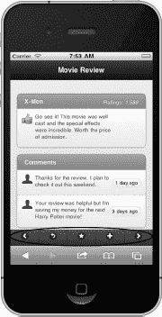

**图 3–10。** *带有标准图标的工具栏可能的操作:*

> 1.  Navigate to pre-audit.
> 2.  Reply and comment.
> 3.  Mark comments as favorites.
> 4.  Add a new comment to the movie.
> 5.  Navigate to the next comment.

创建工具栏需要最少的标记(见清单 3–6)。我们只需要一个无序的按钮列表，用`data-role="navbar"`属性包装在一个 div 中。工具栏按钮是灵活的，将根据设备的宽度均匀分布。在这个例子中，我们使用了 jQuery Mobile 标准可用图标套件中的图标(参见表 4-1 )。

**清单 3–6。** *工具栏(`ch3/toolbar-icons-standard.html` )*

`

  

    <ul>
      <li></li>
      <li></li>
      <li></li>
      <li></li>
      <li></li>
    </ul>
  

`

**提示:**如果你想在导航条上添加耀斑，那么导航条组件同样可以很好地与自定义图标配合使用！如果对自定义图标解决方案感兴趣，我们将在清单 3–10 中演示该解决方案。

#### 带有分段控件的工具栏

您还可以在工具栏中放置一个分段控件，使用户可以访问应用数据的不同视角或不同的应用视图。在 Figure 3–11 中，我们将分段控件放置在工具栏中，以允许用户显示他们日历数据的不同视图。您可能已经注意到，这个分段控件(参见清单 3–7)与我们的标题示例中显示的分段控件示例相同。我们可以在页眉和页脚组件中重用分段控件。分段控件只是一组包装在控件组中的按钮，并根据您的需要进行样式化。在下一节中，我们将展示带有标签栏的分段控件的另一种用法！

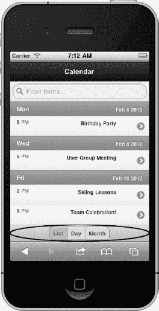

**图 3–11。** *工具栏带分段控件*

**清单 3–7。** *工具栏带有分段控件(`ch3/toolbar-segmented-control.html)`*

`<!-- Toolbar with a segmented control -->

  

    <a href="#" data-role="button" class="ui-control-active">List</a>
    <a href="#" data-role="button" class="ui-control-inactive">Day</a>
    <a href="#" data-role="button" class="ui-control-inactive">Month</a>
  

`

### 标签栏

我们也可以将页脚设计成标签栏。选项卡栏使用户能够在应用的不同视图之间切换。如果你不太熟悉标签栏，它们的行为与你在网上找到的基于标签的导航非常相似。选项卡栏通常作为一个持久的页脚放置在屏幕的底部边缘，从应用的任何位置都可以访问它。为了清晰起见，标签栏通常包含同时显示图标和文本的按钮。在下面的例子中，我们将看看三种风格的标签栏。第一个选项卡栏示例将包括 jQuery Mobile 中已经提供的几个标准图标。其次，我们将看到一个使用自定义图标的标签栏示例。jQuery Mobile 可以方便地集成您选择的自定义图标。最后，我们将在同一个 UI 中组合标签栏和分段控件，以允许用户在同一个屏幕上导航和查看不同形式的数据。

#### 带有标准图标的标签栏

最简单的标签栏解决方案(参见图 3–12)是使用 jQuery Mobile 的标准图标集，如清单 3–8 中所详述。关于标准 jQuery Mobile 图标的完整列表，请参考表 4-1 。如果你使用这些标准图标，你的标签栏就不需要额外的样式。

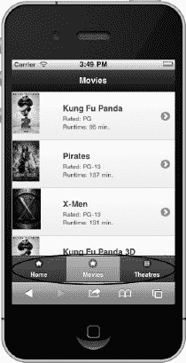

**图 3–12。** *带标准图标的标签栏*

**清单 3–8。** *带标准图标的标签栏(`ch3/tabbar-icons-standard.html` )*

`<!-- tab bar with standard icons -->

  

   <ul>
    <li><a href="#" data-icon="home">Home</a></li>
    <li><a href="#" data-icon="star" class="ui-btn-active">
            Movies</a></li>
    <li><a href="#" data-icon="grid">Theatres</a></li>
   </ul>
  

`

#### 持久标签栏

为了使我们的标签栏持久，我们需要添加一个额外的属性到页脚。为了在页面转换过程中保持页脚的持久性，将`data-id`属性添加到每个选项卡栏的页脚，并将它们的值设置为相同的标识符。例如，在清单 3–9 中，每个标签栏都包含一个标识符`data-id="main-tabbar"`。有了这项新增功能，您的标签栏将在过渡期间保持不变。例如，如果我们点击一个不活动的标签栏，屏幕会“滑动”,而标签栏在转换过程中保持固定不变的状态。此外，当从一个选项卡转换到另一个选项卡时，为了保持每个选项卡栏的活动状态，添加一个类`ui-state-persist`和`ui-btn-active`。下面突出显示了持久选项卡栏的标记。

**清单 3–9。** *持久标签栏*

`<!-- Movies tab bar -->

  

    <ul>
      <li><a href="tabbar-movies.html"
             **class="ui-btn-active ui-state-persist"**>Movies</a></li>
      <li><a href="tabbar-theatres.html">Theatres</a></li>
   </ul>
  

<!-- Theatres tab bar -->

  

    <ul>
      <li><a href="tabbar-movies.html">Movies</a></li>
      <li><a href="tabbar-theatres.html"
             **class="ui-btn-active ui-state-persist"**>Theatres</a></li>
    </ul>
  

`

#### 标签栏带有自定义图标

想在标签栏或工具栏上添加自定义图标吗？jQuery Mobile 支持添加自定义图标，只需要很少的标记。例如，在下面的标签栏示例中(参见图 3–13)，我们包含了来自 Glyphish 的几个第三方图标。 1

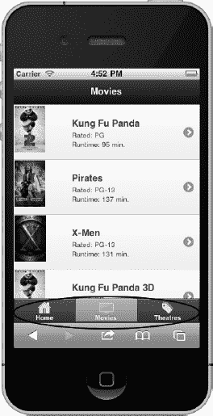

**图 3–13。** *带自定义图标的标签栏*

为了支持自定义图标的添加，我们需要添加`data-icon="custom"`属性、一些用于定位的自定义样式，以及将每个按钮与其样式相关联的 id 引用。下面的清单 3–10 重点介绍了这些新增内容。

__________

1 见`[`glyphish.com/`](http://glyphish.com/)`。图标由 Joseph Wain 创作，并根据知识共享署名 3.0 美国许可证进行许可。

**提示:**这个自定义图标解决方案同样适用于工具栏。事实上，通过简单地删除按钮上的文本，就可以创建一个带有自定义图标的细长工具栏！

**清单 3–10。** *标签栏带有自定义图标(`ch3/tabbar-icons-custom.html)`*

`<!-- tab bar with custom icons -->

  

   <ul>
    <li><a href="#" id="home" data-icon="custom">Home</a></li>
    <li><a href="#" **id="movies" data-icon="custom"**
           class="ui-btn-active">Movies</a></li>
    <li><a href="#" id="theatres" data-icon="custom">Theatres</a></li>
   </ul>
  

`

#### 带分段控件的标签栏

至此，我们已经看到了标签栏和分段控件的例子。把两者融合在一起怎么样！我们可以利用持久标签栏来帮助导航我们的站点，并且我们可以利用分段控件来显示我们数据的不同视图。在下面的示例中(参见图 3–14)，我们创建了一个用户界面，允许用户在家庭、电影和剧院选项卡之间导航。当用户选择电影选项卡时，我们在标题中显示分段控件，以允许用户帮助过滤他们的电影列表。在本例中，我们完全删除了标题文本，因为活动选项卡突出显示了页面的标题。有关本示例的完整源代码列表，请参考 CH3/tabbar-and-segmented-control . html。

**图 3–14。** *带分段控件的标签栏*

### 总结

在本章中，我们发现了 jQuery Mobile 中几乎所有可能的页眉和页脚组合。jQuery Mobile 有一组丰富的组件，可以极大地简化导航和数据管理需求。我们看到标签栏解决方案提供了在应用内不同视图之间切换的能力。我们回顾了几种有助于管理当前屏幕上的对象的工具栏配置。我们还添加了分段控件，让用户能够访问应用数据的不同视角。此外，每个组件的外观都很灵活。每个组件都是可主题化的，我们可以用图标、文本或者两者的组合来设计我们的按钮。在下一章中，我们将回顾所有可能的按钮样式选项，并看看我们可以在 jQuery Mobile 中用于基于表单的开发的组件。