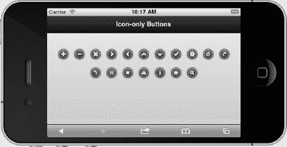
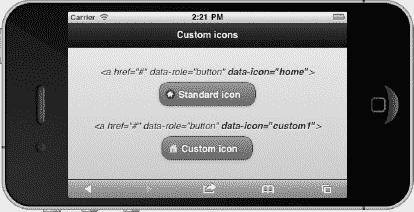
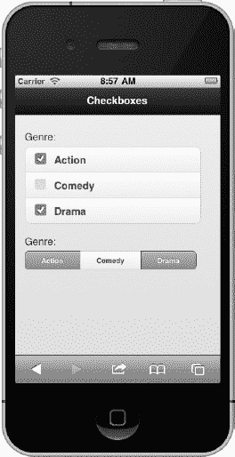
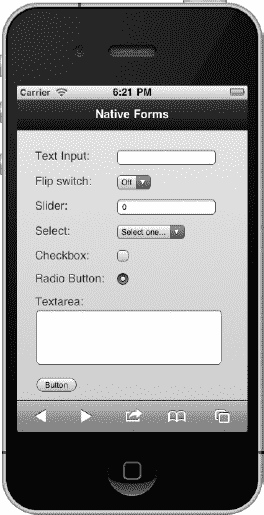

# 四、表单元素和按钮

移动应用必须支持高效的用户体验。由于这个原因，很少看到有大量表单字段的移动应用。事实上，我们的应用对用户的要求越少，用户和应用的效率就越高。移动网络正在慢慢采用设备 API[1](#CH-4-FN-1)，这些 API 允许开发者通过最少的用户交互来收集大量信息。例如，74%的移动开发者在他们的应用 [2](#CH-4-FN-2) 中使用地理定位。地理定位允许我们通过简单的点击确认按钮来收集用户的国家、州、城市、邮政编码和地址信息。尽管这些设备 API 使用户体验更加高效，但对于设备不支持地理定位的用户来说，我们仍然需要用表单字段的传统方式来捕获数据。

在这一章中，我们将从最流行的移动用户界面组件开始，按钮。按钮的样式和配置方式有很多种。我们将会看到用文本、图标以及两者的组合来设计按钮的例子。

接下来，我们将详细了解每一个标准 HTML 表单组件，并确定它们能很好解决的常见用例。您会惊喜地发现每个表单组件都被 jQuery Mobile 自动优化了——这个特性可以方便地在所有设备上提供统一的用户体验。我们还将回顾每个表单元素特有的 jQuery Mobile 数据属性，并查看修改这些属性来配置和样式化表单的代码示例。此外，我们将回顾与每个表单组件相关联的插件，看看当用户需要更动态的体验时，我们如何利用插件 API 来动态地创建、增强和更新我们自己的组件。

__________

1 见`[http://www.w3.org/2009/dap/](http://www.w3.org/2009/dap/)`。

2 见`[http://www.webdirections.org/sotmw2011/](http://www.webdirections.org/sotmw2011/)`。

最后，我们将探索`Mobiscroll`插件的特性，它为日期选择器、搜索过滤器或自定义列表提供了一个优雅而灵活的界面。

### 按钮

按钮是移动应用中最常用的控件，因为它们提供了非常高效的用户体验。我们已经在很多例子中看到了按钮，包括对话框、动作表、分段控件和标题。jQuery Mobile 按钮有多种风格。我们有链接按钮、表单按钮、图像按钮、纯图标按钮以及文本和图标相结合的按钮。正如所料，jQuery Mobile 按钮的样式都是一致的。无论你有一个链接按钮还是一个基于表单的按钮，框架都会给它们相同的样式。在回顾这些按钮时，我们还将确定每种按钮的常见使用案例。

#### 链接按钮

链接按钮是最常用的按钮类型。每当你需要将一个普通的链接设计成一个按钮时，给链接添加`data-role=”button”`属性(参见[Figure 4–1](#fig_4_1))。

**图 4–1。** *链接按钮*

默认情况下，页面内容部分中的按钮被设计为块级元素，因此它们将填充其外部容器的整个宽度。然而，如果你想要一个更紧凑的按钮，其宽度仅与里面的文本和图标一样，那么添加`data-inline="true"`属性(参见[清单 4–1](#list_4_1))。

**清单 4–1。** *链接按钮(ch4/link-buttons.html)*

`<a href="#" **data-role="button"**>Link button</a>
<a href=*"#"* **data-role=*"button"* data-inline=*"true"***>Disagree</a>
<a href=*"#"* **data-role=*"button"* data-inline=*"true"***>Agree</a>`

**注意:**如果你想让按钮并排放置，占据整个屏幕宽度，使用两列网格。我们将在第 6 章的[中更详细地探讨灵活的网格布局。具体来说，对于 2 列网格布局，参考](06.html#ch6)[列表 6-2](06.html#list_6_2) 。

#### 表单按钮

基于表单的按钮(见[清单 4–2](#list_4_2))实际上比基于链接的按钮更容易设计，因为你不需要做任何修改。为了简单起见，框架会自动将任何`button`或`input`元素转换成一个移动样式的按钮(见[图 4–2](#fig_4_2))。

**清单 4–2。** *表单按钮(ch4/form-buttons.html)*

`<button type="submit">Button element</button>
<input type="button" value="button" />
<input type="submit" value="submit" />
<input type="reset" value="reset" />` 

**图 4–2。** *表单按钮*

**提示**如果您想要禁用表单按钮或任何其他控件的自动初始化，您可以将`data-role=”none”`属性添加到元素中，jQuery Mobile 不会增强该控件:

`<button data-role=”none”>Button element</button>`

#### 图像按钮

将图像设计成按钮只需要您最少的努力。当用锚点标签包装图像时，不需要修改(参见[图 4–3](#fig_4_3)和[清单 4–3](#list_4_3)中的相关代码)。但是，当将图像附加到输入元素时，您需要添加`data-role="none"`属性。

**图 4–3。** *图像按钮*

**清单 4–3。** *图片按钮(ch4/image-buttons.html)*

`<!-- Image buttons -->
<input type="image" src="cloud.png" data-role="none" />
`

#### 用图标设计按钮的样式

jQuery Mobile 包括一组在移动应用中常用的标准图标，其中包括一个白色图标精灵，该精灵在图标后面有一个半透明的黑色圆圈，以确保在任何背景颜色上都有良好的对比度(参见[图 4–4](#fig_4_4))。

**图 4–4。** *带有标准图标的按钮*

通过添加`data-icon`属性并指定显示哪个图标，可以将图标添加到任何按钮上(参见[清单 4–4](#list_4_4))。

**清单 4–4。** *按钮带图标(CH4/icon-Buttons-standard . html)*

`<!-- Buttons with standard icons.  Refer to Table 4-1 for icon list. -->
<input type="button" value="Delete" **data-icon="delete"**/>
<a href=*"#"* data-role=*"button"* **data-icon=*"plus"***>Button link</a>
<button **data-icon=*"minus"***>Button element</button>`

[Table 4–1](#tab_4_1)包含每个`data-icon`属性值及其对应的图标图像。除了`data-icon="custom".`之外，每个属性值都有一个关联的图像，我们将在下一节看到一个与自定义图标集成的例子。

#### 纯图标按钮

只有图标的按钮通常用在标题、工具栏和标签栏中，因为它们占用很少的空间(见[Figure 4–5](#fig_4_5))。

**图 4–5。** *图标按钮*

在上一章中，我们看到了几个纯图标按钮的例子。我们最初在[图 3-4](03.html#fig_3_4) 中看到一个`"plus"`图标，允许用户点击“添加”图标来创建一个新的电影评论。我们还看到工具栏中使用的纯图标按钮(见[图 3-10](03.html#fig_3_10) )和标签栏(见[图 3-12](03.html#fig_3_12) )来帮助表达每个按钮的含义。要创建一个只有图标的按钮，将`data-iconpos=”notext”`属性添加到按钮中(参见[清单 4–5](#list_4_5))。

**清单 4–5。** *图标专用按钮(ch4/icon-only-buttons.html)*

`
<button data-icon=*"search"* **data-iconpos=*"notext"***>Search</button>`

**注意:**每个白色图标后面的半透明黑色圆圈确保了在任何背景颜色上的良好对比度，并且与 jQuery Mobile 主题化系统配合良好。例如，在下图中，第一行中的图标采用 data-theme="a "样式，第二行中的图标采用 data-theme="c "样式。为了保持视觉一致性，建议创建一个 18 × 18 像素的白色图标，保存为 PNG-8，具有 alpha 透明度。

#### 图标定位

默认情况下，图标是左对齐的(参见[图 4–6](#fig_4_6))。然而，你可以通过添加按钮的`data-iconpos`属性来明确地将图标对齐到任意一边，该属性的值对应于对齐的一边(参见[清单 4–6](#list_4_6))。

**图 4–6。** *图标定位*

**清单 4–6。** *图标专用按钮(ch4/icon-positioning.html)*

`<a href=”#” data-role=*"button"* data-icon=*"arrow-u"***data-iconpos="top"**>
<a href=*"#"* data-role=*"button"* data-icon=*"arrow-l"* **data-iconpos=”left”**>
<a href=*"#"* data-role=*"button"* data-icon=*"arrow-r"* **data-iconpos=*"right"***>
<a href=*"#"* data-role=*"button"* data-icon=*"arrow-d"* **data-iconpos=*"bottom"***>`

#### 带有自定义图标的按钮

还记得我们在[图 3-13](03.html#fig_3_13) 中给我们的标签栏添加自定义的图形图标吗？我们可以以同样的方式将按钮与自定义图标集成在一起(参见[图 4–7](#fig_4_7))。

**图 4–7。** *自定义图标*

然而，通过按钮，我们可以应用一个更简单的解决方案，如[清单 4–7](#list_4_7)所示。向按钮添加自定义图标需要两个步骤:

> 1.  Add a `data-icon` attribute to the link. The value of this property must uniquely identify the custom icon. For example, `data-icon=”my-custom-icon”.`
> 2.  Create a CSS class property to set the background source for our custom image. The name of the property must be named ". ui-icon- 。 For example, if our data icon value is "`my-custom-icon`", our new CSS class attribute will be ". `ui-icon-my-custom-icon` ”。

**清单 4–7。** *自定义图标集成(CH4/icon-buttons-Custom . html)*

`
<a href="#" data-role="button" **data-icon="custom1"**>Custom</a>`

**提示:**我们定制图像的背景源是用数据 URI 方案加载的。这可能是从外部加载小图像的一种高性能替代方法。例如，通过内嵌自定义图像，我们消除了一个 HTTP 请求。然而，这种技术的主要缺点是 base64 编码的字符串比原始图像大 1/3 倍。要查看完整的 base64 编码字符串，请参考 ch4/icon-buttons-custom.html 中的源代码清单。

#### 分组按钮

到目前为止，所示的每个按钮示例都将每个按钮与其他按钮分开。但是，如果您想将按钮组合在一起，可以将按钮包装在一个控件组中。例如，我们在第 3 章中的[分段控制示例就是这样分组的(参见](03.html#ch3)[图 4–8](#fig_4_8))。

**图 4–8。** *分组按钮*

为了获得这种效果，将一组按钮包装在具有`data-role=”controlgroup”`属性的容器中(参见[清单 4–8](#list_4_8))。

**清单 4–8。** *分组按钮(CH3/header-segmented-control . html)*

`

    <a href="#" data-role="button">In Theatres</a>
    <a href="#" data-role="button">Coming Soon</a>
    <a href="#" data-role="button">Top Rated</a>

`

默认情况下，框架会将按钮垂直分组，移除所有的边距，并在按钮之间添加边框。此外，为了在视觉上增强该组，第一个和最后一个元素将采用圆角样式。

因为默认情况下按钮是垂直放置的，所以我们可以通过添加`data-type=”horizontal”`属性来设计它们的水平样式。与占用其外部容器整个宽度的垂直按钮不同，水平按钮只和其内容一样宽。

**注意:**水平分组按钮时，控件组宽度超出屏幕宽度时会换行。

#### 主题按钮

像所有 jQuery Mobile 组件一样，按钮将从它们的父容器继承主题。此外，当你需要用不同的颜色设计按钮时，你可以将你选择的主题应用到任何添加了`data-theme`属性的按钮上(参见[清单 4–9](#list_4_9))。

**清单 4–9。** *主题按钮(ch2/action-sheet2.html)*

`<a href="#home" data-role="button" **data-theme="b"**>YouTube</a>
<a href="#home" data-role="button" **data-theme="b"**>Facebook</a>
<a href="#home" data-role="button" **data-theme="b"**>Email</a>
<a href="#home" data-role="button" **data-theme="c"**>Cancel</a>`

例如，在我们的对话框和动作表示例中，我们根据第 2 章中的“对话框 UX 指南”来设计按钮，以提高可用性(参见[图 4–9](#fig_4_9))。

**图 4–9。** *主题按钮*

#### 动态按钮

`button`插件是自动增强原生按钮的小部件。我们可以利用这个插件来动态地创建、启用和禁用按钮。如果您需要在代码中动态创建按钮，有两个选项可用。您可以使用标记驱动的方法或者通过显式设置`button`插件上的选项来动态创建按钮。

在标记驱动的解决方案中，我们为新按钮创建 jQuery Mobile 标记，将其附加到内容容器中，并对其进行增强(参见[清单 4–10](#list_4_10))。

**清单 4–10。** *创建带有标记驱动选项的动态按钮(ch4/dynamic-buttons.html)*

`// Add link button to content container and enhance it
$( '<a href="#" data-role="button" data-icon="star" id=”b1”>Star</a>' )
        .appendTo( “.ui-content” )
        .button();

// Add form button after the first button and enhance it` `$( '<input type="submit" id="b2" value="Button 2" data-theme=”a” />' )
        .insertAfter( "#b1" )
        .button();`

对于选项驱动的解决方案，我们创建一个本地链接，将按钮插入页面，然后应用我们的按钮增强(参见[清单 4–11](#list_4_11))。

**清单 4–11。** *创建带有插件驱动选项的动态按钮(ch4/dynamic-buttons.html)*

`// Create a new button, insert it after button 2, and enhance it.
$**(** '<a href="#">Home</a>' **)**
        .insertAfter( “#b2” )
        **.**button**({**
                'icon'**:**'home'**,**
                'inline'**:** true**,**
                'shadow'**:** true**,**
                'theme'**:** 'b'
        **})**;`

在我们的最后一个例子中，我们创建了多个表单按钮，而不是为每个按钮单独调用`button`插件，我们通过触发页面容器上的`“create”`方法来增强它们(参见[清单 4–12](#list_4_12))。`button`插件还公开了`enable`和`disable`方法，我们可以利用它们来动态启用和禁用按钮，如[清单 4–12](#list_4_12)所示。

**清单 4–12。** *创建按钮并动态禁用/启用按钮(ch4/dynamic-buttons.html)*

`// Create multiple form buttons
$( '<button id="button3">Button3</button>' ).insertAfter( “#button2” );
$( '<button id="button4">Button4</button>' ).insertAfter( “#button3” );

// Enhance all widgets on the page
$.mobile.pageContainer.trigger( "create" );

// Disable form button
$( “#button3” ).button( “disable” );

// Enable form button
$( “#button3” ).button( “enable” );`

**提示:**触发页面容器上的“create”方法会增强页面上的所有组件:$ . mobile . page container . trigger(" create ")；当您需要一次增强多个页面组件时，这是一种方便的方法。

##### 按钮选项

框架用来动态增强按钮的`button`插件有以下选项:

`**corners** *boolean*`

`**default:** true`

默认情况下，按钮会有圆角。将此选项设置为 false 将删除圆角。该选项也作为数据属性公开:`data-corners=”false”.`

`$( “#button1” ).button({ corners: false });`

`**icon** *string*`

`**default:** null`

设置按钮的图标。该选项也作为数据属性公开:`data-icon=”plus”.`

`$( “#button1” ).button({ icon: “home” });`

`**iconpos** *string*`

`**default:** “left”`

设置图标位置。可能的值有:`“left”, “right”, “top”, “bottom”,`和`“notext”`。`“notext”`值将把按钮显示为没有文本的纯图标按钮。该选项也作为数据属性公开:`data-iconpos=”notext”.`

`$( “#button1” ).button({ iconpos: “notext” });`

`**iconshadow** *boolean*`

`**default: true**`

如果为真，框架将为图标添加阴影。该选项也作为数据属性公开:`data-iconshadow=”false”.`

`$( “#button1” ).button({ iconshadow: false });`

`**initSelector** *CSS selector string*`

`**default:** "button, [type='button'], [type='submit'], [type='reset'],
[type='image']"`

initSelector 用于定义选择器(元素类型、数据角色等。)用于触发`widget`插件的自动初始化。例如，默认选择器匹配的所有元素都将被`button`插件增强。要覆盖这个选择器，绑定到`mobileinit`事件，并根据需要更新选择器:

`$( document ).bind( "mobileinit", function(){
$.mobile.button.prototype.options.initSelector = "...";
});`

`**inline** *boolean*`

`**default:** false`

如果设置为 true，这将使按钮显示为内嵌按钮。默认情况下，按钮将占用其容器的整个宽度。相比之下，内嵌按钮只占用文本的宽度。该选项也作为数据属性公开:`data-inline=”true”.`

`$( “#button1” ).button({ inline: true });`

`**shadow** *boolean*`

`**default:** true`

默认情况下，按钮会应用投影。将此选项设置为 false 将会移除投影。该选项也作为数据属性公开:`data-shadow=”false”.`

`$( “#button1” ).button({ shadow: false });`

##### 按钮方法

`button`插件有以下几种方法:

`**enable**`:启用被禁用的按钮
`$( "#button1" ).button( "enable" );`

`**disable**`:禁用一个按钮
`$( "#button1" ).button( "disable" );`

##### 按钮事件

`button`插件支持以下事件:

`create`创建按钮时触发

创建自定义按钮时会触发此事件。它不用于创建自定义按钮。

`$( '<a href="#" id="button2">Button2</a>' )
        .insertAfter( "#button1" )
        .button({
                theme: 'a',
                create: function(event) {
                        console.log( "Creating button..." );
                }
         })`

### 表格元素

jQuery Mobile 将增强所有原生表单元素，使它们在移动设备上更具吸引力和可用性。然而，不支持这些增强功能的旧浏览器将逐渐回归到原生元素，以保持可用的体验。

#### 表格基础知识

在 jQuery Mobile 中构建基于表单的应用的方法与我们传统上在 Web 上构建表单的方法非常相似。尽管为了清楚起见，应该指定一个`action`和`method`属性，但它们不是必需的。默认情况下，`action`默认为当前页面的相对路径，可以用`$.mobile.path.get()`找到，未指定的`method`默认为`get`。

当提交表单时，它们会以默认的`“slide”`转换方式转换到下一页。然而，我们可以用之前用来管理链接的相同数据属性来配置表单转换行为(参见[清单 4–13](#list_4_13))。

**清单 4–13。** *提交表格(ch4/form-request.html)*

`<form action=*"/save.html"* method=*"post"* **data-transition="pop"**>
        <label for=*"email"*>Email:</label>
        <input type=*"email"* name=*"email"* id=*"email"* value=*""* />
        <button type=*"submit"* name=*"submit"*>Submit</button>
</form>`

我们可以向表单元素添加以下属性来管理转换或禁用 Ajax:

*   `data-transition=”pop”`
*   `data-direction=”reverse”`
*   `data-ajax=”false`

**注意:**确保每个表单的`id`属性在整个站点中是唯一的，这一点很重要。如前所述，在转换时，jQuery Mobile 会将“from”和“to”页面同时加载到 DOM 中，以完成平稳的转换。为了避免任何冲突，表单 id 必须是唯一的。

**提示:**在构建表单时，建议将每个表单字段与其对应的标签进行语义关联。标签的 **`for`** 属性和输入的 **`id`** 属性建立了这样的关系:

`<label **for="name"**>Name:</label>

<input type="text" name="name" **id="name"** value="" />`

该协会创建了辅助技术可访问的符合 508 的应用。政府或国家机构经常要求可访问性。您可以使用 WAVE [3](#CH-4-FN-3) 工具测试您的移动应用的兼容性。

#### 文本输入

文本输入是移动设备上最麻烦的表单域。除非你是世界短信冠军，否则在物理或虚拟的 QWERTY 键盘上输入文本是低效的。这就是为什么自动收集尽可能多的用户信息是有价值的。如前所述，设备 API 可以帮助简化这种用户体验。尽管最小化这些繁琐的任务是一个好的目标，但有时我们必须通过文本输入收集用户反馈。最常见的文本表单字段如[图 4–10](#fig_4_10)所示。

__________

3 见`[http://wave.webaim.org/](http://wave.webaim.org/)`。

**图 4–10。** *文字输入*

从开发人员的角度来看，我们可以创建 jQuery Mobile 表单和文本输入，而不需要额外的标记(参见[清单 4–14](#list_4_14))。可选地，我们可以为我们的文本输入选择一个合适的主题，方法是将`data-theme`属性添加到 input 元素中，以增强表单字段的对比度。

**清单 4–14。** *文本输入(ch4/text-inputs.html)*

`<input **type="text"** name="text" value=”” id=”text” **placeholder="Text"**/>
<input **type="number"** name="number" value="" id=”number” />
<input **type="email"** name="email" value="" id="email" data-theme=”d” />
<input **type="url"** name="url" value="" id="url" />
<input **type="tel"** name="tel" value="" id=”tel” />
<input **type=*"search"*** name=*"search"* value=*""* *id="search"* />
**<textarea** cols=*"40"* rows=*"8"* name=*"textarea"* id=*"textarea"*></textarea>`

**提示:**要以一种可访问的方式隐藏标签，将 ui-hidden-accessible 样式附加到元素上。例如，我们将这种技术应用于图 4-10 中的搜索字段。这将优雅地隐藏标签，同时保持 508 合规性:

`<label for="search" **class="ui-hidden-accessible"**>Search</label>
       <input type="search" id="search" placeholder="Search" />`

构建表单时，将输入字段与其语义类型相关联是很重要的。这种联系有两个好处。首先，当输入字段获得焦点时，它会用适当的键盘提示用户。例如，指定为`type=”number”`的字段将自动提示数字键盘(参见[图 4–11](#fig_4_11))。同样，映射有`type=”tel”`的字段将提示电话专用键盘(参见[图 4–12](#fig_4_12))。

**图 4–11。** *数字键盘*

**图 4–12。** *电话键盘*

此外，该规范允许浏览器应用适用于字段类型的验证规则。提交表单时，浏览器对自动验证的支持仍然很少，但会随着时间的推移而改进。有关移动输入类型和属性的完整列表，请参考 Peter-Paul Koch 的“移动输入测试” [4](#CH-4-FN-4) 。它显示了所有可用的移动输入类型和属性及其相关的浏览器支持。

大多数移动浏览器都支持的另一个特性是`placeholder`属性。该属性为文本输入添加一个提示或标签，当字段获得焦点时自动消失(参见[清单 4–14](#list_4_14))。

**注意:**搜索字段(`type=”search”`)的样式和行为与其他输入类型略有不同。它包含一个左对齐的“搜索”图标，它的角是药丸形状，当用户输入文本时，一个“删除”图标将出现在右对齐的位置，以帮助清除字段。

##### 动态文本输入

`textinput`插件是自动增强文本输入和文本区域的小部件。我们可以利用这个插件来动态地创建、启用和禁用文本输入(参见[清单 4–15](#list_4_15))。

**清单 4–15。** *textinput 插件示例(ch4/dynmic-text-input.html)*

`// Create text input with markup-driven options
$( '<input type="text" name="text1" value="" data-theme="c" />' )
        .insertAfter( “#firstName” )
        .textinput();

// Create text input with plugin-driven options
$( '<input type="text" name="text2" id="text2" value="" />' )
        .insertAfter( “#text1” )
        .textinput({
                theme: 'c'
        });

// Disable text input
$( “#text1” ).textinput( “disable” );

// Enable text input
$( “#text1” ).textinput( “enable” );`

__________

4 见`[http://www.quirksmode.org/html5/inputs_mobile.html](http://www.quirksmode.org/html5/inputs_mobile.html)`。

##### 文本输入选项

`textinput`插件有以下选项:

`**initSelector** *CSS selector string*`

`**default:** "input[type='text'], input[type='search'], :jqmData(type='search'),
input[type='number'], :jqmData(type='number'), input[type='password'],
input[type='email'], input[type='url'], input[type='tel'], textarea"`

initSelector 用于定义选择器(元素类型、数据角色等。)用于触发`widge` t 插件的自动初始化。例如，默认选择器匹配的所有元素都将被`textinput`插件增强。要覆盖这个选择器，绑定到`mobileinit`事件，并根据需要更新选择器:

`$( document ).bind( "mobileinit", function(){
        $.mobile.textinput.prototype.options.initSelector = "...";
});`

T3】

`**theme** *string*`

`**default:** null. Inherited from parent.`

为文本元素设置主题样本配色方案。这是一个从 a 到 z 的字母，映射到你的主题中包含的样本。默认情况下，如果没有显式设置，所有元素都将继承与其父容器相同的样本颜色。该选项也作为数据属性公开:`data-theme=”a”.`

`$( “#text1” ).textinput({ theme: "a" });`

##### 文字输入方法

`textinput`插件有以下方法:

`**enable:**` *启用一个禁用的文本输入或文本区*。

`$( “textarea” ).textinput( “enable” );`

T3】

**`disable:`** *禁用一个 textinput 或 textarea。*

`$( “textarea” ).textinput( “disable” );`

##### 文本输入事件

`textinput`插件支持以下事件:

`**create** *triggered when a text input is created*`

创建自定义文本输入时触发此事件。它不用于创建自定义输入。

`$( '<input type="text" name="text2" id="text2" value="" />' )
        .textinput({
                theme: 'c',
                create: function(event) {
                        console.log( "Creating text input..." );
                }
        })
        .insertAfter( “#text1” );`

#### 选择菜单

jQuery Mobile framework 将自动增强所有本地 select 元素，不需要额外的标记(参见[清单 4–16](#list_4_16))。

**清单 4–16。** *原生选择菜单(CH4/select-menu-Native . html)*

`<label for="genre">Genre:</label>
<select name="genre" id="genre">
        <option value="action">Action</option>
        <option value="comedy">Comedy</option>
        <option value="drama">Drama</option>
</select>`

这个转换将用一个 jQuery Mobile 样式的按钮替换原来的 select，该按钮包含一个右对齐的向下箭头图标。默认情况下，点击此选择按钮将启动操作系统的本机选择选择器(参见[图 4–13](#fig_4_13))。或者，正如我们将在下一节中看到的，我们可以配置 jQuery Mobile 来显示定制的选择菜单。

**图 4–13。** *选择菜单*

用户做出选择后，选择按钮将显示所选选项的值。如果文本值对于按钮来说太大，文本将被截断，并显示一个尾随省略号。此外，在选择多个选项后，多选按钮将显示一个计数气泡或标记(参见[图 4–13](#fig_4_13))。这是一种突出显示所选选项数量的视觉效果。

**注意:**在创建带有`multiple="multiple"`属性的选择菜单时，一些移动平台不支持多选功能。因此，建议在必要时使用自定义菜单。

##### 自定义选择菜单

作为本地呈现选项列表的替代，我们可以选择在自定义 HTML/CSS 视图中呈现我们的选择菜单(参见[图 4–14](#fig_4_14))。

**图 4–14。** *自定义选择菜单*

对于这个视图，向 select 元素添加一个`data-native-menu="false"`属性(参见[清单 4–17](#list_4_17))。

**清单 4–17。** *自定义选择菜单(ch4/select-menu-cstom.html)*

`<label for="genre">Genre:</label>
<select name="genre" id="genre" **data-native-menu="false"** data-theme=”a”>
        <option value="">Select one...</option>
        <option value="action">Action</option>
        <option value="comedy">Comedy</option>
        <option value="drama">Drama</option>
</select>`

下面列出了客户优势与本地优势的对比。

定制优势:

*   为所有设备提供统一的用户体验。
*   自定义菜单为多选选项列表提供了通用支持。
*   添加了一种处理占位符选项的优雅方式。我们将在下一节回顾占位符选项。
*   自定义菜单是可主题化的(参见[清单 4–17](#list_4_17))。

定制缺点:

*   不如本地呈现的选择菜单性能好。当比较包含许多选项的菜单时，这一点会更加明显。

**注意:**你也可以利用`Mobiscroll` [5](#CH-4-FN-5) 插件作为定制选择菜单的另一种选择。在本章的最后，我们包括了这个插件的几个例子，因为我们演示了它的日期选择器和搜索过滤器的用法。

##### 占位符选项

占位符是自定义选择菜单独有的功能。占位符有三个好处:

1.  占位符要求用户做出选择。默认情况下，如果没有配置占位符，将选择列表中的第一个选项。
2.  占位符可用于显示未选中选择按钮的提示文本(参见[图 4–14](#fig_4_14))。例如，未选中的票据交付字段显示为占位符文本“选择一个...”。
3.  显示选项列表时，一个占位符也作为标题出现(参见[图 4–14](#fig_4_14))。

__________

5 见`[http://code.google.com/p/mobiscroll/](http://code.google.com/p/mobiscroll/)`。

我们可以通过三种方式配置占位符:

1.  我们可以向没有值的选项添加文本。
    `<option value="">Select one...</option>`
2.  当选项包含文本和值时，我们可以将`data-placeholder=”true”`属性添加到选项中:
    `<option value="null" data-placeholder="true">Select one...</option>`
3.  当您想使该字段成为没有提示文本或标题的必填字段时，请使用空选项:
    `<option value=""></option>`

##### 动态选择菜单

`selectmenu`插件是自动增强选择菜单的小部件。有了这个插件，我们可以动态地创建、启用、禁用、打开和关闭选择菜单(参见[清单 4–18](#list_4_18))。

**清单 4–18。** *动态选择菜单(CH4/Dynamic-select-menu . html)*

`// Create select menu with markup-driven options        
$**(** '<select name="select1" id="select1" data-theme="e">...</select>' **)**
        **.**insertAfter**(** “#foo” **)**
        **.**selectmenu**();**

// Create select menu with plugin-driven options
$**(** '<select name="select2" id="select2">...</select>' **)**
        **.**insertAfter**(** “#select1” **)**
        **.**selectmenu**({**
                theme**:** "e"**,**
                overlayTheme**:** "c"**,**
                disabled**:** false**,**
                nativeMenu**:** false
        **});**`

##### 选择菜单选项

`selectmenu`插件有以下选项:

`**corners** *boolean*`

`**default:** true`

与其他按钮类型一样，默认情况下，选择菜单按钮具有圆角。将此选项设置为 false 将删除圆角。该选项也作为数据属性公开:`data-corners=”false”.`

`$( “#select1” ).selectmenu({ corners: false });`

`**disabled** *boolean*`

`**default:** false`

禁用元素。`selectmenu`插件也有`enable`和`disable`方法来动态启用和禁用控件。

`$( “#select1” ).selectmenu({ disabled: true });`

`**hidePlaceholderMenuItems** *boolean*`

`**default:** true`

默认情况下，当选择菜单打开时，占位符菜单项将从视图中隐藏。要使占位符项可选，请将该值设置为 false。

`$( “#select1” ).selectmenu({ hidePlaceholderMenuItems: false });`

`**icon** *string*`

`**default:** “arrow-d”`

设置选择按钮的图标。该选项也作为数据属性公开:`data-icon=”plus”.`

`$( “#select1” ).selectmenu({ icon: “plus” });`

`**iconpos** *string*`

`**default:** “right”`

设置图标位置。可能的值有:`“left”, “right”, “none”,`和`“notext”.``“notext”`值将选择显示为一个只有图标的按钮，没有占位符文本。`“none”`值将完全移除图标。这个选项也作为一个数据属性公开:`data-iconpos=”none”.`

`$( “#select1” ).selectmenu({ iconpos: “notext” });`

`**iconshadow** *boolean*`

`**default:** true`

如果为真，框架将为图标添加阴影。该选项也作为数据属性公开:`data-iconshadow=”false”.`

`$( “#select1” ).selectmenu({ iconshadow: false });`

`**initSelector** *CSS selector string*`

`**default:** "select:not(:jqmData(role='slider'))"`

initSelector 用于定义选择器(元素类型、数据角色等。)来触发`widget`插件的自动初始化。例如，默认选择器匹配的所有元素都将被`selectmenu`插件增强。要覆盖这个选择器，绑定到`mobileinit`事件，并根据需要更新选择器:

`$( document ).bind( "mobileinit", function(){
        $.mobile.selectmenu.prototype.options.initSelector = "..";`

`});`

`**inline** *boolean*`

`**default:** false`

如果设置为 true，这将使选择按钮显示为内嵌按钮。默认情况下，选择按钮将占用其容器的整个宽度。相比之下，内嵌按钮只占用占位符文本的宽度。这个选项也公开为一个数据属性:`data-inline=”true”`。

`$( “#select1” ).selectmenu({ inline: true });`

`**nativeMenu** *boolean*`

`**default:** true`

默认情况下，选择按钮将启动操作系统的本机选择选择器。要在自定义 HTML/CSS 视图中呈现选择菜单，请将该值设置为 false。该选项也作为数据属性公开:`data-native-menu=”false”.`

`$( “#select1” ).selectmenu({ nativeMenu: false });`

`**shadow** *boolean*`

`**default:** true`

默认情况下，选择按钮将应用投影。将此选项设置为 false 将会移除投影。该选项也作为数据属性公开:`data-shadow=”false”.`

`$( “#select1” ).selectmenu({ shadow: false });`

`**theme** *string*`

`**default:** null. Inherited from parent.`

设置元素的主题样本配色方案。这是一个从 a 到 z 的字母，映射到你的主题中包含的样本。默认情况下，这将继承与其父容器相同的样本颜色。该选项也作为数据属性公开:`data-theme=”a”.`

`$(  “#select1”  ).selectmenu({ theme: "a" });`

##### 选择菜单方式

`selectmenu`插件有以下方法:

`**enable:**` *启用一个禁用的选择菜单*

`$( “#select1” ).selectmenu( “enable”);`

`**disable**` : *禁用选择菜单。*

`$( “#select1” ).selectmenu( “disable” );  `

`**open**` : *打开一个关闭的选择菜单。此方法仅适用于自定义选择。*

`$( “#select1” ).selectmenu( “open” );`

`**close:**` *关闭一个打开的选择菜单。此方法仅适用于自定义选择。*

`$( “#select1” ).selectmenu( “close” );`

`**refresh**` : *更新自定义选择菜单。*

这将更新自定义选择菜单，以反映本地选择元素的值。例如，如果本地选择的 selectedIndex 被更新，我们可以调用“刷新”来重建自定义选择。如果传递一个 true 参数，可以强制进行刷新和重建。

`// Select the third menu option and refresh the menu
        var myselect = $( "#select1" );
        myselect[0].selectedIndex = 2;
        myselect.selectmenu( "refresh" );

        // refresh and rebuild the list
        myselect.selectmenu( “refresh”, true );`

##### 选择菜单事件

`selectmenu`插件支持以下事件:

`**create:**`创建选择菜单时触发

创建自定义选择菜单时会触发此事件。它不用于创建自定义元素。

`$( '<select name="select2" id="select2">...</select>' )
**        .**insertAfter**(** “#select1”**)**
        .selectmenu**({**
                create**:** function**(**event**) {**
                        console.log**(** "Creating select menu..." **);**
                **}**
**        });**`

#### 单选按钮

单选按钮将用户的选择限制为单一项目(参见[图 4–15](#fig_4_15))。例如，从几个选项中选择一个应用设置通常是通过单选按钮来完成的，单选按钮因其简单易用而受到青睐。用户可以点击单选按钮的任意位置进行选择，jQuery Mobile 将自动更新底层的表单控件。

**图 4–15。** *单选按钮*

在[清单 4-19](#list_4_19) 中，我们添加了三个额外的属性来帮助样式和定位我们的单选按钮。第一个属性，`data-role=”controlgroup”,`用圆角优雅地将按钮组合在一起。第二个属性`, data-type=”horizontal”,`覆盖默认的定位——垂直——并水平显示按钮。最后，我们为我们的按钮设置了主题。默认情况下，单选按钮将继承其父控件的主题。然而，如果你想为你的单选按钮应用一个替换主题，你可以将`data-theme`属性添加到相应单选按钮的标签中。

**清单 4–19。** *水平单选按钮(ch4/radio-buttons.html)*

`<fieldset data-role="controlgroup" data-type="horizontal">
    <legend>Map view:</legend>
    <input type="radio" name="map" id="map1" value="Map" />
    <label for="map1" **data-theme=”b”**>Map</label>

    <input type="radio" name="map" id="map2" value="Satellite" />
    <label for="map2" **data-theme=”b”**>Satellite</label>

    <input type="radio" name="map" id="map3" value="Hybrid"  />`
`    <label for="map3" **data-theme=”b”**>Hybrid</label>
</fieldset>`

**注意:**如果水平单选按钮的容器不够宽，无法在一行中显示，它们将会换行。如果换行有问题，您可以减小字体大小:`.ui-controlgroup-horizontal .ui-radio label **{**font-size: 13px !important;**}**`

##### 动态单选按钮

`checkboxradio`插件是一个可重用的小部件，可以自动增强单选按钮和复选框。有了这个插件，我们可以动态地创建、启用、禁用和刷新我们的单选按钮(参见[清单 4–20](#list_4_20))。

**清单 4–20。** *动态单选按钮(CH4/Dynamic-radio-buttons . html)*

`// Create radio buttons with markup-driven options
$**(** '<fieldset data-role="controlgroup">
        <legend>Map view:</legend>
        <input type="radio" name="map" id="map1" value="Map" />
        <label for="map1" data-theme="c">Map</label>...</fieldset>'**)**
**        .**insertAfter**(** "#radio1" **);**
$**.**mobile**.**pageContainer**.**trigger**(** "create" **);**

// Create radio buttons with plugin-driven options                
$**(** '<fieldset data-role="controlgroup">
        <legend>Map view:</legend>
        <input type="radio" name="map" id="map1" value="Map" />
        <label for="map1">Map</label>...</fieldset>' **)**
        **.**insertAfter**(** "#radio1" **);**
$**(** “#map1” **).**checkboxradio**({** theme**:** "e" **});**
$**(** “#map2” **).**checkboxradio**({** theme**:** "e" **});**        
$**.**mobile**.**pageContainer**.**trigger**(** "create" **);**`

##### 复选框和单选按钮选项

`checkboxradio`插件有以下选项:

`**initSelector**` *CSS 选择器字符串*

`**default:** "input[type='checkbox'],input[type='radio']"`

initSelector 用于定义选择器(元素类型、数据角色等。)用于触发小部件插件的自动初始化。例如，默认选择器匹配的所有元素都将被`checkboxradio`插件增强。要覆盖这个选择器，绑定到`mobileinit`事件，并根据需要更新选择器:

`$( document ).bind( "mobileinit", function(){
    $.mobile.checkboxradio.prototype.options.initSelector = "...";
});`

`**theme** *string*`

`**default:** null. Inherited from parent.`

为复选框或单选按钮设置主题样本配色方案。这是一个从 a 到 z 的字母，映射到你的主题中包含的样本。默认情况下，这将继承与其父容器相同的样本颜色。该选项也作为数据属性公开:`data-theme=”a”.`

`$( “#element1” ).checkboxradio({ theme: "a" });`

##### 复选框和单选按钮方法

`checkboxradio`插件有以下方法:

`**enable:**` *启用已禁用的复选框或单选按钮。*

`$(“#element1” ).checkboxradio( “enable” );`

`disable: disable a checkbox or radio button.`

`$( “#element1” ).checkboxradio( “disable” );`

`**refresh:**` *更新自定义复选框或单选按钮*

这将更新自定义复选框或单选按钮，以反映本地元素的值。例如，我们可以动态检查一个单选按钮并调用“`refresh`”来重新构建增强的控件。

`// Dynamically set a checkbox or radio element and refresh it.
$( "#elem1" ).attr( "checked", true ).checkboxradio( "refresh" );  `

##### 复选框和单选按钮事件

`checkboxradio`插件支持以下事件:

`**create:**`创建复选框或单选按钮时触发

创建自定义复选框或单选按钮时会触发此事件。它不用于创建自定义元素。

`$( '#element1' )
        .checkboxradio({
                theme: "e",
                create: function(event) {
                        console.log( "Creating new element..." );
                }
});`

#### 复选框

复选框是一种常见的表单控件，允许用户从许多选项的列表中选择多个值(参见[Figure 4–16](#fig_4_16))。用户可以点击复选框按钮的任意位置进行选择，jQuery Mobile 将自动更新底层的表单控件。

**图 4–16***复选框*

样式和定位复选框的标记与我们之前用于单选按钮的标记相同(参见[清单 4–21](#list_4_21))。同样，我们添加了三个附加属性来帮助设置复选框的样式和位置。第一个属性`data-role=”controlgroup”,`用圆角优雅地将复选框元素组合在一起。第二个属性`data-type=”horizontal”,`覆盖按钮的默认垂直位置，并水平显示它们。最后，我们为我们的按钮设置了主题。默认情况下，复选框将继承其父控件的主题。然而，如果你想应用一个替换主题，你可以在相应复选框的标签上添加`data-theme`属性。

**清单 4–21。** *横向复选框(ch4/checkboxes.html)*

`<fieldset **data-role="controlgroup" data-type="horizontal"**>
        <legend>Genre:</legend>
        <input type="checkbox" name="genre" id="c1" />
       <label for="c1" **data-theme=”c”**>Action</label>

       <input type="checkbox" name="genre" id="c2" />
       <label for="c2" **data-theme=”c”**>Comedy</label>

       <input type="checkbox" name="genre" id="c3" />
        <label for="c3" **data-theme=”c”**>Drama</label>
</fieldset>`

**注意:**如果水平复选框的容器不够宽，无法在一行中显示，它们将会换行。如果换行有问题，您可以减小字体大小:

`     .ui-controlgroup-horizontal .ui-checkbox label {
                font-size: 11px !important;                }`

##### 动态复选框

同样，`checkboxradio`插件是自动增强复选框和单选按钮的小部件。有了这个插件，我们可以动态地创建、启用、禁用和刷新我们的复选框(参见[清单 4–22](#list_4_22))。`checkboxradio`插件的完整列表在“动态单选按钮”一节中已有记载。单选按钮和复选框可以重用相同的 API。

**清单 4–22。** *动态复选框(CH4/Dynamic-checkboxes . html)*

`// Create checkboxes with markup-driven options
$( '<fieldset data-role="controlgroup">
        <legend>Genre:</legend>
        <input type="checkbox" name="genre" id="c1" />
        <label for="c1" data-theme="c">Action</label>...</fieldset>' )
        .insertAfter( "#element1" );
$.mobile.pageContainer.trigger( "create" );

// Create checkboxes with plugin-driven options                
$( '<fieldset data-role="controlgroup">
        <legend>Genre:</legend>
        <input type="checkbox" name="genre" id="c3" />
        <label for="c3">Action</label>...</fieldset>' )
        .insertAfter( "#create-cb2" );
$( '#c3' ).checkboxradio({ theme: "e" });
$( '#c4' ).checkboxradio({ theme: "e" });                
$.mobile.pageContainer.trigger( "create" );`

#### 滑块

滑块是一种常见的表单控件，允许用户在最小和最大范围之间选择一个值(见[图 4–17](#fig_4_17))。

**图 4–17。** *滑块*

例如，在我们的例子中，我们用一个滑块来调整音量或亮度，以调整高低设置之间的范围。我们可以调整滑块的最小和最大边界，还可以设置它的默认值。用户可以通过滑动控件或在滑块的相应文本字段中输入值来调整滑块。如[清单 4–23](#list_4_23)所示，jQuery Mobile 不需要额外的标记来增强我们的滑块。任何带有`type=”range”`的输入元素都会被自动优化。

**清单 4–23。** *滑块(ch4/slider.html)*

`<label for="volume">Volume:</label>
<input type="range" name="volume" id="volume" value="5" min="0" max="9"/>`

滑块由两个可主题化的组件组成。有被称为滑块的前景组件和被称为轨道的背景组件。这些组件中的每一个都可以单独设置主题。要主题化滑块，将`data-theme=”a”`属性添加到`input`元素中。此外，为了给音轨添加主题，将`data-track-theme=”a”`属性添加到`input`元素中:

`<input type="range" name="brightness" id="brightness" min="0" max="10" **data-theme="b"**
**data-track-theme="a"**/>`

##### 动态滑块

`slider`插件是一个多用途的小工具，可以自动增强滑块和开关控制。有了这个插件，我们可以动态地创建、启用、禁用和打开开关控制(参见[清单 4–24](#list_4_24))。

**清单 4–24。** *动态滑块(ch4/dynamic-slider.html)*

`// Create slider with markup-driven options
$**(** '<label for="s1">Brightness:</label>
 <input type="range" name="s1" id="s1" min=”0” max=”9” data-theme="d”/>'**)**
**        .**insertAfter**(** "#element1" **);**
$**(** "#s1" **).**slider**();**

// Create slider with plugin-driven options                
$( '<label for="s1">Brightness:</label>
    <input type="range" name="s1" id="s1" min="0" max="10" />' )
        .insertAfter( "#create-s2" );
$( "#s1" ).slider({
        theme: "d",
        trackTheme: "a",
        disabled: false
});`

##### 滑块选项

`slider`插件有以下选项:

`**disabled** *boolean*`

`**default:** false`

禁用控件。`slider`插件也有`enable`和`disable`方法来动态启用和禁用控件。

`$( “#element1” ).slider({ disabled: true });`

`**initSelector**` *CSS 选择器字符串*

`**default:** "input[type='range'], :jqmData(type='range'), :jqmData(role='slider')"`

initSelector 用于定义选择器(元素类型、数据角色等。)来触发`widget`插件的自动初始化。例如，默认选择器匹配的所有元素都将被 `slider`插件增强。要覆盖这个选择器，绑定到`mobileinit`事件，并根据需要更新选择器:

`$( document ).bind( "mobileinit", function(){
        $.mobile.slider.prototype.options.initSelector = "...";`

`});`

`**theme** *string*`

`**default:** null. Inherited from parent.`

设置滑块的主题样本配色方案。这是一个从 a 到 z 的字母，映射到你的主题中包含的样本。默认情况下，这将继承与其父容器相同的样本颜色。该选项也作为数据属性公开:`data-theme=”a”.`

`$( “#element1” ).slider({ theme: "a" });`

`**trackTheme** *string*`

`**default:** null. Inherited from parent.`

为滑块滑动的轨道设置主题样本配色方案。这是一个从 a 到 z 的字母，映射到你的主题中包含的样本。默认情况下，如果没有显式设置，它将继承与其父容器相同的样本颜色。该选项也作为数据属性公开:`data-track-theme=”a”.`

`$( “#element1” ).slider({ trackTheme: "a" });`

##### 滑块方法

`slider`插件有以下几种方法:

**`enable:`** *启用禁用的滑块或开关控制。*

`$(“#element1” ).slider( “enable” );`

**`disable:`** *禁用滑块或开关控制*。

`$( “#element1” ).slider( “disable” );`

**`refresh:`** *更新自定义滑块或开关控件。*

这将更新自定义滑块或开关，以反映本机元素的值。例如，我们可以动态更新我们的开关或滑块，并调用“`refresh`”来重建控件。

`// Set the switch to “on” and refresh it
var switch **=** $**(** "#switch1" **);**
switch**[**0**].**selectedIndex **=** 1**;**`

`switch**.**slider**(** "refresh" **);**`

`// Maximize the slider's volume control and refresh it
$**(** "#volume" **).**val**(** 10 **).**slider**(** "refresh" **);**`

##### 滑块事件

`slider`插件支持以下事件:

**`create:`** 当滑块或开关控件被创建时触发

创建自定义滑块或开关控件时会触发此事件。它不用于创建自定义元素。

`$( '<select name="switch2" id="switch2">...</select>' )
        .insertAfter( “#element1” )
        .slider({
                create: function(event) {
                        console.log( "Creating new element..." );
                });`

#### 开关控制

开关控制(见[图 4–18](#fig_4_18))通常用于管理布尔开/关标志。

**图 4–18。** *开关控制*

例如，开关控件通常是允许用户操作应用设置的首选方式，因为它们简单易用。要翻转开关，用户可以轻触控件或滑动开关。要创建一个开关控件，添加一个带有`data-role=”slider”`和两个选项的选择元素来管理开/关状态(参见[清单 4–25](#list_4_25))。

**清单 4–25。** *开关控制(ch4/switch-control.html)*

`<label for="alerts">Alerts:</label>
<select name="slider" id="alerts" **data-role="slider"**>
        **<option value="off">Off</option>**
        **<option value="on">On</option>**
</select>`

开关控件也由两个主题化组件组成。有被称为滑块的前景组件和被称为轨道的背景组件。这些组件中的每一个都可以单独设置主题。要主题化滑块，将`data-theme=”a”`属性添加到`select`元素中。此外，为了给音轨添加主题，将`data-track-theme=”a”`属性添加到`select`元素中:

`<select name="slider" **data-theme="b" data-track-theme="c"** data-role="slider">` `        <option value="off">Off</option>
        <option value="on">On</option>
</select>`

##### 动态开关控制

如前所述，`slider`插件是自动增强开关控制的小部件。有了这个插件，我们可以动态地创建、启用、禁用和打开开关(参见[清单 4–26](#list_4_26))。`slider`插件的完整列表在之前的“动态滑块”一节中有记载。相同的 API 可重复用于滑块和开关。

**清单 4–26。** *动态开关控件(CH4/Dynamic-switch-control . html)*

`// Create switch with markup-driven options
$( '<select name="switch1" data-role="slider" data-theme="c"></select>' )
        .insertAfter( “#foo” )
        .slider();

// Create switch with plugin-driven options
$( '<select name="switch2" id="switch2">...</select>' )
        .insertAfter( “#switch1” )
        .slider({
                theme: "b",
                trackTheme: "c",
                disabled: false
        });`

#### 原生形态元素

jQuery Mobile 自动增强页面中定义的所有表单元素。然而，如果你想回到本地控制(见[图 4–18](#fig_4_18))这可以在全局或现场级配置(见[清单 4–27](#list_4_27))。

**图 4–19。** *原生形态元素*

**清单 4-27。** *原生表单元素(ch4/native.html)*

`// Selectively choose which elements are native with data-role=”none”
<label for="name">Text Input</label>
<input type="text" name="name" id="name" value="" **data-role="none"** />

<label for="slider2">Switch:</label>
<select name="slider2" id="slider2" **data-role="none"**>
        <option value="off">Off</option>
        <option value="on">On</option>
</select>

// Globally configure native elements by selector
$(document).bind('mobileinit',function(){
        **$.mobile.page.prototype.options.keepNative = "input, select";**
});`

要单独设置一个表单字段以显示其本地控件，请将`data-role=”none”`属性添加到其元素中。或者，当`mobileinit`事件初始化时，您可以通过设置`keepNative`选择器来全局配置哪些表单元素应该本地呈现。例如，在[清单 4–27](#list_4_27)中，我们配置了我们的选择器来自动显示所有的`input`和`select`元素的原始外观。我们将在第 8 章“配置 jQuery Mobile”中更深入地讨论如何配置 jQuery Mobile。

HTML5 提供了几个新的输入类型来帮助收集日期和时间输入。我们现在有了时间、日期、月、周、日期时间和日期时间本地输入类型(参见[清单 4–28](#list_4_28))。

**清单 4–28。** *HTML5 日期(ch4/dates.html)*

`<input **type="time"** name="time" />
<input **type="datetime-local"** name="dtl" />
<input **type="date"** name="date" />
<input **type="month"** name="month" />
<input **type="week"** name="week" />
<input **type="datetime"** name="dt" />`

对这些新的 HTML5 输入类型的支持依赖于浏览器(见`[http://www.quirksmode.org/html5/inputs.html](http://www.quirksmode.org/html5/inputs.html)`)。支持这些功能的新浏览器将显示有用的日期选择器(见[图 4–20](#fig_4_20)),不支持的浏览器将退回到文本输入。

**图 4–20。** *HTML5 日期*

#### Mobiscroll Date Picker

Mobiscroll [6](#CHP-4-FN-6) 是一款针对触摸屏设备优化的日期选择器。Mobiscroll API 是可配置的， [7](#CHP-4-FN-7) 允许显示多个日期和时间组合(参见[图 4–21](#fig_4_21))。此外，Mobiscroll 是可主题化的，也可以定制以显示任何必要的数据(参见[图 4–22](#fig_4_22))。

**图 4–21。** *移动滚动日期选择器*

**图 4–22。** *用自定义列表移动鼠标*

例如，我们可以更新 MobiScroll 选项来创建一个定制的电影搜索(参见[清单 4–29](#list_4_29))。Mobiscroll 插件是一个灵活的控件，可以用于许多不同的用例。

__________

6 见`[http://code.google.com/p/mobiscroll/](http://code.google.com/p/mobiscroll/)`。

7 见 [`http://code.google.com/p/mobiscroll/wiki/Documentation`](http://code.google.com/p/mobiscroll/wiki/Documentation) 。

**清单 4-29。***【mobis roll(CH4/mobis roll . html)*

`// Import the Mobiscroll resources

<link type="text/css" rel="stylesheet" href="jquery.scroller-1.0.9781430239666.css"/>

// Display the default date picker (see [Figure 4–21](#fig_4_21)).
$( “#element1” ).scroller();

// Display a custom filter for a movie search (see [Figure 4–22](#fig_4_22)).
$( "#element2" ).scroller({
        setText: 'Search',
        theme: 'sense-ui',
        wheels: [{
                'Rating': { '5-star': '*****', '4–star': '****' ... },
                'Genre': { 'action': 'Action', 'comedy': 'Comedy', ...},
                'Screen': { '3d': '3D', 'imax': 'IMAX', 'wide': 'Wide' }
        }]
});`

### 总结

在本章中，我们回顾了每个标准 HTML 表单组件，并了解了 jQuery Mobile 如何自动增强每个组件，以便在所有设备上提供统一的用户体验。

当我们回顾每个组件时，我们讨论了它的用法，并确定了它能很好解决的常见用例。我们还回顾了每个表单元素特有的 jQuery Mobile 数据属性，并查看了如何修改这些属性来配置和样式化表单的代码示例。此外，我们回顾了与每个表单组件相关联的插件，并了解了当用户需要更动态的体验时，我们如何利用插件 API 来动态地创建、增强和更新我们自己的组件。

最后，我们探索了 Mobiscroll 插件的特性，并了解了它如何为日期选择器、搜索过滤器或自定义列表提供优雅而灵活的界面。

在[第五章](05.html#ch5)中，我们的重点将从收集用户信息转移到呈现用户信息。特别是，我们将看到我们可以样式化和配置信息列表的许多方法。