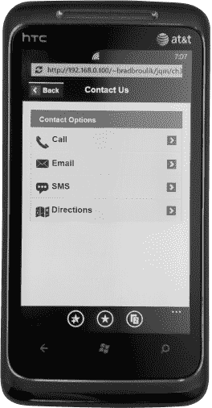
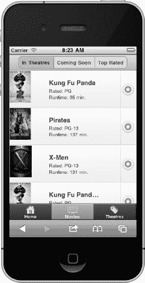

# 五、列表视图

列表是一种流行的用户界面组件，因为它们使浏览体验变得非常简单和高效。列表也是一个非常灵活的组件，可以以多种方式进行样式化，并且可以很好地适应不同的屏幕尺寸。无论我们是在浏览邮件、联系人、音乐还是设置，这些应用都以略微不同的风格显示信息列表。从只包含文本的基本列表到包含图形和详细元数据的复杂列表，列表必须足够灵活以支持多种配置。幸运的是，jQuery Mobile 支持所有这些列表配置，甚至更多。在本章中，我们将探索在 jQuery Mobile 中设计和配置列表的细节。我们还将了解如何在列表中添加搜索过滤器。最后，我们将回顾列表视图插件 API，看看我们如何动态创建和更新列表的例子。

### 列出基础知识

当我们将`data-role=”list”`属性添加到列表元素中时，jQuery Mobile 会自动将任何本地 HTML 列表(`<ul>`或`<ol>`)增强到移动优化视图中。默认情况下，增强列表将显示边对边，如果我们的列表项包含链接，它们将显示为带有右对齐箭头图标的触摸友好按钮(参见图 5–1 和在清单 5–1 中产生它的代码片段)。默认情况下，列表将使用“c”色样(灰色)来设置样式。要应用替换主题，请将`data-theme`属性添加到列表元素或列表项中(`<li>`)。

**图 5–1。** *基本列表*

**清单 5–1。** *基本列表(ch5/list-basic.html)*

`<ul **data-role="listview" data-theme="c"**>
        <li><a href="#">Action</a></li>
        <li><a href="#">Adventure</a></li>
        <li><a href="#">Comedy</a></li>
</ul>`

### 插图列表

插入列表不会边对边显示。相反，插入列表会自动包裹在圆角块中，并设置边距以增加间距。要创建一个插入列表，将`data-inset="true"`属性添加到列表元素中(参见图 5–2 和 5–3，以及清单 5–2 中的相关代码)。

**图 5–2。** *插入列表(iOS)*

**图 5–3。** *插入列表(Windows Phone 7)*

**清单 5–2。** *插入列表(ch5/list-inset.html)*

`<ul data-role="listview" data-inset="true">
    <li data-role="list-divider">Contact Options</li>
    <li><a href="#">Call</a></li>
    <li>...</li>
</ul>`

### 列出分隔符

列表分隔线可以用作一组列表项的标题。例如，如果我们的应用有日历列表，我们可以选择按天对日历事件进行分组(参见 Figure 5–4)。列表分隔线也可以用作插入列表的标题。在前面的例子中，我们也用列表分隔线设置了插入列表的标题(参见图 5–2 和清单 5–2)。

要创建列表分隔线，请向任何列表项添加`data-role="list-divider"`属性。列表分隔线的默认文本将左对齐。

**提示:**在图 5–4 中，列表项同时包含左对齐和右对齐的文本。要右对齐文本，用包含 ui-li-aside 类的元素将它包装起来(参见清单 5–3)。

默认情况下，列表分隔线将使用`"b"`样本(浅蓝色)的颜色。要应用另一个主题，请向 list 元素添加`data-divider-theme="a"`属性。

**图 5–4。** *列表分隔符*

**清单 5–3。** *列表分隔符(ch5/list-dividers.html)*

`<ul data-role="listview">
  <li **data-role="list-divider" data-divider-theme="a"**>
     Mon 
Feb 6 2012

  </li>
  <li>
     <a href="#">6 PM Birthday Party</a>
  </li>
</ul>`

### 带有缩略图和图标的列表

我们可以在列表项的左侧添加缩略图，方法是在列表项中添加一个图像作为第一个子元素(参见图 5–5 和清单 5–4 中的相关代码)。该框架将图像缩放到 80 像素见方。

**图 5–5。** *带缩略图的列表*

**清单 5–4。** *带缩略图列表(ch5/list-thumbnails.html)*

`<ul data-role="listview">
    <li>
          <a href="movies/kung-fu-panda.html">
                ****
                <h3>Kung Fu Panda</h3>
                
Rated: PG

                
Runtime: 95 min.

          </a>
    </li>
    ...
</ul>`

我们也可以使用更小的图标来代替缩略图。要在列表项中使用标准的 16x16 像素图标，请将类别`ui-li-icon`添加到图像元素中(参见图 5–6 和清单 5–5 中的相关代码)。

**图 5–6。** *带图标的列表*

**清单 5–5。** *带图标列表(ch5/list-icons.html)*

`<ul data-role="listview" data-inset="true" data-theme="d">
        <li data-role="list-divider">User Reviews</li>
        <li>
            <a href="reviews/xmen/404.html">
                
                
<strong>Go See It!</strong>

                
This movie had a strong script and ... 

            </a>
        </li>
        ...
</ul>`

### 拆分按钮列表

在您需要支持每个列表项的多个操作的情况下，我们可以创建一个拆分按钮列表，其中有一个主要和次要按钮可供选择。例如，我们可以修改原来的电影列表示例来支持多个动作。我们的主按钮将继续显示电影细节，我们新的辅助按钮可用于购买门票(参见图 5–7)。

**图 5–7。** *带拆分按钮的列表*

要创建一个拆分按钮，在列表项中添加一个二级链接，框架会添加一条垂直线来划分主要和二级动作(见清单 5–6)。

**清单 5–6。** *带拆分按钮的列表(ch5/List-split-buttons . html)*

`<ul data-role="listview" **data-split-icon="star" data-split-theme="d"**>
    <li>
        <a href="movies/kung-fu-panda.html">
            
            <h3>Kung Fu Panda</h3>
            
Rated: PG

            
Runtime: 95 min.

        </a>
        **<a href="tickets.html">Buy Tickets</a>**
    </li>
    ...
</ul>`

要设置所有次级按钮的图标，请将`data-split-icon`属性添加到列表元素，并将其值设置为标准图标(参见 Table 4–1)或自定义图标。默认情况下，辅助按钮将使用“b”样本(浅蓝色)的颜色。要应用替代主题，请向 list 元素添加 data-split-theme 属性。

### 编号列表

使用有序列表`<ol>`时将创建编号列表(参见图 5–8 和清单 5–7 中的相关代码)。

**图 5–8。** *列表与数字*

**清单 5–7。** *带编号的列表(ch5/list-numbered.html)*

`<ol data-role="listview">
        <li><a href="spider-man.html">The Amazing Spider-Man</a></li>
        <li><a href="dark-knight.html">The Dark Knight Rises</a></li>
        ...                        
</ol>`

默认情况下，框架会在每个列表项的左边添加数字索引。当显示可以按顺序排列的项目列表时，这些列表非常有用。例如，我们的“收视率最高的”电影视图是一个编号列表的理想候选，因为该序列可以快速关联哪些电影是收视率最高的。

### 只读列表

列表视图也可以显示数据的只读视图。用户界面看起来非常类似于我们之前展示的交互视图，除了右箭头图标-唯一的图像已经被移除，字体大小和填充稍微变小。要创建一个只读列表，只需删除我们在前面的例子中使用的锚标签(参见图 5–9 和清单 5–8 中的相关代码)。

**图 5–9。** *带有只读项目的列表*

**清单 5–8。** *带只读项的列表(ch5/list-readonly.html)*

`<ul data-role="listview">
        <li>
                
                <h3>Kung Fu Panda</h3>
                
Rated: PG

                
Runtime: 95 min.

        </li>
        ...
</ul>`

### 列出徽章(数气泡)

列表标记或计数气泡是突出显示的椭圆形，通常表示可供查看的新项目的数量。例如，徽章通常用在邮件应用中，用来指示您有多少未读邮件。在我们的示例中，徽章用于指示何时添加了关于电影评论的评论(参见 Figure 5–10)。徽章可以用来表达任何类型的元数据。

**图 5–10。** *用徽章或数数气泡列表*

要创建一个徽章，用包含类`ui-li-count`的元素包装徽章的文本。默认情况下，徽章将使用“c”色样(灰色)进行设计。要应用一个替换主题，将`data-count-theme`属性添加到列表元素中(参见清单 5–9)。

**清单 5–9。** *带徽章或计数气泡的列表(ch5/list-badges.html)*

`<ul data-role="listview" data-inset="true" **data-count-theme="e"**>
        <li data-role="list-divider">Comments
</li>
        <li>
          `
`          
Thanks for the review.  I'll check it out this weekend.

          1 day ago
        </li>
</ul>`

### 用搜索栏过滤列表

jQuery Mobile 有一个非常方便的过滤列表的客户端搜索特性。要创建搜索栏，将`data-filter=”true”`属性添加到列表中。然后，框架将在列表上方追加一个搜索过滤器，默认的占位符文本将显示单词“Filter items ...”(参见图 5–11 和清单 5–10 中的相关代码)。

**图 5–11。** *列表过滤(未过滤)*

**清单 5–10。** *列表过滤(ch5/list-filter.html)*

`<ul data-role="listview" **data-filter="true" data-filter-**                 **placeholder="Search..."**>
    <li data-role="list-divider">
        Mon 
Feb 6 2012

    </li>
    <li>
        <a href="b-day.html">
            
6 PM Birthday Party

        </a>
    </li>
</ul>`

有两个选项可用于配置占位符文本:

1.  您可以通过在列表元素上添加`data-filter-placeholder`属性来配置占位符文本(参见清单 5–10)。
2.  或者，您可以通过绑定到`mobileinit`事件并将`filterPlaceholder`选项设置为任意自定义占位符值:`        $(document).bind('mobileinit',function(){
             $.mobile.listview.prototype.options.filterPlaceholder="Search..";
            });`，将占位符文本全局设置为 jQuery Mobile 配置选项

我们将在第八章“配置 jQuery Mobile”中更详细地讨论配置 jQuery Mobile。

当您开始在搜索过滤器中输入文本时，客户端过滤器将只显示与通配符搜索匹配的项目(参见 Figure 5–12)。

**图 5–12。** *【列表过滤(已过滤)】*

如果您需要更改默认搜索功能，有两个选项可以覆盖用于过滤的回调:

首先，您可以通过绑定到`mobileinit`事件并将`filterCallback`选项设置为任何自定义搜索功能，将搜索功能作为 jQuery Mobile 配置选项进行全局更新。例如，这里我们将回调设置为使用“开始于”搜索:

`$(document).bind('mobileinit',function(){
    $.mobile.listview.prototype.options.filterCallback =
      function( text, searchValue ){
          // Use a "starts with" search
          return !(text.toLowerCase().indexOf( searchValue ) === 0);
      };
});`

回调函数有两个参数，`text`和`searchValue`。`text`参数包含列表项的文本，`searchValue`参数包含搜索过滤器的值。通配符搜索的默认行为编码为:

`        return text.toLowerCase().indexOf( searchValue ) === -1;`

如果回调返回列表项的真值，它将从搜索结果中隐藏。

或者，我们也可以在列表创建后动态配置我们的搜索功能。例如，在我们的页面加载之后，我们可以为特定的列表应用新的搜索行为:

`$("#calendar-list").listview('option', 'filterCallback',
        function( text, searchValue ) {
            // Use a "starts with" search
            return !(text.toLowerCase().indexOf( searchValue ) === 0);
        }
);`

默认情况下，搜索框将从其父容器继承其主题。要配置一个替代主题，请将`data-filter-theme`属性添加到列表元素中。

### 动态列表

`listview`插件是自动增强列表的小部件。我们可以利用这个插件来动态地创建和更新我们的列表。有两个选项可用于创建动态列表。您可以使用标记驱动的方法动态创建列表，或者通过在`listview`插件上显式设置`options`(参见清单 5–11)。

**清单 5–11。** *listview 插件示例(ch5/dynmic-lists.html)*

`**// Create list with markup-driven options**
$( '<ul data-inset="true" id="list1">
        <li data-role="list-divider">Genres</li>
        <li><a href="#">Action</a></li>
        <li><a href="#">Comedy</a></li></ul>' )
   .insertAfter( "#list0" )
   .listview();

**// Create list with plugin-driven options**
$( '<ul><li data-role="list-divider">Genres</li>
        <li><a href="#">Action</a></li>
        <li><a href="#">Comedy</a></li></ul>' )
   .insertAfter( "#list1" )
   .listview({
        theme: "d",
        dividerTheme: "a",
        inset: true,
   });

// Add a new item to an existing list
$( "#list1" )
        .append('<li><a href="#">Drama</a></li>')
        .listview(“refresh”);`

#### 列表选项

`listview`插件有以下选项:

`**countTheme** *string*`

**默认:**“c”

为徽章或计数气泡设置主题样本配色方案。这是一个从 a 到 z 的字母，映射到你的主题中包含的样本。该选项也作为数据属性公开:`data-count-theme=”a”.`

`$( “#list1” ).listview({ countTheme: "a" });`

`**dividerTheme** *string*`

`**default:** "b"`

为列表分隔线设置主题样本配色方案。这是一个从 a 到 z 的字母，映射到你的主题中包含的样本。该选项也作为数据属性公开:`data-divider-theme=”a”.`

`$( “#list1” ).listview({ dividerTheme: "a" });`

`**initSelector** CSS selector string`

`**default:** ":jqmData(role='listview')"`

initSelector 用于定义选择器(元素类型、数据角色等。)用于触发小部件插件的自动初始化。例如，默认选择器匹配的所有元素都将被`listview`插件增强。要覆盖这个选择器，绑定到`mobileinit`事件并根据需要更新选择器:

`$( document ).bind( "mobileinit", function(){`

`$.mobile.listview.prototype.options.initSelector = "...";`

`});`

`**inset** *boolean*`

`**default:** false`

当此选项设置为 true 时，将创建一个插入列表。默认情况下，将创建一个基本列表。该选项也作为数据属性公开:`data-inset=”true”.`

`$( “#list1” ).listview({ inset: true });`

`**splitIcon** *string*`

`**default:** "arrow-r"`

建立拆分按钮列表时设置次级按钮的图标。该选项也作为数据属性公开:`data-split-icon=”star”.`

`$( “#list1” ).listview({ splitIcon: "star" });`

`**splitTheme** *string*`

`**default:** "b"`

创建拆分按钮列表时，设置辅助按钮的主题样本配色方案。这是一个从 a 到 z 的字母，映射到你的主题中包含的样本。该选项也作为数据属性公开:`data-split-theme=”a”.`

`$( “#list1” ).listview({ splitTheme: "a" });`

`**theme** *string*`

`**default:** "c"`

设置列表的主题样本配色方案。这是一个从 a 到 z 的字母，映射到你的主题中包含的样本。该选项也作为数据属性公开:`data-theme=”a”.`

`$( “#list1” ).listview({ theme: "a" });`

#### 列举方法

`listview`插件有以下方法:

**`refresh` :** 更新自定义列表。

这将更新自定义列表以反映本地列表元素的值。例如，如果我们向现有列表中添加一个新项目，我们必须调用“`refresh`”来重建列表项目:

`        // Add an item to an existing list and refresh the list item
        $( "#list1" )
                .append('<li><a href="#">Drama</a></li>')
                **.listview(“refresh”);    **

        // Add list items to a new list and refresh the entire list
        var markup = '<li>item 1</li><li>item 2</li>';
       $( "#list2" )
             .append(markup)
**             .listview( "refresh", true );**`

#### 列出事件

`listview`插件支持以下事件:

**`create:`** 创建列表时触发

创建自定义列表时会触发此事件。它不用于创建自定义列表。

`        $( '<ul><li data-role="list-divider">Genres</li>
            <li><a href="#">Comedy</a></li></ul>' )
           .insertAfter( "#list1" )
           .listview({
                 inset: true,
                 create: function(event) {
                         console.log( "Creating list..." );
                 }
            });`

### 总结

在本章中，我们回顾了非常流行的列表视图组件。列表视图是常用的，因为它们使浏览体验非常简单和高效。jQuery Mobile 列表可以用许多独特的方式进行样式化和配置。从基本列表到带有图像、分割按钮、分隔线或徽章的列表，我们有许多配置选项可供选择。

我们还看到了向列表中添加搜索过滤器是多么容易，并看到了如何在必要时覆盖默认搜索的例子。

最后，我们回顾了`listview`插件 API，并看到了如何动态创建和更新列表的例子，以便为我们的用户提供更具交互性的体验。

在下一章中，我们将探索另一个流行的用户界面组件，jQuery Mobile 灵活的网格布局。我们将看到如何使用网格来创建响应式设计，我们也将看看如何用 CSS 渐变来增强我们的用户界面。