# 六、使用网格和 CSS 渐变格式化内容

移动应用通常将网格用于需要灵活的内容，并将其分组。对于需要这种行为的设计，jQuery Mobile 的响应式网格是一个有用的解决方案。在本章中，我们将回顾 jQuery Mobile grid 组件的基础知识，并展示几个如何在网格中设计图标、图形和文本样式的例子。我们还将创建可折叠的内容块，并讨论它们与内联页面结构相比的优势。最后，我们将使用 CSS 渐变对我们的设计进行一些修饰，并讨论 CSS 渐变在性能和渐进增强方面的优势。

### 网格布局

jQuery Mobile 的网格可配置为支持两到五列的布局。从 HTML 的角度来看，网格是用 CSS 属性配置的`div`元素。网格是灵活的，会占用显示器的整个宽度。网格不包含边框、填充或边距，因此它们不会干扰其中包含的元素的样式。在我们看一个例子之前，让我们回顾一下标准的网格模板。

#### 网格模板

当创建多列网格时，网格模板可能是一个有用的参考(参见[清单 6–1](#list_6_1))。

**清单 6–1。** *网格模板*

`

  <!-- **Grid container -->**
  
">`

`    <!-- **Blocks** -->
    
">Block A

    
">Block B

  

`

创建网格时，您需要创建具有两个或更多内部块的外部网格容器:

1.  Grid container: The grid container requires the CSS attribute `ui-grid-*` to configure the number of columns in the grid (see [Table 6–1](#tab_6_1)). For instance, to create a two-column grid we would set our grid CSS attribute to `ui-grid-a`.

    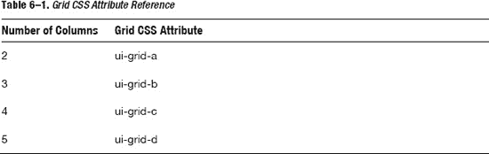

2.  Blocks: The blocks are contained within the grid. The blocks require the CSS attribute `ui-block-*` to identify its column position (see [Table 6–2](#tab_6_2)). For instance, if we had a two-column grid, our first block would be styled with CSS attribute `ui-block-a` and the second block would be styled with CSS attribute `ui-block-b`.

    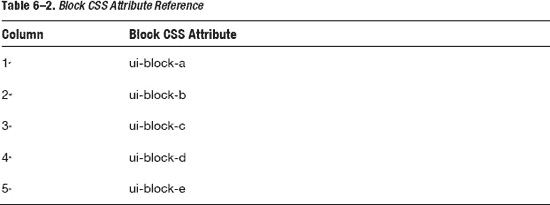

#### 两列网格

两列(50%，50%)网格显示在[图 6–1](#fig_6_1)中，其相关代码显示在[清单 6–2](#list_6_2)中。

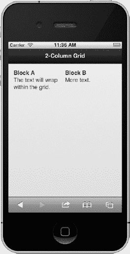

**图 6–1。** *两列网格*

**清单 6–2。** *【两列网格】`ch6/grid-2col.html`*

`

  

    
Block A

    
Block B

  

`

外部网格配置了 CSS 网格属性`ui-grid-a`。接下来，我们添加两个内部块。第一块被分配了一个 CSS 值`ui-block-a`，第二列被分配了一个 CSS 值`ui-block-b`。如图[Figure 6–1](#fig_6_1)所示，各列等距，无边界，每个块中的文本将在必要时换行。作为一个额外的好处，jQuery Mobile 中的网格是灵活的，可以在不同的显示尺寸上进行相应的渲染(参见[图 6–2](#fig_6_2))。

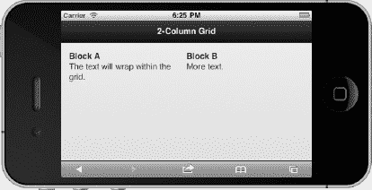

**图 6–2。** *两列网格(风景)*

#### 带有 CSS 增强功能的三列网格

三列(33%，33%，33%)网格显示在[图 6–3](#fig_6_3)中，其相关代码显示在[清单 6–3](#list_6_3)中。

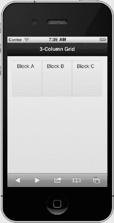

**图 6–3。** *带有 CSS 增强功能的三列网格*

**清单 6–3。** *【三列网格】`ch6/grid-3col.html`*

`

    

       

          
Block A

       

       

          
Block B

       

       

          
Block C

       

    

`

除了网格的 CSS 属性被配置为支持三列(`ui-grid-b`)以及我们为第三列(`ui-block-c`)添加了一个额外的块之外，它与我们之前看到的两列示例非常相似。我们还用可主题化的类来设计块的样式，这些类可以添加到任何元素中，包括网格。在这个例子中，我们添加了`ui-bar`来应用 css 填充，添加了`ui-bar-e`来应用“`e`工具栏主题样本的背景渐变和字体样式。您可以使用`a`到`e`范围内的任何工具栏主题(`ui-bar-*`)来设计您的模块。最后，为了创建一致的块高度，我们还设计了内嵌高度(`style="height:100px"`)。从视觉上看，这些改进用线性背景渐变设计了我们的网格，我们的块现在用边界分隔开了。

#### 带应用图标的四列网格

四列(25%、25%、25%、25%)网格显示在[图 6–4](#fig_6_4)中，其相关代码显示在[清单 6–4](#list_6_4)中。

**清单 6–4。** *【四柱格】`ch6/grid-4col.html`*

`

  

    
<ins><</ins>img src="img/cloud-default.png">

    

    

    

  

`

除了网格的 CSS 属性被配置为支持四列`(ui-grid-c`，并且我们为第四列`(ui-block-d`添加了一个额外的块之外，它与三列示例类似。此外，为了平衡和一致性，我们将应用图标置于网格中央(`style="text-align:center;`)。视觉上，网格有均匀分布的应用图标，很像一个应用跳板。

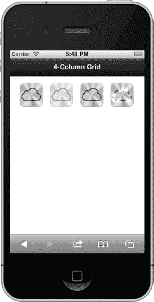

**图 6–4。** *带应用图标的四列网格*

#### 带有表情图标的五列网格

五列(20%，20%，20%，20%，20%)网格显示在[图 6–5](#fig_6_5)中，其相关代码显示在[清单 6–5](#list_6_5)中。

**清单 6–5。** *【五列网格】`ch6/grid-5col.html`*

`

  

    
&#xe21c;

    
&#xe21d;

    
&#xe21e;

    
&#xe21f;

    
&#xe220;

  

`

这个例子非常类似于我们之前看到的四列网格，除了网格的 CSS 属性被配置为支持五列(`ui-grid-d`)并且我们已经用为第五列(`ui-block-e`)添加了一个额外的块。每个区块包含一个独特的表情图标。 [1](#CHP-6-FN-1)

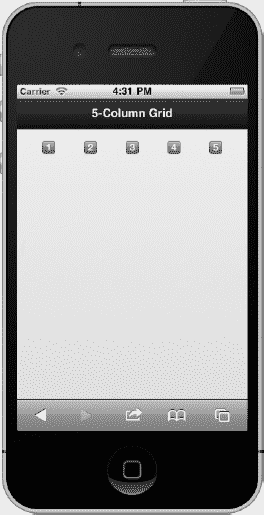

**图 6–5。** *五列网格*

**注意:**表情图标是图像的一个很好的替代品，因为它们消耗零 HTTP 请求，并且它们的有效载荷只是几个字符的文本。不幸的是，表情符号图标目前仅在 iOS 中受支持。

___________

1 见`[http://pukupi.com/post/1964](http://pukupi.com/post/1964).`

#### 多行网格

到目前为止，我们只看到了单行网格。要添加额外的行，只需为每个连续的行重复第一行的块模式(参见[清单 6–6](#list_6_6)中的[图 6–6](#fig_6_6)及其相关代码)。生成的网格包含五列和三行。列的间距相等，可以在块组件上手动调整行高。

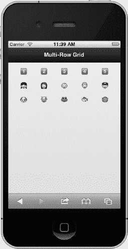

**图 6–6。** *多行网格*

**清单 6–6。** *【多行网格】`ch6/grid-multi-row.html`*

`

  

    <!-- **First row** -->
    
&#xe21c;

    
&#xe21d;

    
&#xe21e;

    
&#xe21f;

    
&#xe220;
`

`    <!-- **Second row** -->
    
&#xe002;

    
&#xe005;

    
&#xe51a;

    
&#xe515;

    
&#xe152;

  

`

#### 不均匀网格

到目前为止，所示的每个网格示例都有均匀间隔的列，因为默认情况下 jQuery Mobile 会均匀间隔所有的列。但是，如果您需要定制列宽，我们可以在 CSS 中调整宽度。例如，我们可以通过设置每个块的自定义宽度，将两列网格的默认宽度修改为 25/75%(参见[图 6–7](#fig_6_7)及其在[清单 6–7](#list_6_7)中的相关代码)。因此，我们的网格可以修改，以支持广泛的替代维度。

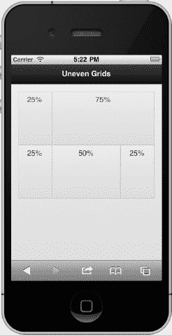

**图 6–7。** *不均匀网格*

**清单 6–7。** *【网格不均匀】`ch6/grid-uneven.html`*

`**`

#### 跳板

跳板是应用网格布局的理想选择。在下面的例子中，我们将看到两种类型的跳板。首先，我们会看到一个带有应用图标的跳板(见[图 6–8](#fig_6_8))，其次我们会看到一个带有雕刻图标的跳板(见[图 6–9](#fig_6_9))。

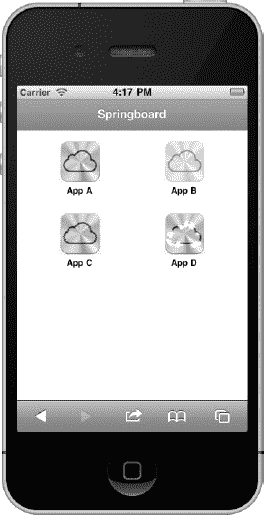

**图 6–8。** *带 app 图标的跳板*

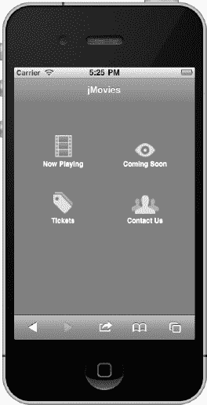

**图 6–9。** *带有浮雕图标的跳板*

你准备好接受跳板挑战了吗？如果你是，我鼓励你创造一个和这两个人物非常相似的跳板。从网格的角度来看，这两个例子的配置是相同的。然而，带有 Glyphish 图标的跳板(见[清单 6–9](#list_6_9))的风格与带有应用图标的跳板(见[清单 6–8](#list_6_8))略有不同，以调整其不均匀的图标高度。

**清单 6–8。** *带 app 图标的跳板(`ch6/springboard1.html` )*

`

  

    <a href="#">
      
      App A
    </a>
  

  …

`

**清单 6–9。** *带有雕刻图标的跳板(`ch6/springboard2.html` )*

`

  

    

      <a href="#">
        
        Now Playing
      </a>
    

  

  …

`

### 可折叠的内容块

你有没有发现自己反复滚动来浏览整个手机页面的内容？虽然这对于你的手指来说可能是一个很好的锻炼，但当用户必须重复滚动时，这可能是一个麻烦的用户体验。如果您正在寻找一个更有用的替代方案，您可能需要考虑将您的内容分组到可折叠的内容块中。

**提示:**与内嵌页面结构相比，可折叠内容块有几个优点。首先，我们可以将内容折叠成分段的组，使它们在单个视图中可见(参见[图 6–10](#fig_6_10))。其次，我们的用户会更有效率，因为我们已经从用户体验中消除了滚动。

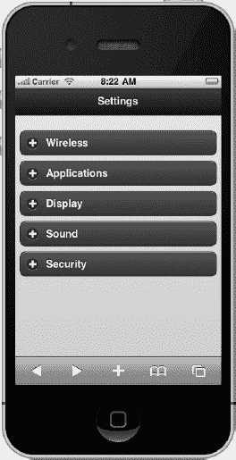

**图 6–10。** *内容块(所有块折叠)*

创建可折叠内容块所需的标记如[清单 6–10](#list_6_10)所示。

**清单 6–10。***`ch6/collapsible-block.html`*可折叠内容块

`

  

    **<h3>Wireless</h3>**
    <ul data-role="listview" data-inset="true">
      <li><a href="#">&#xe117; Notifications</a></li>
      <li><a href="#">&#xe01d; Location Services</a></li>
    </ul>`
`  

  
 data-theme="a" data-content-theme="b"**>
    **<h3>Applications</h3>**
    <ul data-role="listview" data-inset="true">
      <li><a href="#">&#xe001; Faceoff</a></li>
      <li><a href="#">&#xe428; LinkedOut</a></li>
      <li><a href="#">&#xe03d; Netflicks</a></li>
    </ul>
  

`

创建可折叠块需要两个元素:

1.  Create a container and add the `data-role="collapsible"` attribute. Optionally, you may configure the container to be collapsed or expanded by adding the `data-collapsed` attribute. By default, a collapsible section will be shown expanded (`data-collapsed="false"`). To initially show the section as a collapsed block, add `data-collapsed="true"` to the container. For instance, if we launch the code in [Listing 6–10](#list_6_10), the initial view will appear as [Figure 6–11](#fig_6_11). In the code listing, we have explicitly collapsed all content blocks except for the “Applications” section which will expand by default. 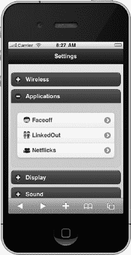

    **图 6–11。** *内容块(一个块展开)*

2.  在容器中，添加任何 header 元素`(H1-H6).`框架会将 header 设计成看起来像一个可点击的按钮，带有一个左对齐的加号或减号图标，表示它是可扩展的。

在标题之后，您可以向可折叠块添加任何 HTML 标记。框架将把这个标记包装在容器中，当点击标题时，容器将展开或折叠。你可以通过在可折叠容器中添加`data-theme`和`data-content-theme`属性来分别设置可折叠块及其相关按钮的主题(参见[清单 6–10](#list_6_10))。

**注意:**一个可折叠块允许你一次展开或折叠多个块(见[图 6–12](#fig_6_12))。在下一节中，我们将看到在处理可折叠集合时这是不允许的。

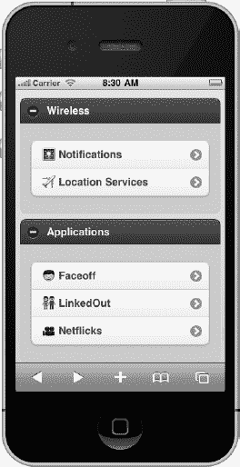

**图 6–12。** *内容块(所有块展开)*

### 可折叠套

可折叠组件(参见[图 6–13](#fig_6_13))与可折叠积木相似，只是它们的可折叠部分在视觉上组合在一起，并且一次只能展开一个部分，这使得可折叠组件看起来像手风琴(参见[图 6–14](#fig_6_14))。

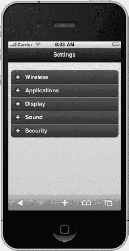

**图 6–13。** *内容设置(折叠)*

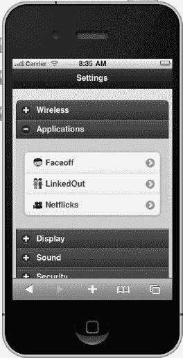

**图 6–14。** *内容设置(扩展)*

当打开集合中的新节时，以前打开的任何节都将自动折叠。

可折叠集合的标记与我们之前在构建可折叠块时看到的标记相同。然而，为了创建手风琴式的行为和分组，我们需要添加一个带有`data-role="collapsible-set"`的父包装器，如[清单 6–11](#list_6_11)所示。

**清单 6–11。** *可折叠设置(`ch6/collapsible-set.html)`*

`

  <**div data-role="collapsible-set"> data-theme="a" data-content-theme="b"**>
    

      <h3>Wireless</h3>
      <ul data-role="listview" data-inset="true">
        <li><a href="#">&#xe117; Notifications</a></li>
        <li><a href="#">&#xe01d; Location Services</a></li>
      </ul>
    

    

      <h3>Applications</h3>
      <ul data-role="listview" data-inset="true">
        <li><a href="#">&#xe001; Faceoff</a></li>
        <li><a href="#">&#xe428; LinkedOut</a></li>
        <li><a href="#">&#xe03d; Netflicks</a></li>
      </ul>
    

    ...
  **
<!-- /collapsible-set -->**

`

### 使用 CSS 渐变的样式

想给你的移动用户界面添加一点润色吗？尝试在通常使用背景图像的地方使用 CSS 渐变。CSS 渐变为图像提供了一个高性能的替代品，它们在灵活的布局中工作得非常好，并且在不受支持的浏览器中优雅地退化。例如，我们可以将一个原始的跳板(见[图 6–15](#fig_6_15))改造成一个更加优雅的展示(见[图 6–16](#fig_6_16)和[图 6–17](#fig_6_17))并添加渐变。

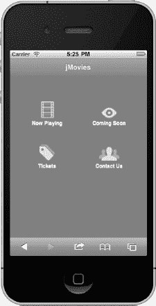

**图 6–15。** *没有 CSS 渐变的跳板*

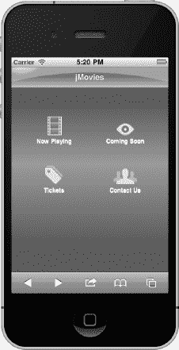

**图 6–16。** *带有 CSS 渐变的跳板(iOS)*

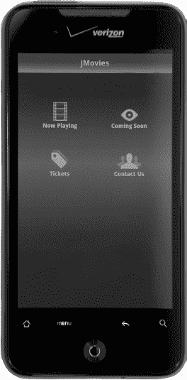

**图 6–17。** *带有 CSS 渐变的跳板(安卓)*

任何使用背景图像的地方都可以使用渐变。例如，它们最常用于设计标题、内容和按钮的背景。此外，有两种类型的 CSS 渐变:线性和径向。线性渐变是两者中比较简单的，如果你不太熟悉它们的语法，CSS 渐变生成器 [2](#CHP-6-FN-2) 可以帮助你开始。产生背景线性渐变的 CSS 如[清单 6–12](#list_6_12)所示。

**清单 6–12。** *背景渐变*

`**.background-gradient** {
  background-image: -webkit-gradient(
    linear, left bottom, left top,
    color-stop(0.22, rgb(92,92,92)),
    color-stop(0.57, rgb(158,153,158)),`
`    color-stop(0.84, rgb(92,92,92))
  );
}

<!-- Set the gradient on the page -->

`

____________

2 见`[http://www.westciv.com/tools/gradients/](http://www.westciv.com/tools/gradients/)`或`[http://gradients.glrzad.com/](http://gradients.glrzad.com/).`

虽然这个 CSS 渐变是针对最流行的 WebKit 布局引擎(参见[图 6–18](#fig_6_18))的，但是您可以通过包含特定于供应商的前缀来添加对其他浏览器的支持。

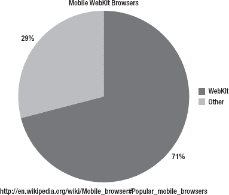

**图 6–18。** *Webkit 用法*

例如，为了在 Mozilla 浏览器上渲染我们的渐变，我们将添加带有`-moz-`厂商前缀的版本(参见[清单 6–13](#list_6_13))。

**清单 6–13。** *支持 Mozilla 的背景渐变*

`.background-gradient {
  background-image: **-webkit-gradient**(
    linear, left bottom, left top,
    color-stop(0.22, rgb(92,92,92)),
    color-stop(0.57, rgb(158,153,158)),
    color-stop(0.84, rgb(92,92,92))
  );
  background-image: **-moz-linear-gradient**(
    90deg,
    rgb(92,92,92),
    rgb(158,153,158),
    rgb(92,92,92));
}`

页眉的渐变实际上是三个独立渐变的叠加。包括一个线性梯度和两个径向梯度。径向渐变创建圆形渐变效果。创建标题渐变的代码如[清单 6–14](#list_6_14)所示。

**清单 6–14。** *跳板坡度*

`.header-gradient {
  background-image:
    -webkit-gradient(
      linear, left top, left bottom,
      from( rgba( 068,213,254,0 )),
      color-stop(.43, rgba( 068,213,254,0 )),
      to( rgba( 068,213,254,1 ))),
    -webkit-gradient( radial,
      50% 700, 690,
      50% 700, 689,
      from( rgba( 049,123,220,0 )),
      to( rgba( 049,123,220,1 ))),
    -webkit-gradient(
      radial,
      20 -43, 60,
      20 -43, 40,
      from( rgba( 125,170,231,1 )),
      to( rgba( 230,238,250,1 )));
}

<!-- Set the gradient on the header -->

`

### 总结

在这一章中，我们回顾了 jQuery Mobile 基于网格的设计的有用性，并看到了我们如何快速地在网格模板中设计内容(参见[清单 6–1](#list_6_1))。jQuery Mobile grid 是需要响应和分组的内容的理想解决方案。我们的网格可以包含任何内容，我们看到了几个使用文本、图标和图形的网格示例。

我们还回顾了可折叠的内容块，并讨论了它们与内联页面结构相比的优势。可折叠块可以是一种有效的可用性模式，因为它们有助于在单一视图中显示所有内容，并且有助于消除用户体验中的滚动。因此，用户对应用的体验将更加高效。

最后，我们看到了如何用 CSS 渐变来润色我们的设计。CSS 渐变是图像的一种高性能替代品，它们在灵活的布局中工作得非常好，在不受支持的浏览器中会逐渐退化。

在第 7 章中，我们将继续我们的布局设计之路，仔细看看 jQuery Mobile 的主题框架。