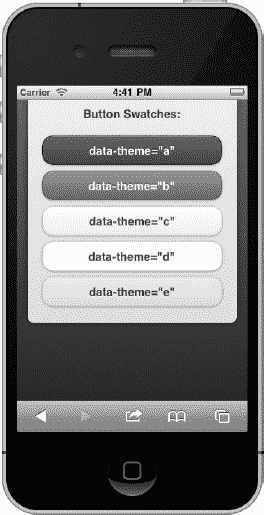
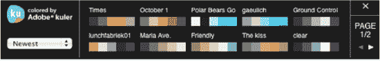

# 七、创造主题化的设计

jQuery Mobile 有一个内置的主题框架，允许设计人员快速定制或重新设计他们的用户界面。主题框架利用了 CSS3 的许多特性，这有助于构建更优雅、更具响应性的设计。例如，通过利用 CSS3，主题框架能够应用圆角、阴影和渐变，而不必依赖于图像。这是一个性能优势，因为该框架可以提供更有吸引力的接口，而没有额外的 HTTP 请求开销。本质上，我们有一个轻量级的主题框架，可以在所有浏览器上呈现统一的设计。

在这一章中，我们将讨论主题框架的基础，并回顾 jQuery Mobile 中包含的默认主题。我们还将探索将主题分配给组件的三种方式。虽然所有的组件都可以使用`data-theme`属性显式地设置它们的主题，但是大多数组件也有默认的主题，并且也可以从父容器继承它们的主题。我们将讨论它们的优点，看看每一个的例子，并讨论主题应用于组件的优先级。

最后，我们将看看如何创建我们自己的自定义主题。如果您需要创建更丰富的设计，或者如果您需要创建与您的公司品牌紧密匹配的设计，那么创建自定义主题将是必要的。创建自定义主题有两个选项，我们将一步步地看每一个的例子。第一种选择是手动方法，它让设计者完全控制他们的布局；第二种是使用主题滚轮 [1](#CHP-7-FN-1) ，这是一种基于网络的工具，可以自动完成创建新主题的过程。

____________________

1 见`[http://jquerymobile.com/themeroller](http://jquerymobile.com/themeroller)`

### 主题基础知识

在很多例子中，我们已经看到了如何使用`data-theme`属性将替换主题应用到页面容器(页面、页眉、内容、页脚)和表单元素中。例如，我们可以使用一个没有主题的页面(见[图 7–1](#fig_7_1))并用一个不同的标题和列表主题(见[图 7–2](#fig_7_2))重新设计它的样式，并简单地添加`data-theme`属性(见[清单 7–1](#list_7_1))。

**图 7–1。** *带有默认主题的列表*

**图 7–2。** *列表与备选主题*

**清单 7–1。** *数据-主题属性(ch7/theme-list2.html)*

`

        
**
                <h1>jMovies</h1>
        

        

                <ul data-role="listview" data-inset="true" **data-theme="a"**>
                        <li data-role="list-divider">Now Playing</li>
                </ul>
        

`

### 主题和样本

jQuery Mobile CSS 文件总是我们在 head 元素中导入的第一个资产(参见[清单 7–2](#list_7_2))。该文件包含 jQuery Mobile 应用的默认结构和主题。花一点时间，用您最喜欢的编辑器探索这个文件的内容。

**清单 7–2。** *jQuery Mobile CSS 导入*

`<head>
**   <link rel="stylesheet" type="text/css" href="jquery.mobile-min.css" />**
   
   
</head>`

jQuery Mobile CSS 文档分为两个部分:主题部分和结构部分。

*   Theme – The top half of the document contains the default theme settings.  The theme settings manage the visual styling (backgrounds, borders, color, font, shadows) for all components.  When setting the `data-theme` attribute, we are able to choose from five different options (a, b, c, d, e).  These letters (a-e) are technically referred to as swatches.  As you were reviewing the jQuery Mobile CSS file you may have noticed that the first swatch to appear within the CSS file was swatch “a” (see [Listing 7–3](#list_7_3)).

    **清单 7–3。** *jQuery Mobile CSS 样本“a”(部分列表)*

    `/* **A**
    ---------------------------------------------------------------------*/
    .ui-bar-**a** {
            border: 1px solid                 #2A2A2A;
            background:                         #111111;
            color:                                      #ffffff;
            font-weight: bold;
            text-shadow: 0 -1px 1px #000000;
            ...
            background-image:             linear-gradient(top, #3c3c3c, #111);
    }
    .ui-body-**a** {
            border: 1px solid                   #2A2A2A;
            background:                         #222222;
            color:                       #fff;
            text-shadow: 0 1px 0         #000;
            font-weight: normal;
            background-image**:**              linear-gradient(top, #666**,** #222**);**
    }
    ...`

主题部分分为以下几个小节:

*   样本——默认情况下，jQuery Mobile 有五个样本可供选择(a、b、c、d、e ),您可以根据需要添加任意数量的独特样本。样本允许我们为组件配置独特的背景、边框、颜色、字体和阴影。为简单起见，新样本的命名约定是基于字母的(a-z)。但是，样本名称的长度没有限制。我们将在本章的后面看到创建我们自己的自定义色板的例子。
*   Global theme settings – Global theme settings are configured after the swatches. These settings add visual styling enhancements to buttons, such as rounded corners, icons, overlays, and shadows. Since these settings are global, they will be inherited by all swatch configurations (see [Listing 7–4](#list_7_4)).

    **清单 7–4。***【jQuery 手机全球主题造型(部分上市)*

    `/* Active class used as the "on" state across all themes
    -----------------------------------------------------------------------*/
    .ui-btn-active {
            border: 1px solid                 #155678;
            background:                       #4596ce;
            font-weight: bold;
            color:                  #fff;
            cursor: pointer;
            text-shadow: 0 -1px 1px #145072;
            text-decoration: none;
            ...
    }`
*   Structure – The latter half of the jQuery Mobile CSS file contains structure styling that primarily includes positioning, padding, margin, height, and width settings (see [Listing 7–5](#list_7_5)).

    **清单 7–5。** *jQuery Mobile 结构造型(部分清单)*

    `/* some unsets - more probably needed */
    .ui-mobile**,** .ui-mobile body **{** height**:** 100%**;** **}**
    .ui-mobile fieldset**,** .ui-page **{** padding**:** 0**;** margin**:** 0**;** **}**
    .ui-mobile a img**,** .ui-mobile fieldset **{** border**:** 0**;** **}**

    ...

    .ui-checkbox, .ui-radio {
            position:relative;  margin: .2em 0 .5em; z-index: 1;  
    }
    .ui-checkbox .ui-btn, .ui-radio .ui-btn {
            margin: 0; text-align: left; z-index: 2;
    }`

    现在我们已经了解了 jQuery Mobile 的主 CSS 文件，让我们更仔细地看看 jQuery Mobile 包含的五个样本，看看它们是如何出现在几个不同的组件中的(参见[Figure 7–3](#fig_7_3)–7–6)。

    

    **图 7–3。** *格子色板*

    

    **图 7–4。** *列出色板*

    

    **图 7–5。** *纽扣布样*

    

    **图 7–6。** *表单字段样本*

    为了在所有组件中保持样例的样式一致，以下视觉优先级约定用于每个样例:

*   “a”(黑色)视觉优先级最高。
*   “b”(蓝色)是二级水平。
*   " c" -(灰色)基线。
*   “d”-(白/灰)一个交替的二级水平。
*   “e”-(黄色)强调色。

### 主题默认值

如果您没有向页面添加`data-theme`属性，jQuery Mobile 将为所有页面容器和表单元素应用默认主题(参见[Table 7–1](#tab_7_1))。

T2】

例如，如果我们创建一个基本的 jQuery Mobile 页面，而没有显式地设置它的主题，那么我们的元素将回到它们的默认主题或者继承它们的父容器的主题。在[Figure 7–7](#fig_7_7)中，默认主题应用于页面、页眉、页脚、内容和列表元素，而表单元素继承了它们的主题。

**图 7–7。** *带有默认和继承主题的页面*

通过参考我们的“组件默认主题”表(参见[表 7–1](#tab_7_1)，我们可以确定每个组件将应用什么默认主题。让我们仔细看看内容和按钮组件。默认情况下，内容组件将应用`data-theme=”c”`。但是，按钮组件没有默认主题，因此它将从其父容器继承默认主题。在[清单 7–6](#list_7_6)中，按钮的父节点是内容容器；因此，按钮将继承主题“c”。此外，如果按钮在头部容器中，它将继承头部容器的主题。

**清单 7–6。** *带有默认主题的页面(ch7/theme-defaults.html)*

`

    

        <h1>default = "a"</h1>
    

    

      default = "c"` `      <ul data-role="listview" data-inset="true">
          <li data-role="list-divider">default = "b"</li>
          <li>default = "c"</li>
          <li>default = "c"</li>
      </ul>

      <form id="test" id="test" action="#" method="post">
          
        
              <label for="text">inherits "c":</label>
              <input type="text" name="text" id="text" value="" />
          

          

              <label for="sound">inherits "c":</label>
              <select name="slider" id="sound" data-role="slider">
                  <option value="off">Off</option>
                  <option value="on">On</option>
              </select>
          
                  

          <a href="#" data-role="button">Button (inherits "c")</a>
      </form>
    
        

    

        <h3>default = "a"</h3>
    
                

`

### 主题传承

组件也可以继承其父容器的主题。主题继承在两个方面是有益的。首先，它使设计者的设计过程更加有效，因为我们可以快速地在一个高层次(页面容器)设置一个主题，这个主题将级联到所有子组件，节省了宝贵的时间。其次，它使组件在整个应用中保持一致的风格。例如，在[清单 7–7](#list_7_7)中，我们用`data-theme=”e”`设计了页面容器。因此，内容主题从其父容器继承了“e”主题(参见[图 7–8](#fig_7_8))。

**清单 7–7。** *主题继承(ch7/theme-inheritance.html)*

`

        

                <h1>No inheritance</h1>
        

        

                Inherits "e"

                <ul data-role="listview" data-inset="true">
                        <li data-role="list-divider">No inheritance</li>
                        <li>No inheritance</li>
                        <li>No inheritance</li>
                </ul>` `                                                
                <form id="test" id="test" action="#" method="post">
                  
        
                    <label for="text">Inherits "e"</label>
                    <input type="text" name="text" id="text" value=""/>
                  

                  

                    <label for="sound">Inherits "e"</label>
                    <select name="slider" id="sound" data-role="slider">
                        <option value="off">Off</option>
                        <option value="on">On</option>
                    </select>
                  

                  <a href="#" data-role="button">Button (Inherits "e")</a>
                </form>
        
        

        

                <h3>No inheritance</h3>
        
                

` 

**图 7–8。** *主题传承*

**注意:**不是所有的组件都会继承其父容器的主题。参考[表 7–1](#tab_7_1)中的“继承父主题”一栏，了解不会继承父主题的组件列表。

我们还可以显式地设置单个组件的主题。这给了设计者在设计网站时的灵活性，可以帮助构建更丰富的设计(见[图 7–9](#fig_7_9)和[清单 7–8](#list_7_8)中的相关代码)。

**图 7–9。** *显性主题*

**清单 7–8。** *显性主题(ch7/theme-explicit.html)*

`
**
    

      <h1>Theme = "b"</h1>
    

    

      Theme = "d"

      <ul data-role="listview" **data-theme="e" data-divider-theme="e">**` `          <li data-role="list-divider">Theme = "e"</li>
          <li>Inherits "e" from list</li>
          <li **data-theme="b"**>Theme = "b"</li>
      </ul>

      <form id="test" id="test" action="#" method="post">
      
        
          <label for="text">Theme "d"</label>
          <input type="text" name="text" id="text" **data-theme="d"** />
      

      

        <label for="sound">Theme "b"</label>
        <select id="sound" data-role="slider" **data-theme="b"**>
           <option value="off">Off</option>
           <option value="on">On</option>
        </select>
      

      <a href="#" data-role="button" **data-theme="a"**>Button</a>
      </form>
    
        

    

      <h3>Theme = "b"</h3>
    
                

`

#### 主题优先顺序

主题按以下优先顺序应用于组件:

1.  显式主题——如果在任何组件上显式设置了`data-theme`属性，该主题将覆盖任何继承的或默认的主题。
2.  继承的主题—继承的主题将覆盖所有默认主题。例如，在[清单 7–7](#list_7_7)中，内容容器从它的页面容器继承了主题“e ”,而页面容器覆盖了它的默认主题“c”。关于可能继承其主题的组件列表，请参考[表 7–1](#tab_7_1)中的“继承父主题”栏。
3.  Default themes—Default themes are applied when no themes are explicitly set or inherited. For a listing of default themes by component, refer to the “Default Theme” column in [Table 7–1](#tab_7_1).

    **提示:**默认情况下，内容容器的最小高度只会拉伸里面组件的高度。当内容的主题与其页面容器的主题不同时，这就是一个问题(参见[图 7–10](#fig_7_10))。我们可以用 CSS 来解决这个问题。例如，我们可以将内容容器的最小高度设置为屏幕的高度(参见[图 7–11](#fig_7_11)):

    `ui-content { min-height:inherit; }`

**图 7–10。** *内容高度不到 100%*

**图 7–11。** *内容高度 100% (ch7/min-height.html)*

### 自定义主题

jQuery Mobile 主题框架允许设计者快速定制或重新设计他们的用户界面。在本节中，我们将了解如何手动创建我们自己的自定义色板。如前所述，默认的 jQuery Mobile CSS 文档分为两个部分:主题部分和结构部分。在本练习中，我们将创建一个自定义样本，用于潜在危险动作的参考。例如，一个通用的用户体验指南鼓励开发者用红色突出显示控制潜在有害行为的按钮。在 jQuery Mobile 中，我们可以创建一个定制的样本来管理图标和/或按钮的视觉样式(背景、边框、颜色、字体、阴影),从而驱动我们的冒险行为。

要手动创建自定义样本，必须执行以下步骤:

1.  First, create a separate CSS file for the custom theme (css/theme/custom-theme.css). This keeps the custom additions separate from the main jQuery Mobile CSS and will simplify future upgrades.

    **提示:**如果您计划使用自定义主题来设计整个 jQuery Mobile 应用，建议使用 jQuery Mobile 下载网站上的纯结构 CSS 文件。对于不需要默认主题的应用来说，这是一个轻量级的选择，它简化了定制主题的管理(参见[清单 7–9](#list_7_9))。

    **清单 7–9。** *jQuery Mobile 的无默认主题的结构文件*

    `<head>
      <meta charset="utf-8">
      <title>Custom Theme</title>
      <meta name="viewport" content="width=device-width, initial-scale=1">
    **  <link rel=stylesheet href="css/theme/custom-theme.css" />**
    **  <link rel=stylesheet href="css/structure/jquery.mobile.structure.css"/>        **
      
      
    </head>`
2.  查找要作为基线参考的现有样本。在研究了现有的样本后，复制一个与你的新样本风格非常相似的样本。这将有助于最大限度地减少创建新样本所需的修改次数。对于我的新样本，我复制了“e”样本作为我的基线，因为“e”是一个重音样本，我们的潜在危险动作的新样本也可以划分到重音类别中。
3.  Next, copy the baseline swatch and paste it into the custom-theme.css file. Then, rename the swatch so it is associated to a unique letter (f-z). For example, replace all CSS suffixes with “-e” to “-v” (see [Listing 7–10](#list_7_10)). The new swatch can now be referenced with `data-theme=”v”` for any components that perform dangerous actions.

    **清单 7–10。** *仿照样本“e”定制“v”样本(ch7/CSS/theme/Custom-theme 9781430239666 . CSS)*

    `/* **V**
    ----------------------------------------------------------------------*/
    .ui-bar**-v** {
      font-weight**:** bold**;**
      border**:** 1px solid       #999**;**
      background**:**             #dedede**;**
      color**:**                  #000**;**` `  text-shadow**:** 0 1px 0px  #fff**;**
    **  …**
    }
    .ui-btn-up**-v** {
      border: 1px solid       #999;
      background:             #e79696;
      color:                  #fff;
      text-shadow: 0 1px 0px  #fff;
      ...
    }`
4.  Now the exciting task of updating the visual CSS settings (backgrounds, borders, color, font, and shadows) for our new swatch. For the new “v” swatch, I updated all buttons to have a red gradient background with white text (see [Listing 7–11](#list_7_11)).

    **清单 7–11。** *用红色背景渐变和白色文字更新“v”色板按钮(ch7/CSS/theme/custom-theme 9781430239666 . CSS)*

    `/* V
    ----------------------------------------------------------------------*/
    .ui-btn-up-v {
      border: 1px solid       #999;
      background:             **#e79696;**
      color:                  **#fff;**
      text-shadow: 0 1px 0px  #fff;
      **background-image: -webkit-gradient(**
    **        linear, 0% 0%, 0% 100%, from(#E79696), to(#ce2021),**
    **        color-stop(.4,#E79696)**
    **  );**
    **  background-image: -webkit-linear-gradient(**
    **        0% 56% 90deg,#CE2021, #E79696, #E79696 100%**
    **  );**
    **  background-image:    -moz-linear-gradient(**
    **        0% 56% 90deg,#CE2021, #E79696, #E79696 100%**
    **  );**
      ...
    }`
5.  接下来，我们需要将新的“v”样本与一个实际页面集成起来进行测试。我创建了两个页面来帮助测试新的“v”样本。在第一页，我想看看新的样本如何出现在一个只有图标的按钮上。在这个测试中，我创建了一个分割按钮列表，用二级按钮作为我们的删除图标，并用我们新的“v”样本设计二级按钮的样式(见[图 7–12](#fig_7_12)和[清单 7–12](#list_7_12)中的相关代码)。

____________________

2 见`[http://jquerymobile.com/download](http://jquerymobile.com/download).`

**图 7–12。** *红色图标背景为潜在危险动作*

**清单 7–12。** *带“v”形样本的拆分按钮(ch7/custom1.html)*

`<head>
**  <link rel=stylesheet href="css/theme/custom-theme9781430239666.css" />**
**  <link rel=stylesheet href="css/structure/jquery.mobile-min.css"/>**
**  ...**
</head>

<ul data-role="listview" data-split-icon="delete" **data-split-theme="v"**>
    <li>
        <a href="#">
            
            <h3>Kung Fu Panda</h3>
            
Rated: PG

            
Runtime: 95 min.

        </a
        **<a href="#delete" data-transition="slidedown">Delete</a>**
    </li>
...`

我还在主 jQuery Mobile CSS 文件之前导入了新的 custom-theme.css 文件。对于我们的第二个测试，我想在一个删除按钮上应用我们新的“v”样本。对于这个测试，我创建了一个对话框来确认潜在的危险动作，并用我们新的红色渐变风格主题设计了删除按钮(参见[图 7–13](#fig_7_13)和[清单 7–13](#list_7_13)中的相关代码)。

**图 7–13。** *红色删除按钮用于删除动作*

**清单 7–13。** *带“v”的删除按钮样本(ch7/custom1.html)*

`

    

        Are you sure?

        <a href="#home" data-role="button" **data-theme="v"**>Delete</a>
        <a href="#home" data-role="button" data-rel="back">Cancel</a>
    

`

最后，当您创建新的样本时，在颜色编码的样式指南中记录您的自定义样式会很有帮助，这样组织中的所有设计人员和开发人员都会熟悉它们的用法和样式。

**提示:** CSS 渐变生成器 [3](#CHP-7-FN-3) 是可以自动生成你的渐变语法并帮助简化步骤 4 的工具。

### 泰晤士报

ThemeRoller [4](#CHP-7-FN-4) 是一个基于 web 的工具，它帮助自动为 jQuery Mobile 生成新的基于 CSS 的主题。这是一个非常有用的工具，因为它允许您在左窗格中更新配色方案，并在右窗格中预览实际 jQuery Mobile 布局的结果(参见[图 7–14](#fig_7_14))。

**图 7–14。** *主题人物*

____________________

3 见`[www.westciv.com/tools/gradients/](http://www.westciv.com/tools/gradients/)`或`[http://gradients.glrzad.com/](http://gradients.glrzad.com/).`

4 见`[http://jquerymobile.com/themeroller](http://jquerymobile.com/themeroller).`

#### 样本和全局设置

在左侧窗格中出现的“全局”选项卡下，您可以快速调整全局应用于所有色板的 CSS 属性。在这里，您可以调整字体系列、活动状态颜色、拐角半径、图标和阴影(参见[图 7–15](#fig_7_15))。

**图 7–15。** *全局主题设置*

“全局”选项卡旁边是样本特定选项卡(a-z)。您可以在此添加、编辑或删除主题中的样本(参见[图 7–15](#fig_7_15))。

#### 预览检查器和快速观看栏

为了更容易地构建自定义主题，预览面板顶部有两个独特的工具:预览检查器和快速观看栏。

预览检查器是一个可以“开”或“关”的开关(见[图 7–16](#fig_7_16))。打开开关后，单击预览窗格中的元素将自动在左窗格中显示其可编辑属性。当您需要快速编辑样式时，这将是一个宝贵的时间节省。

**图 7–16。** *预览检查器和快速观看栏*

快速观察条是出现在检查器右侧的一系列颜色(参见[Figure 7–16](#fig_7_16))。这是一个强大的工具，允许您将任何颜色拖放到预览页面中的元素或左窗格中的颜色属性上。快速观察栏下面是两个滑块，用于调整调色板的亮度和饱和度。此外，最近选择的颜色将显示在色谱的右侧，以便快速重复使用。

#### Adobe Kuler 集成

当你需要从头开始创建一个调色板时，这可能是一个挑战。为了帮助简化这个过程，ThemeRoller 内置了 Adobe 的 Kuler [1](#CHP-7-FN-1) 集成(参见[图 7–17](#fig_7_17))。

**图 7–17。** *Adobe 的 Kuler App*

Kuler 是一个允许人们创建、分享和评价调色板的网站。要查看 Kuler 中可用的调色板，请单击出现在快速观察栏上方的“Adobe Kuler”链接。当 Kuler 应用打开时，搜索过滤器会出现在左侧窗格中，允许您按最新、热门、评级或自定义搜索进行过滤。当您找到感兴趣的颜色时，只需将该颜色拖放到预览窗格中的元素上。

#### 开始使用

为了便于比较，我将在 ThemeRoller 中创建一个红色的强调色板，看看这种体验与我们在上一节中创建的手动色板相比如何。在本练习中，我将使用新的红色强调色板覆盖 jQuery Mobile 的默认“e”色板。在 ThemeRoller 中，要更新现有主题，需要执行以下步骤:

1.  In ThemeRoller, import an existing theme by clicking the “Import” link in the upper left corner (see [Figure 7–18](#fig_7_18)). For this exercise I am going to import and modify jQuery Mobile's default theme. 

    **图 7–18。** *导入已有的主题*

2.  导入主题后，确定要修改的样本。对于这一步，我将修改默认的“e”样本。
3.  接下来，为我们的红色强调样本找到一个合适的基色。我们可以在快速观察栏或 Kuler 集成工具中找到合适的红色。
4.  找到合适的基色后，我们现在可以用选择的颜色更新预览窗格中的元素。例如，我将用深红色强调色来设计标题和所有元素的样式。
5.  在预览窗格中，进行任何必要的调整。例如，您可能想要稍微调整颜色或添加带有背景渐变的微妙效果。正如所料，ThemeRoller 使编辑和预览过程比手动方式更有效！
6.  After you are comfortable with the layout of the new theme, you can download the CSS of the theme by clicking on the “Download Theme” link in the upper left corner of ThemeRoller (see [Figure 7–19](#fig_7_19)). 

    **图 7–19。** *下载主题*

7.  We can now begin referencing the new theme in our application (see [Listing 7–14](#list_7_14) and its related screenshot in [Figure 7–20](#fig_7_20)). Again, to help simplify the management of the custom themes it is recommended to load the structure file and your custom themes separately.

    **清单 7–14。** *ThemeRoller 自定义主题导入(ch7/custom2.html)*

    `<head>
      <meta charset="utf-8">
      <title>Custom Theme</title>
      <meta name="viewport" content="width=device-width, initial-scale=1">
    **  <link rel=stylesheet href="css/theme/custom-theme9781430239666.css" />**
    **  <link rel=stylesheet href="css/structure/jquery.mobile.structure.css"/>        **
      
      
    </head>

    

        

            Are you sure?

            <a href="#home" data-role="button" **data-theme="e"**>Delete</a>
            <a href="#home" data-role="button" data-rel="back">Cancel</a>
        

    
`

____________________

5 见`[http://kuler.adobe.com](http://kuler.adobe.com).`

**图 7–20。**滚轮的红色删除按钮

### 总结

jQuery Mobile 主题框架是一个面向对象的 CSS3 框架，它是轻量级的、可定制的，可以跨所有浏览器呈现统一的设计。在这一章中，我们讨论了主题框架的基础，并回顾了 jQuery Mobile 中包含的五个样例。

我们还回顾了将主题分配给组件的三种方式。虽然所有组件都可以使用`data-theme`属性显式设置它们的主题，但是大多数组件也有默认主题，并且可以从父容器继承它们的主题。我们看到了每个主题的例子，并回顾了主题应用于组件的优先顺序。

最后，我们看到了如何创建我们自己的定制样本。无论你是需要创建一个更丰富的设计，还是需要创建一个与你的公司品牌紧密匹配的设计，主题框架对于所有的需求都足够灵活。我们回顾了可用于创建自定义样本的两个选项，并查看了每个选项的分步示例。我们看到手动方式让我们完全控制了我们的布局，jQuery Mobile 的新 ThemeRoller 提供了一个更有效、更直观的工作环境。

在下一章中，我们将深入了解 jQuery Mobile API。我们将学习如何配置 jQuery Mobile，还将回顾 API 的核心方法、事件、属性和数据属性。