# 九、服务整合策略

构建 Web 应用时，加载数据有两种主要的访问策略。有传统的服务器端访问策略和 Web 2.0 的客户端访问策略。在这一章中，我们将展示将 jQuery Mobile 与这两种访问策略集成的例子，并讨论每种策略的优点。jQuery Mobile 很好地集成了这两种策略，因此，您可以选择最适合您的应用需求的访问策略。

首先，我们将展示两个客户端集成示例。随着社交媒体的流行，我们的第一个例子将演示如何与 Twitter 的 RESTful API 集成。RESTful APIs 是轻量级的 web 服务，由于其简单的设置和灵活的响应类型(JSON、XML)，通常比传统的 web 服务更受欢迎。在我们的 Twitter 示例之后，我们将创建我们自己的 RESTful API，允许用户注册免费电影奖品。这个注册示例将有助于展示我们从 jQuery Mobile 应用向 RESTful API 提交内容的能力。此外，这个例子将让您熟悉如何在服务器端设置 RESTful API。

然后，我们将过渡到服务器端集成策略，并实现一个获取数据的用例以及另一个发布数据的用例。为了进行比较，我们将把客户端注册示例重新实现为服务器端解决方案。当使用服务器端模型-视图-控制器(MVC)访问策略获取数据时，您可能会惊讶地发现我们页面标记变得更加整洁。

最后，随着地理定位和地图视图的流行，我们将看到如何将 jQuery Mobile 与 HTML5 地理定位 API 和 Google Maps 集成。

### 客户端与 RESTful 服务的集成

大多数社交媒体网站都有一个公共 API 来访问它们的数据。Twitter、 [1](#CHP-9-FN-1) LinkedIn、 [2](#CHP-9-FN-2) 和脸书 [3](#CHP-9-FN-3) 集成在 Web 上非常常见，RESTful 集成是它们中每一个的常见访问策略。在这一节中，我们将把 jQuery Mobile 与两个不同的 RESTful APIs 集成在一起，这样我们就可以看到这个策略在 jQuery Mobile 中运行得有多好。

#### 客户端 Twitter 与 Ajax 的集成

在我们的第一个客户端示例中，我们将把 jQuery Mobile 与 Twitter 的 RESTful API 集成在一起。Twitter 是一个非常受欢迎的社交媒体网站，允许用户发送或“推特”关于主题、事件或随机观点的简短消息。在我们的电影应用中，允许用户实时搜索 Twitter 以获得他们可能感兴趣的电影的反馈可能是有价值的。例如，除了查看其他人对某部电影的评论，我们可能希望提供一个方便的 Twitter 链接，显示关于这部电影的最新推文。在我们的用户评论页面上，我们在标题中添加了一个 Twitter 按钮，用户可以点击它来查看关于这部电影的最新推文(参见[图 9–1](#fig_9_1)及其在[清单 9–1](#list_9_1)中的相关代码)。

__________

①见 [`http://dev.twitter.com/console`](http://dev.twitter.com/console) 。

2 见`[http://developer.linkedin.com/community/apis](http://developer.linkedin.com/community/apis)`。

3 见`[http://developers.facebook.com/](http://developers.facebook.com/)`。

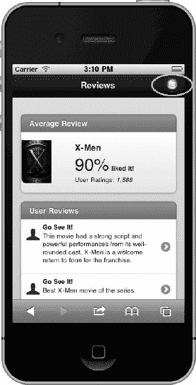

**图 9–1。** *影评页面页眉的推特按钮*

**清单 9–1。** *电影评论页面页眉的 Twitter 按钮(ch9/reviews.html)*

`

    

        <h1>Reviews</h1>
        
    

    ...

`

当用户点击 Twitter 按钮时，我们将在 Twitter 上搜索当前电影的最新推文，并将结果加载到我们的 Twitter 结果页面上(参见[图 9–2](#fig_9_2)及其在[清单 9–2](#list_9_2)中的相关代码)。

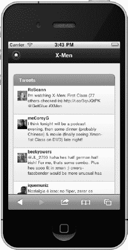

**图 9–2。** *推特结果页面*

**清单 9–2。** *推特结果页面(ch9/twitter.html)*

`

        ...
        

          <ul **id="tweet-list"** data-role="listview" data-inset="true">
            <li data-role="list-divider">Tweets
</li>
          </ul>
        

`

在[清单 9–2](#list_9_2)中显示的`tweet-list` id 是我们的占位符，我们将在这里追加我们的 Twitter 搜索结果。Twitter 的搜索 API 返回许多数据元素，然而，我们只对 tweet 文本、发布 tweet 的用户以及用户的个人资料图像感兴趣。

**提示:**要查看 Twitter 的搜索 API 中所有可用的数据元素，在浏览器中启动这个字符串“`[http://search.twitter.com/search.json?q=xmen](http://search.twitter.com/search.json?q=xmen)`”。这是基本的搜索 API，其中“`q`”参数的值是我们的可搜索关键字。在这种情况下，我们在 Twitter 上搜索任何包含关键字“`xmen`”的推文。

**提示:**大多数浏览器以无格式的样式显示 JSON 响应，这可能非常不友好:

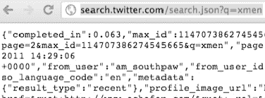

作为替代，Firefox 有一个 JSON 查看器插件 [4](#CHP-9-FN-4) ，它以更结构化的格式格式化 JSON 响应:

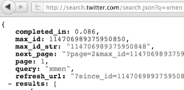

同样，如果你需要验证 JSON，JSONLint [5](#CHP-9-FN-5) 可以是一个有用的工具。

jQuery Mobile 内置了 Ajax 支持，这使得 RESTful 集成更加简单，不依赖于第三方 JavaScript 框架。这种支持来自 jQuery Mobile 扩展的 jQuery API [6](#CHP-9-FN-6) 。在 jQuery 中，$。ajax [7](#CHP-9-FN-7) API 是 RESTful 集成的首选解决方案，因为它简单且具有灵活的配置选项(超时、缓存等)。).

__________

4 见`[https://addons.mozilla.org/en-US/firefox/addon/jsonview/](https://addons.mozilla.org/en-US/firefox/addon/jsonview/)`。

5 见【http://jsonlint.com/】的。

6 见【http://jquery.com/】的。

7 见[http://API . jquery . com/jquery . Ajax/](http://api.jquery.com/jQuery.ajax/)。

要将 jQuery Mobile 与 Twitter 的 RESTful API 集成，以下步骤是必要的(参见[清单 9–3](#list_9_3)):

1.  当点击 Twitter 按钮时，我们将首先显示 jQuery Mobile 活动指示器，这样用户就可以直观地意识到一个活动正在后台处理:`$( "#twitterBtn" ).bind( "click", function(e) {
    **    $.mobile.showPageLoadingMsg();**`
2.  接下来，我们将把 Twitter 结果页面加载到当前页面的 DOM 中。如果页面已经存在于 DOM 中，我们将重新加载并更新缓存的页面:`**$.mobile.loadPage("twitter.html", { reloadPage: true });**`
3.  在我们的 Twitter 页面得到增强之前，我们将向 Twitter API 发送一个 AJAX 请求来收集我们的搜索结果:`$(“#twitterPage”).live("**pagebeforecreate**", function(){
       **$.ajax**({...`
4.  我们的`url`选项被配置为 Twitter 的 RESTful API，我们的搜索查询被配置为查找所有包含关键字“xmen”的 tweets:`**url:** "http://search.twitter.com/search.json?q=xmen"`
5.  由于 Twitter API 存在于另一个域中，我们需要将我们的`dataType`选项设置为`jsonp.`通常，跨域通信是不允许的，但是 JSONP [8](#CHP-9-FN-8) 有助于促进跨域集成的可信方式:`**dataType:** "jsonp"`
6.  最后，我们实现了我们的`success`回调来迭代搜索结果，为每一行创建一个列表项，并将新的标记附加到我们的列表容器中:

`success: function( response ) {...`

**清单 9–3。** *客户端 Twitter 集成(ch9/twitter.js)*

`$( "#reviewsPage" ).live( "pageinit", function(){
    $( "#twitterBtn" ).bind( "click", function(e) {
**        $.mobile.showPageLoadingMsg();**

        *// Reload Twitter results page even if it's already in the DOM*
**        $.mobile.loadPage("twitter.html", { reloadPage: true });**

        *// Prevent default click behavior*
        return false;` `    });
});

$( #twitterPage" ).live("pagebeforecreate", function(){
   **$.ajax**({
      **url:** "http://search.twitter.com/search.json?q=xmen",
      **dataType:** "jsonp",
      **success:** function( response ) {
 *        // Generate a list item for each tweet*
         var markup = "";
         $.each(response.results, function(index, result) {
             var $template = $('
<li>

</li>
');
             $template.find(".from").append(**result.from_user**);
             $template.find(".tweet").append(**result.text**);
             $template.find(".profile")
                          .attr("src", **result.profile_image_url**);
             markup += $template.html();
         });

 *        // Append the Tweet items into our Tweet list and refresh the
         // entire list.*
         $**(** "#tweet-list" **).**append**(**markup**).**listview**(** "refresh"**,** true **);**

         // Transition to the Twitter results page.
         $**.**mobile**.**changePage**(** $**(**"#twitterPage"**)** **);**
      },
   });
});
In this example, we have chosen to load the Twitter results on demand when the user
clicks on the Twitter button. Alternatively, you may pre-fetch the Twitter data so users
can see the Twitter results instantly when the button is clicked. To set up this
strategy, add the data-prefetch attribute on the Twitter button:
`

__________

8 见`[http://en.wikipedia.org/wiki/JSONP](http://en.wikipedia.org/wiki/JSONP)`。

现在页面的改变可以通过按钮的默认点击行为来处理，这样我们就可以在 Twitter 结果被添加到列表后，删除这个按钮和`$.mobile.changePage()`调用的自定义点击处理程序。

此外，在生产用例中，您将希望在`$.ajax`方法上配置`timeout`和`error`回调，以处理任何无响应或不可用的 API。例如，如果 Twitter API 没有响应，通知用户可能会有所帮助:

`**timeout:** 6000, // Timeout after 6 seconds
**error:** function(jqXHR, textStatus, errorThrown) {
    $.mobile.hidePageLoadingMsg();

 *   // Show error message*
    $( "
<h1>"+ **$.mobile.pageLoadErrorMessage** +"</h1>
" )
        .css({ "display": "block", "opacity": 0.96, "top": 100 })
        .appendTo( **$.mobile.pageContainer** )
        .delay( 800 )
        .fadeOut( 1000, function() {
            $( this ).remove();` `        });
}`

#### 使用 Ajax 的客户端表单发布

前面的例子是一个向 Twitter 的 API 发送 GET 请求的用例。从 API 读取时，GET 请求非常常见，当没有指定时，`$.ajax`方法将默认为这个`type`。在下一个例子中，我们将创建自己的 RESTful API，允许用户发送 POST 请求。让我们创建一个 API，这样用户就可以注册奖品。我们的用户界面将由一个简单的表单组成，只需要一个电子邮件地址(参见[图 9–3](#fig_9_3)和[清单 9–4](#list_9_4)中的相关代码)。

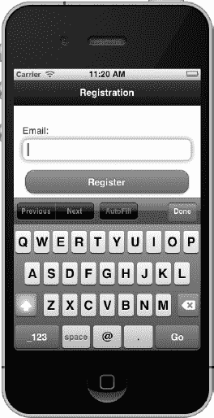

**图 9–3。***Ajax 客户端岗位登记表*

**清单 9–4。***Ajax 客户端发布登记表(ch9/register-client.html)*

`

    

      <h1>Registration</h1>
    
` `    

      <form **id="register"** method="post">
        <label for="email">Email:</label>
        <input **type="email"** name="email" id="email" **placeholder="Email"**
**required** />
        <input type="submit" id="submit" value="Register" />
      </form>
    

`

**提示:**电子邮件地址的输入字段包括三个新的 HTML5 属性。`type=”email”`字段提供了两个好处。首先，当字段获得焦点时，它会提示 QWERTY 键盘几个有用的电子邮件键(参见[Figure 9–3](#fig_9_3))。其次，它还将在提交表单时验证该字段是否包含有效的电子邮件地址。例如，在较新的桌面浏览器中，如果用户输入了无效的电子邮件，系统会提示用户以下消息:

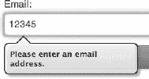

此外，当用户提交时，`required`属性将断言 email 字段不为空。如果为空，用户将收到以下警告:

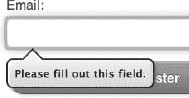

最后，`placeholder`属性将向输入字段添加提示文本。虽然这些特性很有帮助，但并不是所有的特性都被今天的浏览器所支持。Peter-Paul Koch 有一个有用的站点 [9](#CHP-9-FN-9) ，它显示了所有可用的输入属性及其相关的浏览器支持。

为了在客户端处理表单提交，我们将在提交按钮上附加一个事件监听器。要向我们的 RESTful API 提交 POST 请求，必须执行以下步骤(参见[清单 9–5](#list_9_5)):

__________

9 见`[http://www.quirksmode.org/html5/inputs_mobile.html](http://www.quirksmode.org/html5/inputs_mobile.html)`和
T1】

1.  首先，我们需要拦截并覆盖默认的提交行为。现在我们准备通过 RESTful API 提交表单:`$("form").submit(function () {`
2.  其次，我们需要显示 jQuery Mobile 活动指示器，这样用户就可以直观地意识到活动正在后台处理:`$.mobile.showPageLoadingMsg()`
3.  接下来，我们用所有必需的选项设置我们的`$.ajax`请求:
    *   Our `url` option is configured to our new RESTful resource that was set up locally to handle the client-side registration:

        **url:** `"http://localhost:8080/jqm-webapp/rest/register"`

        我们一会儿将看看 RESTful 实现。

    *   Next, we set the `type` option to POST. POST is the recommend type when creating new entities and it is slightly more secure than GET because it does not expose the data attributes as query string parameters on the URL:

        `**type:** "POST`

    *   Again we set the `dataType` option to `jsonp` because our RESTful API is also running on a separate domain from our client:

        `dataType:``jsonp`

    *   The `jsonp` option defines the callback function that will handle the response:

        `jsonp: "**jsoncallback**"`

        任何处理`jsonp`请求的 RESTful 资源都必须产生一个 JavaScript 响应。响应实际上是包装在 JavaScript 函数中的 JSON 数据。例如，我们的 RESTful API 的响应将包括成功注册的电子邮件地址，包装在回调函数中。这个回调函数的名称需要设置为我们的`jsonp`选项的值:

        `**jsoncallback**({"email":"BradPitt@gmail.com"})`

    *   `data`选项包含我们想要发送给 RESTful 资源的数据。在这种情况下，我们将发送所有表单值，并用 jQuery 的`serialize`方法:`**data:** $**(**"form#register"**).**serialize**(),**`对它们进行 URL 编码
    *   最后一个选项是我们的`success`处理程序。这将在我们收到来自 RESTful API 的成功响应后得到处理。在我们的例子中，我们将用户转发到一个感谢页面，并传递成功注册的电子邮件地址作为数据参数进行确认:`success: function( response ) {$.mobile.changePage( “register-
        thanks.html”, {
                data: {"email": response.email}} );
           }`

**清单 9–5。** *使用 Ajax 的客户端 POST(ch9/register . js)*

`$(“#registrationPage”).live("pageinit", function(){
  $("form").submit(function () {
**    $.mobile.showPageLoadingMsg();**

    **$.ajax**({
        **url:** "http://localhost:8080/jqm-webapp/rest/register",
        **type:** "POST",
**        dataType:** "jsonp",
**        jsonp:** "jsoncallback",
**        data:** $**(**"form#register"**).**serialize**(),**
        **success:** function( response ) {
           **$.mobile.changePage**( “register-thanks.html”,
                { data: {"email": **response.email**}} );
        }

        return false; *// Prevent a form submit*
    });
});`

注册成功后，用户将被转到一个感谢页面，在这里我们向他们展示他们赢得的奖品以及奖品发送的电子邮件地址(参见[图 9–4](#fig_9_4)及其在[清单 9–6](#list_9_6)中的相关代码)。

**图 9–4。** *用 Ajax 发布客户端帖子后的感谢页面*

**清单 9–6。** *用 Ajax 客户端发布后的感谢页面(ch9/register-thanks.html)*

`

  

    
        <h1>Thanks</h1>
  

  

    
Thanks for registering.  One FREE movie pass was just sent to:   ****

    
  

`

提示:为你的网站设计导航策略时，为用户提供一些导航选项以避免死角是很重要的。在 jQuery Mobile 中，一个简单的解决方案是总是在标题栏中显示主页图标，并通过反向转换将其重定向回主页:

``

当我们执行`changePage`调用时，我们还将电子邮件地址作为数据属性传递给了感谢页面。该数据属性被附加到页面的`data-url`属性中:

`data-url="/ch9/register-thanks.html?email=BradPitt%40gmail.com"`

在感谢页面增强之前，我们获取该电子邮件地址并将其绑定到感谢页面的电子邮件占位符中(参见[清单 9–7](#list_9_7))。

**清单 9–7。** *将邮件附加到感谢页面(ch9/register.js)*

`$("#thanksPage").live("pagebeforecreate", function(){
**    var email = getParameterByName("email", $(this).jqmData("url"));**
**    $(".email").append(email);**
});

function getParameterByName(param, url) {
    var match = RegExp('[?&]' + param + '=([^&]*)').exec(url);
    return match && decodeURIComponent(match[1].replace(/\+/g, ' '));
}`

服务器端处理注册的 RESTful 实现是用 Jersey [10](#CHP-9-FN-10) 实现的，并部署在 Tomcat [11](#CHP-9-FN-11) 上(参见[清单 9–8](#list_9_8))。

**清单 9–8。**【com.bmb.jqm.resource.RegisterResourse.java T2】RESTful 资源办理注册

`**@Path("/register")**
public class RegisterResource {

**    @Produces("application/x-javascript")**
    public Response register(**@QueryParam("jsoncallback")**
        **@DefaultValue("jsoncallback")** String callback,
        **@QueryParam("email")** String email) {
        Registration registration = new Registration();
        registration.setEmail(email);
        // Save registration...

        // Return registration in response as jsonp
        return Response.*status*(Response.Status.*OK*).entity(new
        JSONWithPadding(**registration**, callback)).build();
    }
}`

__________

10 见`[http://jersey.java.net/](http://jersey.java.net/)`。

11 见`[http://tomcat.apache.org/](http://tomcat.apache.org/)`。

在浏览资源时，让我们回顾一下 Jersey 的注释:

*   `@Path`注释定义了资源负责处理的路径。在这种情况下，RegisterResource 对象将处理发送到“*/rest/register”的所有请求。Jersey 在 web.xml 中配置，有两个配置项需要设置(参见[清单 9–9](#list_9_9))。首先，我们需要定义部署所有资源的包，其次，我们需要定义应该通过 Jersey 容器发送哪些 URL 模式。我们已经定义了所有 RESTful 资源都在包“`com.bmb.jqm.resource`”中声明，我们将通过 Jersey 容器路由所有带有“`/rest/*`”的 URL 路径。
*   `@Produces`注释定义了我们的响应的 MIME 类型。我们选择跨域公开我们的 RESTful API，这需要资源返回一个 JavaScript 响应。这允许客户端使用`jsonp`请求访问 API。
*   register 方法接受两个输入参数。第一个是回调函数名。客户端可以发送回调函数的名称，但这不是必需的。如果没有提供，服务器会将回调名称默认为“`jsoncallback`”。最后一个参数是注册用户的电子邮件地址。
*   服务器现在可以处理注册并生成响应。在本例中，我们将返回一个响应，其中包含转换为 JSON 并包装在回调函数中的注册对象:`jsoncallback({"email":"BradPitt@gmail.com"})`

**清单 9–9。** *球衣配置(web.xml)*

`<servlet>
  <servlet-name>Jersey REST Service</servlet-name>
  <servlet-class>
    com.sun.jersey.spi.container.servlet.ServletContainer
  </servlet-class>
  <init-param>
      <param-name>com.sun.jersey.config.property.packages</param-name>
**      <param-value>com.bmb.jqm.resource</param-value>**
  </init-param>
  <load-on-startup>1</load-on-startup>
  </servlet>
  <servlet-mapping>
      <servlet-name>Jersey REST Service</servlet-name>
**      <url-pattern>/rest/*</url-pattern>**
  </servlet-mapping>`

正如我们所见，jQuery Mobile 与 RESTful API 集成得非常好。无论我们需要读取还是提交数据，内置的 jQuery 库都提供了在客户端管理 RESTful 生命周期的所有便利功能。

### 服务器端与 MVC 的集成

在这一节中，我们将把注意力集中在服务器端访问策略上。在 Web 上，一个非常常见的策略是集成模型-视图-控制器(MVC)框架。我们将看到两个 MVC 例子，它们在风格上与我们的客户端例子非常相似。在我们的第一个例子中，我们将把客户端注册用例转换成服务器端实现。这个例子将提供一个苹果对苹果的比较，说明如何在 jQuery Mobile 中使用客户端访问策略和服务器端访问策略实现相同的用例。在最后一个例子中，我们将看到如何实现从服务器获取数据的用例。

#### 使用 MVC 的服务器端表单发布

为了便于比较，看一下我们的注册用例的服务器端实现是很有价值的。同样，我们将有一个注册表单，允许用户选择接收折扣或免费电影票(见[图 9–5](#fig_9_5))。

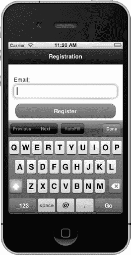

**图 9–5。***MVC 服务器端岗位登记表*

我们注册页面的页面标记与客户端示例中显示的非常相似，只是我们不打算覆盖表单提交流程。在我们的服务器端注册示例中，当用户点击注册按钮时，我们将让表单向我们的动作提交请求(参见[清单 9–10](#list_9_10))。

**清单 9–10。** *服务器端集成登记表(/web app/ch9/register-server . html)*

`

    

        <h1>Register</h1>
    

    

     <form id="register" **action="/jqm-webapp/mvc/register" method="post"**>
         <label for="email">Email:</label>
         <input type="email" name="email" id="email" placeholder="Email"
        required />

         <input type="submit" value="Register" data-theme="b"/>
     </form>
    

`

将我们的客户端示例(register-client.html)的注册页面与这个示例(register-server.html)的注册页面进行比较时，有什么突出的地方吗？最显著的区别是这个页面不需要定制 JavaScript。因此，我们的页面标记更加干净。

当提交表单时，POST 请求将被发送到我们的操作(`/jqm-webapp/mvc/register`)中定义的路径。这个请求将由部署在 Tomcat 上的 Spring MVC [12](#CHP-9-FN-12) 控制器在服务器端处理。在我们的 web.xml 文件中，我们配置了 servlet 映射，因此所有的"`/mvc/*` " URL 都通过 Spring MVC 的 dispatcher servlet 进行路由(参见[清单 9–11](#list_9_11))。

**清单 9–11。***Spring MVC servlet-mapping 配置(/WEB-INF/web.xml)*

`<servlet>
    <servlet-name>jqm-webapp</servlet-name>
    <servlet-class>
        org.springframework.web.servlet.DispatcherServlet
    </servlet-class>
    <load-on-startup>1</load-on-startup>
</servlet>
<servlet-mapping>
    <servlet-name>jqm-webapp</servlet-name>
**    <url-pattern>/mvc/*</url-pattern>**
</servlet-mapping>`

从用户界面的角度来看，工作流与我们的客户端注册示例相同。表单被提交、处理，然后显示我们的感谢页面。处理请求并将其重定向到感谢页面的控制器代码如清单 9–12 所示。

__________

12 见`[http://static.springsource.org/spring/docs/current/spring-frameworkreference/html/mvc.html](http://static.springsource.org/spring/docs/current/spring-frameworkreference/html/mvc.html)`。

**清单 9–12。*T2【com.bmb.jqm.controller.RegisterController.java】春天 MVC 注册控制器***

`**@Controller()**
public class RegisterController {

**    @RequestMapping(method = RequestMethod.POST)**
    public String enroll(**@RequestParam("email")**String email, HttpSession
        session) {
        // Save registration...

        session.setAttribute("**email**", email);
**        return "redirect:/mvc/register/thanks";**
    }

**    @RequestMapping(method = RequestMethod.GET)**
    public String thanks() {
        return "register-thanks";
    }
}`

让我们在单步调试控制器时回顾一下 Spring MVC 注释:

*   `@Controller`注释将类定义为可以处理请求的控制器。Spring MVC 配置了路径到类名的映射。例如，所有的"`/register/`"请求将被分派给 RegisterController。这个配置是在 Spring MVC 的 dispatcher servlet 中设置的(参见[清单 9–13](#list_9_13))。
*   `@RequestMapping`注释定义了处理 POST 和 GET 请求的方法。当提交表单时，POST 请求将被发送到`enroll`方法。`thanks`方法将处理所有的 GET 请求。例如，我们在处理完表单后重定向到感谢页面，当感谢页面刷新时会触发`thanks`方法。
*   `@RequestParam`注释将表单上提交的电子邮件地址绑定到我们的电子邮件输入参数。当调用 enroll 方法时，我们保存注册，将电子邮件地址置于会话中，并重定向到感谢页面(`/jsp/register-thanks.jsp`)。

**清单 9–13。** *Spring MVC 路径到控制器映射配置(/we b-INF/jqm-WEB app-servlet . XML)*

`<!-- Enable controller mapping by convention. For example: /foo/* will map to
FooController() -->
<bean
class="org.springframework.web.servlet.mvc.support.**ControllerClassNameHandlerMapping**" />`

感谢页面的外观将与我们的客户端示例相同(参见[Figure 9–6](#fig_9_6))。

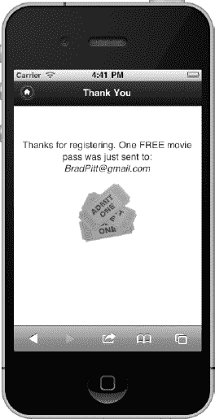

**图 9–6。** *服务器端发布后的感谢页面用 MVC*

唯一的区别在于页面是如何生成的。该页面在服务器端生成为 JSP，电子邮件地址与 JSTL 表达式语法绑定在一起(参见[清单 9–14](#list_9_14))。动态生成页面不需要 JavaScript，与我们在客户端示例中看到的动态生成的感谢页面相比，这个标记更加简洁。

**清单 9–14。** *服务器端注册后的感谢页面(/jsp/register-thanks.jsp)*

`

    

        <h1>Thank You</h1>
    

    

        
Thanks for registering.  One FREE movie pass was just sent to:    
          **${email}**

          
    

`

提交表单后需要注意的一个重要事项是，jQuery Mobile 管理浏览器地址栏中显示的 URL。例如，在服务器重定向到`“/mvc/register/thanks`之后，浏览器 URL 仍然显示我们动作的路径(`/jqm-webapp/mvc/register`)。如果您还没有为该路径实现 GET 请求处理程序，那么“感谢”页面上的“刷新”将导致 404，not found 错误。您有两种选择来处理这个问题:

*   最简单的解决方案是在控制器上为动作路径实现一个 GET 请求处理程序。我们的`RegisterController#thanks`方法处理 GET 请求，并将简单地刷新感谢页面，重新显示会话中存储的电子邮件地址(参见[清单 9–12](#list_9_12))。此外，在网上提交表单时，建议先发布，然后重定向，以避免任何重复提交的问题。
*   Alternatively, you may manually set the `data-url` attribute on the page container. The value of the `data-url` attribute will be shown in the browser's location bar. This also gives developers more flexibility when constructing semantic paths: `data-url="/manually/set/url/path/”`

    这种策略也可以用来隐藏文件名。例如，如果您转到“`/my/movies/index.html`”，您可以将页面的`data-url`属性更新为`”/my/movies/”`，这将隐藏 index.html 部分，使其不显示。

#### 使用 MVC 的服务器端数据访问

在前面的例子中，我们看到了如何将表单数据发送到服务器。在这个例子中，我们将使用 GET 请求从服务器获取数据。这个例子将从服务器获取电影列表，并在 jQuery Mobile JSP 页面中显示结果(参见[Figure 9–7](#fig_9_7))。

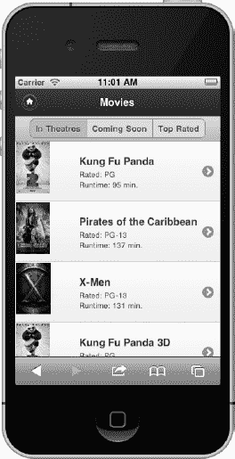

**图 9–7。** *从服务器端 MVC 访问中获取的电影*

在服务器端，我们有一个 Spring MVC 控制器设置来处理以下 href 上的 GET 请求:

`<a href="**/jqm-webapp/mvc/movies**" data-role=”button”>Movies</a>`

当按钮被点击时，一个 GET 请求将被触发并发送给我们的 MoviesController。MoviesController 将检索我们的电影数据，并将响应转发给电影 JSP 页面(参见[清单 9–15](#list_9_15))。

**清单 9–15。**【com.bmb.jqm.MoviesController.java】MVC 控制器获取电影数据

`@Controller()
public class MoviesController {

**    @RequestMapping(method = RequestMethod.GET)**
    public String getMovies(ModelMap model) {
        model.addAttribute("movies", getMovieData());
        return "movies";
    }
}`

响应将被转发到电影页面，JSP 将迭代电影列表，为每个结果显示一个单独的列表项(参见[清单 9–16](#list_9_16))。

**清单 9–16。** *JSP 显示电影数据(/jsp/movies.jsp)*

`

    <ul data-role="listview">
**        <c:forEach var="movie" items="${movies}">**
        <li>
             <a href="#">
                
                <h3>**${movie.title}**</h3>
                
Rated: **${movie.rating}**

                
Runtime: **${movie.runtime}** min.

            </a>
        </li>
**        </c:forEach>**
    </ul>

`

这种服务器端解决方案的一个优点是页面标记的简单性。没有 JavaScript 的动态页面生成、字符串连接或 jQuery 选择器的动态字段绑定，我们在前面的客户端示例中已经看到了。

#### 服务器端与客户端

决定实施哪种服务访问策略取决于几个因素。如果您现在已经在构建 Web 应用，那么您可能已经有了一个在 Web 上访问数据的既定模式。如果是这样，出于一致性目的，您可能希望继续使用这种策略。幸运的是，当正确实现时，jQuery Mobile 将与这两种策略很好地集成，最终您可以共同选择最适合您特定应用需求的模式。以下是每种策略的支持性注意事项:

客户端集成:

*   Faster response times. Client-side integrations produce faster response times because they have fewer point-to-point server dependencies. For instance, we could have aggregated our Twitter data on the server-side but our response times would have decreased due to the additional server communication.

    **注意:**虽然客户端集成提供了更快的响应时间，但在与第三方 API 集成时要小心，因为在服务器端封装它们有利于更好地将您自己的页面与第三方修改隔离开来。例如，脸书的 RESTful API 在过去经常改变，现在它实际上被否决了。

*   更快地实现。我们在客户端的 Twitter 例子是一个非常快速的实现，因为只有我们的客户端标记需要修改。在服务器端实现这项任务需要修改客户端和服务器端组件。

服务器端集成:

*   比较靠谱。服务器端解决方案比客户端解决方案更可靠，因为您不必担心客户端 JavaScript 的不兼容性。
*   更安全。当实现客户端解决方案时，您必须小心暴露的 API 和数据类型。如果您正在与暴露个人身份信息(PII)、个人健康信息(PHI)或支付卡行业(PCI)信息的 API 集成，客户端解决方案将是不可取的。
*   更清晰的页面标记。在比较使用服务器端和客户端访问策略实现的页面时，我们看到了这样的例子。我们的服务器端访问示例中使用的页面不依赖于定制的 JavaScript。
*   更简单的组件单元测试。我相信服务器端单元测试仍然比客户端单元测试简单。然而，在对 jQuery Mobile 项目进行了几次 QUnit 测试之后，我开始相信客户端单元测试可以非常成功和可靠！

### 谷歌地图整合

在最近的一项移动 Web 调查中，近 75%的 Web 开发人员使用地理定位，使其成为最受欢迎的 HTML5 API。 [13](#CHP-9-FN-13) 在构建位置感知应用时，通常会有一个显示兴趣点或方向的地图视图。在网络上，地理定位 [14](#CHP-9-FN-14) 结合谷歌地图 [15](#CHP-9-FN-15) 为构建地图功能提供了非常有用的 API。在这一节中，我们将了解 jQuery Mobile 与地理定位和谷歌地图的集成情况。首先，我们将创建一个示例，在地图上标出您的当前位置(参见[图 9–8](#fig_9_8))。

__________

13 见[http://www . webdirections . org/somw 2011/](http://www.webdirections.org/sotmw2011/)。

14 见【http://dev.w3.org/geo/api/spec-source.html】的。

15 见[http://code . Google . com/APIs/maps/documentation/JavaScript/basics . html](http://code.google.com/apis/maps/documentation/javascript/basics.html)。

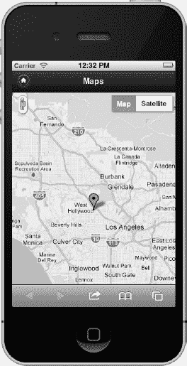

**图 9–8。** *谷歌地图与 jQuery Mobile 整合*

页面中的标记很少，因为我们只需要为地图创建内容容器(参见[清单 9–17](#list_9_17))。

**清单 9–17。** *用于谷歌地图集成的 jQuery Mobile 页面标记(ch9/maps.html)*

`<!DOCTYPE html>
<html>
   <head>
   <meta charset="utf-8">
   <title>Google Maps</title>
   <meta name="viewport" content="width=device-width, initial-scale=1">
   <link rel="stylesheet" type="text/css" href="jquery.mobile.css" />
   
   
**   **
   
**   **
</head>
<body>` `

    

        <h1>Maps</h1>
    

    

        <!-- map loads here... -->
    

</body>
</html>`

当与谷歌地图集成时，有几个附加功能是必需的:

1.  首先，我们需要设置页面和地图容器的样式，使其全屏显示:`**#map-page, #map-canvas { width: 100%; height: 100%; padding: 0; }**`
2.  接下来，我们导入定制的 JavaScript 来帮助确定用户的地理位置并绘制地图视图。我们很快就会看到这个文件的细节:`****`
3.  然后，我们导入 Google Maps API: `**<script src="http://maps.google.com/maps/api/jssensor=false">**`
4.  最后，我们确定我们的地图容器。我们的地图将在这个元素内绘制:`
`

帮助确定用户地理位置和绘制地图视图的定制 JavaScript 如清单 9–18 所示。

**清单 9–18。** *用于谷歌地图集成的 JavaScript(ch9/Maps . js)*

`$( "#map-page" ).live( "pageinit", function() {

 *   // Default to Hollywood, CA when no geolocation support*
    var defaultLatLng = new google.maps.LatLng(34.0983425**,** -118.3267434);  

    if ( **navigator.geolocation** ) {
        function **success**(pos) {
 *           // Location found, show coordinates on map*
            drawMap(new google.maps.LatLng(
               pos.coords.latitude, pos.coords.longitude));
        }

        function **fail**() {
            drawMap(defaultLatLng);  *// Show default map*
        }

 *       // Find users current position*
**        navigator.geolocation.getCurrentPosition**(success, fail,
            {enableHighAccuracy:true, timeout: 6000, maximumAge: 500000});` `    } else {
        **drawMa**p(defaultLatLng); *// No geolocation support*
    }

    function drawMap(latlng) {
        var myOptions = {
            zoom: 10,
            center: latlng,
            mapTypeId: google.maps.MapTypeId.ROADMAP
        };

        var map = new google.maps.Map(
            document.getElementById("map-canvas"), myOptions);

 *       // Add an overlay to the map of current lat/lng*
        var marker = new google.maps.Marker({
            position: latlng,
            map: map,
            title: "Greetings!"
        });
    }
});`

当地图页面处于“就绪”状态时，我们将执行以下步骤来绘制地图视图:

1.  首先，我们确定浏览器是否支持地理定位:`if ( **navigator.geolocation** ) {`
2.  If the browser supports Geolocation we will attempt to retrieve the users current position: `navigator.geolocation.getCurrentPosition(success, fail,`

    { enablehigaccuracy:true，timeout: 6000，maximumAge:500000 })；

    `getCurrentPosition` API 最多可以接受三个参数。第一个参数是成功回调。这是唯一必需的参数。下一个参数是错误回调，最后一个参数是我们的可配置选项。我们已经将地理位置查找配置为使用高精度。如果支持，这将尝试使用 GPS 定位。我们还将超时设置为 6 秒。如果我们在 6 秒后没有找到用户的位置，我们的错误回调将被调用。最后，我们已经配置了查找可以使用缓存的位置，如果它不到 5 分钟。

3.  当找到一个成功的位置时，将调用成功回调。在这种情况下，我们将使用位置坐标:`function **success**(pos) {
        **drawMap**(new google.maps.LatLng(
            pos.coords.latitude, pos.coords.longitude))
        }`来绘制地图
4.  最后，`drawMap`方法将绘制一张 Google 地图，在地图中心被标识为您所在位置的位置显示一个覆盖图标。但是，如果不支持地理定位或者没有建立位置，加利福尼亚州好莱坞将显示为默认位置(参见[清单 9–18](#list_9_18))。

### 总结

在本章中，我们看到了如何将 jQuery Mobile 与客户端和服务器端的数据访问策略相集成。jQuery Mobile 很好地集成了这两种策略，允许您选择最适合您的应用需求的访问方法。虽然客户端策略提供了更好的性能，并且可以更快地实现，但它可能不如服务器端策略可靠、安全或可维护。

最后，我们看到了一个如何将 jQuery Mobile 与地理定位和 Google Maps 集成的例子。有了这两个 mapping API，我们现在能够将地图视图添加到 jQuery Mobile 应用中。

在第 10 章中，我们将看看如何利用现有的 jQuery Mobile 应用，并通过 PhoneGap 在本地发布它们。