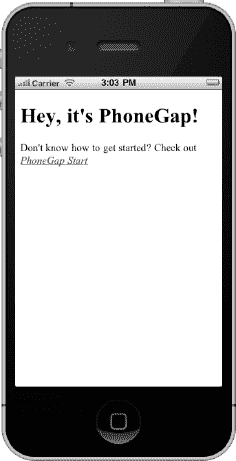
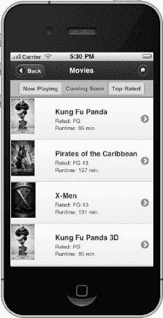
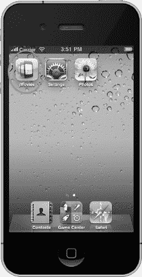
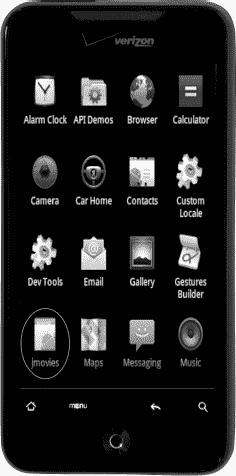

# 十、使用 PhoneGap 轻松部署

与移动网络应用相比，本地应用似乎有两个明显的优势。首先，原生应用可以在应用商店中分发。最著名的应用商店包括苹果应用商店、安卓市场、惠普应用目录、黑莓应用世界和 Windows 市场。当消费者需要搜索、购买、安装或评价原生应用时，应用商店简化了用户体验。本机应用的另一个优势是它们能够与设备 API 进行交互。例如，本地应用能够与大多数设备 API 进行通信，包括联系人、日历、相机和网络 API 等。

在这一章中，我们将讨论如何打破这些移动网络壁垒。特别是，我们将介绍 PhoneGap，并展示 PhoneGap 如何帮助我们的 jQuery Mobile 应用弥合这些差距。例如，我们将使用一个现有的 jQuery Mobile 应用，用 PhoneGap 包装它，并将我们的应用部署到原生 iOS 和 Android 平台。

我们还将看到如何在没有 PhoneGap 的情况下将我们的 jQuery Mobile 应用分发到应用商店。例如，Open App Market 是一个 HTML5 移动应用的应用商店，对于那些发现原生应用商店分发过程繁琐而缓慢的人来说，它可以是一个替代选择。

最后，我们将看一看 W3C 在客户端设备 API 上取得的进展，将来有一天浏览器会支持这些 API。这对于移动网络来说非常重要，因为它将允许我们的网络应用访问设备 API(日历、联系人、照相机等)。)对外部框架的依赖性为零。

### 什么是 PhoneGap？

PhoneGap 1 例如，我们可以使用现有的 jQuery Mobile web 应用，用 PhoneGap 框架包装它，并将其分发给 PhoneGap 支持的所有本机平台。目前，PhoneGap 支持原生 iOS、Android、BlackBerry、webOS 和 Symbian 平台。除了 PhoneGap 的原生分发功能，它还公开了一个 API，允许我们的移动 Web 应用与特定于设备的 API 进行交互，包括文件系统、通知和摄像头等等。有关完整列表，请参考 PhoneGap 平台支持的功能。2PhoneGap API 允许我们以以前只有原生 SDK 才有可能的方式扩展我们的 jQuery Mobile 应用。

### 将 jQuery Mobile 作为 iOS 应用运行

在本节中，我们将使用 PhoneGap 包装一个 jQuery Mobile 应用，并在原生 iOS 平台上运行它。要为 iOS 平台设置 PhoneGap，我们可以参考 PhoneGap 的《iOS 入门指南》。PhoneGap 有在每个平台上安装 PhoneGap 的分步说明，它们的说明非常详细，并有截图作为辅助。安装 Xcode，iOS 开发的 IDE?? 4T7，是开发到 iOS 平台的前提。如果您选择绕过 Xcode 安装，那么继续学习以熟悉在本机平台上设置 PhoneGap 所必需的一般步骤仍然是有价值的。虽然每个平台都有特定的 IDE 设置说明，但是安装 PhoneGap、设置项目和部署的一般过程对于所有平台都是一致的。设置好 iOS 平台后，您应该有一个新的 Xcode 项目，看起来类似于 Figure 10–1。

_____________________________

1 见`[`www.phonegap.com/.`](http://www.phonegap.com)`

2 参见`[`www.phonegap.com/about/features`](http://www.phonegap.com/about/features).`

3 见`[`www.phonegap.com/start#ios-x4`](http://www.phonegap.com/start#ios-x4).`

4 见`[`developer.apple.com/xcode/.`](http://developer.apple.com/xcode)`

**图 10–1。** *支持 PhoneGap 的初始 Xcode 项目*

图 10–1 所示的“www”目录是应用根目录。在这个目录中有 PhoneGap JavaScript 库和一个默认页面(index.html)。当我们运行应用时，index.html 页面将显示为初始登录页面。在 Xcode 中，要构建和运行应用，请点按出现在 Xcode 左上角的“运行”按钮。点击“运行”后，应用将编译，iOS 模拟器将启动，并显示索引页面(参见图 10–2)。

**图 10–2。** *在 Xcode 中运行 PhoneGap 默认应用时的初始屏幕*

通过在 Xcode 中设置 PhoneGap 项目，我们现在可以将现有的 jQuery Mobile 应用导入到我们的项目中。下面列出了将 jQuery Mobile 应用导入 Xcode 项目并部署为原生 iOS 应用的步骤:

1.  First, we need to import an existing jQuery Mobile project into Xcode's “www” root directory. For this exercise, you may import your own jQuery Mobile app or import the jQuery Mobile project that is included in the chapter 10 source code folder. For example, if we import the jQuery Mobile files from the Chapter 10 source code directory and move them into our “www” directory, our Xcode project structure should appear as the figure below:

    

2.  After importing the jQuery Mobile project into our PhoneGap project we need to import PhoneGap's JavaScript library as a top-level resource: `<head>
      <meta charset="utf-8">
      <title>jMovies</title>
      <meta name="viewport" content="width=device-width, initial-scale=1">
      <link rel="stylesheet" type="text/css" href="jquery.mobile-min.css" />
      <link rel="stylesheet" type="text/css" href="custom.css" />
    **  **
      
      
      
    </head>`

    PhoneGap 库是一个 API，它提供了对许多设备特定功能(相机、媒体、存储等)的访问。).PhoneGap 在其网站 5 上提供了所有支持的 API 的文档和示例。只有当您的应用需要与 PhoneGap 的本机功能进行交互时，才需要导入 PhoneGap 库。

3.  最后一步是运行和测试应用。在 Xcode 中，点按“运行”按钮。这将编译应用，并在 iOS 模拟器中启动它。如果您从第十章源代码中导入了 jQuery Mobile 项目，那么最初出现的屏幕将是跳板(参见图 10–3)。

_____________________________

5 见`[`docs.phonegap.com/`](http://docs.phonegap.com).`

**图 10–3。** *jQuery Mobile 作为原生 iOS app 运行*

为了帮助验证 PhoneGap 库是否正确安装，我为 PhoneGap 的`device-ready`事件添加了一个监听器。当该事件触发时，PhoneGap 处于就绪状态，我们可以开始与 PhoneGap API 通信(参见清单 10–1)。

**清单 10–1。** *PhoneGap 准备好了(`ch10/custom.js` )*

`$(document).bind("**deviceready**", function(){
**    navigator.notification.alert("PhoneGap is initialized...");**
});`

如 Figure 10–3 所示，当 PhoneGap 处于就绪状态时，我们会显示一个警告视图，指示 PhoneGap 已经初始化。清单 10–1 中的警报通知是一个例子，展示了我们如何通过编程与 PhoneGap 的 API 进行交互来访问本地功能。

**注:** PhoneGap 已经简化了将我们的 jQuery Mobile web 应用转换到运行在 iOS 上的原生平台的过程。从技术角度来看，我们的 jQuery Mobile web 应用现在运行在 iOS Web 视图中。

当比较我们在 Safari 浏览器中运行的 jQuery Mobile 应用(参见图 10–4)和在 iOS 中运行的本地应用(参见图 10–5)时，您发现有什么不同吗？

**图 10–4。** *jQuery 手机浏览器内运行*

**图 10–5。** *jQuery Mobile 作为原生 iOS 应用运行*

最明显的区别是浏览器 chrome 在 Safari 浏览器中可用，但在原生应用中不可用。如果你还记得我们在第三章的“后退按钮”部分，后退按钮最初在 jQuery Mobile 中是禁用的，因为浏览器 chrome 已经提供了内置的导航按钮。然而，对于运行原生 iOS 应用的用户来说，标题中的后退按钮是主要的导航方式。幸运的是，我们可以通过简单的配置更新在 jQuery Mobile 中启用后退按钮(参见清单 10–2)。

**清单 10–2。** *全局启用后退按钮(`ch10/custom.js` )*

`$(document).bind("mobileinit", function(){
**    $.mobile.page.prototype.options.addBackBtn = true;**
});`

jQuery Mobile 中的后退按钮非常智能。只有当历史中有一页可以返回时，它才会出现。在全球启用后退按钮后，我们的原生 iOS 用户在导航应用时会感到更加舒适(参见 Figure 10–6)。

**图 10–6。** *全局启用后退按钮进行导航支持*

在全局启用后退按钮的情况下，我们可能还想在不需要它们的特定页面上禁用它们。特别是，我们将希望防止返回按钮出现在主屏幕上。为了防止后退按钮出现在给定的页面上，我们可以向页面容器添加`data-add-back-btn=”false”`属性:

`
`

因此，当我们导航回主屏幕时，将不会显示后退按钮。

既然我们已经能够将 jQuery Mobile 应用部署到原生 iOS 平台，我们还需要定制默认应用图标(参见图 10–7)和闪屏(参见图 10–8)。

**图 10–7。** *PhoneGap 在 iOS 中的默认应用图标*

**图 10–8。** *PhoneGap 在 iOS 中的默认闪屏*

应用图标存储在项目的/Resources/icons 目录中，闪屏图像存储在/Resources/splash 目录中(参见 Figure 10–9)。图像适用于不同的 iOS 屏幕密度和尺寸。

**图 10–9。** *Xcode 的闪屏图像和应用图标*

此外，当您需要更改包显示名称或标识符时，可以在项目的“信息”标签中的 Xcode 中进行设置(参见图 10–10)。捆绑包显示名称设置应用图标的标签，iOS 使用捆绑包标识符来唯一标识您的应用。

**图 10–10。** *设置捆绑显示名称和标识符*

**提示:**使用 PhoneGap 开发时，建议将`$.mobile.allowCrossDomainPages`配置选项设置为`true`:

`$(document).bind(“mobileinit”, function(){
**    $.mobile.allowCrossDomainPages = true;**
});`

Phone Gap 的 web 视图允许应用进行跨域呼叫。这通常是允许的，这样应用可以从他们的主服务器获取数据。默认情况下，jQuery Mobile 会将跨域请求视为外部链接。因此，跨域页面不会加载到当前页面的 DOM 中，也不会应用任何过渡。因此，如果你想让 jQuery Mobile 管理 PhoneGap 中跨域请求的页面加载逻辑，就把这个选项设置为`true`。

这就完成了从安装 PhoneGap 到在原生 iOS 平台上运行我们的 jQuery Mobile 应用的整个过程。在你的应用准备好生产后，最后一步是将你的 iOS 应用分发到苹果的应用商店。虽然这个过程可能会很漫长，但在苹果的 iOS 开发者库 6 中可以找到将你的应用分发到苹果应用商店的完整说明。

### 将 jQuery Mobile 作为 Android 应用运行

在本节中，我们将使用 PhoneGap 包装一个 jQuery Mobile 应用，并在原生 Android 平台上运行它。在 Android 平台上设置 PhoneGap，我们会参考 PhoneGap 的《Android 入门指南》 7 。安装 Eclipse，Android 开发的 IDE，是一个先决条件。在你的 Android 平台建立之后，你应该有一个类似于图 10–11 的新 Eclipse 项目。

_____________________________

⑥见`[`developer.apple.com/library/ios/#documentation/Xcode/Conceptual/ios_development_workflow/145-Distributing_Applications/distributing_applications.html`](http://developer.apple.com/library/ios/#documentation/Xcode/Conceptual/ios_development_workflow/145-Distributing_Applications/distributing_applications.html).`

7 见`[`www.phonegap.com/start#android`](http://www.phonegap.com/start#android).`

**图 10–11。** *支持 PhoneGap 的初始 Eclipse 项目*

图 10–11 所示的“www”目录是应用根目录。在这个目录中有 PhoneGap JavaScript 库和一个默认页面(index.html)。当我们运行应用时，index.html 页面将显示为初始登录页面。在 Eclipse 中，要构建和运行应用，单击 run 菜单，选择 Run As，然后选择 Android Application。在我们编译并运行应用后，Android 模拟器将会启动并显示索引页面(参见图 10–12)。

**图 10–12。***Eclipse 中运行 PhoneGap 默认应用时的初始屏幕*

**提示:**如果您发现 Android 模拟器启动时间太长，您可能更愿意部署到实际设备上进行测试。对于这个设置，确保 USB 调试在你的设备上启用(设置应用开发)并将其插入你的系统。现在，当您运行您的应用时，它会启动得更快。

有了 Eclipse 中的 PhoneGap 项目设置，我们现在可以将现有的 jQuery Mobile 应用导入到我们的项目中。下面列出了将 jQuery Mobile 应用导入 Eclipse 项目并作为原生 Android 应用进行部署的步骤:

1.  First, we need to import an existing jQuery Mobile project into Eclipse's “www” root directory. For this exercise, you may import your own jQuery Mobile app or import the jQuery Mobile project that is included in the chapter 10 source code folder. For example, if we import the jQuery Mobile files from the Chapter 10 source code directory and move them into our “www” directory, our Eclipse project structure should appear as shown in Figure 10–13: 

    **图 10–13。** *一个日食项目*

2.  将 jQuery Mobile 项目导入 Eclipse 项目后，我们需要导入 PhoneGap 的 JavaScript 库作为顶层资源:`<head>
      <meta charset="utf-8">
      <title>jMovies</title>
      <meta name="viewport" content="width=device-width, initial-scale=1">
      <link rel="stylesheet" type="text/css" href="jquery.mobile-min.css" />
      <link rel="stylesheet" type="text/css" href="custom.css" />
    **  **
      ` `  
      
    </head>`
3.  最后一步是运行和测试应用。在 Eclipse 中，单击运行菜单，选择运行方式，然后选择 Android 应用。这将编译应用，并在 Android 模拟器中启动它。如果您从第十章源代码中导入了 jQuery Mobile 项目，那么最初出现的屏幕将是跳板(参见图 10–14)。

**图 10–14。** *从 Eclipse 运行 PhoneGap 时的初始屏幕*

如果你还记得我们的 iOS 示例，我们在所有屏幕上都全局启用了后退按钮，因为后退按钮通常固定在 iOS 应用的标题中。由于 Android 有一个基于硬件的后退按钮，所以没有必要启用我们的后退按钮(参见图 10–15)。

**图 10–15。** *安卓系统不需要后退按钮*

**提示:**在单独的文件中提取特定于平台的依赖关系。这种分离将有助于简化跨平台的不同配置的管理。例如，为每个支持的平台创建一个单独的配置文件:custom-ios.js，custom-android.js。

既然我们已经能够将我们的 jQuery Mobile 应用部署到原生 Android 平台，我们还需要定制默认的应用图标(参见图 10–16)。

**图 10–16。***Android 中 PhoneGap 的默认应用图标*

Android 应用图标存储在项目的/res/drawable-*目录中，图像可用于高、中、低密度(参见图 10–17)。

**图 10–17。** *安卓的应用图标图片*

这就完成了从安装 PhoneGap 到在原生 Android 平台上运行我们的 jQuery Mobile 应用的整个过程。当你的应用准备生产时，最后一步是将你的 Android 应用发布到 Android Market。将你的应用发布到 Android Market 的完整说明可以在 Android 的开发指南中找到。 8

### 开放应用市场

开放应用市场 9 是一个 HTML5 移动应用的应用商店，允许我们像本地应用商店一样搜索、购买、安装或评价 HTML5 移动应用(参见图 10–18)。

_____________________________

8 见`[`developer.android.com/guide/publishing/publishing.html`](http://developer.android.com/guide/publishing/publishing.html).`

9 见`[`openappmkt.com/`](http://openappmkt.com).`

**图 10–18。** *开放 App 市场*

要开始使用 Open App Market，我们必须首先将它安装到我们的设备上。目前，开放的应用市场对 iOS 和 Android 用户开放。要安装 Open App Market，请使用您的 iOS 或 Android 设备扫描图 10–19 中的二维码。

**图 10–19:***二维码安装打开 App 市场。或者，你可以去 openappmkt.com，点击他们网站顶部的安装链接。*

安装应用后，您可以按类别或受欢迎程度搜索移动网络应用。当你发现一个你感兴趣的免费或付费应用时，下载它，该应用将被保存在你的主屏幕上，就像来自原生应用商店的应用一样。例如，图 10–20 显示了开放应用市场应用以及从开放应用市场下载的 Twitter 和 YouTube 应用。

**图 10–20。** *开放应用市场下载应用的方式与本地商店相同*

### 客户端设备 API

如果你需要建立一个移动应用，它必须集成设备特定的功能，如相机、联系人或网络，你会选择什么移动技术？今天，我们的选择有限。我们必须要么使用本地平台，要么使用 PhoneGap 这样的混合技术。如果所有的网络浏览器都支持这些特定于设备的特性，那就太理想了。虽然目前没有浏览器支持这些特性，但是 W3C 目前正在为大多数主要的客户端设备 API10实现工作草案。最值得注意的客户端设备 API 包括对相机、网络、日历、联系人、消息和电池信息的访问。虽然现在预测浏览器何时支持这些功能还为时过早，但至少进展已经很顺利了。

_____________________________

10 见`[`www.w3.org/2009/dap/.`](http://www.w3.org/2009/dap)`

### 总结

在本章中，我们看到了如何使用现有的 jQuery Mobile 应用，并将其与 PhoneGap 框架集成。PhoneGap 为 jQuery Mobile web 应用添加了两个独特的功能。首先，我们可以将现有的 jQuery Mobile web 应用封装在 PhoneGap 框架中，并将其分发到原生的 iOS、Android、BlackBerry、WebOS 和 Symbian 平台。其次，PhoneGap 还公开了一个 API，允许我们的移动 Web 应用与特定于设备的 API 进行交互，包括文件系统、通知、摄像头等等。PhoneGap API 允许我们扩展我们的 jQuery Mobile 应用，这在以前只能通过本地 SDK 来实现。

我们还推出了 Open App Market，这是一个面向 HTML5 移动应用的应用商店，允许我们像本地应用商店一样搜索、购买、安装或评价 HTML5 移动应用。对于那些发现本地应用商店分发过程繁琐而缓慢的人来说，开放的应用市场可以是一个替代选择。

最后，我们介绍了 W3C 目前正在开发的客户端设备 API。这些 API 对于移动网络开发者来说非常重要，因为它将允许我们的网络应用访问设备 API(日历、联系人、照相机等)。)对外部框架的依赖性为零。