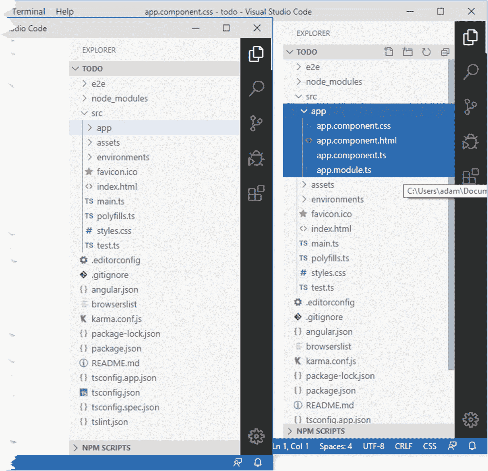
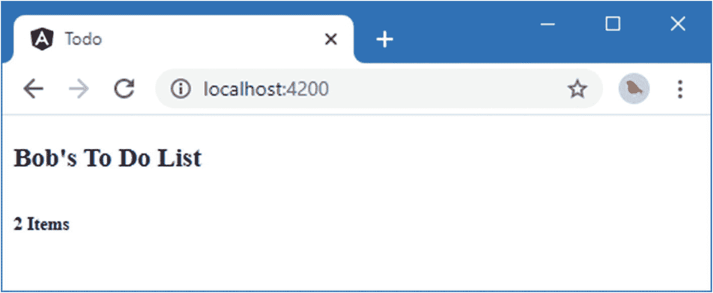
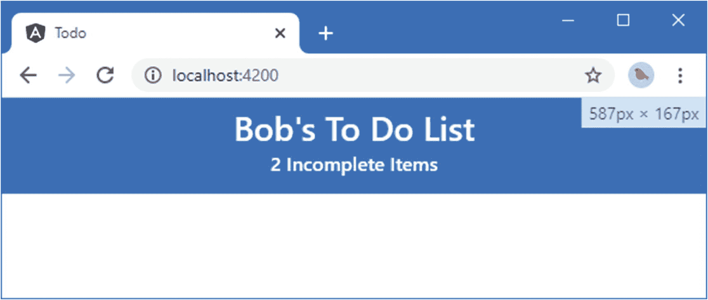
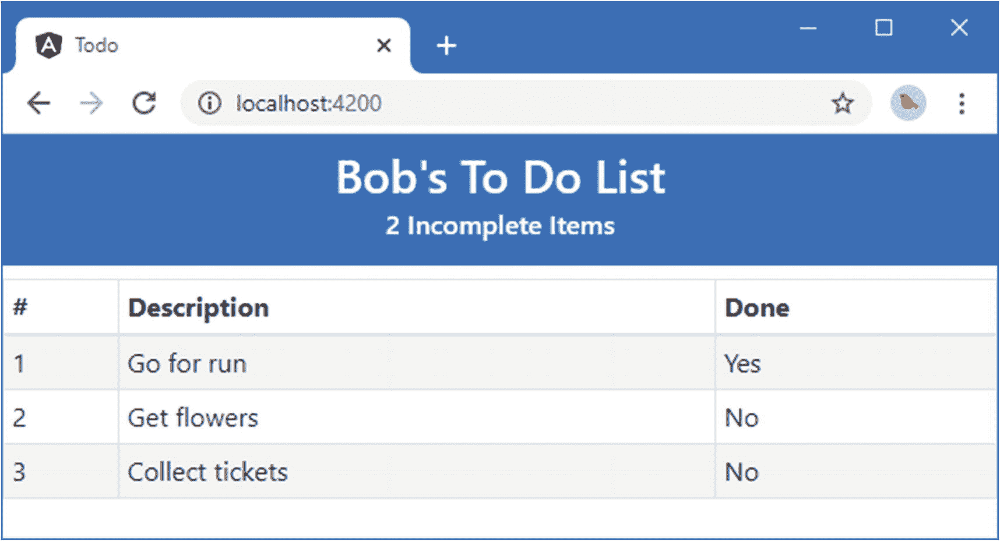
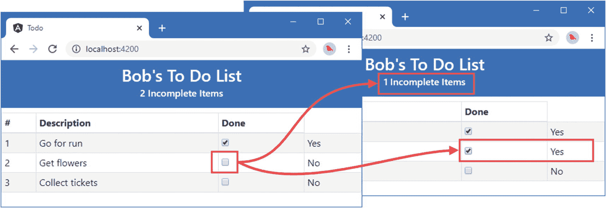
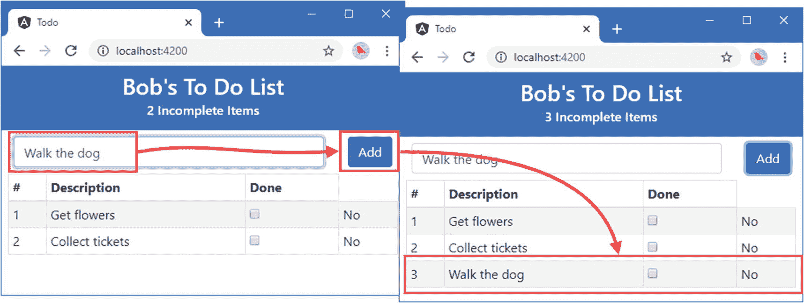
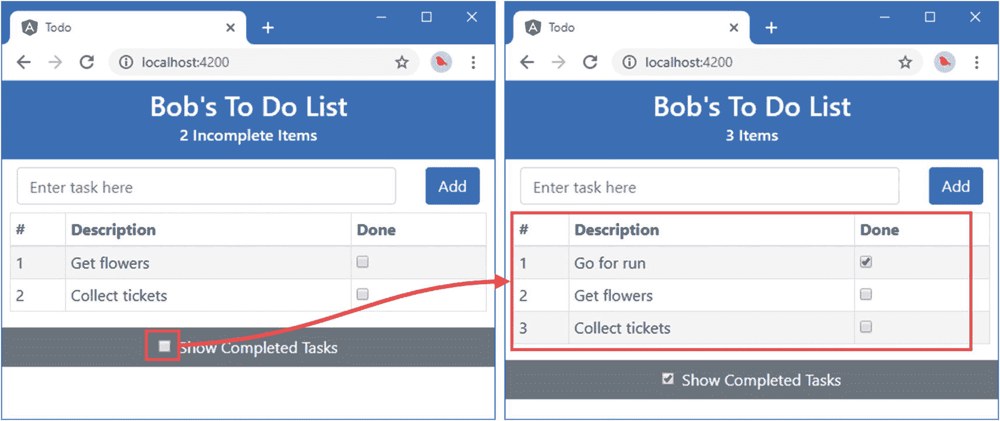

# 二、你的第一个 Angular 应用

开始使用 Angular 的最佳方式是深入研究并创建一个 web 应用。在本章中，我将向您展示如何设置您的开发环境，并带您完成创建一个基本应用的过程，从功能的静态模型开始，应用 Angular 特性来创建一个动态的 web 应用，尽管是一个简单的应用。在第七章 7 章–10 章中，我将向你展示如何创建一个更加复杂和真实的 Angular 应用，但是现在，一个简单的例子将足以演示 Angular 应用的主要组件，并为本书这一部分的其他章节做好准备。

如果你没有遵循本章的所有内容，也不要担心。Angular 有一个陡峭的学习曲线，所以这一章的目的只是介绍 Angular 开发的基本流程，并给你一些东西是如何组合在一起的感觉。现在这一切都没有意义，但是当你读完这本书的时候，你会明白我在这一章中采取的每一步，以及更多。

## 准备开发环境

角发育需要一些准备。在接下来的部分中，我将解释如何设置和准备创建您的第一个项目。流行的开发工具中广泛支持 Angular，您可以挑选自己喜欢的。

### 安装 Node.js

许多用于 Angular 开发的工具都依赖于 Node . js——也称为 Node——它创建于 2009 年，是用 JavaScript 编写的服务器端应用的一个简单高效的运行时。Node.js 基于 Chrome 浏览器中使用的 JavaScript 引擎，并提供了一个在浏览器环境之外执行 JavaScript 代码的 API。

Node.js 作为应用服务器已经取得了成功，但对于本书来说，它很有趣，因为它为新一代跨平台开发和构建工具提供了基础。Node.js 团队的一些聪明的设计决策和 Chrome JavaScript 运行时提供的跨平台支持创造了一个机会，被热情的工具作者抓住了。简而言之，Node.js 已经成为 web 应用开发的基础。

重要的是，您下载的 Node.js 版本与我在本书中使用的版本相同。尽管 Node.js 相对稳定，但仍不时会有突破性的 API 变化，这可能会使我在本章中包含的示例无法工作。

我使用的版本是 12.15.0，这是我撰写本文时的当前长期支持版本。在您阅读本文时，可能会有更高的版本，但是对于本书中的示例，您应该坚持使用 12.15.0 版本。在 [`https://nodejs.org/dist/v12.15.0`](https://nodejs.org/dist/v12.15.0) 可以获得完整的 12.15.0 版本，包括 Windows 和 macOS 的安装程序以及其他平台的二进制包。运行安装程序，确保选中“npm 包管理器”选项和两个添加到路径选项，如图 2-1 所示。


图 2-1。

配置节点安装

安装完成后，运行清单 2-1 中所示的命令。

```ts
node -v

Listing 2-1.Running Node.js

```

如果安装正常进行，您将会看到下面显示的版本号:

```ts
v12.15.0

```

Node.js 安装程序包括节点包管理器(NPM)，用于管理项目中的包。运行清单 2-2 中所示的命令，确保 NPM 正在工作。

```ts
npm -v

Listing 2-2.Running NPM

```

如果一切正常，您将看到以下版本号:

```ts
6.13.4

```

### 安装 angular-cli 软件包

`angular-cli`包已经成为开发期间创建和管理 Angular 项目的标准方式。在这本书的最初版本中，我演示了如何从零开始建立一个 Angular 项目，这是一个冗长且容易出错的过程，通过`angular-cli`得到了简化。要安装`angular-cli`，打开一个新的命令提示符并运行清单 2-3 中所示的命令。

```ts
npm install --global @angular/cli@9.0.1

Listing 2-3.Installing the angular-cli Package

```

注意在`global`参数前有两个连字符。如果你使用的是 Linux 或者 macOS，你可能需要使用`sudo`，如清单 2-4 所示。

```ts
sudo npm install --global @angular/cli@9.0.1

Listing 2-4.Using sudo to Install the angular-cli Package

```

### 安装编辑器

Angular 开发可以用任何一个程序员的编辑器来完成，从中有数不尽的选择。一些编辑器增强了对 Angular 的支持，包括突出显示关键术语和良好的工具集成。

选择编辑器时，最重要的考虑因素之一是过滤项目内容的能力，以便您可以专注于文件的子集。在一个 Angular 项目中可能会有很多文件，并且许多文件都有相似的名称，因此能够找到并编辑正确的文件是非常重要的。编辑器以不同的方式实现了这一点，要么显示打开进行编辑的文件列表，要么提供排除具有特定扩展名的文件的能力。

本书中的例子不依赖于任何特定的编辑器，我使用的所有工具都是从命令行运行的。如果你还没有一个 web 应用开发的首选编辑器，那么我推荐使用 Visual Studio Code，它是微软免费提供的，对 Angular 开发有极好的支持。可以从 [`https://code.visualstudio.com`](https://code.visualstudio.com) 下载 Visual Studio Code。

### 安装浏览器

最后要选择的是在开发过程中用来检查工作的浏览器。所有的当代浏览器都有很好的开发者支持，并且与 Angular 配合得很好。我在这本书里一直使用谷歌浏览器，这也是我推荐你使用的浏览器。

## 创建和准备项目

一旦你有了 Node.js、`angular-cli`包、编辑器和浏览器，你就有足够的基础来开始开发过程。

### 创建项目

要创建项目，选择一个方便的位置，并使用命令提示符运行清单 2-5 中所示的命令，这将创建一个名为`todo`的新 Angular 项目。

Note

如果您在 Windows 上使用 PowerShell，那么在运行清单 2-5 中的命令之前，您可能需要使用`Set-ExecutionPolicy RemoteSigned`命令来启用脚本执行。

```ts
ng new todo --routing false --style css --skip-git --skip-tests

Listing 2-5.Creating the Angular Project

```

`ng`命令由`angular-cli`包提供，`ng new`建立一个新项目。自变量配置项目，选择适用于第一个项目的选项(配置选项在第十一章中描述)。

安装过程会创建一个名为`todo`的文件夹，其中包含开始 Angular 开发所需的所有配置文件、一些开始开发的占位符文件以及开发、运行和部署 Angular 应用所需的 NPM 包。(项目创建可能需要一段时间，因为有大量的包要下载。)

Tip

你可以从 [`https://github.com/Apress/pro-angular-9`](https://github.com/Apress/pro-angular-9) 下载本章以及本书其他章节的示例项目。如果在运行示例时遇到问题，请参见第一章获取帮助。

创建项目后，使用您喜欢的代码编辑器打开它进行编辑。`todo`文件夹包含许多用于 Angular 开发的工具的配置文件(在第十一章中描述)，而`src/app`文件夹包含应用的代码和内容，也是大多数开发工作完成的文件夹。图 2-2 显示了 Visual Studio Code 中出现的项目文件夹的初始内容，并突出显示了`src/app`文件夹。您可能会看到与其他编辑器略有不同的视图，其中一些编辑器隐藏了开发过程中不经常直接使用的文件和文件夹，例如`node_modules`文件夹，它包含了 Angular 开发工具所依赖的包。



图 2-2。

项目文件夹的内容

### 启动开发工具

一切就绪，现在是测试 Angular 开发工具的时候了。使用命令提示符运行`todo`文件夹中清单 2-6 所示的命令。

```ts
ng serve

Listing 2-6.Starting the Angular Development Tools

```

该命令启动 Angular 开发工具，这些工具通过初始构建过程为开发会话准备应用。此过程需要一段时间，并将生成类似于以下内容的输出:

```ts
Compiling @angular/core : es2015 as esm2015

Compiling @angular/common : es2015 as esm2015

Compiling @angular/platform-browser : es2015 as esm2015

Compiling @angular/platform-browser-dynamic : es2015 as esm2015

chunk {main} main.js, main.js.map (main) 57.8 kB [initial] [rendered]
chunk {polyfills} polyfills.js, polyfills.js.map (polyfills) 140 kB [initial] [rendered]
chunk {runtime} runtime.js, runtime.js.map (runtime) 6.15 kB [entry] [rendered]
chunk {styles} styles.js, styles.js.map (styles) 9.74 kB [initial] [rendered]
chunk {vendor} vendor.js, vendor.js.map (vendor) 2.67 MB [initial] [rendered]
Date: 2020-02-09T11:23:46.619Z - Hash: 3f280025364478cce5b4 - Time: 12859ms
** Angular Live Development Server is listening on localhost:4200, open your browser on http://localhost:4200/ **
: Compiled successfully.

Date: 2020-02-09T11:23:47.497Z - Hash: 3f280025364478cce5b4
5 unchanged chunks

Time: 465ms
: Compiled successfully.

```

如果您看到略有不同的输出，请不要担心，只要准备工作完成后，您会看到“编译成功”的消息。

项目中的开发工具包括一个 HTTP 服务器。一旦构建过程完成，打开一个新的浏览器窗口并使用它来请求`http://localhost:4200`，您将看到如图 2-3 所示的内容，它显示了创建项目时添加到项目中的占位符内容。


图 2-3。

占位符内容

## 向项目中添加 Angular 特征

现在开发工具正在运行，我将创建一个简单的 Angular 应用来管理待办事项列表。用户将能够看到待办事项列表，检查已完成的项目，并创建新项目。为了使应用简单，我假设只有一个用户，并且我不必担心保存应用中数据的状态，这意味着如果关闭或重新加载浏览器窗口，对待办事项列表的更改将会丢失。(后面的例子，包括在第 7–10 章中开发的 SportsStore 应用，演示了持久数据存储。)

### 创建数据模型

大多数应用的起点是数据模型，它描述了应用运行的领域。数据模型可能很大很复杂，但是对于我的待办应用，我只需要描述两件事:一个待办事项和这些事项的列表。

Angular 应用是用 TypeScript 编写的，TypeScript 是 JavaScript 的超集。我在第六章中介绍了 TypeScript，但是它的主要优点是支持静态数据类型，这使得 JavaScript 开发对于 C#和 Java 开发人员来说更加熟悉。(JavaScript 有一个基于原型的类型系统，许多开发人员对此感到困惑。)命令包括将 TypeScript 代码编译成可由浏览器执行的纯 JavaScript 所需的包。

为了启动应用的数据模型，我在`todo/src/app`文件夹中添加了一个名为`todoItem.ts`的文件，其内容如清单 2-7 所示。(TypeScript 文件的扩展名为`.ts`。)

```ts
export class TodoItem {

    constructor(taskVal: string, completeVal: boolean = false) {
        this.task = taskVal;
        this.complete = completeVal;
    }

    task: string;
    complete: boolean;
}

Listing 2-7.The Contents of the todoItem.ts File in the src/app Folder

```

清单 2-7 中使用的语言特性是标准 JavaScript 特性和 TypeScript 提供的额外特性的混合。当代码被编译时，TypeScript 特性被移除，结果是可以被浏览器执行的 JavaScript 代码。

例如，`export`、`class`和`constructor`关键字就是标准的 JavaScript。并不是所有的浏览器都支持这些特性，这些特性是 JavaScript 规范中相对较新的内容，正如我在第十一章中解释的那样，Angular 应用的构建过程可以将这种类型的特性翻译成老浏览器可以理解的代码。

`export`关键字与 JavaScript 模块相关。当使用模块时，每个 TypeScript 或 JavaScript 文件都被认为是一个自包含的功能单元，而`export`关键字用于标识您想要在应用的其他地方使用的数据或类型。JavaScript 模块用于管理项目中文件之间的依赖关系，避免手动管理 HTML 文件中一组复杂的`script`元素。有关模块如何工作的详细信息，请参见第十一章。`class`关键字声明一个类，`constructor`关键字表示一个类构造器。与 C#等其他语言不同，JavaScript 不使用类名来表示构造函数。

Tip

如果您不熟悉 JavaScript 规范的最新版本中添加的特性，也不用担心。第五章和第六章提供了使用使 Angular 更容易使用的特性编写 JavaScript 的入门知识，第六章也描述了一些有用的特定于 TypeScript 的特性。

清单 2-7 中的其他特性由 TypeScript 提供。当您第一次开始使用 TypeScript 时，最不和谐的特性之一是它的简洁构造函数特性，尽管您很快就会依赖它。清单 2-7 中定义的`TodoItem`类定义了一个接收两个参数的构造函数，名为`task`和`complete`。这些参数的值被分配给同名的`public`属性。如果没有为`complete`参数提供值，那么将使用默认值`false`。

简洁的构造函数避免了可能需要的样板代码块，这些代码块容易出现打字错误或者只是忘记给属性分配参数。如果没有简洁的构造函数，我将不得不像这样编写`TodoItem`类:

```ts
...
class TodoItem {

    constructor(taskVal: string, completeVal: boolean = false) {
        this.task = taskVal;
        this.complete = completeVal;
    }

    task: string;
    complete: boolean;
}
...

```

事实上，我本可以不用简洁的构造函数来编写`TodoItem`类。TypeScript 试图在不碍事的情况下提供帮助，您可以忽略或禁用它的所有功能，更多地依赖 JavaScript 的标准功能。正如我在后面的章节中解释的那样，Angular 开发依赖于一些特性，但是您可以逐渐接受 TypeScript 特性，或者，如果您愿意，只选择您喜欢的特性。

标题 TypeScript 特性是静态类型。清单 2-7 中的每个构造函数参数都被标注了一个类型，如下所示:

```ts
...
constructor(taskVal: string, completeVal: boolean = false) {
...

```

如果在调用构造函数时使用了不兼容的类型，TypeScript 编译器将报告错误。如果您从 C#或 Java 开始进行 Angular 开发，这似乎是显而易见的，但这不是 JavaScript 通常的工作方式。

#### 创建待办事项列表类

为了创建一个表示待办事项列表的类，我在`src/app`文件夹中添加了一个名为`todoList.ts`的文件，并添加了清单 2-8 中所示的代码。

```ts
import { TodoItem } from "./todoItem";

export class TodoList {

    constructor(public user: string, private todoItems: TodoItem[] = []) {
        // no statements required
    }

    get items(): readonly TodoItem[]  {
        return this.todoItems;
    }

    addItem(task: string) {
        this.todoItems.push(new TodoItem(task));
    }
}

Listing 2-8.The Contents of the todoList.ts File in the src/app Folder

```

`import`关键字声明了对`TodoItem`类的依赖，并指定了定义它的代码文件。`TodoList`类定义了一个接收初始待办事项集合的构造函数。我不想无限制地访问`TodoItem`对象的数组，所以我定义了一个名为`items`的属性，它返回一个只读数组，这是使用`readonly`关键字完成的。对于任何试图修改数组内容的语句，TypeScript 编译器都会生成错误，如果您使用的编辑器具有良好的 TypeScript 支持，如 Visual Studio Code，则编辑器的自动完成功能不会提供会触发编译器错误的方法和属性。

### 向用户显示数据

我需要一种方法向用户显示模型中的数据值。在 Angular 中，这是使用一个*模板*来完成的，这个模板是 HTML 的一个片段，包含 Angular 评估的表达式，并将结果插入到发送给浏览器的内容中。该项目的`angular-cli`设置在`src/app`文件夹中创建了一个名为`app.component.html`的模板文件。我编辑了这个文件，删除了占位符内容，并添加了清单 2-9 中所示的内容。

```ts
<h3>
  {{ username }}'s To Do List
  <h6>{{ itemCount }} Items</h6>
</h3>

Listing 2-9.Replacing the Contents of the app.component.html File in the src/app Folder

```

我很快会在这个文件中添加更多的元素，但是两个 HTML 元素就足够了。在一个模板中包含一个数据值是通过使用双括号来完成的— `{{`和`}}`——Angular 会计算您放在双括号之间的任何内容，以获得要显示的值。

`{{`和`}}`字符是*数据绑定*的一个例子，这意味着它们创建了模板和数据值之间的关系。数据绑定是一个重要的 Angular 特性，当我在示例应用中添加特性时，您将在本章中看到更多的数据绑定(我将在本书的第二部分详细描述它们)。在这种情况下，数据绑定告诉 Angular 获取`username`和`itemCount`属性的值，并将它们插入到`h3`和`div`元素的内容中。

一旦保存了文件，Angular 开发工具就会尝试构建项目。编译器将生成以下错误:

```ts
ERROR in src/app/app.component.html:1:8 - error TS2339: Property 'username' does not exist on type 'AppComponent'.

    1 {{ username }}'s To Do List
             ~~~~~~~~~
      src/app/app.component.ts:5:16
        5   templateUrl: './app.component.html',
                         ~~~~~~~~~~~~~~~~~~~~~~
        Error occurs in the template of component AppComponent.

    src/app/app.component.html:2:9 - error TS2339: Property 'itemCount' does not exist on type 'AppComponent'.

    2 <h6>{{ itemCount }} Incomplete Items</h6>
              ~~~~~~~~~~
      src/app/app.component.ts:5:16
        5   templateUrl: './app.component.html',
                         ~~~~~~~~~~~~~~~~~~~~~~
        Error occurs in the template of component AppComponent.

```

出现这些错误是因为我在数据绑定中使用的属性不存在，所以 Angular 无法获得我告诉它在模板中使用的值。我将在下一节中解决这个问题。

### 更新组件

Angular *组件*负责管理模板，并为其提供所需的数据和逻辑。如果这似乎是一个宽泛的说法，那是因为组件是 Angular 应用的一部分，它承担了大部分繁重的工作。因此，它们可以用于各种任务。

在这种情况下，我需要一个组件作为数据模型类和模板之间的桥梁，这样我就可以创建一个`TodoList`类的实例，用一些示例`TodoItem`对象填充它，并且在这样做的时候，为模板提供它需要的`username`和`itemCount`属性。`angular-cli`设置在`todo/src/app`文件夹中创建了一个名为`app.component.ts`的占位符组件文件，我对其进行了编辑，以做出清单 2-10 中突出显示的更改。

```ts
import { Component } from '@angular/core';
import { TodoList } from "./todoList";
import { TodoItem } from "./todoItem";

@Component({
  selector: 'app-root',
  templateUrl: './app.component.html',
  styleUrls: ['./app.component.css']
})
export class AppComponent {
  private list = new TodoList("Bob", [
    new TodoItem("Go for run", true),
    new TodoItem("Get flowers"),
    new TodoItem("Collect tickets"),
  ]);

  get username(): string {
    return this.list.user;
  }

  get itemCount(): number {
    return this.list.items
      .filter(item => !item.complete).length;
  }
}

Listing 2-10.Editing the Contents of the app.component.ts File in the src/app Folder

```

清单中的代码可以分为三个主要部分，如以下部分所述。

#### 了解进口

`import`关键字与`export`关键字相对应，用于声明对 JavaScript 模块内容的依赖。在清单 2-10 中，`import`关键字被使用了三次。

```ts
...
import { Component } from '@angular/core';
import { TodoList } from "./todoList";
import { TodoItem } from "./todoItem";
...

```

清单中的第一个`import`语句用于加载`@angular/core`模块，该模块包含关键的 Angular 功能，包括对组件的支持。当处理模块时，`import`语句指定在花括号中导入的类型。在这种情况下，`import`语句用于从模块加载`Component`类型。`@angular/core`模块包含许多打包在一起的类，这样浏览器就可以将它们全部加载到一个 JavaScript 文件中。

其他的`import`语句用于声明对前面定义的数据模型类的依赖。这种导入的目标以`./`开始，这表明该模块是相对于当前文件定义的。

注意，`import`语句都不包含文件扩展名。这是因为一个`import`语句的目标和浏览器加载的文件之间的关系是由 Angular build 工具处理的，它将应用打包并发送给浏览器，我将在第十一章中对此进行更详细的解释。

#### 了解装修工

清单中最奇怪的代码部分是这样的:

```ts
...
@Component({
  selector: 'app-root',
  templateUrl: './app.component.html',
  styleUrls: ['./app.component.css']
})
...

```

这是一个*装饰器*的例子，它提供了一个类的元数据。这是`@Component`装饰器，顾名思义，它告诉 Angular 这是一个组件。装饰器通过其属性提供配置信息。这个`@Component`装饰器指定了三个属性:`selector`、`templateUrl`和`styleUrls`。

属性指定了一个 CSS 选择器，它匹配组件将要应用到的 HTML 元素。这个装饰器指定的`app-root`元素是由`angular-cli`包默认设置的。它对应于一个添加到`index.html`文件中的 HTML 元素，您可以在`src`文件夹中找到该文件，它是用以下内容创建的:

```ts
<!doctype html>
<html lang="en">
<head>
  <meta charset="utf-8">
  <title>Todo</title>
  <base href="/">
  <meta name="viewport" content="width=device-width, initial-scale=1">
  <link rel="icon" type="image/x-icon" href="favicon.ico">
</head>
<body>
  <app-root></app-root>
</body>
</html>

```

我突出显示了 HTML 元素。属性告诉 Angular 由组件生成的内容应该插入到元素中。

`templateUrl`属性用于指定组件的模板，即该组件的`app.component.html`文件。`styleUrls`属性指定了一个或多个 CSS 样式表，用于样式化组件及其模板产生的元素。稍后我将使用这个特性来改进示例应用的外观。

#### 理解课程

清单的最后一部分定义了一个类，Angular 可以实例化这个类来创建组件。

```ts
...
export class AppComponent {
  private list = new TodoList("Bob", [
    new TodoItem("Go for run", true),
    new TodoItem("Get flowers"),
    new TodoItem("Collect tickets"),
  ]);

  get username(): string {
    return this.list.user;
  }

  get itemCount(): number {
    return this.list.items.filter(item => !item.complete).length;
  }
}
...

```

这些语句定义了一个名为`AppComponent`的类，该类有一个私有的`list`属性，该属性被赋予一个`TodoList`对象，并由一组`TodoItem`对象填充。`AppComponent`类定义了名为`username`和`itemCount`的只读属性，这些属性依赖于`TodoList`对象来产生它们的值。`username`属性返回`TodoList.user`属性的值，`itemCount`属性使用标准的 JavaScript 数组特性来过滤由`TodoList`管理的`Todoitem`对象，以选择那些不完整的对象，并返回它找到的匹配对象的数量。

使用*λ函数*生成`itemCount`属性的值，也称为*粗箭头函数*，这是表达标准 JavaScript 函数的一种更简洁的方式。lambda 表达式中的箭头读作“goes to”，例如“`item` goes to not `item.complete`”Lambda 表达式是 JavaScript 语言规范中的一个新成员，它提供了一种使用函数作为参数的传统方法的替代方法，如下所示:

```ts
...
return this.model.items.filter(function (item) { return !item.complete });
...

```

当您保存对 TypeScript 文件的更改时，Angular 开发工具将构建项目。这一次应该没有错误，因为组件已经定义了模板所需的属性。浏览器窗口将自动重新加载，显示图 2-4 中的输出。



图 2-4。

在示例应用中生成内容

### HTML 元素的样式

我已经到了 Angular 生成内容的地步，但是结果只是纯文本。我将把引导 CSS 框架添加到应用中，并用它来设计内容的样式。有许多好的 CSS 框架可用，但 Bootstrap 是最受欢迎的一个。我在第四章提供了使用 Bootstrap 的简单介绍，所以如果你以前没有用过也不用担心。停止 Angular 开发工具，使用命令提示符运行清单 2-11 中所示的命令，将引导包添加到项目中。

```ts
npm install bootstrap@4.4.1

Listing 2-11.Adding a Package to the Example Project

```

这个命令安装 4.4.1 版的引导包，这是我在本书中使用的版本。要在发送到浏览器的 HTML 内容中包含引导 CSS 样式，请将清单 2-12 中所示的条目添加到`angular.json`文件的`styles`部分，该文件是在创建项目时通过`ng new`命令添加到`todo`文件夹中的。

Caution

在`angular.json`文件中有两个`styles`部分。将清单 2-12 中所示的设置添加到最靠近文件顶部的位置。

```ts
...
"sourceRoot": "src",
"prefix": "app",
"architect": {
"build": {
  "builder": "@angular-devkit/build-angular:browser",
    "options": {
      "outputPath": "dist/todo",
      "index": "src/index.html",
      "main": "src/main.ts",
      "polyfills": "src/polyfills.ts",
      "tsConfig": "tsconfig.app.json",
      "aot": true,
      "assets": [
        "src/favicon.ico",
        "src/assets"
       ],
       "styles": [
         "src/styles.css",
         "node_modules/bootstrap/dist/css/bootstrap.min.css"
       ],
       "scripts": []
    },
...

Listing 2-12.Configuring CSS in the angular.json File in the todo Folder

```

正如我在第十一章中解释的那样，`angular.json`文件用于配置项目工具，清单中显示的语句将引导 CSS 文件合并到项目中，这样它将包含在发送到浏览器的内容中。

Bootstrap 通过向类中添加元素来工作。在清单 2-13 中，我已经将模板中的元素添加到类中，这些元素将改变它们的外观。

```ts
<h3 class="bg-primary text-center text-white p-2">
  {{ username }}'s To Do List
  <h6 class="mt-1">{{ itemCount }} Incomplete Items</h6>
</h3>

Listing 2-13.Styling Content in the app.component.html File in the src/app Folder

```

使用命令提示符运行清单 2-14 中所示的命令，这将再次启动 Angular 开发工具。

```ts
ng serve

Listing 2-14.Starting the Angular Development Tools

```

浏览器可能会自动更新，但如果没有，则手动重新加载以查看样式化的内容，如图 2-5 所示。



图 2-5。

应用生成的 HTML 样式

### 显示待办事项列表

下一步是显示待办事项。清单 2-15 向组件添加一个属性，提供对列表中项目的访问。

```ts
import { Component } from '@angular/core';
import { TodoList } from "./todoList";
import { TodoItem } from "./todoItem";

@Component({
  selector: 'app-root',
  templateUrl: './app.component.html',
  styleUrls: ['./app.component.css']
})
export class AppComponent {
  private list = new TodoList("Bob", [
    new TodoItem("Go for run"),
    new TodoItem("Get flowers"),
    new TodoItem("Collect tickets"),
  ]);

  get username(): string {
    return this.list.user;
  }

  get itemCount(): number {
    return this.list.items.filter(item => !item.complete).length;
  }

  get items(): readonly TodoItem[] {
    return this.list.items;
  }
}

Listing 2-15.Adding a Property in the app.component.ts File in the src/app Folder

```

为了向用户显示每个项目的细节，我将清单 2-16 中所示的元素添加到模板中。

```ts
<h3 class="bg-primary text-center text-white p-2">
  {{ username }}'s To Do List
  <h6 class="mt-1">{{ itemCount }} Incomplete Items</h6>
</h3>

<table class="table table-striped table-bordered table-sm">
  <thead>
      <tr><th>#</th><th>Description</th><th>Done</th></tr>
  </thead>
  <tbody>
      <tr *ngFor="let item of items; let i = index">
          <td>{{ i + 1 }}</td>
          <td>{{ item.task }}</td>
          <td [ngSwitch]="item.complete">
              <span *ngSwitchCase="true">Yes</span>
              <span *ngSwitchDefault>No</span>
          </td>
      </tr>
  </tbody>
</table>

Listing 2-16.Adding Elements in the app.component.html File in the src/app Folder

```

对模板的添加依赖于几个不同的 Angular 特征。第一个是`*ngFor`表达式，用于为数组中的每一项重复一个内容区域。这是一个*指令*的例子，我在第 13–16 章中描述了它(指令是 Angular 发展的一个很大的部分，这就是为什么它们在几章中被描述)。`*ngFor`表达式应用于元素的属性，如下所示:

```ts
...
<tr *ngFor="let item of items; let i = index">
...

```

这个表达式告诉 Angular 将它所应用到的`tr`元素作为一个模板，应该为组件的`items`属性返回的每个对象重复这个模板。表达式的`let item`部分指定每个对象应该被分配给一个名为`item`的变量，这样它就可以在模板中被引用。

`ngFor`表达式还跟踪正在处理的数组中当前对象的索引，并将其赋给第二个变量`i`。

```ts
...
<tr *ngFor="let item of items; let i = index">
...

```

结果是，`tr`元素及其内容将被复制并插入到由`items`属性返回的每个对象的 HTML 文档中；对于每次迭代，可以通过名为`item`的变量访问当前的待办对象，通过名为`i`的变量访问对象在数组中的位置。

Tip

使用`*ngFor`时记住`*`字符很重要。我会在第十三章中解释它的含义。

在`tr`模板中，有两个数据绑定，可以通过`{{`和`}}`字符识别，如下所示:

```ts
...
<td>{{ i + 1 }}</td>
<td>{{ item.task }}</td>
...

```

这些绑定引用由`*ngFor`表达式创建的变量。绑定不仅仅用于引用属性和方法名；它们也可以用来执行简单的 JavaScript 操作。您可以在第一个绑定中看到这样的例子，我将变量`i`和 1 相加。

Tip

对于简单的转换，你可以像这样直接在绑定中嵌入你的 JavaScript 表达式，但是对于更复杂的操作，Angular 有一个叫做 *pipes* 的特性，我在第十八章中描述过。

`tr`模板中剩余的模板表达式演示了如何有选择地生成内容。

```ts
...
<td [ngSwitch]="item.complete">
    <span *ngSwitchCase="true">Yes</span>
    <span *ngSwitchDefault>No</span>
</td>
...

```

`[ngSwitch]`表达式是一个条件语句，用于根据指定的值将不同的元素集插入到文档中，该值在本例中是`item.complete`属性。嵌套在`td`元素中的是两个用`*ngSwitchCase`和`*ngSwitchDefault`标注的`span`元素，它们相当于普通 JavaScript `switch`块的`case`和`default`关键字。我在第十三章中详细描述了`ngSwitch`(以及第十四章中方括号的含义)，但结果是当`item.complete`属性值为`true`时第一个`span`元素被添加到文档中，当`item.complete`为`false`时第二个`span`元素被添加到文档中。结果是`item.complete`属性的`true` / `false`值被转换成包含`Yes`或`No`的`span`元素。当您保存对模板的更改时，浏览器将重新加载，并显示待办事项表，如图 2-6 所示。



图 2-6。

显示待办事项表

如果您使用浏览器的 F12 开发工具，您将能够看到模板生成的 HTML 内容。(查看页面源代码是做不到这一点的，它只显示了服务器发送的 HTML，而没有显示 Angular 使用 DOM API 所做的更改。)

您可以看到模型中的每个待办事项如何在表格中生成一行，该行填充有`local`项和`i`变量，以及开关表达式如何显示 Yes 或 No 来指示任务是否已完成。

```ts
...
<tr>
    <td>2</td>
    <td>Get flowers</td>
    <td><span>No</span></td>
</tr>
...

```

### 创建双向数据绑定

目前，模板只包含*单向数据绑定*，这意味着它们用于显示数据值，但不能改变它。Angular 还支持*双向数据绑定*，可以用来显示数据值和修改它。HTML 表单元素使用双向绑定，清单 2-17 向模板添加了一个 checkbox `input`元素，允许用户将待办事项标记为完成。

```ts
<h3 class="bg-primary text-center text-white p-2">
  {{ username }}'s To Do List
  <h6 class="mt-1">{{ itemCount }} Incomplete Items</h6>
</h3>

<table class="table table-striped table-bordered table-sm">
  <thead>
      <tr><th>#</th><th>Description</th><th>Done</th></tr>
  </thead>
  <tbody>
      <tr *ngFor="let item of items; let i = index">
          <td>{{ i + 1 }}</td>
          <td>{{ item.task }}</td>
          <td><input type="checkbox" [(ngModel)]="item.complete" /></td>
          <td [ngSwitch]="item.complete">
              <span *ngSwitchCase="true">Yes</span>
              <span *ngSwitchDefault>No</span>
          </td>
      </tr>
  </tbody>
</table>

Listing 2-17.Adding a Two-Way Binding in the app.component.html File in the src/app Folder

```

`ngModel`模板表达式在数据值(本例中为`item.complete`属性)和表单元素(本例中为`input`元素)之间创建了一个双向绑定。当您保存对模板的更改时，您将看到一个包含复选框的新列出现在表格中。复选框的初始值是使用`item.complete`属性设置的，就像常规的单向绑定一样，但是当用户切换复选框时，Angular 通过更新指定的模型属性来响应。

当保存对模板的更改时，Angular 开发工具将报告一个错误，因为`ngModel`功能尚未启用。Angular 应用有一个*根模块*，用于配置应用。示例应用的根模块在`app.module.ts`文件中定义，清单 2-18 中显示的更改启用了双向绑定特性。

```ts
import { BrowserModule } from '@angular/platform-browser';
import { NgModule } from '@angular/core';
import { FormsModule } from "@angular/forms";

import { AppComponent } from './app.component';

@NgModule({
  declarations: [
    AppComponent
  ],
  imports: [
    BrowserModule, FormsModule
  ],
  providers: [],
  bootstrap: [AppComponent]
})
export class AppModule { }

Listing 2-18.Enabling a Feature in the app.module.ts File in the src/app Folder

```

Angular 提供的功能是在单独的 JavaScript 模块中提供的，这些模块必须用一个`import`语句添加到应用中，并使用由`NgModule`装饰器定义的`imports`属性进行注册。当 Angular 开发工具构建应用时，它们将由`imports`属性指定的特性合并到发送到浏览器的文件中。对根模块的更改不会自动处理，所以停止 Angular 开发工具，运行`todo`文件夹中清单 2-19 所示的命令，再次启动它们。(开发工具将不再报告错误，但是在您重新启动工具之前，复选框将不起作用。)

```ts
ng serve

Listing 2-19.Starting the Angular Development Tools

```

浏览器将在包含复选框的表格中显示一个附加列。每个复选框的状态基于一个`TodoItem`对象的`complete`属性的值。为了演示复选框是用双向绑定设置的，我留下了包含 Yes/No 值的列。当您切换复选框时，相应的是/否值也会改变，如图 2-7 所示。



图 2-7。

使用双向数据绑定更改模型值

请注意，未完成项目的数量也会更新。这揭示了一个重要的 Angular 特征:数据模型是活动的。这意味着当数据模型发生变化时，数据绑定(甚至是单向数据绑定)也会更新。这简化了 web 应用的开发，因为这意味着您不必担心在应用状态改变时显示更新。

#### 过滤待办事项

复选框允许更新数据模型，下一步是删除标记为完成的待办事项。清单 2-20 改变了组件的`items`属性，这样它就可以过滤掉所有已经完成的项目。

```ts
import { Component } from '@angular/core';
import { TodoList } from "./todoList";
import { TodoItem } from "./todoItem";

@Component({
  selector: 'app-root',
  templateUrl: './app.component.html',
  styleUrls: ['./app.component.css']
})
export class AppComponent {
  private list = new TodoList("Bob", [
    new TodoItem("Go for run", true),
    new TodoItem("Get flowers"),
    new TodoItem("Collect tickets"),
  ]);

  get username(): string {
    return this.list.user;
  }

  get itemCount(): number {
    return this.items.length;
  }

  get items(): readonly TodoItem[] {
    return this.list.items.filter(item => !item.complete);
  }
}

Listing 2-20.Filtering To-Do Items in the app.component.ts File in the src/app Folder

```

filter 方法是一个标准的 JavaScript 数组函数，因为这是我之前在`itemCount`属性中使用的同一表达式，所以我更新了该属性以避免代码重复。由于数据模型是动态的，变化会立即反映在数据绑定中，所以选中某个项目的复选框会将其从视图中移除，如图 2-8 所示。


图 2-8。

过滤待办事项

### 添加待办事项

如果没有向列表中添加新项目的能力，待办事项应用就没有多大用处。清单 2-21 向模板中添加元素，允许用户输入任务的细节。

```ts
<h3 class="bg-primary text-center text-white p-2">
  {{ username }}'s To Do List
  <h6 class="mt-1">{{ itemCount }} Incomplete Items</h6>
</h3>

<div class="container-fluid">
  <div class="row">
    <div class="col">
      <input class="form-control" placeholder="Enter task here" #todoText />
    </div>
    <div class="col-auto">
      <button class="btn btn-primary" (click)="addItem(todoText.value)">
        Add
      </button>
    </div>
  </div>
</div>

<div class="m-2">
  <table class="table table-striped table-bordered table-sm">
    <thead>
        <tr><th>#</th><th>Description</th><th>Done</th></tr>
    </thead>
    <tbody>
        <tr *ngFor="let item of items; let i = index">
            <td>{{ i + 1 }}</td>
            <td>{{ item.task }}</td>
            <td><input type="checkbox" [(ngModel)]="item.complete" /></td>
            <td [ngSwitch]="item.complete">
                <span *ngSwitchCase="true">Yes</span>
                <span *ngSwitchDefault>No</span>
            </td>
        </tr>
    </tbody>
  </table>
</div>

Listing 2-21.Adding Elements in the app.component.html File in the src/app Folder

```

大多数新元素创建一个网格布局来显示一个`input`元素和一个`button`元素。input 元素有一个属性，其名称以`#`字符开头，用于定义一个变量来引用模板数据绑定中的元素。

```ts
...
<input class="form-control" placeholder="Enter task here" #todoText />
...

```

变量的名称是`todoText`，它被应用于`button`元素的绑定所使用。

```ts
...
<button class="btn btn-primary mt-1" (click)="addItem(todoText.value)">
...

```

这是一个*事件绑定*的例子，它告诉 Angular 调用一个名为`addItem`的组件方法，使用`input`元素的`value`属性作为方法参数。清单 2-22 向组件添加了`addItem`方法。

Tip

现在不要担心区分绑定。我在第二部分中解释了 Angular 支持的不同类型的绑定，以及每种绑定需要的不同类型的括号或圆括号的含义。它们并不像第一次出现时那么复杂，尤其是当你看到它们是如何融入其他 Angular 框架的时候。

```ts
import { Component } from '@angular/core';
import { TodoList } from "./todoList";
import { TodoItem } from "./todoItem";

@Component({
  selector: 'app-root',
  templateUrl: './app.component.html',
  styleUrls: ['./app.component.css']
})
export class AppComponent {
  private list = new TodoList("Bob", [
    new TodoItem("Go for run", true),
    new TodoItem("Get flowers"),
    new TodoItem("Collect tickets"),
  ]);

  get username(): string {
    return this.list.user;
  }

  get itemCount(): number {
    return this.items.length;
  }

  get items(): readonly TodoItem[] {
    return this.list.items.filter(item => !item.complete);
  }

  addItem(newItem) {
    if (newItem != "") {
        this.list.addItem(newItem);
    }
  }
}

Listing 2-22.Adding a Method in the app.component.ts File in the src/app Folder

```

`addItem`方法接收模板中事件绑定发送的文本，并使用它向待办事项列表添加一个新项目。这些改变的结果是你可以通过在`input`元素中输入文本并点击添加按钮来创建新的待办事项，如图 2-9 所示。



图 2-9。

创建待办事项

### 显示已完成的待办事项

基本特性已经就绪，现在是时候结束这个项目了。我首先从模板中删除了表中的 Yes/No 列，并添加了显示已完成任务的选项，如清单 2-23 所示。

```ts
<h3 class="bg-primary text-center text-white p-2">
  {{ username }}'s To Do List
  <h6 class="mt-1">{{ itemCount }} {{ showComplete ? "" : "Incomplete" }} Items</h6>
</h3>

<div class="container-fluid">
  <div class="row">
    <div class="col">
      <input class="form-control" placeholder="Enter task here" #todoText />
    </div>
    <div class="col-auto">
      <button class="btn btn-primary" (click)="addItem(todoText.value)">
        Add
      </button>
    </div>
  </div>
</div>

<div class="m-2">
  <table class="table table-striped table-bordered table-sm">
    <thead>
        <tr><th>#</th><th>Description</th><th>Done</th></tr>
    </thead>
    <tbody>
        <tr *ngFor="let item of items; let i = index">
            <td>{{ i + 1 }}</td>
            <td>{{ item.task }}</td>
            <td><input type="checkbox" [(ngModel)]="item.complete" /></td>
            <!-- <td [ngSwitch]="item.complete">
                <span *ngSwitchCase="true">Yes</span>
                <span *ngSwitchDefault>No</span>
            </td> -->
        </tr>
    </tbody>
  </table>
</div>

<div class="bg-secondary text-white text-center p-2">
  <div class="form-check">
    <input class="form-check-input" type="checkbox" [(ngModel)]="showComplete" />
    <label class="form-check-label" for="defaultCheck1">
      Show Completed Tasks
    </label>
  </div>
</div>

Listing 2-23.Adding and Removing Elements in the app.component.html File in the src/app Folder

```

新元素提供了一个复选框，它有一个名为`showComplete`的属性的双向数据绑定。在新的表达式中使用相同的属性来改变告诉用户显示多少项的文本。正如我前面提到的，数据绑定可以包含 JavaScript 表达式，在这种情况下，我使用`showComplete`属性的值来控制单词`Incomplete`是否包含在输出中。

在清单 2-24 中，我添加了`showComplete`属性的定义，并使用它的值来决定是否向用户显示已完成的任务。

```ts
import { Component } from '@angular/core';
import { TodoList } from "./todoList";
import { TodoItem } from "./todoItem";

@Component({
  selector: 'app-root',
  templateUrl: './app.component.html',
  styleUrls: ['./app.component.css']
})
export class AppComponent {
  private list = new TodoList("Bob", [
    new TodoItem("Go for run", true),
    new TodoItem("Get flowers"),
    new TodoItem("Collect tickets"),
  ]);

  get username(): string {
    return this.list.user;
  }

  get itemCount(): number {
    return this.items.length;
  }

  get items(): readonly TodoItem[] {
    return this.list.items.filter(item => this.showComplete || !item.complete);
  }

  addItem(newItem) {
    if (newItem != "") {
        this.list.addItem(newItem);
    }
  }

  showComplete: boolean = false;
}

Listing 2-24.Showing Completed Tasks in the app.component.ts File in the src/app Folder

```

结果是用户可以决定是否查看已完成的任务，如图 2-10 所示。



图 2-10。

显示已完成的任务

## 摘要

在这一章中，我向你展示了如何创建你的第一个简单的 Angular 应用，它允许用户创建新的待办事项并将现有的事项标记为完成。

如果这一章中的所有内容都有意义，请不要担心。在这个阶段，重要的是理解 Angular 应用的一般形状，它是围绕数据模型、组件和模板构建的。如果你把这三个关键的组成部分记在心里，那么你就会对接下来的事情有一个背景。在下一章，我将 Angular 放在上下文中。