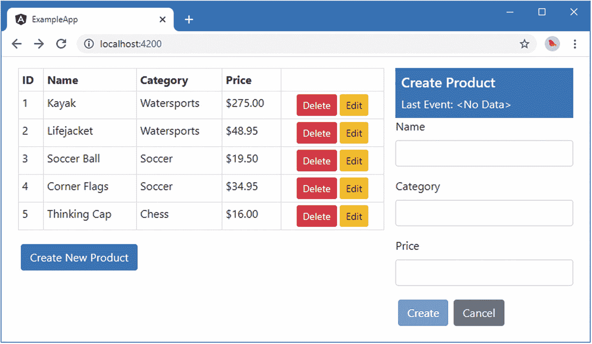
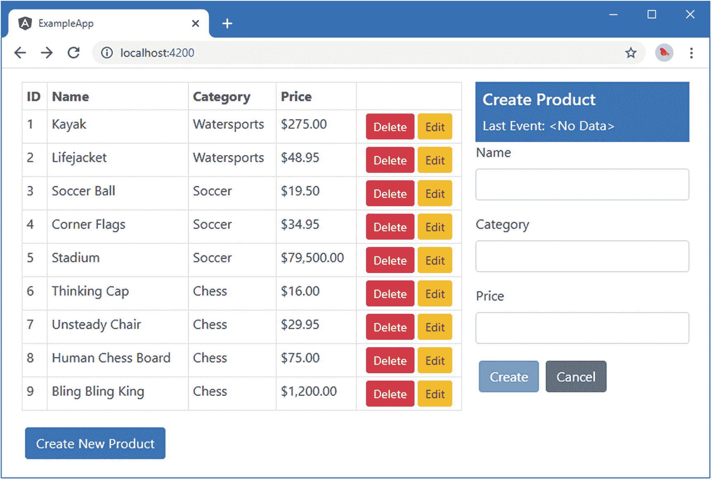
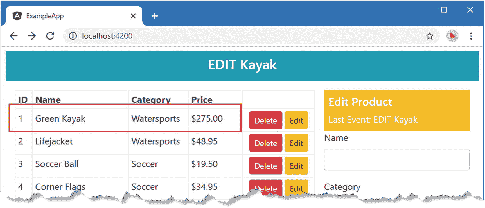
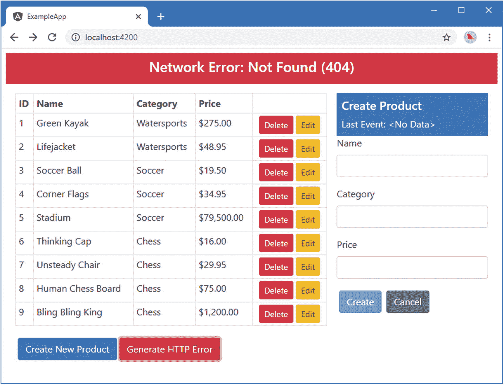

# 二十四、发出 HTTP 请求

从第十一章开始的所有例子都依赖于硬连线到应用中的静态数据。在这一章中，我将演示如何使用异步 HTTP 请求，通常称为 Ajax 请求，与 web 服务进行交互，将真实数据输入到应用中。表 24-1 将 HTTP 请求放在上下文中。

表 24-1。

将异步 HTTP 请求放在上下文中

<colgroup><col class="tcol1 align-left"> <col class="tcol2 align-left"></colgroup> 
| 

问题

 | 

回答

 |
| --- | --- |
| 它们是什么？ | 异步 HTTP 请求是由浏览器代表应用发送的 HTTP 请求。术语*异步*是指在浏览器等待服务器响应的同时，应用继续运行。 |
| 它们为什么有用？ | 异步 HTTP 请求允许 Angular 应用与 web 服务进行交互，以便将持久数据加载到应用中，并将更改发送到服务器并保存。 |
| 它们是如何使用的？ | 使用`HttpClient`类发出请求，该类通过依赖注入作为服务交付。这个类为浏览器的`XMLHttpRequest`特性提供了一个 Angular 友好的包装器。 |
| 有什么陷阱或限制吗？ | 使用 Angular HTTP 特性需要使用反应式扩展`Observable`对象，如第二十三章所述。 |
| 还有其他选择吗？ | 如果您愿意，您可以直接使用浏览器的`XMLHttpRequest`对象，并且一些应用——那些不需要处理持久数据的应用——可以在根本不发出 HTTP 请求的情况下编写。 |

表 24-2 总结了本章内容。

表 24-2。

章节总结

<colgroup><col class="tcol1 align-left"> <col class="tcol2 align-left"> <col class="tcol3 align-left"></colgroup> 
| 

问题

 | 

解决办法

 | 

列表

 |
| --- | --- | --- |
| 在 Angular 应用中发送 HTTP 请求 | 使用`Http`服务 | 1–8 |
| 执行休息操作 | 使用 HTTP 方法和 URL 来指定操作和该操作的目标 | 9–11 |
| 提出跨来源请求 | 使用`HttpClient`服务自动支持 CORS(也支持 JSONP 请求) | 12–13 |
| 在请求中包含标头 | 在`Request`对象中设置`headers`属性 | 14–15 |
| 响应 HTTP 错误 | 创建错误处理程序类 | 16–19 |

## 准备示例项目

本章使用在第二十二章中创建的 exampleApp 项目。对于这一章，我依赖一个用 JSON 数据响应 HTTP 请求的服务器。运行`exampleApp`文件夹中清单 24-1 所示的命令，将`json-server`包添加到项目中。

Tip

你可以从 [`https://github.com/Apress/pro-angular-9`](https://github.com/Apress/pro-angular-9) 下载本章以及本书其他章节的示例项目。如果在运行示例时遇到问题，请参见第一章获取帮助。

```ts
npm install json-server@0.16.0

Listing 24-1.Adding a Package to the Project

```

我在`package.json`文件的`scripts`部分添加了一个条目来运行`json-server`包，如清单 24-2 所示。

```ts
...
"scripts": {
    "ng": "ng",
    "start": "ng serve",
    "build": "ng build",
    "test": "ng test",
    "lint": "ng lint",
    "e2e": "ng e2e",
    "json": "json-server --p 3500 restData.js"
},
...

Listing 24-2.Adding a Script Entry in the package.json File in the exampleApp Folder

```

### 配置模型特征模块

`@angular/common/http` JavaScript 模块包含一个名为`HttpClientModule`的 Angular 模块，在创建 HTTP 请求之前，必须将它导入到应用的根模块或某个特性模块中。在清单 24-3 中，我将模块导入到模型模块中，这是示例应用中的自然位置，因为我将使用 HTTP 请求用数据填充模型。

```ts
import { NgModule } from "@angular/core";
import { StaticDataSource } from "./static.datasource";
import { Model } from "./repository.model";
import { HttpClientModule } from "@angular/common/http";

@NgModule({
  imports: [HttpClientModule],
  providers: [Model, StaticDataSource]
})
export class ModelModule { }

Listing 24-3.Importing a Module in the model.module.ts File in the src/app/model Folder

```

### 创建数据文件

为了给`json-server`包提供一些数据，我在`exampleApp`文件夹中添加了一个名为`restData.js`的文件，并添加了清单 24-4 中所示的代码。

```ts
module.exports = function () {
    var data = {
        products: [
            { id: 1, name: "Kayak", category: "Watersports", price: 275 },
            { id: 2, name: "Lifejacket", category: "Watersports", price: 48.95 },
            { id: 3, name: "Soccer Ball", category: "Soccer", price: 19.50 },
            { id: 4, name: "Corner Flags", category: "Soccer", price: 34.95 },
            { id: 5, name: "Stadium", category: "Soccer", price: 79500 },
            { id: 6, name: "Thinking Cap", category: "Chess", price: 16 },
            { id: 7, name: "Unsteady Chair", category: "Chess", price: 29.95 },
            { id: 8, name: "Human Chess Board", category: "Chess", price: 75 },
            { id: 9, name: "Bling Bling King", category: "Chess", price: 1200 }
        ]
    }
    return data
}

Listing 24-4.The Contents of the restData.js File in the exampleApp Folder

```

`json-server`包可以处理 JSON 或 JavaScript 文件。如果您使用一个 JSON 文件，那么它的内容将被修改以反映客户的变更请求。我选择了 JavaScript 选项，它允许以编程方式生成数据，并且意味着重新启动该过程将返回到原始数据。

### 更新表单组件

在第二十三章中，我配置了管理 HTML 表单的组件来忽略由表格组件生成的事件，直到第一次点击创建新产品按钮。为了避免混淆结果，清单 24-5 禁用了应用于`Observable`的`skipWhile`和`distinctUntilChanged`方法。

```ts
...
constructor(private model: Model,
    @Inject(SHARED_STATE) public stateEvents: Observable<SharedState>) {
        stateEvents
        // .pipe(skipWhile(state => state.mode == MODES.EDIT))
        // .pipe(distinctUntilChanged((firstState, secondState) =>
        //     firstState.mode == secondState.mode
        //         && firstState.id == secondState.id))
        .subscribe(update => {
            this.product = new Product();
            if (update.id != undefined) {
                Object.assign(this.product, this.model.getProduct(update.id));
            }
            this.editing = update.mode == MODES.EDIT;
        });
}
...

Listing 24-5.Disabling Event Skipping in the form.component.ts File in the src/app/core Folder

```

### 运行示例项目

打开一个新的命令提示符，导航到`exampleApp`文件夹，运行以下命令启动数据服务器:

```ts
npm run json

```

这个命令将启动`json-server`，它将监听端口 3500 上的 HTTP 请求。打开新的浏览器窗口并导航至`http://localhost:3500/products/2`。服务器将使用以下数据进行响应:

```ts
{ "id": 2, "name": "Lifejacket", "category": "Watersports", "price": 48.95 }

```

保持`json-server`运行，并通过在`exampleApp`文件夹中运行以下命令，使用单独的命令提示符启动 Angular 开发工具:

```ts
ng serve

```

使用浏览器导航至`http://localhost:4200`以查看图 24-1 中所示的内容。



图 24-1。

运行示例应用

## 理解 RESTful Web 服务

向应用交付数据的最常见方法是使用表述性状态转移模式(称为 REST)来创建数据 web 服务。REST 没有详细的规范，这导致很多不同的方法都打着 RESTful 的旗号。然而，在 web 应用开发中有一些有用的统一思想。

RESTful web 服务的核心前提是包含 HTTP 的特性，以便请求方法——也称为*动词*——指定服务器要执行的操作，请求 URL 指定操作将应用到的一个或多个数据对象。

例如，在示例应用中，下面是一个可能指向特定产品的 URL:

```ts
http://localhost:3500/products/2

```

URL 的第一段—`products`—用于指示将被操作的对象集合，并允许单个服务器提供多个服务，每个服务都有自己的数据。第二个片段——`2`——在`products`集合中选择一个单独的对象。在本例中，`id`属性的值唯一地标识了一个对象，并将在 URL 中使用，在本例中，指定了`Lifejacket`对象。

用于发出请求的 HTTP 动词或方法告诉 RESTful 服务器应该对指定的对象执行什么操作。在上一节中测试 RESTful 服务器时，浏览器发送了一个 HTTP GET 请求，服务器将其解释为检索指定对象并将其发送给客户机的指令。正是由于这个原因，浏览器显示了一个表示`Lifejacket`对象的 JSON。

表 24-3 显示了 HTTP 方法和 URL 的最常见组合，并解释了当发送到 RESTful 服务器时它们各自的作用。

表 24-3。

RESTful Web 服务中常见的 HTTP 动词及其作用

<colgroup><col class="tcol1 align-left"> <col class="tcol2 align-left"> <col class="tcol3 align-left"></colgroup> 
| 

动词

 | 

统一资源定位器

 | 

描述

 |
| --- | --- | --- |
| `GET` | `/products` | 这种组合检索`products`集合中的所有对象。 |
| `GET` | `/products/2` | 这个组合从`products`集合中检索出`id`为`2`的对象。 |
| `POST` | `/products` | 该组合用于向`products`集合添加一个新对象。请求体包含新对象的 JSON 表示。 |
| `PUT` | `/products/2` | 该组合用于替换`products`集合中`id`为`2`的对象。请求体包含替换对象的 JSON 表示。 |
| `PATCH` | `/products/2` | 这个组合用于更新集合`products`中对象属性的子集，集合`id`是`2`。请求体包含要更新的属性和新值的 JSON 表示。 |
| `DELETE` | `/products/2` | 该组合用于从`products`集合中删除`id`为`2`的产品。 |

需要谨慎，因为一些 RESTful web 服务的工作方式可能存在相当大的差异，这是由用于创建它们的框架和开发团队的偏好的差异造成的。确认 web 服务如何使用动词以及在 URL 和请求正文中需要什么来执行操作是很重要的。

一些常见的变体包括不接受任何包含`id`值的请求主体的 web 服务(以确保它们是由服务器的数据存储唯一生成的)，或者不支持所有动词的任何 web 服务(通常忽略`PATCH`请求，只接受使用`PUT`动词的更新)。

## 替换静态数据源

从 HTTP 请求开始的最佳方式是将示例应用中的静态数据源替换为从 RESTful web 服务中检索数据的数据源。这将为描述 Angular 如何支持 HTTP 请求以及如何将它们集成到应用中提供基础。

### 创建新的数据源服务

为了创建一个新的数据源，我在`src/app/model`文件夹中添加了一个名为`rest.datasource.ts`的文件，并添加了清单 24-6 中所示的语句。

```ts
import { Injectable, Inject, InjectionToken } from "@angular/core";
import { HttpClient } from "@angular/common/http";
import { Observable } from "rxjs";
import { Product } from "./product.model";

export const REST_URL = new InjectionToken("rest_url");

@Injectable()
export class RestDataSource {

  constructor(private http: HttpClient,
    @Inject(REST_URL) private url: string) { }

  getData(): Observable<Product[]> {
    return this.http.get<Product[]>(this.url);
  }
}

Listing 24-6.The Contents of the rest.datasource.ts File in the src/app/model Folder

```

这是一个看起来简单的类，但是有一些重要的工作特性，我将在接下来的章节中描述。

#### 设置 HTTP 请求

Angular 提供了通过`HttpClient`类进行异步 HTTP 请求的能力，该类在`@angular/common/http` JavaScript 模块中定义，并作为服务在`HttpClientModule`功能模块中提供。数据源使用其构造函数声明了对`HttpClient`类的依赖，如下所示:

```ts
...
constructor(private http: HttpClient, @Inject(REST_URL) private url: string) { }
...

```

使用另一个构造函数参数，这样请求发送到的 URL 就不必硬连接到数据源中。当我配置特性模块时，我将使用`REST_URL`不透明令牌创建一个提供者。通过构造函数接收的`HttpClient`对象用于在数据源的`getData`方法中发出 HTTP GET 请求，如下所示:

```ts
...
getData(): Observable<Product[]> {
    return this.http.get<Product[]>(this.url);
}
...

```

`HttpClient`类定义了一组发出 HTTP 请求的方法，每个方法使用不同的 HTTP 动词，如表 24-4 中所述。

表 24-4。

HttpClient 方法

<colgroup><col class="tcol1 align-left"> <col class="tcol2 align-left"></colgroup> 
| 

名字

 | 

描述

 |
| --- | --- |
| `get(url)` | 此方法向指定的 URL 发送 GET 请求。 |
| `post(url, body)` | 此方法使用指定的对象作为主体发送 POST 请求。 |
| `put(url, body)` | 此方法使用指定的对象作为主体发送 PUT 请求。 |
| `patch(url, body)` | 此方法使用指定的对象作为主体发送修补请求。 |
| `delete(url)` | 此方法向指定的 URL 发送删除请求。 |
| `head(url)` | 这个方法发送一个 HEAD 请求，它与 GET 请求具有相同的效果，只是服务器只返回头部，而不返回请求体。 |
| `options(url)` | 此方法向指定的 URL 发送选项请求。 |
| `request(method, url, options)` | 该方法可用于发送带有任何动词的请求，如“整合 HTTP 请求”一节所述。 |

Tip

表 24-4 中的方法接受一个可选的配置对象，如“配置请求头”一节所示。

#### 处理响应

表 24-4 中描述的方法接受一个类型参数，`HttpClient`类用它来解析从服务器收到的响应。RESTful web 服务器返回 JSON 数据，这已经成为 web 服务使用的事实上的标准，`HttpClient`对象会自动将响应转换成一个`Observable`，当它完成时会产生一个类型参数的实例。这意味着，如果您调用`get`方法，例如，使用一个`Product[]`类型参数，那么来自`get`方法的响应将是一个`Observable<Product[]>`，它代表 HTTP 请求的最终响应。

```ts
...
getData(): Observable<Product[]> {
  return this.http.get<Product[]>(this.url);
}
...

```

Caution

表 24-4 中的方法准备了一个 HTTP 请求，但是直到`Observer`对象的`subscribe`方法被调用，它才被发送到服务器。但是要小心，因为每次调用`subscribe`方法都会发送一次请求，这就很容易在无意中多次发送相同的请求。

### 配置数据源

下一步是为新数据源配置一个提供者，并创建一个基于值的提供者，用一个请求将被发送到的 URL 来配置它。清单 24-7 显示了对`model.module.ts`文件的修改。

```ts
import { NgModule } from "@angular/core";
// import { StaticDataSource } from "./static.datasource";
import { Model } from "./repository.model";
import { HttpClientModule } from "@angular/common/http";
import { RestDataSource, REST_URL } from "./rest.datasource";

@NgModule({
  imports: [HttpClientModule],
  providers: [Model, RestDataSource,
    { provide: REST_URL, useValue: `http://${location.hostname}:3500/products` }]
})
export class ModelModule { }

Listing 24-7.Configuring the Data Source in the model.module.ts File in the src/app/model Folder

```

这两个新的提供者将`RestDataSource`类作为服务启用，并使用`REST_URL`不透明令牌来配置 web 服务的 URL。我移除了`StaticDataSource`类的提供者，不再需要它了。

### 使用 REST 数据源

最后一步是更新 repository 类，以便它声明对新数据源的依赖，并使用它来获取应用数据，如清单 24-8 所示。

```ts
import { Injectable } from "@angular/core";
import { Product } from "./product.model";
//import { StaticDataSource } from "./static.datasource";
import { Observable } from "rxjs";
import { RestDataSource } from "./rest.datasource";

@Injectable()
export class Model {
    private products: Product[] = new Array<Product>();
    private locator = (p: Product, id: number) => p.id == id;

    constructor(private dataSource: RestDataSource) {
        //this.products = new Array<Product>();
        //this.dataSource.getData().forEach(p => this.products.push(p));
        this.dataSource.getData().subscribe(data => this.products = data);
    }

    getProducts(): Product[] {
        return this.products;
    }

    getProduct(id: number): Product {
        return this.products.find(p => this.locator(p, id));
    }

    saveProduct(product: Product) {
        if (product.id == 0 || product.id == null) {
            product.id = this.generateID();
            this.products.push(product);
        } else {
            let index = this.products
                .findIndex(p => this.locator(p, product.id));
            this.products.splice(index, 1, product);
        }
    }

    deleteProduct(id: number) {
        let index = this.products.findIndex(p => this.locator(p, id));
        if (index > -1) {
            this.products.splice(index, 1);
        }
    }

    private generateID(): number {
        let candidate = 100;
        while (this.getProduct(candidate) != null) {
            candidate++;
        }
        return candidate;
    }
}

Listing 24-8.Using the New Data Source in the repository.model.ts File in the src/app/model Folder

```

构造函数依赖关系已经改变，因此存储库在创建时将接收到一个`RestDataSource`对象。在构造函数中，调用数据源的`getData`方法，使用`subscribe`方法接收从服务器返回的数据对象并对其进行处理。

当您保存更改时，浏览器将重新加载应用，并将使用新的数据源。一个异步 HTTP 请求将被发送到 RESTful web 服务，它将返回如图 24-2 所示的更大的一组数据对象。



图 24-2。

获取应用数据

### 保存和删除数据

数据源能够从服务器获取数据，但是它还需要以另一种方式发送数据，持久化用户对模型中的对象所做的更改，并存储所创建的新对象。清单 24-9 使用 Angular `HttpClient`类向数据源类添加方法来发送保存或更新对象的 HTTP 请求。

```ts
import { Injectable, Inject, InjectionToken } from "@angular/core";
import { HttpClient } from "@angular/common/http";
import { Observable } from "rxjs";
import { Product } from "./product.model";

export const REST_URL = new InjectionToken("rest_url");

@Injectable()
export class RestDataSource {
    constructor(private http: HttpClient,
        @Inject(REST_URL) private url: string) { }

    getData(): Observable<Product[]> {
        return this.http.get<Product[]>(this.url);
    }

    saveProduct(product: Product): Observable<Product> {
        return this.http.post<Product>(this.url, product);
    }

    updateProduct(product: Product): Observable<Product> {
        return this.http.put<Product>(`${this.url}/${product.id}`, product);
    }

    deleteProduct(id: number): Observable<Product> {
        return this.http.delete<Product>(`${this.url}/${id}`);
    }
}

Listing 24-9.Sending Data in the rest.datasource.ts File in the src/app/model Folder

```

`saveProduct`、`updateProduct`和`deleteProduct`方法遵循相同的模式:它们调用其中一个`HttpClient`类方法并返回一个`Observable<Product>`作为结果。

当保存一个新对象时，对象的 ID 由服务器生成，因此它是唯一的，客户端不会无意中对不同的对象使用相同的 ID。在这种情况下，使用 POST 方法，请求被发送到`/products` URL。当更新或删除一个现有对象时，ID 是已知的，一个 PUT 请求被发送到一个包含该 ID 的 URL。因此，例如，更新 ID 为 2 的对象的请求被发送到`/products/2` URL。类似地，要删除该对象，需要向同一个 URL 发送一个删除请求。

这些方法的共同点是服务器是权威的数据存储，来自服务器的响应包含服务器保存的对象的正式版本。正是这个对象作为这些方法的结果返回，通过`Observable<Product>`提供。

清单 24-10 显示了 repository 类中的相应变化，这些变化利用了新的数据源特性。

```ts
import { Injectable } from "@angular/core";
import { Product } from "./product.model";
import { Observable } from "rxjs";
import { RestDataSource } from "./rest.datasource";

@Injectable()
export class Model {
    private products: Product[] = new Array<Product>();
    private locator = (p: Product, id: number) => p.id == id;

    constructor(private dataSource: RestDataSource) {
        this.dataSource.getData().subscribe(data => this.products = data);
    }

    getProducts(): Product[] {
        return this.products;
    }

    getProduct(id: number): Product {
        return this.products.find(p => this.locator(p, id));
    }

    saveProduct(product: Product) {
        if (product.id == 0 || product.id == null) {
            this.dataSource.saveProduct(product)
                .subscribe(p => this.products.push(p));
        } else {
            this.dataSource.updateProduct(product).subscribe(p => {
                let index = this.products
                    .findIndex(item => this.locator(item, p.id));
                this.products.splice(index, 1, p);
            });
        }
    }

    deleteProduct(id: number) {
        this.dataSource.deleteProduct(id).subscribe(() => {
            let index = this.products.findIndex(p => this.locator(p, id));
            if (index > -1) {
                this.products.splice(index, 1);
            }
        });
    }
}

Listing 24-10.Using the Data Source Features in the repository.model.ts File in the src/app/model Folder

```

这些更改使用数据源将更新发送到服务器，并使用结果更新本地存储的数据，以便应用的其余部分显示这些数据。要测试这些更改，请单击 Kayak 产品的 Edit 按钮，并将其名称更改为 Green Kayak。点击保存按钮，浏览器会向服务器发送一个 HTTP PUT 请求，服务器会返回一个修改后的对象，该对象被添加到存储库的`products`数组中，并显示在表格中，如图 24-3 所示。



图 24-3。

向服务器发送上传请求

您可以通过使用浏览器请求`http://localhost:3500/products/1`来检查服务器是否已经存储了更改，这将产生对象的以下表示:

```ts
{
  "id": 1,
  "name": "Green Kayak",
  "category": "Watersports",
  "price": 275
}

```

## 整合 HTTP 请求

数据源类中的每个方法都复制了相同的基本模式，即使用特定于动词的`HttpClient`方法发送 HTTP 请求。这意味着对 HTTP 请求方式的任何更改都必须在四个不同的地方重复，以确保使用 GET、POST、PUT 和 DELETE 动词的请求都得到正确的更新和一致的执行。

`HttpClient`类定义了`request`方法，该方法允许将 HTTP 动词指定为参数。清单 24-11 使用`request`方法合并数据源类中的 HTTP 请求。

```ts
import { Injectable, Inject, InjectionToken } from "@angular/core";
import { HttpClient } from "@angular/common/http";
import { Observable } from "rxjs";
import { Product } from "./product.model";

export const REST_URL = new InjectionToken("rest_url");

@Injectable()
export class RestDataSource {
    constructor(private http: HttpClient,
        @Inject(REST_URL) private url: string) { }

    getData(): Observable<Product[]> {
        return this.sendRequest<Product[]>("GET", this.url);
    }

    saveProduct(product: Product): Observable<Product> {
        return this.sendRequest<Product>("POST", this.url, product);
    }

    updateProduct(product: Product): Observable<Product> {
        return this.sendRequest<Product>("PUT",
            `${this.url}/${product.id}`, product);
    }

    deleteProduct(id: number): Observable<Product> {
        return this.sendRequest<Product>("DELETE", `${this.url}/${id}`);
    }

    private sendRequest<T>(verb: string, url: string, body?: Product)
           : Observable<T> {
        return this.http.request<T>(verb, url, {
            body: body
        });
    }
}

Listing 24-11.Consolidating HTTP Requests in the rest.datasource.ts File in the src/app/model Folder

```

`request`方法接受 HTTP 动词、请求的 URL 和用于配置请求的可选对象。配置对象用于使用`body`属性设置请求主体，而`HttpClient`将自动负责编码主体对象并在请求中包含它的序列化表示。

表 24-5 描述了最有用的属性，可以指定这些属性来配置使用`request`方法发出的 HTTP 请求。

表 24-5。

有用的请求方法配置对象属性

<colgroup><col class="tcol1 align-left"> <col class="tcol2 align-left"></colgroup> 
| 

名字

 | 

描述

 |
| --- | --- |
| `headers` | 该属性返回一个允许指定请求头的`HttpHeaders`对象，如“配置请求头”一节所述。 |
| `body` | 此属性用于设置请求正文。发送请求时，分配给该属性的对象将被序列化为 JSON。 |
| `withCredentials` | 当`true`时，该属性用于在进行跨站点请求时包含身份验证 cookies。作为跨源资源共享(CORS)规范的一部分，此设置必须仅用于响应中包含`Access-Control-Allow-Credentials`标头的服务器。有关详细信息，请参见“提出跨来源请求”一节。 |
| `responseType` | 此属性用于指定服务器预期的响应类型。默认值为`json`，表示 JSON 数据格式。 |

## 提出跨来源请求

默认情况下，浏览器执行一个安全策略，允许 JavaScript 代码只在与包含它们的文档相同的*源*内发出异步 HTTP 请求。此策略旨在降低跨站点脚本(CSS)攻击的风险，这种攻击会诱使浏览器执行恶意代码。这种攻击的细节超出了本书的范围，但是可以在 [`http://en.wikipedia.org/wiki/Cross-site_scripting`](http://en.wikipedia.org/wiki/Cross-site_scripting) 找到的文章很好地介绍了这个主题。

对于 Angular 开发人员来说，同源策略在使用 web 服务时可能是个问题，因为它们通常位于包含应用 JavaScript 代码的源之外。如果两个 URL 具有相同的协议、主机和端口，则它们被视为来源相同，如果不是这样，则被视为来源不同。包含示例应用的 JavaScript 代码的 HTML 文件的 URL 是`http://localhost:3000/index.html`。表 24-6 总结了与应用的 URL 相比，相似的 URL 具有相同或不同的来源。

表 24-6。

URL 及其来源

<colgroup><col class="tcol1 align-left"> <col class="tcol2 align-left"></colgroup> 
| 

统一资源定位器

 | 

原产地比较

 |
| --- | --- |
| `http://localhost:3000/otherfile.html` | 相同的起源 |
| `http://localhost:3000/app/main.js` | 相同的起源 |
| `https://localhost:3000/index.html` | 出身不同；协议不同 |
| `http://localhost:3500/products` | 出身不同；端口不同 |
| [`http://angular.io/index.html`](http://angular.io/index.html) | 出身不同；主机不同 |

如上表所示，RESTful web 服务的 URL`http://localhost:3500/products`有不同的来源，因为它使用了与主应用不同的端口。

使用 Angular `HttpClient`类发出的 HTTP 请求将自动使用跨源资源共享向不同的源发送请求。使用 CORS，浏览器在异步 HTTP 请求中包含标头，向服务器提供 JavaScript 代码的来源。来自服务器的响应包括告诉浏览器它是否愿意接受请求的头。CORS 的详细情况不在本书讨论范围内，但在 [`https://en.wikipedia.org/wiki/Cross-origin_resource_sharing`](https://en.wikipedia.org/wiki/Cross-origin_resource_sharing) 有题目介绍，在 [`www.w3.org/TR/cors`](http://www.w3.org/TR/cors) 有 CORS 规格。

对于 Angular 开发人员来说，只要接收异步 HTTP 请求的服务器支持该规范，CORS 就是自动处理的事情。为示例提供 RESTful web 服务的`json-server`包支持 CORS，并将接受来自任何来源的请求，这就是示例一直工作的原因。如果您希望看到 CORS 的实际应用，请使用浏览器的 F12 开发人员工具来观察在您编辑或创建产品时发出的网络请求。您可能会看到使用`OPTIONS`动词发出的请求，称为*预检请求*，浏览器使用它来检查是否允许向服务器发出 POST 或 PUT 请求。这个请求和随后向服务器发送数据的请求将包含一个`Origin`头，而响应将包含一个或多个`Access-Control-Allow`头，服务器通过这些头确定它愿意从客户端接受什么。

所有这些都是自动发生的，唯一的配置选项是表 24-5 中描述的`withCredentials`属性。当该属性为`true`时，浏览器将包含认证 cookies，来自源的头将包含在对服务器的请求中。

### 使用 JSONP 请求

只有当 HTTP 请求发送到的服务器支持 CORS 时，它才可用。对于没有实现 CORS 的服务器，Angular 还提供了对 JSONP 的支持，这允许更有限形式的跨源请求。

JSONP 通过向文档对象模型添加一个`script`元素来工作，该元素在其`src`属性中指定跨源服务器。浏览器向服务器发送一个 GET 请求，服务器返回 JavaScript 代码，当执行该代码时，向应用提供它需要的数据。JSONP 本质上是一种绕过浏览器同源安全策略的黑客行为。JSONP 只能用于发出 GET 请求，它比 CORS 存在更大的安全风险。因此，JSONP 应该只在 CORS 不可用时使用。

JSONP 的 Angular 支持在一个名为`HttpClientJsonpModule`的特性模块中定义，这个特性模块在`@angular/common/http` JavaScript 模块中定义。为了启用 JSONP，清单 24-12 将`HttpClientJsonpModule`添加到模型模块的导入集中。

```ts
import { NgModule } from "@angular/core";
//import { StaticDataSource } from "./static.datasource";
import { Model } from "./repository.model";
import { HttpClientModule, HttpClientJsonpModule } from "@angular/common/http";
import { RestDataSource, REST_URL } from "./rest.datasource";

@NgModule({
    imports: [HttpClientModule, HttpClientJsonpModule],
    providers: [Model, RestDataSource,
        { provide: REST_URL, useValue: `http://${location.hostname}:3500/products` }]
})
export class ModelModule { }

Listing 24-12.Enabling JSONP in the model.module.ts File in the src/app/model Folder

```

Angular 通过`HttpClient`服务提供对 JSONP 的支持，该服务负责管理 JSONP HTTP 请求和处理响应，否则这将是一个冗长且容易出错的过程。清单 24-13 展示了使用 JSONP 为应用请求初始数据的数据源。

```ts
import { Injectable, Inject, InjectionToken } from "@angular/core";
import { HttpClient } from "@angular/common/http";
import { Observable } from "rxjs";
import { Product } from "./product.model";

export const REST_URL = new InjectionToken("rest_url");

@Injectable()
export class RestDataSource {
    constructor(private http: HttpClient,
        @Inject(REST_URL) private url: string) { }

    getData(): Observable<Product[]> {
        return this.http.jsonp<Product[]>(this.url, "callback");
    }

    saveProduct(product: Product): Observable<Product> {
        return this.sendRequest<Product>("POST", this.url, product);
    }

    updateProduct(product: Product): Observable<Product> {
        return this.sendRequest<Product>("PUT",
            `${this.url}/${product.id}`, product);
    }

    deleteProduct(id: number): Observable<Product> {
        return this.sendRequest<Product>("DELETE", `${this.url}/${id}`);
    }

    private sendRequest<T>(verb: string, url: string, body?: Product)
            : Observable<T> {
        return this.http.request<T>(verb, url, {
            body: body
        });
    }
}

Listing 24-13.Making a JSONP Request in the rest.datasource.ts File in the src/app/model Folder

```

JSONP 只能用于 get 请求，这些请求是使用`HttpClient.jsonp`方法发送的。当您调用这个方法时，您必须提供请求的 URL 和回调参数的名称，回调参数必须设置为`callback`，如下所示:

```ts
...
return this.http.jsonp<Product[]>(this.url, "callback");
...

```

当 Angular 发出 HTTP 请求时，它用动态生成的函数的名称创建一个 URL。如果您查看浏览器发出的网络请求，您会看到初始请求被发送到如下 URL:

```ts
http://localhost:3500/products?callback=ng_jsonp_callback_0

```

服务器 JavaScript 函数匹配 URL 中使用的名称，并将从请求中接收的数据传递给它。JSONP 是一种进行跨来源请求的更有限的方式，并且与 CORS 不同，它绕过了浏览器的安全策略，但在必要时它可以是一种有用的后备措施。

## 配置请求标头

如果您使用的是商业 RESTful web 服务，那么您通常需要设置一个请求头来提供一个 API 键，这样服务器就可以将请求与您的应用相关联，以便进行访问控制和计费。您可以通过配置传递给`request`方法的配置对象来设置这种头——或者任何其他头，如清单 24-14 所示。(这个清单还返回到对所有请求使用`request`方法，而不是 JSONP。)

```ts
import { Injectable, Inject, InjectionToken } from "@angular/core";
import { HttpClient, HttpHeaders } from "@angular/common/http";
import { Observable } from "rxjs";
import { Product } from "./product.model";

export const REST_URL = new InjectionToken("rest_url");

@Injectable()
export class RestDataSource {
    constructor(private http: HttpClient,
        @Inject(REST_URL) private url: string) { }

    getData(): Observable<Product[]> {
        return this.sendRequest<Product[]>("GET", this.url);
    }

    saveProduct(product: Product): Observable<Product> {
        return this.sendRequest<Product>("POST", this.url, product);
    }

    updateProduct(product: Product): Observable<Product> {
        return this.sendRequest<Product>("PUT",
            `${this.url}/${product.id}`, product);
    }

    deleteProduct(id: number): Observable<Product> {
        return this.sendRequest<Product>("DELETE", `${this.url}/${id}`);
    }

    private sendRequest<T>(verb: string, url: string, body?: Product)
            : Observable<T> {
        return this.http.request<T>(verb, url, {
            body: body,
            headers: new HttpHeaders({
                "Access-Key": "<secret>",
                "Application-Name": "exampleApp"
            })
        });
    }
}

Listing 24-14.Setting a Request Header in the rest.datasource.ts File in the src/app/model Folder

```

`headers`属性被设置为一个`HttpHeaders`对象，该对象可以使用一个映射对象来创建，该映射对象的属性对应于标题名和应该用于标题名的值。如果您使用浏览器的 F12 开发人员工具来检查异步 HTTP 请求，您将会看到清单中指定的两个头与浏览器创建的标准头一起被发送到服务器，如下所示:

```ts
...
Accept:*/*
Accept-Encoding:gzip, deflate, sdch, br
Accept-Language:en-US,en;q=0.8
access-key:<secret>
application-name:exampleApp
Connection:keep-alive
...

```

如果您对请求头有更复杂的需求，那么您可以使用由`HttpHeaders`类定义的方法，如表 24-7 中所述。

表 24-7。

HttpHeaders 方法

<colgroup><col class="tcol1 align-left"> <col class="tcol2 align-left"></colgroup> 
| 

名字

 | 

描述

 |
| --- | --- |
| `keys()` | 返回集合中的所有标题名 |
| `get(name)` | 返回指定标题的第一个值 |
| `getAll(name)` | 返回指定标题的所有值 |
| `has(name)` | 如果集合包含指定的标题，则返回`true` |
| `set(header, value)` | 返回一个新的`HttpHeaders`对象，用一个值替换指定标题的所有现有值 |
| `set(header, values)` | 返回一个新的`HttpHeaders`对象，用一个值数组替换指定标题的所有现有值 |
| `append(name, value)` | 向指定标头的值列表中追加一个值 |
| `delete(name)` | 从集合中移除指定的标头 |

HTTP 头可以有多个值，这就是为什么有些方法会为头追加值或替换集合中的所有值。清单 24-15 创建一个空的`HttpHeaders`对象，并用有多个值的头填充它。

```ts
...
private sendRequest<T>(verb: string, url: string, body?: Product)
    : Observable<T> {

    let myHeaders = new HttpHeaders();
    myHeaders = myHeaders.set("Access-Key", "<secret>");
    myHeaders = myHeaders.set("Application-Names", ["exampleApp", "proAngular"]);

    return this.http.request<T>(verb, url, {
        body: body,
        headers: myHeaders
    });
}
...

Listing 24-15.Setting Multiple Header Values in the rest.datasource.ts File in the src/app/model Folder

```

当浏览器向服务器发送请求时，它们将包括以下标题:

```ts
...
Accept:*/*
Accept-Encoding:gzip, deflate, sdch, br
Accept-Language:en-US,en;q=0.8
access-key:<secret>
application-names:exampleApp,proAngular
Connection:keep-alive
...

```

## 处理错误

目前，应用中没有错误处理，这意味着如果 HTTP 请求出现问题，Angular 不知道该怎么办。为了更容易生成错误，我在 product 表中添加了一个按钮，该按钮将导致一个 HTTP 请求来删除一个在服务器上不存在的对象，如清单 24-16 所示。

```ts
<table class="table table-sm table-bordered table-striped">
    <tr>
        <th>ID</th><th>Name</th><th>Category</th><th>Price</th><th></th>
    </tr>
    <tr *ngFor="let item of getProducts()">
        <td>{{item.id}}</td>
        <td>{{item.name}}</td>
        <td>{{item.category}}</td>
        <td>{{item.price | currency:"USD" }}</td>
        <td class="text-center">
            <button class="btn btn-danger btn-sm mr-1"
                    (click)="deleteProduct(item.id)">
                Delete
            </button>
            <button class="btn btn-warning btn-sm" (click)="editProduct(item.id)">
                Edit
            </button>
        </td>
    </tr>
</table>
<button class="btn btn-primary m-1" (click)="createProduct()">
    Create New Product
</button>
<button class="btn btn-danger" (click)="deleteProduct(-1)">
    Generate HTTP Error
</button>

Listing 24-16.Adding an Error Button in the table.component.html File in the src/app/core Folder

```

`button`元素调用组件的`deleteProduct`方法，参数为-1。组件将要求存储库删除这个对象，这将导致一个 HTTP 删除请求被发送到不存在的`/products/-1`。如果您打开浏览器的 JavaScript 控制台并单击 new 按钮，您将看到来自服务器的响应，如下所示:

```ts
DELETE http://localhost:3500/products/-1 404 (Not Found)

```

改善这种情况意味着在出现错误时检测到这种错误并通知用户，用户通常不会查看 JavaScript 控制台。一个真正的应用也可能通过记录错误来响应错误，这样以后就可以对它们进行分析，但是为了简单起见，我只显示一条错误消息。

### 生成用户就绪消息

处理错误的第一步是将 HTTP 异常转换成可以向用户显示的内容。默认的错误消息是写入 JavaScript 控制台的消息，包含太多信息，无法向用户显示。用户不需要知道请求被发送到的 URL 仅仅知道发生了什么样的问题就足够了。

转换错误消息的最佳方式是使用`catchError`和`throwError`方法。使用`catchError`方法和`pipe`方法来接收发生在`Observable`序列中的任何错误，使用`throwError`方法来创建一个新的`Observable`来包含错误。清单 24-17 将两种方法都应用于数据源。

```ts
import { Injectable, Inject, InjectionToken } from "@angular/core";
import { HttpClient, HttpHeaders } from "@angular/common/http";
import { Observable, throwError } from "rxjs";
import { Product } from "./product.model";
import { catchError } from "rxjs/operators";

export const REST_URL = new InjectionToken("rest_url");

@Injectable()
export class RestDataSource {
    constructor(private http: HttpClient,
        @Inject(REST_URL) private url: string) { }

    getData(): Observable<Product[]> {
        return this.sendRequest<Product[]>("GET", this.url);
    }

    saveProduct(product: Product): Observable<Product> {
        return this.sendRequest<Product>("POST", this.url, product);
    }

    updateProduct(product: Product): Observable<Product> {
        return this.sendRequest<Product>("PUT",
            `${this.url}/${product.id}`, product);
    }

    deleteProduct(id: number): Observable<Product> {
        return this.sendRequest<Product>("DELETE", `${this.url}/${id}`);
    }

    private sendRequest<T>(verb: string, url: string, body?: Product)
        : Observable<T> {

        let myHeaders = new HttpHeaders();
        myHeaders = myHeaders.set("Access-Key", "<secret>");
        myHeaders = myHeaders.set("Application-Names", ["exampleApp", "proAngular"]);

        return this.http.request<T>(verb, url, {
            body: body,
            headers: myHeaders
        }).pipe(catchError((error: Response) =>
             throwError(`Network Error: ${error.statusText} (${error.status})`)));
    }

}

Listing 24-17.Transforming Errors in the rest.datasource.ts File in the src/app/model Folder

```

当出现错误时，传递给`catchError`方法的函数被调用，并接收描述结果的`Response`对象。`throwError`函数创建一个新的仅包含一个错误对象的可观察对象，在本例中，该对象用于生成一条错误消息，其中包含 HTTP 状态代码和响应中的状态文本。

如果保存更改，然后再次单击 Generate HTTP Error 按钮，错误消息仍会被写入浏览器的 JavaScript 控制台，但会更改为由`catchError` / `throwError`方法生成的格式。

```ts
EXCEPTION: Network Error: Not Found (404)

```

### 处理错误

错误已经被转换，但没有被处理，这就是为什么它们仍然在浏览器的 JavaScript 控制台中被报告为异常。有两种方法可以处理这些错误。第一个是为由`HttpClient`对象创建的`Observable`对象的`subscribe`方法提供一个错误处理函数。这是定位错误并为存储库提供重试操作或尝试以其他方式恢复的机会的有用方法。

第二种方法是替换内置的 Angular 错误处理功能，该功能响应应用中任何未处理的错误，并在默认情况下将它们写入控制台。正是这个特性写出了前面几节中显示的消息。

对于示例应用，我想用一个使用消息服务的错误处理程序来覆盖默认的错误处理程序。我在`src/app/messages`文件夹中创建了一个名为`errorHandler.ts`的文件，并用它来定义清单 24-18 中所示的类。

```ts
import { ErrorHandler, Injectable, NgZone } from "@angular/core";
import { MessageService } from "./message.service";
import { Message } from "./message.model";

@Injectable()
export class MessageErrorHandler implements ErrorHandler {

    constructor(private messageService: MessageService, private ngZone: NgZone) {
    }

    handleError(error) {
        let msg = error instanceof Error ? error.message : error.toString();
        this.ngZone.run(() => this.messageService
            .reportMessage(new Message(msg, true)), 0);
    }
}

Listing 24-18.The Contents of the errorHandler.ts File in the src/app/messages Folder

```

在`@angular/core`模块中定义了`ErrorHandler`类，它通过一个`handleError`方法来响应错误。清单中显示的类用一个使用`MessageService`报告错误的实现替换了这个方法的默认实现。

构造函数接收一个`ngZone`对象，它是异步操作 Angular 支持的一部分，也是变化检测特性的一个重要部分。在这个清单中，`ngZone`对象的`run`方法用于报告一个错误消息，以便操作触发变更检测过程并向用户显示错误。

为了替换默认的`ErrorHandler`，我在消息模块中使用了一个类提供者，如清单 24-19 所示。

```ts
import { NgModule, ErrorHandler } from "@angular/core";
import { BrowserModule } from "@angular/platform-browser";
import { MessageComponent } from "./message.component";
import { MessageService } from "./message.service";
import { MessageErrorHandler } from "./errorHandler";

@NgModule({
    imports: [BrowserModule],
    declarations: [MessageComponent],
    exports: [MessageComponent],
    providers: [MessageService,
        { provide: ErrorHandler, useClass: MessageErrorHandler }]
})
export class MessageModule { }

Listing 24-19.Configuring an Error Handler in the message.module.ts File in the src/app/messages Folder

```

错误处理功能使用`MessageService`向用户报告错误消息。一旦保存了这些更改，点击生成 HTTP 错误按钮会产生一个用户可以看到的错误，如图 24-4 所示。



图 24-4。

处理 HTTP 错误

## 摘要

在这一章中，我解释了如何在 Angular 应用中进行异步 HTTP 请求。我介绍了 RESTful web 服务和 Angular `HttpClient`类提供的可用于与它们交互的方法。我解释了浏览器如何限制对不同来源的请求，以及 Angular 如何支持 CORS 和 JSONP 在应用来源之外发出请求。在下一章，我将介绍 URL 路由特性，它允许导航复杂的应用。