# 十、了解 Vue.js 项目和工具

在第九章中，我简要描述了 Vue.js 应用是如何工作的，以便为本书的其余部分提供上下文，作为该过程的一部分，我使用`@vue-cli`包创建了一个项目，然后使用它包含的工具。在这一章中，我将解释这种 Vue.js 项目是如何构建的，以及每个工具的作用。表 10-1 将这一章放在上下文中。

表 10-1

将 Vue.js 项目放在上下文中

<colgroup><col class="tcol1 align-left"> <col class="tcol2 align-left"></colgroup> 
| 

问题

 | 

回答

 |
| --- | --- |
| 它们是什么？ | 用`@vue-cli`包创建的项目是为复杂应用的开发而设计的。 |
| 它们为什么有用？ | 这种项目包括一组工具，这些工具简化了 Vue.js 的开发，并使得轻松使用 Vue.js 提供的一些高级功能成为可能。 |
| 它们是如何使用的？ | 使用`@vue/cli`包创建项目，并回答一系列问题以确定项目的初始内容。 |
| 有什么陷阱或限制吗？ | 如果你只是在用 Vue.js 做实验，这种项目可能是多余的。 |
| 有其他选择吗？ | 您可以不使用`@vue/cli`包创建自己的项目，在这种情况下，您可以自由组装自己的工具链，尽管这可能是一个耗时的过程。 |

表 10-2 总结了本章内容。

表 10-2

章节总结

<colgroup><col class="tcol1 align-left"> <col class="tcol2 align-left"> <col class="tcol3 align-left"></colgroup> 
| 

问题

 | 

解决办法

 | 

列表

 |
| --- | --- | --- |
| 创建新项目 | 使用`vue create`命令，选择您的应用需要的特性 | one |
| 启动开发工具 | 使用`npm run serve`命令 | 2-8 |
| 避免常见的代码和内容错误 | 使用棉绒功能 | 9–11 |
| 调试应用 | 使用浏览器 JavaScript 调试器的 Vue Devtools 浏览器扩展 | Twelve |
| 更改开发工具的配置 | 将包含所需设置的`.vue.config.js`文件添加到项目中 | Thirteen |
| 为部署准备应用 | 使用`npm run build`命令 | 14–19 |

## 创建 Vue.js 开发项目

现代的客户端开发框架都有自己的开发工具，Vue.js 也不例外。这意味着您可以创建一个项目，并使用专门为 Vue.js 应用创建的工具开始开发，这些工具已经过大型活跃社区的全面测试。

您在第一章中安装的`@vue/cli`包是由 Vue.js 团队提供的，用于简化 Vue.js 项目的创建并安装所有需要的开发和构建工具。运行清单 10-1 中的命令，使用`vue create`命令创建一个新项目，该命令由`@vue/cli`包提供。

### 注意

在撰写本文时，`@vue/cli`包已经发布了测试版。在最终发布之前可能会有一些小的变化，但是核心特性应该保持不变。有关任何突破性变化的详细信息，请查看本书的勘误表，可在 [`https://github.com/Apress/pro-vue-js-2`](https://github.com/Apress/pro-vue-js-2) 获得。

```js
vue create projecttools

Listing 10-1Creating a New Project

```

`vue create`命令使用一个交互过程来选择创建项目的选项，并会提示您如图 10-1 所示。


图 10-1

选择项目设置

文字可能很难从图像中读出，但是`vue create`命令会要求您选择一个预设。有一个可用的预置——称为*默认*——选择在前面章节中使用的相同配置。这是我在本书剩余部分使用的配置，因为它让我演示不同的组件是如何添加到项目中的。在方便的时候使用项目工具没有错，只要你明白它们在幕后为你做了什么。另一个选项是手动选择您需要的功能。使用箭头键选择手动选择功能选项并按 Enter 键，您将看到如图 10-2 所示的功能列表。

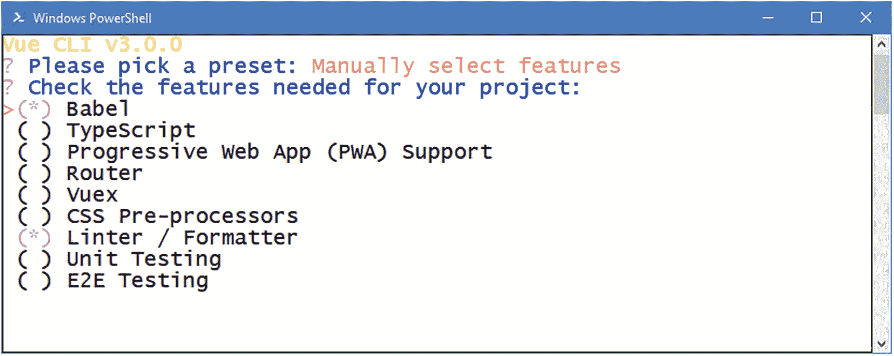

图 10-2

可供手动选择的项目功能

使用箭头键在功能列表中上下导航，使用空格键可以打开和关闭这些功能。表 10-3 描述了可用的特性。我会在本章或后面的章节中描述与 Vue.js 开发直接相关的特性。对于其他功能，我已经包括了一个提供更多细节的 URL。

表 10-3

Vue.js 项目功能

<colgroup><col class="tcol1 align-left"> <col class="tcol2 align-left"></colgroup> 
| 

名字

 | 

描述

 |
| --- | --- |
| 巴比伦式的城市 | Babel 特性负责将 JavaScript 源代码翻译成一种可以被旧浏览器执行的形式，这在“使用开发工具”一节中有描述。 |
| 以打字打的文件 | TypeScript 是 JavaScript 的超集，增加了静态类型等有用的功能，这使得 JavaScript 更像 C#或 Java。Vue.js 开发不需要 TypeScript，但是如果您发现 JavaScript 很难使用，它会很有帮助。详见 [`https://vuejs.org/v2/guide/typescript.html`](https://vuejs.org/v2/guide/typescript.html) 。 |
| PWA 支持 | 渐进式 web 应用是与常规应用一起呈现给用户的 web 应用，它依赖于一种称为*服务工作者*的 JavaScript 功能，在没有连接时提供功能。pwa 不是 Vue.js 特有的，虽然对 pwa 的支持正在改善，但这是一项我在本书的这个版本中没有提到的技术，因为它对大多数项目来说还不够成熟。详见[`developer . Mozilla . org/en-US/Apps/Progressive`](https://developer.mozilla.org/en-US/Apps/Progressive)。 |
| 路由器 | 此功能安装 Vue 路由器包，该包用于使用浏览器的 URL 向大型应用添加结构。你可以在本书第一部分的 SportsStore 应用中看到正在使用的路由，我在第 23–25 章中详细描述了 Vue Router 提供的特性。 |
| 武契特 | 此功能安装用于创建共享数据存储的 Vuex 包。你可以在本书第一部分的 SportsStore 应用中看到 Vuex 的使用，我在第二十章详细描述了它的特性。 |
| CSS 预处理程序 | CSS 预处理程序，如 Sass 和 Less，使编写复杂的 CSS 样式变得更加容易，如果您没有使用 CSS 框架或想要扩展一个框架，这将非常有用。即使你选择不使用 CSS 框架，你也不必使用 CSS 处理器，正如我在后面的章节中解释的那样。 |
| 棉绒/格式器 | Linter/Formatter 特性安装了一个包，该包检查您的代码和内容是否符合最佳实践标准，如“使用 Linter”一节中所述。 |
| 单元测试 | 该功能安装单元测试工具，如 [`https://cli.vuejs.org/config/#unit-testing`](https://cli.vuejs.org/config/#unit-testing) 所述。 |
| E2E 测试 | 该功能安装端到端测试工具，如[`CLI . vuejs . org/config/# e2e 测试`](https://cli.vuejs.org/config/#e2e-testing)所述。 |

出于本章目的，选择 Babel、Router、Vuex 和 Linter/Formatter 特性，如图 10-3 所示。

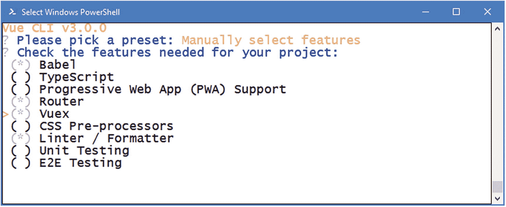

图 10-3

为示例项目选择功能

选择功能后，按 Enter 键。还提供了其他选项来配置您选择的一些功能。

### 配置棉绒机

第一个选项配置棉绒，该选项通过棉绒/格式器功能选择，如图 10-4 所示。


图 10-4

配置棉绒机

选择“仅带错误预防的 ESLint”选项。linter 负责检查项目以确保它符合编码标准，这个问题选择应用于项目的编码规则。我将在本章后面的“使用 Linter”部分解释每个选项的含义。下一个选项是选择何时将 linter 应用于项目中的源代码，如图 10-5 所示。


图 10-5

配置何时应用棉绒

此选项配置何时使用 linter 检查项目。选择“保存时 Lint”选项，每次保存项目中的文件时都会应用 Lint。

### 完成项目配置

一旦您选择了项目特性，将询问您想要什么风格的配置，如图 10-6 所示。


图 10-6

选择配置文件的样式

有两个选择。您可以选择为每个需要配置的特性使用单独的配置文件，或者您可以选择在`package.json`文件中包含所有的配置设置，该文件也用于跟踪应用所需的包。

选择`In package.json`选项，这会将项目特性的配置设置添加到`package.json`文件中，这与本书其他章节中使用的默认配置采用的方法相同。

按 Enter 键，最后一步是决定是否要保存您已经创建的配置，以便它可以用于在将来创建其他项目。对于这个问题，请按 Enter 键选择“否”,因为我在本书中创建的任何其他项目都不需要这个配置。

现在您已经回答了所有问题，项目将被创建，所需的包将被下载和安装。一个 Vue.js 项目需要很多包，初始设置可能需要一段时间才能完成。

## 了解项目结构

使用您喜欢的编辑器打开`projecttools`文件夹，您将看到如图 10-7 所示的项目结构。图中显示了我的首选编辑器显示由`vue create`命令创建的文件和文件夹的方式，但是您可能会看到一些细微的差异，这取决于您所选择的编辑器以及自编写本文以来对项目模板所做的任何更改。

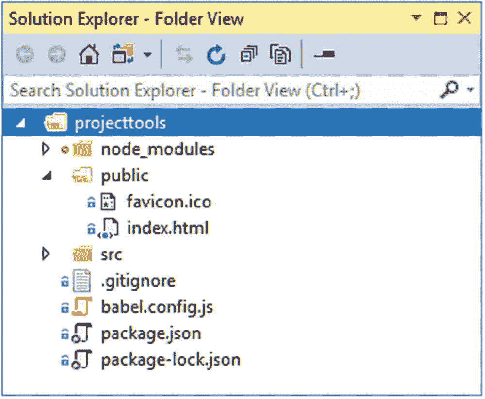

图 10-7

示例项目的结构

表 10-4 描述了项目中最重要的文件和文件夹及其支持的特性。

表 10-4

项目文件和文件夹

<colgroup><col class="tcol1 align-left"> <col class="tcol2 align-left"></colgroup> 
| 

名字

 | 

描述

 |
| --- | --- |
| `node_modules` | 该文件夹包含应用和开发工具所需的包，如“了解包文件夹”一节中所述。 |
| `public` | 该文件夹包含静态项目资源，例如没有合并到发送到浏览器的包文件中的图像，如“使用开发工具”一节中所述。 |
| `src` | 该文件夹包含 Vue.js 应用及其资源，它是开发过程中的主要焦点，如“了解源代码文件夹”一节所述。 |
| `.gitignore` | 该文件包含使用 Git 时从版本控制中排除的文件和文件夹的列表。 |
| `.babel.config.js` | 该文件包含 Babel 编译器的配置设置，我在“使用开发工具”一节中对此进行了描述。 |
| `package.json` | 该文件包含 Vue.js 开发所需的包列表以及用于开发工具的命令，这些在“了解包文件夹”一节中有所描述。 |
| `package-lock.json` | 该文件包含项目所需的包及其依赖项的完整列表，这确保了当您运行`npm install`命令时，您将会收到相同的一组包。 |

### 了解源代码文件夹

`src`文件夹是任何 Vue.js 项目最重要的部分，包含应用的 HTML 内容、源代码和其他资源。这个文件夹是大多数开发会议的焦点，图 10-8 显示了使用本章开头选择的特性创建的项目的`src`文件夹的内容。

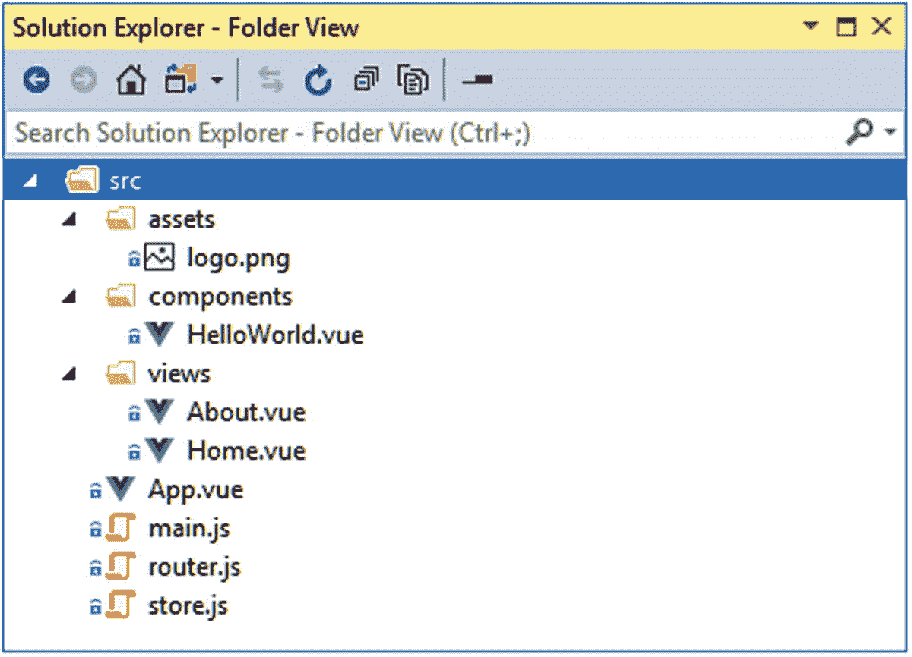

图 10-8

src 文件夹的内容

当您开始开发一个项目时，`src`文件夹的结构会变得更加复杂，但是占位符内容提供了足够的功能来开始并确保开发工具正常工作。我不打算详细描述`src`文件夹的内容，因为它是本书这一部分所有其他章节的主题，但是，为了完整起见，表 10-5 描述了创建新项目时添加的文件。

表 10-5

src 文件夹的初始内容

<colgroup><col class="tcol1 align-left"> <col class="tcol2 align-left"></colgroup> 
| 

名字

 | 

描述

 |
| --- | --- |
| `assets` | 该文件夹用于存放应用所需的静态资源，这些资源包含在绑定过程中，如“使用开发工具”一节中所述。`vue create`命令将包含 Vue.js 徽标的图像文件添加到该文件夹中。 |
| `components` | 该文件夹用于应用的组件。一个应用可以包含许多组件，附加文件夹通常用于对相关组件进行分组。`vue create`命令向这个名为`HelloWorld`的文件夹添加一个占位符组件。 |
| `views` | 此文件夹用于包含使用 URL 路由功能显示的组件。在本书的例子中，我没有遵循这个惯例，我更喜欢将所有组件分组到`components`文件夹中。 |
| `App.vue` | 这是根组件，通常用作自定义应用内容的起始点。 |
| `main.js` | 这是创建`Vue`对象的 JavaScript 文件，如第九章所述。 |
| `router.js` | 该文件用于配置 URL 路由系统，该系统用于选择向用户显示的组件。我在第 22–24 章中详细描述了路由特性，在这里，我遵循不同的惯例创建一个包含一个`index.js`文件的`router`文件夹，该文件包含配置语句，这样可以很容易地将配置分割成多个文件，作为单个 JavaScript 模块来处理。 |
| `store.js` | 该文件用于配置数据存储，数据存储用于在整个应用中共享数据。我在第二十章中描述了数据存储，在那里我遵循了创建包含`index.js`文件的`store`文件夹的不同惯例，这使得在大型应用中将配置分割成多个文件变得容易。 |

### 了解包文件夹

JavaScript 应用开发依赖于丰富的包生态系统，从包含将被发送到浏览器的代码的包，到在特定任务的开发过程中在后台使用的小包。Vue.js 项目中需要很多包。例如，本章开头创建的示例项目需要 900 多个包。

这些包之间有一个复杂的依赖层次结构，手工管理起来太困难了，只能用一个*包管理器*来处理。Vue.js 项目可以使用两个不同的包管理器来创建:NPM，它是节点包管理器，在第一章中与 Node.js 一起安装 Yarn，它是最近的一个竞争对手，旨在改进包管理。为简单起见，我在本书中通篇使用 NPM。

### 小费

你应该按照书中的例子使用 NPM，但如果你想在自己的项目中使用它，你可以在 [`https://yarnpkg.com`](https://yarnpkg.com) 找到纱的细节。

当创建一个项目时，包管理器会得到一个 Vue.js 开发所需的包的初始列表。包管理器检查每个包以获得它所依赖的包的集合。再次执行该过程以获得这些包的依赖项，并重复该过程，直到构建了项目所需的包的完整列表。包管理器下载并安装所有的包，并将它们安装到`node_modules`文件夹中。

使用`dependencies`和`devDependencies`属性在`package.json`文件中定义初始的一组包。`dependencies`属性用于列出应用运行所需的包。您可能会在您的项目中看到不同的细节，但这里是我的示例项目中的`package.json`文件的`dependencies`部分:

```js
...
"dependencies": {
    "vue": "².5.16",
    "vue-router": "³.0.1",
    "vuex": "³.0.1"
},
...

```

Vue.js 项目的`dependencies`部分只需要三个包:`vue`包包含主要特性，`vue-router`包包含我在第二十二章–24 章中描述的导航特性，`vuex`包包含我在第二十章中描述的数据存储特性。对于每个包，`package.json`文件包括可接受版本号的详细信息，使用表 10-6 中描述的格式。

表 10-6

软件包版本编号系统

<colgroup><col class="tcol1 align-left"> <col class="tcol2 align-left"></colgroup> 
| 

格式

 | 

描述

 |
| --- | --- |
| `2.5.16` | 直接表示版本号将只接受具有精确匹配版本号的包，例如 2.5.16。 |
| `*` | 使用星号表示接受要安装的任何版本的软件包。 |
| `>2.5.16 >=2.5.16` | 在版本号前面加上>或> =接受任何大于或等于给定版本的软件包版本。 |
| `<2.5.16 <= 2.5.16` | 在版本号前加上 |
| `~2.5.16` | 在版本号前加一个波浪号(~字符)接受要安装的版本，即使修补程序级别号(三个版本号中的最后一个)不匹配。例如，指定~2.5.16 将接受版本 2.5.17 或 2.5.18(将包含版本 2.5.16 的修补程序)，但不接受版本 2.6.0(将是新的次要版本)。 |
| `².5.16` | 在版本号前加一个插入符号(^字符)将接受版本，即使次要版本号(三个版本号中的第二个)或补丁号不匹配。例如，指定².5.16 将允许版本 2.5.17 和 2.6.0，但不允许版本 3.0.0。 |

在`package.json`文件的`dependencies`部分指定的版本号将接受较小的更新和补丁。当涉及到文件的`devDependencies`部分时，这种版本灵活性更加重要，该部分包含开发所需的包的列表，但这些包不是最终应用的一部分。这是我项目的`devDependencies`部分:

```js
...
"devDependencies": {
    "@vue/cli-plugin-babel": "³.0.0-beta.15",
    "@vue/cli-plugin-e2e-cypress": "³.0.0-beta.15",
    "@vue/cli-plugin-eslint": "³.0.0-beta.15",
    "@vue/cli-plugin-unit-mocha": "³.0.0-beta.15",
    "@vue/cli-service": "³.0.0-beta.15",
    "@vue/test-utils": "¹.0.0-beta.16",
    "chai": "⁴.1.2",
    "vue-template-compiler": "².5.16"
},
...

```

这些包提供了开发工具集。正如我在本章开始时提到的，在撰写本文时,`@vue/cli`包还处于测试阶段，你可以从包的版本号中看到这一点。

### 了解全球和本地包

软件包管理员可以安装软件包，使它们特定于单个项目(称为*本地安装*)或者可以从任何地方访问它们(称为*全局安装*)。很少有软件包需要全局安装，但有一个例外，那就是我在第一章安装的`@vue/cli`软件包，它是本书准备工作的一部分。`@vue/cli`包需要全局安装，因为它用于创建新的 Vue.js 项目。项目所需的单个包被本地安装到`node_modules`文件夹中。

当你创建一个 Vue.js 项目时，开发所需的所有包都被自动下载并安装到`node_modules`文件夹中，但是表 10-7 列出了一些你可能会发现在开发过程中有用的 NPM 命令。所有这些命令都应该在项目文件夹中运行，这个文件夹包含了`package.json`文件。

表 10-7

有用的 NPM 命令

<colgroup><col class="tcol1 align-left"> <col class="tcol2 align-left"></colgroup> 
| 

命令

 | 

描述

 |
| --- | --- |
| `npm install` | 该命令执行在`package.json`文件中指定的包的本地安装。 |
| `npm install package@version` | 该命令执行包的特定版本的本地安装，并更新`package.json`文件以将包添加到`dependencies`部分。 |
| `npm install --save-dev package@version` | 该命令执行包的特定版本的本地安装，并更新`package.json`文件以将包添加到`devDependencies`部分。 |
| `npm install --global package@version` | 此命令执行特定版本软件包的全局安装。 |
| `npm list` | 该命令列出了所有本地包及其依赖项。 |
| `npm run` | 该命令执行在`package.json`文件中定义的脚本之一，如下所述。 |

表 10-7 中描述的最后一个命令很奇怪，但是包管理器传统上包括对运行在`package.json`文件的`scripts`部分中定义的命令的支持。在 Vue.js 项目中，此功能用于提供对工具的访问，这些工具在开发过程中使用，并为应用的部署做准备。下面是示例项目中`package.json`文件的`scripts`部分:

```js
...
"scripts": {
    "serve": "vue-cli-service serve",
    "build": "vue-cli-service build",
    "lint": "vue-cli-service lint"
},
...

```

这些命令总结在表 10-8 中，我将在后面的章节中演示它们的用法。

表 10-8

package.json 文件的脚本部分中的命令

<colgroup><col class="tcol1 align-left"> <col class="tcol2 align-left"></colgroup> 
| 

名字

 | 

描述

 |
| --- | --- |
| `serve` | 该命令启动开发工具，如“使用开发工具”一节所述。 |
| `build` | 该命令执行构建过程，如“构建用于部署的应用”一节中所述。 |
| `lint` | 这个命令启动 JavaScript linter，如“使用 linter”一节所述。 |

表 10-8 中的命令通过使用`npm run`后跟您需要的命令名来运行，并且这必须在包含`package.json`文件的文件夹中完成。因此，如果您想在示例项目中运行`lint`命令，您可以导航到`projecttools`文件夹并键入`npm run lint`。

## 使用开发工具

添加到项目中的开发工具会自动检测更改，编译应用，并将文件打包以备浏览器使用。这些任务可以手动执行，但是自动更新会带来更愉快的开发体验。要启动开发工具，打开命令提示符，导航到`projecttools`文件夹，运行清单 10-2 中所示的命令。

```js
npm run serve

Listing 10-2Starting the Development Tools

```

开发工具使用的关键包叫做 *webpack* ，它是许多 JavaScript 开发工具和框架的主干。Webpack 是一个模块捆绑器，这意味着它打包了供浏览器使用的 JavaScript 模块，尽管这对于一个重要的功能来说是一个平淡无奇的描述，并且它是开发 Vue.js 应用时您将依赖的关键工具之一。

当您运行清单 10-2 中的命令时，当 webpack 准备运行示例应用所需的包时，您会看到一系列消息。Webpack 从`main.js`文件开始，加载所有有`import`或`require`语句的模块，以创建一组依赖关系。对`main.js`依赖的每个模块重复这个过程，webpack 继续在应用中工作，直到它拥有整个应用的一组完整的依赖项，然后将这些依赖项组合成一个文件，称为*包*。

在捆绑过程中，webpack 会报告其在模块中的工作过程，并找到需要包含在捆绑包中的模块，如下所示:

```js
...
10% building modules 4/7 modules 3 active ...\node_modules\webpack\hot\emitter.js
...

```

绑定过程可能需要一点时间，但是只需要在启动开发工具时执行。一旦完成了初始准备，您将会看到一条类似这样的消息，它告诉您应用已经被编译和绑定了:

```js
...
DONE  Compiled successfully in 2099ms

  App running at:
  - Local:   http://localhost:8080/
  - Network: http://192.168.0.77:8080/

Note that the development build is not optimized.
To create a production build, run npm run build.
...

```

打开一个新的浏览器选项卡并导航到`http://localhost:8080`以查看示例应用，如图 10-9 所示。

### 小费

你会注意到浏览器显示的网址是`http://localhost:8080/#/`。额外的角色是本章开始时添加到项目中的`vue-router`包的结果，我在第 22–24 章中详细描述了这个包。

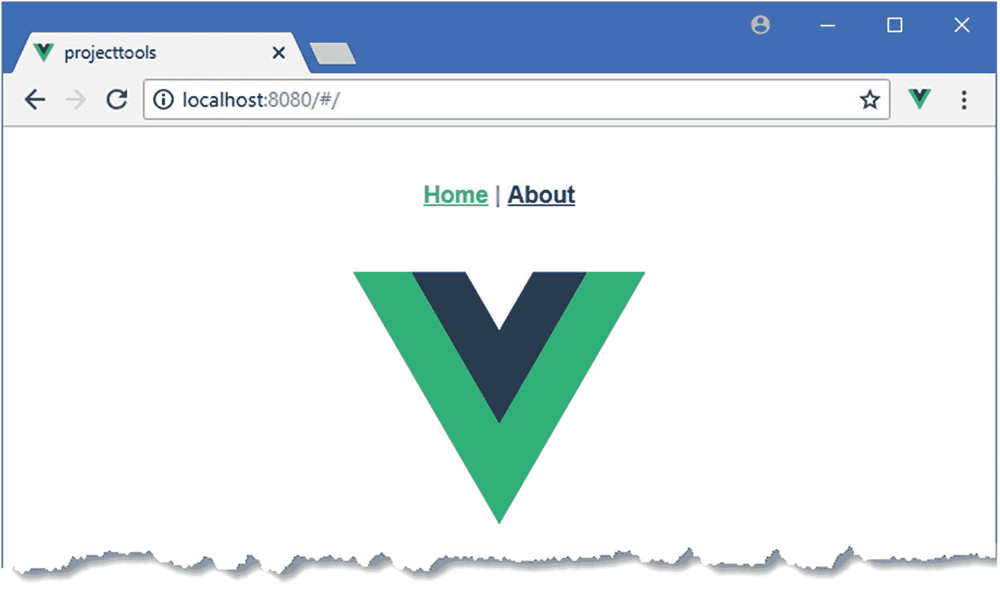

图 10-9

使用开发工具

### 了解编译和转换过程

虽然 webpack 专注于纯 JavaScript，但它的功能可以通过名为 *loaders* 的扩展来处理其他类型的内容。Vue.js 开发工具包括几个加载器，但是有两个特别值得注意。您不必直接使用这些加载器，因为它们会在开发过程中自动使用，但是了解它们的功能有助于理解 Vue.js 开发工具的功能。

第一个重要的加载器是`vue-loader`，它负责转换`.vue`文件中的混合内容，以便可以编译和打包供浏览器使用，这是能够在混合 HTML、JavaScript 和 CSS 内容的单个文件中定义组件的基础。另一个值得注意的加载器集成了 Babel 编译器，它负责将使用最新语言功能的 JavaScript 代码编译成在最广泛的浏览器上运行的 JavaScript，其中许多浏览器不支持这些功能。为了演示巴别塔的效果，我在`main.js`文件中添加了依赖于最新 JavaScript 特性的语句，如清单 10-3 所示。

```js
import Vue from 'vue'
import App from './App.vue'
import router from './router'
import store from './store'

Vue.config.productionTip = false

let first = "Hello";

const second = "World";

console.log(`Message ${first},${second}`);

new Vue({
  router,
  store,
  render: h => h(App)
}).$mount('#app')

Listing 10-3Adding Statements in the main.js File in the src Folder

```

这些语句使用三个最新的 JavaScript 特性向浏览器控制台写入消息:`let`关键字、`const`关键字和一个模板字符串。并非所有浏览器都支持这些特性，因此 Babel 用于转换 JavaScript 代码。

### 小费

当您保存对`main.js`文件的更改时，您将会在命令提示符下看到一条警告。这来自于 linter，我在“使用 Linter”一节中描述了它，现在可以忽略它。

由于 webpack 捆绑应用代码的方式，查看结果需要一些工作，但是如果您使用浏览器的 F12 开发人员工具的 Sources 选项卡，您应该能够浏览应用捆绑包的内容，这些内容在`webpack-internal`部分中提供。

### 小费

如果找不到编译好的源代码也不用担心。不是所有的浏览器都支持这个特性，也不是所有支持的浏览器都支持这个特性。需要理解的重要一点是，编译器会转换 JavaScript，以便即使不是所有的目标浏览器都支持现代特性，也可以使用它们。

在浏览器窗口中找到`main.js`文件，您将会看到清单 10-3 中的语句已经被转换成如下内容:

```js
...
var first = "Hello";
var second = "World";
console.log('Message' + first + ',' + second);
...

```

编译过程用`var`替换了`let`和`const`关键字，并用传统的字符串连接替换了模板字符串。结果是 JavaScript 代码将在 Vue.js 支持的所有浏览器中运行。

### 理解巴别塔的极限

Babel 是一个优秀的工具，但是它只处理 JavaScript 语言特性。Babel 不能在不支持最新 JavaScript APIs 的浏览器上增加对这些 API 的支持。您仍然可以使用这些 API——正如我在第一部分中使用本地存储 API 时所演示的那样——但是这样做限制了可以运行应用的浏览器的范围。

在清单 10-4 中，我注释掉了我在清单 10-3 中添加的语句，以防止项目工具显示警告消息。

```js
import Vue from 'vue'
import App from './App.vue'
import router from './router'
import store from './store'

Vue.config.productionTip = false

//let first = "Hello";

//const second = "World";

//console.log(`Message ${first},${second}`);

new Vue({
  router,
  store,
  render: h => h(App)
}).$mount('#app')

Listing 10-4Commenting Statements in the main.js File in the src Folder

```

### 了解开发 HTTP 服务器

为了简化开发过程，该项目包含了`webpack-dev-server`包，这是一个与 webpack 集成的 HTTP 服务器。开发 HTTP 服务器的默认端口是 8080，初始绑定过程一完成，服务器就开始监听 HTTP 请求。

当接收到 HTTP 请求时，开发 HTTP 服务器返回`public/index.html`文件的内容。在处理`index.html`文件时，开发服务器做了一个重要的添加，您可以通过在浏览器窗口中右键单击并从弹出菜单中选择 View Page Source 来查看。

```js
<!DOCTYPE html>
<html>
  <head>
    <meta charset="utf-8">
    <meta http-equiv="X-UA-Compatible" content="IE=edge">
    <meta name="viewport" content="width=device-width,initial-scale=1.0">
    <link rel="icon" href="/favicon.ico">
    <title>projecttools</title>
    <link as="script" href="/app.js" rel="preload">
  </head>
  <body>
    <noscript>
      <strong>
              We're sorry but projecttools doesn't work properly without
              JavaScript enabled. Please enable it to continue.
      </strong>
    </noscript>
    <div id="app"></div>
    <!-- built files will be auto injected -->
    <script type="text/javascript" src="/app.js"></script></body>

</html>

```

开发服务器添加了一个`script`元素，告诉浏览器加载一个名为`app.js`的文件，这是 webpack 在开发工具启动过程中创建的包的名称。然而，这个包并不仅仅包含应用代码，还有附加的特性被发送到浏览器，这些特性是 Vue.js 开发体验不可或缺的一部分，下面几节将对此进行描述。

### 了解热模型替换

webpack 创建的包包括对一个称为热模块替换(HMR)的特性的支持。当您对应用的源文件或内容文件进行更改时，webpack 及其加载程序会对更改后的文件进行处理、打包并发送给浏览器。在大多数情况下，只有很小的更改被发送到浏览器，并且应用被更新而不重置应用的状态。为了演示，我向`src`文件夹中的`App.vue`文件添加了一些 HTML 元素和一些 JavaScript 代码，如清单 10-5 所示。

```js
<template>
    <div id="app">
        <div>Button Clicks: {{ counter }}</div>

        <button v-on:click="incrementCounter">Press Me</button>

        <div id="nav">
            <router-link to="/">Home</router-link> |
            <router-link to="/about">About</router-link>
        </div>
        <router-view />
    </div>
</template>

<script>

export default {

    data() {

        return {

            counter: 0

        }

    },

    methods: {

        incrementCounter() {

            this.counter++;

        }

    }

}

</script>

<style>

    #app {
        font-family: 'Avenir', Helvetica, Arial, sans-serif;
        -webkit-font-smoothing: antialiased;
        -moz-osx-font-smoothing: grayscale;
        text-align: center;
        color: #2c3e50;
    }

    #nav {
        padding: 30px;
    }

        #nav a {
            font-weight: bold;
            color: #2c3e50;
        }

            #nav a.router-link-exact-active {
                color: #42b983;
            }
</style>

Listing 10-5Changing Content in the App.vue File in the src Folder

```

发送到浏览器的原始包包含打开一个返回到服务器的持久 HTTP 连接并等待指令的代码。当您保存对文件的更改时，您会看到在组件文件被转换、编译和绑定时，命令行上会显示一些消息。

然后使用持久 HTTP 连接告诉浏览器有一个替换模块可用，该模块被发送到浏览器并用于更新应用，如图 10-10 所示。

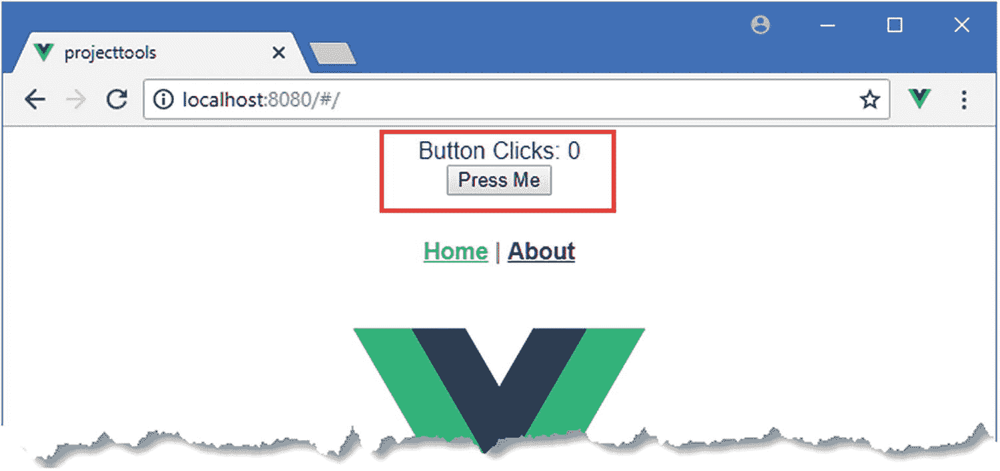

图 10-10

热模块更换功能

对于某些更改，HMR 功能可以更新应用，而无需重置其状态。这最适用于 HTML 元素的更改。在清单 10-6 中，我修改了用于向用户显示消息的元素。

```js
...
<template>
    <div id="app">
        <h1>Button Clicks: {{ counter }}</h1>

        <button v-on:click="incrementCounter">Press Me</button>
        <div id="nav">
            <router-link to="/">Home</router-link> |
            <router-link to="/about">About</router-link>
        </div>
        <router-view />
    </div>
</template>
...

Listing 10-6Making an HTML Change in the App.vue File in the src Folder

```

在将更改保存到`App.vue`文件之前，在浏览器中点击几次按钮，你会看到应用被更新，而不会丢失应用的状态，确保`counter`属性的值被保留，如图 10-11 所示。当您处理需要导航过程或要填写的表单的应用功能时，保留应用的状态非常有用，否则每次进行更改时都需要重新创建所需的状态。

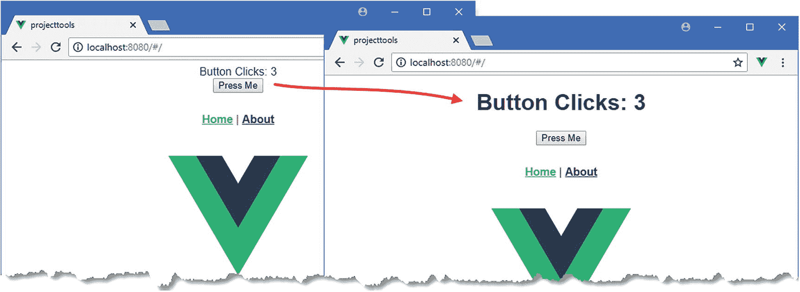

图 10-11

保持状态的更新

在不重置应用状态的情况下，并非所有更改都可以应用。如果你改变一个组件的`script`部分，那么 Vue.js 必须销毁现有的组件对象并创建一个新的。应用中其他组件的状态不受影响，但正在编辑的组件的状态会丢失。而且，在某些情况下，HMR 功能完全弄错了，您必须重新加载应用才能看到更改的效果。

### 了解错误显示

HMR 特性提供的即时性的一个影响是，在开发过程中，你会倾向于停止观看控制台输出，因为你的注意力会自然地被吸引到浏览器窗口。风险在于，当代码包含错误时，浏览器显示的内容保持不变，因为编译过程无法生成新的模块通过 HMR 功能发送给浏览器。

为了解决这个问题，webpack 开发的包中包含了一个集成的错误显示，可以在浏览器窗口中显示问题的详细信息。为了演示处理错误的方式，我将清单 10-7 中所示的语句添加到了`App.vue`文件的`script`元素中。

```js
...
<script>
export default {
    not a valid statement

    data() {
        return {
            counter: 0
        }
    },
    methods: {
        incrementCounter() {
            this.counter++;
        }
    }
}
</script>
...

Listing 10-7Creating an Error in the App.vue File in the src Folder

```

加法不是有效的 JavaScript 语句。保存对文件的更改后，构建过程会尝试编译代码，并在命令提示符下生成以下错误信息:

```js
...
ERROR  Failed to compile with 1 errors

 error  in ./src/App.vue

Syntax Error: Unexpected token, expected , (12:8)

  14 | export default {
> 15 |     not a valid statement
     |         ^
  16 |     data() {
  17 |         return {
  18 |             counter: 0
...

```

浏览器窗口中显示相同的错误消息，如图 10-12 所示，因此即使您没有注意命令行消息，也不可能意识不到存在问题。

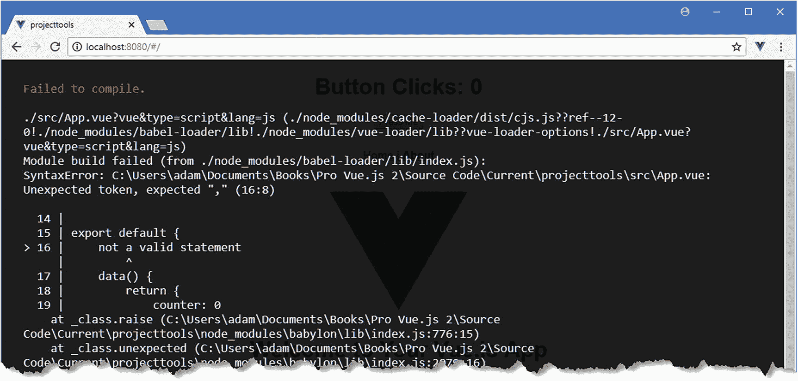

图 10-12

在浏览器窗口中显示错误

在清单 10-8 中，我已经注释掉了导致错误的语句，这使得应用的构建没有问题。

```js
...
<script>
export default {
    //not a valid statement

    data() {
        return {
            counter: 0
        }
    },
    methods: {
        incrementCounter() {
            //debugger;
            this.counter++;
        }
    }
}
</script>
...

Listing 10-8Commenting Out a Problem Statement in the App.vue File in the src Folder

```

## 使用棉绒

我在本章开始时为示例项目选择的特性包括一个 linter——ESLint 包——它负责检查项目以确保代码和内容符合一组规则。我为 linter 选择的配置意味着，每当检测到`src`文件夹中的文件发生变化时，它都会执行检查。

当您选择在设置 Vue.js 项目的过程中添加 linter 时，您会看到一组选项，这些选项决定了用于评估项目的一组规则。这些选项在表 10-9 中描述。

表 10-9

Vue.js Linter 规则选项

<colgroup><col class="tcol1 align-left"> <col class="tcol2 align-left"></colgroup> 
| 

[计]选项

 | 

描述

 |
| --- | --- |
| 仅错误预防 | 该选项仅适用于“基本的”Vue.js 规则和“推荐的”ESLint 规则，这两种规则都在表后描述。 |
| 爱彼迎（美国短租平台） | 该选项使用 Airbnb 开发的一套规则，这些规则在 [`https://github.com/airbnb/javascript`](https://github.com/airbnb/javascript) 有所描述。这些规则是对表后描述的“基本”Vue.js 规则的补充。 |
| 标准 | 该选项使用一组称为“标准”的规则在 [`https://github.com/standard/standard`](https://github.com/standard/standard) 对规则进行了描述。这些规则是对表后描述的“基本”Vue.js 规则的补充。 |
| 较美丽 | 该选项使用更漂亮的工具，用于强制代码格式化，如 [`https://prettier.io`](https://prettier.io) 所述。除了应用表后描述的“基本”Vue.js 规则之外，还执行格式化。 |

我在本章开始时选择了仅错误预防选项，这是可以选择的最宽松的规则集，它专注于识别可能导致错误的问题。其他选项超越了错误预防，加强了样式问题，这是我不喜欢也不愿意使用的东西。(我发现“标准”规则尤其令人沮丧，因为它们包括一长串格式规则；我对这种林挺的看法见《林挺的欢乐与痛苦》。)

### 林挺的快乐和痛苦

Linters 可能是一个强大的工具，特别是在一个技术和经验水平参差不齐的开发团队中。Linters 可以检测导致意外行为或长期维护问题的常见问题和细微错误。我喜欢这种林挺，我喜欢在完成一个主要的应用特性之后，或者在将代码提交到版本控制之前，通过林挺过程运行我的代码。

但是棉绒也可能成为分裂和冲突的工具。除了检测编码错误之外，linters 还可以用于执行关于缩进、括号放置、分号和空格的使用以及许多其他样式问题的规则。大多数开发人员都有自己坚持的风格偏好，并且相信其他人也应该如此。我当然喜欢:我喜欢缩进和左括号的四个空格在与它们相关的表达式的同一行上。我知道这些是编写代码的“唯一正确的方法”的一部分，例如，其他程序员喜欢两个空格的事实，自从我第一次开始编写代码以来，一直是我安静的惊奇的来源。

Linters 允许对格式有强烈看法的人强加给别人，通常打着“固执己见”的旗号。逻辑是开发人员花了太多时间争论不同的编码风格，每个人被迫以相同的方式编写会更好。我的经验是，开发人员会找到其他的东西来争论，而强制一种代码风格通常只是一个借口，使一个人的偏好对整个开发团队来说是强制性的。

我经常在读者无法获得书籍示例时帮助他们(如果你需要帮助，我的电子邮件地址是`adam@adam-freeman.com`)，我每周都会看到各种各样的编码风格。我知道，在我内心深处，任何不遵循我个人编码偏好的人都是完全错误的。但我没有强迫他们按照我的方式编码，而是让我的代码编辑器重新格式化代码，这是每个有能力的编辑器都提供的功能。

我的建议是少用林挺，把注意力放在会引起真正问题的问题上。将格式化决策留给个人，当您需要阅读由具有不同偏好的团队成员编写的代码时，依靠代码编辑器进行重新格式化。

当选择表 10-9 中描述的仅防误选项时，有两组规则适用。第一组规则由 ESLint 开发人员提供，另一组由 Vue.js 开发人员提供。

ESLint 规则在 [`https://eslint.org/docs/rules`](https://eslint.org/docs/rules) 有所描述，主要针对 JavaScript 编程中常见的一般性错误。正如您可能想象的那样，Vue.js 规则是特定于 Vue.js 开发的。有三套规则可用，如表 10-10 所述。每组规则的详细描述见 [`https://github.com/vuejs/eslint-plugin-vue`](https://github.com/vuejs/eslint-plugin-vue) 。

表 10-10

Vue.js 过磅规则级别

<colgroup><col class="tcol1 align-left"> <col class="tcol2 align-left"></colgroup> 
| 

名字

 | 

描述

 |
| --- | --- |
| 必要的 | 这些规则在很大程度上与正确使用指令有关。指令在第 12–15 章中描述。 |
| 强烈推荐 | 这些规则旨在帮助提高代码的可读性。它们主要与格式和布局问题有关。 |
| 被推荐的 | 这些规则旨在确保一致性。 |

默认情况下，基本规则是启用的，这意味着强烈建议和推荐的规则将被忽略。您可以通过更改`package.json`文件的`esLintConfig`部分来更改用于林挺的规则。这是本章开始时创建的`package.json`文件的一部分:

```js
...
"eslintConfig": {
    "root": true,
    "env": {
        "node": true
    },
    "extends": [
        "plugin:vue/essential",
        "eslint:recommended"
      ],
    "rules": {},
    "parserOptions": {
      "parser": "babel-eslint"
    }
},
...

```

配置文件的`extends`部分用于选择将要应用的规则集。Vue.js 特定规则的三个值是`plugin:vue/recommended`、`plugin:vue/strongly-recommended`和`plugin:vue/essential`，对应于表 10-10 中描述的规则。在清单 10-9 中，我启用了强烈推荐的规则。当您选择一组规则时，也会应用优先级较高的规则，因此选择推荐的规则也会强制执行强烈推荐的重要规则。

### 小费

如果您在创建项目时选择了将特性设置存储在单独的配置文件中的选项，那么您可以在`.eslintrc.json`文件而不是`package.json`文件中进行这些更改。

```js
...
"eslintConfig": {
    "root": true,
    "env": {
        "node": true
    },
    "extends": [
        "plugin:vue/strongly-recommended",

        "eslint:recommended"
    ],
    "rules": {},
    "parserOptions": {
        "parser": "babel-eslint"
    }
},
...

Listing 10-9Changing Vue.js Linting Rules in the package.json File in the projecttools Folder

```

对 linter 配置的更改只有在重新启动开发工具后才会生效。使用`Control+C`停止开发工具，并通过运行`projecttools`文件夹中清单 10-10 所示的命令再次启动它们。

```js
npm run serve

Listing 10-10Starting the Development Tools

```

linter 将作为构建过程的一部分运行。我在清单 10-9 中启用的一些规则与用作缩进的空格数有关，如果您遵循了我对清单的编码偏好，您将会看到如下警告:

```js
...
Module Warning (from ./node_modules/eslint-loader/index.js):
error: Expected indentation of 2 spaces but found 4 spaces (vue/html-indent) at src\App.vue:2:1:
  1 | <template>
> 2 |     <div id="app">
    | ^
  3 |         <h1>Button Clicks: {{ counter }}</h1>
  4 |         <button v-on:click="incrementCounter">Press Me</button>
...

```

根据您的编码风格，您可能看不到这个错误，但是您会看到这个错误，它涉及到我对清单 10-5 中的`App.vue`文件所做的更改:

```js
...
error: Expected '@' instead of 'v-on:' (vue/v-on-style) at src\App.vue:4:17:
  2 |     <div id="app">
  3 |         <h1>Button Clicks: {{ counter }}</h1>
> 4 |         <button v-on:click="incrementCounter">Press Me</button>
    |                 ^
  5 |
  6 |         <div id="nav">
  7 |             <router-link to="/">Home</router-link> |
...

```

正如我在第十四章中解释的那样，有两种方式来登记对某个事件的兴趣——短表和长表。强烈推荐的规则集中的一个规则强制使用短格式，并在使用长格式时发出警告。

### 小费

您可以使用`npm run lint`命令在正常构建过程之外运行 linter。

### 定制过磅规则

我收到警告的规则都不适合我的编码偏好。我是一个专门的四空格编码者，我更喜欢用于将 Vue.js 特性应用于 HTML 元素的长格式。但是，我可以重新配置或禁用我不想要的规则，而不是禁用整个规则集，并且仍然可以从我认为有用的规则中获益。在清单 10-11 中，我禁用了缩进规则，并更改了指示规则，以便它检查长格式而不是短格式。

```js
...
"eslintConfig": {
    "root": true,
    "env": {
        "node": true
    },
    "extends": [
        "plugin:vue/strongly-recommended",
        "eslint:recommended"
    ],
    "rules": {
        "vue/html-indent": "off",

        "vue/v-on-style": [ "warn", "longform" ]

    },
    "parserOptions": {
        "parser": "babel-eslint"
    }
},
...

Listing 10-11Configuring Rules in the package.json File in the projecttools Folder

```

每个规则都有自己的配置选项，可以在规则组的概要页面中看到，我在上一节中为这些规则组提供了 URL。在本例中，我配置了两个特定于 Vue.js 的规则。我将`vue/html-indent`规则设置为`off`，这将对组件的`template`元素中的 HTML 元素禁用缩进检查。我启用了`vue/v-on-style`规则，但是更改了它的配置，以便它接受我喜欢的长格式，并在使用短格式时生成警告。要查看更改的效果，请停止并再次启动开发工具。

### 禁用单个语句和文件的林挺

您可能会发现有个别语句会导致 linter 报告错误，但您无法更改。您可以在代码中添加一个注释，告诉 linter 忽略下一行的规则，而不是完全禁用该规则，如下所示:

```js
...
<!-- eslint-disable-next-line vue/v-on-style -->
...

```

如果想禁用下一条语句的所有规则，可以省略规则名，如下所示:

```js
...
<!-- eslint-disable-next-line  -->
...

```

如果您想要禁用整个文件的规则，那么您可以在 Vue.js 特定规则的文件顶部和 ESLint 规则的`script`元素顶部添加这样的注释:

```js
...
<!-- eslint-disable vue/v-on-style -->
...

```

如果您希望对单个文件的所有规则禁用林挺，则可以在注释中省略规则名称，如下所示:

```js
...
<!-- eslint-disable -->
...

```

这些注释允许您忽略那些不符合规则但不能更改的代码，同时仍然林挺项目的其余部分。您还可以将文件夹和文件类型添加到`package.json`文件中，以将其从林挺进程中排除。

## 调试应用

并不是所有的问题都能被编译器或 linter 检测到，能够完美编译的代码可能会以意想不到的方式运行。有两种方法可以理解您的应用的行为，如下面几节所述。

### 探索应用状态

Vue Devtools 浏览器扩展是探索 Vue.js 应用状态的优秀工具。谷歌 Chrome 和 Mozilla Firefox 都有可用的版本，你可以在 [`https://github.com/vuejs/vue-devtools`](https://github.com/vuejs/vue-devtools) 找到该项目的细节——包括自撰写本文以来对任何其他平台的支持。安装完扩展后，您将在浏览器的“开发人员工具”窗口中看到一个附加选项卡，可通过按 F12 按钮访问该选项卡(这也是这些工具也称为 F12 工具的原因)。

F12 工具窗口中的 Vue 选项卡允许您浏览和更改应用的结构和状态。您可以看到提供应用功能的一组组件以及每个组件提供的数据。对于示例应用，如果您打开 Vue 选项卡并在左窗格中展开应用结构，您将在右窗格中看到`App`组件的数据，包括我在清单 10-5 中定义的`counter`属性的值，如图 10-13 所示。

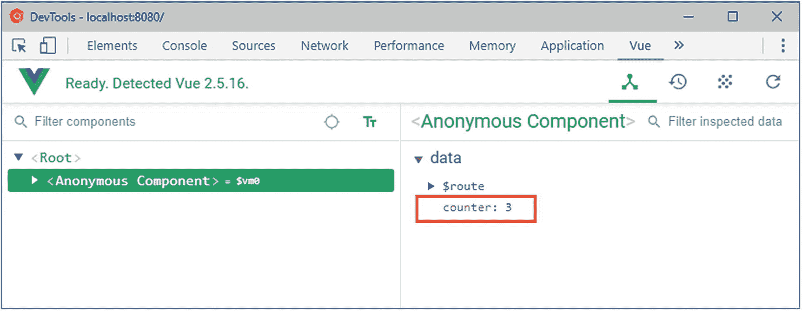

图 10-13

探索应用状态

您可以单击这些值来更改它们。这些更改会更新应用的动态数据模型，如果您更改的值通过数据绑定显示，这些更改会立即反映在浏览器中。

浏览器扩展还显示关于应用的 Vuex 商店的信息(我在第二十章中描述过)，应用触发的自定义事件的详细信息(我在第十四章中描述过)，以及 URL 路由系统的详细信息(我在第 22–24 章中描述过)。

### 使用浏览器调试器

现代浏览器包括复杂的调试器，可用于控制应用的执行并检查其状态。Vue.js 开发工具包括对创建源映射的支持，这允许浏览器将它正在执行的缩小和捆绑的代码与高效调试所需的开发人员友好的源代码相关联。

有些浏览器允许您使用这些源代码映射来浏览应用的源代码，并创建断点，当到达断点时，断点将暂停应用的执行，并将控制权交给调试器。当我写这篇文章时，创建断点的能力是一个脆弱的功能，在 Chrome 上不起作用，在其他浏览器上也有混合的可靠性。因此，将应用控制权传递给调试器的最可靠方式是使用 JavaScript `debugger`关键字，如清单 10-12 所示。

```js
<template>
    <div id="app">
        <h1>Button Clicks: {{ counter }}</h1>
        <button v-on:click="incrementCounter">Press Me</button>

        <div id="nav">
            <router-link to="/">Home</router-link> |
            <router-link to="/about">About</router-link>
        </div>
        <router-view />
    </div>
</template>

<script>
export default {
    data() {
        return {
            counter: 0
        }
    },
    methods: {
        incrementCounter() {
            debugger;

            this.counter++;
        }
    }
}
</script>

<style>

    /* ...styles omitted for brevity... */

</style>

Listing 10-12Triggering the Debugger in the App.vue File in the src Folder

```

应用将正常执行，但是当单击按钮并调用`incrementCounter`方法时，浏览器将遇到`debugger`关键字并停止执行。然后你可以使用 F12 工具窗口中的控件来检查执行停止点的变量及其值，并手动控制执行，如图 10-14 所示。浏览器正在执行由开发工具创建的缩小和捆绑的代码，但是显示来自源地图的相应代码。

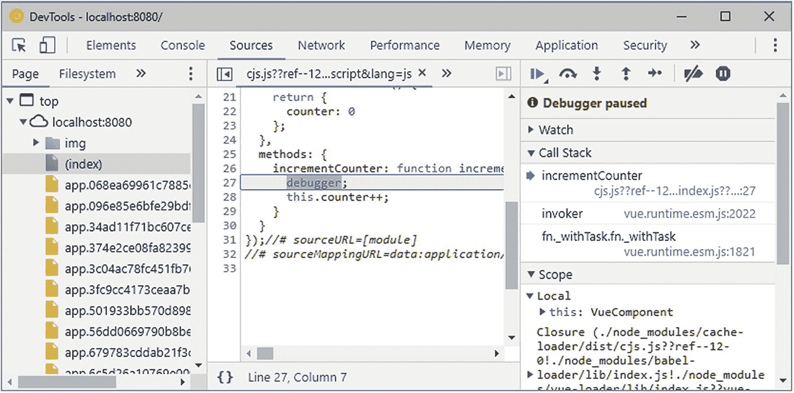

图 10-14

使用浏览器调试器

大多数浏览器会忽略`debugger`关键字，除非 F12 工具窗口是打开的，但是在调试会话结束时删除它是一个好习惯。默认的 linter 配置包括一个规则，当您为生产构建应用时，如果代码中留下了`debugger`关键字，就会发出警告，这将在下一节中描述。

## 配置开发工具

默认配置包含合理的设置，但是您可以更改配置以满足您的开发需求。通过在项目文件夹中添加一个名为`.vue.config.js`的文件或者在`package.json`文件中添加一个`vue`部分来定义配置更改。为了演示配置更改，我在`projecttools`文件夹中创建了`vue.config.js`文件，并添加了清单 10-13 中所示的内容。

```js
module.exports = {
    runtimeCompiler: true
}

Listing 10-13The Contents of the vue.config.js File in the projecttools Folder

```

这和我在第九章中所做的配置改变是一样的，它允许组件将它们的模板定义为字符串，而不是使用`template`元素。整套配置选项在 [`https://cli.vuejs.org/config/#vue-config-js`](https://cli.vuejs.org/config/#vue-config-js) 中描述，但表 10-11 描述了对大多数项目最有用的选项。

表 10-11

有用的配置选项

<colgroup><col class="tcol1 align-left"> <col class="tcol2 align-left"></colgroup> 
| 

名字

 | 

描述

 |
| --- | --- |
| `baseUrl` | 此选项用于指定 URL 前缀，当应用被部署为较大站点的一部分时，该前缀用于访问应用。默认的网址是`/`。 |
| `outputDir` | 该选项用于指定用于构建应用生产版本的目录，如“为部署构建应用”一节中所述默认目录是`dist`。 |
| `devServer` | 该选项用于使用 [`https://webpack.js.org/configuration/dev-server`](https://webpack.js.org/configuration/dev-server) 中描述的选项配置开发 HTTP 服务器。 |
| `runtimeCompiler` | 该选项启用运行时编译器，允许组件使用`template`属性定义它们的模板，但是增加了发送到浏览器的代码量。 |
| `chainWebpack` | 此选项用于配置 webpack。我在第二十一章中使用该配置选项来禁用 webpack 功能。 |

## 构建用于部署的应用

开发工具创建的文件不适合生产使用，并且包含额外的功能，例如支持热模块替换。当您准备好部署您的应用时，您必须创建一组只包含应用的代码和内容以及它们所依赖的模块的包，以便这些文件可以部署到生产 HTTP 服务器上。

根据您选择的特性，您可能需要执行一些配置更改来准备应用的部署，正如我在第八章中为 SportsStore 应用演示的那样。

对于本章的示例项目，如前一节所述，在部署之前移除关键字`debugger`是个好主意，因此在清单 10-14 中，我注释掉了`App.vue`文件中的`debugger`语句。

```js
...
<script>
export default {
    data() {
        return {
            counter: 0
        }
    },
    methods: {
        incrementCounter() {
            //debugger;

            this.counter++;
        }
    }
}
</script>
...

Listing 10-14Commenting Out the debugger Keyword in the App.vue File in the src Folder

```

我在清单 10-9 中启用的 linter 规则执行额外的检查，这些检查只有在您为生产而构建时才会被标记。你可能会发现这些警告很有用，但是我个人倾向于禁用它们，在清单 10-15 中，我已经返回到只使用基本的 Vue.js 林挺规则。

```js
...
"eslintConfig": {
    "root": true,
    "env": {
        "node": true
    },
    "extends": [
        "plugin:vue/essential",

        "eslint:recommended"
    ],
    "rules": {
        "vue/html-indent": "off",
        "vue/v-on-style": [ "warn", "longform" ]
    },
    "parserOptions": {
        "parser": "babel-eslint"
    }
  },
...

Listing 10-15Changing Linter Rules in the package.json File in the projecttools Folder

```

要创建生产版本，运行`projecttools`文件夹中清单 10-16 所示的命令。

```js
npm run build --modern

Listing 10-16Creating the Production Build

```

`--modern`参数是一个可选特性，它创建了应用的两个版本，其中一个版本专门用于支持最新 JavaScript 特性的现代浏览器，另一个版本用于需要额外代码和库来处理这些特性的旧浏览器。除了在构建应用时指定该选项之外，不需要任何进一步的操作，适当版本的选择会自动执行，如 [`https://cli.vuejs.org/guide/browser-compatibility.html#modern-mode`](https://cli.vuejs.org/guide/browser-compatibility.html#modern-mode) 所述。

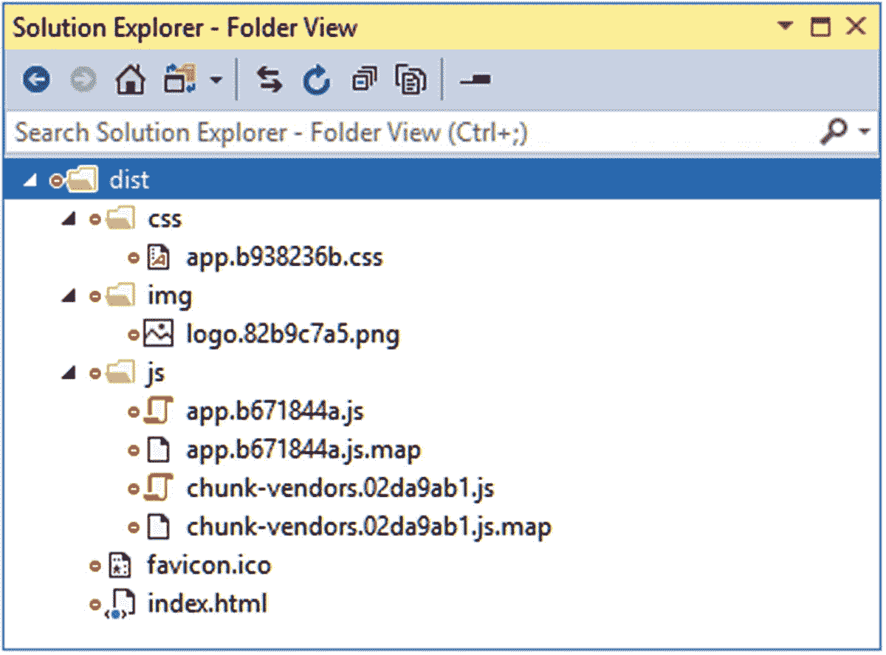

图 10-15

dist 文件夹的内容

构建过程可能需要一段时间才能完成，尤其是对于大型应用。构建过程的结果是一个`dist`文件夹，其中包含应用在部署时需要的所有文件，如图 10-15 所示。在您的项目中，各个文件的名称会有所不同。

`dist`文件夹包含将成为应用入口点的`index.html`文件，该文件包含将加载 JavaScript 和 CSS 文件的`link`和`script`元素，如下所示:

```js
<!DOCTYPE html>
<html>
<head>
    <meta charset=utf-8>
    <meta http-equiv=X-UA-Compatible content="IE=edge">
    <meta name=viewport content="width=device-width,initial-scale=1">
    <link rel=icon href=/favicon.ico>
    <title>projecttools</title>
    <link as= style href=/css/app.b938236b.css rel=preload>
    <link as=script href=/js/app.b671844a.js rel=preload>
    <link as=script href=/js/chunk-vendors.02da9ab1.js rel=preload>
    <link href=/css/app.b938236b.css rel=stylesheet>
</head>
<body>
    <noscript><strong>We're sorry but projecttools doesn't work properly without JavaScript enabled. Please enable it to continue.</strong></noscript><div id=app></div>
    <script src=/js/chunk-vendors.02da9ab1.js></script>
    <script src=/js/app.b671844a.js></script>
</body>
</html>

```

JavaScript 文件包括应用代码和它所依赖的 Vue.js 模块，不需要对 HTML 文件做进一步的添加。

### 安装和使用 HTTP 服务器

在一个真实的项目中，`dist`文件夹中的文件将被复制到生产 HTTP 服务器，该服务器可能运行在托管环境中或本地数据中心中。为了完成这一章，我将使用一个简单但功能强大的用 JavaScript 编写的 HTTP 服务器，它可以通过 NPM 下载和安装。

### 警告

开发过程中使用的 HTTP 服务器不适合生产使用。您必须使用不同的 web 服务器将您的应用交付给用户。

运行清单 10-17 中所示的命令来安装 Express 包和支持 URL 路由所需的相关包。

```js
npm install --save-dev express@4.16.3
npm install --save-dev connect-history-api-fallback@1.5.0

Listing 10-17Adding Packages for the Production Build

```

我在`projecttools`文件夹中添加了一个名为`server.js`的文件，并添加了清单 10-18 中所示的语句，这些语句配置了清单 10-17 中安装的包，因此它们将服务于示例应用。

```js
const express = require("express");
const history = require("connect-history-api-fallback");
const bodyParser = require('body-parser');

const app = express();
app.use(bodyParser.json());
app.use(history());
app.use("/", express.static("./dist"));

app.listen(80, function () {
    console.log("HTTP Server running on port 80");
});

Listing 10-18The Contents of the server.js File in the projecttools Folder

```

运行`projecttools`文件夹中清单 10-19 所示的命令来测试应用。

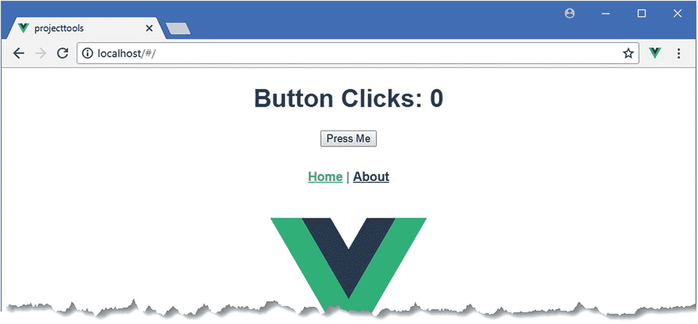

图 10-16

测试部署的应用

```js
node server.js

Listing 10-19Testing the Deployment Build

```

这个命令执行清单 10-18 中 JavaScript 文件中的语句，这些语句在端口 80 上设置一个 web 服务器并监听请求。要测试应用，导航到`http://localhost`，您将看到应用正在运行，如图 10-16 所示。

## 摘要

在本章中，我向您展示了如何使用`@vue/cli`包创建一个 Vue.js 项目，并解释了它提供的开发工具。我解释了如何构建项目，如何编译和捆绑应用，以及如何从编译器和可选的 linter 中报告错误。在本章的最后，我描述了可用于调试应用的工具，并演示了如何构建项目以准备部署。在下一章，我将描述 Vue.js 对数据绑定的支持。