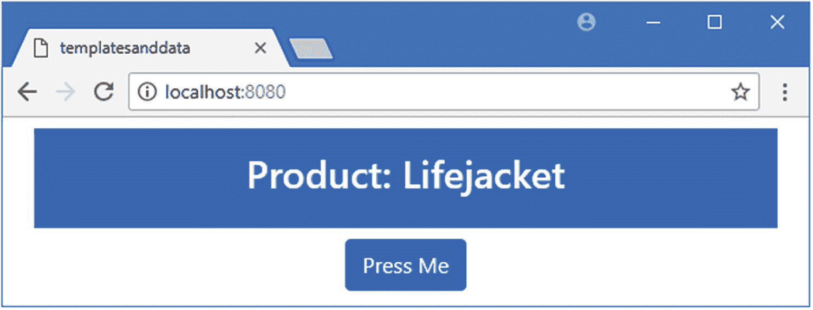
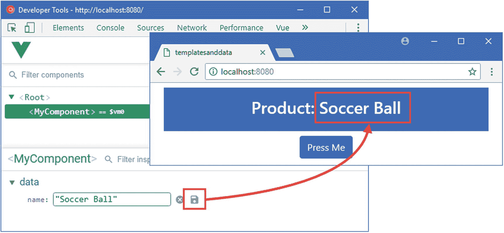
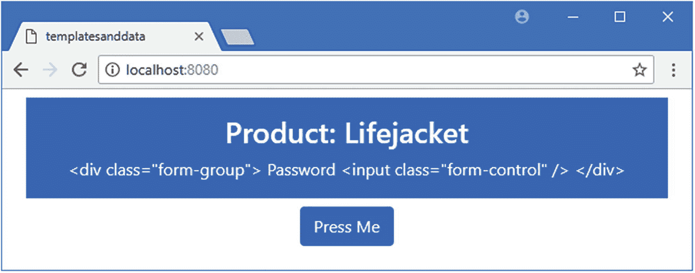
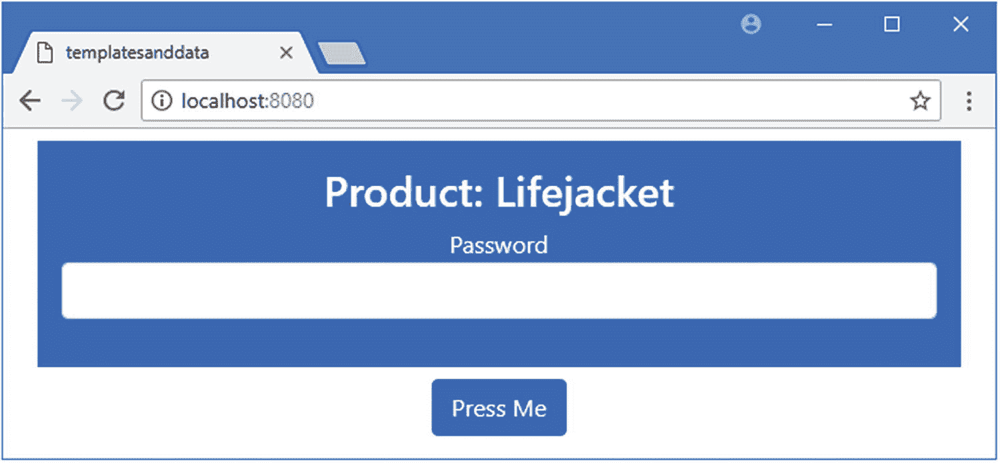
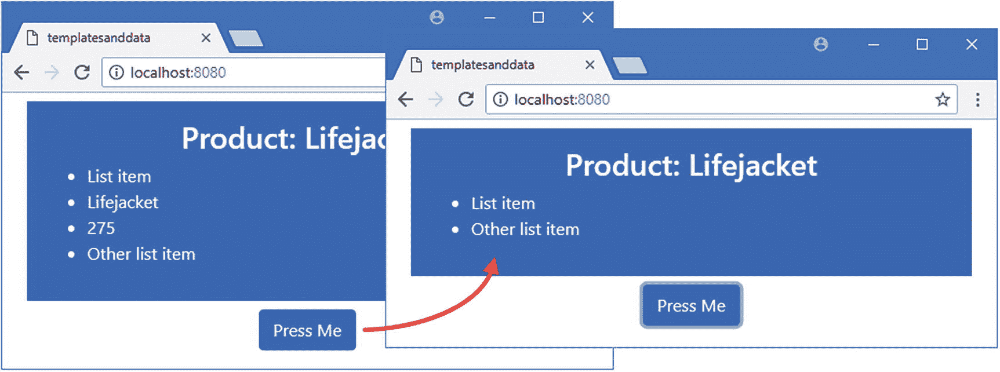
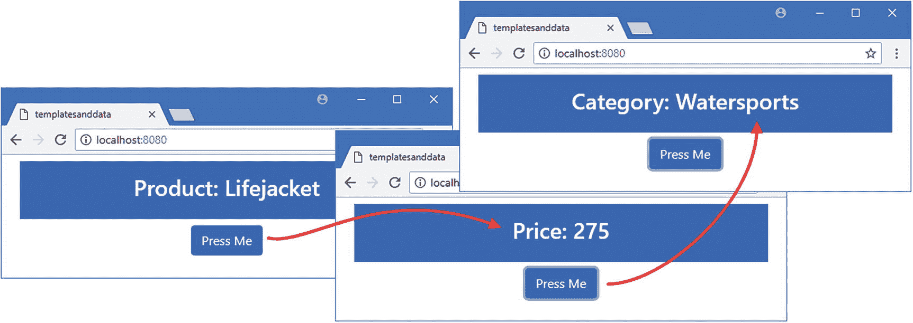
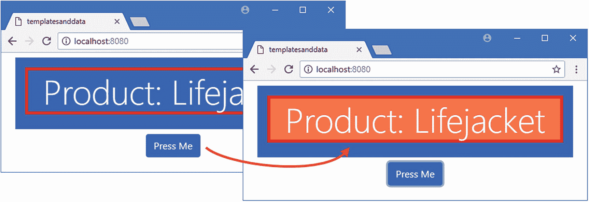

# 十二、使用基本指令

指令是将 Vue.js 功能应用于组件模板中 HTML 元素的特殊属性。在这一章中，我将解释如何使用 Vue.js 提供的基本内置指令，这些指令提供了一些 web 应用开发中最常用的特性。在第十三章–15 章中，我描述了更复杂的指令，在第二十六章中，我解释了当内置指令不提供您需要的特性时，如何创建自定义指令。表 12-1 将内置指令放在上下文中。

表 12-1

将内置指令放在上下文中

<colgroup><col class="tcol1 align-left"> <col class="tcol2 align-left"></colgroup> 
| 

问题

 | 

回答

 |
| --- | --- |
| 它们是什么？ | 内置指令提供了 web 应用开发中通常需要的特性。我在本章中描述的过滤器用于管理元素的文本或 HTML 内容，决定元素是否对用户可见，以及管理元素的属性。还有用于响应用户交互、重复内容和管理表单元素的指令，将在后面的章节中介绍。 |
| 它们为什么有用？ | 指令使得将组件的`script`元素中的数据和代码与其`template`中的内容联系起来变得容易。 |
| 它们是如何使用的？ | 指令作为名称以`v-`开头的特殊属性应用于 HTML 元素，例如`v-text`和`v-bind`。 |
| 有什么陷阱或限制吗？ | 有些内置指令很难使用，可能会产生意想不到的结果。对于后面章节中描述的指令来说，情况更是如此。 |
| 还有其他选择吗？ | 不。指令是连接组件的 HTML 元素和 JavaScript 代码的 Vue.js 构建块。 |

表 12-2 总结了本章内容。

表 12-2

章节总结

<colgroup><col class="tcol1 align-left"> <col class="tcol2 align-left"> <col class="tcol3 align-left"></colgroup> 
| 

问题

 | 

解决办法

 | 

列表

 |
| --- | --- | --- |
| 设置元素的文本内容 | 使用文本插值绑定或`v-text`指令 | three |
| 显示原始 HTML | 使用`v-html`指令 | 4–5 |
| 选择性显示元素 | 使用`v-if`、`v-else`或`v-show`指令 | 6, 9–13 |
| 选择性显示对等元素 | 将指令应用于一个`template`元素 | 7–8 |
| 设置属性和特性 | 使用`v-bind`指令 | 14–19 |

## 为本章做准备

在本章中，我继续使用在第十一章中创建的`templatesanddata`项目。为了准备本章，我简化了应用的根组件，如清单 12-1 所示。

### 小费

你可以从 [`https://github.com/Apress/pro-vue-js-2`](https://github.com/Apress/pro-vue-js-2) 下载本章以及本书其他章节的示例项目。

```js
<template>
    <div class="container-fluid text-center">
        <div class="bg-primary text-white m-2 p-3">
            <h3>Product: {{ name }}</h3>
        </div>
        <button v-on:click="handleClick" class="btn btn-primary">
            Press Me
        </button>
    </div>
</template>

<script>
    export default {
        name: "MyComponent",
        data: function () {
            return {
                name: "Lifejacket"
            }
        },
        methods: {
            handleClick() {
                // do nothing
            }
        }
    }
</script>

Listing 12-1Simplifying the Content of the App.vue File in the src Folder

```

我已经使用了文本插值绑定来显示名为`name`的`data`属性的值，如第十一章所述。我还添加了一个`button`元素，并对其应用了`v-on`指令，如下所示:

```js
...
<button v-on:click="handleClick" class="btn btn-primary">
...

```

正如我在第十四章中详细描述的那样，`v-on`指令用于处理事件。我在本章中描述的一些指令有一些有用的特性，这些特性只有在应用的状态改变时才能看到，我需要一种机制来触发这些改变。该指令被配置为通过调用一个名为`handleClick`的方法来响应`click`事件，该事件在用户单击`button`元素时被触发。我已经在组件的`script`元素的`methods`部分定义了这个方法，但是目前它不包含任何语句。在本章的后面，我将使用`handleClick`方法来演示一些有用的指令特性。保存对`App.vue`文件的更改，并运行`templatesanddata`文件夹中清单 12-2 所示的命令，启动 Vue.js 开发工具。

```js
npm run serve

Listing 12-2Starting the Development Tools

```

打开一个新的浏览器窗口并导航至`http://localhost:8080`以查看图 12-1 所示的内容。



图 12-1

运行示例应用

## 设置元素的文本内容

一个好的起点是最基本的指令，它执行您已经熟悉的任务:设置元素的文本内容。在清单 12-3 中，我用一个指令替换了组件模板中的文本插值绑定。

```js
<template>
    <div class="container-fluid text-center">
        <div class="bg-primary text-white m-2 p-3">
            <h3>Product: <span v-text="name"></span></h3>

        </div>
        <button v-on:click="handleClick" class="btn btn-primary">
            Press Me
        </button>
    </div>
</template>

<script>
    export default {
        name: "MyComponent",
        data: function () {
            return {
                name: "Lifejacket"
            }
        },
        methods: {
            handleClick() {
                // do nothing
            }
        }
    }
</script>

Listing 12-3Using a Directive in the App.vue File in the src Folder

```

这是`v-text`指令，以用于将指令应用于 HTML 元素的属性命名。图 12-2 显示了该指令及其应用的元素的剖析。


图 12-2

v-text 指令的剖析

使用一个`v-text`属性来应用该指令。该属性的值是一个表达式，Vue.js 对其求值以获得应该向用户显示的内容。这与我在第十一章中描述的文本插值绑定使用的表达式类型相同，这个绑定的结果是显示名为`name`的`data`属性的值。

与文本插值绑定不同，`v-text`指令完全替换了它所应用的元素的内容，这就是为什么我在清单 12-3 的模板中添加了一个`span`元素。

当检测到变化时，Vue.js 重新评估指令的表达式，这可以通过使用 Vue Devtools 在浏览器中改变`name`属性的值来测试，如图 12-3 所示。



图 12-3

值的变化对指令的影响

## 显示原始 HTML

文本插值绑定和`v-text`指令自动清理它们显示的内容，删除浏览器可能解释为 HTML 文档结构一部分的任何字符。净化数据值有助于防止跨站点脚本(XSS)攻击，在这种攻击中，浏览器将数据值解释为 HTML，并允许攻击者在浏览器中插入内容或代码。(你可以在 [`https://en.wikipedia.org/wiki/Cross-site_scripting`](https://en.wikipedia.org/wiki/Cross-site_scripting) 了解更多关于 XSS 攻击的工作原理。)为了演示，我添加了一个`data`属性，其内容是一个`script`元素，如清单 12-4 所示。

```js
<template>
    <div class="container-fluid text-center">
        <div class="bg-primary text-white m-2 p-3">
            <h3>Product: <span v-text="name"></span></h3>
            <span v-text="fragment"></span>

        </div>
        <button v-on:click="handleClick" class="btn btn-primary">
            Press Me
        </button>
    </div>
</template>

<script>
    export default {
        name: "MyComponent",
        data: function () {
            return {
                name: "Lifejacket",
                fragment: `<div class="form-group">

                             Password

                             <input class="form-control" />

                           </div>`

            }
        },
        methods: {
            handleClick() {
                // do nothing
            }
        }
    }
</script>

Listing 12-4Adding a Data Property in the App.vue File in the src Folder

```

新的`data`属性被称为`fragment`，它的值是一组包含一个`input`元素的 HTML 元素。在组件的模板中，我添加了一个`span`元素并应用了`v-text`绑定，该绑定将用`fragment`值替换元素的内容。当您保存更改时，应用将被更新，您将看到 HTML 的片段已经变得安全，如图 12-4 所示。



图 12-4

净化数据值

净化数据值是一个好主意，并且在处理用户提供的数据时非常重要。但是，当您处理可信任的内容时，有时您可能希望将其视为 HTML，而清理会阻止数据正确显示。对于这些情况，Vue.js 提供了`v-html`指令，我在清单 12-5 中使用了这个指令。

### 警告

除非您信任所显示数据的来源，否则不要使用此功能。

```js
...
<template>
    <div class="bg-primary text-white text-center m-2 p-3">
        <h3 v-text="name" >Product:<span v-text="name"></span></h3>
        <span v-html="fragment"></span>

    </div>
    <button v-on:click="handleClick" class="btn btn-primary">
        Press Me
    </button>
</template>
...

Listing 12-5Displaying HTML Content in the App.vue File in the src Folder

```

`v-html`指令的应用方式与`v-text`相同，但显示的数据值未经净化，如图 12-5 所示。如果没有净化，浏览器会将数据值解释为 HTML 元素，并向用户呈现一个`input`元素。



图 12-5

显示 HTML 数据值

## 选择性显示元素

组件显示的元素集经常需要更改，以适应组件状态的变化。Vue.js 包括一组指令，这些指令根据数据绑定表达式的计算结果来更改应用它们的 HTML 元素的可见性。在清单 12-6 中，我使用了`v-if`指令来控制 HTML 元素的可见性。

```js
<template>
    <div class="container-fluid text-center">
        <div class="bg-primary text-white m-2 p-3">
            <h3>Product: <span v-text="name"></span></h3>
            <h4 v-if="showElements">{{ price }}</h4>

        </div>
        <button v-on:click="handleClick" class="btn btn-primary">
            Press Me
        </button>
    </div>
</template>

<script>
    export default {
        name: "MyComponent",
        data: function () {
            return {
                name: "Lifejacket",
                price: 275,

                showElements: true

            }
        },
        methods: {
            handleClick() {
                this.showElements = !this.showElements;

            }
        }
    }
</script>

Listing 12-6Selectively Displaying Content in the App.vue File in the src Folder

```

在这个例子中，我将`v-if`指令应用于一个`h4`元素，如下所示:

```js
...
<h4 v-if="showElements">{{ price }}</h4>
...

```

该指令将评估其表达式，并使用结果来控制`h4`元素的可见性。如果表达式结果为真，则元素可见，否则隐藏(参见 JavaScript 真值的“理解真值和假值”侧栏)。结果是，当名为`showElements`的数据属性为`true`时，`h4`元素将可见，当其为`false`时，元素将隐藏。

我在`handleClick`方法中添加了一条语句，当点击按钮时，该语句切换`showElements`值，这演示了当表达式结果改变时，`v-if`指令改变了它所应用的元素的可见性，如图 12-6 所示。

### 小费

为了控制可见性，`v-if`指令销毁并重新创建元素及其内容，或者，如果元素是相同的类型，重用单个元素来显示不同的内容。这意味着只有可见的元素才是 DOM 的一部分。使用本章稍后描述的`v-show`指令在 DOM 中保留一个元素，并使用 CSS 属性管理其可见性。


图 12-6

控制元素的可见性

### 理解真理和谬误

像`v-if`这样的指令评估它们的表达式，以确定它们是真还是假，这是一个奇怪的 JavaScript 特性，经常导致混乱，并为粗心的人提供了一个陷阱。以下结果总是假的:

*   –值`false` ( `boolean`)

*   –`0`(数字)值

*   –空字符串(`""`)

*   –`null`

*   –`undefined`

*   –`NaN`(特殊数值)

所有其他值都是真实的，这可能会令人困惑。例如，`"false"`(内容为单词`false`的字符串)为 truthy。避免混淆的最好方法是只使用评估为`boolean`值`true`和`false`的表达式。

### 选择性地显示相邻的对等元素

使用`v-if`指令的标准方式是将它直接应用于可见性被管理的顶层元素。如果在同一个层次上有几个元素的可见性由同一个表达式控制，那么这种方法就变得很笨拙，如清单 12-7 所示。

```js
...
<template>
    <div class="container-fluid text-center">
        <div class="bg-primary text-white m-2 p-3">
            <h3>Product: <span v-text="name"></span></h3>
            <ul class="text-left">

                <li>List item</li>

                <li v-if="showElements">{{name}}</li>

                <li v-if="showElements">{{price}}</li>

                <li>Other list item</li>

            </ul>

        </div>
        <button v-on:click="handleClick" class="btn btn-primary">
            Press Me
        </button>
    </div>
</template>
...

Listing 12-7Applying the Same Directive to Peer Elements in the App.vue File in the src Folder

```

我想基于相同的数据绑定表达式来控制列表中四个`li`元素中的两个的可见性。重复应用指令是重复且容易出错的，最好避免。对于某些元素，这个问题可以通过添加一个中性元素作为公共父元素来解决，比如一个`div`或`span`元素，但这在这里不起作用，因为结果将是非法的 HTML ( `ul`元素不允许包含`div`或`span`元素)。

在这些情况下，`template`元素可以被用作公共父元素，如清单 12-8 所示。

```js
...
<template>
    <div class="container-fluid text-center">
        <div class="bg-primary text-white m-2 p-3">
            <h3>Product: <span v-text="name"></span></h3>
            <ul class="text-left">
                <li>List item</li>
                <template v-if="showElements">

                    <li>{{name}}</li>

                    <li>{{price}}</li>

                </template>

                <li>Other list item</li>
            </ul>
        </div>
        <button v-on:click="handleClick" class="btn btn-primary">
            Press Me
        </button>
    </div>
</template>
...

Listing 12-8Using a Template Element in the App.vue File in the src Folder

```

该指令应用于`template`元素，该元素在编译过程中被删除，不会导致非法的 HTML。结果是使用`v-if`指令的单个实例来管理相邻的`li`元素，结果如图 12-7 所示。

### 小费

您可以使用`v-for`指令和一个 computed 属性对不相邻的元素实现类似的效果。第十三章中描述了`v-for`指令。



图 12-7

使用模板元素将对等元素分组

### 在内容部分之间选择

如果你想显示基于数据值的替代内容，那么你可以重复`v-if`指令并否定其中一个表达式，如清单 12-9 所示。

```js
...
<template>
    <div class="container-fluid text-center">
        <div class="bg-primary text-white m-2 p-3">
            <h3 v-if="showElements">Product: {{name}}</h3>

            <h3 v-if="!showElements">Price: {{price}}</h3>

        </div>
        <button v-on:click="handleClick" class="btn btn-primary">
            Press Me
        </button>
    </div>
</template>
...

Listing 12-9Choosing Content to Display in the App.vue File in the src Folder

```

这种方法可行，但是很笨拙，当显示元素的标准改变时，您必须记住更新两个表达式。当表达式比检查值是否为`true`更复杂时，这种方法也会变得复杂。为了避免这种表达式，Vue.js 提供了`v-else`指令，它与`v-if`一起工作，不需要自己的表达式，如清单 12-10 所示。

```js
...
<template>
    <div class="container-fluid text-center">
        <div class="bg-primary text-white m-2 p-3">
            <h3 v-if="showElements">Product: {{name}}</h3>
            <h3 v-else>Price: {{price}}</h3>

        </div>
        <button v-on:click="handleClick" class="btn btn-primary">
            Press Me
        </button>
    </div>
</template>
...

Listing 12-10Simplifying Content Selection in the App.vue File in the src Folder

```

在`v-if`之后立即应用`v-else`指令，与`v-if`指令相反，它会自动改变它所应用到的元素的可见性，如图 12-8 所示。


图 12-8

在内容部分之间选择

#### 执行更复杂的选择

如果一个基本的 if/else 方法不够，那么您还可以使用`v-else-if`指令，它与`v-if`和`v-else`结合使用来选择元素，并且有自己的表达式。如果对`v-if`表达式求值的结果是`false`，则检查`v-else-if`指令的表达式，看其元素是否应该显示，如果不是，则显示`v-else`元素。可以使用`v-else-if`指令的多个实例来管理复杂的选择，如清单 12-11 所示。

```js
<template>
    <div class="container-fluid text-center">
        <div class="bg-primary text-white m-2 p-3">
            <h3 v-if="counter % 3 == 0">Product: {{name}}</h3>

            <h3 v-else-if="counter % 3 == 1">Price: {{price}}</h3>

            <h3 v-else>Category: {{category}}</h3>

        </div>
        <button v-on:click="handleClick" class="btn btn-primary">
            Press Me
        </button>
    </div>
</template>

<script>
    export default {
        name: "MyComponent",
        data: function () {
            return {
                name: "Lifejacket",
                price: 275,
                category: "Watersports",

                counter: 0

            }
        },
        methods: {
            handleClick() {
                this.counter++;

            }
        }
    }
</script>

Listing 12-11Performing a Complex Content Selection in the App.vue File in the src Folder

```

`v-if`和`v-else-if`指令的表达式依赖于一个`counter`属性，该属性的值在按钮被单击时递增。还有一个`v-else`指令，当其他两个指令表达式都为假时，将显示其元素，产生如图 12-9 所示的结果。



图 12-9

执行更复杂的选择

### 使用 CSS 有选择地显示元素

`v-if`、`v-else-if`和`v-else`指令隐藏元素，将它们从文档对象模型(DOM)中移除，并再次重新创建它们以使它们可见。结果是 DOM 只包含用户可见的元素，这可能是一个问题，尤其是在使用基于元素在父元素中的位置来选择元素的 CSS 样式时。清单 12-12 展示了可能出现的问题类型。

```js
<template>
    <div class="container-fluid text-center">
        <div class="bg-primary text-white m-2 p-3">
            <h3 v-if="counter % 2 == 0">Product: {{name}}</h3>

            <h3 v-else>Price: {{price}}</h3>

        </div>
        <button v-on:click="handleClick" class="btn btn-primary">
            Press Me
        </button>
    </div>
</template>

<script>
    export default {
        name: "MyComponent",
        data: function () {
            return {
                name: "Lifejacket",
                price: 275,
                counter: 0
            }
        },
        methods: {
            handleClick() {
                this.counter++;
            }
        }
    }
</script>

<style>

    h3:first-child { background-color: aquamarine; padding: 10px; color: black; }

</style>

Listing 12-12Adding Position-Specific CSS in the App.vue File in the src Folder

```

我已经简化了模板，所以只有两个 header 元素，我对它们应用了`v-if`和`v-else`指令。我还添加了一个`style`元素，它包含一个带有`h3:first-child`选择器的样式，该样式匹配作为其父元素的第一个子元素的`h3`元素。

当您保存更改并单击“按我”按钮时，您可以看到出现的问题。这些指令确保只有一个`h3`元素是可见的，但是由于不可见的元素被从 DOM 中移除，可见的元素是其父元素的第一个也是唯一的子元素，并且总是被 CSS 选择器匹配，如图 12-10 所示。

### 小费

您可能需要重新加载浏览器才能看到`style`元素的效果。


图 12-10

由位置 CSS 选择器匹配的元素

当 CSS 的意图是只改变显示产品名称的元素的样式属性时，这种行为是一个问题。这些样式不会影响 price 元素，因为它是模板中其父元素的第二个子元素，但是从 DOM 中移除不可见元素的方式会导致意外的结果。

在清单 12-12 中，我可以通过改变我的 CSS 选择器来解决这个问题，但是当处理应用于整个应用的全局样式或者使用第三方 CSS 框架比如 Bootstrap 时，这并不总是可能的。在这些情况下，`v-show`指令是一个合适的选择，因为它具有与`v-if`相同的效果，但是不会从 DOM 中删除不可见的元素。在清单 12-13 中，我已经对组件应用了`v-show`指令。

```js
...
<template>
    <div class="container-fluid text-center">
        <div class="bg-primary text-white m-2 p-3">
            <h3 v-show="counter % 2 == 0">Product: {{name}}</h3>

            <h3 v-show="counter % 2 != 0">Price: {{price}}</h3>

        </div>
        <button v-on:click="handleClick" class="btn btn-primary">
            Press Me
        </button>
    </div>
</template>
...

Listing 12-13Leaving Invisible Elements in the DOM in the App.vue File in the src Folder

```

`v-show`指令的应用方式与`v-if`相同，可用作直接替换。保存更改并点击按我按钮来增加计数器并使`v-show`指令显示和隐藏它们的内容。通过使用浏览器的 F12 工具在 DOM 中检查元素，您可以看到`v-show`是如何隐藏元素的，这将显示元素保留在 DOM 中，并且它们的 display 属性设置为 none，如下所示:

```js
...
<h3 style="display: none;">Price: 275</h3>
...

```

由于元素只是被隐藏，而不是被删除，组件的样式被应用，如图 12-11 所示。


图 12-11

隐藏元素

设置`display`属性可能比从 DOM 中移除一个元素更有效，但是`v-show`指令不能与`template`元素一起使用，也没有与`v-else-if`和`v-else`指令等价的指令，这就是为什么我不得不将`v-show`指令应用于两个`h3`元素。

## 设置元素的属性和特性

`v-bind`指令用于设置元素的属性或特性。我从关注属性开始这一部分，之后我将解释为什么属性是不同的。在清单 12-14 中，我使用了`v-bind`指令将元素分配给对应于引导 CSS 样式的类，这是`v-bind`指令最常见的用法。

```js
<template>
    <div class="container-fluid text-center">
        <div class="bg-primary text-white m-2 p-3">
            <h3 v-bind:class="elemClasses">Product: {{name}}</h3>

        </div>
        <button v-on:click="handleClick" class="btn btn-primary">
            Press Me
        </button>
    </div>
</template>

<script>
    export default {
        name: "MyComponent",
        data: function () {
            return {
                name: "Lifejacket",
                highlight: false

            }
        },
        computed: {

            elemClasses() {

                return this.highlight

                    ? ["bg-light", "text-dark", "display-4"]

                    : ["bg-dark", "text-light", "p-2"];

            }

        },

        methods: {
            handleClick() {
                this.highlight = !this.highlight;

            }
        }
    }
</script>

Listing 12-14Assigning Elements to Classes in the App.vue File in the src Folder

```

这个例子看起来比实际更复杂。起点是指令，我将它应用于`h3`元素，如下所示:

```js
...
<h3 v-bind:class="elemClasses">Product: {{name}}</h3>
...

```

`v-bind`指令配置了一个参数和一个表达式，如图 12-12 所示。参数指定指令将配置的元素属性，对表达式求值将提供该属性的值。


图 12-12

v-bind 指令的剖析

在清单 12-14 中，指令的表达式获取一个计算属性的值，该属性返回一个样式数组，该数组的内容由名为`highlight`的`data`属性的值决定。这看起来像是一种间接的设置样式的方式，但是它展示了一种灵活的方式，可以将 Vue.js 特性结合起来管理呈现给用户的内容。要查看效果，保存对`App.vue`文件的更改并点击按我按钮切换`highlight`属性的值，产生如图 12-13 所示的结果。


图 12-13

设置元素的 class 属性

单击该按钮可以在两组类之间更改主体元素的成员资格。当`highlight`属性为`true`时，宿主元素是`bg-light`、`text-dark`和`display-4`类的成员(浅背景色、深色文本和大字体)。当`highlight`属性为`false`时，宿主元素是`bg-dark`、`text-light`和`p-2`类的成员(深色背景色、浅色文本和额外填充)。

### 使用指令速记

`v-bind`指令有两种形式。我在前面的例子中使用的是手写形式，它结合了指令名、冒号和要配置的属性名。简写形式省略了指令名，这样`v-bind:class`也可以表示为`:class`。这意味着像这样的指令:

```js
...
<h3 v-bind:class="elemClasses">Product: {{name}}</h3>
...

```

也可以这样应用:

```js
...
<h3 :class="elemClasses">Product: {{name}}</h3>
...

```

在长格式和简写格式之间的选择是个人喜好，不会改变指令的行为方式。

### 使用对象配置类

如果有多个输入来决定主机元素应该属于哪一组类，那么我在上一节中使用的数组语法可能会变得难以管理。指令`v-bind`也可以使用一个对象，其属性名对应于类，其值决定了主机元素的类成员资格，如清单 12-15 所示。

```js
<template>
    <div class="container-fluid text-center">
        <div class="bg-primary text-white m-2 p-3">
            <h3 v-bind:class="elemClasses" class="display-4">Product: {{name}}</h3>

        </div>
        <button v-on:click="handleClick" class="btn btn-primary">
            Press Me
        </button>
        <button v-on:click="handleOtherClick" class="btn btn-primary">

            Or Press Me

        </button>

    </div>
</template>

<script>
    export default {
        name: "MyComponent",
        data: function () {
            return {
                name: "Lifejacket",
                highlight1: false,
                highlight2: false

            }
        },
        computed: {
            elemClasses() {
                return {

                    "text-dark": this.highlight1,

                    "bg-light": this.highlight2

                }

            }
        },
        methods: {
            handleClick() {

                this.highlight1 = !this.highlight1;

            },

            handleOtherClick() {

                this.highlight2 = !this.highlight2;

            }

        }
    }
</script>

Listing 12-15Using an Object to Control Class Membership with the App.vue File in the src Folder

```

我添加了另一个`button`元素和一个切换`data`属性值的方法。`elemClasses`计算属性返回这样一个对象:

```js
...
return {
    "text-dark": this.highlight1,
    "bg-light": this.highlight2
}
...

```

对象属性名根据两个数据属性的值控制主机元素的`bg-light`和`text-dark`类的成员资格。`v-bind`指令将其主机元素添加到那些对应于值为`true`的属性的类中，并从其他类中移除该元素。

### 小费

我将清单 12-15 中的计算属性返回的对象中的属性名放在引号中。Bootstrap CSS 框架使用的类名包含连字符，只有用引号括起来时，才允许在对象属性名中使用连字符。

我仍然能够在模板中为那些类使用`class`属性，主机元素应该总是这些类的成员。

```js
...
<h3 v-bind:class="elemClasses" class="display-4">Product: {{name}}</h3>
...

```

结果是`h3`元素将始终是`display-4`类的成员，并根据按钮切换的值属于`bg-light`和`text-dark`类，如图 12-14 所示。


图 12-14

使用对象配置类成员资格

### 设置个人风格

`v-bind`属性为设置`style`属性提供了与类相同的特性，这意味着可以管理单个 CSS 样式属性。在清单 12-16 中，我使用了该指令来控制不同样式属性的值。

```js
<template>
    <div class="container-fluid text-center">
        <div class="bg-primary text-white m-2 p-3">
            <h3 v-bind:style="elemStyles" class="display-4">Product: {{name}}</h3>

        </div>
        <button v-on:click="handleClick" class="btn btn-primary">
            Press Me
        </button>
    </div>
</template>

<script>
    export default {
        name: "MyComponent",
        data: function () {
            return {
                name: "Lifejacket",
                highlight: false,

            }
        },
        computed: {
            elemStyles() {

                return {

                    "border": "5px solid red",

                    "background-color": this.highlight ? "coral": ""

                }

            }

        },
        methods: {
            handleClick() {
                this.highlight = !this.highlight;

            }
        }
    }
</script>

Listing 12-16Managing the Style Attribute in the App.vue File in the src Folder

```

`elemStyles` computed 属性返回一个属性名为 CSS 属性名的对象。`border`属性是一个常量值，但是`background-color`属性是由`highlighted`属性的值决定的，该值在单击按钮时会改变。随着数据属性的改变，`h3`元素上的`background-color`属性的值也会改变，如图 12-15 所示。



图 12-15

设置单个样式属性

### 设置其他属性

`v-bind`指令可以用来设置任何属性的值，尽管没有对允许使用对象和数组的`class`和`style`属性的特殊支持。在清单 12-17 中，我使用了`v-bind`指令来设置与`style`元素中定义的选择器相匹配的自定义属性的值。

```js
<template>
    <div class="container-fluid text-center">
        <div class="bg-primary text-white m-2 p-3">
            <h3 v-bind:data-size="size" class="display-4">Product: {{name}}</h3>

        </div>
        <button v-on:click="handleClick" class="btn btn-primary">
            Press Me
        </button>
    </div>
</template>

<script>
    export default {
        name: "MyComponent",
        data: function () {
            return {
                name: "Lifejacket",
                highlight: false,
            }
        },
        computed: {
            size() {

                return this.highlight ? "big" : "small";

            }

        },
        methods: {
            handleClick() {
                this.highlight = !this.highlight;
            }
        }
    }
</script>

<style>

    [data-size=big] { font-size: 40pt; }

    [data-size=small] { font-size: 20pt; }

</style>

Listing 12-17Setting a Custom Attribute in the App.vue File in the src Folder

```

HTML 规范允许名称以`data-`开头的定制属性应用于任何元素。当使用 Vue.js 时，您不需要在自定义属性前加上前缀`data-`，但是当容易地识别特定于我的应用的属性很重要时，这是我遵循的惯例。

在这个例子中，我使用了`v-bind`指令来管理一个自定义`data-size`属性的值，该属性的值取自一个名为`size`的计算属性，该属性返回`big`或`small`。这些值对应于`style`元素中的选择器，它改变字体大小，产生如图 12-16 所示的结果。

### 小费

您可能需要重新加载浏览器才能看到清单 12-17 中`style`元素的效果。


图 12-16

设置自定义属性

### 设置多个属性

单个`v-bind`指令可以设置多个属性。将指令应用于其宿主元素时，不使用任何参数。相反，表达式必须产生一个对象，其属性名代表要配置的属性，如清单 12-18 所示。

```js
<template>
    <div class="container-fluid text-center">
        <div class="bg-primary text-white m-2 p-3">
            <h3 v-bind="attrValues">Product: {{name}}</h3>

        </div>
        <button v-on:click="handleClick" class="btn btn-primary">
            Press Me
        </button>
    </div>
</template>

<script>
    export default {
        name: "MyComponent",
        data: function () {
            return {
                name: "Lifejacket",
                highlight: false,
            }
        },
        computed: {
            attrValues() {

                return {

                    class: this.highlight ? ["bg-light", "text-dark"] : [],

                    style: {

                        border: this.highlight ? "5px solid red": ""

                    },

                    "data-size": this.highlight ? "big" : "small"

                }

            }

        },
        methods: {
            handleClick() {
                this.highlight = !this.highlight;
            }
        }
    }
</script>

<style>
    [data-size=big] { font-size: 40pt; }
    [data-size=small] { font-size: 20pt; }
</style>

Listing 12-18Setting Multiple Attributes in the App.vue File in the src Folder

```

由`attrValues` computed 属性返回的对象定义了`class`、`style`和`data-size`属性，这些属性的值由名为`highlight`的数据属性的值决定，单击按钮即可切换。当`highlight`值为`false`时，指令所应用的`h3`元素配置如下:

```js
...
<h3 class="" style="" data-size="small">Product: Lifejacket</h3>
...

```

当`highlight`值为`true`时，`v-bind`指令修改元素如下:

```js
...
<h3 class="bg-light text-dark" style="border: 5px solid red;" data-size="big">
    Product: Lifejacket
</h3>
...

```

一个绑定管理多个属性，产生如图 12-17 所示的结果。


图 12-17

用单个绑定管理多个属性

### 设置 HTMLElement 属性

默认情况下，`v-bind`指令配置主机元素的属性，如前面的示例所示。也可以使用`v-bind`指令来设置文档对象模型中表示元素的对象的属性值。

当浏览器处理 HTML 文档时，它创建文档对象模型并用表示 HTML 元素的对象填充它。这些对象定义了与 HTML 元素支持的属性不对应的属性，或者是因为它们提供了专门的特性，或者是因为 HTML 和 DOM 规范中的一些奇怪之处，这些并没有得到很好的管理。

在大多数项目中，你并不需要这个特性，但是如果你发现设置一个属性并不能得到需要的结果，那么你可以在`v-bind`指令中使用`prop`修饰符，如清单 12-19 所示。

```js
<template>
    <div class="container-fluid text-center">
        <div class="bg-primary text-white m-2 p-3">
            <h3 v-bind:text-content.prop="textContent"></h3>

        </div>
        <button v-on:click="handleClick" class="btn btn-primary">
            Press Me
        </button>
    </div>
</template>

<script>
    export default {
        name: "MyComponent",
        data: function () {
            return {
                name: "Lifejacket",
                highlight: false,
            }
        },
        computed: {
            textContent() {

                return this.highlight ? "Highlight!" : `Product: ${this.name}`;

            }

        },
        methods: {
            handleClick() {
                this.highlight = !this.highlight;
            }
        }
    }
</script>

Listing 12-19Setting an Element Property in the App.vue File in the src Folder

```

将指示词套用至元素时，修饰词会用在属性名称之后，以句点分隔，如下所示:

```js
...
<h3 v-bind:text-content.prop="textContent">Product: {{name}}</h3>
...

```

这个配置告诉`v-bind`指令管理名为`text-content`的对象属性的值。`text-content`属性提供了对元素文本内容的访问，本例设置了`h3`元素的内容，如图 12-18 所示。

### 了解元素属性

Mozilla Foundation 为所有用于在 DOM 中表示 HTML 元素的对象提供了一个有用的参考。对于每个元素，Mozilla 提供了可用属性的摘要以及每个属性的用途。从`HTMLElement` ( `developer.mozilla.org/en-US/docs/Web/API/HTMLElement`)开始，它提供了所有元素共有的功能。然后，您可以分支到特定元素的对象中，比如用于表示`input`元素的`HTMLInputElement`。


图 12-18

设置元素属性

## 摘要

在这一章中，我描述了 Vue.js 为处理 HTML 元素提供的一些内置指令。我向您展示了如何使用`v-text`和`v-html`指令管理元素的内容，如何使用`v-if`和`v-show`指令选择性地显示内容，以及如何使用`v-bind`指令设置元素的属性。在下一章中，我将描述用于为数组中的每一项重复内容的指令。