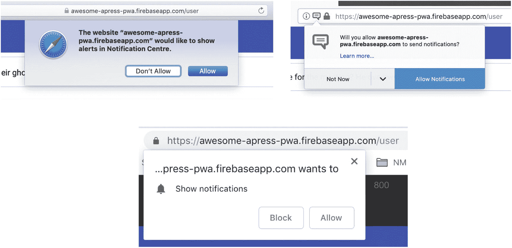
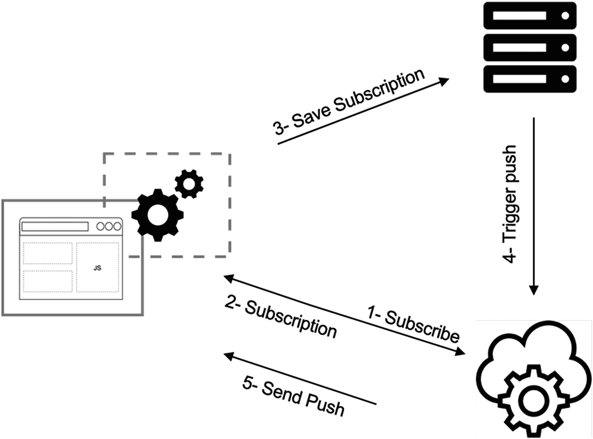
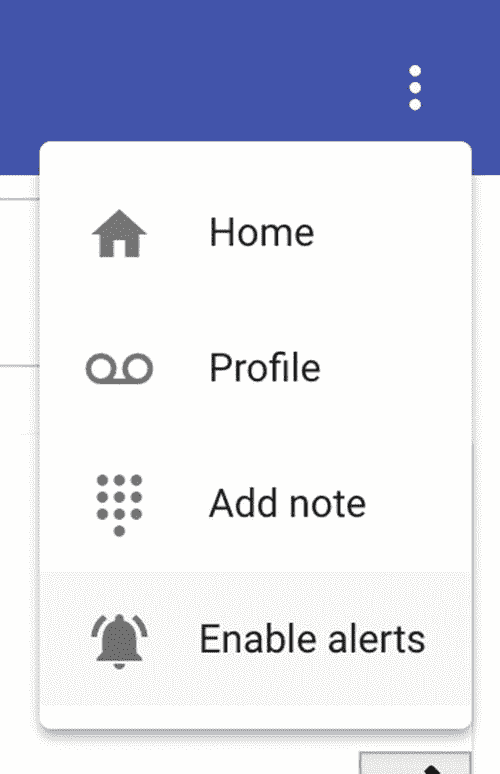
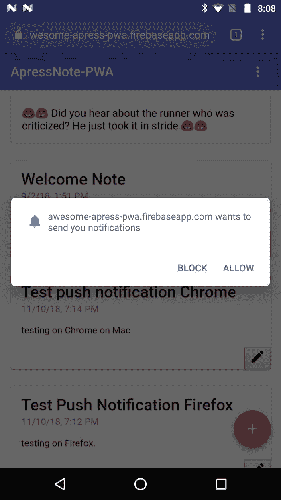
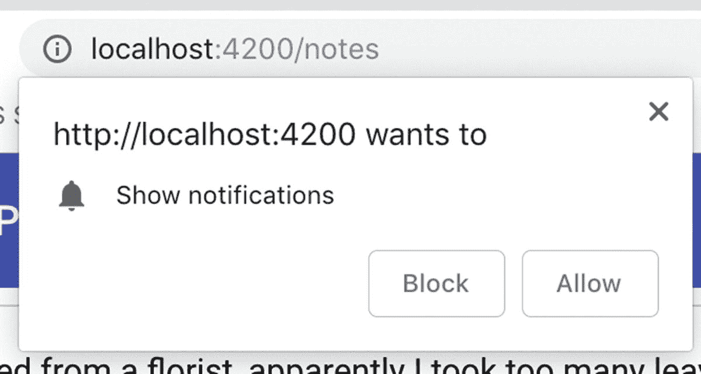
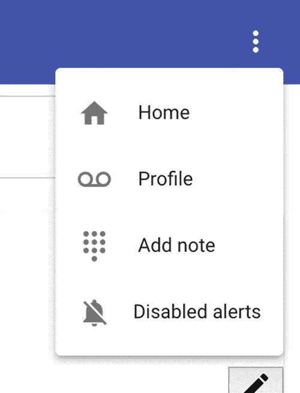
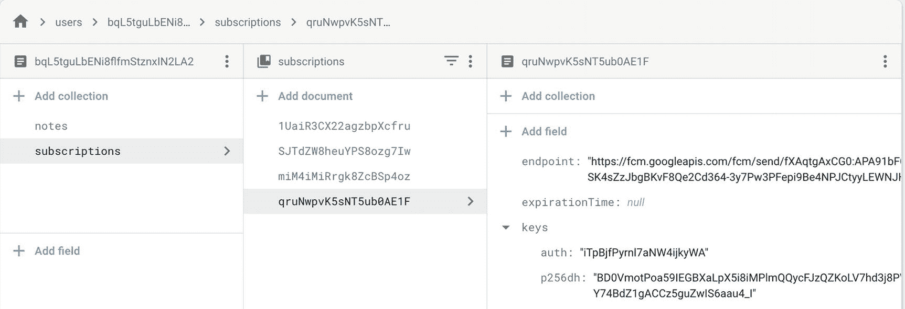
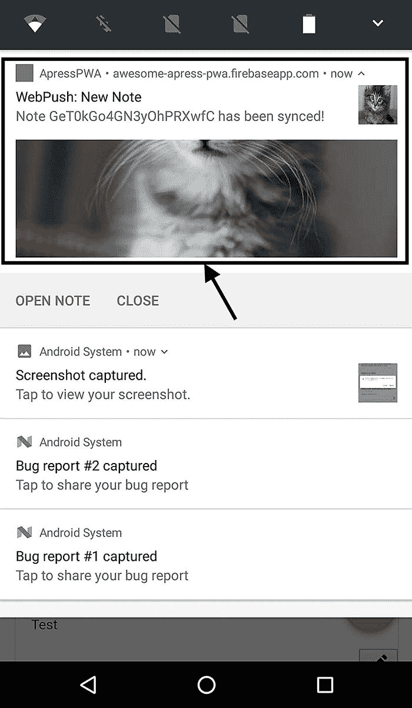
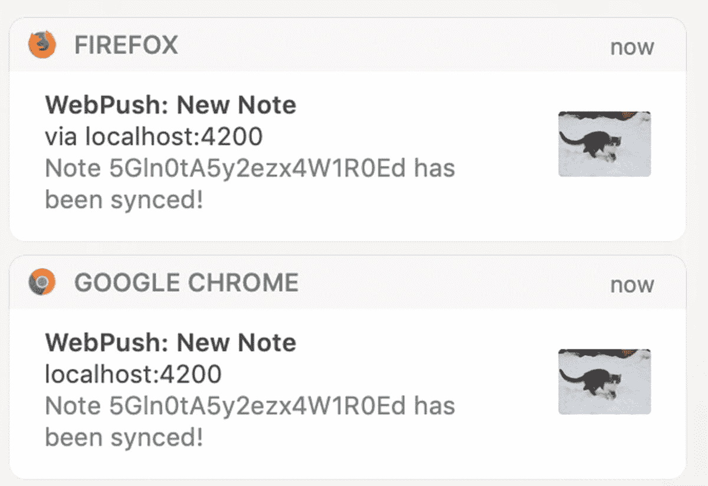

# 八、推送通知

有不同的方法让你的用户参与进来并保持更新，比如通过电子邮件、应用内通知和推送通知！长期以来，本地移动应用一直通过推送通知来吸引用户。直到 PWAs 诞生，这个功能才在 web 上得到支持。多亏了新的标准 API，比如 Notification API 和 Push API，它们都是建立在 Service Worker 之上的，这使得向 web 用户发送推送通知成为可能。

在这一章中，您将发现推送通知的基础知识，并将为现有的应用 PWA Note 构建一个工作示例。您将看到我们如何编写 Firebase Cloud 函数来从服务器发送推送通知。总之，在学完这一章之后，你应该能够运行自己的服务器来发送推送通知，并且很快就能在 Angular 中实现这个特性。

## 推送通知简介

大多数现代网络应用将通过不同的渠道，如社交媒体、电子邮件和应用内通知，保持用户更新和沟通。虽然所有这些渠道都很棒，但它们并不总能抓住用户的注意力，尤其是当用户离开应用时。

传统上，原生应用有这种惊人的能力，推送通知，直到 PWAs 诞生。这就是为什么 pwa 是一个游戏改变者。通知是一条可以显示在用户设备上的消息，可以由 Web 通知 API <sup>1</sup> 在本地触发，也可以在应用甚至没有运行时从服务器推送给用户，这要感谢服务工作器。

### 网络通知

通知 API 允许网页控制向用户显示系统通知。由于此消息显示在顶级浏览上下文视口之外，因此即使用户切换选项卡，它也可以显示给用户。最好的部分是，这个 API 被设计为与跨不同平台的现有通知系统兼容。在受支持的平台上，用户需要授予当前 origin 权限来显示系统通知。一般可以通过调用`Notification.requestPermission()`方法来完成(图 8-1 )。



图 8-1

不同浏览器中 web 通知的权限弹出窗口

一旦许可被授予，在网页上，我们只需要用适当的标题和选项实例化`Notification`构造函数(见图 8-2 )。


图 8-2

在 Chrome 浏览器中收到简单通知

```ts
new Notification("New Email Received", { icon: "mail.png" })

```

这太棒了。如果我们能让服务工作器也参与进来，那就太好了。当显示由服务工作器处理的通知时，它被称为“持久通知”，因为服务工作器在应用的后台保持持久，无论它是否运行。

几乎所有的代码都将和以前一样；唯一不同的是，我们只需要在`sw`对象上调用`showNotification`方法。

```ts
nagivator.serviceWorker.ready.then(sw =>{
       sw.showNotification('title', { icon: "main.png"})
})

```

您将在本章中找到更多关于通知的可能选项。

### 推送通知

毫无疑问，与我们的用户互动的最强大和最不可思议的方式之一是推送通知，它们将应用扩展到浏览器之外。有几个部分组合在一起使推送通知发挥作用。其中一个主要部分是 Push API，它使 web 开发人员能够以类似于原生应用技术的方式完成这项工作，这被称为 Push Messaging。

在几个步骤中，我将尝试简化推送通知架构:

1.  在用户授予权限后，应用向网络推送服务请求一个`PushSubscription`对象。请记住，每个浏览器都有自己的推送服务实现。

2.  网络推送服务返回`PushSubscription`对象。此时，您可以将该对象保存在数据库中，以便在推送通知时重用它。

3.  在我们的应用中，我们定义哪个动作需要推送通知。因此，应用后端将根据订阅详细信息处理推送通知的发送。

4.  最后，一旦 web 推送服务发送了通知，服务工作人员就会收到通知并显示出来。

服务工作器中有不同的推送通知事件，如`push`和`notificationclick`事件。

### 注意

在 Service Worker 中，您可以监听`push`和其他与推送通知相关的事件，如`notificationclick`

看着图 8-3 ，你会看到它是如何工作的。



图 8-3

推送通知流程

在 web 推送服务器中请求订阅对象而不识别应用本身，可能会暴露很多风险和漏洞。解决方案是使用自愿应用服务器标识(VAPID)密钥，也称为应用服务器密钥。这确保了服务器知道谁在请求推送，谁将接收推送。这被认为是一种安全预防措施，以确保应用和服务器之间不会出现恶意错误。

这个过程非常简单:

1.  您的应用服务器创建一个公钥/私钥对。公钥用作唯一的服务器标识符，用于为用户订阅由该服务器发送的通知，私钥由应用服务器使用，用于在将消息发送到推送服务进行传递之前对消息进行签名。

    There are different ways to generate public/private keys. For instance,
    1.  可以使用*we b-push-code lab . glitch . me*并生成密钥。然后安全地存储密钥，尤其是私钥(它应该对公众隐藏)并在需要时使用它。

    2.  有一个名为`web-push`的`npm`包，我们可以用它来生成私有/公共密钥。此外，它还可以用于在应用后端服务器中推送通知。

        要使用 web 推送库生成:

        ```ts
        npm install web-push -g

        ```

        Once package is installed, run the following command to generate key pair:

        ```ts
        web-push generate-vapid-keys --json

        ```

        Using this command, here is what a VAPID key pair looks like:

        ```ts
        {
          "publicKey":"ByP9KTS5K7ZLBx- _x3qf5F4_hf2WrL2qEa0qKb-aCJbcxEvyn62GDTy0K7TfmOKSPqp8vQF0DaG8hpSBknz iEFo",
          "privateKey":"fGcS9j-KgY29NM7myQXXoGcO-fGcSsA_fG0DaG8h"
        }

        ```

1.  公钥是给你的 web 应用的。当用户选择接收推送时，将公钥添加到`subscribe()`调用的 options 对象中。在本章的后面，我们需要将公钥传递给`requestSubscription`方法，Angular Service Worker 将处理许可请求。

    `PushManager`上的`subscribe`方法需要`ApplicationSeverKey`作为`UInt8Array,` <sup>2</sup> 由引擎盖下的 Angular Service Worker 处理。

2.  当您的应用后端发送 push 消息时，包括一个签名的 JSON web 令牌和公钥。

### 注意

如果你已经克隆了项目源代码，请访问[。com/mha daily/awesome-a press-pwa/tree/master/chapter 08/01-push-notification](https://github.com/mhadaily/awesome-apress-pwa/tree/master/chapter08/01-push-notification)。要生成乏味的密钥对，首先是`run npm install`，然后是`npm run vapid.`

### 浏览器支持

在撰写本书时，主流浏览器 Firefox、Chrome、Opera 和 Microsoft Edge 都支持 Push API。Safari 不支持推送 API。然而，如果你也想针对 Safari，苹果开发者网站上有一个关于如何为网站发送推送通知的建议。你可以在 [developer 上找到这个文档。苹果。有关更多信息，请访问。请记住，这个解决方案与 iOS 上的 Safari 无关。](http://developer.apple.com/notifications/safari-push-notifications)

既然您已经知道了推送通知是如何工作的，那么是时候开始在我们的应用中实现 Angular Service Worker 来处理推送通知了。

## 以 Angular 推送通知

Angular Service Worker 提供`SwPush`服务，有不同的方法和属性，方便推送通知的实现。虽然我们可以使用 Angular 方法，但为了订阅和取消订阅并不一定要使用它，因为这些方法基本上只是本地 pushManager 对象方法之上的语法糖。然而，在这一节，我将继续使用角的方式。

因为我们已经安装了 Angular Service Worker，所以我们现在能够注入`SwPush`服务。首先，我们应该允许用户订阅接收推送通知。为此，用户应该授予订阅通知的权限。让我们更改应用 UI，让用户启用通知。

我将在菜单中添加一个按钮，当用户点击时，它会触发请求权限。因为我们确实关心我们的用户体验，所以当用户想要取消订阅推送通知时，我将添加另一个按钮。

```ts
  <button mat-menu-item (click)="requestPermission()" *ngIf="!(subscription$ | async) && (user$ | async) && isEnabled">
    <mat-icon>notifications_on</mat-icon>
    <span>Enable alerts</span>
  </button>
  <button mat-menu-item (click)="requestUnsubscribe()" *ngIf="subscription$ | async">
    <mat-icon>notifications_off</mat-icon>
    <span>Disabled alerts</span>
  </button>

```

我们正在逐步构建我们的应用；因此，我们应该确保此功能对那些注册了服务工作器的人可用，并且 pushManager 对象在服务工作器注册中可用。如您所见，当已经启用订阅和服务工作器时，我们隐藏了 *Enable Alerts* 按钮。

`requestPermission`和`requestUnsubscribe`方法在`HeaderComponent`类中定义。

```ts
export class HeaderComponent {
  private readonly VAPID_PUBLIC_KEY = 'YOUR VAPID PUBLIC KEY';

  public user$ = this.auth.user$;
  public subscription$ = this.swPush.subscription;
  public isEnabled = this.swPush.isEnabled;

  constructor(
       private auth: AuthService,  private swPush: SwPush,
       private snackBar: SnackBarService, private dataService: DataService,
      private router: Router
) {  }

  requestPermission() {
    this.swPush

      .requestSubscription({
        serverPublicKey: this.VAPID_PUBLIC_KEY
      })
      .then(async (sub: PushSubscription) => {
        const subJSON = sub.toJSON();
        await this.dataService.addPushSubscription(subJSON);
        return this.snackBar.open('You are subscribed now!');
      })
      .catch(e => {
        console.error(e);
        this.snackBar.open('Subscription failed');
      });
  }

  requestUnsubscribe() {
    this.swPush
      .unsubscribe()
      .then(() => {
        this.snackBar.open('You are unsubscribed');
      })
      .catch(e => {
        console.error(e);
        this.snackBar.open('unsubscribe failed');
      });
  }
}

```

让我们分解代码。

`SwPush`订阅属性是与服务工作器获取订阅方法相关联的可观察属性，否则订阅为空。

在`requestPermission`方法中，用户通过调用`swPush`服务上的`requestSubscription`来请求许可。我们应该将我们乏味的公钥作为`serverPublicKey`传递给这个方法。

```ts
    this.swPush
      .requestSubscription({
        serverPublicKey: this.VAPID_PUBLIC_KEY
      })

```

这个方法返回一个包含`PushSubscription`的承诺。推送通知对象具有以下方法和属性:

```ts
interface PushSubscription {
    readonly endpoint: string;
    readonly expirationTime: number | null;
    readonly options: PushSubscriptionOptions;
    getKey(name: PushEncryptionKeyName): ArrayBuffer | null;
    toJSON(): PushSubscriptionJSON;
    unsubscribe(): Promise<boolean>;
}

```

因此，我们将调用`toJSON()` <sup>3</sup> 函数来接收`PushSubscriptionJSON`对象，该对象包含发送通知的基本属性，我们将通知发送到后端并存储到数据库中。

```ts
interface PushSubscriptionJSON {
    endpoint?: string;
    expirationTime?: number | null;
    keys?: Record<string, string>;
}

```

我在数据服务中创建了一个简单的方法来将推送订阅数据存储在数据库中。

```ts
const subJSON = sub.toJSON();
 await this.dataService.addPushSubscription(subJSON);

```

通过将 subscription JSON 对象传递给`addPushSUbscription`方法，我将把这个对象存储到另一个名为 subscription 的集合中，用于`Firestore`中的活动用户。我们的用户可能有多个基于不同浏览器和设备的订阅。因此，存储该用户的所有订阅并向注册接收通知的所有设备发送通知非常重要。

```ts
  addPushSubscription(sub: PushSubscriptionJSON): Promise<DocumentReference> {
    const { keys, endpoint, expirationTime } = sub;
    return this.afDb
      .collection(this.USERS_COLLECTION)
      .doc(this.auth.id)
      .collection(this.SUBSCRIPTION_COLLECTION)
      .add({ keys, endpoint, expirationTime });
  }

```

我们实现了另一个按钮，允许用户选择不接收通知，如果他们愿意的话。因此，`requestUnsubscribe`方法将调用返回承诺的`swPush`上的`unsubscribe()`方法，一旦解决，用户将被取消订阅。

```ts
  requestUnsubscribe() {
    this.swPush
      .unsubscribe()
      .then(() => {
        this.snackBar.open('You are unsubscribed');
      })
      .catch(e => {
        console.error(e);
        this.snackBar.open('unsubscribe failed');
      });
  }

```

现在我们已经实现了基本的需求，让我们为生产和运行服务器构建一个应用。导航至 Chrome 浏览器，在菜单下点击启用提醒(见图 8-4 )。



图 8-4

启用服务工作器且没有通知订阅时，启用警报按钮

点击后，您应该能够看到一个权限弹出窗口(见图 8-5 和 8-6 )。你将看到的是一个原生的浏览器用户界面，在不同的平台上，它可能会因浏览器而异。但是，您将有两个选项—“`allow`”和“`block`”—您可以在其中授予足够的权限来接收通知。一旦选择了这两个选项中的任何一个，这个模式将不再被触发。



图 8-6

Android Chrome 上的通知请求模式



图 8-5

Chrome 中的通知请求弹出窗口

如果用户选择阻止，应用将进入阻止列表，并且不会授予任何订阅。但是，如果用户接受请求，浏览器将在设备上为该用户生成推送通知订阅，因此请求权限将被成功评估，然后推送订阅将被传递给`then()`。为了将结果转换成 JSON 格式，我们调用`toJSON()`，然后将它发送到后端，以便存储到数据库中(见图 8-7 )。


图 8-7

用户接受请求时的小吃店消息，它存储在数据库中

您现在可能会注意到，一旦获得许可，菜单下的启用提醒就变成了禁用提醒，订阅对象从推送服务器返回(见图 8-8 和 8-9 )。



图 8-8

如果有激活的订阅，将显示禁用警报，并允许用户取消订阅

这是一个很好的做法，让我们的用户能够选择不接收通知。


图 8-9

用户退订成功时的小吃店消息

查看数据库后，用户订阅已被添加到当前用户的订阅集合中。我们现在可以根据数据库中的用户订阅信息向用户推送通知了。

我们来看看 JSON 格式的订阅对象(见图 8-10 )。

```ts
{
    "endpoint": "UNIQUE URL",
    "expirationTime": null,
    "keys": {  "p256dh": "KEY",  "auth": "KEY }
}

```

为了更好地理解推送通知的一般工作方式，我将揭示推送通知对象的属性:

*   `endpoint` **:** 这包含来自浏览器推送服务的唯一 URL，应用后端使用该 URL 向该订阅发送推送通知。

*   `expirationTime` **:** 有些消息是时间敏感的，如果过了某个时间间隔就不需要发送了:例如，如果消息的认证码在某个时间过期。

*   `p256dh` **:** 这是一个加密密钥，在将消息发送到推送服务之前，我们的后端将使用它来加密消息。

*   ***auth*** **:** 这是一个认证秘密，是消息内容加密过程的输入之一。

所有这些信息对于向该用户发送推送通知至关重要。



图 8-10

为应用中的活动用户存储的订阅对象的 JSON 格式。例如，这个用户有不止一个订阅，我们可能希望向他们所有人发送推送通知

### 再次显示允许/阻止通知弹出窗口

在本地测试时，您可能会无意中或故意按下 Block 按钮，权限弹出窗口将不再显示。相反，如果你点击订阅按钮，承诺将被拒绝，我们代码中的 catch 块将被触发(见图 8-11 )。


图 8-11

在控制台和小吃店消息中权限被拒绝，显示在请求权限块的 Catch 块中触发订阅失败

要解决此问题，我们应该从浏览器的阻止列表中删除该应用。例如，在 Chrome 中:

1.  转到`chrome://settings/content/notifications.`

2.  向下滚动到阻止发送推送通知的所有网站所在的阻止列表。

3.  从阻止列表中删除 localhost 或您的应用 URL。

弹出窗口现在应该再次出现，如果我们单击 Allow 选项，将会生成一个推送订阅对象。

### 发送推送通知

用户的订阅对象已存储在数据库中。这意味着即使有多个订阅，我们也能够向用户推送通知。

为了发送推送通知，我们将编写一个简单的 Firebase Cloud 函数，将便笺保存到数据库中，一旦保存，就向用户发送一个通知，通知中包含一个便笺 ID，说明便笺已经与从数据库中检索到的适当 ID 同步。这只是一个例子；您可能希望为不同的目的发送通知，在本节之后，您应该能够很快做到这一点。

### 注意

虽然发送推送通知是吸引用户的最佳方式之一，但是发送太多不想要和不必要的通知可能会产生相反的影响，使用户感到沮丧和烦恼。因此，我们有责任尊重用户的隐私和体验。

在应用中，我们将在`DataService`中定义一个新方法，该方法将接受一个 note 对象并将其发布到由 Firebase Cloud 函数创建的端点。它将取代`addNote()`方法。

```ts
// DataService
  protected readonly SAVE_NOTE_ENDPOINT =
    'https://us-central1-awesome-apress-pwa.cloudfunctions.net/saveNote';

  saveNoteFromCloudFunction(
    note: Note
  ): Observable<{ success: boolean; data: Note }> {
    return this.http.post<{ success: boolean; data: Note }>(
      this.SAVE_NOTE_ENDPOINT,
      {
        user: this.auth.id,
        data: {
          ...note,
          created_at: this.timestamp,

          updated_at: this.timestamp
        }
      }
    );
  }

```

现在我们将编写函数，一旦部署完毕，`saveNote endpoint`将由`Firebase`提供。

### 火基云函数

在第二章中，我们准备了一个准备定义函数的项目。Node.js 引擎已经被设置为 8，这是 Firebase 中 Node 的最新版本。

我们将使用 Firebase SDK 来设置 Firestore 的云功能。

```ts
const admin = require('firebase-admin');
const functions = require('firebase-functions');
const webpush = require('web-push');
const cors = require('cors')({
  origin: true
});

const serviceAccount = require('./awesome-apress-pwa-firebase-adminsdk-l9fnh-6b35c787b9.json');

admin.initializeApp({
  credential: admin.credential.cert(serviceAccount),
  databaseURL: 'https://awesome-apress-pwa.firebaseio.com'
});

const sendNotification = (noteId, subscriptions) => {
  webpush.setVapidDetails(
    'mailto:me@majidhajian.com',
    'VAPID PUBLIC KEY',
    'VAPID PRIVATE KEY

  );

  const pushPayload = {
    notification: {
      title: 'WebPush: New Note',
      body: `Note ${noteId} has been synced!`,
      icon: 'https://placekitten.com/200/139',
      badge: 'https://placekitten.com/50/50',
      dir: 'ltr',
      lang: 'en',
      renotify: false,
      requireInteraction: false,

      timestamp: new Date().getTime(),
      silent: false,
      tag: 'saveNote',
      vibrate: [100, 50, 100],
      data: {
        noteID: noteId,
        dateOfArrival: Date.now(),
        primaryKey: 1
      },
      actions: [
        {
          action: 'open',
          title: 'Open Note', icon: 'images/checkmark.png'
        },
        {
          action: 'cancel',
          title: 'Close', icon: 'images/checkmark.png'
        }
      ]
    }

  };

  if (subscriptions) {
    setTimeout(() => {
      subscriptions.forEach(pushConfig => {
        webpush
          .sendNotification(pushConfig.data(), JSON.stringify(pushPayload))
          .then(_ => console.log('message has been sent'))
          .catch(err => {
            console.log(`PushError ${err}`);
            // Check for "410 - Gone" status and delete it
            if (err.statusCode === 410) {
              pushConfig.ref.delete();
            }
          });
      });
    }, 3000);
  }
};

exports.saveNote = functions.https.onRequest((request, response) => {
  const { user, data } = request.body;

  cors(request, response, async () => {
    return admin
      .firestore()
      .collection(`users/${user}/notes`)
      .add(data)
      .then(async noteDoc => {
        const note = await noteDoc.get();
        const data = note.data();
        data.id = note.id;

        const subscriptions = await admin
          .firestore()
          .collection(`users/${user}/subscriptions`)
          .get();

        sendNotification(note.id, subscriptions);

        return response.status(201).json({
          succcess: true,
          data
        });
      })
      .catch(err => {
        console.log(err);

        response.status(500).json({
          error: err,
          succcess: false
        });
      });
  });
});

```

### 注意

我们在这个例子中使用了 Node.js，但是您也可以使用其他语言，比如 Python、Java 和 Go。随意选择你喜欢的。要了解更多信息，您可以查看 Firebase 文档网站。

让我们分解代码。

1.  我们已经导入了函数所需的库。如你所见，我使用`web-push`库来发送通知。

    ```ts
    const admin = require('firebase-admin');
    const functions = require('firebase-functions');
    const webpush = require('web-push'); // to send Push Notification
    const cors = require('cors')({ // to solve CORS issue we use this library
      origin: true
    });

    ```

    `webpush`库将执行以下步骤:
    *   消息的有效负载将使用 p256dh 公钥和 auth 认证秘密进行加密

    *   然后，将使用 VAPID 私钥对加密的有效负载进行签名

    *   然后，消息将被发送到订阅对象的 endpoint 属性中指定的 Firebase Cloud 消息端点

2.  要初始化应用，您需要传递必要的凭证和数据库 URL。当你拿到这个凭证，你应该去 *Firebase 控制台*、*设置*，然后*服务账户*标签。选择 Admin SDK language，在本例中是 Node.js，然后单击 *Generate new private key。下载一个包含所有必要凭证的 JSON 文件。确保这些信息的安全，绝不公开泄露，这一点很重要。比如我的 JSON 文件已经添加到`.gitignore`

    ```ts
    const serviceAccount = require('./awesome-apress-pwa-firebase-adminsdk-l9fnh-6b35c787b9.json');

    admin.initializeApp({
      credential: admin.credential.cert(serviceAccount),
      databaseURL: 'https://awesome-apress-pwa.firebaseio.com'
    });

    ```* 
3.  `saveNote`功能将保存一个注意到数据库，然后我们从数据库中检索用户的订阅，并将发送推送通知给用户。您可能希望在应用中实现不同的逻辑来发送推送通知。然而，发送通知本身和下面描述的是一样的。如上所述，这个端点将在`DataService`中使用。

4.  `sendNotification`:这个函数非常简单`.`
    1.  通过调用`webpush.setValidDetails(),`设置 VAPID 细节，你需要传递一封电子邮件，公共和私人 VAPID 密钥。

    2.  通过调用`webpush.sendNotification()`发送通知。这个函数接受两个参数:订阅配置，我们已经为用户将它存储在数据库中，后面是推送负载。它回报一个承诺。如果通知发送成功，Promise 将会解决。基本上，这意味着订阅配置仍然有效。但是，如果订阅配置中出现错误，例如当用户取消订阅时，向该特定端点发送通知将被拒绝，状态代码将为 410，这意味着该端点已消失。因此，诺言拒绝了。Catch 块是我们通过删除失效的订阅配置来清理数据库的地方。

        ```ts
        // Check for "410 - Gone" status and delete it
                    if (err.statusCode === 410) {
                      pushConfig.ref.delete();
                    }

        ```

### lPush 消息正文

Angular 服务工作器需要特定的格式来正确显示推送通知。正如所见，在上面的示例代码中，它是一个根对象，只有一个属性，即`notification`。在该属性中，我们将定义我们的推送消息配置。

让我们来分解一下:

记住`ServiceWorkerRegistration.showNotification(title, [options])`，这里是选项的属性，传递给服务工人中的`showNotification()`:

*   `title`:通知中必须显示的标题。这个标签在 Angular Service Worker 中使用，作为第一个参数传递给`showNotification`函数。其余的属性作为一个名为 options 的对象在 show Notification functions 的第二个参数中传递。

*   `body`:表示通知中显示的额外内容的字符串

*   `icon`:通知要用作图标的图像的 URL

*   `badge`:当没有足够的空间来显示通知本身时，表示通知的图像的 URL。比如安卓设备上的安卓通知栏。

*   `dir`:通知的方向；可以是`auto`、`ltr`或`rtl`

*   `lang`:指定通知中使用的语言

*   `image`:通知中要显示的图像的 URL。

*   `renotify`:一个`Boolean`，表示重用标签值时是否抑制振动和声音报警。默认值为 false。如果您在没有标签的通知上设置 renotify: true，您将得到以下错误:

    ```ts
    TypeError: Failed to execute 'showNotification' on 'ServiceWorkerRegistration':
     Notifications which set the renotify flag must specify a non-empty tag

    ```

*   `requireInteraction`:表示在屏幕足够大的设备上，通知应该保持活动状态，直到用户点击或取消它。如果该值不存在或为假，桌面版 Chrome 将在大约 20 秒后自动最小化通知。默认值为 false。

*   `silent`:此选项允许您显示新的通知，但会阻止振动、声音和打开设备显示屏的默认行为。如果同时定义了 silent 和 renotify，则 silent 优先。

*   `tag`:将通知“分组”在一起的字符串 ID，提供了一种简单的方法来确定如何向用户显示多个通知。

*   `vibrate`:显示通知时运行的振动模式。振动模式可以是只有一个成员的阵列。Android 设备尊重这种选择。

*   `timestamp`:显示通知的时间戳。

*   `data`:我们希望与通知相关联的任何数据类型。

*   **动作**:要在通知中显示的动作数组。数组的成员应该是对象文本。它可能包含以下值:
    *   `action`:要在通知上显示的用户动作。

    *   `title`:显示给用户的文本。

    *   `icon`:与动作一起显示的图标的 URL。

在`notificationclick`事件中使用`event.action`构建适当的响应。

### 注意

静默推送通知现在包含在预算 API 中， <sup>4</sup> ，这是一个新的 API，旨在允许开发人员在不通知用户的情况下执行有限的后台工作，例如静默推送或执行后台获取。

这些全面的选项在每个平台上的表现各不相同。在写这本书的时候，Chrome，尤其是 Android 上的 Chrome，已经实现了所有这些选项。如果浏览器不支持这些选项中的一个或多个，它们很可能会被忽略。

发送推送通知后，所有订阅的用户浏览器都会在通知中心显示通知(见图 8-12 和 8-13 )。



图 8-13

Android 中的通知



图 8-12

通知显示在 Mac 上，包括 Chrome 和 Firefox

### 收听有 Angular 的消息

`SwPush`服务提供了一种可观察性，让我们能够倾听每一条信息。我们可能需要根据收到的信息执行不同的操作。

```ts
// header.componetnt.ts

constructor(
    private auth: AuthService,
    private swPush: SwPush,
    private snackBar: SnackBarService,
    private dataService: DataService,
    private router: Router
  ) {

    this.swPush.messages.subscribe((msg: { notification: object }) =>
      this.handlePushMessage(msg)
    );

  }

```

我们倾听并做我们想做的。例如，在这种情况下，我们只需要在小吃店向用户显示通知主体。

```ts
  handlePushMessage({ notification }) {
    this.snackBar.open(`Push Notification: ${notification.body}`);
  }

```

这已经存在了，但是如果用户点击通知呢？让我们在下一节探讨这个问题。

### 通知操作和处理通知点击事件

在服务工作器中，就像当我们收听`install`或`push`事件时，我们也可以收听`notificationclick`事件。因为我们已经在通知选项上实现了`actions`，我们将知道用户点击了什么，一个动作或者任何其他地方。这使得应用可以根据用户的选择非常灵活地处理我们想要做的事情。这个特性在 Angular Service Worker 版之前是不可用的，7.1 版在`SwPush`服务上引入了一个新的可观察对象`notificationClicks`。当前的实现有一些限制，因为这些事件是在应用中处理的，所以应该在浏览器中打开。

```ts
// header.componetnt.ts
constructor(
    private auth: AuthService,
    private swPush: SwPush,
    private snackBar: SnackBarService,
    private dataService: DataService,
    private router: Router
  ) {

    this.swPush.messages.subscribe((msg: { notification: object }) =>
      this.handlePushMessage(msg)
    );

    this.swPush.notificationClicks.subscribe(options =>
      this.handlePushNotificationClick(options)
    );
  }

```

传递的选项有两个属性:`action,`，这是用户在单击通知动作时选择的；和`notification,`，它们都是推送给用户的通知属性。

```ts
handlePushNotificationClick({ action, notification }) {
    switch (action) {
      case 'open': {
        this.router.navigate(['notes', notification.data.noteID, { queryParams: { pushNotification: true } }]);
        break;
      }
      case 'cancel': {
        this.snackBar.dismiss();
      }
        // or anything else
    }
  }

```

作为一个例子，在`data`属性中，我们定义了`nodeID;`，并且我们实现了当用户点击`open`动作时，我们将应用重定向到详细注释视图。

添加一些指标来衡量有多少用户点击了通知可能是个好主意。例如，你可以发送一些分析或者添加一个`queryParams`。

### 注意

但是请记住，`actions`并不是所有的浏览器都支持的。所以，为你的应用做一个备份，以防你由于缺乏浏览器支持而面临`undefined`。

### 部署到火力基地

看来我们已经实现了我们对应用 PWA 注释的需求。我将一如既往地通过运行以下命令将应用部署到 Firebase:

```ts
npm run deploy

```

## 摘要

在本章中，我们探索了另一个类似本机的特性，现在离构建一个类似本机应用的 PWA 又近了一步。

在下一章，我将把你的注意力转移回持久数据。虽然我们已经在运行时缓存了动态数据，但是您可以在应用中使用不同的解决方案和架构来帮助在用户浏览器中保存数据，并在必要时将其同步回服务器。这为我们的用户提供了一个强大的能力，可以完全脱机使用我们的应用，并帮助我们构建一个更快、更可靠、更高性能的应用。

<aside class="FootnoteSection" epub:type="footnotes">Footnotes 1

`https://`[`https://www.w3.org/TR/notifications/`](https://www.w3.org/TR/notifications/)

  2

如果你想了解更多，在这里查看`urlB64ToUint8Array()`功能: [`https://github.com/GoogleChromeLabs/web-push-codelab/blob/master/app/scripts/main.js`](https://github.com/GoogleChromeLabs/web-push-codelab/blob/master/app/scripts/main.js)

  3

标准序列化程序–返回订阅属性的 JSON 表示。

  4

[`https://developers.google.com/web/updates/2017/06/budget-api`](https://developers.google.com/web/updates/2017/06/budget-api)

 </aside>