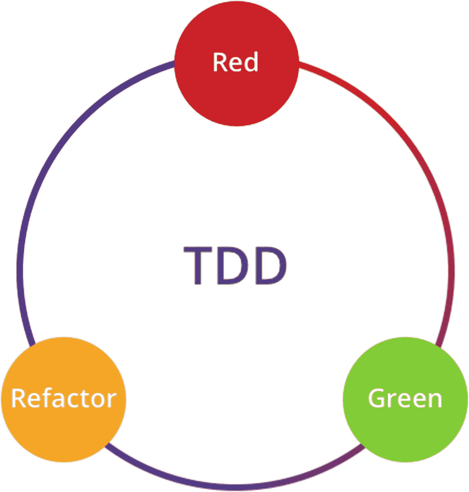
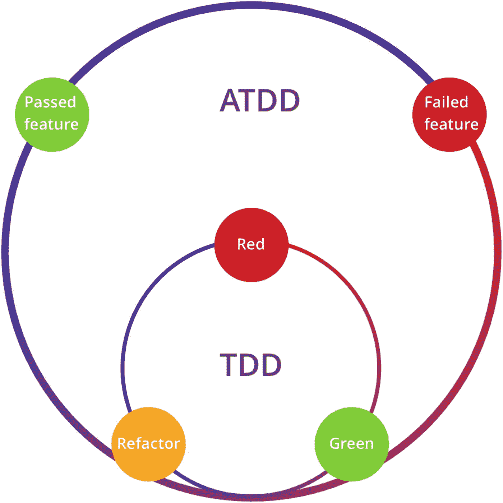
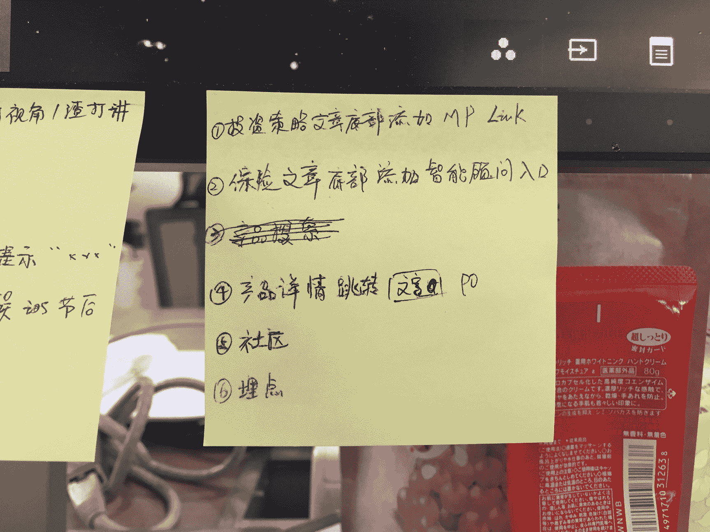

# 一、测试驱动开发的简短历史

我写这一章的意图不是复制和粘贴博客中的陈词滥调(下面的摘录除外),或者假装我是历史事件的一部分(比如敏捷宣言或极限编程活动),这些事件导致了测试驱动开发作为一种方法论的诞生——相信我，我还没那么老。

但我确实认为，给你一些我们在本书中将要讨论的内容的背景是有益的。我将谈论测试驱动开发(TDD)的基本工作流程和实践中的不同流派。如果您想直接进入代码，请随意操作，并导航到下一章。

## 测试驱动开发

TDD 是一种软件开发方法，通过编写测试来驱动应用的开发。它是由[肯特·贝克](https://www.kentbeck.com/)在 20 世纪 90 年代末开发/重新发现的，作为[极限编程](https://martinfowler.com/bliki/ExtremeProgramming.html)的一部分，并在他的名著[测试驱动开发:举例](https://www.amazon.com/dp/0321146530/ref%253Dcm_sw_r_cp_ep_dp_BJ0SAbBCVPGBV)中进行了充分的讨论。

肯特·贝克在他的书中描述了两条基本规则:

*   只有当你第一次有一个失败的自动化测试时，才编写新的代码

*   消除重复

这就引出了红绿重构的步骤，我们很快就会讨论到。这两个规则的最终目标是编写(正如 Ron Jeffries 所描述的)干净有效的代码。

### 红绿重构循环

有一个著名的图表解释了如何实际应用 TDD 它被称为红绿重构循环(图 1-1 )。



图 1-1

测试驱动开发

通常，这个图会有一个简短的描述，被表述为 TDD 的三个原则:

*   写一个测试，看它失败。

*   编写足够通过测试的代码。

*   如果检测到任何代码味道，则进行重构。

乍一看，这很容易理解。这里的问题——和许多原则一样——是它们对初学者不太适用。这些原则非常高级，很难应用，因为它们缺乏细节。例如，仅仅知道原理并不能帮助你回答这样的问题

*   我该如何编写我的第一个测试呢？

*   足够的代码实际上意味着什么？

*   我应该何时以及如何重构？

### 近距离观察红绿重构

图 1-2 仔细观察该过程。


图 1-2

测试驱动开发。来源:维基百科([`en . Wikipedia . org/wiki/Test-driven _ development`](https://en.wikipedia.org/wiki/Test-driven_development))

传统上，TDD 包含两个部分:快速实现和重构。实际上，快速实现的测试并不局限于单元测试。它们也可以是验收测试——这些是更高层次的测试，更关注商业价值和最终用户的旅程，而不太担心技术细节。首先实现验收测试可能是一个更好的主意。

从验收测试开始确保了正确的事情被优先考虑，并且当开发人员想要在后期清理和重构代码时，它为他们提供了信心。验收测试旨在从最终用户的角度来编写；通过验收测试可以确保代码满足业务需求。此外，它可以保护开发人员不在错误的假设或无效的需求上浪费时间。

极限编程中有一个叫做 YAGNI 的原则，否则你不会需要它。YAGNI 对于防止开发人员浪费他们宝贵的时间非常有用。开发人员非常善于围绕潜在的需求变化做出假设，基于这些假设，他们可能会提出一些不必要的抽象或优化，从而使代码更加通用或可重用。问题是这些假设很少被证明是正确的。YAGNI 强调，除非万不得已，否则你不应该这么做。

然而，在重构阶段，您可以实现那些抽象和优化。既然您已经有了测试覆盖，那么做清理就安全多了。诸如修改类名、提取方法或者将一些类提取到更高层次之类的小重构——任何有助于使代码更加通用和可靠的事情——现在变得更加安全和容易进行。

### TDD 的类型

TDD 是一个大而复杂的概念。它有许多变种和不同的学校，如 UTDD，BDD，ATDD，等等。传统上，TDD 意味着单元测试驱动开发或 UTDD。然而，我们在本书中讨论的 TDD 是 ATDD(验收测试驱动开发)，这是传统概念的扩展版本，强调从业务角度编写验收测试，并使用它来驱动生产代码。

在不同的层进行不同的测试可以确保我们总是在正确的轨道上，并且拥有正确的功能。

#### 验收测试驱动的开发

简而言之，ATDD 从最终用户的角度描述了软件的行为，关注于应用的商业价值，而不是实现细节。它不是验证在特定时间调用的函数是否具有正确的参数，而是确保当用户下订单时，他们能够按时收到订单。

我们可以将 ATDD 和 UTDD 合并成一个图，如图 1-3 所示。



图 1-3

验收测试驱动的开发

该图描述了以下步骤:

1.  写一个验收测试，看它失败。

2.  写一个单元测试，看它失败。

3.  编写代码使单元测试通过。

4.  重构代码。

5.  重复 2–4，直到验收测试通过。

当您仔细观察这个过程时，您会发现在开发阶段，验收测试可能会失败很长一段时间。反馈循环变得非常长，并且存在一个风险，即总是失败的测试意味着根本没有测试(保护)。开发人员可能会对实现中是否有缺陷，或者是否有任何实现感到困惑。

为了解决这个问题，您必须以相对较小的块来编写验收测试，一次测试需求的一小部分。或者，你可以使用假的它，直到你让它接近，就像我们将在本书中使用的那样。

步骤保持不变；只增加了一个额外的`fake`步骤:

1.  写一个失败的验收测试。

2.  让它以最直接的方式通过(一个伪实现)。

3.  基于任何代码味道(如硬编码数据、幻数等)进行重构。).

4.  基于新的需求添加一个新的测试(如果我们需要一个新的验收测试，回到步骤 1；否则，过程就像传统的 TDD 一样)。

请注意，在第二步中，您可以使用硬编码或静态 HTML 片段来使测试通过。乍一看，这似乎是多余的，但是在接下来的几章中你将会看到假的力量。

这种变化的好处是，当开发人员进行重构时，总会有一个通过的验收测试来保护您不破坏现有的业务逻辑。这种方法的缺点是，当开发人员没有足够的经验时，他们可能很难提出干净的代码设计——他们可能会以某种方式保持虚假(例如，幻数、缺乏抽象等)。).

#### 行为驱动开发

行为驱动开发是一种敏捷实践，它鼓励不同角色、开发人员、质量工程师、业务分析师，甚至软件项目中其他相关方之间的协作。

尽管 BDD 在某种程度上是关于软件开发应该如何被商业利益和技术洞察力管理的一般概念，但是 BDD 的实践涉及一些专门的工具。例如，特定于领域的语言(DSL)用于用自然语言编写测试，这些语言可以被非技术人员容易地理解，并且可以由代码解释并在后台执行。

例如，清单 1-1 展示了如何描述一个需求。

```jsx
Given there are `10` books in the library
When a user visits the homepage
Then they would see `10` books on the page
And each book would contain at least `name`, `author`, `price` and `rating`

Listing 1-1An example of BDD test case

```

### TDD 的先决条件

对于开发人员来说，TDD 有一个严格而关键的先决条件:如何检测代码气味，以及如何将它们重构为好的设计。例如，当您发现一些糟糕的代码(例如，缺乏抽象或幻数)并且不确定如何使其变得更好时，那么单靠 TDD 无法帮助您。即使您被迫使用传统的 TDD 工作流，除了低质量的代码之外，您可能还会遇到一些不可维护的测试。

#### 意识到代码味道和重构

在他的书*重构:改进现有代码的设计*中，马丁·福勒列出了 68 种重构。对于任何重视干净代码和高质量代码的人来说，我会推荐这本书作为强制性的先决条件。但是不用太担心；他提到的一些重构你可能在日常工作中已经用过了。

如前所述，典型的 TDD 工作流有三个步骤:

*   一个测试用例描述需求(规范)。

*   一些使测试通过的代码。

*   重构实现和测试。

一个常见的误解是测试代码是第二层的，或者不一定和生产代码一样重要。我认为它和产品代码一样重要。可维护的测试对于那些必须在以后做出改变或者添加新的测试的人来说是至关重要的。每次重构时，确保产品代码中所做的更改在测试代码中得到反映。

#### 先测试还是后测试

在您的日常工作流程中应用 TDD 最困难的部分是，您必须在开始编写任何生产代码之前编写测试。对于大多数开发人员来说，这不仅仅是与众不同和违反直觉，而且还极大地破坏了他们自己的工作方式。

然而，应用 TDD 的关键是您应该首先建立快速反馈机制。一旦有了，写测试是先还是后就没多大关系了。所谓快速反馈，我的意思是一个方法或者一个 if-else 分支可以用一种非常轻量级和轻松的方式进行测试。如果您在所有的功能都已经完成之后添加测试，您无论如何都不是在进行 TDD。因为你错过了必要的快速反馈循环——被视为开发中最重要的事情——你也可能错过了 TDD 承诺的好处。

通过实施快速反馈循环，TDD 确保您始终安全地处于正确的轨道上。这也给你足够的信心去做进一步的代码清理。适当的代码清理可以带来更好的代码设计。当然，清理不会自动进行；这需要额外的时间和努力。然而，TDD 是一种很好的机制，可以保护您在进行任何更改时不会破坏整个应用。

## 可以帮助实现 TDD 的技术

对于初学者来说，在应用 TDD 时可能会有挑战性，因为首先测试有时感觉是违反直觉的。实际上，抵制 TDD 有一些常见的原因:

*   对于简单的任务，他们不需要 TDD。

*   对于复杂的任务，建立 TDD 机制本身可能太困难了。

有很多教程和文章描述了你应该用来做 TDD 的技术，有些甚至涉及到在实现 TDD 之前如何分割任务。然而，这些教程中讨论的东西往往过于简单，很难直接应用到现实世界的项目中。例如，在 web 应用中，交互和相当一部分业务逻辑现在都存在于前端:UI。如何编写单元测试来驱动后端逻辑的传统技术已经过时了。

### 任务分配

TDD 需要的另一个关键技能是通过任务分配将一个大的需求分割成更小的块。我建议每个开发人员在开始编写他们的第一个测试之前就应该学会如何分解需求。

有一个经典笑话:“把一头大象放进冰箱需要几个步骤？”答案是三个步骤:

*   打开冰箱。

*   把大象放进去。

*   关上它。

当我们接下一项任务，当我们开始思考或讨论所有细节时，我们可能很快就会发现我们被堆积如山的技术细节所困，不知道从哪里开始。我们的大脑喜欢明确和具体的东西，讨厌抽象——不可见或隐含的东西。

通过利用一些简单的工具，我们可以让工作更容易被我们的大脑消化，任务分配就是这些工具之一。它可以帮助我们把一个大任务分成更小的任务，然后我们可以一个接一个地完成。

将一个相对较大的任务分成较小的部分，一个广泛使用的原则是投资。

#### 分离原则——投资

助记投资代表

*   自主的

*   可以商量

*   有价值的

*   可估计的

*   小的

*   可试验的

当将一个大的需求分解成更小的任务时，您需要确保每个任务都满足这些特性。首先，对于任何给定的任务，你应该使它尽可能的独立，这样它就可以和其他任务一起并行完成。可协商意味着它不应该固定为合同，任务的范围可以根据时间和成本的权衡而变化。为了有价值，每个任务必须提供一些商业价值；为之付出的努力应该是可衡量的，或者有一个估计。小意味着任务应该相对较小——大意味着更多未知的特性，可能会使估计不太准确。最后，testable 通过验证一些关键的检查点来确保我们知道 done 是什么样子的。

例如，当我们想为一个电子商务系统开发一个搜索功能时，我们可以使用 INVEST 原则来指导我们进行分析。搜索可以分为几个故事或任务:

*   用户可以按名称搜索产品。

*   用户可以通过品牌搜索产品。

*   用户可以通过名称和品牌搜索产品。

对于用户可以通过名称搜索产品，我们可以继续使用 **INVEST** 从开发人员的角度将一个故事分成几个任务:

*   在内存中维护搜索结果(ArrayList + Java Stream API)。

*   区分大小写的支持。

*   通配符(正则表达式)支持。

我们甚至可以继续使用相同的原则来进一步拆分每个项目:

*   编写验收测试。

*   编写代码使测试通过。

*   重构。

*   编写一个单元测试。

*   编写代码使测试通过。

*   重构。

*   等等。

这将引导我们完成一个定义明确的任务，并允许我们清楚地验证每一步。

#### 带便利贴的待办事项列表

通常，我们可以在第二轮拆分时停止，因为红绿重构在任务分配方面过于详细。过于细化的任务意味着更多的管理工作(跟踪这些任务需要更多的精力)。为了让任务可见，我们可以把它写在便利贴上，并在完成后做一个简单的记号(图 1-4 )。



图 1-4

任务分配

通过使用这个简单的工具，您可以专注于您将要做的事情，并在您想要向其他团队成员更新进度时(例如，在每日站立会议中)使进度更加准确。通过说一项任务完成了 50%,清单上的一半项目在你之前做的清单上被勾掉了。

## 摘要

我们浏览了测试金字塔和敏捷测试象限，并介绍了验收测试驱动的开发，作为我们通过这本书编写代码的方式。在做 ATDD 时，我们将继续做经典的红绿重构循环。

重构依赖于识别代码气味的感觉和经验。一旦你发现了代码的味道，你就可以应用相应的重构技术。然后我们可能会实现可维护的、人类可读的、可扩展的、干净的代码。

TDD 总是伴随着另一个强大的实践——任务。你可以使用投资原则来帮助你把一个大任务分成几个小部分。适当拆分后，可以逐步完善基础版本，迭代完成大任务。

在下一章，我们将介绍一个具体的例子来演示如何一步一步地应用 TDD。除了这个例子，我们还将介绍实现 TDD 所需的基本技能，包括如何使用 jest 测试框架以及如何使用真实的例子来完成任务。

## 进一步阅读

围绕 TDD 有广泛的争论——时不时地，你会看到人们在争论我们是否需要 TDD 或者实现 TDD 的正确方法。我发现下面的文章对理解这些论点很有帮助:

*   鲍勃大叔[有一篇很棒的文章](https://blog.cleancoder.com/uncle-bob/2016/11/10/TDD-Doesnt-work.html)讨论`test-first`或`test-last`临近。如果你还没有读过，我强烈建议你读一读。

*   关于`TDD`最新最著名的争论来自于`David Heinemeier Hansson (DHH)`(*Ruby on Rails*的作者)`Kent Beck,`和`Martin Fowler`；你可以在这里找到更多信息。

我也强烈推荐阅读这些书籍，为实施 TDD 打下坚实的基础。即使你决定不使用 TDD，那些书仍然被强烈推荐。

*   罗伯特·c·马丁的《干净的代码:敏捷软件工艺手册》

*   马丁·福勒的《重构:改进现有代码的设计》