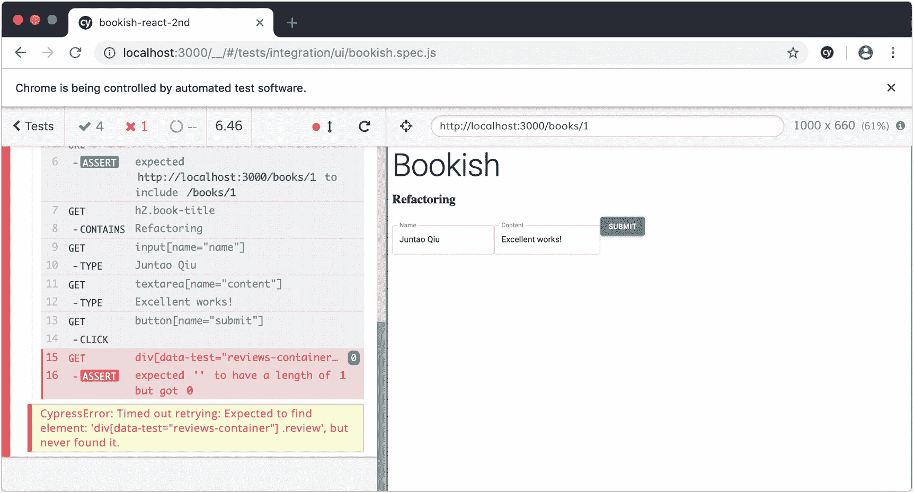
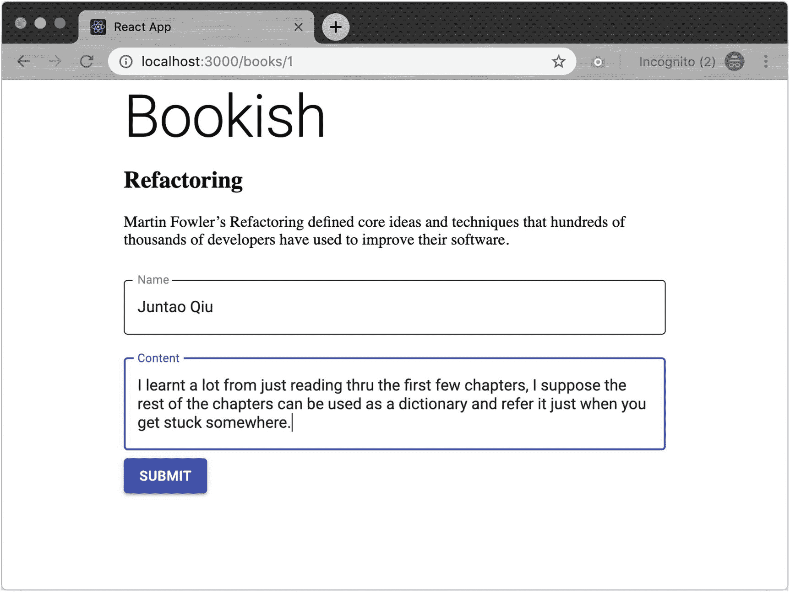
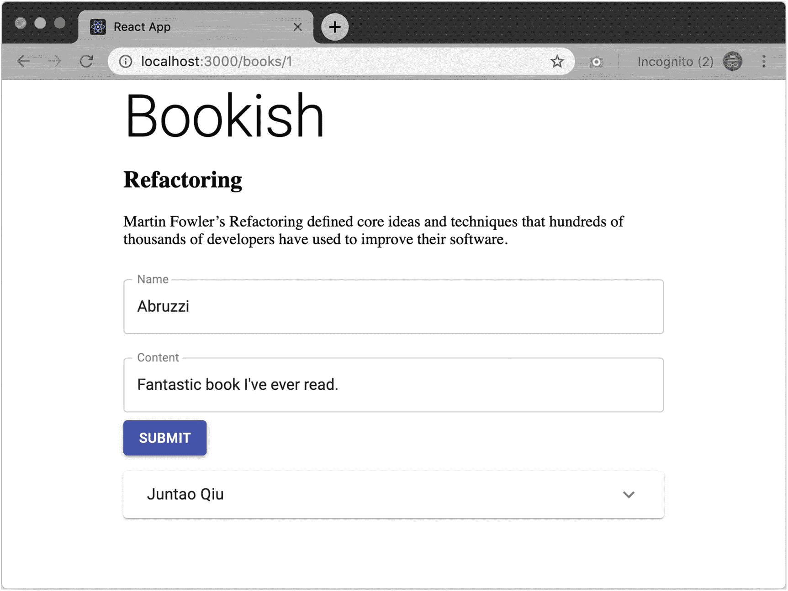

# 九、管理书评

在任何现实世界的项目中，您通常都必须处理某种类型的资源管理。广告管理系统通过在某种业务限制下创建、修改或删除项目来管理`schedule`或`campaign`。人力资源系统将通过创建(当公司有新员工时)、修改(被提升)和删除(退休)来帮助人力资源管理`employee records`。如果你观察这些系统试图解决的问题，你会发现一个相似的模式:它们都在一些资源上应用`CRUD`(创建、读取、更新、删除)操作。

然而，并不是所有的系统都必须包括所有的四种操作；对于一个关键系统，不会删除任何数据——程序员只会在记录中设置一个标志，将它们标记为已删除。记录仍然在那里，但是用户不能再从 GUI 中检索它们。

在这一章中，我们将学习如何通过扩展我们的应用`bookish`，在`review`资源上实现一组经典的`CRUD`操作，当然也应用了`ATDD`。

## 业务需求

在图书详细信息页面中，有一些关于图书的关键信息，包括标题、描述和封面图片。然而，我们想要一些可以帮助最终用户找到更多关于这本书的东西——比如来自其他用户的`reviews`。一般来说，一本书可以有不止一个`review`。对这本书有强烈意见的读者会提供评论。评论可以是正面的，也可以是负面的。有时，也有一个评级与审查。

让我们从没有评论的最简单的场景开始。我们需要渲染一个空容器——我们称之为`reviews-container`。

### 从一个空列表开始

```jsx
import React from 'react';

import ReviewList from './ReviewList';
import { render } from '@testing-library/react';
import toBeInTheDocument from '@testing-library/jest-dom';

describe('ReviewList', () => {
  it('renders an empty list', () => {
    const props = {
      reviews: []
    };

    const {container} = render(<ReviewList {...props}/>);
    const reviews = container.querySelector('[data-test="reviews-container"]');

    expect(reviews).toBeInTheDocument();
  })
});

```

通过测试应该很简单:

```jsx
import React from 'react';

const ReviewList = () => {
  return (<div data-test='reviews-container'></div>)
};

export default ReviewList;

```

### 呈现静态列表

我们的第二个测试案例可能涉及一些模拟数据:

```jsx
  it('renders a list when data is passed', () => {
    const props = {
      reviews: [
        { name: 'Juntao', date: '2018/06/21', content: 'Excellent work, really impressed by your efforts'},
        { name: 'Abruzzi', date: '2018/06/22', content: 'What a great book'}
      ]
    };

    const {container} = render(<ReviewList {...props}/>);
    const reviews = container.querySelectorAll('[data-test="reviews-container"] .review');

    expect(reviews.length).toBe(2);
  })

```

在这里，我们演示了如何从外部使用组件(传入一组评论，每个评论都有用于`name date`和`content`的字段)。其他程序员有可能不查看我们的实现就重用我们的组件。

一个简单的`map`应该对我们有用。由于地图要求`key`属性具有惟一的身份，所以让我们将`name`和`date`组合起来形成一个键；在下一节中，我们将在与后端 API 集成时创建一个`id`。

```jsx
import React from 'react';

const ReviewList = ({reviews}) => {
  return (<div data-test='reviews-container'>
    {
      reviews.map(review =>
      <div key={review.name + review.date} className='review'>{review.name}</div>)
    }
  </div>)
};

export default ReviewList;

```

我们需要确保内容正确呈现:

```jsx
+
+    expect(reviews[0].innerHTML).toEqual('Juntao');

```

### 使用检查组件

对于我们的第一次集成，让我们将`ReviewList`放在`BookDetail`中。您现在可能已经知道，我们将首先实现测试。

我们可以在`BookDetail.test.js`中添加一个新的测试用例，因为我们想要验证 BookDetail 上是否有一个`ReviewList`。

```jsx
  it('renders reviews', () => {
    const props = {
      book: {
        name: 'Refactoring',
        description: 'Martin Fowler’s Refactoring defined core ideas and techniques that hundreds of thousands of developers have used to improve their software.',
        reviews: [
          { name: 'Juntao', date: '2018/06/21', content: 'Excellent work, really impressed by your efforts'}
        ]
      }
    };

    const {container} = render(<BookDetail {...props} />);

    const reviews = container.querySelectorAll('[data-test="reviews-container"] .review');
    expect(reviews.length).toBe(1);
    expect(reviews[0].innerHTML).toEqual('Juntao');
  });

```

注意这里的`props`包含一个`reviews`属性。对于实现，我们引入了`ReviewList`组件，由于组件化，就是这样:

```jsx
import React from 'react';
import ReviewList from './ReviewList';

const BookDetail = ({book}) => {
  return (<div className='detail'>
    <h2 className='book-title'>{book.name}</h2>
    <p className='book-description'>{book.description}</p>
    {book.reviews && <ReviewList reviews={book.reviews}/>}
  </div>)
}

export default BookDetail;

```

### 填写书评表格

我们可以生成一些静态数据来显示在 BookDetail 组件中，但是如果我们能够显示一些来自最终用户的真实数据会更好。我们需要一个简单的形式让用户交流他们对这本书的观点。现在，我们可以提供两个输入框和一个提交按钮。第一个输入是用户名(或电子邮件地址)，第二个输入(文本区域)是评论内容。

我们可以在`BookDetail`组件中添加一个新的测试用例:

```jsx
  it('renders review form', () => {
    const props = {
      book: {
        name: 'Refactoring',
        description: 'Martin Fowler’s Refactoring defined core ideas and techniques that hundreds of thousands of developers have used to improve their software.'
      }
    };

    const {container} = render(<BookDetail {...props} />);

    const form = container.querySelector('form');
    const nameInput = container.querySelector('input[name="name"]');
    const contentTextArea = container.querySelector('textarea[name="content"]');
    const submitButton = container.querySelector('button[name="submit"]');

    expect(form).toBeInTheDocument();
    expect(nameInput).toBeInTheDocument();
    expect(contentTextArea).toBeInTheDocument();
    expect(submitButton).toBeInTheDocument();
  });

```

确保`<form>`显示在描述部分的下方和`reviews`的上方。`TextField`和`Button`组件都可以从 material-ui 导入；

```jsx
<form noValidate autoComplete='off'>
  <TextField
    label='Name'
    name='name'
    margin='normal'
    variant='outlined'
  />

  <TextField
    name='content'
    label='Content'
    margin='normal'
    variant='outlined'
    multiline
    rowsMax='4'
  />

  <Button variant='contained' color='primary' name='submit'>
    Submit
  </Button>
</form>

```

现在，我们必须将它连接到`state`:

```jsx
+ const [name, setName] = useState('');
+ const [content, setContent] = useState('');

  return (<div className='detail'>
    <h2 className='book-title'>{book.name}</h2>
    <p className='book-description'>{book.description}</p>

    <form noValidate autoComplete='off'>
      <TextField
        label='Name'
        name='name'
        margin='normal'
        variant='outlined'
+       value={name}
+       onChange={e => setName(e.target.value)}
      />

      <TextField
        name='content'
        label='Content'
        margin='normal'
        variant='outlined'
        multiline
        rowsMax='4'
+       value={content}
+       onChange={e => setContent(e.target.value)}
      />

      <Button variant='contained' color='primary' name='submit'>
        Submit
      </Button>
    </form>

    {book.reviews && <ReviewList reviews={book.reviews}/>}
  </div>)
}

```

## 端到端测试

您可能已经注意到，当我们处理这个函数时，我们是从 ReviewList 组件的单元测试开始的。这是因为目前所有的变化都是静态的——在这一点上没有行为上的相互作用。在这种情况下，您可以从端到端测试开始——从上到下——或者从下到上。我更喜欢从组件本身开始，因为它能更快地提供反馈，帮助我们推动实现。

端到端测试可以这样描述:转到详细页面，找到输入字段，填写一些内容，然后单击 submit 按钮。最后，我们希望提交的内容将显示在页面上:

```jsx
  it('Write a review for a book', () => {
    gotoNthBookInTheList(0);
    checkBookDetail('Refactoring');

    cy.get('input[name="name"]').type('Juntao Qiu');
    cy.get('textarea[name="content"]').type('Excellent work!');
    cy.get('button[name="submit"]').click();

    cy.get('div[data-test="reviews-container"] .review').should('have.length', 1);
  });

```

点击后测试将失败(图 9-1 )，因为它既不发送数据到服务器，也不接收响应和重新渲染。



图 9-1

尝试提交评论

为了让测试通过，我们需要回到`redux`并定义一个新类型的`action`。

### Redux 中的操作

我们已经知道，所有的网络活动和其他杂务都由`redux`中的`action`处理。所以让我们首先定义一个动作来创建一个`review`:

```jsx
    it('Saves a review for a book', () => {
      const review = {
        name: 'Juntao Qiu',
        content: 'Excellent work!'
      }
      axios.post = jest.fn().mockImplementation(() => Promise.resolve({}))

      const store = mockStore({ books: [], term: '' })

      return store.dispatch(saveReview(1, review)).then(() => {
        expect(axios.post).toHaveBeenCalledWith('http://localhost:8080/books/1', review)
      })
    })

```

我们假设当我们将一些数据`POST`到端点`http://localhost:8080/books/1`时，将为 id 为`1`的书创建一个新的评论:

```jsx
{
  "name": "Juntao Qiu",
  "content": "Excellent work!"
}

```

现在，使用`axios`创建异步动作对我们来说应该很容易:

```jsx
export const saveReview = (id, review) => {
  return (dispatch) => {
    dispatch({type: types.SAVE_BOOK_REVIEW_PENDING})
    return axios.post(`http://localhost:8080/books/${id}`, review).then((res) => {
      dispatch({type: types.SAVE_BOOK_REVIEW_SUCCESS, payload: res.data})
    }).catch((err) => {
      dispatch({type: types.SAVE_BOOK_REVIEW_FAILED, err: err.message})
    })
  }
}

```

然后，我们在表单中的`BookDetail`组件中添加一个`onClick`事件处理程序:

```jsx
  <Button
    variant='contained'
    color='primary'
    name='submit'
    onClick={() => dispatch(actions.saveReview(book.id, {name, content}))}
  >
    Submit
  </Button>

```

因为`useDispatch`只能在`Provider`中使用，所以`BookDetail`的单元测试现在失败了。我们可以通过以下方式解决这个问题

```jsx
import store from '../../store';
import {Provider} from 'react-redux';

const renderWithProvider = (component) => {
  return {...render(<Provider store={store}>
        {component}
    </Provider>)}
};

```

在使用`render`的地方使用`renderWithProvider`:

```jsx
const { container } = renderWithProvider(<BookDetail {...props} />);

```

### JSON-服务器定制

我们一直在使用`json-server`来为我们简化后端 API 工作。我们需要对它进行更多的定制，以适应我们的新要求。我们期望`review`是一本书的子资源，这允许我们通过请求`/books/1/reviews`来访问属于某本书的所有评论。

此外，我们希望`/books/1`在响应中携带所有的`reviews`作为嵌入资源。这将使图书详细信息页面的呈现变得简单方便。为了做到这一点，我们需要像这样定义`json-server`中的`route`:

```jsx
server.use(jsonServer.rewriter({
  '/books/:id':  '/books/:id?_embed=reviews'
}))

server.use(router)

```

然后，无论何时访问`/books/1`，它都会返回所有评论和回复。

像这样的请求

```jsx
curl http://localhost:8080/books/1

```

会得到这样的回应

```jsx
{
  "name": "Refactoring",
  "id": 1,
  "description": "Refactoring",
  "reviews": [
    {
      "name": "Juntao",
      "content": "Very great book",
      "bookId": 1,
      "id": 1
    }
  ]
}

```

干得好！同样，当我们将一些数据`POST`到`http://localhost:8080/books/1/reviews`时，它会在 id 为`1`的书下创建一个`review`。

现在，我们可以通过表单创建评论。请注意，存根服务器返回 201，表示审查已被接受(图 9-2 )。


图 9-2

提交第一本书的评论

当然，我们需要在提交后刷新页面，以查看新创建的评论:

```jsx
export const saveReview = (id, review) => {
  const config = {
    headers: { 'Content-Type': 'application/json' }
  }

  return (dispatch) => {
    dispatch({type: types.SAVE_BOOK_REVIEW_PENDING})
    return axios.post(`http://localhost:8080/books/${id}/reviews`, JSON.stringify(review), config).then((res) => {
      dispatch({type: types.SAVE_BOOK_REVIEW_SUCCESS, payload: res.data})
      dispatch(fetchABook(id));
    }).catch((err) => {
      dispatch({type: types.SAVE_BOOK_REVIEW_FAILED, err: err.message})
    })
  }
}

```

注意这里我们在成功回调中添加了`dispatch (fetchABook(id))`。它为我们刷新了`reviews`。然而，当您重新运行测试时，`review`的创建将会失败，因为我们没有在测试用例执行后进行清理。

为了解决这个问题(重复 id)，首先，我们需要在`server.js`中定义一个 map:

```jsx
const relations = {
  'books': 'reviews'
}

```

和一个生成`embed`定义的函数，所以由给定的`relations`动态生成一个`route`:

```jsx
const buildRewrite = (relations) => {
  return _.reduce(relations, (sum, embed, resources) => {
    sum[`/${resources}/:id`] = `/${resources}/:id?_embed=${embed}`
    return sum;
  }, {})
}

server.use(jsonServer.rewriter(buildRewrite(relations)))

```

现在，我们可以通过在`DELETE`中增加一个额外的步骤来清理嵌入式资源。首先，我们检查需要删除的资源是否有任何`embedded`资源。如果有，我们会把它们和资源一起清理掉。

```jsx
server.use((req, res, next) => {
  if (req.method === 'DELETE' && req.query['_cleanup']) {
    const db = router.db
    db.set(req.entity, []).write()

    if (relations[req.entity]) {
      db.set(relations[req.entity], []).write()
    }

    res.sendStatus(204)
  } else {
    next()
  }
})

```

然后，我们可以使用`afterEach`来完成所有的清理工作，就像之前一样:

```jsx
  afterEach(() => {
    return axios.delete('http://localhost:8080/books?_cleanup=true').catch(err => err)
  })

```

现在，我们不必担心一个失败的测试会导致另一个测试的问题。

### 重构

我们现在已经完成了`Review`的创建和检索。我们的测试覆盖率仍然很高，这很好。有了这些测试，我们就可以自信无畏地重构了。对于`BookDetail`组件，`form`是独立的，应该有自己的文件:

```jsx
const ReviewForm = ({id}) => {
  const [name, setName] = useState('');
  const [content, setContent] = useState('');

  const dispatch = useDispatch();

  return (<form noValidate autoComplete='off'>
    <TextField
      label='Name'
      name='name'
      margin='normal'
      variant='outlined'
      value={name}
      onChange={e => setName(e.target.value)}
    />

    <TextField
      name='content'
      label='Content'
      margin='normal'
      variant='outlined'
      multiline
      rowsMax='4'
      value={content}
      onChange={e => setContent(e.target.value)}
    />

    <Button variant='contained' color='primary' name='submit' onClick={() => dispatch(actions.saveReview(id, {name, content}))}>
      Submit
    </Button>
  </form>)
}

export default ReviewForm;

```

提取之后，`BookDetail`就干净多了:

```jsx
const BookDetail = ({book}) => {
  return (<div className='detail'>
    <h2 className='book-title'>{book.name}</h2>
    <p className='book-description'>{book.description}</p>

    <ReviewForm id={book.id} />

    {book.reviews && <ReviewList reviews={book.reviews}/>}
  </div>)
}

```

而对于`cypress`中的功能测试，我们可以提取一些辅助函数来简化测试用例:

```jsx
  it('Write a review for a book', () => {
    gotoNthBookInTheList(0);
    checkBookDetail();
    composeReview('Juntao Qiu', 'Excellent work!');
    checkReview();
  });

```

功能`composeReview`和`checkReview`定义如下

```jsx
export const composeReview = (name, content) => {
  cy.get('input[name="name"]').type(name);
  cy.get('textarea[name="content"]').type(content);
  cy.get('button[name="submit"]').click();
};

export const checkReview = () => {
  cy.get('div[data-test="reviews-container"] .review').should('have.length', 1);
}

```

现在，审查表单应该类似于图 9-3 。



图 9-3

评论页面

## 添加更多字段

如果你仔细看看这篇评论，你会发现遗漏了一些重要信息:用户名和创建时间。我们需要完成这些字段:

```jsx
     expect(reviews.length).toBe(2);

-    expect(reviews[0].innerHTML).toEqual('Juntao');
+    expect(reviews[0].querySelector('.name').innerHTML).toEqual('Juntao');
+    expect(reviews[0].querySelector('.date').innerHTML).toEqual('2018/06/21');
+    expect(reviews[0].querySelector('.content').innerHTML).toEqual('Excellent work, really impressed by your efforts');
   })

```

实施应该毫不费力:

```jsx
   return (<div data-test='reviews-container'>
     {
       reviews.map((review, index) =>
-      <div key={index} className='review'>{review.name}</div>)
+      <div key={index} className='review'>
+        <span className='name'>{review.name}</span>
+        <span className='date'>{review.date}</span>
+        <p className='content'>{review.content}</p>
+      </div>)
     }
   </div>)

```

随着`map`中的代码不断增长，我们可以将其提取到一个单独的文件—`Review`:

```jsx
import React from 'react';

const Review = ({review}) => (<div className='review'>
  <span className='name'>{review.name}</span>
  <span className='date'>{review.date}</span>
  <p className='content'>{review.content}</p>
</div>);

export default Review;

```

并将其作为一个纯粹的`presentational`组件:

```jsx
import Review from './Review';

const ReviewList = ({reviews = []}) => {
  return (<div data-test='reviews-container'>
    {
      reviews.map((review, index) => <Review key={index} review={review}/>)
    }
  </div>)
};

```

由于所有呈现审查的逻辑都被移到了它自己的组件中，我们也可以移动相应的测试。

```jsx
import Review from './Review';

describe('Review', () => {
  it('renders', () => {
    const props = {
      review: {
        name: 'Juntao',
        date: '2018/06/21',
        content: 'Excellent work, really impressed by your efforts'
      },
    };

    const {container} = render(<Review {...props}/>);
    const review = container.querySelector('.review');

    expect(review.querySelector('.name').innerHTML).toEqual('Juntao');
    expect(review.querySelector('.date').innerHTML).toEqual('2018/06/21');
    expect(review.querySelector('.content').innerHTML)
      .toEqual('Excellent work, really impressed by your efforts');
  })
});

```

这样，我们测试不同的数据变量就容易多了。例如，如果明天产品所有者决定他们想要以`relative`的方式显示日期，例如`Posted 5 mins ago`或`Posted yesterday`，而不是`absolute`日期，我们根本不需要触摸`ReviewList`。

所有测试都顺利通过——太棒了！我们的代码更简洁，更有凝聚力，责任更明确。此外，我们的高测试覆盖率意味着我们在重构时不必担心破坏现有的功能。

## 审阅编辑

`Review`组件现在提供了基本的表示。然而，在现实世界中，用户可能会在他们的评论中留下一个错别字，或者完全重写内容。我们需要允许用户编辑他们已经发布的`Review`。

我们需要添加一个`Edit`按钮，点击后会变成一个`Submit`按钮(等待用户提交)。当用户点击`Submit`时，文本再次变成`Edit`。所以第一个测试可能是

```jsx
  it('editing', () => {
    const props = {
      review: {
        name: 'Juntao',
        date: '2018/06/21',
        content: 'Excellent work, really impressed by your efforts'
      },
    };

    const {getByText} = render(<Review {...props}/>);
    const button = getByText('Edit');

    expect(button.innerHTML).toEqual('Edit');

    userEvent.click(button);

    expect(button.innerHTML).toEqual('Submit');
  });

```

通过使用`userEvent.click`，我们可以模拟`Edit`按钮上的点击事件，并验证按钮上的文本变化。我们可以通过在组件中引入`state`来实现这一点:

```jsx
const [editing, setEditing] = useState(false);

```

我们需要做的就是切换`editing`的状态。对于渲染，我们可以通过`editing`状态来决定显示哪个文本，如下所示:

```jsx
<Button variant='contained' color='primary' name='submit' onClick={() => setEditing(!editing)}>
  {!editing ? 'Edit' : 'Submit'}
</Button>

```

我们希望有一个当用户点击`Edit`时显示的`textarea`，并将所有评论内容复制到`textarea`中进行编辑:

```jsx
  it('copy content to a textarea for editing', () => {
    const props = {
      review: {
        name: 'Juntao',
        date: '2018/06/21',
        content: 'Excellent work, really impressed by your efforts'
      },
    };

    const {getByText, container} = render(<Review {...props}/>);
    const button = getByText('Edit');
    const content = container.querySelector('p.content');
    const editingContent = container.querySelector('textarea[name="content"]');

    expect(content).toBeInTheDocument();
    expect(container.querySelector('textarea[name="content"]')).not.toBeInTheDocument();

    userEvent.click(button);

    expect(content).not.toBeInTheDocument();

    expect(container.querySelector('textarea[name="content"]')).toBeInTheDocument();
    expect(container.querySelector('textarea[name="content"]').innerHTML)
      .toEqual('Excellent work, really impressed by your efforts');
  });
})

```

为了实现这一点，我们还必须维护`state`中的内容:

```jsx
const [content, setContent] = useState(review.content);

```

并根据`editing`状态渲染`textarea`和`static text`:

```jsx
    {!editing ? <p className='content'>{review.content}</p> : (<TextField
      name='content'
      label='Content'
      margin='normal'
      variant='outlined'
      multiline
      rowsMax='4'
      value={content}
      onChange={e => setContent(e.target.value)}
    />)}

```

现在，评审有两种不同的状态:`viewing`和`editing`，可以通过点击`.edit`按钮进行切换。为了将实际内容保存到后端，我们需要定义一个`action`。

### 保存审核-行动

就像创建评论的过程一样，为了保存评论，我们需要向后端发送一个请求。好消息是`json-server`已经提供了这个功能。我们向`http://localhost:8080/reviews/{id}`发送`PUT`请求来更新评论。当然，我们必须首先为 redux 操作编写一个测试:

```jsx
    it('Update a review for a book', () => {
      const config = {
        headers: { 'Content-Type': 'application/json' }
      }

      const review = {
        name: 'Juntao Qiu',
        content: 'Excellent work!'
      }

      axios.put = jest.fn().mockImplementation(() => Promise.resolve({}))

      const store = mockStore({list: { books: [], term: '' }})

      return store.dispatch(updateReview(1, review)).then(() => {
        expect(axios.put).toHaveBeenCalledWith('http://localhost:8080/reviews/1', JSON.stringify(review), config)
      })
    })

```

注意，我们在这里嘲讽了`axios.put`。一般来说，当您更新一些现有的资源时，您使用`PUT`作为 HTTP 动词。

```jsx
export const updateReview = (id, review) => {
  const config = {
    headers: { 'Content-Type': 'application/json' }
  }

  return (dispatch) => {
    dispatch({type: types.SAVE_BOOK_REVIEW_PENDING})
    return axios.put(`http://localhost:8080/reviews/${id}`, JSON.stringify(review), config).then((res) => {
      dispatch({type: types.SAVE_BOOK_REVIEW_SUCCESS, payload: res.data})
    }).catch((err) => {
      dispatch({type: types.SAVE_BOOK_REVIEW_FAILED, err: err.message})
    })
  }
}

```

注意，我们在这里重用了`SAVE_BOOK_REVIEW`类型。

### 综合

既然编辑评论的所有部分都准备好了，就该把它们放在一起了。我们需要确保当点击`Submit`时，调用`save action`:

```jsx
  //...
  const props = {
    bookId: 123,
    review: {
      name: 'Juntao',
      date: '2018/06/21',
      content: 'Excellent work, really impressed by your efforts'
    },
  };

  const {getByText, container} = renderWithProvider(<Review {...props}/>);

  userEvent.click(getByText('Edit'));

  const content = container.querySelector('textarea[name="content"]');
  userEvent.type(content, 'Fantastic work');

  userEvent.click(getByText('Submit'));
  //...

```

现在，剩下的唯一问题是，无论何时单击按钮，我们如何验证调用了正确的操作。`jest`提供了设置`mock`或`stub`的各种方式。在我们这里的例子中，我们可以`import`真实的动作，然后`override`它的行为，所以我们不发送真实的网络请求:

```jsx
import * as actions from '../redux/actions/actions';

const fakeUpdateReview = () => {
  return () => {
    return Promise.resolve({})
  }
};

jest.spyOn(actions, 'updateReview').mockImplementation(() => fakeUpdateReview);

```

最后，我们可以验证已经调用了`updateReview`:

```jsx
  it('send requests', async () => {
    const fakeUpdateReview = () => {
      return () => {
        return Promise.resolve({})
      }
    };

    jest.spyOn(actions, 'updateReview').mockImplementation(() => fakeUpdateReview);

    //...
    const {getByText, container} = renderWithProvider(<Review {...props}/>);

    userEvent.click(getByText('Edit'));

    const content = container.querySelector('textarea[name="content"]');
    userEvent.type(content, 'Fantastic work');

    userEvent.click(getByText('Submit'));

    expect(actions.updateReview).toHaveBeenCalledWith(123, {content: 'Fantastic work'});
  })

```

因为`updateReview`的正确性已经在`action`测试中得到验证，所以我们可以对它的功能充满信心。现在让我们尝试编写实现:

```jsx
+import {useDispatch} from 'react-redux';

+import * as actions from '../redux/actions/actions';

+const Review = ({review}) => {
   const [editing, setEditing] = useState(false);
   const [content, setContent] = useState(review.content);

+  const dispatch = useDispatch();
+
+  const clickHandler = () => {
+    if(editing) {
+      dispatch(actions.updateReview(review.id, {content}))
+    }
+
+    setEditing(!editing);
+  };
+
   return (<div className='review'>

```

我们用`useDispatch` React 钩子从`react-redux`生成一个`dispatch`，然后用它触发一个真实的`action`(图 9-4 )。



图 9-4

Review page 现在可以很好地使用 redux 了

### 摘要

太棒了，我们已经完成了整个`Review`部分。这是一个相对较大的组件，有一个`Reviews`列表，在每个部分，我们允许用户添加一个新的`Review`，以及编辑现有的。

在这个过程中，我们尝试了一种不同的方法来处理`TDD`——首先编写`unit tests`来驱逐一个分离的`Component`,然后是分离的`actions`,最后是一个集成测试，它可以确保我们将它们连接在一起。